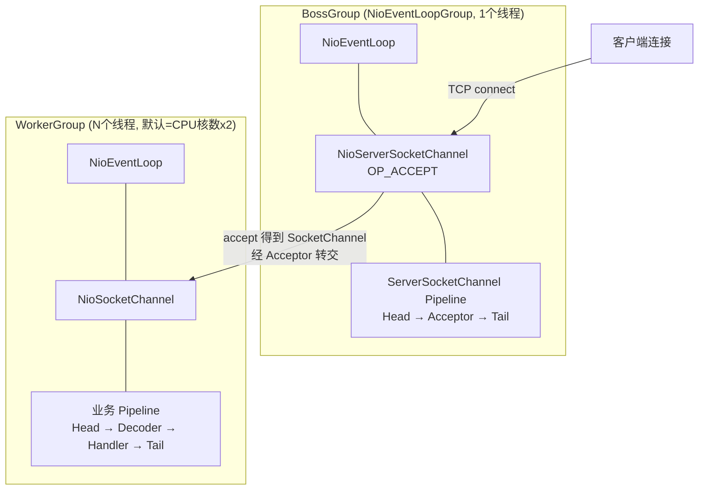
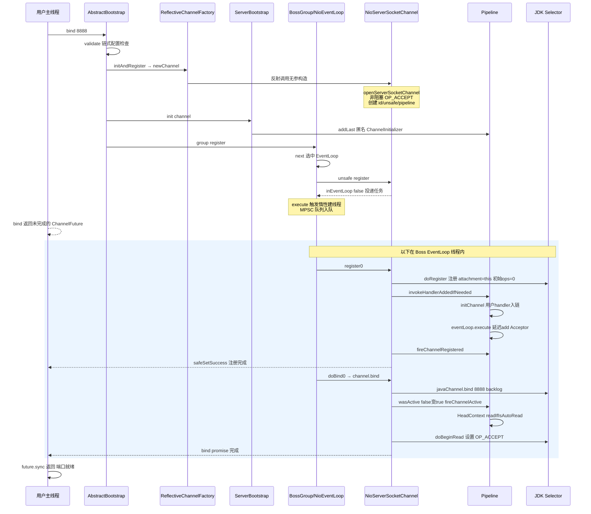
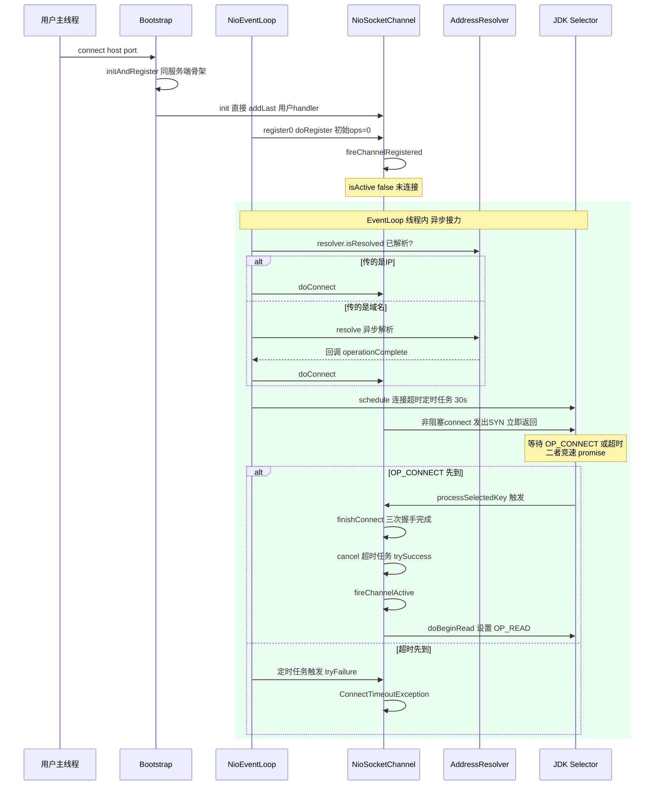
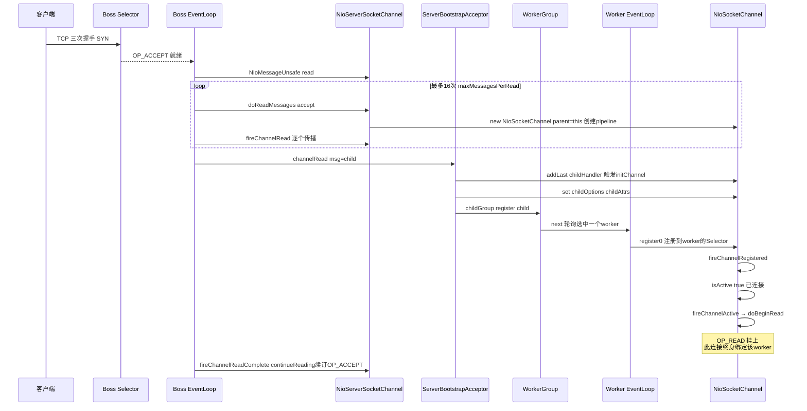
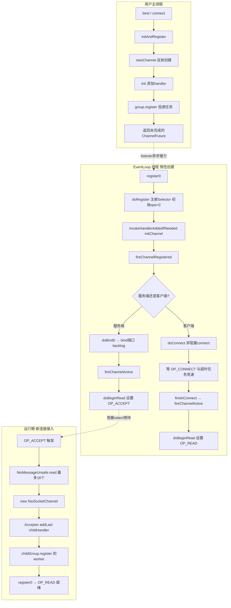

# Bootstrap 启动全流程源码剖析

> 基于 **Netty 4.1.65** 源码（`bootstrap/`、`transport/` 模块）
> 本篇是系列的收官篇：把前 7 篇的所有组件——EventLoop、Pipeline、Future、Unsafe、Channel——串成一条完整的启动链路。

---

## 0. 涉及的核心类

| 类 | 文件 | 职责 |
|---|---|---|
| `AbstractBootstrap` | `bootstrap/AbstractBootstrap.java` | 启动器骨架：initAndRegister / doBind0 |
| `ServerBootstrap` | `bootstrap/ServerBootstrap.java` | 服务端启动器：init()、ServerBootstrapAcceptor |
| `Bootstrap` | `bootstrap/Bootstrap.java` | 客户端启动器：init()、doResolveAndConnect |
| `ReflectiveChannelFactory` | `channel/ReflectiveChannelFactory.java` | 反射创建 Channel 实例 |
| `AbstractChannel.AbstractUnsafe` | `channel/AbstractChannel.java` | register / bind / connect 的真正执行者 |
| `AbstractNioChannel` | `channel/nio/AbstractNioChannel.java` | Java NIO Channel 的封装、OP_ACCEPT/OP_CONNECT |
| `NioServerSocketChannel` / `NioSocketChannel` | `channel/nio/` | 服务端/客户端具体 Channel |
| `SingleThreadEventLoop` | `channel/SingleThreadEventLoop.java` | register 入口 |

---

## 1. 前置知识：全系列拼图

启动流程会一次性踩到前面 7 篇的所有知识点：

- **04 篇 NioEventLoop**：EventLoop 的线程是**惰性创建**的——首次 `execute()` 才 `startThread()`；任务队列是 MPSC。
- **05 篇 Pipeline**：`register` 过程中 handler 尚未添加时，`pipeline.callHandlerCallbackLater()` 会把 `handlerAdded` 回调**延迟缓存**，等 handler 真正 add 后再触发。
- **03 篇 Future/Promise**：`register` 返回的 `ChannelFuture` 如何被 `bind` 等待——`await()` 的死锁检测（checkDeadLock）在 EventLoop 线程内等待时会直接抛异常。
- **01 篇 FastThreadLocal**：boss/worker 线程都是 `FastThreadLocalThread`。

---

## 2. 整体架构：双 Group 接力模型

Netty 服务端的标准启动代码：

```java
EventLoopGroup bossGroup = new NioEventLoopGroup(1);
EventLoopGroup workerGroup = new NioEventLoopGroup();
ServerBootstrap b = new ServerBootstrap();
b.group(bossGroup, workerGroup)
 .channel(NioServerSocketChannel.class)
 .option(SO_BACKLOG, 1024)
 .childHandler(new ChannelInitializer<SocketChannel>() { ... });
ChannelFuture f = b.bind(8888).sync();
```

架构图：



**核心分工**：Boss 只干一件事——接受新连接并把 `SocketChannel` 移交给 Worker；Worker 负责该连接后续所有的读写事件。连接一旦分配给某个 Worker，终生绑定（串行化，无锁）。

---

## 3. ServerBootstrap.bind 全流程

### 3.1 启动器字段与链式配置

`AbstractBootstrap`（:59-68）：

```java
volatile EventLoopGroup group;
volatile ChannelFactory<? extends C> channelFactory;   // channel(Class) 转换而来
private volatile SocketAddress localAddress;
private final Map<ChannelOption<?>, Object> options = new LinkedHashMap<>();
private final Map<AttributeKey<?>, Object> attrs = new LinkedHashMap<>();
private volatile ChannelHandler handler;
```

`ServerBootstrap` 额外字段（:51-55）：

```java
private volatile EventLoopGroup childGroup;
private volatile ChannelHandler childHandler;
private final Map<ChannelOption<?>, Object> childOptions;
private final Map<AttributeKey<?>, Object> childAttrs;
```

注意 **option 与 childOption 是两套**：前者作用于 ServerSocketChannel（如 SO_BACKLOG），后者作用于 accept 出来的每个 SocketChannel。

`channel(NioServerSocketChannel.class)` 会把它包装成 `ReflectiveChannelFactory`（:108-112）——之后 `newChannel()` 就是 `new NioServerSocketChannel()` 反射调用。

### 3.2 bind → initAndRegister → doBind0 三步走

`AbstractBootstrap.bind` 的核心骨架：

```java
public ChannelFuture bind(int inetPort) { return bind(new InetSocketAddress(inetPort)); }

public ChannelFuture bind(SocketAddress localAddress) {
    validate();
    return doBind(ObjectUtil.checkNotNull(localAddress, "localAddress"));
}

private ChannelFuture doBind(final SocketAddress localAddress) {
    final ChannelFuture regFuture = initAndRegister();     // ① 创建+初始化+注册
    final Channel channel = regFuture.channel();
    if (regFuture.cause() != null) { return regFuture; }   // 注册直接失败

    if (regFuture.isDone()) {                               // ② 注册已完成（EventLoop线程外同步完成）
        ChannelPromise promise = channel.newPromise();
        doBind0(regFuture, channel, localAddress, promise); // ③ 投递 bind 任务
        return promise;
    } else {
        // ③' 注册还没完成（已投递到 EventLoop），挂 listener 异步接力
        final PendingRegistrationPromise promise = new PendingRegistrationPromise(channel);
        regFuture.addListener(new ChannelFutureListener() {
            public void operationComplete(ChannelFuture future) throws Exception {
                Throwable cause = future.cause();
                if (cause != null) { promise.setFailure(cause); }
                else {
                    promise.registered();
                    doBind0(regFuture, channel, localAddress, promise);
                }
            }
        });
        return promise;
    }
}
```

**关键设计**：`initAndRegister` 内部把注册任务投递给了 EventLoop，所以它返回时注册**通常尚未完成**。bind 不能阻塞等待（主线程 await 虽然可行，但 Netty 选择用 listener 异步接力），于是分两条路径：done 直接 bind、未 done 挂 listener。这就是 03 篇讲的 listener 驱动异步编排的典型应用。

### 3.3 initAndRegister：三段式

`AbstractBootstrap.initAndRegister`（:307-342）：

```java
final ChannelFuture initAndRegister() {
    Channel channel = null;
    try {
        channel = channelFactory.newChannel();   // ① 反射创建 NioServerSocketChannel
        init(channel);                            // ② 模板方法：子类初始化 pipeline
    } catch (Throwable t) {
        if (channel != null) {
            channel.unsafe().closeForcibly();     // 创建成功但 init 失败 → 强关
        }
        return new DefaultChannelPromise(channel, GlobalEventExecutor.INSTANCE).setFailure(t);
    }

    ChannelFuture regFuture = config().group().register(channel);  // ③ 注册到 boss EventLoop
    if (regFuture.cause() != null) {
        if (channel.isRegistered()) {
            channel.close();                      // 注册过 → 优雅关闭
        } else {
            channel.unsafe().closeForcibly();     // 没注册上 → 强关
        }
    }
    return regFuture;
}
```

**① newChannel —— Channel 构造链**

`NioServerSocketChannel` 构造链（从子类到父类）：

```
NioServerSocketChannel()
  └─ provider.openServerSocketChannel()          // JDK 层 ServerSocketChannel
  └─ super(null, ch, SelectionKey.OP_ACCEPT)     // AbstractNioChannel: 关注 OP_ACCEPT
       └─ super(null)                            // AbstractChannel
            ├─ id = newId()                      // 全局唯一 ChannelId
            ├─ unsafe = newUnsafe()              // NioMessageUnsafe
            └─ pipeline = newChannelPipeline()   // 创建 Head ↔ Tail 双向链表
  └─ config = new NioServerSocketChannelConfig(...)
```

注意：**构造时只设置了 interestOps，尚未注册到任何 Selector**。`ch.configureBlocking(false)` 在 `AbstractNioChannel` 构造中完成——Netty 的 Channel 永远是非阻塞的。

**② init —— ServerBootstrap 的灵魂（:130-160）**

```java
void init(Channel channel) {
    setChannelOptions(channel, options0(), logger);       // SO_BACKLOG 等
    setAttributes(channel, attrs0(), logger);

    ChannelPipeline p = channel.pipeline();
    final ChannelHandler currentChildHandler = childHandler;
    final Map<ChannelOption<?>, Object> currentChildOptions = childOptions;
    final Map<AttributeKey<?>, Object> currentChildAttrs = childAttrs;

    p.addLast(new ChannelInitializer<Channel>() {         // 匿名 ChannelInitializer
        public void initChannel(final Channel ch) {
            final ChannelPipeline pipeline = ch.pipeline();
            ChannelHandler handler = config.handler();
            if (handler != null) { pipeline.addLast(handler); }

            // 关键：不是直接 add acceptor，而是投递到 EventLoop 里再 add！
            ch.eventLoop().execute(new Runnable() {
                public void run() {
                    pipeline.addLast(new ServerBootstrapAcceptor(
                            ch, currentChildHandler, currentChildOptions, currentChildAttrs));
                }
            });
        }
    });
}
```

**为什么要 `ch.eventLoop().execute(...)` 延迟添加 Acceptor？**

因为 `initChannel` 的调用时机是 `handlerAdded`（register0 中触发），此时**这条 Channel 尚未完成注册**。如果此时同步 addLast Acceptor，用户在 `childHandler` 的 `initChannel` 里若也操作了这条 serverChannel 的 pipeline，顺序就会错乱。延迟到 EventLoop 队列里执行，保证 Acceptor 一定是 pipeline 上**最后一个**入站 handler——所有用户 handler 先处理，兜底的连接转交放最后。这也是 05 篇 handlerState 状态机的实战场景。

**③ register —— 进入 EventLoop 世界**

`group().register(channel)` 的调用链：

```
NioEventLoopGroup.register (MultithreadEventLoopGroup)
  └─ next() 选中一个 NioEventLoop（boss 组只有 1 个，必中）
     └─ SingleThreadEventLoop.register(channel) (:80-98)
        └─ register(channel, channel.newPromise())   // 换成 DefaultChannelPromise
           └─ channel.unsafe().register(this, promise)
```

`AbstractUnsafe.register`（:464-498）：

```java
public final void register(EventLoop eventLoop, final ChannelPromise promise) {
    ...
    if (eventLoop.inEventLoop()) {   // 当前线程就是 EventLoop 线程？
        register0(promise);
    } else {
        try {
            eventLoop.execute(new Runnable() {     // 主线程 → 投递任务
                public void run() { register0(promise); }
            });
        } catch (Throwable t) { ... }
    }
}
```

主线程调用 bind，显然 `inEventLoop()==false`，于是 `register0` 作为任务进入 **MPSC 队列**（04 篇）。**这一刻也触发了 EventLoop 线程的惰性创建**——`execute` → `startThread()`，boss 线程由此诞生。

### 3.4 register0：真正挂到 Selector 上

`AbstractUnsafe.register0`（:500-537），这就是主线中的主线：

```java
private void register0(ChannelPromise promise) {
    try {
        if (!promise.setUncancellable() || !ensureOpen(promise)) { return; }
        boolean firstRegistration = neverRegistered;
        doRegister();                                    // ① 核心：Java 原生注册
        neverRegistered = false;
        registered = true;

        pipeline.invokeHandlerAddedIfNeeded();           // ② 触发延迟的 handlerAdded/initChannel

        safeSetSuccess(promise);                          // ③ 注册 promise 完成
        pipeline.fireChannelRegistered();                 // ④ 传播 registered 事件

        if (isActive()) {                                 // ⑤ 此刻还没 bind，isActive=false
            if (firstRegistration) {
                pipeline.fireChannelActive();             //    （客户端 connect 路径会走到这）
            } else if (config().isAutoRead()) {
                beginRead();                              //    重新注册（如 selector 重建）时续订读兴趣
            }
        }
    } catch (Throwable t) {
        closeForcibly(channelCloseCallback);
        safeSetFailure(promise, t);
    }
}
```

**① doRegister**（`AbstractNioChannel`）：

```java
protected void doRegister() throws Exception {
    boolean selected = false;
    for (;;) {
        try {
            selectionKey = javaChannel().register(eventLoop().unwrappedSelector(), 0, this);
            return;                       // 注册到 boss 的 Selector，初始兴趣为 0！
        } catch (CancelledKeyException e) {
            ...  // key 被取消则重试（配合 04 篇 rebuildSelector 场景）
        }
    }
}
```

两个细节：
- **interestOps 传 0**——注册时不关注任何事件！OP_ACCEPT 是在 bind 完成后的 `beginRead` 里才设置的。为什么？因为注册时端口还没绑定，关注 OP_ACCEPT 毫无意义。
- **attachment 是 `this`（Channel 自己）**——04 篇讲的 `processSelectedKey` 就是通过 `k.attachment()` 拿回 Channel 的。

**② invokeHandlerAddedIfNeeded**：如果 pipeline 上有等待中的 `ChannelInitializer`，此刻调用其 `initChannel` → 用户 handler 全部入链 → 上面 3.3 的延迟任务也排进了队列。

**④ fireChannelRegistered**：Pipeline 生命周期的第一个事件（05 篇 inbound 链 Head → 用户 → Tail）。

### 3.5 doBind0：异步接力的第二棒

注册 promise 完成后（无论 3.2 的哪条路径），`doBind0`（:346-362）：

```java
private static void doBind0(final ChannelFuture regFuture, final Channel channel,
                            final SocketAddress localAddress, final ChannelPromise promise) {
    channel.eventLoop().execute(new Runnable() {
        public void run() {
            if (regFuture.isSuccess()) {
                channel.bind(localAddress, promise).addListener(ChannelFutureListener.CLOSE_ON_FAILURE);
            } else {
                promise.setFailure(regFuture.cause());
            }
        }
    });
}
```

又是 `execute` 投递——因为此时主线程还活着，而 bind 必须在 EventLoop 线程内做（Channel 绑定线程后所有操作都串行化到该线程，见 05 篇 skipContext 规则）。

### 3.6 AbstractUnsafe.bind → fireChannelActive → doBeginRead

`AbstractUnsafe.bind`（:539-579）：

```java
public final void bind(final SocketAddress localAddress, final ChannelPromise promise) {
    ...
    boolean wasActive = isActive();               // bind 前：false
    try {
        doBind(localAddress);                      // NioServerSocketChannel → javaChannel().bind(local, backlog)
        // backlog 即 SO_BACKLOG 选项值！
    } catch (Throwable t) { safeSetFailure(promise, t); closeIfClosed(); return; }

    if (!wasActive && isActive()) {                // false → true：端口激活了！
        invokeLater(new Runnable() {
            public void run() { pipeline.fireChannelActive(); }   // 传播 active 事件
        });
    }
    safeSetSuccess(promise);
}
```

`fireChannelActive` 沿 inbound 链传播，最终到 **HeadContext**（05 篇），Head 的 `channelActive` 调用 `readIfIsAutoRead()`：

```
HeadContext.channelActive → readIfIsAutoRead → channel.read()
  → pipeline.read() → HeadContext.read → unsafe.beginRead()
    → AbstractUnsafe.beginRead → doBeginRead
```

`AbstractNioChannel.doBeginRead`（:403-416）：

```java
protected void doBeginRead() throws Exception {
    final SelectionKey selectionKey = this.selectionKey;
    if (!selectionKey.isValid()) { return; }

    readPending = true;
    final int interestOps = selectionKey.interestOps();      // 当前是 0
    if ((interestOps & readInterestOp) == 0) {                // readInterestOp = OP_ACCEPT
        selectionKey.interestOps(interestOps | readInterestOp);  // 0 | OP_ACCEPT = OP_ACCEPT
    }
}
```

**至此，OP_ACCEPT 才真正挂上 Selector**。启动完成，boss 线程进入 04 篇描述的 `run()` 主循环，阻塞在 select 上等待新连接。

### 3.7 服务端启动完整时序图



---

## 4. Bootstrap.connect 客户端全流程

客户端与服务端共享 `AbstractBootstrap` 的 `initAndRegister` 骨架（①②③完全相同），差异从 `init` 和注册完成之后的动作开始。

### 4.1 Bootstrap.init（:260-266）

```java
void init(Channel channel) {
    ChannelPipeline p = channel.pipeline();
    p.addLast(config.handler());                 // 直接 add 用户 handler（通常是 ChannelInitializer）
    setChannelOptions(channel, options0(), logger);
    setAttributes(channel, attrs0(), logger);
}
```

没有 Acceptor 那套延迟逻辑——客户端就一条 Channel 一个 handler，直接加。

### 4.2 connect → doResolveAndConnect

```java
public ChannelFuture connect(SocketAddress remoteAddress) {
    return doResolveAndConnect(remoteAddress, config.localAddress());
}

private ChannelFuture doResolveAndConnect(final SocketAddress remoteAddress, final SocketAddress localAddress) {
    final ChannelFuture regFuture = initAndRegister();      // 与服务端相同的三段式
    if (regFuture.cause() != null) { return regFuture; }

    if (regFuture.isDone()) {
        doResolveAndConnect0(regFuture, channel, remoteAddress, localAddress, promise);
    } else {
        regFuture.addListener(new ChannelFutureListener() {  // 同样的 listener 异步接力
            public void operationComplete(ChannelFuture future) throws Exception {
                doResolveAndConnect0(regFuture, channel, remoteAddress, localAddress, promise);
            }
        });
    }
    return promise;
}
```

### 4.3 doResolveAndConnect0：域名解析也是异步的

```java
private ChannelFuture doResolveAndConnect0(...) {
    try {
        if (!regFuture.isSuccess()) { return promise; }

        final EventLoop eventLoop = channel.eventLoop();
        final AddressResolver<SocketAddress> resolver;
        try {
            resolver = config.resolver().getResolver(eventLoop);
        } catch (Throwable cause) { return promise.setFailure(cause); }

        if (!resolver.isSupported(remoteAddress) || resolver.isResolved(remoteAddress)) {
            // 已经是 IP 地址 → 跳过解析直接连
            doConnect(remoteAddress, localAddress, promise);
            return promise;
        }
        // 域名 → 异步解析（内部用 executor，不阻塞 EventLoop）
        resolver.resolve(remoteAddress).addListener(new FutureListener<SocketAddress>() {
            public void operationComplete(Future<SocketAddress> future) {
                if (future.isSuccess()) {
                    doConnect(future.getNow(), localAddress, promise);   // 解析成功 → 连接
                } else {
                    promise.setFailure(future.cause());                  // 解析失败 → 直接失败
                }
            }
        });
    } catch (Throwable cause) { promise.tryFailure(cause); }
    return promise;
}
```

### 4.4 doConnect + 连接超时保护

```java
private static void doConnect(final SocketAddress remoteAddress, final SocketAddress localAddress,
                              final ChannelPromise promise) {
    final Channel channel = promise.channel();
    channel.eventLoop().execute(new Runnable() {
        public void run() {
            if (localAddress == null) {
                channel.connect(remoteAddress, promise);
            } else {
                channel.connect(remoteAddress, localAddress, promise);
            }
            promise.addListener(ChannelFutureListener.CLOSE_ON_FAILURE);  // 失败即关，防句柄泄漏
        }
    });
}
```

**连接超时**是 NIO 非阻塞 connect 的经典问题：`connect` 立即返回，TCP 三次握手在后台进行，成功后 Selector 触发 **OP_CONNECT**。如果对端一直不响应，谁来打断？

`AbstractNioChannel.AbstractNioUnsafe.connect`（:255-268）：

```java
public final ChannelFuture connect(SocketAddress remoteAddress, ..., ChannelPromise promise) {
    ...
    int connectTimeoutMillis = config().connectTimeoutMillis();   // 默认 30s，可 CONNECT_TIMEOUT_MILLIS 配置
    if (connectTimeoutMillis > 0) {
        connectTimeoutFuture = eventLoop().schedule(new Runnable() {
            public void run() {
                ChannelPromise p = connectTimeoutFuture;
                if (p != null && !p.isDone()) {
                    // 超时 → 用 tryFailure 抢占 promise，异步任务 vs OP_CONNECT 谁先到谁赢
                    p.tryFailure(new ConnectTimeoutException(...));
                }
            }
        }, connectTimeoutMillis, TimeUnit.MILLISECONDS);
    }
    // 真正的连接动作
    if (!promise.setUncancellable() || !doConnect(remoteAddress, localAddress)) {
        return promise;    // 返回 false = SYN 已发出，等 OP_CONNECT
    }
}
```

**竞速模型**：定时任务（超时失败）与 OP_CONNECT 事件（握手成功 `finishConnect`）赛跑，`tryFailure` / `trySuccess` 谁先 CAS 成功谁生效——正是 03 篇 DefaultPromise 单字段状态机的用武之地。握手成功时 `connectTimeoutFuture` 会被 cancel。

### 4.5 客户端注册/连接差异时序图



---

## 5. 新连接接入：ServerBootstrapAcceptor 接力

启动完成后，boss 线程在 select 上阻塞。一个新连接到来：

### 5.1 OP_ACCEPT → NioMessageUnsafe.read

04 篇 processSelectedKey 检测到 accept 事件 → `unsafe.read()`。服务端 Channel 的 unsafe 是 **NioMessageUnsafe**（读出来的"消息"是子 Channel）：

`AbstractNioMessageChannel.NioMessageUnsafe.read`（:66-126）核心循环：

```java
public void read() {
    final ChannelConfig config = config();
    final ChannelPipeline pipeline = pipeline();
    final RecvByteBufAllocator.Handle allocHandle = unsafe.recvBufAllocHandle();
    allocHandle.reset(config);

    int readBufSize = 0;
    try {
        do {
            int localRead = doReadMessages(readBuf);      // accept 一个新连接放入 readBuf
            if (localRead == 0) { break; }                // 没有更多连接了
            if (localRead < 0) { break; }                 // Channel 关闭
            readBufSize += localRead;
        } while (allocHandle.continueReading());          // 默认最多 16 次！
    } finally { ... }

    readBufSize = readBuf.size();
    for (int i = 0; i < readBufSize; i++) {
        pipeline.fireChannelRead(readBuf.get(i));         // 逐个传播 —— 进入 Acceptor
    }
    pipeline.fireChannelReadComplete();
    ...
}
```

**`maxMessagesPerRead=16`**：单次事件循环最多 accept 16 个连接——防止连接风暴把 boss 线程饿死（它还要留时间处理队列任务）。

`NioServerSocketChannel.doReadMessages`（:145-165）：

```java
protected int doReadMessages(List<Object> buf) throws Exception {
    SocketChannel ch = SocketUtils.accept(javaChannel());   // JDK accept
    try {
        if (ch != null) {
            buf.add(new NioSocketChannel(this, ch));        // 包装成 Netty Channel，parent=this
            return 1;
        }
    } catch (Throwable t) { ... }
    return 0;
}
```

注意 `new NioSocketChannel(this, ch)`——子 Channel 从出生就带着 parent 引用，构造链同样创建自己的 id/unsafe/pipeline，**但尚未注册到任何 EventLoop**。

### 5.2 ServerBootstrapAcceptor（:175-246）：交接仪式

boss pipeline 的 inbound 链：`Head → (用户handler) → ServerBootstrapAcceptor → Tail`。`fireChannelRead` 一路传到 Acceptor：

```java
public void channelRead(ChannelHandlerContext ctx, Object msg) {
    final Channel child = (Channel) msg;                   // msg 就是刚 accept 的 NioSocketChannel

    child.pipeline().addLast(childHandler);                // ① 用户 childHandler 入链（ChannelInitializer）
    setChannelOptions(child, childOptions, logger);        // ② childOption
    setAttributes(child, childAttrs, logger);              // ③ childAttr

    try {
        childGroup.register(child).addListener(new ChannelFutureListener() {
            public void operationComplete(ChannelFuture future) {
                if (!future.isSuccess()) { forceClose(child, future.cause()); }  // ④ 注册失败强关
            }
        });
    } catch (Throwable t) { forceClose(child, t); }
}
```

`childGroup.register(child)`：从 **worker 组**（`MultithreadEventLoopGroup.next()` 轮询 RoundRobinPowerOfTwoEventExecutorChooser）选中一个 EventLoop，之后走与 3.4 完全相同的 `register0` 链路——子 Channel 注册到 worker 的 Selector、触发 `initChannel`、`fireChannelRegistered`、`isActive()==true`（连接已建立）→ `fireChannelActive` → `doBeginRead` 设置 **OP_READ**。从此这个连接的所有读写都由该 worker 串行处理。

**exceptionCaught 的限流设计**：Acceptor 注册子 Channel 出错时（`exceptionCaught`，:240-246）：

```java
public void exceptionCaught(ChannelHandlerContext ctx, Throwable cause) {
    // 若不关闭 tempSelector 相关逻辑持续出错，可能疯狂 accept → 疯狂失败
    // Netty 的做法：暂时关掉读兴趣，1 秒后恢复
    if (inExceptionCaught) return;
    inExceptionCaught = true;
    ctx.channel().config().setAutoRead(false);     // 停止 accept
    ctx.pipeline().remove(this);                    // 移除自己
    ctx.channel().eventLoop().schedule(new Runnable() {
        public void run() {
            ctx.channel().config().setAutoRead(true);  // 1 秒后重试
            ...
        }
    }, 1, TimeUnit.SECONDS);
}
```

`setAutoRead(false)` → HeadContext 清除 OP_ACCEPT 兴趣 → boss 不再 accept；1 秒后恢复。这是"故障时降级而不是崩溃"的经典模式，也复用了 05 篇 HeadContext autoRead 续订机制。

### 5.3 新连接接入完整时序图



---

## 6. 全流程总览：一张图看懂启动到接入



---

## 7. 设计精髓总结

### 7.1 一切皆异步，回调串万物

启动流程没有一个阻塞调用（除了用户主动 `sync()`）：

- `bind` 返回**未完成**的 promise，靠 listener 接力 `doBind0`
- `register` 完成靠 promise，注册失败有 `CLOSE_ON_FAILURE` 兜底
- `connect` 与超时定时任务**竞速**，trySuccess/tryFailure 原子抢占
- 域名解析也是异步 resolver + listener

这正是 03 篇 Future 体系的设计初衷：把"等待"从线程模型中消灭。

### 7.2 线程归属规则：Channel 的所有操作最终都归 EventLoop

主线程发起的一切（bind/connect/write）都会被 `inEventLoop()` 检查拦截并 `execute` 投递到 Channel 绑定的 EventLoop。**Channel 与 EventLoop 一旦绑定终身不变**，换来的是：所有操作无需加锁（单线程串行），读写状态无 volatile 也能保证可见性。

### 7.3 状态推进的精妙时序

| 阶段 | 动作 | 事件 |
|---|---|---|
| 构造 | openServerSocketChannel | 无 |
| register0 | selector.register(**ops=0**) | handlerAdded / channelRegistered |
| bind | javaChannel.bind | channelActive |
| beginRead | interestOps =\| **OP_ACCEPT** | （无事件，静默就绪） |

**先注册（ops=0）再绑定再订阅**的三段推进，保证每个回调触发时系统状态都是完备的——例如 `channelActive` 触发时端口已可访问、pipeline 已就绪。`wasActive` 前后对比确保 active 只 fire 一次。

### 7.4 Boss/Worker 分离 + Acceptor 收尾

- Boss 单线程专注 accept，`maxMessagesPerRead=16` 防风暴
- Acceptor 作为 pipeline **最后一个** handler（延迟 add 保证顺序），完成"配置子 Channel + 移交 worker"的交接
- Worker 轮询分配（RoundRobin），连接终身绑定
- 注册失败 forceClose、accept 异常 autoRead 降级 1 秒——每个失败路径都有兜底

### 7.5 模板方法的层级复用

```
AbstractBootstrap（initAndRegister / doBind0 / validate 骨架）
 ├── ServerBootstrap（init：ChannelInitializer + Acceptor）
 └── Bootstrap（init：直接 addLast + resolver 连接）
```

同一套骨架支撑两种角色，差异全部收敛在 `init()` 模板方法和注册后的"下一棒"（bind vs connect）。

---

## 8. 快问快答

**Q1：为什么 `bind().sync()` 之后端口就一定能访问了？**
`sync()` 等待的是 doBind0 里那个 promise，它在 `AbstractUnsafe.bind` 的 `safeSetSuccess` 才完成——此时 `javaChannel().bind()` 已执行完毕，内核已开始接受连接（即使 OP_ACCEPT 还没设置，TCP 层 backlog 也在收 SYN）。OP_ACCEPT 只影响 Netty 何时"处理"这些连接。

**Q2：`option` 和 `childOption` 搞混了会怎样？**
`option(SO_KEEPALIVE)` 设到 ServerSocketChannel 上会被静默忽略（不支持的选项仅 debug 日志），实际想给客户端连接设的保活没生效。这是最常见的配置错误之一。

**Q3：boss 线程为什么要限制单次最多 accept 16 个？**
boss EventLoop 除了 IO 还要跑队列任务（04 篇 ioRatio 机制）。如果一次性把 backlog 里几万个连接全 accept 完，队列任务可能饿死。16 个一批、下轮循环继续，是吞吐与公平的折中。

**Q4：客户端 connect 成功后 OP_CONNECT 会一直触发吗？**
不会。`processSelectedKey` 处理 connect 事件时会 `removeOps(OP_CONNECT)`，然后设置 OP_READ。

**Q5：如果 worker 线程处理不过来，新连接注册会阻塞 boss 吗？**
不会。`childGroup.register(child)` 是投递任务到 worker 的 MPSC 队列，立即返回。boss 继续 accept。若 worker 队列积压严重，靠的是用户侧 autoRead/水位线（05 篇）做流控，而非阻塞交接。

**Q6：`initChannel` 里能做耗时操作吗？**
不该。`initChannel` 在 EventLoop 线程内执行（handlerAdded 时机），耗时操作会卡住该线程上的所有 Channel。正确做法：初始化 handler 后把重活交给业务线程池。

**Q7：为什么 NioMessageUnsafe 读的是"消息列表"而 NioByteUnsafe 读的是字节？**
抽象统一。服务端 Channel 的 read 产物是新连接（Channel 对象），客户端/子 Channel 的 read 产物是字节。`doReadMessages(List)` vs `doReadBytes(ByteBuf)`——同一套 read 骨架（allocHandle 计数、fireChannelRead、continueReading）服务两种语义，这是模板方法模式的又一次应用。

---

## 9. 本系列总结

至此 8 篇源码剖析全部完成，知识地图：

| 篇 | 组件 | 在启动流程中的位置 |
|---|---|---|
| 01 | FastThreadLocal | EventLoop 线程的高速 ThreadLocal 基建 |
| 02 | ByteBuf | worker 读到的数据载体 |
| 03 | Future/Promise | 启动全程的异步编排骨架 |
| 04 | NioEventLoop | bind/connect/accept 的执行引擎 |
| 05 | ChannelPipeline | init 添加的 handler 们的事件通道 |
| 06 | HashedWheelTimer | connect 超时等定时任务的基础 |
| 07 | 编解码体系 | 连接就绪后的数据处理层 |
| **08** | **Bootstrap** | **把以上全部串成一条链** |

可选的后续深入方向：**native transport**（EpollEventLoopGroup / KQueueEventLoopGroup，零拷贝、`epoll_ctl` 直调、EDGE 触发模式，对应 `transport-native-epoll` 模块）、**ChannelOutboundBuffer 与写刷体系深入**、以及 `unsafe` 包下的各平台 Channel 实现。有兴趣随时开新篇。
