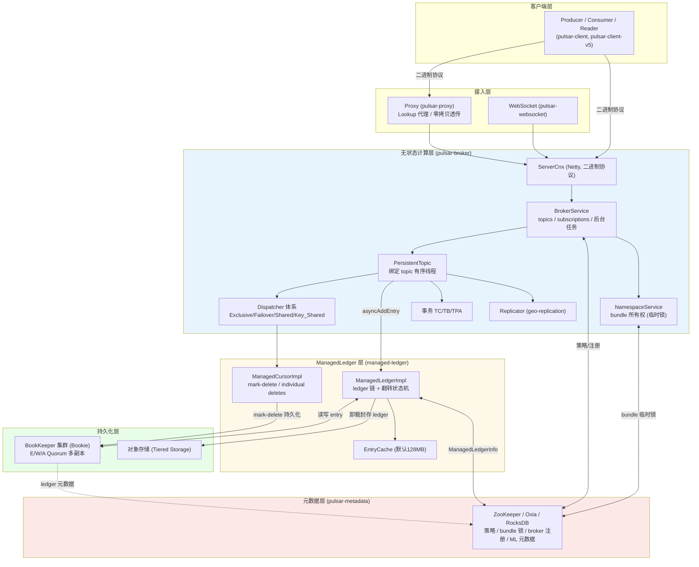

# Apache Pulsar 源码深度分析（总览）

> 本系列文档基于 Pulsar 源码仓库（master 分支，2026-09）逐类分析撰写，所有类名、文件路径、方法、配置键均经源码实际验证，非官方文档转述。
> 每篇均包含 Mermaid 架构图 / 流程图 / 时序图 / 状态图。

## 文档目录

| 文档 | 内容 |
|---|---|
| [01-整体架构与模块分析](01-整体架构与模块分析.md) | 三层架构（计算/存储/元数据）、Gradle 模块地图（Tier 0–11）、Broker 启动流程时序、PulsarService 组合根、NamespaceService 与 Bundle 所有权（Murmur3 哈希 + 临时锁）、BrokerService、元数据层（ZK/Oxia/RocksDB）、线程并发模型 |
| [02-通信架构与协议详解](02-通信架构与协议详解.md) | 自定义二进制协议（PulsarApi.proto）、全部命令与协议版本演进（v0–v21）、帧格式（CRC32C/BrokerEntryMetadata/批消息）、ServerCnx/ClientCnx、Lookup 机制与逻辑/物理地址、Proxy 双模式（Lookup 代理 + Epoll 零拷贝透传）、WebSocket/REST、TLS 与六种认证插件、握手/Lookup/生产/消费四大时序图 |
| [03-客户端架构详解](03-客户端架构详解.md) | v4 与 v5 客户端、连接池与请求关联、Producer（握手/批处理/分块/双层背压/epoch/重连重发/分区路由）、Consumer（订阅/接收流水线/permit 流控/ack 分组/负确认/超时重投/DLQ/Key_Shared）、Schema（注册缓存/AutoConsume/多版本演进）、端到端加密（信封加密）、线程模型 |
| [04-Broker内部机制详解](04-Broker内部机制详解.md) | Topic 类体系与加载流程、Dispatcher 全谱系（Exclusive/Failover/Shared/Key_Shared/Entry-Bucket 及 Classic 版）、发布→分发全链路、五级背压（连接/发布/分发/配额/负载卸载）、去重/TTL/延迟投递（Bucket 索引）、Geo-Replication、事务三组件（TC/TB/TPA）、系统 Topic 与三级策略层级、PIP-486 可扩展 Topic |
| [05-存储架构详解](05-存储架构详解.md) | ManagedLedger 抽象与 MLDataFormats 元数据格式、写入路径（OpAddEntry 状态机/E-W-A Quorum）、Ledger 翻转与元数据竞态防护、读取路径与 EntryCache（LRU + expectedReadCount 智能驱逐）、游标机制（mark-delete/LongBitmap 离散删除/批索引删除）、Retention 与 Trim、两阶段压缩、分层存储（Offloader）、BookKeeper 集成与崩溃恢复 fencing |
| [06-高可用架构详解](06-高可用架构详解.md) | 三层故障域与恢复时效、存储层 HA（E/W/A Quorum/放置策略/Bookie 健康检查/Ledger Fencing 防脑裂/AutoRecovery）、服务层 HA（bundle 临时锁接管全时序/OwnershipCache 代数安全/会话失效策略/优雅关闭 35 步/Leader 选举/TransferShedder 定向迁移/TOPIC_MIGRATED）、元数据层 HA（ZK 会话监控/Oxia/DualMetadataStore 在线迁移/缓存推送失效）、客户端故障转移（重连引擎/epoch 防旧/消息重发重投/Lookup 重定向）、跨集群容灾（复制退避/TTL DISCARD）、Proxy HA、四大故障场景端到端时序、非持久化 Topic 与事务协调者 failover 语义 |

## 一图纵览

## 核心设计要点速记

1. **存算分离**：broker 无状态，数据全在 BookKeeper；broker 宕机后 bundle 被接管（元数据锁失效触发），打开 ledger 即 fence 旧 writer，**秒级故障恢复且不搬数据**（详见 01/05）。
2. **调度单位是 bundle 不是 topic**：topic 名 Murmur3 哈希进 32 位空间的 bundle 区间，bundle 由 broker 持临时锁拥有，可动态分裂/卸载（详见 01 第 5 节）。
3. **单一自定义二进制协议**：protobuf 命令 + 长度前缀帧 + CRC32C 校验 + 批消息格式；Lookup 与数据传输共用连接；Proxy 可退化为 Epoll splice 零拷贝管道（详见 02）。
4. **Push 写 / Pull 读**：写入经 notifyCursors 唤醒等待游标；消费侧 Dispatcher 主动拉取并按 permit 流控推送，慢消费者只影响自己（详见 04 第 3 节）。
5. **topic 级单线程语义**：每个 topic 哈希绑定 `topicOrderedExecutor` 固定线程，ML/BK 回调切回该线程，全序无锁（详见 01/04 第 9 节）。
6. **游标即订阅**：每个订阅是 ManagedLedger 上的 cursor（mark-delete + LongBitmap 离散删除 + 批索引删除），持久化为 BK 追加日志而非直接写元数据存储（详见 05 第 6 节）。
7. **策略三级层级**：Broker < Namespace < Topic，topic 级策略存于 `__change_events` 系统 topic（详见 04 第 8 节）。

## 源码导航建议

- 想读懂**一条消息的一生**：按 `02（协议帧）→ 03（客户端发送）→ 04（broker 发布与分发）→ 05（ML 写入 BookKeeper）→ 03（客户端 ack 与流控）` 的顺序阅读；
- 想理解**故障与恢复**：06（高可用全貌，含四大故障场景端到端时序）为主，配合 01（bundle 接管）+ 05（第 10 节 recovery/fencing）+ 03（producer epoch/重连重发）；
- 想理解**负载与扩容**：01（NamespaceService/LoadManager）+ 04（背压与 TransferShedder）+ 06 第 3.7 节（TransferShedder 定向迁移与 ServiceUnitState 状态机）+ 04 第 9.2 节（PIP-486 segment/bucket 动态分裂）。
