# Apache Pulsar 整体架构与模块深度分析（源码级）

> 本文基于 Pulsar 源码仓库实际代码分析，所有类名、文件路径、方法、配置键均经源码验证。路径相对仓库根目录。

---

## 目录

1. [Pulsar 整体架构](#1-pulsar-整体架构)
2. [模块地图（Gradle 多模块）](#2-模块地图gradle-多模块)
3. [Broker 启动流程](#3-broker-启动流程)
4. [PulsarService：组合根](#4-pulsarservice组合根)
5. [NamespaceService 与 Bundle 所有权机制](#5-namespaceservice-与-bundle-所有权机制)
6. [BrokerService 与 Topic 生命周期](#6-brokerservice-与-topic-生命周期)
7. [元数据层（pulsar-metadata）](#7-元数据层pulsar-metadata)
8. [Broker 线程与并发模型](#8-broker-线程与并发模型)
9. [关键配置速查](#9-关键配置速查)

---

## 1. Pulsar 整体架构

Pulsar 官方架构（与根目录 `ARCHITECTURE.md` 对齐）是**计算与存储分离**的三层结构：

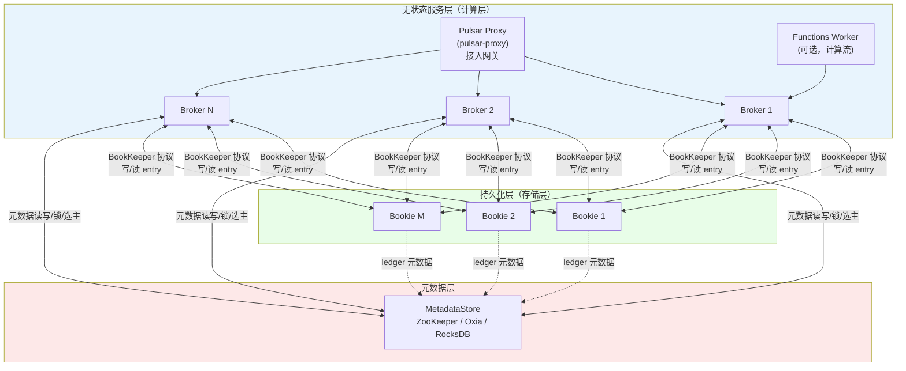

三个核心分层：

1. **无状态服务层（Broker/Proxy）**：接收客户端连接、协议解析、Topic/订阅管理、消息分发、负载均衡。Broker 不落盘业务数据，宕机后 bundle 被 其他 broker 快速接管；
2. **持久化层（BookKeeper）**：以 ledger 为单位写入多个 bookie（多副本），提供强持久性与快速故障恢复（得益于存储计算分离，broker 故障不需要数据迁移）；
3. **元数据层**：集群元数据、bundle 所有权（临时锁）、租户/命名空间策略、broker 注册、leader 选举。

### 消息端到端路径

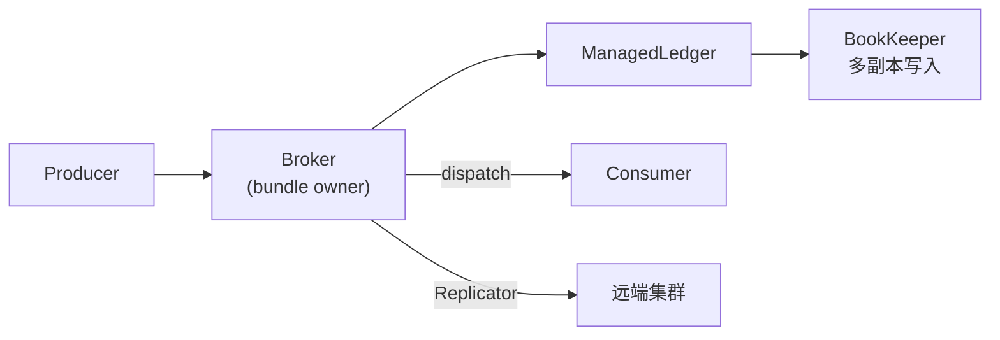

---

## 2. 模块地图（Gradle 多模块）

构建系统已从 Maven 迁移到 **Gradle（PIP-463）**，模块在 `settings.gradle.kts` 中按依赖层级（Tier 0 ~ Tier 11）组织。

> **命名陷阱**：Gradle 工程名与目录名可能不同，例如目录 `pulsar-client/` 的工程名是 `:pulsar-client-original`，目录 `pulsar-client-admin/` 对应 `:pulsar-client-admin-original`。

### 2.1 分层依赖图

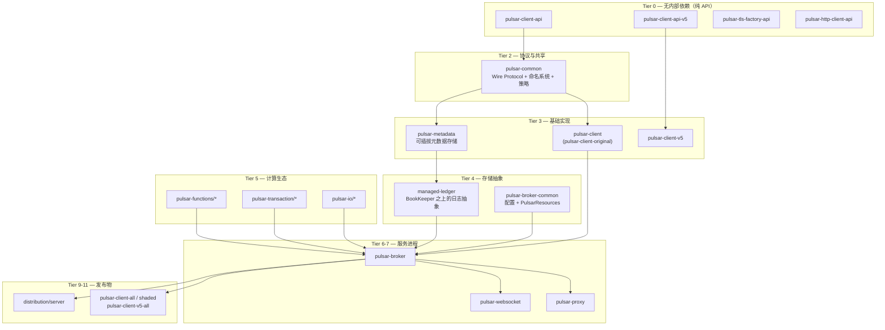

### 2.2 核心模块职责

| 模块（工程名） | 目录 | 职责 | 关键内容 |
|---|---|---|---|
| `pulsar-client-api` | `pulsar-client-api/` | 客户端公共 API（纯接口） | `Producer`、`Consumer`、`Reader`、`ClientBuilder` |
| `pulsar-client-api-v5` | `pulsar-client-api-v5/` | 新一代 V5 客户端 API（PIP-466/468） | |
| **`pulsar-common`** | `pulsar-common/` | **协议与共享类型（最核心共享模块）** | `PulsarApi.proto`、`Commands`、`PulsarDecoder`、命名系统（`TopicName`/`NamespaceBundle`）、`policies/data` |
| `pulsar-client-original` | `pulsar-client/` | Java 客户端实现 | `PulsarClientImpl`、`ClientCnx`、`ConsumerImpl`、`ProducerImpl`、`ConnectionPool`、`BinaryProtoLookupService` |
| `pulsar-client-v5` | `pulsar-client-v5/` | V5 客户端（可扩展主题） | `impl/v5/` 包 |
| **`pulsar-metadata`** | `pulsar-metadata/` | **可插拔元数据存储抽象** | `MetadataStore` 接口、`ZKMetadataStore`、`RocksdbMetadataStore`、Oxia、`CoordinationService`（选主/锁） |
| **`managed-ledger`** | `managed-ledger/` | **BookKeeper 之上的日志抽象层** | `ManagedLedger`、`ManagedCursor`、`ManagedLedgerImpl`、`OpAddEntry` 等 |
| `pulsar-broker-common` | `pulsar-broker-common/` | Broker 共享代码 | `ServiceConfiguration`（约 4600+ 行）、`PulsarResources` 资源抽象 |
| **`pulsar-broker`** | `pulsar-broker/` | **Broker 服务器（核心）** | `PulsarService`、`BrokerService`、`ServerCnx`、`NamespaceService`、负载均衡、事务 |
| `pulsar-proxy` | `pulsar-proxy/` | 接入网关 | `ProxyService`、`ProxyConnection`、`DirectProxyHandler` |
| `pulsar-websocket` | `pulsar-websocket/` | WebSocket 桥接 | |
| `pulsar-functions/*` | `pulsar-functions/` | Functions 框架 | proto / api / instance / runtime / worker / localrun |
| `pulsar-transaction/*` | `pulsar-transaction/` | 事务 | common / coordinator（`MLTransactionMetadataStore` 等） |
| `pulsar-io/*` | `pulsar-io/` | 连接器框架 | core / common / batch-discovery-triggerers |
| `tiered-storage/*` | `tiered-storage/` | 分层存储 offloader | jcloud / file-system |
| `pulsar-package-management` | `pulsar-package-management/` | 包管理 | core / filesystem-storage / bookkeeper-storage |
| `distribution:pulsar-server-distribution` | `distribution/server/` | 服务端 tar 包 | |
| 认证插件 | `pulsar-broker-auth-*`、`pulsar-client-auth-*` | Athenz / SASL / OIDC | |
| `microbench`、`tests:integration` | | 基准/集成测试 | |

> Etcd 元数据后端已在 Pulsar 5.0 移除（PIP-462），现存实现：`zk:`、`oxia:`、`rocksdb:`、`memory:` 及迁移用 `DualMetadataStore`。

---

## 3. Broker 启动流程

### 3.1 入口

- **主类**：`org.apache.pulsar.PulsarBrokerStarter`（`pulsar-broker/src/main/java/org/apache/pulsar/PulsarBrokerStarter.java`）
  - 内部类 `BrokerStarter implements Callable<Integer>`，用 picocli 解析参数；
  - 关键参数：`-c/--broker-conf`（默认 `conf/broker.conf`）、`-rb/--run-bookie`、`-ra/--run-bookie-autorecovery`、`-rfw/--run-functions-worker`。
- 其他入口：`PulsarStandalone`/`PulsarStandaloneStarter`（单机一体化）、`PulsarClusterMetadataSetup`（集群元数据初始化）。

### 3.2 启动时序

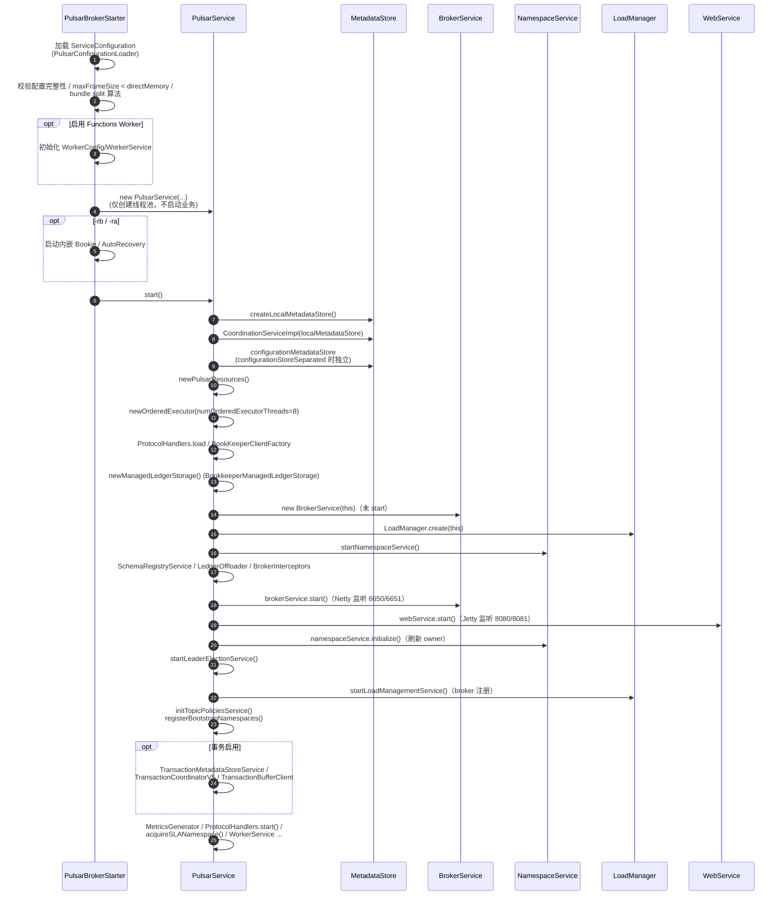

### 3.3 启动顺序要点（`PulsarService.start()`，第 856–1159 行）

| 步骤 | 组件 | 说明 |
|---|---|---|
| 1 | OpenTelemetry 统计 | `OpenTelemetryTopicStats` 等 |
| 2 | **Local MetadataStore** | `MetadataStoreExtended.create()` |
| 3 | **CoordinationService** | 选主/锁的基础 |
| 4 | **Configuration MetadataStore** | 全局配置存储（可与 local 同实例） |
| 5 | **PulsarResources** | 所有资源访问入口 |
| 6 | OrderedExecutor | 通用有序执行器（8 线程） |
| 7 | ProtocolHandlers | 多协议插件（KoP/MoP 等由此加载） |
| 8 | BookKeeperClientFactory | BK 客户端工厂 |
| 9 | **ManagedLedgerStorage** | 存储抽象 |
| 10 | BrokerService | 创建（未启动） |
| 11 | LoadManager | `ExtensibleLoadManagerImpl` 或旧版 |
| 12 | NamespaceService | 创建（未初始化） |
| 13–15 | SchemaStorage / LedgerOffloader / BrokerInterceptor | |
| 16 | **BrokerService.start()** | Netty server + 后台监控任务 |
| 17–18 | **WebService** | Jetty REST，按实际端口刷新 URL |
| 19 | **NamespaceService.initialize()** | 缓存/owner 刷新 |
| 20 | **LeaderElectionService** | broker leader 选举 |
| 21 | **LoadManagementService** | broker 注册到 `/loadbalance/brokers/<id>` |
| 22 | **TopicPoliciesService** | `SystemTopicBasedTopicPoliciesService` |
| 23 | Bootstrap Namespaces | 心跳/SLA 命名空间 |
| 24 | 事务服务（可选） | |
| 25–32 | Metrics / ProtocolHandlers.start / SLA / Worker / Packages / ResourceGroup / MetadataSynchronizer | |

---

## 4. PulsarService：组合根

`pulsar-broker/src/main/java/org/apache/pulsar/broker/PulsarService.java` 是整个 broker 的**组合根（composition root）**（字段声明见第 228–341 行）：

```mermaid
classDiagram
    class PulsarService {
        -ServiceConfiguration config
        -State state (Init→Started→Closing→Closed)
        -ReentrantLock mutex
        +start()
        +close()
    }
    class NamespaceService { "bundle 所有权 / lookup" }
    class BrokerService { "topic / 订阅 / 连接 / Netty" }
    class WebService { "Jetty REST" }
    class ManagedLedgerStorage { "存储工厂" }
    class MetadataStoreExtended { "本地元数据" }
    class MetadataStore { "配置元数据" }
    class CoordinationService { "选主 / 分布式锁" }
    class PulsarResources { "资源访问入口" }
    class LoadManager { "负载均衡" }
    class LeaderElectionService { "broker leader" }
    class TopicPoliciesService { "topic 级策略" }
    class BookKeeperClientFactory { "BK 客户端" }
    class SchemaRegistryService { "schema 注册" }
    class ProtocolHandlers { "多协议插件" }
    class TransactionMetadataStoreService { "事务" }
    class BrokerInterceptor { "拦截器链" }
    class EventLoopGroup { "Netty IO 线程" }
    class OrderedExecutor { "有序执行器" }

    PulsarService --> NamespaceService
    PulsarService --> BrokerService
    PulsarService --> WebService
    PulsarService --> ManagedLedgerStorage
    PulsarService --> MetadataStoreExtended
    PulsarService --> MetadataStore
    PulsarService --> CoordinationService
    PulsarService --> PulsarResources
    PulsarService --> LoadManager
    PulsarService --> LeaderElectionService
    PulsarService --> TopicPoliciesService
    PulsarService --> BookKeeperClientFactory
    PulsarService --> SchemaRegistryService
    PulsarService --> ProtocolHandlers
    PulsarService --> TransactionMetadataStoreService
    PulsarService --> BrokerInterceptor
    PulsarService --> EventLoopGroup
    PulsarService --> OrderedExecutor
```

构造函数（不启动业务，只建线程池）创建：

- `loadManagerExecutor`（单线程调度池 `pulsar-load-manager`）；
- `executor`（`numExecutorThreadPoolSize`，默认 CPU 核数）；
- `ioEventLoopGroup`（Netty IO 线程，`numIOThreads` = 2×CPU）；
- broker 内部客户端共享的 internal/external/scheduled executor provider、`HashedWheelTimer`、DNS resolver；
- 事务执行器（启用时）与单调时钟。

并发控制：`mutex: ReentrantLock` 保护 start/close 状态转换；`state: volatile State`；`readyForIncomingRequestsFuture` 是"可对外服务"信号。

---

## 5. NamespaceService 与 Bundle 所有权机制

文件：`pulsar-broker/src/main/java/org/apache/pulsar/broker/namespace/NamespaceService.java`（1973 行）。

### 5.1 核心概念

Pulsar 的**调度单位是 bundle（命名空间分片）**，不是 topic：

- **Topic → Bundle**：topic 名经 Murmur3（`Hashing.murmur3_32_fixed()`）得到 32 位 hash，落入某 bundle 的 `Range<Long>` 区间；
- **Bundle → Broker**：每个 bundle 由唯一 broker 拥有，通过元数据存储**临时锁节点**实现；broker 宕机会话失效 → 锁自动释放 → 其他 broker 接管。

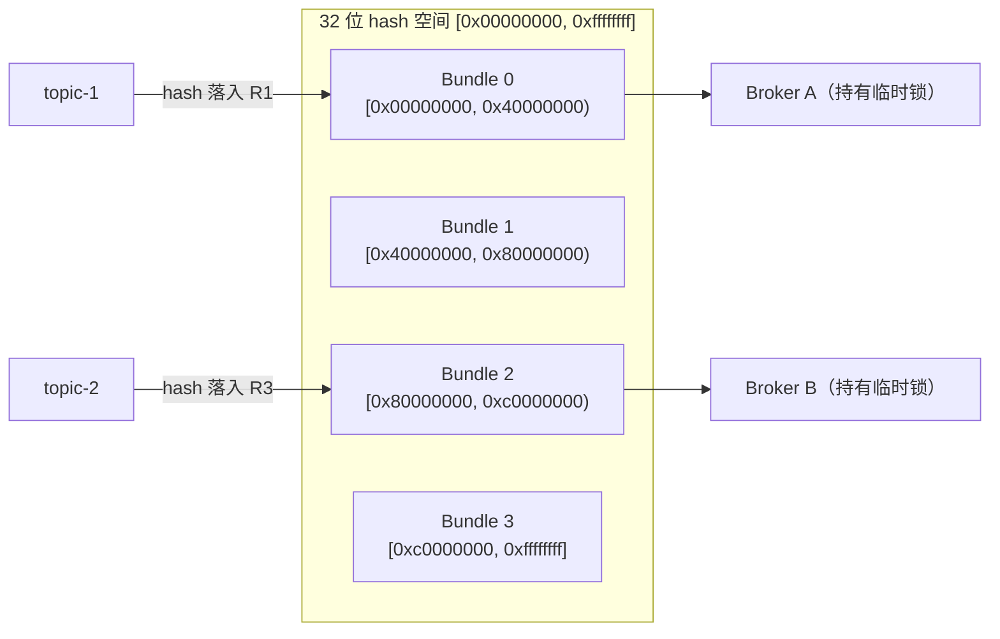

### 5.2 命名系统关键类

| 类 | 位置 | 说明 |
|---|---|---|
| `NamespaceBundle` | `pulsar-broker/src/main/java/org/apache/pulsar/common/naming/NamespaceBundle.java` | 字段 `nsname` + `keyRange: Range<Long>`；`includes(TopicName)` 判归属；字符串形如 `tenant/namespace/0x00000000_0x40000000` |
| `NamespaceBundles` | 同上目录 | 一个 namespace 的全部 bundle；`FULL_LOWER_BOUND=0x00000000L`、`FULL_UPPER_BOUND=0xffffffffL`；`findBundle(TopicName)` 二分查找；边界存于 `partitions: long[]` |
| `NamespaceBundleFactory` | 同上目录 | Caffeine `AsyncLoadingCache<NamespaceName, NamespaceBundles>` 缓存划分；从 `LocalPolicies` 加载边界；监听元数据通知自动失效；`getLongHashCode(name)` = `hashFunc.hashString(name, UTF_8).padToLong()` |
| `TopicName` / `NamespaceName` | `pulsar-common/.../naming/` | 名字解析 |

### 5.3 OwnershipCache：所有权缓存

文件：`pulsar-broker/.../namespace/OwnershipCache.java`（560 行）：

- `ownedBundlesCache: AsyncLoadingCache<NamespaceBundle, OwnedBundle>`（Caffeine）；
- `lockManager: LockManager<NamespaceEphemeralData>`（来自 `CoordinationService`）；
- `locallyAcquiredLocks`：本地持有的锁；
- `selfOwnerInfo` / `selfOwnerInfoDisabled`：本 broker 的 owner 信息（含 URL）；
- `bundleOperationBarriers`：每个 bundle 的 acquire/release **串行化屏障**（防并发操作竞态）。

获取所有权 `tryAcquiringOwnership(NamespaceBundle)`：通过 `lockManager.acquireLock(path, selfOwnerInfo)` 在元数据存储创建临时节点，路径 `/namespace/tenant/ns/<bundle-range>`（`ServiceUnitUtils.path()`）。**锁随会话过期失效 → 触发 bundle unload/接管**。

### 5.4 Lookup 决策流程

`getBrokerServiceUrlAsync(TopicName, LookupOptions)`：

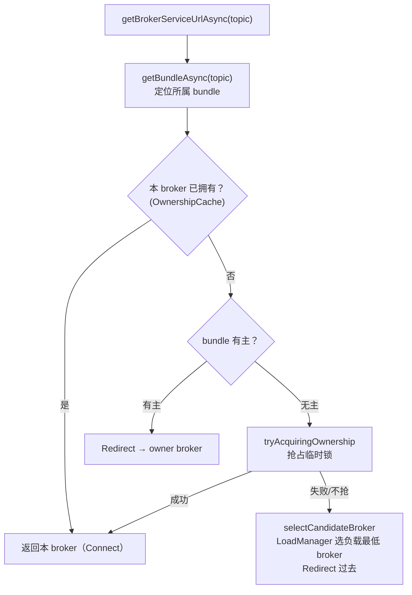

### 5.5 Bundle 分裂与卸载

- **分裂** `splitAndOwnBundle(bundle, unload, ...)`：计算分裂边界（`getSplitBoundary`，算法可插拔：`NamespaceBundleSplitAlgorithm`，配置 `supportedNamespaceBundleSplitAlgorithms` / `defaultNamespaceBundleSplitAlgorithm`，重试上限 `BUNDLE_SPLIT_RETRY_LIMIT = 7`）→ 更新 `LocalPolicies` 中的 bundles 数据 → 卸载旧 bundle、加载新 bundle；
- **卸载** `unloadNamespaceBundle(bundle, ...)`：关闭该 bundle 下全部 topic → 释放元数据锁（可选定向迁移到某 broker）；
- **启动命名空间**：`registerBootstrapNamespaces()` 注册心跳命名空间（`pulsar/<broker-id>`）与 SLA 监控命名空间。

---

## 6. BrokerService 与 Topic 生命周期

文件：`pulsar-broker/src/main/java/org/apache/pulsar/broker/service/BrokerService.java`（4733 行）。

### 6.1 核心字段

- `topics: ConcurrentOpenHashMap<String, CompletableFuture<Optional<Topic>>>` —— topic 引用缓存；
- `acceptorGroup` / `workerGroup` —— Netty acceptor / worker（worker 复用 `ioEventLoopGroup`）；
- `topicOrderedExecutor: OrderedExecutor` —— **每个 topic 绑定一个固定有序线程**（`topicOrderedExecutorThreadNum`，默认 CPU 核数）；
- `pulsarChannelInitializers` —— pipeline 初始化器列表；
- `producerNameGenerator: DistributedIdGenerator` —— 基于协调服务的全局 ID 生成。

### 6.2 Topic 加载/创建流程

`getTopic(topicName, createIfMissing, properties)`（约第 1334 行起）：

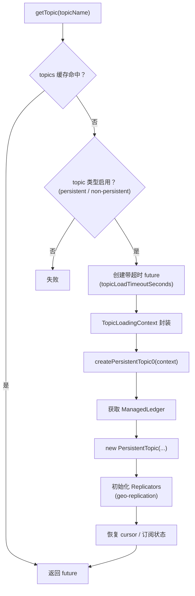

### 6.3 PersistentTopic 结构

`pulsar-broker/.../persistent/PersistentTopic.java`：`extends AbstractTopic implements Topic, AddEntryCallback`。

- 构造时绑定有序线程：`this.orderedExecutor = brokerService.getTopicOrderedExecutor().chooseThread(topic)`（第 433–434 行附近）——**topic 内状态变更串行执行**；
- 组成：`ManagedLedger`（存储）、`Producers`、`Subscriptions: PersistentSubscription`、`Replicators: PersistentReplicator`、`MessageDeduplication`、非活跃 topic 处理等。

### 6.4 复制（Geo-Replication）

- `PersistentReplicator`（`.../persistent/PersistentReplicator.java`，继承 `AbstractReplicator`）：**每个远程集群一个 replicator**，本质是"本地 cursor + 远端 producer"——从本地游标读消息，作为生产者写到远端集群；
- `ReplicatedSubscriptionsController`：复制订阅状态（mark-delete 位置）；
- `startCheckReplicationPolicies()`：定期检查复制策略变化。

### 6.5 BrokerService.start() 启动的后台任务（第 643–718 行）

| 任务 | 职责 |
|---|---|
| `DistributedIdGenerator` | producer 名称全局唯一生成 |
| `ScalableTopicService` | 可扩展 topic（PIP-473） |
| Netty ServerBootstrap | 绑定 6650/6651 |
| `startStatsUpdater()` | 统计更新 |
| `startInactivityMonitor()` | 非活跃 topic 检测/删除 |
| `startMessageExpiryMonitor()` | 消息 TTL 过期 |
| `startCompactionMonitor()` | 压缩触发 |
| `startConsumedLedgersMonitor()` | 已消费 ledger 清理 |
| `startBacklogQuotaChecker()` | backlog 配额 |
| `startSubscriptionBacklogAgeChecker()` | backlog 年龄 |
| `startCheckReplicationPolicies()` | 复制策略 |
| `startDeduplicationSnapshotMonitor()` | 去重快照 |
| `startSegmentLoadReporter()` | segment 负载 |
| `startClearInvalidateTopicNameCacheTask()` | topic 名缓存失效 |

### 6.6 Broker 注册

通过 LoadManager 注册到元数据存储 `/loadbalance/brokers/<broker-id>`（`startLoadManagementService()` 中完成）；新负载均衡抽象 `BrokerRegistry`（`loadbalance/extensions/`，`ExtensibleLoadManagerImpl` 使用）。

---

## 7. 元数据层（pulsar-metadata）

### 7.1 接口体系

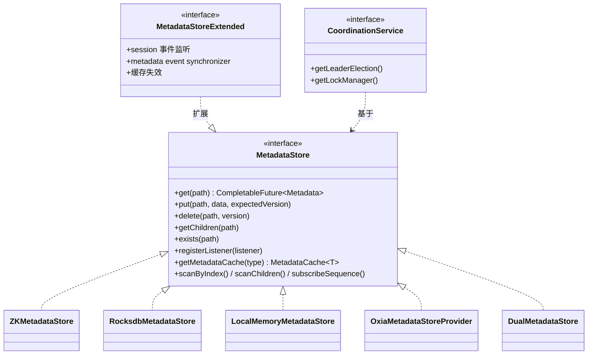

- 工厂 `MetadataStoreFactoryImpl`：按 URL scheme 前缀（`zk:`/`rocksdb:`/`memory:`/`oxia:`）路由；可用系统属性 `pulsar.metadatastore.providers` 扩展；
- 协调服务（`metadata/api/coordination/`）：`LeaderElection`、`LockManager<T>`、`ResourceLock<T>`（带 `getLockExpiredFuture()` 过期通知）——bundle 所有权与 broker 选主都建立在其上。

### 7.2 双元数据存储模型

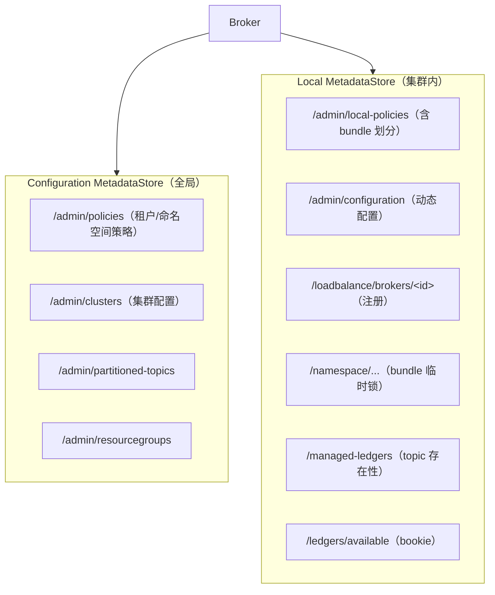

- `configurationStoreSeparated = false`（默认）时两个存储指向同一实例；
- 配置键：`metadataStoreUrl`（优先）或 `zookeeperServers`；`configurationMetadataStoreUrl` 或 `configurationStoreServers`。

### 7.3 PulsarResources：资源访问入口

`pulsar-broker-common/.../resources/PulsarResources.java` 聚合各资源类（见上表），每个资源类型有独立 `MetadataCache<T>`，基于元数据存储通知自动失效，减少对存储层的压力。

---

## 8. Broker 线程与并发模型

> `ARCHITECTURE.md` 明确承认：Pulsar **没有严格文档化的并发模型**，这是官方认可的文档缺口。以下是源码中的实际约定。

### 8.1 线程池全景

| 线程池 | 创建位置 | 默认大小 | 用途 |
|---|---|---|---|
| `ioEventLoopGroup` | PulsarService 构造 | `numIOThreads` = 2×CPU | 网络 IO（绝不阻塞） |
| `acceptorGroup` | BrokerService | 1 | 接受新连接 |
| `workerGroup` | BrokerService | 复用 ioEventLoopGroup | 连接读写 |
| **`topicOrderedExecutor`** | BrokerService | `topicOrderedExecutorThreadNum` = CPU | **topic 级单线程语义** |
| `orderedExecutor` | PulsarService | `numOrderedExecutorThreads` = 8 | 通用有序执行（bundle 操作等） |
| `executor` | PulsarService | `numExecutorThreadPoolSize` = CPU | 通用调度 |
| `loadManagerExecutor` | PulsarService | 1 | 负载管理 |
| 事务执行器 | PulsarService | `numTransactionReplayThreadPoolSize` | 事务回放 |
| broker 内部客户端共享池 | PulsarService | 各 1 | 内部 Pulsar 客户端 |
| `HashedWheelTimer` | PulsarService | — | 超时/定时 |

### 8.2 核心并发原则

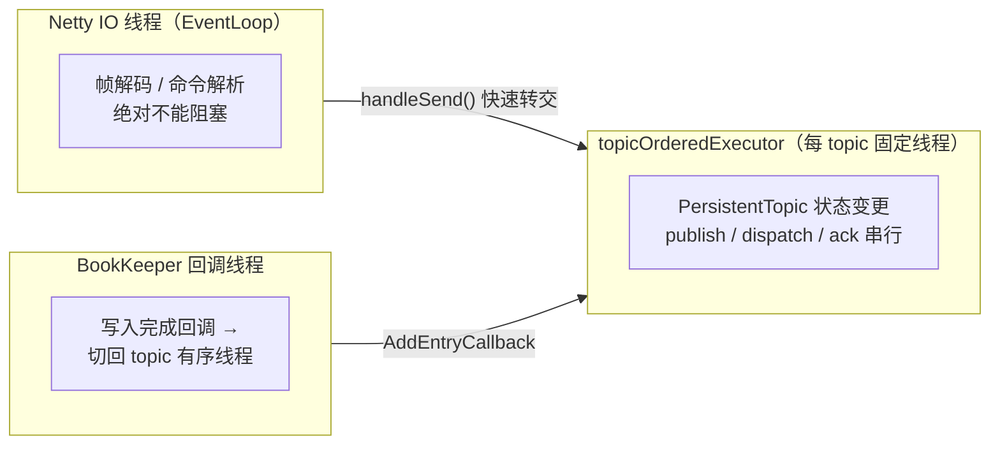

1. **Netty IO 线程**只做编解码与命令分发，不阻塞；
2. **topic 级单线程**：`PersistentTopic` 构造时 `chooseThread(topic)` 绑定 `OrderedExecutor` 中一个固定线程（来自 BookKeeper 通用库 `org.apache.bookkeeper.common.util.OrderedExecutor`，同 key 任务按提交顺序执行），topic 内生产/分发/确认串行，避免锁竞争；
3. **CompletableFuture 全异步**：方法返回 future 不同步抛异常（CLAUDE.md 关键规则 2）；
4. 共享状态处以 `synchronized` / `ReentrantLock` 补充（如 `PulsarService.mutex`）。

---

## 9. 关键配置速查

`pulsar-broker-common/.../ServiceConfiguration.java`：

| 配置键 | 默认值 | 含义 |
|---|---|---|
| `metadataStoreUrl` | null | 本地元数据存储 URL（优先于 `zookeeperServers`） |
| `zookeeperServers` | null | ZK 地址（旧） |
| `configurationMetadataStoreUrl` | null | 配置元数据存储 URL |
| `configurationStoreServers` | null | 同上（旧名） |
| `metadataStoreSessionTimeoutMillis` | 30000 | 元数据会话超时（影响 bundle 接管速度） |
| `metadataStoreCacheExpirySeconds` | 300 | 元数据缓存过期 |
| `numIOThreads` | 2×CPU | Netty IO 线程 |
| `numOrderedExecutorThreads` | 8 | 通用有序执行器 |
| `topicOrderedExecutorThreadNum` | CPU | topic 有序执行器 |
| `numExecutorThreadPoolSize` | CPU | 通用线程池 |
| `brokerServicePort` | 6650 | 二进制协议端口 |
| `webServicePort` | 8080 | REST 端口 |
| `defaultNumberOfNamespaceBundles` | 4 | 默认 bundle 数 |
| `transactionCoordinatorEnabled` | false | 事务开关 |
| `supportedNamespaceBundleSplitAlgorithms` / `defaultNamespaceBundleSplitAlgorithm` | — | bundle 分裂算法 |

---

## 附：关键文件索引

| 领域 | 文件 |
|---|---|
| 启动入口 | `pulsar-broker/src/main/java/org/apache/pulsar/PulsarBrokerStarter.java` |
| 组合根 | `pulsar-broker/src/main/java/org/apache/pulsar/broker/PulsarService.java` |
| Broker 服务 | `pulsar-broker/src/main/java/org/apache/pulsar/broker/service/BrokerService.java` |
| 连接处理 | `pulsar-broker/src/main/java/org/apache/pulsar/broker/service/ServerCnx.java` |
| 命名空间 | `pulsar-broker/src/main/java/org/apache/pulsar/broker/namespace/NamespaceService.java`、`OwnershipCache.java`、`ServiceUnitUtils.java` |
| 命名系统 | `pulsar-broker/src/main/java/org/apache/pulsar/common/naming/NamespaceBundle.java`、`NamespaceBundles.java`、`NamespaceBundleFactory.java`；`pulsar-common/.../naming/TopicName.java` |
| 持久主题 | `pulsar-broker/.../persistent/PersistentTopic.java`、`PersistentSubscription.java`、`PersistentReplicator.java` |
| Topic 策略 | `pulsar-broker/.../service/TopicPoliciesService.java`、`SystemTopicBasedTopicPoliciesService.java` |
| 负载均衡 | `pulsar-broker/.../loadbalance/LoadManager.java`、`LeaderElectionService.java`、`extensions/ExtensibleLoadManagerImpl.java`、`extensions/BrokerRegistry.java` |
| 元数据 | `pulsar-metadata/src/main/java/org/apache/pulsar/metadata/api/MetadataStore.java`、`impl/ZKMetadataStore.java`、`impl/MetadataStoreFactoryImpl.java`、`api/coordination/CoordinationService.java` |
| 资源抽象 | `pulsar-broker-common/src/main/java/org/apache/pulsar/broker/resources/PulsarResources.java` |
| 存储抽象 | `managed-ledger/src/main/java/org/apache/bookkeeper/mledger/`（接口）与 `impl/`（实现） |
| 配置 | `pulsar-broker-common/src/main/java/org/apache/pulsar/broker/ServiceConfiguration.java` |
| 官方架构文档 | `ARCHITECTURE.md` |
