# Apache Pulsar 通信架构与协议详解（源码深度分析）

> 本文基于 Pulsar 源码仓库（`pulsar-common`、`pulsar-broker`、`pulsar-client`、`pulsar-proxy`、`pulsar-websocket` 等模块）逐类分析，
> 所有类名、文件路径、方法、常量均来自源码实际验证。文中路径均相对仓库根目录。

---

## 目录

1. [通信体系总览](#1-通信体系总览)
2. [二进制有线协议（Wire Protocol）](#2-二进制有线协议wire-protocol)
3. [帧格式详解](#3-帧格式详解)
4. [服务端连接处理（Broker 侧）](#4-服务端连接处理broker-侧)
5. [客户端连接处理（Client 侧）](#5-客户端连接处理client-侧)
6. [Topic 查找（Lookup）机制](#6-topic-查找lookup机制)
7. [Pulsar Proxy 代理架构](#7-pulsar-proxy-代理架构)
8. [其他协议接入：WebSocket 与 REST](#8-其他协议接入websocket-与-rest)
9. [安全机制：TLS 与认证](#9-安全机制tls-与认证)
10. [关键流程时序图汇总](#10-关键流程时序图汇总)

---

## 1. 通信体系总览

Pulsar 的通信体系由四个层面构成：

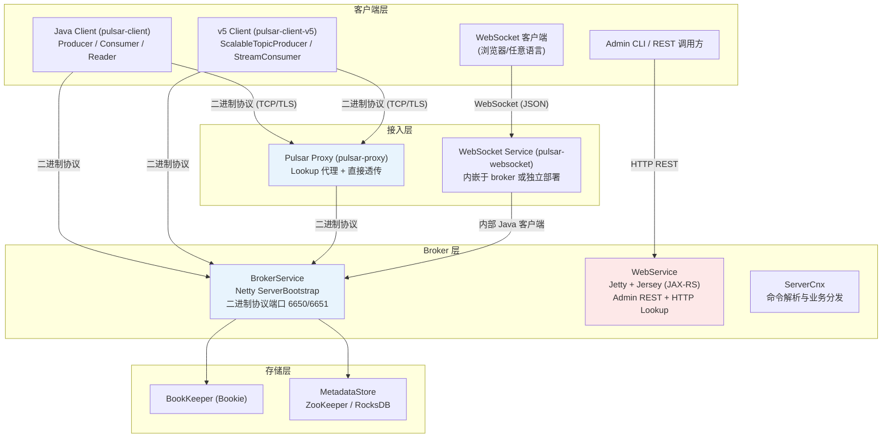

核心设计要点：

- **单一自定义二进制协议**承载所有数据面操作（生产、消费、确认、流控），协议定义在一份 protobuf 文件中；
- **Lookup（查找）与数据传输共用同一条 TCP 连接**，不需要独立的控制面连接；
- **Proxy 既是协议终点又是字节管道**：未指定目标 broker 时充当 Lookup 代理，指定后退化为零拷贝透传管道；
- **管理面走 HTTP REST**（Jetty + Jersey），与数据面完全分离。

### 协议相关模块划分

| 模块 | 职责 |
|---|---|
| `pulsar-common` | 协议定义（`PulsarApi.proto`）、命令编解码（`Commands.java`）、帧解码（`FrameDecoderUtil`、`PulsarDecoder`）、保活（`PulsarHandler`）、`ByteBufPair` 零拷贝 |
| `pulsar-broker` | 服务端 Netty pipeline（`PulsarChannelInitializer`）、`ServerCnx` 业务处理、Lookup（`TopicLookupBase`） |
| `pulsar-client` | 客户端 pipeline（`PulsarChannelInitializer`）、`ClientCnx`、`ConnectionPool` |
| `pulsar-client-v5` | 新一代客户端（PIP-473 可扩展主题），复用 v4 底层连接 |
| `pulsar-proxy` | `ProxyService`、`ProxyConnection`、`DirectProxyHandler`、`LookupProxyHandler` |
| `pulsar-websocket` | WebSocket ↔ 二进制协议网关 |

---

## 2. 二进制有线协议（Wire Protocol）

### 2.1 协议定义文件

协议核心定义在 **`pulsar-common/src/main/proto/PulsarApi.proto`**，包名 `pulsar.proto`，Java 包 `org.apache.pulsar.common.api.proto`，
生成选项为 `optimize_for = LITE_RUNTIME`（轻量运行时模式，减少生成代码的内存与 GC 开销——这对 Pulsar 这种在热路径上高频编解码命令的系统至关重要）。

### 2.2 BaseCommand：命令联合体

所有命令都包装在 `BaseCommand` 中，通过 `type` 字段（`BaseCommand.Type` 枚举）区分：

```mermaid
classDiagram
    class BaseCommand {
        +Type type
    }
    class CommandConnect
    class CommandConnected
    class CommandLookupTopic
    class CommandLookupTopicResponse
    class CommandSubscribe
    class CommandProducer
    class CommandSend
    class CommandSendReceipt
    class CommandMessage
    class CommandFlow
    class CommandAck
    class CommandAuthChallenge
    class CommandAuthResponse

    BaseCommand --> CommandConnect : type=CONNECT(2)
    BaseCommand --> CommandConnected : type=CONNECTED(3)
    BaseCommand --> CommandSubscribe : type=SUBSCRIBE(4)
    BaseCommand --> CommandProducer : type=PRODUCER(5)
    BaseCommand --> CommandSend : type=SEND(6)
    BaseCommand --> CommandSendReceipt : type=SEND_RECEIPT(7)
    BaseCommand --> CommandMessage : type=MESSAGE(9)
    BaseCommand --> CommandAck : type=ACK(10)
    BaseCommand --> CommandFlow : type=FLOW(11)
    BaseCommand --> CommandLookupTopic : type=LOOKUP(23)
    BaseCommand --> CommandLookupTopicResponse : type=LOOKUP_RESPONSE(24)
    BaseCommand --> CommandAuthChallenge : type=AUTH_CHALLENGE(36)
    BaseCommand --> CommandAuthResponse : type=AUTH_RESPONSE(37)
```

主要命令类型编号（摘自 `BaseCommand.Type`）：

| 命令 | 编号 | 方向 | 用途 |
|---|---|---|---|
| `CONNECT` / `CONNECTED` | 2 / 3 | C→S / S→C | 连接握手 |
| `SUBSCRIBE` | 4 | C→S | 创建订阅 |
| `PRODUCER` / `PRODUCER_SUCCESS` | 5 / 17 | C→S / S→C | 创建生产者 |
| `SEND` / `SEND_RECEIPT` / `SEND_ERROR` | 6 / 7 / 8 | C→S / S→C / S→C | 消息发送 / 确认 / 错误 |
| `MESSAGE` | 9 | S→C | 向消费者投递消息 |
| `ACK` | 10 | C→S | 消息确认（Individual / Cumulative） |
| `FLOW` | 11 | C→S | 流控许可（permits） |
| `SUCCESS` / `ERROR` | 13 / 14 | S→C | 通用成功 / 错误响应 |
| `CLOSE_PRODUCER` / `CLOSE_CONSUMER` | 15 / 16 | 双向 | 关闭生产者 / 消费者 |
| `PING` / `PONG` | 18 / 19 | 双向 | 应用层心跳 |
| `PARTITIONED_METADATA` / `_RESPONSE` | 21 / 22 | C→S / S→C | 分区主题元数据查询 |
| `LOOKUP` / `LOOKUP_RESPONSE` | 23 / 24 | C→S / S→C | Topic 查找 |
| `ACTIVE_CONSUMER_CHANGE` | 31 | S→C | Failover 活跃消费者切换通知 |
| `AUTH_CHALLENGE` / `AUTH_RESPONSE` | 36 / 37 | S→C / C→S | 双向认证 |
| 事务命令（`NEW_TXN`、`END_TXN` 等） | 50–63 | 双向 | 事务协调 |
| `WATCH_TOPIC_LIST` 系列 | 64–67 | 双向 | 主题列表监听（PIP-473） |
| `TOPIC_MIGRATED` | 68 | S→C | 主题迁移通知 |
| `WATCH_TC_ASSIGNMENTS` 系列 | 79–81 | 双向 | 事务协调器分配监听 |
| Scalable Topic 命令 | 70–82 | 双向 | PIP-473 可扩展主题 |

### 2.3 关键命令字段

**CommandConnect（C→S）**

| 字段 | 说明 |
|---|---|
| `client_version` | 客户端版本（必填） |
| `auth_method_name` / `auth_data` | 认证方法名与认证数据（字符串方法名替代了旧版枚举，便于插件扩展） |
| `protocol_version` | 客户端协议版本（默认 0） |
| `proxy_to_broker_url` | **代理专用**：经 Proxy 连接时，由 Proxy 填入目标 broker 的地址 |
| `original_principal` / `original_auth_data` / `original_auth_method` | **代理透传**的原始客户端身份 |
| `feature_flags` | 功能标志（见下） |

**FeatureFlags**（功能协商，v13+ 逐步引入）：

- `supports_auth_refresh` — 支持认证凭据刷新
- `supports_broker_entry_metadata` — 支持 Broker Entry 元数据
- `supports_partial_producer` — 支持部分生产者
- `supports_topic_watchers` / `supports_topic_watcher_reconcile` — 主题观察者
- `supports_get_partitioned_metadata_without_auto_creation`
- `supports_repl_dedup_by_lid_and_eid` — 复制去重按 ledgerId+entryId
- `supports_scalable_topics` — 可扩展主题（PIP-473）
- `supports_tc_metadata_discovery` — TC 元数据发现

**CommandConnected（S→C）**：`server_version`、`protocol_version`、`max_message_size`（告知客户端本 broker 的最大消息限制）、`feature_flags`。

**CommandSubscribe**：`topic`、`subscription`、`subType`（Exclusive/Shared/Failover/Key_Shared）、`consumer_id`、`request_id`、`consumer_name`、`priority_level`、`durable`、`start_message_id`（非持久订阅的起点）、`schema`、`initialPosition`（Latest/Earliest）、`keySharedMeta`（KeySharedMode: AUTO_SPLIT/STICKY + hashRanges）。

**CommandProducer**：`topic`、`producer_id`、`request_id`、`producer_name`、`producer_access_mode`（Shared/Exclusive/WaitForExclusive/ExclusiveWithFencing）、`epoch`、`topic_epoch`、`txn_enabled`。

**CommandSend**：`producer_id`、`sequence_id`、`num_messages`（批消息时 >1）、事务位（`txnid_least_bits/most_bits`）、`highest_sequence_id`、`is_chunk`、`marker`。

**CommandFlow**：`consumer_id`、`messagePermits` —— Pulsar 流控的**唯一手段**，消费者以"发许可"的方式告诉 broker 还能接收多少条消息。

**CommandAck**：`consumer_id`、`ack_type`（Individual/Cumulative）、`message_id`（repeated，支持批量确认）、`validation_error`、事务位、`request_id`（Ack Receipt 用）。

### 2.4 协议版本演进（ProtocolVersion）

定义于 `PulsarApi.proto`，当前版本号由 `pulsar-common/src/main/java/org/apache/pulsar/common/protocol/Commands.java` 中的 `CURRENT_PROTOCOL_VERSION`（第 161–162 行附近）取枚举末值：

| 版本 | 新增能力 |
|---|---|
| v0 | 初始版本 |
| v1 | 应用层 keep-alive（PING/PONG） |
| v2 | RedeliverUnacknowledgedMessages |
| v3 | LZ4 / ZLib 压缩 |
| v4 | 批量消息（batching） |
| v5 | 不断开连接地"断开"客户端 |
| v6 | metadata + payload 校验和（CRC32C） |
| v7 | 二进制 Lookup |
| v8 | 客户端获取 broker 端消费者统计 |
| v9 | End of topic 通知 |
| v10 | 代理到 broker（proxy-to-broker） |
| v11 | C++ 客户端 checksum 修复标记 |
| v12 | GetLastMessageId、ActiveConsumerChange、GetTopicsOfNamespace |
| v13 | Avro JSON Schema |
| v14 | 双向认证（AuthChallenge/AuthResponse）、Key_Shared 订阅 |
| v15 | GetOrCreateSchema |
| v16 | Broker entry metadata |
| v17 | Ack receipt |
| v18 | 客户端支持 broker entry metadata |
| v19 | TC client connect（事务） |
| v20 | Topic migration redirection |
| v21 | AUTO_CONSUME schema 传递给 broker |

### 2.5 消息元数据

**MessageMetadata**（每个 entry 一份，随 SEND 帧发送）：

- 身份与顺序：`producer_name`、`sequence_id`、`highest_sequence_id`
- 内容：`properties`（键值对）、`partition_key`、`ordering_key`、`null_value`、`null_partition_key`
- 压缩与批处理：`compression`（NONE/LZ4/ZLIB/ZSTD/SNAPPY）、`uncompressed_size`、`num_messages_in_batch`
- 加密：`encryption_keys`（repeated）、`encryption_algo`、`encryption_param`
- 时间：`publish_time`、`event_time`、`deliver_at_time`（延迟消息）
- 分块（chunking）：`uuid`、`num_chunks_from_msg`、`total_chunk_msg_size`、`chunk_id`
- 事务：`txnid_least_bits/most_bits`
- 其他：`schema_version`、`marker_type`、`compacted_batch_indexes`、PIP-486 的 `schema_id` / `entry_hash_min/max`

**SingleMessageMetadata**（批消息中每条单消息的元数据）：

`properties`、`partition_key`、`payload_size`（必填）、`compacted_out`、`event_time`、`partition_key_b64_encoded`、`ordering_key`、`sequence_id`、`null_value`、`null_partition_key`。

### 2.6 服务端错误码（ServerError）

定义于 proto（第 213–251 行附近）：`UnknownError`、`MetadataError`、`PersistenceError`、`AuthenticationError`、`AuthorizationError`、`ConsumerBusy`、`ServiceNotReady`、`ProducerBlockedQuotaExceededError/Exception`、`ChecksumError`、`UnsupportedVersionError`、`TopicNotFound`、`SubscriptionNotFound`、`ConsumerNotFound`、`TooManyRequests`、`TopicTerminatedError`、`ProducerBusy`、`InvalidTopicName`、`IncompatibleSchema`、`ConsumerAssignError`、`ProducerFenced` 等。

---

## 3. 帧格式详解

### 3.1 通用命令帧

所有帧均为**长度前缀帧**，由 Netty `LengthFieldBasedFrameDecoder` 切分。解码参数见
`pulsar-common/src/main/java/org/apache/pulsar/common/protocol/FrameDecoderUtil.java`：

```java
new LengthFieldBasedFrameDecoder(
    maxMessageSize + MESSAGE_SIZE_FRAME_PADDING, // maxFrameLength
    0,   // lengthFieldOffset：长度字段在帧起点
    4,   // lengthFieldLength：4 字节
    0,   // lengthAdjustment
    4    // initialBytesToStrip：剥离长度字段本身
)
```

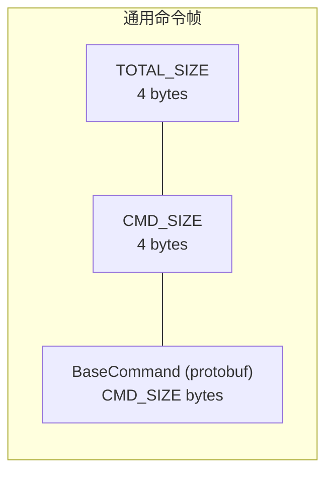

- `TOTAL_SIZE` = `CMD_SIZE + 4`；帧总长 = 4 + `TOTAL_SIZE`。

### 3.2 SEND 帧（命令 + 元数据 + 载荷）

完整格式见 `Commands.java` 的 `serializeCommandSendWithSize()`（约第 2062–2119 行）：

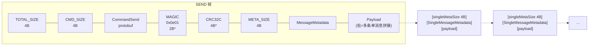

带 `*` 的字段仅在启用校验和时存在。关键常量（`Commands.java` 第 140–150 行）：

- `magicCrc32c = 0x0e01` —— 校验和魔数
- `magicBrokerEntryMetadata = 0x0e02` —— Broker Entry 元数据魔数
- `checksumSize = 4`
- `DEFAULT_MAX_MESSAGE_SIZE = 5 * 1024 * 1024`（5 MB，第 131 行）
- `MESSAGE_SIZE_FRAME_PADDING = 10 * 1024`（第 132 行）

### 3.3 CRC32C 校验和

- 使用 `com.scurrilous.circe.checksum.Crc32cIntChecksum`（硬件加速 CRC32C）；
- 覆盖范围：**MessageMetadata + Payload**（从 metadata 开始到帧尾）；
- `Commands.java` 提供 `hasChecksum(ByteBuf)`（通过魔数判断）、`readChecksum(ByteBuf)`、`skipChecksumIfPresent(ByteBuf)`；
- 由 `ChecksumType`（`Crc32c` / `None`）控制是否启用（第 2548–2551 行附近）。

### 3.4 Broker Entry Metadata

Broker 收到消息后可由拦截器追加 entry 级元数据（`Commands.addBrokerEntryMetadata()`，第 2121–2168 行）：

```
[MAGIC_NUMBER: 2B = 0x0e02][SIZE: 4B][BrokerEntryMetadata][原始 message frame...]
```

`BrokerEntryMetadata` 含 `broker_timestamp`、`index`。实现上小消息（≤16 KB）拷贝合并为单个 buffer，大消息用 `CompositeByteBuf` 零拷贝拼接。

### 3.5 ByteBufPair：零拷贝出站

`pulsar-common/src/main/java/org/apache/pulsar/common/protocol/ByteBufPair.java`：

- 同时持有 header 与 payload 两个 `ByteBuf`，出站时分别写入 socket，避免合并拷贝；
- 基于 Netty `Recycler` 池化复用；
- `getEncoder(boolean tlsEnabled)` 在 TLS 关闭时用 `Encoder`（引用计数透传），TLS 开启时用 `CopyingEncoder`（TLS 加密需要连续内存，旧版 Netty 下必须拷贝）。

---

## 4. 服务端连接处理（Broker 侧）

### 4.1 类层次

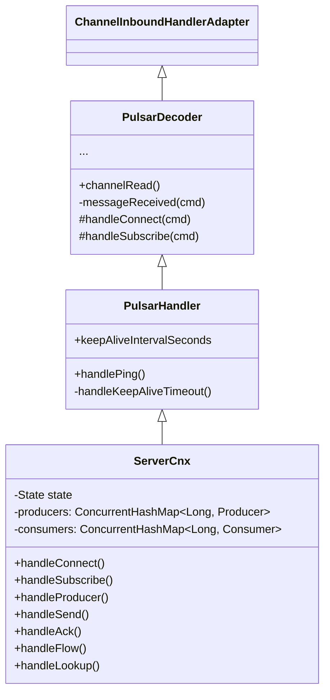

- `PulsarDecoder`（pulsar-common）：命令分发骨架；
- `PulsarHandler`（pulsar-common）：保活/心跳逻辑；
- `ServerCnx`（`pulsar-broker/src/main/java/org/apache/pulsar/broker/service/ServerCnx.java`）：全部业务处理。

### 4.2 Netty Pipeline

`pulsar-broker/src/main/java/org/apache/pulsar/broker/service/PulsarChannelInitializer.java` 的 `initChannel()`：

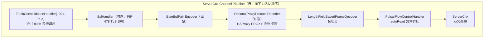

细节：

- `OptionalProxyProtocolDecoder` 探测连接前 12 字节（`MIN_BYTES_SIZE_TO_DETECT_PROTOCOL = 12`）是否为 HAProxy PROXY 协议头，是则插入 `HAProxyMessageDecoder`，用于把客户端真实 IP 透传给 broker（`pulsar-common/.../OptionalProxyProtocolDecoder.java`）；
- channel 的 `autoRead` 默认为 `false`，在 `ServerCnx.channelActive()` 中确认 PulsarService 就绪后才开启——**broker 未启动完成前不会读入任何数据**；
- `PulsarFlowControlHandler` 在接收缓冲区堆积时暂停 auto-read，形成 TCP 层背压。

### 4.3 BrokerService 启动

`pulsar-broker/src/main/java/org/apache/pulsar/broker/service/BrokerService.java`：

- `defaultServerBootstrap()`（约第 617 行）创建 Netty `ServerBootstrap`；
- `startProtocolHandlers()`（约第 568 行）启动所有协议监听器；
- socket 选项：`SO_REUSEADDR=true`、`TCP_NODELAY=true`、`ALLOCATOR=PulsarByteBufAllocator.DEFAULT`；
- 独立的 acceptor / worker 线程组。

### 4.4 ServerCnx 状态机

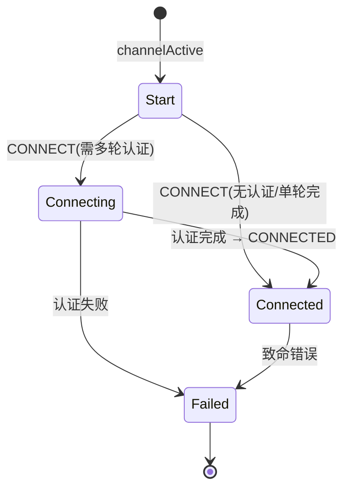

`enum State { Start, Connected, Failed, Connecting }`（`ServerCnx.java` 第 339–341 行）。

### 4.5 命令分发：PulsarDecoder

`pulsar-common/.../PulsarDecoder.java` 的 `channelRead()`（第 118–564 行）：

1. 处理 `HAProxyMessage`（若存在）；
2. 读 4 字节 `cmdSize`（无符号 int）；
3. `cmd.parseFrom(buffer, cmdSize)` 解析 protobuf（`cmd` 是**成员级复用对象**）；
4. 调用 `messageReceived(cmd)` → `switch (cmd.getType())` 分发到各 `handle*`；
5. `cmd.clear()` 归还复用对象。

> **源码级约束**：`handle*` 方法的命令参数在方法返回后即被 clear 复用，**绝不能保留引用**；需要异步处理时必须深拷贝（`.copyFrom()`）。这是阅读 Pulsar broker 代码时的常见陷阱。

### 4.6 ServerCnx 核心方法

| 方法 | 行号（约） | 功能 |
|---|---|---|
| `handleConnect()` | 1729 | 连接握手、初始化认证 |
| `handleSubscribe()` | 1886 | 创建订阅 |
| `handleProducer()` | 2320 | 创建生产者 |
| `handleSend()` | 2710 | 收到消息 → `producer.publishMessage()` |
| `handleAck()` | 2808 | 消息确认 |
| `handleFlow()` | 2864 | 流控许可 |
| `handleLookup()` | 682 | 二进制 Topic 查找 |
| `handleAuthResponse()` | 1866 | 双向认证响应 |
| `messageReceived()` | 4797 | 任意命令到达，刷新心跳状态 |

核心数据结构：`producers`、`consumers`（均为以 `producerId`/`consumerId` 为键的并发 map）、`state`、`authenticationState`、`remoteEndpointProtocolVersion`。

### 4.7 保活（Keep-Alive）

`pulsar-common/.../PulsarHandler.java`：

- 定时任务 `handleKeepAliveTimeout`：握手未完成超时 → 关闭；已发 PING 未收 PONG 又到期 → 关闭；
- 对端协议版本 ≥ v1 则周期性发送 PING；
- `handlePing()` 收到即回 PONG；
- `isHandshakeCompleted()` 由子类实现（`ServerCnx` 判断 `state == Connected`）。

---

## 5. 客户端连接处理（Client 侧）

### 5.1 类层次与 Pipeline

客户端与服务端共享同一套解码骨架：

```
ChannelInboundHandlerAdapter
    └── PulsarDecoder (pulsar-common)
         └── PulsarHandler (pulsar-common)
              └── ClientCnx (pulsar-client)
```

`pulsar-client/.../PulsarChannelInitializer.java` 的 pipeline：`FlushConsolidationHandler` → `ByteBufPair Encoder` → `LengthFieldBasedFrameDecoder` → `ClientCnx`。
TLS 由 `initTls()` 在连接建立前动态插入 pipeline 头部，支持 SNI 与主机名校验。

### 5.2 ClientCnx

`pulsar-client/src/main/java/org/apache/pulsar/client/impl/ClientCnx.java`（约 2192 行）。

状态机：

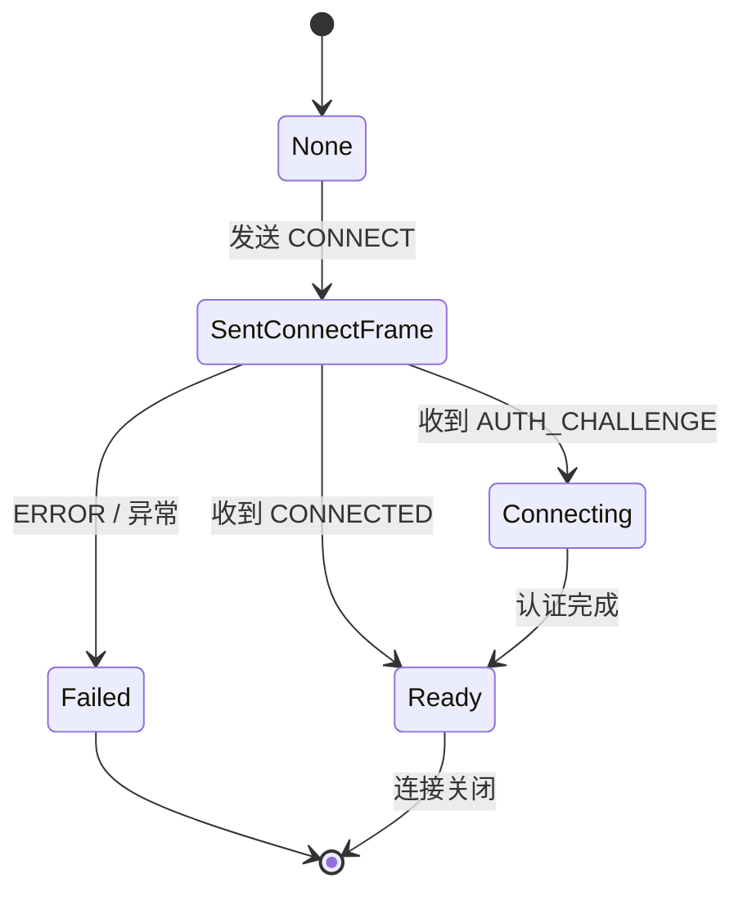

**请求-响应关联**——这是客户端协议层的核心机制：

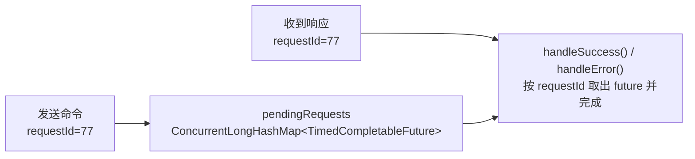

- `pendingRequests`：`ConcurrentLongHashMap<TimedCompletableFuture<?>>`，以 `requestId` 关联；
- `RequestType` 枚举区分命令类型（Command、GetLastMessageId、GetTopics、GetSchema、GetOrCreateSchema、AckResponse、Lookup）；
- `pendingLookupRequestIds` 单独跟踪 lookup 请求，用于正确归还 **lookup 并发信号量**（`pendingLookupRequestSemaphore` + `waitingLookupRequests` 排队）；
- 其他映射：`producers`、`consumers`、`transactionMetaStoreHandlers`（均按 id → 处理器）；
- `authDriver`（`BinaryAuthenticationDriver`，PIP-478）：v5 认证驱动。

### 5.3 连接池 ConnectionPool

`pulsar-client/.../ConnectionPool.java`（约 535 行）：

- 键为 `Key`（**逻辑地址 + 物理地址** 二元组，经 Proxy 连接时二者不同）；
- `pool: ConcurrentMap<Key, CompletableFuture<ClientCnx>>`；
- `maxConnectionsPerHosts`：每主机最大连接数（同主机连接会在池中轮转）；
- 空闲连接回收：`connectionMaxIdleSeconds` + `idleDetectionIntervalSeconds`，由定时任务 `asyncReleaseUselessConnectionsTask` 执行；
- 内置 DNS 解析器 `addressResolver`。

### 5.4 消息接收路径

`ClientCnx.handleMessage()`（第 911–918 行）：按 `consumer_id` 找到 `ConsumerImpl` → `consumer.messageReceived(cmdMessage, headersAndPayload, this)`，payload/metadata 的进一步解析在 ConsumerImpl 中完成（见《客户端架构》文档）。

### 5.5 v5 客户端（pulsar-client-v5）

路径 `pulsar-client-v5/src/main/java/org/apache/pulsar/client/impl/v5/`，面向 PIP-473 可扩展主题的新一代客户端，**底层复用 v4 的 `ClientCnx` / `ConnectionPool` 二进制通道**，新增 Scalable Topic 命令族：

| 类 | 用途 |
|---|---|
| `PulsarClientV5` / `PulsarClientBuilderV5` | 入口与建造者 |
| `ScalableTopicProducer` / `AsyncProducerV5` | 可扩展主题生产者 |
| `ScalableStreamConsumer` / `AsyncStreamConsumerV5` | Stream 消费者 |
| `ScalableQueueConsumer` / `AsyncQueueConsumerV5` | Queue 消费者 |
| `ScalableCheckpointConsumer` / `AsyncCheckpointConsumerV5` | Checkpoint 消费者 |
| `DagWatchClient` | DAG 监听 |
| `SegmentRouter` | 段路由 |
| `ScalableTopicsWatcher` | 可扩展主题观察器 |
| `TransactionV5` / `MessageV5` / `MessageIdV5` | 事务 / 消息 / ID |

---

## 6. Topic 查找（Lookup）机制

### 6.1 协议交互

- 请求：`CommandLookupTopic { topic, request_id, authoritative, advertised_listener_name, properties }`
- 响应：`CommandLookupTopicResponse { brokerServiceUrl, brokerServiceUrlTls, response: LookupType, request_id, authoritative, error, message, proxy_through_service_url }`

`LookupType`：`Redirect=0`（去别的 broker）、`Connect=1`（就是本 broker）、`Failed=2`。

### 6.2 Broker 端处理链

`ServerCnx.handleLookup()`（第 682–775 行）：

1. Topic 名合法性校验；
2. 检查 PulsarService 运行状态；
3. 获取 lookup 信号量（防 lookup 风暴）；
4. 鉴权 `isTopicOperationAllowed(topicName, TopicOperation.LOOKUP, ...)`；
5. `lookupTopicAsync()` 异步查找并回写响应。

`pulsar-broker/.../lookup/TopicLookupBase.java` 的静态 `lookupTopicAsync()`（第 184 行附近）委托 **`NamespaceService`** 判定 topic 所属 bundle 的 owner broker：

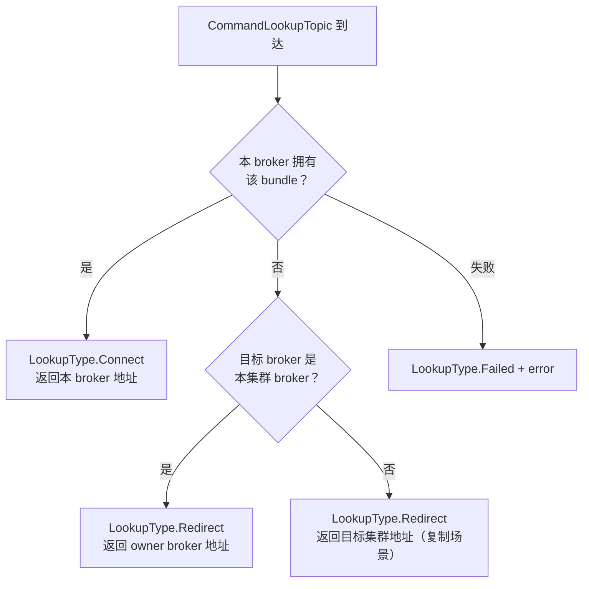

`LookupResult`（`pulsar-broker/.../lookup/LookupResult.java`）三种类型：`BrokerUrl` / `RedirectUrl` / `LoadManagerMigrationUrl`，字段含 `brokerServiceUrl`、`brokerServiceUrlTls`、`httpUrl`、`httpUrlTls`，并支持 `advertisedListeners`（按监听器名返回不同 URL，用于多网络平面）。

### 6.3 客户端跟随重定向

客户端收到 Redirect 后，向新地址重发 `CommandLookupTopic`（携带 `authoritative=true`），直到收到 Connect。`authoritative` 标志保证**最多两跳**：owner broker 的回答是权威的。

### 6.4 HTTP Lookup

REST 端点 `/lookup/v2/topic/{topic}`（`pulsar-broker/.../lookup/v2/TopicLookup.java`），与二进制 lookup 复用同一套逻辑。

### 6.5 逻辑地址 vs 物理地址

`pulsar-client/.../PulsarChannelInitializer.initializeClientCnx()`（第 232–256 行）：

- 经 Proxy 连接时，`logicalAddress`（目标 broker）≠ `physicalAddress`（Proxy）；
- 客户端把 `targetBroker` 写入 `ClientCnx`，CONNECT 时填 `proxy_to_broker_url`；
- `PROXY_TO_ANY_BROKER`：特殊哨兵地址，表示"由 Proxy 自行选择 broker"。

---

## 7. Pulsar Proxy 代理架构

模块：`pulsar-proxy/src/main/java/org/apache/pulsar/proxy/server/`。

### 7.1 核心类

| 类 | 职责 |
|---|---|
| `ProxyService` / `ProxyServiceStarter` | 服务主类 / 启动入口 |
| `ServiceChannelInitializer` | 服务端 pipeline |
| `ProxyConnection` | **核心**：代理连接状态机 |
| `DirectProxyHandler` | 直接透传模式 |
| `LookupProxyHandler` | Lookup 代理模式 |
| `ParserProxyHandler` | 解析模式（代理侧自己解析命令） |
| `ProxyClientCnx` | Proxy 作为客户端连 broker 的连接 |
| `AdminProxyHandler` | Admin REST 反向代理 |
| `BrokerDiscoveryProvider` | 从元数据发现 broker 列表 |
| `BrokerProxyValidator` | broker 地址合法性校验（防 SSRF） |

Pipeline（`ServiceChannelInitializer`）：`FlushConsolidationHandler` → `SslHandler`（可选）→ `ReadTimeoutHandler`（可选，`brokerProxyReadReadTimeoutMs`）→ `OptionalProxyProtocolDecoder`（可选）→ `LengthFieldBasedFrameDecoder` → `ProxyConnection`。

### 7.2 ProxyConnection 状态机

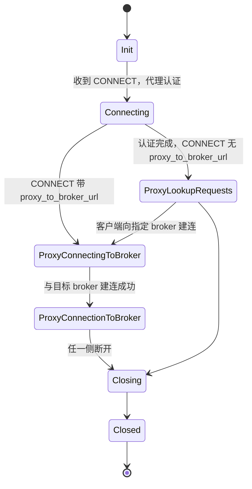

### 7.3 两种工作模式

**模式 1：Lookup 代理（`ProxyLookupRequests`）**

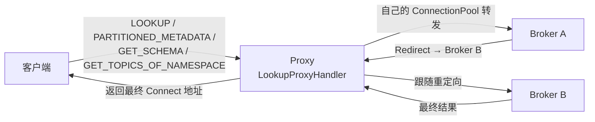

- 客户端不发 `proxy_to_broker_url`，Proxy 认证完成后建立自己的 `ConnectionPool` 与 `LookupProxyHandler`；
- Proxy **代替客户端跟随 Redirect 链**，客户端只与 Proxy 通信。

**模式 2：直接透传（`ProxyConnectionToBroker`）**

```mermaid
flowchart LR
    C["客户端"] <--|"CONNECT(proxy_to_broker_url=X)<br/>之后所有字节直接转发"| P["Proxy<br/>DirectProxyHandler"]
    P <-->|"建立到 X 的连接<br/>Epoll spliceTo 零拷贝"| B["目标 Broker X"]
```

- CONNECT 带 `proxy_to_broker_url`，Proxy 认证后建立到目标 broker 的连接（`DirectProxyHandler`）；
- 之后进入**零拷贝透传**：Linux + Epoll + 非 TLS 场景下用 `spliceTo()` 实现 NIC 到 NIC 的转发，**帧解码器在透传前被移除**——Proxy 不再理解字节流，只搬运字节；
- `ProxyConnection.channelRead()`（第 291–348 行）按状态分派：`ProxyConnectionToBroker` 时直接写 outboundChannel；`ProxyConnectingToBroker` 时丢弃输入（防竞态）。

### 7.4 认证透传

CONNECT 中的 `original_principal` / `original_auth_data` / `original_auth_method` 让 broker 拿到真实客户端身份；broker 侧可配 `authenticateOriginalAuthData=true` 对原始凭据做**二次验证**。

---

## 8. 其他协议接入：WebSocket 与 REST

### 8.1 WebSocket（pulsar-websocket）

WebSocket 服务作为 broker 内嵌组件（`PulsarService.addWebSocketServiceHandler()` 注册）或独立部署，通过 Jetty WebSocket 暴露，消息体为 JSON：

| 类 | 职责 |
|---|---|
| `WebSocketService` | 服务主类 |
| `ProducerHandler` / `ConsumerHandler` / `ReaderHandler` / `MultiTopicConsumerHandler` | 各端点处理器 |
| `WebSocketProducerServlet` / `WebSocketConsumerServlet` / `WebSocketReaderServlet` / `WebSocketMultiTopicConsumerServlet` | Servlet |
| `ProducerMessage(s)` / `ProducerAck(s)` / `ConsumerMessage` / `ConsumerCommand` / `EndOfTopicResponse` | JSON 数据模型 |
| `ProxyServer`（`service/`） | WebSocket 独立代理 |

WebSocket 服务内部用 Java 客户端连到 broker，相当于**协议网关**：JSON ⇄ 二进制协议。

### 8.2 Admin REST（WebService）

`pulsar-broker/.../web/WebService.java`：Jetty `Server` + Jersey（JAX-RS）`ServletContainer`：

- 支持 TLS（`SslConnectionFactory`）与 PROXY 协议（`ProxyConnectionFactory`）；
- `QoSHandler`、`StatisticsHandler`、`ContextHandlerCollection`；
- 认证走 `AuthenticationFilter`；
- `PulsarService.addWebServerHandlers()` 启动时注册全部资源（`webServicePort` / `webServicePortTls`）。

### 8.3 pulsar-http-client-api

`pulsar-http-client-api/src/main/java/org/apache/pulsar/http/` 下的 `PulsarHttpClient` / `PulsarHttpClientFactory` / `PulsarHttpClientConfig` / `HttpRequest` / `HttpResponse` 是 HTTP 客户端 SPI 抽象层，解耦具体 HTTP 实现。

### 8.4 MQTT / AMQP

本仓库**不包含** MQTT / AMQP 协议处理器（源码检索无相关类），它们由独立仓库 `pulsar-protocol-handler-mqtt` 等以 Protocol Handler 插件形式提供（`BrokerService.startProtocolHandlers()` 的扩展点）。

---

## 9. 安全机制：TLS 与认证

### 9.1 TLS（PIP-478 TLS SPI）

- SPI 接口：`PulsarTlsFactory`（`pulsar-tls-factory-api` 模块），用途枚举 BROKER / PROXY / CLIENT_DEFAULT 等；
- **支持证书热轮转**：通过订阅机制推送新 `SslContext`，无需重启；
- Broker 默认实现 `DefaultBrokerTlsFactory`，由 `TlsFactorySupport.createFactory()` 加载；
- `TlsContextAcquisition` 获取 Netty `SslContext`；客户端在 `PulsarChannelInitializer.initTls()` 中一次性（one-shot）获取并插入 SslHandler，支持 SNI 与主机名校验。

### 9.2 认证服务（AuthenticationService）

`pulsar-broker-common/.../authentication/AuthenticationService.java`：

- 按 `authenticationProviders` 配置加载提供者，`providers: Map<String, AuthenticationProvider>` 以认证方法名为键；
- 同方法名的多个 provider 包装为 `AuthenticationProviderList`（责任链）；
- 支持 `anonymousUserRole` 与 `strictAuthMethod`。

### 9.3 认证提供者

| Provider | 模块 | 机制 |
|---|---|---|
| `AuthenticationProviderToken` | pulsar-broker-common | JWT |
| `AuthenticationProviderTls` | pulsar-broker-common | TLS 客户端证书 |
| `AuthenticationProviderBasic` | pulsar-broker-common | Basic Auth |
| `AuthenticationProviderAthenz` | pulsar-broker-auth-athenz | Athenz |
| `AuthenticationProviderSasl` | pulsar-broker-auth-sasl | SASL（`PulsarSaslServer`、`SaslAuthenticationState` 等） |
| `AuthenticationProviderOpenID` | pulsar-broker-auth-oidc | OIDC（`JwksCache`、`OpenIDProviderMetadataCache` 等） |

### 9.4 双向认证流（AuthenticationState）

每个连接持有独立的 `AuthenticationState`：`newAuthState(authData, remoteAddress, sslSession)` → `authenticate(authData)`（可多轮）→ `isComplete()` → `getAuthRole()`。

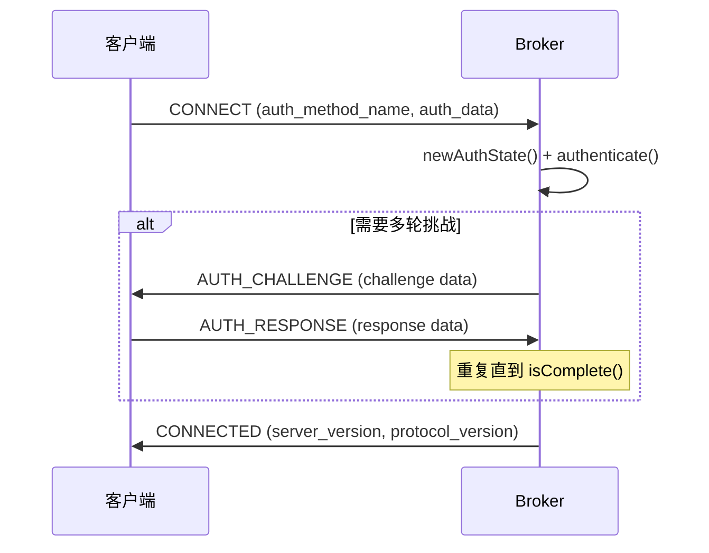

### 9.5 认证刷新

客户端 `supports_auth_refresh` 特性标志开启后，双方可在长连接上通过 AUTH_CHALLENGE/AUTH_RESPONSE 刷新即将过期的凭据，避免重连。

---

## 10. 关键流程时序图汇总

### 10.1 连接握手全流程

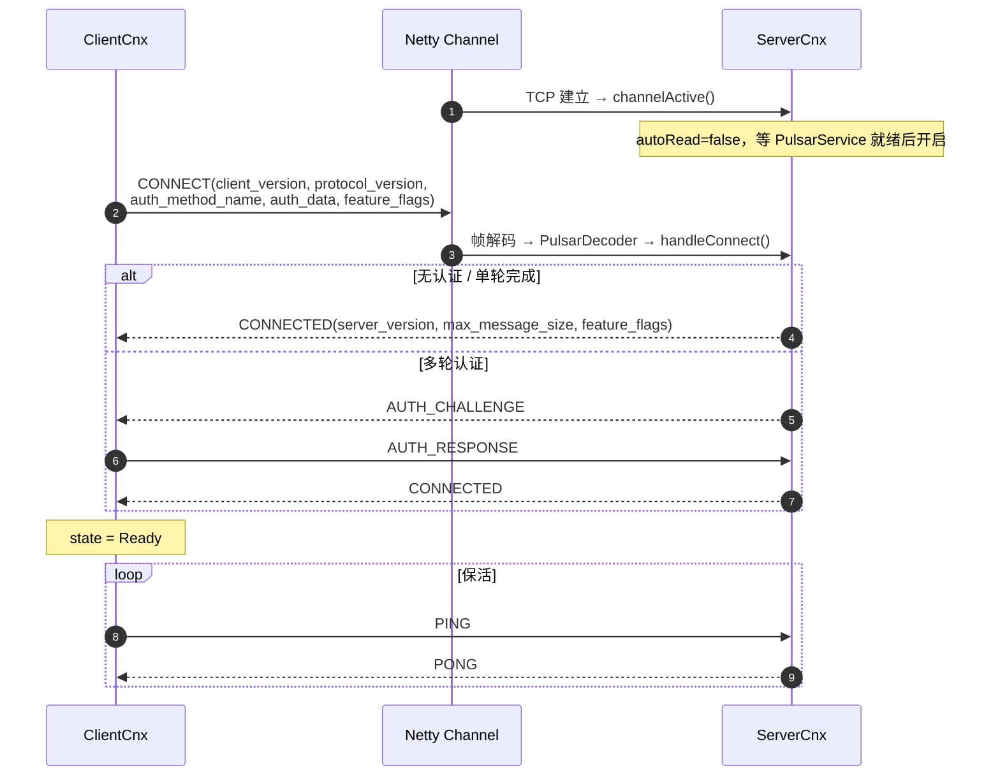

### 10.2 Topic Lookup 与生产者建立

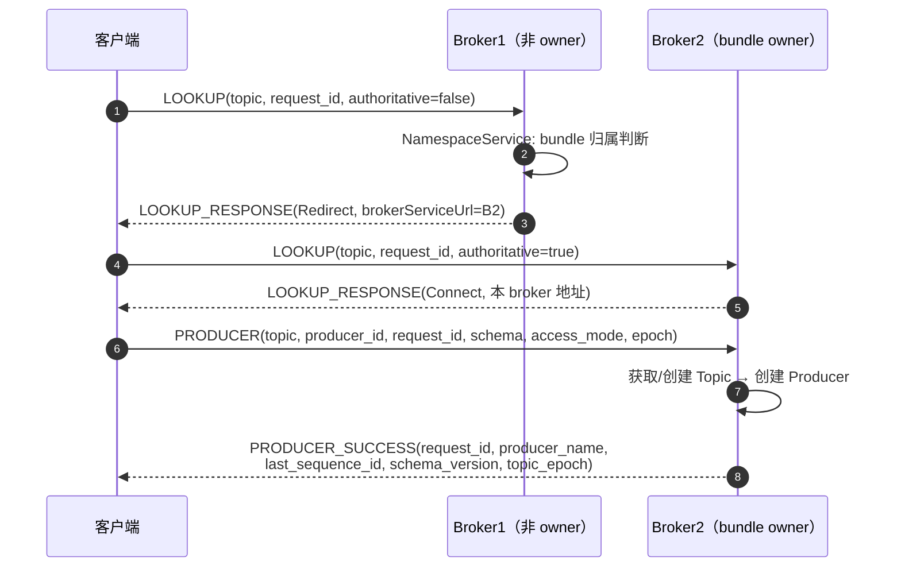

### 10.3 消息生产（发送 + 确认）

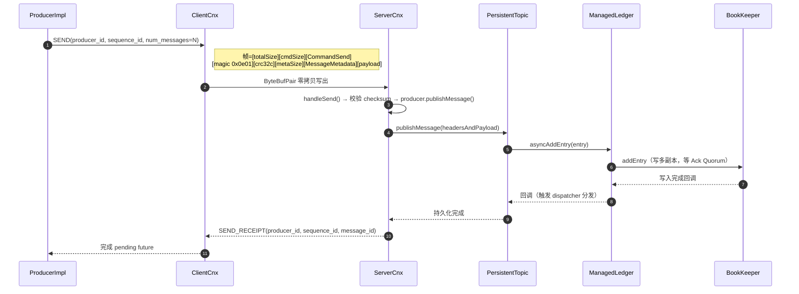

### 10.4 消费与确认（含流控）

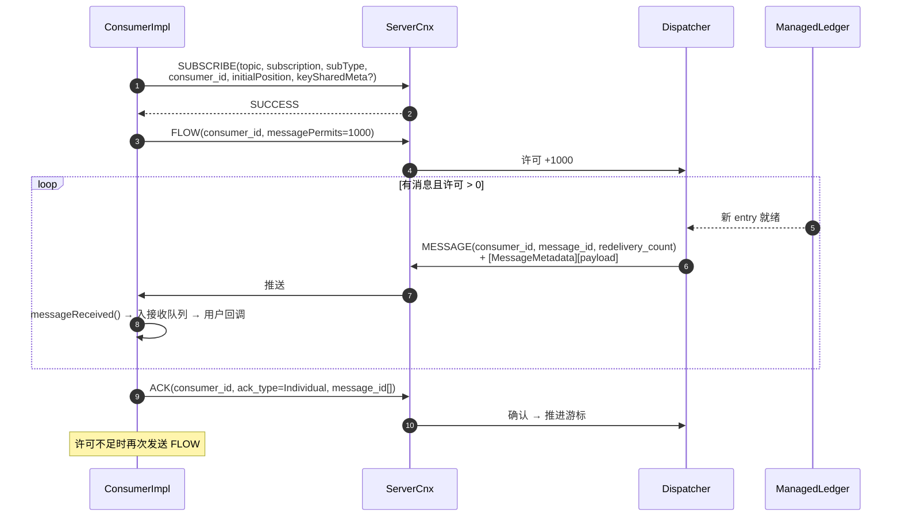

---

## 附：源码索引速查

| 主题 | 文件 |
|---|---|
| 协议定义 | `pulsar-common/src/main/proto/PulsarApi.proto` |
| 命令构建/序列化 | `pulsar-common/src/main/java/org/apache/pulsar/common/protocol/Commands.java` |
| 帧解码参数 | `pulsar-common/src/main/java/org/apache/pulsar/common/protocol/FrameDecoderUtil.java` |
| 命令分发骨架 | `pulsar-common/src/main/java/org/apache/pulsar/common/protocol/PulsarDecoder.java` |
| 保活 | `pulsar-common/src/main/java/org/apache/pulsar/common/protocol/PulsarHandler.java` |
| 零拷贝出站 | `pulsar-common/src/main/java/org/apache/pulsar/common/protocol/ByteBufPair.java` |
| HAProxy 探测 | `pulsar-common/src/main/java/org/apache/pulsar/common/protocol/OptionalProxyProtocolDecoder.java` |
| Broker pipeline | `pulsar-broker/src/main/java/org/apache/pulsar/broker/service/PulsarChannelInitializer.java` |
| Broker 连接处理 | `pulsar-broker/src/main/java/org/apache/pulsar/broker/service/ServerCnx.java` |
| Lookup 逻辑 | `pulsar-broker/src/main/java/org/apache/pulsar/broker/lookup/TopicLookupBase.java`、`LookupResult.java` |
| 客户端连接 | `pulsar-client/src/main/java/org/apache/pulsar/client/impl/ClientCnx.java` |
| 客户端 pipeline | `pulsar-client/src/main/java/org/apache/pulsar/client/impl/PulsarChannelInitializer.java` |
| 连接池 | `pulsar-client/src/main/java/org/apache/pulsar/client/impl/ConnectionPool.java` |
| Proxy 核心 | `pulsar-proxy/src/main/java/org/apache/pulsar/proxy/server/ProxyConnection.java`、`DirectProxyHandler.java`、`LookupProxyHandler.java` |
| WebSocket | `pulsar-websocket/src/main/java/org/apache/pulsar/websocket/` |
| REST 服务 | `pulsar-broker/src/main/java/org/apache/pulsar/broker/web/WebService.java` |
| 认证服务 | `pulsar-broker-common/src/main/java/org/apache/pulsar/broker/authentication/AuthenticationService.java` |
| TLS SPI | `pulsar-tls-factory-api/` |
