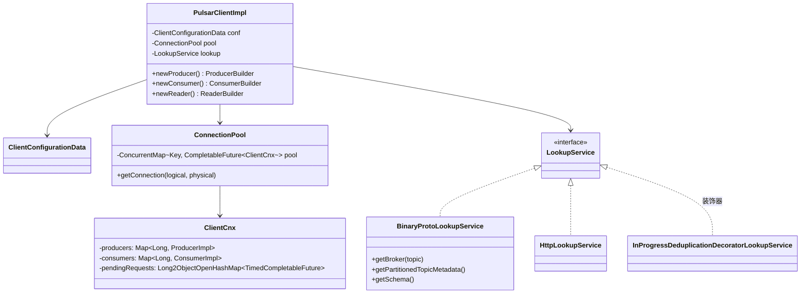
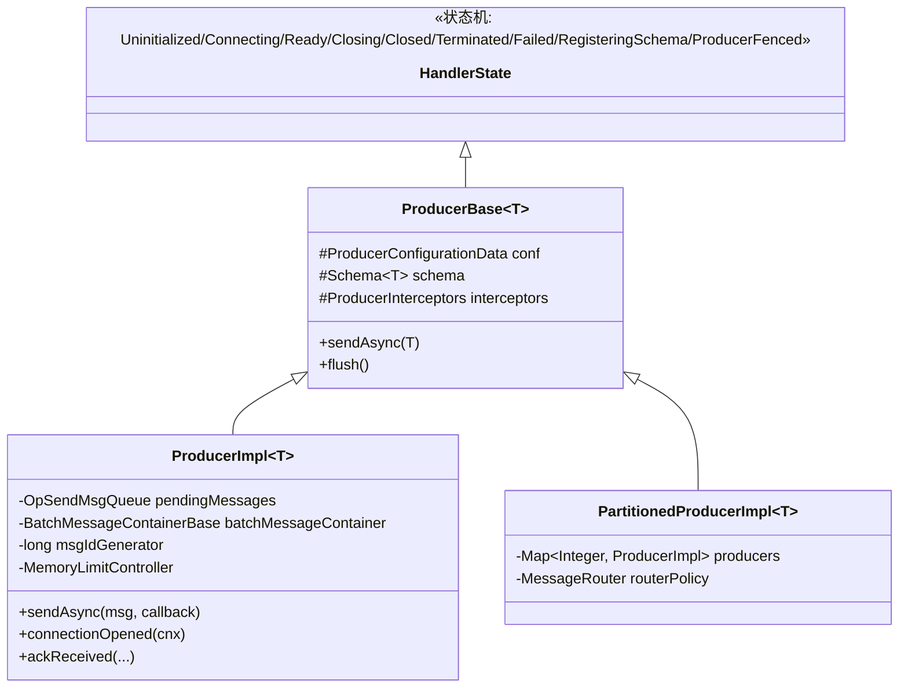
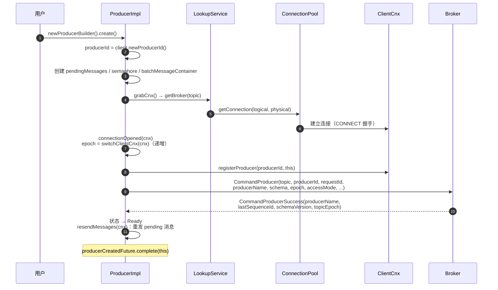
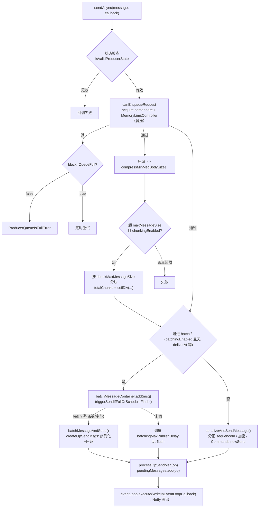
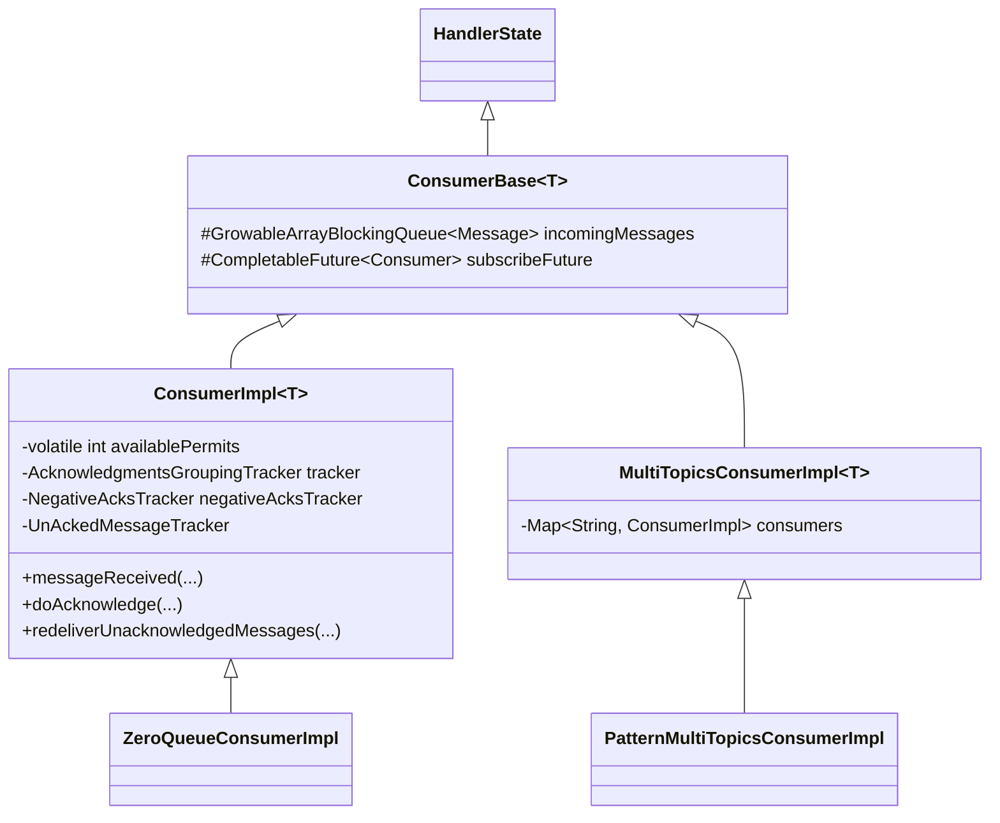
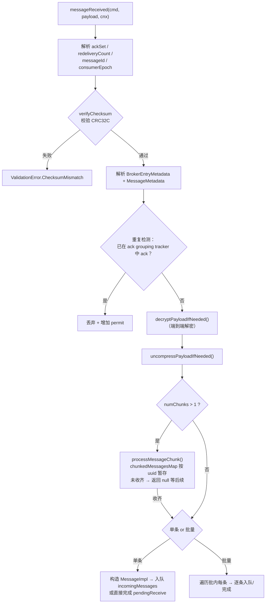
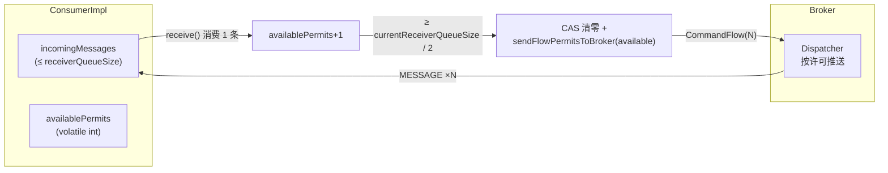
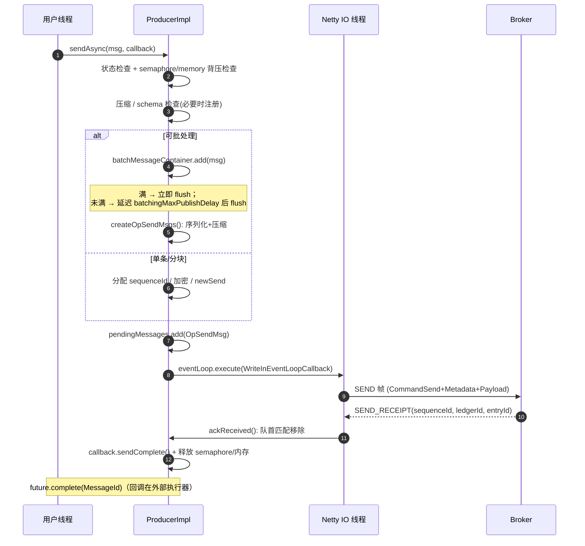
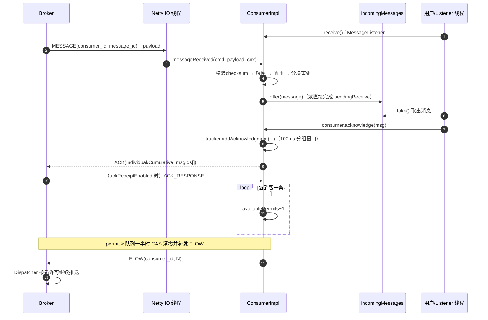

# Apache Pulsar 客户端架构详解（源码深度分析）

> 本文基于 `pulsar-client`、`pulsar-client-v5`、`pulsar-client-messagecrypto-bc` 等模块源码逐类分析，所有类名、文件路径、方法、配置键均经源码验证。路径相对仓库根目录。

---

## 目录

1. [客户端总体结构：v4 与 v5](#1-客户端总体结构v4-与-v5)
2. [PulsarClientImpl 与连接基础设施](#2-pulsarclientimpl-与连接基础设施)
3. [Producer 内部机制](#3-producer-内部机制)
4. [Consumer 内部机制](#4-consumer-内部机制)
5. [流控、确认与重投](#5-流控确认与重投)
6. [Schema 支持](#6-schema-支持)
7. [端到端加密](#7-端到端加密)
8. [客户端线程模型](#8-客户端线程模型)
9. [端到端时序图](#9-端到端时序图)

---

## 1. 客户端总体结构：v4 与 v5

### 1.1 经典客户端（pulsar-client，v4）



- 入口 `PulsarClientImpl`（`pulsar-client/src/main/java/org/apache/pulsar/client/impl/PulsarClientImpl.java`），实现 API 模块的 `org.apache.pulsar.client.api.PulsarClient`；经 SPI（`PulsarClientImplementationBinding` / `DefaultImplementation`）加载；
- 服务 URI 解析：`ServiceNameResolver` 接口 + `PulsarServiceNameResolver` 实现；
- Lookup 有二进制（`BinaryProtoLookupService`）与 HTTP（`HttpLookupService`）两种实现，以及去重装饰器 `InProgressDeduplicationDecoratorLookupService`。

### 1.2 v5 客户端（pulsar-client-v5）：装饰而非重写

`PulsarClientV5`（`pulsar-client-v5/.../v5/PulsarClientV5.java`）内部持有 `private final PulsarClientImpl v4Client;`——**完全委托 v4 的连接池、Netty、认证、加密基础设施**，在其上增加可扩展主题（scalable topic / segment）路由能力。

| v5 类 | 作用 |
|---|---|
| `PulsarClientBuilderV5` / `ProducerBuilderV5` | 构建器（产出 `ScalableTopicProducer`） |
| `ScalableTopicProducer<T>` | 可扩展主题 Producer，用 `SegmentRouter` 把消息路由到不同 segment |
| `SegmentRouter` | 以 segment 替代 v4 的 partition 概念 |
| `ScalableConsumerClient` | 消费会话管理，管理 segment 分配，底层用 v4 `ConsumerImpl` |
| `ScalableStreamConsumer` / `ScalableQueueConsumer` / `ScalableCheckpointConsumer` | 三种消费形态：流式 / 队列 / checkpoint |
| `V5ReceiveQueue<T>` | async-native、单线程 confined 的接收队列（替代 v4 阻塞队列） |
| `DagWatchClient` | DAG 拓扑 watch（scalable topic 元数据变更） |
| `MessageV5` / `MessageIdV5` / `SchemaAdapter` / `CryptoKeyReaderAdapter` / `TransactionV5` | 包装/适配层 |

v5 配置不再是"大而全"配置类，而是 `pulsar-client-api-v5/.../config/` 下的 `BatchingPolicy`、`ChunkingPolicy`、`CompressionPolicy`、`ConnectionPolicy`、`DeadLetterPolicy` 等。

---

## 2. PulsarClientImpl 与连接基础设施

### 2.1 ClientConfigurationData 关键配置

文件：`pulsar-client/.../impl/conf/ClientConfigurationData.java`

| 配置 | 默认值 | 说明 |
|---|---|---|
| `serviceUrl` | — | broker 地址 |
| `operationTimeoutMs` | 30000 | 操作超时 |
| `lookupTimeoutMs` | -1（同 operationTimeout） | Lookup 超时 |
| `numIoThreads` / `numListenerThreads` | CPU 核数 | IO / Listener 线程 |
| `connectionsPerBroker` | 1 | 每 broker 连接数 |
| `connectionMaxIdleSeconds` | 60 | 空闲回收 |
| `concurrentLookupRequest` / `maxLookupRequest` | 5000 / 50000 | Lookup 并发 |
| `maxLookupRedirects` | 20 | Lookup 重定向上限 |
| `keepAliveIntervalSeconds` | 30 | 心跳 |
| `connectionTimeoutMs` / `requestTimeoutMs` / `readTimeoutMs` | 10000 / 60000 / 60000 | |
| `memoryLimitBytes` | 64 MB | 客户端内存上限 |
| `initialBackoffIntervalNanos` / `maxBackoffIntervalNanos` | 100ms / 60s | 重连退避 |
| `proxyServiceUrl` / `proxyProtocol` | — | 经 Proxy 接入 |

### 2.2 连接池

`ConnectionPool`（`pulsar-client/.../impl/ConnectionPool.java`）：

- `pool: ConcurrentMap<Key, CompletableFuture<ClientCnx>>`，Key 维度 = broker 地址 + proxy + SNI 目标；
- 每主机最多 `connectionsPerBroker` 条，超出后轮转复用；
- 空闲检测最小间隔 `IDLE_DETECTION_INTERVAL_SECONDS_MIN = 15`。

---

## 3. Producer 内部机制

### 3.1 类层次



### 3.2 Producer 配置（ProducerConfigurationData）

文件：`pulsar-client/.../impl/conf/ProducerConfigurationData.java`

| 配置 | 默认值 | 说明 |
|---|---|---|
| `sendTimeoutMs` | 30000 | 发送超时 |
| `blockIfQueueFull` | false | 队列满时阻塞（true）或立即失败 |
| `maxPendingMessages` | 0（按内存限制） | pending 队列上限 |
| `batchingEnabled` | true | 批处理开关 |
| `batchingMaxPublishDelayMicros` | 1ms | 批发送最大延迟 |
| `batchingMaxMessages` / `batchingMaxBytes` | 1000 / 128KB | 批上限 |
| `batcherBuilder` | DEFAULT | DEFAULT / KEY_BASED / 自定义 |
| `chunkingEnabled` | false | 大消息分块 |
| `messageRoutingMode` | RoundRobin（分区时） | 路由模式 |
| `hashingScheme` | JavaStringHash | key hash 算法 |
| `compressionType` / `compressMinMsgBodySize` | NONE / 4KB | 压缩 |
| `accessMode` | Shared | Shared/Exclusive/ExclusiveWithFencing/WaitForExclusive |
| `autoUpdatePartitions` | true（60s） | 分区自动发现 |
| `initialSequenceId` | — | 序列号起点（幂等） |

### 3.3 生命周期与握手



**Producer epoch**：`ConnectionHandler` 中 `volatile long epoch = -1`，每次切换连接自增。**用于过滤旧连接上的延迟响应**（旧 epoch 的 ack 被忽略），是防脑裂/防错乱的关键。

**用户指定 producer 名语义**：`userProvidedProducerName` 标志随 `CommandProducer` 上送；为 true 时 broker 直接使用用户名（同名互斥/恢复语义），为 false 时由 broker 分配（`producerNameGenerator`）并在 `CommandProducerSuccess` 中返回。

### 3.4 发送路径



关键实现（`ProducerImpl.java`，约 3126 行）：

- **OpSendMsg**（内部类，L1755 起）：字段含 `msgs`、`cmd: ByteBufPair`、`callback`、`sequenceId/highestSequenceId`、`retryCount`、`totalChunks/chunkId/chunkedMessageCtx`；基于 Netty `Recycler` 池化；
- **OpSendMsgQueue**（L1999）：基于 `ArrayDeque` 的 FIFO，附 `messagesCount`（批消息按条数计）；
- **确认路径**：broker 回 `CommandSendReceipt` → `ClientCnx.handleSendReceipt` → `producer.ackReceived(sequenceId, highestSequenceId, ledgerId, entryId)`（L1485）：从 `pendingMessages` 队首匹配移除 → 回调成功 → 释放 semaphore 与内存；
- **重连重发**：`ConnectionHandler.reconnectLater`（Backoff 100ms→60s）重连成功后 `resendMessages(cnx)` 重发全部 pending；`sendTimeout` 定时器（HashedWheelTimer）超时则失败超时消息。

### 3.5 批处理容器层次

```
BatchMessageContainer (API)
  └── BatchMessageContainerBase (内部接口)
        └── AbstractBatchMessageContainer
              ├── BatchMessageContainerImpl      (默认：按顺序聚合)
              ├── BatchMessageKeyBasedContainer  (按 key 分组)
              └── EntryBucketBatchContainer      (entry bucket 模式, PIP-486)
```

flush 触发：`isBatchFull()`（达到 `maxBytes` 或 `maxMessages`）立即发送；否则调度 `batchingMaxPublishDelayMicros` 定时 flush（`triggerSendIfFullOrScheduleFlush`，L1173）。

### 3.6 大消息分块（Chunking）

- 元数据：每个 chunk 设置 `chunkId`、`numChunksFromMsg`、`uuid`（`producerName-sequenceId`）；
- 仅最后一个 chunk 的 op 携带 `uncompressedSize`；
- 消费侧在 `ConsumerImpl.messageReceived` 用 `chunkedMessagesMap`（按 uuid 暂存）重组，收齐后返回完整消息（见 4.4）。

### 3.7 双层背压

1. **信号量层**：`maxPendingMessages` 条数限制；
2. **内存层**：`MemoryLimitController`（`pulsar-client/.../impl/MemoryLimitController.java`）基于 `memoryLimitBytes`（默认 64MB）的字节级限制。

任一不满足时：`blockIfQueueFull=false` → 立即回调 `ProducerQueueIsFullError`；`true` → timer 调度稍后重试。

### 3.8 分区 Producer（PartitionedProducerImpl）

- `producers: Map<Integer, ProducerImpl<T>>`，每分区一个；
- `maxPendingMessagesAcrossPartitions` 平摊到各分区：`max(1, total / numPartitions)`；
- 路由策略：

| 路由器 | 行为 |
|---|---|
| `RoundRobinPartitionMessageRouterImpl`（默认） | 无 key 消息原子递增轮询分区；有 key 按 `hashingScheme` hash 取模 |
| `SinglePartitionMessageRouterImpl` | 无 key 消息固定发往随机选的一个分区；有 key 仍按 hash |
| `PartialRoundRobinMessageRouterImpl`（`customroute/`） | 按 `batchingPartitionSwitchFrequency` 周期切换的部分轮询 |
| 自定义 `MessageRouter` | 用户实现 |

基类 `MessageRouterBase` 提供 `makeHash(key, hashingScheme)`。分区自动发现：每 `autoUpdatePartitionsIntervalSeconds`（60s）检查，扩分区时创建新 ProducerImpl。

---

## 4. Consumer 内部机制

### 4.1 类层次



`ConsumerImpl`（约 3410 行）+ `MultiTopicsConsumerImpl` 覆盖绝大部分消费逻辑。

### 4.2 Consumer 配置（ConsumerConfigurationData）

文件：`pulsar-client/.../impl/conf/ConsumerConfigurationData.java`

| 配置 | 默认值 | 说明 |
|---|---|---|
| `subscriptionType` | Exclusive | Exclusive/Shared/Failover/Key_Shared |
| `subscriptionMode` | Durable | Durable/NonDurable |
| `subscriptionInitialPosition` | Latest | Latest/Earliest |
| `receiverQueueSize` | 1000 | 接收队列（= 初始 flow permit） |
| `acknowledgementsGroupTimeMicros` | 100ms | Ack 分组窗口 |
| `maxAcknowledgmentGroupSize` | 1000 | Ack 分组条数上限 |
| `negativeAckRedeliveryDelayMicros` | 1min | 负确认重投延迟 |
| `ackTimeoutMillis` / `tickDurationMillis` | 0 / 1000 | 未确认超时（0=禁用） |
| `maxTotalReceiverQueueSizeAcrossPartitions` | 50000 | 分区总队列上限 |
| `maxPendingChunkedMessage` | 10 | 未完成分块消息上限 |
| `expireTimeOfIncompleteChunkedMessageMillis` | 1min | 不完整分块过期 |
| `batchIndexAckEnabled` | true | 批索引级 ack |
| `ackReceiptEnabled` | false | Ack 回执 |
| `readCompacted` | false | 读压缩 topic |
| `patternAutoDiscoveryPeriod` | 60 | 正则订阅发现周期 |
| `deadLetterPolicy` / `retryEnable` | — / false | DLQ/重试 |
| `keySharedPolicy` | — | Key_Shared 策略 |
| `autoScaledReceiverQueueSizeEnabled` | false | 队列自动伸缩 |
| `priorityLevel` | 0 | 优先级（越小越高） |

### 4.3 订阅建立

`ConsumerImpl.connectionOpened`（L878）：

1. 生成 `requestId`，记录 `incomingMessages.size()`（重连后补发 flow 用），`setClientCnx(cnx)`，清空接收队列；
2. 发送 `CommandSubscribe`（topic、subscription、consumerId、requestId、subType、priorityLevel、consumerName、isDurable、startMessageIdData、readCompacted、InitialPosition、schemaInfo、keySharedPolicy、consumerEpoch）；
3. 成功后：状态 Ready → `consumerIsReconnectedToBroker` → `subscribeFuture.complete` → **立即发送初始 flow 许可**（`increaseAvailablePermits(cnx, getCurrentReceiverQueueSize())`）。

### 4.4 消息接收路径

```
Netty IO 线程
  → PulsarDecoder.channelRead（解帧）
  → ClientCnx.handleMessage（按 consumerId 找 ConsumerImpl）
  → ConsumerImpl.messageReceived(cmdMessage, headersAndPayload, cnx)
```

`messageReceived`（L1436）流水线：



接收队列 `incomingMessages`：`GrowableArrayBlockingQueue<Message<T>>`（`ConsumerBase` L97），从 0 增长到 `receiverQueueSize`；`incomingMessagesSize` 跟踪字节量做内存控制。

### 4.5 分区/多主题消费（MultiTopicsConsumerImpl）

- `consumers: Map<String, ConsumerImpl<T>>` 每分区一个，`partitionedTopics` 记录分区数；
- **Ack 聚合**：要求 `MessageId` 为 `TopicMessageId`，按 topic+partition 定位 ConsumerImpl 委托执行；批量 ack 先按 topic 分组；
- **公平调度**：轮询各分区接收队列；**暂停队列已满分区的 flow**，防活跃分区独占缓冲区；
- `PatternMultiTopicsConsumerImpl` 支持正则订阅，按 `patternAutoDiscoveryPeriod` 自动发现新 topic。

---

## 5. 流控、确认与重投

### 5.1 Permit 流控（CommandFlow）



- 初始：订阅成功后发送 `getCurrentReceiverQueueSize()` 个 permit；
- 半量阈值刷新（`increaseAvailablePermits`，L1961）：permit 累计到队列一半才批量刷给 broker，**减少 FLOW 命令频率**；
- `currentReceiverQueueSize` 可自动伸缩（`autoScaledReceiverQueueSizeEnabled`）。

### 5.2 确认（Ack）

- `doAcknowledge(MessageId, AckType, properties, txn)`（L627）：
  - **Individual**：进入 `acknowledgmentsGroupingTracker.addAcknowledgment(...)` 分组；
  - **Cumulative**：直接发送（不分组）；
  - 批量：按分区分组后分别 ack。

**Ack 分组器**（`AcknowledgmentsGroupingTracker` 接口 / `PersistentAcknowledgmentsGroupingTracker` / `NonPersistentAcknowledgmentGroupingTracker`）：

- 窗口 `acknowledgementsGroupTimeMicros`（100ms）+ 条数上限 `maxAcknowledgmentGroupSize`（1000）；
- 用 Netty event loop 的 `scheduleWithFixedDelay` 周期 flush；
- 支持 batch index ack（`BitSetRecyclable` / `long[] ackSet` 表示批内被 ack 的索引）；
- flush 时 `Commands.newAck(consumerId, ledgerId, entryId, ackSet, ackType, ...)`；
- `isDuplicate(msgId)` 用于接收侧去重（4.4 步骤 E）。

### 5.3 负确认与重投

`NegativeAcksTracker`（`pulsar-client/.../impl/NegativeAcksTracker.java`）：

- `add(MessageId, redeliveryCount)` → 按 `negativeAckRedeliveryBackoff` 或固定 `negativeAckRedeliveryDelayMicros` 计算重投时间；
- 用 `negativeAckPrecisionBitCnt = 8` 位精度把时间戳向下对齐（减少时间桶）；
- `TreeMap<Long, Set<MessageId>>` 按时间分桶，定时到期后 `redeliverUnacknowledgedMessages(messageIds)` 发 `CommandRedeliverUnacknowledgedMessages`；
- **Shared / Key_Shared 支持单条重投；Exclusive / Failover 只能整批重投**。

### 5.4 未确认超时（UnAckedMessageTracker）

`ackTimeoutMillis`（默认禁用）+ `tickDurationMillis` 时间轮式跟踪，超时触发重投；多主题场景用 `UnAckedTopicMessageTracker`，另有 `UnAckedMessageRedeliveryTracker` 记录已进入重投流程的消息防重复。

### 5.5 死信与重试（DeadLetterPolicy）

- 默认命名：`{topic}-{subscription}-DLQ` / `{topic}-{subscription}-RETRY`；
- `doReconsumeLater`（L688）：重投次数 < `maxRedeliverCount` → 发往 retry topic（同时 ack 原消息）；达到 → 发往 DLQ；
- 内部惰性创建 `retryLetterProducer` 与 `deadLetterProducer` 两个 `Producer<byte[]>`。

### 5.6 订阅类型在客户端的差异

| 类型 | 客户端行为 |
|---|---|
| Exclusive | 单消费者独占 |
| Failover | 通过 `handleActiveConsumerChange` 感知主备切换（L922 → `activeConsumerChanged`） |
| Shared | 可单条负确认重投 |
| Key_Shared | 订阅时上送 `KeySharedPolicy`（AUTO_SPLIT/STICKY + hashRanges）；粘性分配由 broker `StickyKeyConsumerSelector` 体系完成（`ConsistentHashingStickyKeyConsumerSelector`、`HashRangeAutoSplitStickyKeyConsumerSelector`、`HashRangeExclusiveStickyKeyConsumerSelector`） |

---

## 6. Schema 支持

### 6.1 Producer 侧注册与缓存

`populateMessageSchema`（L918）维护三种 SchemaState：`None / Ready / Broken`：

1. 首遇新 schema → `tryRegisterSchema`（L967）：状态转 `RegisteringSchema`（期间新消息入队不发送），发送 `CommandGetOrCreateSchema`；
2. 成功 → `schemaVersion` 缓存进 `schemaCache: Map<SchemaHash, byte[]>`，消息转 Ready；失败（不兼容）→ Broken；
3. 完成后 `recoverProcessOpSendMsgFrom(...)` 恢复发送队列。

`multiSchema = true`（默认）允许同一 topic 多 schema 共存。`SchemaHash`（`pulsar-common/.../protocol/schema/SchemaHash.java`）作缓存键。

### 6.2 消费侧：AutoConsumeSchema 与多版本

- `AutoConsumeSchema`（`pulsar-client/.../impl/schema/AutoConsumeSchema.java`）：实现 `Schema<GenericRecord>`，按消息 `schemaVersion` 动态取 schema 解析；内部 `ConcurrentMap<SchemaVersion, Schema<GenericRecord>> schemaMap` + `schemaInfoProvider`；支持 Avro/JSON/Protobuf Native/KeyValue/各 primitive；
- `MultiVersionSchemaInfoProvider`（`.../schema/generic/`）：Guava LoadingCache 缓存版本 → SchemaInfo；`MultiVersionGenericAvroReader` 等实现 writer/reader schema 演进兼容。

---

## 7 端到端加密

### 7.1 组件

- API 接口 `MessageCrypto`（`pulsar-client-api/.../api/MessageCrypto.java`）：`encrypt(Set<String> encKeys, CryptoKeyReader, MessageMetadata, ByteBuffer payload, ByteBuffer out)` / `decrypt(...)`；
- BouncyCastle 实现 `MessageCryptoBc`（`pulsar-client-messagecrypto-bc/.../crypto/MessageCryptoBc.java`）。

### 7.2 信封加密（Producer 侧）

调用链：`sendAsync → serializeAndSendMessage → encryptMessageOrReleaseSource → encryptMessage`。`MessageCryptoBc.encrypt`（L455）：

1. `addCipherText`：生成随机 **data key**（AES）；对每个 `encKey` 公钥名，从 `CryptoKeyReader.getPublicKey` 取公钥（RSA/ECIES）加密 data key，密文与元数据写入 `msgMetadata.encryption_keys`；
2. 用 data key（AES-GCM）加密 payload（**批消息在批整体级别加密**，非逐条）；
3. IV / tag / 算法写入 `msgMetadata`；每次调用重新生成 data key（天然密钥轮换）。

### 7.3 解密（Consumer 侧）

`decryptPayloadIfNeeded`：从 `MessageMetadata.encryption_keys` 找可用项 → `CryptoKeyReader.getPrivateKey` 解出 data key → 解密 payload；失败按 `cryptoFailureAction`（`FAIL` / `DISCARD` / `CONSUME`）处理。

---

## 8. 客户端线程模型

由 `PulsarClientResourcesConfigurer`（`pulsar-client/.../impl/PulsarClientResourcesConfigurer.java`）统一创建：

| 线程池 | 名字前缀 | 数量 | 用途 |
|---|---|---|---|
| Netty EventLoopGroup | `pulsar-client-io` | `numIoThreads`（=CPU） | 全部网络 IO：连接/读写/编解码/命令处理 |
| 外部执行器 | `pulsar-external-listener` | `numListenerThreads`（=CPU） | 用户回调（MessageListener、future 回调） |
| 内部执行器 | `pulsar-client-internal` | `numIoThreads` | 内部异步任务 |
| Lookup 执行器 | `pulsar-client-lookup` | 1 | Lookup 任务 |
| 定时执行器 | `pulsar-client-scheduled` | `numIoThreads` | 定时任务（ack 分组 flush 等） |
| Timer | `pulsar-timer`（HashedWheelTimer） | 1 | 超时检测（send/ack timeout） |

- EventLoop 按 NIO/Epoll/Kqueue 平台自适应（`EventLoopUtil.newEventLoopGroup`），`enableBusyWait` 可开忙等（低延迟）；
- 每个 Consumer 绑定 pinned 的 internal/external executor 线程，保证串行；
- `ListenerTaskScheduler` 对 listener drain 任务合并，减少 executor 提交；
- **核心纪律：用户代码绝不跑在 Netty IO 线程上**。

v5 差异：`V5ReceiveQueue` 完全 confined 到单个 pinned executor，无锁、无阻塞 take、支持可取消的 receiveAsync。

---

## 9. 端到端时序图

### 9.1 Producer 发送（含批处理与背压）



### 9.2 Consumer 接收、流控与确认



---

## 附：关键文件索引

| 主题 | 文件 |
|---|---|
| Client 入口 | `pulsar-client/src/main/java/org/apache/pulsar/client/impl/PulsarClientImpl.java` |
| Client 配置 | `pulsar-client/src/main/java/org/apache/pulsar/client/impl/conf/ClientConfigurationData.java` |
| 连接池 | `pulsar-client/src/main/java/org/apache/pulsar/client/impl/ConnectionPool.java` |
| 连接处理 | `pulsar-client/src/main/java/org/apache/pulsar/client/impl/ClientCnx.java` |
| 重连/epoch | `pulsar-client/src/main/java/org/apache/pulsar/client/impl/ConnectionHandler.java` |
| Lookup | `pulsar-client/src/main/java/org/apache/pulsar/client/impl/BinaryProtoLookupService.java` |
| Producer | `pulsar-client/src/main/java/org/apache/pulsar/client/impl/ProducerImpl.java`、`ProducerBase.java`、`conf/ProducerConfigurationData.java` |
| 分区 Producer | `pulsar-client/src/main/java/org/apache/pulsar/client/impl/PartitionedProducerImpl.java`、`RoundRobinPartitionMessageRouterImpl.java`、`MessageRouterBase.java` |
| 批处理容器 | `pulsar-client/.../impl/AbstractBatchMessageContainer.java`、`BatchMessageContainerImpl.java`、`BatchMessageKeyBasedContainer.java` |
| Consumer | `pulsar-client/src/main/java/org/apache/pulsar/client/impl/ConsumerImpl.java`、`ConsumerBase.java`、`conf/ConsumerConfigurationData.java` |
| 多主题/分区消费 | `pulsar-client/src/main/java/org/apache/pulsar/client/impl/MultiTopicsConsumerImpl.java` |
| Ack 分组 | `pulsar-client/.../impl/PersistentAcknowledgmentsGroupingTracker.java` |
| 负确认 | `pulsar-client/.../impl/NegativeAcksTracker.java` |
| 未确认超时 | `pulsar-client/.../impl/UnAckedMessageTracker.java` |
| 内存背压 | `pulsar-client/.../impl/MemoryLimitController.java` |
| AutoConsume | `pulsar-client/.../impl/schema/AutoConsumeSchema.java`、`schema/generic/MultiVersionSchemaInfoProvider.java` |
| 加密 | `pulsar-client-messagecrypto-bc/src/main/java/org/apache/pulsar/client/impl/crypto/MessageCryptoBc.java` |
| 线程资源 | `pulsar-client/.../impl/PulsarClientResourcesConfigurer.java`、`ListenerTaskScheduler.java` |
| v5 客户端 | `pulsar-client-v5/src/main/java/org/apache/pulsar/client/impl/v5/`（`PulsarClientV5`、`ScalableTopicProducer`、`ScalableConsumerClient`、`V5ReceiveQueue`、`SegmentRouter`、`DagWatchClient` 等） |
