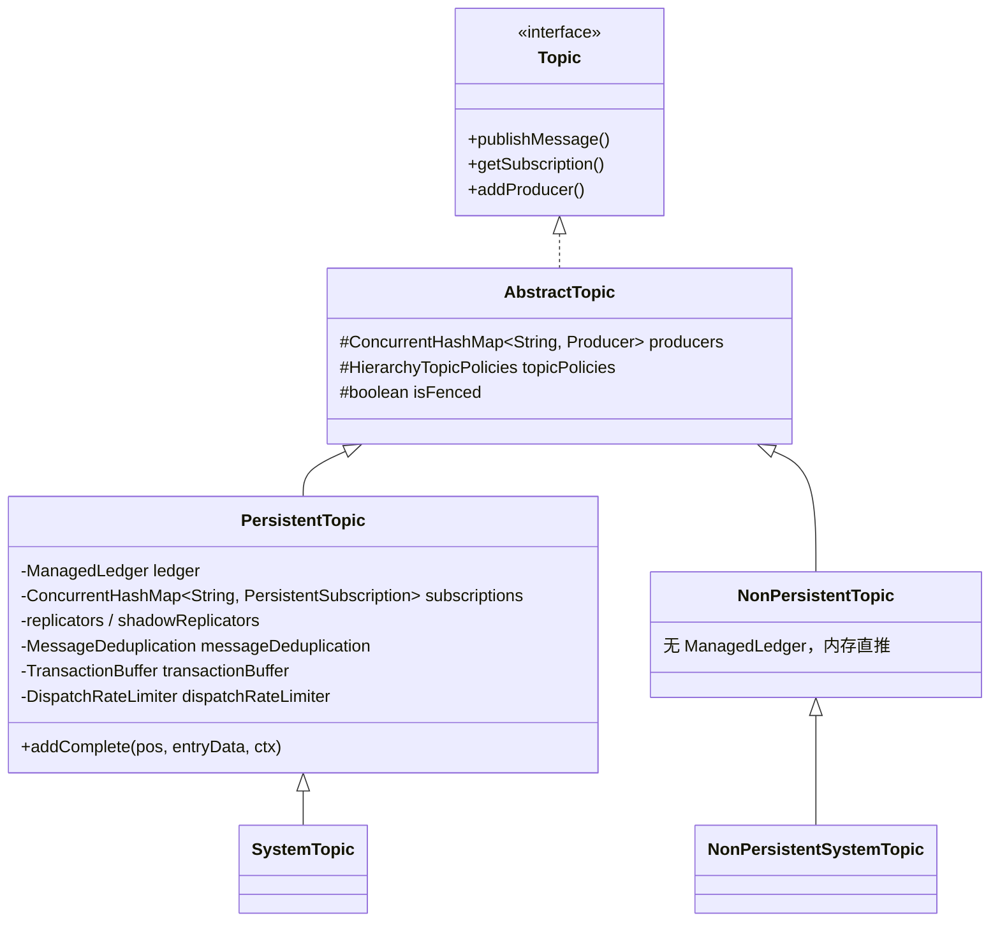
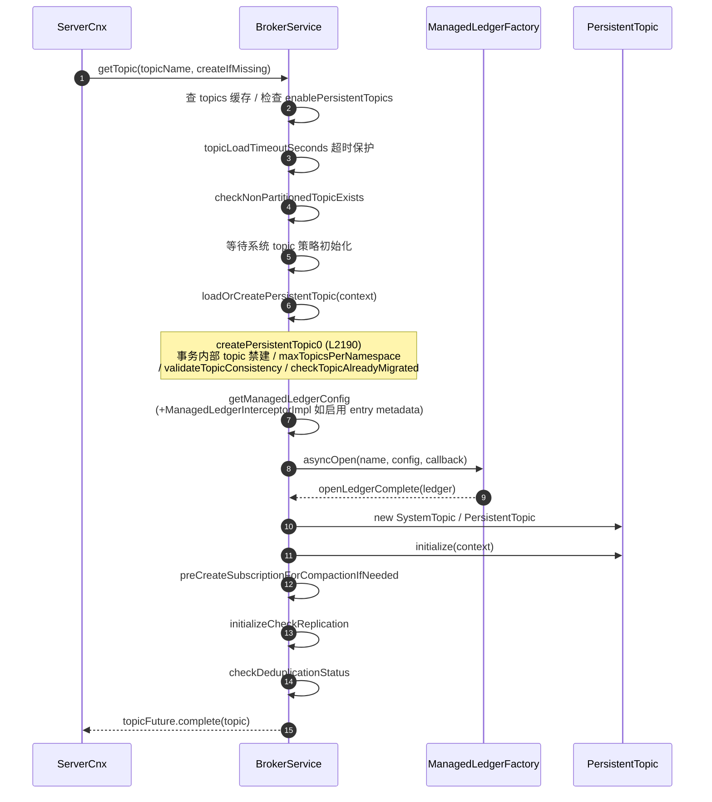
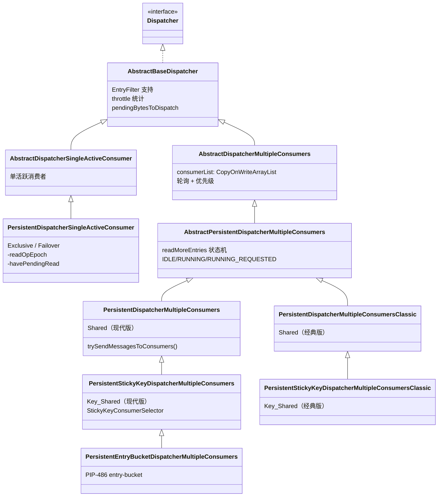
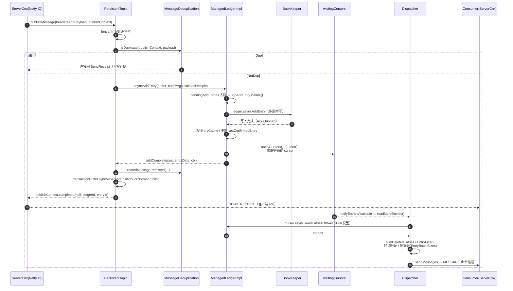
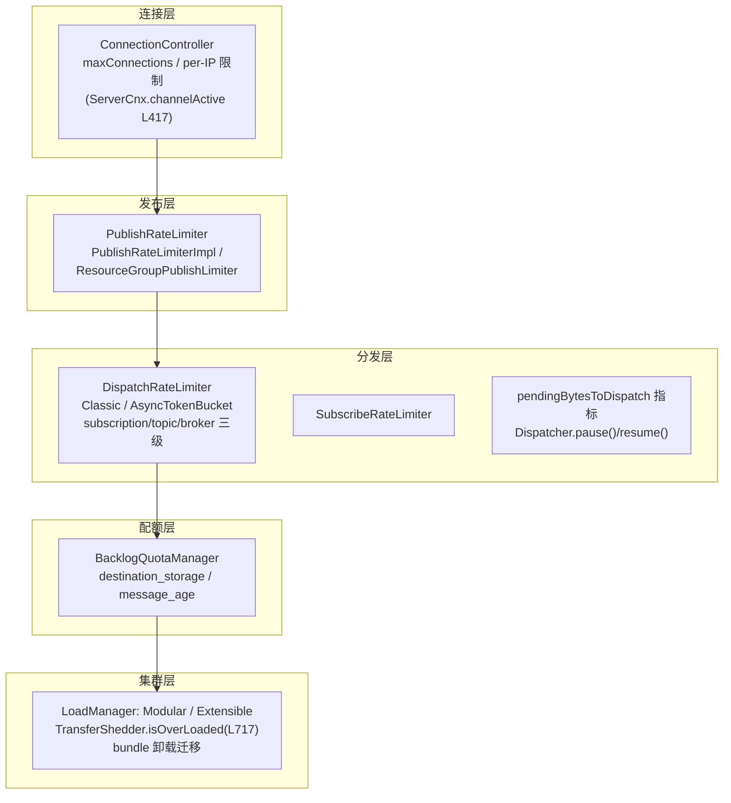
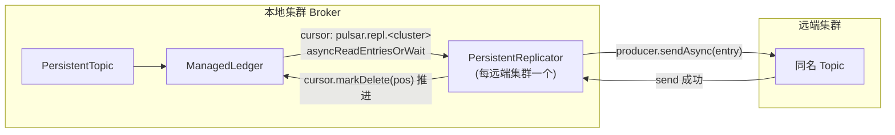
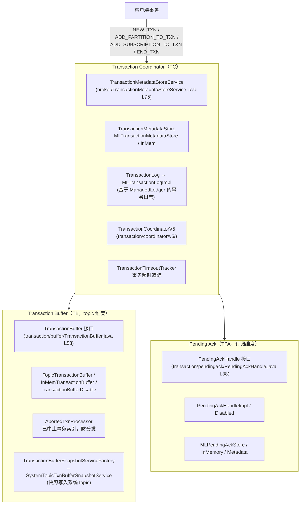

# Apache Pulsar Broker 内部机制详解（源码深度分析）

> 本文基于 `pulsar-broker` 模块源码逐类分析，所有类名、文件路径、方法、配置键均经源码验证。路径相对仓库根目录。

---

## 目录

1. [Topic 类体系与生命周期](#1-topic-类体系与生命周期)
2. [订阅与分发体系（Dispatcher）](#2-订阅与分发体系dispatcher)
3. [消息从发布到分发全流程](#3-消息从发布到分发全流程)
4. [背压与限流体系](#4-背压与限流体系)
5. [去重、TTL、延迟投递、死信](#5-去重ttl延迟投递死信)
6. [Geo-Replication 复制机制](#6-geo-replication-复制机制)
7. [事务体系](#7-事务体系)
8. [系统 Topic 与 Topic 级策略](#8-系统-topic-与-topic-级策略)
9. [Broker 线程模型与 PIP-486 可扩展 Topic](#9-broker-线程模型与-pip-486-可扩展-topic)

---

## 1. Topic 类体系与生命周期

### 1.1 类层次



| 类 | 文件 | 说明 |
|---|---|---|
| `Topic` | `pulsar-broker/.../service/Topic.java` | 接口；内含 `PublishContext`（第 53 行起） |
| `AbstractTopic` | `.../service/AbstractTopic.java`（L102） | 持有 `producers`、`brokerService`、`topicPolicies: HierarchyTopicPolicies`、`isFenced`、`replicatorPrefix`；实现 `TopicPolicyListener` |
| `PersistentTopic` | `.../persistent/PersistentTopic.java`（L215） | 持有 `ledger`、`subscriptions`（L224）、`replicators`、`messageDeduplication`、`transactionBuffer`、限流器；实现 `AddEntryCallback` |
| `SystemTopic` | `.../persistent/SystemTopic.java`（L37） | 系统内部 topic（如 `__change_events`） |
| `NonPersistentTopic` | `.../nonpersistent/NonPersistentTopic.java`（L105） | 无 ManagedLedger，消息经内存 dispatcher 直接推送 |

### 1.2 Topic 加载流程

入口 `BrokerService.getTopic(TopicName, createIfMissing, properties)`（`BrokerService.java` L1334），缓存 `topics: ConcurrentHashMap<String, CompletableFuture<Optional<Topic>>>`（L236）。

加载阶段枚举（`TopicLoadingContext.java` L37–44）：

```
NAMESPACE_POLICIES → TOPIC_POLICIES → OPEN_ML → INITIALIZE
    → PRE_CREATE_COMPACTED_SUB → REPLICATION → DEDUPLICATION
```



非持久化 topic（L1419–1447）：检查 `isEnableNonPersistentTopics()` 后直接 `createNonPersistentTopic`，不走 ManagedLedger。

---

## 2. 订阅与分发体系（Dispatcher）

### 2.1 Subscription 类层次

```
Subscription (interface, extends MessageExpirer)
  └── AbstractSubscription
        ├── PersistentSubscription   (persistent/PersistentSubscription.java, L97)
        └── NonPersistentSubscription
```

`PersistentSubscription` 持有：`ManagedCursor cursor`、`Dispatcher dispatcher`、`PersistentMessageExpiryMonitor expiryMonitor`、`PendingAckHandle pendingAckHandle`（事务 ack）。

### 2.2 Dispatcher 类层次（核心）



Dispatcher 由 `PersistentSubscription.reuseOrCreateDispatcher()`（L302 起）按订阅类型创建：

| 订阅类型 | Dispatcher | 行号 |
|---|---|---|
| Exclusive | `PersistentDispatcherSingleActiveConsumer(SubType.Exclusive)` | L309 |
| Shared | `PersistentDispatcherMultipleConsumers` 或 Classic（`subscriptionSharedUseClassicPersistentImplementation`） | L315–318 |
| Failover | `PersistentDispatcherSingleActiveConsumer(SubType.Failover, partitionIndex)` | L333 |
| Key_Shared | `PersistentStickyKeyDispatcherMultipleConsumers` 或 Classic | L348–354 |
| Key_Shared（entry-bucket） | `PersistentEntryBucketDispatcherMultipleConsumers`（`ksm.isEntryBucketDispatch()` 为 true） | L343–347 |

### 2.3 Exclusive / Failover：`PersistentDispatcherSingleActiveConsumer`

文件：`.../persistent/PersistentDispatcherSingleActiveConsumer.java`（L62）。

- `readMoreEntries(consumer)`（L335）：`cursor.asyncReadEntriesOrWait(...)`；
- **`readOpEpoch`（L81）**：读操作纪元。redeliver 触发 `rewind()` 后，**旧一轮已发出的读完成回调会因 epoch 不匹配被忽略**——处理重读竞态的关键设计；
- `havePendingRead`（L76）：防并发读；
- `scheduleReadOnActiveConsumer()`（L111）：活跃消费者切换时 rewind cursor 重读；Failover 有 `activeConsumerFailoverDelayTimeMillis` 延迟防消息重复；
- `readEntriesComplete`（L167）：读取完成后 `consumer.sendMessages(entries, ...)`。

### 2.4 Shared：`PersistentDispatcherMultipleConsumers`

文件：`.../persistent/PersistentDispatcherMultipleConsumers.java`（L86）。核心方法 `trySendMessagesToConsumers(ReadType, List<Entry>)`（L801）：

1. `cursor.trimDeletedEntries(entries)` 清理已 ack 条目（L802–804）；
2. 解析每条 entry 的 `MessageMetadata`（L812）；
3. **EntryFilter 过滤**（`ACCEPT` / `REJECT` / `RESCHEDULE`，见 2.6）；
4. **轮询（round-robin）+ 优先级**分配给可用消费者；
5. **批消息拆分**：`EntryBatchSizes`（每个 entry 拆出的消息数）与 `EntryBatchIndexesAcks`（每个 entry 中被 ack 的索引集合），二者均基于 Netty `Recycler` 池化（`.../service/EntryBatchSizes.java`、`EntryBatchIndexesAcks.java`）；
6. `consumer.sendMessages(entriesForThisConsumer, batchSizes, batchIndexesAcks, ...)`（L893）。

读侧：`readMoreEntries()` 由基类状态机（`IDLE / RUNNING / RUNNING_REQUESTED`，L39）避免并发读；`retryBackoff` 无消息可分发时退避；`isDispatcherDispatchMessagesInSubscriptionThread()` 决定是否切独立订阅线程分发（L734）。

### 2.5 Key_Shared：`PersistentStickyKeyDispatcherMultipleConsumers`

文件：`.../persistent/PersistentStickyKeyDispatcherMultipleConsumers.java`（L63），继承 Shared 版 dispatcher，实现 `StickyKeyDispatcher` 接口。

**粘性选择器**（`pulsar-broker/.../service/`）：

| 选择器 | 机制 |
|---|---|
| `ConsistentHashingStickyKeyConsumerSelector`（L41） | 一致性哈希环 |
| `HashRangeExclusiveStickyKeyConsumerSelector`（L39） | 哈希范围独占（STICKY 模式） |
| `HashRangeAutoSplitStickyKeyConsumerSelector`（L58） | AUTO_SPLIT：范围自动分裂 |

关键组件：

- **`DrainingHashesTracker`**：消费者变更时，旧消费者上未 ack 消息对应的 hash 进入"排空"状态——该 hash 的新消息被**阻塞**，直到旧消息 ack 完才切换给新消费者，保证同 key 顺序；
- **`PendingAcksMap`**（`.../service/PendingAcksMap.java`，L44）：按 hash 追踪未确认消息；
- **`InMemoryRedeliveryTracker`**（L29）：追踪需重发的消息位置。

### 2.6 EntryFilter

接口：`.../service/plugin/EntryFilter.java`（L23），三种结果 `ACCEPT` / `REJECT` / `RESCHEDULE`（L42–55）。`EntryFilterSupport` 与 `AbstractBaseDispatcher` 集成过滤器链；配置来源 `HierarchyTopicPolicies.entryFilters`（`HierarchyTopicPolicies.java` L64）。

---

## 3. 消息从发布到分发全流程



要点：

- **发布是推、消费是拉**：写入完成通过 `notifyCursors()` 唤醒，Dispatcher 主动 `asyncReadEntriesOrWait` 拉取（等待时游标挂到 `waitingCursors` 队列）；
- 去重判断三态：`NotDup` 正常写 / `Dup` 立即回执不写 / `Unknown` 抛 `MessageDupUnknownException`（`PersistentTopic.publishMessage` L695）；
- `addComplete`（L776）依次做：去重记录 → 事务 buffer 同步 → `publishContext.completed()` 回执客户端。

---

## 4. 背压与限流体系



| 机制 | 类/位置 | 说明 |
|---|---|---|
| 连接限流 | `pulsar-broker-common/.../limiter/ConnectionController.java`（L31，`DefaultConnectionController` L52） | 超限回 `REACH_MAX_CONNECTION[_PER_IP]` 并断连 |
| 发布限流 | `.../service/PublishRateLimiterImpl.java`（L37）、`.../resourcegroup/ResourceGroupPublishLimiter.java`（L29） | topic/namespace/broker 三级来源；超限延迟回执 producer |
| 分发限流 | `.../persistent/DispatchRateLimiter.java`（L32）+ `DispatchRateLimiterClassicImpl` / `DispatchRateLimiterAsyncTokenBucketImpl` + 工厂 | 三级：subscription / topic / broker；`AbstractBaseDispatcher` L74–79 统计 throttled 事件 |
| 订阅速率 | `.../persistent/SubscribeRateLimiter.java`（L35），`PersistentTopic.updateSubscribeRateLimiter`（L715）动态更新 | |
| Backlog 配额 | `.../service/BacklogQuotaManager.java`（L49），`handleExceededBacklogQuota`（L95） | 两类配额；策略：`producer_exception` / `producer_request_hold` / `consumer_backlog_eviction` |
| 负载卸载 | `loadbalance/extensions/scheduler/TransferShedder.java`（L92，`isOverLoaded` L717）、`LoadSheddingTask` | 过载 broker 的 bundle 迁往低负载 broker；`loadBalancerSheddingExcludedNamespaces` 排除 |
| 消费者级 | Dispatcher `availablePermits == 0` 时停推 | 慢消费者不影响其他消费者 |

---

## 5. 去重、TTL、延迟投递、死信

### 5.1 消息去重（MessageDeduplication）

文件：`.../persistent/MessageDeduplication.java`（L54）。

- 状态机（L67–86）：`Initialized → Recovering → Enabled / Disabled / Removing / Failed`；
- 双高水位：`highestSequencedPushed`（L112，写入前更新）与 `highestSequencedPersisted`（L117，写入后更新），**producer + sequenceId 幂等**；`inactiveProducers`（L132）跟踪不活跃 producer；
- **快照持久化**：按 `brokerDeduplicationEntriesInterval` 条数定期将 sequenceId 映射写入 dedup cursor（`pulsar.dedup`，`DEDUPLICATION_CURSOR_NAME` L232）的 properties；
- topic 加载时由 `PersistentTopic.checkDeduplicationStatus()` 初始化。

### 5.2 消息 TTL 与订阅过期

- `PersistentMessageExpiryMonitor`（`.../persistent/PersistentMessageExpiryMonitor.java` L48，实现 `FindEntryCallback`）：用 `cursor.findNewestMatching()` 查超 TTL 消息并标记删除；配置 `HierarchyTopicPolicies.messageTTLInSeconds`；检查阈值系数 `MESSAGE_EXPIRY_THRESHOLD = 1.5`（`PersistentTopic.java` L240）；
- 订阅过期：`HierarchyTopicPolicies.subscriptionExpirationTimeInMinutes`（L48），不活跃且无 backlog 的订阅超时自动删除。

### 5.3 延迟投递（Delayed Delivery）

接口 `.../delayed/DelayedDeliveryTracker.java`（L32）：`addMessage(ledgerId, entryId, deliveryAt)` / `hasMessageAvailable()` / `getScheduledMessages(max)`。

| 实现 | 特点 |
|---|---|
| `InMemoryDelayedDeliveryTracker` | 优先级队列，纯内存 |
| `BucketDelayedDeliveryTracker`（`delayed/bucket/`） | bucket 化延迟索引：`BucketDelayedMessageIndex`、`ImmutableBucket`/`MutableBucket`、`TripleLongPriorityDelayedIndexQueue`；快照持久化到 BookKeeper（`BookkeeperBucketSnapshotStorage`） |

由 `DelayedDeliveryTrackerLoader` 按配置加载（`delayedDeliveryEnabled` / `delayedDeliveryTickTimeMillis` / `delayedDeliveryMaxDelayInMillis`）。Dispatcher 侧通过 `Dispatcher.trackDelayedDelivery(...)`（`Dispatcher.java` L118）集成：Shared / Key_Shared dispatcher 检查 `deliverAt`，未到期消息进入 tracker，到期后再分发。

### 5.4 死信与重投控制

- DLQ 主体逻辑在**客户端**（见《客户端架构》5.5）；broker 端 `MessageRedeliveryController`（`.../persistent/MessageRedeliveryController.java`）维护每条消息的重投次数，随 `CommandMessage.redelivery_count` 下发。

---

## 6. Geo-Replication 复制机制

类层次：

```
Replicator (interface)
  └── AbstractReplicator (service/AbstractReplicator.java, L51)
        └── PersistentReplicator (persistent/PersistentReplicator.java, L81,
              implements ReadEntriesCallback, DeleteCallback, MessageExpirer)
              ├── GeoPersistentReplicator  (persistent/GeoPersistentReplicator.java, L40)
              └── ShadowReplicator         (persistent/ShadowReplicator.java, L39)
```

**本质：复制游标 + 远端生产者**。核心字段：`ManagedCursor cursor`（L88，前缀 `pulsar.repl.`）、`ProducerImpl<byte[]> producer`、`readBatchSize` / `readMaxSizeBytes`、复制限流器、`PersistentMessageExpiryMonitor`（复制也支持 TTL）、`inFlightTasks`（L126）。



流程：`setProducerAndTriggerReadEntries`（L156）启动（`Starting → Started`、`cursor.setActive()`）→ 循环 `readMoreEntries()` → `readEntriesComplete`（TTL + schema 检查）→ `producer.sendAsync` → 成功后 `cursor.markDelete`。`ReplicatedSubscriptionsController`（`PersistentTopic.java` L274）在远端同步订阅的 mark-delete 状态，实现"复制订阅"。

---

## 7. 事务体系



- **TC**：`TxnMeta`/`TxnOp`/`TxnOpKind`/`TxnState`（`broker/transaction/metadata/`）描述事务元数据；TC 分配事务 ID 并持久化到事务日志；
- **TB**：事务消息先写入 TB（`appendBufferToTxn`），提交（`commitTxn`）后才对读取可见；`TransactionBufferReader` 将已提交事务消息与普通消息**按序合并分发**；`PersistentTopic.addComplete` 中的 `syncMaxReadPositionForNormalPublish()` 同步普通消息的最大可读位置，保证普通消息与事务消息全序；
- **TPA**：事务内的 ack 先暂存（`individualAcknowledgeMessage` / `cumulativeAcknowledgeMessage`），提交后才真正推进 cursor；
- 快照：`TransactionBufferSnapshot` / `TransactionBufferSnapshotIndexes`（v2）/ `TransactionBufferSnapshotSegment`（段式）。

---

## 8. 系统Topic 与 Topic 级策略

### 8.1 TopicPoliciesService 层次

```
TopicPoliciesService (interface, service/TopicPoliciesService.java L38)
  ├── TopicPoliciesServiceDisabled
  ├── MetadataStoreTopicPoliciesService   (基于元数据存储)
  ├── SystemTopicBasedTopicPoliciesService (基于系统 topic, L83) ← 默认
  └── LegacyAwareTopicPoliciesService     (L44, 升级过渡包装)
```

`SystemTopicBasedTopicPoliciesService` 核心机制：

- **存储介质是 topic 本身**：每个 namespace 一个 `__change_events` 系统 topic；
- `policiesCache`（L108）/ `globalPoliciesCache`（L110）本地缓存；`listeners`（L120）变更监听；
- `readerCaches`（L114）：每 namespace 一个 reader 消费策略事件更新缓存；`writerCaches`（L143，Caffeine）负责写入；
- `topicPolicyUpdateSequencer`（L129）：**保证同一 topic 的策略更新按序执行**；
- `GetType`（L77–80）：`GLOBAL_ONLY` / `LOCAL_ONLY`。

### 8.2 策略层级（HierarchyTopicPolicies）

`pulsar-common/.../policies/data/HierarchyTopicPolicies.java`（L34）：每项策略用 `PolicyHierarchyValue<T>` 封装，三级覆盖，**优先级 Topic > Namespace > Broker**。

策略项（全部）：`replicationClusters`、`retentionPolicies`、`deduplicationEnabled`、`deduplicationSnapshotIntervalSeconds`、`inactiveTopicPolicies`、`subscriptionTypesEnabled`、`maxSubscriptionsPerTopic`、`maxUnackedMessagesOnConsumer/OnSubscription`、`maxProducersPerTopic`、`backLogQuotaMap`、`topicMaxMessageSize`、`messageTTLInSeconds`、`subscriptionExpirationTimeInMinutes`、`compactionThreshold`、`maxConsumerPerTopic`、`publishRate`、`delayedDelivery*`、`dispatcherPauseOnAckStatePersistentEnabled`、`replicatorDispatchRate`、`maxConsumersPerSubscription`、`subscribeRate`、`subscriptionDispatchRate`、`schemaCompatibilityStrategy`、`dispatchRate`、`schemaValidationEnforced`、`entryFilters`。

Namespace 策略缓存：`pulsar-broker-common/.../resources/NamespaceResources.java`（L48，继承 `BaseResources<Policies>`），由 `PulsarResources` 聚合。

---

## 9. Broker 线程模型与 PIP-486 可扩展 Topic

### 9.1 线程协同

| 线程池 | 用途 |
|---|---|
| Netty Boss/Worker | 网络 IO：所有 `handle*` 命令入口在此执行，**禁止阻塞** |
| `topicOrderedExecutor` | `BrokerService` L389–390 创建；`chooseThread(topicName)` 按 topic 哈希绑固定线程 |
| `pulsar.getExecutor()` | 通用异步任务/回调 |
| ManagedLedger 内部 executor | ML 内部操作、cursor 回调 |
| BookKeeper client 线程 | BK IO |
| Jetty 线程池 | Admin REST |

关键联动：`PersistentTopic` 构造时绑定 `orderedExecutor`（L433–434）；`PersistentDispatcherSingleActiveConsumer.executor`（L70）同样走 topic ordered executor——**ML/BK 回调完成后切回 topic 线程，维持 topic 内全序**。由此带来四个收益：同 topic 状态变更无竞态、几乎无锁、慢 topic 不阻塞其他 topic、`channel.writeAndFlush` 始终在正确线程上。

### 9.2 PIP-486 可扩展 Topic（Scalable Topics）

commit `8dd3c313a0`（PR3：entry-bucket 基础，single-active 默认）落在 broker 的 scalable 子系统（**managed-ledger 不涉及**）：

| 类 | 文件 | 职责 |
|---|---|---|
| `ScalableTopicService` | `.../service/scalable/ScalableTopicService.java`（L51） | 服务入口 |
| `ScalableTopicController` | `.../scalable/ScalableTopicController.java`（L65） | segment 的创建/分裂/合并 |
| `SegmentLayout` | `.../scalable/`（L42） | segment 布局 |
| `EntryBucketSplits` | `.../scalable/EntryBucketSplits.java`（L26） | bucket 分裂策略 |
| `AutoScalePolicyEvaluator` | `.../scalable/` | 自动扩缩容评估 |
| `SegmentLoadReporter` / `SegmentLoadSample` | `.../scalable/` | segment 负载采样上报 |
| `SubscriptionCoordinator` / `ConsumerSession` / `ConsumerAssignment` | `.../scalable/` | 消费会话协调 |
| `PersistentEntryBucketDispatcherMultipleConsumers` | `.../persistent/`（L59） | bucket 粒度分发器 |

**Entry-bucket 模型**：

- 存储：一个 scalable topic 由多个 **segment**（类分区但可动态分裂/合并）组成，每个 segment 固定数量的 **entry-bucket**；
- 分发：`PersistentEntryBucketDispatcherMultipleConsumers` 把每个 entry 的 hash 归一化为所属 bucket 的**规范 hash**（`EntryBucketConsumerSelector#canonicalHashOf`），从而**复用 Key_Shared 的 per-hash 机制**（PendingAcksMap、重放顺序、DrainingHashesTracker）到 bucket 粒度；
- `EntryBucketConsumerSelector`（`.../service/EntryBucketConsumerSelector.java` L46）：bucket 边界在订阅时由 `KeySharedMeta.hashRanges` 声明，segment 生命周期内不变；N 个 bucket 确定性分给 k 个消费者（按 name/id 排序，消费者 j 拥有 `[j*N/k, (j+1)*N/k)`）。

### 9.3 关键配置（ServiceConfiguration）

| 配置键 | 说明 |
|---|---|
| `topicOrderedExecutorThreadNum`（L4725） | topic 有序执行器线程数 |
| `managedLedgerCacheSizeMB`（L2614，默认 ≥64MB） | ML entry cache 大小 |
| `topicLoadTimeoutSeconds` | topic 加载超时 |
| `dispatcherMaxReadBatchSize` / `dispatcherMaxReadSizeBytes` | dispatcher 单次读取上限 |
| `dispatcherDispatchMessagesInSubscriptionThread` | Shared 分发是否切订阅线程 |
| `subscriptionSharedUseClassicPersistentImplementation` / `subscriptionKeySharedUseClassicPersistentImplementation` | 是否用经典 dispatcher |
| `activeConsumerFailoverDelayTimeMillis` | Failover 切换延迟 |
| `enablePersistentTopics` / `enableNonPersistentTopics` | topic 类型开关 |
| `brokerDeduplicationEntriesInterval` / `brokerDeduplicationMaxNumberOfProducers` | 去重快照/上限 |
| `loadBalancerLoadSheddingStrategy` | 卸载策略类 |

---

## 附：关键文件索引

| 领域 | 文件 |
|---|---|
| Topic 接口/基类 | `pulsar-broker/.../service/Topic.java`、`AbstractTopic.java` |
| 持久/非持久 Topic | `.../persistent/PersistentTopic.java`、`SystemTopic.java`；`.../nonpersistent/NonPersistentTopic.java` |
| 加载上下文 | `.../service/TopicLoadingContext.java` |
| 订阅 | `.../service/Subscription.java`、`.../persistent/PersistentSubscription.java` |
| Dispatcher | `.../service/Dispatcher.java`、`AbstractBaseDispatcher.java`、`AbstractDispatcherSingleActiveConsumer.java`、`AbstractDispatcherMultipleConsumers.java`、`.../persistent/AbstractPersistentDispatcherMultipleConsumers.java` 及其子类（`PersistentDispatcherMultipleConsumers`、`PersistentStickyKeyDispatcherMultipleConsumers`、`PersistentEntryBucketDispatcherMultipleConsumers`、Classic 两版） |
| 批拆分 | `.../service/EntryBatchSizes.java`、`EntryBatchIndexesAcks.java` |
| Key_Shared 选择器 | `.../service/StickyKeyConsumerSelector.java`、`ConsistentHashingStickyKeyConsumerSelector.java`、`HashRangeAutoSplitStickyKeyConsumerSelector.java`、`HashRangeExclusiveStickyKeyConsumerSelector.java`；`PendingAcksMap.java`、`InMemoryRedeliveryTracker.java` |
| EntryFilter | `.../service/plugin/EntryFilter.java` |
| 限流 | `.../limiter/ConnectionController.java`、`.../service/PublishRateLimiterImpl.java`、`.../persistent/DispatchRateLimiter.java`、`SubscribeRateLimiter.java`、`.../service/BacklogQuotaManager.java` |
| 负载 | `.../loadbalance/LoadManager.java`、`loadbalance/extensions/ExtensibleLoadManagerImpl.java`、`loadbalance/extensions/scheduler/TransferShedder.java` |
| 去重 | `.../persistent/MessageDeduplication.java`、`MessageRedeliveryController.java` |
| TTL | `.../persistent/PersistentMessageExpiryMonitor.java` |
| 延迟 | `.../delayed/DelayedDeliveryTracker.java`、`delayed/bucket/BucketDelayedDeliveryTracker.java` |
| 复制 | `.../service/AbstractReplicator.java`、`.../persistent/PersistentReplicator.java`、`GeoPersistentReplicator.java`、`ShadowReplicator.java` |
| 事务 | `pulsar-broker/.../TransactionMetadataStoreService.java`、`transaction/buffer/`、`transaction/pendingack/`、`transaction/metadata/`、`transaction/coordinator/v5/TransactionCoordinatorV5.java`；`pulsar-transaction/coordinator/`（`MLTransactionMetadataStore`、`MLTransactionLogImpl`） |
| Topic 策略 | `.../service/TopicPoliciesService.java`、`SystemTopicBasedTopicPoliciesService.java`、`LegacyAwareTopicPoliciesService.java`；`pulsar-common/.../policies/data/HierarchyTopicPolicies.java` |
| 可扩展 topic | `.../service/scalable/`（`ScalableTopicService`、`ScalableTopicController`、`EntryBucketSplits` 等） |
