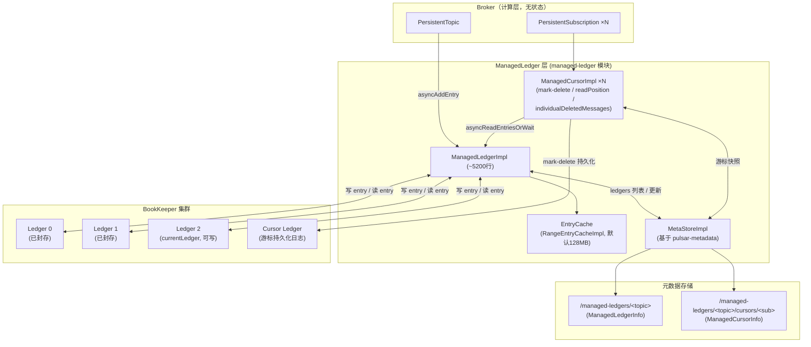
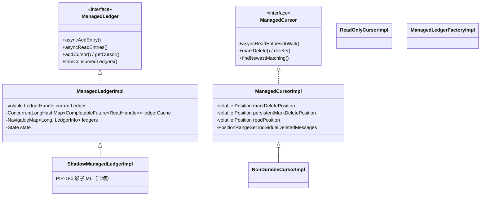
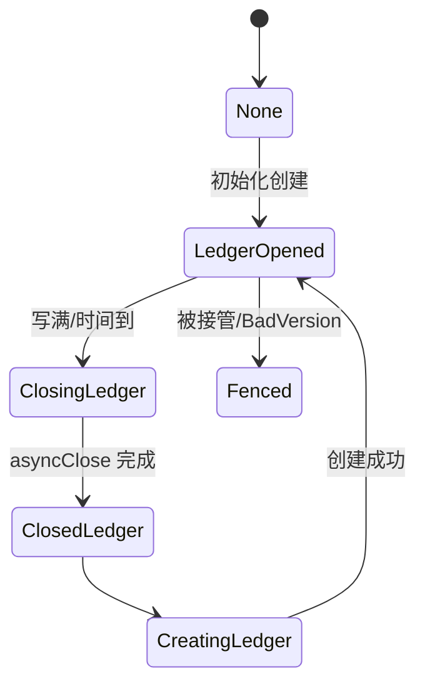
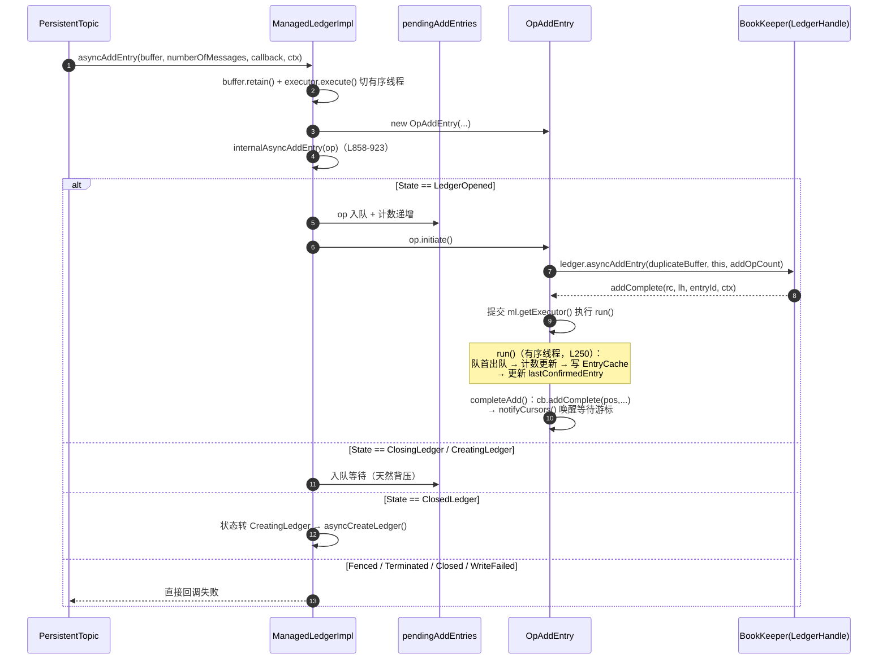
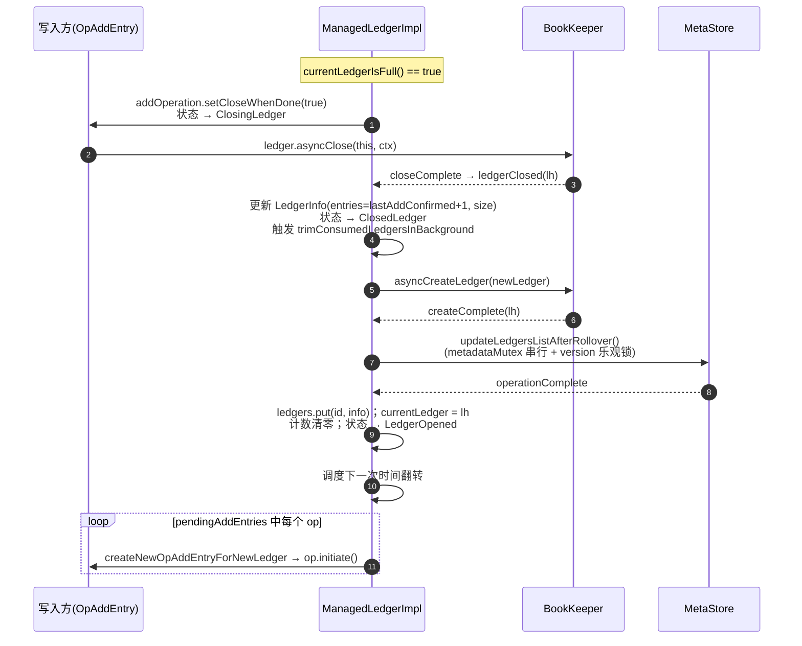
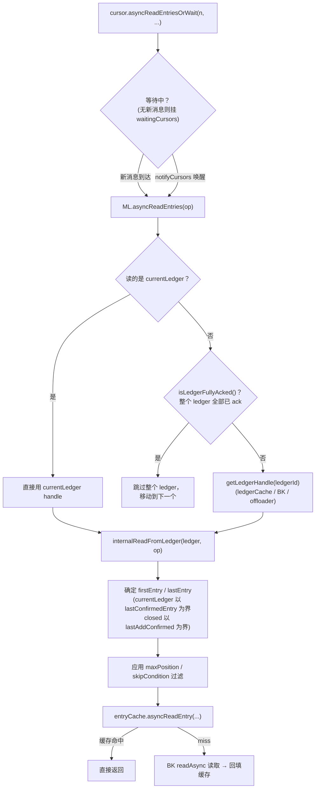
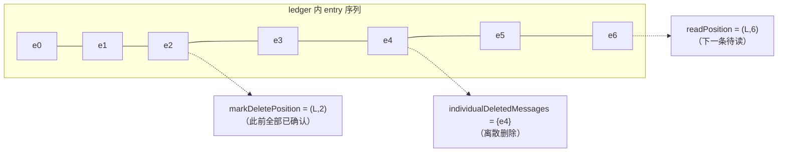
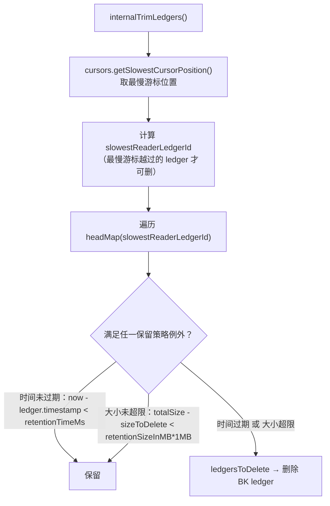
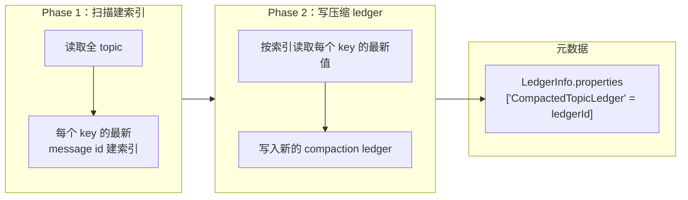
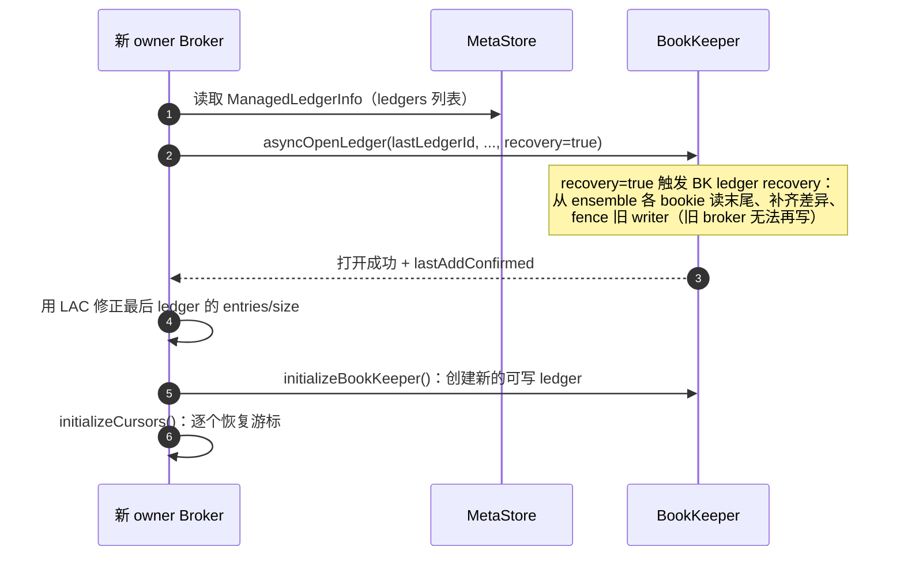

# Apache Pulsar 存储架构详解（源码深度分析）

> 本文基于 `managed-ledger` 模块（BookKeeper 之上的 Pulsar 日志抽象层）及 broker 侧存储集成代码逐类分析，所有类名、文件路径、方法、配置键均经源码验证。路径相对仓库根目录。

---

## 目录

1. [存储层总体架构](#1-存储层总体架构)
2. [ManagedLedger 抽象与元数据格式](#2-managedledger-抽象与元数据格式)
3. [写入路径](#3-写入路径)
4. [Ledger 翻转（Rollover）与切换](#4-ledger-翻转rollover与切换)
5. [读取路径与 Entry Cache](#5-读取路径与-entry-cache)
6. [游标（Cursor）机制](#6-游标cursor机制)
7. [数据保留与 Ledger 清理（Retention / Trim）](#7-数据保留与-ledger-清理retention--trim)
8. [压实（Compaction）](#8-压实compaction)
9. [分层存储（Tiered Storage）](#9-分层存储tiered-storage)
10. [BookKeeper 客户端集成与故障恢复](#10-bookkeeper-客户端集成与故障恢复)

---

## 1. 存储层总体架构

Pulsar 的持久化由 **ManagedLedger（托管日志）** 抽象承担：一个 topic（分区）对应一个 ManagedLedger，内部由一串 **BookKeeper ledger** 组成的无限日志 + 若干 **游标（cursor）** 构成。



核心思想：

- **无限日志 = ledger 链**：当前 ledger 写满（条数/大小/时间）就翻转创建新 ledger，旧 ledger 封存（sealed）；
- **消费进度 = 游标**：每个订阅一个 cursor，记录 mark-delete 位置与离散删除集合；cursor 自身也持久化为 BookKeeper ledger（避免高频写 ZK）；
- **读写分离**：写走 BookKeeper 多副本（E/W/A quorum），读优先命中 broker 内存 EntryCache；
- **topic 故障恢复 = fencing 旧 ledger**：broker 崩溃后新 owner 打开最后 ledger 时触发 BK recovery，fence 掉旧 writer。

---

## 2. ManagedLedger 抽象与元数据格式

### 2.1 类层次

**接口层**（`managed-ledger/src/main/java/org/apache/bookkeeper/mledger/`）：

- `ManagedLedger`、`ManagedCursor`、`ReadOnlyCursor`、`ReadOnlyManagedLedger`、`ManagedLedgerFactory`、`ManagedLedgerConfig`、`ManagedLedgerFactoryConfig`、`LedgerOffloader`

**实现层**（`impl/`）：



要点：`ManagedLedgerImpl` **组合持有** BK 的 `LedgerHandle`（不继承）——`currentLedger`（volatile，L249）为可写 ledger；`ledgerCache`（L178–182）缓存已打开用于读的 `ReadHandle`；`ledgers: NavigableMap<Long, LedgerInfo>`（L183）是元数据层 ledger 列表。

### 2.2 元数据 Proto：MLDataFormats.proto

文件：`managed-ledger/src/main/proto/MLDataFormats.proto`

**ManagedLedgerInfo**（znode `/managed-ledgers/<name>`，`MetaStoreImpl` 中 `BASE_NODE = "/managed-ledgers"`，L58–59）：

```protobuf
message ManagedLedgerInfo {
    message LedgerInfo {
        required int64 ledgerId = 1;
        optional int64 entries = 2;
        optional int64 size = 3;
        optional int64 timestamp = 4;
        optional OffloadContext offloadContext = 5;
        repeated KeyValue properties = 6;   // 压缩 ledger id 存于 properties["CompactedTopicLedger"]
    }
    repeated LedgerInfo ledgerInfo = 1;
    optional NestedPositionInfo terminatedPosition = 2;
    repeated KeyValue properties = 3;
}
```

**ManagedCursorInfo**（znode `/managed-ledgers/<name>/cursors/<cursor-name>`）：

```protobuf
message ManagedCursorInfo {
    required int64 cursorsLedgerId = 1;   // cursor 元数据 ledger id；-1 = 位置直接存在 znode 中
    optional int64 markDeleteLedgerId = 2;
    optional int64 markDeleteEntryId = 3;
    repeated MessageRange individualDeletedMessages = 4;
    repeated LongProperty properties = 5;
    repeated BatchedEntryDeletionIndexInfo batchedEntryDeletionIndexInfo = 7;
    repeated StringProperty cursorProperties = 8;
}
```

**PositionInfo**（写入 cursor ledger 的条目格式）：`ledgerId`、`entryId`、`individualDeletedMessages`、`properties`、`batchedEntryDeletionIndexInfo`、`individualDeletedMessageRanges`。

### 2.3 游标位置的两级持久化

1. **主路径——Cursor Ledger（追加日志）**：`persistPositionToLedger`（`ManagedCursorImpl.java` L3511）把 `PositionInfo` 写入 BK 上的 cursor ledger；
2. **降级路径——MetaStore**：`persistPositionToMetaStore`（L3601），cursor ledger 写失败时兜底写 znode。

`cursorsLedgerId == -1` 表示 mark-delete 位置直接存于 znode 字段（无需回放 ledger）。

### 2.4 Ledger 翻转触发条件

`currentLedgerIsFull()`（`ManagedLedgerImpl.java` L4417）：

| 条件 | 默认值 |
|---|---|
| `currentLedgerEntries >= maxEntriesPerLedger` | 50000 条 |
| `currentLedgerSize >= maxSizePerLedgerMb` | ML 配置 100MB / broker `managedLedgerMaxSizePerLedgerMbytes` 2048MB |
| `timeSinceLedgerCreationMs >= maximumRolloverTimeMs` | 4 小时（`ManagedLedgerConfig.java` L56） |

另有 `minimumRolloverTimeMs`（L55）防高吞吐场景翻转过频；时间驱动翻转由 `updateLastLedgerCreatedTimeAndScheduleRolloverTask()`（L5100）调度；不活跃翻转 `checkInactiveLedgerAndRollOver()`（L5124，`inactiveLedgerRollOverTimeMs > 0` 时）。

ML 状态机（L288–321）：



---

## 3. 写入路径

### 3.1 端到端写入流程



### 3.2 OpAddEntry 状态机

文件：`managed-ledger/.../impl/OpAddEntry.java`

| 状态 | 含义 |
|---|---|
| `OPEN` | 已创建，未发起 BK 写入 |
| `INITIATED` | 已调用 `ledger.asyncAddEntry()` |
| `COMPLETED` | BK 回调完成 |
| `CLOSED` | 已关闭（ledger 切换时复用缓冲） |

- `initiate()`（L169）：发起 BK 写入（写入的是**缓冲副本**，原 buffer 供缓存复用）；
- `addComplete(rc, lh, entryId, ctx)`（L204）：BK 回调，转投 `ml.getExecutor()`（按 ML name 哈希的有序线程）执行 `run()`；
- `run()`（L250）：有序线程中从 `pendingAddEntries` 队首取出 → 更新 `NUMBER_OF_ENTRIES_UPDATER`/`TOTAL_SIZE_UPDATER` → 写 entry cache → 更新 `lastConfirmedEntry` → `closeWhenDone` 则关 ledger，否则 `completeAdd()`；
- `completeAdd()`：用户回调 → `notifyCursors()` → `notifyWaitingEntryCallBacks()`。

### 3.3 Quorum 与限流

`asyncCreateLedger`（`ManagedLedgerImpl.java` L4678–4686）：

```java
bookKeeper.newCreateLedgerOp()
    .withEnsembleSize(config.getEnsembleSize())       // ML 默认 3
    .withWriteQuorumSize(config.getWriteQuorumSize()) // 默认 2
    .withAckQuorumSize(config.getAckQuorum())         // 默认 2
    .withDigestType(digestType.toApiDigestType())     // CRC32C
    .withPassword(config.getPassword())
```

broker 默认（`ServiceConfiguration`）：`managedLedgerDefaultEnsembleSize=2`、`managedLedgerDefaultWriteQuorum=2`、`managedLedgerDefaultAckQuorum=2`。**写入在收到 Ack Quorum 个 bookie 确认即算成功**（W=2, A=2, E=2/3 时容忍 1 台 bookie 故障而不丢失已确认数据）。

限流与超时：

- 背压天然来自 `pendingAddEntries` 排队（CreatingLedger 期间所有写入排队）；BK client 级别由 `bookkeeperClientThrottleValue` 控制（`BookKeeperClientFactoryImpl.java` L128）；
- 写超时：`addEntryTimeoutSeconds`（ML 默认 120s）+ BK client `setAddEntryTimeout()`（L130）；超时触发 `currentLedgerTimeoutTriggered`（L278）——当前 ledger 的所有在途 OpAddEntry 判失败。

---

## 4. Ledger 翻转（Rollover）与切换



关键实现：

- `ledgerClosed`（L1947）：基于 `getLastAddConfirmed()+1` 修正 ledger 元数据 → `ClosedLedger` → 触发后台 trim → 有 pending 则创建新 ledger；
- `createComplete`（L1716–1828）：构造 `LedgerInfo` → `updateLedgersListAfterRollover()` 异步更新 MetaStore；
- `updateLedgersIdsComplete`（L1871–1906）：状态回 `LedgerOpened`；空 ledger 清理（原 ledger 已不在 map 则删除）；为 pending 队列逐条绑定新 handle 重发；
- **元数据竞态防护**：`metadataMutex: CallbackMutex` 串行化所有 ManagedLedgerInfo 更新；`BadVersionException`（version 乐观锁冲突，说明存在并发写入者）触发 `handleBadVersion()` → `setFenced()`——**这是 ML 层"脑裂检测"**。

---

## 5. 读取路径与 Entry Cache

### 5.1 读取流程

入口：`ManagedCursor.asyncReadEntries()` → `ManagedLedgerImpl.asyncReadEntries(OpReadEntry)`（L2097）：



（`internalReadFromLedger` L2349–2441；缓存交互 L2456–2468）

### 5.2 Entry Cache

| 组件 | 文件 | 说明 |
|---|---|---|
| `EntryCacheManager`（接口） | `impl/cache/EntryCacheManager.java` | 全局缓存池，按 ML 分配 `EntryCache` |
| `RangeEntryCacheManagerImpl` | `impl/cache/RangeEntryCacheManagerImpl.java`（L43） | `currentSize: AtomicLong` 跟踪总量；`RangeCacheRemovalQueue` + LRU 范围驱逐；`InflightReadsLimiter` 限制在途读防 BK 过载；支持 TTL 延长（`extendTTLOfEntriesWithRemainingExpectedReadsMaxTimes`、`cacheEvictionExtendTTLOfRecentlyAccessed`） |
| `RangeEntryCacheImpl` | `impl/cache/` | 基于范围的实现 |
| `EntryCacheDisabled` | | 禁用版 |

配置（`ManagedLedgerFactoryConfig`）：`maxCacheSize` 默认 **128MB**（L35）；驱逐水位 `cacheEvictionWatermark = 0.90`；驱逐频率 `cacheEvictionIntervalMs = 10ms`。

**驱逐智能化**：`expectedReadCount`（预期还有多少游标要读该条目）参与驱逐决策——`cacheEvictionByExpectedReadCount`（默认 true）优先保留多游标共享的热数据；`cacheEvictionByMarkDeletedPosition`（默认 false）按 mark-delete 位置驱逐。

**预读**：没有独立 read-ahead 线程；`OpReadEntry` 的一次批量读（`numberOfEntriesToRead` 条，受 `dispatcherMaxReadBatchSize` / `dispatcherMaxReadSizeBytes` 约束并由 dispatcher 动态调整）即充当预读。

---

## 6. 游标（Cursor）机制

### 6.1 位置语义



`ManagedCursorImpl` 关键字段（volatile）：

| 字段 | 行号 | 含义 |
|---|---|---|
| `markDeletePosition` | L142 | 已确认位置（此前连续区间全部 ack） |
| `persistentMarkDeletePosition` | L145 | 已持久化的 mark-delete |
| `inProgressMarkDeletePersistPosition` | L150 | 持久化中 |
| `readPosition` | L154 | 下一条待读 |
| `lastMarkDeleteEntry` | L161 | 最后一个 mark-delete 操作 |
| `individualDeletedMessages: PositionRangeSet` | L203 | 离散删除集合 |

`setAcknowledgedPosition()`（L2188）：新位置写入 `markDeletePosition` → 移除其前所有离散删除 → 若后续连续已删范围可合并则**继续推进 mark-delete**。

### 6.2 Individual Deletes：LongBitmap

`PositionRangeSet`（`impl/PositionRangeSet.java`）两层结构：`Long2ObjectSortedMap<LongBitmap>`（ledgerId → 位图），**位 n 表示 entry id n 已删除**。`LongBitmap` 接口位于 `pulsar-common/.../util/collections/LongBitmap.java`——commit `b61f3d5ca2` 引入该抽象并把 `RoaringBitmap` 迁移为其实现，为 PIP-486 的 `individualDeletedMessageRanges`（LongListMap）等新格式留出空间。

### 6.3 Mark-Delete 持久化状态机与限流

- 状态机（L319–328）：`Uninitialized → NoLedger → Open ↔ SwitchingLedger → Closing → Closed`；
- `internalMarkDelete()`（L2420）：跳过早于 `persistentMarkDeletePosition` 的请求 → 跳过已有更新在途的请求 → `persistPositionToLedger` → 成功后更新 `persistentMarkDeletePosition`、清理 `batchDeletedIndexes`、触发回调；
- **限流**：`throttleMarkDelete`（默认 0 不限流）RateLimiter；受限时置 `isDirty = true`——**内存位置照常推进，持久化推迟**，对上层 ack 仍立即成功（持久化最终一致）。

### 6.4 批消息的批索引删除

- `batchDeletedIndexes: ConcurrentSkipListMap<Position, BitSet>` 记录 batch 中已删除的子消息索引；
- 持久化为 `BatchedEntryDeletionIndexInfo`（`ackBatchPosition()` 处理带 AckSet 的确认），支持 Shared 订阅下的**批内单条确认**。

---

## 7. 数据保留与 Ledger 清理（Retention / Trim）

删除一个 ledger 需同时满足两个维度：**已被所有游标消费完** + **保留策略允许**。

`internalTrimLedgers()`（`ManagedLedgerImpl.java` L3042、L3133–3158）：



- 保留配置：`retentionTimeMs` / `retentionSizeInMB`（默认 0 = 立即删除；-1 = 无限保留），来源于命名空间策略 `retentionTimeInMinutes` / `retentionSizeInMB`；
- `-1`（无限保留）+ 全部游标消费完也**不删**——这是"读尽即删 vs 合规留存"两种模式的开关。

---

## 8. 压实（Compaction）

### 8.1 组件

| 类 | 文件 | 职责 |
|---|---|---|
| `Compactor` | `pulsar-broker/.../compaction/Compactor.java` | 抽象基类（L36：`"CompactedTopicLedger"` 属性键） |
| `AbstractTwoPhaseCompactor` | 同目录 | 两阶段压缩器基类 |
| `StrategicTwoPhaseCompactor` | 同目录 | 带策略（`CompactionStrategy`，由 `compactionThreshold` 触发） |
| `PulsarTopicCompactionService` / `TopicCompactionService` | 同目录 | topic 级压缩服务（工厂 `compactionServiceFactoryClassName = PulsarCompactionServiceFactory`） |
| `CompactedTopicImpl` | 同目录 | 压缩 topic 读实现 |
| `ShadowManagedLedgerImpl` | `managed-ledger/.../impl/ShadowManagedLedgerImpl.java` | PIP-180 影子 ML：监听源 ML 元数据，将数据"投影"到影子 ledger |

特殊游标 `__compaction`（`ManagedCursorImpl` L227 `COMPACTION_CURSOR_NAME`；`isCompactionCursor()` L4151）。

### 8.2 两阶段流程与压缩读



- 触发：`brokerServiceCompactionMonitorIntervalInSeconds`（默认 60s）+ topic 级 `compactionThreshold` 策略；
- 压缩读（`readCompacted=true` 的 Reader）：`CompactedTopicImpl` 优先从压缩 ledger 读 key 的最新值，找不到位置则**回退原始数据**——实现"读最新状态"语义（如配置分发、状态同步场景）。

---

## 9. 分层存储（Tiered Storage）

### 9.1 LedgerOffloader 接口

`managed-ledger/.../LedgerOffloader.java`：

| 方法 | 职责 |
|---|---|
| `offload(ReadHandle, UUID, extraMetadata)` | 把封存 ledger 卸载到外部存储 |
| `readOffloaded(ledgerId, UUID, metadata)` | 从外部存储读回，返回 `CompletableFuture<ReadHandle>` |
| `deleteOffloaded(...)` | 删除卸载数据 |
| `streamingOffload(...)` | 流式分段卸载 |
| `getOffloadPolicies()` | 卸载策略 |

实现：`tiered-storage/tiered-storage-jcloud`（S3/OSS/GCS 等，经 jclouds）、`tiered-storage/tiered-storage-file-system`。

### 9.2 卸载元数据（OffloadContext）

挂在 `ManagedLedgerInfo.LedgerInfo.offloadContext` 上：`uidMsb/uidLsb`、`complete`、`bookkeeperDeleted`、`timestamp`、`OffloadDriverMetadata`、`OffloadSegment`（repeated，分段）。

### 9.3 触发与读路径

- 显式：`asyncOffloadPrefix(Position, ...)`（`ManagedLedgerImpl.java` L3625）；
- 自动：`maybeOffload()`（L2869）由 `AutomaticOffloadTriggerController` 按频率检查，阈值 `managedLedgerOffloadThresholdInBytes` / `ThresholdInSeconds`；`triggerOffloadOnTopicLoad` 控制 topic 加载时触发；
- 卸载循环 `offloadLoop`（L3716）：对队列中每个 ledger——先写元数据标记 uid → `ledgerOffloader.offload(...)` → 成功后标记 `complete=true` → 删除 BK 上的 ledger（依据 `bookkeeperDeleted`）；
- **读路径集成**（`getLedgerHandle(ledgerId)`，L2226）：有 `offloadContext.complete` → `ledgerOffloader.readOffloaded()`（`OffloadedLedgerHandle` 标记接口标识）；策略 `BOOKKEEPER_FIRST` 且 BK 副本还在时优先 BK；
- 未使用卸载 ledger 的驱逐：`internalEvictOffloadedLedgers()`（`inactiveOffloadedLedgerEvictionTimeMs > 0` 时关闭长期未访问的 handle）。

---

## 10. BookKeeper 客户端集成与故障恢复

### 10.1 BookKeeperClientFactory

接口 `pulsar-broker/.../BookKeeperClientFactory.java`；实现 `BookKeeperClientFactoryImpl.java`：

- `create()`（L57–88）：初始化 `PulsarMetadataClientDriver`（BK 元数据驱动走 pulsar-metadata）→ `ClientConfiguration` → 放置策略 → 异步构建 `BookKeeper`；
- `createBkClientConfiguration()`（L104–154）：BK 认证（`bookkeeperClientAuthenticationPlugin`）、TLS（`bookkeeperTLSClientAuthentication` 等）、限流（`bookkeeperClientThrottleValue`）、超时（`bookkeeperClientTimeoutInSeconds`）、**推测读**（`bookkeeperClientSpeculativeReadTimeoutInMillis`）、每 bookie channel 数、`bookkeeperUseV2WireProtocol`、`enableDigestTypeAutodetection(true)`、**粘性读**（`bookkeeperEnableStickyReads`）。

放置策略：

| 策略 | 说明 |
|---|---|
| `RackawareEnsemblePlacementPolicy` | 默认，机架感知 |
| `RegionAwareEnsemblePlacementPolicy` | 区域感知（跨机房） |
| `IsolatedBookieEnsemblePlacementPolicy` | Pulsar 自定义的 bookie 隔离 |

### 10.2 Broker 崩溃后的恢复（Recovery & Fencing）

`ManagedLedgerImpl.initialize()`（L426）：



游标恢复 `ManagedCursorImpl.recover()`：

1. 读 `ManagedCursorInfo`；
2. `cursorsLedgerId != -1`：打开 cursor ledger，**回放全部 PositionInfo 到最后一条**（追加日志天然幂等）；
3. `cursorsLedgerId == -1`：直接从 znode 的 `markDeleteLedgerId/EntryId` 恢复；
4. 初始化三个位置 + `individualDeletedMessages`；
5. 可选 `lazyCursorRecovery`（`ManagedLedgerConfig.java` L69）：游标后台异步恢复，ML 提前接受写入。

Fencing 相关状态：`State.Fenced`（被接管）/ `State.FencedForDeletion`；`BadVersionException` → `setFenced()`；`BKException.LedgerFencedException` → 重新打开/fence。写失败恢复：`OpAddEntry.addComplete(rc!=OK)` → `handleAddFailure()` → `ledgerClosed()` → `ClosedLedger`/`WriteFailed` → `readyToCreateNewLedger()` 触发重建。

**与 bundle 接管的联动**：broker 崩溃 → 元数据会话失效 → bundle 临时锁释放 → 新 broker `tryAcquiringOwnership` 接管 → 打开 ML 触发上述 recovery。**整个过程不搬数据**（数据在 BookKeeper），这是 Pulsar 存算分离带来的秒级故障恢复的根源。

---

## 附：关键文件与配置索引

| 领域 | 文件/配置 |
|---|---|
| 核心接口 | `managed-ledger/src/main/java/org/apache/bookkeeper/mledger/`：`ManagedLedger.java`、`ManagedCursor.java`、`ManagedLedgerConfig.java`、`ManagedLedgerFactory.java`、`LedgerOffloader.java` |
| 核心实现 | `impl/ManagedLedgerImpl.java`（~5200 行）、`impl/ManagedCursorImpl.java`（~4200 行）、`impl/OpAddEntry.java`、`impl/OpReadEntry.java`、`impl/PositionRangeSet.java`、`impl/MetaStoreImpl.java`、`impl/ShadowManagedLedgerImpl.java` |
| 缓存 | `impl/cache/RangeEntryCacheManagerImpl.java`、`EntryCacheManager.java` |
| Proto | `managed-ledger/src/main/proto/MLDataFormats.proto` |
| BK 集成 | `pulsar-broker/.../BookKeeperClientFactory.java`、`BookKeeperClientFactoryImpl.java` |
| 压缩 | `pulsar-broker/.../compaction/`（`Compactor.java`、`AbstractTwoPhaseCompactor.java`、`CompactedTopicImpl.java` 等） |
| 位图 | `pulsar-common/src/main/java/org/apache/pulsar/common/util/collections/LongBitmap.java` |

**关键配置**：

| 配置 | 默认 | 含义 |
|---|---|---|
| `maxEntriesPerLedger` | 50000 | 每 ledger 条数上限 |
| `managedLedgerMaxSizePerLedgerMbytes` | 2048 | 每 ledger 大小上限 |
| `maximumRolloverTimeMs` | 4h | 时间翻转 |
| `managedLedgerDefaultEnsembleSize/WriteQuorum/AckQuorum` | 2/2/2 | BK 副本参数 |
| `maxCacheSize`（`ManagedLedgerFactoryConfig`） | 128MB | entry cache |
| `cacheEvictionWatermark` / `cacheEvictionIntervalMs` | 0.90 / 10ms | 驱逐 |
| `addEntryTimeoutSeconds` | 120 | 写超时 |
| `throttleMarkDelete` | 0 | mark-delete 限流 |
| `retentionTimeMs` / `retentionSizeInMB` | 0 / 0 | 保留策略（0=立即删，-1=无限） |
| `managedLedgerMaxUnackedRangesToPersist` | 200000 | 单游标可持久化离散删除范围数 |
| `managedLedgerCacheSizeMB`（broker） | ≥64 | broker 侧 ML 缓存 |
| `bookkeeperClientThrottleValue` / `bookkeeperClientSpeculativeReadTimeoutInMillis` / `bookkeeperEnableStickyReads` | — | BK client |
| `brokerServiceCompactionMonitorIntervalInSeconds` | 60 | 压缩检查周期 |
| `managedLedgerOffloadThresholdInBytes/Seconds` | — | 卸载阈值 |
