# Apache Pulsar 高可用架构详解

> 本篇是源码分析系列第 6 篇，聚焦**高可用（HA）架构与实现原理**：存储层多副本、服务层无状态接管、元数据层会话与协调、客户端故障转移、跨集群容灾。
> 所有类名、方法、行号、配置键均经源码实际验证（master 分支，2026-09）；与前几篇一样，个别行号随代码演进可能偏移，以类名 + 方法名为准。

## 目录

1. [高可用设计总览](#1-高可用设计总览)
2. [存储层高可用 —— BookKeeper 多副本](#2-存储层高可用--bookkeeper-多副本)
3. [服务层高可用 —— Broker 无状态接管](#3-服务层高可用--broker-无状态接管)
4. [元数据层高可用](#4-元数据层高可用)
5. [客户端故障转移](#5-客户端故障转移)
6. [跨集群容灾 —— Geo-Replication](#6-跨集群容灾--geo-replication)
7. [Proxy 层高可用](#7-proxy-层高可用)
8. [典型故障场景端到端时序](#8-典型故障场景端到端时序)
9. [特殊 Topic 的 HA 语义](#9-特殊-topic-的-ha-语义)
10. [配置速查表](#10-配置速查表)
11. [附：关键文件索引](#11-附关键文件索引)

---

## 1. 高可用设计总览

### 1.1 三层故障域划分

Pulsar 的 HA 不是单一机制，而是**三层各自独立容错、互相配合**的体系。存算分离是根基：broker 不持有数据，因此 broker 故障的恢复是"元数据锁失效 + 重新打开 ledger"的**秒级逻辑接管**，而非数据搬迁。

| 层 | 故障对象 | HA 机制 | 数据丢失风险 | 典型恢复时间 |
|---|---|---|---|---|
| 存储层 | Bookie 宕机 / 磁盘故障 | E/W/A Quorum 多副本 + 放置策略 + AutoRecovery 补副本 | W-1 台同时宕机以内不丢 | 写入即时无感；副本修复分钟级 |
| 服务层 | Broker 宕机 / 网络分区 | bundle 临时锁失效 → 其他 broker 接管 + ledger fencing 防脑裂 | 不丢（已 ack 的都在 BK） | 会话超时（默认 30s）+ topic 懒加载 |
| 元数据层 | ZK/Oxia 会话断开 | 会话监控、锁重验证、`reconnect`/`shutdown` 策略 | 不丢（元数据本身多副本） | 自动重连，断开超过 sessionTimeout×5/6 判定 SessionLost |
| 客户端 | 与 broker 断连 | 重连引擎 + epoch 防旧 + 消息重发 + 消费重投 | 生产侧依赖重发语义 | Backoff 退避重连，通常亚秒到秒级 |
| 跨集群 | 远端集群整体故障 | Replicator 退避堆积 + TTL DISCARD 丢弃 | 复制语义内可控 | 远端恢复后自动续传 |

### 1.2 高可用全景架构图

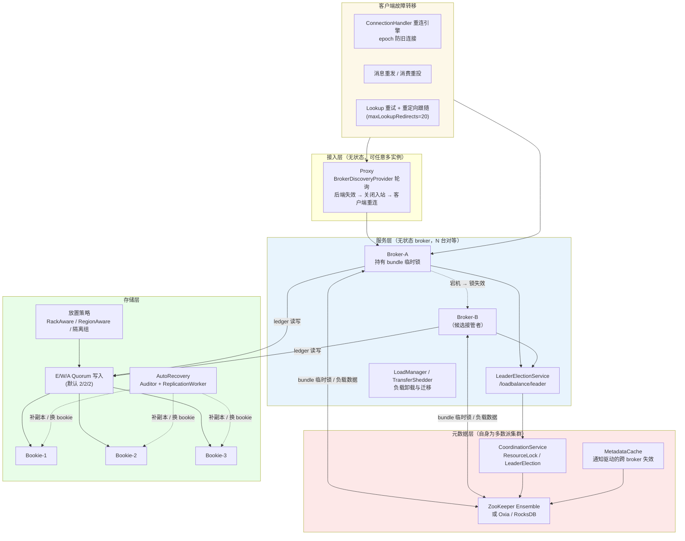
```mermaid
flowchart TB
    subgraph Client["客户端故障转移"]
        CH["ConnectionHandler 重连引擎<br/>epoch 防旧连接"]
        RES["消息重发 / 消费重投"]
        LK["Lookup 重试 + 重定向跟随<br/>(maxLookupRedirects=20)"]
    end

    subgraph Proxy["接入层（无状态，可任意多实例）"]
        PX["Proxy<br/>BrokerDiscoveryProvider 轮询<br/>后端失效 → 关闭入站 → 客户端重连"]
    end

    subgraph Brokers["服务层（无状态 broker，N 台对等）"]
        B1["Broker-A<br/>持有 bundle 临时锁"]
        B2["Broker-B<br/>（候选接管者）"]
        LE["LeaderElectionService<br/>/loadbalance/leader"]
        LM["LoadManager / TransferShedder<br/>负载卸载与迁移"]
        B1 -.->|"宕机 → 锁失效"| B2
    end

    subgraph Meta["元数据层（自身为多数派集群）"]
        ZK["ZooKeeper Ensemble<br/>或 Oxia / RocksDB"]
        CS["CoordinationService<br/>ResourceLock / LeaderElection"]
        MC["MetadataCache<br/>通知驱动的跨 broker 失效"]
    end

    subgraph BK["存储层"]
        EWA["E/W/A Quorum 写入<br/>(默认 2/2/2)"]
        PP["放置策略<br/>RackAware / RegionAware / 隔离组"]
        AR["AutoRecovery<br/>Auditor + ReplicationWorker"]
        BK1["Bookie-1"]
        BK2["Bookie-2"]
        BK3["Bookie-3"]
    end

    Client --> PX --> B1
    Client --> B1
    B1 & B2 -->|"ledger 读写"| EWA
    EWA --> BK1 & BK2 & BK3
    B1 & B2 <-->|"bundle 临时锁 / 负载数据"| ZK
    B1 & B2 --> LE
    LE --> CS --> ZK
    PP --> EWA
    AR -.->|"补副本 / 换 bookie"| BK1 & BK2 & BK3
    MC --> ZK

    style Brokers fill:#e8f4fd
    style BK fill:#e8fde8
    style Meta fill:#fde8e8
    style Client fill:#fdf8e8
```

### 1.3 一句话总结各层原理

- **存储层**：每条消息写 E 台、等 W 台确认即成功；任一 bookie 挂掉，quorum 写入继续；后台 AutoRecovery 把副本数补回 E。
- **服务层**：broker 对 bundle 的所有权是元数据存储里的**临时节点**；会话一断锁自动消失，其他 broker 可立即创建锁接管；接管者以 recovery 模式打开 ledger，**fence 掉旧 broker 的写入权**，杜绝脑裂双写。
- **元数据层**：ZK/Oxia 自身是多数派集群；上层用会话事件驱动锁重验证与 leader 重选举。
- **客户端**：断连后按 Backoff 重连，重连成功后重握手、重发未确认消息、重投未 ack 消息；epoch 机制保证旧连接的迟到响应不会污染新连接状态。
- **跨集群**：复制本质是一个特殊的 producer，远端故障时退避重连、本地 backlog 堆积，超过 TTL 可按 DISCARD 策略丢弃。

---

## 2. 存储层高可用 —— BookKeeper 多副本

### 2.1 E/W/A Quorum 写入模型

每个 ledger 条目写入时，BookKeeper 客户端从 ensemble（E 台 bookie）中选出 quorum 写入：

- **Ensemble size (E)**：一个 ledger 的条目分布到的 bookie 总数（条目以 round-robin 落在 E 台中连续 W 台上）；
- **Write quorum (W)**：每条消息实际复制的份数；
- **Ack quorum (A)**：收到 A 台确认即向生产者返回成功。

**可用性公式**：只要 ensemble 中有 ≥ W 台 - (W - A) … 更准确地表述——写入可用需要"连续 W 台中至少 A 台存活"；读取可用需要 LAC 之后的数据至少 A 台存活。默认 `2/2/2` 意味着**允许 1 台 bookie 故障不丢数据、不影响写**（W-A = 2-2 = 0 冗余 ack，E-W = 0 冗余放置，但任一台挂掉时写入会切换到新的 ensemble 组合）。

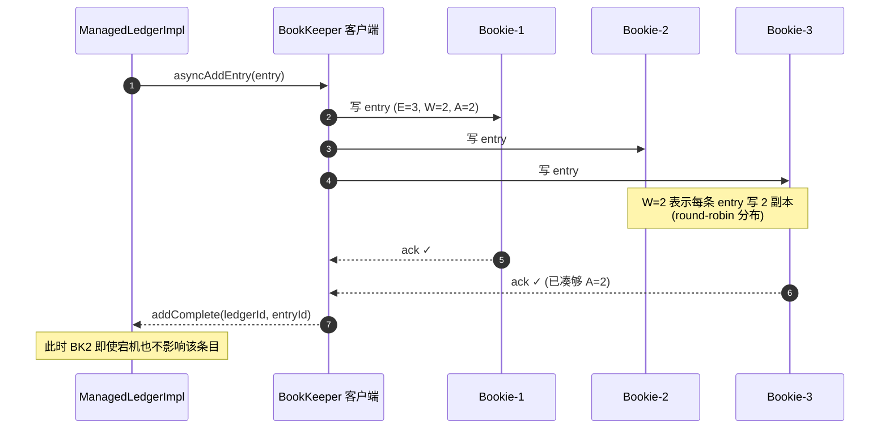
```mermaid
sequenceDiagram
    autonumber
    participant ML as ManagedLedgerImpl
    participant BKC as BookKeeper 客户端
    participant BK1 as Bookie-1
    participant BK2 as Bookie-2
    participant BK3 as Bookie-3

    ML->>BKC: asyncAddEntry(entry)
    BKC->>BK1: 写 entry (E=3, W=2, A=2)
    BKC->>BK2: 写 entry
    BKC->>BK3: 写 entry
    Note over BK2,BK3: W=2 表示每条 entry 写 2 副本<br/>(round-robin 分布)
    BK1-->>BKC: ack ✓
    BK3-->>BKC: ack ✓ (已凑够 A=2)
    BKC-->>ML: addComplete(ledgerId, entryId)
    Note over ML: 此时 BK2 即使宕机也不影响该条目
```

Broker 侧 BK 客户端配置集中在 `pulsar-broker/src/main/java/org/apache/pulsar/broker/BookKeeperClientFactoryImpl.java`：

- `createBkClientConfiguration()`（L104）：集中构建 `ClientConfiguration`；
- 放置策略注册（L176）：按配置装载 `RackawareEnsemblePlacementPolicy` / `RegionAwareEnsemblePlacementPolicy` / 自定义策略；
- bookie 健康检查（L148-156）：`enableBookieHealthCheck` + `bookieHealthCheckIntervalSeconds` 等， unhealthy bookie 会被临时从 ensemble 选择中剔除（quarantine）；
- speculative read（L132）：读超时后向另一台 bookie 发起投机读，降低尾延迟与单点读故障影响；
- **`bookkeeper_` 前缀透传**（L165-172）：Pulsar 配置文件里任何 `bookkeeper_xxx=y` 都会原样传给 BK 客户端，无需为每个 BK 参数单独立配置键——这是排查存储层参数时的重要入口。

### 2.2 副本放置策略

放置策略决定 ensemble 选哪些 bookie，直接决定故障域的隔离能力：

| 策略 | 类 | 行为 |
|---|---|---|
| 机架感知（默认） | `org.apache.bookkeeper.client.RackawareEnsemblePlacementPolicy` | 尽量把同一 ledger 的副本分散到不同 rack/zones，单机架故障不丢 ledger |
| 区域感知 | `org.apache.bookkeeper.client.RegionAwareEnsemblePlacementPolicy` | 跨 region（如 dc-1/dc-2）放置，minRacksPerWriteQuorum 控制每个写 quorum 的最小机架数 |
| 隔离组 | `pulsar-broker-common/src/main/java/org/apache/pulsar/bookie/rackawareness/IsolatedBookieEnsemblePlacementPolicy` | 按 namespace 维度把指定 topic 的 ledger 限制在特定 bookie 组内 |

隔离组策略的三个核心方法（均为源码验证）：

- `newEnsemble()`（`IsolatedBookieEnsemblePlacementPolicy.java` L134）：从允许的隔离组中挑 ensemble，若组内 bookie 不足直接失败（不偷偷借用组外 bookie）；
- `replaceBookie()`（L145）：替换故障 bookie 时同样只在组内选；
- `getExcludedBookiesWithIsolationGroups()`（L220）：计算被隔离策略排除的 bookie 集合——**特殊值 `"*"` 组用于系统 topic**（如 `__change_events`），保证系统 topic 的流量与业务 topic 隔离。

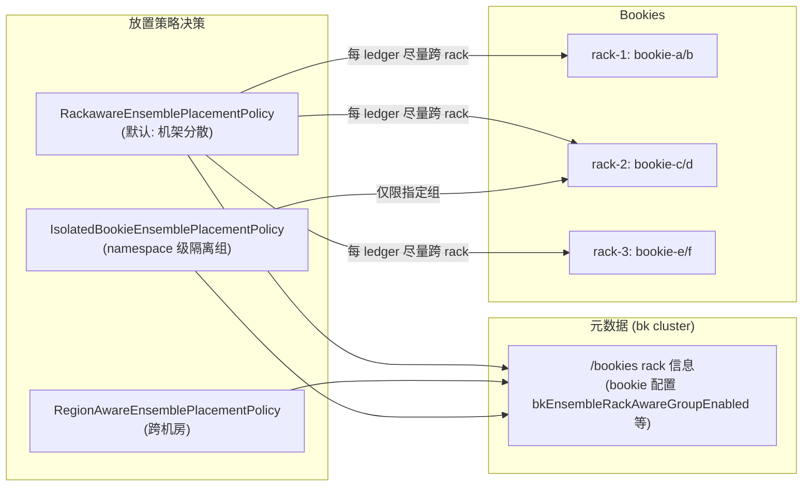
```mermaid
flowchart LR
    subgraph Policy["放置策略决策"]
        R["RackawareEnsemblePlacementPolicy<br/>(默认: 机架分散)"]
        RG["RegionAwareEnsemblePlacementPolicy<br/>(跨机房)"]
        ISO["IsolatedBookieEnsemblePlacementPolicy<br/>(namespace 级隔离组)"]
    end
    subgraph ZKMeta["元数据 (bk cluster)"]
        RGINFO["/bookies rack 信息<br/>(bookie 配置 bkEnsembleRackAwareGroupEnabled 等)"]
    end
    subgraph Bookies
        R1["rack-1: bookie-a/b"]
        R2["rack-2: bookie-c/d"]
        R3["rack-3: bookie-e/f"]
    end
    R & RG & ISO --> RGINFO
    R -->|"每 ledger 尽量跨 rack"| R1 & R2 & R3
    ISO -->|"仅限指定组"| R2
```

### 2.3 Bookie 故障检测与健康检查

两层检测协同：

1. **客户端层（broker 内的 BK 客户端）**：写失败触发 bookie 标记，`replaceBookie()` 在当前 ledger 内即时换一台 bookie 写后续条目，**正在写的 ledger 不中断**；健康检查（L148-156 配置）周期性探活，连续失败的 bookie 进入 quarantine 状态一段时间。
2. **服务端层（AutoRecovery）**：见 2.6。

### 2.4 Ledger Fencing —— 脑裂防护核心

存算分离下最危险的场景：旧 broker 网络分区后"诈尸"，仍认为自己拥有 topic 并继续写 ledger。BookKeeper 用 **fencing** 一票否决：

- **recovery 模式打开 ledger**：`open(ledgerId, recovery=true)` 会向 ensemble 中**所有** bookie 发起 fence 请求（写 fence 标记），旧 writer 再写任何 bookie 都会收到 `LedgerFencedException`；
- 这是最终一致性裁决：即使旧 broker 还活着，它的写也会失败。

### 2.5 Broker 崩溃后打开 ledger 的恢复流程

接管 broker 加载 topic时（`ManagedLedgerImpl.asyncOpenLedger`，`managed-ledger/src/main/java/org/apache/bookkeeper/mledger/impl/ManagedLedgerImpl.java` L511，`recovery=true`）：

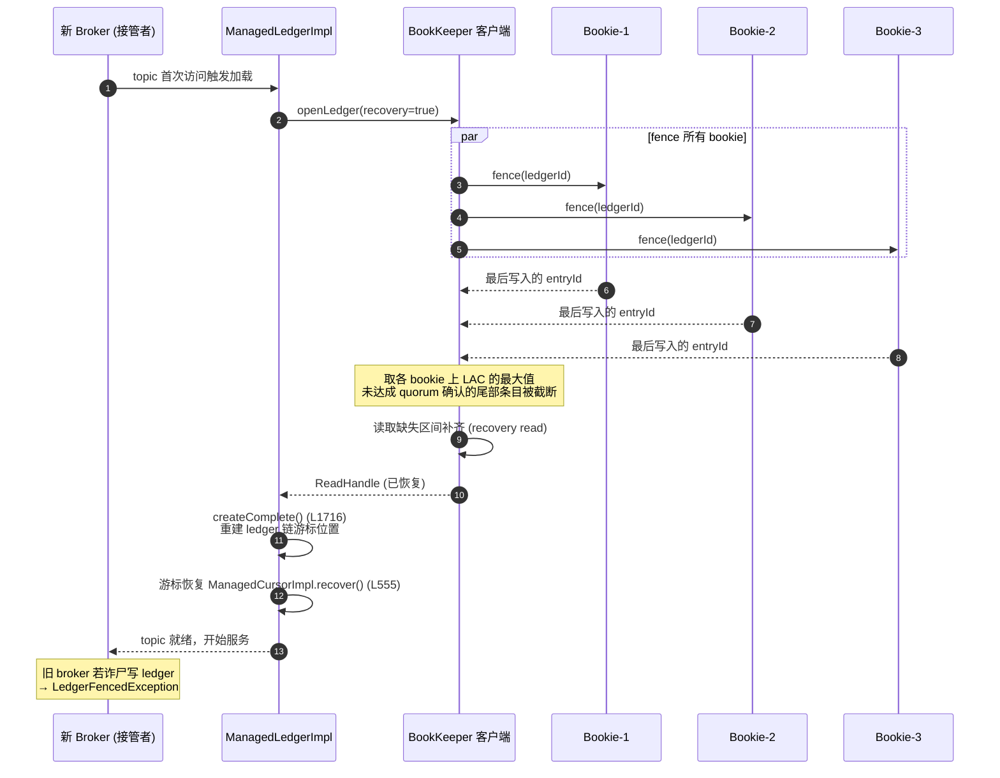
```mermaid
sequenceDiagram
    autonumber
    participant NewB as 新 Broker (接管者)
    participant ML as ManagedLedgerImpl
    participant BK as BookKeeper 客户端
    participant BK1 as Bookie-1
    participant BK2 as Bookie-2
    participant BK3 as Bookie-3

    NewB->>ML: topic 首次访问触发加载
    ML->>BK: openLedger(recovery=true)
    par fence 所有 bookie
        BK->>BK1: fence(ledgerId)
        BK->>BK2: fence(ledgerId)
        BK->>BK3: fence(ledgerId)
    end
    BK1-->>BK: 最后写入的 entryId
    BK2-->>BK: 最后写入的 entryId
    BK3-->>BK: 最后写入的 entryId
    Note over BK: 取各 bookie 上 LAC 的最大值<br/>未达成 quorum 确认的尾部条目被截断
    BK->>BK: 读取缺失区间补齐 (recovery read)
    BK-->>ML: ReadHandle (已恢复)
    ML->>ML: createComplete() (L1716)<br/>重建 ledger 链游标位置
    ML->>ML: 游标恢复 ManagedCursorImpl.recover() (L555)
    ML-->>NewB: topic 就绪，开始服务
    Note over NewB: 旧 broker 若诈尸写 ledger<br/>→ LedgerFencedException
```

恢复后旧 broker 的写失败路径（`ManagedLedgerImpl`）：

- `addEntryFailedDueToConcurrentlyModified()`（L1908）：写 ledger 因被他人 recovery 打开而失败时的统一入口；
- 状态机置 `State.Fenced`（State 枚举 L288；`setFenced()` L4505）——此后该 broker 上此 ML 的**所有写请求直接失败**，并触发 topic 层面向客户端发 `TopicMigrated`/断连，让客户端去新 owner；
- 写超时兜底：`scheduleAddEntryTimeoutTask()`（L4741）+ `OpAddEntry.handleAddFailure()`（`OpAddEntry.java` L361）/ `addComplete` 的超时检查（L240），防止 bookie 半死不活导致写永久挂起；
- 游标持久化遇到不可恢复 BK 错误时：`ManagedCursorImpl.isBkErrorNotRecoverable()`（L3863）判断错误类别，决定重试还是放弃该游标状态。

### 2.6 AutoRecovery —— Auditor / ReplicationWorker / DeathWatcher

Pulsar 发行版把 BookKeeper 的自动恢复进程内置了（`pulsar-broker/src/main/java/org/apache/pulsar/PulsarBrokerStarter.java`）：

- `bin/pulsar bookie` → `-rb` 启动 bookie（L249：`org.apache.bookkeeper.server.Main`）；
- `bin/pulsar autorecovery` → `-ra` 启动自动恢复守护进程（L258：`org.apache.bookkeeper.replication.AutoRecoveryMain`）。

AutoRecoveryMain 内部三个组件：

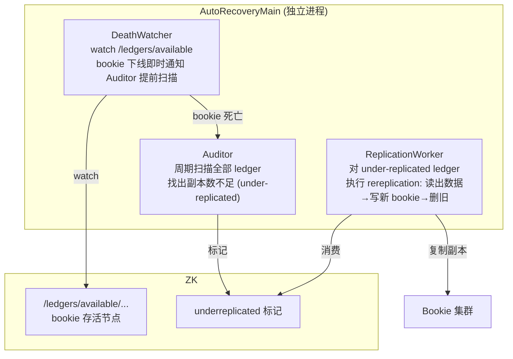
```mermaid
flowchart TB
    subgraph AR["AutoRecoveryMain (独立进程)"]
        AUD["Auditor<br/>周期扫描全部 ledger<br/>找出副本数不足 (under-replicated)"]
        RW["ReplicationWorker<br/>对 under-replicated ledger<br/>执行 rereplication: 读出数据→写新 bookie→删旧"]
        DW["DeathWatcher<br/>watch /ledgers/available<br/>bookie 下线即时通知 Auditor 提前扫描"]
    end
    subgraph ZK
        LEDGERS["/ledgers/available/...<br/>bookie 存活节点"]
        UR["underreplicated 标记"]
    end
    DW -->|"watch"| LEDGERS
    DW -->|"bookie 死亡"| AUD
    AUD -->|"标记"| UR
    RW -->|"消费"| UR
    RW -->|"复制副本"| Bookies["Bookie 集群"]
```

关键语义：

- **写路径不等恢复**：bookie 挂掉的瞬间，正在写的 ledger 由 `replaceBookie()` 即时换机，已有 ledger 的副本修复由 ReplicationWorker 异步补——写入可用性与副本完整性解耦；
- **under-replicated ledger 仍可读写**：只要剩余副本满足读 quorum，业务无感；
- Auditor 由 AutoRecovery 集群内部选举执行（避免多实例重复扫描），因此 autorecovery 可以部署多个实例实现自身 HA。

### 2.7 ManagedLedger 层故障状态机

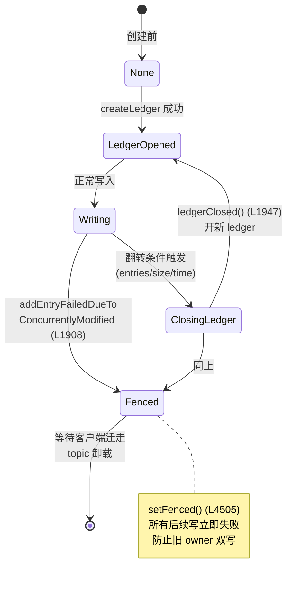
```mermaid
stateDiagram-v2
    [*] --> None: 创建前
    None --> LedgerOpened: createLedger 成功
    LedgerOpened --> Writing: 正常写入
    Writing --> ClosingLedger: 翻转条件触发<br/>(entries/size/time)
    ClosingLedger --> LedgerOpened: ledgerClosed() (L1947)<br/>开新 ledger
    Writing --> Fenced: addEntryFailedDueTo<br/>ConcurrentlyModified (L1908)
    ClosingLedger --> Fenced: 同上
    Fenced --> [*]: 等待客户端迁走<br/>topic 卸载
    note right of Fenced
        setFenced() (L4505)
        所有后续写立即失败
        防止旧 owner 双写
    end note
```

### 2.8 存储层 HA 配置表

| 配置键 | 默认值 | 说明 |
|---|---|---|
| `managedLedgerDefaultEnsembleSize` | 2 | E：ensemble 大小 |
| `managedLedgerDefaultWriteQuorum` | 2 | W：每条目副本数 |
| `managedLedgerDefaultAckQuorum` | 2 | A：确认 quorum |
| `bookkeeperClientEnsemblePlacementPolicy` | Rackaware... | 放置策略类名（可换 RegionAware / 隔离组） |
| `bookkeeperClientEnableBookieHealthCheck` | false | 开启 bookie 健康检查与 quarantine |
| `bookkeeperClientBookieHealthCheckIntervalSeconds` | - | 健康检查周期 |
| `bookkeeperClientSpeculativeReadTimeoutMillis` | 0（关） | 投机读超时 |
| `bookkeeper_XXX` | - | 任意 BK 客户端参数透传（L165-172） |
| `managedLedgerAddEntryTimeoutSeconds` | - | 写超时兜底（触发 scheduleAddEntryTimeoutTask） |

> 生产建议：重要业务用 `E3/W3/A2`（允许 1 台故障不降写入吞吐）或 `E3/W2/A2`；跨机房 `RegionAware` + minRacksPerWriteQuorum≥2。

---

## 3. 服务层高可用 —— Broker 无状态接管

### 3.1 Bundle 所有权：临时锁机制

broker 对 bundle 的所有权 = 元数据存储中的一个**临时节点（ephemeral node）**，路径形如 `/namespace/<tenant>/<cluster>/<namespace>/<start>_<end>`，值为 `NamespaceEphemeralData`（`pulsar-broker/src/main/java/org/apache/pulsar/broker/namespace/NamespaceEphemeralData.java`）：

| 字段 | 含义 |
|---|---|
| `brokerId` | 持有者唯一标识 |
| `nativeUrl` / `nativeUrlTls` | 二进制协议服务地址（客户端重定向目标） |
| `httpUrl` / `httpUrlTls` | 管理接口地址 |
| `disabled` | 是否禁用（优雅关闭期间置位，告知他人本 broker 即将退出） |
| `advertisedListeners` | 多 listener 地址表 |

获取链路（`OwnershipCache.tryAcquiringOwnership()`，`OwnershipCache.java` L275）：

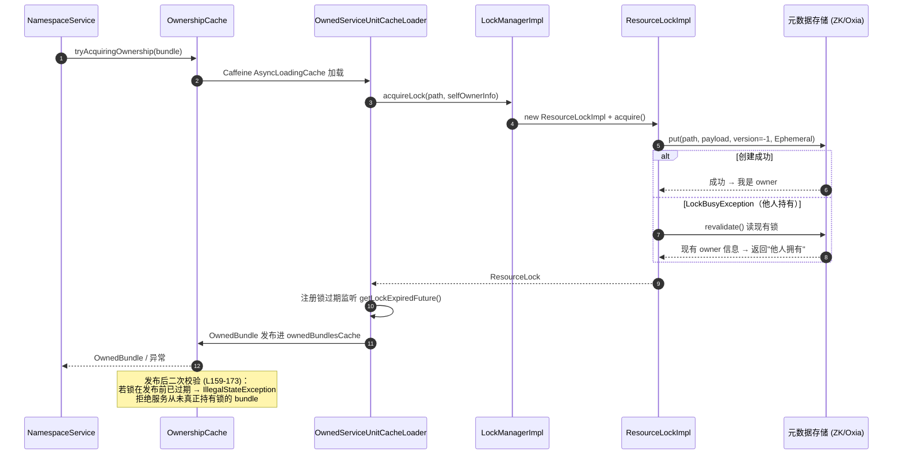
```mermaid
sequenceDiagram
    autonumber
    participant NS as NamespaceService
    participant OC as OwnershipCache
    participant LDR as OwnedServiceUnitCacheLoader
    participant LM as LockManagerImpl
    participant RL as ResourceLockImpl
    participant MS as 元数据存储 (ZK/Oxia)

    NS->>OC: tryAcquiringOwnership(bundle)
    OC->>LDR: Caffeine AsyncLoadingCache 加载
    LDR->>LM: acquireLock(path, selfOwnerInfo)
    LM->>RL: new ResourceLockImpl + acquire()
    RL->>MS: put(path, payload, version=-1, Ephemeral)
    alt 创建成功
        MS-->>RL: 成功 → 我是 owner
    else LockBusyException（他人持有）
        RL->>MS: revalidate() 读现有锁
        MS-->>RL: 现有 owner 信息 → 返回"他人拥有"
    end
    RL-->>LDR: ResourceLock
    LDR->>LDR: 注册锁过期监听 getLockExpiredFuture()
    LDR->>OC: OwnedBundle 发布进 ownedBundlesCache
    OC-->>NS: OwnedBundle / 异常
    Note over OC: 发布后二次校验 (L159-173)：<br/>若锁在发布前已过期 → IllegalStateException<br/>拒绝服务从未真正持有锁的 bundle
```

要点（`OwnershipCache.java` / `ResourceLockImpl.java`，均在 L107-176 / L151 附近）：

1. 锁本质是 `store.put(path, payload, Optional.of(-1L), EnumSet.of(CreateOption.Ephemeral))`——**version=-1 即"不存在才创建"的 CAS**，加上 Ephemeral 标志，会话一断节点自动消失；
2. `LockBusyException` 说明有人在写（可能是自己也可能是别人），走 `revalidate()` 分辨；
3. 所有成功获取的锁登记进 `locallyAcquiredLocks`（L113），broker 关闭时统一释放。

### 3.2 OwnershipCache 与代数（generation）安全

接管过程中最容易出现"旧代回调污染新代状态"的竞态。OwnershipCache 用**代数比对**防御：

- 每个 `OwnedBundle` 包装**一次特定代**的 `ResourceLock`；
- 锁过期回调（L115-158）触发时：先从 `locallyAcquiredLocks` 移除该锁（带代数检查）；再判断缓存里当前的 `OwnedBundle` 是否还是触发的这一个（L137 `getOwnedBundle(namespaceBundle) == ownedBundle`），**只有相同才执行** `namespaceService.unloadNamespaceBundle()`；
- `removeOwnership(OwnedBundle)`（L380）同样只在锁对象匹配时才释放；
- `bundleOperationBarriers`（L93）把对同一 bundle 的获取/释放操作串行化；
- 发布竞态兜底（L159-173）：若 `OwnedBundle` 在放入缓存前锁就已过期，直接 `IllegalStateException("Lock for bundle ... expired before ownership could be published")`，加载失败而非带病上线。

### 3.3 Broker 宕机 → bundle 接管全时序

这是 Pulsar 最核心的 HA 流程，串起元数据层、服务层、存储层与客户端：

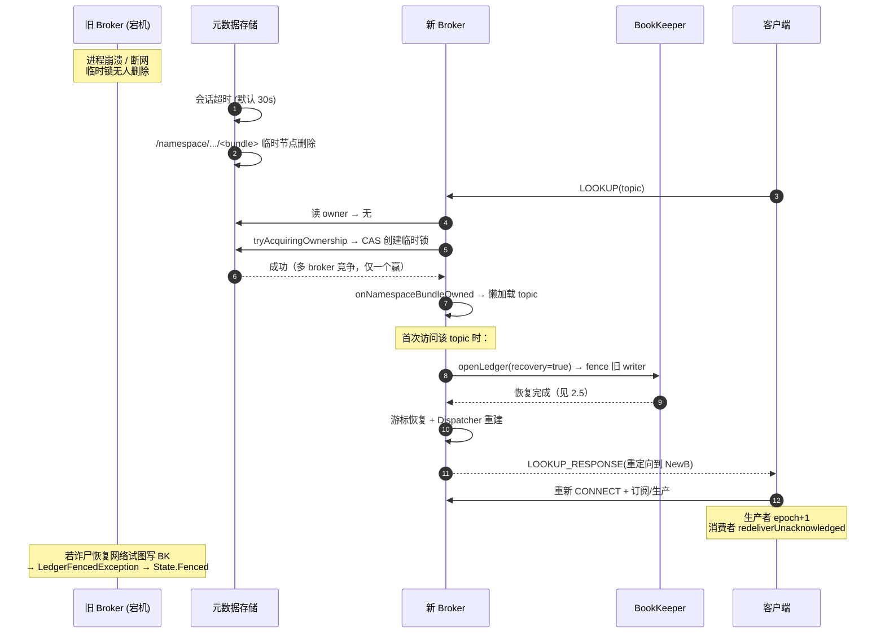
```mermaid
sequenceDiagram
    autonumber
    participant OldB as 旧 Broker (宕机)
    participant ZK as 元数据存储
    participant NewB as 新 Broker
    participant BK as BookKeeper
    participant C as 客户端

    Note over OldB: 进程崩溃 / 断网<br/>临时锁无人删除
    ZK->>ZK: 会话超时 (默认 30s)
    ZK->>ZK: /namespace/.../<bundle> 临时节点删除
    C->>NewB: LOOKUP(topic)
    NewB->>ZK: 读 owner → 无
    NewB->>ZK: tryAcquiringOwnership → CAS 创建临时锁
    ZK-->>NewB: 成功（多 broker 竞争，仅一个赢）
    NewB->>NewB: onNamespaceBundleOwned → 懒加载 topic
    Note over NewB: 首次访问该 topic 时：
    NewB->>BK: openLedger(recovery=true) → fence 旧 writer
    BK-->>NewB: 恢复完成（见 2.5）
    NewB->>NewB: 游标恢复 + Dispatcher 重建
    NewB-->>C: LOOKUP_RESPONSE(重定向到 NewB)
    C->>NewB: 重新 CONNECT + 订阅/生产
    Note over C: 生产者 epoch+1<br/>消费者 redeliverUnacknowledged
    Note over OldB: 若诈尸恢复网络试图写 BK<br/>→ LedgerFencedException → State.Fenced
```

**恢复时间构成**：会话超时（`metadataStoreSessionTimeoutMillis`，默认 30s）+ 下一次 lookup 触发（客户端断连重连时立即发生）。前者是主要延迟来源——对延迟敏感场景可下调会话超时（需权衡 ZK 心跳抖动误判）。

### 3.4 元数据会话失效：ZKSessionWatcher 与会话策略

`pulsar-metadata` 模块的会话监控链（ZK 实现）：

- `ZKMetadataStore`（L110）创建 `ZKSessionWatcher`：单线程调度器以 `ticktimeMillis = sessionTimeout / 15`（30s 超时即每 2s）用 `zk.exists("/")` 探活；
- **判定 SessionLost 的两个条件**（`ZKSessionWatcher.java`）：
  1. Disconnected 持续超过 `monitorTimeoutMillis = sessionTimeout × 5/6`（30s 超时即 25s）——这是"ZK 还没报 Expired 但实际已经凉了"的主动兜底；
  2. ZK 主动上报 `Expired` 事件——立即判定；
- 重连成功（SyncConnected）：若此前已 SessionLost，补发 `Reconnected + SessionReestablished` 两个事件，否则只发 `Reconnected`；
- `ZKMetadataStore.receivedSessionEvent()`（L159）：收到 `SessionReestablished` 时**先重建 `/` 上的持久递归 watch**（`AddWatchMode.PERSISTENT_RECURSIVE`），再通知监听者——保证后续通知不丢；若 watch 重建失败，强制使会话过期重来。

Broker 对 SessionLost 的响应（`PulsarService.handleMetadataSessionEvent()`，L1280，注册于 L933）：

```java
private void handleMetadataSessionEvent(SessionEvent e) {
    if (e == SessionEvent.SessionLost
            && config.getZookeeperSessionExpiredPolicy() == MetadataSessionExpiredPolicy.shutdown) {
        shutdownNow();
    }
}
```

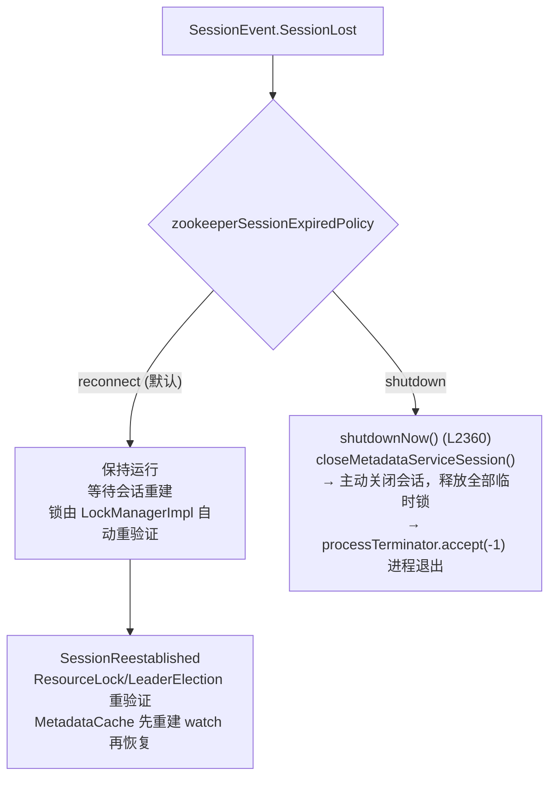
```mermaid
flowchart TD
    SE["SessionEvent.SessionLost"] --> P{zookeeperSessionExpiredPolicy}
    P -->|"reconnect (默认)"| RC["保持运行<br/>等待会话重建<br/>锁由 LockManagerImpl 自动重验证"]
    P -->|"shutdown"| SN["shutdownNow() (L2360)<br/>closeMetadataServiceSession()<br/>→ 主动关闭会话，释放全部临时锁<br/>→ processTerminator.accept(-1) 进程退出"]
    RC --> RE["SessionReestablished<br/>ResourceLock/LeaderElection 重验证<br/>MetadataCache 先重建 watch 再恢复"]
```

两种策略的取舍：

- **`reconnect`（默认）**：适合 ZK 短暂抖动多的环境；代价是抖动期间（最长 sessionTimeout+ 侦察期）本 broker 的 bundle 锁处于"可能已被删"的悬空态，依赖锁过期回调 + 客户端 lookup 兜底，**存在短暂双主窗口**，最终由 ledger fencing 兜住正确性；
- **`shutdown`**：SessionLost 即自杀，锁立刻消失，接管最快、无双主窗口；代价是对 ZK 抖动零容忍，broker 频繁重启。

### 3.5 优雅关闭：closeAsync 关闭序列

`PulsarService.closeAsync()`（`PulsarService.java` L523-799）的顺序本身就是 HA 设计——**先停止接新流量，再释放所有权，最后关资源**：

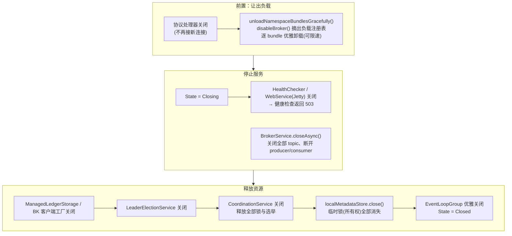
```mermaid
flowchart TD
    subgraph Phase1["前置：让出负载"]
        A1["协议处理器关闭<br/>(不再接新连接)"] --> A2["unloadNamespaceBundlesGracefully()<br/>disableBroker() 摘出负载注册表<br/>逐 bundle 优雅卸载(可限速)"]
    end
    subgraph Phase2["停止服务"]
        B1["State = Closing"] --> B2["HealthChecker / WebService(Jetty) 关闭<br/>→ 健康检查返回 503"]
        B3["BrokerService.closeAsync()<br/>关闭全部 topic、断开 producer/consumer"]
    end
    subgraph Phase3["释放资源"]
        C1["ManagedLedgerStorage / BK 客户端工厂关闭"] --> C2["LeaderElectionService 关闭"]
        C2 --> C3["CoordinationService 关闭<br/>释放全部锁与选举"]
        C3 --> C4["localMetadataStore.close()<br/>临时锁(所有权)全部消失"]
        C4 --> C5["EventLoopGroup 优雅关闭<br/>State = Closed"]
    end
    Phase1 --> Phase2 --> Phase3
```

关键细节：

- **`unloadNamespaceBundlesGracefully()`**（`BrokerService.java` L1163-1234）：第一步就是 `loadManager.disableBroker()` 把自己从负载注册表摘除（不再分新 bundle），然后逐 bundle 卸载，支持 `maxConcurrentUnload` 限速防止瞬间洪峰冲击接收方；
- **单 bundle 卸载**（`OwnedBundle.handleUnloadRequest()`，L131-231）：CAS 翻转 `isActive=false`（此后拒绝新建 producer/consumer）→ 对 topic 快照（防并发重获所有权时误删新代 topic）→ `unloadServiceUnit()` 关 topic → 发 `CommandCloseProducer/Consumer` 给客户端（携带目标 broker URL，旧协议 < v5 则直接断连接，`ServerCnx.java` L4335/L4367）→ `removeOwnership()`（代数匹配才释放）；
- **关闭超时**：`brokerShutdownTimeoutMs`（默认 60s）与单 bundle `namespaceBundleUnloadingTimeoutMs`（默认 60s）控制，超时即强关（`closeWithoutWaitingClientDisconnect`）；
- **REST 触发**：`POST /admin/v2/brokers/{cluster}/{broker}/shutdown`（`BrokersBase.java` L507）→ 卸载全部 bundle → `pulsar.closeAsync(false)`。

### 3.6 Leader 选举（LeaderElectionImpl）

负载均衡决策由 **leader broker** 单点执行（避免多 broker 各自为政）。实现在 `pulsar-metadata` 的 `LeaderElectionImpl.java`——**单临时节点 CAS 选举**（非 ZK 顺序节点羊圈算法）：

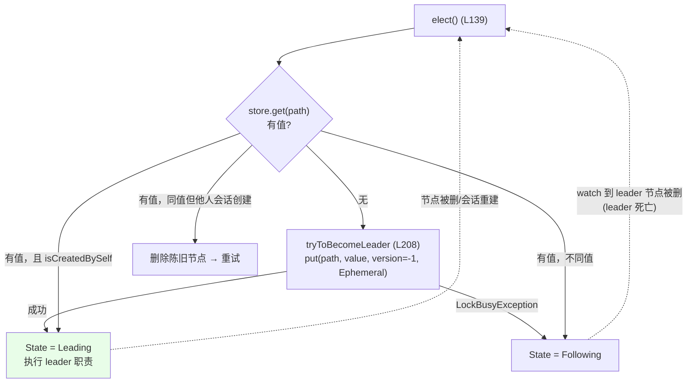
```mermaid
flowchart TD
    E["elect() (L139)"] --> G{"store.get(path)<br/>有值?"}
    G -->|"无"| T["tryToBecomeLeader (L208)<br/>put(path, value, version=-1, Ephemeral)"]
    T -->|"成功"| L["State = Leading<br/>执行 leader 职责"]
    T -->|"LockBusyException"| F["State = Following"]
    G -->|"有值，且 isCreatedBySelf"| L
    G -->|"有值，同值但他人会话创建"| D["删除陈旧节点 → 重试"]
    G -->|"有值，不同值"| F
    F -.->|"watch 到 leader 节点被删<br/>(leader 死亡)"| E
    L -.->|"节点被删/会话重建"| E
    style L fill:#e8fde8
```

- 选举路径：经典负载管理器 `/loadbalance/leader`（`LeaderElectionService.java`）；扩展负载管理器 `/loadbalance/extension/leader`（`ExtensibleLoadManagerImpl.java` L124）；
- 会话重连（`handleSessionNotification()` L374）：`Reconnected`/`SessionReestablished` 时重跑 `elect()` 重验证身份；
- leader 节点被删（leader 死亡）触发全体重选，重试间隔 5s（`LEADER_ELECTION_RETRY_DELAY_SECONDS`）；
- leader 职责（`ModularLoadManagerImpl`）：`doLoadShedding()` 挑 overload bundle 卸载、聚合写负载数据、`findBrokerForAssignment()` 指派新 bundle；（`ExtensibleLoadManagerImpl.playLeader()` L882）：初始化系统 topic 状态通道、启动 `unloadScheduler` 与 ownership 监控。

### 3.7 负载卸载与 bundle 迁移

**两代负载管理器并存**：

| 代 | 实现 | 卸载策略 | 卸载方式 |
|---|---|---|---|
| 经典 | `ModularLoadManagerImpl` / `SimpleLoadManagerImpl` | `ThresholdShedder`（默认）/ `UniformLoadShedder` | 卸载 → Free → 重新分配 |
| 扩展（PIP-192） | `ExtensibleLoadManagerImpl` | `TransferShedder` | **Transfer 协议：源 → 目标定向迁移** |

扩展版的 bundle 状态通过**系统 topic 状态通道**（`ServiceUnitStateChannelImpl`）协调，状态机（`ServiceUnitState.java`）：

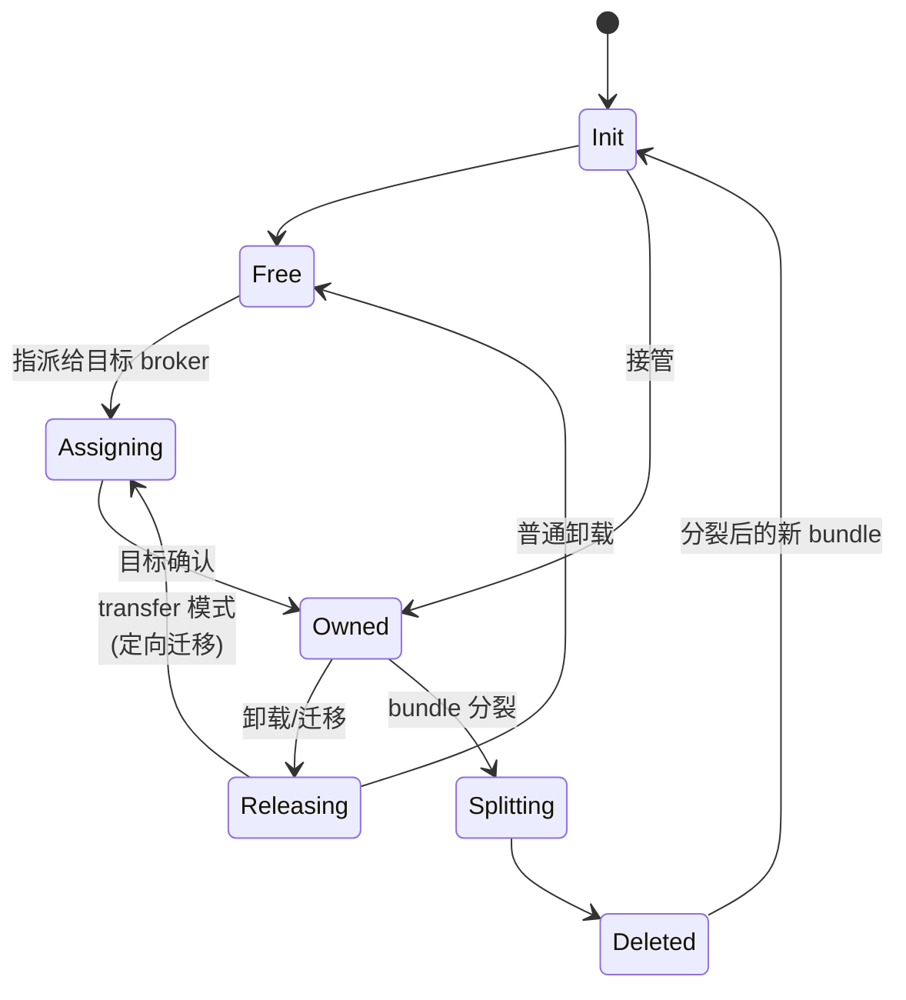
```mermaid
stateDiagram-v2
    [*] --> Init
    Init --> Free
    Init --> Owned: 接管
    Free --> Assigning: 指派给目标 broker
    Assigning --> Owned: 目标确认
    Owned --> Releasing: 卸载/迁移
    Owned --> Splitting: bundle 分裂
    Releasing --> Assigning: transfer 模式<br/>(定向迁移)
    Releasing --> Free: 普通卸载
    Splitting --> Deleted
    Deleted --> Init: 分裂后的新 bundle
```

Transfer 迁移时序（`TransferShedder` + `UnloadScheduler` + `UnloadManager`）：

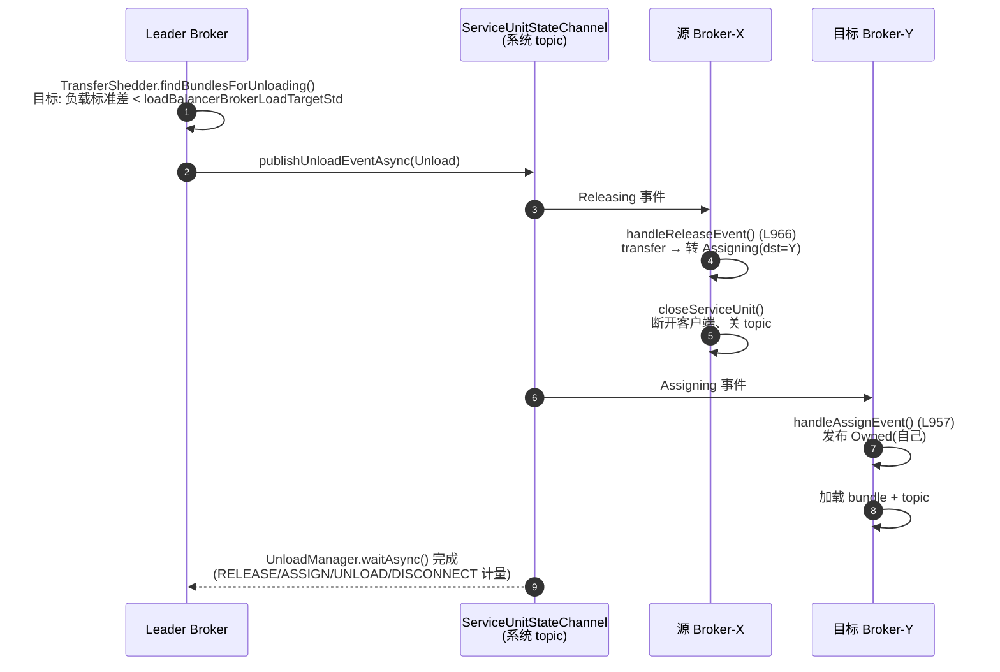
```mermaid
sequenceDiagram
    autonumber
    participant LD as Leader Broker
    participant CH as ServiceUnitStateChannel<br/>(系统 topic)
    participant SRC as 源 Broker-X
    participant DST as 目标 Broker-Y

    LD->>LD: TransferShedder.findBundlesForUnloading()<br/>目标: 负载标准差 < loadBalancerBrokerLoadTargetStd
    LD->>CH: publishUnloadEventAsync(Unload)
    CH->>SRC: Releasing 事件
    SRC->>SRC: handleReleaseEvent() (L966)<br/>transfer → 转 Assigning(dst=Y)
    SRC->>SRC: closeServiceUnit()<br/>断开客户端、关 topic
    CH->>DST: Assigning 事件
    DST->>DST: handleAssignEvent() (L957)<br/>发布 Owned(自己)
    DST->>DST: 加载 bundle + topic
    CH-->>LD: UnloadManager.waitAsync() 完成<br/>(RELEASE/ASSIGN/UNLOAD/DISCONNECT 计量)
```

TransferShedder 的设计目标（`TransferShedder.java` L69-89）：压低 broker 负载标准差、优先迁移到零吞吐的新 broker、冷却期防抖动、跳过过期负载数据、尊重隔离策略与反亲和组、支持过载/欠载 broker 间的 bundle 互换。

### 3.8 Topic 迁移（TOPIC_MIGRATED 命令）

集群迁移/大范围重平衡时，broker 主动把客户端"赶"到目标 broker，协议层即 `CommandTopicMigrated`（客户端侧处理见 5.4）：

- 服务端发送：`PulsarCommandSender.sendTopicMigrated(ResourceType, resourceId, brokerUrl, brokerUrlTls)`（`PulsarCommandSender.java` L84）；
- 触发点（`ServerCnx.java`）：L2141/L2237（producer 创建时）、L2204（consumer）、L2562/L2663（lookup 时）；异常源头 `AbstractTopic` L936、`BrokerService` L2393、`PersistentTopic` L3560 抛 `TopicMigratedException`；
- producer/consumer 收到后断连并直连 `brokerUrl`（`Producer.topicMigrated()` L791、`Consumer.topicMigrated()` L1075），**免 lookup 直达**，迁移收敛更快。

### 3.9 健康检查与就绪探针

- **状态机**：`PulsarService.State = {Init, Started, Closing, Closed}`（L330）；
- **就绪**：`readyForIncomingRequestsFuture`（L327）在 `start()` 尾部（L1097）完成；`waitUntilReady()` / `runWhenReadyForIncomingRequests()` 供启动脚本与依赖组件等待；
- **存活检查**：`GET /admin/v2/brokers/{cluster}/health`（`BrokersBase.java` L414）：State 为 Closing/Closed → 503；检测 JVM 死锁线程 → 500；否则跑 `HealthChecker`——**端到端检查**：建 `healthcheck` topic → 写一条 → Reader 读回（读超时 58s，故意小于客户端默认 60s），验证的是"生产+存储+消费"整条链路而非进程活着。

---

## 4. 元数据层高可用

### 4.1 元数据存储实现与 SPI

`pulsar-metadata` 模块用统一抽象 `MetadataStore` / `MetadataStoreExtended` 屏蔽后端：

| 实现 | 路径 scheme | HA 特性 |
|---|---|---|
| `ZKMetadataStore` | `zk://`（默认） | 依赖 ZK ensemble 多数派；会话/临时节点/持久递归 watch |
| `OxiaMetadataStore` | `oxia://` | 自研 Raft 共识元数据存储（Apache 顶级项目），线性一致读写、内建会话租约（`sessionTimeout`，L95）与 ephemeral key（L297）、CAS（`KeyAlreadyExistsException`/`UnexpectedVersionIdException`）、通知（Notification）、范围扫描、sequence key |
| `DualMetadataStore` | - | 双写迁移桥（见 4.4） |
| RocksDB | ` rocksdb://` | 单机嵌入式，仅用于单机/测试，无 HA |

本地测试可用 `metadataStoreUrl=memory:` 或 rocksdb 起单机，但生产 HA 必须用 ZK ensemble 或 Oxia 集群。

### 4.2 ZK 会话监控与重连（元数据层细节）

补充 3.4 未覆盖的实现细节（`ZKMetadataStore.java`）：

- 客户端参数：`sessionTimeoutMs`（默认 30s）+ `BoundExponentialBackoffRetryPolicy(100ms, 60s, MAX_VALUE)`——**重连永不放弃**；
- **批量写**（`initBatchStrategy()` L151）：`batchingEnabled`（默认 true）、`batchingMaxDelayMillis`（5ms）、`batchingMaxOperations`（1000），把多个元数据写合并成 ZK batch；批失败（连接断）自动降级为逐条重试（L206-250）；
- **multi 事务**：`batchOperation(List<MetadataOp>)` 走 ZK `multi()`，PUT/DELETE 原子全成或全败——bundle 分裂等"改策略+删旧锁"的组合操作靠它保证一致性。

### 4.3 双存储架构：localMetadataStore 与 configurationMetadataStore

`PulsarService`（L941-946）区分两个元数据存储：

| 存储 | 内容 | 作用域 |
|---|---|---|
| `localMetadataStore` | bundle 所有权锁、broker 注册、负载数据、ML 元数据、TC 元数据 | 集群内 |
| `configurationMetadataStore` | 租户/namespace 策略、cluster 元数据 | **跨集群共享**（geo-replication 全局配置） |

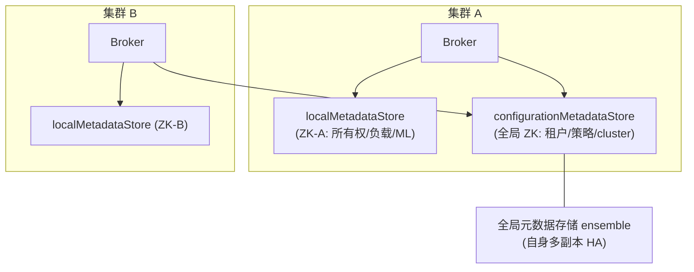
```mermaid
flowchart TB
    subgraph C1["集群 A"]
        A1[Broker] --> LZ["localMetadataStore<br/>(ZK-A: 所有权/负载/ML)"]
        A1 --> CZ["configurationMetadataStore<br/>(全局 ZK: 租户/策略/cluster)"]
    end
    subgraph C2["集群 B"]
        B1[Broker] --> LZ2["localMetadataStore (ZK-B)"]
        B1 --> CZ
    end
    CZ --- GZ["全局元数据存储 ensemble<br/>(自身多副本 HA)"]
```

未配置 `configurationMetadataStoreUrl` 时复用 local store（`shouldShutdownConfigurationMetadataStore=false`）。

### 4.4 DualMetadataStore —— 元数据在线迁移

从 ZK 迁到 Oxia（或任何 store→store）不停服的桥（`DualMetadataStore.java`）：

- `sourceStore`（当前）+ `targetStore`（volatile，迁移到相应阶段才初始化）+ `migrationStateCache`（监听 `MIGRATION_FLAG_PATH` 上的 `MigrationState`）+ 本 broker 的 `PARTICIPANTS_PATH` 临时参与节点；
- 三阶段：`PREPARATION → COPYING → COMPLETED`（L116-133）；
- 迁移推进时：**在目标 store 重建临时节点**、双写同步，最终切换到目标 store。这使"换元数据存储"这个运维大动作本身也是高可用的。

### 4.5 MetadataCache 跨 broker 推送失效

策略类元数据（namespace 策略、订阅等）在各 broker 有本地缓存，失效靠**推送**：

- 每个 broker `registerListener` 收到 `/` 持久递归 watch 的全量通知；
- `MetadataCacheImpl`（`MetadataCacheImpl.java`）：`Created/Modified → refresh(path)` 重读入缓存；`Deleted → invalidate(path)` 删除；
- 效果：任一 broker 改策略，全集群秒级可见——这是"改名/改策略/卸载 bundle"等管理操作能被正确执行的前提。

### 4.6 CoordinationService：锁与选举的统一抽象

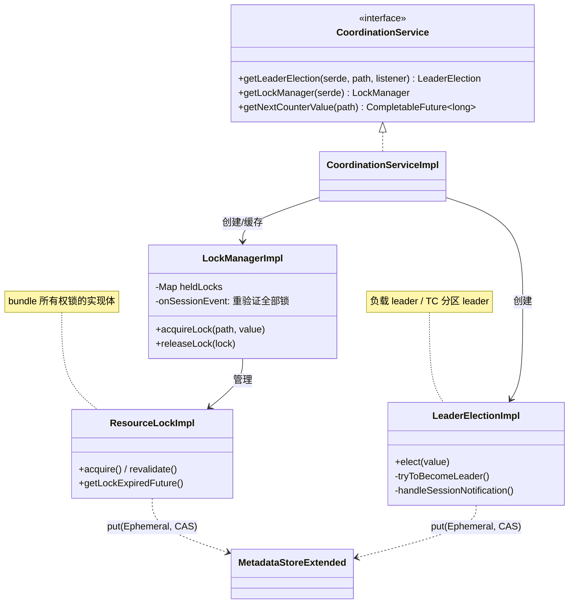
```mermaid
classDiagram
    class CoordinationService {
        <<interface>>
        +getLeaderElection(serde, path, listener) LeaderElection
        +getLockManager(serde) LockManager
        +getNextCounterValue(path) CompletableFuture~long~
    }
    class CoordinationServiceImpl
    class LockManagerImpl {
        -Map heldLocks
        +acquireLock(path, value)
        +releaseLock(lock)
        -onSessionEvent: 重验证全部锁
    }
    class ResourceLockImpl {
        +acquire() / revalidate()
        +getLockExpiredFuture()
    }
    class LeaderElectionImpl {
        +elect(value)
        -tryToBecomeLeader()
        -handleSessionNotification()
    }
    CoordinationService <|.. CoordinationServiceImpl
    CoordinationServiceImpl --> LockManagerImpl : 创建/缓存
    CoordinationServiceImpl --> LeaderElectionImpl : 创建
    LockManagerImpl --> ResourceLockImpl : 管理
    ResourceLockImpl ..> MetadataStoreExtended : put(Ephemeral, CAS)
    LeaderElectionImpl ..> MetadataStoreExtended : put(Ephemeral, CAS)
    note for ResourceLockImpl "bundle 所有权锁的实现体"
    note for LeaderElectionImpl "负载 leader / TC 分区 leader"
```

bundle 所有权（3.1）、负载 leader（3.6）、事务协调者（9.3）**共用这一套原语**——`put(version=-1, Ephemeral)` 的 CAS 语义 + 会话事件驱动重验证，是整个 Pulsar 协调层的地基。

---

## 5. 客户端故障转移

### 5.1 重连引擎 ConnectionHandler

`pulsar-client/src/main/java/org/apache/pulsar/client/impl/ConnectionHandler.java` 是 Producer/Consumer 共用的重连状态机：

| 方法 | 行号 | 职责 |
|---|---|---|
| `grabCnx()` | L99 | 从 ConnectionPool 拿/建连接并发起握手 |
| `reconnectLater()` | L194 | 按 Backoff 延迟后重试 grabCnx |
| `connectionClosed()` | L227 | 连接断开的统一入口（无论主动被动） |
| `isValidStateForReconnection()` | L283 | 判断当前状态是否还允许重连（已关闭则不重连） |

**Backoff 退避**：初始间隔 ×2 指数增长，封顶 `maxBackoffIntervalSec`，**加抖动（jitter）**避免大量客户端同频重连风暴，且带 `mandatoryStop`（ProducerImpl L350 附近配置）——退避曲线不会越过最大 deadline，保证 sendTimeout 语义可预期。

**epoch 防旧机制**（L52-55 / L277-280）：每次 `connectionClosed` 后 `epoch++`；握手回调携带发起时的 epoch，与当前值不符说明期间又断过一次，**直接丢弃这次过期回调**：

```java
// ProducerImpl.recoverProcessOpSendMsgFrom (L2858) 的守护条件
if (expectedEpoch != this.connectionHandler.getEpoch() || cnx() == null) return;
```

这防止"重连竞态下旧连接的 CONNECTED/ERROR 响应覆盖新连接状态"。

`ClientCnx.channelInactive()`（L518-560）是连接级断开的分发中枢：遍历挂在该连接上的所有 producer/consumer 请求 future，逐个以异常完成并触发各自 `connectionClosed` → 重连流程。

### 5.2 Producer failover

重连成功后 `ProducerImpl.connectionOpened()`（L2108-2319）做的远不止重新握手：

1. 重发 `CommandProducer`（带 `ProducerAccessMode` 与**递增 epoch**，见下）；
2. 恢复 chunking 状态、重置背压（信号量 + MemoryLimitController）；
3. **`resendMessages()`**（L2393-2427）：把 pending 队列中未确认的消息全部重发——这是"客户端/broker/存储"三方都可能丢消息时恢复一致性的关键（消息在收到 broker ack 前永远留在客户端内存）。

**Producer fencing（服务端配合）**：`ProducerAccessMode`（Exclusive / WaitForExclusive / Shared）下，新 producer 以更高 epoch 抢占注册时，旧 producer 后续写会被 broker 拒绝并回 `ProducerFencedException`，客户端据此永久关闭自己——与 BK ledger fencing（2.4）同构，防止双 producer 双写。

**sendTimeout 兜底**（L2491）：超时任务周期扫描 pending 消息，超过 `sendTimeoutMs`（默认 30s）的以 timeout 异常失败并放行背压——防止故障期间背压永久卡死。

### 5.3 Consumer failover

`ConsumerImpl`（`pulsar-client/src/main/java/org/apache/pulsar/client/impl/ConsumerImpl.java`）：

- `connectionOpened()`（L878-1066）：重发 `CommandSubscribe`（带递增 **consumerEpoch**——failover 订阅下防旧 consumer 抢占）+ `CommandFlow` 补发 permit；若连接的是新 owner broker，服务端 Dispatcher 重建；
- `connectionFailed()`（L1133-1161）：按重试类型决定是否需要重新 lookup（broker 重启/迁移后地址可能已变）；
- `redeliverUnacknowledgedMessages()`（L2232-2290）：**断连时未 ack 消息全部要求重投**——at-least-once 语义的来源（Shared 订阅请求 broker 重发；Failover 由新 active consumer 自然重收）；
- `activeConsumerChanged()`（L1271-1283）：处理服务端 `ACTIVE_CONSUMER_CHANGE` 命令——failover 订阅的 active 角色变化回调（服务端触发方 `ClientCnx.handleActiveConsumerChange` L922-930）；
- `handleCloseConsumer`（`ClientCnx` L1291-1312）：broker 主动关闭（卸载/迁移）时携带新 broker URL，客户端直连过去；
- **ZeroQueueConsumerImpl 的防旧特化**（`consumerIsReconnectedToBroker` L140-149 + stale guard L114-123）：零队列（Reader）模式在重连瞬间必须丢弃旧连接上仍在飞的 MESSAGE 推送，否则会乱序/重复投递给用户回调。

### 5.4 Lookup 重试、重定向与 TOPIC_MIGRATED

- **重定向跟随**：`LOOKUP_RESPONSE` 返回 redirect 时客户端自动向目标 broker 再查，上限 `maxLookupRedirects=20` 防环；
- **重查找**：连接断开且怀疑 topic 已迁移时（`connectionFailed`），重新执行完整 lookup 流程而非盲目重连原地址——broker 接管后物理地址已变；
- **TOPIC_MIGRATED**（`ClientCnx.handleTopicMigrated` L1105-1130）：broker 明确告知"topic 已迁到集群 X 的 broker"，客户端直连命令携带的 `brokerUrl`，跳过 lookup，收敛更快（配合 3.8）。

### 5.5 服务地址隔离与自愈

`PulsarServiceNameResolver`（`pulsar-client/.../impl/PulsarServiceNameResolver.java`）对 serviceUrl 列表做可用性管理：

- `resolveHost()`（L71-93）：**轮询**而非随机选择地址，故障后流量自动摊到下一台；
- `markHostAvailability()`（L167-211）：连接成功/失败反馈给 resolver；连续失败的地址进入 **quarantine（隔离）**，临时从轮询池摘除；隔离有 TTL，到期自动放回重试——**故障地址自愈**，无需人工干预（Proxy 地址列表、多 serviceUrl 集群地址都受益）。

### 5.6 事务客户端重连

事务场景的 `TransactionCoordinatorClient` 依赖各 TC 分区的 leader 位置：客户端订阅 assignment 变更通知（见 9.3），TC leader 变化后自动重连新 leader——`newTxn`/`addPublishToTxn`/`endTxn` 请求失败时按 epoch/assignment 重试。

### 5.7 客户端故障转移时序

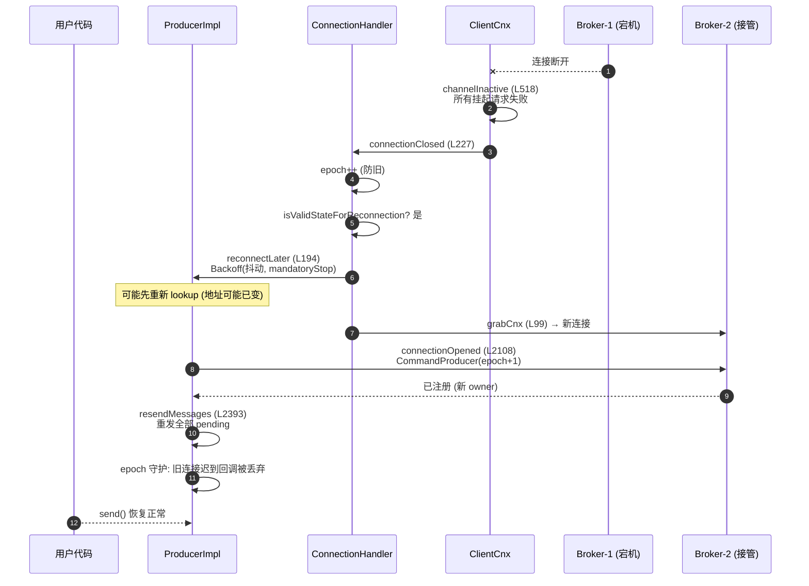
```mermaid
sequenceDiagram
    autonumber
    participant U as 用户代码
    participant P as ProducerImpl
    participant CH as ConnectionHandler
    participant CNX as ClientCnx
    participant B1 as Broker-1 (宕机)
    participant B2 as Broker-2 (接管)

    B1--xCNX: 连接断开
    CNX->>CNX: channelInactive (L518)<br/>所有挂起请求失败
    CNX->>CH: connectionClosed (L227)
    CH->>CH: epoch++ (防旧)
    CH->>CH: isValidStateForReconnection? 是
    CH->>P: reconnectLater (L194)<br/>Backoff(抖动, mandatoryStop)
    Note over P: 可能先重新 lookup (地址可能已变)
    CH->>B2: grabCnx (L99) → 新连接
    P->>B2: connectionOpened (L2108)<br/>CommandProducer(epoch+1)
    B2-->>P: 已注册 (新 owner)
    P->>P: resendMessages (L2393)<br/>重发全部 pending
    P->>P: epoch 守护: 旧连接迟到回调被丢弃
    U-->>P: send() 恢复正常
```

---

## 6. 跨集群容灾 —— Geo-Replication

复制的本质：本地 broker 为每个远端集群起一个**内部 producer**（Replicator），把本地 topic 的消息转发到远端。因此"远端集群故障"退化为"内部 producer 目标不可达"问题。

### 6.1 复制器退避与断连

`AbstractReplicator.startProducer()`（L192-247）与 `PersistentReplicator`：

- producer 断连后进入 `Disconnected` 状态，按 Backoff 退避重连，**消息继续写入本地 ledger，仅复制游标暂停**——本地生产不受任何影响；
- `readFailureBackoff`（`PersistentReplicator.java` L104-107）：读本地 backlog 失败时的退避；
- `disconnectIfNoTrafficAndBacklog()`（L275-297）：远端长期无流量且无积压时主动断开 producer 省资源，有新消息再重连。

### 6.2 远端不可达时的 backlog 与 TTL DISCARD

远端故障期间，复制游标（本质是一个名为 `pulsar.repl.<remote-cluster>` 的订阅）停在原地，本地 backlog 无限增长。两道防线（`PersistentReplicator.java`）：

- `readEntriesFailed()`（L580-616）：读本地 entry 失败（常见于 ledger 被 trim 掉了——积压太久）时按错误类型决定重试或跳过；
- **TTL 丢弃**（L786-801）：消息超过 TTL 后，即使复制游标未消费，也允许按 backlog quota 的 `DISCARD` 策略释放——即**接受"远端故障超过 TTL 的消息不再复制"**，用一致性换可用性；`MINIMUM_BACKLOG_FOR_EXPIRY_CHECK = 1000`（L111）：积压低于 1000 条时不做过期检查，省 CPU。

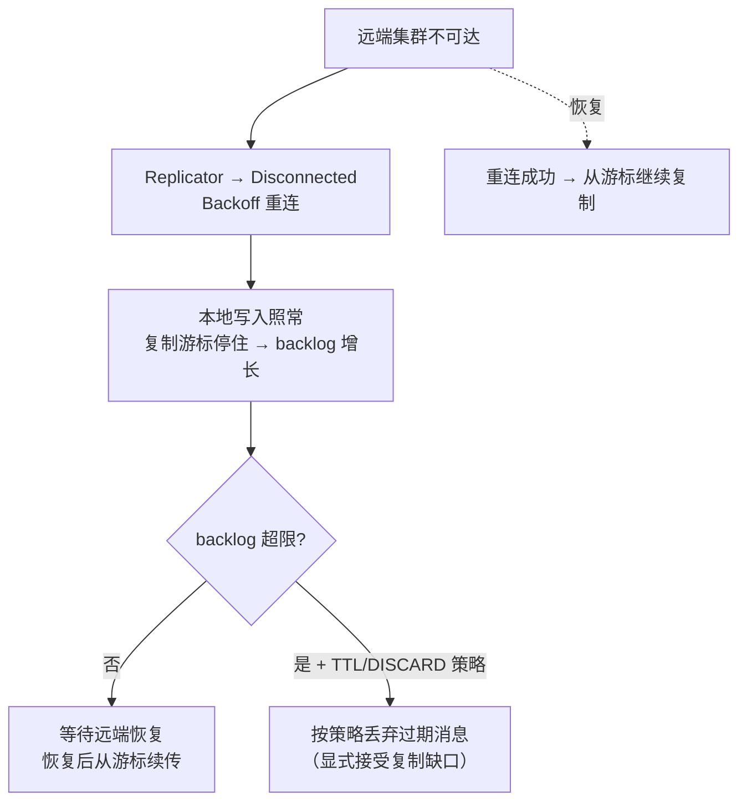
```mermaid
flowchart TD
    RD["远端集群不可达"] --> DISC["Replicator → Disconnected<br/>Backoff 重连"]
    DISC --> BK["本地写入照常<br/>复制游标停住 → backlog 增长"]
    BK --> Q{backlog 超限?}
    Q -->|"否"| WAIT["等待远端恢复<br/>恢复后从游标续传"]
    Q -->|"是 + TTL/DISCARD 策略"| DROP["按策略丢弃过期消息<br/>（显式接受复制缺口）"]
    RD -.->|"恢复"| RESUME["重连成功 → 从游标继续复制"]
```

### 6.3 双活语义

两个集群互配 replication 即双活：双向各有一个 Replicator；配合 `configurationMetadataStore`（4.3）共享全局命名空间元数据。集群级故障（整机房）靠**异步复制 + TTL 策略**在 RPO（允许丢多少）与资源占用间取舍。

---

## 7. Proxy 层高可用

Proxy 自身**完全无状态**（不持有 topic/锁），HA = 水平扩容 + 客户端重连：

- **服务发现**：`BrokerDiscoveryProvider.nextBroker()`（`BrokerDiscoveryProvider.java` L86-96）从 broker 注册列表**轮询**选一台做 lookup/直连目标——broker 挂掉后注册消失，轮询自动绕开；
- **后端失效**：`DirectProxyHandler.ProxyBackendHandler.channelInactive`（L550-552）后端连接断开时**立即关闭入站（客户端）连接**——不做故障转移伪装，而是让客户端走自己的完整重连 + 重 lookup 流程（5.x），由元数据层的最新所有权信息决定新目标，避免 proxy 持有过期拓扑；
- **Lookup 代理**：`LookupProxyHandler.performLookup`（L144-209）跟随 broker 重定向（同样受客户端 `maxLookupRedirects` 约束的层级）；
- **部署**：客户端 serviceUrl 指向 proxy 集群的多个地址，配合 5.5 的地址隔离自愈。

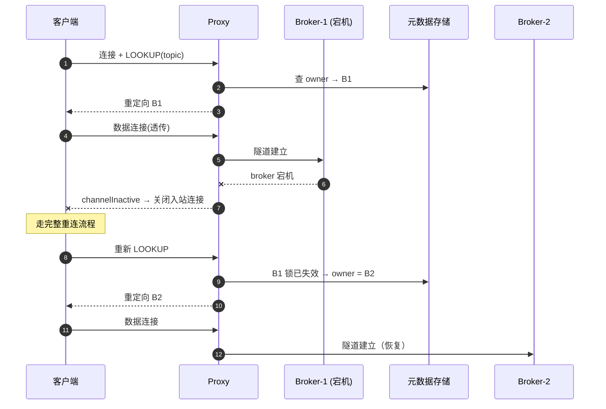
```mermaid
sequenceDiagram
    autonumber
    participant C as 客户端
    participant PX as Proxy
    participant B1 as Broker-1 (宕机)
    participant ZK as 元数据存储
    participant B2 as Broker-2

    C->>PX: 连接 + LOOKUP(topic)
    PX->>ZK: 查 owner → B1
    PX-->>C: 重定向 B1
    C->>PX: 数据连接(透传)
    PX->>B1: 隧道建立
    B1--xPX: broker 宕机
    PX--xC: channelInactive → 关闭入站连接
    Note over C: 走完整重连流程
    C->>PX: 重新 LOOKUP
    PX->>ZK: B1 锁已失效 → owner = B2
    PX-->>C: 重定向 B2
    C->>PX: 数据连接
    PX->>B2: 隧道建立（恢复）
```

---

## 8. 典型故障场景端到端时序

### 8.1 Broker 宕机（最核心场景，全链路）

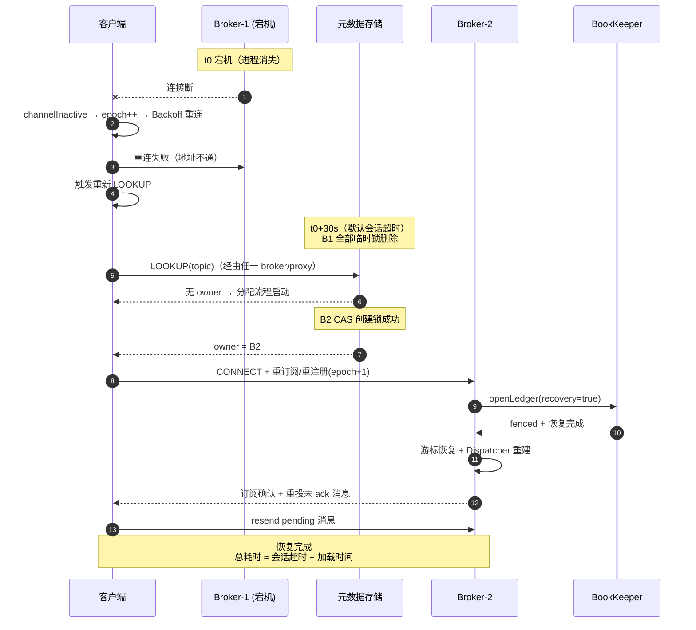
```mermaid
sequenceDiagram
    autonumber
    participant C as 客户端
    participant B1 as Broker-1 (宕机)
    participant ZK as 元数据存储
    participant B2 as Broker-2
    participant BK as BookKeeper

    Note over B1: t0 宕机（进程消失）
    B1--xC: 连接断
    C->>C: channelInactive → epoch++ → Backoff 重连
    C->>B1: 重连失败（地址不通）
    C->>C: 触发重新 LOOKUP
    Note over ZK: t0+30s（默认会话超时）<br/>B1 全部临时锁删除
    C->>ZK: LOOKUP(topic)（经由任一 broker/proxy）
    ZK-->>C: 无 owner → 分配流程启动
    Note over ZK: B2 CAS 创建锁成功
    ZK-->>C: owner = B2
    C->>B2: CONNECT + 重订阅/重注册(epoch+1)
    B2->>BK: openLedger(recovery=true)
    BK-->>B2: fenced + 恢复完成
    B2->>B2: 游标恢复 + Dispatcher 重建
    B2-->>C: 订阅确认 + 重投未 ack 消息
    C->>B2: resend pending 消息
    Note over C,B2: 恢复完成<br/>总耗时 ≈ 会话超时 + 加载时间
```

### 8.2 Bookie 宕机（写入无感 + 异步补副本）

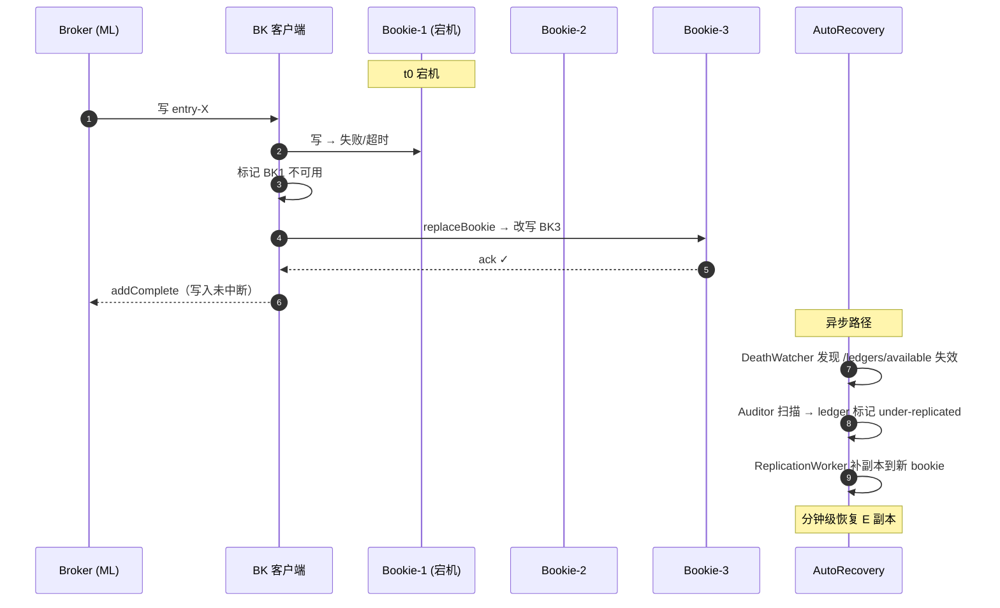
```mermaid
sequenceDiagram
    autonumber
    participant B as Broker (ML)
    participant BKC as BK 客户端
    participant BK1 as Bookie-1 (宕机)
    participant BK2 as Bookie-2
    participant BK3 as Bookie-3
    participant AR as AutoRecovery

    Note over BK1: t0 宕机
    B->>BKC: 写 entry-X
    BKC->>BK1: 写 → 失败/超时
    BKC->>BKC: 标记 BK1 不可用
    BKC->>BK3: replaceBookie → 改写 BK3
    BK3-->>BKC: ack ✓
    BKC-->>B: addComplete（写入未中断）
    Note over AR: 异步路径
    AR->>AR: DeathWatcher 发现 /ledgers/available 失效
    AR->>AR: Auditor 扫描 → ledger 标记 under-replicated
    AR->>AR: ReplicationWorker 补副本到新 bookie
    Note over AR: 分钟级恢复 E 副本
```

### 8.3 元数据存储会话失效（broker 未死）

```mermaid
sequenceDiagram
    autonumber
    participant B as Broker
    participant SW as ZKSessionWatcher
    participant LM as LockManagerImpl
    participant ZK as ZK (网络分区)

    Note over ZK: 网络分区，心跳不通
    SW->>SW: 每 sessionTimeout/15 探活 exists("/")
    SW->>SW: 断开 > sessionTimeout×5/6<br/>→ SessionLost
    SW->>B: SessionEvent.SessionLost
    alt policy = shutdown
        B->>B: shutdownNow() → 主动释放锁 → 退出
    else policy = reconnect (默认)
        B->>B: 继续服务（悬空锁状态）
    end
    Note over ZK: 网络恢复
    SW->>ZK: 重建会话
    SW->>B: Reconnected + SessionReestablished
    B->>ZK: 先重建持久递归 watch
    LM->>LM: 重验证全部 ResourceLock
    alt 锁还在（ZK 会话实际未过期）
        LM->>B: 继续持有，无感
    else 锁已丢（会话过期过，锁被他人接管）
        LM->>B: 锁过期回调 → unloadNamespaceBundle<br/>fencing 兜底防双写
    end
```

### 8.4 远端集群故障（geo-replication）

见 6.2/6.3 流程图——本地无感、backlog 堆积、TTL/DISCARD 兜底、恢复后续传。

---

## 9. 特殊 Topic 的 HA 语义

### 9.1 非持久化 Topic：显式的可用性换可靠性

`NonPersistentTopic.publishMessage()`（`NonPersistentTopic.java` L200-233）的语义与持久化完全不同：

```java
public void publishMessage(ByteBuf data, PublishContext callback) {
    // ... size check
    callback.completed(null, 0L, 0L);   // ← 先 ack 生产者！
    // 再分发到各订阅 dispatcher / replicator（纯内存）
}
```

- **无 BK 写入、无游标、订阅纯内存**；broker 宕机时在途消息全部丢失、订阅重建；
- epoch 仅内存（`incrementTopicEpoch()` L235 / `setTopicEpoch()` L241），无 fencing 持久化裁决；
- 无去重、不支持事务（直接 `UnsupportedOperationException`）；
- 结论：**非持久化 topic 的 HA 仅到"broker 接管后恢复服务"级别，不保证消息不丢**——选型时必须明确。

### 9.2 系统 Topic

`__change_events`、`__transaction_coordinator_assign`、`__bundles` 等系统 topic 是**持久化 topic**，走标准 bundle 接管 + ledger 恢复，数据在 BK，无特判；隔离组策略可用 `"*"` 组把系统 topic 流量隔离到专门 bookie（2.2）。

### 9.3 事务协调者（TC）failover

两代实现：

- **旧代**（`TransactionMetadataStoreService`）：TC 分配绑定 `transaction_coordinator_assign` 系统 topic 所在 bundle 的所有权——bundle 接管（3.3）即 TC failover，元数据在系统 topic 里，不丢；
- **新代 TransactionCoordinatorV5**（`pulsar-broker/.../transaction/coordinator/v5/TransactionCoordinatorV5.java`，`transactionCoordinatorScalableTopicsEnabled` 开启）：**元数据驱动 elect-all**——
  - 每个 broker 对**每个** TC 分区 N 都在 `/txn/tc/leader/<N>` 上参与选举（L74-79），N 个独立选举，天然均衡；
  - 客户端经 `WATCH_TC_ASSIGNMENTS` 命令拉取全量 assignment 快照（`buildAssignmentsSnapshot()` L329），并注册变更监听（`registerAssignmentChangeListener` L352，`CopyOnWriteArrayList`，变更即触发重连新 leader）；
  - leader 宕机 → 临时节点消失 → 其他 broker 重跑 `elect()` 接管；TC 状态存元数据存储（`TxnMetadataStore`），**接管无状态**；
  - 超时/GC 扫描仅由分区 0 的 leader 执行，避免重复扫描。

---

## 10. 配置速查表

| 领域 | 配置键 | 默认值 | 作用 |
|---|---|---|---|
| 元数据 | `metadataStoreSessionTimeoutMillis` | 30000 | 会话超时 = bundle 接管延迟的主项（ServiceConfiguration L536） |
| 元数据 | `zookeeperSessionExpiredPolicy` | reconnect | SessionLost 时自杀 or 坚守（L1964） |
| 元数据 | `metadataStoreOperationTimeoutSeconds` | 30 | 元数据操作超时 |
| 元数据 | `batchingEnabled` / `batchingMaxDelayMillis` / `batchingMaxOperations` | true / 5 / 1000 | 元数据批量写 |
| 存储 | `managedLedgerDefaultEnsembleSize/WriteQuorum/AckQuorum` | 2/2/2 | E/W/A |
| 存储 | `bookkeeperClientEnsemblePlacementPolicy` | Rackaware | 放置策略 |
| 存储 | `bookkeeperClientEnableBookieHealthCheck` | false | bookie 健康检查 |
| 存储 | `bookkeeperClientSpeculativeReadTimeoutMillis` | 0 | 投机读 |
| 服务 | `brokerShutdownTimeoutMs` | 60000 | 优雅关闭总超时（L612） |
| 服务 | `namespaceBundleUnloadingTimeoutMs` | 60000 | 单 bundle 卸载超时（L3414） |
| 负载 | `loadBalancerSheddingIntervalMinutes` | 1 | 卸载周期 |
| 负载 | `loadBalancerLoadSheddingStrategy` | ThresholdShedder | 经典卸载策略 |
| 负载 | `loadBalancerBrokerLoadTargetStd` | 0.25 | TransferShedder 目标标准差 |
| 负载 | `loadBalancerTransferEnabled` | true | transfer 定向迁移 |
| 负载 | `loadBalancerBrokerOverloadedThresholdPercentage` | 85 | 过载阈值 |
| 客户端 | `maxLookupRedirects` | 20 | lookup 重定向上限 |
| 客户端 | `operationTimeoutMs` / `initialBackoffIntervalSec` / `maxBackoffIntervalSec` | 30s / 0.1(单位见配置) / 10(同) | 重连退避族 |
| 客户端 | `sendTimeoutMs` | 30000 | producer 发送超时兜底 |
| 事务 | `transactionCoordinatorScalableTopicsEnabled` | false | 启用 V5 elect-all TC |
| 复制 | backlog quota `messageTTL` + `DISCARD` 策略 | - | 远端故障积压释放 |

---

## 11. 附：关键文件索引

### 存储层 HA
| 文件 | 要点 |
|---|---|
| `pulsar-broker/src/main/java/org/apache/pulsar/broker/BookKeeperClientFactoryImpl.java` | BK 客户端全部配置（L104 创建、L148 健康检查、L165 bookkeeper_ 透传、L176 放置策略） |
| `pulsar-broker-common/src/main/java/org/apache/pulsar/bookie/rackawareness/IsolatedBookieEnsemblePlacementPolicy.java` | 隔离组放置（L134/L145/L220，`"*"` 系统组） |
| `managed-ledger/src/main/java/org/apache/bookkeeper/mledger/impl/ManagedLedgerImpl.java` | recovery 打开（L511）、Fenced 状态（L288/L4505）、并发修改失败（L1908）、写超时（L4741） |
| `managed-ledger/src/main/java/org/apache/bookkeeper/mledger/impl/OpAddEntry.java` | 写失败/超时处理（L240/L361） |
| `managed-ledger/src/main/java/org/apache/bookkeeper/mledger/impl/ManagedCursorImpl.java` | 游标恢复（L555）、BK 错误分类（L3863） |
| `pulsar-broker/src/main/java/org/apache/pulsar/PulsarBrokerStarter.java` | `-rb` bookie / `-ra` autorecovery 启动入口（L249/L258） |

### 服务层 HA
| 文件 | 要点 |
|---|---|
| `pulsar-broker/src/main/java/org/apache/pulsar/broker/namespace/OwnershipCache.java` | 所有权缓存、锁过期回调、代数安全（L275 起） |
| `pulsar-broker/src/main/java/org/apache/pulsar/broker/namespace/OwnedBundle.java` | 单 bundle 卸载、isActive CAS（L131-231） |
| `pulsar-broker/src/main/java/org/apache/pulsar/broker/namespace/NamespaceEphemeralData.java` | 锁内容结构 |
| `pulsar-broker/src/main/java/org/apache/pulsar/broker/PulsarService.java` | 生命周期状态机、closeAsync（L523）、会话策略（L1280）、shutdownNow（L2360） |
| `pulsar-broker/src/main/java/org/apache/pulsar/broker/service/BrokerService.java` | 优雅卸载（L1163）、两阶段关闭（L971） |
| `pulsar-broker/src/main/java/org/apache/pulsar/broker/loadbalance/LeaderElectionService.java` | 负载 leader 选举封装 |
| `pulsar-broker/src/main/java/org/apache/pulsar/broker/loadbalance/impl/ThresholdShedder.java` | 经典阈值卸载 |
| `pulsar-broker/src/main/java/org/apache/pulsar/broker/loadbalance/extensions/ExtensibleLoadManagerImpl.java` | PIP-192 扩展负载管理器 |
| `pulsar-broker/src/main/java/org/apache/pulsar/broker/loadbalance/extensions/scheduler/TransferShedder.java` | transfer 迁移策略（L69-89 目标） |
| `pulsar-broker/src/main/java/org/apache/pulsar/broker/loadbalance/extensions/channel/ServiceUnitStateChannelImpl.java` | bundle 状态通道（L742 发布、L957/L966 处理） |
| `pulsar-broker/src/main/java/org/apache/pulsar/broker/service/HealthChecker.java` | 端到端健康检查 |
| `pulsar-broker/src/main/java/org/apache/pulsar/broker/admin/impl/BrokersBase.java` | health/shutdown REST 端点（L414/L507） |

### 元数据层 HA
| 文件 | 要点 |
|---|---|
| `pulsar-metadata/src/main/java/org/apache/pulsar/metadata/impl/ZKMetadataStore.java` | 会话事件（L159）、批量（L151）、watch 重建 |
| `pulsar-metadata/src/main/java/org/apache/pulsar/metadata/impl/ZKSessionWatcher.java` | SessionLost 判定（5/6 超时 / Expired） |
| `pulsar-metadata/src/main/java/org/apache/pulsar/metadata/impl/oxia/OxiaMetadataStore.java` | Oxia 后端（会话/ephemeral/CAS） |
| `pulsar-metadata/src/main/java/org/apache/pulsar/metadata/impl/DualMetadataStore.java` | 双写迁移桥 |
| `pulsar-metadata/src/main/java/org/apache/pulsar/metadata/cache/impl/MetadataCacheImpl.java` | 通知驱动缓存失效 |
| `pulsar-metadata/src/main/java/org/apache/pulsar/metadata/coordination/impl/CoordinationServiceImpl.java` | 锁/选举/计数器统一入口 |
| `pulsar-metadata/src/main/java/org/apache/pulsar/metadata/coordination/impl/ResourceLockImpl.java` | 临时节点 CAS 锁（L151） |
| `pulsar-metadata/src/main/java/org/apache/pulsar/metadata/coordination/impl/LockManagerImpl.java` | 锁管理与会话重验证 |
| `pulsar-metadata/src/main/java/org/apache/pulsar/metadata/coordination/impl/LeaderElectionImpl.java` | CAS 选举（L139/L208/L374） |

### 客户端 / 跨集群 / Proxy HA
| 文件 | 要点 |
|---|---|
| `pulsar-client/src/main/java/org/apache/pulsar/client/impl/ConnectionHandler.java` | 重连引擎与 epoch（L99/L194/L227/L283） |
| `pulsar-client/src/main/java/org/apache/pulsar/client/impl/ClientCnx.java` | 断连分发、TOPIC_MIGRATED、ACTIVE_CONSUMER_CHANGE（L518/L922/L1105/L1291） |
| `pulsar-client/src/main/java/org/apache/pulsar/client/impl/ProducerImpl.java` | 重连重发、epoch 守护、fencing（L2108/L2393/L2858） |
| `pulsar-client/src/main/java/org/apache/pulsar/client/impl/ConsumerImpl.java` | 重订阅、重投、active 变更（L878/L1133/L1271/L2232） |
| `pulsar-client/src/main/java/org/apache/pulsar/client/impl/ZeroQueueConsumerImpl.java` | 零队列防旧（L114/L140） |
| `pulsar-client/src/main/java/org/apache/pulsar/client/impl/PulsarServiceNameResolver.java` | 地址轮询与隔离自愈（L71/L167） |
| `pulsar-broker/src/main/java/org/apache/pulsar/broker/service/persistent/PersistentReplicator.java` | 复制退避/TTL/DISCARD（L104/L275/L580/L786） |
| `pulsar-broker/src/main/java/org/apache/pulsar/broker/service/AbstractReplicator.java` | producer 退避重建（L192-247） |
| `pulsar-proxy/src/main/java/org/apache/pulsar/proxy/server/DirectProxyHandler.java` | 后端断开关入站（L550） |
| `pulsar-proxy/src/main/java/org/apache/pulsar/proxy/server/BrokerDiscoveryProvider.java` | 轮询发现（L86-96） |
| `pulsar-proxy/src/main/java/org/apache/pulsar/proxy/server/LookupProxyHandler.java` | lookup 重定向跟随（L144-209） |
| `pulsar-broker/src/main/java/org/apache/pulsar/broker/service/nonpersistent/NonPersistentTopic.java` | 非持久化语义（L200/L235） |
| `pulsar-broker/src/main/java/org/apache/pulsar/broker/transaction/coordinator/v5/TransactionCoordinatorV5.java` | elect-all TC（L74/L329/L352） |

---

> **阅读建议**：结合 01（bundle 机制）、03（客户端 epoch/重发）、05（ledger fencing）交叉阅读；本篇 3.3（broker 接管时序）与 8.1（端到端故障场景）是全系列 HA 内容的浓缩，可作为评审/排障时的 checklist。
