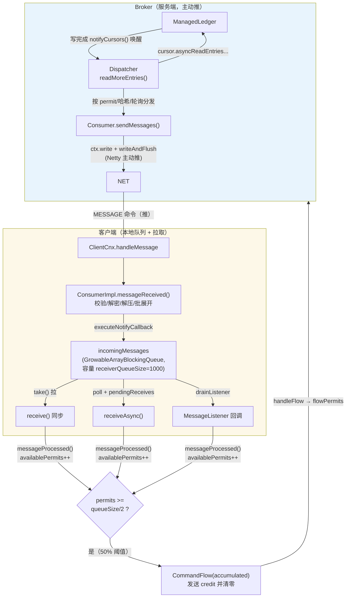
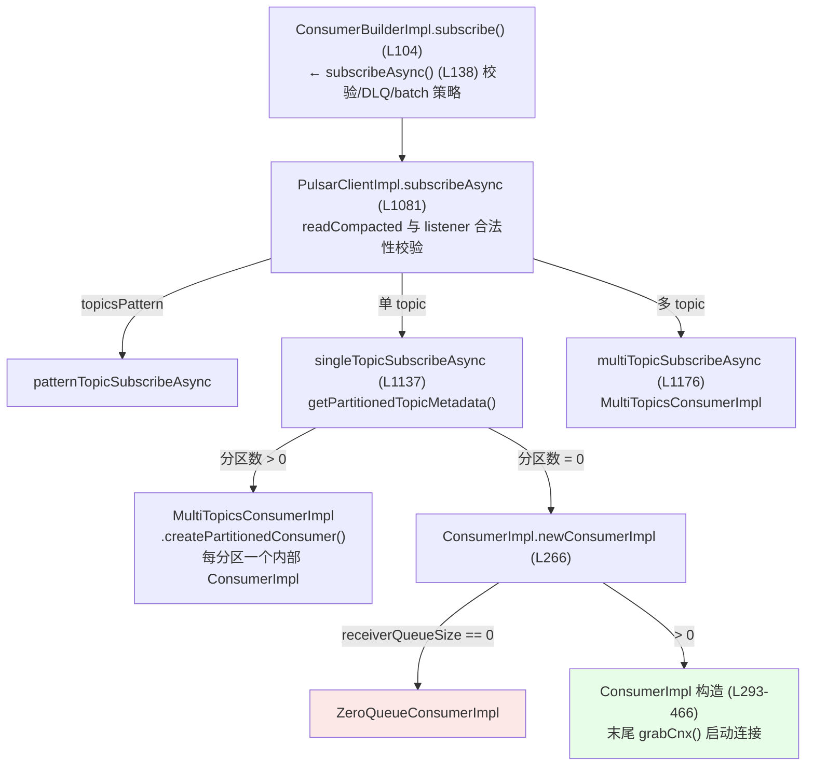
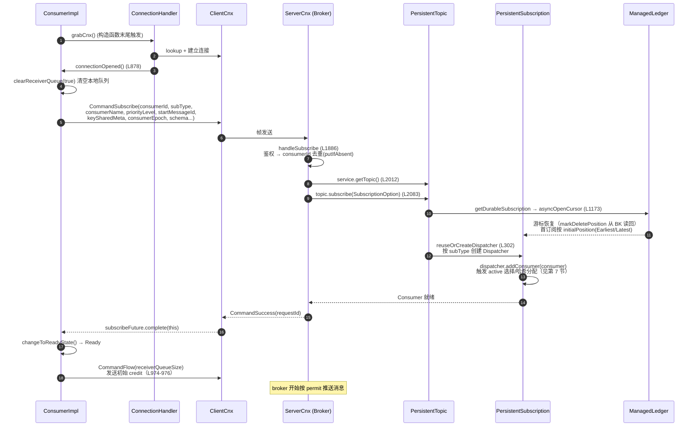
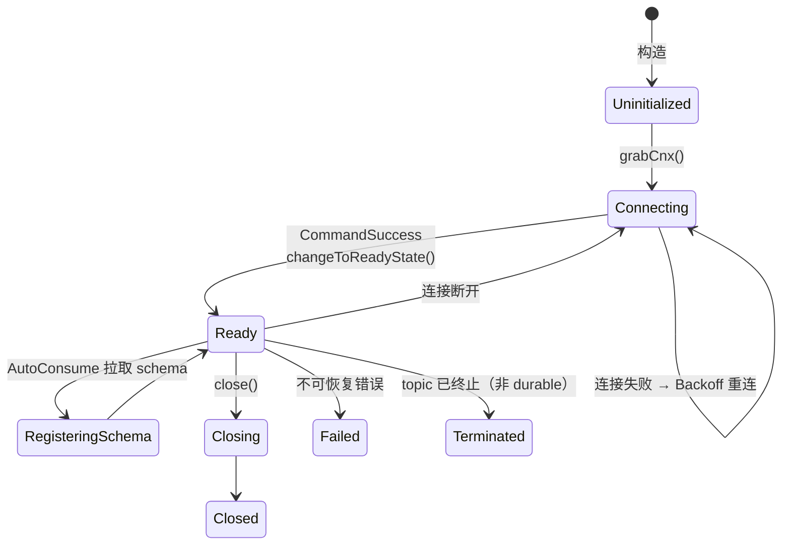
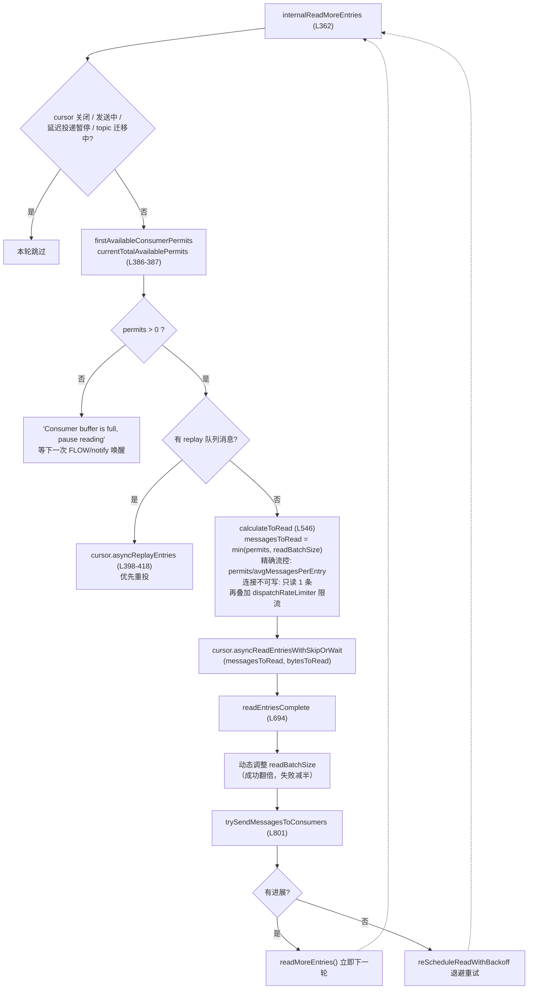
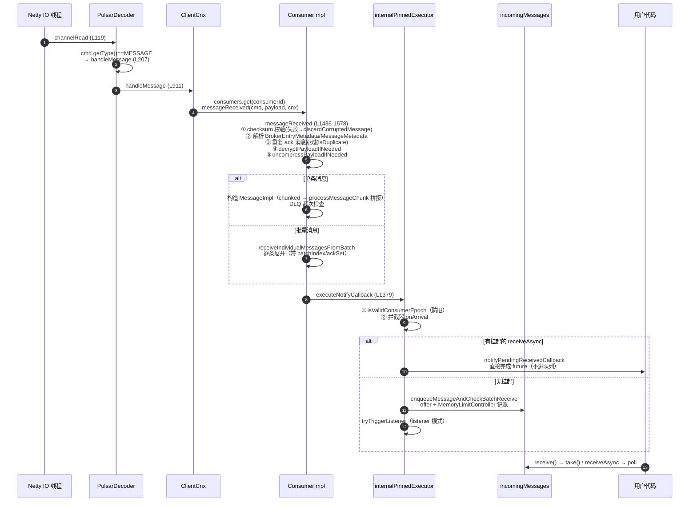
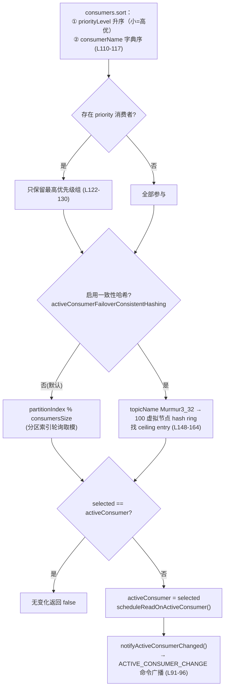
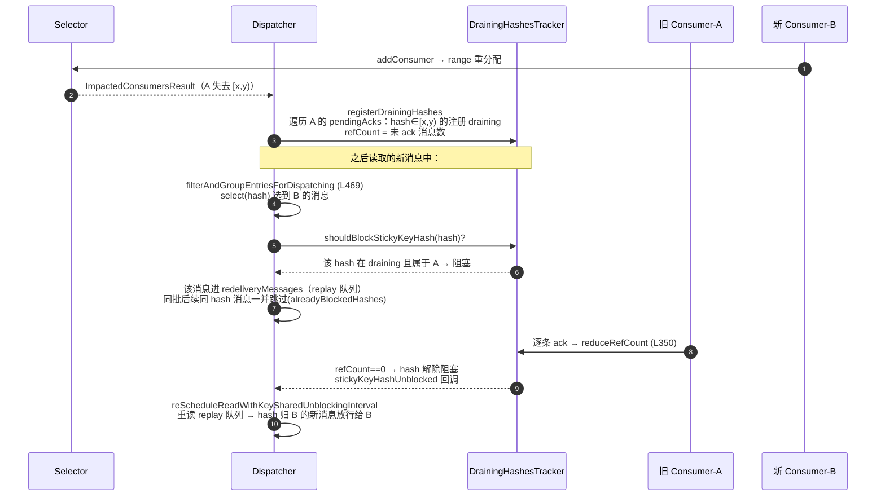
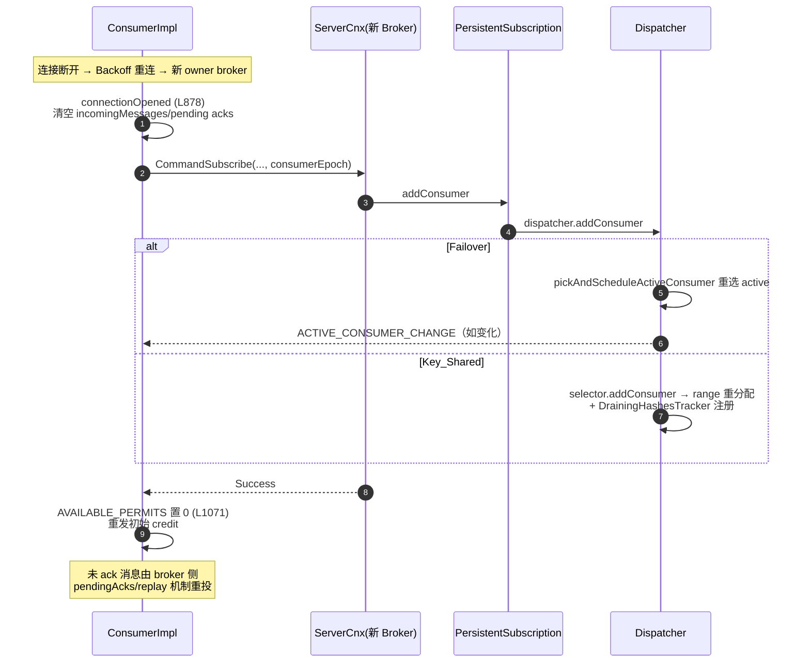

# Apache Pulsar 消费者启动与消费机制详解

> 本篇是源码分析系列第 7 篇，聚焦四个问题：**消费者如何启动**、**消费消息的完整流程**、**重平衡如何发生**、**消费到底是拉还是推**。
> 所有类名/方法/行号均经源码实际验证（master 分支，2026-09）；行号随代码演进可能偏移，以类名 + 方法名为准。

## 目录

1. [总览：一张图看懂消费模型](#1-总览一张图看懂消费模型)
2. [消费者启动流程](#2-消费者启动流程)
3. [消费消息端到端流程](#3-消费消息端到端流程)
4. [推还是拉：源码级结论](#4-推还是拉源码级结论)
5. [Permit 流控机制](#5-permit-流控机制)
6. [ZeroQueue 零队列模式](#6-zeroqueue-零队列模式)
7. [重平衡流程](#7-重平衡流程)
8. [消费进度保障：ack / 超时重投 / 负确认](#8-消费进度保障ack--超时重投--负确认)
9. [线程模型](#9-线程模型)
10. [配置速查表](#10-配置速查表)
11. [附：关键文件索引](#11-附关键文件索引)

---

## 1. 总览：一张图看懂消费模型

先给结论（第 4 节用源码逐条论证）：

**Pulsar 是"Broker 主动推 + 客户端本地队列缓冲 + credit（permit）流控"的混合模型**：

- 服务端：broker 的 Dispatcher 从 ManagedLedger 读 entry，**主动 writeAndFlush 推给消费者**（不是等消费者来 pull）；
- 客户端：消息先进 `incomingMessages` 本地队列，用户 `receive()` 从队列**拉**（`BlockingQueue.take()`）；
- 节流阀：客户端通过 `CommandFlow(messagePermits=N)` 告诉 broker"还能再收 N 条"——broker 只在有 permit 时才读才推，**推送量严格受客户端信贷控制**。



三段式角色分工：

| 层 | 动作 | 类比 |
|---|---|---|
| broker → 客户端 | **推**（MESSAGE 命令，无请求） | push |
| 客户端内部 | **拉**（从本地队列 take） | pull |
| 客户端 → broker | **credit 上报**（CommandFlow） | TCP 滑动窗口 / QUIC flow control |

---

## 2. 消费者启动流程

### 2.1 创建链路：从 Builder 到对象构造



**ConsumerImpl 构造函数**（`ConsumerImpl.java` L293-466）按序完成：

1. `super(...)` 进 ConsumerBase（L300）：consumerName 未指定则**随机生成 5 位字母数字**；
2. `client.newConsumerId()` 分配 consumerId（L302）；
3. 非持久 topic 的 Durable 订阅自动降级为 NonDurable（L315-320）；
4. `availablePermits = 0`（L334）——初始没有任何 credit；
5. `negativeAcksTracker`（L342）、`connectionHandler`（L387-393）初始化；
6. `acknowledgmentsGroupingTracker`（L397-407）：持久 topic 用 `PersistentAcknowledgmentsGroupingTracker`，非持久用 `NonPersistentAcknowledgmentGroupingTracker`；
7. DLQ/重试策略（L409-438）、metrics（L442-462）；
8. **`grabCnx()`（L463）**——构造即异步启动订阅流程。

**ConsumerBase 构造**（`ConsumerBase.java` L138-224）中决定后续行为的关键初始化：

| 成员 | 初始化 | 意义 |
|---|---|---|
| `incomingMessages` | `GrowableArrayBlockingQueue`（L159） | 客户端本地缓冲，容量 receiverQueueSize |
| `messageListenerExecutor` | Key_Shared → 按 key 分区 executor；其他 → 单线程 pinned（L161-165） | 保证同 key 消息串行进 listener |
| `pendingReceives` | `ConcurrentLinkedQueue`（L170） | 挂起的 receiveAsync future |
| `incomingQueueLock` | Failover/Exclusive → `ReentrantLock`；Shared/Key_Shared → `NoOpLock`（L207-211） | 订阅类型决定入队并发策略 |
| `unAckedMessageTracker` | ackTimeout>0 时启用（L213-221） | 超时重投追踪 |

### 2.2 订阅握手时序（客户端 → 服务端）



**CommandSubscribe 携带的关键字段**（`Commands.newSubscribe`，`Commands.java` L668-748）：topic、subscription、subType、consumerId、consumerName、priorityLevel、durable、startMessageId（仅 NonDurable 有值——Durable 由 broker 从游标决定起点）、readCompacted、initialPosition、keySharedMeta、subscriptionProperties、**consumerEpoch**（重订阅防旧，见 7.4）、schema。

### 2.3 服务端订阅处理细节（ServerCnx.handleSubscribe，L1886）

1. **鉴权**：`isTopicOperationAllowed(topic, subName, CONSUME)`（L1932-1936）；
2. **consumerId 去重**（L1941-2010）：`ConcurrentHashMap.putIfAbsent`——同连接重复订阅幂等（已成功直接再回 Success），进行中返回 ServiceNotReady；
3. **topic 加载**（L2012）：`service.getTopic(name, createTopicIfDoesNotExist)`（懒加载，见 04 篇第 2 节）；
4. **maxConsumers / 自动建订阅策略检查**（L2026-2063）；
5. `topic.subscribe(option)` → `PersistentTopic.internalSubscribe`（L941）：readCompacted 仅限 Failover/Exclusive（L953-956）、Key_Shared 开关检查、订阅级限流，然后 durable 分流到 `getDurableSubscription`（L1173）——**`ledger.asyncOpenCursor()` 打开（或恢复）游标**，首次打开按 `initialPosition` 定位，`startMessageRollbackDurationSec>0` 时回滚到指定时间点（L1210-1211）；
6. **`PersistentSubscription.addConsumer`**（L257）：dispatcher 不存在或无连接消费者时 `reuseOrCreateDispatcher`（L302-367）按 subType 建对应 Dispatcher（见下表）；存在则做**类型兼容性检查**（`AbstractSubscription.checkForConsumerCompatibilityErrorWithDispatcher` L60-96——Key_Shared 还要求 keySharedMode、entryBucketDispatch、allowOutOfOrderDelivery 全一致，否则 `SubscriptionBusyException`）；
7. 成功回 `CommandSuccess`。

**Dispatcher 按 subType 的创建矩阵**（`PersistentSubscription.reuseOrCreateDispatcher` L302-367）：

| subType | Dispatcher 实现 | 说明 |
|---|---|---|
| Exclusive | `PersistentDispatcherSingleActiveConsumer(Exclusive)` | 单消费者 |
| Failover | `PersistentDispatcherSingleActiveConsumer(Failover, partitionIndex)` | 单活多备 |
| Shared | `PersistentDispatcherMultipleConsumers`（或 Classic 变体） | 轮询分发 |
| Key_Shared | `PersistentStickyKeyDispatcherMultipleConsumers`（entryBucketDispatch=true 时为 `PersistentEntryBucketDispatcherMultipleConsumers`） | 按 key 哈希分发 |

### 2.4 消费者子类差异总表

| 子类 | 触发条件 | 特点 |
|---|---|---|
| `ConsumerImpl` | receiverQueueSize > 0 | 标准预取消费者 |
| `ZeroQueueConsumerImpl` | receiverQueueSize == 0 | 无预取、逐条收（第 6 节） |
| `MultiTopicsConsumerImpl` | 分区 topic / 多 topic | 管理多个内部 ConsumerImpl，共享 incomingMessages |
| `PatternMultiTopicsConsumerImpl` | topicsPattern | 正则匹配 topic 集合 |

> 注意：当前代码库**不存在 ConsumerV3Impl**；V5 scalable topic 的消费由 `ScalableConsumerSession` 处理（pulsar-client-v5 模块）。

### 2.5 消费者状态机（HandlerState.State，`HandlerState.java` L37-48）



---

## 3. 消费消息端到端流程

### 3.1 触发源①：新消息写入（服务端唤醒链）

Dispatcher 并非轮询，而是**事件驱动**。新消息持久化成功的瞬间：

```
OpAddEntry.completeAdd (OpAddEntry.java L322)
  → ml.notifyCursors()                    (ManagedLedgerImpl L2688)
      → waitingCursors 逐个出队
      → cursor.notifyEntriesAvailable()   (ManagedCursorImpl L3677)
          → 清除 WAITING_READ_OP 状态
          → ledger.asyncReadEntries(opReadEntry)   ← 重新发起读
              → dispatcher.readEntriesComplete()   ← 回到分发循环
```

即：**写路径主动唤醒阻塞在"无消息可读"上的游标**（`asyncReadEntriesWithSkipOrWait` 的 wait 语义），读不需要空转。

### 3.2 触发源②：客户端 credit 到达（handleFlow 链）

```
ClientCnx: CommandFlow(messagePermits=N)
  → ServerCnx.handleFlow (L2864)
  → consumer.flowPermits(N) (Consumer.java L956-985)
      → 未被 unacked 限流阻塞：累加 permit
        → subscription.consumerFlow → dispatcher.consumerFlow (L312)
          → totalAvailablePermits += N
          → readMoreEntriesAsync()
      → 已被阻塞：记入 permitsReceivedWhileConsumerBlocked（解阻后再补）
```

### 3.3 分发主循环（Shared：PersistentDispatcherMultipleConsumers）

**readMoreEntries 的并发合并状态机**（`AbstractPersistentDispatcherMultipleConsumers` L54-94，IDLE/RUNNING/RUNNING_REQUESTED 三态，避免重复发起读）+ **internalReadMoreEntries**（L362-449）：



**trySendMessagesToConsumers**（L801-921）——Shared 的核心分发算法：**优先级 + 轮询（Round-Robin）批量分发**：

```
while (entriesToDispatch > 0 && 有可用消费者) {
    c = getNextConsumer();            // ① 优先级轮询选择
    // ② 按 min(剩余消息, c 的 permits, c 的 maxUnacked 余量, roundRobinBatchSize) 截一段
    // ③ filterEntriesForConsumer：延迟消息 / 事务标记 / EntryFilter 插件过滤
    // ④ c.sendMessages(entriesForThisConsumer, ...)   ← 推给该消费者
    // ⑤ totalAvailablePermits -= 实际发出消息数
}
无可用消费者 → cursor.rewind()（回绕游标，等消费者回来重读）
发不完的 entries → addEntryToReplay 进重放队列（下次优先）
```

`getNextConsumer`（`AbstractDispatcherMultipleConsumers` L128-159）：消费者按 priorityLevel 分组，**高优先级有 permit 时完全不考虑低优先级**；同级内轮询。

### 3.4 消息写回客户端（Netty 批量推）

`Consumer.sendMessages`（`Consumer.java` L356-472）→ `PulsarCommandSenderImpl.sendMessagesToConsumer`（L235-323）：

- 逐 entry `ctx.write(Commands.newMessage(consumerId, ledgerId, entryId, ...))`（voidPromise），**最后一次 `writeAndFlush(EMPTY_BUFFER)` 统一 flush**——一批发送只一次系统调用；
- 写完成回调里才 `Entry.release()`（配合 InflightReadsLimiter 控制内存）；
- `sendMessages` 同时登记 `pendingAcks`（Shared/Key_Shared 的重投依据）并扣减 `MESSAGE_PERMITS`：`addAndGet(this, ackedCount - totalMessages)`（L445，批消息按条数扣）。

### 3.5 客户端接收流水线



### 3.6 三种消费方式

| 方式 | 路径 | 行为 |
|---|---|---|
| `receive()` 同步 | `internalReceive`（L531-545） | 队列空先 `expectMoreIncomingMessages()`，然后 `incomingMessages.take()` **阻塞**；取出后 `messageProcessed()`（permit+1） |
| `receiveAsync()` 异步 | `internalReceiveAsync`（L548-564） | internalPinnedExecutor 上 `poll()`；无消息则 future 进 `pendingReceives`，消息到达时 `notifyPendingReceivedCallback`（L1731-1780）直接完成 |
| `MessageListener` 回调 | `drainListener`（ConsumerBase L1230-1257） | 循环 `internalReceive(0ms)` 排干队列，逐条提交 `messageListenerExecutor`（Key_Shared 按 key 选线程保序）；`ListenerTaskScheduler` 三态机（IDLE/SCHEDULED/TRIGGERED_AGAIN）**合并多次触发为一次 drain**；permit 在 `callMessageListener` 中补发（用户不调 receive） |

---

## 4. 推还是拉：源码级结论

### 4.1 三段证据链

**① broker→客户端是推**：整个服务端路径没有任何"客户端请求消息"的命令——`PersistentDispatcherMultipleConsumers` 读到 entry 后**主动** `c.sendMessages(...)` → `ctx.write/writeAndFlush`（3.4）。协议里也不存在 "PULL/Fetch" 类命令（全部命令见 02 篇），唯一的客户端→broker 消费类命令是 `FLOW`（credit）与 `REDELIVER_UNACKNOWLEDGED_MESSAGES`（重投请求）。

**② 客户端内部是拉**：`receive()` = `BlockingQueue.take()`（3.6）；MessageListener 模式 = broker 推进队列 + 客户端排干（drain）。

**③ 推送速率由 credit 决定**：`internalReadMoreEntries` 的硬门槛——`currentTotalAvailablePermits > 0 && firstAvailableConsumerPermits > 0` 才读（L386-388）；每发一条消息扣一个 permit；permit 归零即停止读取与推送。这是典型的 **credit-based flow control**（同 TCP 接收窗口 / RDMA credits 思想）。

### 4.2 与 Kafka 纯拉模型的对比

| 维度 | Pulsar（推 + credit） | Kafka（拉） |
|---|---|---|
| 消息传递方向 | broker 主动 writeAndFlush | consumer 定时 poll（long-polling） |
| 客户端缓冲 | broker 侧知道队列余量（permits），不会推爆 | consumer 自己控制 fetch，broker 不知情 |
| 空转/延迟 | 无空转：写完成 notifyCursors 即时唤醒；credit 到即读 | 空轮询靠 long-poll 间隔平衡延迟与开销 |
| 慢消费者 | permit 不回补 → broker 停止读该订阅，backlog 留在 BK（不占 broker 内存） | fetch 停止 → 数据留 broker 磁盘 |
| 流控粒度 | 消息条数（MESSAGE_PERMITS）+ 字节（MemoryLimitController） | fetch.min/max.bytes |

一句话：**Pulsar 对网络是推，对用户是拉，对速率是 credit 闸门**。

---

## 5. Permit 流控机制

### 5.1 双层计数：messagePermits 与 totalAvailablePermits

| 计数 | 位置 | 单位 | 说明 |
|---|---|---|---|
| `availablePermits`（客户端） | ConsumerImpl，初始 0 | 消息条数 | 已消费未上报的条数，攒到阈值一次性上报 |
| `MESSAGE_PERMITS`（服务端 Consumer） | Consumer.java L116-118 | 消息条数 | 该消费者还能接收多少条（批消息按展开条数计） |
| `totalAvailablePermits`（Dispatcher） | L111 | 消息条数 | 所有消费者 permit 总和，决定读取量 |
| `permitsReceivedWhileConsumerBlocked` | L134-136 | 消息条数 | 消费者被 unacked 限流阻塞期间收到的 credit，解阻后补记 |

### 5.2 50% 阈值：批量上报 credit

`increaseAvailablePermits`（`ConsumerImpl.java` L1961-1973）：

```java
int available = AVAILABLE_PERMITS_UPDATER.addAndGet(this, delta);
while (available >= getCurrentReceiverQueueSize() / 2 && !paused) {
    if (AVAILABLE_PERMITS_UPDATER.compareAndSet(this, available, 0)) {
        sendFlowPermitsToBroker(currentCnx, available);   // 一次性上报并清零
        break;
    }
    ...
}
```

- 订阅成功时先发**整队列容量**的初始 credit（L974-976：`increaseAvailablePermits(cnx, getCurrentReceiverQueueSize())`）；
- 之后每消费满**半个队列**（默认 500 条）发一次 `CommandFlow`——批量上报摊薄命令开销，同时保证队列永不枯竭（还有半队列缓冲）；
- **自动扩缩队列**：`updateAutoScaleReceiverQueueHint()` 支撑 autoScaleReceiverQueueSize（按消费速率动态调队列容量）。

### 5.3 暂停与恢复

- `pause()`（L1992）：`paused=true`，停止上报 credit → broker 自然停止推送（无需断连）；
- `resume()`（L1997）：清 paused 并触发一次上报，恢复推送。

### 5.4 背压的多级联动

broker 侧还有四道闸（详见 04 篇第 4 节）：DispatchRateLimiter（calculateToRead 内限流）、连接不可写只读 1 条（L559-565，借助 Netty 高低水位）、`maxUnackedMessages` 阻塞（flowPermits 的 blocked 分支）、replay 队列 look-ahead 上限。客户端侧有 MemoryLimitController 字节级记账。

---

## 6. ZeroQueue 零队列模式

`ZeroQueueConsumerImpl`（`pulsar-client/.../impl/ZeroQueueConsumerImpl.java`）—— receiverQueueSize=0 时的特化，用于 Reader 等需要严格"消费一条、拉一条"的场景：

| 特性 | 实现 | 行号 |
|---|---|---|
| 无预取 | `minReceiverQueueSize()=0`；队列始终为空 | L58-60 |
| 不支持批量消息 | 收到批量消息直接关闭消费者 | L200-209, L230-242 |
| 同步接收 | `internalReceive` 持 zeroQueueLock → `fetchSingleMessageFromBroker` | L72-81 |
| 按需 credit | 先 `increaseAvailablePermits` 触发 FLOW（每次只放 1 条额度），再 `incomingMessages.take()` 等那条消息 | L94-137 |
| **防旧连接** | 取到消息后校验 `msgCnx == cnx()`，旧连接的迟到消息直接丢弃；末尾再清空一次队列防竞态 | L114-123 附近 |
| 异步接收 | future 未完成时补发 credit | L84-92 |
| 重连后立即拉 | `consumerIsReconnectedToBroker` 重写：有等待者/listener 时马上补 credit | L140-150 |
| listener 直呼 | `canEnqueueMessage` 返回 false 不入队，`triggerZeroQueueSizeListener` 在 externalPinnedExecutor 直接回调，处理完再补 credit | L153-193 |

零队列是唯一接近"纯拉"体验的模式：客户端每次只授 1 个 credit，broker 每次只推 1 条。

---

## 7. 重平衡流程

### 7.0 总论：Pulsar 没有中心化 Consumer Group Rebalance

**Pulsar 的"重平衡"不是协议，而是 broker 侧 per-subscription Dispatcher 的局部路由重算**。没有 Group Coordinator、没有 JoinGroup/SyncGroup、没有心跳超时驱动的全局停顿——**订阅即成员关系**（连接建立即加入，TCP 断开即退出），重平衡发生在四个场景：

1. Failover/Exclusive：active consumer 变更（服务端主导）；
2. Key_Shared：hash 范围/bucket 在消费者间重新分配（服务端主导，客户端无感知）；
3. 客户端断连/ broker 迁移：重连重订阅触发服务端消费者重建与重分配；
4. 消费者主动断开/超时：Dispatcher 移除并重选。

### 7.1 Failover：Active Consumer 选择与切换

**选择算法**（`AbstractDispatcherSingleActiveConsumer.pickAndScheduleActiveConsumer`，L107-146）：



**add/remove 的重平衡触发**：

- `internalAddConsumer`（L166-260）：Exclusive 已有消费者时做存活检查（最多 5 次重试应对 channelInactive 竞态）；加入后调 `pickAndScheduleActiveConsumer`——**active 未变则只向新加入者单发一次通知（告知现状），变了则广播**；
- `removeConsumer`（L262-284）：移除后重选；消费者清空则 `activeConsumer=null`。

**切换瞬间的消息连续性**（`PersistentDispatcherSingleActiveConsumer`）：

- `scheduleReadOnActiveConsumer`（L111-153）：**`cursor.rewind()`** 从 mark-delete 重读保证不丢；`activeConsumerFailoverDelayTimeMillis>0` 时延迟重绕，给旧 active 留 ack 时间减少重复投递；
- **stale read 防护**：`readOpEpoch`（L78-81）+ `readEntriesComplete`（L167-244）中校验"读发起时的 consumer 是否仍是当前 active"，不是则释放 entries 并 rewind 重来。

**客户端侧**：`ClientCnx.handleActiveConsumerChange`（L922-930）→ `ConsumerImpl.activeConsumerChanged`（L1271-1283）→ 在 externalPinnedExecutor 回调 `ConsumerEventListener.becameActive/becameInactive`。**注意：只有注册了 listener 的用户才感知切换；消息接收本身无感**（连接还在，dispatcher 继续推）。命令仅发往 protocolVersion ≥ v12 的客户端。

### 7.2 Key_Shared：哈希重分布（最接近"rebalance"的机制）

#### 7.2.1 哈希空间与选择器

- 哈希算法：`Murmur3_32Hash`（31 位正整数）对 65536 取模，落在 `[1,65535]`（0 为保留值 `STICKY_KEY_HASH_NOT_SET`）——`StickyKeyConsumerSelectorUtils.makeStickyKeyHash`（L29-51）；
- sticky key 取值优先级：orderingKey → key → producerName+sequenceId。

三种选择器（`StickyKeyConsumerSelector` 接口，`DEFAULT_RANGE_SIZE = 2<<15 = 65536`）：

| 实现类 | 模式 | 分配算法 |
|---|---|---|
| `HashRangeAutoSplitStickyKeyConsumerSelector` | AUTO_SPLIT（默认） | `ConcurrentSkipListMap` rangeMap（key=range 上界）；新消费者加入时**找最大 range 对半劈**（`splitRange`：`splitRange = range - ((range-lowerKey)>>1)`）；移除时其 range 由**前一个**消费者接管（ceilingEntry 语义自动生效）；上限 65536 个消费者 |
| `ConsistentHashingStickyKeyConsumerSelector` | AUTO_SPLIT + `subscriptionKeySharedUseConsistentHashing=true` | hash ring + 每消费者 N 个虚拟节点（`consumerName\0nameIndex\0ringIndex` 做 hash key，`ConsumerNameIndexTracker` 解决同名冲突，碰撞链表自动顶替）；volatile 发布 lookup 数组，`Arrays.binarySearch` O(log n) 选择 |
| `HashRangeExclusiveStickyKeyConsumerSelector` | STICKY | 用户在 `KeySharedPolicy.stickyHashRange(ranges)` 显式声明；broker 只做**冲突检测**（floor/ceiling 双向检查），冲突且对方存活则拒绝；可能留"空洞"（无人负责的 range） |

AUTO_SPLIT 拆分示例（rangeSize=65536）：

```
consumer-1 加入:  [0, 65536)          → consumer-1
consumer-2 加入:  劈最大 range        → [0, 32768)→consumer-2, [32768,65536)→consumer-1
consumer-3 加入:  劈最大 range        → [32768, 49152)→consumer-3
consumer-2 退出:  range 由前一个接管   → [0, 32768)→consumer-1（或按 lowerKey 合并）
```

#### 7.2.2 DrainingHashesTracker：哈希迁移的有序保护（核心难点）

**问题**：hash 从 consumer A 迁到 B 时，A 手里该 hash 还有未 ack 的消息。若 B 立刻开始收该 hash 的新消息，同 key 顺序即被破坏。

**解法**（`DrainingHashesTracker.java`，仅 AUTO_SPLIT + `!allowOutOfOrderDelivery` 时启用，dispatcher 构造 L80-86）：



要点：

- `shouldBlockStickyKeyHash`（L431-476）三分支：不在 draining → 不阻塞；在 draining 且属于当前 select 结果的消费者（hash 转回来了）→ 移除 entry 放行；在 draining 且属于他人 → 阻塞；
- **look-ahead 机制**：整批消息都被阻塞时 dispatcher 继续向前读，把阻塞消息收进 replay 队列，直到 look-ahead 上限（`min(perConsumerLimit×consumerCount, perSubscriptionLimit)`，L431-464），超限即暂停正常读（`isNormalReadAllowed` L765-781）——防止可用消息全被头部阻塞 hash 卡死；
- removeConsumer（dispatcher L229-234 + 父类 L243-292）：被移除消费者的**全部 pendingAcks 逐条进 replay**（带 stickyKeyHash），按新哈希分配重投——与 Failover 的整段 rewind 不同，**Key_Shared 重投是逐 position 的**。

### 7.3 消费者断连/迁移下的重订阅



**consumerEpoch 的双端作用**：

- 客户端：Failover/Exclusive 在 `redeliverUnacknowledgedMessages` 时递增（`ConsumerImpl` L2261-2263）；重订阅携带当前值；`isValidConsumerEpoch`（ConsumerBase L1426-1438）**过滤旧 epoch 连接推送来的迟到消息**；
- 服务端：`ServerCnx.handleSubscribe`（L1922）取出存入 Consumer（L2077）；`internalRedeliverUnacknowledgedMessages`（L295-326）只接受**更大的** epoch 更新，防止旧 redeliver 请求乱序触发 rewind。

### 7.4 重投：redeliverUnacknowledgedMessages

**客户端入口**（`ConsumerImpl.java` L2232-2290）：触发源 = 连接断开 / ack 超时（UnAckedMessageTracker）/ negativeAck（NegativeAcksTracker）/ 用户调用。流程：Failover/Exclusive 先 epoch++ → 清空本地队列与 tracker → 发 `CommandRedeliverUnacknowledgedMessages(consumerId, epoch)` → 补 credit。

**服务端分发**（`ServerCnx.handleRedeliverUnacknowledged` L2886-2907）：

| 订阅类型 | 处理 | 效果 |
|---|---|---|
| Shared / Key_Shared（带 messageId 列表） | `redeliverUnacknowledgedMessages(List<MessageId>)`，支持**单条**重投 | 指定消息从 pendingAcks 移入 replay 队列，重新分发 |
| Failover / Exclusive（整段） | `PersistentDispatcherSingleActiveConsumer.internalRedeliverUnacknowledgedMessages`（L295-326）：仅 active consumer 可触发，**`cursor.rewind()`** + readOpEpoch++ 丢弃在途旧读 | 从 mark-delete 整段重发（保序要求） |
| Shared / Key_Shared（整段） | `PersistentDispatcherMultipleConsumers.redeliverUnacknowledgedMessages`（L1157-1172）：该消费者全部 pendingAcks 进 replay | 逐条重投，其他消费者可接手 |

### 7.5 PIP-486 Entry-Bucket 的 bucket 重平衡

`PersistentEntryBucketDispatcherMultipleConsumers`（继承 Key_Shared dispatcher，复用 draining/replay 全套机制，但粒度是 **bucket**）：

- `EntryBucketConsumerSelector`（L109-135）：bucket 边界随 segment 固定不可变；消费者按 `(consumerName, consumerId)` 排序后，第 j 个消费者拿 `[j·N/k, (j+1)·N/k)` 的 bucket 区间——**成员变化只移动最少的完整 bucket**；`canonicalHashOfBucket`（L93-95）把 bucket 起始哈希作为规范哈希（bucket 0 用 1），整个 DrainingHashesTracker 无需修改即按 bucket 生效；
- `getStickyKeyHash`（L133-149）：entry 带 `entry_hash_min`（producer 盖章）→ 整 entry 按 bucket 规范哈希路由；未盖章的单条消息 → key 哈希规范化到 bucket；
- `validateBucketBoundaries`（L78-105）：所有消费者声明的边界必须完全一致，否则 `ConsumerAssignException`。

### 7.6 与 Kafka Consumer Group Rebalance 的本质区别

| 维度 | Pulsar | Kafka |
|---|---|---|
| 协调者 | **无**。per-topic-per-subscription 的 dispatcher 在各 broker 独立管理 | Group Coordinator 集中管理整个 group |
| 协议 | 无 join/sync；`CommandSubscribe` 即加入 | JoinGroup / SyncGroup / Heartbeat 客户端参与协商 |
| 触发粒度 | 单个订阅的消费者集合变化，**不影响其他订阅** | 整个 group 全部 stop-the-world（eager 模式） |
| 分配计算 | broker 侧（Failover 排序取模 / Key_Shared 哈希） | 客户端 leader consumer 计算（Assignor 策略） |
| 客户端感知 | Key_Shared 完全无感知；Failover 仅 listener 可感知 | 全体 consumer 感知并参与 |
| 顺序保护 | DrainingHashesTracker 阻塞迁移中的 hash | revoke-then-assign / incremental cooperative |
| offset | 游标（ManagedCursor）broker 侧持久化 | __consumer_offsets，客户端提交 |

**一句话**：Pulsar 的重平衡是 broker 内一个订阅对象上的**局部路由重算**，毫秒级、无全局停顿；Kafka 是一个**分布式协商协议**，代价是 rebalance 期间整组停止消费。

---

## 8. 消费进度保障：ack / 超时重投 / 负确认

（背景机制，与重平衡配合构成完整消费语义）

| 机制 | 类 | 数据结构 | 行为 |
|---|---|---|---|
| ack 分组 | `PersistentAcknowledgmentsGroupingTracker` | pendingIndividualAcks（SkipListSet）+ lastCumulativeAck | 默认 **100ms / 1000 条**触发 flush（时间或条数先到先发）；断连时强制 flush；`isDuplicate` 过滤重连后已 ack 的重复消息 |
| ack 超时重投 | `UnAckedMessageTracker` | 时间轮 + messagePartitions | 消息 add 时入当前时间片；每 tick 轮转；超时片的消息批量 `redeliverUnacknowledgedMessages`；tick≥100ms、ackTimeout≥1000ms |
| 负确认 | `NegativeAcksTracker` | `Long2ObjectAVLTreeMap<timestamp, ledger→RoaringBitmap>` | nack 按目标时刻入树；**MIN_NACK_DELAY_MS=100ms** 合并；定时触发重投；支持 `negativeAckRedeliveryBackoff` 退避与低位精度裁剪 |
| 服务端游标推进 | `PersistentSubscription` ack 回调（L543-605） | — | `cursor.asyncMarkDelete` → `afterAckMessages` → 清理 replay/pendingAcks；cursor 持久化暂停→恢复时 `readMoreEntriesAsync` 续读 |
| unacked 限流 | Consumer `blockedConsumerOnUnackedMsgs` | — | unacked ≥ maxUnackedMessages 时 flowPermits 走 blocked 分支缓存 credit，解阻后补记并续读 |

---

## 9. 线程模型

| 线程/Executor | 角色 | 关键路径 |
|---|---|---|
| Netty IO 线程 | 网络/解码 | `PulsarDecoder.channelRead` → `ClientCnx.handleMessage` |
| **internalPinnedExecutor**（单线程） | 消费者内部状态串行化 | `executeNotifyCallback`（epoch 校验/入队）、`internalReceiveAsync` 的 poll+pending、listener 触发调度——**队列与 pendingReceives 的线程安全靠它单线程化** |
| **externalPinnedExecutor** | 用户回调 | MessageListener.received、ConsumerEventListener（避免用户代码阻塞内部线程） |
| messageListenerExecutor | listener 执行 | Key_Shared 按 key 选线程（保序），其他单线程 |
| `client.timer()`（HashedWheelTimer） | 定时 | 重连退避、ack 超时 tick、nack 触发、batchReceive 超时 |

服务端：dispatcher 逻辑固定跑在 topic 的 `topicOrderedExecutor` 线程（见 01 篇第 9 节），同一 topic 的分发天然串行。

---

## 10. 配置速查表

| 配置键 | 默认值 | 作用 |
|---|---|---|
| `receiverQueueSize` | 1000 | 客户端预取队列容量（=初始 credit；0 即 ZeroQueue） |
| `autoScaledReceiverQueueSize` | false | 按消费速率自动调队列（ZeroQueue 不支持） |
| `acknowledgementGroupTimeMicros` | 100000（100ms） | ack 分组 flush 周期 |
| `maxAckGroupSize` | 1000 | ack 分组条数阈值 |
| `ackTimeoutMillis` | 0（关） | 开启未 ack 超时重投（≥1000ms） |
| `negativeAckRedeliveryDelayMicros` | 60000000（60s） | nack 默认重投延迟 |
| `subscriptionInitialPosition` | Latest | 新订阅起点（Earliest/Latest） |
| `priorityLevel` | 0 | Failover/Shared 的优先级（小=高） |
| `maxUnackedMessagesPerConsumer` | 50000 | 服务端单消费者 unacked 限流阈值 |
| `readBatchSize`（dispatcher） | 动态起始值 | 单轮读 entry 数（成功翻倍/失败减半自适应） |
| `dispatcherMaxReadSizeBytes` | 5MB | 单轮读字节上限 |
| `dispatcherMaxRoundRobinBatchSize` | 1000 | Shared 轮询单消费者单轮最大消息数 |
| `activeConsumerFailoverDelayTimeMillis` | 0 | Failover 切换延迟（减少重复投递） |
| `activeConsumerFailoverConsistentHashing` | false | Failover 用一致性哈希选 active |
| `subscriptionKeySharedUseConsistentHashing` | false | Key_Shared 用一致性哈希选择器 |
| `subscriptionKeySharedConsistentHashingReplicaPoints` | — | 虚拟节点数 |
| `keySharedAllowOutOfOrderDelivery` | false | 允许乱序（关闭 draining 保护） |

---

## 11. 附：关键文件索引

### 客户端
| 文件 | 要点 |
|---|---|
| `pulsar-client/src/main/java/org/apache/pulsar/client/impl/ConsumerBuilderImpl.java` | subscribe 入口与校验（L104/L138） |
| `pulsar-client/src/main/java/org/apache/pulsar/client/impl/PulsarClientImpl.java` | subscribeAsync 分发（L1081/L1137/L1176） |
| `pulsar-client/src/main/java/org/apache/pulsar/client/impl/ConsumerImpl.java` | 构造（L293）、connectionOpened（L878）、messageReceived（L1436）、executeNotifyCallback（L1379）、increaseAvailablePermits（L1961）、redeliverUnacknowledgedMessages（L2232）、activeConsumerChanged（L1271） |
| `pulsar-client/src/main/java/org/apache/pulsar/client/impl/ConsumerBase.java` | 队列/锁/listener executor 初始化（L138-224）、drainListener（L1230）、enqueueMessageAndCheckBatchReceive（L1001） |
| `pulsar-client/src/main/java/org/apache/pulsar/client/impl/ZeroQueueConsumerImpl.java` | 零队列全套特化（L58-193） |
| `pulsar-client/src/main/java/org/apache/pulsar/client/impl/ClientCnx.java` | handleMessage（L911）、handleActiveConsumerChange（L922） |
| `pulsar-client/src/main/java/org/apache/pulsar/client/impl/UnAckedMessageTracker.java` | 时间轮超时重投 |
| `pulsar-client/src/main/java/org/apache/pulsar/client/impl/NegativeAcksTracker.java` | nack 树与退避 |
| `pulsar-client/src/main/java/org/apache/pulsar/client/impl/PersistentAcknowledgmentsGroupingTracker.java` | ack 分组 |
| `pulsar-client/src/main/java/org/apache/pulsar/client/impl/ListenerTaskScheduler.java` | listener 触发合并 |
| `pulsar-client/src/main/java/org/apache/pulsar/client/impl/HandlerState.java` | 消费者状态机（L37-48） |
| `pulsar-common/src/main/java/org/apache/pulsar/common/protocol/PulsarDecoder.java` | 命令解码分发（L119/L207） |

### 服务端
| 文件 | 要点 |
|---|---|
| `pulsar-broker/src/main/java/org/apache/pulsar/broker/service/ServerCnx.java` | handleSubscribe（L1886）、handleFlow（L2864）、handleRedeliverUnacknowledged（L2886） |
| `pulsar-broker/src/main/java/org/apache/pulsar/broker/service/persistent/PersistentTopic.java` | internalSubscribe（L941）、getDurableSubscription/asyncOpenCursor（L1173） |
| `pulsar-broker/src/main/java/org/apache/pulsar/broker/service/persistent/PersistentSubscription.java` | addConsumerInternal（L257）、reuseOrCreateDispatcher（L302）、ack 回调（L543） |
| `pulsar-broker/src/main/java/org/apache/pulsar/broker/service/Consumer.java` | 双层 permit 字段（L116-136）、flowPermits（L956）、sendMessages（L356）、notifyActiveConsumerChange（L323） |
| `pulsar-broker/src/main/java/org/apache/pulsar/broker/service/persistent/PersistentDispatcherMultipleConsumers.java` | internalReadMoreEntries（L362）、calculateToRead（L546）、readEntriesComplete（L694）、trySendMessagesToConsumers（L801）、redeliver（L1157） |
| `pulsar-broker/src/main/java/org/apache/pulsar/broker/service/persistent/AbstractPersistentDispatcherMultipleConsumers.java` | 读状态机（L54-94） |
| `pulsar-broker/src/main/java/org/apache/pulsar/broker/service/AbstractDispatcherMultipleConsumers.java` | getNextConsumer 优先级轮询（L128-159） |
| `pulsar-broker/src/main/java/org/apache/pulsar/broker/service/AbstractDispatcherSingleActiveConsumer.java` | pickAndScheduleActiveConsumer（L107）、add/remove（L166/L262） |
| `pulsar-broker/src/main/java/org/apache/pulsar/broker/service/persistent/PersistentDispatcherSingleActiveConsumer.java` | readMoreEntries（L335）、rewind/readOpEpoch（L78-81/L111-153/L167-244）、internalRedeliver（L295） |
| `pulsar-broker/src/main/java/org/apache/pulsar/broker/service/StickyKeyConsumerSelector.java` | 接口与常量（65536 range） |
| `pulsar-broker/src/main/java/org/apache/pulsar/broker/service/HashRangeAutoSplitStickyKeyConsumerSelector.java` | 对半劈分配（splitRange L92-111） |
| `pulsar-broker/src/main/java/org/apache/pulsar/broker/service/ConsistentHashingStickyKeyConsumerSelector.java` | 一致性哈希环 |
| `pulsar-broker/src/main/java/org/apache/pulsar/broker/service/HashRangeExclusiveStickyKeyConsumerSelector.java` | STICKY 显式 range 与冲突检测 |
| `pulsar-broker/src/main/java/org/apache/pulsar/broker/service/persistent/PersistentStickyKeyDispatcherMultipleConsumers.java` | add/remove（L146/L229）、filterAndGroupEntriesForDispatching（L469）、look-ahead（L431-464） |
| `pulsar-broker/src/main/java/org/apache/pulsar/broker/service/DrainingHashesTracker.java` | addEntry（L261）、reduceRefCount（L350）、shouldBlock（L431） |
| `pulsar-broker/src/main/java/org/apache/pulsar/broker/service/EntryBucketConsumerSelector.java` | bucket 均分与 canonical hash（L93-135） |
| `pulsar-broker/src/main/java/org/apache/pulsar/broker/service/persistent/PersistentEntryBucketDispatcherMultipleConsumers.java` | bucket 路由与边界校验（L78-149） |
| `pulsar-broker/src/main/java/org/apache/pulsar/broker/service/PulsarCommandSenderImpl.java` | 批量 write + 单次 flush（L235-323）、ACTIVE_CONSUMER_CHANGE（L206） |
| `managed-ledger/src/main/java/org/apache/bookkeeper/mledger/impl/OpAddEntry.java` | completeAdd → notifyCursors（L322） |
| `managed-ledger/src/main/java/org/apache/bookkeeper/mledger/impl/ManagedLedgerImpl.java` | notifyCursors（L2688） |
| `managed-ledger/src/main/java/org/apache/bookkeeper/mledger/impl/ManagedCursorImpl.java` | notifyEntriesAvailable（L3677）、asyncReadEntriesWithSkipOrWait |

---

> **阅读建议**：结合 02 篇（MESSAGE/FLOW 命令帧格式）、04 篇第 3 节（Dispatcher 类体系与发布→分发链路）、05 篇第 6 节（游标 mark-delete 与重放）交叉阅读。本篇第 3 节（端到端流程）与第 7 节（重平衡）是消费侧排障（消息不消费/重复消费/Key_Shared 卡住）时的核心 checklist。
