# Redis 7.4.0 底层实现原理深度解析

> 本文档基于 Redis 7.4.0 源码（src/ 目录约 350 个 C 文件，约 30 万行代码）深度剖析，覆盖整体架构、各模块作用、底层数据结构、命令处理流程、Server 启动流程、读写数据流程、数据持久化、事务、Lua 脚本、主从复制、哨兵、集群、发布订阅、Stream、过期淘汰、辅助模块等。所有关键函数均标注 `文件名:行号`，便于对照源码。
>
> 源码根目录：`src/`，约 350 个 C 文件。核心源码文件包括：`server.c`（核心）、`networking.c`（网络）、`ae.c`（事件循环）、`dict.c`（哈希表）、`t_*.c`（对象类型）、`cluster*.c`（集群）、`replication.c`（主从）、`sentinel.c`（哨兵）、`rdb.c/aof.c`（持久化）、`pubsub.c`（发布订阅）、`t_stream.c`（流）等。

---

## 目录

- [一、整体架构概览](#一整体架构概览)
- [二、底层核心数据结构](#二底层核心数据结构)
- [三、Server 启动流程与事件循环](#三server-启动流程与事件循环)
- [四、命令处理流程与网络层](#四命令处理流程与网络层)
- [五、数据持久化机制](#五数据持久化机制)
- [六、事务与 Lua 脚本](#六事务与-lua-脚本)
- [七、主从复制](#七主从复制)
- [八、哨兵 Sentinel](#八哨兵-sentinel)
- [九、集群 Cluster](#九集群-cluster)
- [十、发布订阅与 Stream](#十发布订阅与-stream)
- [十一、五种对象类型与过期淘汰](#十一五种对象类型与过期淘汰)
- [十二、辅助模块](#十二辅助模块)
- [十三、补充：其他底层实现要点](#十三补充其他底层实现要点)
- [十四、底层设计哲学与性能优化总结](#十四底层设计哲学与性能优化总结)

---

## 一、整体架构概览

### 1.1 项目背景

Redis（REmote DIctionary Server）是 Salvatore Sanfilippo（antirez）开发的内存键值数据库，采用 BSD 协议开源。Redis 7.4.0 是 7.x 系列的稳定版本，引入了 Hash Field Expiration（哈希字段过期）、ebuckets 主动过期结构、RESP3 增强、多线程 I/O、Function 引擎、Sharded Pub/Sub 等大量新特性。

| 项 | 说明 |
| --- | --- |
| 版本 | 7.4.0 |
| 主要语言 | C99 |
| 协议 | RESP2 / RESP3 |
| 单机 QPS（典型） | 10w+ |
| 数据结构 | String / List / Hash / Set / ZSet / Stream / Bitmap / HyperLogLog / Geo |
| 持久化 | RDB + AOF（multi-part） |
| 高可用 | 主从复制、Sentinel、Cluster |
| 线程模型 | 单线程命令执行 + 异步后台线程 + 多线程 I/O（可选） |

### 1.2 源码模块全景图

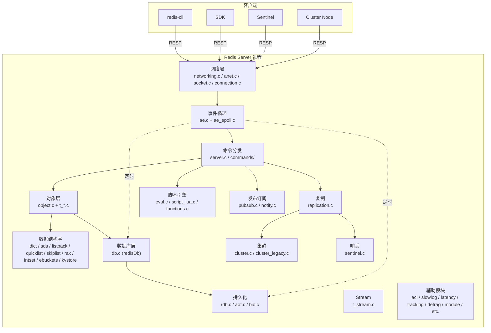

### 1.3 核心抽象层

| 抽象 | 文件 | 作用 |
| --- | --- | --- |
| `aeEventLoop` | ae.c | 事件循环，封装 epoll/kqueue/select/evport |
| `connection` | connection.c | 连接抽象，支持 TCP/Unix/TLS |
| `client` | server.h | 客户端对象，承载命令、缓冲、状态 |
| `redisDb` | server.h | 数据库，含 keys/expires/blocking_keys/watched_keys |
| `redisObject` (robj) | server.h | 值对象，type+encoding+refcount+lru |
| `dict` | dict.c | 通用哈希表，支持增量 rehash |
| `kvstore` | kvstore.c | 多 dict 分片的 kvstore，降低 rehash 阻塞 |
| `ebuckets` | ebuckets.c | 过期桶，主动过期扫描 |
| `rio` | rio.c | IO 抽象（文件/socket/buffer/fd） |
| `streamCG` | t_stream.c | Stream 消费者组 |
| `clusterState` | cluster.h | 集群全局视图 |

### 1.4 整体数据流（一次命令的旅程）

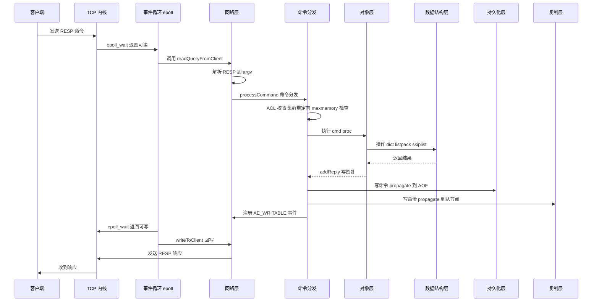

### 1.5 模块源码索引

| 模块 | 核心源文件 | 行数（约） |
| --- | --- | --- |
| 服务器核心 | server.c / server.h | 14000+ / 2700+ |
| 网络 | networking.c, anet.c, socket.c, connection.c, tls.c, unix.c | 8000+ |
| 事件循环 | ae.c, ae_epoll.c, ae_kqueue.c, ae_select.c, ae_evport.c | 1500+ |
| 数据结构 | dict.c, adlist.c, sds.c, ziplist.c, listpack.c, quicklist.c, intset.c, rax.c, ebuckets.c, kvstore.c | 18000+ |
| 五种对象 | t_string.c, t_list.c, t_hash.c, t_set.c, t_zset.c | 16000+ |
| Stream | t_stream.c, stream.h | 4000+ |
| 数据库 | db.c, expire.c, evict.c, lazyfree.c, defrag.c | 8000+ |
| 持久化 | rdb.c, aof.c, bio.c, rio.c, childinfo.c | 9000+ |
| 复制 | replication.c | 4000+ |
| 集群 | cluster.c, cluster_legacy.c | 12000+ |
| 哨兵 | sentinel.c | 5000+ |
| 脚本 | eval.c, script.c, script_lua.c, function_lua.c, functions.c | 8000+ |
| 事务 | multi.c | 600+ |
| 发布订阅 | pubsub.c, notify.c, tracking.c | 3000+ |
| ACL | acl.c | 2500+ |
| 模块 | module.c | 12000+ |
| 其他 | slowlog.c, latency.c, debug.c, geo.c, hyperloglog.c, bitops.c, sort.c | 15000+ |

---


---

## 二、底层核心数据结构

## Redis 7.4.0 核心数据结构底层实现深度分析

> 源码路径: `D:/workspace/java_projects/source_projects/redis-7.4.0/src/`
> 分析版本: Redis 7.4.0

---

#### 目录

1. [SDS (Simple Dynamic String)](#1-sds-simple-dynamic-string)
2. [dict (哈希表)](#2-dict-哈希表)
3. [adlist (双端链表)](#3-adlist-双端链表)
4. [ziplist (压缩列表)](#4-ziplist-压缩列表)
5. [quicklist (快速列表)](#5-quicklist-快速列表)
6. [listpack](#6-listpack)
7. [intset (整数集合)](#7-intset-整数集合)
8. [skiplist (跳跃表)](#8-skiplist-跳跃表)
9. [rax (基数树 / Radix Tree)](#9-rax-基数树--radix-tree)
10. [ebuckets (过期桶)](#10-ebuckets-过期桶)
11. [kvstore (多 dict 分片)](#11-kvstore-多-dict-分片)
12. [redisObject](#12-redisobject)

---

#### 1. SDS (Simple Dynamic String)

###### 1.1 结构定义

源码: `sds.h:24-51`, `sds.c:81-144`

SDS 是 Redis 最基础的字符串实现，采用"按需选择头部大小"的策略，根据字符串长度自动选择最节省内存的头部类型。

```c
// sds.h:24-27  -- 仅用于短字符串(<=31字节)，不记录alloc，无法预分配
struct __attribute__ ((__packed__)) sdshdr5 {
    unsigned char flags; /* 3 lsb of type, 5 msb of string length */
    char buf[];
};

// sds.h:28-33  -- 小字符串(<=255字节)
struct __attribute__ ((__packed__)) sdshdr8 {
    uint8_t len;        /* 已使用长度 */
    uint8_t alloc;      /* 分配总长度(不含头部和null终止符) */
    unsigned char flags; /* 低3位存类型 */
    char buf[];
};

// sds.h:34-39  -- 中等字符串(<=65535字节)
struct __attribute__ ((__packed__)) sdshdr16 {
    uint16_t len;
    uint16_t alloc;
    unsigned char flags;
    char buf[];
};

// sds.h:40-45  -- 大字符串(<=4GB)
struct __attribute__ ((__packed__)) sdshdr32 {
    uint32_t len;
    uint32_t alloc;
    unsigned char flags;
    char buf[];
};

// sds.h:46-51  -- 超大字符串(<=16EB)
struct __attribute__ ((__packed__)) sdshdr64 {
    uint64_t len;
    uint64_t alloc;
    unsigned char flags;
    char buf[];
};
```

###### 1.2 字段含义

| 字段 | 含义 |
|------|------|
| `len` | 字符串实际使用长度（不含`\0`） |
| `alloc` | 分配的总缓冲区大小（不含头部和`\0`） |
| `flags` | 低3位存储SDS类型(5/8/16/32/64)，高5位未用(sdshdr5中存长度) |
| `buf[]` | 实际数据缓冲区，柔性数组 |

`__attribute__((__packed__))` 确保结构体无内存对齐填充，最大限度节省内存。

###### 1.3 类图

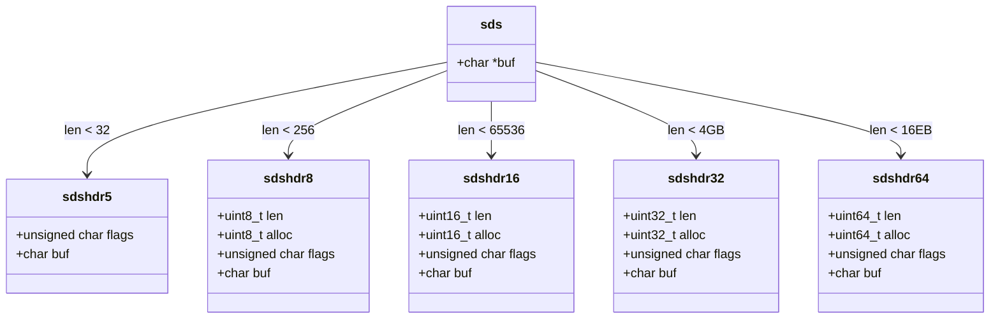

###### 1.4 核心算法

######## 类型选择 -- `sds.c:38-52`

```c
static inline char sdsReqType(size_t string_size) {
    if (string_size < 1<<5)  return SDS_TYPE_5;
    if (string_size < 1<<8)  return SDS_TYPE_8;
    if (string_size < 1<<16) return SDS_TYPE_16;
    if (string_size < 1ll<<32) return SDS_TYPE_32;
    return SDS_TYPE_64;
}
```

创建时（`sds.c:81-144` `_sdsnewlen`），空字符串默认使用 `SDS_TYPE_8` 而非 `SDS_TYPE_5`，因为 type 5 不记录 alloc，无法支持空间预分配，每次 append 都需要 realloc。

######## 空间预分配 -- `sds.c:217-268` `_sdsMakeRoomFor`

```
扩容策略:
1. 若 avail >= addlen，直接返回，无需扩容
2. greedy=1（默认）:
   - newlen < SDS_MAX_PREALLOC(1MB): newlen *= 2  (翻倍)
   - newlen >= SDS_MAX_PREALLOC:     newlen += SDS_MAX_PREALLOC  (加1MB)
3. greedy=0: newlen = len + addlen (精确分配)
4. 若新类型与旧类型不同，需要 malloc + memcpy（头部大小变了）
5. 若类型相同，使用 realloc
```

`SDS_MAX_PREALLOC` 定义于 `sds.h:13`，值为 `1024*1024`（1MB）。

######## 惰性释放 -- `sds.c:287-289`

```c
sds sdsRemoveFreeSpace(sds s, int would_regrow) {
    return sdsResize(s, sdslen(s), would_regrow);
}
```

`sdsclear()` (`sds.c:200-203`) 将 len 设为 0 但不释放内存，保留缓冲区供后续 append 使用。

###### 1.5 时间复杂度

| 操作 | 函数 | 复杂度 |
|------|------|--------|
| 创建 | `sdsnewlen` | O(n) |
| 获取长度 | `sdslen` | O(1) |
| 追加（空间足够时） | `sdscatlen` | O(n) |
| 追加（需要扩容时） | `sdscatlen` | O(n) + realloc |
| 比较 | `sdscmp` | O(n) |
| 截取 | `sdsrange` | O(n) |

###### 1.6 应用场景

- 所有 Redis 键（key）的底层存储
- 字符串对象（OBJ_STRING）的底层实现
- AOF 缓冲区
- 客户端输入/输出缓冲区
- Hash 类型 field/value 的存储

---

#### 2. dict (哈希表)

###### 2.1 结构定义

源码: `dict.h:96-111`, `dict.c:45-54`

```c
// dict.c:45-54
struct dictEntry {
    void *key;
    union {
        void *val;
        uint64_t u64;
        int64_t s64;
        double d;
    } v;
    struct dictEntry *next;     /* 同一哈希桶中的下一个条目 */
};

// dict.h:96-111
struct dict {
    dictType *type;
    dictEntry **ht_table[2];    /* 两张哈希表 */
    unsigned long ht_used[2];   /* 两张表各自的已用条目数 */
    long rehashidx;             /* rehash进度，-1表示未在进行 */
    unsigned pauserehash : 15;  /* 暂停rehash的计数器 */
    unsigned useStoredKeyApi : 1;
    signed char ht_size_exp[2]; /* 桶数的指数 (size = 1<<exp) */
    int16_t pauseAutoResize;    /* 暂停自动扩缩容 */
    void *metadata[];
};
```

###### 2.2 字段含义

| 字段 | 含义 |
|------|------|
| `type` | dictType 指针，包含哈希函数、键值比较、析构等回调 |
| `ht_table[2]` | 两个哈希表数组，ht_table[0] 为主表，ht_table[1] 为 rehash 目标表 |
| `ht_used[2]` | 各表中已使用的 entry 数量 |
| `rehashidx` | rehash 当前迁移到的桶索引，-1 表示未在 rehash |
| `pauserehash` | >0 时暂停 rehash，支持嵌套暂停 |
| `ht_size_exp[2]` | 桶数 = 1 << ht_size_exp[i]，初始为 -1 (0桶) |
| `pauseAutoResize` | >0 时禁止自动扩缩容 |

###### 2.3 dictType -- `dict.h:32-91`

```c
typedef struct dictType {
    uint64_t (*hashFunction)(const void *key);
    void *(*keyDup)(dict *d, const void *key);
    void *(*valDup)(dict *d, const void *obj);
    int (*keyCompare)(dict *d, const void *key1, const void *key2);
    void (*keyDestructor)(dict *d, void *key);
    void (*valDestructor)(dict *d, void *obj);
    int (*resizeAllowed)(size_t moreMem, double usedRatio);
    void (*rehashingStarted)(dict *d);
    void (*rehashingCompleted)(dict *d);
    size_t (*dictMetadataBytes)(dict *d);
    void *userdata;
    unsigned int no_value:1;     /* 无值模式（集合） */
    unsigned int keys_are_odd:1; /* 键地址为奇数，优化存储 */
    uint64_t (*storedHashFunction)(const void *key);
    int (*storedKeyCompare)(dict *d, const void *key1, const void *key2);
    void (*onDictRelease)(dict *d);
} dictType;
```

###### 2.4 类图

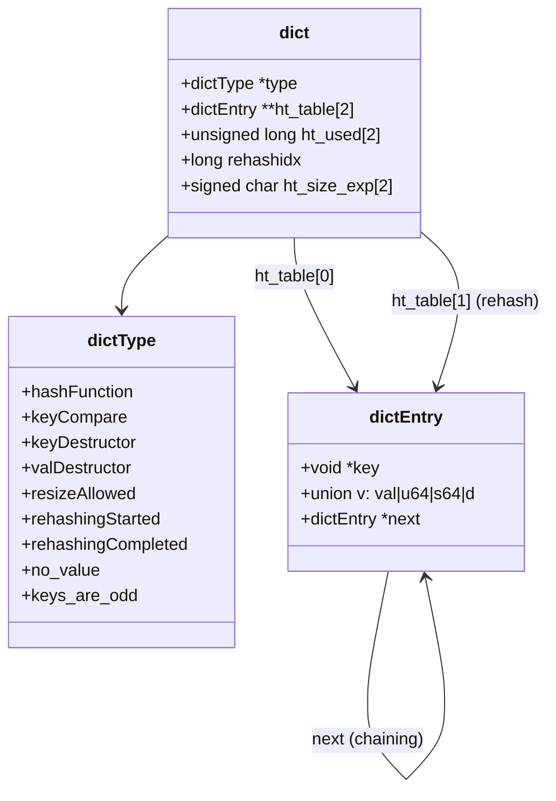

###### 2.5 增量 rehash 机制

######## rehash 触发条件 -- `dict.c:1492-1516`

**扩容 (`dictExpandIfNeeded`):**
- 哈希表为空时：扩容到初始大小 `DICT_HT_INITIAL_SIZE` (4)
- 负载因子 >= 1 且允许 resize：扩容到 `used + 1`
- 负载因子 >= `dict_force_resize_ratio`(4) 且 resize 被 avoid：强制扩容

**缩容 (`dictShrinkIfNeeded`):** `dict.c:1529-1549`
- 桶数 > 初始大小 且 负载因子 < 1/8 (12.5%)
- 或在 AVOID 模式下 负载因子 < 1/32

######## rehash 执行 -- `dict.c:385-414` `dictRehash`

```
增量 rehash 过程:
1. 每次处理 n 个桶 (n 通常为 1 或 100)
2. 跳过空桶，最多访问 n*10 个空桶
3. 对每个非空桶，将所有 entry 从 ht_table[0] 迁移到 ht_table[1]
4. rehashidx 递增
5. ht_table[0] 的 used 递减，ht_table[1] 的 used 递增
6. 迁移完成后释放 ht_table[0]，将 ht_table[1] 变为 ht_table[0]
```

######## 触发时机

- **每次增删查改时**: `_dictRehashStep` (`dict.c:448-450`) 每次操作迁移 1 个桶
- **定时任务**: `dictRehashMicroseconds` (`dict.c:426-438`) 限时 rehash，默认 1ms
- **kvstore 层**: `kvstoreIncrementallyRehash` 管理多个 dict 的 rehash 调度

######## resize 策略 -- `dict.c:41-42`

```c
static dictResizeEnable dict_can_resize = DICT_RESIZE_ENABLE;
static unsigned int dict_force_resize_ratio = 4;
```

| 模式 | 扩容条件 | 缩容条件 |
|------|----------|----------|
| `DICT_RESIZE_ENABLE` | 负载因子 >= 1 | 负载因子 < 1/8 |
| `DICT_RESIZE_AVOID` | 负载因子 >= 4 | 负载因子 < 1/32 |
| `DICT_RESIZE_FORBID` | 禁止 | 禁止 |

子进程 (RDB/AOF) 期间设为 `AVOID`，避免 COW 引起大量内存复制。

###### 2.6 哈希冲突处理

采用链表法（chaining）。`dictEntry.next` 指向同一桶中的下一个条目。新条目插入到桶头部（O(1)）。

######## dictEntry 指针位运算优化 -- `dict.c:116-171`

利用指针低位 bit 区分 entry 类型：
- LSB=1: 指针本身就是 key（无需分配 dictEntry）
- 低3位=`010`: 无值 entry（dictEntryNoValue）
- 低3位=`000`: 普通 entry

###### 2.7 时间复杂度

| 操作 | 平均 | 最坏(大量冲突) |
|------|------|----------------|
| 查找 | O(1) | O(n) |
| 插入 | O(1) | O(n) |
| 删除 | O(1) | O(n) |
| 扩容(rehash单步) | O(1) | - |
| 扩容(全量rehash) | O(n) | - |

###### 2.8 应用场景

- Redis 数据库 db.dict / db.expires 的底层实现 (通过 kvstore)
- Hash 类型对象的底层实现
- Set 类型对象的底层实现（当元素为非整数或数量超过阈值时）
- Sorted Set 的 dict 部分（element -> score 映射）

---

#### 3. adlist (双端链表)

###### 3.1 结构定义

源码: `adlist.h:15-33`

```c
// adlist.h:15-19
typedef struct listNode {
    struct listNode *prev;
    struct listNode *next;
    void *value;
} listNode;

// adlist.h:21-24
typedef struct listIter {
    listNode *next;
    int direction;
} listIter;

// adlist.h:26-33
typedef struct list {
    listNode *head;
    listNode *tail;
    void *(*dup)(void *ptr);
    void (*free)(void *ptr);
    int (*match)(void *ptr, void *key);
    unsigned long len;
} list;
```

###### 3.2 字段含义

| 字段 | 含义 |
|------|------|
| `head` / `tail` | 链表头/尾节点指针 |
| `dup` | 值复制回调 |
| `free` | 值释放回调 |
| `match` | 值比较回调 |
| `len` | 链表长度 |
| `prev` / `next` | 前/后驱节点指针 |
| `direction` | 迭代方向 (AL_START_HEAD / AL_START_TAIL) |

###### 3.3 类图

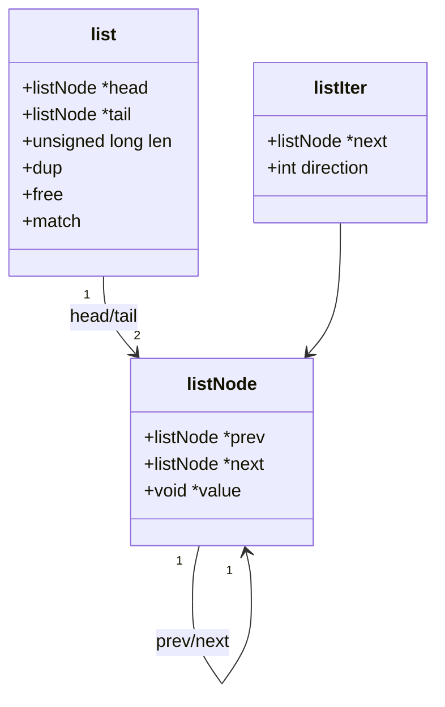

###### 3.4 核心操作与时间复杂度

| 操作 | 函数 | 复杂度 |
|------|------|--------|
| 头部插入 | `listAddNodeHead` | O(1) |
| 尾部插入 | `listAddNodeTail` | O(1) |
| 任意位置插入 | `listInsertNode` | O(1) |
| 删除节点 | `listDelNode` | O(1) |
| 查找 | `listSearchKey` | O(n) |
| 索引访问 | `listIndex` | O(n) |

###### 3.5 应用场景

- kvstore 中的 rehashing 链表（跟踪正在 rehash 的 dict）
- 客户端列表管理
- 慢查询日志
- 发布订阅中的订阅者列表
- Redis Monitor 客户端列表

> 注意: Redis List 类型对象不直接使用 adlist，而是使用 quicklist。

---

#### 4. ziplist (压缩列表)

###### 4.1 整体结构

源码: `ziplist.c:10-35`, `ziplist.c:240-258`

```
内存布局:
<zlbytes> <zltail> <zllen> <entry> <entry> ... <entry> <zlend>
  4 bytes   4 bytes  2 bytes                              1 byte
```

| 头部字段 | 大小 | 含义 |
|----------|------|------|
| `zlbytes` | uint32_t | ziplist 总字节数 |
| `zltail` | uint32_t | 最后一个 entry 的偏移量 |
| `zllen` | uint16_t | entry 数量 (超过 2^16-1 则为 0xFFFF，需遍历计数) |
| `zlend` | uint8_t | 结束标记，固定值 255 (0xFF) |

```c
// ziplist.c:243
##define ZIPLIST_HEADER_SIZE     (sizeof(uint32_t)*2+sizeof(uint16_t))  // 11 bytes
// ziplist.c:246
##define ZIPLIST_END_SIZE        (sizeof(uint8_t))  // 1 byte
```

###### 4.2 Entry 结构

```
<prevlen> <encoding> <entry-data>

prevlen 编码:
  - 长度 < 254: 1 byte 存储长度
  - 长度 >= 254: 5 bytes (0xFE + 4字节小端整数)

encoding 编码:
  |00pppppp|          - 6bit 字符串长度 (0-63)
  |01pppppp|qqqqqqqq| - 14bit 字符串长度
  |10000000|4bytes|   - 32bit 字符串长度
  |11000000|          - int16
  |11010000|          - int32
  |11100000|          - int64
  |11110000|          - 24bit int
  |11111110|          - int8
  |1111xxxx|          - 4bit immediate int (1-13)
```

###### 4.3 类图

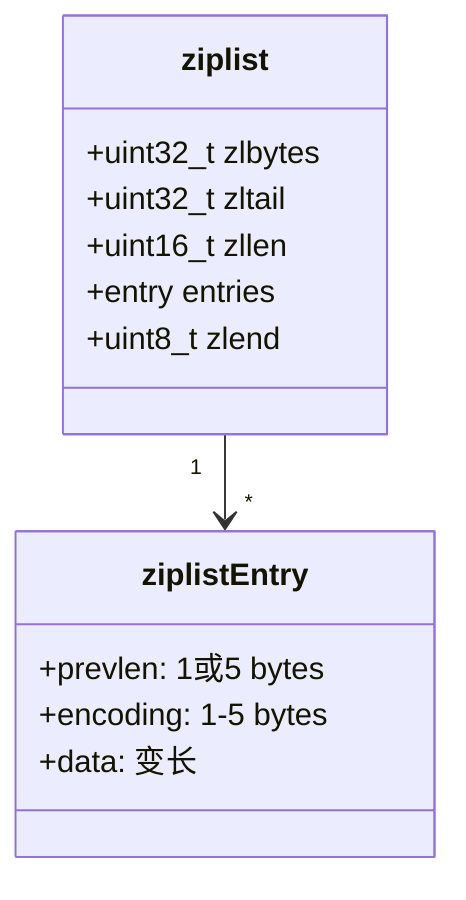

###### 4.4 连锁更新 (Cascade Update)

源码: `ziplist.c:750-810` `__ziplistCascadeUpdate`

**触发条件**: 当插入或删除一个 entry 后，其后续 entry 的 `prevlen` 字段可能需要从 1 字节扩展为 5 字节（当新 entry 长度 >= 254），这会导致后续 entry 自身长度变化，进而影响再下一个 entry 的 prevlen，形成连锁反应。

```
示例: 连续多个 entry 长度恰好为 253 字节
  Entry1(253B) -> Entry2(prevlen=1B, total=253B) -> Entry3(prevlen=1B, total=253B) -> ...

插入一个 254B 的 entry 后:
  NewEntry(254B) -> Entry2(prevlen需变为5B, total=257B) -> Entry3(prevlen需变为5B, total=257B) -> ...

每个 entry 都需要扩展，最坏 O(n^2)
```

**优化措施**:
- 先遍历计算总共需要多少额外空间 (`extra`)，然后一次性 realloc
- 遇到 `prevrawlen == prevlen` 时提前终止（说明后续不需要更新）
- 缩小方向的 cascade update 被刻意忽略，避免 "flapping" 效应

###### 4.5 时间复杂度

| 操作 | 复杂度 |
|------|--------|
| 头/尾 push | O(n) (需要 realloc + 可能 cascade) |
| 索引访问 | O(n) |
| 查找 | O(n) |
| 插入 | O(n^2) (最坏, cascade update) |
| 删除 | O(n^2) (最坏, cascade update) |

###### 4.6 应用场景

- List 类型的小数据量编码 (已被 listpack 替代)
- Hash 类型的小数据量编码 (已被 listpack 替代)
- Sorted Set 的小数据量编码 (已被 listpack 替代)

> Redis 7.0 起，listpack 逐步取代 ziplist。ziplist 代码在 7.4.0 中仍然保留但已不再用于新编码。

---

#### 5. quicklist (快速列表)

###### 5.1 结构定义

源码: `quicklist.h:47-116`

```c
// quicklist.h:47-59
typedef struct quicklistNode {
    struct quicklistNode *prev;
    struct quicklistNode *next;
    unsigned char *entry;       /* 指向 listpack 或 LZF 压缩数据 */
    size_t sz;                  /* entry 的字节大小 */
    unsigned int count : 16;    /* listpack 中的元素数量 */
    unsigned int encoding : 2;  /* RAW=1, LZF=2 */
    unsigned int container : 2;/* PLAIN=1(单元素), PACKED=2(listpack) */
    unsigned int recompress : 1; /* 曾被临时解压 */
    unsigned int attempted_compress : 1;
    unsigned int dont_compress : 1;
    unsigned int extra : 9;
} quicklistNode;  // 32 bytes

// quicklist.h:66-69
typedef struct quicklistLZF {
    size_t sz;          /* 压缩后大小 */
    char compressed[];  /* LZF 压缩数据 */
} quicklistLZF;

// quicklist.h:107-116
typedef struct quicklist {
    quicklistNode *head;
    quicklistNode *tail;
    unsigned long count;        /* 所有节点中元素总数 */
    unsigned long len;          /* quicklistNode 数量 */
    signed int fill : QL_FILL_BITS;       /* 填充因子 */
    unsigned int compress : QL_COMP_BITS; /* 压缩深度 */
    unsigned int bookmark_count: QL_BM_BITS;
    quicklistBookmark bookmarks[];
} quicklist;  // 40 bytes (64-bit)
```

###### 5.2 字段含义

| 字段 | 含义 |
|------|------|
| `fill` | 控制每个 node 的容量。正数=元素个数上限，负数=按 optimization_level 限制字节大小 |
| `compress` | 压缩深度。0=不压缩，n=两端各 n 个 node 不压缩 |
| `encoding` | RAW=1(未压缩), LZF=2(LZF压缩) |
| `container` | PLAIN=1(单个大元素), PACKED=2(listpack多元素) |
| `recompress` | 标记此 node 曾被压缩，因访问被临时解压，需要在使用后重新压缩 |

###### 5.3 fill 因子与节点大小限制 -- `quicklist.c:49`

```c
static const size_t optimization_level[] = {4096, 8192, 16384, 32768, 65536};
```

| fill 值 | 含义 |
|----------|------|
| -1 | 每个 node 的 listpack 最大 4096 字节 |
| -2 | 每个 node 的 listpack 最大 8192 字节 (默认值) |
| -3 | 每个 node 的 listpack 最大 16384 字节 |
| -4 | 每个 node 的 listpack 最大 32768 字节 |
| -5 | 每个 node 的 listpack 最大 65536 字节 |
| >= 1 | 每个 node 最多存放 fill 个元素 |

###### 5.4 类图

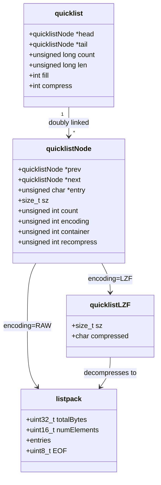

###### 5.5 LZF 压缩

中间节点的 listpack 数据可以使用 LZF 算法压缩。压缩深度 `compress` 控制两端保留不压缩的节点数，便于高频的头部/尾部操作。

访问压缩节点时临时解压（`recompress=1`），操作完成后自动重新压缩。

###### 5.6 时间复杂度

| 操作 | 复杂度 |
|------|--------|
| 头/尾 push | O(1) 均摊 |
| 索引访问 | O(n) 最坏，但实际为 O(n/node_size + node_count) |
| 范围遍历 | O(n) |
| 插入/删除 | O(n) 最坏 |

###### 5.7 应用场景

- **List 类型对象** (OBJ_ENCODING_QUICKLIST) -- Redis List 的唯一底层编码
- LPUSH/RPUSH/LPOP/RPOPLRANGE/LINSERT 等命令

---

#### 6. listpack

###### 6.1 结构定义

源码: `listpack.c:26-101`

listpack 是 ziplist 的替代品，消除了 ziplist 的 cascade update 问题。

```
内存布局:
<total-bytes> <num-elements> <entry> <entry> ... <entry> <EOF>
   4 bytes       2 bytes                              1 byte (0xFF)
```

```c
// listpack.c:26
##define LP_HDR_SIZE 6       /* 32 bit total len + 16 bit num elements */
// listpack.c:75
##define LP_EOF 0xFF
```

###### 6.2 Entry 编码

listpack 的 entry 不存储 prevlen，而是存储自身 encoding + data + backlen（用于反向遍历）:

```
<encoding> <entry-data> <backlen>

backlen: entry 总长度（不含 backlen 自身）的变长编码
  - 0-127:        1 byte
  - 128-16383:    2 bytes
  - 16384-2097151: 3 bytes
  - ...最多 5 bytes
```

**与 ziplist 的关键区别**: listpack 的 entry 不存储前一个 entry 的长度，而是存储自身的长度（backlen），因此插入/删除不会引起 cascade update。

###### 6.3 编码类型

| 编码 | 前缀 | 数据 |
|------|------|------|
| 7bit uint | `0xxxxxxx` | 内嵌在编码字节中 |
| 6bit str | `10xxxxxx` | 长度在编码字节低6位 |
| 13bit int | `110xxxxx xxxxxxxx` | 2字节 |
| 12bit str | `1110xxxx xxxxxxxx` | 长度在编码+1字节 |
| 16bit int | `11110001` | 2字节 |
| 24bit int | `11110010` | 3字节 |
| 32bit int | `11110011` | 4字节 |
| 64bit int | `11110100` | 8字节 |
| 32bit str | `11110000` + 4字节长度 | 变长字符串 |

###### 6.4 类图

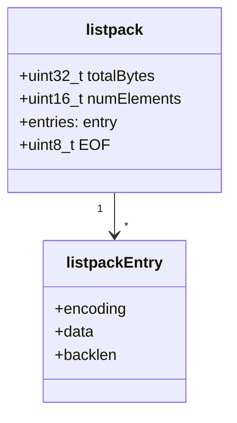

###### 6.5 时间复杂度

| 操作 | 复杂度 |
|------|--------|
| 头/尾追加 | O(n) (需要 realloc) |
| 索引访问 | O(n) |
| 查找 | O(n) |
| 插入 | O(n) (无 cascade update!) |
| 删除 | O(n) (无 cascade update!) |
| 获取长度 | O(1) (当 numElements < 0xFFFF) |

###### 6.6 应用场景

- Hash 类型的小数据量编码 (OBJ_ENCODING_LISTPACK)
- Set 类型的小数据量全整数编码 (OBJ_ENCODING_LISTPACK，取代 intset 在某些场景)
- Sorted Set 的小数据量编码 (OBJ_ENCODING_LISTPACK)
- List 类型作为 quicklist 节点内部存储
- Stream 消费的 listpack 节点

---

#### 7. intset (整数集合)

###### 7.1 结构定义

源码: `intset.h:35-39`, `intset.c:41-43`

```c
// intset.h:35-39
typedef struct intset {
    uint32_t encoding;  /* INT16, INT32, or INT64 */
    uint32_t length;     /* 元素个数 */
    int8_t contents[];  /* 柔性数组，有序存储 */
} intset;

// intset.c:41-43
##define INTSET_ENC_INT16 (sizeof(int16_t))  // 2
##define INTSET_ENC_INT32 (sizeof(int32_t))  // 4
##define INTSET_ENC_INT64 (sizeof(int64_t))  // 8
```

###### 7.2 字段含义

| 字段 | 含义 |
|------|------|
| `encoding` | 当前编码（2/4/8），决定 contents 中每个元素的大小 |
| `length` | 元素数量 |
| `contents[]` | 有序整数数组，从小到大排列 |

###### 7.3 编码升级 -- `intset.c:158-182`

```c
static intset *intsetUpgradeAndAdd(intset *is, int64_t value) {
    uint8_t curenc = intrev32ifbe(is->encoding);
    uint8_t newenc = _intsetValueEncoding(value);
    int length = intrev32ifbe(is->length);
    int prepend = value < 0 ? 1 : 0;

    /* 设置新编码并扩容 */
    is->encoding = intrev32ifbe(newenc);
    is = intsetResize(is, intrev32ifbe(is->length) + 1);

    /* 从后往前迁移，避免覆盖 */
    while (length--)
        _intsetSet(is, length + prepend, _intsetGetEncoded(is, length, curenc));

    /* 新值放在头部或尾部 */
    if (prepend)
        _intsetSet(is, 0, value);
    else
        _intsetSet(is, intrev32ifbe(is->length), value);
    is->length = intrev32ifbe(intrev32ifbe(is->length) + 1);
    return is;
}
```

升级时从后往前拷贝，避免数据覆盖。新值一定在集合的最小端或最大端（超出当前编码范围）。

###### 7.4 二分查找 -- `intset.c:117-156`

```c
static uint8_t intsetSearch(intset *is, int64_t value, uint32_t *pos) {
    int min = 0, max = intrev32ifbe(is->length) - 1, mid = -1;
    // ... 标准二分查找 ...
}
```

###### 7.5 类图

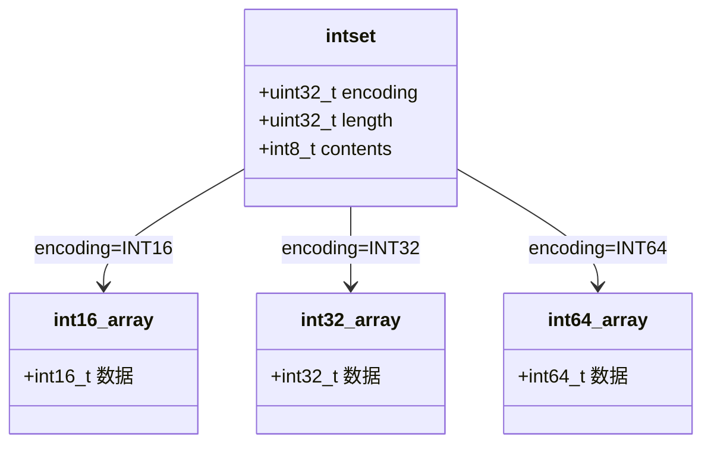

###### 7.6 时间复杂度

| 操作 | 复杂度 |
|------|--------|
| 查找 | O(log n) |
| 插入（不升级） | O(n) (二分查找 O(logn) + memmove O(n)) |
| 插入（需升级） | O(n) |
| 删除 | O(n) |
| 获取长度 | O(1) |

###### 7.7 应用场景

- Set 类型对象全为整数且元素数量 <= `set-max-intset-entries`(默认512) 时的底层编码
- SADD/SREM/SISMEMBER/SMEMBERS 等命令

---

#### 8. skiplist (跳跃表)

###### 8.1 结构定义

源码: `server.h:514-515`, `server.h:1341-1360`, `t_zset.c:63-131`

```c
// server.h:514-515
##define ZSKIPLIST_MAXLEVEL 32  /* 足够支撑 2^64 个元素 */
##define ZSKIPLIST_P 0.25       /* 晋升概率 = 1/4 */

// server.h:1341-1349
typedef struct zskiplistNode {
    sds ele;                           /* 元素值 */
    double score;                      /* 分数 */
    struct zskiplistNode *backward;    /* 后退指针(仅level 0) */
    struct zskiplistLevel {
        struct zskiplistNode *forward;  /* 前进指针 */
        unsigned long span;             /* 跨度(用于计算排名) */
    } level[];                         /* 柔性数组，长度为该节点的层数 */
} zskiplistNode;

// server.h:1351-1355
typedef struct zskiplist {
    struct zskiplistNode *header, *tail;
    unsigned long length;  /* 节点总数(不含header) */
    int level;             /* 当前最大层数 */
} zskiplist;

// server.h:1357-1360
typedef struct zset {
    dict *dict;           /* ele -> score 映射，O(1)查找 */
    zskiplist *zsl;       /* 按score排序的跳跃表 */
} zset;
```

###### 8.2 字段含义

| 字段 | 含义 |
|------|------|
| `score` | 分数，用于排序 |
| `ele` | SDS 字符串，元素值 |
| `backward` | 后退指针，仅 level 0 有效，支持反向遍历 |
| `forward` | 每层的前进指针 |
| `span` | 到下一个节点的距离（跨越的节点数），用于 O(log n) 计算排名 |
| `level` | 当前跳跃表的最大层数 |
| `length` | 跳跃表中节点数量（不含 header） |

###### 8.3 概率算法 -- `t_zset.c:126-132`

```c
int zslRandomLevel(void) {
    static const int threshold = ZSKIPLIST_P * RAND_MAX;  // 0.25 * RAND_MAX
    int level = 1;
    while (random() < threshold)
        level += 1;
    return (level < ZSKIPLIST_MAXLEVEL) ? level : ZSKIPLIST_MAXLEVEL;
}
```

每个节点至少有 1 层，以概率 p=0.25 晋升到更高层。期望层数 = 1/(1-p) = 4/3。

###### 8.4 插入算法 -- `t_zset.c:137-186`

```
zslInsert 流程:
1. 从最高层开始，逐层向下查找插入位置
   - 记录每层的 update[i] (待插入位置的前驱节点)
   - 记录每层的 rank[i] (从 header 到 update[i] 的跨度)
2. 调用 zslRandomLevel() 生成新节点层数
3. 若新层数 > zsl->level，更新高层的 update 和 rank
4. 创建新节点，设置每层的 forward 和 span
5. 更新 backward 指针、tail、length、level
```

###### 8.5 类图

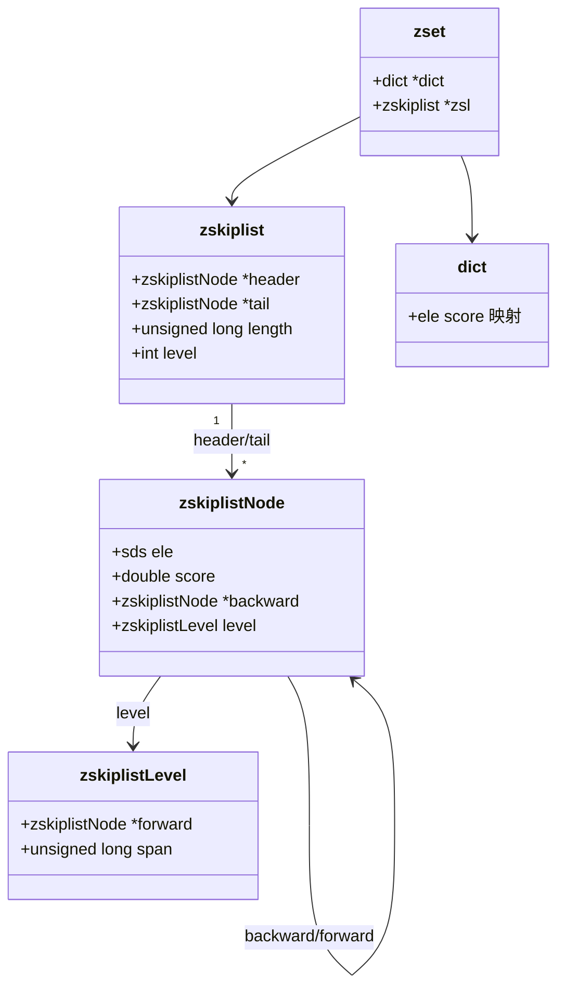

###### 8.6 span 与排名计算

`span` 字段记录当前节点到该层下一个节点之间跨越的节点数。通过累加 span，可以在 O(log n) 时间内计算一个节点的排名：

```
rank = 0
for i from maxLevel-1 to 0:
    while x->level[i].forward and (score < next->score or ...):
        rank += x->level[i].span
        x = x->level[i].forward
```

###### 8.7 时间复杂度

| 操作 | 复杂度 |
|------|--------|
| 插入 | O(log n) |
| 删除 | O(log n) |
| 查找 | O(log n) |
| 范围查询 | O(log n + m) (m 为结果数) |
| 排名查询 | O(log n) |

###### 8.8 应用场景

- Sorted Set 类型对象 (OBJ_ENCODING_SKIPLIST) 的底层实现
- ZADD/ZRANK/ZRANGE/ZRANGEBYSCORE/ZREVRANGE 等命令
- 与 dict 配合：dict 提供 O(1) 的 ele->score 查找，skiplist 提供有序操作

---

#### 9. rax (基数树 / Radix Tree)

###### 9.1 结构定义

源码: `rax.h:77-117`

```c
// rax.h:77-110
typedef struct raxNode {
    uint32_t iskey:1;     /* 此节点是否代表一个完整的key */
    uint32_t isnull:1;    /* 关联值为NULL */
    uint32_t iscompr:1;   /* 是否为压缩节点 */
    uint32_t size:29;     /* 子节点数 或 压缩字符串长度 */
    unsigned char data[]; /* 数据区，布局由 iscompr 决定 */
} raxNode;

// rax.h:112-117
typedef struct rax {
    raxNode *head;
    uint64_t numele;      /* key 的数量 */
    uint64_t numnodes;    /* 节点总数 */
    void *metadata[];
} rax;
```

###### 9.2 数据布局

```
非压缩节点 (iscompr=0):
  [header][char1 char2 ... charN][ptr1 ptr2 ... ptrN][value-ptr?]
  - N 个子节点字符 + N 个子节点指针

压缩节点 (iscompr=1):
  [header][char1 char2 ... charN][ptr][value-ptr?]
  - 一条单链路径的字符串 + 最后一个节点的指针
```

###### 9.3 类图

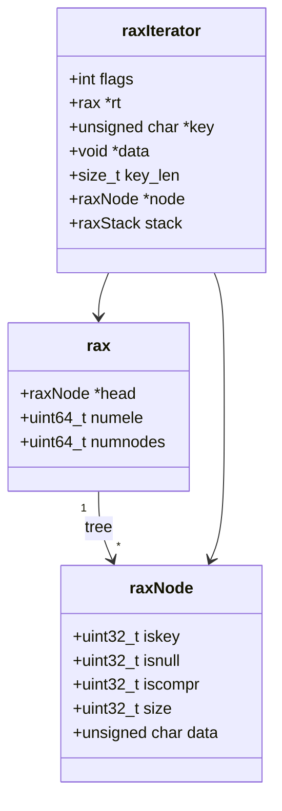

###### 9.4 核心操作

- `raxInsert` / `raxTryInsert`: 插入 key，可能触发节点拆分
- `raxRemove`: 删除 key，可能触发节点合并
- `raxFind`: 查找 key
- `raxSeek` / `raxNext` / `raxPrev`: 迭代器遍历（支持范围查询）

###### 9.5 时间复杂度

| 操作 | 复杂度 |
|------|--------|
| 插入 | O(k) (k = key 长度) |
| 查找 | O(k) |
| 删除 | O(k) |
| 范围遍历 | O(k + m) |

###### 9.6 应用场景

- **Stream** 类型对象 (OBJ_ENCODING_STREAM) -- 消息 ID 到 listpack 的映射
- Stream 消费者组 (Consumer Group) 的管理
- ebuckets 的底层存储（当元素数量超过阈值时从链表转为 rax）

---

#### 10. ebuckets (过期桶)

###### 10.1 概述

源码: `ebuckets.h:8-116`, `ebuckets.c:1-160`

ebuckets 是 Redis 7.4 新引入的数据结构，用于高效存储带过期时间的元素。它基于 rax 树或简单链表实现，以过期时间作为 key 进行组织。

###### 10.2 结构定义

```c
// ebuckets.h:152
typedef void *ebuckets;  /* 指向 rax 或 list(以 LSB 区分) */

// ebuckets.h:161-211 -- 嵌入到每个 eItem 中
typedef struct ExpireMeta {
    uint32_t expireTimeLo;              /* 过期时间低32位 */
    uint16_t expireTimeHi;              /* 过期时间高16位 (共48bit, 到公元10889年) */

    unsigned int lastInSegment    : 1;  /* 段中最后一个item */
    unsigned int firstItemBucket  : 1;  /* 桶中第一个item */
    unsigned int lastItemBucket   : 1;  /* 桶中最后一个item */
    unsigned int numItems         : 5;  /* 仅段首item维护: 段内item数 */
    unsigned int trash            : 1;  /* 标记为已删除的残留 */
    unsigned int userData         : 3;  /* 用户自定义数据 */
    unsigned int reserved        : 4;
    void *next;                         /* 下一个item/段头/自引用 */
} ExpireMeta;

// ebuckets.h:218-229
typedef struct EbucketsType {
    ExpireMeta* (*getExpireMeta)(const eItem item);
    void (*onDeleteItem)(eItem item, void *ctx);
    unsigned int itemsAddrAreOdd;
} EbucketsType;
```

###### 10.3 分层结构

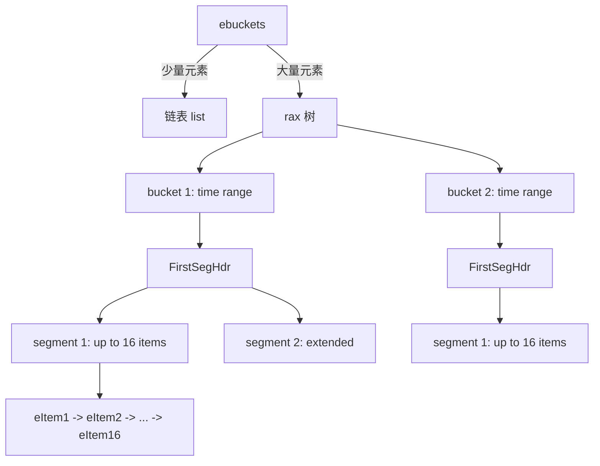

######## 段头结构 -- `ebuckets.c:93-116`

```c
typedef struct FirstSegHdr {
    eItem head;           /* 第一个item */
    uint32_t totalItems;  /* 桶内所有段的总item数 */
    uint32_t numSegs;     /* 桶内段数量 */
} FirstSegHdr;

typedef struct NextSegHdr {
    eItem head;
    CommonSegHdr *prevSeg; /* 前一个段 */
    FirstSegHdr *firstSeg; /* 桶的第一个段 */
} NextSegHdr;

typedef struct CommonSegHdr {
    eItem head;
} CommonSegHdr;
```

###### 10.4 核心常量

```c
// ebuckets.c:62-63
##define EB_SEG_MAX_ITEMS 16     /* 段内最大item数 */
##define EB_LIST_MAX_ITEMS 16    /* 链表模式最大item数，超过则转为rax */
```

###### 10.5 关键机制

######## 桶分裂 (Bucket Splitting)

当段的 item 数达到 `EB_SEG_MAX_ITEMS`(16) 时，尝试将桶分裂为更细粒度的时间范围。如果所有 item 过期时间相同，无法分裂，则创建扩展段 (extended segment)。

######## 链表 -> rax 转换

当元素数量 <= `EB_LIST_MAX_ITEMS` 时使用简单链表，超过后转为 rax 树。链表通过指针 LSB=1 标识。

######## 时间精度控制 -- `ebuckets.h:142-146`

```c
##define EB_BUCKET_KEY_PRECISION 0   /* TBD: modify to 10 */
##define EB_BUCKET_KEY(exptime) ((exptime) >> EB_BUCKET_KEY_PRECISION)
```

通过右移忽略低位比特来降低 rax 树的深度，减少频繁修改。lazy expiration 仍保持毫秒级精度。

###### 10.6 类图

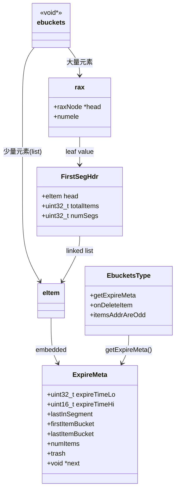

###### 10.7 时间复杂度

| 操作 | 复杂度 |
|------|--------|
| 添加 (list模式) | O(n) (插入排序) |
| 添加 (rax模式) | O(log k) (k=key长度) + O(1) 段操作 |
| 删除 | O(1) (通过 ExpireMeta 直接定位) |
| 活跃过期 | O(m) (m=过期元素数，从最小key开始) |

###### 10.8 应用场景

- Redis 7.4 中 db.expires 的底层实现（取代简单的 dict + 过期扫描）
- db.expires 用于管理所有键的 TTL 过期
- 支持高效的主动过期 (active expiration)

---

#### 11. kvstore (多 dict 分片)

###### 11.1 结构定义

源码: `kvstore.c:30-60`

```c
// kvstore.c:30-45
struct _kvstore {
    int flags;
    dictType dtype;
    dict **dicts;                     /* dict 数组 */
    long long num_dicts;              /* dict 数量 (2^num_dicts_bits) */
    long long num_dicts_bits;         /* dict 数量的指数 */
    list *rehashing;                  /* 正在 rehash 的 dict 列表 */
    int resize_cursor;               /* 渐进 resize 游标 */
    int allocated_dicts;              /* 已分配的 dict 数 */
    int non_empty_dicts;              /* 非空 dict 数 */
    unsigned long long key_count;     /* 总 key 数 */
    unsigned long long bucket_count;  /* 总桶数 */
    unsigned long long *dict_size_index; /* Fenwick Tree (BIT) */
    size_t overhead_hashtable_lut;
    size_t overhead_hashtable_rehashing;
};

// kvstore.c:48-53
struct _kvstoreIterator {
    kvstore *kvs;
    long long didx;
    long long next_didx;
    dictIterator di;
};

// kvstore.c:63-65
typedef struct {
    listNode *rehashing_node;   /* rehashing 列表中的节点 */
} kvstoreDictMetadata;
```

###### 11.2 字段含义

| 字段 | 含义 |
|------|------|
| `dicts` | dict 指针数组，每个 dict 对应一个分片 |
| `num_dicts` | 分片总数，集群模式下等于 slot 数 (16384) |
| `rehashing` | 链表，记录当前正在 rehash 的 dict，用于调度 |
| `dict_size_index` | Fenwick Tree (二叉索引树)，O(log n) 查询前缀累积 key 数 |
| `allocated_dicts` | 实际分配了内存的 dict 数（按需分配） |
| `non_empty_dicts` | 非空 dict 数 |
| `resize_cursor` | 渐进 resize 的游标 |

###### 11.3 类图

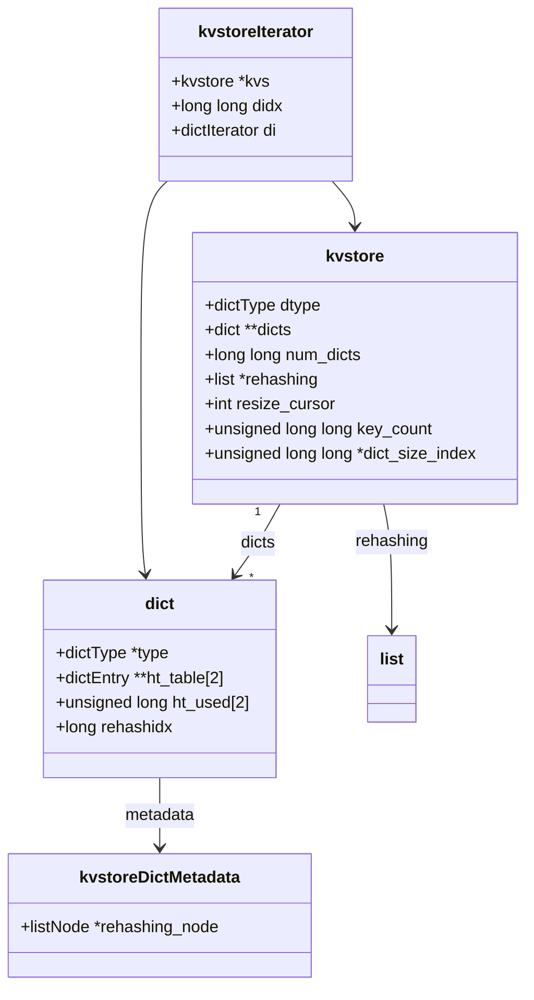

###### 11.4 核心设计

######## 多 dict 分片

kvstore 将键分散到多个 dict 中，每个 dict 对应一个分片。在集群模式下，每个 slot 对应一个 dict，共 16384 个 dict。这样可以：
- 减少单个 dict 的哈希冲突
- 每个分片可以独立 rehash，降低对全局的影响
- 支持按 slot 粒度的操作（如 CLUSTER GETKEYSINSLOT）

######## 按需分配 -- `KVSTORE_ALLOCATE_DICTS_ON_DEMAND`

dict 数组初始时只分配指针，不分配实际的 dict 结构。当首次写入某个分片时才创建对应的 dict。

######## 空闲释放 -- `KVSTORE_FREE_EMPTY_DICTS`

当 dict 变空时释放其内存，减少内存占用。

######## Fenwick Tree (BIT) -- `kvstore.c:88-100`

```c
static unsigned long long cumulativeKeyCountRead(kvstore *kvs, int didx) {
    int idx = didx + 1;
    unsigned long long sum = 0;
    while (idx > 0) {
        sum += kvs->dict_size_index[idx];
        idx -= (idx & -idx);
    }
    return sum;
}
```

用于 O(log n) 查询前缀累积 key 数量，支持高效随机 key 采样。

######## 增量 rehash 调度 -- `kvstore.c:47-48` (API)

kvstore 维护一个 `rehashing` 链表，记录所有正在 rehash 的 dict。定时任务通过 `kvstoreIncrementallyRehash` 按时间预算逐个 rehash。

###### 11.5 时间复杂度

| 操作 | 复杂度 |
|------|--------|
| 查找 | O(1) (定位dict + dict查找) |
| 插入 | O(1) |
| 删除 | O(1) |
| 遍历所有key | O(n) |
| 随机key采样 | O(log D) (D=dict数, Fenwick Tree) |

###### 11.6 应用场景

- **db.dict** -- 存储所有键值对，集群模式下按 slot 分片
- **db.expires** -- 存储所有键的过期时间
- 支持集群模式下按 slot 粒度的操作和渐进式迁移

---

#### 12. redisObject

###### 12.1 结构定义

源码: `server.h:903-911`

```c
##define LRU_BITS 24  // server.h:896

struct redisObject {
    unsigned type:4;           /* 对象类型 (OBJ_STRING ~ OBJ_STREAM) */
    unsigned encoding:4;       /* 编码方式 */
    unsigned lru:LRU_BITS;     /* LRU时间 或 LFU数据 (24 bits) */
    int refcount;               /* 引用计数 */
    void *ptr;                  /* 指向底层实现 */
};
```

###### 12.2 字段含义

| 字段 | 位宽 | 含义 |
|------|------|------|
| `type` | 4 | 对象类型：STRING(0)/LIST(1)/SET(2)/ZSET(3)/HASH(4)/MODULE(5)/STREAM(6) |
| `encoding` | 4 | 底层编码：RAW/INT/HT/LISTPACK/INTSET/SKIPLIST/EMBSTR/QUICKLIST/STREAM/LISTPACK_EX |
| `lru` | 24 | LRU 模式：最近访问时间(分钟精度)；LFU 模式：低8位频率 + 高16位访问时间 |
| `refcount` | 32 | 引用计数，=1 正常，=INT_MAX 共享对象，=INT_MAX-1 栈上对象 |
| `ptr` | 64 | 指向底层数据结构 |

###### 12.3 对象类型与编码

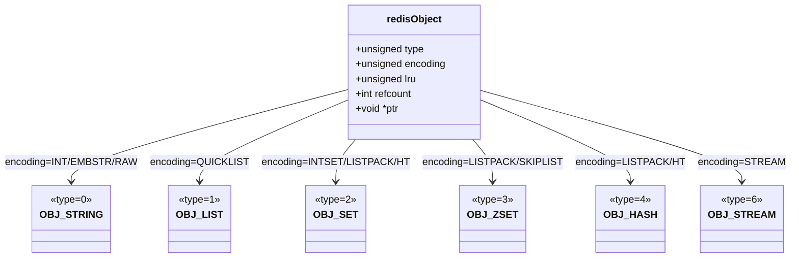

###### 12.4 编码常量 -- `server.h:882-894`

```c
##define OBJ_ENCODING_RAW       0  /* SDS 原始字符串 */
##define OBJ_ENCODING_INT       1  /* long 整数 */
##define OBJ_ENCODING_HT        2  /* dict 哈希表 */
##define OBJ_ENCODING_ZIPMAP    3  /* (已废弃) */
##define OBJ_ENCODING_LINKEDLIST 4 /* (已废弃, 被 quicklist 替代) */
##define OBJ_ENCODING_ZIPLIST   5  /* ziplist (7.4 中逐步弃用) */
##define OBJ_ENCODING_INTSET    6  /* intset */
##define OBJ_ENCODING_SKIPLIST  7  /* skiplist + dict */
##define OBJ_ENCODING_EMBSTR    8  /* 嵌入式 SDS (robj 和 sds 在同一分配) */
##define OBJ_ENCODING_QUICKLIST 9  /* quicklist */
##define OBJ_ENCODING_STREAM    10 /* radix tree of listpacks */
##define OBJ_ENCODING_LISTPACK  11 /* listpack */
##define OBJ_ENCODING_LISTPACK_EX 12 /* listpack + 扩展元数据(带TTL的Hash) */
```

###### 12.5 LRU/LFU 实现 -- `object.c:22-43`

```c
robj *createObject(int type, void *ptr) {
    robj *o = zmalloc(sizeof(*o));
    o->type = type;
    o->encoding = OBJ_ENCODING_RAW;
    o->ptr = ptr;
    o->refcount = 1;
    o->lru = 0;
    return o;
}

void initObjectLRUOrLFU(robj *o) {
    if (o->refcount == OBJ_SHARED_REFCOUNT) return;
    if (server.maxmemory_policy & MAXMEMORY_FLAG_LFU) {
        o->lru = (LFUGetTimeInMinutes() << 8) | LFU_INIT_VAL;
    } else {
        o->lru = LRU_CLOCK();
    }
}
```

**LRU 模式**: `lru` 字段存储最后一次访问时间（分钟精度，24bit 可表示约 194 天）

**LFU 模式**:
- 低 8 位: 访问频率计数器（对数概率递增）
- 高 16 位: 最后访问时间（分钟精度）

###### 12.6 共享对象

Redis 预创建一些常用对象（小整数、常用回复字符串），通过 `refcount = OBJ_SHARED_REFCOUNT (INT_MAX)` 标记为共享，永不被释放。

```c
// server.h:900-902
##define OBJ_SHARED_REFCOUNT INT_MAX
##define OBJ_STATIC_REFCOUNT (INT_MAX-1)
```

###### 12.7 引用计数与内存管理

- `refcount = 1`: 正常对象，可以被释放
- `refcount = INT_MAX`: 共享对象，永不释放
- `refcount = INT_MAX-1`: 栈上对象，不参与内存管理
- `refcount > 1`: 被多处引用，减少引用后才释放

###### 12.8 编码转换

Redis 会在数据量变化时自动转换编码以优化性能：

| 类型 | 小数据量编码 | 转换阈值 | 大数据量编码 |
|------|-------------|----------|-------------|
| String | INT/EMBSTR | 44字节 | RAW |
| List | QUICKLIST | - | QUICKLIST |
| Set | INTSET/LISTPACK | 512元素或64字节成员 | HT |
| ZSet | LISTPACK | 128元素或64字节成员 | SKIPLIST |
| Hash | LISTPACK | 128字段或64字节值 | HT |

###### 12.9 应用场景

redisObject 是 Redis 所有值的外层包装，每个 Redis 命令操作的对象都是 redisObject。它通过 type 和 encoding 实现了多态：

- `type` 决定对外暴露的命令集（如 String 的 GET/SET, Hash 的 HGET/HSET）
- `encoding` 对用户透明，Redis 根据数据特征自动选择最优编码

---

#### 附：数据结构关系总览

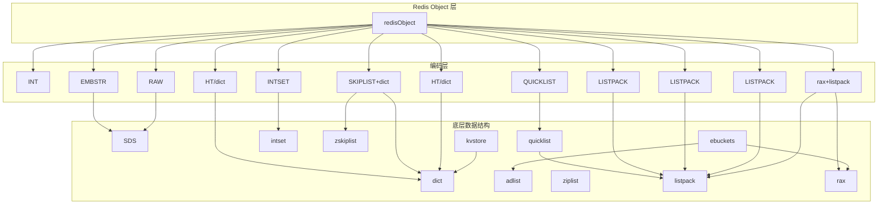

---

#### 附：关键源码文件索引

| 数据结构 | 头文件 | 源文件 |
|----------|--------|--------|
| SDS | sds.h | sds.c |
| dict | dict.h | dict.c |
| adlist | adlist.h | adlist.c |
| ziplist | ziplist.h | ziplist.c |
| quicklist | quicklist.h | quicklist.c |
| listpack | listpack.h | listpack.c |
| intset | intset.h | intset.c |
| skiplist | server.h:1341-1360 | t_zset.c |
| rax | rax.h | rax.c |
| ebuckets | ebuckets.h | ebuckets.c |
| kvstore | kvstore.h | kvstore.c |
| redisObject | server.h:903-911 | object.c |

---

## 三、Server 启动流程与事件循环

## Redis 7.4.0 Server 启动流程与事件循环机制深度分析

#### 目录

1. [main 函数入口](#1-main-函数入口)
2. [事件循环 ae](#2-事件循环-ae)
3. [网络监听](#3-网络监听)
4. [serverCron 定时任务](#4-servercron-定时任务)
5. [beforeSleep 关键工作](#5-beforesleep-关键工作)
6. [整体启动时序图](#6-整体启动时序图)

---

#### 1. main 函数入口

**位置**: `server.c:6917`

###### 1.1 启动流程概览

Redis 的 `main()` 函数是整个服务器的入口点，完成从命令行解析、配置加载、服务器初始化到进入事件循环的全过程。

###### 1.2 命令行参数解析

**位置**: `server.c:7022-7139`

Redis 不使用标准的 `getopt`，而是自行实现了参数解析逻辑：

```
redis-server [configfile] [--option value] [-]
```

解析规则：
- 第一个非 `-` 开头的参数视为配置文件路径 (`server.c:7053-7058`)
- `--` 前缀的参数被转换为配置指令字符串，拼接后交给 `loadServerConfig` 解析 (`server.c:7073-7127`)
- `-` 作为 stdin 标记，支持从标准输入读取配置 (`server.c:7065-7067`)
- 特殊选项：`-v/--version`、`--help/-h`、`--test-memory`、`--check-system` (`server.c:7027-7048`)

关键代码逻辑 (`server.c:7073-7137`)：
```c
while(j < argc) {
    if (argv[j][0] == '-' && argv[j][1] == '-') {
        /* Option name: 去掉 "--" 前缀，拼接到 options 字符串 */
        options = sdscat(options, argv[j]+2);
        options = sdscat(options, " ");
    } else {
        /* Option argument */
        options = sdscatrepr(options, argv[j], strlen(argv[j]));
        options = sdscat(options, " ");
    }
    j++;
}
loadServerConfig(server.configfile, config_from_stdin, options);
```

###### 1.3 initServerConfig -- 初始化默认配置

**位置**: `server.c:2034`

此函数在 `main()` 中于 `server.c:6993` 被调用，负责将全局 `server` 结构体初始化为默认值。

关键初始化内容：
- **运行ID**: `getRandomHexChars(server.runid, CONFIG_RUN_ID_SIZE)` (`server.c:2041`)
- **复制ID**: `changeReplicationId()` / `clearReplicationId2()` (`server.c:2043-2044`)
- **默认频率**: `server.hz = CONFIG_DEFAULT_HZ`（默认 10Hz） (`server.c:2045`)
- **时区**: `server.timezone = getTimeZone()` (`server.c:2049`)
- **绑定地址**: 使用 `CONFIG_DEFAULT_BINDADDR` 默认值 (`server.c:2053-2055`)
- **AOF状态**: `server.aof_state = AOF_OFF` (`server.c:2063`)
- **保存策略**: 默认三组 save 规则 (`server.c:2102-2106`)
  - 3600秒内1次变更
  - 300秒内100次变更
  - 60秒内10000次变更
- **复制相关**: `server.masterhost = NULL`, `server.repl_state = REPL_STATE_NONE` (`server.c:2109-2120`)
- **LRU时钟**: `server.lruclock = getLRUClock()` (`server.c:2101`)

###### 1.4 initServer -- 真正初始化服务器

**位置**: `server.c:2591`

此函数在 `main()` 中于 `server.c:7189` 被调用，是服务器初始化的核心。主要工作：

######## 1.4.1 信号处理
```c
signal(SIGHUP, SIG_IGN);      // 忽略 SIGHUP
signal(SIGPIPE, SIG_IGN);     // 忽略 SIGPIPE（防止写已关闭socket导致进程退出）
setupSignalHandlers();         // 注册 SIGTERM/SIGINT 等信号处理器
```
(`server.c:2594-2596`)

######## 1.4.2 核心数据结构创建
- 客户端链表: `server.clients = listCreate()` (`server.c:2616`)
- 客户端索引(radix tree): `server.clients_index = raxNew()` (`server.c:2617`)
- 待关闭客户端链表: `server.clients_to_close = listCreate()` (`server.c:2618`)
- 从节点链表: `server.slaves = listCreate()` (`server.c:2619`)
- 监控器链表: `server.monitors = listCreate()` (`server.c:2620`)
- 待写客户端链表: `server.clients_pending_write = listCreate()` (`server.c:2621`)
- 待读客户端链表: `server.clients_pending_read = listCreate()` (`server.c:2622`)
- 客户端超时表: `server.clients_timeout_table = raxNew()` (`server.c:2623`)

######## 1.4.3 创建事件循环
```c
server.el = aeCreateEventLoop(server.maxclients + CONFIG_FDSET_INCR);
```
(`server.c:2657`)

`CONFIG_FDSET_INCR` 是一个预留量，确保有足够的 fd 槽位用于监听套接字、管道等非客户端 fd。

######## 1.4.4 创建数据库
```c
server.db = zmalloc(sizeof(redisDb) * server.dbnum);
for (j = 0; j < server.dbnum; j++) {
    server.db[j].keys = kvstoreCreate(...);      // 键空间
    server.db[j].expires = kvstoreCreate(...);    // 过期表
    server.db[j].hexpires = ebCreate();           // 过期桶(expire buckets)
    server.db[j].blocking_keys = dictCreate(...);  // 阻塞键
    server.db[j].watched_keys = dictCreate(...);   // WATCH的键
}
```
(`server.c:2664-2686`)

######## 1.4.5 注册 serverCron 时间事件
```c
if (aeCreateTimeEvent(server.el, 1, serverCron, NULL, NULL) == AE_ERR) {
    serverPanic("Can't create event loop timers.");
    exit(1);
}
```
(`server.c:2757-2760`)

初始延迟为 1 毫秒，确保服务器启动后尽快执行第一次 cron。`serverCron` 返回 `1000/server.hz` 作为下次执行的间隔（毫秒）。

######## 1.4.6 注册 module pipe 可读事件
```c
aeCreateFileEvent(server.el, server.module_pipe[0], AE_READABLE,
                  modulePipeReadable, NULL)
```
(`server.c:2764-2768`)

用于模块线程唤醒主事件循环。

######## 1.4.7 注册 beforeSleep / afterSleep 回调
```c
aeSetBeforeSleepProc(server.el, beforeSleep);
aeSetAfterSleepProc(server.el, afterSleep);
```
(`server.c:2772-2773`)

这两个回调在每次事件循环迭代中被调用：
- `beforeSleep`: 在 `aeApiPoll` 之前调用
- `afterSleep`: 在 `aeApiPoll` 返回后调用

######## 1.4.8 其他初始化
- 共享对象: `createSharedObjects()` (`server.c:2653`)
- 脚本引擎: `luaEnvInit()`, `scriptingInit(1)` (`server.c:2785-2786`)
- 函数子系统: `functionsInit()` (`server.c:2787`)
- 慢日志: `slowlogInit()` (`server.c:2791`)
- 延迟监控: `latencyMonitorInit()` (`server.c:2792`)

###### 1.5 loadDataFromDisk -- 加载持久化数据

**位置**: `server.c:6641`

在 `main()` 中于 `server.c:7212` 被调用。

```c
void loadDataFromDisk(void) {
    if (server.aof_state == AOF_ON) {
        // AOF 模式: 从 AOF 文件加载
        int ret = loadAppendOnlyFiles(server.aof_manifest);
    } else {
        // RDB 模式: 从 RDB 文件加载
        int rdb_load_ret = rdbLoad(server.rdb_filename, &rsi, rdb_flags);
        // 恢复复制 ID 和偏移量
    }
}
```

关键逻辑：
- AOF 优先：如果 AOF 开启，从 AOF 文件加载 (`server.c:6643-6648`)
- RDB 回退：否则从 RDB 文件加载 (`server.c:6649-6700`)
- 复制信息恢复：从 RDB 中恢复 replication ID 和 offset，支持部分重同步 (`server.c:6666-6696`)
- 主节点加载时创建复制积压缓冲区 (`server.c:6657`)

###### 1.6 initListeners -- 监听端口

**位置**: `server.c:2803`

在 `main()` 中于 `server.c:7202` 被调用。

```c
void initListeners(void) {
    // 1. 根据配置设置 TCP 监听器
    if (server.port != 0) { /* ... TCP listener ... */ }
    // 2. 设置 TLS 监听器
    if (server.tls_port != 0) { /* ... TLS listener ... */ }
    // 3. 设置 Unix Socket 监听器
    if (server.unixsocket != NULL) { /* ... Unix listener ... */ }
    // 4. 创建所有监听 fd 并注册 accept handler
    for (int j = 0; j < CONN_TYPE_MAX; j++) {
        connListen(listener);                              // bind + listen
        createSocketAcceptHandler(listener, connAcceptHandler(listener->ct));
    }
}
```

`createSocketAcceptHandler` (`server.c:2443`) 为每个监听 fd 注册 `AE_READABLE` 事件：
```c
int createSocketAcceptHandler(connListener *sfd, aeFileProc *accept_handler) {
    for (j = 0; j < sfd->count; j++) {
        aeCreateFileEvent(server.el, sfd->fd[j], AE_READABLE, accept_handler, sfd);
    }
    return C_OK;
}
```

###### 1.7 进入主事件循环

**位置**: `server.c:7251`

```c
aeMain(server.el);
aeDeleteEventLoop(server.el);
return 0;
```

`aeMain` 是一个无限循环，直到 `server.el->stop` 被设置为非零值才会退出。

###### 1.8 main 函数完整调用顺序

```mermaid
flowchart TD
    A[main 入口 server.c:6917] --> B[初始化随机数种子<br/>tzset, srand, crc64_init]
    B --> C[initServerConfig<br/>server.c:6993<br/>设置默认配置]
    C --> D[ACLInit<br/>初始化ACL子系统]
    D --> E[moduleInitModulesSystem<br/>初始化模块系统]
    E --> F[connTypeInitialize<br/>初始化连接类型]
    F --> G{sentinel_mode?}
    G -->|Yes| H[initSentinelConfig + initSentinel]
    G -->|No| I[命令行参数解析]
    H --> I
    I --> J[loadServerConfig<br/>server.c:7137<br/>加载配置文件+命令行覆盖]
    J --> K[linuxMemoryWarnings<br/>系统检查]
    K --> L{daemonize?}
    L -->|Yes| M[daemonize 后台运行]
    L -->|No| N[initServer<br/>server.c:7189]
    M --> N
    N --> O[createPidFile<br/>创建PID文件]
    O --> P[redisAsciiArt<br/>打印ASCII艺术]
    P --> Q{cluster_enabled?}
    Q -->|Yes| R[clusterInit]
    Q -->|No| S[moduleLoadFromQueue<br/>加载模块]
    R --> S
    S --> T[ACLLoadUsersAtStartup]
    T --> U[initListeners<br/>server.c:7202<br/>监听端口+注册accept]
    U --> V[InitServerLast<br/>bioInit + initThreadedIO]
    V --> W[loadDataFromDisk<br/>server.c:7212<br/>加载RDB/AOF]
    W --> X[aofOpenIfNeededOnServerStart]
    X --> Y[redisSetCpuAffinity]
    Y --> Z[aeMain<br/>server.c:7251<br/>进入事件循环]
    Z --> ZZ[aeDeleteEventLoop<br/>清理退出]
```

---

#### 2. 事件循环 ae

###### 2.1 核心数据结构

**位置**: `ae.h:78-90`

```c
typedef struct aeEventLoop {
    int maxfd;                    // 当前注册的最大文件描述符
    int setsize;                  // 最大可追踪的 fd 数量
    long long timeEventNextId;    // 下一个时间事件的 ID
    aeFileEvent *events;          // 已注册的文件事件数组（按fd索引）
    aeFiredEvent *fired;          // 已触发的事件数组
    aeTimeEvent *timeEventHead;   // 时间事件链表头
    int stop;                     // 停止标志
    void *apidata;                // 多路复用API特定数据（epoll_state等）
    aeBeforeSleepProc *beforesleep;  // sleep前回调
    aeBeforeSleepProc *aftersleep;   // sleep后回调
    int flags;                    // 标志位（如 AE_DONT_WAIT）
} aeEventLoop;
```

######## 文件事件结构 (`ae.h:51-56`)
```c
typedef struct aeFileEvent {
    int mask;                // AE_READABLE | AE_WRITABLE | AE_BARRIER
    aeFileProc *rfileProc;   // 读回调函数
    aeFileProc *wfileProc;   // 写回调函数
    void *clientData;        // 私有数据（通常为 client 指针）
} aeFileEvent;
```

######## 时间事件结构 (`ae.h:59-69`)
```c
typedef struct aeTimeEvent {
    long long id;                          // 时间事件ID
    monotime when;                         // 触发时间（单调时钟，微秒）
    aeTimeProc *timeProc;                  // 时间事件回调
    aeEventFinalizerProc *finalizerProc;   // 清理回调
    void *clientData;                      // 私有数据
    struct aeTimeEvent *prev;              // 双向链表前驱
    struct aeTimeEvent *next;              // 双向链表后继
    int refcount;                          // 引用计数（防递归调用中释放）
} aeTimeEvent;
```

######## 已触发事件结构 (`ae.h:72-75`)
```c
typedef struct aeFiredEvent {
    int fd;     // 触发事件的文件描述符
    int mask;   // 触发的事件掩码
} aeFiredEvent;
```

###### 2.2 事件掩码常量

**位置**: `ae.h:20-34`

| 常量 | 值 | 含义 |
|------|------|------|
| `AE_NONE` | 0 | 无事件注册 |
| `AE_READABLE` | 1 | 可读事件 |
| `AE_WRITABLE` | 2 | 可写事件 |
| `AE_BARRIER` | 4 | 屏障：反转读写事件执行顺序 |
| `AE_FILE_EVENTS` | 1<<0 | 文件事件标志 |
| `AE_TIME_EVENTS` | 1<<1 | 时间事件标志 |
| `AE_ALL_EVENTS` | 0x3 | 所有事件 |
| `AE_DONT_WAIT` | 1<<2 | 不等待 |
| `AE_CALL_BEFORE_SLEEP` | 1<<3 | 调用 beforeSleep 回调 |
| `AE_CALL_AFTER_SLEEP` | 1<<4 | 调用 afterSleep 回调 |

`AE_BARRIER` 的作用：正常情况下先处理读事件再处理写事件。设置 `AE_BARRIER` 后，先处理写事件再处理读事件，确保在回复客户端前先将数据持久化到磁盘。

###### 2.3 aeCreateEventLoop -- 创建事件循环

**位置**: `ae.c:46`

```c
aeEventLoop *aeCreateEventLoop(int setsize) {
    eventLoop = zmalloc(sizeof(*eventLoop));
    eventLoop->events = zmalloc(sizeof(aeFileEvent) * setsize);
    eventLoop->fired = zmalloc(sizeof(aeFiredEvent) * setsize);
    eventLoop->setsize = setsize;
    eventLoop->timeEventHead = NULL;
    eventLoop->timeEventNextId = 0;
    eventLoop->stop = 0;
    eventLoop->maxfd = -1;
    eventLoop->beforesleep = NULL;
    eventLoop->aftersleep = NULL;
    eventLoop->flags = 0;
    aeApiCreate(eventLoop);  // 创建 epoll 实例
    // 初始化所有 fd 的 mask 为 AE_NONE
    for (i = 0; i < setsize; i++)
        eventLoop->events[i].mask = AE_NONE;
    return eventLoop;
}
```

###### 2.4 aeCreateFileEvent -- 注册文件事件

**位置**: `ae.c:143`

```c
int aeCreateFileEvent(aeEventLoop *eventLoop, int fd, int mask,
        aeFileProc *proc, void *clientData)
{
    if (fd >= eventLoop->setsize) { errno = ERANGE; return AE_ERR; }
    aeFileEvent *fe = &eventLoop->events[fd];

    aeApiAddEvent(eventLoop, fd, mask);  // 调用 epoll_ctl
    fe->mask |= mask;
    if (mask & AE_READABLE) fe->rfileProc = proc;
    if (mask & AE_WRITABLE) fe->wfileProc = proc;
    fe->clientData = clientData;
    if (fd > eventLoop->maxfd)
        eventLoop->maxfd = fd;
    return AE_OK;
}
```

关键点：
- fd 直接作为数组索引，O(1) 访问
- `aeApiAddEvent` 内部调用 `epoll_ctl`，新 fd 用 `EPOLL_CTL_ADD`，已有 fd 用 `EPOLL_CTL_MOD`
- `maxfd` 用于 `aeProcessEvents` 中决定是否需要 poll

###### 2.5 aeDeleteFileEvent -- 删除文件事件

**位置**: `ae.c:163`

```c
void aeDeleteFileEvent(aeEventLoop *eventLoop, int fd, int mask)
{
    aeFileEvent *fe = &eventLoop->events[fd];
    if (fe->mask == AE_NONE) return;

    if (mask & AE_WRITABLE) mask |= AE_BARRIER;  // 同时移除 BARRIER
    aeApiDelEvent(eventLoop, fd, mask);           // 调用 epoll_ctl
    fe->mask = fe->mask & (~mask);
    // 如果删除的是 maxfd 的事件，需要向前搜索新的 maxfd
    if (fd == eventLoop->maxfd && fe->mask == AE_NONE) {
        for (j = eventLoop->maxfd - 1; j >= 0; j--)
            if (eventLoop->events[j].mask != AE_NONE) break;
        eventLoop->maxfd = j;
    }
}
```

###### 2.6 aeCreateTimeEvent -- 创建时间事件

**位置**: `ae.c:200`

```c
long long aeCreateTimeEvent(aeEventLoop *eventLoop, long long milliseconds,
        aeTimeProc *proc, void *clientData,
        aeEventFinalizerProc *finalizerProc)
{
    long long id = eventLoop->timeEventNextId++;
    aeTimeEvent *te = zmalloc(sizeof(*te));
    te->id = id;
    te->when = getMonotonicUs() + milliseconds * 1000;  // 单调时钟+延迟
    te->timeProc = proc;
    te->finalizerProc = finalizerProc;
    te->clientData = clientData;
    te->prev = NULL;
    te->next = eventLoop->timeEventHead;  // 头插法
    te->refcount = 0;
    if (te->next) te->next->prev = te;
    eventLoop->timeEventHead = te;
    return id;
}
```

时间事件使用双向链表管理（无序），`usUntilEarliestTimer` (`ae.c:245`) 遍历链表找到最早触发的事件来计算 poll 超时。

###### 2.7 aeMain -- 主事件循环

**位置**: `ae.c:474`

```c
void aeMain(aeEventLoop *eventLoop) {
    eventLoop->stop = 0;
    while (!eventLoop->stop) {
        aeProcessEvents(eventLoop, AE_ALL_EVENTS |
                                   AE_CALL_BEFORE_SLEEP |
                                   AE_CALL_AFTER_SLEEP);
    }
}
```

这是一个无限循环，每次迭代处理所有事件，直到 `stop` 被设置。

###### 2.8 aeProcessEvents -- 事件处理核心

**位置**: `ae.c:342`

这是事件循环最核心的函数，处理一次完整的事件循环迭代：

```c
int aeProcessEvents(aeEventLoop *eventLoop, int flags)
{
    int processed = 0, numevents;

    // 1. 如果没有事件需要处理，立即返回
    if (!(flags & AE_TIME_EVENTS) && !(flags & AE_FILE_EVENTS)) return 0;

    // 2. 如果有文件事件或需要等待时间事件
    if (eventLoop->maxfd != -1 ||
        ((flags & AE_TIME_EVENTS) && !(flags & AE_DONT_WAIT))) {

        // 2a. 调用 beforeSleep 回调
        if (eventLoop->beforesleep != NULL && (flags & AE_CALL_BEFORE_SLEEP))
            eventLoop->beforesleep(eventLoop);

        // 2b. 计算poll超时时间
        if ((flags & AE_DONT_WAIT) || (eventLoop->flags & AE_DONT_WAIT)) {
            tv.tv_sec = tv.tv_usec = 0;  // 不等待
            tvp = &tv;
        } else if (flags & AE_TIME_EVENTS) {
            usUntilTimer = usUntilEarliestTimer(eventLoop);  // O(N)遍历时间事件链表
            if (usUntilTimer >= 0) {
                tv.tv_sec = usUntilTimer / 1000000;
                tv.tv_usec = usUntilTimer % 1000000;
                tvp = &tv;
            }
            // 如果 usUntilTimer < 0 (无时间事件)，tvp = NULL (无限等待)
        }

        // 2c. 调用多路复用API (epoll_wait)
        numevents = aeApiPoll(eventLoop, tvp);

        // 2d. 调用 afterSleep 回调
        if (eventLoop->aftersleep != NULL && flags & AE_CALL_AFTER_SLEEP)
            eventLoop->aftersleep(eventLoop);

        // 2e. 处理就绪的文件事件
        for (j = 0; j < numevents; j++) {
            int fd = eventLoop->fired[j].fd;
            aeFileEvent *fe = &eventLoop->events[fd];
            int mask = eventLoop->fired[j].mask;
            int invert = fe->mask & AE_BARRIER;

            // 正常顺序: 先读后写
            if (!invert && fe->mask & mask & AE_READABLE) {
                fe->rfileProc(eventLoop, fd, fe->clientData, mask);
                fired++;
                fe = &eventLoop->events[fd];  // 刷新指针(防止realloc)
            }
            // 写事件
            if (fe->mask & mask & AE_WRITABLE) {
                if (!fired || fe->wfileProc != fe->rfileProc) {
                    fe->wfileProc(eventLoop, fd, fe->clientData, mask);
                    fired++;
                }
            }
            // 反转顺序: 先写后读 (AE_BARRIER)
            if (invert) {
                fe = &eventLoop->events[fd];
                if ((fe->mask & mask & AE_READABLE) &&
                    (!fired || fe->wfileProc != fe->rfileProc)) {
                    fe->rfileProc(eventLoop, fd, fe->clientData, mask);
                    fired++;
                }
            }
            processed++;
        }
    }

    // 3. 处理时间事件
    if (flags & AE_TIME_EVENTS)
        processed += processTimeEvents(eventLoop);

    return processed;
}
```

######## 文件事件与时间事件的优先级与处理顺序

1. **beforeSleep** 回调最先执行
2. **epoll_wait** 阻塞等待文件事件就绪
3. **afterSleep** 回调执行
4. **文件事件** 按序处理（先读后写，或 AE_BARRIER 反转）
5. **时间事件** 最后处理

即：**文件事件优先于时间事件**。这意味着如果文件事件处理耗时较长，时间事件（如 serverCron）的执行会被延迟。

######## processTimeEvents -- 处理时间事件

**位置**: `ae.c:261`

```c
static int processTimeEvents(aeEventLoop *eventLoop) {
    aeTimeEvent *te = eventLoop->timeEventHead;
    monotime now = getMonotonicUs();
    while(te) {
        // 删除标记为删除的事件
        if (te->id == AE_DELETED_EVENT_ID) { /* ... free ... */ }

        // 跳过本次迭代中新建的时间事件
        if (te->id > maxId) { te = te->next; continue; }

        // 到达触发时间则执行
        if (te->when <= now) {
            te->refcount++;
            retval = te->timeProc(eventLoop, id, te->clientData);
            te->refcount--;
            if (retval != AE_NOMORE) {
                te->when = now + (monotime)retval * 1000;  // 重新调度
            } else {
                te->id = AE_DELETED_EVENT_ID;  // 标记删除
            }
        }
        te = te->next;
    }
}
```

`timeProc` 返回值含义：
- `AE_NOMORE` (-1): 不再重复，标记删除
- 正数: 下次执行的间隔（毫秒），如 serverCron 返回 `1000/server.hz`

###### 2.9 beforeSleep / afterSleep 回调

这两个回调通过 `aeSetBeforeSleepProc` / `aeSetAfterSleepProc` 注册（`ae.c:487-493`），在 `initServer` 中设置（`server.c:2772-2773`）。

- **beforeSleep** (`ae.c:359`): 在 `aeApiPoll` 之前调用，执行"睡前"工作（flush缓冲区、AOF写入等）
- **afterSleep** (`ae.c:388`): 在 `aeApiPoll` 返回后调用，执行"醒来"工作（获取GIL、更新时间缓存等）

###### 2.10 事件循环一次处理流程

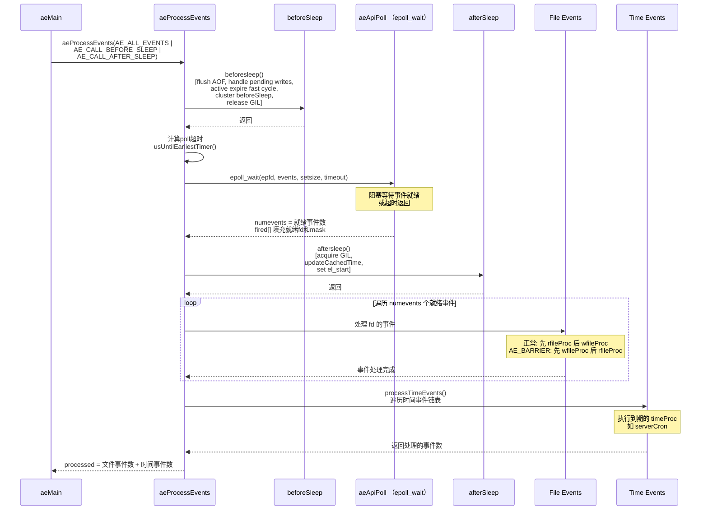

###### 2.11 epoll 包装层

**位置**: `ae_epoll.c`

Redis 的 ae 库通过条件编译选择多路复用后端，Linux 下使用 epoll。

######## aeApiState 结构 (`ae_epoll.c:13-16`)
```c
typedef struct aeApiState {
    int epfd;                      // epoll 文件描述符
    struct epoll_event *events;    // 事件数组
} aeApiState;
```

######## aeApiCreate (`ae_epoll.c:18`)
```c
static int aeApiCreate(aeEventLoop *eventLoop) {
    aeApiState *state = zmalloc(sizeof(aeApiState));
    state->events = zmalloc(sizeof(struct epoll_event) * eventLoop->setsize);
    state->epfd = epoll_create(1024);  // 1024是给内核的提示
    anetCloexec(state->epfd);          // 设置 FD_CLOEXEC
    eventLoop->apidata = state;
    return 0;
}
```

######## aeApiAddEvent (`ae_epoll.c:53`)
```c
static int aeApiAddEvent(aeEventLoop *eventLoop, int fd, int mask) {
    int op = eventLoop->events[fd].mask == AE_NONE ?
            EPOLL_CTL_ADD : EPOLL_CTL_MOD;  // 新fd用ADD, 已有用MOD

    ee.events = 0;
    mask |= eventLoop->events[fd].mask;  // 合并已有事件
    if (mask & AE_READABLE) ee.events |= EPOLLIN;
    if (mask & AE_WRITABLE) ee.events |= EPOLLOUT;
    ee.data.fd = fd;
    epoll_ctl(state->epfd, op, fd, &ee);
}
```

######## aeApiPoll (`ae_epoll.c:88`)
```c
static int aeApiPoll(aeEventLoop *eventLoop, struct timeval *tvp) {
    int retval = epoll_wait(state->epfd, state->events, eventLoop->setsize,
            tvp ? (tvp->tv_sec*1000 + (tvp->tv_usec+999)/1000) : -1);
    if (retval > 0) {
        for (j = 0; j < retval; j++) {
            int mask = 0;
            if (e->events & EPOLLIN)  mask |= AE_READABLE;
            if (e->events & EPOLLOUT) mask |= AE_WRITABLE;
            if (e->events & EPOLLERR) mask |= AE_WRITABLE | AE_READABLE;
            if (e->events & EPOLLHUP) mask |= AE_WRITABLE | AE_READABLE;
            eventLoop->fired[j].fd = e->data.fd;
            eventLoop->fired[j].mask = mask;
        }
        numevents = retval;
    }
    return numevents;
}
```

注意：`EPOLLERR` 和 `EPOLLHUP` 同时映射为可读和可写，确保错误状态被回调感知。

###### 2.12 epoll 事件流转

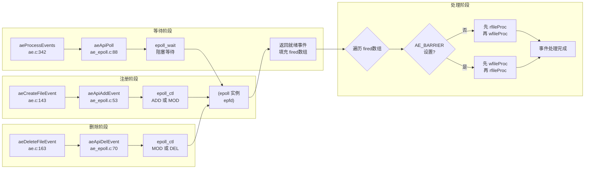

---

#### 3. 网络监听

###### 3.1 监听套接字创建

**位置**: `server.c:2803` (`initListeners`) -> `socket.c:328` (`connSocketListen`) -> `server.c:2456` (`listenToPort`)

`initListeners` 为每种连接类型（TCP、TLS、Unix Socket）创建监听器：

1. **TCP监听**: `server.port != 0` 时创建 (`server.c:2807-2816`)
2. **TLS监听**: `server.tls_port != 0` 时创建 (`server.c:2830-2839`)
3. **Unix Socket监听**: `server.unixsocket != NULL` 时创建 (`server.c:2840-2849`)

对每个监听器调用 `connListen(listener)` 进行 `bind` + `listen`，然后调用 `createSocketAcceptHandler` 注册 accept 事件处理器。

###### 3.2 createSocketAcceptHandler

**位置**: `server.c:2443`

```c
int createSocketAcceptHandler(connListener *sfd, aeFileProc *accept_handler) {
    for (j = 0; j < sfd->count; j++) {
        aeCreateFileEvent(server.el, sfd->fd[j], AE_READABLE, accept_handler, sfd);
    }
    return C_OK;
}
```

将每个监听 fd 注册到事件循环中，当有新连接到达时触发 `accept_handler`。

对于 TCP 连接，`accept_handler` 是 `connSocketAcceptHandler`（`socket.c:384` 中注册为 `.accept_handler`）。

###### 3.3 connSocketAcceptHandler -- TCP Accept 处理

**位置**: `socket.c:290`

```c
static void connSocketAcceptHandler(aeEventLoop *el, int fd, void *privdata, int mask) {
    int cport, cfd;
    int max = server.max_new_conns_per_cycle;
    char cip[NET_IP_STR_LEN];

    while(max--) {
        cfd = anetTcpAccept(server.neterr, fd, cip, sizeof(cip), &cport);
        if (cfd == ANET_ERR) {
            if (errno != EWOULDBLOCK)
                serverLog(LL_WARNING, "Accepting client connection: %s", server.neterr);
            return;
        }
        serverLog(LL_VERBOSE, "Accepted %s:%d", cip, cport);
        acceptCommonHandler(connCreateAcceptedSocket(cfd, NULL), 0, cip);
    }
}
```

关键点：
- `max_new_conns_per_cycle` 限制每次循环 accept 的连接数，避免单次循环处理过多连接导致其他事件延迟
- `anetTcpAccept` (`anet.c:634`) 封装了 `accept()` 系统调用
- `connCreateAcceptedSocket` 创建 connection 对象
- 调用 `acceptCommonHandler` 进一步处理

###### 3.4 acceptCommonHandler -- 通用 Accept 处理

**位置**: `networking.c:1318`

```c
void acceptCommonHandler(connection *conn, int flags, char *ip) {
    // 1. 检查连接状态
    if (connGetState(conn) != CONN_STATE_ACCEPTING) {
        connClose(conn);
        return;
    }

    // 2. 连接数限制检查（准入控制）
    if (listLength(server.clients) + getClusterConnectionsCount() >= server.maxclients) {
        connWrite(conn, "-ERR max number of clients reached\r\n", ...);
        server.stat_rejected_conn++;
        connClose(conn);
        return;
    }

    // 3. 创建 client 对象
    if ((c = createClient(conn)) == NULL) {
        connClose(conn);
        return;
    }

    // 4. 保留 flags
    c->flags |= flags;

    // 5. 发起 accept（对TLS可能异步）
    connAccept(conn, clientAcceptHandler);
}
```

###### 3.5 createClient -- 创建客户端对象

**位置**: `networking.c:112`

```c
client *createClient(connection *conn) {
    client *c = zmalloc(sizeof(client));

    if (conn) {
        connEnableTcpNoDelay(conn);                         // 禁用 Nagle
        if (server.tcpkeepalive)
            connKeepAlive(conn, server.tcpkeepalive);       // TCP keepalive
        connSetReadHandler(conn, readQueryFromClient);      // 注册读事件回调
        connSetPrivateData(conn, c);                        // 设置私有数据
    }

    // 初始化客户端各字段
    c->buf = zmalloc_usable(PROTO_REPLY_CHUNK_BYTES, &c->buf_usable_size);
    selectDb(c, 0);                       // 默认选择 db 0
    c->id = atomicGetIncr(server.next_client_id, 1);  // 分配客户端ID
    c->conn = conn;
    c->querybuf = sdsempty();
    c->reply = listCreate();
    // ... 大量字段初始化 ...
    initClientBlockingState(c);

    // 加入全局客户端链表
    if (conn) {
        linkClient(c);  // 添加到 server.clients 链表和 server.clients_index
    }
    return c;
}
```

关键操作：
- `connSetReadHandler(conn, readQueryFromClient)`: 底层调用 `aeCreateFileEvent` 注册 `AE_READABLE` 事件，回调为 `readQueryFromClient`
- `connEnableTcpNoDelay`: 设置 `TCP_NODELAY`，减少延迟
- `linkClient`: 将客户端添加到全局链表和索引中

###### 3.6 readQueryFromClient -- 读取客户端查询

**位置**: `networking.c:2655`

```c
void readQueryFromClient(connection *conn) {
    client *c = connGetPrivateData(conn);

    // 如果启用了 I/O 多线程，推迟读取
    if (postponeClientRead(c)) return;

    // 读取数据
    readlen = PROTO_IOBUF_LEN;  // 默认 16KB
    // 对大参数优化读取长度
    if (c->reqtype == PROTO_REQ_MULTIBULK && c->bulklen >= PROTO_MBULK_BIG_ARG) {
        readlen = remaining;
    }

    c->querybuf = sdsMakeRoomFor(c->querybuf, readlen);
    nread = connRead(c->conn, c->querybuf + qblen, readlen);

    if (nread == -1) {
        if (connGetState(conn) == CONN_STATE_CONNECTED) return;
        else { freeClientAsync(c); return; }
    }
    if (nread == 0) {
        // 客户端关闭连接
        freeClientAsync(c);
        return;
    }

    // 更新统计
    sdsIncrLen(c->querybuf, nread);
    c->lastinteraction = server.unixtime;

    // 处理查询缓冲区
    if (processInputBuffer(c) == C_ERR) return;
}
```

###### 3.7 网络连接建立与数据读取流程

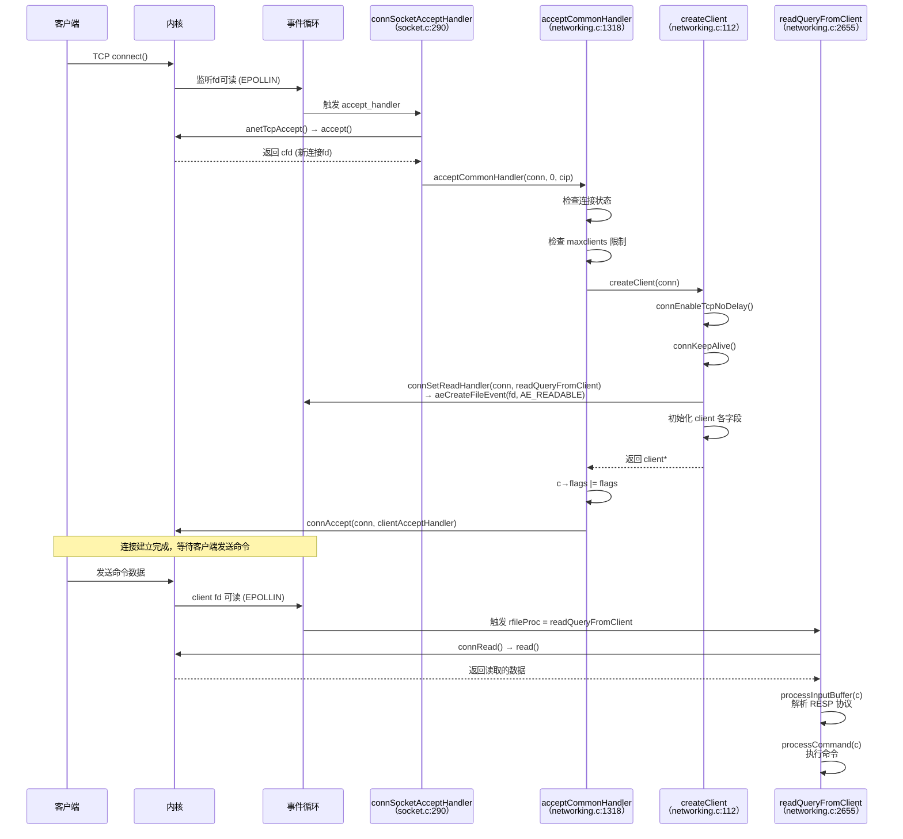

---

#### 4. serverCron 定时任务

###### 4.1 概述

**位置**: `server.c:1273`

```c
int serverCron(struct aeEventLoop *eventLoop, long long id, void *clientData) {
    // ... 各种周期性任务 ...
    return 1000/server.hz;  // 返回下次执行间隔（毫秒）
}
```

`serverCron` 是 Redis 的"心脏"，以 `server.hz` 频率（默认 10Hz，即每秒 10 次）运行。它在 `initServer` 中通过 `aeCreateTimeEvent` 注册（`server.c:2757`），初始延迟 1ms，之后每次返回 `1000/server.hz` 作为下次执行间隔。

###### 4.2 动态频率调整

**位置**: `server.c:1283-1296`

```c
server.hz = server.config_hz;
if (server.dynamic_hz) {
    while (listLength(server.clients) / server.hz > MAX_CLIENTS_PER_CLOCK_TICK) {
        server.hz *= 2;
        if (server.hz > CONFIG_MAX_HZ) { server.hz = CONFIG_MAX_HZ; break; }
    }
}
```

`dynamic_hz` 启用后，客户端数量多时自动提高 cron 频率，确保每个客户端能在合理时间内被 `clientsCron` 处理。`MAX_CLIENTS_PER_CLOCK_TICK` 默认 200。

###### 4.3 监控指标收集

**位置**: `server.c:1303-1325`

每 100ms 执行一次（`run_with_period(100)`），收集瞬时指标：
- `STATS_METRIC_COMMAND`: 命令执行速率
- `STATS_METRIC_NET_INPUT`: 网络输入字节速率
- `STATS_METRIC_NET_OUTPUT`: 网络输出字节速率
- `STATS_METRIC_NET_INPUT_REPLICATION`: 复制输入速率
- `STATS_METRIC_NET_OUTPUT_REPLICATION`: 复制输出速率
- `STATS_METRIC_EL_CYCLE`: 事件循环周期数
- `STATS_METRIC_EL_DURATION`: 事件循环耗时

###### 4.4 LRU 时钟更新

**位置**: `server.c:1338`

```c
server.lruclock = getLRUClock();
```

更新全局 LRU 时钟，用于对象访问时间的近似记录。

###### 4.5 内存统计

**位置**: `server.c:1340`

```c
cronUpdateMemoryStats();
```

更新峰值内存、COW（Copy-On-Write）内存、客户端内存使用等统计信息。

###### 4.6 优雅关闭处理

**位置**: `server.c:1344-1357`

```c
if (server.shutdown_asap && !isShutdownInitiated()) {
    int shutdownFlags = SHUTDOWN_NOFLAGS;
    if (server.last_sig_received == SIGINT && server.shutdown_on_sigint)
        shutdownFlags = server.shutdown_on_sigint;
    else if (server.last_sig_received == SIGTERM && server.shutdown_on_sigterm)
        shutdownFlags = server.shutdown_on_sigterm;
    if (prepareForShutdown(shutdownFlags) == C_OK) exit(0);
}
```

在信号处理器中只设置标志位 `server.shutdown_asap`，实际关闭操作在 `serverCron` 中安全执行。

###### 4.7 clientsCron -- 客户端维护

**位置**: `server.c:986` (调用于 `server.c:1387`)

```c
void clientsCron(void) {
    int numclients = listLength(server.clients);
    int iterations = numclients / server.hz;  // 每次处理一部分客户端
    if (iterations < CLIENTS_CRON_MIN_ITERATIONS)
        iterations = (numclients < CLIENTS_CRON_MIN_ITERATIONS) ?
                     numclients : CLIENTS_CRON_MIN_ITERATIONS;

    while(listLength(server.clients) && iterations--) {
        head = listFirst(server.clients);
        c = listNodeValue(head);
        listRotateHeadToTail(server.clients);  // 轮转确保公平

        clientsCronHandleTimeout(c, now);      // 超时客户端关闭
        clientsCronResizeQueryBuffer(c);       // 查询缓冲区缩放
        clientsCronResizeOutputBuffer(c, now);  // 输出缓冲区缩放
        clientsCronTrackExpansiveClients(c, ...); // 追踪高内存客户端
        updateClientMemUsageAndBucket(c);      // 更新客户端内存使用
        closeClientOnOutputBufferLimitReached(c, 0); // 输出缓冲区限制检查
    }
}
```

###### 4.8 databasesCron -- 数据库维护

**位置**: `server.c:1054` (调用于 `server.c:1390`)

```c
void databasesCron(void) {
    // 1. 主动过期：随机采样删除过期键
    if (server.active_expire_enabled) {
        if (iAmMaster())
            activeExpireCycle(ACTIVE_EXPIRE_CYCLE_SLOW);  // 慢速周期
        else
            expireSlaveKeys();
    }

    // 2. 主动碎片整理
    activeDefragCycle();

    // 3. 哈希表 resize 和 rehash（仅当无子进程时）
    if (!hasActiveChildProcess()) {
        // 增量 resize
        for (j = 0; j < dbs_per_call; j++) {
            kvstoreTryResizeDicts(db->keys, CRON_DICTS_PER_DB);
            kvstoreTryResizeDicts(db->expires, CRON_DICTS_PER_DB);
        }
        // 增量 rehash（时间限制 INCREMENTAL_REHASHING_THRESHOLD_US）
        if (server.activerehashing) {
            for (j = 0; j < dbs_per_call; j++) {
                kvstoreIncrementallyRehash(db->keys, ...);
                kvstoreIncrementallyRehash(db->expires, ...);
            }
        }
    }
}
```

######## activeExpireCycle 两种模式：
- `ACTIVE_EXPIRE_CYCLE_SLOW`: 在 `databasesCron` 中调用，默认模式，较温和
- `ACTIVE_EXPIRE_CYCLE_FAST`: 在 `beforeSleep` 中调用，快速检查，仅在内存压力时执行有效工作

###### 4.9 BGSAVE / AOF Rewrite 自动触发

**位置**: `server.c:1394-1444`

```c
// 如果有挂起的AOF重写请求且无子进程，执行AOF重写
if (!hasActiveChildProcess() && server.aof_rewrite_scheduled && !aofRewriteLimited()) {
    rewriteAppendOnlyFileBackground();
}

// 检查子进程是否完成
if (hasActiveChildProcess()) {
    run_with_period(1000) receiveChildInfo();
    checkChildrenDone();
} else {
    // RDB自动保存：检查save规则
    for (j = 0; j < server.saveparamslen; j++) {
        struct saveparam *sp = server.saveparams + j;
        if (server.dirty >= sp->changes &&
            server.unixtime - server.lastsave > sp->seconds &&
            (server.unixtime - server.lastbgsave_try > CONFIG_BGSAVE_RETRY_DELAY ||
             server.lastbgsave_status == C_OK))
        {
            rdbSaveBackground(SLAVE_REQ_NONE, server.rdb_filename, rsiptr, RDBFLAGS_NONE);
            break;
        }
    }

    // AOF自动重写：检查增长率
    if (server.aof_state == AOF_ON &&
        server.aof_current_size > server.aof_rewrite_min_size)
    {
        long long growth = (server.aof_current_size * 100 / base) - 100;
        if (growth >= server.aof_rewrite_perc && !aofRewriteLimited()) {
            rewriteAppendOnlyFileBackground();
        }
    }
}
```

###### 4.10 复制 Cron

**位置**: `server.c:1478-1482`

```c
if (server.failover_state != NO_FAILOVER) {
    run_with_period(100) replicationCron();   // 故障转移时更快
} else {
    run_with_period(1000) replicationCron();  // 正常1秒一次
}
```

`replicationCron` 处理：
- 主从连接重连
- 全量同步检测与启动
- 部分重同步判断
- 心跳发送

###### 4.11 集群心跳

**位置**: `server.c:1485-1487`

```c
run_with_period(100) {
    if (server.cluster_enabled) clusterCron();
}
```

每 100ms 执行一次 `clusterCron`，处理集群节点间的心跳、故障检测、集群总线消息等。

###### 4.12 serverCron 完整任务列表

| 任务 | 位置 (server.c) | 频率/周期 | 说明 |
|------|-----------------|-----------|------|
| 软件看门狗 | 1281 | 每次cron | watchdogScheduleSignal |
| 动态hz调整 | 1283-1296 | 每次cron | 根据客户端数调整频率 |
| 瞬时指标收集 | 1303-1325 | 100ms | 命令/网络/EL指标 |
| LRU时钟更新 | 1338 | 每次cron | getLRUClock |
| 内存统计更新 | 1340 | 每次cron | cronUpdateMemoryStats |
| 优雅关闭 | 1344-1357 | 每次cron | 检查 shutdown_asap |
| 数据库日志 | 1361-1372 | 5000ms | VERBOSE级别输出DB信息 |
| 客户端日志 | 1377-1383 | 5000ms | DEBUG级别输出客户端信息 |
| clientsCron | 1387 | 每次cron | 客户端超时/缓冲区管理 |
| databasesCron | 1390 | 每次cron | 过期/rehash/defrag |
| AOF重写触发 | 1394-1398 | 每次cron | 挂起的AOF重写 |
| 子进程检查 | 1402-1405 | 1000ms | BGSAVE/AOF完成检查 |
| RDB自动保存 | 1409-1428 | 每次cron | 根据save规则 |
| AOF自动重写 | 1432-1444 | 每次cron | 根据增长率 |
| 字典resize策略 | 1448 | 每次cron | updateDictResizePolicy |
| AOF推迟flush | 1452-1456 | 每次cron | flushAppendOnlyFile |
| AOF写错误重试 | 1462-1468 | 1000ms | flushAppendOnlyFile |
| 暂停操作更新 | 1471 | 每次cron | updatePausedActions |
| 复制cron | 1478-1482 | 100/1000ms | replicationCron |
| 集群cron | 1485-1487 | 100ms | clusterCron |
| Sentinel定时器 | 1490 | 每次cron | sentinelTimer |
| MIGRATE缓存清理 | 1493-1495 | 1000ms | migrateCloseTimedoutSockets |
| 停止空闲IO线程 | 1498 | 每次cron | stopThreadedIOIfNeeded |
| Tracking表resize | 1504 | 每次cron | trackingLimitUsedSlots |
| 计划BGSAVE | 1513-1522 | 每次cron | rdb_bgsave_scheduled |
| 模块cron | 1525 | 100ms | modulesCron |
| 模块cron事件 | 1530-1532 | 每次cron | moduleFireServerEvent |
| 返回间隔 | 1538 | - | return 1000/server.hz |

---

#### 5. beforeSleep 关键工作

###### 5.1 概述

**位置**: `server.c:1637`

`beforeSleep` 是 Redis 事件循环中最重要的回调之一，在每次 `aeApiPoll` 之前调用。它负责在进入睡眠等待前完成所有"必须先做"的工作，确保数据一致性、及时响应客户端、以及触发各种后台操作。

###### 5.2 完整执行流程

```c
void beforeSleep(struct aeEventLoop *eventLoop) {
    // 1. 更新峰值内存
    size_t zmalloc_used = zmalloc_used_memory();
    if (zmalloc_used > server.stat_peak_memory)
        server.stat_peak_memory = zmalloc_used;

    // 2. 如果在 processEventsWhileBlocked 中重入，执行精简版
    if (ProcessingEventsWhileBlocked) {
        processed += handleClientsWithPendingReadsUsingThreads();
        processed += connTypeProcessPendingData();
        if (server.aof_state == AOF_ON || server.aof_state == AOF_WAIT_REWRITE)
            flushAppendOnlyFile(0);
        processed += handleClientsWithPendingWrites();
        processed += freeClientsInAsyncFreeQueue();
        return;
    }

    // 3. 处理待读客户端（I/O多线程）
    handleClientsWithPendingReadsUsingThreads();

    // 4. 处理连接层待处理数据（如TLS）
    connTypeProcessPendingData();

    // 5. 检查是否有待处理数据，决定是否跳过sleep
    int dont_sleep = connTypeHasPendingData();

    // 6. 集群 beforeSleep
    if (server.cluster_enabled) clusterBeforeSleep();

    // 7. 处理阻塞客户端（必须在flushAppendOnlyFile之前）
    blockedBeforeSleep();

    // 8. 快速过期周期
    if (server.active_expire_enabled && iAmMaster())
        activeExpireCycle(ACTIVE_EXPIRE_CYCLE_FAST);

    // 9. 模块事件通知
    if (moduleCount())
        moduleFireServerEvent(REDISMODULE_EVENT_EVENTLOOP,
                              REDISMODULE_SUBEVENT_EVENTLOOP_BEFORE_SLEEP, NULL);

    // 10. 向从节点发送ACK请求
    if (server.get_ack_from_slaves && !isPausedActionsWithUpdate(PAUSE_ACTION_REPLICA)) {
        sendGetackToReplicas();
        server.get_ack_from_slaves = 0;
    }

    // 11. 故障转移状态更新
    updateFailoverStatus();

    // 12. 客户端缓存失效广播
    trackingBroadcastInvalidationMessages();

    // 13. AOF写入（必须在 handleClientsWithPendingWritesUsingThreads 之前）
    if (server.aof_state == AOF_ON || server.aof_state == AOF_WAIT_REWRITE)
        flushAppendOnlyFile(0);

    // 14. 更新 fsynced_reploff（用于 WAITAOF 命令）
    if (server.aof_state == AOF_ON && server.fsynced_reploff != -1) {
        long long fsynced_reploff_pending;
        atomicGet(server.fsynced_reploff_pending, fsynced_reploff_pending);
        server.fsynced_reploff = fsynced_reploff_pending;
        if (listLength(server.clients_waiting_acks) &&
            prev_fsynced_reploff != server.fsynced_reploff)
            dont_sleep = 1;  // 有等待ACK的客户端，不sleep
    }

    // 15. 处理待写客户端（I/O多线程）
    handleClientsWithPendingWritesUsingThreads();

    // 16. 异步释放客户端队列
    freeClientsInAsyncFreeQueue();

    // 17. 增量修剪复制积压缓冲区（10倍速）
    if (server.repl_backlog)
        incrementalTrimReplicationBacklog(10 * REPL_BACKLOG_TRIM_BLOCKS_PER_CALL);

    // 18. 客户端内存驱逐
    evictClients();

    // 19. 记录事件循环延迟和命令计数
    if (server.el_start > 0) {
        monotime el_duration = getMonotonicUs() - server.el_start;
        durationAddSample(EL_DURATION_TYPE_EL, el_duration);
    }

    // 20. 设置不等待标志（如有待处理数据）
    aeSetDontWait(server.el, dont_sleep);

    // 21. 释放模块GIL（让模块线程可以访问数据集）
    if (moduleCount()) moduleReleaseGIL();
}
```

###### 5.3 关键设计要点

######## 5.3.1 执行顺序的重要性

1. **`blockedBeforeSleep()` 必须在 `flushAppendOnlyFile()` 之前**：因为解除阻塞的客户端可能产生新的写操作，需要先处理这些客户端，再写入 AOF。

2. **`flushAppendOnlyFile()` 必须在 `handleClientsWithPendingWritesUsingThreads()` 之前**：当 `appendfsync=always` 时，需要先确保数据持久化到磁盘，再回复客户端。

3. **`moduleReleaseGIL()` 必须最后执行**：释放 GIL 后，模块线程可以访问数据集，Redis 主线程在此之后不能操作任何数据。

######## 5.3.2 重入处理

当 `ProcessingEventsWhileBlocked` 为真时（如加载 RDB/AOF 时调用 `processEventsWhileBlocked`），`beforeSleep` 执行精简版本，只处理最关键的操作，避免递归和性能问题。

######## 5.3.3 dont_sleep 机制

以下情况设置 `dont_sleep`，使下次 `aeProcessEvents` 不等待：
- TLS 等连接层有待处理数据
- 有等待 AOF ACK 的客户端且 `fsynced_reploff` 已更新

###### 5.4 afterSleep 回调

**位置**: `server.c:1808`

```c
void afterSleep(struct aeEventLoop *eventLoop) {
    // 1. 获取模块 GIL（必须最先执行）
    if (!ProcessingEventsWhileBlocked) {
        if (moduleCount()) {
            moduleAcquireGIL();
            moduleFireServerEvent(REDISMODULE_EVENT_EVENTLOOP,
                                  REDISMODULE_SUBEVENT_EVENTLOOP_AFTER_SLEEP, NULL);
        }
        // 2. 设置事件循环开始时间
        server.el_start = getMonotonicUs();
        // 3. 设置事件循环命令计数起始值
        server.el_cmd_cnt_start = server.stat_numcommands;
    }
    // 4. 更新时间缓存
    updateCachedTime(1);
    // 5. 更新命令时间快照
    if (!ProcessingEventsWhileBlocked)
        server.cmd_time_snapshot = server.mstime;
}
```

`afterSleep` 与 `beforeSleep` 形成对称：
- `beforeSleep` 最后释放 GIL
- `afterSleep` 最先获取 GIL

---

#### 6. 整体启动时序图

###### 6.1 启动流程时序图

```mermaid
sequenceDiagram
    participant OS as 操作系统
    participant Main as main（）
    participant Config as initServerConfig
    participant Server as initServer
    participant Listener as initListeners
    participant Last as InitServerLast
    participant Data as loadDataFromDisk
    participant EL as aeMain
    participant Cron as serverCron
    participant BS as beforeSleep
    participant Poll as epoll_wait
    participant AS as afterSleep
    participant Handler as 事件处理器

    OS->>Main: 启动 redis-server

    Main->>Main: tzset(), srand(), crc64_init()
    Main->>Main: dictSetHashFunctionSeed()

    Main->>Config: initServerConfig()
    Note over Config: 设置默认配置<br/>runid, hz, bindaddr<br/>save规则, 复制参数
    Config-->>Main: 完成

    Main->>Main: ACLInit()
    Main->>Main: moduleInitModulesSystem()
    Main->>Main: connTypeInitialize()

    Main->>Main: 解析命令行参数
    Main->>Main: loadServerConfig(configfile, options)
    Note over Main: 配置优先级:<br/>命令行 > stdin > 配置文件 > 默认

    Main->>Main: 系统检查<br/>linuxMemoryWarnings, etc.
    Main->>Main: daemonize() (可选)

    Main->>Server: initServer()
    Note over Server: 1. 信号处理 (SIG_IGN SIGPIPE)<br/>2. 创建客户端/从节点链表<br/>3. aeCreateEventLoop(maxclients+FDSET_INCR)<br/>4. 创建数据库 (keys/expires/blocking_keys)<br/>5. 创建 pubsub 字典<br/>6. aeCreateTimeEvent(serverCron, 1ms)<br/>7. aeCreateFileEvent(module_pipe)<br/>8. aeSetBeforeSleepProc(beforeSleep)<br/>9. aeSetAfterSleepProc(afterSleep)<br/>10. scriptingInit(), functionsInit()<br/>11. slowlogInit(), latencyMonitorInit()
    Server-->>Main: 完成

    Main->>Main: createPidFile()
    Main->>Main: redisSetProcTitle()
    Main->>Main: redisAsciiArt()

    Main->>Main: clusterInit() (如果启用)
    Main->>Main: moduleLoadFromQueue()
    Main->>Main: ACLLoadUsersAtStartup()

    Main->>Listener: initListeners()
    Note over Listener: 为TCP/TLS/Unix创建监听:<br/>1. connListen() → bind + listen<br/>2. createSocketAcceptHandler()<br/>   → aeCreateFileEvent(fd, AE_READABLE,<br/>     connSocketAcceptHandler)
    Listener-->>Main: 完成

    Main->>Last: InitServerLast()
    Note over Last: bioInit() → 后台线程<br/>initThreadedIO() → I/O线程<br/>set_jemalloc_bg_thread()
    Last-->>Main: 完成

    Main->>Data: loadDataFromDisk()
    Note over Data: AOF模式: loadAppendOnlyFiles()<br/>RDB模式: rdbLoad()<br/>恢复复制ID和offset
    Data-->>Main: 完成

    Main->>Main: aofOpenIfNeededOnServerStart()
    Main->>Main: redisSetCpuAffinity()
    Main->>Main: setOOMScoreAdj(-1)

    Main->>EL: aeMain(server.el)

    loop 事件循环 (直到 stop=1)
        EL->>BS: beforeSleep()
        Note over BS: 1. 更新峰值内存<br/>2. handleClientsWithPendingReads<br/>3. connTypeProcessPendingData<br/>4. clusterBeforeSleep<br/>5. blockedBeforeSleep<br/>6. activeExpireCycle(FAST)<br/>7. flushAppendOnlyFile<br/>8. handleClientsWithPendingWrites<br/>9. freeClientsInAsyncFreeQueue<br/>10. incrementalTrimReplicationBacklog<br/>11. evictClients<br/>12. moduleReleaseGIL

        EL->>Poll: epoll_wait(timeout)
        Note over Poll: 计算超时:<br/>usUntilEarliestTimer()<br/>→ 最早时间事件的时间差

        Poll-->>EL: 返回就绪事件数

        EL->>AS: afterSleep()
        Note over AS: 1. moduleAcquireGIL<br/>2. 设置 el_start<br/>3. updateCachedTime

        EL->>Handler: 处理文件事件
        Note over Handler: 遍历 fired[] 数组:<br/>先 rfileProc 后 wfileProc<br/>(AE_BARRIER则反转)

        EL->>Cron: processTimeEvents()
        Note over Cron: 遍历时间事件链表:<br/>执行到期的 timeProc<br/>如 serverCron
    end

    EL-->>Main: 退出循环
    Main->>Main: aeDeleteEventLoop()
    Main->>Main: return 0
```

###### 6.2 事件循环处理流程图

```mermaid
flowchart TD
    A[aeMain 循环开始] --> B["aeProcessEvents<br/>flags = ALL_EVENTS |<br/>CALL_BEFORE_SLEEP |<br/>CALL_AFTER_SLEEP"]

    B --> C{有文件事件<br/>或时间事件?}
    C -->|否| Z[返回 0]
    C -->|是| D{beforesleep != NULL<br/>且 CALL_BEFORE_SLEEP?}

    D -->|是| E[调用 beforeSleep<br/>server.c:1637]
    D -->|否| F[计算 poll 超时]

    E --> F

    F --> G{AE_DONT_WAIT<br/>设置?}
    G -->|是| H[超时 = 0<br/>立即返回]
    G -->|否| I{有时间事件?}

    I -->|是| J["usUntilEarliestTimer<br/>O(N)遍历时间事件链表<br/>计算最早事件的时间差"]
    I -->|否| K[超时 = NULL<br/>无限等待]

    J --> L{"usUntilTimer >= 0?"}
    L -->|是| M[设置超时 = usUntilTimer]
    L -->|否| K

    H --> N
    M --> N
    K --> N

    N[aeApiPoll<br/>epoll_wait] --> O{aftersleep != NULL<br/>且 CALL_AFTER_SLEEP?}

    O -->|是| P[调用 afterSleep<br/>server.c:1808<br/>acquireGIL, updateCachedTime]
    O -->|否| Q[遍历就绪文件事件]

    P --> Q

    Q --> R{"numevents > 0?"}
    R -->|是| S[遍历 fired 数组]
    R -->|否| U

    S --> T{当前fd的<br/>AE_BARRIER设置?}
    T -->|否| T1[先执行 rfileProc<br/>再执行 wfileProc]
    T -->|是| T2[先执行 wfileProc<br/>再执行 rfileProc]

    T1 --> U{AE_TIME_EVENTS<br/>设置?}
    T2 --> U

    U -->|是| V[processTimeEvents<br/>遍历时间事件链表<br/>执行到期的 timeProc]
    U -->|否| W[返回 processed]

    V --> W
    W --> X{stop == 0?}
    X -->|是| A
    X -->|否| Y[退出 aeMain]
```

###### 6.3 核心组件关系图

```mermaid
flowchart TB
    subgraph 事件循环核心
        AE[aeEventLoop]
        FE[aeFileEvent 数组<br/>按fd索引]
        TE[aeTimeEvent 链表]
        FI[aeFiredEvent 数组]
    end

    subgraph epoll后端
        ES[aeApiState<br/>epfd + events数组]
        EC[epoll_ctl<br/>ADD/MOD/DEL]
        EW[epoll_wait<br/>阻塞等待]
    end

    subgraph Redis服务器
        SC[serverCron<br/>时间事件]
        BS[beforeSleep<br/>睡眠前回调]
        AS[afterSleep<br/>睡眠后回调]
        ATH[connSocketAcceptHandler<br/>TCP Accept]
        RQF[readQueryFromClient<br/>读取命令]
        SCH[sendReplyToClient<br/>发送回复]
    end

    subgraph 客户端
        CL[client 链表<br/>server.clients]
        CPW[待写客户端<br/>clients_pending_write]
        CPR[待读客户端<br/>clients_pending_read]
    end

    subgraph 持久化
        AOF[flushAppendOnlyFile<br/>AOF写入]
        RDB[rdbSaveBackground<br/>RDB后台保存]
    end

    AE --> FE
    AE --> TE
    AE --> FI
    AE --> ES

    EC --> FE
    EW --> FI

    TE --> SC

    AE --> BS
    AE --> AS

    FE --> ATH
    FE --> RQF
    FE --> SCH

    ATH --> CL
    RQF --> CPW
    RQF --> CPR

    BS --> AOF
    BS --> CPW
    BS --> CPR

    SC --> RDB
```

---

#### 总结

Redis 7.4.0 的启动与事件循环机制体现了以下设计哲学：

1. **单线程事件驱动**：通过 epoll 实现非阻塞 I/O 多路复用，单线程处理所有客户端请求，避免锁竞争和上下文切换开销。

2. **文件事件优先于时间事件**：`aeProcessEvents` 先处理文件事件，再处理时间事件，确保客户端请求得到最快响应。`serverCron` 的延迟不会影响请求处理，但请求处理过慢会影响 cron 的执行频率。

3. **beforeSleep/afterSleep 配对**：`beforeSleep` 在 poll 前完成所有"必须先做"的工作（AOF写入、客户端回复、过期检查等），`afterSleep` 在 poll 后完成"醒来"工作（获取GIL、更新时间）。两者形成对称的"睡前-醒来"模式。

4. **增量式后台任务**：过期键删除、哈希表 rehash、客户端超时检查等都采用增量方式在 `serverCron` 和 `beforeSleep` 中逐步完成，避免阻塞事件循环。

5. **AE_BARRIER 机制**：提供了对读写事件处理顺序的精细控制，支持"先持久化再回复"的场景。

6. **动态频率调整**：`dynamic_hz` 根据客户端数量自动调整 cron 频率，在高并发场景下保证客户端能得到及时处理。

---

## 四、命令处理流程与网络层

## Redis 7.4.0 命令处理与网络层深度分析

> 源码位置：`D:/workspace/java_projects/source_projects/redis-7.4.0/src/`
> 协议许可：RSALv2 / SSPL（开源代码，本文件仅做行为分析，不修改源码）

本文件分析 Redis 7.4.0 的命令处理流程与网络层实现，涵盖 RESP 协议、客户端结构、命令接收、命令查找与执行、命令分发机制、回复客户端、Pipeline 与 MULTIBULK，以及常用命令处理流程。

---

#### 目录

1. [RESP 协议（networking.c）](#1-resp-协议networkingc)
2. [客户端结构 client（server.h）](#2-客户端结构-clientserverh)
3. [命令接收流程（networking.c）](#3-命令接收流程networkingc)
4. [命令查找与执行（server.c）](#4-命令查找与执行serverc)
5. [命令分发实现（commands/ 目录、commands.def、commands.c）](#5-命令分发实现commands-目录commandsdefcommandsc)
6. [回复客户端（networking.c）](#6-回复客户端networkingc)
7. [Pipeline 与 MULTIBULK](#7-pipeline-与-multibulk)
8. [常用命令处理流程举例](#8-常用命令处理流程举例)
9. [完整流程时序图](#9-完整流程时序图)

---

#### 1. RESP 协议（networking.c）

###### 1.1 RESP2 / RESP3 协议格式

Redis Serialization Protocol（RESP）是 Redis 客户端与服务端之间的通信协议。Redis 7.4.0 同时支持 RESP2 和 RESP3（通过 `HELLO` 命令协商）。

客户端的 RESP 版本存储在 `client.resp` 字段（`server.h:1161`），取值为 2 或 3。`createClient()` 中默认设为 2（`networking.c:135`）。

######## RESP 协议类型总览

```mermaid
graph TD
    ROOT["RESP 协议类型"]
    R2["RESP2 类型"]
    R3["RESP3 新增类型"]

    ROOT --> R2
    ROOT --> R3

    R2 --> SS["+ Simple Strings<br/>+OK\r\n"]
    R2 --> ER["- Errors<br/>-ERR msg\r\n"]
    R2 --> IN[": Integers<br/>:1000\r\n"]
    R2 --> BS["$ Bulk Strings<br/>$5\r\nhello\r\n"]
    R2 --> AR["* Arrays<br/>*2\r\n..."]
    R2 --> NULL["$-1\r\n / *-1\r\n<br/>Null"]

    R3 --> MAP["% Map<br/>%2\r\nkey1\r\nval1\r\n..."]
    R3 --> SET["~ Set<br/>~3\r\na\r\nb\r\nc\r\n"]
    R3 --> PUSH["> Push<br/>>2\r\n..."]
    R3 --> BIG["( Big Number<br/>(12345678901234567890\r\n"]
    R3 --> BL["# Boolean<br/>#t\r\n / #f\r\n"]
    R3 --> NULL3["_ Null<br/>_\r\n"]
    R3 --> DBL[", Double<br/>,3.14\r\n"]
    R3 --> ATTR["| Attribute<br/>|1\r\n..."]
```

######## 各类型实现位置

| 类型 | 前缀 | 回复函数 | 位置 |
|------|------|---------|------|
| Simple String | `+` | `addReplyStatusLength()` | `networking.c:676` |
| Error | `-` | `addReplyErrorLength()` | `networking.c:479` |
| Integer | `:` | `addReplyLongLong()` / `_addReplyLongLongWithPrefix()` | `networking.c:932, 962` |
| Bulk String | `$` | `addReplyBulk()` / `addReplyBulkCBuffer()` | `networking.c:1041, 1048` |
| Array | `*` | `addReplyArrayLen()` | `networking.c:979` |
| Map | `%`（RESP3）/ `*`（RESP2） | `addReplyMapLen()` | `networking.c:983` |
| Set | `~`（RESP3）/ `*`（RESP2） | `addReplySetLen()` | `networking.c:989` |
| Push | `>` | `addReplyPushLen()` | `networking.c:999` |
| Boolean | `#`（RESP3）/ `:0/:1`（RESP2） | `addReplyBool()` | `networking.c:1013` |
| Null | `_`（RESP3）/ `$-1`（RESP2） | `addReplyNull()` | `networking.c:1005` |
| Big Number | `(` | `addReplyBigNum()` | `networking.c:903` |
| Double | `,` | `addReplyDouble()` | `networking.c:868` |
| Attribute | `|` | `addReplyAttributeLen()` | `networking.c:994` |

######## 关键代码逻辑

**Simple String** (`networking.c:676-680`)：
```c
void addReplyStatusLength(client *c, const char *s, size_t len) {
    addReplyProto(c,"+",1);
    addReplyProto(c,s,len);
    addReplyProto(c,"\r\n",2);
}
```

**Error** (`networking.c:479-485`)：以 `-` 开头，若未提供错误码则自动补 `-ERR `。

**Integer** (`networking.c:932-959`)：`_addReplyLongLongWithPrefix()` 根据前缀字符（`:`、`*`、`$`、`%`、`~`）拼接数字和 `\r\n`。对 0 和 1 使用共享对象 `shared.czero` / `shared.cone` 优化。

**Bulk String** (`networking.c:1041-1045`)：先发送 `$len\r\n`，再发送内容，最后 `\r\n`。

**Map/Set（RESP3 适配）** (`networking.c:983-991`)：`addReplyMapLen()` 根据 `c->resp` 选择前缀 `%`（RESP3）或 `*`（RESP2，且长度 x2 因为 RESP2 用扁平数组表示 Map）。

###### 1.2 客户端缓冲区

Redis 客户端使用三套缓冲区：

| 缓冲区 | 字段 | 位置 | 说明 |
|--------|------|------|------|
| **输入缓冲区** | `querybuf` | `server.h:1166` | SDS 字符串，累积客户端发来的数据 |
| **固定输出缓冲区** | `buf` + `bufpos` | `server.h:1274-1276` | 16KB 固定缓冲（`PROTO_REPLY_CHUNK_BYTES`），优先写入此处 |
| **动态输出列表** | `reply` + `reply_bytes` | `server.h:1185-1186` | `list` 结构，当 `buf` 不够时溢出到此列表 |

**输入缓冲区管理**：
- `qb_pos`（`server.h:1167`）记录已解析位置
- `querybuf_peak`（`server.h:1168`）记录峰值，用于收缩
- 最大限制：`server.client_max_querybuf_len`（`networking.c:2744`），未认证客户端限制 1MB
- 解析后通过 `sdsrange()` 修剪（`networking.c:2642`）

**输出缓冲区策略** (`networking.c:387-419`)：
1. `_addReplyToBuffer()` 尝试写入固定 `buf`（`networking.c:323`）
2. 仅当 `reply` 列表为空时才能写入 `buf`（避免乱序）
3. 写不下的部分通过 `_addReplyProtoToList()` 追加到 `reply` 列表（`networking.c:341`）
4. `_addReplyToBufferOrList()` 是统一入口（`networking.c:387`）

**输出缓冲区限制**：通过 `closeClientOnOutputBufferLimitReached()` 检查，超过限制时关闭客户端。

###### 1.3 客户端类型

定义于 `server.h:418-421`：

| 类型 | 宏 | 值 | 说明 |
|------|-----|---|------|
| 普通客户端 | `CLIENT_TYPE_NORMAL` | 0 | 普通 req-reply 客户端 + MONITOR |
| 从节点 | `CLIENT_TYPE_SLAVE` | 1 | 副本客户端 |
| PubSub 客户端 | `CLIENT_TYPE_PUBSUB` | 2 | 订阅了 PubSub 频道的客户端 |
| 主节点 | `CLIENT_TYPE_MASTER` | 3 | 主节点（用于复制链路） |

客户端 flags 定义于 `server.h:322-366`，使用位掩码，关键 flags 包括：

| Flag | 值 | 说明 |
|------|---|------|
| `CLIENT_SLAVE` | `1<<0` | 此客户端是副本 |
| `CLIENT_MASTER` | `1<<1` | 此客户端是主节点 |
| `CLIENT_MONITOR` | `1<<2` | MONITOR 模式 |
| `CLIENT_MULTI` | `1<<3` | 在 MULTI 事务中 |
| `CLIENT_BLOCKED` | `1<<4` | 阻塞等待中 |
| `CLIENT_PUBSUB` | `1<<18` | PubSub 模式 |
| `CLIENT_PENDING_WRITE` | `1<<21` | 有待写入的回复 |
| `CLIENT_PENDING_COMMAND` | `1<<30` | 有待执行的已解析命令 |
| `CLIENT_TRACKING` | `1<<31` | 启用了客户端缓存追踪 |

---

#### 2. 客户端结构 client（server.h）

`client` 结构体定义于 `server.h:1157-1280`，是 Redis 中最核心的数据结构之一。

###### 2.1 关键字段分组

######## 身份与连接
| 字段 | 类型 | 位置 | 说明 |
|------|------|------|------|
| `id` | `uint64_t` | 1158 | 客户端唯一递增 ID |
| `flags` | `uint64_t` | 1159 | 客户端标志位（CLIENT_* 宏） |
| `conn` | `connection*` | 1160 | 连接对象 |
| `resp` | `int` | 1161 | RESP 协议版本（2 或 3） |
| `db` | `redisDb*` | 1162 | 当前 SELECTed 数据库指针 |
| `name` | `robj*` | 1163 | CLIENT SETNAME 设置的名称 |

######## 命令参数
| 字段 | 类型 | 位置 | 说明 |
|------|------|------|------|
| `argc` | `int` | 1169 | 当前命令参数数量 |
| `argv` | `robj**` | 1170 | 当前命令参数数组 |
| `argv_len` | `int` | 1171 | argv 数组容量（可能大于 argc） |
| `original_argc` | `int` | 1172 | 原始命令参数数（被改写时保留原始） |
| `original_argv` | `robj**` | 1173 | 原始命令参数（改写时保留） |
| `argv_len_sum` | `size_t` | 1174 | argv 中所有对象长度总和 |
| `cmd` | `redisCommand*` | 1175 | 当前要执行的命令 |
| `lastcmd` | `redisCommand*` | 1175 | 上一次执行的命令 |
| `realcmd` | `redisCommand*` | 1176 | 实际执行的原始命令（GEOADD 等可能改写 cmd） |

######## 输入缓冲与解析状态
| 字段 | 类型 | 位置 | 说明 |
|------|------|------|------|
| `querybuf` | `sds` | 1166 | 输入缓冲区 |
| `qb_pos` | `size_t` | 1167 | querybuf 中已解析位置 |
| `querybuf_peak` | `size_t` | 1168 | querybuf 峰值大小 |
| `reqtype` | `int` | 1182 | 请求协议类型（INLINE / MULTIBULK） |
| `multibulklen` | `int` | 1183 | 多批量请求中剩余未读的参数个数 |
| `bulklen` | `long` | 1184 | 当前正在读取的批量参数长度 |

######## 输出缓冲
| 字段 | 类型 | 位置 | 说明 |
|------|------|------|------|
| `reply` | `list*` | 1185 | 动态输出回复列表 |
| `reply_bytes` | `unsigned long long` | 1186 | reply 列表中的总字节数 |
| `sentlen` | `size_t` | 1188 | 当前正在发送的缓冲区/对象已发送字节数 |
| `bufpos` | `int` | 1274 | 固定输出缓冲区已用位置 |
| `buf_usable_size` | `size_t` | 1275 | 固定缓冲区可用大小 |
| `buf` | `char*` | 1276 | 固定输出缓冲区指针 |

######## 认证与 ACL
| 字段 | 类型 | 位置 | 说明 |
|------|------|------|------|
| `user` | `user*` | 1179 | 关联的用户 |
| `authenticated` | `int` | 1196 | 是否已认证 |

######## 复制状态
| 字段 | 类型 | 位置 | 说明 |
|------|------|------|------|
| `replstate` | `int` | 1197 | 复制状态 |
| `reploff` | `long long` | 1204 | 已应用的复制偏移量 |
| `repl_ack_off` | `long long` | 1206 | 副本 ACK 偏移量 |

######## 事务与阻塞
| 字段 | 类型 | 位置 | 说明 |
|------|------|------|------|
| `mstate` | `multiState` | 1218 | MULTI/EXEC 事务状态 |
| `bstate` | `blockingState` | 1219 | 阻塞状态 |
| `watched_keys` | `list*` | 1221 | WATCH 的键列表 |

######## PubSub
| 字段 | 类型 | 位置 | 说明 |
|------|------|------|------|
| `pubsub_channels` | `dict*` | 1222 | 订阅的频道 |
| `pubsub_patterns` | `dict*` | 1223 | 订阅的模式 |
| `pubsubshard_channels` | `dict*` | 1224 | 分片频道订阅 |

---

#### 3. 命令接收流程（networking.c）

###### 3.1 整体流程

```mermaid
sequenceDiagram
    participant S as 事件循环 （ae.c）
    participant C as 客户端连接
    participant N as networking.c
    participant SC as server.c

    S->>N: AE_READABLE 事件触发
    N->>N: readQueryFromClient() [2655]
    N->>C: connRead() 读取数据到 querybuf [2708]
    N->>N: processInputBuffer() [2559]

    alt 内联协议
        N->>N: processInlineBuffer() [2174]
    else RESP MULTIBULK
        N->>N: processMultibulkBuffer() [2292]
    end

    N->>N: processCommandAndResetClient() [2501]
    N->>SC: processCommand() [3884]
    SC->>SC: lookupCommand() [3924]
    SC->>SC: ACL 检查 / 集群重定向 / maxmemory
    SC->>SC: call(c, CMD_CALL_FULL) [4206]
    SC->>SC: cmd→proc(c) 命令执行 [3575]
    SC->>N: addReply*() 写入输出缓冲
    N->>N: putClientInPendingWriteQueue() [237]

    Note over S: 事件循环 beforeSleep
    S->>N: handleClientsWithPendingWrites() [2062]
    N->>C: writeToClient() → connWrite() [1978]
```

###### 3.2 readQueryFromClient（networking.c:2655）

这是 AE_READABLE 事件的回调函数，在 `createClient()` 中通过 `connSetReadHandler(conn, readQueryFromClient)` 注册（`networking.c:123`）。

关键逻辑：
1. **I/O 线程延迟**：如果启用了 I/O 多线程，调用 `postponeClientRead(c)` 将客户端加入待读列表（`networking.c:2662`）
2. **读取长度计算**：默认 `PROTO_IOBUF_LEN`（16KB），但对大参数会精确匹配（`networking.c:2674-2688`）
3. **SDS 扩容**：使用 `sdsMakeRoomFor()` 或 `sdsMakeRoomForNonGreedy()`（`networking.c:2698-2703`）
4. **connRead**：实际读取数据到 `querybuf`（`networking.c:2708`）
5. **统计更新**：区分普通流量和复制流量（`networking.c:2732-2737`）
6. **querybuf 大小检查**：超过 `client_max_querybuf_len` 则关闭客户端（`networking.c:2744-2754`）
7. **调用解析**：`processInputBuffer(c)`（`networking.c:2759`）

###### 3.3 processInputBuffer（networking.c:2559）

循环处理 querybuf 中的数据，直到无完整命令或出错。

关键逻辑：
1. **循环条件**：`c->qb_pos < sdslen(c->querybuf)`（`networking.c:2561`）
2. **阻塞检查**：`CLIENT_BLOCKED` 则中断（`networking.c:2563`）
3. **待执行命令检查**：`CLIENT_PENDING_COMMAND` 则中断（`networking.c:2567`）
4. **协议类型判定**：首字节 `*` 为 MULTIBULK，否则 INLINE（`networking.c:2583-2588`）
5. **解析分派**：
   - `processInlineBuffer()` - 内联协议（`networking.c:2592`）
   - `processMultibulkBuffer()` - RESP 多批量协议（`networking.c:2594`）
6. **I/O 线程处理**：如果处于 I/O 线程中，设置 `CLIENT_PENDING_COMMAND` 并中断（`networking.c:2606-2609`）
7. **命令执行**：`processCommandAndResetClient()`（`networking.c:2613`）
8. **缓冲区修剪**：解析完成后通过 `sdsrange()` 清理已消费数据（`networking.c:2640-2643`）

###### 3.4 processInlineBuffer（networking.c:2174）

内联协议（非 RESP 格式，如 `PING\r\n`）。

关键逻辑：
1. 查找 `\n` 作为行结束符（`networking.c:2181`）
2. 处理 `\r\n` vs `\n`（`networking.c:2193-2194`）
3. 使用 `sdssplitargs()` 按空格分割参数，支持引号（`networking.c:2199`）
4. 为每个参数创建 `OBJ_STRING` 对象（`networking.c:2240`）
5. 主节点不应发送内联命令（`networking.c:2220`）

###### 3.5 processMultibulkBuffer（networking.c:2292）

RESP 协议解析核心，处理 `*N\r\n$len\r\ndata\r\n...` 格式。

关键逻辑：
1. **读取数组长度**：首行 `*N` 表示参数个数（`networking.c:2297-2340`）
2. **预分配 argv**：`min(c->multibulklen, 1024)`（`networking.c:2337`）
3. **循环读取每个参数**：
   - 读取 `$len` 行获取参数长度（`networking.c:2345-2407`）
   - 大参数优化（`>= PROTO_MBULK_BIG_ARG`）：直接复用 querybuf 的 SDS（`networking.c:2382-2406`）
   - 创建 `OBJ_STRING` 对象（`networking.c:2429, 2437`）
4. **完成判定**：`c->multibulklen == 0` 时返回 `C_OK`（`networking.c:2448`）

###### 3.6 processCommandAndResetClient（networking.c:2501）

连接解析与执行的桥梁：
1. 设置 `server.current_client`（`networking.c:2504`）
2. 调用 `processCommand(c)`（`networking.c:2505`）
3. 成功后调用 `commandProcessed(c)` 进行后处理（`networking.c:2506`）
4. 更新客户端内存使用统计（`networking.c:2509`）

---

#### 4. 命令查找与执行（server.c）

###### 4.1 processCommand（server.c:3884）

这是命令执行前的总检查站，包含多层判断。

```mermaid
flowchart TD
    Start["processCommand(c) [3884]"]

    Start --> Timeout{"脚本超时?<br/>scriptIsTimedout()"}
    Timeout -->|否| Assert["assert: !in_exec<br/>!scriptIsRunning()"]
    Timeout -->|是| Skip["跳过断言"]

    Assert --> Filter["moduleCallCommandFilters(c)<br/>模块命令过滤器 [3900]"]
    Skip --> Filter

    Filter --> Security{"命令是 host: 或 post?"}
    Security -->|是| SecWarn["securityWarningCommand [3906]<br/>return C_ERR"]
    Security -->|否| Busy{"busy_module_yield?"}

    Busy -->|是| BlockPost["blockPostponeClient(c) [3915]<br/>return C_OK"]
    Busy -->|否| Lookup["lookupCommand() [3924]<br/>命令查找"]

    Lookup --> Exist{"命令存在?<br/>commandCheckExistence()"}
    Exist -->|否| Reject1["rejectCommandSds [3927]<br/>return C_OK"]
    Exist -->|是| Arity{"参数数量正确?<br/>commandCheckArity()"}

    Arity -->|否| Reject2["rejectCommandSds [3931]<br/>return C_OK"]
    Arity -->|是| Protected{"CMD_PROTECTED?"}

    Protected -->|是且禁止| Reject3["rejectCommandFormat [3941]<br/>return C_OK"]
    Protected -->|否| Flags["获取命令标志位 [3952]<br/>is_read/write/denyoom..."]

    Flags --> Auth{"authRequired(c)?"}
    Auth -->|是且非NO_AUTH| Reject4["rejectCommand(noautherr) [3974]<br/>return C_OK"]
    Auth -->|否| Multi{"CLIENT_MULTI<br/>且 CMD_NO_MULTI?"}

    Multi -->|是| Reject5["rejectCommandFormat [3980]<br/>return C_OK"]
    Multi -->|否| ACL["ACLCheckAllPerm(c) [3987]<br/>ACL权限检查"]

    ACL -->|非ACL_OK| Reject6["addACLLogEntry<br/>rejectCommandFormat [3991]<br/>return C_OK"]
    ACL -->|ACL_OK| Cluster{"集群启用且<br/>需要重定向?"}

    Cluster -->|是| Redirect["clusterRedirectClient [4014]<br/>return C_OK"]
    Cluster -->|否| Evict["evictClients() [4024]<br/>客户端内存淘汰"]

    Evict --> MaxMem{"maxmemory > 0?"}
    MaxMem -->|是| EvictMem["performEvictions() [4037]<br/>内存淘汰"]
    MaxMem -->|否| DiskErr

    EvictMem --> OOM{"OOM 且<br/>is_denyoom?"}
    OOM -->|是| Reject7["rejectCommand(oomerr) [4050]<br/>return C_OK"]
    OOM -->|否| DiskErr["writeCommandsDeniedByDiskError()<br/>磁盘错误检查 [4069]"]

    DiskErr --> WriteDeny{"写命令且<br/>磁盘错误?"}
    WriteDeny -->|是| Reject8["rejectCommandSds [4089]<br/>return C_OK"]
    WriteDeny -->|否| Repl{"写命令且<br/>从节点不足?"}

    Repl -->|是| Reject9["rejectCommand(noreplicaserr) [4097]<br/>return C_OK"]
    Repl -->|否| ReadOnly{"只读从节点<br/>且写命令?"}

    ReadOnly -->|是| Reject10["rejectCommand(roslaveerr) [4107]<br/>return C_OK"]
    ReadOnly -->|否| PubSub{"RESP2 PubSub模式<br/>且非允许命令?"}

    PubSub -->|是| Reject11["rejectCommandFormat [4123]<br/>return C_OK"]
    PubSub -->|否| Stale{"从节点断连且<br/>deny_stale?"}

    Stale -->|是| Reject12["rejectCommand(masterdownerr) [4137]<br/>return C_OK"]
    Stale -->|否| Loading{"正在加载且<br/>deny_loading?"}

    Loading -->|是| Reject13["rejectCommand(loadingerr) [4144]<br/>return C_OK"]
    Loading -->|否| Busy2{"busy script/module?"}

    Busy2 -->|是| Reject14["rejectCommand(slowscripterr/...) [4163]<br/>return C_OK"]
    Busy2 -->|否| ReplKey{"从节点访问keyspace?"}

    ReplKey -->|是| Reject15["rejectCommandFormat [4178]<br/>return C_OK"]
    ReplKey -->|否| Pause{"服务器暂停?"}

    Pause -->|是| BlockPost2["blockPostponeClient(c) [4188]<br/>return C_OK"]
    Pause -->|否| ExecCheck{"CLIENT_MULTI<br/>且非EXEC/DISCARD/...?"}

    ExecCheck -->|是| Queue["queueMultiCommand(c) [4201]<br/>addReply(queued)"]
    ExecCheck -->|否| Call["call(c, CMD_CALL_FULL) [4206]"]

    Call --> ReadyKeys{"有 ready_keys?"}
    ReadyKeys -->|是| Blocked["handleClientsBlockedOnKeys() [4208]"]
    ReadyKeys -->|否| Done["return C_OK"]

    Queue --> Done
    Blocked --> Done
```

###### 4.2 lookupCommand（server.c:3184-3201）

命令查找逻辑：

```c
struct redisCommand *lookupCommandLogic(dict *commands, robj **argv, int argc, int strict) {
    struct redisCommand *base_cmd = dictFetchValue(commands, argv[0]->ptr);
    int has_subcommands = base_cmd && base_cmd->subcommands_dict;
    if (argc == 1 || !has_subcommands) {
        return base_cmd;
    } else {
        return lookupSubcommand(base_cmd, argv[1]->ptr);
    }
}
```

- `server.commands`：运行时命令表（dict）
- `server.orig_commands`：原始命令表（不受 rename-command 影响）
- 支持子命令（如 `CLIENT INFO`、`CONFIG GET`），一级子命令查找
- `lookupCommandOrOriginal()`（`server.c:3252`）先查运行时表，再查原始表

###### 4.3 ACL 权限检查

`ACLCheckAllPerm(c, &acl_errpos)`（`server.c:3987`）检查：
1. 命令本身权限（用户是否有权执行该命令）
2. 键权限（用户是否有权访问涉及的 key）
3. 频道权限（PubSub 命令）

失败时通过 `addACLLogEntry()` 记录日志，并返回 `NOPERM` 错误。

###### 4.4 集群重定向

`server.c:4000-4019`：
1. 仅在集群模式启用时检查
2. 跳过条件：来自主节点的命令、无 key 参数的命令
3. `getNodeByQuery()` 确定目标节点
4. 非本节点则 `clusterRedirectClient()` 返回 MOVED/ASK 错误
5. EXEC 命令在重定向时调用 `discardTransaction()`

###### 4.5 maxmemory 检查与内存淘汰

`server.c:4036-4060`：
1. `performEvictions()` 执行内存淘汰
2. `trackingHandlePendingKeyInvalidations()` 处理追踪失效
3. 如果 OOM 且命令标记 `CMD_DENYOOM`，拒绝执行
4. `server.pre_command_oom_state` 保存 OOM 状态供后续使用

###### 4.6 call() - 命令执行核心（server.c:3524）

```mermaid
sequenceDiagram
    participant PC as processCommand
    participant Call as call（）
    participant Cmd as cmd->proc
    participant Post as 后处理

    PC->>Call: call(c, CMD_CALL_FULL) [4206]
    Call->>Call: 保存 dirty, 清除传播flag [3543]
    Call->>Call: enterExecutionUnit() [3558]
    Call->>Call: 设置 CLIENT_EXECUTING_COMMAND [3564]
    Call->>Cmd: c→cmd→proc(c) [3575]
    Cmd->>Call: 命令执行完成

    Call->>Call: exitExecutionUnit() [3580]
    Call->>Call: 计算duration [3588-3592]

    Call->>Post: incrCommandStatsOnError() [3600]
    Call->>Post: latencyAddSampleIfNeeded() [3625]
    Call->>Post: slowlogPushCurrentCommand() [3633]
    Call->>Post: replicationFeedMonitors() [3643]
    Call->>Post: 命令统计 calls++/microseconds [3654]
    Call->>Post: alsoPropagate() 传播 [3701]
    Call->>Post: trackingRememberKeys() [3723]
    Call->>Post: server.stat_numcommands++ [3728]
    Call->>Post: afterCommand() → postExecutionUnitOperations() [3737]
    Call->>PC: return
```

###### 4.7 命令后处理

`call()` 执行完毕后的关键操作：

1. **慢日志**：`slowlogPushCurrentCommand()`（`server.c:3633`），跳过 `CMD_SKIP_SLOWLOG` 命令
2. **MONITOR**：`replicationFeedMonitors()`（`server.c:3643`），跳过 `CMD_SKIP_MONITOR` 和 `CMD_ADMIN`
3. **命令统计**：`real_cmd->calls++`，`real_cmd->microseconds += duration`（`server.c:3654-3655`）
4. **延迟直方图**：`updateCommandLatencyHistogram()`（`server.c:3657`）
5. **传播**：`alsoPropagate()` 将命令加入 `server.also_propagate` 队列（`server.c:3701`）
6. **客户端缓存追踪**：`trackingRememberKeys()`（`server.c:3723`）

`postExecutionUnitOperations()`（`server.c:3447`）在执行单元结束后：
1. `firePostExecutionUnitJobs()`
2. `propagatePendingCommands()` - 将积累的命令传播到 AOF 和副本
3. `modulePostExecutionUnitOperations()`

###### 4.8 传播机制

`propagateNow()`（`server.c:3295`）：
- **AOF 传播**：`feedAppendOnlyFile(dbid, argv, argc)`（`server.c:3305`）
- **副本传播**：`replicationFeedSlaves(server.slaves, dbid, argv, argc)`（`server.c:3307`）

传播控制 API：
- `forceCommandPropagation()` - 强制传播
- `preventCommandPropagation()` - 阻止所有传播
- `preventCommandAOF()` - 仅阻止 AOF
- `preventCommandReplication()` - 仅阻止副本传播

---

#### 5. 命令分发实现（commands/ 目录、commands.def、commands.c）

###### 5.1 redisCommand 结构体（server.h:2341-2392）

```c
struct redisCommand {
    /* 声明性数据（编译时固定） */
    const char *declared_name;      /* 命令名 */
    const char *summary;            /* 摘要 */
    const char *complexity;         /* 复杂度 */
    const char *since;              /* 引入版本 */
    int doc_flags;                  /* 文档标志 */
    redisCommandGroup group;        /* 命令组 */
    commandHistory *history;        /* 版本历史 */
    const char **tips;              /* 客户端/代理提示 */
    redisCommandProc *proc;         /* 命令实现函数指针 */
    int arity;                      /* 参数数量（-N 表示 >= N） */
    uint64_t flags;                 /* 命令标志位 CMD_* */
    uint64_t acl_categories;        /* ACL 分类 */
    keySpec *key_specs;             /* 键规格说明 */
    int key_specs_num;              /* 键规格数量 */
    redisGetKeysProc *getkeys_proc; /* 动态键查找函数 */
    struct redisCommand *subcommands; /* 子命令数组 */
    struct redisCommandArg *args;    /* 参数说明 */

    /* 运行时数据 */
    long long microseconds;          /* 总执行时间 */
    long long calls;                 /* 调用次数 */
    long long rejected_calls;        /* 被拒绝次数 */
    long long failed_calls;          /* 失败次数 */
    int id;                          /* 命令 ID（ACL 位图） */
    sds fullname;                    /* 完整名称 */
    struct hdr_histogram* latency_histogram; /* 延迟直方图 */
    dict *subcommands_dict;          /* 子命令字典 */
    struct redisCommand *parent;     /* 父命令 */
    struct RedisModuleCommand *module_cmd; /* 模块命令指针 */
};
```

###### 5.2 命令注册方式（7.0+ JSON + 自动生成）

Redis 7.0 起采用 JSON 文件定义命令，通过 `generate-command-code.py` 自动生成 C 代码。

**流程**：
1. 每个命令在 `src/commands/` 目录下有对应的 `.json` 文件（如 `set.json`、`get.json`）
2. 脚本 `generate-command-code.py` 读取所有 JSON 文件
3. 生成 `commands.def`（命令表）和 `commands.h`（声明）
4. `commands.c` 包含这两个文件

**commands.def 结构**：
- 首部：`COMMAND_GROUP_STR[]` 命令组字符串数组（`commands.def:9-28`）
- 主体：每个命令的 history、tips、key_specs、args 表
- 尾部：`redisCommandTable[]` 数组（`commands.def:10965`），包含所有命令

**MAKE_CMD 宏**：将命令元数据打包成 `redisCommand` 结构体实例，例如：
```c
{MAKE_CMD("ping","Returns the server's liveliness response.","O(1)","1.0.0",
  CMD_DOC_NONE,NULL,NULL,"connection",COMMAND_GROUP_CONNECTION,
  PING_History,0,PING_Tips,2,pingCommand,-1,
  CMD_FAST|CMD_SENTINEL,ACL_CATEGORY_CONNECTION,
  PING_Keyspecs,0,NULL,1),.args=PING_Args}
```

关键字段映射：命令名 -> 摘要 -> 复杂度 -> 引入版本 -> 文档标志 -> 废弃信息 -> 组 -> 历史 -> 提示 -> **实现函数** -> arity -> **标志位** -> ACL分类 -> keyspecs -> getkeys_proc -> 参数数。

###### 5.3 命令标志位（server.h:193-221）

| 标志 | 值 | 说明 |
|------|---|------|
| `CMD_WRITE` | `1<<0` | 写命令 |
| `CMD_READONLY` | `1<<1` | 只读命令 |
| `CMD_DENYOOM` | `1<<2` | OOM 时拒绝 |
| `CMD_MODULE` | `1<<3` | 模块命令 |
| `CMD_ADMIN` | `1<<4` | 管理命令 |
| `CMD_PUBSUB` | `1<<5` | PubSub 命令 |
| `CMD_NOSCRIPT` | `1<<6` | 脚本中不可用 |
| `CMD_BLOCKING` | `1<<8` | 可能阻塞 |
| `CMD_LOADING` | `1<<9` | 加载时允许 |
| `CMD_STALE` | `1<<10` | 从节点断连时允许 |
| `CMD_SKIP_MONITOR` | `1<<11` | 不发送给 MONITOR |
| `CMD_SKIP_SLOWLOG` | `1<<12` | 不记录慢日志 |
| `CMD_ASKING` | `1<<13` | 需要 ASKING |
| `CMD_FAST` | `1<<14` | 快速命令 |
| `CMD_NO_AUTH` | `1<<15` | 无需认证 |
| `CMD_MAY_REPLICATE` | `1<<16` | 可能传播 |
| `CMD_NO_MULTI` | `1<<24` | 事务中禁止 |
| `CMD_MOVABLE_KEYS` | `1<<25` | 键位置不固定 |
| `CMD_ALLOW_BUSY` | `1<<26` | busy 时允许 |
| `CMD_TOUCHES_ARBITRARY_KEYS` | `1<<28` | 访问任意键 |

###### 5.4 命令组分类

`commands.def:9-28` 定义了 17 个命令组：
`generic`、`string`、`list`、`set`、`sorted-set`、`hash`、`pubsub`、`transactions`、`connection`、`server`、`scripting`、`hyperloglog`、`cluster`、`sentinel`、`geo`、`stream`、`bitmap`、`module`

---

#### 6. 回复客户端（networking.c）

###### 6.1 回复函数层次

```mermaid
graph TD
    subgraph 高层API
        AddReply["addReply(c, obj) [428]"]
        AddStatus["addReplyStatus(c, s) [682]"]
        AddError["addReplyError(c, s) [606]"]
        AddLL["addReplyLongLong(c, ll) [962]"]
        AddBulk["addReplyBulk(c, obj) [1041]"]
        AddBulkCB["addReplyBulkCBuffer(c, p, len) [1048]"]
        AddArr["addReplyArrayLen(c, len) [979]"]
        AddMap["addReplyMapLen(c, len) [983]"]
        AddSet["addReplySetLen(c, len) [989]"]
        AddNull["addReplyNull(c) [1005]"]
        AddBool["addReplyBool(c, b) [1013]"]
    end

    subgraph 中层
        Prepare["prepareClientToWrite(c) [256]"]
        AddProto["addReplyProto(c, s, len) [465]"]
        AddDeferred["addReplyDeferredLen(c) [726]"]
        SetDeferred["setDeferredReply(c, node, s, len) [752]"]
    end

    subgraph 底层
        Buf["_addReplyToBuffer(c, s, len) [323]"]
        List["_addReplyProtoToList(c, list, s, len) [341]"]
        OrList["_addReplyToBufferOrList(c, s, len) [387]"]
    end

    subgraph 网络写出
        Pending["putClientInPendingWriteQueue(c) [237]"]
        Handle["handleClientsWithPendingWrites() [2062]"]
        Write["writeToClient(c, handler) [1978]"]
        Write2["_writeToClient(c, &nwritten) [1917]"]
        WriteV["_writevToClient(c, &nwritten) [1844]"]
        Install["installClientWriteHandler(c) [213]"]
        Send["sendReplyToClient(conn) [2053]"]
    end

    AddReply --> Prepare
    AddReply --> AddProto
    AddStatus --> AddProto
    AddError --> AddProto
    AddLL --> OrList
    AddBulk --> AddProto
    AddBulkCB --> OrList

    AddProto --> Prepare
    AddProto --> OrList

    OrList --> Buf
    OrList --> List

    Prepare --> Pending

    Pending --> Handle
    Handle --> Write
    Write --> Write2
    Write2 --> WriteV
    Write2 --> Buf
    Handle --> Install
    Install --> Send
```

###### 6.2 addReply 系列

**addReply(c, obj)** (`networking.c:428`)：
1. `prepareClientToWrite(c)` 检查是否可写
2. 根据 obj 编码选择路径：
   - `OBJ_ENCODING_RAW` / `OBJ_ENCODING_EMBSTR`：直接写入 SDS 内容
   - `OBJ_ENCODING_INT`：转换为字符串后写入

**addReplyProto(c, s, len)** (`networking.c:465`)：底层协议写入入口。

**_addReplyToBufferOrList(c, s, len)** (`networking.c:387`)：
1. 检查 `CLIENT_CLOSE_AFTER_REPLY`
2. 副本客户端不应产生回复（否则断开）
3. Push 消息延迟处理
4. 先尝试 `_addReplyToBuffer()`，溢出部分走 `_addReplyProtoToList()`

###### 6.3 延迟长度写入

`addReplyDeferredLen()` (`networking.c:726`)：先占位 NULL 节点，后续用 `setDeferredAggregateLen()` 填充实际长度。

支持的前缀：`*`（Array）、`%`（Map）、`~`（Set）、`|`（Attribute）、`>`（Push）。

###### 6.4 客户端写出

**writeToClient(c, handler_installed)** (`networking.c:1978`)：
1. 循环调用 `_writeToClient()` 直到无待发送数据或达到 `NET_MAX_WRITES_PER_EVENT` 限制
2. 更新网络写出字节统计
3. 全部发送完成后：
   - 清除 `sentlen`
   - 如果 `handler_installed`，删除写事件处理器
   - 如果 `CLIENT_CLOSE_AFTER_REPLY`，异步释放客户端

**_writeToClient(c, &nwritten)** (`networking.c:1917`)：
- 副本客户端：从 `ref_repl_buf_node` 引用的复制缓冲块中写
- 普通客户端有 reply 列表：使用 `_writevToClient()` 聚合 writev
- 普通客户端仅 buf：直接 `connWrite()`

**_writevToClient(c, &nwritten)** (`networking.c:1844`)：
- 将 `buf` 和 `reply` 列表中的节点聚合成 `iovec` 数组
- 单次 `connWritev()` 系统调用写出
- 限制：`IOV_MAX` 和 `NET_MAX_WRITES_PER_EVENT`

###### 6.5 handleClientsWithPendingWrites（networking.c:2062）

在事件循环 `beforeSleep()` 中调用：
1. 遍历 `server.clients_pending_write` 列表
2. 清除 `CLIENT_PENDING_WRITE` 标志
3. 跳过 `CLIENT_PROTECTED` 和 `CLIENT_CLOSE_ASAP`
4. 调用 `writeToClient(c, 0)` 尝试同步写出
5. 如果仍有待发送数据，调用 `installClientWriteHandler()` 安装 AE_WRITABLE 事件

**installClientWriteHandler(c)** (`networking.c:213`)：
- `connSetWriteHandlerWithBarrier(c->conn, sendReplyToClient, ae_barrier)`
- `ae_barrier` 用于 `aof_fsync == always` 时避免读写同一 FD 在同一事件循环迭代

---

#### 7. Pipeline 与 MULTIBULK

###### 7.1 Pipeline 原理

Redis 天然支持 Pipeline：客户端可以一次性发送多个命令，无需等待回复。服务端在 `processInputBuffer()` 的 `while` 循环中（`networking.c:2561`）会依次解析并执行所有完整命令，每个命令的回复累积在客户端输出缓冲区中，最后一次性写出。

```mermaid
sequenceDiagram
    participant Client
    participant Server

    Client->>Server: 发送多个命令（Pipeline）<br/>SET k1 v1\r\nSET k2 v2\r\nGET k1\r\n
    Server->>Server: readQueryFromClient() 一次读取
    Server->>Server: processInputBuffer() while循环
    Server->>Server: 解析命令1 → processCommand → addReply
    Server->>Server: 解析命令2 → processCommand → addReply
    Server->>Server: 解析命令3 → processCommand → addReply
    Server->>Client: 一次性返回所有回复<br/>+OK\r\n+OK\r\n$2\r\nv1\r\n
```

###### 7.2 MULTIBULK 协议

MULTIBULK 是 RESP 标准的命令格式，一条命令由多个 Bulk String 组成：

```
*3\r\n       -- 3个参数
$3\r\n       -- 第1个参数长度3
SET\r\n      -- 第1个参数内容
$3\r\n       -- 第2个参数长度3
key\r\n      -- 第2个参数内容
$5\r\n       -- 第3个参数长度5
value\r\n    -- 第3个参数内容
```

`processMultibulkBuffer()`（`networking.c:2292`）解析过程：
1. 读取 `*N` 获取参数个数
2. 循环读取每个 `$len\r\ndata\r\n`
3. 状态保存在 `c->multibulklen`（剩余参数数）和 `c->bulklen`（当前参数长度）
4. 大参数优化：`>= PROTO_MBULK_BIG_ARG`（32KB）时直接复用 querybuf SDS

###### 7.3 I/O 多线程

Redis 6.0+ 支持 I/O 多线程（`io_threads_do_reads`）：
1. **读取线程**：`readQueryFromClient()` 中 `postponeClientRead()` 延迟读取
2. **I/O 线程处理**：`handleClientsWithPendingReadsUsingThreads()`（`networking.c:4393`）
3. **写出线程**：`handleClientsWithPendingWritesUsingThreads()`
4. **命令执行**：I/O 线程只做解析，设置 `CLIENT_PENDING_COMMAND`，主线程执行（`networking.c:2606-2609`）

---

#### 8. 常用命令处理流程举例

###### 8.1 SET / GET（t_string.c）

**SET 命令** (`t_string.c:274`)：
```c
void setCommand(client *c) {
    robj *expire = NULL;
    int unit = UNIT_SECONDS;
    int flags = OBJ_NO_FLAGS;
    // 解析 EX/PX/NX/XX/EXAT/PXAT/KEEPTTL 等选项
    if (parseExtendedStringArgsOrReply(c,&flags,&unit,&expire,COMMAND_SET) != C_OK)
        return;
    c->argv[2] = tryObjectEncoding(c->argv[2]);  // 编码优化
    setGenericCommand(c,flags,c->argv[1],c->argv[2],expire,unit,NULL,NULL);
}
```

流程：解析选项 -> 编码参数 -> `setGenericCommand()` -> `dbAdd()` / `dbOverwrite()` -> `signalModifiedKey()` -> 回复 `+OK`

**GET 命令** (`t_string.c:316`)：
```c
void getCommand(client *c) {
    getGenericCommand(c);
}
```

流程：`lookupKeyReadOrReply()` 查找 key -> 类型检查 -> `addReplyBulk()` 返回值

###### 8.2 LPUSH / LRANGE（t_list.c）

**LPUSH** (`t_list.c:493`)：调用 `pushGenericCommand()`，底层根据编码选择 `quicklistPushHead()` 或 `quicklistPushTail()`。

**LRANGE** (`t_list.c:856`)：调用 `getRangeFromList()` 或 `getRangeFromListPack()`，使用 `addReplyArrayLen()` + `addReplyBulkCBuffer()` 逐个返回元素。

###### 8.3 HSET / HGET（t_hash.c）

**HSET** (`t_hash.c:2117`)：解析 field-value 对 -> `hashTypeSet()` -> 根据编码（listpack/dict）写入 -> `signalModifiedKey()` -> 回复设置的字段数。

**HGET** (`t_hash.c:2271`)：`hashTypeGetFromListpack()` 或 `hashTypeGetFromDict()` -> `addReplyBulkCBuffer()`。

###### 8.4 SADD / SMEMBERS（t_set.c）

**SADD** (`t_set.c:583`)：遍历参数 -> `setTypeAdd()` -> 根据编码（intset/listpack/dict/hashtable）添加 -> 回复新增元素数。

**SMEMBERS**：通过 `setTypeSize()` + `setTypeRandomElement()` 或迭代器，使用 `addReplySetLen()` + `addReplyBulkCBuffer()` 返回。

###### 8.5 ZADD / ZRANGE（t_zset.c）

**ZADD** (`t_zset.c:1899`)：解析选项（NX/XX/GT/LT/CH/INCR）-> `zsetAdd()` -> 底层操作 listpack 或 skiplist+dict -> 回复新增/更新数。

**ZRANGE** (`t_zset.c:3258`)：支持 BYSCORE/BYLEX/BYRANK，`zrangeGenericCommand()` 统一入口，结果用 `addReplyArrayLen()` + `addReplyBulkCBuffer()` 或 `addReplyDouble()` 返回。

###### 8.6 DEL / EXPIRE（db.c, expire.c）

**DEL** (`db.c:815`)：遍历 key -> `dbAsyncDelete()` 或 `dbSyncDelete()` -> `signalModifiedKey()` -> 回复删除数。

**EXPIRE** (`expire.c:753`)：`expireGenericCommand()` -> `setExpire()` -> `signalModifiedKey()` -> 回复 1/0。

###### 8.7 SCAN（db.c）

**SCAN** (`db.c:1322`)：`scanGenericCommand()` -> 使用 kvstore 渐进式迭代 -> 游标返回 -> `addReplyArrayLen()` 返回 key 列表。支持 MATCH 和 COUNT 选项，TYPE 过滤。

###### 8.8 PING / INFO（server.c）

**PING** (`server.c:4596`)：
```c
void pingCommand(client *c) {
    if (c->argc == 1)
        addReplyError(c,"wrong number of arguments");
    else
        addReplyBulk(c,c->argv[1]);
}
```
无参数返回 `+PONG\r\n`，有参数回显。

**INFO** (`server.c:6165`)：`genRedisInfoString()` 生成信息 -> `addReplyVerbatim()` 或 `addReplyBulkSds()` 返回。

---

#### 9. 完整流程时序图

###### 9.1 命令从发送到响应的完整流程

```mermaid
sequenceDiagram
    participant Client as Redis 客户端
    participant Socket as 内核 Socket
    participant AE as 事件循环 （ae.c）
    participant Net as networking.c
    participant SC as server.c
    participant Cmd as 命令实现

    Client->>Socket: 发送 RESP 命令<br/>*3\r\n$3\r\nSET\r\n$3\r\nkey\r\n$5\r\nvalue\r\n

    Note over AE: 事件循环 epoll_wait 检测到 AE_READABLE

    AE->>Net: readQueryFromClient() [2655]
    Net->>Socket: connRead() [2708]
    Socket-->>Net: 返回字节数据写入 querybuf

    Net->>Net: processInputBuffer() [2559]
    Net->>Net: 检测到 '*' → reqtype = MULTIBULK
    Net->>Net: processMultibulkBuffer() [2292]
    Note over Net: 解析 *3 → argv[0]=SET<br/>argv[1]=key, argv[2]=value<br/>argc=3

    Net->>Net: processCommandAndResetClient() [2501]
    Net->>SC: processCommand(c) [3884]

    SC->>SC: lookupCommand(argv, argc) [3924]
    Note over SC: 从 server.commands 字典<br/>查找 SET 命令结构体

    SC->>SC: commandCheckExistence() [3926]
    SC->>SC: commandCheckArity() [3930]
    SC->>SC: ACLCheckAllPerm() [3987]
    SC->>SC: clusterRedirectClient? [4000]
    SC->>SC: evictClients() [4024]
    SC->>SC: performEvictions() [4037]
    SC->>SC: writeCommandsDeniedByDiskError() [4069]

    SC->>SC: call(c, CMD_CALL_FULL) [4206]
    SC->>Cmd: c→cmd→proc(c) [3575]
    Note over Cmd: setCommand() → setGenericCommand()<br/>→ dbAdd() → signalModifiedKey()

    Cmd->>Net: addReply(c, shared.ok)
    Note over Net: prepareClientToWrite() [256]<br/>_addReplyToBufferOrList("+OK\r\n") [387]<br/>写入 c→buf 或 c→reply

    Net->>Net: putClientInPendingWriteQueue() [237]
    Note over Net: 加入 server.clients_pending_write

    Cmd-->>SC: 命令执行完毕
    SC->>SC: slowlogPushCurrentCommand() [3633]
    SC->>SC: real_cmd→calls++ [3654]
    SC->>SC: alsoPropagate() → propagateNow() [3701]
    Note over SC: feedAppendOnlyFile() 写 AOF<br/>replicationFeedSlaves() 传播副本

    SC-->>Net: processCommand 返回 C_OK
    Net->>Net: commandProcessed(c) [2459]
    Net->>Net: resetClient(c) [2470]
    Net-->>AE: processInputBuffer 返回

    Note over AE: beforeSleep() 阶段

    AE->>Net: handleClientsWithPendingWrites() [2062]
    Net->>Net: writeToClient(c, 0) [2081]
    Net->>Socket: connWrite() / connWritev() [1955/1878]
    Socket-->>Client: +OK\r\n

    Note over Net: 如果全部发送完成<br/>无需安装 AE_WRITABLE<br/>否则 installClientWriteHandler() [2086]
```

###### 9.2 RESP 协议类型关系图

```mermaid
classDiagram
    class RESP2 {
        +Simple String: +OK\r\n
        +Error: -ERR msg\r\n
        +Integer: :1000\r\n
        +Bulk String: $5\r\nhello\r\n
        +Array: *2\r\n...
        +Null: $-1\r\n
    }

    class RESP3 {
        +Map: %2\r\n...
        +Set: ~3\r\n...
        +Push: >2\r\n...
        +Boolean: #t\r\n
        +Null: _\r\n
        +Big Number: (12345678901234567890\r\n
        +Double: ,3.14\r\n
        +Attribute: |1\r\n...
    }

    class Client {
        +int resp
        +addReply* 回复函数
    }

    Client --> RESP2 : resp == 2
    Client --> RESP3 : resp == 3
    RESP3 ..> RESP2 : 向后兼容
```

---

#### 附录：关键文件与行号索引

| 文件 | 关键函数/结构 | 行号 |
|------|-------------|------|
| `server.h` | `client` 结构体 | 1157 |
| `server.h` | `redisCommand` 结构体 | 2341 |
| `server.h` | `CLIENT_*` 标志位 | 322-366 |
| `server.h` | `CMD_*` 命令标志 | 193-221 |
| `server.h` | `CLIENT_TYPE_*` 类型 | 418-421 |
| `networking.c` | `createClient()` | 112 |
| `networking.c` | `installClientWriteHandler()` | 213 |
| `networking.c` | `putClientInPendingWriteQueue()` | 237 |
| `networking.c` | `_addReplyToBuffer()` | 323 |
| `networking.c` | `_addReplyProtoToList()` | 341 |
| `networking.c` | `_addReplyToBufferOrList()` | 387 |
| `networking.c` | `addReply()` | 428 |
| `networking.c` | `addReplyProto()` | 465 |
| `networking.c` | `addReplyErrorLength()` | 479 |
| `networking.c` | `addReplyStatusLength()` | 676 |
| `networking.c` | `addReplyDeferredLen()` | 726 |
| `networking.c` | `setDeferredReply()` | 752 |
| `networking.c` | `addReplyDouble()` | 868 |
| `networking.c` | `addReplyLongLong()` | 962 |
| `networking.c` | `addReplyArrayLen()` | 979 |
| `networking.c` | `addReplyMapLen()` | 983 |
| `networking.c` | `addReplySetLen()` | 989 |
| `networking.c` | `addReplyPushLen()` | 999 |
| `networking.c` | `addReplyNull()` | 1005 |
| `networking.c` | `addReplyBool()` | 1013 |
| `networking.c` | `addReplyBulk()` | 1041 |
| `networking.c` | `addReplyBulkCBuffer()` | 1048 |
| `networking.c` | `_writevToClient()` | 1844 |
| `networking.c` | `_writeToClient()` | 1917 |
| `networking.c` | `writeToClient()` | 1978 |
| `networking.c` | `sendReplyToClient()` | 2053 |
| `networking.c` | `handleClientsWithPendingWrites()` | 2062 |
| `networking.c` | `resetClient()` | 2093 |
| `networking.c` | `processInlineBuffer()` | 2174 |
| `networking.c` | `processMultibulkBuffer()` | 2292 |
| `networking.c` | `commandProcessed()` | 2459 |
| `networking.c` | `processCommandAndResetClient()` | 2501 |
| `networking.c` | `processInputBuffer()` | 2559 |
| `networking.c` | `readQueryFromClient()` | 2655 |
| `server.c` | `lookupCommandLogic()` | 3184 |
| `server.c` | `lookupCommand()` | 3200 |
| `server.c` | `mustObeyClient()` | 3260 |
| `server.c` | `propagateNow()` | 3295 |
| `server.c` | `alsoPropagate()` | 3321 |
| `server.c` | `slowlogPushCurrentCommand()` | 3363 |
| `server.c` | `propagatePendingCommands()` | 3391 |
| `server.c` | `postExecutionUnitOperations()` | 3447 |
| `server.c` | `incrCommandStatsOnError()` | 3470 |
| `server.c` | `call()` | 3524 |
| `server.c` | `rejectCommand()` | 3759 |
| `server.c` | `afterCommand()` | 3796 |
| `server.c` | `commandCheckExistence()` | 3813 |
| `server.c` | `commandCheckArity()` | 3845 |
| `server.c` | `processCommand()` | 3884 |
| `server.c` | `pingCommand()` | 4596 |
| `server.c` | `infoCommand()` | 6165 |
| `commands.def` | `redisCommandTable[]` | 10965 |
| `commands.c` | 包含 commands.def | 12 |
| `t_string.c` | `setCommand()` | 274 |
| `t_string.c` | `getCommand()` | 316 |
| `t_list.c` | `lpushCommand()` | 493 |
| `t_list.c` | `lrangeCommand()` | 856 |
| `t_hash.c` | `hsetCommand()` | 2117 |
| `t_hash.c` | `hgetCommand()` | 2271 |
| `t_set.c` | `saddCommand()` | 583 |
| `t_zset.c` | `zaddCommand()` | 1899 |
| `t_zset.c` | `zrangeCommand()` | 3258 |
| `db.c` | `delCommand()` | 815 |
| `db.c` | `scanCommand()` | 1322 |
| `expire.c` | `expireCommand()` | 753 |

---

## 五、数据持久化机制

## Redis 7.4.0 数据持久化机制深度分析

> 源码位置: `src/rdb.c`, `src/rdb.h`, `src/aof.c`, `src/bio.c`, `src/bio.h`, `src/rio.c`, `src/rio.h`, `src/childinfo.c`, `src/server.c`, `src/db.c`, `src/debug.c`

---

#### 目录

1. [RDB 持久化](#1-rdb-持久化)
2. [AOF 持久化](#2-aof-持久化)
3. [后台 IO 与 bio](#3-后台-io-与-bio)
4. [RIO 抽象](#4-rio-抽象)
5. [持久化相关命令](#5-持久化相关命令)
6. [持久化与复制交互](#6-持久化与复制交互)
7. [bgsave 与 aof rewrite fork 流程、COW 优化](#7-bgsave-与-aof-rewrite-fork-流程cow-优化)
8. [子进程信息通信](#8-子进程信息通信)
9. [RDB 与 AOF 对比](#9-rdb-与-aof-对比)

---

#### 1. RDB 持久化

###### 1.1 RDB 文件格式

RDB 文件版本号定义在 `rdb.h:20`:

```c
##define RDB_VERSION 12
```

**文件整体结构**: `magic + AUX fields + Module AUX (before) + Functions + DB数据 + Module AUX (after) + EOF + CRC64 checksum`

| 字段 | 说明 |
|------|------|
| Magic | `"REDIS0012"` (9字节), 包含"REDIS"前缀 + 4位版本号 |
| AUX Fields | `RDB_OPCODE_AUX`(250)开头的元数据: redis-ver, redis-bits, ctime, used-mem, repl-stream-db, repl-id, repl-offset, aof-base |
| Module AUX (before) | `RDB_OPCODE_MODULE_AUX`(247), 模块前置数据 |
| Functions | `RDB_OPCODE_FUNCTION2`(245), 函数库数据 |
| DB数据 | 每个DB: SELECTDB + RESIZEDB + SLOT_INFO(集群) + 键值对 |
| EOF | `RDB_OPCODE_EOF`(255), 1字节 |
| CRC64 | 8字节校验和, 若 `server.rdb_checksum` 为0则为全零 |

###### 1.2 RDB 编码类型

定义在 `rdb.h:54-97`:

######## 对象类型 (RDB_TYPE_*)

| 宏 | 值 | 说明 |
|----|---|------|
| `RDB_TYPE_STRING` | 0 | 字符串 |
| `RDB_TYPE_LIST` | 1 | 列表(旧) |
| `RDB_TYPE_SET` | 2 | 集合(旧) |
| `RDB_TYPE_ZSET` | 3 | 有序集合(旧) |
| `RDB_TYPE_HASH` | 4 | 哈希(旧) |
| `RDB_TYPE_ZSET_2` | 5 | 有序集合v2(double用二进制) |
| `RDB_TYPE_MODULE_2` | 7 | 模块值v2 |
| `RDB_TYPE_HASH_ZIPMAP` | 9 | 哈希(zipmap,已弃用) |
| `RDB_TYPE_LIST_ZIPLIST` | 10 | 列表(ziplist) |
| `RDB_TYPE_SET_INTSET` | 11 | 集合(intset) |
| `RDB_TYPE_ZSET_ZIPLIST` | 12 | 有序集合(ziplist) |
| `RDB_TYPE_HASH_ZIPLIST` | 13 | 哈希(ziplist) |
| `RDB_TYPE_LIST_QUICKLIST` | 14 | 列表(quicklist) |
| `RDB_TYPE_STREAM_LISTPACKS` | 15 | Stream(listpacks) |
| `RDB_TYPE_HASH_LISTPACK` | 16 | 哈希(listpack) |
| `RDB_TYPE_ZSET_LISTPACK` | 17 | 有序集合(listpack) |
| `RDB_TYPE_LIST_QUICKLIST_2` | 18 | 列表(quicklist v2) |
| `RDB_TYPE_STREAM_LISTPACKS_2` | 19 | Stream(listpacks v2) |
| `RDB_TYPE_SET_LISTPACK` | 20 | 集合(listpack) |
| `RDB_TYPE_STREAM_LISTPACKS_3` | 21 | Stream(listpacks v3) |
| `RDB_TYPE_HASH_METADATA` | 24 | 带HFE的哈希(含min TTL) |
| `RDB_TYPE_HASH_LISTPACK_EX` | 25 | 带HFE的哈希listpack(含min TTL) |

######## 特殊操作码 (RDB_OPCODE_*)

| 宏 | 值 | 说明 |
|----|---|------|
| `RDB_OPCODE_SLOT_INFO` | 244 | 集群slot信息 |
| `RDB_OPCODE_FUNCTION2` | 245 | 函数库数据 |
| `RDB_OPCODE_MODULE_AUX` | 247 | 模块辅助数据 |
| `RDB_OPCODE_IDLE` | 248 | LRU空闲时间 |
| `RDB_OPCODE_FREQ` | 249 | LFU访问频率 |
| `RDB_OPCODE_AUX` | 250 | AUX通用字段 |
| `RDB_OPCODE_RESIZEDB` | 251 | 哈希表大小提示 |
| `RDB_OPCODE_EXPIRETIME_MS` | 252 | 过期时间(毫秒) |
| `RDB_OPCODE_EXPIRETIME` | 253 | 过期时间(秒,旧格式) |
| `RDB_OPCODE_SELECTDB` | 254 | 切换数据库 |
| `RDB_OPCODE_EOF` | 255 | 文件结束 |

######## 长度编码 (rdb.h:36-41)

前2位决定编码方式:
- `00|XXXXXX`: 6位长度 (0-63)
- `01|XXXXXX XXXXXXXX`: 14位长度
- `10|000000 [32bit]`: 32位长度
- `10|000001 [64bit]`: 64位长度
- `11|OBKIND`: 特殊编码对象 (INT8/INT16/INT32/LZF)

###### 1.3 核心保存函数

######## rdbSaveRio -- `rdb.c:1452`

```c
int rdbSaveRio(int req, rio *rdb, int *error, int rdbflags, rdbSaveInfo *rsi)
```

**核心逻辑**:
1. 设置 CRC64 校验回调 `rdb->update_cksum = rioGenericUpdateChecksum`
2. 写入 Magic: `"REDIS0012"` (9字节)
3. 写入 AUX 辅助字段 (`rdbSaveInfoAuxFields`)
4. 写入模块前置 AUX 数据
5. 写入函数库 (`rdbSaveFunctions`)
6. 遍历所有 DB, 调用 `rdbSaveDb` 写入键值对
7. 写入模块后置 AUX 数据
8. 写入 `RDB_OPCODE_EOF`
9. 写入 8字节 CRC64 校验和

**参数**:
- `req`: 保存请求标志 (`SLAVE_REQ_NONE`, `SLAVE_REQ_RDB_EXCLUDE_DATA` 等)
- `rdb`: rio 抽象 IO 对象
- `error`: 输出错误码
- `rdbflags`: 保存/加载标志 (`RDBFLAGS_AOF_PREAMBLE`, `RDBFLAGS_REPLICATION` 等)
- `rsi`: 复制信息(包含 repl_stream_db, repl_id, repl_offset)

######## rdbSaveRioWithEOFMark -- `rdb.c:1501`

```c
int rdbSaveRioWithEOFMark(int req, rio *rdb, int *error, rdbSaveInfo *rsi)
```

用于**无盘复制** (diskless replication)。在 RDB 数据前后添加 `$EOF:<40字节随机hex>\r\n` 标记,使接收方无需解析内容即可判断数据结束。

######## rdbSaveDb -- `rdb.c:1365`

```c
ssize_t rdbSaveDb(rio *rdb, int dbid, int rdbflags, long *key_counter)
```

**逻辑**:
1. 写入 `RDB_OPCODE_SELECTDB` + dbid
2. 写入 `RDB_OPCODE_RESIZEDB` + db_size + expires_size (提示加载时预分配哈希表)
3. (集群模式) 写入 `RDB_OPCODE_SLOT_INFO`
4. 遍历所有 key, 调用 `rdbSaveKeyValuePair` 保存
5. 每保存一个 key 后, 在 fork 子进程中调用 `dismissObject` 释放已保存对象的内存, 减少 COW
6. 每 1024 个 key 或每秒, 通过 `sendChildInfo` 向父进程报告进度

######## rdbSaveKeyValuePair -- `rdb.c:1190`

```c
int rdbSaveKeyValuePair(rio *rdb, robj *key, robj *val, long long expiretime, int dbid)
```

**写入顺序**:
1. 若有过期时间: `RDB_OPCODE_EXPIRETIME_MS` + 8字节毫秒时间戳
2. 若使用 LRU: `RDB_OPCODE_IDLE` + 空闲时间(秒)
3. 若使用 LFU: `RDB_OPCODE_FREQ` + 1字节频率
4. 对象类型 (`rdbSaveObjectType`)
5. Key 字符串 (`rdbSaveStringObject`)
6. Value 对象 (`rdbSaveObject`)

######## rdbSaveObject -- `rdb.c:829`

```c
ssize_t rdbSaveObject(rio *rdb, robj *o, robj *key, int dbid)
```

根据对象类型和编码方式序列化:
- **OBJ_STRING**: 直接保存字符串
- **OBJ_LIST**: quicklist 保存节点数 + 各节点(压缩用LZF, 否则用raw string); listpack 伪装成单节点quicklist
- **OBJ_SET**: HT 保存元素数 + 各元素; intset/listpack 直接保存原始blob
- **OBJ_ZSET**: listpack 直接保存; skiplist 从尾到头遍历(优化加载O(1))
- **OBJ_HASH**: listpack 直接保存; HT 保存字段数 + 字段/值对(支持HFE时额外保存TTL)
- **OBJ_STREAM**: 保存 listpacks + 消费者组信息

######## rdbSaveToFile -- `rdb.c:1578`

```c
int rdbSaveToFile(const char *filename)
```

不带临时文件、不更新指标的保存接口。调用 `rdbSaveInternal`。

######## rdbSave -- `rdb.c:1593`

```c
int rdbSave(int req, char *filename, rdbSaveInfo *rsi, int rdbflags)
```

**同步保存流程**:
1. 生成临时文件名: `temp-<pid>.rdb`
2. 调用 `rdbSaveInternal` 写入临时文件
3. `rename()` 原子替换原文件
4. `fsyncFileDir()` 确保目录元数据落盘
5. 更新 `server.dirty = 0`, `server.lastsave`, `server.lastbgsave_status`

######## rdbSaveInternal -- `rdb.c:1522`

```c
static int rdbSaveInternal(int req, const char *filename, rdbSaveInfo *rsi, int rdbflags)
```

实际执行 RDB 保存:
1. `fopen(filename, "w")` 打开文件
2. `rioInitWithFile` 初始化 rio
3. 若开启 `rdb_save_incremental_fsync`: 设置 `rioSetAutoSync`(每 `REDIS_AUTOSYNC_BYTES` 字节自动 fsync) + `rioSetReclaimCache`
4. 调用 `rdbSaveRio`
5. `fflush` + `fsync` + `reclaimFilePageCache` + `fclose`

###### 1.4 后台保存

######## rdbSaveBackground -- `rdb.c:1636`

```c
int rdbSaveBackground(int req, char *filename, rdbSaveInfo *rsi, int rdbflags)
```

**BGSAVE 核心流程**:
1. 检查 `hasActiveChildProcess()`, 若已有子进程则返回 `C_ERR`
2. 记录 `server.dirty_before_bgsave`, `server.lastbgsave_try`
3. `redisFork(CHILD_TYPE_RDB)` 创建子进程
4. **子进程**: 设置进程名 `redis-rdb-bgsave`, 设置 CPU 亲和性, 调用 `rdbSave()` 保存, 成功后 `sendChildCowInfo` 报告 COW, `exitFromChild`
5. **父进程**: 记录 `rdb_save_time_start`, 设置 `rdb_child_type = RDB_CHILD_TYPE_DISK`

######## backgroundSaveDoneHandler -- `rdb.c:3803`

```c
void backgroundSaveDoneHandler(int exitcode, int bysignal)
```

子进程退出后的回调:
1. 根据 `rdb_child_type` 分发:
   - `RDB_CHILD_TYPE_DISK`: 调用 `backgroundSaveDoneHandlerDisk` 处理磁盘保存结果
   - `RDB_CHILD_TYPE_SOCKET`: 调用 `backgroundSaveDoneHandlerSocket` 处理 socket 传输结果
2. 重置 `rdb_child_type = RDB_CHILD_TYPE_NONE`
3. 更新 `rdb_save_time_last`
4. 调用 `updateSlavesWaitingBgsave` 唤醒等待 BGSAVE 的从节点

######## backgroundSaveDoneHandlerDisk -- `rdb.c:3748`

```c
static void backgroundSaveDoneHandlerDisk(int exitcode, int bysignal, time_t save_end)
```

- 成功(exitcode==0, 无信号): 更新 dirty, lastsave, lastbgsave_status=C_OK
- 失败(exitcode!=0, 无信号): lastbgsave_status=C_ERR
- 被信号杀死: 删除临时文件, 若非 SIGUSR1 则 lastbgsave_status=C_ERR

###### 1.5 RDB 加载

######## rdbLoad -- `rdb.c:3712`

```c
int rdbLoad(char *filename, rdbSaveInfo *rsi, int rdbflags)
```

**入口函数**:
1. `fopen(filename, "r")` 打开文件
2. `fstat` 获取文件大小, 调用 `startLoadingFile` 设置加载状态
3. `rioInitWithFile` 初始化 rio
4. 调用 `rdbLoadRio`
5. 关闭文件, `stopLoading`
6. 回收页面缓存

######## rdbLoadRioWithLoadingCtx -- `rdb.c:3327`

```c
int rdbLoadRioWithLoadingCtx(rio *rdb, int rdbflags, rdbSaveInfo *rsi, rdbLoadingCtx *rdb_loading_ctx)
```

**加载主循环**:
1. 读取 9 字节 magic, 验证 "REDIS" 前缀和版本号
2. 循环读取 type 字节:
   - `RDB_OPCODE_EXPIRETIME`: 旧格式过期时间(秒)
   - `RDB_OPCODE_EXPIRETIME_MS`: 新格式过期时间(毫秒)
   - `RDB_OPCODE_FREQ`: LFU 频率
   - `RDB_OPCODE_IDLE`: LRU 空闲时间
   - `RDB_OPCODE_EOF`: 文件结束, break
   - `RDB_OPCODE_SELECTDB`: 切换数据库
   - `RDB_OPCODE_RESIZEDB`: 预分配哈希表
   - `RDB_OPCODE_SLOT_INFO`: 集群 slot 信息
   - `RDB_OPCODE_AUX`: 辅助字段 (redis-ver, ctime, used-mem, repl-id 等)
   - `RDB_OPCODE_MODULE_AUX`: 模块辅助数据
   - 其他: 对象类型, 加载 key-value
3. 读取并验证 CRC64 校验和

###### 1.6 RDB 触发时机

| 触发场景 | 位置 | 说明 |
|---------|------|------|
| 定时触发 | `server.c:1409-1428` | serverCron 中检查 saveparams, 满足条件触发 `rdbSaveBackground` |
| SHUTDOWN | `server.c:4485-4508` | `finishShutdown` 中调用 `rdbSave` 同步保存 |
| SAVE 命令 | `rdb.c:3968` | 同步执行 `rdbSave` |
| BGSAVE 命令 | `rdb.c:3986` | 调用 `rdbSaveBackground` |
| 主从全量同步 | `rdb.c:3850` | `rdbSaveToSlavesSockets` 无盘复制 |
| AOF 重写 | `aof.c:2380-2385` | `aof_use_rdb_preamble` 时用 `rdbSaveRio` 生成 base 文件 |
| DEBUG RELOAD | `debug.c:549-555` | 先 `rdbSave` 再 `rdbLoad` |
| BGSAVE 调度 | `server.c:1510-1521` | 延迟的 BGSAVE 在无子进程时执行 |

---

###### BGSAVE 时序图

```mermaid
sequenceDiagram
    participant Client as 客户端
    participant Server as 主进程
    participant Fork as redisFork
    participant Child as 子进程
    participant Pipe as child_info_pipe
    participant Disk as 磁盘

    Client->>Server: BGSAVE 命令
    Server->>Server: hasActiveChildProcess() 检查
    alt 已有子进程
        Server-->>Client: ERROR or scheduled
    else 无子进程
        Server->>Server: 记录 dirty_before_bgsave
        Server->>Fork: redisFork(CHILD_TYPE_RDB)
        activate Fork
        Fork->>Child: fork() 返回 0
        activate Child
        Fork-->>Server: fork() 返回 childpid
        Server->>Server: rdb_child_type = RDB_CHILD_TYPE_DISK
        Server-->>Client: "Background saving started"

        Child->>Child: redisSetProcTitle("redis-rdb-bgsave")
        Child->>Child: redisSetCpuAffinity(bgsave_cpulist)
        Child->>Child: rdbSave() → rdbSaveRio()
        Note over Child: 1. 写入 MAGIC "REDIS0012"
        Note over Child: 2. 写入 AUX fields
        Note over Child: 3. 遍历所有DB, 写入键值对
        Note over Child: 4. 写入 EOF + CRC64

        loop 每处理1024个key或每秒
            Child->>Pipe: sendChildInfo(CURRENT_INFO, key_count)
            Pipe->>Server: receiveChildInfo() 更新进度
        end

        Child->>Disk: 写入 temp-<pid>.rdb
        Child->>Disk: fflush + fsync + fclose
        Child->>Disk: rename(temp → dump.rdb)

        Child->>Pipe: sendChildCowInfo(RDB_COW_SIZE, "RDB")
        Pipe->>Server: 接收 COW 信息
        Child->>Child: exitFromChild(0)
        deactivate Child
        deactivate Fork

        Server->>Server: checkChildrenDone() 检测子进程退出
        Server->>Server: backgroundSaveDoneHandlerDisk()
        Server->>Server: 更新 dirty, lastsave, lastbgsave_status
        Server->>Server: updateSlavesWaitingBgsave()
    end
```

---

#### 2. AOF 持久化

###### 2.1 AOF 开关与状态

AOF 状态定义 (`server.h`):
```c
##define AOF_OFF 0             // AOF 关闭
##define AOF_ON 1              // AOF 开启
##define AOF_WAIT_REWRITE 2    // 等待首次重写完成
```

- 通过 `appendonly yes/no` 配置开关
- `startAppendOnly()` (`aof.c:957`): 设置 `aof_state = AOF_WAIT_REWRITE`, 触发首次重写
- `stopAppendOnly()` (`aof.c:932`): flush + fsync + close + kill child

###### 2.2 Redis 7.0+ Multi-part AOF

Redis 7.0 引入了多部分 AOF (Multi-part AOF), Redis 7.4 继续使用该机制。

**AOF 文件类型** (`aof.c:33-62`):
- **BASE**: 上次 AOF 重写时的快照(RDB格式 preamble 或纯命令格式), 最多1个
- **INCR**: 重写后的增量命令日志, 可有多个
- **HISTORY**: 重写完成后, 旧的 BASE/INCR 变为 HISTORY, 等待删除

**Manifest 文件格式** (`aof.c:54-62`):
```
file appendonly.aof.2.base.rdb seq 2 type b
file appendonly.aof.1.incr.aof seq 1 type h
file appendonly.aof.2.incr.aof seq 2 type i
```

每行: `file [filename] seq [sequence] type [b/h/i]`

**核心数据结构** (`server.h`):
```c
typedef struct aofManifest {
    aofInfo *base_aof_info;       // BASE 文件信息
    list *incr_aof_list;          // INCR 文件列表
    list *history_aof_list;       // HISTORY 文件列表
    long long curr_base_file_seq; // 当前 BASE 序号
    long long curr_incr_file_seq; // 当前 INCR 序号
} aofManifest;
```

###### 2.3 命令追加

######## propagateNow -> feedAppendOnlyFile -- `server.c:3295`, `aof.c:1308`

```c
// server.c:3295
static void propagateNow(int dbid, robj **argv, int argc, int target) {
    if (server.aof_state != AOF_OFF && target & PROPAGATE_AOF)
        feedAppendOnlyFile(dbid, argv, argc);
    if (target & PROPAGATE_REPL)
        replicationFeedSlaves(server.slaves, dbid, argv, argc);
}
```

######## feedAppendOnlyFile -- `aof.c:1308`

```c
void feedAppendOnlyFile(int dictid, robj **argv, int argc)
```

**逻辑**:
1. (可选) 添加时间戳注解 `#TS:<timestamp>\r\n`
2. 若当前 DB 与上次不同, 添加 `SELECT` 命令
3. 调用 `catAppendOnlyGenericCommand` 将命令转为 RESP 格式
4. 追加到 `server.aof_buf` 缓冲区

**AOF 缓冲区**:
- `server.aof_buf`: sds 类型, 累积待写入的 AOF 命令
- 在事件循环每次迭代前由 `flushAppendOnlyFile` 刷入磁盘

###### 2.4 AOF 刷盘

######## flushAppendOnlyFile -- `aof.c:1045`

```c
void flushAppendOnlyFile(int force)
```

**三种 fsync 策略**:

| 策略 | 常量 | 行为 |
|------|------|------|
| `always` | `AOF_FSYNC_ALWAYS` | 每次写入后同步 `redis_fsync()`, 最安全但最慢 |
| `everysec` | `AOF_FSYNC_EVERYSEC` | 每秒后台线程 fsync, 若上次 fsync 未完成则延迟写入(最多2秒) |
| `no` | `AOF_FSYNC_NO` | 由 OS 决定何时刷盘, 最快但最不安全 |

**everysec 策略细节** (`aof.c:1085-1104`):
- 若后台 fsync 仍在进行:
  - 首次延迟: 记录 `aof_flush_postponed_start`, 返回
  - 持续延迟 < 2秒: 继续等待
  - 延迟 >= 2秒: 强制写入, 增加 `aof_delayed_fsync` 计数
- 写入后通过 `aof_background_fsync` 提交后台 fsync

**always 策略** (`aof.c:1229-1244`):
- 直接调用 `redis_fsync(server.aof_fd)` (Linux下为 `fdatasync`)
- 失败则直接 `exit(1)` (因为数据安全契约)

###### 2.5 AOF 重写

######## rewriteAppendOnlyFileBackground -- `aof.c:2437`

```c
int rewriteAppendOnlyFileBackground(void)
```

**AOF 重写主流程** (注释在 `aof.c:2423-2436`):

1. 检查 `hasActiveChildProcess()`
2. 创建 AOF 目录
3. 重置 `aof_selected_db = -1` (强制下次 feed 发送 SELECT)
4. `flushAppendOnlyFile(1)` 刷出当前缓冲区
5. **关键**: `openNewIncrAofForAppend()` 打开新的 INCR 文件 -- 重写期间新命令写入新 INCR
6. `redisFork(CHILD_TYPE_AOF)` 创建子进程

**子进程**:
- 设置进程名 `redis-aof-rewrite`
- 调用 `rewriteAppendOnlyFile(tmpfile)` 生成 base 文件
- 成功后 `sendChildCowInfo(CHILD_INFO_TYPE_AOF_COW_SIZE, "AOF rewrite")`
- `exitFromChild(0/1)`

######## openNewIncrAofForAppend -- `aof.c:771`

```c
int openNewIncrAofForAppend(void)
```

**关键逻辑**: AOF 重写期间不再使用内存缓冲区(aof_rewrite_buf), 而是:
1. 创建新的 INCR AOF 文件
2. 关闭旧 `aof_fd` (通过 bio 后台 fsync+close)
3. 打开新 fd, 后续命令直接写入新 INCR 文件
4. 更新 manifest

######## rewriteAppendOnlyFile -- `aof.c:2357`

```c
int rewriteAppendOnlyFile(char *filename)
```

**子进程实际执行**:
1. 创建临时文件 `temp-rewriteaof-<pid>.aof`
2. `rioInitWithFile` 初始化 rio
3. 设置 `rioSetAutoSync` + `rioSetReclaimCache`
4. **若 `aof_use_rdb_preamble`(默认yes)**: 调用 `rdbSaveRio(SLAVE_REQ_NONE, &aof, &error, RDBFLAGS_AOF_PREAMBLE, NULL)` 生成 RDB 格式的 base 文件
5. **否则**: 调用 `rewriteAppendOnlyFileRio(&aof)` 生成纯命令格式
6. fflush + fsync + fclose
7. rename 原子替换

######## rewriteAppendOnlyFileRio -- `aof.c:2249`

```c
int rewriteAppendOnlyFileRio(rio *aof)
```

**纯命令格式 AOF 重写**:
1. (可选) 写入时间戳注解
2. 写入函数库 (`rewriteFunctions`)
3. 遍历所有 DB:
   - 写入 `SELECT` 命令
   - 遍历所有 key:
     - OBJ_STRING -> 写 `SET` 命令
     - OBJ_LIST -> 写 `RPUSH` (变长, `AOF_REWRITE_ITEMS_PER_CMD` 个/次)
     - OBJ_SET -> 写 `SADD`
     - OBJ_ZSET -> 写 `ZADD`
     - OBJ_HASH -> 写 `HMSET`/`HSET`
     - OBJ_STREAM -> 写 Stream 相关命令
     - OBJ_MODULE -> 写模块序列化命令
   - 有过期时间 -> 写 `PEXPIREAT`
   - `dismissObject` 释放已处理对象内存 (COW 优化)
   - 每秒通过 `sendChildInfo` 报告进度

###### 2.6 AOF 重写完成处理

######## backgroundRewriteDoneHandler -- `aof.c:2594`

```c
void backgroundRewriteDoneHandler(int exitcode, int bysignal)
```

**成功流程** (exitcode==0, 无信号):

1. 复制 manifest: `temp_am = aofManifestDup(server.aof_manifest)`
2. 获取新 BASE 文件名, 标记旧 BASE 为 HISTORY: `getNewBaseFileNameAndMarkPreAsHistory(temp_am)`
3. **rename** 临时文件 -> 新 BASE 文件 (`temp-rewriteaof-bg-<pid>.aof` -> `appendonly.aof.<seq>.base.rdb`)
4. 若 `aof_state == AOF_WAIT_REWRITE`: rename 临时 INCR 文件 -> 正式 INCR 文件
5. 将已重写的旧 INCR 文件标记为 HISTORY: `markRewrittenIncrAofAsHistory(temp_am)`
6. 持久化新 manifest: `persistAofManifest(temp_am)`
7. 替换 `server.aof_manifest` 为 `temp_am`
8. 更新 `aof_current_size`, `aof_rewrite_base_size`
9. 删除 HISTORY 文件: `aofDelHistoryFiles()`
10. 若 `aof_state == AOF_WAIT_REWRITE`: 切换为 `AOF_ON`, 更新 `fsynced_reploff`

###### 2.7 AOF 加载

######## loadAppendOnlyFiles -- `aof.c:1637`

```c
int loadAppendOnlyFiles(aofManifest *am)
```

**多文件加载流程**:
1. 检查是否需要从旧版本升级
2. 计算所有 BASE+INCR 文件总大小
3. 加载 BASE 文件 (调用 `loadSingleAppendOnlyFile`)
4. 按顺序加载所有 INCR 文件

######## loadSingleAppendOnlyFile -- `aof.c:1383`

```c
int loadSingleAppendOnlyFile(char *filename)
```

**单文件加载**:
1. 打开 AOF 文件
2. 检查是否为 RDB 格式 (读取前5字节是否为"REDIS"):
   - 是: 用 `rdbLoadRio` 加载 RDB preamble (base 文件或旧格式 preamble)
   - 否: 继续按 RESP 命令格式加载
3. 创建 fake client (`createAOFClient`), ID 为 `CLIENT_ID_AOF`
4. 逐行读取并执行 AOF 命令:
   - 解析 `*<argc>\r\n` + `$<len>\r\n<arg>\r\n` 格式
   - 查找命令并执行
   - 每 1024 次循环处理一次事件 (避免阻塞过久)
5. 处理截断: 若 `aof_load_truncated=yes`, 截断到最后有效命令位置

###### 2.8 AOF 损坏修复

- `redis-check-aof --fix <filename.manifest>`: 修复损坏的 AOF 文件
- `aof_load_truncated` 配置: 加载时自动截断不完整的尾部命令
- 加载失败时提示用户使用 `redis-check-aof` 修复

---

###### AOF 重写时序图

```mermaid
sequenceDiagram
    participant Client as 客户端
    participant Server as 主进程
    participant Fork as redisFork
    participant Child as 子进程
    participant NewIncr as 新INCR文件
    participant Base as 新BASE文件
    participant Manifest as manifest文件

    Client->>Server: BGREWRITEAOF 命令
    Server->>Server: hasActiveChildProcess() 检查
    alt 已有子进程
        Server->>Server: aof_rewrite_scheduled = 1
        Server-->>Client: "scheduled"
    else 无子进程
        Server->>Server: aof_selected_db = -1
        Server->>Server: flushAppendOnlyFile(1) 刷出缓冲区
        Server->>NewIncr: openNewIncrAofForAppend()
        Note over Server,NewIncr: 打开新INCR文件<br/>后续新命令写入这里
        Server->>Fork: redisFork(CHILD_TYPE_AOF)
        activate Fork
        Fork->>Child: fork() 返回 0
        activate Child
        Fork-->>Server: fork() 返回 childpid
        Server-->>Client: "Background AOF rewriting started"

        Note over Server: 重写期间, 新命令写入新INCR

        Child->>Child: rewriteAppendOnlyFile(tmpfile)
        Child->>Child: rioInitWithFile()
        alt aof_use_rdb_preamble (默认)
            Child->>Child: rdbSaveRio(RDBFLAGS_AOF_PREAMBLE)
            Note over Child: 生成RDB格式base文件
        else 纯命令格式
            Child->>Child: rewriteAppendOnlyFileRio()
            Note over Child: 遍历所有DB, 生成命令格式
        end
        Child->>Child: fflush + fsync + fclose
        Child->>Child: rename temp → temp-rewriteaof-bg-<pid>.aof
        Child->>Server: sendChildCowInfo(AOF_COW_SIZE)
        Child->>Child: exitFromChild(0)
        deactivate Child
        deactivate Fork

        Server->>Server: checkChildrenDone() 检测子进程退出
        Server->>Server: backgroundRewriteDoneHandler()

        Server->>Server: temp_am = aofManifestDup()
        Server->>Server: 获取新BASE文件名, 旧BASE标记HISTORY
        Server->>Base: rename temp-rewriteaof-bg → appendonly.aof.N.base.rdb
        Server->>NewIncr: (若WAIT_REWRITE) rename temp INCR → 正式INCR
        Server->>Server: 旧INCR文件标记HISTORY
        Server->>Manifest: persistAofManifest(temp_am)
        Server->>Server: aofManifestFreeAndUpdate(temp_am)
        Server->>Server: 更新 aof_current_size, aof_rewrite_base_size
        Server->>Server: aofDelHistoryFiles() 删除历史文件
        alt aof_state == AOF_WAIT_REWRITE
            Server->>Server: aof_state = AOF_ON
        end
    end
```

---

###### AOF 加载流程图

```mermaid
flowchart TD
    A[启动时检测AOF] --> B{appendonly配置?}
    B -->|no| Z[跳过AOF加载]
    B -->|yes| C[aofLoadManifestFromDisk]
    C --> D[loadAppendOnlyFiles]
    D --> E{manifest中是否有文件?}
    E -->|无| Z
    E -->|有| F[计算所有BASE+INCR总大小]
    F --> G[startLoading]

    G --> H{是否有BASE文件?}
    H -->|有| I[loadSingleAppendOnlyFile: BASE]
    H -->|无| J[跳过BASE]

    I --> K{BASE是RDB格式?}
    K -->|是, 读取REDIS前缀| L[rdbLoadRio 加载RDB]
    K -->|否| M[按RESP命令格式逐行加载]

    L --> N{是否有INCR文件?}
    M --> N
    J --> N

    N -->|有| O[遍历INCR文件列表]
    O --> P[loadSingleAppendOnlyFile: 每个INCR]
    P --> Q{加载成功?}
    Q -->|AOF_OK| R{还有更多INCR?}
    Q -->|AOF_TRUNCATED| S{是最后一个文件?}
    S -->|是| T[接受截断, 继续加载]
    S -->|否| U[致命错误, 退出]
    Q -->|AOF_FAILED| U
    R -->|是| O
    R -->|否| V[stopLoading]
    T --> V

    V --> W[更新aof_current_size]
    W --> X[aof_rewrite_base_size = aof_current_size]
    X --> Y[AOF加载完成]

    style Z fill:#90EE90
    style Y fill:#90EE90
    style U fill:#FFB6C1
```

---

#### 3. 后台 IO 与 bio

###### 3.1 bio 架构

定义在 `bio.c` 和 `bio.h`。

**3个工作线程** (`bio.c:50-56`):

| Worker ID | 名称 | 处理的作业类型 |
|-----------|------|--------------|
| 0 | bio_close_file | BIO_CLOSE_FILE, BIO_COMP_RQ_CLOSE_FILE |
| 1 | bio_aof | BIO_AOF_FSYNC, BIO_CLOSE_AOF, BIO_COMP_RQ_AOF_FSYNC |
| 2 | bio_lazy_free | BIO_LAZY_FREE, BIO_COMP_RQ_LAZY_FREE |

**作业类型** (`bio.h:23-32`):

| 类型 | 说明 |
|------|------|
| `BIO_CLOSE_FILE` | 延迟 close() 系统调用 |
| `BIO_AOF_FSYNC` | 延迟 AOF fsync |
| `BIO_LAZY_FREE` | 延迟释放大对象 |
| `BIO_CLOSE_AOF` | fsync + close AOF 文件 |
| `BIO_COMP_RQ_*` | 完成通知请求 |

###### 3.2 任务队列机制

**数据结构** (`bio.c:68-79`):
```c
static pthread_t bio_threads[BIO_WORKER_NUM];
static pthread_mutex_t bio_mutex[BIO_WORKER_NUM];
static pthread_cond_t bio_newjob_cond[BIO_WORKER_NUM];
static list *bio_jobs[BIO_WORKER_NUM];
static unsigned long bio_jobs_counter[BIO_NUM_OPS] = {0};
static list *bio_comp_list;           // 完成响应队列
static pthread_mutex_t bio_mutex_comp;
static int job_comp_pipe[2];          // 唤醒主线程的管道
```

**bioSubmitJob** (`bio.c:178`):
1. 根据作业类型确定 worker
2. 加锁, 添加到 worker 的作业队列尾部
3. 递增 `bio_jobs_counter`
4. `pthread_cond_signal` 唤醒 worker 线程
5. 解锁

**bioProcessBackgroundJobs** (`bio.c:253`):
- 每个 worker 线程循环:
  1. 加锁, 若队列为空则 `pthread_cond_wait` 等待
  2. 取出队首作业, 解锁
  3. 根据类型处理:
     - `BIO_CLOSE_FILE`: 可选 fsync -> reclaim cache -> close(fd)
     - `BIO_AOF_FSYNC` / `BIO_CLOSE_AOF`: redis_fsync(fd) -> 更新 `fsynced_reploff_pending` -> 可选 close(fd)
     - `BIO_LAZY_FREE`: 调用 `free_fn(free_args)`
     - `BIO_COMP_RQ_*`: 将完成回调加入 `bio_comp_list`, 写管道唤醒主线程
  4. 释放 job, 加锁, 删除节点

**完成通知** (`bio.c:410`):
- `bioPipeReadJobCompList`: 主线程事件循环读取管道, 遍历 `bio_comp_list` 执行回调

###### 3.3 lazyfree 释放大对象

```c
void bioCreateLazyFreeJob(lazy_free_fn free_fn, int arg_count, ...);
```

- 异步释放大对象 (如 `UNLINK`, `FLUSHALL ASYNC` 的大 key)
- 避免主线程因释放大对象而阻塞

###### 3.4 AOF fsync 后台化

```c
void bioCreateFsyncJob(int fd, long long offset, int need_reclaim_cache);
void bioCreateCloseAofJob(int fd, long long offset, int need_reclaim_cache);
```

- `everysec` 策略下, fsync 在 bio 线程执行
- `BIO_CLOSE_AOF` 同时执行 fsync + close (用于 AOF 文件切换)

---

#### 4. RIO 抽象

###### 4.1 统一 IO 接口

RIO (Redis I/O) 定义在 `rio.h` 和 `rio.c`, 提供统一的读写接口, 使 RDB 序列化代码可以透明地操作不同后端。

**结构体** (`rio.h:48-101`):
```c
struct _rio {
    size_t (*read)(struct _rio *, void *buf, size_t len);
    size_t (*write)(struct _rio *, const void *buf, size_t len);
    off_t (*tell)(struct _rio *);
    int (*flush)(struct _rio *);
    void (*update_cksum)(struct _rio *, const void *buf, size_t len);
    uint64_t cksum, flags;
    size_t processed_bytes;
    size_t max_processing_chunk;
    union {
        struct { sds ptr; off_t pos; } buffer;     // 内存buffer
        struct { FILE *fp; off_t buffered; off_t autosync; unsigned reclaim_cache:1; } file; // 文件
        struct { connection *conn; off_t pos; sds buf; size_t read_limit; size_t read_so_far; } conn; // 连接
        struct { int fd; off_t pos; sds buf; } fd;  // 文件描述符(管道)
    } io;
};
```

###### 4.2 四种后端实现

| 后端 | 初始化函数 | 用途 | 读 | 写 |
|------|-----------|------|-----|-----|
| **rioFileIO** | `rioInitWithFile(rio*, FILE*)` | RDB 保存到文件, AOF 重写 | rioFileRead (fread) | rioFileWrite (fwrite + autosync) |
| **rioBufferIO** | `rioInitWithBuffer(rio*, sds)` | 内存中序列化 | rioBufferRead | rioBufferWrite (sdscatlen) |
| **rioConnIO** | `rioInitWithConn(rio*, connection*, size_t)` | 从 socket 读取 RDB (全量同步) | rioConnRead (带缓冲) | 不支持 |
| **rioFdIO** | `rioInitWithFd(rio*, int)` | 写 RDB 到管道 (无盘复制) | 不支持 | rioFdWrite (带缓冲) |

###### 4.3 校验和

**rioGenericUpdateChecksum** (`rio.c:436`):
```c
void rioGenericUpdateChecksum(rio *r, const void *buf, size_t len) {
    r->cksum = crc64(r->cksum, buf, len);
}
```

- 使用 CRC64 算法
- 在 `rioWrite` / `rioRead` 时自动调用 (若设置了 `update_cksum`)
- RDB 保存时设置, 加载时验证

###### 4.4 自动同步

**rioSetAutoSync** (`rio.c:448`):
- 仅对 file 后端有效
- 每写入 `autosync` 字节后自动 `fflush` + `fsync`
- 支持 `sync_file_range` (Linux) 异步写回, 减少一次性大量脏页
- `rioSetReclaimCache`: 通过 `posix_fadvise(DONTNEED)` 回收页面缓存

###### 4.5 RESP 协议写入

RIO 还提供 RESP 协议格式的写入函数 (`rio.c:482-520`):
- `rioWriteBulkCount`: 写 `*<count>\r\n`
- `rioWriteBulkString`: 写 `$<len>\r\n<payload>\r\n`
- `rioWriteBulkLongLong`: 整数转字符串后按 string 写
- `rioWriteBulkDouble`: double 转字符串后按 string 写

---

#### 5. 持久化相关命令

###### 5.1 SAVE -- `rdb.c:3968`

```c
void saveCommand(client *c)
```

- 同步执行 `rdbSave`, 阻塞主进程
- 若已有 RDB 子进程则报错

###### 5.2 BGSAVE -- `rdb.c:3986`

```c
void bgsaveCommand(client *c)
```

- 支持 `BGSAVE SCHEDULE` 选项: 有其他子进程时延迟执行
- 调用 `rdbSaveBackground` 后台保存

###### 5.3 BGREWRITEAOF -- `aof.c:2507`

```c
void bgrewriteaofCommand(client *c)
```

- 若已有 AOF 子进程则报错
- 若有其他子进程或处于事务中: 设置 `aof_rewrite_scheduled = 1`
- 否则直接调用 `rewriteAppendOnlyFileBackground()`

###### 5.4 SHUTDOWN -- `db.c:1342`

```c
void shutdownCommand(client *c)
```

**选项**: `SAVE`, `NOSAVE`, `NOW`, `FORCE`, `ABORT`

**finishShutdown** (`server.c:4398`):
1. 杀死正在运行的 RDB 子进程
2. 杀死正在运行的 AOF 重写子进程
3. 若 AOF 开启: `flushAppendOnlyFile(1)` + `redis_fsync(server.aof_fd)`
4. 若非 NOSAVE 且有 save 规则 (或指定 SAVE): `rdbSave()` 同步保存

###### 5.5 DEBUG RELOAD -- `debug.c:526`

- 先 `rdbSave` 保存, 然后 `emptyData` 清空内存, 再 `rdbLoad` 加载
- 支持 `NOSAVE` (不保存直接加载), `NOFLUSH` (不清空), `MERGE` (合并)
- `DEBUG LOADAOF` (`debug.c:572`): 清空数据后重新加载 AOF

---

#### 6. 持久化与复制交互

###### 主从全量同步时的 RDB 传输

**rdbSaveToSlavesSockets** -- `rdb.c:3850`

无盘复制 (diskless replication) 流程:
1. 创建两个管道:
   - `rdb_pipe`: 子进程写 RDB 数据 -> 父进程读 -> 转发给 slave
   - `rdb_child_exit_pipe`: 父进程通知子进程安全退出
2. 收集所有 `SLAVE_STATE_WAIT_BGSAVE_START` 状态的从节点连接
3. `redisFork(CHILD_TYPE_RDB)` 创建子进程
4. **子进程**: `rioInitWithFd` 初始化 fd rio, 调用 `rdbSaveRioWithEOFMark` 将 RDB 写入管道
5. **父进程**: 注册 `rdb_pipe_read` 可读事件, 通过 `rdbPipeReadHandler` 将数据转发给从节点

**有盘同步**: 先 `rdbSaveBackground` 生成 dump.rdb, 完成后从节点读取文件传输。

**复制信息保存** (`rdbSaveInfoAuxFields` / `rdbPopulateSaveInfo`):
- `repl-stream-db`: 复制流当前 DB
- `repl-id`: 复制 ID
- `repl-offset`: 复制偏移量

从节点加载 RDB 时可恢复这些信息, 实现 PSYNC。

---

#### 7. bgsave 与 aof rewrite fork 流程、COW 优化

###### 7.1 Fork 流程

两者都通过 `redisFork()` 创建子进程:

| 场景 | 函数 | 子进程类型 | 子进程入口 |
|------|------|-----------|-----------|
| BGSAVE | `rdbSaveBackground` (`rdb.c:1636`) | `CHILD_TYPE_RDB` | `rdbSave()` |
| BGREWRITEAOF | `rewriteAppendOnlyFileBackground` (`aof.c:2437`) | `CHILD_TYPE_AOF` | `rewriteAppendOnlyFile()` |

###### 7.2 Copy-on-Write (COW) 优化

**dismissObject 机制** (`rdb.c:1423`, `aof.c:2316`):
```c
if (server.in_fork_child) dismissObject(o, dump_size);
```

- 在 fork 子进程中, 遍历过的对象通过 `dismissObject` 释放内存
- 利用 `madvise(MADV_DONTNEED)` 告知内核这些页面不再需要
- 内核可以立即回收这些页面, 不触发 COW
- 效果: 子进程内存使用接近0 (除正在处理的页面), 父进程的写操作不会导致大量 COW

**COW 监控** (`childinfo.c:70`):
```c
cow = zmalloc_get_private_dirty(-1);
```
- 通过读取 `/proc/self/smaps` 获取私有脏页大小
- 通过管道报告给父进程 (`server.stat_rdb_cow_bytes` / `server.stat_aof_cow_bytes`)
- 限流: 不是每次都读, 基于 `CHILD_COW_DUTY_CYCLE` 和上次读取耗时

###### 7.3 AOF 重写期间的新命令处理

**Redis 7.0+ Multi-part AOF 方式** (替代旧版 aof_rewrite_buf):

1. 重写开始前, 父进程调用 `openNewIncrAofForAppend()` 打开新 INCR 文件
2. 重写期间, 新命令通过 `feedAppendOnlyFile` -> `flushAppendOnlyFile` 直接写入新 INCR 文件
3. 子进程生成新 BASE 文件 (RDB preamble)
4. 重写完成后:
   - 旧 BASE + 旧 INCR -> 标记为 HISTORY
   - 新 BASE 替换旧 BASE
   - 新 INCR 成为唯一的增量文件

**优势** (相比旧版):
- 不需要在内存中维护 `aof_rewrite_buf`, 减少内存占用
- 新命令直接落盘, 更安全
- 支持多个 INCR 文件 (重写失败重试时)

---

#### 8. 子进程信息通信

###### 8.1 管道通信机制 -- `childinfo.c`

**数据结构** (`childinfo.c:13-19`):
```c
typedef struct {
    size_t keys;              // 已处理的 key 数
    size_t cow;               // 当前 COW 大小 (字节)
    monotime cow_updated;     // COW 更新时间
    double progress;           // 模块进度
    childInfoType information_type; // 信息类型
} child_info_data;
```

**信息类型** (定义在 `server.h`):
| 类型 | 说明 |
|------|------|
| `CHILD_INFO_TYPE_CURRENT_INFO` | 进度信息 (key数, COW) |
| `CHILD_INFO_TYPE_RDB_COW_SIZE` | RDB 完成时的 COW 峰值 |
| `CHILD_INFO_TYPE_AOF_COW_SIZE` | AOF 重写完成时的 COW 峰值 |
| `CHILD_INFO_TYPE_MODULE_COW_SIZE` | 模块 fork 完成时的 COW |

###### 8.2 核心函数

**openChildInfoPipe** (`childinfo.c:24`):
- 创建非阻塞管道 `server.child_info_pipe[2]`

**sendChildInfoGeneric** (`childinfo.c:48`):
- 子进程调用, 通过管道发送 `child_info_data`
- COW 测量限流: 基于 `CHILD_COW_DUTY_CYCLE` 和上次测量耗时
- 写入失败则 `exitFromChild(1)` (父进程可能已退出)

**sendChildCowInfo**: 发送完成时的 COW 峰值信息

**readChildInfo** (`childinfo.c:122`):
- 父进程调用, 从管道读取 `child_info_data`
- 处理短读: 使用静态缓冲区 + `child_info_nread` 偏移

**receiveChildInfo** (`childinfo.c:149`):
- 父进程在 `serverCron` 中每秒调用 (`server.c:1404`)
- 循环读取管道直到无数据
- 调用 `updateChildInfo` 更新统计信息

**updateChildInfo** (`childinfo.c:101`):
- `CURRENT_INFO`: 更新 `stat_current_cow_bytes`, `stat_current_save_keys_processed`, `stat_module_progress`
- `RDB_COW_SIZE`: 更新 `stat_rdb_cow_bytes`
- `AOF_COW_SIZE`: 更新 `stat_aof_cow_bytes`
- `MODULE_COW_SIZE`: 更新 `stat_module_cow_bytes`

###### 8.3 通信流程

```mermaid
sequenceDiagram
    participant Child as 子进程
    participant Pipe as child_info_pipe
    participant Server as 主进程 （serverCron）

    Note over Child: 开始保存/重写

    loop 每处理1024个key或每秒
        Child->>Child: zmalloc_get_private_dirty() 测量COW
        Child->>Pipe: write(child_info_data)
        Note over Child,Pipe: keys, cow, cow_updated, progress
    end

    Note over Child: 保存/重写完成
    Child->>Child: 测量最终COW峰值
    Child->>Pipe: write(child_info_data, COW_SIZE)
    Child->>Child: exitFromChild()

    loop 每秒
        Server->>Pipe: read()
        Pipe-->>Server: child_info_data
        Server->>Server: updateChildInfo() 更新统计
    end

    Server->>Server: checkChildrenDone() 检测子进程退出
    Server->>Server: backgroundSaveDoneHandler/backgroundRewriteDoneHandler
```

---

#### 9. RDB 与 AOF 对比

###### 9.1 综合对比

| 维度 | RDB | AOF |
|------|-----|-----|
| **存储格式** | 紧凑二进制 | RESP 文本命令 (或RDB preamble base) |
| **数据完整性** | 上次 BGSAVE 时刻的快照, 可能丢失部分数据 | 取决于 fsync 策略: always(0丢失), everysec(<=1秒), no(不确定) |
| **文件大小** | 小 (紧凑编码 + LZF压缩) | 大 (命令日志, 但重写后可缩减) |
| **加载速度** | 快 (直接反序列化) | 慢 (需重放命令, 但RDB preamble base快) |
| **保存速度** | fork 子进程, COW 保证主进程不受影响 | 同步写入 aof_buf, always策略可能影响性能 |
| **CPU 开销** | fork 时内存拷贝, 之后子进程序列化 | always: 每命令 fsync; everysec: 每秒后台fsync |
| **磁盘 IO** | 集中写入 (BGSAVE时) | 分散持续写入 |
| **可读性** | 二进制, 不可读 | 文本命令, 可读可编辑 |
| **重写机制** | 定时触发 (save规则), 手动 (SAVE/BGSAVE) | 自动 (增长率触发), 手动 (BGREWRITEAOF) |
| **fork 开销** | 每次 BGSAVE 需要 fork | 每次 AOF 重写需要 fork |
| **恢复优先级** | 低 (AOF 开启时优先加载 AOF) | 高 (AOF 开启时优先加载) |
| **集群支持** | 保存 slot 信息, 用于集群同步 | 不保存集群信息 |
| **兼容性** | RDB_VERSION 12, 跨版本兼容(旧版可加载) | Multi-part AOF (7.0+), 向后兼容旧格式 |

###### 9.2 适用场景

| 场景 | 推荐方案 | 原因 |
|------|---------|------|
| 灾难恢复, 允许少量数据丢失 | RDB | 文件小, 恢复快, 适合做远程备份 |
| 数据安全要求高, 不能丢数据 | AOF (always/everysec) | 最多丢失1秒数据 |
| 大规模缓存, 可重建 | RDB 或 无持久化 | 性能优先 |
| 混合使用 | RDB + AOF 同时开启 | RDB 做快照备份, AOF 做实时保护 |
| 主从复制 | RDB (全量同步) | RDB 格式紧凑, 传输快 |
| 调试与分析 | AOF (纯命令格式) | 可读性好, 可追踪操作历史 |

###### 9.3 性能建议

1. **同时开启 RDB 和 AOF**: RDB 做定期快照, AOF 做实时保护。加载时优先 AOF (含 RDB preamble base + INCR)
2. **AOF fsync 策略**: 生产环境推荐 `everysec`, 平衡安全与性能
3. **AOF 重写配置**: `auto-aof-rewrite-percentage 100`, `auto-aof-rewrite-min-size 64mb`
4. **避免大 fork**: 监控 `stat_rdb_cow_bytes` 和 `stat_aof_cow_bytes`, COW 过大说明内存使用率高
5. **no-appendfsync-on-rewrite**: 重写期间暂停 fsync, 避免 I/O 竞争, 但有风险
6. **RDB 压缩**: `rdbcompression yes` (LZF), `rdbchecksum yes` (CRC64)
7. **增量 fsync**: `rdb-save-incremental-fsync yes`, `aof-rewrite-incremental-fsync yes`, 分散 I/O 压力

---

#### 附录: 关键文件索引

| 文件 | 行数 | 主要内容 |
|------|------|---------|
| `src/rdb.c` | 4069 | RDB 保存/加载, BGSAVE, SAVE 命令 |
| `src/rdb.h` | 168 | RDB 格式定义, 操作码, API 声明 |
| `src/aof.c` | 2754 | AOF 追加/重写/加载, Multi-part AOF, manifest |
| `src/bio.c` | 439 | 后台 IO 线程 (close/fsync/lazyfree) |
| `src/bio.h` | 47 | bio 作业类型定义, API 声明 |
| `src/rio.c` | 520 | RIO 抽象 (buffer/file/conn/fd) |
| `src/rio.h` | 186 | RIO 结构体定义, inline 函数 |
| `src/childinfo.c` | 162 | 父子进程管道通信 |
| `src/server.c` | 7256 | serverCron 定时触发, shutdown, propagate |
| `src/db.c` | - | shutdownCommand |
| `src/debug.c` | - | DEBUG RELOAD, DEBUG LOADAOF |

---

## 六、事务与 Lua 脚本

## Redis 7.4.0 事务与 Lua 脚本机制深度分析

#### 目录

1. [事务 MULTI/EXEC/DISCARD/WATCH](#1-事务-multiexecdiscardwatch)
2. [Lua 脚本 EVAL/EVALSHA](#2-lua-脚本-evalevalsha)
3. [脚本统一抽象 (7.0+)](#3-脚本统一抽象-70)
4. [script_lua.c 胶水层](#4-script_luac-胶水层)
5. [事务 + Lua 配合使用与复制传播](#5-事务--lua-配合使用与复制传播)

---

#### 1. 事务 MULTI/EXEC/DISCARD/WATCH

###### 1.1 核心数据结构

######## multiState (server.h:1005)

```c
typedef struct multiState {
    multiCmd *commands;     /* MULTI 命令队列数组 */
    int count;              /* 队列中命令总数 */
    int cmd_flags;          /* 所有命令 flags 的 OR 集合 */
    int cmd_inv_flags;      /* 所有命令 ~flags 的 OR 集合（判断是否全部命令都含某 flag） */
    size_t argv_len_sums;   /* 所有命令参数占用内存总和 */
    int alloc_count;        /* 已分配的 multiCmd 结构数量 */
} multiState;
```

**字段含义**：
- `commands`：动态数组，初始分配 2 个槽位，按需 2 倍扩容
- `cmd_flags`：OR 累积，用于快速判断事务中是否包含某类命令（如写命令）
- `cmd_inv_flags`：OR 反码累积，用于判断是否**所有**命令都具备某 flag
- `argv_len_sums`：用于 `CLIENT NO-EVICT` 内存估算

######## multiCmd (server.h:998)

```c
typedef struct multiCmd {
    robj **argv;
    int argv_len;
    int argc;
    struct redisCommand *cmd;
} multiCmd;
```

每个入队的命令保存其参数、命令结构指针。

######## watchedKey (multi.c:253)

```c
typedef struct watchedKey {
    listNode node;          /* 内嵌链表节点，用于 db->watched_keys 字典中的链表 */
    robj *key;              /* 被监视的键 */
    redisDb *db;            /* 键所属数据库 */
    client *client;         /* 监视此键的客户端 */
    unsigned expired:1;     /* 标记：WATCH 时该键已经过期 */
} watchedKey;
```

**设计要点**：`listNode` 内嵌在结构体中，通过 `redis_member2struct` 宏从节点指针反推结构体地址，避免额外内存分配和查找开销。该结构同时存在于两个链表中：客户端的 `c->watched_keys` 列表和 `db->watched_keys` 字典值链表。

######## 客户端相关字段 (server.h:1218-1221)

```c
multiState mstate;          /* MULTI/EXEC 状态 */
list *watched_keys;         /* 客户端 WATCH 的键列表 */
```

######## 关键客户端标志位 (server.h:325-335)

| 标志 | 值 | 含义 |
|------|------|------|
| `CLIENT_MULTI` | `(1<<3)` | 客户端处于 MULTI 事务中 |
| `CLIENT_DIRTY_CAS` | `(1<<5)` | WATCH 的键被修改，EXEC 将失败 |
| `CLIENT_DIRTY_EXEC` | `(1<<12)` | 入队时出错，EXEC 将返回 EXECABORT |

###### 1.2 MULTI 命令

**函数位置**：`multi.c:91`

```c
void multiCommand(client *c) {
    if (c->flags & CLIENT_MULTI) {
        addReplyError(c,"MULTI calls can not be nested");
        return;
    }
    c->flags |= CLIENT_MULTI;
    addReply(c,shared.ok);
}
```

**关键逻辑**：
1. 检查是否已嵌套 MULTI，不允许嵌套
2. 设置 `CLIENT_MULTI` 标志
3. 回复 OK

注意：`initClientMultiState` 在客户端创建时（`server.c:createClient`）已被调用，初始化 `mstate` 为零值。

###### 1.3 命令入队

**函数位置**：`multi.c:39` - `queueMultiCommand`

当客户端处于 `CLIENT_MULTI` 状态时，除特殊命令（MULTI/EXEC/DISCARD/WATCH/RESET）外，所有命令都会被入队而非立即执行。入队逻辑在 `server.c:processCommand` 中通过检查 `CLIENT_MULTI` 标志来决定。

```c
void queueMultiCommand(client *c, uint64_t cmd_flags) {
    /* 事务已 abort 则跳过，避免管道场景下浪费内存 */
    if (c->flags & (CLIENT_DIRTY_CAS|CLIENT_DIRTY_EXEC))
        return;
    /* 初始分配 2 个槽位 */
    if (c->mstate.count == 0) {
        c->mstate.commands = zmalloc(sizeof(multiCmd)*2);
        c->mstate.alloc_count = 2;
    }
    /* 2 倍扩容 */
    if (c->mstate.count == c->mstate.alloc_count) {
        c->mstate.alloc_count = c->mstate.alloc_count < INT_MAX/2 ?
            c->mstate.alloc_count*2 : INT_MAX;
        c->mstate.commands = zrealloc(...);
    }
    mc = c->mstate.commands + c->mstate.count;
    mc->cmd = c->cmd;
    mc->argc = c->argc;
    mc->argv = c->argv;    /* 转移所有权，避免拷贝 */
    mc->argv_len = c->argv_len;
    c->mstate.count++;
    c->mstate.cmd_flags |= cmd_flags;
    c->mstate.cmd_inv_flags |= ~cmd_flags;
    /* 清空客户端 argv 引用，因为所有权已转移 */
    c->argv = NULL; c->argc = 0; ...
}
```

**关键逻辑**：
- 若 `CLIENT_DIRTY_CAS` 或 `CLIENT_DIRTY_EXEC` 已设置，直接跳过入队（管道场景优化）
- 采用**转移所有权**策略：将 `c->argv` 直接赋给 `mc->argv`，避免深拷贝
- 扩容策略：初始 2 个，每次翻倍，上限 `INT_MAX`

###### 1.4 flagTransaction

**函数位置**：`multi.c:86`

```c
void flagTransaction(client *c) {
    if (c->flags & CLIENT_MULTI)
        c->flags |= CLIENT_DIRTY_EXEC;
}
```

当入队时发生错误（如命令不存在、参数数量错误），调用此函数标记事务为 DIRTY_EXEC。EXEC 时将返回 `EXECABORT` 错误。

###### 1.5 EXEC 命令

**函数位置**：`multi.c:127` - `execCommand`

```c
void execCommand(client *c) {
    /* 1. 检查是否在 MULTI 上下文中 */
    if (!(c->flags & CLIENT_MULTI)) {
        addReplyError(c,"EXEC without MULTI");
        return;
    }

    /* 2. 检查被 WATCH 的键是否已过期 */
    if (isWatchedKeyExpired(c)) {
        c->flags |= CLIENT_DIRTY_CAS;
    }

    /* 3. 检查是否需要中止事务 */
    if (c->flags & (CLIENT_DIRTY_CAS | CLIENT_DIRTY_EXEC)) {
        if (c->flags & CLIENT_DIRTY_EXEC) {
            addReplyErrorObject(c, shared.execaborterr);  /* 返回 EXECABORT */
        } else {
            addReply(c, shared.nullarray[c->resp]);  /* 返回 nil */
        }
        discardTransaction(c);
        return;
    }

    /* 4. 设置 DENY_BLOCKING，禁止阻塞命令 */
    c->flags |= CLIENT_DENY_BLOCKING;

    /* 5. 取消所有 WATCH（尽早释放资源） */
    unwatchAllKeys(c);
    server.in_exec = 1;

    /* 6. 保存原始 client 状态 */
    orig_argv = c->argv; ...

    /* 7. 依次执行队列中的命令 */
    addReplyArrayLen(c, c->mstate.count);
    for (j = 0; j < c->mstate.count; j++) {
        c->argc = c->mstate.commands[j].argc;
        c->argv = c->mstate.commands[j].argv;
        c->cmd = c->realcmd = c->mstate.commands[j].cmd;

        /* 7a. ACL 权限检查（执行时再次验证） */
        int acl_retval = ACLCheckAllPerm(c, &acl_errpos);
        if (acl_retval != ACL_OK) {
            /* 回复 ACL 错误，继续执行下一条 */
            addReplyErrorFormat(c, "-NOPERM ACLs rules changed...");
        } else {
            /* 7b. 执行命令 */
            call(c, CMD_CALL_FULL);
            serverAssert((c->flags & CLIENT_BLOCKED) == 0);
        }
        /* 回写可能被命令修改的 mstate */
        c->mstate.commands[j].argc = c->argc;
        c->mstate.commands[j].argv = c->argv; ...
    }

    /* 8. 恢复状态并清理 */
    c->argv = orig_argv; ...
    discardTransaction(c);
    server.in_exec = 0;
}
```

**关键逻辑要点**：

1. **过期 WATCH 键检查**：`isWatchedKeyExpired` (multi.c:342) 遍历 `c->watched_keys`，对非初始过期的键检查当前是否已过期。若过期则设置 `CLIENT_DIRTY_CAS`。

2. **两种中止情况**：
   - `CLIENT_DIRTY_EXEC`：入队时有语法/参数错误 -> 返回 `EXECABORT` 错误
   - `CLIENT_DIRTY_CAS`：WATCH 的键被修改 -> 返回 nil 数组（非错误，是乐观锁语义）

3. **ACL 运行时检查**：即使入队时 ACL 通过，EXEC 时仍会再次检查，防止权限在事务期间被修改。

4. **错误不中止**：某条命令执行失败（如类型错误）不会中止后续命令的执行。这是 Redis 事务的核心特性 - **不支持回滚**。

5. **禁止阻塞**：设置 `CLIENT_DENY_BLOCKING`，在 MULTI 上下文中不允许 BLPOP 等阻塞命令。

6. **命令回写**：执行后回写 `mstate.commands[j]` 的 argc/argv/cmd，因为某些命令可能会修改这些值（如 SUBSTR/RENAME）。

###### 1.6 DISCARD 命令

**函数位置**：`multi.c:101`

```c
void discardCommand(client *c) {
    if (!(c->flags & CLIENT_MULTI)) {
        addReplyError(c,"DISCARD without MULTI");
        return;
    }
    discardTransaction(c);
    addReply(c,shared.ok);
}
```

**discardTransaction** (multi.c:77)：

```c
void discardTransaction(client *c) {
    freeClientMultiState(c);    /* 释放队列中所有命令的参数 */
    initClientMultiState(c);    /* 重新初始化 mstate */
    c->flags &= ~(CLIENT_MULTI|CLIENT_DIRTY_CAS|CLIENT_DIRTY_EXEC);
    unwatchAllKeys(c);          /* 取消所有 WATCH */
}
```

清理步骤：释放命令队列 -> 重新初始化 -> 清除标志 -> 取消所有 WATCH。

###### 1.7 WATCH 机制

######## WATCH 命令

**函数位置**：`multi.c:452`

```c
void watchCommand(client *c) {
    if (c->flags & CLIENT_MULTI) {
        addReplyError(c,"WATCH inside MULTI is not allowed");
        return;
    }
    if (c->flags & CLIENT_DIRTY_CAS) {
        addReply(c,shared.ok);  /* 已 dirty 则无需再 watch */
        return;
    }
    for (j = 1; j < c->argc; j++)
        watchForKey(c, c->argv[j]);
    addReply(c,shared.ok);
}
```

**规则**：不能在 MULTI 内部调用 WATCH；可以一次 WATCH 多个键。

######## watchForKey

**函数位置**：`multi.c:279`

```c
void watchForKey(client *c, robj *key) {
    /* 全局 watching_clients 计数 */
    if (listLength(c->watched_keys) == 0) server.watching_clients++;

    /* 检查是否已 watch 此键（同 DB 下） */
    listRewind(c->watched_keys, &li);
    while ((ln = listNext(&li))) {
        wk = listNodeValue(ln);
        if (wk->db == c->db && equalStringObjects(key, wk->key))
            return; /* 已 watch，跳过 */
    }

    /* 在 db->watched_keys 字典中查找或创建客户端链表 */
    clients = dictFetchValue(c->db->watched_keys, key);
    if (!clients) {
        clients = listCreate();
        dictAdd(c->db->watched_keys, key, clients);
        incrRefCount(key);
    }

    /* 创建 watchedKey 并加入两个链表 */
    wk = zmalloc(sizeof(*wk));
    wk->key = key;
    wk->client = c;
    wk->db = c->db;
    wk->expired = keyIsExpired(c->db, key);  /* 记录 watch 时是否已过期 */
    incrRefCount(key);
    listAddNodeTail(c->watched_keys, wk);
    watchedKeyLinkToClients(clients, wk);   /* 加入 db 的链表 */
}
```

**关键逻辑**：
1. 维护全局 `server.watching_clients` 计数器，用于性能优化（没有客户端 watch 时跳过 touch 逻辑）
2. 去重：同 DB 同键不重复 watch
3. `db->watched_keys` 是 `dict<key, list<watchedKey*>>` 结构
4. `expired` 标志记录 WATCH 时的过期状态，用于区分"WATCH 后过期"和"WATCH 前已过期"

######## touchWatchedKey

**函数位置**：`multi.c:359`

```c
void touchWatchedKey(redisDb *db, robj *key) {
    if (dictSize(db->watched_keys) == 0) return;
    clients = dictFetchValue(db->watched_keys, key);
    if (!clients) return;

    listRewind(clients, &li);
    while ((ln = listNext(&li))) {
        watchedKey *wk = redis_member2struct(watchedKey, node, ln);
        client *c = wk->client;

        if (wk->expired) {
            /* WATCH 时已过期的键被删除 -> 逻辑上无变化 */
            if (dbFind(db, key->ptr) == NULL) {
                wk->expired = 0;  /* 清除标志 */
                goto skip_client;
            }
            break;
        }

        /* 标记客户端为 DIRTY_CAS */
        c->flags |= CLIENT_DIRTY_CAS;
        /* 立即取消该客户端的所有 WATCH（优化） */
        unwatchAllKeys(c);

    skip_client:
        continue;
    }
}
```

**调用时机**：在 `db.c` 中，每当有命令修改某个键时（SET/DEL/EXPIRE 等），都会调用 `touchWatchedKey`。具体调用路径为 `signalModifiedKey` -> `touchWatchedKey`。

**优化策略**：一旦标记 `CLIENT_DIRTY_CAS`，立即调用 `unwatchAllKeys(c)` 取消该客户端所有 WATCH，避免后续对同一客户端的重复处理。

######## touchAllWatchedKeysInDb

**函数位置**：`multi.c:407`

用于 FLUSHDB/FLUSHALL/SWAPDB 等场景，遍历 DB 中所有被 WATCH 的键，将相关客户端标记为 `CLIENT_DIRTY_CAS`。

```c
void touchAllWatchedKeysInDb(redisDb *emptied, redisDb *replaced_with) {
    /* emptied: 被清空的 DB; replaced_with: SWAPDB 场景的替换 DB */
    dictIterator *di = dictGetSafeIterator(emptied->watched_keys);
    while ((de = dictNext(di)) != NULL) {
        robj *key = dictGetKey(de);
        int exists_in_emptied = dbFind(emptied, key->ptr) != NULL;
        if (exists_in_emptied ||
            (replaced_with && dbFind(replaced_with, key->ptr) != NULL))
        {
            /* 遍历此 key 的所有 watching 客户端 */
            list *clients = dictGetVal(de);
            listRewind(clients, &li);
            while ((ln = listNext(&li))) {
                watchedKey *wk = ...;
                client *c = wk->client;
                c->flags |= CLIENT_DIRTY_CAS;
            }
        }
    }
}
```

###### 1.8 事务与 ACID

Redis 事务的 ACID 特性：

| 特性 | 支持 | 说明 |
|------|------|------|
| **原子性** | 部分 | 全部命令要么全部执行要么全部不执行（WATCH/DISCARD），但**不支持回滚** |
| **一致性** | 是 | 单线程执行，不会出现不一致中间状态 |
| **隔离性** | 是 | 单线程模型天然保证 |
| **持久性** | 条件 | 取决于持久化配置（AOF always/everysec/no, RDB） |

**不支持回滚的原因**：
- Redis 命令错误分两类：语法错误（入队时检测）和运行时错误（类型错误等）
- 语法错误会导致 `CLIENT_DIRTY_EXEC`，EXEC 时整体拒绝
- 运行时错误不会中止事务，后续命令继续执行
- Redis 设计哲学：运行时错误通常是编程错误，不应该在生产环境出现

###### 1.9 MULTI-EXEC 完整流程（含 WATCH）

```mermaid
sequenceDiagram
    participant C as Client
    participant S as Server
    participant DB as RedisDB

    C->>S: WATCH key1 key2
    S->>S: watchForKey(key1), watchForKey(key2)
    S->>S: db→watched_keys[key] = list of clients
    S-->>C: OK

    C->>S: MULTI
    S->>S: c→flags |= CLIENT_MULTI
    S-->>C: OK

    C->>S: SET key1 "value1"
    S->>S: 检测 CLIENT_MULTI → queueMultiCommand()
    S->>S: mstate.commands[0] = {SET, key1, "value1"}
    S-->>C: QUEUED

    C->>S: SET key2 "value2"
    S->>S: 检测 CLIENT_MULTI → queueMultiCommand()
    S->>S: mstate.commands[1] = {SET, key2, "value2"}
    S-->>C: QUEUED

    Note over C,DB: 在 EXEC 之前，另一个客户端修改了 key1
    DB->>S: 另一客户端 SET key1 "modified"
    S->>S: touchWatchedKey(db, key1)
    S->>S: c→flags |= CLIENT_DIRTY_CAS
    S->>S: unwatchAllKeys(c)

    C->>S: EXEC
    S->>S: 检查 CLIENT_DIRTY_CAS → 为 true
    S-->>C: nil (事务放弃，返回空数组)

    Note over C,DB: 另一场景：没有其他客户端修改 key
    C->>S: EXEC
    S->>S: 检查 isWatchedKeyExpired(c) → false
    S->>S: 检查 CLIENT_DIRTY_CAS → false
    S->>S: 检查 CLIENT_DIRTY_EXEC → false
    S->>S: c→flags |= CLIENT_DENY_BLOCKING
    S->>S: unwatchAllKeys(c)
    S->>S: server.in_exec = 1

    loop 遍历 mstate.commands
        S->>S: 恢复 c→argv, c→cmd
        S->>S: ACLCheckAllPerm(c)
        S->>S: call(c, CMD_CALL_FULL)
        S-->>C: 命令结果
    end

    S->>S: discardTransaction(c)
    S->>S: server.in_exec = 0
```

---

#### 2. Lua 脚本 EVAL/EVALSHA

###### 2.1 核心数据结构

######## luaCtx (eval.c:58)

```c
struct luaCtx {
    lua_State *lua;                 /* 全局唯一的 Lua 解释器 */
    client *lua_client;             /* 执行 Redis 命令的"伪客户端" */
    dict *lua_scripts;              /* SHA1 -> luaScript 的字典 */
    list *lua_scripts_lru_list;     /* LRU 链表，用于 EVAL 脚本淘汰 */
    unsigned long long lua_scripts_mem; /* 脚本缓存内存使用量 */
} lctx;
```

**设计要点**：
- 全局唯一 Lua 解释器，所有客户端共享
- `lua_client` 是不绑定连接的"伪客户端"，用于在 Lua 中执行 Redis 命令
- `lua_scripts` 字典缓存已编译的脚本，避免重复编译

######## luaScript (server.h:3488)

```c
typedef struct luaScript {
    uint64_t flags;       /* 脚本标志（来自 shebang） */
    robj *body;            /* 脚本原文 */
    listNode *node;        /* LRU 链表中的节点（SCRIPT LOAD 的为 NULL） */
} luaScript;
```

###### 2.2 Lua 初始化

**函数位置**：`eval.c:169` - `scriptingInit`

```c
void scriptingInit(int setup) {
    if (setup) {
        lctx.lua_client = NULL;
        server.script_disable_deny_script = 0;
        ldbInit();
    }

    lua_State *lua = createLuaState();  /* 创建 Lua 状态机 */

    lctx.lua_scripts = dictCreate(&shaScriptObjectDictType);
    lctx.lua_scripts_lru_list = listCreate();
    lctx.lua_scripts_mem = 0;

    luaRegisterRedisAPI(lua);  /* 注册 redis.call, redis.pcall 等 API */

    /* 注册调试命令 */
    lua_getglobal(lua, "redis");
    lua_pushstring(lua, "breakpoint");
    lua_pushcfunction(lua, luaRedisBreakpointCommand);
    lua_settable(lua, -3);
    /* redis.debug, redis.replicate_commands ... */

    /* 创建错误处理函数 __redis__err__handler */
    luaL_loadbuffer(lua, errh_func, ...);
    lua_pcall(lua, 0, 0, 0);

    /* 创建伪客户端 */
    if (lctx.lua_client == NULL) {
        lctx.lua_client = createClient(NULL);
        lctx.lua_client->flags |= CLIENT_SCRIPT;
        lctx.lua_client->flags |= CLIENT_DENY_BLOCKING;
    }

    /* 锁定全局表，防止脚本修改全局状态 */
    lua_pushvalue(lua, LUA_GLOBALSINDEX);
    luaSetErrorMetatable(lua);
    luaSetTableProtectionRecursively(lua);
    lua_pop(lua, 1);

    lctx.lua = lua;
}
```

###### 2.3 evalCalcFunctionName

**函数位置**：`eval.c:290`

```c
static void evalCalcFunctionName(int evalsha, sds script, char *out_funcname) {
    out_funcname[0] = 'f';
    out_funcname[1] = '_';
    if (!evalsha) {
        /* EVAL: 计算脚本 SHA1 作为函数名 */
        sha1hex(out_funcname + 2, script, sdslen(script));
    } else {
        /* EVALSHA: 直接使用传入的 SHA（转小写） */
        for (j = 0; j < 40; j++)
            out_funcname[j+2] = (sha[j] >= 'A' && sha[j] <= 'Z') ?
                sha[j]+('a'-'A') : sha[j];
        out_funcname[42] = '\0';
    }
}
```

**关键逻辑**：Lua 函数名格式为 `f_<40位hex SHA1>`，存储在 Lua registry 中。

###### 2.4 evalExtractShebangFlags

**函数位置**：`eval.c:318`

解析脚本开头的 shebang 行（如 `#!lua flags=no-writes,allow-oom`），提取脚本标志。

```c
int evalExtractShebangFlags(sds body, uint64_t *out_flags,
                            ssize_t *out_shebang_len, sds *err) {
    uint64_t script_flags = SCRIPT_FLAG_EVAL_COMPAT_MODE;  /* 默认兼容模式 */
    if (!strncmp(body, "#!", 2)) {
        /* 解析 shebang 行 */
        /* 验证引擎名必须为 "#!lua" */
        /* 解析 flags= 参数 */
        script_flags &= ~SCRIPT_FLAG_EVAL_COMPAT_MODE;
        /* 匹配每个 flag 到 scripts_flags_def[] */
    }
    *out_flags = script_flags;
    return C_OK;
}
```

**Shebang 示例**：
```lua
##!lua flags=no-writes,allow-oom
return redis.call('GET', KEYS[1])
```

###### 2.5 luaCreateFunction

**函数位置**：`eval.c:428`

```c
sds luaCreateFunction(client *c, robj *body, int evalsha) {
    /* 1. 计算 SHA1 */
    sha1hex(funcname+2, body->ptr, sdslen(body->ptr));

    /* 2. 检查是否已存在 */
    if ((de = dictFind(lctx.lua_scripts, funcname+2)) != NULL)
        return dictGetKey(de);  /* 已缓存，直接返回 */

    /* 3. 解析 shebang 标志 */
    evalExtractShebangFlags(body->ptr, &script_flags, &shebang_len, &err);

    /* 4. 编译 Lua 脚本（跳过 shebang 行） */
    if (luaL_loadbuffer(lctx.lua,
            (char*)body->ptr + shebang_len,
            sdslen(body->ptr) - shebang_len,
            "@user_script")) {
        /* 编译错误 */
        addReplyErrorFormat(c, "Error compiling script: %s", ...);
        return NULL;
    }

    /* 5. 注册到 Lua registry */
    lua_setfield(lctx.lua, LUA_REGISTRYINDEX, funcname);

    /* 6. 创建 luaScript 并加入字典 */
    luaScript *l = zcalloc(sizeof(luaScript));
    l->body = body;
    l->flags = script_flags;
    l->node = luaScriptsLRUAdd(c, sha, evalsha);
    dictAdd(lctx.lua_scripts, sha, l);
    lctx.lua_scripts_mem += ...;
    incrRefCount(body);

    /* 7. GC */
    luaGC(lctx.lua, &gc_count);

    return sha;
}
```

**关键逻辑**：
1. 先检查缓存，避免重复编译
2. shebang 行被跳过但保留换行符，保持行号一致
3. 编译后的函数以 `f_<sha1>` 为名存入 Lua registry
4. 同时在 `lctx.lua_scripts` 字典中保存 SHA -> luaScript 映射
5. `evalsha` 参数区分 EVAL（加入 LRU）和 SCRIPT LOAD（不加入 LRU）

###### 2.6 脚本 LRU 淘汰

**函数位置**：`eval.c:527`

```c
##define LRU_LIST_LENGTH 500

listNode *luaScriptsLRUAdd(client *c, sds sha, int evalsha) {
    /* SCRIPT LOAD 的脚本不参与淘汰 */
    if (evalsha) return NULL;

    /* 超过 500 个时淘汰最旧的 */
    while (listLength(lctx.lua_scripts_lru_list) >= LRU_LIST_LENGTH) {
        listNode *ln = listFirst(lctx.lua_scripts_lru_list);
        sds oldest = listNodeValue(ln);
        luaDeleteFunction(c, oldest);
        server.stat_evictedscripts++;
    }

    listAddNodeTail(lctx.lua_scripts_lru_list, sha);
    return listLast(lctx.lua_scripts_lru_list);
}
```

**设计要点**：仅对 EVAL 生成的脚本进行 LRU 淘汰（上限 500），SCRIPT LOAD 的脚本不参与淘汰。每次执行后通过 unlink + relink 更新 LRU 位置。

###### 2.7 evalGenericCommand

**函数位置**：`eval.c:544`

```c
void evalGenericCommand(client *c, int evalsha) {
    lua_State *lua = lctx.lua;
    char funcname[43];
    long long numkeys;

    /* 1. 解析 numkeys 参数 */
    getLongLongFromObjectOrReply(c, c->argv[2], &numkeys, NULL);

    /* 2. 计算函数名 */
    if (c->cur_script) {
        memcpy(funcname+2, dictGetKey(c->cur_script), 40);
    } else {
        evalCalcFunctionName(evalsha, c->argv[1]->ptr, funcname);
    }

    /* 3. 压入错误处理函数 */
    lua_getglobal(lua, "__redis__err__handler");

    /* 4. 查找 Lua 函数 */
    lua_getfield(lua, LUA_REGISTRYINDEX, funcname);
    if (lua_isnil(lua, -1)) {
        lua_pop(lua, 1);
        if (evalsha) {
            /* EVALSHA 找不到脚本 -> NOSCRIPT 错误 */
            addReplyErrorObject(c, shared.noscripterr);
            return;
        }
        /* EVAL: 创建函数 */
        if (luaCreateFunction(c, c->argv[1], evalsha) == NULL) return;
        lua_getfield(lua, LUA_REGISTRYINDEX, funcname);
    }

    /* 5. 获取脚本标志 */
    luaScript *l = dictGetVal(de);
    int ro = c->cmd->proc == evalRoCommand || ...;

    /* 6. 准备执行上下文 */
    scriptRunCtx rctx;
    scriptPrepareForRun(&rctx, lctx.lua_client, c, lua_cur_script, l->flags, ro);
    rctx.flags |= SCRIPT_EVAL_MODE;  /* 标记为 EVAL 模式 */

    /* 7. 调用 Lua 函数 */
    luaCallFunction(&rctx, lua,
        c->argv+3, numkeys,                    /* KEYS */
        c->argv+3+numkeys, c->argc-3-numkeys); /* ARGV */

    /* 8. 清理 */
    lua_pop(lua, 1); /* 移除错误处理函数 */
    scriptResetRun(&rctx);
    luaGC(lua, &gc_count);

    /* 9. 更新 LRU */
    if (l->node) {
        listUnlinkNode(lctx.lua_scripts_lru_list, l->node);
        listLinkNodeTail(lctx.lua_scripts_lru_list, l->node);
    }
}
```

###### 2.8 SCRIPT 命令

**函数位置**：`eval.c:659`

| 子命令 | 功能 |
|--------|------|
| `SCRIPT LOAD <script>` | 预加载脚本，返回 SHA1 |
| `SCRIPT EXISTS <sha1>...` | 检查脚本是否已缓存 |
| `SCRIPT FLUSH [SYNC\|ASYNC]` | 清空脚本缓存（调用 `scriptingReset`） |
| `SCRIPT KILL` | 杀死超时脚本 |
| `SCRIPT DEBUG YES\|SYNC\|NO` | 启用/禁用 Lua 调试器 |

###### 2.9 脚本标志

**定义位置**：`script.h:60-65`

```c
##define SCRIPT_FLAG_NO_WRITES        (1ULL<<0)  /* 不执行写命令 */
##define SCRIPT_FLAG_ALLOW_OOM        (1ULL<<1)  /* 允许在 OOM 时运行 */
##define SCRIPT_FLAG_ALLOW_STALE      (1ULL<<2)  /* 允许在 stale 副本上运行 */
##define SCRIPT_FLAG_NO_CLUSTER        (1ULL<<3)  /* 不允许在集群模式运行 */
##define SCRIPT_FLAG_EVAL_COMPAT_MODE (1ULL<<4)  /* EVAL 兼容模式（无 shebang） */
##define SCRIPT_FLAG_ALLOW_CROSS_SLOT (1ULL<<5)  /* 允许跨 slot 访问 */
```

**标志定义表** (script.c:16)：

```c
scriptFlag scripts_flags_def[] = {
    {.flag = SCRIPT_FLAG_NO_WRITES, .str = "no-writes"},
    {.flag = SCRIPT_FLAG_ALLOW_OOM, .str = "allow-oom"},
    {.flag = SCRIPT_FLAG_ALLOW_STALE, .str = "allow-stale"},
    {.flag = SCRIPT_FLAG_NO_CLUSTER, .str = "no-cluster"},
    {.flag = SCRIPT_FLAG_ALLOW_CROSS_SLOT, .str = "allow-cross-slot-keys"},
    {.flag = 0, .str = NULL},
};
```

###### 2.10 EVAL 执行流程时序图

```mermaid
sequenceDiagram
    participant C as Client
    participant EC as evalCommand
    participant EG as evalGenericCommand
    participant LCF as luaCreateFunction
    participant SP as scriptPrepareForRun
    participant LCF2 as luaCallFunction
    participant SC as scriptCall
    participant Lua as Lua State

    C->>EC: EVAL script numkeys key... arg...
    EC->>EC: replicationFeedMonitors()
    EC->>EG: evalGenericCommand(c, 0)

    EG->>EG: 解析 numkeys
    EG->>EG: evalCalcFunctionName() → f_<sha1>
    EG->>Lua: lua_getglobal("__redis__err__handler")
    EG->>Lua: lua_getfield(REGISTRY, "f_<sha1>")

    alt 函数不存在
        EG->>LCF: luaCreateFunction(c, body, 0)
        LCF->>LCF: sha1hex() 计算 SHA1
        LCF->>LCF: evalExtractShebangFlags() 解析标志
        LCF->>Lua: luaL_loadbuffer() 编译脚本
        LCF->>Lua: lua_setfield(REGISTRY, "f_<sha1>")
        LCF->>LCF: 创建 luaScript, 加入字典
        LCF->>LCF: luaScriptsLRUAdd() 加入 LRU
        LCF-->>EG: 返回 sha
        EG->>Lua: lua_getfield(REGISTRY, "f_<sha1>")
    end

    EG->>SP: scriptPrepareForRun(&rctx, lua_client, c, ...)
    SP->>SP: 验证集群/OOM/只读/磁盘错误
    SP->>SP: selectDb(lua_client, c→db→id)
    SP->>SP: 继承 CLIENT_MULTI 标志
    SP->>SP: 设置 rctx.flags, repl_flags
    SP-->>EG: C_OK

    EG->>EG: rctx.flags |= SCRIPT_EVAL_MODE

    EG->>LCF2: luaCallFunction(&rctx, lua, KEYS, ARGV)
    LCF2->>Lua: luaSaveOnRegistry(REGISTRY_RUN_CTX_NAME, &rctx)
    LCF2->>Lua: lua_sethook(luaMaskCountHook, MASKCOUNT, 100000)
    LCF2->>Lua: 设置 KEYS[], ARGV[] 全局变量
    LCF2->>Lua: lua_pcall(0, 1, error_handler)

    loop 脚本执行中的 redis.call()
        Lua->>SC: luaRedisGenericCommand(lua, raise_error=1)
        SC->>SC: luaArgsToRedisArgv() 转换参数
        SC->>SC: scriptCall(rctx, &err)
        SC->>SC: 验证 arity/ACL/NOSCRIPT/OOM/cluster
        SC->>SC: call(c, CMD_CALL_FULL)
        SC-->>Lua: redisProtocolToLuaType() 转换回复
    end

    Lua-->>LCF2: 返回值（或错误）
    alt 执行成功
        LCF2->>LCF2: luaReplyToRedisReply() 转换为 Redis 回复
    else 执行出错
        LCF2->>LCF2: 提取 errorInfo, 构造错误消息
    end
    LCF2->>Lua: lua_sethook(NULL) 移除 hook
    LCF2->>Lua: luaSaveOnRegistry(REGISTRY_RUN_CTX_NAME, NULL)

    EG->>SP: scriptResetRun(&rctx)
    SP->>SP: 清除 CLIENT_MULTI
    SP->>SP: preventCommandPropagation(original_client)
    SP->>SP: curr_run_ctx = NULL

    EG->>EG: 更新 LRU 位置
    EG-->>C: 回复结果
```

---

#### 3. 脚本统一抽象 (7.0+)

###### 3.1 架构概览

Redis 7.0 引入了统一的脚本抽象层，将 EVAL/EVALSHA（legacy Lua 脚本）和 FUNCTION（新式函数）统一管理。

```
┌─────────────────────────────────────────┐
│           EVAL/EVALSHA (eval.c)         │
│    legacy Lua 脚本，SCRIPT LOAD/KILL    │
├─────────────────────────────────────────┤
│         FCALL/FCALL_RO (functions.c)   │
│    新式 Functions，FUNCTION LOAD/...    │
├─────────────────────────────────────────┤
│            script.c / script.h          │
│     统一执行上下文、命令调用、超时控制    │
├─────────────────────────────────────────┤
│  function_lua.c   │   script_lua.c     │
│  Lua 引擎适配      │  Lua-Redis 胶水层  │
├─────────────────────────────────────────┤
│              Lua 5.1 解释器              │
└─────────────────────────────────────────┘
```

###### 3.2 scriptRunCtx (script.h:49)

```c
struct scriptRunCtx {
    const char *funcname;       /* 当前执行的函数名 */
    client *c;                  /* 引擎伪客户端（执行命令用） */
    client *original_client;    /* 发起脚本的原始客户端 */
    int flags;                  /* 运行时标志 */
    int repl_flags;             /* 复制标志 (PROPAGATE_AOF|PROPAGATE_REPL) */
    monotime start_time;        /* 开始时间（微秒） */
    int slot;                   /* 集群 slot */
};
```

**运行时标志** (script.h:40-46)：

| 标志 | 值 | 含义 |
|------|------|------|
| `SCRIPT_WRITE_DIRTY` | `(1<<0)` | 脚本已执行写命令 |
| `SCRIPT_TIMEDOUT` | `(1<<3)` | 脚本已超时 |
| `SCRIPT_KILLED` | `(1<<4)` | 脚本被标记为待杀死 |
| `SCRIPT_READ_ONLY` | `(1<<5)` | 只读模式 |
| `SCRIPT_ALLOW_OOM` | `(1<<6)` | 允许 OOM |
| `SCRIPT_EVAL_MODE` | `(1<<7)` | EVAL 模式（区别于 FCALL） |
| `SCRIPT_ALLOW_CROSS_SLOT` | `(1<<8)` | 允许跨 slot |

###### 3.3 scriptPrepareForRun

**函数位置**：`script.c:170`

负责脚本执行前的所有检查和准备工作：

1. **集群检查**：`SCRIPT_FLAG_NO_CLUSTER` 在集群模式下拒绝
2. **Stale 检查**：副本未连接 master 时，无 `allow-stale` 拒绝
3. **写权限检查**：
   - 只读副本上不能执行写脚本
   - 磁盘错误时不能执行写脚本
   - `*_ro` 命令不能执行写脚本
   - min-slaves-to-write 检查
4. **OOM 检查**：无 `allow-oom` 且无 `no-writes` 时，OOM 状态拒绝
5. **初始化 run_ctx**：
   - 选择正确的 DB
   - 设置 RESP 版本（默认 RESP2）
   - 继承 `CLIENT_MULTI` 标志
   - 设置 `repl_flags = PROPAGATE_AOF | PROPAGATE_REPL`
   - 根据 `ro` 和 `no-writes` 设置 `SCRIPT_READ_ONLY`
   - 设置 `curr_run_ctx`（全局静态指针）

###### 3.4 scriptResetRun

**函数位置**：`script.c:292`

```c
void scriptResetRun(scriptRunCtx *run_ctx) {
    /* 清除 MULTI 状态 */
    run_ctx->c->flags &= ~CLIENT_MULTI;

    /* 如果超时，退出超时模式 */
    if (scriptIsTimedout()) {
        exitScriptTimedoutMode(run_ctx);
        unprotectClient(run_ctx->original_client);
    }

    run_ctx->slot = -1;
    preventCommandPropagation(run_ctx->original_client);
    curr_run_ctx = NULL;
}
```

**关键逻辑**：`preventCommandPropagation` 阻止原始客户端的 EVAL/FCALL 命令本身被传播。脚本内部执行的命令通过 `scriptCall` -> `call()` 各自独立传播。

###### 3.5 scriptCall

**函数位置**：`script.c:575`

```c
void scriptCall(scriptRunCtx *run_ctx, sds *err) {
    client *c = run_ctx->c;

    /* 设置用户（ACL） */
    c->user = run_ctx->original_client->user;

    /* 模块过滤器 */
    moduleCallCommandFilters(c);

    /* 查找命令 */
    struct redisCommand *cmd = lookupCommand(c->argv, c->argc);
    c->cmd = c->lastcmd = c->realcmd = cmd;

    /* 验证链 */
    scriptVerifyCommandArity(cmd, c->argc, err);   /* 参数数量 */
    /* CMD_NOSCRIPT 检查 */
    scriptVerifyAllowStale(c, err);                  /* stale 状态 */
    scriptVerifyACL(c, err);                         /* ACL 权限 */
    scriptVerifyWriteCommandAllow(run_ctx, err);    /* 写命令允许性 */
    scriptVerifyOOM(run_ctx, err);                   /* OOM 检查 */

    /* 标记 WRITE_DIRTY */
    if (cmd->flags & CMD_WRITE)
        run_ctx->flags |= SCRIPT_WRITE_DIRTY;

    /* 集群状态验证 */
    scriptVerifyClusterState(run_ctx, c, ...);

    /* 执行命令 */
    int call_flags = CMD_CALL_NONE;
    if (run_ctx->repl_flags & PROPAGATE_AOF)
        call_flags |= CMD_CALL_PROPAGATE_AOF;
    if (run_ctx->repl_flags & PROPAGATE_REPL)
        call_flags |= CMD_CALL_PROPAGATE_REPL;
    call(c, call_flags);
}
```

###### 3.6 scriptInterrupt 与超时处理

**函数位置**：`script.c:119`

```c
int scriptInterrupt(scriptRunCtx *run_ctx) {
    if (run_ctx->flags & SCRIPT_TIMEDOUT) {
        /* 已超时，处理事件并检查是否被 KILL */
        processEventsWhileBlocked();
        return (run_ctx->flags & SCRIPT_KILLED) ? SCRIPT_KILL : SCRIPT_CONTINUE;
    }

    long long elapsed = elapsedMs(run_ctx->start_time);
    if (elapsed < server.busy_reply_threshold)
        return SCRIPT_CONTINUE;

    /* 首次超时 */
    serverLog(LL_WARNING, "Slow script detected: %lld ms", elapsed);
    enterScriptTimedoutMode(run_ctx);
    protectClient(run_ctx->original_client);
    processEventsWhileBlocked();

    return (run_ctx->flags & SCRIPT_KILLED) ? SCRIPT_KILL : SCRIPT_CONTINUE;
}
```

**超时流程**：
1. `luaMaskCountHook` (script_lua.c:1545) 每 100000 条指令调用一次 `scriptInterrupt`
2. 超过 `busy_reply_threshold`（默认 5000ms）后进入超时模式
3. 超时模式下仍可处理部分命令（PING, SCRIPT KILL 等）
4. `SCRIPT KILL` 设置 `SCRIPT_KILLED` 标志
5. 若脚本已执行写命令（`SCRIPT_WRITE_DIRTY`），不允许 KILL，只能 SHUTDOWN NOSAVE

###### 3.7 scriptKill

**函数位置**：`script.c:329`

```c
void scriptKill(client *c, int is_eval) {
    if (!curr_run_ctx) { /* 无脚本运行 */ }
    if (mustObeyClient(curr_run_ctx->original_client)) {
        /* 主节点复制上下文中的脚本不可杀 */
    }
    if (curr_run_ctx->flags & SCRIPT_WRITE_DIRTY) {
        /* 已执行写命令不可杀 */
    }
    if (is_eval && !(curr_run_ctx->flags & SCRIPT_EVAL_MODE)) {
        /* 不能用 SCRIPT KILL 杀 FUNCTION */
    }
    if (!is_eval && (curr_run_ctx->flags & SCRIPT_EVAL_MODE)) {
        /* 不能用 FUNCTION KILL 杀 EVAL */
    }
    curr_run_ctx->flags |= SCRIPT_KILLED;
}
```

###### 3.8 Functions 体系

######## 引擎注册

**函数位置**：`functions.c:400` - `functionsRegisterEngine`

```c
int functionsRegisterEngine(const char *engine_name, engine *engine) {
    /* 创建引擎信息 */
    client *c = createClient(NULL);
    c->flags |= (CLIENT_DENY_BLOCKING | CLIENT_SCRIPT);
    engineInfo *ei = zmalloc(sizeof(*ei));
    *ei = { .name = engine_name_sds, .engine = engine, .c = c };

    dictAdd(engines, engine_name_sds, ei);
    return C_OK;
}
```

######## engine 结构 (functions.h:36)

```c
typedef struct engine {
    void *engine_ctx;
    int (*create)(void *engine_ctx, functionLibInfo *li, sds code,
                  size_t timeout, sds *err);
    void (*call)(scriptRunCtx *r_ctx, void *engine_ctx,
                 void *compiled_function, robj **keys, size_t nkeys,
                 robj **args, size_t nargs);
    size_t (*get_used_memory)(void *engine_ctx);
    size_t (*get_function_memory_overhead)(void *compiled_function);
    size_t (*get_engine_memory_overhead)(void *engine_ctx);
    void (*free_function)(void *engine_ctx, void *compiled_function);
    void (*free_ctx)(void *engine_ctx);
} engine;
```

######## functionsLibCtx (functions.c:35)

```c
struct functionsLibCtx {
    dict *libraries;      /* 库名 -> functionLibInfo */
    dict *functions;      /* 函数名 -> functionInfo */
    size_t cache_memory;   /* 缓存内存开销 */
    dict *engines_stats;  /* 每个引擎的统计信息 */
};
```

######## FUNCTION LOAD

**函数位置**：`functions.c:1029`

```c
void functionLoadCommand(client *c) {
    /* 解析 REPLACE 选项 */
    /* 调用 functionsCreateWithLibraryCtx() */
    /* -> functionExtractLibMetaData() 解析 shebang */
    /* -> 验证引擎存在 */
    /* -> engine->create() 编译并注册函数 */
    /* -> libraryLink() 将库和函数加入字典 */
    server.dirty++;
    addReplyBulkSds(c, library_name);
}
```

######## FCALL

**函数位置**：`functions.c:609` - `fcallCommandGeneric`

```c
static void fcallCommandGeneric(client *c, int ro) {
    /* 查找函数 */
    functionInfo *fi = dictGetVal(de);
    engine *engine = fi->li->ei->engine;

    /* 准备执行上下文 */
    scriptRunCtx run_ctx;
    scriptPrepareForRun(&run_ctx, fi->li->ei->c, c, fi->name, fi->f_flags, ro);

    /* 调用引擎执行函数 */
    engine->call(&run_ctx, engine->engine_ctx, fi->function,
                 c->argv+3, numkeys,
                 c->argv+3+numkeys, c->argc-3-numkeys);

    /* 重置 */
    scriptResetRun(&run_ctx);
}
```

######## FUNCTION DUMP / RESTORE

**DUMP** (functions.c:679)：将所有库序列化为 RDB 格式的二进制 payload，附加 RDB 版本和 CRC64 校验。

**RESTORE** (functions.c:711)：从 payload 反序列化，支持三种策略：
- `FLUSH`：清空现有库后加载
- `APPEND`：追加，冲突时中止
- `REPLACE`：追加，冲突时替换

###### 3.9 function_lua.c - Lua 引擎实现

**函数位置**：`function_lua.c:413` - `luaEngineInitEngine`

```c
int luaEngineInitEngine(void) {
    luaEngineCtx *lua_engine_ctx = zmalloc(sizeof(*lua_engine_ctx));
    lua_engine_ctx->lua = createLuaState();

    luaRegisterRedisAPI(lua_engine_ctx->lua);

    /* 创建库 API 表（redis.register_function 等） */
    lua_newtable(lua_engine_ctx->lua);
    lua_pushstring(lua_engine_ctx->lua, "register_function");
    lua_pushcfunction(lua_engine_ctx->lua, luaRegisterFunction);
    lua_settable(lua_engine_ctx->lua, -3);
    /* ... redis.log, redis.REDIS_VERSION 等 */

    /* 保存到 registry */
    lua_setfield(lua_engine_ctx->lua, LUA_REGISTRYINDEX, LIBRARY_API_NAME);

    /* 创建错误处理函数 */
    /* 设置全局表保护 */

    /* 注册引擎 */
    engine *lua_engine = zmalloc(sizeof(*lua_engine));
    *lua_engine = {
        .engine_ctx = lua_engine_ctx,
        .create = luaEngineCreate,
        .call = luaEngineCall,
        .get_used_memory = luaEngineGetUsedMemoy,
        .free_function = luaEngineFreeFunction,
        .free_ctx = luaEngineFreeCtx,
    };
    return functionsRegisterEngine(LUA_ENGINE_NAME, lua_engine);
}
```

**关键设计**：Functions 体系使用**独立的 Lua 解释器**（与 EVAL 的 `lctx.lua` 不同），但共享 `script_lua.c` 中的胶水代码。

######## luaEngineCreate (function_lua.c:84)

```c
static int luaEngineCreate(void *engine_ctx, functionLibInfo *li,
                           sds blob, size_t timeout, sds *err) {
    /* 设置库的全局环境 */
    /* 编译代码 */
    luaL_loadbuffer(lua, blob, sdslen(blob), "@user_function");

    /* 设置超时 hook（500ms） */
    lua_sethook(lua, luaEngineLoadHook, LUA_MASKCOUNT, 100000);

    /* 执行编译后的代码（触发 register_function 调用） */
    lua_pcall(lua, 0, 0, 0);

    /* 恢复全局环境 */
    return C_OK;
}
```

######## luaEngineCall (function_lua.c:143)

```c
static void luaEngineCall(scriptRunCtx *run_ctx, void *engine_ctx,
                          void *compiled_function, ...) {
    luaFunctionCtx *f_ctx = compiled_function;

    /* 压入错误处理函数 */
    lua_pushstring(lua, REGISTRY_ERROR_HANDLER_NAME);
    lua_gettable(lua, LUA_REGISTRYINDEX);

    /* 获取函数 */
    lua_rawgeti(lua, LUA_REGISTRYINDEX, f_ctx->lua_function_ref);

    /* 调用共享的 luaCallFunction */
    luaCallFunction(run_ctx, lua, keys, nkeys, args, nargs, 0);

    lua_pop(lua, 1); /* 移除错误处理函数 */
    luaGC(lua, &gc_count);
}
```

---

#### 4. script_lua.c 胶水层

###### 4.1 全局状态保护

######## 允许列表机制 (script_lua.c:25-103)

Redis 通过三个允许列表控制 Lua 全局环境的可用性：

```c
static char *libraries_allow_list[] = {
    "string", "cjson", "bit", "cmsgpack",
    "math", "table", "struct", "os", NULL,
};

static char *redis_api_allow_list[] = {
    "redis", "__redis__err__handler", NULL,
};

static char *lua_builtins_allow_list[] = {
    "xpcall", "tostring", "pcall", "coroutine",
    "type", "pairs", "ipairs", "error", ...
};

static char *deny_list[] = {
    "dofile", "loadfile", "print", NULL,
};
```

######## luaSetTableProtectionRecursively (script_lua.c:1337)

```c
void luaSetTableProtectionRecursively(lua_State *lua) {
    if (lua_isreadonlytable(lua, -1)) return;  /* 已保护 */

    lua_enablereadonlytable(lua, -1, 1);  /* 设置只读 */

    /* 递归保护所有子表 */
    lua_pushnil(lua);
    while (lua_next(lua, -2)) {
        if (lua_istable(lua, -1))
            luaSetTableProtectionRecursively(lua);
        lua_pop(lua, 1);
    }

    /* 保护元表 */
    if (lua_getmetatable(lua, -1)) {
        luaSetTableProtectionRecursively(lua);
        lua_pop(lua, 1);
    }
}
```

**保护策略**：
- 初始化后全局表被设为只读
- 递归保护所有可达的子表和元表
- EVAL 模式下临时解除保护以设置 KEYS/ARGV，然后重新保护
- Function 模式下通过 metatable 的 `__newindex` 控制写入

###### 4.2 随机性控制

######## redis_math_random (script_lua.c:1511)

```c
static int redis_math_random(lua_State *L) {
    /* 使用 redisLrand48() 替代系统 rand() */
    lua_Number r = (lua_Number)(redisLrand48() % REDIS_LRAND48_MAX) /
                          (lua_Number)REDIS_LRAND48_MAX;
    /* ... 标准Lua random接口 ... */
}
```

**设计原因**：不同平台的 `rand()` 实现不同，会导致相同种子产生不同序列。Redis 使用自己的 `redisLrand48()` 确保跨平台一致性，保证脚本复制的正确性。

######## redis_math_randomseed (script_lua.c:1539)

```c
static int redis_math_randomseed(lua_State *L) {
    redisSrand48(luaL_checkint(L, 1));
    return 0;
}
```

###### 4.3 redis.call / redis.pcall 实现

######## luaRedisCallCommand (script_lua.c:1013)

```c
static int luaRedisCallCommand(lua_State *lua) {
    return luaRedisGenericCommand(lua, 1);  /* raise_error=1 */
}
```

######## luaRedisPCallCommand (script_lua.c:1018)

```c
static int luaRedisPCallCommand(lua_State *lua) {
    return luaRedisGenericCommand(lua, 0);  /* raise_error=0 */
}
```

######## luaRedisGenericCommand (script_lua.c:877)

```c
static int luaRedisGenericCommand(lua_State *lua, int raise_error) {
    scriptRunCtx* rctx = luaGetFromRegistry(lua, REGISTRY_RUN_CTX_NAME);
    client* c = rctx->c;

    /* 1. 将 Lua 参数转换为 Redis argv */
    c->argv = luaArgsToRedisArgv(lua, &c->argc, &c->argv_len);

    /* 2. 递归调用检测 */
    if (inuse) { /* 防止 Lua debug hook 导致递归 */ }

    /* 3. 调试日志 */
    if (ldbIsEnabled()) { ldbLog(...); }

    /* 4. 执行命令 */
    scriptCall(rctx, &err);

    if (err) {
        /* 命令被拒绝（ACL/OOM/cluster等） */
        luaPushError(lua, err);
        if (raise_error)
            return luaError(lua);  /* call: 抛出异常 */
        return 1;                   /* pcall: 返回错误表 */
    }

    /* 5. 将 Redis 回复转换为 Lua 类型 */
    reply = c->buf; /* 获取伪客户端的输出缓冲 */
    redisProtocolToLuaType(lua, reply);

    /* 6. 如果是 call 且回复是错误，抛出异常 */
    if (raise_error && reply[0] == '-')
        return luaError(lua);

    return 1;
}
```

**call vs pcall 的区别**：

| 特性 | redis.call | redis.pcall |
|------|-----------|-------------|
| `raise_error` | 1 | 0 |
| 命令成功 | 返回结果 | 返回结果 |
| 命令拒绝 | 抛出 Lua error | 返回错误表 `{err="..."}` |
| 命令返回错误 | 抛出 Lua error | 返回错误表 |

###### 4.4 luaRedisPcall (script_lua.c:992)

Redis 还替换了全局的 `pcall` 函数，用于向后兼容（7.0 前 error 对象是字符串，7.0 后是 table）：

```c
static int luaRedisPcall(lua_State *lua) {
    lua_pushboolean(lua, 1);  /* 结果占位符 */
    lua_insert(lua, 1);
    if (lua_pcall(lua, argc - 1, LUA_MULTRET, 0)) {
        lua_remove(lua, 1);
        if (lua_istable(lua, -1)) {
            /* 提取 err 字段作为错误字符串 */
            lua_getfield(lua, -1, "err");
            lua_remove(lua, -2);
        }
        lua_pushboolean(lua, 0);  /* false 表示失败 */
        lua_insert(lua, 1);
    }
    return lua_gettop(lua);
}
```

###### 4.5 luaReplyToRedisReply (script_lua.c:577)

将 Lua 返回值转换为 Redis 协议回复：

| Lua 类型 | Redis 回复 |
|----------|-----------|
| string | Bulk String |
| number | Integer |
| boolean true | 1 (RESP2) / true (RESP3) |
| boolean false | nil (RESP2) / false (RESP3) |
| table with `err` field | Error reply |
| table with `ok` field | Status reply |
| table with `double` field | Double reply (RESP3) |
| table with `map` field | Map reply (RESP3) |
| table with `set` field | Set reply (RESP3) |
| table (array) | Array |
| nil | Nil |

###### 4.6 luaCallFunction (script_lua.c:1604)

```c
void luaCallFunction(scriptRunCtx* run_ctx, lua_State *lua,
                     robj** keys, size_t nkeys,
                     robj** args, size_t nargs, int debug_enabled) {
    /* 1. 保存 run_ctx 到 Lua registry */
    luaSaveOnRegistry(lua, REGISTRY_RUN_CTX_NAME, run_ctx);

    /* 2. 设置超时 hook */
    if (server.busy_reply_threshold > 0 && !debug_enabled) {
        lua_sethook(lua, luaMaskCountHook, LUA_MASKCOUNT, 100000);
    } else if (debug_enabled) {
        lua_sethook(lua, luaLdbLineHook, LUA_MASKLINE|LUA_MASKCOUNT, 100000);
    }

    /* 3. 设置 KEYS 和 ARGV */
    luaCreateArray(lua, keys, nkeys);
    if (run_ctx->flags & SCRIPT_EVAL_MODE) {
        /* EVAL 模式: KEYS/ARGV 作为全局变量 */
        lua_enablereadonlytable(lua, LUA_GLOBALSINDEX, 0);
        lua_setglobal(lua, "KEYS");
        lua_enablereadonlytable(lua, LUA_GLOBALSINDEX, 1);
        /* 同理设置 ARGV */
    }
    /* Function 模式: KEYS/ARGV 作为函数参数（已在栈上） */

    /* 4. 执行函数 */
    int err;
    if (run_ctx->flags & SCRIPT_EVAL_MODE) {
        err = lua_pcall(lua, 0, 1, -2);  /* 0 参数，error_handler 在 -2 */
    } else {
        err = lua_pcall(lua, 2, 1, -4);   /* 2 参数(keys, args)，error_handler 在 -4 */
    }

    /* 5. 处理结果 */
    if (err) {
        /* 提取错误信息，构造错误回复 */
        luaExtractErrorInformation(lua, &err_info);
        addReplyErrorFormat(c, "Error running script %s, %s", ...);
    } else {
        /* 成功：将返回值转为 Redis 回复 */
        luaReplyToRedisReply(c, run_ctx->c, lua);
    }

    /* 6. 清理 */
    if (delhook) lua_sethook(lua, NULL, 0, 0);
    luaSaveOnRegistry(lua, REGISTRY_RUN_CTX_NAME, NULL);
}
```

###### 4.7 redis.set_repl

**函数位置**：`script_lua.c:1089`

```c
static int luaRedisSetReplCommand(lua_State *lua) {
    scriptRunCtx* rctx = luaGetFromRegistry(lua, REGISTRY_RUN_CTX_NAME);
    int flags = lua_tonumber(lua, -1);
    /* 验证 flags 仅包含 PROPAGATE_AOF|PROPAGATE_REPL */
    scriptSetRepl(rctx, flags);
    return 0;
}
```

可用值：
- `redis.REPL_ALL` = `PROPAGATE_AOF | PROPAGATE_REPL`（默认）
- `redis.REPL_AOF` = `PROPAGATE_AOF`
- `redis.REPL_SLAVE` / `redis.REPL_REPLICA` = `PROPAGATE_REPL`
- `redis.REPL_NONE` = 0

###### 4.8 超时 Hook

**函数位置**：`script_lua.c:1545`

```c
static void luaMaskCountHook(lua_State *lua, lua_Debug *ar) {
    scriptRunCtx* rctx = luaGetFromRegistry(lua, REGISTRY_RUN_CTX_NAME);
    if (scriptInterrupt(rctx) == SCRIPT_KILL) {
        /* 设置 hook 为 LUA_MASKLINE 确保后续每行都触发 */
        lua_sethook(lua, luaMaskCountHook, LUA_MASKLINE, 0);
        luaPushError(lua, "Script killed by user with SCRIPT KILL...");
        luaError(lua);  /* 抛出 Lua 错误终止脚本 */
    }
}
```

**设计要点**：被 KILL 后将 hook 从 `MASKCOUNT`（每 N 条指令）改为 `MASKLINE`（每行），防止用户通过 pcall 捕获错误后继续执行。

---

#### 5. 事务 + Lua 配合使用与复制传播

###### 5.1 MULTI 中的 EVAL

当客户端在 MULTI 事务中调用 EVAL 时：

1. `processCommand` 检测到 `CLIENT_MULTI`，将 EVAL 命令入队（不立即执行）
2. EXEC 时，EVAL 作为普通命令通过 `call()` 执行
3. `scriptPrepareForRun` (script.c:261) 检测到 `original_client->flags & CLIENT_MULTI`，将此标志传递给伪客户端：`script_client->flags |= CLIENT_MULTI`
4. 脚本内部执行的命令不会单独入队（因为伪客户端的 `CLIENT_MULTI` 标志不影响命令入队逻辑 - 入队检查的是 `c` 而非 `original_client`）
5. 脚本内部的命令通过 `scriptCall` -> `call()` 直接执行并传播
6. `scriptResetRun` 清除伪客户端的 `CLIENT_MULTI` 标志

###### 5.2 脚本复制传播机制

######## 传播模型

Redis 脚本采用**命令级传播**（effects replication）而非**脚本级传播**：

1. **脚本本身不传播**：EVAL/FCALL 命令本身通过 `preventCommandPropagation` 阻止传播
2. **内部命令各自传播**：脚本内执行的每条写命令通过 `call()` 独立传播到 AOF 和副本
3. **传播包装为事务**：多条命令通过 `propagatePendingCommands` (server.c:3391) 包装为 MULTI/EXEC 事务传播

######## propagatePendingCommands (server.c:3391)

```c
static void propagatePendingCommands(void) {
    if (server.also_propagate.numops == 0) return;

    /* 多条命令 -> 包装为事务 */
    int transaction = server.also_propagate.numops > 1;

    if (transaction) {
        /* 传播 MULTI */
        propagateNow(-1, &shared.multi, 1, PROPAGATE_AOF|PROPAGATE_REPL);
    }

    for (j = 0; j < server.also_propagate.numops; j++) {
        rop = &server.also_propagate.ops[j];
        propagateNow(rop->dbid, rop->argv, rop->argc, rop->target);
    }

    if (transaction) {
        /* 传播 EXEC */
        propagateNow(-1, &shared.exec, 1, PROPAGATE_AOF|PROPAGATE_REPL);
    }
}
```

######## alsoPropagate (server.c:3321)

```c
void alsoPropagate(int dbid, robj **argv, int argc, int target) {
    if (!shouldPropagate(target)) return;
    argvcopy = zmalloc(sizeof(robj*)*argc);
    for (j = 0; j < argc; j++) {
        argvcopy[j] = argv[j];
        incrRefCount(argv[j]);
    }
    redisOpArrayAppend(&server.also_propagate, dbid, argvcopy, argc, target);
}
```

######## 复制传播流程

```mermaid
flowchart TD
    A[客户端发送 EVAL/FCALL] --> B[scriptPrepareForRun]
    B --> C["设置 repl_flags = PROPAGATE_AOF | PROPAGATE_REPL"]
    C --> D[luaCallFunction 执行脚本]

    D --> E{脚本中调用 redis.call}
    E --> F["scriptCall -> call"]
    F --> G{命令是否写命令?}
    G -->|是| H[设置 SCRIPT_WRITE_DIRTY]
    G -->|否| I[继续执行]

    H --> J{repl_flags 包含 PROPAGATE_AOF?}
    J -->|是| K["call_flags |= CMD_CALL_PROPAGATE_AOF"]
    J -->|否| L{repl_flags 包含 PROPAGATE_REPL?}

    L -->|是| M["call_flags |= CMD_CALL_PROPAGATE_REPL"]
    L -->|否| N[不传播此命令]

    K --> M
    M --> O[call执行命令并传播]

    O --> P[alsoPropagate加入 also_propagate 队列]

    P --> Q{脚本执行完毕}
    Q --> R[scriptResetRun]
    R --> S[preventCommandPropagation 阻止EVAL本身传播]
    S --> T[propagatePendingCommands]
    T --> U{also_propagate 中有多条命令?}
    U -->|是| V[包装为MULTI/EXEC事务传播]
    U -->|否| W[直接传播单条命令]
    V --> X[传播到AOF和副本]
    W --> X
```

###### 5.3 redis.replicate_commands() 和 redis.breakReplication()

######## redis.replicate_commands() (eval.c:154)

```c
int luaRedisReplicateCommandsCommand(lua_State *lua) {
    lua_pushboolean(lua, 1);
    return 1;
}
```

**已废弃**：在 Redis 7.0+ 中，所有脚本默认使用命令级传播（effects replication），此函数仅保持向后兼容，始终返回 `true`。

早期版本中，脚本默认使用**脚本级传播**（将 EVAL 命令本身传播到副本），需要调用 `redis.replicate_commands()` 切换到命令级传播。从 7.0 开始命令级传播成为默认且唯一的方式。

###### 5.4 scriptSetRepl 控制

脚本内可通过 `redis.set_repl()` 控制传播行为：

```lua
-- 仅传播到 AOF，不传播到副本
redis.set_repl(redis.REPL_AOF)

-- 完全不传播
redis.set_repl(redis.REPL_NONE)

-- 恢复默认（传播到 AOF 和副本）
redis.set_repl(redis.REPL_ALL)
```

此函数通过 `scriptSetRepl` (script.c:536) 修改 `run_ctx->repl_flags`，影响后续命令的传播目标。

###### 5.5 脚本复制传播完整流程

```mermaid
flowchart TD
    subgraph 主节点
        A1[客户端发送 EVAL script numkeys keys args] --> A2
        A2["evalCommand -> evalGenericCommand"] --> A3
        A3[luaCreateFunction 编译并缓存脚本] --> A4
        A4[scriptPrepareForRun 初始化 run_ctx] --> A5
        A5["设置 repl_flags = AOF | REPL"] --> A6
        A6[luaCallFunction 执行 Lua 脚本] --> A7

        A7{脚本中 redis.call 写命令} --> A8
        A8["scriptCall -> call CMD_CALL_PROPAGATE_AOF|REPL"] --> A9
        A9[命令执行，修改数据] --> A10
        A10[alsoPropagate 加入 also_propagate 队列] --> A7

        A7{脚本执行完毕} --> A11
        A11[scriptResetRun] --> A12
        A12[preventCommandPropagation 阻止 EVAL 传播] --> A13
        A13[propagatePendingCommands]
    end

    A13 --> B1{also_propagate 多条命令?}
    B1 -->|是| B2[包装 MULTI/EXEC]
    B1 -->|否| B3[直接传播]

    B2 --> C1[传播到 AOF]
    B2 --> C2[传播到副本]
    B3 --> C1
    B3 --> C2

    C2 --> D1[副本接收 MULTI]
    D1 --> D2[副本执行 SET key1 value1]
    D2 --> D3[副本执行 SET key2 value2]
    D3 --> D4[副本接收 EXEC]
    D4 --> D5[副本数据一致]

    C1 --> E1[AOF 写入 MULTI]
    E1 --> E2[AOF 写入 SET key1 value1]
    E2 --> E3[AOF 写入 SET key2 value2]
    E3 --> E4[AOF 写入 EXEC]

    subgraph 说明
        F1[脚本本身不传播]
        F2[脚本内每条写命令独立传播]
        F3[多条命令包装为 MULTI/EXEC 事务]
        F4[副本只需执行传播的命令无需加载脚本]
    end
```

###### 5.6 关键设计总结

1. **命令级传播**：Redis 7.0+ 默认且仅支持命令级传播，脚本本身不传播，内部命令各自传播。

2. **事务包装**：多条传播命令自动包装为 MULTI/EXEC 事务，确保副本上的原子性。

3. **preventCommandPropagation**：`scriptResetRun` 调用此函数阻止 EVAL/FCALL 命令本身的传播，避免副本重复执行脚本。

4. **独立 Lua 解释器**：
   - EVAL/EVALSHA 使用 `lctx.lua`（eval.c）
   - Functions 使用 `luaEngineCtx.lua`（function_lua.c）
   - 两者共享 `script_lua.c` 的胶水代码

5. **伪客户端模型**：脚本通过伪客户端（`lua_client` 或 `engine_client`）执行命令，复用 Redis 命令处理管道，无需额外的内部 API。

6. **全局保护**：Lua 全局表在初始化后被设为只读，防止脚本修改全局状态影响后续执行。

7. **随机性控制**：替换 `math.random` 和 `math.randomseed` 为自定义实现，确保跨平台一致性，保证复制正确性。

---

#### 关键文件索引

| 文件 | 核心功能 |
|------|---------|
| `multi.c` | MULTI/EXEC/DISCARD/WATCH 事务实现 |
| `eval.c` | EVAL/EVALSHA 脚本执行、SCRIPT 命令、LDB 调试器 |
| `script.c` | 统一脚本执行上下文、命令调用、超时控制 |
| `script.h` | scriptRunCtx 结构定义、脚本标志定义 |
| `script_lua.c` | Lua-Redis 胶水层：redis.call/pcall、类型转换、全局保护 |
| `script_lua.h` | 胶水层接口声明 |
| `functions.c` | Functions 体系：FUNCTION LOAD/DUMP/RESTORE/FLUSH、FCALL |
| `functions.h` | engine、functionInfo、functionLibInfo 结构定义 |
| `function_lua.c` | Lua 引擎适配：luaEngineInit/Create/Call |
| `server.h` | multiState、multiCmd、luaScript 结构、客户端标志定义 |

---

## 七、主从复制

## Redis 7.4.0 主从复制机制深度分析

> 源码位置：`src/replication.c`（4231 行）、`src/server.c`、`src/server.h`
> 核心头文件定义：`server.h:427-445`（repl_state 枚举）、`server.h:1867-1935`（server.repl_* 字段）

---

#### 1. 复制总体架构

###### 1.1 角色定义

Redis 实例在任一时刻扮演以下角色之一（或同时兼具）：

| 角色 | 判定条件 | 说明 |
|------|---------|------|
| **Master（主节点）** | `server.masterhost == NULL` | 接受客户端写请求，向从节点传播命令 |
| **Slave（从节点）** | `server.masterhost != NULL` | 从主节点接收命令流并执行，默认只读 |

从节点还可以挂载自己的从节点（级联复制 / chained replication）。此时从节点既从上游接收数据，又向下游传播。

###### 1.2 复制状态机 `server.repl_state`

定义于 `server.h:429-445`：

```c
typedef enum {
    REPL_STATE_NONE = 0,            // 无复制（本节点是 master）
    REPL_STATE_CONNECT,             // 需要连接主节点
    REPL_STATE_CONNECTING,          // 正在连接主节点（TCP）
    // --- 握手阶段（必须有序）---
    REPL_STATE_RECEIVE_PING_REPLY,  // 等待 PING 回复
    REPL_STATE_SEND_HANDSHAKE,      // 发送 AUTH / REPLCONF
    REPL_STATE_RECEIVE_AUTH_REPLY,  // 等待 AUTH 回复
    REPL_STATE_RECEIVE_PORT_REPLY,  // 等待 REPLCONF listening-port 回复
    REPL_STATE_RECEIVE_IP_REPLY,    // 等待 REPLCONF ip-address 回复
    REPL_STATE_RECEIVE_CAPA_REPLY,  // 等待 REPLCONF capa 回复
    REPL_STATE_SEND_PSYNC,          // 发送 PSYNC
    REPL_STATE_RECEIVE_PSYNC_REPLY, // 等待 PSYNC 回复
    // --- 握手结束 ---
    REPL_STATE_TRANSFER,        // 正在接收 RDB 全量数据
    REPL_STATE_CONNECTED,       // 已连接，持续接收命令流
} repl_state;
```

###### 1.3 复制 ID 与偏移

定义于 `server.h:1868-1871`：

| 字段 | 类型 | 含义 |
|------|------|------|
| `server.replid` | `char[CONFIG_RUN_ID_SIZE+1]` | 当前复制 ID（主 ID） |
| `server.replid2` | `char[CONFIG_RUN_ID_SIZE+1]` | 次级复制 ID（从主节点继承） |
| `server.master_repl_offset` | `long long` | 当前复制偏移量 |
| `server.second_replid_offset` | `long long` | replid2 的有效偏移上限 |

**双 ID 机制（PSYNC2）**：当从节点被提升为主节点时（故障切换），调用 `shiftReplicationId()`（`replication.c:1698`）将当前 replid 保存为 replid2，并生成新的 replid。这样原主节点的其他从节点可以用 replid2 进行部分重同步：

```c
void shiftReplicationId(void) {
    memcpy(server.replid2, server.replid, sizeof(server.replid));
    server.second_replid_offset = server.master_repl_offset + 1;
    changeReplicationId();  // 生成新的随机 replid
}
```

###### 1.4 复制积压缓冲区 Backlog

定义于 `server.h:1115-1125`：

```c
typedef struct replBacklog {
    listNode *ref_repl_buf_node; // 引用的 buffer block 链表节点
    size_t unindexed_count;      // 距上次索引的未计数 block 数
    rax *blocks_index;           // rax 树索引，加速 PSYNC 偏移查找
    long long histlen;           // backlog 实际数据长度
    long long offset;            // backlog 中第一个字节对应的复制偏移
} replBacklog;
```

相关 server 字段（`server.h:1879-1881`）：
- `server.repl_backlog`：指向 `replBacklog` 结构
- `server.repl_backlog_size`：配置的 backlog 大小上限
- `server.repl_backlog_time_limit`：无从节点时 backlog 保留时间

**共享缓冲区设计**（`server.h:938-963`）：

```
+--------------+       +--------------+       +--------------+
| refcount = 1 |  ...  | refcount = 0 |  ...  | refcount = 2 |
+--------------+       +--------------+       +--------------+
     |                                           /       \
     |                                          /         \
     |                                         /           \
 Repl Backlog                              Replica_A    Replica_B
```

backlog 和所有 replica 共享同一份 `repl_buffer_blocks` 链表。每个 `replBufBlock` 有引用计数（`refcount`），仅当引用计数为 0 时才可被 trim。

###### 1.5 客户端列表

| 字段 | 位置 | 说明 |
|------|------|------|
| `server.slaves` | master 端 | `list*`，所有连接的从节点 client |
| `server.master` | slave 端 | `client*`，代表主节点连接 |
| `server.cached_master` | slave 端 | `client*`，断线后缓存的主节点（用于 PSYNC） |

---

#### 2. SLAVEOF / REPLICAOF 命令实现

**函数**：`replicaofCommand` — `replication.c:3129`

```c
void replicaofCommand(client *c) {
    // 1. 集群模式禁止
    if (server.cluster_enabled) { addReplyError(...); return; }
    // 2. 故障切换中禁止
    if (server.failover_state != NO_FAILOVER) { addReplyError(...); return; }

    // 3. REPLICAOF NO ONE -> 变回 master
    if (!strcasecmp(c->argv[1]->ptr,"no") &&
        !strcasecmp(c->argv[2]->ptr,"one")) {
        if (server.masterhost) {
            replicationUnsetMaster();
        }
    } else {
        // 4. 解析 port，校验范围 0-65535
        long port;
        getRangeLongFromObjectOrReply(c, c->argv[2], 0, 65535, &port, ...);

        // 5. 如果已经是该 master 的从节点，直接返回
        if (server.masterhost && !strcasecmp(server.masterhost, c->argv[1]->ptr)
            && server.masterport == port) {
            addReplySds(c, sdsnew("+OK Already connected to specified master\r\n"));
            return;
        }

        // 6. 设置新 master
        replicationSetMaster(c->argv[1]->ptr, port);
    }
    addReply(c, shared.ok);
}
```

**关键逻辑**：
- `REPLICAOF NO ONE` 调用 `replicationUnsetMaster()`（`replication.c:3048`），执行 `shiftReplicationId()` 生成新 replid，断开所有从节点
- `REPLICAOF host port` 调用 `replicationSetMaster()`（`replication.c:2997`），设置 `masterhost`/`masterport`，状态转为 `REPL_STATE_CONNECT`，立即调用 `connectWithMaster()`

---

#### 3. 从节点连接主节点流程

###### 3.1 replicationSetMaster

**函数**：`replication.c:2997`

```c
void replicationSetMaster(char *ip, int port) {
    int was_master = server.masterhost == NULL;
    // 释放旧 master client
    if (server.master) freeClient(server.master);
    // 设置新地址
    server.masterhost = sdsnew(ip);
    server.masterport = port;
    // 如果原来是 master，用自身参数合成 cached_master（用于 PSYNC）
    if (was_master) {
        replicationDiscardCachedMaster();
        replicationCacheMasterUsingMyself();
    }
    server.repl_state = REPL_STATE_CONNECT;
    connectWithMaster();
}
```

###### 3.2 connectWithMaster

**函数**：`replication.c:2921`

```c
int connectWithMaster(void) {
    server.repl_transfer_s = connCreate(connTypeOfReplication());
    if (connConnect(server.repl_transfer_s, server.masterhost, server.masterport,
                server.bind_source_addr, syncWithMaster) == C_ERR) {
        // 连接失败处理
        return C_ERR;
    }
    server.repl_transfer_lastio = server.unixtime;
    server.repl_state = REPL_STATE_CONNECTING;
    return C_OK;
}
```

创建非阻塞 TCP（或 TLS）连接，连接成功后回调 `syncWithMaster`。

###### 3.3 syncWithMaster — 主从握手状态机

**函数**：`replication.c:2608`

这是从节点侧的核心状态机，通过事件驱动分步执行：

| 状态 | 动作 | 转换到 |
|------|------|--------|
| `REPL_STATE_CONNECTING` | 发送 `PING` | `REPL_STATE_RECEIVE_PING_REPLY` |
| `REPL_STATE_RECEIVE_PING_REPLY` | 接收 `+PONG` | `REPL_STATE_SEND_HANDSHAKE` |
| `REPL_STATE_SEND_HANDSHAKE` | 发送 `AUTH`（如有）、`REPLCONF listening-port`、`REPLCONF ip-address`（如有）、`REPLCONF capa eof capa psync2` | `REPL_STATE_RECEIVE_AUTH_REPLY` |
| `REPL_STATE_RECEIVE_AUTH_REPLY` | 接收 AUTH 回复 | `REPL_STATE_RECEIVE_PORT_REPLY` |
| `REPL_STATE_RECEIVE_PORT_REPLY` | 接收 REPLCONF port 回复 | `REPL_STATE_RECEIVE_IP_REPLY` |
| `REPL_STATE_RECEIVE_IP_REPLY` | 接收 REPLCONF ip 回复 | `REPL_STATE_RECEIVE_CAPA_REPLY` |
| `REPL_STATE_RECEIVE_CAPA_REPLY` | 接收 REPLCONF capa 回复 | `REPL_STATE_SEND_PSYNC` |
| `REPL_STATE_SEND_PSYNC` | 调用 `slaveTryPartialResynchronization(conn, 0)` 发送 PSYNC | `REPL_STATE_RECEIVE_PSYNC_REPLY` |
| `REPL_STATE_RECEIVE_PSYNC_REPLY` | 调用 `slaveTryPartialResynchronization(conn, 1)` 读取回复 | 视结果而定 |

握手命令序列（`replication.c:2672-2724`）：

```
PING
AUTH <user> <password>           （如需要）
REPLCONF listening-port <port>
REPLCONF ip-address <ip>         （如配置了 slave-announce-ip）
REPLCONF capa eof capa psync2
PSYNC <replid> <offset>          （或 PSYNC ? -1）
```

###### 3.4 slaveTryPartialResynchronization

**函数**：`replication.c:2437`

分为写半部分（`read_reply == 0`）和读半部分（`read_reply == 1`）。

**写半部分**（`replication.c:2443-2476`）：
```c
if (server.cached_master) {
    psync_replid = server.cached_master->replid;
    snprintf(psync_offset, ..., "%lld", server.cached_master->reploff + 1);
} else {
    psync_replid = "?";      // 无缓存，强制全量
    memcpy(psync_offset, "-1", 3);
}
sendCommand(conn, "PSYNC", psync_replid, psync_offset, NULL);
```

**读半部分**（`replication.c:2479-2603`）返回值：
- `PSYNC_CONTINUE`：收到 `+CONTINUE`，部分重同步成功
- `PSYNC_FULLRESYNC`：收到 `+FULLRESYNC <replid> <offset>`，需要全量
- `PSYNC_NOT_SUPPORTED`：收到 `-ERR`，主节点不支持 PSYNC，退回 SYNC
- `PSYNC_WAIT_REPLY`：数据不足，等待下次事件
- `PSYNC_TRY_LATER`：主节点临时不可用（`-NOMASTERLINK` 或 `-LOADING`）

---

#### 4. 全量复制（Full Resync）

###### 4.1 主节点侧：syncCommand

**函数**：`replication.c:915`

当从节点发送 `PSYNC` 或 `SYNC` 命令时，主节点执行此函数。

**核心流程**（`replication.c:989-1110`）：

1. **尝试部分重同步**：如果命令是 `PSYNC`，先调用 `masterTryPartialResynchronization(c, psync_offset)`（`replication.c:718`）。成功则直接返回。

2. **全量同步初始化**：
   ```c
   c->replstate = SLAVE_STATE_WAIT_BGSAVE_START;
   c->flags |= CLIENT_SLAVE;
   listAddNodeTail(server.slaves, c);
   ```
   如果是首个从节点且无 backlog，则创建 backlog：
   ```c
   if (listLength(server.slaves) == 1 && server.repl_backlog == NULL) {
       changeReplicationId();
       clearReplicationId2();
       createReplicationBacklog();
   }
   ```

3. **三种 BGSAVE 场景**：
   - **CASE 1**：已有磁盘 BGSAVE 在进行中且参数匹配 → 复用，附加该从节点（`copyReplicaOutputBuffer` + `replicationSetupSlaveForFullResync`）
   - **CASE 2**：已有 socket BGSAVE 在进行中 → 等待下次 BGSAVE
   - **CASE 3**：无 BGSAVE → 直接 `startBgsaveForReplication(c->slave_capa, c->slave_req)`

###### 4.2 startBgsaveForReplication

**函数**：`replication.c:834`

```c
int startBgsaveForReplication(int mincapa, int req) {
    // 判断是否用 socket 方式（diskless）
    socket_target = (server.repl_diskless_sync || req & SLAVE_REQ_RDB_MASK)
                    && (mincapa & SLAVE_CAPA_EOF);

    if (socket_target)
        retval = rdbSaveToSlavesSockets(req, rsiptr);  // 无盘复制
    else
        retval = rdbSaveBackground(req, server.rdb_filename, rsiptr,
                                   RDBFLAGS_REPLICATION | RDBFLAGS_KEEP_CACHE);

    // 磁盘模式：为每个 WAIT_BGSAVE_START 的从节点设置全量同步
    if (!socket_target) {
        while ((ln = listNext(&li))) {
            client *slave = ln->value;
            if (slave->replstate == SLAVE_STATE_WAIT_BGSAVE_START)
                replicationSetupSlaveForFullResync(slave, getPsyncInitialOffset());
        }
    }
}
```

###### 4.3 replicationSetupSlaveForFullResync

**函数**：`replication.c:689`

向从节点发送 `+FULLRESYNC <replid> <offset>`：

```c
int replicationSetupSlaveForFullResync(client *slave, long long offset) {
    slave->psync_initial_offset = offset;
    slave->replstate = SLAVE_STATE_WAIT_BGSAVE_END;
    server.slaveseldb = -1;  // 强制重新发送 SELECT

    snprintf(buf, sizeof(buf), "+FULLRESYNC %s %lld\r\n", server.replid, offset);
    connWrite(slave->conn, buf, buflen);
}
```

###### 4.4 RDB 传输

**BGSAVE 完成后**（`updateSlavesWaitingBgsave`，`replication.c:1590`）：

- **磁盘模式**（`RDB_CHILD_TYPE_DISK`）：
  - 打开 RDB 文件，设置 `replstate = SLAVE_STATE_SEND_BULK`
  - 注册 `sendBulkToSlave` 写处理器（`replication.c:1385`）
  - 先发送 `$<length>\r\n` 前导，再逐块读文件写入 socket

- **Socket 模式**（`RDB_CHILD_TYPE_SOCKET`）：
  - 通过 `rdbPipeReadHandler`（`replication.c:1487`）从子进程管道读取数据
  - 通过 `rdbPipeWriteHandler`（`replication.c:1462`）写入各从节点 socket
  - 传输完成后设置 `repl_start_cmd_stream_on_ack = 1`，等待从节点首个 ACK 再开启命令流

###### 4.5 从节点接收：readSyncBulkPayload

**函数**：`replication.c:1853`

支持两种加载模式：
- **磁盘加载**（`!use_diskless_load`）：将数据写入临时文件，完成后 `rdbLoad()` 从磁盘加载
- **无盘加载**（`use_diskless_load`）：直接从 socket 解析 RDB 到内存（`rioInitWithConn`），支持 `SWAPDB` 模式

**关键流程**（`replication.c:1853-2289`）：

1. 读取 bulk 头：`$<count>` 或 `$EOF:<40字节标记>`
2. 接收数据（写入文件或直接解析）
3. 数据接收完成：
   - 停止 AOF 和 RDB 子进程
   - `emptyData()` 清空旧数据（或 SWAPDB 模式下用临时 DB）
   - `rdbLoad()` 或 `rdbLoadRioWithLoadingCtx()` 加载数据
   - `replicationCreateMasterClient()` 创建 master client
   - `server.repl_state = REPL_STATE_CONNECTED`
   - 继承 master 的 replid 和 offset：`memcpy(server.replid, server.master->replid, ...)`
   - 创建 backlog（如不存在）
   - 重启 AOF（如启用）

###### 4.6 首次全量复制时序图

```mermaid
sequenceDiagram
    participant S as Slave
    participant M as Master

    Note over S: repl_state = CONNECT
    S->>M: TCP 连接（非阻塞）
    Note over S: repl_state = CONNECTING
    S->>M: PING
    M-->>S: +PONG
    Note over S: repl_state = SEND_HANDSHAKE
    S->>M: AUTH <user> <pass>（可选）
    M-->>S: +OK
    S->>M: REPLCONF listening-port <port>
    M-->>S: +OK
    S->>M: REPLCONF capa eof capa psync2
    M-->>S: +OK
    Note over S: repl_state = SEND_PSYNC
    S->>M: PSYNC ? -1（首次无 cached_master）
    Note over M: masterTryPartialResynchronization 失败
    Note over M: replid 不匹配 → 需要全量
    M-->>S: +FULLRESYNC <replid> <offset>
    Note over S: 保存 master_replid 和 master_initial_offset
    Note over S: repl_state = TRANSFER

    par BGSAVE（磁盘/无盘）
        M->>M: BGSAVE（fork 子进程生成 RDB）
    and 等待 RDB
        Note over M: slave.replstate = WAIT_BGSAVE_END
    end

    alt 磁盘模式
        M->>S: $<RDB长度>\r\n
        M->>S: RDB 文件数据（分块发送）
    else 无盘模式（diskless）
        M->>S: $EOF:<40字节随机标记>\r\n
        M->>S: RDB 流数据 + EOF 标记
    end

    Note over S: 接收完整 RDB
    S->>S: 停止 AOF / RDB 子进程
    S->>S: emptyData() 清空旧数据
    S->>S: rdbLoad() 加载数据到内存
    S->>S: replicationCreateMasterClient(conn)
    Note over S: repl_state = CONNECTED
    S->>S: 继承 replid 和 offset
    S->>S: 创建 backlog

    S->>M: REPLCONF ACK <offset>（首个 ACK）
    Note over M: slave.replstate = ONLINE
    Note over M: 开始发送增量命令流
    M->>S: 命令流（SELECT / SET / ...）

    S->>S: restartAOFAfterSYNC()（如启用 AOF）
```

---

#### 5. 部分复制（Partial Resync / PSYNC）

###### 5.1 PSYNC 命令格式

从节点发送：`PSYNC <replid> <offset>`

- `<replid>`：cached_master 的 replid（或 `?` 强制全量）
- `<offset>`：cached_master 的 reploff + 1（或 `-1` 强制全量）

###### 5.2 主节点判断：masterTryPartialResynchronization

**函数**：`replication.c:718`

```c
int masterTryPartialResynchronization(client *c, long long psync_offset) {
    char *master_replid = c->argv[1]->ptr;

    // 1. 检查 replid 是否匹配（replid1 或 replid2）
    if (strcasecmp(master_replid, server.replid) &&
        (strcasecmp(master_replid, server.replid2) ||
         psync_offset > server.second_replid_offset))
    {
        goto need_full_resync;  // replid 不匹配
    }

    // 2. 检查 offset 是否在 backlog 范围内
    if (!server.repl_backlog ||
        psync_offset < server.repl_backlog->offset ||
        psync_offset > (server.repl_backlog->offset + server.repl_backlog->histlen))
    {
        goto need_full_resync;  // offset 超出 backlog 范围
    }

    // 3. 部分重同步成功
    c->flags |= CLIENT_SLAVE;
    c->replstate = SLAVE_STATE_ONLINE;
    listAddNodeTail(server.slaves, c);

    // 4. 回复 +CONTINUE（PSYNC2 附带 replid）
    if (c->slave_capa & SLAVE_CAPA_PSYNC2)
        snprintf(buf, "+CONTINUE %s\r\n", server.replid);
    else
        snprintf(buf, "+CONTINUE\r\n");

    // 5. 从 backlog 推送缺失数据
    psync_len = addReplyReplicationBacklog(c, psync_offset);
    return C_OK;

need_full_resync:
    return C_ERR;
}
```

###### 5.3 addReplyReplicationBacklog

**函数**：`replication.c:598`

从 backlog 中查找 offset 对应的位置，通过 rax 索引快速定位，然后设置从节点的 `ref_repl_buf_node` 指向 backlog 中对应位置，后续数据通过共享 buffer 机制自动推送。

###### 5.4 从节点处理 +CONTINUE

在 `slaveTryPartialResynchronization`（`replication.c:2528-2573`）中：

```c
if (!strncmp(reply, "+CONTINUE", 9)) {
    // 如果 master replid 变了，保存旧 ID 为 replid2
    if (strcmp(new, server.cached_master->replid)) {
        memcpy(server.replid2, server.cached_master->replid, ...);
        server.second_replid_offset = server.master_repl_offset + 1;
        memcpy(server.replid, new, ...);
        memcpy(server.cached_master->replid, new, ...);
        disconnectSlaves();  // 通知子从节点重新连接
    }
    // 复活 cached_master
    replicationResurrectCachedMaster(conn);
    if (server.repl_backlog == NULL) createReplicationBacklog();
    return PSYNC_CONTINUE;
}
```

###### 5.5 PSYNC2 改进

PSYNC2（Redis 4.0+）的关键改进：

1. **双 replid 机制**：从节点提升为主节点后，通过 `shiftReplicationId()` 保留旧 ID 为 replid2，使其他从节点能部分重同步
2. **+CONTINUE 携带 replid**：主节点在 `+CONTINUE` 回复中附带当前 replid，从节点检测 ID 变化后更新
3. **级联复制中继**：从节点通过 `replicationFeedStreamFromMasterStream()`（`replication.c:543`）将主节点数据流原样转发给子从节点

###### 5.6 PSYNC 部分复制时序图

```mermaid
sequenceDiagram
    participant S as Slave（断线重连）
    participant M as Master

    Note over S: 之前已同步，cached_master 存在
    Note over S: repl_state = CONNECT
    S->>M: TCP 连接
    S->>M: PING
    M-->>S: +PONG
    S->>M: AUTH / REPLCONF（握手）
    M-->>S: +OK（各步）
    S->>M: PSYNC <cached_replid> <cached_offset+1>

    Note over M: masterTryPartialResynchronization()
    alt replid 匹配 且 offset 在 backlog 内
        M-->>S: +CONTINUE <replid>
        Note over M: slave.replstate = ONLINE
        Note over M: addReplyReplicationBacklog() 推送缺失数据
        M->>S: backlog 中 offset 到当前的缺失命令数据
        Note over S: replicationResurrectCachedMaster(conn)
        Note over S: repl_state = CONNECTED
        Note over S: 无需全量 RDB 传输
    else replid 不匹配 或 offset 超出 backlog
        M-->>S: +FULLRESYNC <replid> <offset>
        Note over S: 进入全量复制流程
    end
```

---

#### 6. 命令传播（Replication Propagation）

###### 6.1 传播调用链

```
client 命令执行
  → call() (server.c:~3666)
    → alsoPropagate(dbid, argv, argc, propagate_flags)  // 收集到 server.also_propagate
      → postExecutionUnitOperations()
        → propagatePendingCommands()  // server.c:3391
          → propagateNow(dbid, argv, argc, target)  // server.c:3295
            → if PROPAGATE_AOF: feedAppendOnlyFile()
            → if PROPAGATE_REPL: replicationFeedSlaves()  // replication.c:421
```

###### 6.2 propagateNow

**函数**：`server.c:3295`

```c
static void propagateNow(int dbid, robj **argv, int argc, int target) {
    if (!shouldPropagate(target)) return;
    if (server.aof_state != AOF_OFF && target & PROPAGATE_AOF)
        feedAppendOnlyFile(dbid, argv, argc);
    if (target & PROPAGATE_REPL)
        replicationFeedSlaves(server.slaves, dbid, argv, argc);
}
```

`shouldPropagate()`（`server.c:3264`）检查：
- PROPAGATE_AOF：AOF 已开启
- PROPAGATE_REPL：本节点是 master 且有 backlog 或有从节点

###### 6.3 replicationFeedSlaves

**函数**：`replication.c:421`

```c
void replicationFeedSlaves(list *slaves, int dictid, robj **argv, int argc) {
    // 1. 如果本节点是从节点（有 masterhost），直接返回
    //    从节点通过 replicationFeedStreamFromMasterStream() 转发
    if (server.masterhost != NULL) return;

    // 2. 无 backlog 且无从节点，只更新 offset
    if (server.repl_backlog == NULL && listLength(slaves) == 0) {
        server.master_repl_offset += 1;
        return;
    }

    // 3. 为所有从节点安装写处理器
    prepareReplicasToWrite();

    // 4. 如需要，发送 SELECT 命令
    if (dictid != -1 && server.slaveseldb != dictid) {
        feedReplicationBufferWithObject(selectcmd);
        server.slaveseldb = dictid;
    }

    // 5. 将命令以 RESP 格式写入共享复制缓冲区
    //    *N\r\n$len\r\narg\r\n...
    feedReplicationBuffer(aux, len+3);  // multi bulk 头
    for (j = 0; j < argc; j++) {
        feedReplicationBuffer(...);  // $len\r\n
        feedReplicationBufferWithObject(argv[j]);  // arg\r\n
    }
}
```

###### 6.4 feedReplicationBuffer

**函数**：`replication.c:315`

这是共享缓冲区的核心写入函数：

1. 数据追加到 `server.repl_buffer_blocks` 链表尾部
2. 更新 `server.master_repl_offset` 和 `server.repl_backlog->histlen`
3. 遍历所有从节点，为可接收数据的从节点设置 `ref_repl_buf_node` 引用
4. 为 backlog 设置引用（如尚未设置）
5. 增量 trim 超出 `repl_backlog_size` 的旧数据

###### 6.5 从节点转发：replicationFeedStreamFromMasterStream

**函数**：`replication.c:543`

```c
void replicationFeedStreamFromMasterStream(char *buf, size_t buflen) {
    if (listLength(server.slaves))
        serverAssert(server.repl_backlog != NULL);
    if (server.repl_backlog) {
        prepareReplicasToWrite();
        feedReplicationBuffer(buf, buflen);
    }
}
```

从节点将主节点发来的原始字节流直接写入共享缓冲区，子从节点因此获得与主节点完全相同的复制流。

###### 6.6 命令传播流程图

```mermaid
flowchart TD
    A[客户端发送写命令] --> B[call 执行命令]
    B --> C{dirty 标志?}
    C -->|是| D[alsoPropagate 收集命令]
    C -->|否| E[不传播]
    D --> F[propagatePendingCommands]
    F --> G[propagateNow]

    G --> H{target & PROPAGATE_AOF?}
    H -->|是| I[feedAppendOnlyFile<br/>写入 AOF 缓冲区]
    H -->|否| J[跳过 AOF]

    G --> K{target & PROPAGATE_REPL?}
    K -->|是| L[replicationFeedSlaves]
    K -->|否| M[跳过复制]

    L --> N{masterhost != NULL?}
    N -->|是, 本节点是从节点| O[返回, 不主动传播]
    N -->|否, 本节点是主节点| P[prepareReplicasToWrite]

    P --> Q{需要 SELECT?}
    Q -->|是| R[feedReplicationBuffer SELECT]
    Q -->|否| S[跳过]
    R --> S

    S --> T[feedReplicationBuffer<br/>写入 RESP 格式命令]
    T --> U[更新 master_repl_offset]
    T --> V[更新 backlog histlen]
    T --> W[更新所有从节点 ref_repl_buf_node]
    T --> X[incrementalTrimReplicationBacklog<br/>增量修剪旧数据]

    W --> Y[从节点通过共享 buffer<br/>自动获取数据]
    X --> Z[释放无引用的旧 block]
```

---

#### 7. 从节点的写入处理

###### 7.1 命令执行（从 master 接收的命令）

从节点将 master 视为一个特殊的 client（`server.master`，flags 包含 `CLIENT_MASTER`）。主节点发送的命令通过正常的命令处理路径执行（`readQueryFromClient` → `processInputBuffer` → `processCommand` → `call`）。

###### 7.2 不重复传播

**关键机制**：`replicationFeedSlaves()` 开头检查（`replication.c:434`）：

```c
if (server.masterhost != NULL) return;
```

从节点执行 master 发来的命令时，虽然 `call()` 会设置 `dirty` 并尝试传播，但：
1. `shouldPropagate()` 中 PROPAGATE_REPL 检查 `server.masterhost == NULL`，从节点不满足
2. `replicationFeedSlaves()` 也直接返回

因此从节点**不会重复向自己的从节点传播通过 master 接收的命令**，而是通过 `replicationFeedStreamFromMasterStream()` 原样转发原始字节流。

###### 7.3 mustObeyClient

`server.c:3260`：

```c
int mustObeyClient(client *c) {
    return c->id == CLIENT_ID_AOF || c->flags & CLIENT_MASTER;
}
```

标记为 `CLIENT_MASTER` 的客户端（即从节点视角的主节点连接）执行的命令不受某些限制（如只读模式），因为 master 发来的命令必须在从节点上执行。

---

#### 8. 心跳与 ACK

###### 8.1 从节点发送 ACK

**函数**：`replicationSendAck` — `replication.c:3254`

```c
void replicationSendAck(void) {
    client *c = server.master;
    if (c != NULL) {
        addReplyArrayLen(c, send_fack ? 5 : 3);
        addReplyBulkCString(c, "REPLCONF");
        addReplyBulkCString(c, "ACK");
        addReplyBulkLongLong(c, c->reploff);       // 已处理偏移
        if (send_fack) {
            addReplyBulkCString(c, "FACK");
            addReplyBulkLongLong(c, server.fsynced_reploff);  // AOF fsync 偏移
        }
    }
}
```

**发送时机**：
1. `replicationCron()` 每秒调用一次（`replication.c:3747-3749`）
2. 主节点发送 `REPLCONF GETACK` 时立即回复（见下文）

###### 8.2 主节点请求 ACK

主节点通过 `replicationRequestAckFromSlaves()`（`replication.c:3481`）设置 `server.get_ack_from_slaves = 1`，在 `beforeSleep()` 中向所有从节点广播 `REPLCONF GETACK`。

**触发场景**：
- `WAIT` 命令（`replication.c:3521`）
- `WAITAOF` 命令（`replication.c:3555`）

###### 8.3 主节点处理 ACK

**函数**：`replconfCommand` — `replication.c:1183`

```c
} else if (!strcasecmp(c->argv[j]->ptr, "ack")) {
    long long offset;
    getLongLongFromObject(c->argv[j+1], &offset);
    if (offset > c->repl_ack_off)
        c->repl_ack_off = offset;          // 更新从节点 ACK 偏移
    // 处理 FACK（AOF fsync ACK）
    if (c->argc > j+3 && !strcasecmp(c->argv[j+2]->ptr, "fack")) {
        getLongLongFromObject(c->argv[j+3], &offset);
        if (offset > c->repl_aof_off)
            c->repl_aof_off = offset;
    }
    c->repl_ack_time = server.unixtime;    // 更新 ACK 时间

    // 无盘复制：首个 ACK 表示从节点已就绪
    if (c->repl_start_cmd_stream_on_ack && c->replstate == SLAVE_STATE_ONLINE)
        replicaStartCommandStream(c);
}
```

###### 8.4 REPLCONF GETACK 处理

```c
} else if (!strcasecmp(c->argv[j]->ptr, "getack")) {
    if (server.masterhost && server.master)
        replicationSendAck();   // 从节点立即回复 ACK
    return;
}
```

###### 8.5 min_slaves_to_write / min_slaves_max_lag

**函数**：`refreshGoodSlavesCount` — `replication.c:3424`

```c
void refreshGoodSlavesCount(void) {
    int good = 0;
    listRewind(server.slaves, &li);
    while ((ln = listNext(&li))) {
        client *slave = ln->value;
        time_t lag = server.unixtime - slave->repl_ack_time;
        if (slave->replstate == SLAVE_STATE_ONLINE &&
            lag <= server.repl_min_slaves_max_lag) good++;
    }
    server.repl_good_slaves_count = good;
}
```

**写入检查**：`checkGoodReplicasStatus()`（`replication.c:3444`）返回 `server.repl_good_slaves_count >= server.repl_min_slaves_to_write`。若不满足，主节点拒绝写命令。

---

#### 9. 断线重连与故障切换

###### 9.1 断线处理

**函数**：`replicationHandleMasterDisconnection` — `replication.c:3106`

```c
void replicationHandleMasterDisconnection(void) {
    server.master = NULL;
    server.repl_state = REPL_STATE_CONNECT;
    server.repl_down_since = server.unixtime;
    // 不立即断开从节点（可能可以 PSYNC）
    // 立即重连（不等 replicationCron）
    if (server.masterhost) {
        connectWithMaster();
    }
}
```

**cached_master 缓存**：当 `freeClient(server.master)` 被调用时，如果 master client 需要缓存（即不是用户主动 `REPLICAOF NO ONE`），则调用 `replicationCacheMaster()`（`replication.c:3292`）：

```c
void replicationCacheMaster(client *c) {
    unlinkClient(c);
    sdsclear(server.master->querybuf);
    server.master->read_reploff = server.master->reploff;
    server.cached_master = server.master;
    replicationHandleMasterDisconnection();
}
```

###### 9.2 重连流程

1. `replicationCron()` 每秒检查 `repl_state == REPL_STATE_CONNECT` 时调用 `connectWithMaster()`
2. `connectWithMaster()` → `syncWithMaster()` → 握手 → `slaveTryPartialResynchronization()`
3. 如果 cached_master 存在且 replid/offset 匹配 → `+CONTINUE` → `replicationResurrectCachedMaster()`（`replication.c:3386`）复活缓存
4. 否则 → `+FULLRESYNC` → 全量复制

###### 9.3 replicationResurrectCachedMaster

**函数**：`replication.c:3386`

```c
void replicationResurrectCachedMaster(connection *conn) {
    server.master = server.cached_master;
    server.cached_master = NULL;
    server.master->conn = conn;
    server.master->authenticated = 1;
    server.repl_state = REPL_STATE_CONNECTED;
    server.repl_down_since = 0;
    linkClient(server.master);
    connSetReadHandler(server.master->conn, readQueryFromClient);
}
```

###### 9.4 replicationCron 定时任务

**函数**：`replication.c:3704`

每秒执行一次，负责：

| 检查项 | 处理 |
|--------|------|
| 握手超时 | `cancelReplicationHandshake(1)` 重连 |
| RDB 传输超时 | 同上 |
| 已连接但 master 超时 | `freeClient(server.master)` 触发缓存+重连 |
| `repl_state == CONNECT` | `connectWithMaster()` |
| 每秒发送 ACK | `replicationSendAck()` |
| 定期 PING 从节点 | `replicationFeedSlaves(slaves, -1, ping_argv, 1)` |
| 预同步从节点发换行 | `connWrite(slave->conn, "\n", 1)` 保活 |
| 从节点超时断开 | `freeClient(slave)` |
| backlog 空闲释放 | 超过 `repl_backlog_time_limit` 后 `freeReplicationBacklog()` |
| 启动延迟 BGSAVE | `replicationStartPendingFork()` |

###### 9.5 从节点状态机转换图

```mermaid
stateDiagram-v2
 [*] --> NONE : 初始 REPLICAOF NO ONE

 NONE --> CONNECT : REPLICAOF host port replicationSetMaster

 CONNECT --> CONNECTING : connectWithMaster TCP 连接建立

 CONNECTING --> RECEIVE_PING_REPLY : 发送 PING

 RECEIVE_PING_REPLY --> SEND_HANDSHAKE : 收到 +PONG

 SEND_HANDSHAKE --> RECEIVE_AUTH_REPLY : 发送 AUTH+REPLCONF

 RECEIVE_AUTH_REPLY --> RECEIVE_PORT_REPLY : 收到 AUTH 回复 无 AUTH 则跳过

 RECEIVE_PORT_REPLY --> RECEIVE_IP_REPLY : 收到 port 回复

 RECEIVE_IP_REPLY --> RECEIVE_CAPA_REPLY : 收到 ip 回复 无 announce-ip 则跳过

 RECEIVE_CAPA_REPLY --> SEND_PSYNC : 收到 capa 回复

 SEND_PSYNC --> RECEIVE_PSYNC_REPLY : 发送 PSYNC

 RECEIVE_PSYNC_REPLY --> CONNECTED : +CONTINUE 部分重同步成功 replicationResurrectCachedMaster

 RECEIVE_PSYNC_REPLY --> TRANSFER : +FULLRESYNC 需要全量复制

 TRANSFER --> CONNECTED : RDB 接收完成 readSyncBulkPayload replicationCreateMasterClient

 CONNECTED --> CONNECT : 连接断开 replicationHandleMasterDisconnection 缓存 cached_master

 CONNECT --> CONNECTED : 重连成功 + PSYNC +CONTINUE

 CONNECT --> TRANSFER : 重连成功 + FULLRESYNC

 NONE --> [*] : replicationUnsetMaster
```

---

#### 10. 主从复制与持久化、AOF 的关系

###### 10.1 与 RDB 的关系

- **全量复制依赖 BGSAVE**：主节点通过 `rdbSaveBackground()` 或 `rdbSaveToSlavesSockets()` 生成 RDB
- **RDB 文件复用**：磁盘模式下 BGSAVE 生成的 RDB 文件同时用于持久化和复制
- **从节点加载 RDB 后清理**：如配置 `rdb-del-sync-files` 且无持久化，则加载后删除 RDB 文件（`removeRDBUsedToSyncReplicas`，`replication.c:1320`）
- **从节点加载前停止 RDB 子进程**：避免 COW 灾难和文件覆盖（`replication.c:2038-2048`）

###### 10.2 与 AOF 的关系

- **全量复制前停止 AOF**：`readSyncBulkPayload()` 中 `stopAppendOnly()`（`replication.c:2034`）
- **全量复制后重启 AOF**：`restartAOFAfterSYNC()`（`replication.c:1785`），触发 AOF rewrite
- **AOF fsync ACK**：从节点通过 `REPLCONF ACK <offset> FACK <fsync_offset>` 报告 AOF fsync 进度，支持 `WAITAOF` 命令
- **fsynced_reploff 跟踪**：`server.fsynced_reploff`（`server.h:1876`）记录已 fsync 的最大复制偏移
- **传播同时写入 AOF 和复制流**：`propagateNow()` 同时调用 `feedAppendOnlyFile()` 和 `replicationFeedSlaves()`

###### 10.3 无盘复制（Diskless Replication）

**配置**：
- `repl-diskless-sync yes`：主节点直接通过 socket 发送 RDB（`rdbSaveToSlavesSockets`）
- `repl-diskless-load`：从节点直接从 socket 解析 RDB（`swapdb` 或空库模式）
- `repl-diskless-sync-delay`：延迟启动 BGSAVE，等待更多从节点加入
- `repl-diskless-sync-max-replicas`：达到此数量立即开始（不等 delay）

**优势**：避免磁盘 I/O，降低延迟，适用于磁盘性能差的场景。

###### 10.4 关键数据结构总结

| 结构 | 位置 | 用途 |
|------|------|------|
| `replBufBlock` | `server.h:957` | 共享缓冲区块，含 refcount/offset/buf |
| `replBacklog` | `server.h:1115` | backlog 结构，含 rax 索引 |
| `server.repl_buffer_blocks` | `server.h:1895` | 全局共享 buffer 链表 |
| `server.repl_buffer_mem` | `server.h:1894` | buffer 总内存统计 |
| `client.ref_repl_buf_node` | `server.h:1265` | 从节点/backlog 当前引用的 buffer 节点 |
| `client.ref_block_pos` | - | 在当前 block 中的偏移位置 |

---

#### 附录：关键函数索引

| 函数 | 文件:行 | 说明 |
|------|---------|------|
| `replicaofCommand` | `replication.c:3129` | REPLICAOF 命令处理 |
| `replicationSetMaster` | `replication.c:2997` | 设置主节点地址，启动复制 |
| `replicationUnsetMaster` | `replication.c:3048` | 取消主节点，变回 master |
| `connectWithMaster` | `replication.c:2921` | 建立到主节点的 TCP 连接 |
| `syncWithMaster` | `replication.c:2608` | 从节点握手状态机 |
| `slaveTryPartialResynchronization` | `replication.c:2437` | 发送/解析 PSYNC |
| `syncCommand` | `replication.c:915` | 主节点处理 SYNC/PSYNC |
| `masterTryPartialResynchronization` | `replication.c:718` | 主节点判断是否允许部分重同步 |
| `replicationSetupSlaveForFullResync` | `replication.c:689` | 发送 +FULLRESYNC，设置从节点状态 |
| `startBgsaveForReplication` | `replication.c:834` | 启动 BGSAVE（磁盘/socket） |
| `updateSlavesWaitingBgsave` | `replication.c:1590` | BGSAVE 完成后处理从节点 |
| `sendBulkToSlave` | `replication.c:1385` | 磁盘模式发送 RDB |
| `rdbPipeReadHandler` | `replication.c:1487` | 无盘模式读取 RDB 管道 |
| `readSyncBulkPayload` | `replication.c:1853` | 从节点接收并加载 RDB |
| `replicationCreateMasterClient` | `replication.c:1750` | 创建 master client |
| `replconfCommand` | `replication.c:1148` | REPLCONF 命令处理 |
| `replicationSendAck` | `replication.c:3254` | 从节点发送 ACK |
| `replicationFeedSlaves` | `replication.c:421` | 主节点传播命令到从节点和 backlog |
| `feedReplicationBuffer` | `replication.c:315` | 写入共享复制缓冲区 |
| `replicationFeedStreamFromMasterStream` | `replication.c:543` | 从节点转发 master 数据流 |
| `addReplyReplicationBacklog` | `replication.c:598` | 从 backlog 推送缺失数据 |
| `replicationCacheMaster` | `replication.c:3292` | 缓存断线的 master client |
| `replicationResurrectCachedMaster` | `replication.c:3386` | 复活缓存的 master client |
| `shiftReplicationId` | `replication.c:1698` | 切换 replid（故障切换） |
| `changeReplicationId` | `replication.c:1679` | 生成新的随机 replid |
| `replicaPutOnline` | `replication.c:1275` | 将从节点置于 ONLINE 状态 |
| `refreshGoodSlavesCount` | `replication.c:3424` | 更新健康从节点计数 |
| `replicationCron` | `replication.c:3704` | 每秒执行的复制定时任务 |
| `cancelReplicationHandshake` | `replication.c:2971` | 取消正在进行的握手 |
| `propagateNow` | `server.c:3295` | 底层命令传播 |
| `shouldPropagate` | `server.c:3264` | 判断是否需要传播 |
| `createReplicationBacklog` | `replication.c:102` | 创建 backlog |
| `freeReplicationBacklog` | `replication.c:127` | 释放 backlog |
| `incrementalTrimReplicationBacklog` | `replication.c:242` | 增量修剪 backlog |

---

## 八、哨兵 Sentinel

## Redis 7.4.0 Sentinel 哨兵机制深度源码分析

> 源码文件：`src/sentinel.c`（5463 行）
> 核心结构定义：`sentinel.c:36-256`
> 全局状态：`sentinel.c:234-256`（`struct sentinelState sentinel`）

---

#### 一、Sentinel 总体架构

###### 1.1 Sentinel 进程模型

Redis Sentinel 并非独立二进制，而是 Redis Server 的特殊运行模式。Sentinel 进程同时运行 Redis Server 的完整网络层、事件循环，但禁用了数据持久化与普通命令处理，转而执行哨兵专有逻辑。

**模式检测**（`server.c:6632`）：

```c
int checkForSentinelMode(int argc, char **argv, char *exec_name) {
    if (strstr(exec_name,"redis-sentinel") != NULL) return 1;
    for (int j = 1; j < argc; j++)
        if (!strcmp(argv[j],"--sentinel")) return 1;
    return 0;
}
```

- 可执行文件名为 `redis-sentinel`，或命令行参数包含 `--sentinel`，即进入 Sentinel 模式
- `server.sentinel_mode` 在 `server.c:6992` 被设置

**Sentinel 初始化**（`sentinel.c:461-488`）：

```c
void initSentinelConfig(void) {        // :461
    server.port = REDIS_SENTINEL_PORT; // 默认 26379
    server.protected_mode = 0;         // Sentinel 必须暴露
}

void initSentinel(void) {              // :469
    sentinel.current_epoch = 0;
    sentinel.masters = dictCreate(&instancesDictType);
    sentinel.tilt = 0;
    // ... 其他字段初始化
    memset(sentinel.myid, 0, sizeof(sentinel.myid));
}
```

**Sentinel 启动就绪**（`sentinel.c:507-528`）：

```c
void sentinelIsRunning(void) {
    // 生成 Sentinel ID（若配置文件中不存在）
    // 记录日志
    // 为每个配置的 master 生成 +monitor 事件
    sentinelGenerateInitialMonitorEvents();
}
```

**定时器注册**：在 `server.c:1490` 中，`serverCron` 内部调用 `sentinelTimer()`：

```c
if (server.sentinel_mode) sentinelTimer();
```

###### 1.2 配置

Sentinel 的核心配置命令：

```
sentinel monitor <master-name> <ip> <port> <quorum>
```

- `master-name`：master 的逻辑名称
- `ip:port`：master 的地址
- `quorum`：判定客观下线所需的 Sentinel 数量

该配置也可通过运行时命令动态添加（`sentinel.c:4027-4075`）：

```
SENTINEL MONITOR <name> <ip> <port> <quorum>
```

其他重要配置项（可通过 `SENTINEL SET` 修改）：

| 配置参数 | 默认值 | 说明 |
|---------|--------|------|
| `down_after_period` | 30000ms | 主观下线判定时间 |
| `failover_timeout` | 180000ms (3min) | 故障转移超时 |
| `parallel_syncs` | 1 | 并行重新配置 slave 数量 |
| `notification_script` | NULL | 通知脚本 |
| `client_reconfig_script` | NULL | 客户端重配置脚本 |
| `quorum` | 配置时指定 | 客观下线所需 Sentinel 数 |
| `master_reboot_down_after_period` | 0 | master 重启后判定下线时间 |

###### 1.3 全局状态结构

######## `struct sentinelState`（`sentinel.c:234-256`）

```
sentinel.c:234  struct sentinelState {
sentinel.c:235      char myid[CONFIG_RUN_ID_SIZE+1];   // 本 Sentinel 唯一 ID
sentinel.c:236      uint64_t current_epoch;              // 当前纪元
sentinel.c:237      dict *masters;                        // master 实例字典（key=name）
sentinel.c:240      int tilt;                             // 是否处于 TILT 模式
sentinel.c:241      int running_scripts;                  // 正在运行的脚本数
sentinel.c:242      mstime_t tilt_start_time;             // TILT 开始时间
sentinel.c:243      mstime_t previous_time;               // 上次定时器执行时间
sentinel.c:244      list *scripts_queue;                  // 脚本队列
sentinel.c:245      char *announce_ip;                    // 对外宣告 IP
sentinel.c:247      int announce_port;                    // 对外宣告端口
sentinel.c:249      unsigned long simfailure_flags;       // 故障模拟标志
sentinel.c:252      char *sentinel_auth_pass;             // Sentinel 间认证密码
sentinel.c:253      char *sentinel_auth_user;             // Sentinel 间认证用户名
sentinel.c:254      int resolve_hostnames;                // 是否解析主机名
sentinel.c:255      int announce_hostnames;               // 是否宣告主机名
sentinel.c:256  } sentinel;
```

######## `sentinelRedisInstance`（`sentinel.c:161-231`）

这是 Sentinel 监控的所有实例的统一结构，用于 master、slave、sentinel 三种角色：

```
sentinel.c:161  typedef struct sentinelRedisInstance {
sentinel.c:162      int flags;              // SRI_* 标志位组合
sentinel.c:163      char *name;             // 实例名称
sentinel.c:164      char *runid;            // 实例 RunID
sentinel.c:165      uint64_t config_epoch;  // 配置纪元
sentinel.c:166      sentinelAddr *addr;     // 实例地址
sentinel.c:167      instanceLink *link;     // 连接（可共享）
                                    // --- 时间戳 ---
sentinel.c:168      mstime_t last_pub_time;       // 最后发送 hello 时间
sentinel.c:169      mstime_t last_hello_time;    // 最后收到 hello 时间
sentinel.c:172      mstime_t last_master_down_reply_time; // 最后回复 is-master-down 时间
sentinel.c:174      mstime_t s_down_since_time;  // 主观下线起始时间
sentinel.c:175      mstime_t o_down_since_time;  // 客观下线起始时间
sentinel.c:176      mstime_t down_after_period;  // 判定下线的时间阈值
                                    // --- Master 特有 ---
sentinel.c:195      dict *sentinels;    // 监控同一 master 的其他 Sentinel
sentinel.c:196      dict *slaves;       // 此 master 的 slave 列表
sentinel.c:197      unsigned int quorum;// 达成客观下线所需票数
sentinel.c:198      int parallel_syncs;// 并行同步 slave 数
                                    // --- Slave 特有 ---
sentinel.c:203      mstime_t master_link_down_time; // 主从链路断开时间
sentinel.c:204      int slave_priority;  // slave 优先级
sentinel.c:207      struct sentinelRedisInstance *master; // 所属 master
sentinel.c:211      unsigned long long slave_repl_offset; // 复制偏移量
                                    // --- Failover ---
sentinel.c:213      char *leader;        // 选举出的 leader runid
sentinel.c:217      uint64_t leader_epoch;      // leader 选举纪元
sentinel.c:218      uint64_t failover_epoch;    // 故障转移纪元
sentinel.c:219      int failover_state;        // 故障转移状态
sentinel.c:221      mstime_t failover_start_time;     // 故障转移开始时间
sentinel.c:222      mstime_t failover_timeout;         // 故障转移超时
sentinel.c:225      struct sentinelRedisInstance *promoted_slave; // 提升的 slave
sentinel.c:231  } sentinelRedisInstance;
```

######## `instanceLink`（`sentinel.c:134-159`）

连接信息，支持引用计数共享（仅 Sentinel 间共享，减少连接数）：

```c
typedef struct instanceLink {
    int refcount;          // 引用计数
    int disconnected;      // 是否需要重连
    int pending_commands;  // 等待回复的命令数
    redisAsyncContext *cc; // 命令连接
    redisAsyncContext *pc; // Pub/Sub 连接
    mstime_t cc_conn_time; // 命令连接建立时间
    mstime_t pc_conn_time; // Pub/Sub 连接建立时间
    mstime_t pc_last_activity;  // Pub/Sub 最后活动时间
    mstime_t last_avail_time;   // 最后有效回复时间
    mstime_t act_ping_time;     // 最后未回复的 PING 发送时间
    mstime_t last_ping_time;    // 最后 PING 发送时间
    mstime_t last_pong_time;    // 最后 PONG 接收时间
    mstime_t last_reconn_time;  // 最后重连尝试时间
} instanceLink;
```

######## `sentinelAddr`（`sentinel.c:36-40`）

```c
typedef struct sentinelAddr {
    char *hostname;  // 主机名或地址
    char *ip;        // 解析后的 IP 地址
    int port;
} sentinelAddr;
```

######## flags 标志位定义（`sentinel.c:43-58`）

| 标志 | 值 | 说明 |
|------|-----|------|
| `SRI_MASTER` | 1<<0 | 实例是 master |
| `SRI_SLAVE` | 1<<1 | 实例是 slave |
| `SRI_SENTINEL` | 1<<2 | 实例是 sentinel |
| `SRI_S_DOWN` | 1<<3 | 主观下线 |
| `SRI_O_DOWN` | 1<<4 | 客观下线 |
| `SRI_MASTER_DOWN` | 1<<5 | 该 Sentinel 认为 master 已下线 |
| `SRI_FAILOVER_IN_PROGRESS` | 1<<6 | 正在进行故障转移 |
| `SRI_PROMOTED` | 1<<7 | 被选为提升的 slave |
| `SRI_RECONF_SENT` | 1<<8 | 已发送 SLAVEOF 命令 |
| `SRI_RECONF_INPROG` | 1<<9 | slave 同步进行中 |
| `SRI_RECONF_DONE` | 1<<10 | slave 同步完成 |
| `SRI_FORCE_FAILOVER` | 1<<11 | 强制故障转移 |
| `SRI_MASTER_REBOOT` | 1<<13 | master 被检测到重启 |

###### 1.4 实例创建（`sentinel.c:1264-1340`）

`createSentinelRedisInstance()` 统一创建三种角色的实例：

- 根据 `flags` 决定实例类型
- 根据 `flags` 选择存储字典：`SRI_MASTER` -> `sentinel.masters`，`SRI_SLAVE` -> `master->slaves`，`SRI_SENTINEL` -> `master->sentinels`
- 所有新实例初始状态为 `disconnected`，由事件循环负责连接

---

#### 二、Sentinel 之间发现与通信

###### 2.1 Pub/Sub 互相发现机制

Sentinel 通过 `__sentinel__:hello` 频道（`sentinel.c:78`）进行互相发现和信息交换。

**消息格式**（8 个字段，逗号分隔，`sentinel.c:2839-2841`）：

```
ip,port,runid,current_epoch,master_name,master_ip,master_port,master_config_epoch
```

###### 2.2 发送 Hello（`sentinel.c:2996-3036`）

```c
int sentinelSendHello(sentinelRedisInstance *ri) {
    // 获取本 Sentinel 的 announce_ip 和 announce_port
    // 格式化 payload
    snprintf(payload, sizeof(payload),
        "%s,%d,%s,%llu,"     // ip, port, runid, current_epoch
        "%s,%s,%d,%llu",     // master_name, master_ip, master_port, master_config_epoch
        announce_ip, announce_port, sentinel.myid,
        (unsigned long long) sentinel.current_epoch,
        master->name, ..., master->config_epoch);
    // PUBLISH 到 __sentinel__:hello
    redisAsyncCommand(ri->link->cc, ..., "PUBLISH", SENTINEL_HELLO_CHANNEL, payload);
}
```

- 向所有已连接的实例（master、slave、sentinel）发送 Hello
- 发送频率：每 `sentinel_publish_period`（默认 2000ms）一次
- 在 `sentinelSendPeriodicCommands()` 中被调用（`sentinel.c:3153-3156`）

###### 2.3 处理 Hello 消息（`sentinel.c:2838-2938`）

```c
void sentinelProcessHelloMessage(char *hello, int hello_len) {
    // 1. 解析 8 个字段
    // 2. 查找消息中提到的 master
    // 3. 查找是否已知该 Sentinel（按 runid + addr）
    // 4. 如果未知：
    //    a. 移除同 runid 旧地址的 Sentinel
    //    b. 移除同地址不同 runid 的 Sentinel
    //    c. 创建新 Sentinel 实例（SRI_SENTINEL）
    //    d. 触发 +sentinel 事件
    // 5. 更新 current_epoch（若收到更大值）
    // 6. 更新 master config_epoch 和地址（若收到更新的配置）
}
```

###### 2.4 Pub/Sub 订阅（`sentinel.c:2431-2457`）

在 `sentinelReconnectInstance()` 中，对 master 和 slave 建立 Pub/Sub 连接后，自动订阅 `__sentinel__:hello` 频道：

```c
// sentinel.c:2455-2457
retval = redisAsyncCommand(link->pc, ...,
    "SUBSCRIBE", SENTINEL_HELLO_CHANNEL);
```

注意：Sentinel 实例本身也处理 PUBLISH 命令，通过 `sentinelPublishCommand()`（`sentinel.c:4504-4511`）处理 Hello 消息。

###### 2.5 Pub/Sub 互相发现流程图

```mermaid
graph TD
    subgraph "Sentinel A (26379)"
        SA_TIMER["sentinelTimer<br/>定时触发"]
        SA_HELLO["sentinelSendHello<br/>PUBLISH __sentinel__:hello<br/>携带自身 ip/port/runid/epoch<br/>+ master 名称/地址/epoch"]
    end

    subgraph "Redis Master (6379)"
        MASTER["__sentinel__:hello 频道<br/>消息中转"]
    end

    subgraph "Sentinel B (26380)"
        SB_SUB["SUBSCRIBE __sentinel__:hello<br/>通过 Pub/Sub 连接"]
        SB_RECV["sentinelPublishCommand<br/>收到 Hello 消息"]
        SB_PROC["sentinelProcessHelloMessage<br/>解析 8 字段"]
        SB_ADD["发现新 Sentinel<br/>createSentinelRedisInstance<br/>flags |= SRI_SENTINEL"]
        SB_EPOCH["更新 current_epoch<br/>（若更大）"]
        SB_CONFIG["更新 master config_epoch<br/>和地址（若更新）"]
    end

    SA_TIMER --> SA_HELLO
    SA_HELLO -->|"PUBLISH"| MASTER
    MASTER -->|"推送"| SB_SUB
    SB_SUB --> SB_RECV
    SB_RECV --> SB_PROC
    SB_PROC --> SB_ADD
    SB_PROC --> SB_EPOCH
    SB_PROC --> SB_CONFIG

    subgraph "反向同理"
        SB_TIMER["sentinelTimer"]
        SB_SEND["sentinelSendHello"]
        SA_SUB["SUBSCRIBE"]
        SA_RECV["sentinelProcessHelloMessage"]
    end

    SB_TIMER --> SB_SEND
    SB_SEND -->|"PUBLISH"| MASTER
    MASTER -->|"推送"| SA_SUB
    SA_SUB --> SA_RECV
```

---

#### 三、监控与判断下线

###### 3.1 周期性命令发送（`sentinel.c:3095-3157`）

```c
void sentinelSendPeriodicCommands(sentinelRedisInstance *ri) {
    // 1. 检查连接状态和 pending 命令数
    // 2. 发送 INFO（仅 master/slave，非 sentinel）
    //    - 正常间隔: sentinel_info_period (10000ms)
    //    - master O_DOWN 或 slave 主从断开: 1000ms（加快）
    // 3. 发送 PING（所有类型实例）
    //    - 间隔: min(down_after_period, sentinel_ping_period)
    // 4. 发送 Hello（PUBLISH 到 __sentinel__:hello）
    //    - 间隔: sentinel_publish_period (2000ms)
}
```

###### 3.2 发送 PING（`sentinel.c:3075-3091`）

```c
int sentinelSendPing(sentinelRedisInstance *ri) {
    int retval = redisAsyncCommand(ri->link->cc,
        sentinelPingReplyCallback, ri, "PING");
    if (retval == C_OK) {
        ri->link->pending_commands++;
        ri->link->last_ping_time = mstime();
        if (ri->link->act_ping_time == 0)
            ri->link->act_ping_time = ri->link->last_ping_time;
    }
}
```

###### 3.3 主观下线 SDOWN（`sentinel.c:4516-4582`）

```c
void sentinelCheckSubjectivelyDown(sentinelRedisInstance *ri) {
    // 计算 elapsed 时间：
    //   - 若有 pending PING: elapsed = now - act_ping_time
    //   - 若断开连接: elapsed = now - last_avail_time

    // 检查命令连接是否需要重连（超过 down_after_period/2 无 PONG）
    // 检查 Pub/Sub 连接是否需要重连（超过 publish_period*3 无活动）

    // 判定主观下线：
    // 条件 1: elapsed > down_after_period
    // 条件 2: master 实例报告自己是 slave，且持续超过
    //         down_after_period + 2*info_period
    // 条件 3: master 重启后超过 master_reboot_down_after_period

    if (elapsed > ri->down_after_period || ...) {
        if (!(ri->flags & SRI_S_DOWN)) {
            sentinelEvent(LL_WARNING, "+sdown", ri, "%@");
            ri->s_down_since_time = mstime();
            ri->flags |= SRI_S_DOWN;
        }
    } else {
        // 恢复
        if (ri->flags & SRI_S_DOWN) {
            sentinelEvent(LL_WARNING, "-sdown", ri, "%@");
            ri->flags &= ~(SRI_S_DOWN|SRI_SCRIPT_KILL_SENT);
        }
    }
}
```

**关键点**：
- 主观下线是单个 Sentinel 的独立判断
- 判定条件是 `down_after_period` 时间内未收到 PONG 回复
- Master 报告角色为 slave且持续足够长时间也判定为 SDOWN

###### 3.4 询问其他 Sentinel（`sentinel.c:4670-4712`）

```c
void sentinelAskMasterStateToOtherSentinels(sentinelRedisInstance *master, int flags) {
    // 遍历所有已知 Sentinel（master->sentinels 字典）
    // 对每个 Sentinel：
    //   1. 若该 Sentinel 的回复太旧（> ask_period*5），清除其 SRI_MASTER_DOWN
    //   2. 仅当 master 处于 SRI_S_DOWN 时发送询问
    //   3. 发送 SENTINEL is-master-down-by-addr 命令：
    //      参数: ip port current_epoch runid
    //      - runid="*" : 仅询问 master 是否下线
    //      - runid=myid : 同时请求投票（故障转移时）
}
```

**命令格式**（`sentinel.c:4700-4708`）：

```
SENTINEL is-master-down-by-addr <master_ip> <master_port> <current_epoch> <runid>
```

- `runid = "*"` 时，仅询问 master 是否下线
- `runid = sentinel.myid` 时，同时请求该 Sentinel 投票给自己作为 leader

###### 3.5 客观下线 ODOWN（`sentinel.c:4590-4623`）

```c
void sentinelCheckObjectivelyDown(sentinelRedisInstance *master) {
    unsigned int quorum = 0, odown = 0;

    if (master->flags & SRI_S_DOWN) {
        quorum = 1;  // 本 Sentinel 自己算一票
        // 遍历所有已知 Sentinel
        di = dictGetIterator(master->sentinels);
        while((de = dictNext(di)) != NULL) {
            sentinelRedisInstance *ri = dictGetVal(de);
            if (ri->flags & SRI_MASTER_DOWN) quorum++;
        }
        dictReleaseIterator(di);
        if (quorum >= master->quorum) odown = 1;
    }

    if (odown) {
        if (!(master->flags & SRI_O_DOWN)) {
            sentinelEvent(LL_WARNING, "+odown", master,
                "%@ #quorum %d/%d", quorum, master->quorum);
            master->flags |= SRI_O_DOWN;
            master->o_down_since_time = mstime();
        }
    } else {
        // 恢复
        if (master->flags & SRI_O_DOWN) {
            sentinelEvent(LL_WARNING, "-odown", master, "%@");
            master->flags &= ~SRI_O_DOWN;
        }
    }
}
```

**关键点**：
- 必须先有 SRI_S_DOWN 才可能进入 ODOWN 判定
- `quorum` 的计算包括本 Sentinel 自己（quorum 初始为 1）
- 每个 Sentinel 的 SRI_MASTER_DOWN 标志由 `sentinelReceiveIsMasterDownReply()`（`sentinel.c:4627-4663`）设置
- ODOWN 是弱仲裁：消息可能延迟，没有强一致性保证

###### 3.6 is-master-down-by-addr 回复处理（`sentinel.c:4627-4663`）

回复为 3 元素数组：
1. `down_state`（0/1）：是否认为 master 下线
2. `leader`（字符串或 "*"）：投票的 leader runid
3. `leader_epoch`（整数）：投票的纪元

```c
void sentinelReceiveIsMasterDownReply(redisAsyncContext *c, void *reply, void *privdata) {
    // ...
    if (r->element[0]->integer == 1)
        ri->flags |= SRI_MASTER_DOWN;    // 标记该 Sentinel 认为 master 下线
    else
        ri->flags &= ~SRI_MASTER_DOWN;

    // 若回复包含 leader runid（非 "*"），记录投票
    if (strcmp(r->element[1]->str, "*")) {
        ri->leader = sdsnew(r->element[1]->str);
        ri->leader_epoch = r->element[2]->integer;
    }
}
```

---

#### 四、Leader 选举

###### 4.1 Raft 变种算法

Redis Sentinel 的 Leader 选举是 Raft 的简化变种：

- **纪元（epoch）**：每次故障转移递增 `sentinel.current_epoch`
- **一票一投**：每个 Sentinel 在一个 epoch 内只能投一次票
- **先到先得**：最先请求投票的 Sentinel 获得该 Sentinel 的投票
- **多数胜出**：需要获得 `max(quorum, voters/2+1)` 票才能当选

###### 4.2 投票（`sentinel.c:4728-4753`）

```c
char *sentinelVoteLeader(sentinelRedisInstance *master,
    uint64_t req_epoch, char *req_runid, uint64_t *leader_epoch)
{
    // 1. 更新 current_epoch（若收到更大的 epoch）
    if (req_epoch > sentinel.current_epoch) {
        sentinel.current_epoch = req_epoch;
        sentinelFlushConfig();
        sentinelEvent(LL_WARNING, "+new-epoch", master, "%llu", ...);
    }

    // 2. 投票条件：master->leader_epoch < req_epoch
    //    且 current_epoch <= req_epoch
    if (master->leader_epoch < req_epoch &&
        sentinel.current_epoch <= req_epoch)
    {
        sdsfree(master->leader);
        master->leader = sdsnew(req_runid);       // 投票给请求者
        master->leader_epoch = sentinel.current_epoch;
        sentinelFlushConfig();
        sentinelEvent(LL_WARNING, "+vote-for-leader", master, ...);

        // 如果投给了别人（非自己），延迟自己的 failover 开始时间
        if (strcasecmp(master->leader, sentinel.myid))
            master->failover_start_time = mstime() + rand()%SENTINEL_MAX_DESYNC;
    }

    *leader_epoch = master->leader_epoch;
    return master->leader ? sdsnew(master->leader) : NULL;
}
```

**投票触发位置**：在 `sentinelCommand()` 处理 `is-master-down-by-addr` 命令时（`sentinel.c:3970-3974`）：

```c
if (ri && ri->flags & SRI_MASTER && strcasecmp(c->argv[5]->ptr,"*")) {
    leader = sentinelVoteLeader(ri, (uint64_t)req_epoch,
        c->argv[5]->ptr, &leader_epoch);
}
```

###### 4.3 获取 Leader（`sentinel.c:4784-4847`）

```c
char *sentinelGetLeader(sentinelRedisInstance *master, uint64_t epoch) {
    // 1. 统计所有已知 Sentinel 的投票（leader_epoch == current_epoch）
    // 2. 找出票数最多的候选者
    // 3. 本 Sentinel 自己也投票：
    //    - 若已有获胜者，投给获胜者
    //    - 若无获胜者，投给自己
    // 4. 胜出条件：
    //    a) 绝对多数：max_votes >= voters/2 + 1
    //    b) 至少 quorum 票：max_votes >= master->quorum
    voters_quorum = voters/2 + 1;
    if (winner && (max_votes < voters_quorum || max_votes < master->quorum))
        winner = NULL;  // 不满足条件，无人当选
    return winner;
}
```

###### 4.4 选举防脑裂设计

1. **随机延迟**（`sentinel.c:4936`）：`failover_start_time = mstime() + rand()%SENTINEL_MAX_DESYNC`（最大 1000ms 随机延迟），避免所有 Sentinel 同时发起选举
2. **Timer 频率随机化**（`sentinel.c:5462`）：`server.hz = CONFIG_DEFAULT_HZ + rand() % CONFIG_DEFAULT_HZ`，每次定时器执行后随机改变频率，进一步去同步化
3. **双重条件**：必须同时满足绝对多数（>50%）和 quorum 票数
4. **选举超时**（`sentinel.c:5099-5109`）：若在 `election_timeout`（默认 10s）内未当选，放弃故障转移

---

#### 五、故障转移 (Failover)

###### 5.1 故障转移状态机定义（`sentinel.c:89-95`）

| 状态 | 值 | 说明 |
|------|-----|------|
| `SENTINEL_FAILOVER_STATE_NONE` | 0 | 无故障转移 |
| `SENTINEL_FAILOVER_STATE_WAIT_START` | 1 | 等待选举结果 |
| `SENTINEL_FAILOVER_STATE_SELECT_SLAVE` | 2 | 选择提升的 slave |
| `SENTINEL_FAILOVER_STATE_SEND_SLAVEOF_NOONE` | 3 | 发送 SLAVEOF NO ONE |
| `SENTINEL_FAILOVER_STATE_WAIT_PROMOTION` | 4 | 等待 slave 变为 master |
| `SENTINEL_FAILOVER_STATE_RECONF_SLAVES` | 5 | 重新配置其他 slave |
| `SENTINEL_FAILOVER_STATE_UPDATE_CONFIG` | 6 | 更新配置 |

###### 5.2 启动故障转移（`sentinel.c:4927-4938`）

```c
void sentinelStartFailover(sentinelRedisInstance *master) {
    serverAssert(master->flags & SRI_MASTER);

    master->failover_state = SENTINEL_FAILOVER_STATE_WAIT_START;
    master->flags |= SRI_FAILOVER_IN_PROGRESS;
    master->failover_epoch = ++sentinel.current_epoch;  // 递增纪元
    sentinelEvent(LL_WARNING, "+new-epoch", master, "%llu", ...);
    sentinelEvent(LL_WARNING, "+try-failover", master, "%@");
    master->failover_start_time = mstime() + rand()%SENTINEL_MAX_DESYNC;
    master->failover_state_change_time = mstime();
}
```

###### 5.3 触发条件检查（`sentinel.c:4951-4979`）

```c
int sentinelStartFailoverIfNeeded(sentinelRedisInstance *master) {
    // 1. master 必须处于 O_DOWN
    if (!(master->flags & SRI_O_DOWN)) return 0;
    // 2. 不能已有故障转移在进行
    if (master->flags & SRI_FAILOVER_IN_PROGRESS) return 0;
    // 3. 距上次故障转移开始时间不能太近（2*failover_timeout）
    if (mstime() - master->failover_start_time < master->failover_timeout*2)
        return 0;
    // 4. 启动故障转移
    sentinelStartFailover(master);
    return 1;
}
```

###### 5.4 状态机处理（`sentinel.c:5310-5332`）

```c
void sentinelFailoverStateMachine(sentinelRedisInstance *ri) {
    serverAssert(ri->flags & SRI_MASTER);
    if (!(ri->flags & SRI_FAILOVER_IN_PROGRESS)) return;

    switch(ri->failover_state) {
        case SENTINEL_FAILOVER_STATE_WAIT_START:
            sentinelFailoverWaitStart(ri);          break;
        case SENTINEL_FAILOVER_STATE_SELECT_SLAVE:
            sentinelFailoverSelectSlave(ri);        break;
        case SENTINEL_FAILOVER_STATE_SEND_SLAVEOF_NOONE:
            sentinelFailoverSendSlaveOfNoOne(ri);   break;
        case SENTINEL_FAILOVER_STATE_WAIT_PROMOTION:
            sentinelFailoverWaitPromotion(ri);     break;
        case SENTINEL_FAILOVER_STATE_RECONF_SLAVES:
            sentinelFailoverReconfNextSlave(ri);   break;
    }
}
```

###### 5.5 各状态详解

######## WAIT_START（`sentinel.c:5087-5118`）

```c
void sentinelFailoverWaitStart(sentinelRedisInstance *ri) {
    // 检查是否是本轮选举的 leader
    leader = sentinelGetLeader(ri, ri->failover_epoch);
    isleader = leader && strcasecmp(leader, sentinel.myid) == 0;

    if (!isleader && !(ri->flags & SRI_FORCE_FAILOVER)) {
        // 非强制故障转移且未当选：等待选举超时后放弃
        if (mstime() - ri->failover_start_time > election_timeout) {
            sentinelEvent(LL_WARNING, "-failover-abort-not-elected", ri, "%@");
            sentinelAbortFailover(ri);
        }
        return;
    }
    // 当选！进入下一状态
    sentinelEvent(LL_WARNING, "+elected-leader", ri, "%@");
    ri->failover_state = SENTINEL_FAILOVER_STATE_SELECT_SLAVE;
}
```

######## SELECT_SLAVE（`sentinel.c:5041-5084, 5120-5137`）

`sentinelSelectSlave()` 选择最合适的 slave 进行提升：

**筛选条件**（`sentinel.c:5060-5073`）：
1. 排除 SDOWN/ODOWN 的 slave
2. 排除连接断开的 slave
3. 排除超过 5 倍 PING 周期未回复的 slave
4. 排除 `slave_priority == 0` 的 slave（优先级 0 表示永不提升）
5. INFO 数据不能太旧（master SDOWN 时 5*ping_period，否则 3*info_period）
6. 主从断开时间不超过 `max_master_down_time`

**排序规则**（`compareSlavesForPromotion()`，`sentinel.c:5013-5039`）：
1. 优先级更小（`slave_priority` 越小越优先）
2. 复制偏移量更大（`slave_repl_offset` 越大数据越新）
3. runid 字典序更小（保证确定性）

```c
void sentinelFailoverSelectSlave(sentinelRedisInstance *ri) {
    sentinelRedisInstance *slave = sentinelSelectSlave(ri);
    if (slave == NULL) {
        sentinelEvent(LL_WARNING, "-failover-abort-no-good-slave", ri, "%@");
        sentinelAbortFailover(ri);
    } else {
        slave->flags |= SRI_PROMOTED;
        ri->promoted_slave = slave;
        ri->failover_state = SENTINEL_FAILOVER_STATE_SEND_SLAVEOF_NOONE;
    }
}
```

######## SEND_SLAVEOF_NOONE（`sentinel.c:5139-5163`）

```c
void sentinelFailoverSendSlaveOfNoOne(sentinelRedisInstance *ri) {
    // 若 promoted_slave 断开，等待重连或超时放弃
    if (ri->promoted_slave->link->disconnected) {
        if (mstime() - ri->failover_state_change_time > ri->failover_timeout) {
            sentinelAbortFailover(ri);
        }
        return;
    }
    // 发送 SLAVEOF NO ONE（通过 MULTI/EXEC 事务）
    // 实际发送：MULTI -> SLAVEOF NO ONE -> CONFIG REWRITE -> CLIENT KILL -> EXEC
    retval = sentinelSendSlaveOf(ri->promoted_slave, NULL);
    ri->failover_state = SENTINEL_FAILOVER_STATE_WAIT_PROMOTION;
}
```

`sentinelSendSlaveOf()`（`sentinel.c:4859-4924`）使用事务安全地执行：
1. `MULTI`
2. `SLAVEOF NO ONE`（或 `SLAVEOF <host> <port>`）
3. `CONFIG REWRITE`
4. `CLIENT KILL TYPE normal`
5. `CLIENT KILL TYPE pubsub`
6. `EXEC`

######## WAIT_PROMOTION（`sentinel.c:5167-5174`）

此状态不主动操作，仅处理超时。状态转换由 INFO 回调驱动。

在 `sentinelRefreshInstanceInfo()`（`sentinel.c:2655-2680`）中，当检测到 promoted slave 角色从 slave 变为 master 时：

```c
if ((ri->flags & SRI_SLAVE) && role == SRI_MASTER) {
    if ((ri->flags & SRI_PROMOTED) &&
        (ri->master->failover_state == SENTINEL_FAILOVER_STATE_WAIT_PROMOTION))
    {
        ri->master->config_epoch = ri->master->failover_epoch;
        ri->master->failover_state = SENTINEL_FAILOVER_STATE_RECONF_SLAVES;
        sentinelEvent(LL_WARNING, "+promoted-slave", ri, "%@");
        sentinelEvent(LL_WARNING, "+failover-state-reconf-slaves", ...);
        sentinelForceHelloUpdateForMaster(ri->master);  // 立即通知其他 Sentinel
    }
}
```

######## RECONF_SLAVES（`sentinel.c:5239-5294`）

向其他 slave 发送 `SLAVEOF <new_master_ip> <new_master_port>`：

```c
void sentinelFailoverReconfNextSlave(sentinelRedisInstance *master) {
    // 统计正在重配置的 slave 数（SRI_RECONF_SENT|SRI_RECONF_INPROG）
    // 对每个未配置的 slave：
    //   1. 若 SRI_RECONF_SENT 超时（> slave_reconf_timeout），标记为 DONE
    //   2. 若 in_progress < parallel_syncs，发送 SLAVEOF <new_master>
    //   3. 设置 SRI_RECONF_SENT 标志
    // 最后调用 sentinelFailoverDetectEnd() 检查是否全部完成
}
```

**slave 重配置状态转换**（在 INFO 回调中处理，`sentinel.c:2719-2744`）：

```
SRI_RECONF_SENT -> SRI_RECONF_INPROG    // slave 开始同步新 master
SRI_RECONF_INPROG -> SRI_RECONF_DONE    // slave 主从链路 UP
```

######## UPDATE_CONFIG（`sentinel.c:5296-5308, 5399-5416`）

当所有 slave 重配置完成（或超时），进入 UPDATE_CONFIG 状态：

```c
void sentinelFailoverSwitchToPromotedSlave(sentinelRedisInstance *master) {
    // 触发 +switch-master 事件
    sentinelEvent(LL_WARNING, "+switch-master", master,
        "%s %s %d %s %d",
        master->name, old_ip, old_port, new_ip, new_port);
    // 重置 master 并切换地址到 promoted_slave
    sentinelResetMasterAndChangeAddress(master, ref->addr->hostname, ref->addr->port);
}
```

`sentinelResetMasterAndChangeAddress()`（`sentinel.c:1574-1629`）：
1. 收集所有 slave 地址（排除新 master 地址）
2. 将旧 master 地址加入 slave 列表
3. 调用 `sentinelResetMaster()` 清除状态
4. 更新 master 地址为 promoted_slave 地址
5. 重新添加 slave（包括旧 master）
6. 调用 `sentinelFlushConfig()` 持久化配置

###### 5.6 故障转移完整流程

```mermaid
sequenceDiagram
    participant S1 as Sentinel-1 （Leader）
    participant S2 as Sentinel-2
    participant S3 as Sentinel-3
    participant M as Master （旧）
    participant SL as Slave （新Master）
    participant Other as 其他 Slave

    Note over M: Master 宕机

    rect rgb(255, 230, 230)
        Note right of S1: === 阶段1: 检测下线 ===
        S1->>S1: PING 超过 down_after_period 无 PONG
        S1->>S1: sentinelCheckSubjectivelyDown<br/>flags |= SRI_S_DOWN (+sdown)
        S1->>S2: SENTINEL is-master-down-by-addr<br/>ip port epoch *
        S1->>S3: SENTINEL is-master-down-by-addr<br/>ip port epoch *
        S2-->>S1: [1, *, epoch] (确认下线)
        S3-->>S1: [1, *, epoch] (确认下线)
        S1->>S1: sentinelCheckObjectivelyDown<br/>quorum 达标<br/>flags |= SRI_O_DOWN (+odown)
    end

    rect rgb(230, 255, 230)
        Note right of S1: === 阶段2: Leader 选举 ===
        S1->>S1: sentinelStartFailoverIfNeeded<br/>sentinelStartFailover<br/>failover_epoch = ++current_epoch<br/>状态 = WAIT_START
        S1->>S2: SENTINEL is-master-down-by-addr<br/>ip port epoch myid(请求投票)
        S1->>S3: SENTINEL is-master-down-by-addr<br/>ip port epoch myid(请求投票)
        S2->>S2: sentinelVoteLeader<br/>leader = S1.myid<br/>leader_epoch = epoch
        S3->>S3: sentinelVoteLeader<br/>leader = S1.myid<br/>leader_epoch = epoch
        S2-->>S1: [1, S1.myid, epoch]
        S3-->>S1: [1, S1.myid, epoch]
        S1->>S1: sentinelGetLeader<br/>票数 >= max(quorum, majority)<br/>S1 当选 Leader (+elected-leader)
    end

    rect rgb(230, 230, 255)
        Note right of S1: === 阶段3: 选择 Slave 并提升 ===
        S1->>S1: 状态 = SELECT_SLAVE<br/>sentinelSelectSlave<br/>筛选: 非下线/已连接/优先级>0<br/>排序: priority↓ offset↓ runid↑
        S1->>S1: 选中 SL<br/>SL.flags |= SRI_PROMOTED<br/>状态 = SEND_SLAVEOF_NOONE
        S1->>SL: MULTI / SLAVEOF NO ONE / CONFIG REWRITE / CLIENT KILL / EXEC
        S1->>S1: 状态 = WAIT_PROMOTION
        S1->>SL: INFO (周期性)
        SL-->>S1: role:master (已切换为 master)
        S1->>S1: 检测到 slave→master 角色切换<br/>master.config_epoch = failover_epoch<br/>状态 = RECONF_SLAVES<br/>(+promoted-slave)
    end

    rect rgb(255, 255, 230)
        Note right of S1: === 阶段4: 重新配置其他 Slave ===
        S1->>Other: SLAVEOF <new_master_ip> <new_master_port>
        S1->>Other: CONFIG REWRITE, CLIENT KILL
        Other->>Other: 同步新 master
        Other->>S1: INFO: master_link_status:up
        S1->>S1: SRI_RECONF_SENT→INPROG→DONE
        S1->>S1: sentinelFailoverDetectEnd<br/>所有 slave 已配置<br/>状态 = UPDATE_CONFIG
    end

    rect rgb(240, 240, 240)
        Note right of S1: === 阶段5: 更新配置 ===
        S1->>S1: sentinelFailoverSwitchToPromotedSlave<br/>(+switch-master)
        S1->>S1: sentinelResetMasterAndChangeAddress<br/>master.addr = SL.addr<br/>旧 master 加入 slave 列表
        S1->>S1: sentinelFlushConfig (持久化)
        Note over S1: 故障转移完成
    end
```

###### 5.7 Master 节点状态转换图

```mermaid
stateDiagram-v2
 [*] --> UP: 初始状态

 UP --> SDOWN: PING 超过 down_after_period 无回复 sentinelCheckSubjectivelyDown flags = SRI_S_DOWN

 SDOWN --> UP: 恢复 PONG 回复 flags = SRI_S_DOWN

 SDOWN --> ODOWN: quorum 个 Sentinel 确认下线 sentinelCheckObjectivelyDown flags = SRI_O_DOWN

 ODOWN --> SDOWN: quorum 不足恢复 flags = SRI_O_DOWN

 ODOWN --> FAILOVER_WAIT_START: sentinelStartFailoverIfNeeded sentinelStartFailover failover_epoch = ++current_epoch flags = SRI_FAILOVER_IN_PROGRESS

 FAILOVER_WAIT_START --> FAILOVER_ABORT: 未当选 leader 超过 election_timeout

 FAILOVER_WAIT_START --> FAILOVER_SELECT_SLAVE: 当选 Leader sentinelGetLeader 确认

 FAILOVER_SELECT_SLAVE --> FAILOVER_ABORT: 无合适 slave sentinelSelectSlave 返回 NULL

 FAILOVER_SELECT_SLAVE --> FAILOVER_SEND_SLAVEOF_NOONE: 选中 slave flags = SRI_PROMOTED

 FAILOVER_SEND_SLAVEOF_NOONE --> FAILOVER_ABORT: promoted_slave 断开超时

 FAILOVER_SEND_SLAVEOF_NOONE --> FAILOVER_WAIT_PROMOTION: SLAVEOF NO ONE 已发送

 FAILOVER_WAIT_PROMOTION --> FAILOVER_ABORT: 超时未切换角色

 FAILOVER_WAIT_PROMOTION --> FAILOVER_RECONF_SLAVES: INFO 检测到 slave→master 角色切换

 FAILOVER_RECONF_SLAVES --> FAILOVER_UPDATE_CONFIG: 所有 slave 重配置完成 sentinelFailoverDetectEnd

 FAILOVER_UPDATE_CONFIG --> UP: sentinelResetMasterAndChangeAddress master 地址切换为新 master 旧 master 变为 slave config 持久化

 FAILOVER_ABORT --> UP: sentinelAbortFailover 等待下次故障转移 2*failover_timeout 后

    note right of UP
 正常监控状态
 定期发送 PING/INFO/Hello
 end note

    note right of SDOWN
 Subjectively Down
 单个 Sentinel 判断
 end note

    note right of ODOWN
 Objectively Down
 quorum 个 Sentinel 确认
 end note

    note right of FAILOVER_WAIT_START
 选举 Leader
 sentinelGetLeader
 end note

    note right of FAILOVER_RECONF_SLAVES
 向其他 slave 发送
 SLAVEOF <new_master>
 状态: SENT→INPROG→DONE
 end note
```

---

#### 六、定时任务 sentinelTimer

###### 6.1 sentinelTimer（`sentinel.c:5449-5463`）

```c
void sentinelTimer(void) {
    // 1. 检查 TILT 模式
    sentinelCheckTiltCondition();
    // 2. 处理所有 master 及其 slave/sentinel
    sentinelHandleDictOfRedisInstances(sentinel.masters);
    // 3. 执行待处理脚本
    sentinelRunPendingScripts();
    // 4. 清理已终止脚本
    sentinelCollectTerminatedScripts();
    // 5. 杀死超时脚本
    sentinelKillTimedoutScripts();
    // 6. 随机化 server.hz，防止 Sentinel 间同步
    server.hz = CONFIG_DEFAULT_HZ + rand() % CONFIG_DEFAULT_HZ;
}
```

###### 6.2 TILT 模式（`sentinel.c:5437-5447`）

```c
void sentinelCheckTiltCondition(void) {
    mstime_t now = mstime();
    mstime_t delta = now - sentinel.previous_time;

    // 若两次调用间隔为负或超过 2000ms，进入 TILT
    if (delta < 0 || delta > sentinel_tilt_trigger) {
        sentinel.tilt = 1;
        sentinel.tilt_start_time = mstime();
        sentinelEvent(LL_WARNING, "+tilt", NULL, "#tilt mode entered");
    }
    sentinel.previous_time = mstime();
}
```

- **触发条件**：系统时钟跳变或进程被长时间阻塞
- **TILT 期间行为**：只收集信息，不执行任何操作（不判定下线、不触发故障转移）
- **退出条件**：持续 `sentinel_tilt_period`（30s）后自动退出

###### 6.3 递归处理（`sentinel.c:5394-5416`）

```c
void sentinelHandleDictOfRedisInstances(dict *instances) {
    di = dictGetIterator(instances);
    while((de = dictNext(di)) != NULL) {
        sentinelRedisInstance *ri = dictGetVal(de);

        // 处理当前实例
        sentinelHandleRedisInstance(ri);

        // 若是 master，递归处理其 slave 和 sentinel
        if (ri->flags & SRI_MASTER) {
            sentinelHandleDictOfRedisInstances(ri->slaves);     // 递归处理 slave
            sentinelHandleDictOfRedisInstances(ri->sentinels);  // 递归处理 sentinel
            // 检查是否需要切换到 promoted_slave
            if (ri->failover_state == SENTINEL_FAILOVER_STATE_UPDATE_CONFIG) {
                switch_to_promoted = ri;
            }
        }
    }
    // 执行配置切换
    if (switch_to_promoted)
        sentinelFailoverSwitchToPromotedSlave(switch_to_promoted);
}
```

###### 6.4 单实例处理（`sentinel.c:5358-5390`）

```c
void sentinelHandleRedisInstance(sentinelRedisInstance *ri) {
    // ===== 监控部分 =====
    sentinelReconnectInstance(ri);         // 重连
    sentinelSendPeriodicCommands(ri);      // 发送 PING/INFO/Hello

    // ===== 行动部分（TILT 模式下跳过）=====
    if (sentinel.tilt) {
        if (mstime() - sentinel.tilt_start_time < sentinel_tilt_period) return;
        sentinel.tilt = 0;
    }

    sentinelCheckSubjectivelyDown(ri);     // 检查主观下线

    if (ri->flags & SRI_MASTER) {
        sentinelCheckObjectivelyDown(ri);                    // 检查客观下线
        if (sentinelStartFailoverIfNeeded(ri))               // 必要时启动故障转移
            sentinelAskMasterStateToOtherSentinels(ri, SENTINEL_ASK_FORCED);
        sentinelFailoverStateMachine(ri);                    // 推进故障转移状态机
        sentinelAskMasterStateToOtherSentinels(ri, SENTINEL_NO_FLAGS); // 常规询问
    }
}
```

###### 6.5 频率与时间常量

| 常量 | 默认值 | 位置 | 说明 |
|------|--------|------|------|
| `sentinel_info_period` | 10000ms | :64 | INFO 发送间隔 |
| `sentinel_ping_period` | 1000ms | :65 | PING 发送间隔 |
| `sentinel_ask_period` | 1000ms | :66 | is-master-down-by-addr 间隔 |
| `sentinel_publish_period` | 2000ms | :67 | Hello 发布间隔 |
| `sentinel_default_down_after` | 30000ms | :68 | 默认主观下线时间 |
| `sentinel_tilt_trigger` | 2000ms | :69 | TILT 触发时间差 |
| `sentinel_tilt_period` | 30000ms | :70 | TILT 持续时间 |
| `sentinel_election_timeout` | 10000ms | :73 | 选举超时 |
| `sentinel_default_failover_timeout` | 180000ms | :76 | 默认故障转移超时 |
| `sentinel_slave_reconf_timeout` | 10000ms | :71 | slave 重配置超时 |

---

#### 七、故障转移与命令

###### 7.1 SENTINEL 命令总览（`sentinel.c:3844-4497`）

| 子命令 | 位置 | 说明 |
|--------|------|------|
| `SENTINEL MASTERS` | :3896 | 列出所有监控的 master |
| `SENTINEL MASTER <name>` | :3900 | 查看 master 详情 |
| `SENTINEL REPLICAS <name>` | :3908 | 查看 master 的 slave 列表 |
| `SENTINEL SENTINELS <name>` | :3918 | 查看 master 的 sentinel 列表 |
| `SENTINEL MYID` | :3926 | 返回 Sentinel ID |
| `SENTINEL IS-MASTER-DOWN-BY-ADDR` | :3929 | 检查 master 是否下线 + 投票 |
| `SENTINEL RESET <pattern>` | :3983 | 重置匹配的 master |
| `SENTINEL GET-MASTER-ADDR-BY-NAME` | :3987 | 获取 master 地址 |
| `SENTINEL FAILOVER <name>` | :4002 | 手动触发故障转移 |
| `SENTINEL CKQUORUM <name>` | :4076 | 检查 quorum 是否可用 |
| `SENTINEL SET <name> <opt> <val>` | :4102 | 设置 master 参数 |
| `SENTINEL CONFIG SET/GET` | :4104 | 全局配置 |
| `SENTINEL INFO-CACHE <name>` | :4112 | 获取 INFO 缓存 |
| `SENTINEL MONITOR <name> <ip> <port> <quorum>` | :4027 | 添加监控的 master |
| `SENTINEL FLUSHCONFIG` | :4059 | 持久化配置 |
| `SENTINEL SIMULATE-FAILURE` | :4178 | 模拟故障 |
| `SENTINEL PENDING-SCRIPTS` | :4022 | 查看待执行脚本 |

###### 7.2 SENTINEL FAILOVER 手动故障转移（`sentinel.c:4002-4021`）

```c
// SENTINEL FAILOVER <master-name>
if (ri->flags & SRI_FAILOVER_IN_PROGRESS) {
    addReplyError(c, "-INPROG Failover already in progress");
    return;
}
if (sentinelSelectSlave(ri) == NULL) {
    addReplyError(c, "-NOGOODSLAVE No suitable replica to promote");
    return;
}
sentinelStartFailover(ri);
ri->flags |= SRI_FORCE_FAILOVER;  // 标记为强制故障转移
```

- 强制故障转移不需要 master 处于 ODOWN 状态
- 不需要其他 Sentinel 的投票（跳过选举）
- 但仍需要选择合适的 slave

###### 7.3 SENTINEL CKQUORUM（`sentinel.c:4076-4101`）

```c
// 检查是否有足够可用的 Sentinel 达到 quorum 和 majority
int sentinelIsQuorumReachable(sentinelRedisInstance *master, int *usableptr) {
    int usable = 1;  // 算上自己
    // 遍历所有 Sentinel，排除 SDOWN/ODOWN
    if (usable < (int)master->quorum) result |= SENTINEL_ISQR_NOQUORUM;
    if (usable < voters/2+1) result |= SENTINEL_ISQR_NOAUTH;
    return result;
}
```

返回值：
- `SENTINEL_ISQR_OK` (0)：一切正常
- `SENTINEL_ISQR_NOQUORUM` (1)：可用 Sentinel 不足 quorum
- `SENTINEL_ISQR_NOAUTH` (2)：可用 Sentinel 不足 majority

###### 7.4 is-master-down-by-addr 命令处理（`sentinel.c:3929-3982`）

```c
// SENTINEL IS-MASTER-DOWN-BY-ADDR <ip> <port> <current-epoch> <runid>
//
// 回复格式: [down_state, leader, leader_epoch]
//
// runid = "*": 仅询问 master 是否下线
// runid = <sentinel_id>: 请求投票

if (!sentinel.tilt && ri && (ri->flags & SRI_S_DOWN) && (ri->flags & SRI_MASTER))
    isdown = 1;

if (ri && ri->flags & SRI_MASTER && strcasecmp(c->argv[5]->ptr, "*"))
    leader = sentinelVoteLeader(ri, req_epoch, c->argv[5]->ptr, &leader_epoch);

addReplyArrayLen(c, 3);
addReply(c, isdown ? shared.cone : shared.czero);
addReplyBulkCString(c, leader ? leader : "*");
addReplyLongLong(c, (long long)leader_epoch);
```

---

#### 八、故障恢复后旧 Master 加入变为 Slave

###### 8.1 配置切换机制

当故障转移完成时，`sentinelResetMasterAndChangeAddress()`（`sentinel.c:1574-1629`）执行：

1. **收集 slave 地址**：遍历 `master->slaves`，排除新 master 的地址
2. **添加旧 master 为 slave**：将旧 master 地址加入 slave 列表（`sentinel.c:1602-1604`）

```c
// 如果切换到不同地址，旧 master 地址作为 slave 加入
if (!sentinelAddrOrHostnameEqual(newaddr, master->addr)) {
    slaves[numslaves++] = dupSentinelAddr(master->addr);
}
```

3. **重置并切换**：调用 `sentinelResetMaster()` 清除所有状态，更新地址为新 master
4. **重新添加 slave**：包括旧 master 在内的所有 slave 被重新创建

###### 8.2 旧 Master 恢复后的处理

旧 master 恢复后，Sentinel 会通过 INFO 命令发现它仍报告自己是 master（角色不匹配）。在 `sentinelRefreshInstanceInfo()`（`sentinel.c:2547-2697`）中处理：

**情况 1：旧 master 报告自己是 slave**（`sentinel.c:2648-2652`）：

```c
if ((ri->flags & SRI_MASTER) && role == SRI_SLAVE) {
    // Nothing to do. Master claiming to be slave is considered
    // unreachable, eventually a failover will be triggered.
}
```

**情况 2：旧 master 变为 slave 且属于已完成的故障转移**：

Sentinel 在故障转移完成后已将其地址加入 slave 列表。当旧 master 恢复时：

1. Sentinel 通过 INFO 发现该 slave（旧 master）的角色是 master 而非 slave
2. 在 `sentinelRefreshInstanceInfo()` 中处理（`sentinel.c:2655-2697`）：

```c
if ((ri->flags & SRI_SLAVE) && role == SRI_MASTER) {
    // 如果是 promoted slave，推进故障转移状态
    if ((ri->flags & SRI_PROMOTED) && ...) {
        // 正常的故障转移流程
    } else {
        // 非预期的 slave→master 转换（即旧 master 恢复后仍认为自己是 master）
        // 等待一段时间后强制发送 SLAVEOF <new_master> 将其转为 slave
        mstime_t wait_time = sentinel_publish_period * 4;
        if (sentinelMasterLooksSane(ri->master) &&
            sentinelRedisInstanceNoDownFor(ri, wait_time) &&
            mstime() - ri->role_reported_time > wait_time)
        {
            int retval = sentinelSendSlaveOf(ri, ri->master->addr);
            if (retval == C_OK)
                sentinelEvent(LL_NOTICE, "+convert-to-slave", ri, "%@");
        }
    }
}
```

**情况 3：slave 复制到错误的 master 地址**（`sentinel.c:2699-2717`）：

```c
if ((ri->flags & SRI_SLAVE) && role == SRI_SLAVE &&
    (ri->slave_master_port != ri->master->addr->port || ...))
{
    // 等待 failover_timeout 后发送 SLAVEOF <correct_master>
    if (sentinelMasterLooksSane(ri->master) && ...)
        sentinelSendSlaveOf(ri, ri->master->addr);  // 修正配置
}
```

###### 8.3 关键等待时间

- 等待 `sentinel_publish_period * 4`（8s）后才转换旧 master 为 slave，给 leader Sentinel 足够时间传播新配置
- 等待 `failover_timeout` 后才修正配置错误的 slave

---

#### 九、拓扑分片、quorum 与 majority 配置最佳实践

###### 9.1 quorum 与 majority 的区别

| 概念 | 用途 | 计算 | 影响 |
|------|------|------|------|
| **quorum** | 判定客观下线 (ODOWN) | 配置时指定 | 太低：误判下线；太高：无法判定下线 |
| **majority** | 授权故障转移 (Leader 选举) | `voters/2 + 1` | 必须超过半数 Sentinel 同意 |

在 `sentinelGetLeader()`（`sentinel.c:4839-4841`）中，两个条件必须同时满足：

```c
voters_quorum = voters/2 + 1;
if (winner && (max_votes < voters_quorum || max_votes < master->quorum))
    winner = NULL;  // 无人当选
```

###### 9.2 Sentinel 节点数量建议

| Sentinel 数量 | quorum 建议 | 容错能力 | 说明 |
|---------------|-------------|----------|------|
| 1 | 1 | 0 | 仅测试，无法容错 |
| 3 | 2 | 1 | 最小生产配置 |
| 5 | 3 | 2 | 推荐配置 |
| 7+ | 4+ | 3+ | 高可用要求场景 |

**核心原则**：
- **N 个 Sentinel，quorum = N/2 + 1**：兼顾判定准确性和选举可行性
- **奇数节点**：避免脑裂（偶数节点可能导致两边各占一半）
- **至少 3 个**：保证单节点故障时仍能正常工作

###### 9.3 CKQUORUM 验证

使用 `SENTINEL CKQUORUM <name>` 定期检查：

- 返回 OK：quorum 和 majority 都可达到
- 返回 NOQUORUM：可用 Sentinel 不足配置的 quorum
- 返回 NOAUTH：可用 Sentinel 不足 majority

###### 9.4 多 master 监控

一个 Sentinel 可以同时监控多个 master（存储在 `sentinel.masters` 字典中）。但需要注意：

- 每个 master 独立配置 quorum
- Sentinel 间的 Hello 消息按 master 维度发现（Hello 消息中包含 master_name）
- 同一组 Sentinel 监控不同 master 时，连接不共享（不同 master 的 sentinel 实例是独立的 `sentinelRedisInstance`）

###### 9.5 连接共享优化

`instanceLink`（`sentinel.c:134-159`）支持引用计数共享：

- 仅 Sentinel 间共享：同一个 Sentinel 监控多个 master 时，不同 master 下的同一 Sentinel 实例共享连接
- master 和 slave 的 `link->refcount` 始终为 1
- 5 个 Sentinel 监控 100 个 master 时，只需 5 个连接而非 500 个

###### 9.6 parallel_syncs 参数

`parallel_syncs`（`sentinel.c:198`）控制故障转移时并行重新配置的 slave 数量：

- 默认 1：每次只让一个 slave 同步新 master，减少对服务的影响
- 增大可加快故障恢复，但会增加新 master 的负载
- 建议根据 slave 数量和 master 性能调整

###### 9.7 failover_timeout 参数

`failover_timeout`（`sentinel.c:222`）影响多个环节：

- 选举超时上限（`sentinel.c:5103-5104`）：`min(election_timeout, failover_timeout)`
- SLAVEOF NO ONE 超时（`sentinel.c:5146`）
- 等待提升超时（`sentinel.c:5170`）
- slave 重配置超时（`sentinel.c:5200`）
- 下次故障转移最小间隔（`sentinel.c:4959-4960`）：`2 * failover_timeout`

建议：默认 180s 通常足够，网络不稳定时可适当增大。

###### 9.8 down_after_period 参数

- 影响主观下线判定速度
- 影响故障检测灵敏度
- 所有 Sentinel 应配置相同的值（通过 Hello 消息交换信息时，不同配置可能导致判定不一致）
- 建议：根据网络质量和业务容忍度设置，通常 5-30s

###### 9.9 部署拓扑建议

```
                    +-----------+
                    | Client    |
                    +-----+-----+
                          |
                 +--------+--------+
                 |                 |
          +------+------+   +------+------+
          | Sentinel 1  |   | Sentinel 2  |   (不同物理机/可用区)
          +------+------+   +------+------+
                 |                 |
          +------+------+   +------+------+
          | Sentinel 3  |   |   Master    |
          +------+------+   +------+------+
                 |                 |
          +------+------+   +------+------+
          |  Slave 1    |   |  Slave 2    |   (不同物理机/可用区)
          +-------------+   +-------------+
```

**最佳实践**：
1. Sentinel 部署在不同物理机/可用区，避免同时故障
2. 奇数节点，quorum = (N+1)/2
3. master 和 slave 分布在不同节点
4. 使用 `announce-ip` 明确指定 Sentinel 的可达地址（`sentinel.c:3009-3014`）
5. 配置 `notification_script` 和 `client_reconfig_script` 实现告警和自动配置更新
6. 定期执行 `SENTINEL CKQUORUM` 检查配置健康度

---

#### 附录：关键函数索引

| 函数 | 位置 | 说明 |
|------|------|------|
| `checkForSentinelMode` | `server.c:6632` | 检测是否进入 Sentinel 模式 |
| `initSentinelConfig` | `sentinel.c:461` | Sentinel 配置初始化 |
| `initSentinel` | `sentinel.c:469` | Sentinel 状态初始化 |
| `sentinelIsRunning` | `sentinel.c:507` | Sentinel 启动就绪 |
| `createSentinelRedisInstance` | `sentinel.c:1264` | 创建监控实例 |
| `sentinelResetMaster` | `sentinel.c:1512` | 重置 master 状态 |
| `sentinelResetMasterAndChangeAddress` | `sentinel.c:1574` | 重置并切换 master 地址 |
| `sentinelFlushConfig` | `sentinel.c:2261` | 持久化配置 |
| `sentinelReconnectInstance` | `sentinel.c:2377` | 重连实例 |
| `sentinelRefreshInstanceInfo` | `sentinel.c:2490` | 处理 INFO 回复 |
| `sentinelProcessHelloMessage` | `sentinel.c:2838` | 处理 Hello 消息 |
| `sentinelSendHello` | `sentinel.c:2996` | 发送 Hello |
| `sentinelSendPing` | `sentinel.c:3075` | 发送 PING |
| `sentinelSendPeriodicCommands` | `sentinel.c:3095` | 发送周期性命令 |
| `sentinelCommand` | `sentinel.c:3844` | SENTINEL 命令入口 |
| `sentinelPublishCommand` | `sentinel.c:4504` | PUBLISH 命令处理 |
| `sentinelCheckSubjectivelyDown` | `sentinel.c:4516` | 检查主观下线 |
| `sentinelCheckObjectivelyDown` | `sentinel.c:4590` | 检查客观下线 |
| `sentinelReceiveIsMasterDownReply` | `sentinel.c:4627` | 处理 is-master-down 回复 |
| `sentinelAskMasterStateToOtherSentinels` | `sentinel.c:4670` | 询问其他 Sentinel |
| `sentinelVoteLeader` | `sentinel.c:4728` | 投票选举 Leader |
| `sentinelGetLeader` | `sentinel.c:4784` | 获取选举结果 |
| `sentinelSendSlaveOf` | `sentinel.c:4859` | 发送 SLAVEOF 命令 |
| `sentinelStartFailover` | `sentinel.c:4927` | 启动故障转移 |
| `sentinelStartFailoverIfNeeded` | `sentinel.c:4951` | 检查并启动故障转移 |
| `compareSlavesForPromotion` | `sentinel.c:5013` | slave 排序比较 |
| `sentinelSelectSlave` | `sentinel.c:5041` | 选择提升的 slave |
| `sentinelFailoverWaitStart` | `sentinel.c:5087` | WAIT_START 状态处理 |
| `sentinelFailoverSelectSlave` | `sentinel.c:5120` | SELECT_SLAVE 状态处理 |
| `sentinelFailoverSendSlaveOfNoOne` | `sentinel.c:5139` | SEND_SLAVEOF_NOONE 状态处理 |
| `sentinelFailoverWaitPromotion` | `sentinel.c:5167` | WAIT_PROMOTION 状态处理 |
| `sentinelFailoverDetectEnd` | `sentinel.c:5176` | 检测故障转移是否完成 |
| `sentinelFailoverReconfNextSlave` | `sentinel.c:5239` | RECONF_SLAVES 状态处理 |
| `sentinelFailoverSwitchToPromotedSlave` | `sentinel.c:5299` | 切换到提升的 slave |
| `sentinelFailoverStateMachine` | `sentinel.c:5310` | 故障转移状态机 |
| `sentinelAbortFailover` | `sentinel.c:5339` | 中止故障转移 |
| `sentinelHandleRedisInstance` | `sentinel.c:5358` | 处理单个实例 |
| `sentinelHandleDictOfRedisInstances` | `sentinel.c:5394` | 递归处理实例字典 |
| `sentinelCheckTiltCondition` | `sentinel.c:5437` | 检查 TILT 条件 |
| `sentinelTimer` | `sentinel.c:5449` | 主定时器 |

---

## 九、集群 Cluster

## Redis 7.4.0 Cluster 集群机制源码深度分析

> 源码文件：
> - `src/cluster.h` — 集群公共 API 与常量定义
> - `src/cluster_legacy.h` — 集群总线协议结构体、clusterNode、clusterState 定义
> - `src/cluster.c` — 集群通用逻辑（key 映射、重定向、命令处理）
> - `src/cluster_legacy.c` — 集群总线通信、Gossip、故障检测/转移、槽位管理
> - `src/crc16.c` — CRC16-XMODEM 实现，用于 hash slot 计算

---

#### 目录

1. [Cluster 总体架构](#1-cluster-总体架构)
2. [槽位 (Slot) 与 Key 映射](#2-槽位-slot-与-key-映射)
3. [节点通信 Gossip](#3-节点通信-gossip)
4. [节点加入与集群组建](#4-节点加入与集群组建)
5. [重定向 (Redirect)](#5-重定向-redirect)
6. [槽位迁移流程](#6-槽位迁移流程)
7. [故障检测与故障转移](#7-故障检测与故障转移)
8. [故障转移与配置更新](#8-故障转移与配置更新)
9. [集群相关命令](#9-集群相关命令)
10. [集群模式下的 multi-key 限制](#10-集群模式下的-multi-key-限制)

---

#### 1. Cluster 总体架构

###### 1.1 去中心化 Gossip 协议

Redis Cluster 采用去中心化架构，没有中心协调节点。每个节点通过 Gossip 协议与其他节点交换状态信息：

- 每个节点独立维护一份完整的集群拓扑视图（`clusterState.nodes` 字典）
- 节点间通过集群总线（cluster bus）端口通信
- PING/PONG 消息中携带少量其他节点的状态信息（gossip section），实现最终一致

###### 1.2 16384 个 hash slot

```c
// cluster.h:8-10
##define CLUSTER_SLOT_MASK_BITS 14                                    // 14 bit
##define CLUSTER_SLOTS (1<<CLUSTER_SLOT_MASK_BITS)                    // 16384
##define CLUSTER_SLOT_MASK ((unsigned long long)(CLUSTER_SLOTS - 1))  // 0x3FFF
```

集群将整个 key 空间划分为 16384 个 hash slot。每个 master 节点负责其中一部分 slot，slot 与节点是多对一映射。

###### 1.3 节点 ID

每个节点拥有一个 40 字符的十六进制 ID（CLUSTER_NAMELEN = 40），由 `createClusterNode()` 在节点首次启动时随机生成：

```c
// cluster_legacy.h:13
##define CLUSTER_NAMELEN 40  /* sha1 hex length */

// cluster_legacy.h:276
struct _clusterNode {
    mstime_t ctime;
    char name[CLUSTER_NAMELEN];       // 40 字符 hex ID
    char shard_id[CLUSTER_NAMELEN];   // shard ID (7.2+)
    int flags;                         // CLUSTER_NODE_* 标志位
    uint64_t configEpoch;              // 配置纪元
    unsigned char slots[CLUSTER_SLOTS/8]; // bitmap: 该节点负责的 slot
    int numslots;                      // 负责的 slot 数
    int numslaves;                     // slave 数量
    clusterNode **slaves;              // slave 指针数组
    clusterNode *slaveof;              // 指向 master 的指针
    clusterLink *link;                 // 出站连接
    clusterLink *inbound_link;         // 入站连接
    list *fail_reports;                // 故障报告列表
    mstime_t ping_sent;                // 最后发送 PING 的时间
    mstime_t pong_received;            // 最后收到 PONG 的时间
    mstime_t fail_time;                // 标记 FAIL 的时间
    long long repl_offset;             // 复制偏移量
    // ... 其他字段
};
```

###### 1.4 节点角色与标志

```c
// cluster_legacy.h:44-53
##define CLUSTER_NODE_MASTER 1       // master 节点
##define CLUSTER_NODE_SLAVE 2        // slave 节点
##define CLUSTER_NODE_PFAIL 4       // 主观下线 (Possible FAILure)
##define CLUSTER_NODE_FAIL 8         // 客观下线 (FAIL)
##define CLUSTER_NODE_MYSELF 16      // 本节点
##define CLUSTER_NODE_HANDSHAKE 32   // 握手中
##define CLUSTER_NODE_NOADDR 64     // 地址未知
##define CLUSTER_NODE_MEET 128      // 需发送 MEET
##define CLUSTER_NODE_MIGRATE_TO 256 // 可迁移目标
##define CLUSTER_NODE_NOFAILOVER 512  // 禁止故障转移
```

###### 1.5 clusterState 结构

```c
// cluster_legacy.h:310-356
struct clusterState {
    clusterNode *myself;                    // 本节点
    uint64_t currentEpoch;                  // 当前纪元
    int state;                              // CLUSTER_OK / CLUSTER_FAIL
    int size;                               // master 节点数（至少拥有 1 个 slot）
    dict *nodes;                            // name -> clusterNode 映射
    dict *shards;                           // shard_id -> node list 映射
    dict *nodes_black_list;                 // 黑名单
    clusterNode *migrating_slots_to[CLUSTER_SLOTS];    // slot 迁出目标
    clusterNode *importing_slots_from[CLUSTER_SLOTS];  // slot 迁入来源
    clusterNode *slots[CLUSTER_SLOTS];                  // slot -> 负责节点
    // 故障转移选举状态
    mstime_t failover_auth_time;            // 选举时间
    int failover_auth_count;               // 收到的票数
    int failover_auth_sent;                // 是否已发送选举请求
    int failover_auth_rank;                // slave 排名
    uint64_t failover_auth_epoch;          // 选举纪元
    uint64_t lastVoteEpoch;                // 上次投票的纪元
    // 手动故障转移状态
    mstime_t mf_end;
    clusterNode *mf_slave;
    long long mf_master_offset;
    int mf_can_start;
    // 槽位所有权不确定标记
    unsigned char owner_not_claiming_slot[CLUSTER_SLOTS / 8];
};
```

**slots 数组**是核心索引：`clusterState.slots[16384]` 直接映射到负责该 slot 的 `clusterNode*`，实现了 O(1) 的 slot 归属查找。

###### 1.6 集群拓扑架构图

```mermaid
graph TB
    subgraph "Redis Cluster 拓扑"
        M1[Master 1<br/>slots 0-5460]
        M2[Master 2<br/>slots 5461-10922]
        M3[Master 3<br/>slots 10923-16383]
        S1[Slave 1<br/>replicate M1]
        S2[Slave 2<br/>replicate M2]
        S3[Slave 3<br/>replicate M3]
    end

    M1 <-.->|Gossip PING/PONG| M2
    M2 <-.->|Gossip PING/PONG| M3
    M1 <-.->|Gossip PING/PONG| M3
    M1 <-.->|Gossip| S1
    M2 <-.->|Gossip| S2
    M3 <-.->|Gossip| S3

    S1 -->|replicate| M1
    S2 -->|replicate| M2
    S3 -->|replicate| M3

    Client[Smart Client<br/>redis-cli / redis-py] -->|MOVED/ASK redirect| M1
    Client -->|MOVED/ASK redirect| M2
    Client -->|MOVED/ASK redirect| M3

    style M1 fill:#4a90d9,color:#fff
    style M2 fill:#4a90d9,color:#fff
    style M3 fill:#4a90d9,color:#fff
    style S1 fill:#7ec8e3
    style S2 fill:#7ec8e3
    style S3 fill:#7ec8e3
```

###### 1.7 集群状态机

```mermaid
stateDiagram-v2
    [*] --> CLUSTER_FAIL: clusterInit
    CLUSTER_FAIL --> CLUSTER_OK: 所有 slot 被覆盖且可达 master 大于等于 quorum
    CLUSTER_OK --> CLUSTER_FAIL: slot 未覆盖 少数派分区 master FAIL 且无 slave 接管

    note right of CLUSTER_OK
        clusterUpdateState 检查: 1. slot 覆盖率 2. quorum 可达性
    end note

    note right of CLUSTER_FAIL
        客户端收到 CLUSTERDOWN
    end note
```

`clusterUpdateState()` 位于 `cluster_legacy.c:5015`，核心逻辑：

1. 如果是 master 且状态为 FAIL，等待 `CLUSTER_WRITABLE_DELAY` 延迟后才转 OK（防止重启后过早加入）
2. 检查所有 slot 是否被覆盖（`cluster_require_full_coverage` 开启时）
3. 计算可达 master 数，若 < quorum（`size/2 + 1`），标记为 FAIL（少数派分区检测）
4. master 从少数派恢复后有 `rejoin_delay` 延迟

---

#### 2. 槽位 (Slot) 与 Key 映射

###### 2.1 CRC16 算法

Redis 使用 XMODEM CRC-16 算法计算 key 的 hash 值：

```c
// crc16.c:32-45
// Name      : "XMODEM" (CRC-16/ACORN)
// Poly      : 0x1021 (x^16 + x^12 + x^5 + 1)
// Init      : 0x0000
// Reflect   : No

// crc16.c:47-80
static const uint16_t crc16tab[256] = { /* 256 项预计算表 */ };

// crc16.c:82-88
uint16_t crc16(const char *buf, int len) {
    int counter;
    uint16_t crc = 0;
    for (counter = 0; counter < len; counter++)
        crc = (crc<<8) ^ crc16tab[((crc>>8) ^ *buf++)&0x00FF];
    return crc;
}
```

预计算表 `crc16tab[256]` 将逐 bit 计算优化为逐 byte 查表，时间复杂度 O(n)。

###### 2.2 keyHashSlot 函数

```c
// cluster.h:43-62
static inline unsigned int keyHashSlot(char *key, int keylen) {
    int s, e;
    // 1. 查找 '{'
    for (s = 0; s < keylen; s++)
        if (key[s] == '{') break;
    // 2. 没有 '{'，对整个 key 做 CRC16
    if (likely(s == keylen)) return crc16(key,keylen) & 0x3FFF;
    // 3. 查找 '}'
    for (e = s+1; e < keylen; e++)
        if (key[e] == '}') break;
    // 4. 没有 '}' 或 {} 之间为空，对整个 key 做 CRC16
    if (e == keylen || e == s+1) return crc16(key,keylen) & 0x3FFF;
    // 5. 只对 {} 之间的内容做 CRC16
    return crc16(key+s+1,e-s-1) & 0x3FFF;
}
```

###### 2.3 Hash Tag 机制

Hash tag `{...}` 允许用户强制多个 key 落入同一 slot：

| Key | Hash 内容 | 说明 |
|-----|-----------|------|
| `user:1000` | `user:1000` | 整个 key |
| `{user}:1000` | `user` | 只 hash `user` |
| `{user}:2000` | `user` | 只 hash `user` |
| `user{}:1000` | `user{}:1000` | 空 tag，hash 整个 key |
| `user{`:1000` | `user{`:1000` | 无 `}`，hash 整个 key |

`{user}:1000` 和 `{user}:2000` 落入同一 slot，可在集群模式下执行 MGET、MSET 等多 key 命令。

###### 2.4 patternHashSlot

`cluster.c:29-54` 中的 `patternHashSlot()` 用于判断 glob 模式是否只匹配单个 slot 的 key。如果模式中包含通配符 `*`/`?`/`[`，返回 -1 表示无法确定。

---

#### 3. 节点通信 Gossip

###### 3.1 集群总线端口

```c
// cluster_legacy.h:4
##define CLUSTER_PORT_INCR 10000

// cluster_legacy.c:1028 (clusterInitLast)
listener->port = server.cluster_port ? server.cluster_port : port + CLUSTER_PORT_INCR;
```

集群总线端口 = 客户端端口 + 10000（默认）。例如 Redis 运行在 6379，集群总线端口为 16379。可通过 `cluster-port` 配置覆盖。

###### 3.2 消息类型

```c
// cluster_legacy.h:77-88
##define CLUSTERMSG_TYPE_PING 0               // 心跳探测
##define CLUSTERMSG_TYPE_PONG 1               // PING 的回复
##define CLUSTERMSG_TYPE_MEET 2               // "加入集群"消息
##define CLUSTERMSG_TYPE_FAIL 3              // 标记节点为 FAIL
##define CLUSTERMSG_TYPE_PUBLISH 4           // Pub/Sub 消息传播
##define CLUSTERMSG_TYPE_FAILOVER_AUTH_REQUEST 5 // 请求故障转移投票
##define CLUSTERMSG_TYPE_FAILOVER_AUTH_ACK 6     // 故障转移投票确认
##define CLUSTERMSG_TYPE_UPDATE 7            // 槽位配置更新
##define CLUSTERMSG_TYPE_MFSTART 8           // 手动故障转移启动
##define CLUSTERMSG_TYPE_MODULE 9           // 模块消息
##define CLUSTERMSG_TYPE_PUBLISHSHARD 10     // 分片 Pub/Sub 消息
```

PING、PONG、MEET 本质是相同格式的消息，区别在于语义：MEET 强制接收方将发送者加入节点列表。

###### 3.3 clusterMsg 结构

```c
// cluster_legacy.h:206-232
typedef struct {
    char sig[4];               // 签名 "RCmb" (Redis Cluster message bus)
    uint32_t totlen;           // 消息总长度
    uint16_t ver;              // 协议版本 (1)
    uint16_t port;             // 主端口 (TCP 或 TLS)
    uint16_t type;             // 消息类型
    uint16_t count;            // gossip 条目数
    uint64_t currentEpoch;     // 发送者的 currentEpoch
    uint64_t configEpoch;      // 发送者的 configEpoch
    uint64_t offset;           // 复制偏移量
    char sender[CLUSTER_NAMELEN]; // 发送者节点 ID
    unsigned char myslots[CLUSTER_SLOTS/8]; // 发送者负责的 slot bitmap (2048 bytes)
    char slaveof[CLUSTER_NAMELEN];  // 如果是 slave，其 master 的 ID
    char myip[NET_IP_STR_LEN];      // 发送者 IP
    uint16_t extensions;       // 扩展数据数量
    uint16_t pport;            // 辅助端口
    uint16_t cport;            // 集群总线端口
    uint16_t flags;            // 发送者节点标志
    unsigned char state;       // 发送者视角的集群状态
    unsigned char mflags[3];   // 消息标志
    union clusterMsgData data; // 消息体
} clusterMsg;
```

###### 3.4 clusterSendPing

`cluster_legacy.c:3564` — 发送 PING/PONG/MEET 消息，核心逻辑：

1. **计算 gossip 数量**：`wanted = floor(nodes/10)`，最少 3 个（`cluster_legacy.c:3602-3603`）
2. **选择 gossip 节点**：随机选取，排除自身和接收者，排除 HANDSHAKE/NOADDR 节点（`cluster_legacy.c:3627-3660`）
3. **优先传播 PFAIL 节点**：将 PFAIL 状态的节点添加到 gossip 末尾，加速故障检测（`cluster_legacy.c:3662-3681`）
4. **写入扩展数据**：hostname、human_nodename、shard_id 等（`cluster_legacy.c:3685`）
5. **发送消息**

gossip 数量选 1/10 的数学依据（代码注释 `cluster_legacy.c:3576-3601`）：
- 在 `node_timeout` 时间窗口内约交换 8 个包
- 每包 10% 概率包含某节点
- 期望收到 80% 节点的故障报告，超过 majority

###### 3.5 clusterProcessGossipSection

`cluster_legacy.c:2065` — 处理收到的 gossip 信息：

1. 验证 gossip 中节点 ID 的合法性
2. 对每个 gossip 节点：
   - 如果已知且发送者是 master，处理故障报告（`cluster_legacy.c:2108-2123`）
   - 如果 gossip 中标记了 FAIL/PFAIL，调用 `clusterNodeAddFailureReport()` 记录，再调用 `markNodeAsFailingIfNeeded()`
   - 如果清除标记，调用 `clusterNodeDelFailureReport()`
3. 更新 pong_received 时间（取较大值）
4. 如果是未知节点且有地址信息，创建新节点并加入握手

###### 3.6 clusterProcessPacket

`cluster_legacy.c:2679` — 处理收到的集群消息，核心流程：

1. **合法性检查**：验证签名、版本、长度
2. **更新 epoch**：如果发送者的 currentEpoch 更大，更新本地 currentEpoch
3. **处理 PING/MEET**：回复 PONG；如果是 MEET 且发送者未知，创建新节点
4. **握手完成处理**：如果 link->node 处于 HANDSHAKE，用真实 ID 替换随机 ID，清除 HANDSHAKE 标志
5. **角色变更检测**：检查 sender 的 master/slave 角色变化
6. **slot 配置更新**：如果 sender 声称的 slot 与本地不一致，调用 `clusterUpdateSlotsConfigWith()`
7. **处理 FAIL 消息**：将对应节点标记为 FAIL
8. **处理选举请求/确认**：调用 `clusterSendFailoverAuthIfNeeded()` 或增加票数
9. **处理 UPDATE 消息**：更新 slot 归属

###### 3.7 心跳与超时

- **clusterCron**（`cluster_legacy.c:4605`）：每 100ms 执行一次
  - 每 10 次迭代（约 1 秒）随机 ping 一个最久未联系的节点
  - 检查节点超时：`node_delay > cluster_node_timeout` 时标记 PFAIL
  - 检查链路重连
  - 触发故障转移处理

- **心跳间隔**：`ping_interval = cluster_node_timeout / 2`（`cluster_legacy.c:4728-4729`）
- **超时检测**：`cluster_legacy.c:4763` — `node_delay > cluster_node_timeout` 时设置 PFAIL

---

#### 4. 节点加入与集群组建

###### 4.1 CLUSTER MEET

```c
// cluster_legacy.c:5953-5981
int clusterCommandSpecial(client *c) {
    if (!strcasecmp(c->argv[1]->ptr,"meet") && ...) {
        // CLUSTER MEET <ip> <port> [cport]
        cport = port + CLUSTER_PORT_INCR; // 默认 cport = port + 10000
        clusterStartHandshake(c->argv[2]->ptr, port, cport);
    }
}
```

###### 4.2 clusterStartHandshake

`cluster_legacy.c:1949` — 启动握手流程：

1. IP 合法性检查（IPv4/IPv6）
2. 端口合法性检查
3. 检查是否已有相同地址的握手进行中（`clusterHandshakeInProgress`）
4. 创建临时节点：`createClusterNode(NULL, CLUSTER_NODE_HANDSHAKE|CLUSTER_NODE_MEET)`
   - name 为 NULL -> 随机生成临时 ID
   - 设置 ip、port、cport
5. 加入 `server.cluster->nodes` 字典

###### 4.3 握手完成

在 `clusterProcessPacket()` 中处理（`cluster_legacy.c:2871-2916`）：

1. 当收到来自 HANDSHAKE 状态节点的 PONG：
   - 如果发送者已知，删除临时节点，更新已知节点地址
   - 如果发送者未知，将临时随机 ID 替换为真实 ID（`clusterRenameNode`）
   - 清除 `CLUSTER_NODE_HANDSHAKE` 标志
   - 设置 master/slave 标志
2. 后续的 PING/PONG 交换将传播 slot 配置和 gossip 信息

###### 4.4 CLUSTER MEET 时序图

```mermaid
sequenceDiagram
    participant Admin as 管理员
    participant A as Node A （已有集群）
    participant B as Node B （新节点）

    Admin->>A: CLUSTER MEET B_ip B_port
    Note over A: clusterStartHandshake()<br/>创建临时节点(HANDSHAKE|MEET)<br/>加入 nodes 字典

    Note over A: clusterCron 检测到新节点无连接<br/>创建 TCP 连接到 B 的 cport

    A->>B: MEET 消息<br/>(携带 A 的 ID、slots、gossip)
    Note over B: clusterProcessPacket()<br/>收到 MEET, sender 未知<br/>创建新节点(A) 加入 nodes<br/>回复 PONG

    B->>A: PONG 消息<br/>(携带 B 的真实 ID、slots)
    Note over A: clusterProcessPacket()<br/>link→node 处于 HANDSHAKE<br/>用真实 ID 替换临时 ID<br/>清除 HANDSHAKE 标志

    A->>B: PING (后续心跳)
    B->>A: PONG (后续心跳)

    Note over A,B: 通过 gossip 互相传播<br/>其他节点逐渐感知 B
```

###### 4.5 Slot 分配

**CLUSTER ADDSLOTS**（`cluster_legacy.c:5991-6018`）：

```c
// 检查 slot 是否已被占用
// 调用 clusterUpdateSlots() 设置 slot 归属
// 标记 CLUSTER_TODO_UPDATE_STATE|CLUSTER_TODO_SAVE_CONFIG
```

**CLUSTER SETSLOT**（`cluster_legacy.c:6058-6186`）：
- `SETSLOT <slot> MIGRATING <node>` — 设置 `migrating_slots_to[slot] = n`
- `SETSLOT <slot> IMPORTING <node>` — 设置 `importing_slots_from[slot] = n`
- `SETSLOT <slot> STABLE` — 清除 migrating/importing 状态
- `SETSLOT <slot> NODE <node>` — 将 slot 分配给指定节点，清除 migrating/importing

---

#### 5. 重定向 (Redirect)

###### 5.1 重定向类型

```c
// cluster.h:16-23
##define CLUSTER_REDIR_NONE 0          // 无需重定向
##define CLUSTER_REDIR_CROSS_SLOT 1    // -CROSSSLOT 多 key 不同 slot
##define CLUSTER_REDIR_UNSTABLE 2      // -TRYAGAIN 迁移中多 key 不稳定
##define CLUSTER_REDIR_ASK 3           // -ASK 临时重定向（迁移中）
##define CLUSTER_REDIR_MOVED 4         // -MOVED 永久重定向
##define CLUSTER_REDIR_DOWN_STATE 5    // -CLUSTERDOWN 集群下线
##define CLUSTER_REDIR_DOWN_UNBOUND 6  // -CLUSTERDOWN slot 未分配
##define CLUSTER_REDIR_DOWN_RO_STATE 7 // -CLUSTERDOWN 只读模式
```

###### 5.2 getNodeByQuery

`cluster.c:956` — 核心路由判断函数，流程：

1. 遍历命令中的所有 key，计算每个 key 的 slot
2. 检查所有 key 是否在同一 slot（否则返回 `CLUSTER_REDIR_CROSS_SLOT`）
3. 获取 slot 对应的节点 `n = getNodeBySlot(slot)`
4. 如果 slot 未分配，返回 `CLUSTER_REDIR_DOWN_UNBOUND`
5. 如果 slot 正在迁移（`migrating_slots_to[slot] != NULL`）：
   - 检查本地是否有所有 key
   - 如果本地有部分 key，返回 `CLUSTER_REDIR_UNSTABLE`（TRYAGAIN）
   - 如果本地没有 key，返回 `CLUSTER_REDIR_ASK`，指向目标节点
6. 如果 slot 正在导入（`importing_slots_from[slot] != NULL`）：
   - 检查客户端是否设置了 ASKING 标志
   - 如果有 ASKING 且所有 key 都在本地，返回 myself
   - 如果有 ASKING 但缺少部分 key，返回 `CLUSTER_REDIR_UNSTABLE`
7. 如果节点不是 myself，返回 `CLUSTER_REDIR_MOVED`
8. slave 读请求处理：如果 slave 的 master 负责该 slot 且是读命令，允许本地处理

###### 5.3 clusterRedirectClient

`cluster.c:1179` — 根据错误码发送对应的重定向回复：

```c
void clusterRedirectClient(client *c, clusterNode *n, int hashslot, int error_code) {
    if (error_code == CLUSTER_REDIR_CROSS_SLOT) {
        addReplyError(c,"-CROSSSLOT Keys in request don't hash to the same slot");
    } else if (error_code == CLUSTER_REDIR_UNSTABLE) {
        addReplyError(c,"-TRYAGAIN Multiple keys request during rehashing of slot");
    } else if (error_code == CLUSTER_REDIR_DOWN_STATE) {
        addReplyError(c,"-CLUSTERDOWN The cluster is down");
    } else if (error_code == CLUSTER_REDIR_DOWN_UNBOUND) {
        addReplyError(c,"-CLUSTERDOWN Hash slot not served");
    } else if (error_code == CLUSTER_REDIR_MOVED || error_code == CLUSTER_REDIR_ASK) {
        // -MOVED <slot> <ip>:<port>  或  -ASK <slot> <ip>:<port>
        addReplyErrorSds(c, sdscatprintf(sdsempty(), "-%s %d %s:%d",
            (error_code == CLUSTER_REDIR_ASK) ? "ASK" : "MOVED",
            hashslot, clusterNodePreferredEndpoint(n), port));
    }
}
```

###### 5.4 MOVED vs ASK 重定向流程图

```mermaid
flowchart TD
    Start[客户端发送命令] --> CalcSlot[计算 key 的 hash slot]
    CalcSlot --> CheckSlot{slot 归属本节点?}

    CheckSlot -->|是| CheckMigrating{slot 正在 MIGRATING?}
    CheckSlot -->|否| SendMOVED[返回 -MOVED slot ip:port]

    CheckMigrating -->|否| CheckImporting{slot 正在 IMPORTING?}
    CheckMigrating -->|是| CheckKeysLocal{本地有所有 key?}

    CheckKeysLocal -->|全部有| ExecuteLocal[本地执行命令]
    CheckKeysLocal -->|部分有| SendTRYAGAIN[返回 -TRYAGAIN]
    CheckKeysLocal -->|都没有| SendASK[返回 -ASK slot ip:port<br/>指向迁移目标]

    CheckImporting -->|否| ExecuteLocal
    CheckImporting -->|是| CheckASKING{客户端带 ASKING?}

    CheckASKING -->|否| SendMOVED
    CheckASKING -->|是| CheckMultiKeys{多 key 且缺 key?}
    CheckMultiKeys -->|是| SendTRYAGAIN
    CheckMultiKeys -->|否| ExecuteLocal

    SendMOVED --> ClientRedirect[客户端更新本地<br/>slot 映射表<br/>重新发送命令]
    SendASK --> ClientASK[客户端不更新映射<br/>向目标发送 ASKING<br/>再发送原命令]

    style SendMOVED fill:#ff9999
    style SendASK fill:#ffcc99
    style ExecuteLocal fill:#99cc99
    style SendTRYAGAIN fill:#ffcc66
```

**MOVED 与 ASK 的关键区别**：
- MOVED：永久性重定向，客户端应更新本地 slot 映射缓存
- ASK：临时性重定向（迁移中），客户端不应更新缓存，且需先发送 ASKING 命令

---

#### 6. 槽位迁移流程

###### 6.1 迁移状态设置

```c
// cluster_legacy.c:6073-6088 — MIGRATING
if (!strcasecmp(c->argv[3]->ptr,"migrating") && c->argc == 5) {
    if (server.cluster->slots[slot] != myself)
        return error;  // 必须是 slot 的当前 owner
    server.cluster->migrating_slots_to[slot] = n;  // 设置迁出目标
}

// cluster_legacy.c:6089-6105 — IMPORTING
if (!strcasecmp(c->argv[3]->ptr,"importing") && c->argc == 5) {
    if (server.cluster->slots[slot] == myself)
        return error;  // 不能已经是 owner
    server.cluster->importing_slots_from[slot] = n;  // 设置迁入来源
}
```

###### 6.2 完整迁移流程

1. **源节点**：`CLUSTER SETSLOT <slot> MIGRATING <target_node>`
2. **目标节点**：`CLUSTER SETSLOT <slot> IMPORTING <source_node>`
3. **迁移 key**：使用 `MIGRATE` 命令（`cluster.c:383`）或 `CLUSTER GETKEYSINSLOT` + `RESTORE` 逐批迁移
4. **源节点**：当所有 key 迁移完毕，`CLUSTER SETSLOT <slot> NODE <target_node>`
5. **目标节点**：`CLUSTER SETSLOT <slot> NODE <target_node>`，清除 importing 状态

###### 6.3 MIGRATE 命令

`cluster.c:383` — `migrateCommand()` 实现：

1. 解析参数（host、port、key、dbid、timeout、COPY/REPLACE/AUTH 选项）
2. 获取或创建缓存的 TCP 连接（`migrateGetSocket`，`cluster.c:293`）
3. 构建 RESTORE-ASKING 命令序列（序列化 key 为 DUMP 格式）
4. 分块发送到目标节点（64KB 块）
5. 读取回复，处理错误
6. 如果不是 COPY 模式，删除本地 key
7. 将 MIGRATE 命令重写为 DEL 命令用于复制

###### 6.4 迁移中的命令路由

在 `getNodeByQuery()`（`cluster.c:956`）中：

- **MIGRATING 状态**（`cluster.c:1048-1054`）：
  - 如果本地有所有 key -> 本地执行
  - 如果本地有部分 key -> `-TRYAGAIN`
  - 如果本地没有 key -> `-ASK` 指向目标节点

- **IMPORTING 状态**（`cluster.c:1142-1151`）：
  - 客户端带 ASKING -> 本地执行（如果有所有 key）
  - 客户端带 ASKING 但缺 key -> `-TRYAGAIN`
  - 客户端不带 ASKING -> `-MOVED` 指向源节点

###### 6.5 CLUSTER GETKEYSINSLOT / COUNTKEYSINSLOT

```c
// cluster.c:866-892 — GETKEYSINSLOT
// 使用 kvstoreGetDictIterator 遍历指定 slot 的 key 字典
// 最多返回 maxkeys 个 key

// cluster.c:855-865 — COUNTKEYSINSLOT
// 返回 kvstoreDictSize(server.db->keys, slot)
```

Redis 的 kvstore 按 slot 分片存储 key，使得按 slot 枚举 key 高效。

---

#### 7. 故障检测与故障转移

###### 7.1 PFAIL（主观下线）

`cluster_legacy.c:4763-4774` — 在 clusterCron 中检测：

```c
mstime_t node_delay = (ping_delay < data_delay) ? ping_delay : data_delay;
if (node_delay > server.cluster_node_timeout) {
    if (!(node->flags & (CLUSTER_NODE_PFAIL|CLUSTER_NODE_FAIL))) {
        node->flags |= CLUSTER_NODE_PFAIL;  // 标记主观下线
        update_state = 1;
        if (clusterNodeIsMaster(myself) && server.cluster->size == 1) {
            markNodeAsFailingIfNeeded(node); // 单节点集群直接标 FAIL
        }
    }
}
```

PFAIL 是本节点对其他节点的**主观**判断，可能因为网络分区等临时原因。

###### 7.2 FAIL（客观下线）

`cluster_legacy.c:1858-1885` — `markNodeAsFailingIfNeeded()`：

```c
void markNodeAsFailingIfNeeded(clusterNode *node) {
    int failures;
    int needed_quorum = (server.cluster->size / 2) + 1;  // 多数 master

    if (!nodeTimedOut(node)) return;   // 必须先处于 PFAIL
    if (nodeFailed(node)) return;      // 已是 FAIL

    failures = clusterNodeFailureReportsCount(node);
    if (clusterNodeIsMaster(myself)) failures++;  // 自己也算一票

    if (failures < needed_quorum) return;  // 未达 quorum

    // 达到 quorum，标记为 FAIL
    node->flags &= ~CLUSTER_NODE_PFAIL;
    node->flags |= CLUSTER_NODE_FAIL;
    node->fail_time = mstime();

    clusterSendFail(node->name);  // 广播 FAIL 消息给所有节点
    clusterDoBeforeSleep(CLUSTER_TODO_UPDATE_STATE|CLUSTER_TODO_SAVE_CONFIG);
}
```

**转换条件**：
1. 节点处于 PFAIL 状态
2. 收到 >= `size/2 + 1` 个 master 的故障报告（通过 gossip 传播）
3. 本节点是 master 时，自己也算一票

###### 7.3 故障报告传播

在 `clusterProcessGossipSection()`（`cluster_legacy.c:2108-2123`）中：
- 如果 sender 是 master 且 gossip 中某节点带有 PFAIL/FAIL 标志
- 调用 `clusterNodeAddFailureReport(node, sender)` 记录故障报告
- 调用 `markNodeAsFailingIfNeeded(node)` 检查是否达到 quorum

###### 7.4 PFAIL -> FAIL -> FAILOVER 状态转换

```mermaid
stateDiagram-v2
 [*] --> ONLINE: 节点正常

 ONLINE --> PFAIL: node_delay > cluster_node_timeout clusterCron 检测
 PFAIL --> ONLINE: 收到 PONG 清除 PFAIL 标志
 PFAIL --> FAIL: majority master 报告故障 markNodeAsFailingIfNeeded

 FAIL --> ONLINE: clearNodeFailureIfNeeded 1. slave 无 slot 可直接清除 2. master 超时后无人接管也清除

 FAIL --> FAILOVER_ELECTION: slave 发起选举 clusterHandleSlaveFailover

 state FAILOVER_ELECTION {
 [*] --> WAITING_DELAY: 计算 rank 和延迟
 WAITING_DELAY --> REQUESTING_VOTES: delay 到达 currentEpoch++ clusterRequestFailoverAuth
 REQUESTING_VOTES --> WON: 票数 ≥ quorum size 2 + 1
 REQUESTING_VOTES --> EXPIRED: 超时未达 quorum
 EXPIRED --> WAITING_DELAY: 重试
 WON --> [*]
 }

 FAILOVER_ELECTION --> NEW_MASTER: clusterFailoverReplaceYourMaster 1. 转为 master 2. 接管 slot 3. 广播 PONG
 NEW_MASTER --> ONLINE
```

###### 7.5 从节点选举 — clusterHandleSlaveFailover

`cluster_legacy.c:4176` — 从节点故障转移核心函数：

**前置条件**（`cluster_legacy.c:4204-4214`）：
1. 本节点是 slave
2. master 被标记为 FAIL（或手动故障转移）
3. 未设置 NOFAILOVER
4. master 拥有至少 1 个 slot

**数据年龄检查**（`cluster_legacy.c:4235-4244`）：
```c
if (server.cluster_slave_validity_factor &&
    data_age > (repl_ping_slave_period * 1000 +
               cluster_node_timeout * cluster_slave_validity_factor))
    return; // 数据太旧，不允许故障转移
```

**选举调度**（`cluster_legacy.c:4248-4277`）：
```c
server.cluster->failover_auth_time = mstime() +
    500 +                        // 固定 500ms 延迟，等 FAIL 消息传播
    random() % 500;              // 随机 0-500ms 延迟，避免多个 slave 同时发起
server.cluster->failover_auth_rank = clusterGetSlaveRank();
server.cluster->failover_auth_time += rank * 1000; // rank * 1s 延迟
```

**rank 计算**（`cluster_legacy.c:4044-4059`）：
- rank 0 = 复制偏移量最大（数据最新）的 slave
- rank 越大延迟越久，优先让数据最新的 slave 当选

**发起选举**（`cluster_legacy.c:4312-4323`）：
```c
if (server.cluster->failover_auth_sent == 0) {
    server.cluster->currentEpoch++;              // 递增纪元
    server.cluster->failover_auth_epoch = server.cluster->currentEpoch;
    clusterRequestFailoverAuth();               // 广播选举请求
    server.cluster->failover_auth_sent = 1;
}
```

**检查当选**（`cluster_legacy.c:4326-4344`）：
```c
if (server.cluster->failover_auth_count >= needed_quorum) {
    // 赢得选举！
    myself->configEpoch = failover_auth_epoch;
    clusterFailoverReplaceYourMaster();
}
```

###### 7.6 投票处理 — clusterSendFailoverAuthIfNeeded

`cluster_legacy.c:3929` — master 处理选举投票请求：

1. **投票资格检查**：本节点必须是 master 且拥有至少 1 个 slot（`cluster_legacy.c:3941`）
2. **纪元检查**：请求纪元必须 >= 本地 currentEpoch（`cluster_legacy.c:3947`）
3. **不可重复投票**：`lastVoteEpoch == currentEpoch` 时拒绝（`cluster_legacy.c:3957`）
4. **master 必须已 FAIL**：除非是手动故障转移（`cluster_legacy.c:3968-3985`）
5. **冷却期检查**：2 倍 node_timeout 内不能对同一 master 的 slave 重复投票（`cluster_legacy.c:3990`）
6. **configEpoch 检查**：请求者声称的 slot 的 configEpoch 必须 >= 本地对应 slot 的 configEpoch（`cluster_legacy.c:4004-4021`）
7. **投票**：更新 `lastVoteEpoch`，发送 `clusterSendFailoverAuth(node)`

###### 7.7 故障检测与选举时序图

```mermaid
sequenceDiagram
    participant M as Master M
    participant S1 as Slave S1
    participant S2 as Slave S2
    participant M2 as Master M2
    participant M3 as Master M3

    Note over M: Master M 宕机

    Note over S1,S2: clusterCron 检测超时
    S1->>S1: node_delay > timeout<br/>标记 M 为 PFAIL
    S2->>S2: node_delay > timeout<br/>标记 M 为 PFAIL

    Note over S1,M3: Gossip 传播 PFAIL
    S1->>M2: PING (gossip: M is PFAIL)
    S1->>M3: PING (gossip: M is PFAIL)
    M2->>M3: PING (gossip: M is PFAIL)

    Note over M2: 收到 >= quorum 故障报告
    M2->>M2: markNodeAsFailingIfNeeded(M)<br/>M → FAIL
    M2->>S1: FAIL message (广播)
    M2->>S2: FAIL message (广播)
    M2->>M3: FAIL message (广播)

    Note over S1,S2: Master M 已 FAIL<br/>准备选举

    Note over S1: 计算 rank=0 (offset 最新)<br/>delay = 500 + rand + 0*1000 ms
    Note over S2: 计算 rank=1<br/>delay = 500 + rand + 1*1000 ms

    S1->>S1: delay 到达, currentEpoch++
    S1->>M2: FAILOVER_AUTH_REQUEST (epoch=N)
    S1->>M3: FAILOVER_AUTH_REQUEST (epoch=N)

    M2->>S1: FAILOVER_AUTH_ACK (投票)
    M3->>S1: FAILOVER_AUTH_ACK (投票)

    Note over S1: 票数 >= quorum (size/2 + 1)
    S1->>S1: clusterFailoverReplaceYourMaster()<br/>1. SLAVEOF NO ONE<br/>2. 接管 M 的 slots<br/>3. 广播 PONG

    S1->>M2: PONG (新的 slot 配置)
    S1->>M3: PONG (新的 slot 配置)
    S1->>S2: PONG (新的 slot 配置)

    Note over S2: 收到 S1 的 PONG<br/>发现 S1 已是 master<br/>S2 跟随 S1 (replicate)
```

###### 7.8 clusterFailoverReplaceYourMaster

`cluster_legacy.c:4138-4166` — 当选后执行角色切换：

```c
void clusterFailoverReplaceYourMaster(void) {
    // 1. 转为 master
    clusterSetNodeAsMaster(myself);
    replicationUnsetMaster();

    // 2. 接管 master 的所有 slot
    for (j = 0; j < CLUSTER_SLOTS; j++) {
        if (clusterNodeCoversSlot(oldmaster, j)) {
            clusterDelSlot(j);
            clusterAddSlot(myself, j);
        }
    }

    // 3. 更新状态并保存配置
    clusterUpdateState();
    clusterSaveConfigOrDie(1);

    // 4. 广播 PONG 通知所有节点
    clusterBroadcastPong(CLUSTER_BROADCAST_ALL);

    // 5. 清除手动故障转移状态
    resetManualFailover();
}
```

###### 7.9 Raft 变种分析

Redis Cluster 的选举机制是 Raft 的简化变种：

| 特性 | Raft | Redis Cluster |
|------|------|---------------|
| 纪元 | term | currentEpoch |
| 投票限制 | 每个 term 只投一票 | 每个 currentEpoch 只投一票（`lastVoteEpoch`） |
| 候选人 | 任何节点 | 只有 master 的 slave |
| 选举超时 | 随机 | 500ms + rand(500) + rank*1000ms |
| 日志匹配 | 日志索引 | configEpoch + slot bitmap |
| 预投 | 有 PreVote | 无 |
| leader lease | 有 | 无（依赖 quorum 检测） |

---

#### 8. 故障转移与配置更新

###### 8.1 clusterUpdateSlotsConfigWith

`cluster_legacy.c:2298` — 当收到其他节点声称拥有不同 slot 配置时的更新逻辑：

1. 遍历所有 slot，检查 sender 声称的 slot 归属
2. 如果 sender 的 configEpoch > 本地 slot owner 的 configEpoch：
   - 记录 dirty_slots（本地有 key 但失去所有权的 slot）
   - 删除旧归属，设置新归属
3. 如果 sender 不再声称拥有某 slot（但仍绑定在 sender 上）：
   - 设置 `owner_not_claiming_slot` bitmap（不立即解绑，避免集群状态抖动）
4. 如果本节点（或其 master）失去所有 slot：
   - 转为 sender 的 slave（`clusterSetMaster(sender)`）
5. 如果失去部分 slot 但仍拥有其他 slot：
   - 删除 dirty slots 中的本地 key

###### 8.2 UPDATE 消息

`cluster_legacy.c:3786-3804` — 当检测到其他节点的 slot 配置过期时，发送 UPDATE 消息：

```c
void clusterSendUpdate(clusterLink *link, clusterNode *node) {
    // 携带 node 的 name、configEpoch、slots bitmap
    // 接收方用此信息更新本地配置
}
```

触发条件（`cluster_legacy.c:3087-3111`）：sender 声称拥有的 slot 在本地由 configEpoch 更大的节点负责。

###### 8.3 configEpoch 碰撞处理

`cluster_legacy.c:3115-3119` — 当两个 master 拥有相同的 configEpoch 时：

```c
if (senderConfigEpoch == myself->configEpoch)
    clusterHandleConfigEpochCollision(sender);
```

`clusterHandleConfigEpochCollision()` 通过递增其中一个节点的 configEpoch 来解决碰撞，保证全局唯一性。

###### 8.4 clearNodeFailureIfNeeded

`cluster_legacy.c:1890-1920` — FAIL 状态的恢复：

- **slave 或无 slot 的 master**：只要可达就清除 FAIL
- **有 slot 的 master**：FAIL 时间超过 `cluster_node_timeout * CLUSTER_FAIL_UNDO_TIME_MULT`（2 倍超时）且无人接管 slot 时清除

---

#### 9. 集群相关命令

###### 9.1 命令总览

| 命令 | 实现位置 | 说明 |
|------|----------|------|
| `CLUSTER INFO` | `cluster.c:842-849` -> `genClusterInfoString()` `cluster_legacy.c:5694` | 返回集群状态信息 |
| `CLUSTER NODES` | `cluster.c:824-829` -> `clusterGenNodesDescription()` | 返回所有节点信息 |
| `CLUSTER SLOTS` | `cluster.c:836-838` -> `clusterCommandSlots()` `cluster.c:1371` | 返回 slot 范围与节点映射 |
| `CLUSTER SHARDS` | `cluster.c:839-841` -> `clusterCommandShards()` | 返回 shard 信息 (7.x) |
| `CLUSTER MYID` | `cluster.c:830-832` | 返回本节点 ID |
| `CLUSTER MYSHARDID` | `cluster.c:833-835` | 返回本节点 shard ID |
| `CLUSTER KEYSLOT <key>` | `cluster.c:850-854` | 计算 key 的 slot |
| `CLUSTER COUNTKEYSINSLOT <slot>` | `cluster.c:855-865` | 返回 slot 中的 key 数量 |
| `CLUSTER GETKEYSINSLOT <slot> <count>` | `cluster.c:866-892` | 返回 slot 中的 key 列表 |
| `CLUSTER MEET <ip> <port> [cport]` | `cluster_legacy.c:5954-5981` | 发起握手 |
| `CLUSTER ADDSLOTS <slot>...` | `cluster_legacy.c:5991-6018` | 分配 slot |
| `CLUSTER ADDSLOTSRANGE <s> <e>...` | `cluster_legacy.c:6019-6057` | 按范围分配 slot |
| `CLUSTER SETSLOT <slot> MIGRATING/IMPORTING/STABLE/NODE` | `cluster_legacy.c:6058-6186` | 管理 slot 迁移状态 |
| `CLUSTER FLUSHSLOTS` | `cluster_legacy.c:5982-5990` | 清除本节点所有 slot |
| `CLUSTER BUMPEPOCH` | `cluster_legacy.c:6187-6193` | 递增 configEpoch |
| `CLUSTER FORGET <node>` | `cluster_legacy.c:6202` | 从集群中移除节点 |
| `CLUSTER REPLICAS <node>` | `cluster.c:893-917` | 返回指定节点的 replica 列表 |
| `CLUSTER FAILOVER [FORCE|TAKEOVER]` | `cluster_legacy.c` (manual failover) | 手动故障转移 |
| `CLUSTER RESET [HARD|SOFT]` | `cluster_legacy.c:1041` | 重置集群状态 |
| `CLUSTER COUNT-FAILURE-REPORTS <node>` | `cluster_legacy.c` | 返回故障报告数 |
| `CLUSTER SAVECONFIG` | `cluster_legacy.c:6194-6201` | 手动保存配置 |

###### 9.2 CLUSTER INFO 输出

`genClusterInfoString()`（`cluster_legacy.c:5694`）输出格式：

```
cluster_state:ok
cluster_slots_assigned:16384
cluster_slots_ok:16384
cluster_slots_pfail:0
cluster_slots_fail:0
cluster_known_nodes:6
cluster_size:3
cluster_current_epoch:6
cluster_my_epoch:1
cluster_stats_messages_ping_sent:12345
cluster_stats_messages_pong_sent:12340
cluster_stats_messages_sent:24685
...
```

###### 9.3 CLUSTER FAILOVER

手动故障转移流程（`cluster_legacy.c:4459-4536`）：

1. Slave 发送 `MFSTART` 消息给 master
2. Master 暂停客户端写入（`pauseActions`）
3. Master 在 PING 中携带 `CLUSTERMSG_FLAG0_PAUSED` 标志和复制偏移量
4. Slave 等待本地复制偏移量追上 master 的偏移量
5. Slave 设置 `mf_can_start = 1`
6. `clusterHandleSlaveFailover()` 执行选举（带 `CLUSTERMSG_FLAG0_FORCEACK` 标志）

三种模式：
- **普通**：等待 master 确认 offset 匹配
- **FORCE**：跳过 offset 匹配检查，直接发起选举
- **TAKEOVER**：跳过选举，直接递增 epoch 并接管 slot（不推荐，可能导致脑裂）

###### 9.4 CLUSTER RESET

`cluster_legacy.c:1041` — 软/硬重置：

- **SOFT**：保留数据，重置集群状态，清除 slot 分配，变为独立 master
- **HARD**：在 SOFT 基础上，重新生成节点 ID，清空所有数据

---

#### 10. 集群模式下的 multi-key 限制

###### 10.1 同一 slot 限制

`getNodeByQuery()`（`cluster.c:956`）中的检查：

```c
// cluster.c:1058-1064
if (slot != thisslot) {
    /* Error: multiple keys from different slots. */
    getKeysFreeResult(&result);
    if (error_code)
        *error_code = CLUSTER_REDIR_CROSS_SLOT;
    return NULL;
}
```

如果命令涉及多个 key，所有 key 必须映射到同一 slot，否则返回 `-CROSSSLOT` 错误。

###### 10.2 迁移中的限制

```c
// cluster.c:1127-1136
if (migrating_slot && missing_keys) {
    if (existing_keys) {
        // 部分在本地，部分已迁移 -> TRYAGAIN
        *error_code = CLUSTER_REDIR_UNSTABLE;
    } else {
        // 全部已迁移 -> ASK
        *error_code = CLUSTER_REDIR_ASK;
        return getMigratingSlotDest(slot);
    }
}
```

###### 10.3 影响 multi-key 命令

| 命令 | 集群限制 |
|------|----------|
| MGET k1 k2 k3 | 所有 key 必须在同一 slot |
| MSET k1 v1 k2 v2 | 所有 key 必须在同一 slot |
| RENAME k1 k2 | k1 和 k2 必须在同一 slot |
| RPOPLPUSH src dst | src 和 dst 必须在同一 slot |
| SUNIONSTORE dst src1 src2 | 所有 key 必须在同一 slot |
| ZUNIONSTORE dst nkeys src1... | 所有 key 必须在同一 slot |
| EVAL/EVALSHA | 脚本中所有 key 必须在同一 slot |
| MULTI/EXEC | 事务中所有 key 必须在同一 slot |
| XREAD | 所有 stream key 必须在同一 slot |

###### 10.4 Hash Tag 解决方案

使用 `{tag}` 前缀强制多 key 落入同一 slot：

```
SET {user1}:profile "John"
SET {user1}:email "john@example.com"
MGET {user1}:profile {user1}:email  # 同一 slot，可执行
```

###### 10.5 patternHashSlot 优化

`cluster.c:29-54` — 对于 SCAN 等使用 glob 模式的命令，如果模式不含通配符或只匹配固定 slot 范围，可以确定 slot。否则返回 -1，表示需要在所有 slot 上扫描。

---

#### 附录：关键函数索引

| 函数 | 文件:行号 | 功能 |
|------|-----------|------|
| `clusterInit` | `cluster_legacy.c:935` | 集群初始化 |
| `clusterInitLast` | `cluster_legacy.c:1017` | 集群总线监听 |
| `clusterLoadConfig` | `cluster_legacy.c:299` | 加载 nodes.conf |
| `clusterSaveConfig` | `cluster_legacy.c:671` | 保存 nodes.conf |
| `clusterCron` | `cluster_legacy.c:4605` | 集群定时任务 (100ms) |
| `clusterBeforeSleep` | `cluster_legacy.c:4816` | 睡前处理 |
| `clusterUpdateState` | `cluster_legacy.c:5015` | 更新集群状态 |
| `keyHashSlot` | `cluster.h:43` | 计算 key 的 slot |
| `crc16` | `crc16.c:82` | CRC16 计算 |
| `clusterSendPing` | `cluster_legacy.c:3564` | 发送 PING/PONG/MEET |
| `clusterProcessPacket` | `cluster_legacy.c:2679` | 处理收到的消息 |
| `clusterProcessGossipSection` | `cluster_legacy.c:2065` | 处理 gossip 信息 |
| `clusterStartHandshake` | `cluster_legacy.c:1949` | 启动握手 |
| `markNodeAsFailingIfNeeded` | `cluster_legacy.c:1858` | 检查并标记 FAIL |
| `clearNodeFailureIfNeeded` | `cluster_legacy.c:1890` | 清除 FAIL 状态 |
| `clusterHandleSlaveFailover` | `cluster_legacy.c:4176` | 从节点故障转移 |
| `clusterSendFailoverAuthIfNeeded` | `cluster_legacy.c:3929` | master 投票处理 |
| `clusterRequestFailoverAuth` | `cluster_legacy.c:3893` | 请求选举投票 |
| `clusterFailoverReplaceYourMaster` | `cluster_legacy.c:4138` | 接管 master 角色 |
| `clusterUpdateSlotsConfigWith` | `cluster_legacy.c:2298` | 更新 slot 配置 |
| `clusterSendFail` | `cluster_legacy.c:3771` | 广播 FAIL 消息 |
| `clusterSendUpdate` | `cluster_legacy.c:3786` | 发送 UPDATE 消息 |
| `getNodeByQuery` | `cluster.c:956` | 命令路由判断 |
| `clusterRedirectClient` | `cluster.c:1179` | 发送重定向回复 |
| `migrateCommand` | `cluster.c:383` | MIGRATE 命令实现 |
| `clusterCommand` | `cluster.c:816` | CLUSTER 命令入口 |
| `clusterCommandSpecial` | `cluster_legacy.c:5953` | CLUSTER 子命令处理 |
| `genClusterInfoString` | `cluster_legacy.c:5694` | 生成 CLUSTER INFO 输出 |
| `clusterCommandSlots` | `cluster.c:1371` | CLUSTER SLOTS 实现 |
| `clusterGetSlaveRank` | `cluster_legacy.c:4044` | 计算 slave 排名 |
| `clusterBroadcastPong` | `cluster_legacy.c:3712` | 广播 PONG |
| `clusterSetMaster` | `cluster_legacy.c` | 设置 master (SLAVEOF) |
| `clusterAddSlot` | `cluster_legacy.c` | 添加 slot 到节点 |
| `clusterDelSlot` | `cluster_legacy.c` | 从节点删除 slot |

---

## 十、发布订阅与 Stream

## Redis 7.4.0 发布订阅 (Pub/Sub) 与 Stream 深度源码分析

> 源码位置：`src/pubsub.c`, `src/t_stream.c`, `src/stream.h`, `src/notify.c`, `src/blocked.c`

---

#### 目录

1. [Pub/Sub 频道订阅与模式订阅](#1-pubsub-频道订阅与模式订阅)
2. [Sharded Pub/Sub (7.0+)](#2-sharded-pubsub-70)
3. [键空间通知 (Keyspace Notifications)](#3-键空间通知-keyspace-notifications)
4. [Stream 数据结构](#4-stream-数据结构)
5. [Stream 命令实现](#5-stream-命令实现)
6. [Stream 阻塞消费](#6-stream-阻塞消费)
7. [消息 ID 设计](#7-消息-id-设计)
8. [Stream 持久化与复制传播](#8-stream-持久化与复制传播)
9. [Stream 与 Pub/Sub 对比及应用场景](#9-stream-与-pubsub-对比及应用场景)

---

#### 1. Pub/Sub 频道订阅与模式订阅

###### 1.1 核心数据结构

Redis Pub/Sub 在服务端和客户端各维护两套字典结构。

**服务端全局结构** (`server.h:1989-1993`):

```c
kvstore *pubsub_channels;       /* Map channels to list of subscribed clients */
dict *pubsub_patterns;           /* A dict of pubsub_patterns */
kvstore *pubsubshard_channels;   /* Map shard channels in every slot to list of subscribed clients */
```

- `pubsub_channels`: kvstore（多 slot 字典），key 为频道名（robj*），value 为 dict（key=client*, val=NULL），即该频道的所有订阅客户端集合。
- `pubsub_patterns`: 普通 dict，key 为模式字符串（robj*），value 为 dict（key=client*, val=NULL），即匹配该模式的所有客户端集合。

**客户端结构** (`server.h:1222-1224`):

```c
dict *pubsub_channels;       /* channels a client is interested in (SUBSCRIBE) */
dict *pubsub_patterns;      /* patterns a client is interested in (PSUBSCRIBE) */
dict *pubsubshard_channels; /* shard level channels a client is interested in (SSUBSCRIBE) */
```

客户端维护自己订阅的频道、模式、分片频道三个字典，便于快速取消订阅。

###### 1.2 pubsubtype 抽象

Redis 7.4.0 使用 `pubsubtype` 结构体抽象全局 Pub/Sub 与 Sharded Pub/Sub 的差异 (`pubsub.c:14-22`):

```c
typedef struct pubsubtype {
    int shard;                              /* 是否为分片模式 */
    dict *(*clientPubSubChannels)(client*); /* 获取客户端订阅字典的函数 */
    int (*subscriptionCount)(client*);      /* 获取订阅计数函数 */
    kvstore **serverPubSubChannels;         /* 指向服务端全局字典 */
    robj **subscribeMsg;                    /* 订阅成功回复消息 */
    robj **unsubscribeMsg;                  /* 退订成功回复消息 */
    robj **messageBulk;                     /* 消息类型标识 */
} pubsubtype;
```

两个实例：
- `pubSubType` (`pubsub.c:54-62`): 全局 Pub/Sub, `shard=0`, 指向 `server.pubsub_channels`
- `pubSubShardType` (`pubsub.c:67-75`): Sharded Pub/Sub, `shard=1`, 指向 `server.pubsubshard_channels`

###### 1.3 SUBSCRIBE 命令

**函数**: `subscribeCommand` (`pubsub.c:520-536`)

```c
void subscribeCommand(client *c) {
    if ((c->flags & CLIENT_DENY_BLOCKING) && !(c->flags & CLIENT_MULTI)) {
        addReplyError(c, "SUBSCRIBE isn't allowed for a DENY BLOCKING client");
        return;
    }
    for (j = 1; j < c->argc; j++)
        pubsubSubscribeChannel(c, c->argv[j], pubSubType);
    markClientAsPubSub(c);
}
```

关键逻辑：
1. 检查 `CLIENT_DENY_BLOCKING` 标志，如果是 RESP3 模式下要求 push 的客户端不允许 SUBSCRIBE（MULTI 中除外）。
2. 对每个频道调用 `pubsubSubscribeChannel`。
3. 调用 `markClientAsPubSub` 设置 `CLIENT_PUBSUB` 标志 (`pubsub.c:222-227`)。

**pubsubSubscribeChannel** (`pubsub.c:238-271`):

```c
int pubsubSubscribeChannel(client *c, robj *channel, pubsubtype type) {
    /* 1. 尝试在客户端的频道字典中插入 */
    void *position = dictFindPositionForInsert(type.clientPubSubChannels(c), channel, NULL);
    if (position) { /* 未订阅过 */
        retval = 1;
        /* 2. 在服务端字典中查找或创建频道 -> 客户端集合 */
        if (server.cluster_enabled && type.shard)
            slot = getKeySlot(channel->ptr);
        de = kvstoreDictAddRaw(*type.serverPubSubChannels, slot, channel, &existing);
        if (existing) {
            clients = dictGetVal(existing);
        } else {
            clients = dictCreate(&clientDictType);
            kvstoreDictSetVal(*type.serverPubSubChannels, slot, de, clients);
            incrRefCount(channel);
        }
        /* 3. 将客户端加入频道订阅者集合 */
        dictAdd(clients, c, NULL);
        /* 4. 将频道加入客户端订阅字典 */
        dictInsertAtPosition(type.clientPubSubChannels(c), channel, position);
        incrRefCount(channel);
    }
    addReplyPubsubSubscribed(c, channel, type);
    return retval;
}
```

数据流：客户端字典 和 服务端字典 双向添加，保证 O(1) 查找。

###### 1.4 UNSUBSCRIBE 命令

**函数**: `unsubscribeCommand` (`pubsub.c:539-551`)

```c
void unsubscribeCommand(client *c) {
    if (c->argc == 1) {
        pubsubUnsubscribeAllChannels(c, 1);  /* 退订所有 */
    } else {
        for (j = 1; j < c->argc; j++)
            pubsubUnsubscribeChannel(c, c->argv[j], 1, pubSubType);
    }
    if (clientTotalPubSubSubscriptionCount(c) == 0) {
        unmarkClientAsPubSub(c);  /* 无订阅时退出 PUBSUB 模式 */
    }
}
```

**pubsubUnsubscribeChannel** (`pubsub.c:275-307`): 双向删除——从客户端字典删频道，从服务端频道删客户端。当频道订阅者数为 0 时，删除服务端频道条目。

###### 1.5 PSUBSCRIBE / PUNSUBSCRIBE

**函数**: `psubscribeCommand` (`pubsub.c:554-571`), `punsubscribeCommand` (`pubsub.c:574-586`)

模式订阅使用独立的 `server.pubsub_patterns` 字典（普通 dict 而非 kvstore）。

**pubsubSubscribePattern** (`pubsub.c:340-362`):
- 将 pattern 加入 `c->pubsub_patterns`
- 在 `server.pubsub_patterns` 中查找或创建 pattern -> clients 字典
- 将客户端加入该字典

###### 1.6 PUBLISH 命令与消息分发

**函数**: `publishCommand` (`pubsub.c:598-608`)

```c
void publishCommand(client *c) {
    if (server.sentinel_mode) {
        sentinelPublishCommand(c);
        return;
    }
    int receivers = pubsubPublishMessageAndPropagateToCluster(c->argv[1], c->argv[2], 0);
    if (!server.cluster_enabled)
        forceCommandPropagation(c, PROPAGATE_REPL);
    addReplyLongLong(c, receivers);
}
```

**pubsubPublishMessageAndPropagateToCluster** (`pubsub.c:590-595`): 调用 `pubsubPublishMessage` 发送消息，集群模式下通过 `clusterPropagatePublish` 传播到其他节点。

**pubsubPublishMessageInternal** (`pubsub.c:453-508`) 核心逻辑：

```
1. 精确频道匹配:
   - 在 serverPubSubChannels 中查找 channel
   - 遍历该频道的所有订阅客户端
   - 调用 addReplyPubsubMessage() 发送消息
   - 返回接收者计数

2. 模式匹配（仅全局 Pub/Sub, sharded 跳过）:
   - 遍历 server.pubsub_patterns 所有 pattern
   - 使用 stringmatchlen() 进行 glob 匹配
   - 匹配成功则遍历该 pattern 的所有客户端
   - 调用 addReplyPubsubPatMessage() 发送 pmessage（包含 pattern 名）
```

**addReplyPubsubMessage** (`pubsub.c:86-97`): 发送 3 元素数组 `[message_bulk, channel, msg]`。RESP2 使用 mbulkhdr，RESP3 使用 Push 类型。

###### 1.7 PUBSUB 命令

**函数**: `pubsubCommand` (`pubsub.c:611-668`)

子命令：
- `PUBSUB CHANNELS [pattern]`: 列出活跃频道 (`channelList`, `pubsub.c:670-695`)
- `PUBSUB NUMSUB [channel ...]`: 返回指定频道的订阅者数量
- `PUBSUB NUMPAT`: 返回模式订阅总数
- `PUBSUB SHARDCHANNELS [pattern]`: 列出分片频道
- `PUBSUB SHARDNUMSUB [channel ...]`: 返回分片频道订阅者数量

###### 1.8 CLIENT_PUBSUB 模式

`markClientAsPubSub` (`pubsub.c:222-227`): 设置 `CLIENT_PUBSUB` 标志，递增 `server.pubsub_clients` 计数。

`unmarkClientAsPubSub` (`pubsub.c:229-234`): 清除标志，递减计数。

处于 PUBSUB 模式的客户端：
- 不受 `maxmemory` 限制驱逐
- 不参与 `client-output-buffer-limit` 的正常断开逻辑（有独立的 pubsub buffer 限制）
- 命令处理仅允许 SUBSCRIBE/UNSUBSCRIBE/PSUBSCRIBE/PUNSUBSCRIBE/PING/RESET 等少量命令

###### 1.9 PUBLISH 时序图

```mermaid
sequenceDiagram
    participant P as Publisher （Client A）
    participant S as Redis Server
    participant CS as Channel Subscribers
    participant PS as Pattern Subscribers

    P->>S: PUBLISH channel1 "Hello"
    S->>S: publishCommand()
    S->>S: pubsubPublishMessageAndPropagateToCluster()
    S->>S: pubsubPublishMessageInternal()

    Note over S: Step 1: 精确频道匹配
    S->>S: kvstoreDictFind(pubsub_channels, channel1)
    S->>S: 获取频道订阅者 dict
    loop 每个精确订阅者
        S->>CS: addReplyPubsubMessage(c, channel, msg, "message")
        CS-->>S: [message, channel1, "Hello"]
    end

    Note over S: Step 2: 模式匹配（仅全局 Pub/Sub）
    S->>S: 遍历 server.pubsub_patterns
    loop 每个 pattern
        S->>S: stringmatchlen(pattern, channel1)
        alt 匹配成功
            loop 该 pattern 的每个订阅者
                S->>PS: addReplyPubsubPatMessage(c, pattern, channel, msg)
                PS-->>S: [pmessage, pattern, channel1, "Hello"]
            end
        end
    end

    S->>S: clusterPropagatePublish() (集群模式)
    S-->>P: :integer (接收者数量)
```

---

#### 2. Sharded Pub/Sub (7.0+)

###### 2.1 设计动机

传统 Pub/Sub 在集群模式下需要通过集群广播传播消息，开销大。Sharded Pub/Sub 将频道绑定到 slot，消息只在负责该 slot 的节点上处理，无需广播。

###### 2.2 命令实现

**SSUBSCRIBE** (`pubsub.c:706-718`):
```c
void ssubscribeCommand(client *c) {
    if (c->flags & CLIENT_DENY_BLOCKING) {
        addReplyError(c, "SSUBSCRIBE isn't allowed for a DENY BLOCKING client");
        return;
    }
    for (int j = 1; j < c->argc; j++) {
        pubsubSubscribeChannel(c, c->argv[j], pubSubShardType);
    }
    markClientAsPubSub(c);
}
```

**SUNSUBSCRIBE** (`pubsub.c:721-732`): 退订分片频道。

**SPUBLISH** (`pubsub.c:698-703`):
```c
void spublishCommand(client *c) {
    int receivers = pubsubPublishMessageAndPropagateToCluster(c->argv[1], c->argv[2], 1);
    if (!server.cluster_enabled)
        forceCommandPropagation(c, PROPAGATE_REPL);
    addReplyLongLong(c, receivers);
}
```

###### 2.3 Slot 分片机制

在 `pubsubSubscribeChannel` (`pubsub.c:249-251`) 中：
```c
if (server.cluster_enabled && type.shard) {
    slot = getKeySlot(channel->ptr);  /* 按 CRC16 计算槽位 */
}
```

在 `pubsubPublishMessageInternal` (`pubsub.c:460-462`) 中：
```c
if (server.cluster_enabled && type.shard) {
    slot = keyHashSlot(channel->ptr, sdslen(channel->ptr));
}
```

`server.pubsubshard_channels` 是 kvstore，按 slot 分为多个子字典。每个 slot 对应一个 dict，只存储映射到该 slot 的频道。

###### 2.4 Slot 迁移处理

**pubsubShardUnsubscribeAllChannelsInSlot** (`pubsub.c:310-337`): 当 slot 迁移时，退订该 slot 下所有分片频道，通知每个客户端退订。

###### 2.5 Sharded vs Global 对比

| 特性 | Global Pub/Sub | Sharded Pub/Sub |
|------|---------------|-----------------|
| 命令 | SUBSCRIBE/PUBLISH | SSUBSCRIBE/SPUBLISH |
| 模式订阅 | 支持 (PSUBSCRIBE) | 不支持 |
| 集群传播 | 广播到所有节点 | 仅 slot 所属节点 |
| 存储 | kvstore (slot 0) | kvstore (按 slot 分) |
| 消息类型 | message / pmessage | smessage |

---

#### 3. 键空间通知 (Keyspace Notifications)

###### 3.1 配置

**文件**: `notify.c`

通过 `notify-keyspace-events` 配置项控制，标志定义在 `server.h:641-656`:

```c
##define NOTIFY_KEYSPACE  (1<<0)   /* K - keyspace 前缀 */
##define NOTIFY_KEYEVENT   (1<<1)   /* E - keyevent 前缀 */
##define NOTIFY_GENERIC    (1<<2)   /* g - 通用命令 (DEL, EXPIRE 等) */
##define NOTIFY_STRING     (1<<3)   /* $ - 字符串 */
##define NOTIFY_LIST       (1<<4)   /* l - 列表 */
##define NOTIFY_SET        (1<<5)   /* s - 集合 */
##define NOTIFY_HASH       (1<<6)   /* h - 哈希 */
##define NOTIFY_ZSET       (1<<7)   /* z - 有序集合 */
##define NOTIFY_EXPIRED    (1<<8)   /* x - 过期 */
##define NOTIFY_EVICTED    (1<<9)   /* e - 驱逐 */
##define NOTIFY_STREAM     (1<<10)  /* t - Stream */
##define NOTIFY_KEY_MISS   (1<<11)  /* m - 键未命中 (不含在 A 中) */
##define NOTIFY_MODULE     (1<<13)  /* d - 模块 */
##define NOTIFY_NEW        (1<<14)  /* n - 新键 */
##define NOTIFY_ALL        (NOTIFY_GENERIC | NOTIFY_STRING | NOTIFY_LIST | ...)
```

`A` 是 `NOTIFY_ALL` 的别名，等价于 `g$lshzxetd` 的组合（不含 `K`、`E`、`m`）。

**keyspaceEventsStringToFlags** (`notify.c:19-44`): 将字符串配置转为整型标志。
**keyspaceEventsFlagsToString** (`notify.c:50-73`): 反向转换。

###### 3.2 通知发送

**notifyKeyspaceEvent** (`notify.c:83-124`):

```c
void notifyKeyspaceEvent(int type, const char *event, robj *key, int dbid) {
    /* 1. 模块通知 (绕过配置检查) */
    moduleNotifyKeyspaceEvent(type, event, key, dbid);

    /* 2. 检查是否启用了该类通知 */
    if (!(server.notify_keyspace_events & type)) return;

    eventobj = createStringObject(event, strlen(event));

    /* 3. keyspace 通知: __keyspace@<db>__:<key> -> <event> */
    if (server.notify_keyspace_events & NOTIFY_KEYSPACE) {
        chan = "__keyspace@" + dbid + "__:" + key;
        pubsubPublishMessage(chanobj, eventobj, 0);
    }

    /* 4. keyevent 通知: __keyevent@<db>__:<event> -> <key> */
    if (server.notify_keyspace_events & NOTIFY_KEYEVENT) {
        chan = "__keyevent@" + dbid + "__:" + event;
        pubsubPublishMessage(chanobj, key, 0);
    }
}
```

两种通知频道格式：
- `__keyspace@<db>__:<key>`: 消息体为事件名（如 "set", "del", "expired"）
- `__keyevent@<db>__:<event>`: 消息体为键名

###### 3.3 调用示例

在 `t_stream.c:2040`:
```c
notifyKeyspaceEvent(NOTIFY_STREAM, "xadd", c->argv[1], c->db->id);
```

事件类型 `NOTIFY_STREAM` 需要在配置中包含 `t` 才会被发送。

---

#### 4. Stream 数据结构

###### 4.1 核心结构

**stream** (`stream.h:16-24`):

```c
typedef struct stream {
    rax *rax;           /* 基数树，存储消息数据 */
    uint64_t length;    /* 当前消息数量 */
    streamID last_id;   /* 最后一条消息 ID */
    streamID first_id;  /* 第一条非墓碑消息 ID */
    streamID max_deleted_entry_id;  /* 最大的已删除消息 ID */
    uint64_t entries_added;  /* 历史累计添加消息数 */
    rax *cgroups;       /* 消费者组字典: name -> streamCG */
} stream;
```

**streamID** (`stream.h:11-14`):

```c
typedef struct streamID {
    uint64_t ms;   /* Unix 毫秒时间戳 */
    uint64_t seq;  /* 同毫秒内序号 */
} streamID;
```

###### 4.2 Rax 树 + Listpack 结构关系

Stream 使用 rax（基数树）作为外层索引，每个 rax 节点的 key 是 128 位大端的 streamID（`ms` + `seq`），value 是一个 listpack（紧凑消息包）。

每个 listpack 包含：
- **Master Entry（主条目）**: 头部元数据，记录字段名列表
- **消息条目**: 各条实际消息，使用 delta 编码压缩

```mermaid
graph TB
    subgraph Stream
        RAX[rax 树<br/>stream.rax]
        LEN[length: 当前消息数]
        LAST[last_id: 最后消息 ID]
        FIRST[first_id: 首条 ID]
        CG[cgroups: 消费者组<br/>rax 树]
    end

    RAX --> Node1[rax Node 1<br/>key = ID1 大端 128bit]
    RAX --> Node2[rax Node 2<br/>key = ID2 大端 128bit]
    RAX --> NodeN[rax Node N<br/>key = IDn 大端 128bit]

    Node1 --> LP1[Listpack 1]
    Node2 --> LP2[Listpack 2]
    NodeN --> LPN[Listpack N]

    subgraph Listpack 内部结构
        direction TB
        ME["Master Entry<br/>count | deleted | num_fields | field_1..N | 0"]
        E1["Entry 1<br/>flags | ms_delta | seq_delta | values | lp_count"]
        E2["Entry 2<br/>flags | ms_delta | seq_delta | values | lp_count"]
        E3["Entry 3<br/>flags | ms_delta | seq_delta | values | lp_count"]
        ME --> E1 --> E2 --> E3
    end

    LP1 --> ME
```

###### 4.3 Listpack 内部消息编码

**Master Entry 格式** (`t_stream.c:490-508`):

```
+-------+---------+------------+---------+--------+---------+-+
| count | deleted | num-fields | field_1 | field_2| ... | 0   |
+-------+---------+------------+---------+--------+---------+-+
```

- `count`: 有效消息数
- `deleted`: 被标记删除的消息数
- `num-fields`: master entry 的字段数
- `field_1..N`: 字段名列表
- `0`: master entry 终止符（也是反向遍历的起始标记）

**消息条目格式** (`t_stream.c:599-620`):

```
完整格式 (非 SAMEFIELDS):
+-----+--------+----------+-------+-------+-/-+-------+-------+--------+
|flags|entry-id|num-fields|field-1|value-1|...|field-N|value-N|lp-count|
+-----+--------+----------+-------+-------+-/-+-------+-------+--------+

压缩格式 (SAMEFIELDS flag 置位):
+-----+--------+-------+-/-+-------+--------+
|flags|entry-id|value-1|...|value-N|lp-count|
+-----+--------+-------+-/-+-------+--------+
```

- `flags`: `STREAM_ITEM_FLAG_NONE`(0), `STREAM_ITEM_FLAG_DELETED`(1, 墓碑), `STREAM_ITEM_FLAG_SAMEFIELDS`(2, 字段与 master 相同)
- `entry-id`: 两部分 `ms-delta` + `seq-delta`（与 master_id 的差值，delta 编码压缩）
- `lp-count`: 本条目占用的 listpack 元素数，用于反向遍历

###### 4.4 消费者组

**streamCG** (`stream.h:55-73`):

```c
typedef struct streamCG {
    streamID last_id;       /* 该组最后投递的消息 ID */
    long long entries_read; /* 逻辑读取计数器 */
    rax *pel;               /* Pending Entries List: 未 ACK 的消息 */
    rax *consumers;         /* 消费者字典: name -> streamConsumer */
} streamCG;
```

**streamConsumer** (`stream.h:76-89`):

```c
typedef struct streamConsumer {
    mstime_t seen_time;   /* 最后尝试操作时间 */
    mstime_t active_time; /* 最后成功操作时间 */
    sds name;             /* 消费者名称 */
    rax *pel;             /* 消费者私有 PEL */
} streamConsumer;
```

**streamNACK** (`stream.h:92-97`):

```c
typedef struct streamNACK {
    mstime_t delivery_time;   /* 最后投递时间 */
    uint64_t delivery_count;  /* 投递次数 */
    streamConsumer *consumer; /* 当前持有该消息的消费者 */
} streamNACK;
```

###### 4.5 消费者组与 PEL 关系

```mermaid
graph TB
    subgraph Stream
        SR[stream.rax<br/>消息存储]
    end

    subgraph "Consumer Group (streamCG)"
        GL[last_id<br/>最后投递 ID]
        ER[entries_read<br/>读取计数]
        GP[streamCG.pel<br/>组级 PEL rax 树]
        GC[streamCG.consumers<br/>消费者 rax 树]
    end

    GP -->|key: msg ID 大端| NACK1[streamNACK<br/>delivery_time<br/>delivery_count<br/>consumer 指针]
    GP -->|key: msg ID 大端| NACK2[streamNACK<br/>...]
    GP -->|key: msg ID 大端| NACKN[streamNACK<br/>...]

    GC -->|key: consumer name| C1[streamConsumer<br/>seen_time, active_time, name]
    GC -->|key: consumer name| C2[streamConsumer<br/>...]

    C1 --> CP1[consumer.pel<br/>消费者私有 PEL]
    C1 -.->|共享 NACK 指针| NACK1
    C1 -.->|共享 NACK 指针| NACK2
    CP1 -->|指向同一个 NACK| NACK1

    NACK1 -->|consumer 指针| C1
    NACK2 -->|consumer 指针| C1
```

关键设计：**NACK 结构在组级 PEL 和消费者级 PEL 中共享同一指针**。组级 PEL 按 msg ID 索引，消费者级 PEL 也按 msg ID 索引，两者指向同一个 `streamNACK` 对象。这样：
- `XACK` 时同时从两个 PEL 中删除
- `XCLAIM` 时只需更新 NACK 的 consumer 指针并在两个 PEL 间移动

###### 4.6 Listpack 节点分裂策略

**streamAppendItem** (`t_stream.c:408-651`) 中的节点分裂逻辑 (`t_stream.c:513-534`):

```c
if (lp != NULL) {
    int new_node = 0;
    size_t node_max_bytes = server.stream_node_max_bytes;  /* 默认 4096 */
    if (node_max_bytes == 0 || node_max_bytes > STREAM_LISTPACK_MAX_SIZE)
        node_max_bytes = STREAM_LISTPACK_MAX_SIZE;  /* 1<<30 */
    if (lp_bytes + totelelen >= node_max_bytes) {
        new_node = 1;  /* 字节数超限，创建新节点 */
    } else if (server.stream_node_max_entries) {
        /* 默认 100 条 */
        if (count >= server.stream_node_max_entries) new_node = 1;
    }
    if (new_node) {
        lp = lpShrinkToFit(lp);  /* 收缩旧节点 */
        raxInsert(s->rax, ri.key, ri.key_len, lp, NULL);
        lp = NULL;  /* 触发新节点创建 */
    }
}
```

配置项（`config.c:3207, 3222`）:
- `stream-node-max-entries`: 每个节点最大消息数，默认 100
- `stream-node-max-bytes`: 每个节点最大字节数，默认 4096

---

#### 5. Stream 命令实现

###### 5.1 XADD

**函数**: `xaddCommand` (`t_stream.c:1986-2074`)

流程：
1. `streamParseAddOrTrimArgsOrReply` (`t_stream.c:889-1021`): 解析 MAXLEN/MINID/LIMIT/NOMKSTREAM/ID 等参数
2. `streamTypeLookupWriteOrCreate` (`t_stream.c:1843-1855`): 查找或创建 stream 对象
3. `streamAppendItem` (`t_stream.c:408-651`): 底层追加消息
4. 发送通知 `notifyKeyspaceEvent(NOTIFY_STREAM, "xadd", ...)`
5. 执行 trim（如配置了）
6. `signalKeyAsReady` 唤醒阻塞的 XREAD 客户端 (`t_stream.c:2073`)

**streamAppendItem** 核心逻辑 (`t_stream.c:408-651`):

```c
int streamAppendItem(stream *s, robj **argv, int64_t numfields,
                     streamID *added_id, streamID *use_id, int seq_given) {
    /* 1. 生成 ID */
    if (use_id) {
        id = *use_id;  /* 用户指定 ID */
    } else {
        streamNextID(&s->last_id, &id);  /* 自动生成 */
    }

    /* 2. ID 单调性检查 */
    if (streamCompareID(&id, &s->last_id) <= 0) return C_ERR;

    /* 3. 定位尾部 listpack */
    raxSeek(&ri, "$", NULL, 0);  /* 定位最后一个 rax 节点 */

    /* 4. 判断是否需要创建新节点 */
    if (lp_bytes + totelelen >= node_max_bytes || count >= max_entries) {
        lp = NULL;  /* 需要新节点 */
    }

    /* 5. 新建或追加到 listpack */
    if (lp == NULL) {
        /* 创建 master entry + 第一条消息 */
        master_id = id;
        streamEncodeID(rax_key, &id);
        lp = lpNew(prealloc);
        lp = lpAppendInteger(lp, 1);       /* count = 1 */
        lp = lpAppendInteger(lp, 0);       /* deleted = 0 */
        lp = lpAppendInteger(lp, numfields); /* 字段数 */
        /* 追加字段名 */
        lp = lpAppendInteger(lp, 0);       /* master 终止符 */
        flags |= STREAM_ITEM_FLAG_SAMEFIELDS;
    } else {
        /* 追加到现有 listpack */
        /* 更新 count, 检查字段是否与 master 一致 */
        if (fields_match) flags |= STREAM_ITEM_FLAG_SAMEFIELDS;
    }

    /* 6. 写入消息条目 */
    lp = lpAppendInteger(lp, flags);
    lp = lpAppendInteger(lp, id.ms - master_id.ms);  /* ms delta */
    lp = lpAppendInteger(lp, id.seq - master_id.seq); /* seq delta */
    if (!(flags & STREAM_ITEM_FLAG_SAMEFIELDS))
        lp = lpAppendInteger(lp, numfields);
    /* 追加 field-value 对 */
    lp = lpAppendInteger(lp, lp_count);  /* 反向遍历计数 */

    /* 7. 更新 stream 元数据 */
    s->length++;
    s->entries_added++;
    s->last_id = id;
    if (s->length == 1) s->first_id = id;
}
```

###### 5.2 XLEN

**函数**: `xlenCommand` (`t_stream.c:2147-2153`)

直接返回 `s->length`，O(1) 复杂度。

###### 5.3 XRANGE / XREVRANGE

**函数**: `xrangeGenericCommand` (`t_stream.c:2083-2134`)

```c
void xrangeGenericCommand(client *c, int rev) {
    /* 解析 start/end ID，支持 "-" 和 "+" 特殊值 */
    streamParseIntervalIDOrReply(c, startarg, &startid, &startex, 0);
    streamParseIntervalIDOrReply(c, endarg, &endid, &endex, UINT64_MAX);

    /* 解析 COUNT */

    /* 调用 streamReplyWithRange 遍历 */
    streamReplyWithRange(c, s, &startid, &endid, count, rev, NULL, NULL, 0, NULL, NULL);
}
```

**streamReplyWithRange** (`t_stream.c:1660-1785`) 是 Stream 核心遍历函数，用于 XRANGE/XREVRANGE/XREAD/XREADGROUP:

```c
size_t streamReplyWithRange(client *c, stream *s, streamID *start, streamID *end,
    size_t count, int rev, streamCG *group, streamConsumer *consumer,
    int flags, streamPropInfo *spi, unsigned long *propCount)
{
    /* 如果是 HISTORY 模式，从消费者 PEL 读取 */
    if (group && (flags & STREAM_RWR_HISTORY)) {
        return streamReplyWithRangeFromConsumerPEL(c, s, start, end, count, consumer);
    }

    /* 启动 stream 迭代器 */
    streamIteratorStart(&si, s, start, end, rev);

    while(streamIteratorGetID(&si, &id, &numfields)) {
        /* 如果有消费者组，更新 group->last_id */
        if (group && streamCompareID(&id, &group->last_id) > 0) {
            group->last_id = id;
            /* 更新 entries_read 计数器 */
        }

        /* 发送消息：[ID, [field1, value1, ...]] */
        addReplyArrayLen(c, 2);
        addReplyStreamID(c, &id);
        addReplyArrayLen(c, numfields * 2);
        while(numfields--) {
            streamIteratorGetField(&si, &key, &value, &key_len, &val_len);
            addReplyBulkCBuffer(c, key, key_len);
            addReplyBulkCBuffer(c, value, val_len);
        }

        /* 如果有消费者组且非 NOACK，创建 PEL 条目 */
        if (group && !noack) {
            streamNACK *nack = streamCreateNACK(consumer);
            raxTryInsert(group->pel, buf, sizeof(buf), nack, NULL);
            raxTryInsert(consumer->pel, buf, sizeof(buf), nack, NULL);
            /* 处理已被其他消费者持有的情况 */
        }
    }
}
```

###### 5.4 XREAD / XREADGROUP

**函数**: `xreadCommand` (`t_stream.c:2163-2449`)

XREAD 和 XREADGROUP 共用此函数，通过命令名长度区分（`xreadgroup` = 10 字符）。

**ID 特殊值**:
- `$`: 当前 stream 最后一条 ID（仅 XREAD，表示从此刻开始读新消息）
- `+`: 当前 stream 最后一条 ID 减 1（仅 XREAD）
- `>`: 表示读取尚未投递的新消息（仅 XREADGROUP）

**同步服务逻辑** (`t_stream.c:2336-2401`):

```
XREAD:
  - 如果 stream 有消息且 ID > gt，则同步服务

XREADGROUP:
  - ID != ">": 读取消费者历史 PEL（serve_history = 1）
  - ID == ">": 如果 stream 有未投递消息（stream.last > group.last_id），同步服务
```

**阻塞逻辑** (`t_stream.c:2413-2434`):
```c
if (timeout != -1) {
    /* 将 "$" 替换为当前 last_id */
    blockForKeys(c, BLOCKED_STREAM, c->argv+streams_arg, streams_count, timeout, xreadgroup);
}
```

###### 5.5 XGROUP 命令

**函数**: `xgroupCommand` (`t_stream.c:2578-2739`)

子命令:
- `CREATE <key> <group> <id|$> [MKSTREAM] [ENTRIESREAD n]`: 调用 `streamCreateCG` (`t_stream.c:2487-2498`)
- `SETID <key> <group> <id|$> [ENTRIESREAD n]`: 设置 `cg->last_id` 和 `cg->entries_read`
- `DESTROY <key> <group>`: 从 `s->cgroups` 删除并 `streamFreeCG`
- `CREATECONSUMER <key> <group> <consumer>`: 调用 `streamCreateConsumer`
- `DELCONSUMER <key> <group> <consumer>`: 调用 `streamDelConsumer`，返回其 PEL 中消息数

**streamCreateCG** (`t_stream.c:2487-2498`):
```c
streamCG *streamCreateCG(stream *s, char *name, size_t namelen, streamID *id, long long entries_read) {
    if (s->cgroups == NULL) s->cgroups = raxNew();  /* 按需创建 */
    if (raxFind(s->cgroups, name, namelen, NULL)) return NULL;  /* 已存在 */
    streamCG *cg = zmalloc(sizeof(*cg));
    cg->pel = raxNew();
    cg->consumers = raxNew();
    cg->last_id = *id;
    cg->entries_read = entries_read;
    raxInsert(s->cgroups, name, namelen, cg, NULL);
    return cg;
}
```

###### 5.6 XACK

**函数**: `xackCommand` (`t_stream.c:2824-2872`)

从 PEL 中删除指定消息 ID:
```c
/* 在 group->pel 中查找 NACK */
if (raxFind(group->pel, buf, sizeof(buf), &result)) {
    streamNACK *nack = result;
    /* 从组级 PEL 删除 */
    raxRemove(group->pel, buf, sizeof(buf), NULL);
    /* 从消费者级 PEL 删除 */
    raxRemove(nack->consumer->pel, buf, sizeof(buf), NULL);
    /* 释放 NACK */
    streamFreeNACK(nack);
    acknowledged++;
}
```

###### 5.7 XPENDING

**函数**: `xpendingCommand` (`t_stream.c:2883-3056`)

两种模式：
- **概要模式** (`c->argc == 3`): 返回 PEL 总数、最小/最大 ID、各消费者待处理计数
- **详细模式**: 返回指定范围内的 pending 消息详情（消息 ID、消费者名、空闲时间、投递次数）

支持 `IDLE <ms>` 过滤空闲时间超过指定值的消息。

###### 5.8 XCLAIM

**函数**: `xclaimCommand` (`t_stream.c:3124-3327`)

将 PEL 中的消息从一个消费者转移到另一个消费者:

```
1. 查找 group 和消费者（不存在则创建）
2. 对每个指定 ID:
   a. 在 group->pel 中查找 NACK
   b. 检查消息是否仍存在于 stream 中（不存在则从 PEL 清除）
   c. 如果 FORCE 且 NACK 不存在，创建新 NACK
   d. 检查 min-idle-time 条件
   e. 从旧消费者 PEL 移除，加入新消费者 PEL
   f. 更新 delivery_time, delivery_count
   g. 传播 XCLAIM 到 AOF/副本
```

选项: `IDLE`, `TIME`, `RETRYCOUNT`, `FORCE`, `JUSTID`, `LASTID`

###### 5.9 XAUTOCLAIM

**函数**: `xautoclaimCommand` (`t_stream.c:3345-3517`)

自动扫描 PEL，领取空闲时间超过阈值的消息:

```
1. 从指定 start ID 开始遍历 group->pel
2. 对每个 NACK:
   a. 如果消息已不存在于 stream，从 PEL 删除并记录
   b. 检查 idle >= min-idle-time
   c. 转移消息所有权
3. 返回: [next-cursor-id, [claimed messages], [deleted IDs]]
```

使用 `attempts_factor = 10` 限制扫描次数为 `count * 10`，避免长时间阻塞。

###### 5.10 XTRIM

**函数**: `xtrimCommand` (`t_stream.c:3606-3639`), 底层 `streamTrim` (`t_stream.c:700-859`)

两种策略:
- `MAXLEN [~|=] <count>`: 保留最近 N 条
- `MINID [~|=] <id>`: 删除 ID 小于指定值的

`~` 表示近似裁剪（仅删除整个 rax 节点），`=` 表示精确裁剪。

**streamTrim 核心逻辑** (`t_stream.c:700-859`):

```c
int64_t streamTrim(stream *s, streamAddTrimArgs *args) {
    raxIterator ri;
    raxSeek(&ri, "^", NULL, 0);  /* 从头开始 */

    while (raxNext(&ri)) {
        /* MAXLEN: 检查是否已达到目标长度 */
        if (trim_strategy == TRIM_STRATEGY_MAXLEN && s->length <= maxlen)
            break;

        /* 检查 LIMIT */
        if (limit && (deleted + entries) > limit)
            break;

        /* 判断能否删除整个节点 */
        if (trim_strategy == TRIM_STRATEGY_MAXLEN) {
            remove_node = (s->length - entries >= maxlen);
        } else { /* MINID */
            /* 读取节点最后一条 ID，如果 < minid 则整个删除 */
            remove_node = (streamCompareID(&last_id, id) < 0);
        }

        if (remove_node) {
            lpFree(lp);
            raxRemove(s->rax, ri.key, ri.key_len, NULL);
            s->length -= entries;
            deleted += entries;
            continue;
        }

        if (approx) break;  /* 近似模式不拆分节点 */

        /* 精确模式: 逐条标记删除 */
        while (p) {
            /* 标记 STREAM_ITEM_FLAG_DELETED */
            flags |= STREAM_ITEM_FLAG_DELETED;
            lp = lpReplaceInteger(lp, &pcopy, flags);
            deleted_from_lp++;
            s->length--;
        }
        /* 更新 count/deleted 计数器 */
    }
}
```

###### 5.11 XDEL

**函数**: `xdelCommand` (`t_stream.c:3524-3581`)

调用 `streamDeleteItem` (`t_stream.c:1334-1346`) -> `streamIteratorRemoveEntry` (`t_stream.c:1258-1309`):

- 标记为 `STREAM_ITEM_FLAG_DELETED`（墓碑），不立即物理删除
- 更新 listpack 的 count/deleted 计数器
- 如果是节点最后一条，删除整个 rax 节点
- 更新 `s->max_deleted_entry_id`

###### 5.12 XINFO

**函数**: `xinfoCommand` (`t_stream.c:3852-3953`)

子命令:
- `XINFO STREAM <key> [FULL [COUNT <n>]]`: 返回 stream 元数据 (`xinfoReplyWithStreamInfo`, `t_stream.c:3643-3846`)
  - 非 FULL: length, radix-tree-keys, radix-tree-nodes, last-generated-id, max-deleted-entry-id, entries-added, recorded-first-entry-id, groups, first-entry, last-entry
  - FULL: 额外包含完整 entries 列表和所有消费者组详情
- `XINFO GROUPS <key>`: 列出所有消费者组
- `XINFO CONSUMERS <key> <group>`: 列出组内消费者

---

#### 6. Stream 阻塞消费

###### 6.1 阻塞机制

当 XREAD/XREADGROUP 无法立即返回数据时（指定了 BLOCK 参数且无可用消息），客户端进入阻塞状态。

**阻塞类型** (`server.h:403`):
```c
BLOCKED_STREAM,  /* XREAD */
```

**blockForKeys** (`blocked.c`): 将客户端加入 `server.blocked_clients` 和 `db->blocking_keys`（按 key 索引的阻塞客户端列表）。

###### 6.2 唤醒流程

当 XADD 向 stream 写入新消息时 (`t_stream.c:2073`):
```c
signalKeyAsReady(c->db, c->argv[1], OBJ_STREAM);
```

**signalKeyAsReady** (`blocked.c:542-543`):
```c
void signalKeyAsReady(redisDb *db, robj *key, int type) {
    signalKeyAsReadyLogic(db, key, type, 0);
}
```

**signalKeyAsReadyLogic** (`blocked.c:447`): 将 key 加入 `server.ready_keys` 列表，等待 `handleClientsBlockedOnKeys` 处理。

**handleClientsBlockedOnKeys** (`blocked.c:306`): 在事件循环的 beforeSleep 中调用，遍历 `server.ready_keys`。

**handleClientsBlockedOnKey** (`blocked.c:553-589`):
```c
static void handleClientsBlockedOnKey(readyList *rl) {
    dictEntry *de = dictFind(rl->db->blocking_keys, rl->key);
    if (de) {
        list *clients = dictGetVal(de);
        listRewind(clients, &li);
        while ((ln = listNext(&li)) && count--) {
            client *receiver = listNodeValue(ln);
            robj *o = lookupKeyReadWithFlags(rl->db, rl->key, LOOKUP_NOEFFECTS);
            /* 检查类型匹配 */
            if (o != NULL && receiver->bstate.btype == getBlockedTypeByType(o->type)) {
                unblockClientOnKey(receiver, rl->key);
                /* 重新执行命令 */
            }
        }
    }
}
```

###### 6.3 XADD 到 XREADGROUP 消费时序

```mermaid
sequenceDiagram
    participant Producer as Producer
    participant Server as Redis Server
    participant CG as Consumer Group
    participant Consumer as Consumer （Blocked）
    participant PEL as PEL （Pending）

    Note over Consumer: 先执行 XREADGROUP BLOCK
    Consumer->>Server: XREADGROUP GROUP g1 c1 BLOCK 0 STREAMS s1 >
    Server->>Server: xreadCommand()
    Server->>Server: 检查是否有新消息
    Note right of Server: group.last_id >= stream.last_id<br/>无新消息
    Server->>Server: blockForKeys(c, BLOCKED_STREAM, ...)
    Note right of Server: 客户端进入阻塞状态<br/>加入 db->blocking_keys

    Producer->>Server: XADD s1 * field1 value1
    Server->>Server: xaddCommand()
    Server->>Server: streamAppendItem() - 写入 listpack
    Server->>Server: signalKeyAsReady(db, s1, OBJ_STREAM)
    Note right of Server: s1 加入 server.ready_keys

    Note over Server: 事件循环 beforeSleep
    Server->>Server: handleClientsBlockedOnKeys()
    Server->>Server: handleClientsBlockedOnKey(s1)
    Server->>Server: unblockClientOnKey(consumer, s1)
    Server->>Server: 重新执行 XREADGROUP 命令

    Server->>Server: xreadCommand() 重试
    Server->>Server: streamReplyWithRange()
    Note right of Server: 遍历 rax 找到 ID > group.last_id

    Server->>CG: 更新 group.last_id = new_id
    Server->>CG: 更新 entries_read++

    Server->>PEL: 创建 streamNACK(consumer)
    Server->>PEL: raxTryInsert(group.pel, msg_id, nack)
    Server->>PEL: raxTryInsert(consumer.pel, msg_id, nack)
    Note right of PEL: NACK 共享于组 PEL 和消费者 PEL

    Server->>Consumer: 返回 [stream_name, [[msg_id, [field, value]]]]

    Consumer->>Server: XACK s1 g1 <msg_id>
    Server->>PEL: raxRemove(group.pel, msg_id)
    Server->>PEL: raxRemove(consumer.pel, msg_id)
    Server->>PEL: streamFreeNACK(nack)
    Server-->>Consumer: :integer 1
```

---

#### 7. 消息 ID 设计

###### 7.1 ID 结构

**streamID** (`stream.h:11-14`): 128 位 = 64 位毫秒时间戳 + 64 位序号

###### 7.2 ID 生成

**streamNextID** (`t_stream.c:119-128`):
```c
void streamNextID(streamID *last_id, streamID *new_id) {
    uint64_t ms = commandTimeSnapshot();
    if (ms > last_id->ms) {
        new_id->ms = ms;
        new_id->seq = 0;
    } else {
        *new_id = *last_id;  /* 时钟回退或同毫秒 */
        streamIncrID(new_id);  /* 序号递增 */
    }
}
```

设计要点：
- **单调递增**：新 ID 必须大于 last_id（`streamAppendItem` 中检查 `streamCompareID(&id, &s->last_id) <= 0` 时返回错误）
- **时钟回退处理**：如果当前时间 <= last_id 的时间，使用 last_id 的时间并递增序号
- **用户指定 ID**：XADD 允许指定 ID，但必须大于当前 last_id
- **ms-* 格式**：指定毫秒部分，序号自动生成

###### 7.3 ID 编码

**streamEncodeID** (`t_stream.c:344-349`): 将 ID 转为 128 位大端格式，用于 rax 树 key。大端编码保证字典序与 ID 大小序一致。

**streamDecodeID** (`t_stream.c:354-359`): 反向解码。

###### 7.4 ID 比较与递增

**streamCompareID** (`t_stream.c:362-370`): 先比 ms，再比 seq。

**streamIncrID** (`t_stream.c:78-93`): seq 递增，溢出时 ms 递增、seq 清零。极端情况 (UINT64_MAX-UINT64_MAX) 回绕到 0-0 并返回 C_ERR。

---

#### 8. Stream 持久化与复制传播

###### 8.1 RDB 持久化

Stream 在 RDB 中完整序列化：
- 写入 stream 元数据（length, last_id, first_id, max_deleted_entry_id, entries_added）
- 遍历 rax 树，写入每个 listpack 节点的完整数据
- 写入消费者组（cgroups rax 树），包括每个 CG 的 last_id, entries_read, PEL, consumers

###### 8.2 AOF 与复制

**XADD 传播**:
- 自动生成 ID 时，将 `*` 重写为实际生成的 ID（`t_stream.c:2063-2066`）
- 确保副本执行时生成相同 ID

**MAXLEN/MINID ~ 重写**:
- 近似裁剪时，`~ <count>` 重写为 `= <actual_length>` (`t_stream.c:1969-1983`)
- 保证副本/AOF 加载后结果一致

**XREADGROUP 传播 (XCLAIM)**:
- `streamReplyWithRange` 中投递消息后，通过 `streamPropagateXCLAIM` (`t_stream.c:1535-1565`) 传播 XCLAIM 命令
- 格式: `XCLAIM <key> <group> <consumer> 0 <id> TIME <time> RETRYCOUNT <count> FORCE JUSTID LASTID <id>`

**XGROUP SETID 传播**:
- `streamPropagateGroupID` (`t_stream.c:1573-1587`): 传播 `XGROUP SETID <key> <group> <id> ENTRIESREAD <entries_read>`
- 在 `streamReplyWithRange` 中当 group->last_id 更新时调用

**消费者创建传播**:
- `streamPropagateConsumerCreation` (`t_stream.c:1595-1606`): 传播 `XGROUP CREATECONSUMER <key> <group> <consumer>`

###### 8.3 XSETID 命令

**函数**: `xsetidCommand` (`t_stream.c:2745-2814`)

用于 RDB/AOF 加载后恢复 stream 的内部状态:
- 设置 `last_id`
- 可选设置 `entries_added` 和 `max_deleted_entry_id`
- 验证 ID 单调性（不小于 max_deleted_entry_id 和当前最大消息 ID）

---

#### 9. Stream 与 Pub/Sub 对比及应用场景

###### 9.1 架构对比

| 特性 | Pub/Sub | Stream |
|------|---------|--------|
| **消息存储** | 不存储，即发即忘 | 持久化存储在 rax+listpack |
| **消息投递** | 实时推送给在线订阅者 | 消费者按需拉取 |
| **离线消息** | 丢失 | 保留，可回溯 |
| **消费者组** | 不支持 | 支持，消息分发给组内一个消费者 |
| **消息确认** | 无 | PEL 机制，XACK 确认 |
| **消息顺序** | 频道内有序 | ID 单调递增，全局有序 |
| **阻塞读** | 不支持 | XREAD BLOCK |
| **消息裁剪** | 不需要 | MAXLEN/MINID |
| **模式匹配** | PSUBSCRIBE glob | 不支持 |
| **集群分片** | Sharded Pub/Sub (slot 分片) | 天然按 key 分片 |
| **内存开销** | 低（无存储） | 较高（listpack + rax + PEL） |
| **消费模型** | 广播 (fan-out) | 竞争消费 + 广播 |

###### 9.2 应用场景

**Pub/Sub 适合**:
- 实时聊天室（消息无需回溯）
- 配置变更通知
- 缓存失效广播
- 哨兵节点间通信
- 键空间通知

**Stream 适合**:
- 消息队列（可靠投递，需 ACK）
- 日志收集（可回溯历史）
- 事件溯源 (Event Sourcing)
- 任务分发（消费者组竞争消费）
- 实时数据流处理（传感器数据、用户行为追踪）
- 延迟队列（结合 XPENDING/XCLAIM 处理超时消息）

###### 9.3 性能考量

**Pub/Sub**:
- PUBLISH 不存储消息，延迟极低
- 模式匹配需遍历所有 pattern，大量 pattern 时有性能开销
- 大量订阅者时 fan-out 开销高

**Stream**:
- XADD 写入 listpack，利用 delta 编码和 SAMEFIELDS 压缩，内存效率高
- listpack 节点分裂为固定大小（默认 100 条/4096 字节），平衡读写性能
- XRANGE 遍历通过 rax 树快速定位，O(log N) 定位 + O(N) 遍历
- PEL 使用 rax 树存储，大 PEL 场景下仍保持高效
- XTRIM 近似模式仅删除整个节点，避免逐条删除开销

---

#### 附录：关键函数索引

| 函数 | 文件:行号 | 说明 |
|------|----------|------|
| `subscribeCommand` | pubsub.c:520 | SUBSCRIBE 命令 |
| `unsubscribeCommand` | pubsub.c:539 | UNSUBSCRIBE 命令 |
| `psubscribeCommand` | pubsub.c:554 | PSUBSCRIBE 命令 |
| `punsubscribeCommand` | pubsub.c:574 | PUNSUBSCRIBE 命令 |
| `publishCommand` | pubsub.c:598 | PUBLISH 命令 |
| `pubsubCommand` | pubsub.c:611 | PUBSUB 命令 |
| `ssubscribeCommand` | pubsub.c:706 | SSUBSCRIBE 命令 |
| `sunsubscribeCommand` | pubsub.c:721 | SUNSUBSCRIBE 命令 |
| `spublishCommand` | pubsub.c:698 | SPUBLISH 命令 |
| `pubsubSubscribeChannel` | pubsub.c:238 | 频道订阅底层实现 |
| `pubsubUnsubscribeChannel` | pubsub.c:275 | 频道退订底层实现 |
| `pubsubSubscribePattern` | pubsub.c:340 | 模式订阅底层实现 |
| `pubsubPublishMessageInternal` | pubsub.c:453 | 消息分发核心 |
| `markClientAsPubSub` | pubsub.c:222 | 设置 CLIENT_PUBSUB 标志 |
| `notifyKeyspaceEvent` | notify.c:83 | 键空间通知入口 |
| `keyspaceEventsStringToFlags` | notify.c:19 | 配置字符串转标志 |
| `streamNew` | t_stream.c:46 | 创建新 stream |
| `streamAppendItem` | t_stream.c:408 | XADD 底层消息追加 |
| `streamNextID` | t_stream.c:119 | 自动生成消息 ID |
| `streamEncodeID` | t_stream.c:344 | ID 编码为大端 128bit |
| `streamIteratorStart` | t_stream.c:1044 | 启动 stream 迭代器 |
| `streamIteratorGetID` | t_stream.c:1090 | 获取下一条消息 ID |
| `streamReplyWithRange` | t_stream.c:1660 | 核心遍历与投递函数 |
| `streamReplyWithRangeFromConsumerPEL` | t_stream.c:1800 | 从消费者 PEL 读取 |
| `streamCreateCG` | t_stream.c:2487 | 创建消费者组 |
| `streamLookupCG` | t_stream.c:2510 | 查找消费者组 |
| `streamCreateConsumer` | t_stream.c:2521 | 创建消费者 |
| `streamCreateNACK` | t_stream.c:2458 | 创建 NACK 条目 |
| `streamTrim` | t_stream.c:700 | XTRIM 底层实现 |
| `streamDeleteItem` | t_stream.c:1334 | XDEL 底层实现 |
| `streamIteratorRemoveEntry` | t_stream.c:1258 | 标记删除（墓碑） |
| `xaddCommand` | t_stream.c:1986 | XADD 命令 |
| `xlenCommand` | t_stream.c:2147 | XLEN 命令 |
| `xrangeCommand` | t_stream.c:2137 | XRANGE 命令 |
| `xreadCommand` | t_stream.c:2163 | XREAD/XREADGROUP 命令 |
| `xgroupCommand` | t_stream.c:2578 | XGROUP 命令 |
| `xackCommand` | t_stream.c:2824 | XACK 命令 |
| `xpendingCommand` | t_stream.c:2883 | XPENDING 命令 |
| `xclaimCommand` | t_stream.c:3124 | XCLAIM 命令 |
| `xautoclaimCommand` | t_stream.c:3345 | XAUTOCLAIM 命令 |
| `xdelCommand` | t_stream.c:3524 | XDEL 命令 |
| `xtrimCommand` | t_stream.c:3606 | XTRIM 命令 |
| `xinfoCommand` | t_stream.c:3852 | XINFO 命令 |
| `xsetidCommand` | t_stream.c:2745 | XSETID 命令 |
| `streamPropagateXCLAIM` | t_stream.c:1535 | 传播 XCLAIM 到 AOF/副本 |
| `streamPropagateGroupID` | t_stream.c:1573 | 传播 group last_id |
| `signalKeyAsReady` | blocked.c:542 | 唤醒阻塞客户端 |
| `handleClientsBlockedOnKey` | blocked.c:553 | 处理阻塞客户端唤醒 |

---

## 十一、五种对象类型与过期淘汰

## Redis 7.4.0 对象类型实现与过期/淘汰机制深度分析

#### 目录

1. [redisObject 通用结构](#1-redisobject-通用结构)
2. [String 类型](#2-string-类型)
3. [List 类型](#3-list-类型)
4. [Hash 类型](#4-hash-类型)
5. [Set 类型](#5-set-类型)
6. [ZSet 类型](#6-zset-类型)
7. [编码转换机制](#7-编码转换机制)
8. [过期机制](#8-过期机制)
9. [内存淘汰](#9-内存淘汰)
10. [键空间](#10-键空间)

---

#### 1. redisObject 通用结构

###### 1.1 结构定义

**位置**: `server.h:903-911`

```c
struct redisObject {
    unsigned type:4;            /* 对象类型，4 bit */
    unsigned encoding:4;       /* 编码方式，4 bit */
    unsigned lru:LRU_BITS;     /* LRU 时钟或 LFU 数据，24 bit */
    int refcount;               /* 引用计数 */
    void *ptr;                  /* 指向底层数据结构的指针 */
};
```

###### 1.2 type 字段 - 对象类型

**位置**: `server.h:695-714`

| 宏名 | 值 | 说明 |
|------|---|------|
| `OBJ_STRING` | 0 | 字符串对象 |
| `OBJ_LIST` | 1 | 列表对象 |
| `OBJ_SET` | 2 | 集合对象 |
| `OBJ_ZSET` | 3 | 有序集合对象 |
| `OBJ_HASH` | 4 | 哈希对象 |
| `OBJ_MODULE` | 5 | 模块对象 |
| `OBJ_STREAM` | 6 | 流对象 |
| `OBJ_TYPE_MAX` | 7 | 最大类型数 |

###### 1.3 encoding 字段 - 编码方式

**位置**: `server.h:882-894`

| 宏名 | 值 | 说明 |
|------|---|------|
| `OBJ_ENCODING_RAW` | 0 | 原始 SDS 字符串 |
| `OBJ_ENCODING_INT` | 1 | 整数编码 |
| `OBJ_ENCODING_HT` | 2 | 哈希表编码 |
| `OBJ_ENCODING_ZIPMAP` | 3 | 已废弃（旧哈希编码） |
| `OBJ_ENCODING_LINKEDLIST` | 4 | 已废弃（旧列表编码） |
| `OBJ_ENCODING_ZIPLIST` | 5 | 已废弃（旧 list/hash/zset 编码） |
| `OBJ_ENCODING_INTSET` | 6 | 整数集合编码 |
| `OBJ_ENCODING_SKIPLIST` | 7 | 跳表编码 |
| `OBJ_ENCODING_EMBSTR` | 8 | 嵌入式 SDS 字符串编码 |
| `OBJ_ENCODING_QUICKLIST` | 9 | 快速列表编码 |
| `OBJ_ENCODING_STREAM` | 10 | 流编码 |
| `OBJ_ENCODING_LISTPACK` | 11 | Listpack 编码 |
| `OBJ_ENCODING_LISTPACK_EX` | 12 | 带 TTL 元数据的 Listpack 编码 |

###### 1.4 lru 字段 - LRU/LFU 数据

**位置**: `server.h:896-898`

```c
##define LRU_BITS 24                    // 24 bit
##define LRU_CLOCK_MAX ((1<<LRU_BITS)-1)  // 最大值
##define LRU_CLOCK_RESOLUTION 1000       // 分辨率 1000ms
```

- **LRU 模式**: 存储以分钟为单位的 LRU 时钟值（24 bit），与全局 `server.lruclock` 比较
- **LFU 模式**: 高 16 bit 存储最后访问时间（分钟），低 8 bit 存储对数频率计数器

###### 1.5 refcount 字段 - 引用计数

**位置**: `server.h:900-902`

```c
##define OBJ_SHARED_REFCOUNT INT_MAX      // 共享对象，永不被销毁
##define OBJ_STATIC_REFCOUNT (INT_MAX-1) // 栈上分配的对象
##define OBJ_FIRST_SPECIAL_REFCOUNT OBJ_STATIC_REFCOUNT
```

###### 1.6 共享对象

**位置**: `server.h:1332-1337`

```c
struct sharedObjectsStruct {
    robj *integers[OBJ_SHARED_INTEGERS];  // 共享整数对象 0~9999
    // ...
};
```

- `OBJ_SHARED_INTEGERS = 10000`（`server.h:108`），预创建 0~9999 的整数对象
- 共享对象 refcount 设为 `OBJ_SHARED_REFCOUNT`（INT_MAX），`incrRefCount` 和 `decrRefCount` 不会对其操作

###### 1.7 核心函数

######## createObject

**位置**: `object.c:22-30`

```c
robj *createObject(int type, void *ptr) {
    robj *o = zmalloc(sizeof(*o));
    o->type = type;
    o->encoding = OBJ_ENCODING_RAW;
    o->ptr = ptr;
    o->refcount = 1;
    o->lru = 0;
    return o;
}
```

创建通用对象，默认 encoding 为 RAW，lru 为 0（后续通过 `initObjectLRUOrLFU` 初始化）。

######## initObjectLRUOrLFU

**位置**: `object.c:32-43`

- 若 refcount 为 `OBJ_SHARED_REFCOUNT`，直接返回（共享对象不设置 LRU/LFU）
- 若策略为 LFU：`o->lru = (LFUGetTimeInMinutes() << 8) | LFU_INIT_VAL`
- 若策略为 LRU：`o->lru = LRU_CLOCK()`

######## makeObjectShared

**位置**: `object.c:56-60`

将 refcount 设为 `OBJ_SHARED_REFCOUNT`，使对象变为共享对象。

######## incrRefCount

**位置**: `object.c:349-359`

- 若 refcount < `OBJ_FIRST_SPECIAL_REFCOUNT`：正常 refcount++
- 若为 `OBJ_SHARED_REFCOUNT`：不操作
- 若为 `OBJ_STATIC_REFCOUNT`：panic

######## decrRefCount

**位置**: `object.c:361-378`

- 若 refcount == 1：根据 type 调用对应的 free 函数（`freeStringObject`、`freeListObject` 等），然后 `zfree(o)`
- 若 refcount > 1：refcount--
- 若为 `OBJ_SHARED_REFCOUNT`：不操作

###### 1.8 redisObject 与 encoding 关系图

```mermaid
graph TB
    robj[redisObject<br/>type:4bit encoding:4bit<br/>lru:24bit refcount<br/>ptr]

    robj -->|OBJ_STRING| StringEnc[字符串编码]
    StringEnc -->|encoding=RAW| RawSDS["SDS 字符串<br/>o->ptr 指向独立 SDS"]
    StringEnc -->|encoding=EMBSTR| EmbSDS[嵌入式 SDS<br/>robj + sdshdr8 + buf 连续内存]
    StringEnc -->|encoding=INT| IntEnc["整数值<br/>o->ptr = (void*)value"]

    robj -->|OBJ_LIST| ListEnc[列表编码]
    ListEnc -->|encoding=LISTPACK| ListLP[Listpack<br/>紧凑连续内存]
    ListEnc -->|encoding=QUICKLIST| ListQL[Quicklist<br/>listpack 节点链表]

    robj -->|OBJ_HASH| HashEnc[哈希编码]
    HashEnc -->|encoding=LISTPACK| HashLP[Listpack<br/>field-value 交替存储]
    HashEnc -->|encoding=LISTPACK_EX| HashLPEX[ListpackEx<br/>带 TTL 元数据]
    HashEnc -->|encoding=HT| HashHT[dict 哈希表]

    robj -->|OBJ_SET| SetEnc[集合编码]
    SetEnc -->|encoding=INTSET| SetIS[整数集合<br/>有序 int 数组]
    SetEnc -->|encoding=LISTPACK| SetLP[Listpack]
    SetEnc -->|encoding=HT| SetHT[dict 哈希表<br/>value=NULL]

    robj -->|OBJ_ZSET| ZsetEnc[有序集合编码]
    ZsetEnc -->|encoding=LISTPACK| ZsetLP[Listpack<br/>member-score 交替]
    ZsetEnc -->|encoding=SKIPLIST| ZsetSL[zset 结构<br/>dict + skiplist 双结构]

    robj -->|OBJ_STREAM| StreamEnc[encoding=STREAM<br/>radix tree of listpacks]
    robj -->|OBJ_MODULE| ModuleEnc[encoding=RAW<br/>模块自定义]
```

---

#### 2. String 类型

###### 2.1 编码方式

**文件**: `t_string.c`, `object.c`

######## RAW 编码

- `o->ptr` 指向独立的 SDS 字符串
- 创建函数：`createRawStringObject`（`object.c:64-66`）

######## EMBSTR 编码（Embedded String）

- robj + sdshdr8 + 字符串数据连续分配在内存中
- 创建函数：`createEmbeddedStringObject`（`object.c:71-93`）
- **44 字节阈值**：`OBJ_ENCODING_EMBSTR_SIZE_LIMIT = 44`（`object.c:101`）
  - 选择 44 使最大的 EMBSTR 对象恰好放入 jemalloc 的 64 字节 arena

```c
// object.c:102-107
robj *createStringObject(const char *ptr, size_t len) {
    if (len <= OBJ_ENCODING_EMBSTR_SIZE_LIMIT)
        return createEmbeddedStringObject(ptr,len);
    else
        return createRawStringObject(ptr,len);
}
```

######## INT 编码

- 当字符串可解析为整数且范围在 `LONG_MIN~LONG_MAX` 时使用
- `o->ptr` 直接存储整数值（非指针）
- 若 0 <= value < 10000，返回共享整数对象
- 创建函数：`createStringObjectFromLongLongWithOptions`（`object.c:128-145`）

###### 2.2 SET 命令的 flags

**位置**: `t_string.c:49-58`

```c
##define OBJ_NO_FLAGS 0
##define OBJ_SET_NX    (1<<0)   // 仅当 key 不存在时设置
##define OBJ_SET_XX    (1<<1)   // 仅当 key 存在时设置
##define OBJ_EX        (1<<2)   // 设置秒级过期
##define OBJ_PX        (1<<3)   // 设置毫秒级过期
##define OBJ_KEEPTTL   (1<<4)   // 保留现有 TTL
##define OBJ_SET_GET   (1<<5)   // 设置并返回旧值
##define OBJ_EXAT      (1<<6)   // 设置秒级绝对过期时间
##define OBJ_PXAT      (1<<7)   // 设置毫秒级绝对过期时间
##define OBJ_PERSIST   (1<<8)   // 移除 TTL
```

###### 2.3 setGenericCommand

**位置**: `t_string.c:63-110`

核心逻辑：
1. 解析过期时间参数
2. 若 `OBJ_SET_GET`，先执行 GET 返回旧值
3. 检查 NX/XX 条件
4. 调用 `setKey()` 设置键值
5. 若有过期时间，调用 `setExpire()` 设置过期
6. 发送键空间通知

###### 2.4 命令列表

| 命令 | 函数 | 位置 | 说明 |
|------|------|------|------|
| SET | `setCommand` | t_string.c | 带复杂选项的设置 |
| GET | `getCommand` | t_string.c | 获取值 |
| SETEX | `setexCommand` | t_string.c | 带秒级 TTL 设置 |
| PSETEX | `psetexCommand` | t_string.c | 带毫秒级 TTL 设置 |
| SETNX | `setnxCommand` | t_string.c | 仅当不存在时设置 |
| APPEND | `appendCommand` | t_string.c | 追加字符串 |
| INCR | `incrCommand` | t_string.c | 自增 |
| DECR | `decrCommand` | t_string.c | 自减 |
| INCRBY | `incrbyCommand` | t_string.c | 指定步长自增 |
| DECRBY | `decrbyCommand` | t_string.c | 指定步长自减 |
| STRLEN | `strlenCommand` | t_string.c | 字符串长度 |
| MSET | `msetCommand` | t_string.c | 批量设置 |
| MGET | `mgetCommand` | t_string.c | 批量获取 |
| GETSET | `getsetCommand` | t_string.c | 设置新值并返回旧值 |
| GETDEL | `getdelCommand` | t_string.c | 获取并删除 |
| GETEX | `getexCommand` | t_string.c | 获取并设置过期 |
| SUBSTR | `substrCommand` | t_string.c | 子串操作 |

---

#### 3. List 类型

###### 3.1 编码方式

**文件**: `t_list.c`

######## LISTPACK 编码（小数据）

- 紧凑的连续内存结构
- 创建函数：`createListListpackObject`（`object.c:221-226`）
- 适合元素少、元素值小的列表

######## QUICKLIST 编码（大列表）

- 由 listpack 节点组成的双向链表
- 创建函数：`createQuicklistObject`（`object.c:214-219`）
- 支持节点压缩（LZF 算法）

###### 3.2 转换阈值

**位置**: `server.h:1977-1978`, `config.c:3152`

```c
int list_max_listpack_size;  // 默认 -2（每个 listpack 节点最大 8KB）
int list_compress_depth;     // 默认 0（不压缩）
```

- `list-max-listpack-size`：
  - 正数：每个 listpack 节点最多存储指定数量的元素
  - 负数：`-1`=4KB, `-2`=8KB, `-3`=16KB, `-4`=32KB, `-5`=64KB
- `list-compress-depth`：两端不压缩的节点数，0=不压缩

###### 3.3 编码转换函数

######## listTypeTryConvertListpack（升级）

**位置**: `t_list.c:21-53`

逻辑：
1. 检查当前 listpack 加上新增元素后是否超过 `quicklistNodeLimit` 限制
2. 若超限，创建新 quicklist，将原 listpack 作为第一个节点
3. 更新 `o->encoding = OBJ_ENCODING_QUICKLIST`

######## listTypeTryConvertQuicklist（降级）

**位置**: `t_list.c:65-93`

逻辑：
1. quicklist 必须只有一个 packed 节点才能转换
2. 检查节点大小和元素数量是否低于限制
3. 若为收缩操作（shrinking），使用一半的阈值以避免频繁转换
4. 提取 listpack，释放 quicklist，更新 encoding

```mermaid
stateDiagram-v2
 [*] --> LISTPACK: 新建列表 createListListpackObject

 LISTPACK --> QUICKLIST: 元素数或字节超限 listTypeTryConvertListpack

 QUICKLIST --> LISTPACK: 缩减后低于阈值一半 listTypeTryConvertQuicklist

 LISTPACK --> LISTPACK: 保持不变
 QUICKLIST --> QUICKLIST: 保持不变
```

###### 3.4 命令列表

| 命令 | 函数 | 位置 | 说明 |
|------|------|------|------|
| LPUSH | `lpushCommand` | t_list.c:493 | 头部插入 |
| RPUSH | `rpushCommand` | t_list.c:498 | 尾部插入 |
| LPUSHX | `lpushxCommand` | t_list.c | 仅当存在时头部插入 |
| RPUSHX | `rpushxCommand` | t_list.c | 仅当存在时尾部插入 |
| LPOP | `lpopCommand` | t_list.c:757 | 头部弹出 |
| RPOP | `rpopCommand` | t_list.c | 尾部弹出 |
| LRANGE | `lrangeCommand` | t_list.c | 范围查询 |
| LINDEX | `lindexCommand` | t_list.c | 索引查询 |
| LLEN | `llenCommand` | t_list.c | 列表长度 |
| LINSERT | `linsertCommand` | t_list.c | 在指定元素前/后插入 |
| LREM | `lremCommand` | t_list.c | 移除指定元素 |
| LSET | `lsetCommand` | t_list.c | 设置指定位置元素 |
| LTRIM | `ltrimCommand` | t_list.c | 修剪列表 |
| LPOS | `lposCommand` | t_list.c | 查找元素位置 |
| LMOVE | `lmoveCommand` | t_list.c | 列表间移动元素 |
| BLPOP | `blpopCommand` | t_list.c | 阻塞式头部弹出 |
| BRPOP | `brpopCommand` | t_list.c | 阻塞式尾部弹出 |
| BLMOVE | `blmoveCommand` | t_list.c | 阻塞式列表间移动 |

###### 3.5 阻塞命令机制

阻塞命令（BLPOP/BRPOP/BLMOVE）通过 `blockClientForKey` 将客户端阻塞在指定 key 上：

- `db->blocking_keys`：记录有客户端等待的 key
- `db->ready_keys`：记录已收到 PUSH 数据的阻塞 key
- 客户端被阻塞后设置 `CLIENT_BLOCKED` 标志，进入阻塞等待状态
- 当有 PUSH 操作时，唤醒等待的客户端

---

#### 4. Hash 类型

###### 4.1 编码方式

**文件**: `t_hash.c`

######## LISTPACK 编码

- field-value 交替存储在 listpack 中
- 创建函数：`createHashObject`（`object.c:249-254`）
- 适合字段少、字段值小的哈希

######## LISTPACK_EX 编码

- 在 LISTPACK 基础上增加 TTL 元数据
- 每个 field-value 对后附加一个 TTL 值
- 用于支持 Hash Field Expiration（HFE，Redis 7.4 新特性）

######## HASHTABLE 编码（dict）

- 使用 dict 哈希表存储
- field 作为 key，value 作为 value
- 支持带 HFE 元数据的 dict

###### 4.2 转换阈值

**位置**: `server.h:1966-1967`, `config.c:3215,3221`

| 配置项 | 默认值 | 说明 |
|--------|--------|------|
| `hash-max-listpack-entries` | 512 | 最大 listpack 条目数 |
| `hash-max-listpack-value` | 64 | 最大单个值长度（字节） |

###### 4.3 转换函数

######## hashTypeTryConversion

**位置**: `t_hash.c:594-623`

逻辑：
1. 若当前编码非 LISTPACK/LISTPACK_EX，直接返回
2. 若新增字段数超过 `hash_max_listpack_entries`，转为 HT
3. 若任一值长度超过 `hash_max_listpack_value`，转为 HT
4. 若 listpack 不安全添加，转为 HT

######## hashTypeConvert

**位置**: `t_hash.c:1643-1653`

转换路径：
- LISTPACK -> LISTPACK_EX：为每个 field-value 对追加 TTL
- LISTPACK -> HT：遍历 listpack，插入 dict
- LISTPACK_EX -> HT：遍历 listpack，插入带 HFE 元数据的 dict

###### 4.4 命令列表

| 命令 | 函数 | 位置 | 说明 |
|------|------|------|------|
| HSET | `hsetCommand` | t_hash.c:2117 | 设置单个或多个字段 |
| HGET | `hgetCommand` | t_hash.c | 获取字段值 |
| HMSET | `hmsetCommand` | t_hash.c | 批量设置（已废弃，被 HSET 替代） |
| HMGET | `hmgetCommand` | t_hash.c | 批量获取 |
| HDEL | `hdelCommand` | t_hash.c | 删除字段 |
| HEXISTS | `hexistsCommand` | t_hash.c | 检查字段是否存在 |
| HLEN | `hlenCommand` | t_hash.c | 字段数量 |
| HKEYS | `hkeysCommand` | t_hash.c | 所有字段名 |
| HVALS | `hvalsCommand` | t_hash.c | 所有值 |
| HGETALL | `hgetallCommand` | t_hash.c | 所有字段和值 |
| HINCRBY | `hincrbyCommand` | t_hash.c | 整数自增 |
| HINCRBYFLOAT | `hincrbyfloatCommand` | t_hash.c | 浮点数自增 |
| HSCAN | `hscanCommand` | t_hash.c | 渐进式扫描 |
| HSETNX | `hsetnxCommand` | t_hash.c | 仅当字段不存在时设置 |
| HRANDFIELD | `hrandfieldCommand` | t_hash.c | 随机返回字段 |
| HEXPIRE | `hexpireCommand` | t_hash.c | 设置字段过期（7.4+） |
| HPERSIST | `hpersistCommand` | t_hash.c | 移除字段过期 |
| HTTL | `httlCommand` | t_hash.c | 查询字段 TTL |

---

#### 5. Set 类型

###### 5.1 编码方式

**文件**: `t_set.c`

######## INTSET 编码

- 所有元素为整数时的紧凑有序数组
- 创建函数：`createIntsetObject`（`object.c:235-240`）
- 支持 int16_t/int32_t/int64_t 自动升级

######## LISTPACK 编码

- 小集合的紧凑存储
- 创建函数：`createSetListpackObject`（`object.c:242-247`）

######## HASHTABLE 编码（dict）

- 使用 dict 存储，value 设为 NULL
- 创建函数：`createSetObject`（`object.c:228-233`）

###### 5.2 转换阈值

**位置**: `server.h:1968-1970`, `config.c:3216-3218`

| 配置项 | 默认值 | 说明 |
|--------|--------|------|
| `set-max-intset-entries` | 512 | intset 最大条目数 |
| `set-max-listpack-entries` | 128 | listpack 最大条目数 |
| `set-max-listpack-value` | 64 | 最大单个元素长度（字节） |

###### 5.3 转换逻辑

**位置**: `t_set.c:44-61, 66-90`

转换路径：
1. **INTSET -> LISTPACK**：添加非整数元素时，元素数 <= `set_max_listpack_entries` 且元素长度 <= `set_max_listpack_value`
2. **INTSET -> HT**：添加非整数元素时，超出 listpack 限制
3. **LISTPACK -> HT**：元素数或大小超限
4. **HT -> INTSET**：所有元素都为整数且数量 <= `set_max_intset_entries`（`maybeConvertToIntset`，t_set.c:66-90）

```c
// t_set.c:56-60
static void maybeConvertIntset(robj *subject) {
    serverAssert(subject->encoding == OBJ_ENCODING_INTSET);
    if (intsetLen(subject->ptr) > intsetMaxEntries())
        setTypeConvert(subject, OBJ_ENCODING_HT);
}
```

###### 5.4 setTypeConvertAndExpand

**位置**: `t_set.c:481-510`

转换到指定编码并预分配容量，支持 panic 和非 panic 两种模式。

###### 5.5 命令列表

| 命令 | 函数 | 位置 | 说明 |
|------|------|------|------|
| SADD | `saddCommand` | t_set.c | 添加元素 |
| SREM | `sremCommand` | t_set.c | 移除元素 |
| SMEMBERS | `smembersCommand` | t_set.c | 返回所有元素 |
| SISMEMBER | `sismemberCommand` | t_set.c | 检查成员是否存在 |
| SCARD | `scardCommand` | t_set.c | 集合大小 |
| SDIFF | `sdiffCommand` | t_set.c | 差集 |
| SDIFFSTORE | `sdiffstoreCommand` | t_set.c | 差集并存储 |
| SINTER | `sinterCommand` | t_set.c | 交集 |
| SINTERSTORE | `sinterstoreCommand` | t_set.c | 交集并存储 |
| SINTERCARD | `sintercardCommand` | t_set.c | 交集取 cardinality（7.0+） |
| SUNION | `sunionCommand` | t_set.c | 并集 |
| SUNIONSTORE | `sunionstoreCommand` | t_set.c | 并集并存储 |
| SPOP | `spopCommand` | t_set.c | 随机弹出 |
| SRANDMEMBER | `srandmemberCommand` | t_set.c | 随机获取元素 |
| SMOVE | `smoveCommand` | t_set.c | 集合间移动元素 |
| SSCAN | `sscanCommand` | t_set.c | 渐进式扫描 |

######## SINTERCARD 说明

`SINTERCARD numkeys key [key ...] [LIMIT limit]`（7.0+）

- 计算交集的 cardinality，但不返回实际元素
- 支持 LIMIT 参数限制最大返回数量
- 当达到 LIMIT 时提前终止计算

---

#### 6. ZSet 类型

###### 6.1 编码方式

**文件**: `t_zset.c`

######## LISTPACK 编码

- member-score 交替存储在 listpack 中
- 创建函数：`createZsetListpackObject`（`object.c:267-272`）
- 适合元素少、元素值小的有序集合

######## SKIPLIST 编码（dict + skiplist 双结构）

**位置**: `server.h:1351-1360`

```c
typedef struct zskiplist {
    struct zskiplistNode *header, *tail;
    unsigned long length;    // 节点数量
    int level;               // 当前最大层数
} zskiplist;

typedef struct zskiplistNode {
    sds ele;                 // 元素值
    double score;            // 分数
    struct zskiplistNode *backward;  // 后退指针
    struct zskiplistLevel {
        struct zskiplistNode *forward;  // 前进指针
        unsigned long span;             // 跨度（用于 rank 计算）
    } level[];               // 柔性数组，层数动态分配
} zskiplistNode;

typedef struct zset {
    dict *dict;     // member -> score 映射，O(1) 查找
    zskiplist *zsl; // 跳表，支持范围查询
} zset;
```

**跳表参数**（`server.h:514-516`）：
- `ZSKIPLIST_MAXLEVEL = 32`：最大层数，足够支持 2^64 个元素
- `ZSKIPLIST_P = 0.25`：晋升概率 1/4

**双结构优势**：
- dict 提供 O(1) 的 member -> score 查找
- skiplist 提供 O(logN) 的范围查询和排名
- 两者共享 element 的 SDS 指针，不额外存储

###### 6.2 转换阈值

**位置**: `server.h:1971-1972`, `config.c:3219`

| 配置项 | 默认值 | 说明 |
|--------|--------|------|
| `zset-max-listpack-entries` | 128 | 最大 listpack 条目数 |
| `zset-max-listpack-value` | 64 | 最大单个元素长度（字节） |

###### 6.3 转换函数

######## zsetConvertAndExpand

**位置**: `t_zset.c:1270-1340`

LISTPACK -> SKIPLIST 转换逻辑：
1. 创建新 zset（dict + skiplist）
2. 预分配 dict 容量
3. 遍历 listpack 中的 member-score 对
4. 将每个元素插入 skiplist 和 dict
5. 释放原 listpack，更新 encoding

######## zsetConvertToListpackIfNeeded

**位置**: `t_zset.c:1348-1358`

SKIPLIST -> LISTPACK 降级逻辑：
- 当 zsl->length <= `zset_max_listpack_entries`
- 且 maxelelen <= `zset_max_listpack_value`
- 且 `lpSafeToAdd` 检查通过
- 则转为 LISTPACK

###### 6.4 命令列表

| 命令 | 函数 | 位置 | 说明 |
|------|------|------|------|
| ZADD | `zaddCommand` | t_zset.c | 添加元素（支持 NX/XX/GT/LT/CH/INCR） |
| ZREM | `zremCommand` | t_zset.c | 移除元素 |
| ZSCORE | `zscoreCommand` | t_zset.c | 获取分数 |
| ZMSCORE | `zmscoreCommand` | t_zset.c | 批量获取分数 |
| ZRANK | `zrankCommand` | t_zset.c | 排名（从低到高） |
| ZREVRANK | `zrevrankCommand` | t_zset.c | 排名（从高到低） |
| ZRANGE | `zrangeCommand` | t_zset.c | 范围查询（支持 BYSCORE/BYLEX/REV） |
| ZREVRANGE | `zrevrangeCommand` | t_zset.c | 反向范围查询 |
| ZRANGEBYSCORE | `zrangebyscoreCommand` | t_zset.c | 按分数范围查询 |
| ZREVRANGEBYSCORE | `zrevrangebyscoreCommand` | t_zset.c | 反向按分数范围查询 |
| ZRANGEBYLEX | `zrangebylexCommand` | t_zset.c | 按字典序范围查询 |
| ZRANGESTORE | `zrangestoreCommand` | t_zset.c | 范围查询并存储 |
| ZINCRBY | `zincrbyCommand` | t_zset.c | 分数自增 |
| ZCARD | `zcardCommand` | t_zset.c | 元素数量 |
| ZCOUNT | `zcountCommand` | t_zset.c | 按分数范围计数 |
| ZLEXCOUNT | `zlexcountCommand` | t_zset.c | 按字典序范围计数 |
| ZREMRANGEBYRANK | `zremrangebyrankCommand` | t_zset.c | 按排名删除 |
| ZREMRANGEBYSCORE | `zremrangebyscoreCommand` | t_zset.c | 按分数删除 |
| ZUNIONSTORE | `zunionstoreCommand` | t_zset.c | 并集并存储 |
| ZINTERSTORE | `zinterstoreCommand` | t_zset.c | 交集并存储 |
| ZDIFFSTORE | `zdiffstoreCommand` | t_zset.c | 差集并存储 |
| ZUNION | `zunionCommand` | t_zset.c | 并集（不存储） |
| ZINTER | `zinterCommand` | t_zset.c | 交集（不存储） |
| ZDIFF | `zdiffCommand` | t_zset.c | 差集（不存储） |
| ZPOPMIN | `zpopminCommand` | t_zset.c | 弹出最小分数元素 |
| ZPOPMAX | `zpopmaxCommand` | t_zset.c | 弹出最大分数元素 |
| BZPOPMIN | `bzpopminCommand` | t_zset.c | 阻塞式弹出最小 |
| BZPOPMAX | `bzpopmaxCommand` | t_zset.c | 阻塞式弹出最大 |
| ZRANDMEMBER | `zrandmemberCommand` | t_zset.c | 随机返回元素 |
| ZMPOP | `zmpopCommand` | t_zset.c | 从多个 zset 中弹出 |
| BZMPOP | `bzmpopCommand` | t_zset.c | 阻塞式多 zset 弹出 |
| ZINTERCARD | `zintercardCommand` | t_zset.c | 交集 cardinality |

---

#### 7. 编码转换：何时升级、何时降级

###### 7.1 各类型编码转换阈值汇总表

| 类型 | 初始编码 | 升级到 | 升级阈值 | 降级阈值 | 配置项 |
|------|---------|--------|---------|---------|--------|
| String | EMBSTR/INT | RAW | len > 44 | 无降级 | `OBJ_ENCODING_EMBSTR_SIZE_LIMIT` |
| String | INT | EMBSTR/RAW | 值超出 LONG 范围 | 无降级 | - |
| List | LISTPACK | QUICKLIST | 节点字节或元素数超限 | 缩减后低于限制一半 | `list-max-listpack-size`, `list-compress-depth` |
| Hash | LISTPACK | HT | entries > 512 或 value > 64B | 无降级 | `hash-max-listpack-entries`, `hash-max-listpack-value` |
| Set | INTSET | LISTPACK/HT | 添加非整数元素 或 entries > 512 | HT 全为整数且 <= 512 可转回 | `set-max-intset-entries`, `set-max-listpack-entries`, `set-max-listpack-value` |
| Set | LISTPACK | HT | entries > 128 或 value > 64B | 无降级 | `set-max-listpack-entries`, `set-max-listpack-value` |
| ZSet | LISTPACK | SKIPLIST | entries > 128 或 member > 64B | entries <= 128 且 member <= 64B 且 safe | `zset-max-listpack-entries`, `zset-max-listpack-value` |

###### 7.2 转换时机说明

**升级时机**：
- **写入前检查**：在 LPUSH/RPUSH/HSET/SADD/ZADD 等命令执行前，调用 `xxxTryConversion` 检查是否需要升级
- **写入时检查**：在插入元素过程中，若编码为紧凑类型但超限，立即转换

**降级时机**：
- **删除后检查**：LPOP/RPOP/HDEL/SREM/ZREM 等删除操作后，调用 `xxxTryConversion(LIST_CONV_SHRINKING)` 检查是否可以降级
- **List 特殊处理**：quicklist -> listpack 降级使用一半的阈值，避免频繁转换

###### 7.3 编码转换状态图（以 List 为例）

```mermaid
stateDiagram-v2
    [*] --> LISTPACK: createListListpackObject
    LISTPACK --> QUICKLIST: LPUSH RPUSH LINSERT 元素数或字节超限
    QUICKLIST --> LISTPACK: LPOP RPOP LTRIM LREM 缩减后低于阈值一半

    note right of LISTPACK
        检查条件: quicklistNodeExceedsLimit, list_max_listpack_size
    end note

    note right of QUICKLIST
        降级条件: 只有一个 packed 节点, sz ≤ sz_limit/2, count ≤ count_limit/2
    end note
```

---

#### 8. 过期机制

###### 8.1 过期数据结构

**位置**: `server.h:968-982`

```c
typedef struct redisDb {
    kvstore *keys;              // 键空间（主数据）
    kvstore *expires;           // 键的过期字典（key -> 毫秒时间戳）
    ebuckets hexpires;          // Hash 字段过期数据结构
    dict *blocking_keys;        // 阻塞等待的 key
    dict *blocking_keys_unblock_on_nokey;
    dict *ready_keys;           // 收到 PUSH 的阻塞 key
    dict *watched_keys;         // WATCH 监视的 key
    int id;                     // 数据库 ID
    long long avg_ttl;          // 平均 TTL（统计用）
    unsigned long expires_cursor; // 主动过期扫描游标
    list *defrag_later;        // 延迟碎片整理列表
} redisDb;
```

- `expires`：kvstore 类型，存储 key -> 毫秒级过期时间戳
- `hexpires`：ebuckets 类型，Redis 7.4 新增，用于 Hash 字段级别的过期

###### 8.2 过期设置命令

######## expireGenericCommand

**位置**: `expire.c:635-749`

支持 EXPIRE/PEXPIRE/EXPIREAT/PEXPIREAT 命令。

逻辑：
1. 解析可选 flags（NX/XX/GT/LT）
2. 将过期时间统一转为毫秒级绝对时间戳
3. 检查 key 是否存在
4. 若设置了 NX/XX/GT/LT，检查当前过期状态
5. 若已过期：直接删除并传播 DEL
6. 否则：调用 `setExpire()` 设置过期时间

**命令映射**：

| 命令 | basetime | unit | 说明 |
|------|----------|------|------|
| EXPIRE | 0（相对时间） | SECONDS | 相对秒 |
| PEXPIRE | 0（相对时间） | MILLISECONDS | 相对毫秒 |
| EXPIREAT | 0（绝对时间） | SECONDS | 绝对秒 |
| PEXPIREAT | 0（绝对时间） | MILLISECONDS | 绝对毫秒 |

**扩展选项**（7.0+）：
- NX：仅当 key 没有过期时间时设置
- XX：仅当 key 已有过期时间时设置
- GT：仅当新过期时间大于当前时设置
- LT：仅当新过期时间小于当前时设置

###### 8.3 三种删除策略

```mermaid
flowchart TD
    KeyExp[Key 设置了过期时间]

    KeyExp --> Lazy[1. 惰性删除 Lazy Expiration]
    KeyExp --> Active[2. 主动删除 Active Expiration]
    KeyExp --> SlaveExp[3. 从节点过期 Slave Expiration]

    Lazy --> |lookupKey 调用| ExpireCheck[expireIfNeeded<br/>db.c:1974]
    ExpireCheck --> |keyIsExpired?| CheckExpired{是否过期?}
    CheckExpired --> |否| ReturnValid[返回 KEY_VALID]
    CheckExpired --> |是| CheckReplica{是从节点?}
    CheckReplica --> |是 只读| ReturnExpired[返回 KEY_EXPIRED<br/>不删除]
    CheckReplica --> |是 可写 且 FORCE_DELETE| DeleteKey[删除 key]
    CheckReplica --> |否 主节点| CheckPaused{过期暂停?}
    CheckPaused --> |是| ReturnExpired
    CheckPaused --> |否| DeleteKey
    DeleteKey --> DeleteProp[deleteExpiredKeyAndPropagate<br/>db.c:1877]
    DeleteProp --> |dbGenericDelete| FreeKey[释放 key 内存]
    DeleteProp --> |notifyKeyspaceEvent| NotifyExp[发送 EXPIRED 通知]
    DeleteProp --> |propagateDeletion| PropagateDel[传播 DEL 到从节点/AOF]

    Active --> |serverCron 触发| ActiveCycle[activeExpireCycle<br/>expire.c:187]
    ActiveCycle --> |FAST 模式| FastCycle[每事件循环执行<br/>限时 1000us]
    ActiveCycle --> |SLOW 模式| SlowCycle[按 server.hz 频率执行<br/>限时 25% CPU]
    SlowCycle --> ScanExpires[扫描 expires 字典]
    ScanExpires --> |kvstoreScan| CheckEachKey{检查每个 key<br/>是否过期}
    CheckEachKey --> |过期| ActiveDel[activeExpireCycleTryExpire<br/>expire.c:37<br/>删除并传播]
    CheckEachKey --> |未过期| UpdateTTL[更新 avg_ttl 统计]

    ActiveCycle --> HFE[activeExpireHashFieldCycle<br/>expire.c:144]
    HFE --> ScanHashFields[扫描 hexpires<br/>ebuckets]
    ScanHashFields --> ExpireFields[过期 Hash 字段]

    SlaveExp --> |writable slave| SlaveKeys[expireSlaveKeys<br/>expire.c:449]
    SlaveKeys --> |dictGetRandomKey| CheckSlaveKey{key 过期?}
    CheckSlaveKey --> |是| SlaveDel[删除并传播]
    CheckSlaveKey --> |否| KeepKey[保留记录]
```

######## 惰性删除 - expireIfNeeded

**位置**: `db.c:1974-2015`

在每次 `lookupKey()`（`db.c:75-127`）调用时触发：
1. 若 `lazy_expire_disabled` 或 key 未过期，返回 `KEY_VALID`
2. 从节点只读模式下返回 `KEY_EXPIRED`（不删除）
3. 从节点可写模式下（`EXPIRE_FORCE_DELETE_EXPIRED`）或主节点继续
4. 若过期暂停（`PAUSE_ACTION_EXPIRE`），返回 `KEY_EXPIRED`
5. 调用 `deleteExpiredKeyAndPropagate` 删除 key 并传播

######## 主动删除 - activeExpireCycle

**位置**: `expire.c:187-408`

两种模式：
- **FAST 模式**：在 `beforeSleep` 中调用，限时 `ACTIVE_EXPIRE_CYCLE_FAST_DURATION`（1000us）
- **SLOW 模式**：在 `serverCron` 中按 `server.hz` 频率调用，限时 `ACTIVE_EXPIRE_CYCLE_SLOW_TIME_PERC`（25% CPU）

核心常量（`expire.c:92-96`）：
```c
##define ACTIVE_EXPIRE_CYCLE_KEYS_PER_LOOP 20      // 每轮检查 20 个 key
##define ACTIVE_EXPIRE_CYCLE_FAST_DURATION 1000     // 快速模式 1000us
##define ACTIVE_EXPIRE_CYCLE_SLOW_TIME_PERC 25      // 慢速模式 25% CPU
##define ACTIVE_EXPIRE_CYCLE_ACCEPTABLE_STALE 10    // 可接受过期率 10%
```

工作流程：
1. 遍历多个 DB（`CRON_DBS_PER_CALL` 个）
2. 对每个 DB 的 `expires` 字典进行扫描
3. 采样 key 检查是否过期，过期则删除
4. 若过期 key 比例 > `config_cycle_acceptable_stale`（10%），继续扫描
5. 每 16 次迭代检查时间限制
6. 更新 `db->avg_ttl` 统计值

######## Hash 字段主动过期 - activeExpireHashFieldCycle

**位置**: `expire.c:144-185`

Redis 7.4 新特性：
- 轮询每个 DB 的 `hexpires`（ebuckets）
- 每次最多过期 `HFE_DB_BASE_ACTIVE_EXPIRE_FIELDS_PER_SEC / server.hz` 个字段
- 若连续多次未完成，增大 `maxToExpire`（最多 32 倍）

###### 8.4 deleteExpiredKeyAndPropagate

**位置**: `db.c:1877-1887`

```c
void deleteExpiredKeyAndPropagate(redisDb *db, robj *keyobj) {
    dbGenericDelete(db, keyobj, server.lazyfree_lazy_expire, DB_FLAG_KEY_EXPIRED);
    notifyKeyspaceEvent(NOTIFY_EXPIRED, "expired", keyobj, db->id);
    signalModifiedKey(NULL, db, keyobj);
    propagateDeletion(db, keyobj, server.lazyfree_lazy_expire);
    server.stat_expiredkeys++;
}
```

---

#### 9. 内存淘汰（Eviction）

###### 9.1 maxmemory 配置

**位置**: `server.h:556-569`

```c
// 策略标志
##define MAXMEMORY_FLAG_LRU         (1<<0)  // LRU 策略
##define MAXMEMORY_FLAG_LFU         (1<<1)  // LFU 策略
##define MAXMEMORY_FLAG_ALLKEYS     (1<<2)  // 所有 key 范围
##define MAXMEMORY_FLAG_NO_SHARED_INTEGERS (MAXMEMORY_FLAG_LRU|MAXMEMORY_FLAG_LFU)

// 完整策略
##define MAXMEMORY_VOLATILE_LRU     ((0<<8)|MAXMEMORY_FLAG_LRU)
##define MAXMEMORY_VOLATILE_LFU     ((1<<8)|MAXMEMORY_FLAG_LFU)
##define MAXMEMORY_VOLATILE_TTL     (2<<8)
##define MAXMEMORY_VOLATILE_RANDOM  (3<<8)
##define MAXMEMORY_ALLKEYS_LRU      ((4<<8)|MAXMEMORY_FLAG_LRU|MAXMEMORY_FLAG_ALLKEYS)
##define MAXMEMORY_ALLKEYS_LFU      ((5<<8)|MAXMEMORY_FLAG_LFU|MAXMEMORY_FLAG_ALLKEYS)
##define MAXMEMORY_ALLKEYS_RANDOM    ((6<<8)|MAXMEMORY_FLAG_ALLKEYS)
##define MAXMEMORY_NO_EVICTION       (7<<8)
```

| 策略 | 范围 | 算法 | 说明 |
|------|------|------|------|
| `noeviction` | - | - | 不淘汰，写入报错 |
| `allkeys-lru` | 所有 key | LRU | 淘汰最久未访问 |
| `allkeys-lfu` | 所有 key | LFU | 淘汰访问频率最低 |
| `allkeys-random` | 所有 key | 随机 | 随机淘汰 |
| `volatile-lru` | 有过期 key | LRU | 仅淘汰有过期时间的 |
| `volatile-lfu` | 有过期 key | LFU | 仅淘汰有过期时间的 |
| `volatile-random` | 有过期 key | 随机 | 随机淘汰有过期时间的 |
| `volatile-ttl` | 有过期 key | TTL | 淘汰最快过期的 |

###### 9.2 LRU 实现

**位置**: `evict.c:52-80`

- `robj.lru`（24 bit）存储以 1000ms 为分辨率的 LRU 时钟
- `getLRUClock()`（evict.c:52-54）：`(mstime()/LRU_CLOCK_RESOLUTION) & LRU_CLOCK_MAX`
- `LRU_CLOCK()`（evict.c:60-68）：优先使用缓存的 `server.lruclock`
- `estimateObjectIdleTime()`（evict.c:72-80）：计算对象空闲时间
- 访问 key 时在 `lookupKey()`（db.c:107-112）更新 `val->lru = LRU_CLOCK()`

###### 9.3 LFU 实现

**位置**: `evict.c:230-308`

24 bit 分为两部分：

```
     16 bits (高)     8 bits (低)
+------------------+--------+
| Last access time | LOG_C  |
+------------------+--------+
```

- **LFUGetTimeInMinutes()**（evict.c:265-267）：`(server.unixtime/60) & 65535`
- **LFULogIncr()**（evict.c:281-289）：对数递增计数器
  - 值越大，递增概率越低：`p = 1.0 / (baseval * lfu_log_factor + 1)`
  - 饱和在 255
- **LFUDecrAndReturn()**（evict.c:301-308）：衰减并返回计数
  - 按 `lfu_decay_time` 分钟为单位衰减
- **LFU_INIT_VAL = 5**（server.h:3537）：新 key 初始频率值

**LFU 更新时机**（db.c:108-109）：
```c
if (server.maxmemory_policy & MAXMEMORY_FLAG_LFU) {
    updateLFU(val);  // 先衰减，再对数递增，再更新时间
} else {
    val->lru = LRU_CLOCK();
}
```

###### 9.4 evictionPool 机制

**位置**: `evict.c:33-43, 102-225`

```c
##define EVPOOL_SIZE 16  // 淘汰池大小
##define EVPOOL_CACHED_SDS_SIZE 255

struct evictionPoolEntry {
    unsigned long long idle;  // 空闲时间（LFU 为逆频率）
    sds key;                  // key 名称
    sds cached;               // 缓存的 SDS（避免频繁分配）
    int dbid;                 // 数据库 ID
    int slot;                 // 槽位
};
```

**evictionPoolPopulate()**（evict.c:125-225）：
1. 随机采样 `server.maxmemory_samples` 个 key（默认 5）
2. 计算每个 key 的 idle 值：
   - LRU：`estimateObjectIdleTime(o)`
   - LFU：`255 - LFUDecrAndReturn(o)`（逆频率）
   - volatile-ttl：`ULLONG_MAX - TTL`
3. 将 key 按 idle 值升序插入池中
4. 池满时替换 idle 最小的

###### 9.5 performEvictions（核心淘汰流程）

**位置**: `evict.c:520-750`

```mermaid
flowchart TD
    Start[performEvictions<br/>evict.c:520] --> SafeCheck{isSafeToPerformEvictions?<br/>evict.c:463}
    SafeCheck --> |否| ReturnOK[返回 EVICT_OK]

    SafeCheck --> |是| MemCheck{getMaxmemoryState<br/>evict.c:379<br/>内存超限?}
    MemCheck --> |否| ReturnOK
    MemCheck --> |是| PolicyCheck{策略 = NO_EVICTION?}

    PolicyCheck --> |是| ReturnFail[返回 EVICT_FAIL]
    PolicyCheck --> |否| CalcTimeLimit[计算时间限制<br/>evictionTimeLimitUs]

    CalcTimeLimit --> EvictLoop{"mem_freed < mem_tofree?"}

    EvictLoop --> |是| PolicyType{淘汰策略类型?}

    PolicyType --> |LRU/LFU/TTL| SamplePool[从 evictionPool 选 key<br/>evictionPoolPopulate<br/>采样 maxmemory_samples 个 key]
    PolicyType --> |RANDOM| RandomPick[随机选 key]

    SamplePool --> SelectBest[从池尾选 idle 最大的 key]
    SelectBest --> DeleteKey[dbGenericDelete<br/>删除 key]
    RandomPick --> DeleteKey

    DeleteKey --> UpdateFreed[mem_freed += delta]
    UpdateFree --> NotifyEvict[notifyKeyspaceEvent EVICTED]
    NotifyEvict --> PropagateDel[propagateDeletion<br/>传播 DEL]
    PropagateDel --> CheckLazy{lazyfree?}
    CheckLazy --> |是 每16次| RecheckMem[重新检查内存<br/>可能异步释放]
    CheckLazy --> |否| TimeCheck{超时?}
    RecheckMem --> TimeCheck
    TimeCheck --> |是| StartTimer[startEvictionTimeProc<br/>evict.c:451<br/>继续后台淘汰]
    TimeCheck --> |否| EvictLoop

    EvictLoop --> |否 mem 已释放| CheckRunning{isEvictionProcRunning?}
    CheckRunning --> |是| ReturnRunning[返回 EVICT_RUNNING]
    CheckRunning --> |否| ReturnOK2[返回 EVICT_OK]

    EvictLoop --> |无法释放| CantFree[cant_free]
    CantFree --> WaitLazy[等待 lazyfree 线程释放]
    WaitLazy --> |内存 OK| ReturnOK3[返回 EVICT_OK]
    WaitLazy --> |仍超限| ReturnFail2[返回 EVICT_FAIL]
```

###### 9.6 freeMemoryIfNeeded 和 freeMemoryIfNeededAndPerformSwap

**位置**: `evict.c:520`

Redis 7.4 中，`performEvictions()` 是主要的淘汰入口。它在以下时机被调用：
- 每个命令执行前（`processCommand` 中）
- 定时事件中（`evictionTimeProc`）

**返回值**：
- `EVICT_OK`：内存正常
- `EVICT_RUNNING`：正在后台淘汰
- `EVICT_FAIL`：无法淘汰更多 key

###### 9.7 lazyfree（异步释放）

**位置**: `lazyfree.c`

**核心常量**：
```c
##define LAZYFREE_THRESHOLD 64  // lazyfree.c:181
```

######## freeObjAsync

**位置**: `lazyfree.c:184-196`

```c
void freeObjAsync(robj *key, robj *obj, int dbid) {
    size_t free_effort = lazyfreeGetFreeEffort(key, obj, dbid);
    if (free_effort > LAZYFREE_THRESHOLD && obj->refcount == 1) {
        atomicIncr(lazyfree_objects, 1);
        bioCreateLazyFreeJob(lazyfreeFreeObject, 1, obj);
    } else {
        decrRefCount(obj);
    }
}
```

逻辑：
1. 计算释放工作量 `lazyfreeGetFreeEffort`（lazyfree.c:129-174）
2. 若工作量 > 64 且 refcount == 1，提交到 BIO 线程异步释放
3. 否则同步释放

######## lazyfreeGetFreeEffort

**位置**: `lazyfree.c:129-174`

| 类型 | 编码 | 工作量 |
|------|------|--------|
| LIST | QUICKLIST | quicklist 节点数 |
| SET | HT | dict 大小 |
| ZSET | SKIPLIST | skiplist 长度 |
| HASH | HT | dict 大小 |
| STREAM | - | rax 节点数 + 估算 |
| MODULE | - | 模块 free_effort |
| 其他 | - | 1 |

######## emptyDbAsync

**位置**: `lazyfree.c:201-215`

- 创建新的空 keyspace 替换旧的
- 将旧的 keyspace/expires/hexpires 提交到 BIO 线程异步释放
- 用于 FLUSHDB/FLUSHALL 命令

######## lazyfreeFreeObject

**位置**: `lazyfree.c:13-18`

在 BIO 线程中调用 `decrRefCount(o)` 释放对象，更新计数器。

---

#### 10. 键空间（db.c）

###### 10.1 redisDb 结构

**位置**: `server.h:968-982`

```c
typedef struct redisDb {
    kvstore *keys;                    // 主键空间
    kvstore *expires;                 // 键的过期时间
    ebuckets hexpires;                // Hash 字段过期
    dict *blocking_keys;              // 阻塞等待的 key（BLPOP 等）
    dict *blocking_keys_unblock_on_nokey;  // key 删除时需通知的阻塞 key
    dict *ready_keys;                 // 收到 PUSH 的阻塞 key
    dict *watched_keys;               // WATCH 监视的 key
    int id;                           // 数据库 ID
    long long avg_ttl;                // 平均 TTL（统计）
    unsigned long expires_cursor;     // 主动过期扫描游标
    list *defrag_later;               // 延迟碎片整理列表
} redisDb;
```

###### 10.2 lookupKey - 核心查找函数

**位置**: `db.c:75-127`

```c
robj *lookupKey(redisDb *db, robj *key, int flags) {
    dictEntry *de = dbFind(db, key->ptr);
    robj *val = NULL;
    if (de) {
        val = dictGetVal(de);
        // 1. 惰性过期检查
        if (expireIfNeeded(db, key, expire_flags) != KEY_VALID) {
            val = NULL;
        }
    }
    if (val) {
        // 2. 更新 LRU/LFU
        if (!hasActiveChildProcess() && !(flags & LOOKUP_NOTOUCH)) {
            if (server.maxmemory_policy & MAXMEMORY_FLAG_LFU) {
                updateLFU(val);
            } else {
                val->lru = LRU_CLOCK();
            }
        }
        // 3. 更新命中统计
        server.stat_keyspace_hits++;
    } else {
        // 4. 更新未命中统计
        notifyKeyspaceEvent(NOTIFY_KEY_MISS, "keymiss", key, db->id);
        server.stat_keyspace_misses++;
    }
    return val;
}
```

**Lookup flags**（db.c:59-72）：
- `LOOKUP_NONE`：无特殊标志
- `LOOKUP_NOTOUCH`：不更新访问时间
- `LOOKUP_NONOTIFY`：不触发 key miss 通知
- `LOOKUP_NOSTATS`：不更新命中/未命中统计
- `LOOKUP_WRITE`：写操作（强制删除过期 key）
- `LOOKUP_NOEXPIRE`：不执行过期检查

###### 10.3 SCAN 游标实现

**位置**: `db.c:1049-1319`

`scanGenericCommand` 实现了 SCAN/HSCAN/SSCAN/ZSCAN 命令。

**核心算法 - 反向二进制位顺序**：

SCAN 使用反向二进制位顺序（reverse binary iteration）遍历字典桶，保证：
1. 在 rehash 期间也能完整遍历
2. 不会重复返回或遗漏元素

```
游标 = 0b0000 -> 0b1000 -> 0b0100 -> 0b1100 -> 0b0010 -> ...
```

**工作流程**：
1. 解析参数（MATCH/COUNT/TYPE）
2. 获取字典游标
3. 遍历字典桶，收集匹配的 key
4. 过滤已过期的 key
5. 返回新游标和结果列表
6. 游标为 0 表示遍历完成

###### 10.4 数据库操作命令

| 命令 | 函数 | 位置 | 说明 |
|------|------|------|------|
| DEL | `delCommand` | db.c:815 | 同步删除（或异步，取决于 lazyfree-lazy-user-del） |
| UNLINK | `unlinkCommand` | db.c:819 | 异步删除 |
| EXISTS | `existsCommand` | db.c:825 | 检查 key 是否存在 |
| TYPE | `typeCommand` | db.c | 返回 key 类型 |
| OBJECT | `objectCommand` | db.c | 对象信息（ENCODING/REFCOUNT/IDLETIME/FREQ） |
| TOUCH | `touchCommand` | db.c | 更新 key 的 LRU/LFU |
| RANDOMKEY | `randomkeyCommand` | db.c | 随机返回一个 key |
| DBSIZE | `dbsizeCommand` | db.c | 返回 key 数量 |
| FLUSHDB | `flushdbCommand` | db.c | 清空当前 DB（支持 ASYNC/SYNC） |
| FLUSHALL | `flushallCommand` | db.c | 清空所有 DB |
| COPY | `copyCommand` | db.c | 复制 key（支持跨 DB） |
| MOVE | `moveCommand` | db.c | 跨 DB 移动 key |
| RENAME | `renameCommand` | db.c | 重命名 key |
| RENAMENX | `renamenxCommand` | db.c | 仅当新 key 不存在时重命名 |
| KEYS | `keysCommand` | db.c | 匹配 key 模式 |
| SCAN | `scanCommand` | db.c:1322 | 渐进式扫描 |
| TTL | `ttlCommand` | db.c | 查询 TTL（秒） |
| PTTL | `pttlCommand` | db.c | 查询 TTL（毫秒） |
| PERSIST | `persistCommand` | db.c | 移除过期时间 |

###### 10.5 dbGenericDelete

**位置**: `db.c:372-400`

```c
int dbGenericDelete(redisDb *db, robj *key, int async, int flags) {
    // 1. 查找 key
    dictEntry *de = kvstoreDictTwoPhaseUnlinkFind(db->keys, slot, key->ptr, ...);
    if (de) {
        robj *val = dictGetVal(de);
        // 2. 若为 Hash，从 HFE DS 中移除
        if (val->type == OBJ_HASH)
            hashTypeRemoveFromExpires(&db->hexpires, val);
        // 3. 通知模块
        moduleNotifyKeyUnlink(key, val, db->id, flags);
        // 4. 通知阻塞客户端
        signalDeletedKeyAsReady(db, key, val->type);
        // 5. 两阶段删除（先 unlink，后 free）
        kvstoreDictTwoPhaseUnlinkFree(db->keys, slot, de, plink, table);
        // 6. 同步或异步释放 value
        if (async)
            freeObjAsync(key, val, db->id);
        else
            decrRefCount(val);
        // 7. 移除过期时间
        kvstoreDictDelete(db->expires, slot, key->ptr);
        return 1;
    }
    return 0;
}
```

---

#### 附录：编码转换阈值完整参考表

| 类型 | 配置项 | 默认值 | 作用 |
|------|--------|--------|------|
| String | `OBJ_ENCODING_EMBSTR_SIZE_LIMIT` | 44 | EMBSTR -> RAW 的字节阈值 |
| List | `list-max-listpack-size` | -2 (8KB) | 每个节点最大大小 |
| List | `list-compress-depth` | 0 | 不压缩的端节点数 |
| Hash | `hash-max-listpack-entries` | 512 | LISTPACK -> HT 的条目数阈值 |
| Hash | `hash-max-listpack-value` | 64 | LISTPACK -> HT 的值长度阈值 |
| Set | `set-max-intset-entries` | 512 | INTSET -> HT/LISTPACK 的条目数阈值 |
| Set | `set-max-listpack-entries` | 128 | LISTPACK -> HT 的条目数阈值 |
| Set | `set-max-listpack-value` | 64 | LISTPACK -> HT 的值长度阈值 |
| ZSet | `zset-max-listpack-entries` | 128 | LISTPACK -> SKIPLIST 的条目数阈值 |
| ZSet | `zset-max-listpack-value` | 64 | LISTPACK -> SKIPLIST 的值长度阈值 |
| 全局 | `maxmemory-samples` | 5 | LRU/LFU 淘汰采样数 |
| 全局 | `lfu-log-factor` | 10 | LFU 对数增长因子 |
| 全局 | `lfu-decay-time` | 1 | LFU 衰减时间（分钟） |
| 全局 | `active-expire-effort` | 1 | 主动过期努力程度（1-10） |
| 全局 | `lazyfree-lazy-eviction` | no | 淘汰时是否异步释放 |
| 全局 | `lazyfree-lazy-expire` | no | 过期删除时是否异步释放 |
| 全局 | `lazyfree-lazy-user-del` | no | DEL 命令是否异步释放 |
| 全局 | `lazyfree-lazy-user-flush` | no | FLUSHDB/FLUSHALL 是否异步 |

---

## 十二、辅助模块

## Redis 7.4.0 辅助模块深度分析

> 源码路径：`D:/workspace/java_projects/source_projects/redis-7.4.0/src/`

---

#### 目录

1. [ACL (Access Control List) - acl.c](#1-acl-access-control-list---aclc)
2. [慢查询日志 - slowlog.c](#2-慢查询日志---slowlogc)
3. [Latency 监控 - latency.c](#3-latency-监控---latencyc)
4. [客户端缓存 (Tracking) - tracking.c](#4-客户端缓存-tracking---trackingc)
5. [键空间通知 - notify.c](#5-键空间通知---notifyc)
6. [DEBUG 与 MONITOR - debug.c / server.c](#6-debug-与-monitor---debugc--serverc)
7. [Modules 系统 - module.c](#7-modules-系统---modulec)
8. [内存整理 (Defrag) - defrag.c](#8-内存整理-defrag---defragc)
9. [Multi-part AOF / Module AOF](#9-multi-part-aof--module-aof)
10. [脚本调试 - script.c / eval.c](#10-脚本调试---scriptc--evalc)
11. [RESP3 协议与 Push 通知](#11-resp3-协议与-push-通知)
12. [I/O 多线程 - networking.c](#12-io-多线程---networkingc)
13. [客户端类型与缓冲区限制](#13-客户端类型与缓冲区限制)
14. [重要辅助模块](#14-重要辅助模块)
15. [集群兼容性、CONFIG REWRITE、彩蛋](#15-集群兼容性config-rewrite彩蛋)

---

#### 1. ACL (Access Control List) - acl.c

###### 1.1 全局状态

| 变量 | 位置 | 说明 |
|------|------|------|
| `rax *Users` | acl.c:18 | 用户名 -> user 结构的 radix tree 映射 |
| `user *DefaultUser` | acl.c:20 | 默认用户，每个新连接默认关联此用户 |
| `list *UsersToLoad` | acl.c:25 | 配置文件中发现待加载用户列表 |
| `list *ACLLog` | acl.c:33 | 安全日志，ACL LOG 命令可查看 |
| `long long ACLLogEntryCount` | acl.c:35 | ACL 日志条目计数 |

###### 1.2 用户结构

**user 结构** (定义在 server.h)：

```c
typedef struct user {
    sds name;           // 用户名
    uint64_t flags;     // USER_FLAG_ENABLED / DISABLED / NOPASS / SANITIZE_PAYLOAD 等
    list *passwords;    // SHA256 哈希密码列表
    list *selectors;    // ACL 选择器列表（root selector + 附加 selector）
    robj *acl_string;   // 缓存的 ACL 字符串表示
} user;
```

**aclSelector 结构** (acl.c:144-171)：

| 字段 | 说明 |
|------|------|
| `uint32_t flags` | SELECTOR_FLAG_ALLKEYS / ALLCHANNELS / ALLCOMMANDS / ROOT |
| `uint64_t allowed_commands[]` | 命令权限位图，每位对应一个命令 ID |
| `sds **allowed_firstargs` | 命令子参数白名单（如 `+get|key` 限制 GET 仅对 key 开头） |
| `list *patterns` | 允许的 key 模式列表（keyPattern 结构：pattern + flags） |
| `list *channels` | 允许的 Pub/Sub channel 模式列表 |
| `sds command_rules` | 命令规则的字符串表示，用于重建 ACL 描述 |

###### 1.3 命令分类

ACL 默认分类 (acl.c:46-69)：

```
keyspace, read, write, set, sortedset, list, hash, string,
bitmap, hyperloglog, geo, stream, pubsub, admin, fast, slow,
blocking, dangerous, connection, transaction, scripting
```

用户标志 (acl.c:119-130)：`on`, `off`, `nopass`, `skip-sanitize-payload`, `sanitize-payload`

###### 1.4 权限规则

| 规则 | 示例 | 说明 |
|------|------|------|
| `+@category` | `+@all`, `+@read` | 允许某类别的所有命令 |
| `-@category` | `-@dangerous` | 禁止某类别的所有命令 |
| `+command` | `+get` | 允许特定命令 |
| `-command` | `-flushdb` | 禁止特定命令 |
| `+command\|sub` | `+get\|user:*` | 允许命令的特定子参数 |
| `~pattern` | `~key:*` | 允许访问匹配的 key（读写） |
| `%R~pattern` | `%R~foo:*` | 仅允许读访问 |
| `%W~pattern` | `%W~foo:*` | 仅允许写访问 |
| `&channel` | `&chan:*` | 允许 Pub/Sub channel 模式 |
| `allkeys` / `~*` | - | 允许所有 key |
| `allchannels` / `&*` | - | 允许所有 channel |
| `allcommands` / `+@all` | - | 允许所有命令 |
| `nocommands` / `-@all` | - | 禁止所有命令 |
| `>password` | `>mypass` | 添加密码（SHA256 存储） |
| `<password` | `<mypass` | 移除密码 |
| `resetpass` | - | 清除所有密码 |
| `nopass` | - | 设置无需密码 |

###### 1.5 密码 SHA256 存储

**ACLHashPassword** (acl.c:201-216)：
- 输入：明文密码及长度
- 使用 SHA256 算法计算哈希
- 输出：64 字符的十六进制字符串（`HASH_PASSWORD_LEN = SHA256_BLOCK_SIZE*2`）

**time_independent_strcmp** (acl.c:191-197)：时间无关比较函数，防止通过执行时间差异进行侧信道攻击。

###### 1.6 ACL 校验流程

核心函数：

- **ACLCheckAllUserCommandPerm** (acl.c:1832)：遍历用户的所有 selector，任一 selector 通过即返回 ACL_OK
- **ACLSelectorCheckCmd** (acl.c:1673)：单个 selector 的命令权限检查
- **ACLCheckAllPerm** (acl.c:1873)：封装 `ACLCheckAllUserCommandPerm(c->user, c->cmd, c->argv, c->argc, idxptr)`

```mermaid
flowchart TD
    A[客户端执行命令] --> B{用户是否存在?}
    B -- NULL --> C[返回 ACL_OK<br/>无限制]
    B -- 存在 --> D["遍历 user->selectors 列表"]
    D --> E[ACLSelectorCheckCmd]
    E --> F{ALLCOMMANDS 标志<br/>或 CMD_NO_AUTH?}
    F -- 是 --> G[跳过命令权限检查]
    F -- 否 --> H{命令位图检查}
    H -- 位未设置 --> I{有 allowed_firstargs?}
    I -- 无 --> J[返回 ACL_DENIED_CMD]
    I -- 有 --> K{argv 匹配子参数?}
    K -- 不匹配 --> J
    K -- 匹配 --> G
    G --> L{ALLKEYS 标志?}
    L -- 是 --> M[跳过 key 检查]
    L -- 否 --> N[getKeysFromCommand 获取所有 key]
    N --> O[遍历每个 key]
    O --> P{key 匹配 patterns?}
    P -- 不匹配 --> Q[返回 ACL_DENIED_KEY]
    P -- 匹配 --> R[继续下一个 key]
    R --> M
    M --> S{ALLCHANNELS 标志?}
    S -- 是 --> T[返回 ACL_OK]
    S -- 否 --> U[检查 Pub/Sub channel 权限]
    U --> V{channel 匹配?}
    V -- 不匹配 --> W[返回 ACL_DENIED_CHANNEL]
    V -- 匹配 --> T
    Q --> X{有其他 selector?}
    W --> X
    J --> X
    T --> Y[返回 ACL_OK<br/>允许执行]
    X -- 是 --> D
    X -- 否 --> Z[返回最严重的错误]
```

###### 1.7 ACL 文件加载与保存

**ACLLoadFromFile** (acl.c:2267)：
1. 打开 ACL 文件，读取全部内容
2. 按行分割，创建全新的 `Users` radix tree（用于回滚）
3. 每行以 `user` 关键字开头，解析用户名和规则
4. 调用 `ACLCreateUser` + `ACLSetUser` 逐条应用规则
5. 如果全部成功：复制新 default 用户，更新所有客户端的 user 指针，释放旧的 Users
6. 如果有任何错误：回滚到旧的 Users radix tree

**ACLSaveToFile** (acl.c:2464)：将所有用户的 ACL 规则写入文件

###### 1.8 ACL 命令

**aclCommand** (acl.c:2839)：

| 子命令 | 行号 | 说明 |
|--------|------|------|
| SETUSER | 2841 | 创建/修改用户，参数会被 redact |
| DELUSER | 2868 | 删除用户（不能删除 default），杀掉相关连接 |
| GETUSER | 2894 | 返回用户 flags、passwords、selectors 详情 |
| LIST / USERS | 2943 | 列出所有用户（LIST 含规则，USERS 仅名字） |
| WHOAMI | 2967 | 返回当前连接的用户名 |
| LOAD | 2978 | 从 ACL 文件重新加载 |
| SAVE | 2986 | 保存 ACL 到文件 |
| CAT | 2994 | 列出命令分类或某分类下的命令 |
| GENPASS | 3010 | 生成随机密码（默认 256 bit） |
| LOG | 3029 | 查看 ACL 安全日志 |

###### 1.9 AUTH 命令

**authCommand** (acl.c:3185)：
- 支持 `AUTH <password>` 和 `AUTH <username> <password>` 两种形式
- 单参数形式使用 `default` 用户
- 调用 `ACLAuthenticateUser` 进行认证
- 返回 AUTH_OK 或 AUTH_ERR

---

#### 2. 慢查询日志 - slowlog.c

###### 2.1 配置参数

| 参数 | 默认值 | 说明 |
|------|--------|------|
| `slowlog-log-slower-than` | 10000 (10ms) | 超过此值(微秒)的命令被记录，-1 禁用 |
| `slowlog-max-len` | 128 | 慢查询日志最大长度，超出后删除最旧条目 |

###### 2.2 slowlogEntry 结构

定义在 `slowlog.h:16-24`：

```c
typedef struct slowlogEntry {
    robj **argv;        // 命令参数数组
    int argc;           // 参数数量
    long long id;       // 唯一 ID
    long long duration; // 执行时间(微秒)
    time_t time;        // Unix 时间戳
    sds cname;           // 客户端名称
    sds peerid;          // 客户端网络地址
} slowlogEntry;
```

常量限制：
- `SLOWLOG_ENTRY_MAX_ARGC` = 32 (slowlog.h:12)：最多记录 32 个参数
- `SLOWLOG_ENTRY_MAX_STRING` = 128 (slowlog.h:13)：字符串参数最多 128 字节

###### 2.3 关键函数

| 函数 | 位置 | 说明 |
|------|------|------|
| `slowlogInit` | slowlog.c:93 | 初始化慢查询链表，设置 free 方法 |
| `slowlogCreateEntry` | slowlog.c:27 | 创建慢查询条目，截断过长参数和字符串 |
| `slowlogPushEntryIfNeeded` | slowlog.c:102 | 如果 duration >= 阈值，添加到链表头部，超过 max_len 时删除尾部 |
| `slowlogFreeEntry` | slowlog.c:79 | 释放条目内存 |
| `slowlogReset` | slowlog.c:114 | 清空所有慢查询 |
| `slowlogCommand` | slowlog.c:121 | SLOWLOG 命令实现 |

###### 2.4 SLOWLOG 命令

| 子命令 | 说明 |
|--------|------|
| `GET [count]` | 返回最近 count 条慢查询（默认 10，-1 为全部） |
| `LEN` | 返回当前慢查询条目数 |
| `RESET` | 清空慢查询日志 |
| `HELP` | 显示帮助 |

---

#### 3. Latency 监控 - latency.c

###### 3.1 数据结构

定义在 `latency.h`：

```c
##define LATENCY_TS_LEN 160  // 每个事件最多保留 160 个样本

struct latencySample {
    int32_t time;       // 采样时间(Unix 时间戳)
    uint32_t latency;   // 延迟(毫秒)
};

struct latencyTimeSeries {
    int idx;            // 下一个样本存储位置(环形缓冲区)
    uint32_t max;       // 历史最大延迟
    struct latencySample samples[LATENCY_TS_LEN];
};

struct latencyStats {
    uint32_t all_time_high;
    uint32_t avg;       // 平均值
    uint32_t min;       // 最小值
    uint32_t max;       // 最大值
    uint32_t mad;       // 平均绝对偏差
    uint32_t samples;   // 样本数
    time_t period;      // 首次事件到现在的秒数
};
```

###### 3.2 关键函数

| 函数 | 位置 | 说明 |
|------|------|------|
| `latencyMonitorInit` | latency.c:54 | 创建延迟事件字典 |
| `latencyAddSample` | latency.c:62 | 添加延迟样本到时间序列，同秒内取最大值 |
| `latencyResetEvent` | latency.c:99 | 重置指定或所有事件数据 |
| `analyzeLatencyForEvent` | latency.c:124 | 分析事件，计算 avg/min/max/mad |
| `createLatencyReport` | latency.c:181 | 生成人类可读的延迟分析报告（DOCTOR） |
| `latencyCommand` | latency.c:622 | LATENCY 命令实现 |

###### 3.3 延迟事件类型

| 事件名 | 说明 |
|--------|------|
| `command` | 慢命令执行 |
| `fast-command` | 快命令延迟(调度问题) |
| `fork` | fork() 系统调用 |
| `expire-cycle` | 过期键清理周期 |
| `eviction-cycle` | 淘汰周期 |
| `eviction-del` | 淘汰大对象删除 |
| `aof-write-pending-fsync` | AOF fsync 等待 |
| `aof-write-active-child` | 子进程活跃时 AOF 写入 |
| `aof-write-alone` | 独立 AOF 写入 |
| `aof-fsync-always` | AOF always fsync |
| `aof-fstat` | AOF fstat 调用 |
| `rdb-unlink-temp-file` | RDB 临时文件删除 |
| `aof-rewrite-diff-write` | AOF 重写差异写入 |
| `aof-rename` | AOF 文件重命名 |
| `active-defrag-cycle` | 主动碎片整理周期 |

###### 3.4 LATENCY 命令

| 子命令 | 位置 | 说明 |
|--------|------|------|
| `HISTORY <event>` | latency.c:625 | 返回指定事件的时间-延迟样本 |
| `LATEST` | latency.c:648 | 返回所有事件的最新延迟 |
| `GRAPH <event>` | latency.c:633 | 生成 ASCII 火花线图 |
| `DOCTOR` | latency.c:656 | 生成延迟诊断报告 |
| `RESET [event]` | latency.c:665 | 重置事件数据 |
| `HISTOGRAM [command...]` | latency.c:680 | 返回命令延迟直方图(HDR Histogram) |

###### 3.5 宏定义

```c
// latency.h:49-65
##define latencyStartMonitor(var)    // 记录开始时间
##define latencyEndMonitor(var)       // 计算耗时
##define latencyAddSampleIfNeeded(event, var)  // 超过阈值才记录
```

---

#### 4. 客户端缓存 (Tracking) - tracking.c

###### 4.1 核心概念

Server-assisted client-side caching（服务端辅助客户端缓存）：Redis 服务端记录哪些客户端读取了哪些 key，当 key 被修改时，主动向这些客户端发送失效通知。

###### 4.2 全局数据结构

| 变量 | 位置 | 说明 |
|------|------|------|
| `rax *TrackingTable` | tracking.c:23 | key -> rax(client_id) 的映射 |
| `rax *PrefixTable` | tracking.c:24 | 前缀 -> bcastState 的映射 |
| `uint64_t TrackingTableTotalItems` | tracking.c:25 | 追踪表总条目数 |
| `robj *TrackingChannelName` | tracking.c:29 | "__redis__:invalidate" 频道名 |

**bcastState 结构** (tracking.c:34-38)：
```c
typedef struct bcastState {
    rax *keys;      // 当前事件循环周期内被修改的 key
    rax *clients;  // 订阅此前缀的客户端
} bcastState;
```

###### 4.3 客户端标志

定义在 server.h:361-369：

| 标志 | 值 | 说明 |
|------|----|------|
| `CLIENT_TRACKING` | 1<<31 | 启用 tracking |
| `CLIENT_TRACKING_BROKEN_REDIR` | 1<<32 | 重定向目标失效 |
| `CLIENT_TRACKING_BCAST` | 1<<33 | 广播模式 |
| `CLIENT_TRACKING_OPTIN` | 1<<34 | opt-in 模式 |
| `CLIENT_TRACKING_OPTOUT` | 1<<35 | opt-out 模式 |
| `CLIENT_TRACKING_CACHING` | 1<<36 | CACHING 命令已发送 |
| `CLIENT_TRACKING_NOLOOP` | 1<<37 | 不通知自己 |

###### 4.4 关键函数

| 函数 | 位置 | 说明 |
|------|------|------|
| `enableTracking` | tracking.c:164 | 启用客户端 tracking，设置模式和前缀 |
| `disableTracking` | tracking.c:46 | 禁用 tracking，清理 BCAST 前缀注册 |
| `trackingRememberKeys` | tracking.c:201 | 记录客户端读取的 key 到 TrackingTable |
| `sendTrackingMessage` | tracking.c:255 | 向客户端发送失效通知 |
| `trackingInvalidateKey` | tracking.c:353 | key 被修改时，通知所有相关客户端 |
| `trackingRememberKeyToBroadcast` | tracking.c:319 | BCAST 模式下记录被修改的 key |
| `trackingInvalidateKeysOnFlush` | tracking.c:456 | FLUSHALL/FLUSHDB 时通知所有 key 失效 |
| `trackingLimitUsedSlots` | tracking.c:496 | 限制 tracking 表大小，超限时随机驱逐 |
| `trackingHandlePendingKeyInvalidations` | tracking.c:412 | 处理延迟的失效通知 |

###### 4.5 Tracking 工作流程

```mermaid
flowchart TD
    subgraph 启用阶段
        A[CLIENT TRACKING ON] --> B{BCAST 模式?}
        B -- 是 --> C[注册前缀到 PrefixTable]
        B -- 否 --> D[普通 tracking 模式]
        C --> E[设置 CLIENT_TRACKING 标志]
        D --> E
        E --> F{有 redirect?}
        F -- 是 --> G[设置 client_tracking_redirection]
        F -- 否 --> H[就绪]
    end

    subgraph 读操作阶段
        I[客户端执行 GET 等读命令] --> J{tracking 启用?<br/>非 BCAST 模式?}
        J -- 是 --> K[trackingRememberKeys]
        K --> L[获取命令涉及的 key]
        L --> M["在 TrackingTable 中<br/>key -> rax(client_id) 记录"]
        J -- 否 --> N[正常返回结果]
        M --> N
    end

    subgraph 失效通知阶段
        O[key 被修改/删除] --> P[trackingInvalidateKey]
        P --> Q{在 TrackingTable 中?}
        Q -- 否 --> R[无操作]
        Q -- 是 --> S[遍历关联的 client_id]
        S --> T{客户端存在?<br/>仍在 tracking?<br/>非 BCAST?}
        T -- 否 --> S
        T -- 是 --> U{NOLOOP 且是当前客户端?}
        U -- 是 --> S
        U -- 否 --> V{当前客户端正在执行命令?}
        V -- 是 --> W[加入 pending 列表<br/>延迟发送]
        V -- 否 --> X[sendTrackingMessage]
        S --> Y[从 TrackingTable 删除此 key]
        W --> Y
        X --> Y
    end

    subgraph BCAST模式
        Z[key 被修改] --> AA[trackingRememberKeyToBroadcast]
        AA --> BB[匹配 PrefixTable 中的前缀]
        BB --> CC[记录到 bcastState.keys]
        CC --> DD[事件循环返回时批量通知]
    end

    H --> I
    N -.-> O
```

###### 4.6 失效消息格式

- **RESP3 客户端**：Push 消息 `["invalidate", [key1, key2, ...]]`
- **RESP2 + 重定向到 Pub/Sub 客户端**：通过 `__redis__:invalidate` 频道发送
- **FLUSHALL**：发送 NULL 表示所有 key 失效

---

#### 5. 键空间通知 - notify.c

###### 5.1 通知类型

定义在 server.h，通过 `notify_keyspace_events` 配置：

| 字符 | 标志 | 说明 |
|------|------|------|
| `K` | NOTIFY_KEYSPACE | `__keyspace@<db>__:<key>` 格式 |
| `E` | NOTIFY_KEYEVENT | `__keyevent@<db>__:<event>` 格式 |
| `g` | NOTIFY_GENERIC | 通用命令（DEL, EXPIRE 等） |
| `$` | NOTIFY_STRING | String 命令 |
| `l` | NOTIFY_LIST | List 命令 |
| `s` | NOTIFY_SET | Set 命令 |
| `h` | NOTIFY_HASH | Hash 命令 |
| `z` | NOTIFY_ZSET | Sorted Set 命令 |
| `x` | NOTIFY_EXPIRED | 过期事件 |
| `e` | NOTIFY_EVICTED | 淘汰事件 |
| `t` | NOTIFY_STREAM | Stream 命令 |
| `m` | NOTIFY_KEY_MISS | Key 未命中 |
| `d` | NOTIFY_MODULE | 模块事件 |
| `n` | NOTIFY_NEW | 新 key 事件 |
| `A` | NOTIFY_ALL | 所有（g$lshzxetdmn 的别名） |

###### 5.2 与 Pub/Sub 的关系

**notifyKeyspaceEvent** (notify.c:83)：

1. 先通知模块系统 `moduleNotifyKeyspaceEvent` (notify.c:93)
2. 检查 `server.notify_keyspace_events & type`，不匹配则返回
3. **Keyspace 通知**：频道 `__keyspace@<db>__:<key>`，消息为事件名 (notify.c:101-110)
4. **Keyevent 通知**：频道 `__keyevent@<db>__:<event>`，消息为 key 名 (notify.c:113-122)

两种通知都通过 `pubsubPublishMessage` 发送，本质上就是 Pub/Sub 的特殊频道。

---

#### 6. DEBUG 与 MONITOR - debug.c / server.c

###### 6.1 MONITOR 命令

**monitorCommand** (server.c:6180)：
- 设置客户端标志 `CLIENT_SLAVE | CLIENT_MONITOR`
- 将客户端加入 `server.monitors` 链表
- 返回 OK

###### 6.2 命令监控转发

**replicationFeedMonitors** (replication.c:554)：
- 在 `server.c:3643` 中，每个命令执行后调用
- 格式：`+<timestamp> [<db> <client_addr>] <command args>`
- 遍历 `server.monitors` 链表，向每个 monitor 客户端发送命令表示
- 调用 `addReply(monitor, cmdobj)` 发送

###### 6.3 DEBUG 命令

debug.c 实现了大量调试功能：
- `DEBUG DIGEST`：计算数据集的 SHA1 摘要 (debug.c:126)
- `DEBUG OBJECT <key>`：查看对象编码和内部信息
- `DEBUG SLEEP <seconds>`：阻塞指定时间
- `DEBUG SET-ACTIVE-EXPIRE <0|1>`：启用/禁用主动过期
- `DEBUG JMAP`：jemalloc 分析
- `DEBUG STRUCTCHANGE`：结构变更

---

#### 7. Modules 系统 - module.c

###### 7.1 模块加载

**加载流程**：

1. **配置文件加载**：`loadmodule` 指令将模块加入 `server.loadmodule_queue`
2. **moduleLoadFromQueue** (module.c:12109)：服务器初始化后期遍历队列
3. **moduleLoad** (module.c:12293)：
   - `dlopen(path, RTLD_NOW|RTLD_LOCAL)` 加载动态库
   - `dlsym(handle, "RedisModule_OnLoad")` 获取入口函数
   - 调用 `RedisModule_OnLoad(ctx, argv, argc)` 执行模块初始化
   - 注册到 `modules` 字典（模块名 -> RedisModule 结构）
4. **MODULE LOAD/LOADEX 命令** (module.c:13122)：运行时加载模块

**moduleCommand** (module.c:13122)：

| 子命令 | 说明 |
|--------|------|
| `LIST` | 列出已加载模块 |
| `LOAD <path> [args]` | 加载模块 |
| `LOADEX <path> [CONFIG N V] [ARGS ...]` | 加载模块并传递配置 |
| `UNLOAD <name>` | 卸载模块 |

###### 7.2 模块卸载

**moduleUnload** (module.c:12384)：
- 检查：无导出数据类型、无被依赖、无阻塞客户端、无定时器
- 调用 `RedisModule_OnUnload`（如果存在）
- 执行 `moduleUnregisterCleanup`：注销命令、通知、过滤器、API、事件订阅、配置
- `dlclose` 关闭动态库
- 重新计算所有用户的 ACL 命令位图

###### 7.3 模块命令注册

模块通过 API 注册命令：
- 模块在 `OnLoad` 中调用 `RM_CreateCommand`
- 命令的 proc 设为 `RedisModuleCommandDispatcher` (module.c:910)
- Dispatcher 创建模块上下文，调用模块注册的命令函数
- 命令执行后，对被模块持有的参数进行 `trimStringObjectIfNeeded`

###### 7.4 模块数据类型注册

**RM_CreateDataType** (module.c:6931)：
- 参数：模块上下文、类型名（9字符）、编码版本号、方法表
- 方法表版本化（v1-v5），包含：
  - `rdb_load/rdb_save`：RDB 持久化
  - `aof_rewrite`：AOF 重写
  - `mem_usage`：内存统计
  - `digest`：DEBUG DIGEST 支持
  - `free`：释放回调
  - `aux_load/aux_save`：辅助持久化（v2+）
  - `free_effort/unlink/copy/defrag`：懒释放和碎片整理（v3+）

###### 7.5 模块事件回调

模块可订阅的服务器事件：
- 键空间通知 (`moduleNotifyKeyspaceEvent`, module.c:8800)
- 服务器事件（模块加载/卸载、复制、持久化等）
- 过滤器（命令拦截）

###### 7.6 Module 系统架构

```mermaid
graph TB
    subgraph 模块管理层
        MLF[moduleLoadFromQueue<br/>module.c:12109]
        ML[moduleLoad<br/>module.c:12293]
        MU[moduleUnload<br/>module.c:12384]
        MC[moduleCommand<br/>module.c:13122]
        MD["modules 字典<br/>模块名 -> RedisModule"]
    end

    subgraph 模块API层
        RMH[redismodule.h<br/>模块API声明]
        RMC[RM_CreateCommand]
        RMD[RM_CreateDataType]
        RMK[RM_Call]
        RMS[RM_SubscribeToServerEvent]
        RMW[RM_WrongArity]
    end

    subgraph 命令分发层
        DISP[RedisModuleCommandDispatcher<br/>module.c:910]
        CMD[模块注册的命令函数]
    end

    subgraph 数据类型层
        MT[moduleType 结构<br/>rdb_load/save, aof_rewrite<br/>mem_usage, digest, free]
        TYPES[模块自定义数据类型列表]
    end

    subgraph 回调/事件层
        EV[moduleFireServerEvent]
        NS[moduleNotifyKeyspaceEvent]
        FILT[命令过滤器]
        AUTH[认证回调]
    end

    subgraph 持久化集成
        RDBI[RDB 加载/保存模块数据]
        AOFI[AOF 重写模块数据]
        DEFI[defrag 碎片整理集成]
    end

    MLF --> ML
    ML -->|dlopen| MD
    MC --> ML
    MC --> MU
    MU -->|dlclose| MD

    ML --> RMC
    ML --> RMD
    RMC --> DISP
    DISP --> CMD
    RMD --> MT
    MT --> TYPES

    MD --> EV
    MD --> NS
    MD --> FILT
    MD --> AUTH

    MT --> RDBI
    MT --> AOFI
    MT --> DEFI

    RMH -.-> RMC
    RMH -.-> RMD
    RMH -.-> RMK
    RMH -.-> RMS
```

###### 7.7 模块的内存/时间隔离

- 模块命令通过 `RedisModuleCommandDispatcher` 在主线程执行
- 模块可以使用 `RM_BlockClient` 实现非阻塞命令（异步回调）
- 使用 jemalloc 时，Lua 脚本有独立的 arena (script.c:77-86)
- 模块数据类型的 `mem_usage` 回调用于内存统计
- 模块数据类型的 `free_effort` 和 `unlink` 用于懒释放

---

#### 8. 内存整理 (Defrag) - defrag.c

###### 8.1 配置参数

| 参数 | 默认值 | 说明 |
|------|--------|------|
| `active-defrag-enabled` | no | 是否启用主动碎片整理 |
| `active-defrag-ignore-bytes` | 100MB | 忽略的碎片字节数阈值 |
| `active-defrag-threshold-lower` | 10% | 开始碎片整理的碎片率下限 |
| `active-defrag-threshold-upper` | 100% | 最大碎片率(用于计算CPU占比) |
| `active-defrag-cycle-min` | 1% | 最小CPU占用 |
| `active-defrag-cycle-max` | 25% | 最大CPU占用 |
| `active-defrag-max-scan-fields` | 1000 | 每次扫描的最大字段数 |

###### 8.2 核心算法

**activeDefragAlloc** (defrag.c:39)：
1. 调用 `je_get_defrag_hint(ptr)` 询问 jemalloc 该指针是否值得移动
2. 如果值得：分配新内存 `zmalloc_no_tcache(size)`（不使用线程缓存，避免拿到相同地址）
3. `memcpy` 复制数据
4. `zfree_no_tcache(ptr)` 释放旧内存
5. 返回新指针

**碎片整理辅助函数**：

| 函数 | 位置 | 说明 |
|------|------|------|
| `activeDefragSds` | defrag.c:62 | 整理 SDS 字符串 |
| `activeDefragHfield` | defrag.c:78 | 整理 hfield |
| `activeDefragStringOb` | defrag.c:134 | 整理 robj 对象 |
| `activeDefragStringObEx` | defrag.c:96 | 整理 robj（指定 refcount） |
| `dictDefragTables` | defrag.c:165 | 整理 dict 的哈希表 |
| `zslUpdateNode` | defrag.c:186 | 更新跳表节点指针 |

###### 8.3 碎片整理周期

**computeDefragCycles** (defrag.c:1013)：
- 每秒检查一次碎片率 `getAllocatorFragmentation`
- 如果碎片率 < `threshold_lower`，不启动
- 使用线性插值计算 CPU 占比：碎片率越高，CPU 占比越大
- CPU 占比限制在 `[cycle_min, cycle_max]` 范围

**activeDefragCycle** (defrag.c:1050)：
1. 检查是否启用、是否有子进程
2. 每秒调用 `computeDefragCycles` 调整激进度
3. 计算时间限制 `timelimit = 1000000 * active_defrag_running / hz / 100`
4. 分阶段扫描：
   - **Stage 0**: `db->keys` (主字典)
   - **Stage 1**: `db->expires` (过期字典)
   - **Stage 2**: `server.pubsub_channels`
   - **Stage 3**: `server.pubsubshard_channels`
5. 每个阶段内按 slot 逐个扫描
6. 大 key 放入 `defrag_later` 列表，增量处理
7. 所有 DB 扫描完后调用 `defragOtherGlobals` 整理全局变量
8. 每扫描 16 次或 512 次重分配或 64 个 key 后检查时间限制

###### 8.4 整理流程

```mermaid
flowchart TD
    A[serverCron 调用] --> B{active-defrag-enabled?}
    B -- 否 --> Z[返回]
    B -- 是 --> C{有子进程?}
    C -- 是 --> Z
    C -- 否 --> D[每秒计算碎片率]
    D --> E{"碎片率 >= threshold_lower?"}
    E -- 否 --> Z
    E -- 是 --> F[计算 CPU 占比<br/>线性插值]
    F --> G[计算时间限制]
    G --> H{还有未完成的 DB?}
    H -- 是 --> I[整理 db LUT 结构]
    I --> J[分阶段扫描]
    J --> K[Stage 0: keys 字典]
    K --> L[Stage 1: expires 字典]
    L --> M[Stage 2: pubsub_channels]
    M --> N[Stage 3: pubsubshard_channels]
    N --> O[defrag_later: 大 key 增量处理]
    O --> P{时间到?}
    P -- 是 --> Q[保存进度<br/>下次继续]
    P -- 否 --> J
    H -- 否 --> R[defragOtherGlobals<br/>整理全局变量]
    R --> S[记录统计信息]
    S --> T{碎片率仍高?}
    T -- 是 --> D
    T -- 否 --> Z
```

---

#### 9. Multi-part AOF / Module AOF

###### 9.1 模块 AOF 重写

模块数据类型注册了 `aof_rewrite` 回调 (module.c:6945)。在 AOF 重写时：
- 遍历所有模块数据类型
- 对每个使用模块类型的 key，调用 `aof_rewrite` 回调
- 回调负责输出 AOF 命令以重建数据

###### 9.2 模块辅助持久化 (aux save)

v2+ 方法支持 `aux_load` / `aux_save` (module.c:6981-6983)：
- `aux_save_triggers` 控制何时触发辅助保存
- `aux_save2` (v5) 提供更灵活的保存接口
- 用于保存模块的全局状态（非 key 级别）

---

#### 10. 脚本调试 - script.c / eval.c

###### 10.1 SCRIPT 命令

**scriptCommand** (eval.c:659)：

| 子命令 | 位置 | 说明 |
|--------|------|------|
| `FLUSH [SYNC\|ASYNC]` | eval.c:679 | 清空 Lua 脚本缓存 |
| `EXISTS <sha1>...` | eval.c:693 | 检查脚本是否存在 |
| `LOAD <script>` | eval.c:703 | 加载脚本到缓存(不执行) |
| `KILL` | eval.c:707 | 杀死当前执行的 Lua 脚本 |
| `DEBUG YES\|SYNC\|NO` | eval.c:709 | 设置调试模式 |

###### 10.2 脚本执行框架

**script.c** 是脚本执行的核心框架：

| 函数 | 位置 | 说明 |
|------|------|------|
| `scriptPrepareForRun` | script.c:170 | 准备脚本执行上下文 |
| `scriptInterrupt` | script.c:119 | 脚本超时中断检查 |
| `scriptFlagsToCmdFlags` | script.c:150 | 将脚本标志转换为命令标志 |
| `enterScriptTimedoutMode` | script.c:37 | 进入超时模式 |
| `exitScriptTimedoutMode` | script.c:28 | 退出超时模式 |

###### 10.3 脚本标志

| 标志 | 说明 |
|------|------|
| `SCRIPT_FLAG_NO_WRITES` | 脚本不执行写操作 |
| `SCRIPT_FLAG_ALLOW_OOM` | 允许在 OOM 状态执行 |
| `SCRIPT_FLAG_ALLOW_STALE` | 允许在 stale 状态执行 |
| `SCRIPT_FLAG_NO_CLUSTER` | 不允许在集群模式执行 |
| `SCRIPT_FLAG_ALLOW_CROSS_SLOT` | 允许跨 slot 访问 |

###### 10.4 Lua 调试器 (LDB)

定义在 eval.c:748+：
- `ldbInit` (eval.c:753)：初始化调试器
- `ldbEnable` (eval.c:777)：启用调试模式
- `ldbDisable` (eval.c:793)：禁用调试模式
- 支持断点、单步执行、日志输出

###### 10.5 EVAL / EVALSHA

| 函数 | 位置 | 说明 |
|------|------|------|
| `evalCommand` | eval.c:621 | EVAL 命令入口 |
| `evalShaCommand` | eval.c:635 | EVALSHA 命令入口 |
| `evalRoCommand` | eval.c:631 | EVAL_RO (只读) |
| `evalShaRoCommand` | eval.c:655 | EVALSHA_RO (只读) |

---

#### 11. RESP3 协议与 Push 通知

###### 11.1 RESP 版本

- RESP2：传统协议，不支持 push 消息
- RESP3：通过 `HELLO 3` 启用，支持 push 消息、内联 map/set 等

###### 11.2 Push 通知标志

`CLIENT_PUSHING` (server.h:385, 1<<46)：
- 标记客户端正在接收 push 通知
- 在 `sendTrackingMessage` 中设置和清除 (tracking.c:256-310)

###### 11.3 客户端特殊标志

| 标志 | 值 | 位置 | 说明 |
|------|----|------|------|
| `CLIENT_TRACKING` | 1<<31 | server.h:361 | 启用 tracking |
| `CLIENT_NO_EVICT` | 1<<43 | server.h:380 | 客户端受保护，不被驱逐 |
| `CLIENT_NO_TOUCH` | 1<<45 | server.h:384 | 不更新 LFU/LRU 统计 |
| `CLIENT_PUSHING` | 1<<46 | server.h:385 | 正在推送通知 |

###### 11.4 CLIENT 命令相关子命令

| 子命令 | 说明 |
|--------|------|
| `TRACKING ON/OFF` | 启用/禁用客户端缓存 |
| `NO-EVICT ON/OFF` | 设置/取消 NO_EVICT 标志 |
| `NO-TOUCH ON/OFF` | 设置/取消 NO_TOUCH 标志 |
| `REPLY OFF/ON/SKIP` | 关闭/开启/跳过回复 |
| `KILL` | 杀死客户端连接 |
| `PAUSE/UNPAUSE` | 暂停/恢复客户端处理 |

---

#### 12. I/O 多线程 - networking.c

###### 12.1 配置参数

| 参数 | 默认值 | 说明 |
|------|--------|------|
| `io-threads` | 1 | I/O 线程数（含主线程），最大 128 |
| `io-threads-do-reads` | no | 是否启用多线程读 |

###### 12.2 核心数据结构

```c
// networking.c:4224-4236
typedef struct __attribute__((aligned(CACHE_LINE_SIZE))) threads_pending {
    redisAtomic unsigned long value;
} threads_pending;

pthread_t io_threads[IO_THREADS_MAX_NUM];       // 线程句柄
pthread_mutex_t io_threads_mutex[IO_THREADS_MAX_NUM]; // 互斥锁
threads_pending io_threads_pending[IO_THREADS_MAX_NUM]; // 待处理计数(原子)
int io_threads_op;  // IO_THREADS_OP_IDLE / READ / WRITE
list *io_threads_list[IO_THREADS_MAX_NUM];     // 每个线程的客户端列表
```

`CACHE_LINE_SIZE` 对齐避免 false sharing。

###### 12.3 I/O 线程生命周期

| 函数 | 位置 | 说明 |
|------|------|------|
| `initThreadedIO` | networking.c:4295 | 创建 io_threads_num-1 个线程（线程0是主线程） |
| `startThreadedIO` | networking.c:4347 | 解锁互斥锁，激活 I/O 线程 |
| `stopThreadedIO` | networking.c:4354 | 加锁互斥锁，停止 I/O 线程 |
| `stopThreadedIOIfNeeded` | networking.c:4373 | 待处理客户端 < io_threads_num*2 时停止 |
| `killIOThreads` | networking.c:4330 | 终止所有 I/O 线程 |

###### 12.4 IOThreadMain

**IOThreadMain** (networking.c:4248)：
1. 自旋等待 `getIOPendingCount(id) != 0`（先忙等 1000000 次，再 mutex 阻塞）
2. 根据 `io_threads_op` 执行：
   - `IO_THREADS_OP_WRITE`：调用 `writeToClient(c, 0)`
   - `IO_THREADS_OP_READ`：调用 `readQueryFromClient(c->conn)`
3. 清空自己的客户端列表
4. 设置 pending count 为 0（通知主线程）

###### 12.5 写多线程分发

**handleClientsWithPendingWritesUsingThreads** (networking.c:4393)：
1. 如果 io_threads_num == 1 或客户端太少，使用同步写入
2. 启动 I/O 线程（如果未启动）
3. 将 `server.clients_pending_write` 中的客户端轮询分配到 N 个 `io_threads_list`
4. **特殊**：从库客户端始终分配到 `io_threads_list[0]`（主线程处理，保证线程安全）
5. 设置 `io_threads_op = IO_THREADS_OP_WRITE`
6. 为每个非主线程设置 pending count（fan-out）
7. 主线程同时处理 `io_threads_list[0]`
8. 等待所有线程完成（fan-in：轮询 pending count 归零）
9. 后处理：更新内存统计、安装写事件处理器

###### 12.6 读多线程分发

**handleClientsWithPendingReadsUsingThreads** (networking.c:4518)：
1. 如果未启用 `io_threads_do_reads`，返回
2. 将 `server.clients_pending_read` 中的客户端轮询分配到 N 个列表
3. 设置 `io_threads_op = IO_THREADS_OP_READ`
4. Fan-out 到 I/O 线程
5. 主线程处理 `io_threads_list[0]`
6. Fan-in 等待
7. 后处理：`processPendingCommandAndInputBuffer` 逐个处理已读取的命令

**postponeClientRead** (networking.c:4491)：
- 在事件循环的可读回调中被调用
- 如果 I/O 线程激活且启用了读线程，将客户端加入 `clients_pending_read` 延迟处理

###### 12.7 I/O 多线程工作流程

```mermaid
flowchart TD
    subgraph 事件循环 beforeSleep
        A[beforeSleep] --> B{有待写入的客户端?}
        B -- 是 --> C[handleClientsWithPendingWritesUsingThreads]
        B -- 否 --> D[其他 beforeSleep 工作]
        D --> E{有待读取的客户端?}
        C --> E
        E -- 是 --> F[handleClientsWithPendingReadsUsingThreads]
        E -- 否 --> G[事件循环等待]
        F --> G
    end

    subgraph 写入流程 Fan-out/Fan-in
        C --> W1[检查 io_threads_num<br/>和待处理数量]
        W1 --> W2{需要多线程?}
        W2 -- 否 --> W3[handleClientsWithPendingWrites<br/>同步写入]
        W2 -- 是 --> W4[分配客户端到 N 个列表<br/>轮询 round-robin]
        W4 --> W5["从库客户端 -> list 0<br/>主线程处理"]
        W5 --> W6[设置 io_threads_op = WRITE]
        W6 --> W7[设置各线程 pending count<br/>Fan-out]
        W7 --> W8[主线程处理 list 0]
        W8 --> W9[等待所有线程 pending = 0<br/>Fan-in 自旋等待]
        W9 --> W10[后处理：<br/>更新内存统计<br/>安装写事件处理器]
    end

    subgraph 读取流程 Fan-out/Fan-in
        F --> R1[分配客户端到 N 个列表<br/>轮询 round-robin]
        R1 --> R2[设置 io_threads_op = READ]
        R2 --> R3[设置各线程 pending count<br/>Fan-out]
        R3 --> R4[主线程处理 list 0<br/>readQueryFromClient]
        R4 --> R5[等待所有线程 pending = 0<br/>Fan-in 自旋等待]
        R5 --> R6[逐个处理客户端<br/>processPendingCommandAndInputBuffer]
    end

    subgraph IO 线程内部
        T1[IOThreadMain 循环] --> T2{"pending count > 0?"}
        T2 -- 否 --> T3[自旋等待 / mutex 阻塞]
        T3 --> T2
        T2 -- 是 --> T4{io_threads_op?}
        T4 -- WRITE --> T5[writeToClient]
        T4 -- READ --> T6[readQueryFromClient]
        T5 --> T7[清空列表<br/>设置 pending = 0]
        T6 --> T7
        T7 --> T2
    end

    G -.-> A
```

---

#### 13. 客户端类型与缓冲区限制

###### 13.1 客户端类型

**getClientType** (networking.c:3890)：

| 类型 | 值 | 说明 |
|------|----|------|
| `CLIENT_TYPE_NORMAL` | 0 | 普通客户端（含 MONITOR） |
| `CLIENT_TYPE_SLAVE` | 1 | 从库连接 |
| `CLIENT_TYPE_PUBSUB` | 2 | Pub/Sub 客户端 |
| `CLIENT_TYPE_MASTER` | 3 | 主库连接（用于复制） |

###### 13.2 输出缓冲区限制

**checkClientOutputBufferLimits** (networking.c:3925)：

配置项 `client-output-buffer-limit`：

| 类型 | 默认 hard limit | 默认 soft limit | soft seconds |
|------|-----------------|-----------------|--------------|
| normal | 0 (无限制) | 0 (无限制) | 0 |
| replica | 256mb | 64mb | 60 |
| pubsub | 32mb | 8mb | 60 |

检查逻辑：
1. 获取客户端输出缓冲区内存使用量
2. master 连接按 normal 类型处理
3. **Hard limit**：立即触发断开
4. **Soft limit**：持续超过指定秒数才触发断开
5. 从库的 hard_limit_bytes 不低于 `repl_backlog_size`

###### 13.3 查询缓冲区限制

`client-query-buffer-limit`（默认 1gb）：单个客户端查询缓冲区最大值。

###### 13.4 clientsCron

**clientsCron** (server.c:986)：
- 每秒处理 `numclients / hz` 个客户端（最少 5 个）
- 轮转链表（head -> tail），公平遍历
- 对每个客户端执行：
  1. `clientsCronHandleTimeout`：检查超时
  2. `clientsCronResizeQueryBuffer`：调整查询缓冲区大小
  3. `clientsCronResizeOutputBuffer`：调整输出缓冲区
  4. `clientsCronTrackExpansiveClients`：追踪大内存客户端
  5. `updateClientMemUsageAndBucket`：更新内存统计
  6. `closeClientOnOutputBufferLimitReached`：检查缓冲区限制

###### 13.5 CLIENT KILL / PAUSE / UNPAUSE

| 命令 | 说明 |
|------|------|
| `CLIENT KILL` | 按 ID/地址/类型/LADDR/SKIPME 杀死客户端 |
| `CLIENT PAUSE <ms>` | 暂停客户端处理（READ/WRITE/ALL） |
| `CLIENT UNPAUSE` | 恢复客户端处理 |
| `CLIENT NO-EVICT ON/OFF` | 设置/取消客户端驱逐保护 |

---

#### 14. 重要辅助模块

###### 14.1 HyperLogLog - hyperloglog.c

- 基数统计的概率数据结构
- 命令：PFADD、PFCOUNT、PFMERGE、PFDEBUG、PFSELFTEST
- 使用 16384 个寄存器（6 位精度），标准误差 0.81%
- 稠密表示：每个寄存器 6 bit，共 12288 字节
- 稀疏表示：零值多时使用行程编码压缩
- 支持 RESP3 序列化格式

###### 14.2 GEO - geo.c / geohash.c

- 基于 Sorted Set 实现地理位置存储
- **geohash 编码** (geohash.c)：将经纬度编码为 52 位整数
- 使用 interleaved 编码：经度和纬度的 bit 交替排列
- 编码精度由步数决定（最多 26 步 = 52 bit）
- 命令：GEOADD、GEODIST、GEOHASH、GEOPOS、GEORADIUS、GEOSEARCH、GEOSEARCHSTORE
- 距离计算使用 Haversine 公式

###### 14.3 Bitops - bitops.c

| 命令 | 说明 |
|------|------|
| BITCOUNT | 统计指定范围内被设置为 1 的位数 |
| BITOP AND/OR/XOR/NOT | 位运算 |
| BITFIELD | 多位域读写操作（支持 GET/SET/INCRBY/OVERFLOW） |
| BITPOS | 查找第一个被设置为指定值(0/1)的位 |

支持类型转换：String 对象可被当作位数组操作。

###### 14.4 SORT - sort.c

- `SORT` / `SORT_RO` 命令实现
- 支持按 key 排序、BY 参数、GET 参数、STORE 参数
- `SORT_RO` 是只读版本（不支持 STORE）
- 使用快速排序，对大集合有特殊优化

###### 14.5 Connection 抽象 - connection.c

**ConnectionType** 注册机制 (connection.c:30-58)：

| 连接类型 | 说明 |
|----------|------|
| Socket (TCP) | 标准网络连接，必须注册 |
| Unix Socket | Unix 域套接字，必须注册 |
| TLS | 可选，需要 BUILD_TLS=yes |

```c
static ConnectionType *connTypes[CONN_TYPE_MAX];
```

`connTypeRegister` 将连接类型注册到数组；`connTypeInitialize` 在启动时初始化所有类型。

###### 14.6 系统检查 - syscheck.c

**syscheck** (syscheck.c:332)：
- 启动时运行系统检查
- 检查项：
  - `slow-clocksource`：慢时钟源
  - `xen-clocksource`：Xen 时钟源问题
  - `overcommit`：内存过量提交设置
  - `THP`：透明大页（THP）是否启用
  - `madvise-free-fork-bug`（ARM64）：fork 相关内核 bug
- 返回 0 表示有检查失败，1 表示全部通过
- 通过 `--check-system` 命令行选项触发

###### 14.7 Object Encoding 优化器

**tryResizeHashTables** (server.c databasesCron)：
- 在 `databasesCron` 中定期调用
- 检查并缩容哈希表（dict 和 zskiplist）

**incrementalRehash** (server.c databasesCron)：
- 增量 rehash：每次调用处理 1ms 的 rehash 工作
- 避免一次性 rehash 导致的延迟

---

#### 15. 集群兼容性、CONFIG REWRITE、彩蛋

###### 15.1 CONFIG REWRITE

`CONFIG REWRITE` 命令将当前运行时配置写回配置文件：
- 保留原始文件注释和结构
- 更新已修改的配置值
- 新增未在原文件中的配置项
- ACL 文件通过 `ACLSaveToFile` 单独保存

###### 15.2 DEBUG SLEEP

`DEBUG SLEEP <seconds>` (debug.c)：
- 阻塞主线程指定时间
- 用于测试超时和阻塞行为

###### 15.3 LOLWUT 彩蛋

**lolwutCommand** (lolwut.c:33)：
- 每个主要版本有不同的视觉效果实现
- `LOLWUT VERSION 5`：噪点画
- `LOLWUT VERSION 6`：改进的视觉效果
- 不带版本参数时使用当前版本对应的实现
- 输出 Redis 版本号和计算机艺术

###### 15.4 集群兼容性

- 脚本可以声明 `no-cluster` 标志禁止在集群模式运行
- 模块命令可以注册集群相关标志
- `CLIENT TRACKING` 在集群模式下同样工作
- I/O 多线程中，从库客户端始终由主线程处理（保证复制缓冲区线程安全）

---

#### 附录：关键文件索引

| 文件 | 主要内容 |
|------|----------|
| `acl.c` | ACL 用户管理、权限校验、AUTH 命令 |
| `slowlog.c` / `slowlog.h` | 慢查询日志 |
| `latency.c` / `latency.h` | 延迟监控、LATENCY DOCTOR |
| `tracking.c` | 客户端缓存追踪与失效 |
| `notify.c` | 键空间通知 |
| `debug.c` | DEBUG 命令、DIGEST、崩溃报告 |
| `module.c` | 模块系统完整实现 |
| `defrag.c` | 主动内存碎片整理 |
| `script.c` | 脚本执行框架 |
| `eval.c` | EVAL/EVALSHA/SCRIPT 命令、LDB 调试器 |
| `networking.c` | I/O 多线程、客户端管理、缓冲区限制 |
| `connection.c` | 连接层抽象 |
| `syscheck.c` | 启动系统检查 |
| `lolwut.c` | LOLWUT 彩蛋命令 |
| `hyperloglog.c` | HLL 基数统计 |
| `geo.c` / `geohash.c` | GEO 命令、geohash 编码 |
| `bitops.c` | 位操作命令 |
| `sort.c` | SORT 命令 |


---

## 十三、补充：其他底层实现要点

本章补充前面章节未深入展开、但同样属于底层实现核心的内容，涵盖内存管理、原子操作、协议细节、集群总线、新特性、算法实现等 24 个要点。

### 13.1 内存管理：zmalloc.c

Redis 在 `zmalloc.c` 中封装了一层内存分配器，可在编译期切换底层实现：

```mermaid
graph LR
    A[zmalloc/zrealloc/zfree] -->|默认| B[libc malloc]
    A -->|HAVE_JEMALLOC| C[jemalloc<br/>按 size class 分配]
    A -->|HAVE_TCMALLOC| D[tcmalloc]
    A -->|HAVE_ALLOC_SIZE| E[__malloc_usable_size<br/>查实际可分配大小]
    G[used_memory 统计] --> H[原子变量 used_memory<br/>每次 +/- size]
```

**关键函数**：`zmalloc`/`zmalloc_usable`/`zrealloc`/`zfree`/`zstrdup`（`zmalloc.c:75-250`），通过 `HAVE_TCMALLOC`、`HAVE_JEMALLOC` 宏选择底层。统计 `server.used_memory` 使用原子操作 `atomicIncr(used_memory, size)`。

**配置**：`activedefrag yes` 时 jemalloc 提供 `mallctl` 接口查询分桶，触发 `activeDefragCycle` 主动整理碎片（`defrag.c`）。

### 13.2 原子操作：atomicvar.h

`atomicvar.h` 是 Redis 的跨平台原子原语层，提供以下原子操作宏：

| 宏 | 等价语义 |
| --- | --- |
| `atomicSet(var,value)` | `var = value`（原子） |
| `atomicGet(var,dst)` | `dst = var`（原子） |
| `atomicIncr(var,count)` | `var += count`（原子） |
| `atomicDecr(var,count)` | `var -= count`（原子） |
| `atomicGetIncr(var,dst,count)` | 读 + 加 |

**底层切换**：

- GCC/Clang：`__atomic` 内建（`__ATOMIC_RELAXED/SEQ_CST`）
- MSVC：`_InterlockedExchange`、`_InterlockedAdd`
- 老 GCC：`__sync` 内建

应用：`used_memory`、`server.lruclock`（24 位 LRU 时钟）、`server.cronloops`、`server.runid`、`cluster->current_epoch`（部分场景）。

### 13.3 Hash Field Expiration（7.4 新特性）

Redis 7.4 引入 **Hash 字段级过期**，扩展现有 Hash 类型：

- 新命令：`HEXPIRE key seconds FIELDS n field...`、`HPEXPIRE`、`HEXPIREAT`、`HPEXPIREAT`、`HTTL`、`HPTTL`、`HPERSIST`、`HEXPIRETIME`、`HPEXPIRETIME`
- 新编码：`OBJ_ENCODING_LISTPACK_EX`（带过期元数据的 listpack）、`OBJ_ENCODING_HASHTABLE`（哈希表中存储带 TTL 的 field）
- 数据结构：`ebuckets`（按过期时间分桶的小顶堆式结构），存于 `redisDb.expires_kv` 用于主动扫描

```mermaid
graph LR
    H[Hash Key] --> LP[Listpack_EX 编码<br/>每 field 附加 ttl]
    H --> HT["HashTable 编码<br/>field -> hashEntry<br/>含 ttl 字段"]
    LP --> EB[ebuckets<br/>按 ms 桶分组]
    HT --> EB
    EB -->|serverCron| AE[activeExpireBuckets<br/>扫描到期桶]
    AE -->|通知| NT[notifyKeyspaceEvent<br/>hash-field-expired]
```

源码：`t_hash.c`（`hexpireGenericCommand` 等）、`ebuckets.c`、`expire.c`（`activeExpireBuckets`）。

### 13.4 共享对象池与编码自动选择

**共享对象**（`server.c:createSharedObjects`）：

- `shared.integers[0..9999]`：0~9999 的整数 robj 共享
- `shared.bulkhdr*`、`shared.crlf`、`shared.ok`、`shared.err`、`shared.null`、`shared.emptyarray`、`shared.pong` 等常用响应
- `shared.emptyscan`、`shared.nokeyerr` 等
- 通过 `incrRefCount` 增引用计数，`decrRefCount` 减；归零释放

**编码自动选择**：`object.c:tryResizeObjectEncoding`/`setEncoding`/`setType`、`t_*.c` 中编码转换函数：

| 类型 | 入口编码 | 出口编码 | 阈值 |
| --- | --- | --- | --- |
| String | INT | EMBSTR | > 10 位整数 |
| String | EMBSTR | RAW | > 44 字节 |
| List | LISTPACK | QUICKLIST | > list-max-listpack-entries(128) 或 list-max-listpack-value(64) |
| Hash | LISTPACK_EX | HASHTABLE | > hash-max-listpack-entries(128) 或 hash-max-listpack-value(64) |
| Set | INTSET | LISTPACK/HT | > set-max-intset-entries(512) |
| Set | LISTPACK | HASHTABLE | > set-max-listpack-entries(128) |
| ZSet | LISTPACK | SKIPLIST | > zset-max-listpack-entries(128) 或 zset-max-listpack-value(64) |

降级触发：`touchWatchedKey` 后由 `tryResizeHashTables` 与 `incrementallyRehash` 周期整理。

### 13.5 客户端缓冲区限制与流量控制

`redis.conf` 中 `client-output-buffer-limit`：

```
client-output-buffer-limit normal 0 0 0
client-output-buffer-limit replica 256mb 64mb 60
client-output-buffer-limit pubsub 32mb 8mb 60
```

格式：`<class> <hard> <soft> <soft-seconds>`，0 表示无限制。

- **hard limit**：立即关闭
- **soft limit + soft-seconds**：持续 soft-seconds 秒后关闭
- **querybuf-limit**：`client-query-buffer-limit 1gb`，输入缓冲上限
- **clientsCron**（`server.c:clientsCron`，1Hz × 50 个/次）：检查所有客户端
  - 检查超时：`client-timeout` 配置，长时间空闲关闭
  - 检查内存占用：`clientMemUsageBucket`、`maxmemory-clients` 限制单客户端占内存
  - 检查输出缓冲溢出

```mermaid
flowchart TD
    A[clientsCron 周期扫描] --> B{客户端类型}
    B -->|normal| C[按 hard/soft limit 检查]
    B -->|replica| D[replica 缓冲检查<br/>repl-buffer-limit]
    B -->|pubsub| E[pubsub 缓冲检查]
    C --> F{超 hard?}
    F -->|是| G[closeClient]
    F -->|否| H{超 soft 持续 N 秒?}
    H -->|是| G
    H -->|否| I[保留]
    D & E --> G
```

### 13.6 Cluster 总线二进制协议详解

集群总线端口 = 客户端端口 + 10000。节点之间发送二进制消息（`cluster.h:clusterMsg`）：

```c
typedef struct {
    char sig[4];             // "RCmb"
    uint32_t totlen;         // 总长度
    uint16_t ver;            // 协议版本
    uint16_t port;           // 客户端端口
    mstime_t sent;           // 发送时间
    mstime_t received;       // 收到对端最后时间
    char sender[CLUSTER_NAMELEN];  // 发送方 40 字节 node id
    char myslots[CLUSTER_SLOTS/8]; // 16384/8 = 2048 字节位图
    uint8_t slaveof[CLUSTER_NAMELEN];
    char notused1[32];
    uint32_t crc;            // 校验
    uint16_t flags;          // 节点 flags
    uint8_t state;           // 集群状态
    uint8_t mflags[3];       // 消息标志
    union {
        clusterMsgDataGossip gossip;
        clusterMsgDataFail fail;
        clusterMsgDataPublish publish;
        clusterMsgDataFailoverAuthRequest auth_request;
        clusterMsgDataFailoverAuthReply auth_reply;
        clusterMsgDataUpdate update;
        clusterMsgDataMfStart mfstart;
    } data;
} clusterMsg;
```

**消息类型**（`cluster.h:CLUSTERMSG_TYPE_*`）：

| 类型 | 用途 |
| --- | --- |
| PING/PONG | 心跳 + gossip 节点信息 |
| MEET | 新节点加入握手 |
| FAIL | 广播某节点客观下线 |
| PUBLISH | 集群内转发 PUBLISH |
| FAILOVER_AUTH_REQUEST | 从节点请求 failover 投票 |
| FAILOVER_AUTH_ACK | master 应答投票 |
| UPDATE | 通知配置更新（slot 归属变更） |
| MFSTART | 手动 failover 启动请求 |
| MODULE | 模块扩展消息 |

源码：`cluster_legacy.c:clusterSendMessage`、`clusterReadMessage`、`clusterProcessPacket`。

### 13.7 Slot 迁移完整状态机

```mermaid
stateDiagram-v2
 [*] --> Stable
 Stable --> Migrating: CLUSTER SETSLOT s MIGRATING target
 Migrating --> Importing: 对端 CLUSTER SETSLOT s IMPORTING source
 Importing --> Transferring: MIGRATE 命令逐步迁移 key
 Transferring --> Transferring: 仍有 key
 Transferring --> Migrated: 无剩余 key
 Migrated --> Stable: CLUSTER SETSLOT s NODE target
 Migrated --> Stable: 集群 gossip 自动收敛
```

**关键命令**：

- `CLUSTER SETSLOT <slot> MIGRATING <node>`：标记本节点 s 槽正在迁出
- `CLUSTER SETSLOT <slot> IMPORTING <node>`：标记本节点 s 槽正在迁入
- `CLUSTER SETSLOT <slot> NODE <node>`：标记 s 槽最终归属
- `CLUSTER GETKEYSINSLOT <slot> <count>`：返回 s 槽中最多 count 个 key
- `MIGRATE host port key|"" dest-db timeout [COPY] [REPLACE] [AUTH password] [AUTH2 user pass] [KEYS k1 k2 ...]`：把 key 迁出

**ASK 重定向**：客户端访问 migrating 中但 key 仍在本节点的，返回 `-ASK <slot> <ip>:<port>`，客户端临时跳到 importing 节点并加 `ASKING` 命令，importing 节点允许临时访问未完成迁移的 slot。

### 13.8 Cluster Failover FORCE/TAKEOVER

`CLUSTER FAILOVER` 三种模式：

| 模式 | 行为 |
| --- | --- |
| 默认 | 与 master 协商，等待 master 没有客户端连接，安全切换 |
| FORCE | 跳过 master 验证，直接发起选举（适用于 master 已下线） |
| TAKEOVER | 不发起选举，不获得多数投票，直接广播更新 slot 归属（紧急人工干预，可能造成数据丢失） |

源码：`cluster_legacy.c:clusterFailoverCommand`、`clusterHandleManualFailover`、`clusterFailoverReplaceYourMaster`。

### 13.9 Cluster multi-key 与 Hash Tag

集群模式下，单条命令涉及多个 key 必须落在同一 slot：

```mermaid
flowchart TD
    A[客户端命令 MSET k1 v1 k2 v2] --> B{cluster mode?}
    B -->|是| C[遍历所有 argv]
    C --> D{每个 key 的 slot 一致?}
    D -->|否| E[CROSSSLOT 错误]
    D -->|是| F[正常执行]
    G[Hash Tag 大括号] --> H[keyHashSlot 跳过 大括号 部分<br/>只对 tag 算 CRC16]
    H --> I[保证相同 tag 同 slot]
```

例：`user:{1000}:profile`、`user:{1000}:cart` 都落在 slot = `CRC16("1000", 4) mod 16384`，可同事务、同 MGET、同 MSET。

源码：`cluster.c:keyHashSlot`（先找 `{`，再找 `}`，若都存在则用中间部分算 CRC16，否则用整个 key）。

### 13.10 RDB 编码类型详解

RDB 文件由 opcode + payload 串行组成（`rdb.h`）：

**Opcode（1 字节）**：

| Opcode | 含义 |
| --- | --- |
| `RDB_OPCODE_FUNCTION2` | 7.0+ Function 库 |
| `RDB_OPCODE_FUNCTION` | 旧版 function |
| `RDB_OPCODE_MODULE_AUX` | Module 辅助数据 |
| `RDB_OPCODE_IDLE` | LRU idle 时间 |
| `RDB_OPCODE_FREQ` | LFU 频次 |
| `RDB_OPCODE_AUX` | 辅助字段（redis-ver、redis-bits、ctime、used-mem） |
| `RDB_OPCODE_RESIZEDB` | db 大小 + expire 大小 |
| `RDB_OPCODE_EXPIRETIME_MS` | 过期时间（毫秒） |
| `RDB_OPCODE_EXPIRETIME` | 过期时间（秒） |
| `RDB_OPCODE_SELECTDB` | 切换 db |
| `RDB_OPCODE_EOF` | RDB 结束 |

**值类型（1 字节）**：

| 类型 | 含义 |
| --- | --- |
| `RDB_TYPE_STRING` | 字符串 |
| `RDB_TYPE_LIST` | 旧 list（已废弃） |
| `RDB_TYPE_SET` | 旧 set |
| `RDB_TYPE_ZSET` | 旧 zset |
| `RDB_TYPE_HASH` | 旧 hash |
| `RDB_TYPE_ZSET_2` | 7.0+ 新 zset（double 8 字节） |
| `RDB_TYPE_MODULE_2` | module 类型 |
| `RDB_TYPE_HASH_ZIPMAP` | 旧 zipmap hash |
| `RDB_TYPE_LIST_ZIPLIST` | ziplist 编码 list |
| `RDB_TYPE_HASH_ZIPLIST` | ziplist 编码 hash |
| `RDB_TYPE_SET_INTSET` | intset 编码 set |
| `RDB_TYPE_ZSET_ZIPLIST` | ziplist 编码 zset |
| `RDB_TYPE_HASH_LISTPACK` | 7.0+ listpack hash |
| `RDB_TYPE_STREAM_LISTPACKS` | stream 多个 listpack |
| `RDB_TYPE_HASH_LISTPACK_EX` | 7.4+ hash 字段过期 |
| `RDB_TYPE_STREAM_LISTPACKS2` | 7.2+ stream |

源码：`rdb.c:rdbSaveObjectType`、`rdbLoadObjectType`、`rdbSaveObject`。

### 13.11 Cluster 中 PUBLISH 跨槽位转发

集群中 `PUBLISH channel message` 会在集群总线广播 `CLUSTERMSG_TYPE_PUBLISH`，所有节点收到后本地投递给订阅者，保证订阅者无论在哪个节点都能收到消息。

```mermaid
sequenceDiagram
    participant Client
    participant N1 as Node A slot 0-5460
    participant N2 as Node B slot 5461-10922
    participant N3 as Node C slot 10923-16383

    Client->>N1: PUBLISH ch hello
    N1->>N1: 本地订阅者投递
    N1->>N2: CLUSTERMSG_TYPE_PUBLISH ch hello
    N1->>N3: CLUSTERMSG_TYPE_PUBLISH ch hello
    N2->>N2: 本地订阅者投递
    N3->>N3: 本地订阅者投递
```

Sharded Pub/Sub（`SSUBSCRIBE`）通过 slot 路由，不广播，性能更高。源码：`cluster_legacy.c:clusterPublish`、`pubsub.c:pubsubPublishMessage`。

### 13.12 DEBUG 命令诊断

`DEBUG` 命令提供运维诊断（`debug.c`）：

| 子命令 | 作用 |
| --- | --- |
| `DEBUG SLEEP <sec>` | 阻塞主线程 |
| `DEBUG OBJECT <key>` | 打印 key 的内部信息（type/encoding/refcount/lru/serializedlength/lru_idle/lru_clock） |
| `DEBUG RELOAD` | 重新加载 RDB（先 BGSAVE 再重启加载） |
| `DEBUG LOADAOF` | 加载 AOF |
| `DEBUG FLUSHALL` | 异步清空所有 db |
| `DEBUG SET-ACTIVE-EXPIRE <0/1>` | 开关主动过期 |
| `DEBUG JMAP` | 输出 jemalloc 状态 |
| `DEBUG CHANGE-REPL-ID` | 改变复制 ID（用于测试部分复制） |
| `DEBUG STRINGMATCH-LEN` | 测试字符串匹配 |
| `DEBUG SDSLEN <key>` | 打印 SDS 长度信息 |
| `DEBUG QUICKLIST-PACKED-THRESHOLD <size>` | 设置 quicklist 节点压缩阈值 |
| `DEBUG LISTPACK <key>` | 打印 listpack 内部结构 |

`DEBUG SLEEP` 调用 `sleep`，可用于模拟故障。

### 13.13 CONFIG REWRITE 实现

`CONFIG REWRITE` 将当前运行时配置写回 `redis.conf`（`config.c:rewriteConfig`）：

1. 读原配置文件备份
2. 逐行匹配 keyword，更新值；保留注释和空行
3. 未在原文件出现的选项追加到末尾
4. 原子写（先写 .tmp，rename）
5. 保留 directive 顺序

源码：`config.c:rewriteConfigRewriteLine`、`rewriteConfig`。

### 13.14 HyperLogLog 算法

`hyperloglog.c` 实现 HLL（基数统计，12KB 估算 2^64 基数）：

- **稀疏表示**：少量数据时用 0 run-length + val 编码压缩到很小
- **稠密表示**：16384 个 6-bit 寄存器，总 12KB
- **哈希**：MurmurHash 64A 取 64 位
- **算法**：取高 14 位作为寄存器下标（16384 = 2^14），低 50 位计算前导 0 个数
- **基数估算**：`E = alpha_m * m^2 / sum(2^(-M_j))`，其中 `alpha_m = 0.7213/(1+1.079/m)`
- **修正**：小基数直接修正（`E <= 5m/2` 时 switch to LINEAR COUNTING），大基数用 `E' = -2^64 * log(1 - E/2^64)`
- **PFADD**：`hllAdd`，更新寄存器最大值
- **PFMERGE**：`hllMerge`，按位取 max（max of registers）
- **PFCOUNT**：估算基数；多 key 合并临时 sparse 表示计算

源码：`hyperloglog.c:hllAdd`、`hllMerge`、`hllCount`、`hllSparseToDense`。

### 13.15 Geohash 编码

`geo.c` + `geohash.c` 实现 Geo 数据类型，使用 52-bit geohash（精度约 0.6m）：

- **编码**：经纬度分别用区间二分得到 26 位，交错组合为 52 位
- **存储**：ZSet，member 为 name，score 为 geohash 整数
- **范围查询**：`GEOSEARCH` 计算给定中心 + 半径覆盖的 geohash 区间（9 邻居或更细），过滤后用 haversine 公式精算距离
- **距离**：`geohashGetDistance` 用球面三角

源码：`geohash.c:geohashEncode`、`geohashDecode`、`geohashGetDistanceByOrigin`、`geo.c:geoSearchCommand`。

### 13.16 Bitmap 与 popcount

`bitops.c` 实现 BITCOUNT、BITOP、BITFIELD、BITPOS：

- **BITCOUNT**：用硬件 `__builtin_popcountll`（GCC）/ SSE4.2 `popcnt` 加速
- **BITOP**：AND/OR/XOR/NOT，按字节逐 64-bit SIMD
- **BITFIELD**：GET/SET/INCRBY/OVERFLOW（WRAP/SAT/FAIL），按位操作
- **BITPOS**：第一个 0 或 1 的位置

源码：`bitops.c:bitcountCommand`、`bitopCommand`、`bitfieldCommand`。

### 13.17 SORT 命令算法

`sort.c:sortCommand` 实现 `SORT`/`SORT_RO`：

```mermaid
flowchart TD
    A[SORT key BY pattern] --> B{有 BY?}
    B -->|否| C[直接对元素排序]
    B -->|是| D[GET pattern 提取权重]
    D --> C
    C --> E{"元素数 < 128?"}
    E -->|是| F[quicklist 内联 pqsort 小集合]
    E -->|否| G[转换为 vector 调用 qsort_r]
    F --> H{有 GET?}
    G --> H
    H -->|是| I[提取附加字段]
    H -->|否| J[直接输出]
    I --> J
    J --> K{有 STORE?}
    K -->|是| L[写入 list 到 dst key]
    K -->|否| M[直接返回客户端]
```

支持 BY（按 pattern 权重）、GET（提取关联字段）、LIMIT、ASC/DESC、ALPHA（字典序）、STORE（结果存新 key）。

`pqsort.c` 是 Redis 自带的小顶堆优先队列实现，用于排序场景。

### 13.18 Connection 抽象

`connection.c` 抽象网络连接，支持多种后端：

```mermaid
classDiagram
    class connection {
        +int fd
        +ConnState state
        +int flags
        +int last_errno
        +void private_data
        +aeEventLoop privelage_ae_loop
    }
    class ConnType {
        +accept_handler
        +read_handler
        +write_handler
        +connect
        +write
        +read
        +close
        +set_write_handler
        +set_read_handler
        +get_type
    }
    connection --> ConnType
    ConnType <|-- CT_Sock
    ConnType <|-- CT_Unix
    ConnType <|-- CT_TLS

    note for CT_TLS "TLS 加密层 tls.c"
    note for CT_Sock "TCP socket socket.c anet.c"
    note for CT_Unix "Unix domain socket unix.c"
```

**关键 API**：`connCreate`、`connSetReadHandler`、`connWrite`、`connRead`、`connClose`。

注册时根据监听类型决定：`connCreateUnix()`、`connCreateAcceptedSocket()`、`connCreateAcceptedTLS()`。所有读写经过 `ConnType` 虚表，支持透明 TLS。

### 13.19 多线程 I/O 详细工作流

`networking.c` + `server.c` 实现可选的多线程 I/O：

```mermaid
sequenceDiagram
    participant Main as 主线程
    participant T1 as IO Thread 1
    participant T2 as IO Thread 2
    participant T3 as IO Thread 3

    Note over Main: epoll_wait 返回多个 fd 可读
    Main->>Main: beforeSleep postprocessClientsReadData
    Main->>Main: 遍历可读 client 加入 clients_pending_read
    Main->>T1: 分发 client 1, 2
    Main->>T2: 分发 client 3, 4
    Main->>T3: 分发 client 5, 6
    T1->>T1: readQueryFromClient parse RESP
    T2->>T2: readQueryFromClient parse RESP
    T3->>T3: readQueryFromClient parse RESP
    T1-->>Main: 完成信号
    T2-->>Main: 完成信号
    T3-->>Main: 完成信号
    Main->>Main: 主线程串行执行 processCommand
    Main->>Main: 把回复加入 clients_pending_write
    Main->>T1: 分发写 client 1, 2
    Main->>T2: 分发写 client 3, 4
    T1->>T1: writeToClient
    T2->>T2: writeToClient
    T1-->>Main: 完成
    T2-->>Main: 完成
```

**配置**：

- `io-threads 4`：使用 4 个 IO 线程
- `io-threads-do-reads no`：默认读不开，仅写开（避免 read 增加延迟）
- 主线程始终负责命令执行，保证单线程串行性

**实现**：`networking.c:ioThreadMain`、`handleClientsWithPendingReadsUsingThreads`、`handleClientsWithPendingWritesUsingThreads`。

### 13.20 SCAN 游标算法

`db.c:scanGenericCommand` 实现增量遍历：

```mermaid
flowchart TD
    A[SCAN cursor MATCH pat COUNT n] --> B[取 dict 大表与 dict 0 号表]
    B --> C[游标 = 二进制位反转]
    C --> D[从 cursor 开始遍历大表]
    D --> E[返回 MAX n 个 key]
    E --> F[rehash 中小表也要扫]
    F --> G[生成下一游标]
    G --> H{还有更多?}
    H -->|是| I[返回新 cursor]
    H -->|否| J[返回 0]
```

**关键技巧**：游标采用 **二进制位反转**（reverse binary counter），保证 rehash 期间无论遍历到哪一刻，新表插入的 key 也能被覆盖（因为 rehash 是 bucket 翻倍，反转位游标可以同时覆盖新旧桶）。

`SCAN` 支持 TYPE filter（`scanGenericCommand` 中按 obj.type 过滤）、MATCH（`stringmatchlen`）。

### 13.21 AOF 重写时命令合并

AOF 重写时遍历 db 所有键，根据类型生成最少命令：

| 类型 | 合并策略 |
| --- | --- |
| String | 1 条 SET |
| List | 每 64 个元素一组 RPUSH（`listTypeTryConversion` 前转 listpack） |
| Hash | 每 64 个 field 一组 HMSET |
| Set | 每 64 个 member 一组 SADD |
| ZSet | 每 64 个 member 一组 ZADD |
| HyperLogLog | 直接写 RDB 二进制 |
| Stream | 写完整 rax 树二进制 |
| Module | 调用 module 的 aof-rewrite 回调 |

源码：`aof.c:rewriteAppendOnlyFileRio`、`rewriteListObject`、`rewriteHashObject`、`rewriteSetObject`、`rewriteZsetObject`、`rewriteStreamObject`。

### 13.22 Lazyfree 异步释放

`lazyfree.c` 提供后台异步释放大对象（>64KB）：

```c
#define LAZYFREE_THRESHOLD 64

// 在 dbAsyncDelete / unlinkCommand 调用
int dbAsyncDelete(redisDb *db, robj *key);  // lazyfree.c:122
void freeObjAsync(robj *o);                 // lazyfree.c:154
void freeSlotsToAsyncFreeMap(...);
```

异步任务通过 `bio.c` 的 `BIO_LAZY_FREE` 队列交给后台线程。可配置：

```
lazyfree-lazy-eviction yes
lazyfree-lazy-expire yes
lazyfree-lazy-server-del yes
lazyfree-lazy-user-del yes
lazyfree-lazy-user-flush yes
replica-lazy-flush yes
```

`UNLINK` 命令显式异步删除；`FLUSHDB ASYNC`、`FLUSHALL ASYNC` 也走该路径。

### 13.23 安全性：TLS、AUTH、ACL 综合

```mermaid
graph TB
    A[客户端连接] --> B{配置 requirepass?}
    B -->|是| C[AUTH password 验证]
    B -->|否| D[直接进入]
    C --> E{AUTH 成功?}
    E -->|否| F[拒绝所有命令]
    E -->|是| G[default user]
    D --> G
    G --> H{命令权限检查}
    H --> I{ACL user 命中?}
    I -->|允许| J[执行]
    I -->|拒绝| K[返回 NOPERM]
```

**TLS**（`tls.c`）：通过 `--tls-port`、`tls-cert-file`、`tls-key-file`、`tls-ca-cert-file`、`tls-protocols`、`tls-ciphers` 等配置启用；client 与 server 之间双向 TLS；主从、cluster bus 也可启用 TLS。

**AUTH**：`acl.c:authenticateClient` -> SHA256 比对；支持 `AUTH user password` 多用户。

**ACL**（详见 §12.1）：精细到命令类别、key pattern、channel pattern 级别；支持动态加载/保存 `aclfile`。

### 13.24 LOLWUT 与其他彩蛋

`lolwut.c` 提供 `LOLWUT` 命令，输出 ASCII 艺术：

- `LOLWUT 5`：5 种老式电脑字符画（Cisco/Sun/...）
- `LOLWUT 6`：柏林噪声算法生成的字符画（lolwut6.c）
- 不同版本号返回不同艺术

`asciilogo.h` 中存有启动 banner，启动时打印（除非 `--supervised` 或被关闭）。

`runtest*` 脚本用于跑测试套件，`redis-trib.rb` 是 Ruby 写的旧版集群管理工具（已被 `redis-cli --cluster` 取代）。

---

## 十四、底层设计哲学与性能优化总结

### 14.1 Redis 设计哲学

Redis 的核心设计哲学贯穿源码各个角落：

1. **内存数据库，单线程串行执行命令**
   - 命令执行无锁、无上下文切换
   - 避免并发 bug
   - 利用 CPU 缓存友好性

2. **事件驱动 + I/O 多路复用**
   - `ae.c` 抽象 epoll/kqueue/select/evport
   - 单进程处理数万连接
   - 文件事件优先于时间事件，但时间事件不超过 1ms

3. **空间与时间权衡的多重编码**
   - 同一类型在不同数据量下用不同编码（如 List 的 listpack ↔ quicklist）
   - 小数据紧凑编码省内存，大数据结构提性能
   - 共享对象池减少分配开销

4. **惰性 + 主动 + 异步 三种后台操作**
   - 过期删除：惰性（lookupKey 检查）+ 主动（serverCron 扫描）
   - 释放：同步（小对象）+ 异步（大对象，bio 后台线程）
   - rehash：增量（每操作搬 1 个 bucket）

5. **多副本一致性优先于强一致**
   - 异步复制、最终一致
   - PSYNC2 部分复制避免全量
   - min-slaves-to-write 可调一致性级别

6. **可用性优先于一致性**
   - 集群 failover 允许少数派恢复（TAKEOVER）
   - 网络分区脑裂时自动 failover

7. **数据 + 元数据混合存储**
   - 每个 robj 自带 LRU/LFU/encoding/refcount 元数据
   - 减少跨结构跳转

8. **协议简单、可扩展**
   - RESP2 二进制安全 + ASCII 友好，便于调试
   - RESP3 引入 Map/Set/Push 类型，更高效
   - 命令注册表 commands/JSON 文件可声明式扩展

### 14.2 性能优化要点汇总

| 优化点 | 源码位置 | 效果 |
| --- | --- | --- |
| 共享整数对象池 | server.c:createSharedObjects | 减少 0~9999 整数分配 |
| SDS 紧凑头（5 种 sdshdr） | sds.c | 小字符串省 5 字节 |
| ziplist/listpack 紧凑编码 | ziplist.c, listpack.c | 小集合省 80%+ 内存 |
| intset 紧凑整数集合 | intset.c | 全整数 set 省 50%+ 内存 |
| skiplist 双结构（dict + skiplist） | t_zset.c | O(1) 单点查询 + O(logN) 范围 |
| 增量 rehash | dict.c:dictRehash | 大表 rehash 不阻塞 |
| kvstore 分片 | kvstore.c | db.dict 多分片进一步降低 rehash 阻塞 |
| ebuckets 主动过期 | ebuckets.c | O(1) 取最近到期桶，无全量扫描 |
| 异步释放大对象 | lazyfree.c + bio.c | UNLINK 不阻塞主线程 |
| 多线程 I/O | networking.c ioThreadMain | 网络读写并行，CPU 利用率提升 |
| 零拷贝 socket writev | networking.c | 回复客户端直接走 socket |
| jemalloc size class | zmalloc.c | 减少碎片，align 大小 |
| pipeline 批量 | client querybuf | 单 RTT 多命令 |
| 对象引用计数 | object.c:incrRefCount | 多次引用零拷贝 |
| RDB preamble AOF | aof.c | 重写后 RDB 加载快，增量 AOF 文件小 |
| COW 子进程持久化 | rdb.c/aof.c | fork 不阻塞主线程 |
| Cluster slot 位图 | cluster.h | 2048 字节位图表示 16384 槽 |
| Cluster gossip 部分节点 | cluster_legacy.c | 心跳消息小，全节点收敛 |
| Stream listpack + rax | t_stream.c | 紧凑存储 + 范围遍历 |
| SCAN 二进制反转游标 | db.c:scanGenericCommand | rehash 期间保证完整遍历 |

### 14.3 关键限制与最佳实践

| 限制 | 默认值 | 含义 |
| --- | --- | --- |
| `hash-max-listpack-entries` | 128 | hash listpack 最大 field 数 |
| `hash-max-listpack-value` | 64 | hash listpack 单 value 最大字节 |
| `list-max-listpack-size` | -2 | list 节点 listpack 大小（-1=4KB,-2=8KB,...） |
| `list-compress-depth` | 0 | quicklist 压缩深度 |
| `set-max-intset-entries` | 512 | intset 最大元素数 |
| `set-max-listpack-entries` | 128 | set listpack 最大元素数 |
| `zset-max-listpack-entries` | 128 | zset listpack 最大元素数 |
| `zset-max-listpack-value` | 64 | zset listpack 单元素最大字节 |
| `client-query-buffer-limit` | 1gb | 单客户端输入缓冲上限 |
| `client-output-buffer-limit normal` | 0 0 0 | 普通客户端输出缓冲无限制 |
| `client-output-buffer-limit replica` | 256mb 64mb 60 | replica 客户端缓冲 |
| `client-output-buffer-limit pubsub` | 32mb 8mb 60 | pubsub 客户端缓冲 |
| `maxmemory-clients` | 0 | 所有客户端占内存上限 |
| `maxmemory` | 0 | 系统内存上限 |
| `maxmemory-policy` | noeviction | 淘汰策略 |
| `repl-backlog-size` | 1mb | 复制积压缓冲大小 |
| `repl-diskless-sync` | yes | socket-based 全量复制 |
| `cluster-node-timeout` | 15000ms | 节点超时 |
| `cluster-require-full-coverage` | yes | 部分槽不可用时拒绝服务 |
| `cluster-migration-barrier` | 1 | 从节点迁移屏障 |
| `appendfsync` | everysec | AOF 刷盘策略 |
| `auto-aof-rewrite-percentage` | 100 | AOF 重写大小增长百分比 |
| `auto-aof-rewrite-min-size` | 64mb | AOF 重写最小大小 |
| `save` | 3600 1 / 300 100 / 60 10000 | RDB 自动触发条件 |
| `activerehashing` | yes | 增量 rehash |
| `hz` | 10 | serverCron 频率（1~500） |
| `dynamic-hz` | yes | 自适应频率 |

### 14.4 Redis 演进路线（与 7.4.0 关键特性）

| 版本 | 重要特性 |
| --- | --- |
| 2.4 | 2011，引入 AOF |
| 2.6 | 2012，Lua 脚本 EVAL |
| 2.8 | 2013，PSYNC 部分复制 |
| 3.0 | 2015，Cluster GA |
| 3.2 | 2016，Geohash、Cluster bus |
| 4.0 | 2017，Module 系统、PSYNC2、LFU |
| 5.0 | 2018，Stream 数据类型 |
| 6.0 | 2020，多线程 I/O、RESP3、ACL、客户端缓存 Tracking |
| 6.2 | 2021，Function 引擎、Sharded Pub/Sub、cluster 命令增强 |
| 7.0 | 2022，Multi-part AOF、Functions GA、ACL 增强、listpack 取代 ziplist |
| 7.2 | 2023，Cluster Lua 脚本支持、命令响应图、自动 failover 优化 |
| 7.4 | 2024，Hash Field Expiration、ebuckets、kvstore 优化、RESP3 GA |

### 14.5 总结

Redis 7.4.0 的核心架构可以用一句话概括：**单线程串行执行命令 + epoll 事件驱动 + 多种紧凑数据结构编码 + 异步持久化 + 去中心化集群**。

源码整体组织清晰，遵循：

- **数据结构独立**（dict、listpack、quicklist、rax、skiplist 等）
- **类型分层**（t_*.c 处理特定类型逻辑）
- **核心服务层**（server.c 调度、networking.c 网络、ae.c 事件）
- **高可用层**（replication、cluster、sentinel 解耦）
- **扩展层**（module、function、script 通过统一接口接入）

对于学习与二次开发，建议源码阅读顺序：

1. `server.h` -> `redisDb` -> `client` -> `redisObject`
2. `dict.c` -> `sds.c` -> `listpack.c` -> `quicklist.c` -> `intset.c` -> `rax.c` -> `t_zset.c` (skiplist)
3. `ae.c` -> `ae_epoll.c` -> `server.c` main 流程
4. `networking.c` -> `server.c processCommand` -> 各 t_*.c 命令实现
5. `db.c` -> `expire.c` -> `evict.c` -> `lazyfree.c`
6. `rdb.c` -> `aof.c` -> `bio.c` -> `rio.c`
7. `multi.c` -> `eval.c` -> `script.c` -> `script_lua.c`
8. `replication.c` -> `sentinel.c` -> `cluster.c` -> `cluster_legacy.c`
9. `pubsub.c` -> `notify.c` -> `tracking.c` -> `t_stream.c`
10. `acl.c` -> `module.c` -> `slowlog.c` -> `latency.c` -> `defrag.c`

掌握以上源码后，可以深入到具体命令实现（commands/ 目录的 JSON 定义 + commands.def）、Redis Module API（redismodule.h）、Function 引擎（functions.c）等扩展机制。

---

## 附录：关键源码文件索引（按模块）

| 模块 | 文件 | 核心函数 |
| --- | --- | --- |
| 入口 | server.c | `main()` |
| 配置 | config.c | `loadServerConfig()` |
| 网络层 | networking.c | `readQueryFromClient`, `processCommand` |
| 命令分发 | server.c | `processCommand()` |
| 命令表 | commands.def, commands/ | 自动生成 |
| 字符串 | t_string.c | `setCommand`, `getCommand` |
| 列表 | t_list.c | `pushGenericCommand`, `popGenericCommand` |
| 哈希 | t_hash.c | `hsetCommand`, `hgetCommand` |
| 集合 | t_set.c | `saddCommand`, `smembersCommand` |
| 有序集合 | t_zset.c | `zaddCommand`, `zrangeCommand` |
| 流 | t_stream.c | `xaddCommand`, `xreadCommand` |
| 数据库 | db.c | `lookupKey`, `dbAdd`, `dbAsyncDelete`, `scanGenericCommand` |
| 过期 | expire.c | `expireGenericCommand`, `activeExpireCycle` |
| 淘汰 | evict.c | `freeMemoryIfNeeded` |
| 异步释放 | lazyfree.c | `dbAsyncDelete`, `freeObjAsync` |
| 内存整理 | defrag.c | `activeDefragCycle` |
| 持久化-RDB | rdb.c | `rdbSaveRio`, `rdbLoadRio`, `rdbSaveBackground` |
| 持久化-AOF | aof.c | `feedAppendOnlyFile`, `rewriteAppendOnlyFile` |
| 后台 IO | bio.c | `bioProcessBackgroundJobs` |
| IO 抽象 | rio.c | `rioInitWithFile`, `rioInitWithSocket` |
| 事件循环 | ae.c | `aeMain`, `aeProcessEvents` |
| 多路复用 | ae_epoll.c | `aeApiAddEvent`, `aeApiPoll` |
| 网络 IO | anet.c | `anetTcpAccept`, `anetWrite` |
| 连接抽象 | connection.c | `connCreate`, `connSetReadHandler` |
| 事务 | multi.c | `queueCommand`, `execCommand`, `watchCommand` |
| 脚本 | eval.c | `evalCommand` |
| 脚本抽象 | script.c | `scriptRun`, `scriptReset` |
| Lua 胶水 | script_lua.c | `luaRedisCallCommand` |
| 函数引擎 | functions.c | `functionCreate` |
| 主从复制 | replication.c | `replicationSetMaster`, `syncCommand`, `replicationFeedSlaves` |
| 哨兵 | sentinel.c | `sentinelTimer`, `sentinelStartFailover` |
| 集群核心 | cluster.c | `keyHashSlot`, `clusterInit` |
| 集群协议 | cluster_legacy.c | `clusterSendPing`, `clusterProcessPacket` |
| 槽位表 | crc16.c, crc16_slottable.h | `crc16()` |
| 发布订阅 | pubsub.c | `subscribeCommand`, `publishCommand` |
| 键空间通知 | notify.c | `notifyKeyspaceEvent` |
| 客户端缓存 | tracking.c | `enableTracking`, `sendTrackingMessage` |
| ACL | acl.c | `ACLCheckAllPerm`, `aclLoadUsers` |
| 慢日志 | slowlog.c | `slowlogPushEntryIfNeeded` |
| 延迟监控 | latency.c | `latencyAddSample` |
| 模块系统 | module.c | `moduleLoad`, `moduleLoadReplicationCommands` |
| HyperLogLog | hyperloglog.c | `pfaddCommand`, `pfmergeCommand` |
| Geo | geo.c, geohash.c | `geoaddCommand`, `geohashEncode` |
| Bitmap | bitops.c | `bitcountCommand`, `bitopCommand` |
| 排序 | sort.c | `sortCommand` |
| Stream 阻塞 | blocked.c | `blockClient`, `unblockClient` |

---

**文档结束。**

> 本文档基于 Redis 7.4.0 源码生成，所有关键函数均标注 `文件:行号`，可通过编辑器跳转直接对照源码。
> 如需深入特定模块，建议结合源码阅读本文件对应章节，并参考 `commands/` 目录下的命令 JSON 定义。
