# Redisson 4.3.0 源码深度分析

> 基于 Redisson 4.3.0 源码，系统分析其整体架构、工作流程、分布式锁实现与锁续期（看门狗）机制，并总结设计原理。

---

## 目录

- [一、整体概述](#一整体概述)
- [二、整体架构与模块结构](#二整体架构与模块结构)
- [三、核心基础设施](#三核心基础设施)
  - [3.1 客户端入口与配置体系](#31-客户端入口与配置体系)
  - [3.2 连接管理体系](#32-连接管理体系)
  - [3.3 命令执行体系](#33-命令执行体系)
  - [3.4 编解码体系](#34-编解码体系)
  - [3.5 发布订阅体系](#35-发布订阅体系)
  - [3.6 集群拓扑与槽位路由](#36-集群拓扑与槽位路由)
- [四、分布式锁实现](#四分布式锁实现)
  - [4.1 RLock 接口设计](#41-rlock-接口设计)
  - [4.2 RedissonBaseLock 公共基类](#42-redissonbaselock-公共基类)
  - [4.3 RedissonLock 核心加锁流程](#43-redissonlock-核心加锁流程)
  - [4.4 加锁 Lua 脚本逐行解析](#44-加锁-lua-脚本逐行解析)
  - [4.5 解锁 Lua 脚本逐行解析](#45-解锁-lua-脚本逐行解析)
  - [4.6 锁重入机制](#46-锁重入机制)
  - [4.7 PubSub 等待唤醒机制](#47-pubsub-等待唤醒机制)
  - [4.8 公平锁 RedissonFairLock](#48-公平锁-redissonfairlock)
  - [4.9 联锁与红锁](#49-联锁与红锁)
  - [4.10 读写锁](#410-读写锁)
  - [4.11 FencedLock 与 SpinLock](#411-fencedlock-与-spinlock)
- [五、锁续期（看门狗）机制](#五锁续期看门狗机制)
  - [5.1 看门狗触发时机](#51-看门狗触发时机)
  - [5.2 续期 Lua 脚本详解](#52-续期-lua-脚本详解)
  - [5.3 续期任务调度机制](#53-续期任务调度机制)
  - [5.4 续期任务的取消](#54-续期任务的取消)
  - [5.5 续期异常处理与集群支持](#55-续期异常处理与集群支持)
- [六、关键工作流程时序图](#六关键工作流程时序图)
- [七、设计原理总结](#七设计原理总结)

---

## 一、整体概述

Redisson 是一个基于 Redis 与 Netty 构建的高性能 Java Redis 客户端。它不仅仅是一个简单的 Redis 驱动，更是一个**分布式服务框架**：在 Redis 原生数据结构之上封装了一套完整的分布式对象、分布式锁、分布式集合、分布式服务（信号量、限流器、计数器等），并提供了同步 / 异步 / 响应式（Reactive / RxJava）三套 API。

其核心特点包括：

- **完全基于 Netty 异步事件驱动**，所有 Redis 命令通过非阻塞 IO 完成；
- **基于 Lua 脚本保证复杂操作的原子性**，分布式锁、限流器等核心逻辑均由 Lua 脚本实现；
- **内置看门狗（Watchdog）机制**，自动为持有锁续期，避免业务未完成锁就过期；
- **完整的集群感知能力**，支持单机、主从、哨兵、集群、复制等多种部署模式；
- **统一的连接池与命令路由**，对上层透明地处理槽位路由、节点故障转移、命令重试。

---

## 二、整体架构与模块结构

### 2.1 模块结构

Redisson 4.3.0 顶层由核心模块与若干集成模块组成：

| 模块 | 职责 |
|------|------|
| `redisson` | 核心实现：连接管理、命令执行、编码体系、所有分布式数据结构与服务 |
| `redisson-all` | 聚合打包，包含全部模块 |
| `redisson-spring` | 与 Spring 集成（Spring Cache、Session、Data Redis、Boot Starter） |
| `redisson-hibernate` | Hibernate 二级缓存适配 |
| `redisson-mybatis` | MyBatis 缓存适配 |
| `redisson-tomcat` | Tomcat Session 共享 |
| `redisson-quarkus` | Quarkus 原生镜像集成 |
| `redisson-micronaut` | Micronaut 集成 |
| `redisson-helidon` | Helidon 集成 |

核心模块 `redisson` 的包结构如下：

```
org.redisson
├── Redisson.java                # RedissonClient 实现，客户端入口
├── RedissonLock.java            # 可重入非公平锁
├── RedissonFairLock.java        # 公平锁
├── RedissonReadWriteLock.java   # 读写锁
├── RedissonReadLock/WriteLock.java
├── RedissonMultiLock.java       # 联锁
├── RedissonRedLock.java         # 红锁
├── RedissonFencedLock.java      # Fencing Token 锁
├── RedissonSpinLock.java        # 自旋锁
├── RedissonBaseLock.java        # 锁公共基类
├── api/                         # 对外接口（RLock、RBucket 等）
├── config/                      # 配置体系（Config、ConfigSupport）
├── connection/                  # 连接管理（ConnectionManager 体系）
├── command/                     # 命令执行（CommandAsyncExecutor、RedisExecutor）
├── client/                      # Netty 底层封装（RedisClient、RedisConnection、Codec）
├── cluster/                     # 集群拓扑管理（ClusterConnectionManager）
├── pubsub/                      # 发布订阅（PublishSubscribeService、LockPubSub）
├── renewal/                     # 看门狗续期（LockRenewalScheduler、LockTask）
├── codec/                       # 编解码器实现
├── transaction/                # 事务支持
├── remote/                      # 远程服务（RemoteService）
└── ...
```

### 2.2 分层架构图

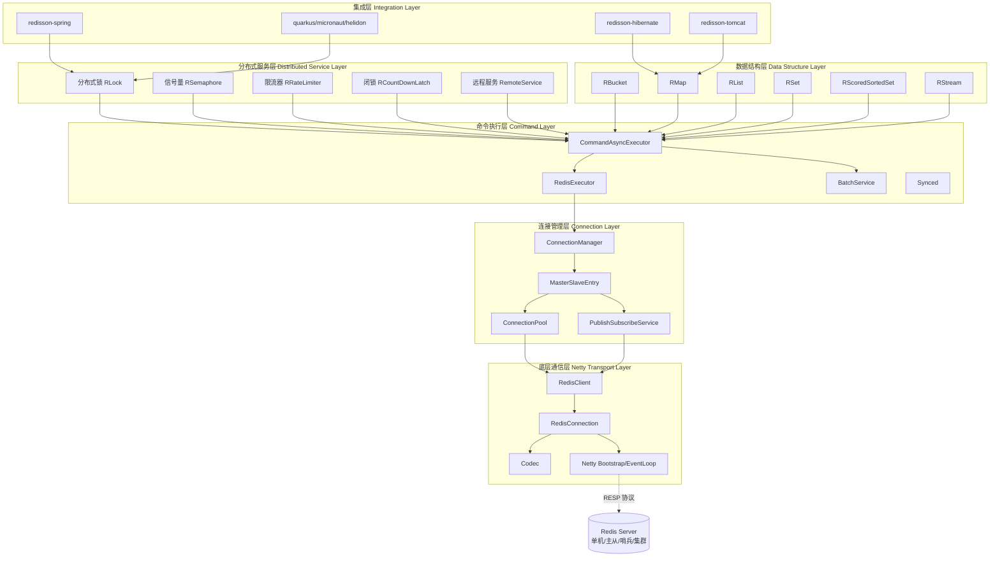

### 2.3 核心组件调用关系

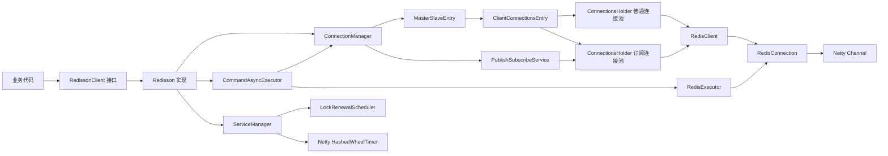

---

## 三、核心基础设施

### 3.1 客户端入口与配置体系

#### RedissonClient 接口与 Redisson 实现

`org.redisson.api.RedissonClient` 是客户端顶层入口，提供获取各类分布式对象的方法：

```java
public interface RedissonClient {
    // 分布式对象
    RBucket<V> getBucket(String name);
    <K,V> RMap<K,V> getMap(String name);
    <V> RList<V> getList(String name);
    // 分布式服务
    RLock getLock(String name);
    RLock getFairLock(String name);
    RReadWriteLock getReadWriteLock(String name);
    RSemaphore getSemaphore(String name);
    RRateLimiter getRateLimiter(String name);
    // 响应式 API
    RedissonReactiveClient reactive();
    RedissonRxClient rxJava();
    // 生命周期
    void shutdown();
}
```

`Redisson` 是其实现类，持有两个核心组件：

```java
public class Redisson implements RedissonClient {
    protected final ConnectionManager connectionManager;
    protected final CommandAsyncExecutor commandExecutor;
    // ...
}
```

#### 配置体系 Config

`org.redisson.config.Config` 集中管理所有配置，关键字段包括：

| 字段 | 默认值 | 含义 |
|------|--------|------|
| `lockWatchdogTimeout` | 30000ms | **看门狗默认续期时间** |
| `lockWatchdogBatchSize` | 100 | 续期脚本单批处理锁数量 |
| `retryAttempts` | 3 | 命令重试次数 |
| `retryInterval` | 1500ms | 重试间隔 |
| `timeout` | 3000ms | 命令超时 |
| `masterConnectionPoolSize` | 64 | 主节点连接池大小 |
| `slaveConnectionPoolSize` | 64 | 从节点连接池大小 |
| `subscriptionConnectionPoolSize` | 50 | 订阅连接池大小 |
| `threads` | 16 | 业务线程池大小 |
| `nettyThreads` | 32 | Netty 线程数 |

`ConfigSupport` 负责从 YAML/JSON 文件加载配置，使用 SnakeYAML 解析。

### 3.2 连接管理体系

#### ConnectionManager 接口层次

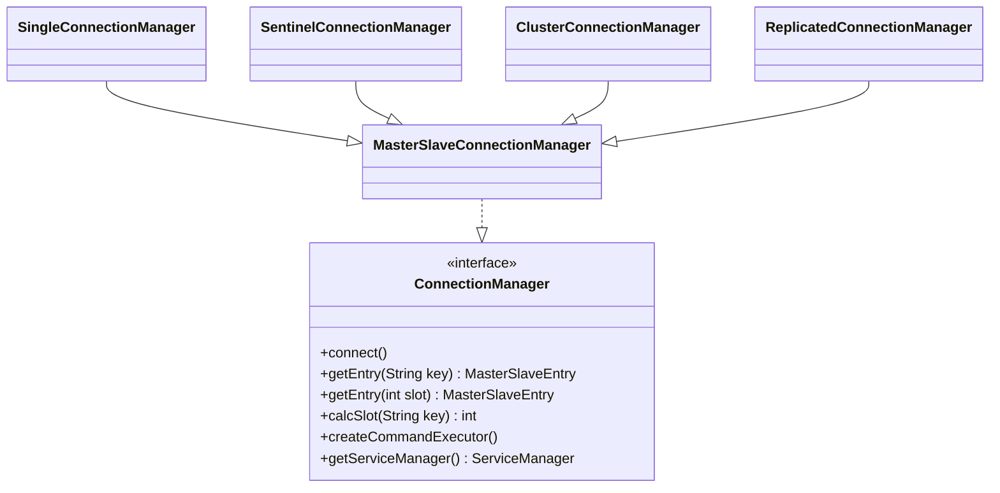

- **MasterSlaveConnectionManager**：所有模式的基类，封装主从连接池通用逻辑；
- **SingleConnectionManager**：单节点；
- **SentinelConnectionManager**：哨兵模式，监听 `+switch-master`、`+sdown` 等事件动态切换主节点；
- **ClusterConnectionManager**：集群模式，负责槽位路由与拓扑刷新；
- **ReplicatedConnectionManager**：复制模式。

#### MasterSlaveEntry 与连接池

每个主从节点组对应一个 `MasterSlaveEntry`，它持有：

- **ClientConnectionsEntry（主节点）**：包含 `connectionsHolder`（普通连接池）与 `pubSubConnectionsHolder`（订阅连接池）；
- **ClientConnectionsEntry（从节点列表）**：读请求可路由到从节点。

`ConnectionsHolder` 是通用连接池实现：

- 维护空闲连接队列 `freeConnections` 与全部连接集合；
- 使用信号量控制并发获取；
- 支持动态创建、空闲超时回收、失败重连。

#### RedisClient 与 RedisConnection

```java
public final class RedisClient {
    private final Bootstrap bootstrap;        // 普通连接启动器
    private final Bootstrap pubSubBootstrap;  // 订阅连接启动器
    private final RedisURI uri;
    private final Timer timer;                // HashedWheelTimer
    // ...
}
```

`RedisConnection` 封装 Netty `Channel`，实现 `RedisCommands` 接口，提供 `async()`/`sync()`/`send()` 等方法执行 Redis 命令。`RedisPubSubConnection` 继承它，扩展订阅、取消订阅、消息分发能力。

### 3.3 命令执行体系

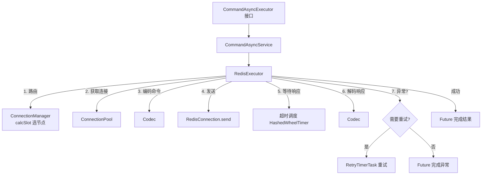

#### RedisExecutor 核心流程

`RedisExecutor` 负责单条命令的完整生命周期：

1. 初始化上下文（编解码器、命令、回调 Future）；
2. 根据读写类型与槽位路由到目标节点；
3. 从连接池获取连接，编码命令为 RESP 协议；
4. 通过 Netty 发送，注册超时任务到 `HashedWheelTimer`；
5. 接收响应后解码；
6. 若发生 `MOVED`/`ASK` 重定向或网络异常，按策略重试；
7. 释放连接回池，完成 Future。

#### 异步编程模型

- **RFuture**：Redisson 对 Future 的扩展；
- **RedissonPromise**：继承 `CompletableFuture`，可手动完成；
- **CompletableFutureWrapper**：将 Netty Future 适配为 JDK CompletableFuture。

#### 重试机制

重试由 `RetryTimerTask` + `DelayStrategy` 实现，支持：

- `ConstantDelay`：固定延迟；
- `EqualJitterDelay` / `FullJitterDelay` / `DecorrelatedJitterDelay`：指数退避 + 抖动。

判断是否允许重试：

```java
private boolean isResendAllowed(int attempt, int attempts) {
    return attempt < attempts
        && !noRetry
        && (command == null || (!command.isBlockingCommand() && !command.isNoRetry()));
}
```

### 3.4 编解码体系

`Codec` 接口定义了值与 Map 键值的编码器/解码器：

```java
public interface Codec {
    Encoder getValueEncoder();
    Decoder getValueDecoder();
    Encoder getMapKeyEncoder();
    Decoder getMapValueEncoder();
    // ...
}
```

常用实现：

- `JsonJacksonCodec`（默认）、`StringCodec`、`ByteArrayCodec`、`Kryo5Codec`、`AvroJacksonCodec`、`MsgPackJacksonCodec`。

编解码在命令发送前/响应到达后由 `RedisExecutor` 调用，对上层透明。

### 3.5 发布订阅体系

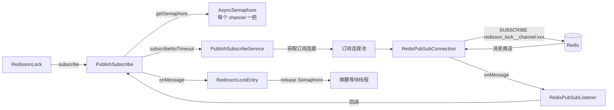

#### PublishSubscribeService

管理所有发布订阅连接，提供 `subscribe()`、`unsubscribe()`、`publish()`。它使用 `AsyncSemaphore` 保证同一 channel 的订阅/取消订阅串行化。

#### LockPubSub

锁专用的发布订阅处理器，定义两种消息：

```java
public static final Long UNLOCK_MESSAGE = 0L;       // 写锁释放
public static final Long READ_UNLOCK_MESSAGE = 1L;  // 读锁释放
```

收到 `UNLOCK_MESSAGE` 时释放一个信号量许可（唤醒一个等待者）；收到 `READ_UNLOCK_MESSAGE` 时释放全部许可（唤醒所有读锁等待者）。

### 3.6 集群拓扑与槽位路由

#### 槽位计算

Redis 集群共 16384 个槽位，Redisson 用 CRC16 计算 key 槽位，支持 `{tag}` hash tag：

```java
public static int calcSlot(byte[] key) {
    int start = ArrayUtils.indexOf(key, (byte) '{');
    if (start != -1) {
        int end = ArrayUtils.indexOf(key, (byte) '}', start + 1);
        if (end != -1 && end > start + 1) {
            key = Arrays.copyOfRange(key, start + 1, end);
        }
    }
    return CRC16.crc16(key) % 16384;
}
```

#### 拓扑刷新

`ClusterConnectionManager` 启动时通过 `CLUSTER NODES` 获取集群节点信息，使用 `ClusterNodesDecoder` 解析，为每个主节点创建 `MasterSlaveEntry`。之后周期性刷新拓扑，处理节点新增/下线、槽位迁移。

#### 重路由

执行命令时若收到 `MOVED` 或 `ASK`，更新本地路由表并重试到正确节点。

---

## 四、分布式锁实现

### 4.1 RLock 接口设计

`RLock` 继承 Java `java.util.concurrent.locks.Lock`，完全兼容标准锁 API，同时扩展分布式锁特有能力：

```java
public interface RLock extends Lock, RLockAsync {
    boolean tryLock(long waitTime, long leaseTime, TimeUnit unit);
    void lock(long leaseTime, TimeUnit unit);
    boolean forceUnlock();
    boolean isLocked();
    boolean isHeldByThread(long threadId);
    int getHoldCount();
    long getLockId();           // fencing token（FencedLock 用）
    long remainTimeToLive();
    // ...
}
```

### 4.2 RedissonBaseLock 公共基类

`RedissonBaseLock` 抽象了所有锁的公共逻辑，关键字段：

```java
public abstract class RedissonBaseLock extends RedissonExpirable implements RLock {
    final String id;                       // 客户端唯一 ID（nodeId）
    final String entryName;               // = id + ":" + name，订阅入口名
    final LockRenewalScheduler renewalScheduler;  // 看门狗调度器

    // 锁名 = 客户端ID:线程ID，作为 Hash field
    protected String getLockName(long threadId) {
        return id + ":" + threadId;
    }
}
```

它定义了看门狗触发/取消的统一入口：

```java
protected void scheduleExpirationRenewal(long threadId) {
    renewalScheduler.renewLock(getRawName(), threadId, getLockName(threadId));
}
protected void cancelExpirationRenewal(Long threadId, Boolean unlockResult) {
    renewalScheduler.cancelLockRenewal(getRawName(), threadId);
}
```

以及通用解锁框架 `unlockAsync0()`：执行 Lua 解锁脚本 → 回调中 `cancelExpirationRenewal`。

### 4.3 RedissonLock 核心加锁流程

`RedissonLock` 是**非公平可重入锁**，核心方法 `tryLock(long waitTime, long leaseTime, TimeUnit unit)` 的同步流程：

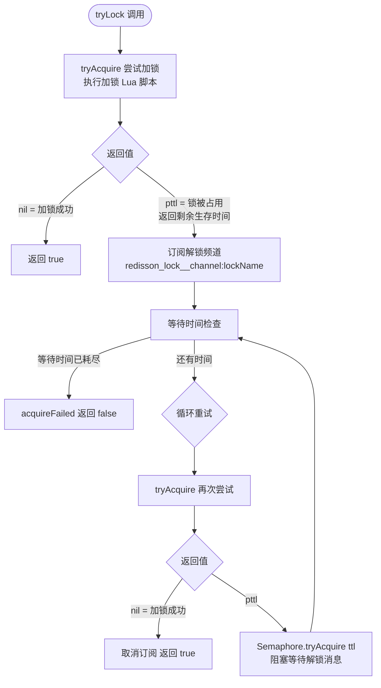

关键代码（`RedissonLock.tryLock`，redisson/RedissonLock.java:227）：

```java
public boolean tryLock(long waitTime, long leaseTime, TimeUnit unit) {
    long time = unit.toMillis(waitTime);
    long current = System.currentTimeMillis();
    long threadId = Thread.currentThread().getId();
    Long ttl = tryAcquire(waitTime, leaseTime, unit, threadId);
    if (ttl == null) return true;              // 加锁成功
    time -= System.currentTimeMillis() - current;
    if (time <= 0) { acquireFailed(...); return false; }

    CompletableFuture<RedissonLockEntry> subscribeFuture = subscribe(threadId);
    // 等待订阅完成（带超时）
    subscribeFuture.get(time, TimeUnit.MILLISECONDS);
    // ...循环：tryAcquire + Semaphore.tryAcquire(ttl) 等待解锁消息...
}
```

#### tryAcquireAsync 分支

```java
private RFuture<Long> tryAcquireAsync(long waitTime, long leaseTime, TimeUnit unit, long threadId) {
    RFuture<Long> ttlRemainingFuture;
    if (leaseTime > 0) {
        // 显式指定 leaseTime：用 leaseTime 作为过期时间
        ttlRemainingFuture = tryLockInnerAsync(waitTime, leaseTime, unit, threadId, RedisCommands.EVAL_LONG);
    } else {
        // 未指定 leaseTime：用 internalLockLeaseTime（=lockWatchdogTimeout=30s）
        ttlRemainingFuture = tryLockInnerAsync(waitTime, internalLockLeaseTime,
                TimeUnit.MILLISECONDS, threadId, RedisCommands.EVAL_LONG);
    }
    // 加锁成功后的回调
    ttlRemainingFuture.thenApply(ttlRemaining -> {
        if (ttlRemaining == null) {        // 加锁成功
            if (leaseTime > 0) {
                internalLockLeaseTime = unit.toMillis(leaseTime);  // 不启动看门狗
            } else {
                scheduleExpirationRenewal(threadId);              // 启动看门狗
            }
        }
        return ttlRemaining;
    });
}
```

> **关键设计**：只有 `leaseTime <= 0`（未显式指定租约时间）时才会启动看门狗。一旦显式指定 leaseTime，Redis 会在该时间后自动释放锁，无需续期。

### 4.4 加锁 Lua 脚本逐行解析

`RedissonLock.tryLockInnerAsync`（redisson/RedissonLock.java:214）：

```lua
if ((redis.call('exists', KEYS[1]) == 0)
    or (redis.call('hexists', KEYS[1], ARGV[2]) == 1)) then
    redis.call('hincrBy', KEYS[1], ARGV[2], 1);
    redis.call('pexpire', KEYS[1], ARGV[1]);
    return nil;
end;
return redis.call('pttl', KEYS[1]);
```

参数说明：
- `KEYS[1]` = 锁名（getRawName）
- `ARGV[1]` = 过期时间（毫秒）= `internalLockLeaseTime`（默认 30s）
- `ARGV[2]` = `id:threadId`（客户端ID:线程ID）

逐行分析：

| 行 | Lua 逻辑 | 含义 |
|----|----------|------|
| 1 | `exists KEYS[1] == 0` | 锁 key 不存在 → 锁未被任何线程持有 |
| 1 | `or hexists KEYS[1] ARGV[2] == 1` | 或当前线程已持有该锁（**可重入**判断） |
| 2 | `hincrBy KEYS[1] ARGV[2] 1` | Hash field（`id:threadId`）计数 +1，记录重入次数 |
| 3 | `pexpire KEYS[1] ARGV[1]` | 设置/刷新过期时间 |
| 4 | `return nil` | 加锁成功 |
| 6 | `return pttl KEYS[1]` | 加锁失败，返回锁剩余生存时间（毫秒） |

#### 为什么用 Lua 脚本

`exists` + `hincrBy` + `pexpire` 是三步操作，若分开发送会存在竞态：线程 A 判断锁不存在后、还未写入前，线程 B 也判断不存在并写入。Lua 脚本在 Redis 中**原子执行**，杜绝竞态。

#### 锁的 Redis 存储结构

```
Redisson Lock = Redis Hash
KEY:   锁名（如 "myLock"）
FIELD: 客户端ID:线程ID  （如 "9d3f...:42"）
VALUE: 重入计数
TTL:   整个 Hash key 的过期时间
```

示例：
```
myLock: {
  "9d3f2c:42": 2   # 线程42重入了2次
}
TTL=30s
```

### 4.5 解锁 Lua 脚本逐行解析

`RedissonLock.unlockInnerAsync`（redisson/RedissonLock.java:340）：

```lua
local val = redis.call('get', KEYS[3]);
if val ~= false then
    return tonumber(val);
end;

if (redis.call('hexists', KEYS[1], ARGV[3]) == 0) then
    return nil;
end;
local counter = redis.call('hincrby', KEYS[1], ARGV[3], -1);
if (counter > 0) then
    redis.call('pexpire', KEYS[1], ARGV[2]);
    redis.call('set', KEYS[3], 0, 'px', ARGV[5]);
    return 0;
else
    redis.call('del', KEYS[1]);
    redis.call(ARGV[4], KEYS[2], ARGV[1]);
    redis.call('set', KEYS[3], 1, 'px', ARGV[5]);
    return 1;
end;
```

参数说明：
- `KEYS[1]` = 锁名
- `KEYS[2]` = 频道名 `redisson_lock__channel:lockName`
- `KEYS[3]` = `redisson_unlock_latch:lockName:requestId`（解锁闩锁）
- `ARGV[1]` = `UNLOCK_MESSAGE` = 0
- `ARGV[2]` = `internalLockLeaseTime`
- `ARGV[3]` = `id:threadId`
- `ARGV[4]` = publish 命令名（`PUBLISH` 或 `SPUBLISH`）
- `ARGV[5]` = timeout

逐段分析：

| 段 | 逻辑 | 含义 |
|----|------|------|
| 1-3 | `get KEYS[3]` | 查询解锁闩锁状态。若已存在值，直接返回（防止重复解锁） |
| 5-7 | `hexists == 0` | 当前线程未持有该锁 → 返回 nil（非法解锁） |
| 8 | `hincrby -1` | 重入计数 -1 |
| 9-12 | `counter > 0` | 仍有重入：刷新过期时间，设置闩锁=0，返回 0（未完全释放） |
| 13-17 | `else` | 计数为 0：`del` 删除锁 key，`PUBLISH` 解锁消息，设置闩锁=1，返回 1（完全释放） |

解锁成功后通过 `PUBLISH` 发送 `UNLOCK_MESSAGE`，唤醒等待该锁的线程。

### 4.6 锁重入机制

重入由 **Redis Hash 结构**实现：

- **加锁**：`hincrBy field 1`（计数 +1）
- **解锁**：`hincrBy field -1`（计数 -1）
- **完全释放**：当计数为 0 时 `del` 删除整个 Hash key

同一线程多次获取同一把锁会累加重入计数，只有最后一次解锁才真正释放锁。`isHeldByThread(threadId)` 通过 `hexists` 判断 field 是否存在；`getHoldCount()` 通过 `hget` 获取计数。

### 4.7 PubSub 等待唤醒机制

锁被占用时，等待线程不会忙轮询，而是通过 Redis PubSub 被动唤醒。

#### RedissonLockEntry

```java
public class RedissonLockEntry implements PubSubEntry<RedissonLockEntry> {
    private volatile int counter;
    private final Semaphore latch;                              // 等待信号量
    private final ConcurrentLinkedQueue<Runnable> listeners;   // 唤醒回调
    // ...
}
```

#### 唤醒流程

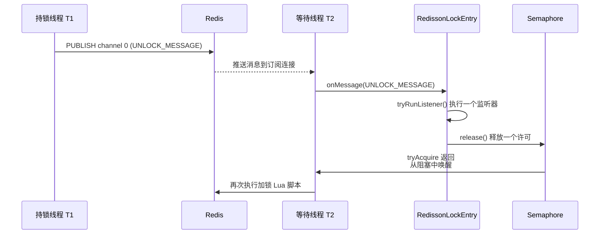

#### 等待逻辑（RedissonLock.lock()）

```java
while (true) {
    ttl = tryAcquire(-1, leaseTime, unit, threadId);
    if (ttl == null) break;             // 加锁成功
    if (ttl >= 0) {
        entry.getLatch().tryAcquire(ttl, TimeUnit.MILLISECONDS);  // 阻塞最多 ttl 毫秒
    } else {
        entry.getLatch().acquireUninterruptibly();                 // 无限等待
    }
}
```

**双重保险**：线程既会在收到 PubSub 消息时被唤醒，也会在 `ttl` 到期后自动唤醒重试——即使错过 PubSub 消息（网络抖动），锁过期后仍能继续尝试加锁，避免永久阻塞。

### 4.8 公平锁 RedissonFairLock

公平锁在非公平锁基础上增加 **FIFO 等待队列**，使用两个额外 Redis 结构：

- `threadsQueueName`（List）：线程等待队列，头部线程优先获锁
- `timeoutSetName`（ZSet）：线程超时集合，score 为超时时间戳

#### 加锁 Lua 脚本核心逻辑（redisson/RedissonFairLock.java:108）

```lua
-- 1. 清理过期等待线程
while true do
    local firstThreadId2 = redis.call('lindex', KEYS[2], 0);
    if firstThreadId2 == false then break; end;
    local timeout = redis.call('zscore', KEYS[3], firstThreadId2);
    if timeout ~= false and tonumber(timeout) <= tonumber(ARGV[3]) then
        redis.call('zrem', KEYS[3], firstThreadId2);   -- 超时移出 ZSet
        redis.call('lpop', KEYS[2]);                    -- 超时移出队列
    else break; end;
end;

-- 2. 锁未被占用 且 (队列为空 或 队首是自己) → 获锁
if (redis.call('exists', KEYS[1]) == 0)
   and ((redis.call('exists', KEYS[2]) == 0)
        or (redis.call('lindex', KEYS[2], 0) == ARGV[2])) then
    redis.call('lpop', KEYS[2]);
    redis.call('zrem', KEYS[3], ARGV[2]);
    -- 队列中后续线程的超时时间整体前移
    local keys = redis.call('zrange', KEYS[3], 0, -1);
    for i = 1, #keys, 1 do
        redis.call('zincrby', KEYS[3], -tonumber(ARGV[4]), keys[i]);
    end;
    redis.call('hset', KEYS[1], ARGV[2], 1);
    redis.call('pexpire', KEYS[1], ARGV[1]);
    return nil;
end;

-- 3. 重入判断
if (redis.call('hexists', KEYS[1], ARGV[2]) == 1) then
    redis.call('hincrby', KEYS[1], ARGV[2], 1);
    redis.call('pexpire', KEYS[1], ARGV[1]);
    return nil;
end;

-- 4. 否则加入队尾，设置超时
local lastThreadId = redis.call('lindex', KEYS[2], -1);
local ttl;
if lastThreadId ~= false and lastThreadId ~= ARGV[2]
   and redis.call('zscore', KEYS[3], lastThreadId) ~= false then
    ttl = tonumber(redis.call('zscore', KEYS[3], lastThreadId)) - tonumber(ARGV[4]);
else
    ttl = redis.call('pttl', KEYS[1]);
end;
local timeout = ttl + tonumber(ARGV[3]) + tonumber(ARGV[4]);
if redis.call('zadd', KEYS[3], timeout, ARGV[2]) == 1 then
    redis.call('rpush', KEYS[2], ARGV[2]);
end;
return math.max(0, ttl);
```

#### 公平锁 Redis 结构

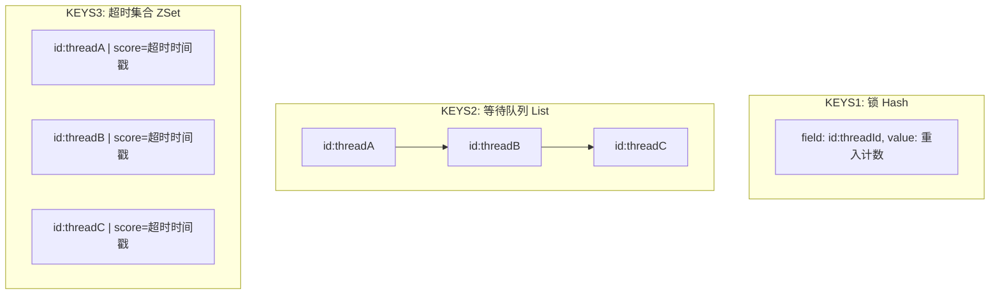

只有队首线程被允许获锁，保证严格 FIFO。

### 4.9 联锁与红锁

#### RedissonMultiLock（联锁）

将多个 `RLock` 组合成一个逻辑锁，**必须全部加锁成功才算成功**，否则回滚已加的锁。

```java
// 伪代码
for (RLock lock : locks) {
    if (!lock.tryLock()) {
        // 回滚已加锁的
        for (RLock acquired : acquiredLocks) acquired.unlock();
        return false;
    }
}
return true;
```

#### RedissonRedLock（红锁）

RedLock 算法（Redis 作者提出）：对 N 个**完全独立**的 Redis 实例加锁，**当且仅当多数（N/2+1）实例加锁成功**才算成功。容忍少数实例故障，避免单点 Redis 主从切换导致的锁丢失问题。

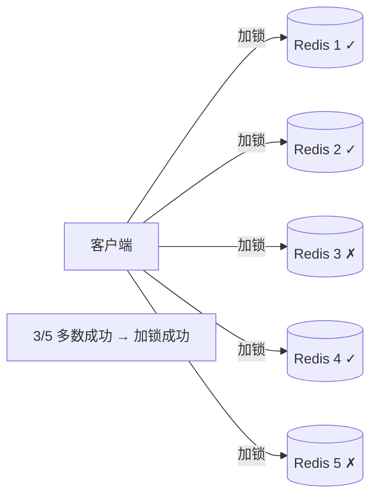

### 4.10 读写锁

`RedissonReadWriteLock` 提供读锁（共享）与写锁（独占），通过 Hash 中的 `mode` field 区分模式。

#### 读锁加锁 Lua（RedissonReadLock.java:56）

```lua
local mode = redis.call('hget', KEYS[1], 'mode');
if (mode == false) then
    -- 无锁：设为读模式，记录当前读线程
    redis.call('hset', KEYS[1], 'mode', 'read');
    redis.call('hset', KEYS[1], ARGV[2], 1);
    redis.call('set', KEYS[2] .. ':1', 1);                       -- 读锁独立超时 key
    redis.call('pexpire', KEYS[2] .. ':1', ARGV[1]);
    redis.call('pexpire', KEYS[1], ARGV[1]);
    return nil;
end;
if (mode == 'read') or (mode == 'write' and redis.call('hexists', KEYS[1], ARGV[3]) == 1) then
    -- 已是读模式：累加计数；或写锁是自己持有的（锁降级）
    local ind = redis.call('hincrby', KEYS[1], ARGV[2], 1);
    redis.call('set', KEYS[2] .. ':' .. ind, 1);
    redis.call('pexpire', KEYS[2] .. ':' .. ind, ARGV[1]);
    local remainTime = redis.call('pttl', KEYS[1]);
    redis.call('pexpire', KEYS[1], math.max(remainTime, ARGV[1]));
    return nil;
end;
return redis.call('pttl', KEYS[1]);
```

读锁特点：
- 多个读线程可同时持有，每个读线程有独立的超时 key `lockName:rwlock_timeout:threadId:index`；
- 写锁持有者可降级为读锁（`mode == 'write' and hexists`）。

#### 写锁加锁 Lua（RedissonWriteLock.java:54）

```lua
local mode = redis.call('hget', KEYS[1], 'mode');
if (mode == false) then
    redis.call('hset', KEYS[1], 'mode', 'write');
    redis.call('hset', KEYS[1], ARGV[2], 1);
    redis.call('pexpire', KEYS[1], ARGV[1]);
    return nil;
end;
if (mode == 'write') then
    if (redis.call('hexists', KEYS[1], ARGV[2]) == 1) then
        -- 写锁重入
        redis.call('hincrby', KEYS[1], ARGV[2], 1);
        local currentExpire = redis.call('pttl', KEYS[1]);
        redis.call('pexpire', KEYS[1], currentExpire + ARGV[1]);
        return nil;
    end;
end;
return redis.call('pttl', KEYS[1]);
```

#### 读写锁互斥关系

| 当前状态 \ 请求 | 读锁 | 写锁 |
|-----------------|------|------|
| 无锁 | ✓ | ✓ |
| 读锁（他人） | ✓ | ✗ |
| 读锁（自己） | ✓ | ✗（不支持升级） |
| 写锁（他人） | ✗ | ✗ |
| 写锁（自己） | ✓（降级） | ✓（重入） |

### 4.11 FencedLock 与 SpinLock

#### RedissonFencedLock

FencedLock 在普通可重入锁基础上，每次获锁生成一个**单调递增的 fencing token**（递增计数器）。用于解决"持有锁的客户端因 GC 暂停导致锁过期后，另一客户端获锁，原客户端恢复后仍写入旧数据"的脑裂问题：

- 每次加锁从 Redis 递增计数器获取 token；
- 写入下游存储时携带 token，下游可拒绝过期 token 的写入。

#### RedissonSpinLock

自旋锁**不使用 PubSub 等待唤醒**，而是通过定时器周期性重试加锁，配合退避策略（jitter）。适合锁持有时间极短的场景，避免了订阅连接开销。它仍然支持看门狗续期。

---

## 五、锁续期（看门狗）机制

看门狗是 Redisson 分布式锁的核心亮点：**在锁未显式指定 leaseTime 时，自动周期性延长锁的过期时间**，避免业务执行时间超过锁 TTL 导致锁被误释放。

### 5.1 看门狗触发时机

在 `RedissonLock.tryAcquireAsync` / `tryAcquireOnceAsync` 中：

```java
ttlRemainingFuture.thenApply(ttlRemaining -> {
    if (ttlRemaining == null) {        // 加锁成功
        if (leaseTime > 0) {
            internalLockLeaseTime = unit.toMillis(leaseTime);  // 不启动看门狗
        } else {
            scheduleExpirationRenewal(threadId);              // 启动看门狗
        }
    }
    return ttlRemaining;
});
```

**只有 `leaseTime <= 0`（即调用 `lock()` / `tryLock(waitTime, unit)` 未传 leaseTime）才会启动看门狗。** 若显式传入 `leaseTime`，Redis 会在该时间后自动过期，无需续期。

#### 调用链

```
RedissonLock.tryAcquireAsync()
  → scheduleExpirationRenewal(threadId)         [RedissonBaseLock]
    → renewalScheduler.renewLock(name, threadId, lockName)
      → LockRenewalScheduler.renewLock()        [renewal/LockRenewalScheduler.java:56]
        → LockTask.add(name, lockName, threadId)
          → RenewalTask.add()
            → 若是首个锁：tryRun() + schedule()  启动周期续期
```

### 5.2 续期 Lua 脚本详解

续期脚本位于 `LockTask.buildChunk()`（renewal/LockTask.java:84）：

```lua
local result = {}
for i = 1, #KEYS, 1 do
    if (redis.call('hexists', KEYS[i], ARGV[i + 1]) == 1) then
        redis.call('pexpire', KEYS[i], ARGV[1]);
        table.insert(result, 1);
    else
        table.insert(result, 0);
    end;
end;
return result;
```

参数说明：
- `KEYS[1..N]` = 多个锁名（批量续期）
- `ARGV[1]` = `internalLockLeaseTime`（默认 30s）
- `ARGV[2..N+1]` = 各锁对应的 `id:threadId`

脚本逻辑：

1. **遍历**所有需要续期的锁；
2. 对每把锁检查 `hexists`：当前线程是否仍持有该锁（Hash 中存在该 field）；
3. 若持有 → `pexpire` 重置过期时间为 `internalLockLeaseTime`，结果记 1；
4. 若不持有（已释放或被强制清除）→ 结果记 0；
5. 返回结果数组，调用方根据结果清理无效续期任务。

> **批量优化**：Redisson 将多个锁的续期合并到一个 EVAL 调用中（`lockWatchdogBatchSize` 控制单批大小，默认 100），大幅减少网络往返。集群模式下按槽位分组，同槽位的锁一批处理。

### 5.3 续期任务调度机制

#### 核心类结构

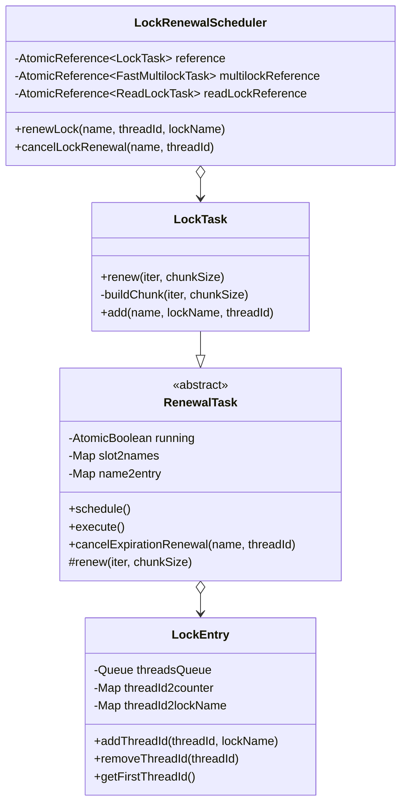

#### 调度入口：LockRenewalScheduler

```java
public void renewLock(String name, Long threadId, String lockName) {
    reference.compareAndSet(null, new LockTask(internalLockLeaseTime, executor, batchSize));
    LockTask task = reference.get();
    task.add(name, lockName, threadId);
}
```

使用 `AtomicReference` + `compareAndSet` 保证 `LockTask` 单例惰性创建（整个客户端只有一个普通锁续期任务实例）。

#### 调度核心：RenewalTask

```java
public void schedule() {
    if (!running.get()) return;                          // 已停止不再调度
    long internalLockLeaseTime = executor.getServiceManager().getCfg().getLockWatchdogTimeout();
    executor.getServiceManager().newTimeout(this, internalLockLeaseTime / 3, TimeUnit.MILLISECONDS);
}
```

**关键点**：
- 调度基于 `ServiceManager.newTimeout()`，底层是 **Netty `HashedWheelTimer`**（时间轮），轻量级、无额外线程；
- 续期间隔 = `internalLockLeaseTime / 3` = **30s / 3 = 10s**；
- 每次续期完成后再次 `schedule()`，形成**自驱动周期任务**，无需固定线程。

#### 任务执行：RenewalTask.run()

```java
@Override
public void run(Timeout timeout) {
    if (executor.getServiceManager().isShuttingDown()) return;   // 客户端关闭则停止

    CompletionStage<Void> future = execute();
    future.whenComplete((result, e) -> {
        if (e != null) {
            log.error("Can't update locks {} expiration", name2entry.keySet(), e);
            schedule();                                            // 异常也继续调度
            return;
        }
        schedule();                                               // 成功继续调度
    });
}
```

#### 注册表管理：name2entry 与 slot2names

`RenewalTask` 维护两个映射：

- `name2entry`：锁名 → `LockEntry`（包含该锁的所有线程信息）；
- `slot2names`（仅集群模式）：槽位 → 锁名集合，用于按槽位分组批量续期。

#### LockEntry：管理同锁多线程

```java
public class LockEntry {
    final Queue<Long> threadsQueue = new ConcurrentLinkedQueue<>();
    final Map<Long, Integer> threadId2counter = new ConcurrentHashMap<>();     // 线程重入计数
    final Map<Long, String> threadId2lockName = new ConcurrentHashMap<>();     // 线程→lockName

    public void addThreadId(long threadId, String lockName) {
        threadId2counter.compute(threadId, (t, counter) -> {
            counter = Optional.ofNullable(counter).orElse(0);
            counter++;                            // 重入计数+1
            threadsQueue.add(threadId);
            return counter;
        });
        threadId2lockName.putIfAbsent(threadId, lockName);
    }
}
```

#### 续期任务整体流程

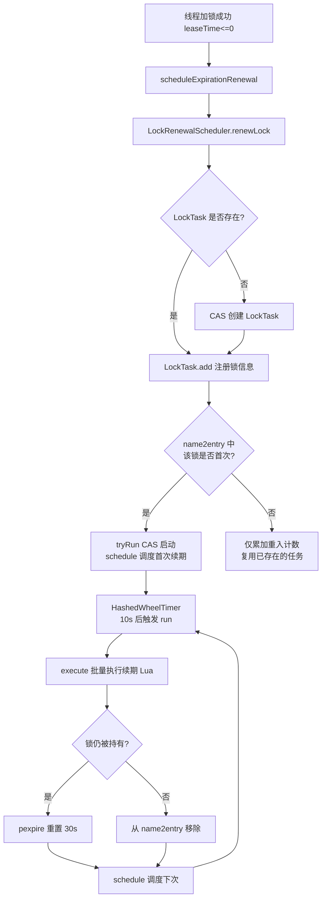

### 5.4 续期任务的取消

#### 解锁时取消

`RedissonBaseLock.unlockAsync0()`：

```java
private RFuture<Void> unlockAsync0(long threadId, String requestId) {
    CompletionStage<Boolean> future = unlockInnerAsync(threadId, requestId);
    CompletionStage<Void> f = future.handle((res, e) -> {
        cancelExpirationRenewal(threadId, res);   // ← 解锁后取消该线程续期
        // ...
    });
}
```

#### 取消逻辑：RenewalTask.cancelExpirationRenewal()

```java
void cancelExpirationRenewal(String name, Long threadId) {
    LockEntry task = name2entry.get(name);
    if (task == null) return;

    if (threadId != null) {
        task.removeThreadId(threadId);           // 移除指定线程
    }

    if (threadId == null || task.hasNoThreads()) {
        // 该锁已无线程持有 → 完全移除
        name2entry.remove(name);
        // 集群模式：从 slot2names 移除
        if (isClusterSetup) { slot2names...; }

        if (!name2entry.isEmpty()) return;        // 还有其他锁要续期
        stop();                                   // running=false，停止调度
    }
}
```

#### 关键设计

- **重入计数同步**：每次 `unlock` 让 `LockEntry` 中对应线程计数 -1，只有计数归零才真正移除线程，保证重入锁多次加锁期间续期不中断；
- **惰性停止**：`stop()` 仅将 `running` 置 false，已调度的任务仍会执行一次 `run`，但 `run` 中检查 `running` 后不再 `schedule` 下一次，任务自然终止；
- **重启机制**：若在 `stop` 之后又有新锁加入，`add` 会 `tryRun()` 重新启动调度。

### 5.5 续期异常处理与集群支持

#### 异常处理

```java
future.whenComplete((result, e) -> {
    if (e != null) {
        log.error("Can't update locks {} expiration", name2entry.keySet(), e);
        schedule();        // 即使异常也继续下一次调度
        return;
    }
    schedule();
});
```

- 续期异常（网络抖动、Redis 短暂不可用）**不会终止续期循环**，仅记录日志；
- 这保证了网络恢复后能继续续期，避免锁被误释放。

#### 集群模式批量续期

`execute()` 检测集群模式：

```java
final CompletionStage<Void> execute() {
    if (name2entry.isEmpty()) return CompletableFuture.completedFuture(null);
    if (!executor.getServiceManager().isClusterSetup()) {
        return renew(name2entry.keySet().iterator(), chunkSize);   // 非集群：一次性
    }
    return renewSlots(slot2names.values().iterator(), chunkSize);   // 集群：按槽位分批
}
```

集群模式下，不同锁可能分布在不同节点，`slot2names` 按槽位分组后逐组发送续期脚本。

#### 失效锁清理

续期脚本返回结果数组，标记每把锁是否续期成功（0 = 锁已不存在）：

```java
return new ChunkExecution<>(f, existingNames -> {
    keys.removeAll(existingNames);       // 移除仍持有的
    for (String key : keys) {
        cancelExpirationRenewal(key, name2threadId.get(key));  // 清理失效锁
    }
});
```

**自适应清理**：若锁因 TTL 过期或被其他客户端强制清除，续期脚本检测到后自动取消该锁的续期任务，避免无意义的续期请求。

---

## 六、关键工作流程时序图

### 6.1 加锁完整时序（lock() 无 leaseTime）

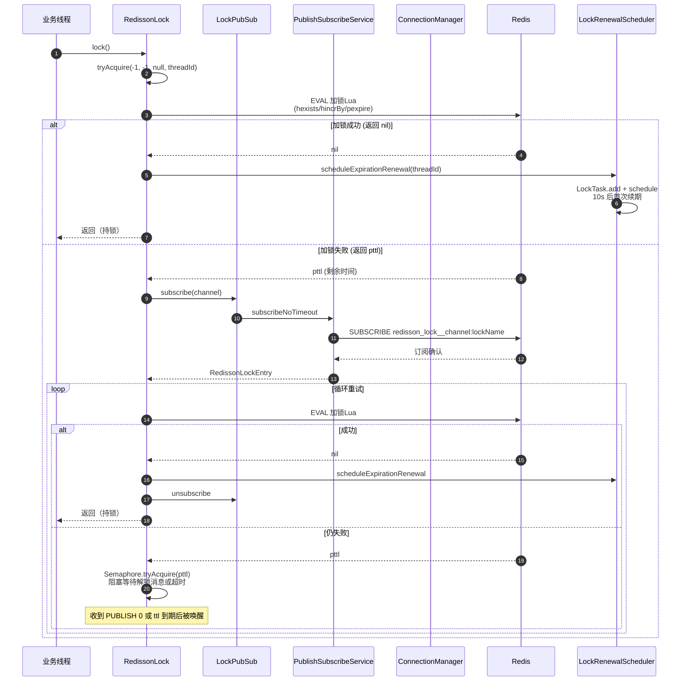

### 6.2 解锁与唤醒时序

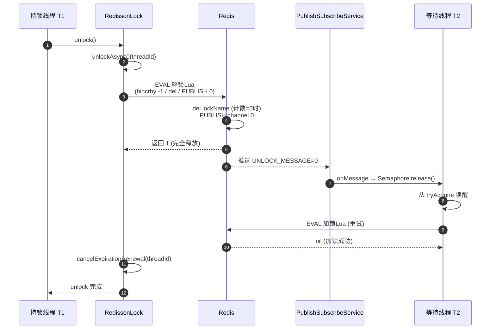

### 6.3 看门狗续期时序

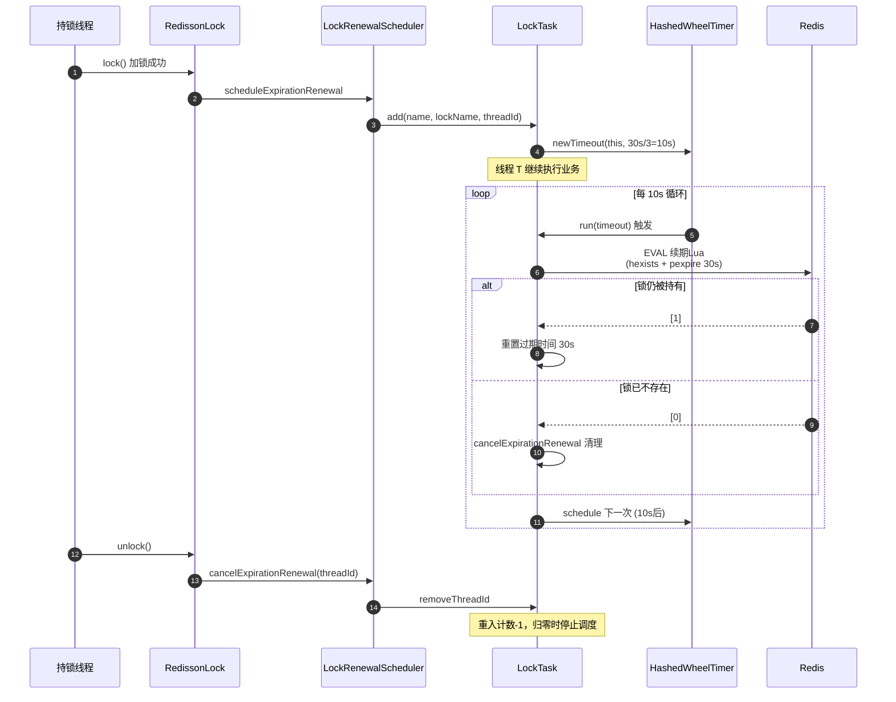

---

## 七、设计原理总结

### 7.1 核心设计原则

| 设计原则 | 体现 |
|----------|------|
| **原子性优先** | 加锁、解锁、续期、公平队列操作全部用 Lua 脚本，杜绝竞态 |
| **异步非阻塞** | 全链路基于 Netty + CompletableFuture，无阻塞线程 |
| **被动唤醒而非轮询** | 锁等待用 PubSub + Semaphore，避免空转浪费 CPU |
| **双重保险** | 等待既依赖 PubSub 唤醒，也依赖 ttl 超时兜底，防丢消息 |
| **自驱动周期任务** | 看门狗基于时间轮自调度，无独立线程，轻量 |
| **批量优化** | 续期按槽位/批次合并，减少网络往返 |
| **惰性初始化** | LockTask 单例 CAS 创建，按需启动 |
| **异常容忍** | 续期异常不中断循环，网络恢复后自愈 |
| **显式 vs 隐式租约** | 显式 leaseTime 不启看门狗，隐式才续期，符合直觉 |
| **可重入** | Hash + 计数器实现，线程内嵌套加锁不死锁 |

### 7.2 关键技术选型

1. **Lua 脚本而非分布式事务**：Redis 单线程执行 Lua 保证原子性，性能远优于 2PC；
2. **Hash 而非 String 存锁**：天然支持可重入（field = 线程标识，value = 计数）；
3. **PubSub 而非忙等待**：被动唤醒，资源占用极低；
4. **Netty HashedWheelTimer 而非 ScheduledExecutorService**：时间轮对大量定时任务（续期、超时、重试）性能优异；
5. **AtomicReference + CAS 而非锁**：续期任务单例创建无竞争；
6. **槽位分组批量**：集群下同槽位锁合并续期。

### 7.3 分布式锁实现的演进路径

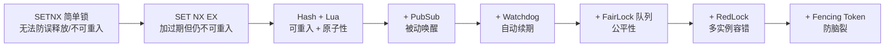

Redisson 完整实现了这条演进路径，提供从非公平到公平、从单实例到多实例、从普通锁到读写锁、Fenced 锁、自旋锁的全套方案。

### 7.4 一句话总结

> Redisson 分布式锁 = **Redis Hash（可重入）** + **Lua 脚本（原子性）** + **PubSub（被动唤醒）** + **HashedWheelTimer 看门狗（自动续期）** + **CAS 单例续期任务（轻量调度）**，在 Netty 异步非阻塞框架上构成工业级可靠方案。

---

## 附录：核心源码文件索引

| 模块 | 关键文件 |
|------|----------|
| 客户端入口 | `Redisson.java`、`api/RedissonClient.java` |
| 配置 | `config/Config.java`、`config/ConfigSupport.java` |
| 连接管理 | `connection/ConnectionManager.java`、`connection/MasterSlaveConnectionManager.java`、`connection/ClusterConnectionManager.java`、`connection/MasterSlaveEntry.java` |
| 命令执行 | `command/CommandAsyncService.java`、`command/RedisExecutor.java` |
| 底层通信 | `client/RedisClient.java`、`client/RedisConnection.java`、`client/RedisPubSubConnection.java` |
| 锁基础 | `RedissonBaseLock.java`、`api/RLock.java` |
| 可重入锁 | `RedissonLock.java` |
| 公平锁 | `RedissonFairLock.java` |
| 读写锁 | `RedissonReadWriteLock.java`、`RedissonReadLock.java`、`RedissonWriteLock.java` |
| 联锁/红锁 | `RedissonMultiLock.java`、`RedissonRedLock.java` |
| 特殊锁 | `RedissonFencedLock.java`、`RedissonSpinLock.java` |
| 看门狗 | `renewal/LockRenewalScheduler.java`、`renewal/RenewalTask.java`、`renewal/LockTask.java`、`renewal/LockEntry.java` |
| 发布订阅 | `pubsub/PublishSubscribe.java`、`pubsub/PublishSubscribeService.java`、`pubsub/LockPubSub.java`、`RedissonLockEntry.java` |

---

*本文档基于 Redisson 4.3.0 源码分析整理，所有 Lua 脚本与代码片段均来自源码原文件，行号引用以源码为准。*
