# Redisson 与 Redis 通信交互底层原理深度分析

> 基于 Redisson 4.3.0 源码，系统剖析 Redisson 与 Redis 之间从连接建立、命令执行到编解码响应的完整通信链路底层原理与设计实现。所有结论均结合 `redisson/src/main/java` 下的真实源码与行号，并以 Mermaid 图表呈现架构图、流程图与时序图。

---

## 目录

- [一、总体概述](#一总体概述)
- [二、整体架构与核心组件](#二整体架构与核心组件)
- [三、连接建立层](#三连接建立层)
  - [3.1 RedisClient：Netty 客户端封装](#31-redisclientnetty-客户端封装)
  - [3.2 RedisChannelInitializer：Channel Pipeline 构建](#32-redischannelinitializerchannel-pipeline-构建)
  - [3.3 连接握手：AUTH / SELECT / HELLO / CLIENT SETNAME](#33-连接握手auth--select--hello--client-setname)
  - [3.4 ConnectionManager 体系：多部署模式适配](#34-connectionmanager-体系多部署模式适配)
  - [3.5 连接池与 ConnectionsHolder](#35-连接池与-connectionsholder)
  - [3.6 MasterSlaveEntry / SingleEntry：主从连接持有](#36-masterslaveentry--singleentry主从连接持有)
  - [3.7 负载均衡器](#37-负载均衡器)
  - [3.8 连接保活：PingConnectionHandler 与 IdleConnectionWatcher](#38-连接保活pingconnectionhandler-与-idleconnectionwatcher)
  - [3.9 断线重连：ConnectionWatchdog](#39-断线重连connectionwatchdog)
  - [3.10 DNS 解析与 DNSMonitor](#310-dns-解析与-dnsmonitor)
- [四、命令执行层](#四命令执行层)
  - [4.1 CommandAsyncService：命令执行入口](#41-commandasyncservice命令执行入口)
  - [4.2 RedisExecutor：核心执行器](#42-redisexecutor核心执行器)
  - [4.3 execute() 完整流程拆解](#43-execute-完整流程拆解)
  - [4.4 命令发送：sendCommand](#44-命令发送sendcommand)
  - [4.5 超时控制体系](#45-超时控制体系)
  - [4.6 重试机制](#46-重试机制)
  - [4.7 重定向处理：MOVED / ASK](#47-重定向处理moved--ask)
  - [4.8 故障转移与节点失败检测](#48-故障转移与节点失败检测)
  - [4.9 槽位路由与 CRC16](#49-槽位路由与-crc16)
- [五、编解码层（RESP 协议）](#五编解码层resp-协议)
  - [5.1 RESP 协议概述](#51-resp-协议概述)
  - [5.2 CommandEncoder：命令编码](#52-commandencoder命令编码)
  - [5.3 CommandDecoder：响应解码状态机](#53-commanddecoder响应解码状态机)
  - [5.4 半包/粘包处理](#54-半包粘包处理)
  - [5.5 Codec 体系：业务对象编解码](#55-codec-体系业务对象编解码)
  - [5.6 Decoder / Encoder 接口体系](#56-decoder--encoder-接口体系)
  - [5.7 MultiDecoder：复杂结构解码](#57-multidecoder复杂结构解码)
- [六、批量执行](#六批量执行)
  - [6.1 CommandBatchService 概览](#61-commandbatchservice-概览)
  - [6.2 两种批量模式：Pipeline 与 MULTI/EXEC](#62-两种批量模式pipeline-与-multiexec)
  - [6.3 RedisQueuedBatchExecutor：命令入队](#63-redisqueuedbatchexecutor命令入队)
  - [6.4 跨 Slot 命令处理](#64-跨-slot-命令处理)
- [七、PubSub 发布订阅](#七pubsub-发布订阅)
  - [7.1 PublishSubscribeService：核心调度器](#71-publishsubscribeservice核心调度器)
  - [7.2 PubSub 连接分配策略](#72-pubsub-连接分配策略)
  - [7.3 订阅 / 退订流程](#73-订阅--退订流程)
  - [7.4 消息分发](#74-消息分发)
  - [7.5 PubSub 重连与重订阅](#75-pubsub-重连与重订阅)
- [八、完整时序图](#八完整时序图)
- [九、设计原理总结](#九设计原理总结)

---

## 一、总体概述

Redisson 是一个基于 Redis 与 Netty 构建的高性能 Java Redis 客户端。它**完全基于 Netty 异步事件驱动**，所有与 Redis 的通信都通过非阻塞 IO 完成。Redisson 与 Redis 之间的通信链路可以抽象为以下三个层次：

| 层次 | 职责 | 关键包 |
|------|------|--------|
| **连接建立层** | 维护与 Redis 节点的 TCP 长连接、连接池化、保活、重连、多部署模式适配 | `org.redisson.client`、`org.redisson.connection` |
| **命令执行层** | 命令分发、连接选择、命令发送、超时控制、重试、重定向、故障转移 | `org.redisson.command` |
| **编解码层** | RESP 协议编解码、业务对象序列化/反序列化 | `org.redisson.client.handler`、`org.redisson.client.codec`、`org.redisson.codec` |

通信链路的本质是一条 **Netty Channel + RESP 协议 + Promise/Future 异步回调**的管道。命令从业务层一路异步向下，最终通过 Netty Channel 写入 TCP；Redis 返回的字节流再经过 Channel Pipeline 中的解码器还原为 Java 对象，并通过 Promise 回调回到业务层。

---

## 二、整体架构与核心组件

### 2.1 通信链路整体架构图

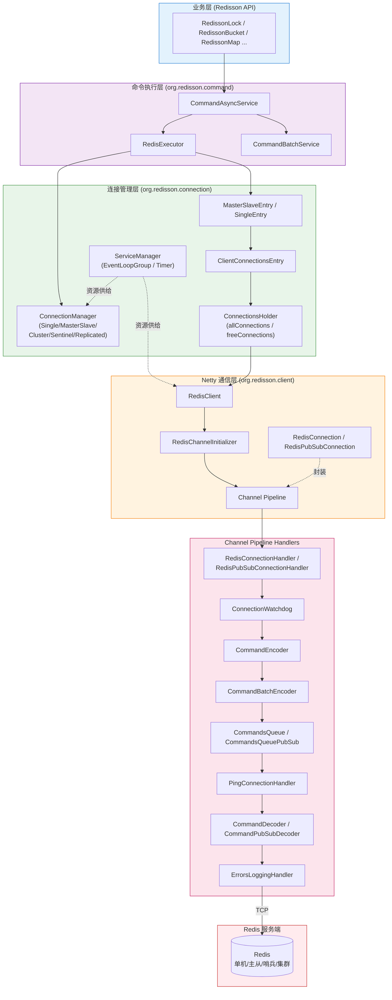

### 2.2 核心组件职责

| 组件 | 所在包 | 职责 |
|------|--------|------|
| `Redisson` | `org.redisson` | 客户端入口，持有 `ConnectionManager` 与 `CommandAsyncExecutor` |
| `ConnectionManager` | `org.redisson.connection` | 连接管理器接口，适配多种部署模式 |
| `ServiceManager` | `org.redisson.connection` | 共享资源管理（EventLoopGroup、Timer、Executor、DNS Resolver） |
| `MasterSlaveEntry` / `SingleEntry` | `org.redisson.connection` | 持有一个主从组的连接池 |
| `ClientConnectionsEntry` | `org.redisson.connection` | 单个节点的普通连接池 + PubSub 连接池 |
| `ConnectionsHolder` | `org.redisson.connection` | 通用连接池数据结构 |
| `RedisClient` | `org.redisson.client` | Netty 客户端封装，负责建立 Channel |
| `RedisConnection` | `org.redisson.client` | 对 Netty Channel 的封装，提供 send 接口 |
| `RedisChannelInitializer` | `org.redisson.client.handler` | 构建 Channel Pipeline |
| `CommandAsyncService` | `org.redisson.command` | 异步命令执行入口 |
| `RedisExecutor` | `org.redisson.command` | 单条命令的核心执行器 |
| `CommandBatchService` | `org.redisson.command` | 批量命令执行 |
| `CommandEncoder` / `CommandDecoder` | `org.redisson.client.handler` | RESP 协议编解码 |
| `PublishSubscribeService` | `org.redisson.pubsub` | PubSub 连接调度 |

### 2.3 关键概念：Promise 驱动

Redisson 通信链路的**核心驱动机制**是 `CompletableFuture`（Redisson 称之为 `RFuture`）。每条命令都会绑定一个 `mainPromise`，整个执行流程通过一系列 `whenComplete` 回调串联，避免线程阻塞：

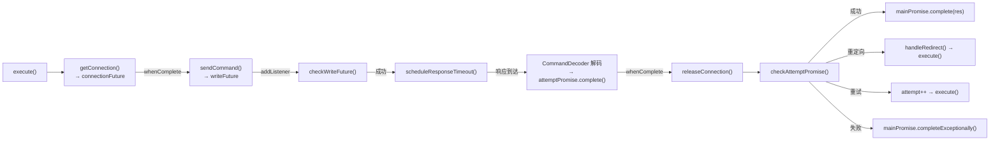

---

## 三、连接建立层

### 3.1 RedisClient：Netty 客户端封装

`RedisClient`（`org.redisson.client.RedisClient`）是 Redisson 对 Netty 客户端的底层封装，每个 Redis 节点对应一个 `RedisClient` 实例。它持有两个 Netty `Bootstrap`：一个用于普通命令连接，一个用于 PubSub 连接。

**核心字段**：
- `Bootstrap bootstrap`：普通连接的 Netty Bootstrap
- `Bootstrap pubSubBootstrap`：PubSub 连接的 Netty Bootstrap
- `RedisURI uri`：Redis 服务器地址
- `ChannelGroup channels`：管理所有活跃 Channel
- `RedisClientConfig config`：客户端配置
- `AtomicReference<CompletableFuture<InetSocketAddress>> resolvedAddrFuture`：DNS 解析结果缓存

**Bootstrap 构建**（`createBootstrap` 方法）：
```java
private Bootstrap createBootstrap(RedisClientConfig config, Type type) {
    Bootstrap bootstrap = new Bootstrap()
                    .resolver(config.getResolverGroup())
                    .channel(config.getSocketChannelClass())
                    .group(config.getGroup());

    bootstrap.handler(new RedisChannelInitializer(bootstrap, config, this, channels, type));
    bootstrap.option(ChannelOption.CONNECT_TIMEOUT_MILLIS, config.getConnectTimeout());

    if (!DomainSocketChannel.class.isAssignableFrom(config.getSocketChannelClass())) {
        applyTCPOptions(config, bootstrap);
    }

    config.getNettyHook().afterBoostrapInitialization(bootstrap);
    return bootstrap;
}
```

`applyTCPOptions` 方法会根据传输模式（NIO / Epoll / IOUring）配置 TCP KeepAlive 相关参数（`TCP_KEEPCOUNT`、`TCP_KEEPIDLE`、`TCP_KEEPINTVL`、`TCP_USER_TIMEOUT`），实现底层连接保活。

### 3.2 RedisChannelInitializer：Channel Pipeline 构建

`RedisChannelInitializer`（`org.redisson.client.handler.RedisChannelInitializer.java:52`）继承自 Netty 的 `ChannelInitializer<Channel>`，在 `initChannel` 方法中构建完整的 Channel Pipeline：

```java
// RedisChannelInitializer.java:77-110
@Override
protected void initChannel(Channel ch) throws Exception {
    initSsl(config, ch);                                    // 1. SSL/TLS（若启用）

    if (type == Type.PLAIN) {
        ch.pipeline().addLast(new RedisConnectionHandler(redisClient));      // 2. 连接生命周期 Handler
    } else {
        ch.pipeline().addLast(new RedisPubSubConnectionHandler(redisClient));
    }

    ch.pipeline().addLast(
        connectionWatchdog,                                  // 3. 断线重连
        new CommandEncoder(config.getCommandMapper()),       // 4. 命令编码（RESP）
        CommandBatchEncoder.INSTANCE);                      // 5. 批量命令编码

    if (type == Type.PLAIN) {
        ch.pipeline().addLast(new CommandsQueue());          // 6. 命令队列（保证顺序）
    } else {
        ch.pipeline().addLast(new CommandsQueuePubSub());    //    PubSub 命令队列
    }

    if (pingConnectionHandler != null) {
        ch.pipeline().addLast(pingConnectionHandler);        // 7. Ping 保活
    }

    if (type == Type.PLAIN) {
        ch.pipeline().addLast(new CommandDecoder(config.getAddress().getScheme()));  // 8. 命令解码
    } else {
        ch.pipeline().addLast(new CommandPubSubDecoder(config));
    }

    ch.pipeline().addLast(new ErrorsLoggingHandler());      // 9. 错误日志

    config.getNettyHook().afterChannelInitialization(ch);
}
```

#### Pipeline Handler 顺序图

```mermaid
graph LR
    SSL["SslHandler<br/>(可选)"] --> RCH["RedisConnectionHandler<br/>/ RedisPubSubConnectionHandler<br/>创建 RedisConnection"]
    RCH --> CW["ConnectionWatchdog<br/>断线重连"]
    CW --> CE["CommandEncoder<br/>RESP 编码"]
    CE --> CBE["CommandBatchEncoder<br/>批量命令编码"]
    CBE --> CQ["CommandsQueue<br/>/ CommandsQueuePubSub<br/>命令排队"]
    CQ --> PCH["PingConnectionHandler<br/>PING 保活"]
    PCH --> CD["CommandDecoder<br/>/ CommandPubSubDecoder<br/>RESP 解码"]
    CD --> ELH["ErrorsLoggingHandler<br/>错误日志"]

    style SSL fill:#fff3e0
    style RCH fill:#e3f2fd
    style CW fill:#fce4ec
    style CE fill:#e8f5e9
    style CBE fill:#e8f5e9
    style CQ fill:#f3e5f5
    style PCH fill:#fff3e0
    style CD fill:#e8f5e9
    style ELH fill:#ffebee
```

**关键设计点**：
- **入站方向（Redis → 客户端）**：`RedisConnectionHandler` → `PingConnectionHandler` → `CommandDecoder` → `ErrorsLoggingHandler`，最终解码出的对象触发对应 CommandData 的 Promise 完成
- **出站方向（客户端 → Redis）**：`CommandsQueue`（保证命令顺序）→ `CommandBatchEncoder` → `CommandEncoder`（编码为 RESP 字节）
- `CommandEncoder` 与 `CommandBatchEncoder` 被标记为 `@Sharable`，可被多个 Channel 共享
- `CommandsQueue` 通过 `Channel.attr(COMMANDS_QUEUE)` 维护每个 Channel 的待发送命令队列，确保请求-响应按 FIFO 配对

### 3.3 连接握手：AUTH / SELECT / HELLO / CLIENT SETNAME

当 TCP 连接建立（`channelActive`）后，`BaseConnectionHandler` 会执行一系列握手命令。这是 Redisson 与 Redis 通信的**第一步协议交互**：

```java
// BaseConnectionHandler.channelActive() 简化逻辑
public void channelActive(ChannelHandlerContext ctx) {
    List<CompletableFuture<?>> futures = new ArrayList<>(5);

    // 1. 认证（AUTH 或 HELLO 3 带 AUTH）
    CompletableFuture<Void> f = authWithCredential();
    futures.add(f);

    // 2. RESP3 协议握手
    if (config.getProtocol() == Protocol.RESP3) {
        futures.add(connection.async(RedisCommands.HELLO, "3").toCompletableFuture());
    }

    // 3. 选择数据库
    if (config.getDatabase() != 0) {
        futures.add(connection.async(RedisCommands.SELECT, config.getDatabase()).toCompletableFuture());
    }

    // 4. 设置客户端名称
    if (config.getClientName() != null) {
        futures.add(connection.async(RedisCommands.CLIENT_SETNAME, config.getClientName()).toCompletableFuture());
    }

    // 5. 声明能力
    if (!config.getCapabilities().isEmpty()) {
        futures.add(connection.async(RedisCommands.CLIENT_CAPA, config.getCapabilities().toArray()).toCompletableFuture());
    }

    // 6. 只读模式
    if (config.isReadOnly()) {
        futures.add(connection.async(RedisCommands.READONLY).toCompletableFuture());
    }

    // 7. 首次 PING
    if (config.getPingConnectionInterval() > 0) {
        futures.add(connection.async(RedisCommands.PING).toCompletableFuture());
    }

    CompletableFuture<Void> all = CompletableFuture.allOf(futures.toArray(new CompletableFuture[0]));
    all.whenComplete((res, e) -> {
        if (e != null) {
            connection.closeAsync();
            connectionPromise.completeExceptionally(e);
            return;
        }
        ctx.fireChannelActive();
        connectionPromise.complete(connection);   // 握手成功，连接可用
    });
}
```

**握手时序图**：

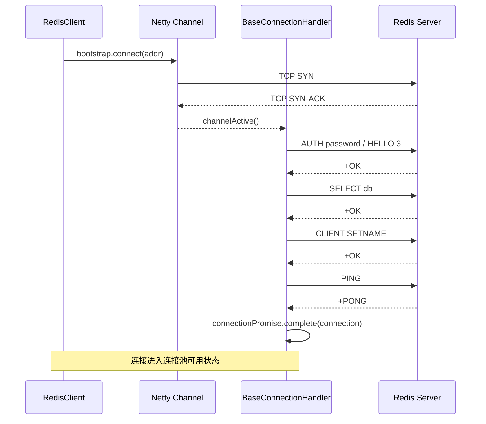

只有所有握手命令都成功后，`connectionPromise` 才会被 `complete(connection)`，连接才算正式可用并归还连接池。

### 3.4 ConnectionManager 体系：多部署模式适配

`ConnectionManager` 是连接管理器的顶层接口，针对不同 Redis 部署模式有不同实现：

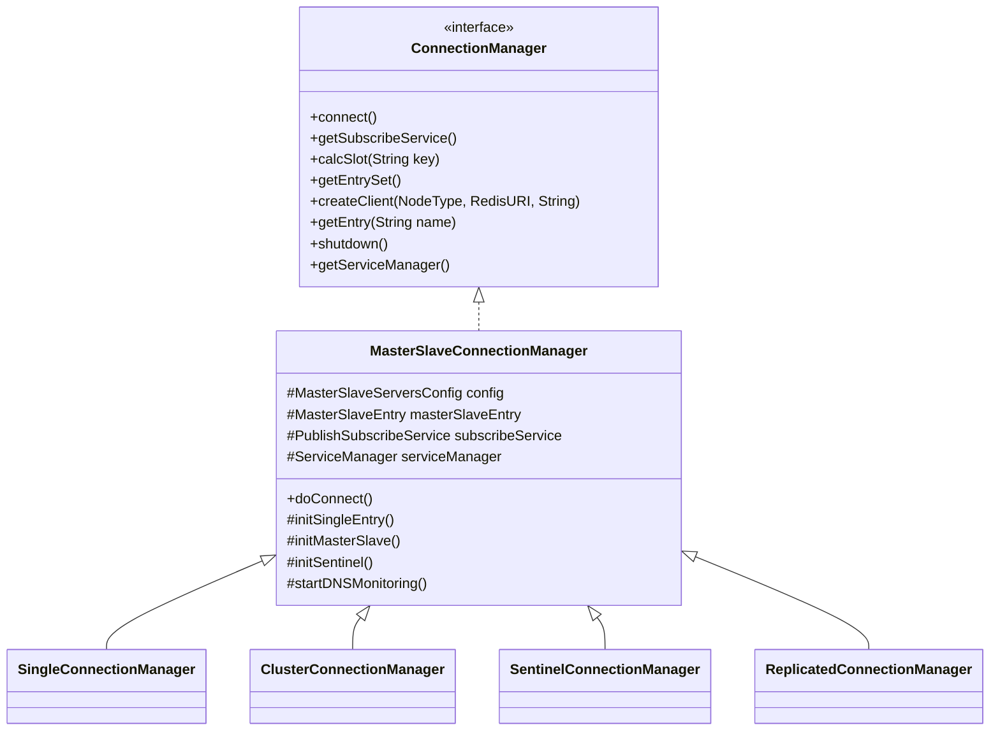

| 部署模式 | 连接管理器 | 节点发现方式 | 读写分离 |
|---------|----------|------------|---------|
| 单机 | `SingleConnectionManager` | 配置直接指定 | 否（读也走主） |
| 主从 | `MasterSlaveConnectionManager` | 配置直接指定 | 是 |
| 哨兵 | `SentinelConnectionManager` | 通过哨兵查询 | 是 |
| 集群 | `ClusterConnectionManager` | CLUSTER NODES / CLUSTER SLOTS | 是 |
| 复制 | `ReplicatedConnectionManager` | REPLICAOF / ROLE 查询 | 是 |

**ServiceManager**（`org.redisson.connection.ServiceManager`）是所有共享资源的集中管理者，在 `MasterSlaveConnectionManager` 构造时被创建：

- `EventLoopGroup group`：Netty 线程池（NIO / Epoll / KQueue / IOUring 根据配置选择）
- `Class<? extends DuplexChannel> socketChannelClass`：Socket Channel 类型
- `AddressResolverGroup<InetSocketAddress> resolverGroup`：DNS 解析器
- `ExecutorService executor`：业务线程池
- `HashedWheelTimer timer`：定时任务调度器（用于超时、重试、保活）
- `ConnectionEventsHub connectionEventsHub`：连接事件总线
- `IdleConnectionWatcher connectionWatcher`：空闲连接监视器

`ServiceManager` 还提供 `newTimeout()`、`calcSlot()`、`resolveIP()`、`addFuture()` 等通用方法。

### 3.5 连接池与 ConnectionsHolder

`ConnectionsHolder`（`org.redisson.connection.ConnectionsHolder.java:40`）是 Redisson 连接池的核心数据结构，采用**双队列 + 信号量**设计：

```java
public class ConnectionsHolder<T extends RedisConnection> {
    // 所有已创建的连接（包括使用中和空闲）
    private final Queue<T> allConnections = new ConcurrentLinkedQueue<>();
    // 空闲连接队列（LIFO，优先复用最近释放的连接，热数据更可能还在内核 buffer 中）
    private final Deque<T> freeConnections = new ConcurrentLinkedDeque<>();
    // 空闲连接计数信号量，控制最大连接数
    private final AsyncSemaphore freeConnectionsCounter;
    // 连接创建回调（区分普通连接与 PubSub 连接）
    private final Function<RedisClient, CompletionStage<T>> connectionCallback;
    private final RedisClient client;
    private final boolean changeUsage;
}
```

**连接获取流程**（`acquireConnection` → `connectTo`）：
1. 通过 `freeConnectionsCounter.acquire()` 异步获取一个许可（控制最大连接数）
2. 获取成功后调用 `pollConnection()` 从 `freeConnections` 队头弹出空闲连接
3. 若无空闲连接，调用 `createConnection()` 通过 `connectionCallback` 异步创建新连接
4. 创建过程实际调用 `RedisClient.connectAsync()` 或 `connectPubSubAsync()`

**连接释放流程**（`releaseConnection`）：
1. 更新连接的 `lastUsageTime`
2. 将连接 `addFirst` 到 `freeConnections` 队头（LIFO）
3. `freeConnectionsCounter.release()` 释放许可，唤醒等待的获取请求

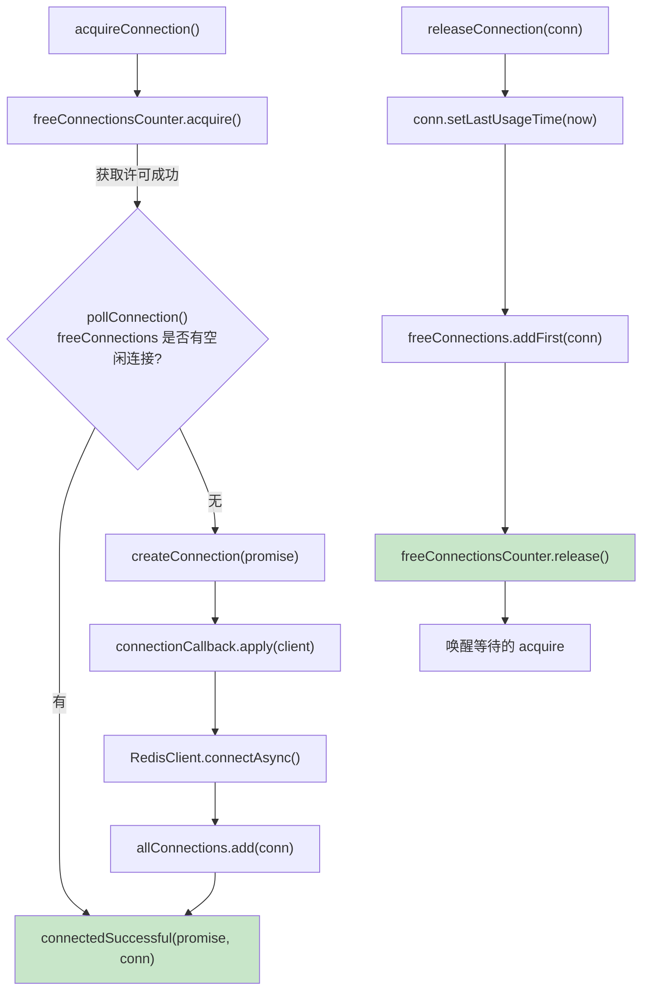

**关键设计**：
- `AsyncSemaphore` 是 Redisson 自实现的异步信号量，基于 `CompletableFuture` 队列实现，避免阻塞 EventLoop 线程
- `freeConnections` 使用 `ConcurrentLinkedDeque`（双端队列），释放时 `addFirst`（LIFO），优先复用刚释放的"热"连接
- `allConnections` 用于遍历所有连接（如空闲检测、关闭）

### 3.6 MasterSlaveEntry / SingleEntry：主从连接持有

`MasterSlaveEntry` 管理一个主从组的所有连接：

```java
public class MasterSlaveEntry {
    volatile ClientConnectionsEntry masterEntry;                          // 主节点
    final Map<RedisClient, ClientConnectionsEntry> client2Entry;          // 从节点映射
    final MasterConnectionPool masterConnectionPool;                      // 主节点连接池
    final MasterPubSubConnectionPool masterPubSubConnectionPool;
    final SlaveConnectionPool slaveConnectionPool;                         // 从节点连接池
    final PubSubConnectionPool slavePubSubConnectionPool;
}
```

每个 `ClientConnectionsEntry` 持有**两类连接池**：
```java
public class ClientConnectionsEntry {
    private final ConnectionsHolder<RedisConnection> connectionsHolder;        // 普通命令连接池
    private final ConnectionsHolder<RedisPubSubConnection> pubSubConnectionsHolder;  // PubSub 连接池
}
```

**普通命令连接与 PubSub 连接分离**的原因：
- PubSub 连接一旦订阅 channel 后会持续接收推送消息，不能复用为命令连接
- 避免大量 PubSub 消息阻塞普通命令执行
- 资源隔离，可独立配置连接池大小（`subscriptionConnectionPoolSize`）

`SingleEntry` 继承 `MasterSlaveEntry`，但重写 `connectionReadOp` 直接走主节点，不区分读写。

### 3.7 负载均衡器

`org.redisson.connection.balancer` 包下定义了从节点选择策略：

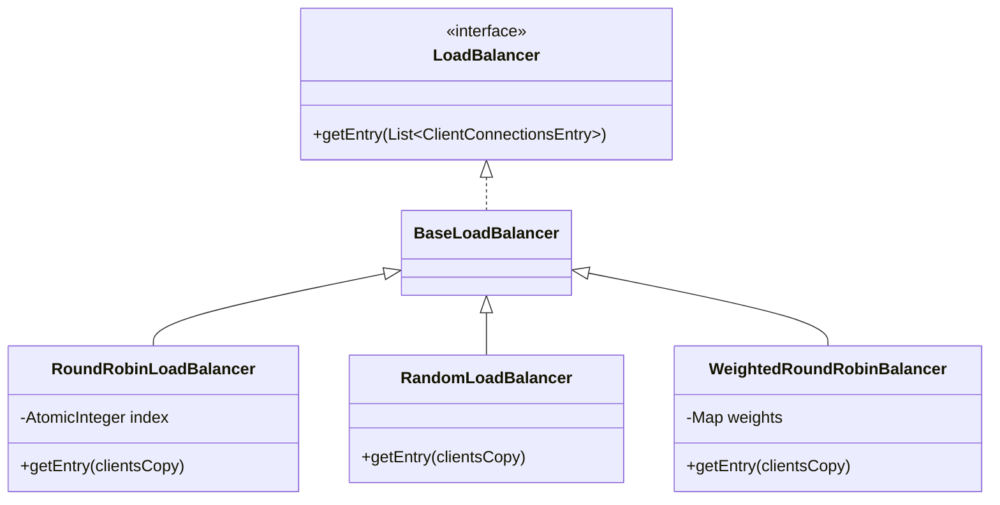

`RoundRobinLoadBalancer` 通过 `AtomicInteger` 原子递增取模实现轮询：
```java
public ClientConnectionsEntry getEntry(List<ClientConnectionsEntry> clientsCopy) {
    clientsCopy = filter(clientsCopy);   // 过滤冻结节点
    int ind = Math.floorMod(index.incrementAndGet(), clientsCopy.size());
    return clientsCopy.get(ind);
}
```

### 3.8 连接保活：PingConnectionHandler 与 IdleConnectionWatcher

Redisson 通过**两层保活机制**维持连接活性：

#### PingConnectionHandler（应用层心跳）

`PingConnectionHandler` 在 Channel 激活后启动定时 PING 任务：
- 间隔：`config.getPingConnectionInterval()`
- 只在连接空闲（`usage == 0`）且当前无阻塞命令时发送 PING
- PING 超时未响应则关闭连接，触发重连
- PING 命令本身也会走完整 RESP 编解码链路

#### IdleConnectionWatcher（空闲连接回收）

`IdleConnectionWatcher` 通过 `EventLoopGroup.scheduleWithFixedDelay` 周期性扫描所有连接池：
- 关闭超过 `idleConnectionTimeout` 的空闲连接
- 维持最小连接数（`minIdleConnections`），不足时主动创建
- 跳过有活跃订阅的 PubSub 连接

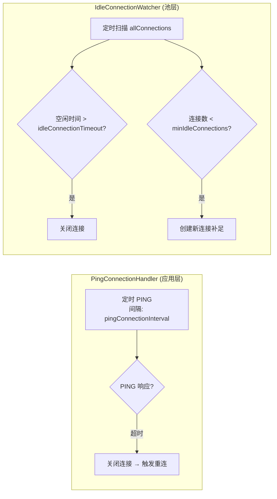

### 3.9 断线重连：ConnectionWatchdog

`ConnectionWatchdog`（在 `RedisChannelInitializer` 中以 `@Sharable` 方式注入 Pipeline）监听 `channelInactive` 事件，当连接断开时触发重连：

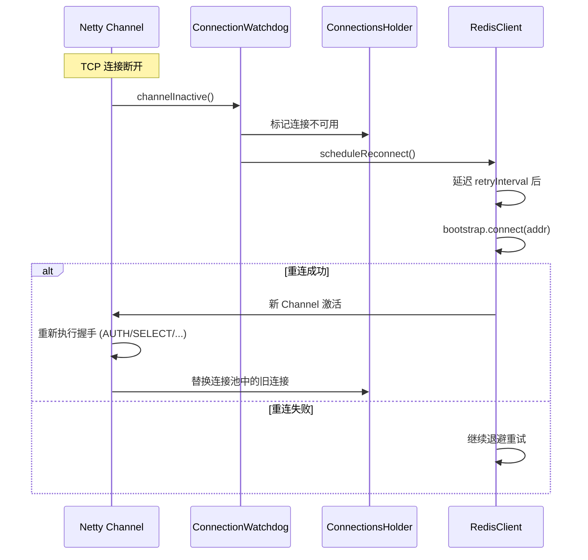

对于 PubSub 连接，重连后还需要**重新订阅所有 channel**（见 [7.5 PubSub 重连与重订阅](#75-pubsub-重连与重订阅)）。

### 3.10 DNS 解析与 DNSMonitor

`RedisClient.resolveAddr()` 方法负责 DNS 解析，结果通过 `AtomicReference` 缓存避免重复解析：

```java
public CompletableFuture<InetSocketAddress> resolveAddr() {
    if (resolvedAddrFuture.get() != null) {
        return resolvedAddrFuture.get();   // 缓存命中
    }
    CompletableFuture<InetSocketAddress> promise = new CompletableFuture<>();
    if (!resolvedAddrFuture.compareAndSet(null, promise)) {
        return resolvedAddrFuture.get();
    }
    // IP 直连
    byte[] addr = NetUtil.createByteArrayFromIpAddressString(uri.getHost());
    if (addr != null) {
        resolvedAddr = new InetSocketAddress(...);
        promise.complete((InetSocketAddress) resolvedAddr);
        return promise;
    }
    // DNS 解析
    AddressResolver<InetSocketAddress> resolver = ...;
    Future<InetSocketAddress> resolveFuture = resolver.resolve(...);
    resolveFuture.addListener(future -> {
        if (!future.isSuccess()) {
            promise.completeExceptionally(new RedisConnectionException(future.cause()));
            return;
        }
        resolvedAddr = future.getNow();
        promise.complete((InetSocketAddress) resolvedAddr);
    });
    return promise;
}
```

`DNSMonitor` 定期检查域名解析结果是否变化，当 IP 改变时更新连接池中的节点，实现**域名级别的连接迁移**（适用于云上 Redis 实例 IP 切换场景）。

---

## 四、命令执行层

### 4.1 CommandAsyncService：命令执行入口

`CommandAsyncService`（`org.redisson.command.CommandAsyncService`）是 `CommandAsyncExecutor` 接口的核心实现，是所有 Redisson 命令（`RedissonBucket`、`RedissonLock` 等）的统一执行入口。

**核心字段**：
- `ConnectionManager connectionManager`：连接管理器
- `RedissonObjectBuilder objectBuilder`：对象构建器（处理 RedissonReference）
- `DefaultCommandMapper commandMapper`：命令映射
- `boolean evalShaROSupported`：从节点是否支持 EVALSHA

**核心方法签名**（接口定义）：
```java
// 写入（走主节点）
<T, R> RFuture<R> writeAsync(byte[] key, Codec codec, RedisCommand<T> command, Object... params);
<T, R> RFuture<R> writeAsync(MasterSlaveEntry entry, Codec codec, RedisCommand<T> command, Object... params);

// 读取（走从节点）
<T, R> RFuture<R> readAsync(byte[] key, Codec codec, RedisCommand<T> command, Object... params);

// EVAL 脚本
<T, R> RFuture<R> evalWriteAsync(String key, Codec codec, RedisCommand<T> evalCommandType, String script, List<Object> keys, Object... params);
```

**典型执行入口**（`writeAsync(byte[] key, ...)`）：
```java
public <T, R> RFuture<R> writeAsync(byte[] key, Codec codec, RedisCommand<T> command, Object... params) {
    CompletableFuture<R> mainPromise = createPromise();                    // 1. 创建主 Promise
    NodeSource source = getNodeSource(key, true);                         // 2. 根据 key 计算 NodeSource
    RedisExecutor<T, R> executor = createExecutor(false, source, codec, command, params, mainPromise, false, false);
    executor.execute();                                                   // 3. 启动执行流程
    return new CompletableFutureWrapper<>(mainPromise);
}
```

`CommandAsyncService` 自身**不直接执行命令**，而是构造 `RedisExecutor` 并委托执行。这种"门面 + 执行器"的分离使得批量执行（`RedisBatchExecutor`）可以复用同样的执行框架。

**同步 API**：通过 `get(RFuture)` 阻塞等待异步结果：
```java
public <V> V get(RFuture<V> future) {
    try {
        return future.get();
    } catch (InterruptedException e) {
        Thread.currentThread().interrupt();
        throw new CompletionException(e);
    } catch (ExecutionException e) {
        throw convertException(e);
    }
}
```

### 4.2 RedisExecutor：核心执行器

`RedisExecutor`（`org.redisson.command.RedisExecutor.java`）是 Redisson 命令执行的核心，负责**单条命令的完整生命周期**：连接获取 -> 编码 -> 发送 -> 等待响应 -> 解码 -> 重试/重定向 -> 回调完成。

**核心字段**：
```java
final boolean readOnlyMode;                  // 是否只读（决定走主还是走从）
final RedisCommand<V> command;               // 命令定义
final Object[] params;                       // 命令参数
final CompletableFuture<R> mainPromise;      // 主 Promise（对外暴露）
final boolean ignoreRedirect;                // 是否忽略重定向
final ConnectionManager connectionManager;
final int attempts;                          // 最大重试次数
final DelayStrategy retryStrategy;           // 重试延迟策略
final int responseTimeout;                   // 响应超时

CompletableFuture<RedisConnection> connectionFuture;   // 连接获取 Future
NodeSource source;                           // 节点源
MasterSlaveEntry entry;                      // 主从入口
volatile int attempt;                        // 当前重试计数
volatile Optional<Timeout> timeout;          // 超时定时器
volatile ChannelFuture writeFuture;          // 写入 Future
```

### 4.3 execute() 完整流程拆解

`execute()` 方法（`RedisExecutor.java:119`）是整个执行流程的入口与核心。它通过一系列 `whenComplete` 回调串联起完整的异步流程：

```java
// RedisExecutor.java:119-227（简化）
public void execute() {
    if (mainPromise.isCancelled()) { free(); return; }                        // 0. 取消检查

    if (connectionManager.getServiceManager().isShuttingDown()) {              // 1. 关闭检查
        free();
        mainPromise.completeExceptionally(new RedissonShutdownException("Redisson is shutdown"));
        return;
    }

    try {
        codec = getCodec(codec);                                             // 2. 初始化编解码器

        CompletableFuture<R> attemptPromise = new CompletableFuture<>();      // 3. 本次尝试 Promise
        CompletableFuture<RedisConnection> connectionFuture = getConnection(attemptPromise);  // 4. 异步获取连接

        // 5. 注册主 Promise 取消监听器（取消时传播取消到连接获取/写入）
        mainPromiseListener = (r, e) -> { ... };

        retryInterval = retryStrategy.calcDelay(attempt).toMillis();         // 6. 计算重试间隔

        scheduleRetryTimeout(connectionFuture, attemptPromise);              // 7. 调度重试超时
        scheduleConnectionTimeout(attemptPromise, connectionFuture);         // 8. 调度连接超时

        // 9. 连接获取完成回调
        connectionFuture.whenComplete((connection, e) -> {
            if (connectionFuture.isCancelled()) return;
            if (connectionManager.getServiceManager().isShuttingDown()) { ... return; }
            if (connectionFuture.isCompletedExceptionally()) { ... return; }

            sendCommand(attemptPromise, connection);                          // 10. 发送命令
            scheduleWriteTimeout(attemptPromise);                             // 11. 调度写入超时
            writeFuture.addListener(future -> checkWriteFuture(writeFuture, attemptPromise, connection));  // 12. 写入结果检查
        });

        // 13. 尝试 Promise 完成回调
        attemptPromise.whenComplete((r, e) -> {
            releaseConnection(attemptPromise, connectionFuture);             // 释放连接
            checkAttemptPromise(attemptPromise, connectionFuture);           // 结果处理（重试/重定向/完成）
        });
    } catch (Exception e) {
        free();
        handleError(connectionFuture, e);
        throw e;
    }
}
```

#### execute() 流程图

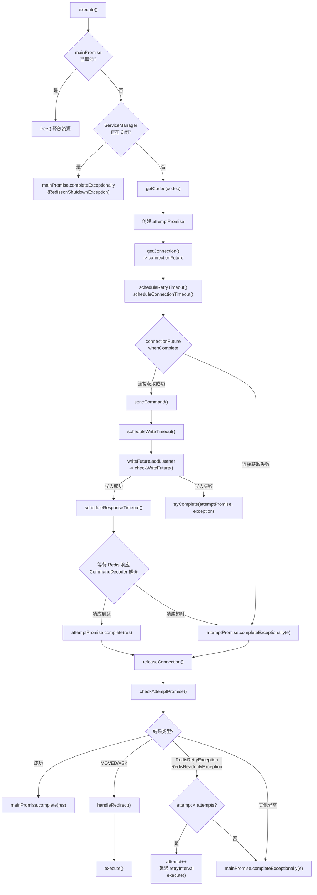

### 4.4 命令发送：sendCommand

`sendCommand`（`RedisExecutor.java:688`）负责将命令通过连接发送出去：

```java
protected void sendCommand(CompletableFuture<R> attemptPromise, RedisConnection connection) {
    if (source.getRedirect() == Redirect.ASK) {
        // ASK 重定向：先发送 ASKING，再发送原命令
        List<CommandData<?, ?>> list = new ArrayList<>(2);
        list.add(new CommandData<>(new CompletableFuture<>(), codec, RedisCommands.ASKING, new Object[]{}));
        list.add(new CommandData<>(attemptPromise, codec, command, params));
        writeFuture = connection.send(new CommandsData(main, list, false, false));
    } else {
        // 普通命令：包装为 CommandData 发送
        writeFuture = connection.send(new CommandData<>(attemptPromise, codec, command, params));

        // 小连接池优化：写完立即释放连接
        if (connectionManager.getServiceManager().getConfig().getMasterConnectionPoolSize() < 10
                && !command.isBlockingCommand()) {
            release(connection);
        }
    }
}
```

`RedisConnection.send(CommandData)` 的实现非常简单——直接调用 Netty 的 `channel.writeAndFlush(data)`：

```java
public <T, R> ChannelFuture send(CommandData<T, R> data) {
    return channel.writeAndFlush(data);
}
```

`writeAndFlush` 触发出站链：`CommandsQueue` -> `CommandBatchEncoder` -> `CommandEncoder` -> TCP。

**`CommandData` 是命令的载体**，封装了：
- `CompletableFuture<R> promise`：响应回调
- `Codec codec`：编解码器
- `RedisCommand<T> command`：命令定义（名称、解码器、类型转换器）
- `Object[] params`：命令参数

### 4.5 超时控制体系

Redisson 的超时控制是**多层级**的，每一层都有独立的定时器：

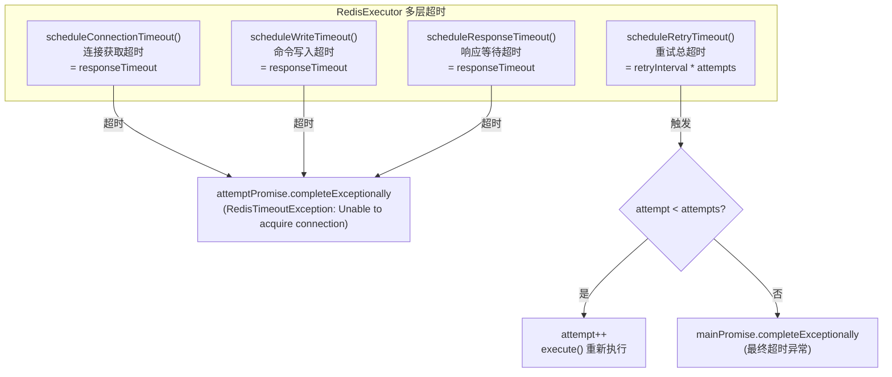

**关键超时方法**：

1. **scheduleConnectionTimeout**（行 229）：等待 `responseTimeout` 后若连接仍未获取，抛 `RedisTimeoutException: Unable to acquire connection! Increase connection pool size.`

2. **scheduleWriteTimeout**（行 251）：连接获取成功后，等待命令写入 Channel 完成

3. **scheduleResponseTimeout**：在 `checkWriteFuture` 中调用（行 391），写入成功后开始计时等待响应

4. **scheduleRetryTimeout**（行 280-360）：整个重试逻辑的核心。它是一个 `TimerTask`，在 `retryInterval` 后触发：
   - 若 `attemptPromise` 已完成，直接返回
   - 若连接还未获取，标记连接超时
   - 若连接已获取但命令还未写入，检查写入状态
   - 若达到最大重试次数 `attempts`，最终失败
   - 否则 `attempt++` 并重新执行 `execute()`

**重试退避**：通过 `DelayStrategy` 接口实现，默认支持指数退避（`ExponentialDelayStrategy`），延迟 = `baseDelay * 2^attempt`，上限 `maxDelay`。

### 4.6 重试机制

`checkAttemptPromise` 方法（行 626 附近）负责处理 `attemptPromise` 的最终结果，决定重试、重定向还是完成：

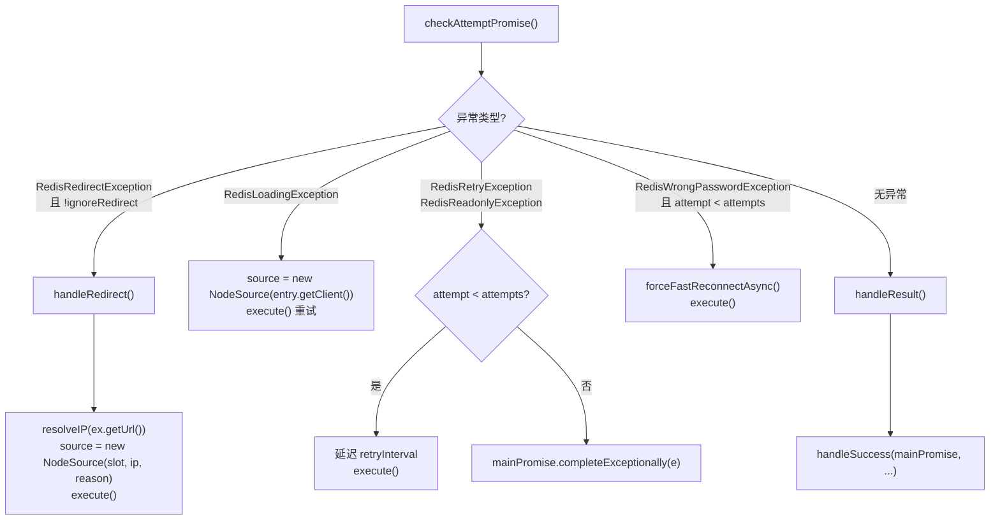

**重试触发条件汇总**：

| 异常 | 含义 | 处理 |
|------|------|------|
| `RedisRedirectException` | 集群 MOVED/ASK | 更新 `NodeSource`，重新执行 |
| `RedisLoadingException` | 节点正在加载数据 | 切换到其他节点重试 |
| `RedisRetryException` | 服务器要求重试（TRYAGAIN） | 延迟后重试 |
| `RedisReadonlyException` | 从节点只读 | 切换主节点重试 |
| `RedisWrongPasswordException` | 密码错误 | 强制重连后重试 |
| 连接超时/写入超时 | 网络问题 | 延迟后重试 |

### 4.7 重定向处理：MOVED / ASK

集群模式下，当命令发送到错误的节点时，Redis 返回 `MOVED` 或 `ASK` 错误。`CommandDecoder` 在解码 `-` 开头的错误响应时会解析这些错误并抛出对应异常（`CommandDecoder.java:384-397`）：

```java
if (error.startsWith("MOVED")) {
    String[] errorParts = error.split(" ");
    int slot = Integer.valueOf(errorParts[1]);
    String addr = errorParts[2];
    data.tryFailure(new RedisMovedException(slot, new RedisURI(scheme + "://" + addr)));
} else if (error.startsWith("ASK")) {
    String[] errorParts = error.split(" ");
    int slot = Integer.valueOf(errorParts[1]);
    String addr = errorParts[2];
    data.tryFailure(new RedisAskException(slot, new RedisURI(scheme + "://" + addr)));
}
```

`RedisExecutor.handleRedirect`（行 626）处理重定向：
```java
private void handleRedirect(RedisRedirectException ex, CompletableFuture<RedisConnection> connectionFuture, Redirect reason) {
    onException();
    CompletableFuture<RedisURI> ipAddrFuture = connectionManager.getServiceManager().resolveIP(ex.getUrl());
    ipAddrFuture.whenComplete((ip, e) -> {
        if (e != null) { free(); handleError(connectionFuture, e); return; }
        source = new NodeSource(ex.getSlot(), ip, reason);   // 更新节点源
        execute();                                            // 重新执行
    });
}
```

**MOVED 与 ASK 的区别**：
- **MOVED**：槽位已永久迁移，更新本地槽位映射表，后续命令直接发往新节点
- **ASK**：槽位临时迁移中，本次命令需要先发 `ASKING` 再发原命令（`sendCommand` 中处理，行 689-695）

### 4.8 故障转移与节点失败检测

`handleError`（行 663）在命令最终失败时调用 `FailedNodeDetector`：

```java
protected void handleError(CompletableFuture<RedisConnection> connectionFuture, Throwable cause) {
    mainPromise.completeExceptionally(cause);
    RedisClient client = connectionFuture.join().getRedisClient();
    FailedNodeDetector detector = client.getConfig().getFailedNodeDetector();
    detector.onCommandFailed(cause);                          // 累计失败次数
    if (detector.isNodeFailed()) {                            // 达到阈值，判定节点故障
        log.error("Redis node {} has been marked as failed...", entry.getClient().getAddr(), detector);
        entry.shutdownAndReconnectAsync(client, cause);       // 关闭并重连
    }
}
```

`FailedNodeDetector` 默认实现基于**连续失败次数**判定节点是否故障。故障后触发 `shutdownAndReconnectAsync`，关闭旧连接并尝试重新建立连接。集群模式下还会触发拓扑刷新（`ClusterConnectionManager` 监听连接事件）。

### 4.9 槽位路由与 CRC16

集群模式下，命令需要根据 key 的槽位（0-16383）路由到对应节点。槽位计算由 `CRC16.calcHash(key) % 16384` 完成。

**槽位路由流程**：
```mermaid
flowchart LR
    A["writeAsync(byte[] key, ...)"] --> B["getNodeSource(key, true)"]
    B --> C["calcSlot(key)<br/>CRC16 计算"]
    C --> D["new NodeSource(slot)"]
    D --> E["RedisExecutor.execute()"]
    E --> F["getConnection()"]
    F --> G["connectionManager.getWriteEntry(slot)<br/>找到 slot 对应的 MasterSlaveEntry"]
    G --> H["entry.connectionWriteOp()"]
    H --> I["获取主节点连接"]
```

**Hash Tag 优化**：当 key 包含 `{...}` 时，只对 `{}` 内的部分计算槽位，使得不同 key 可以路由到同一槽位，从而支持跨 key 操作（如 MGET、事务）。`CRC16` 实现位于 `org.redisson.connection.CRC16`。

---

## 五、编解码层（RESP 协议）

编解码层是 Redisson 与 Redis 通信的**协议层**，负责 Java 对象与 Redis 协议字节流之间的相互转换。Redisson 采用**两层编解码**设计：
- **底层 RESP 协议层**：`CommandEncoder` / `CommandDecoder`，处理 RESP 协议字节流
- **上层业务对象层**：`Codec` 体系，处理 Java 对象与 RESP 中间表示之间的转换

### 5.1 RESP 协议概述

RESP（Redis Serialization Protocol）是 Redis 客户端与服务端之间的通信协议。Redis 6.0 引入 RESP3，Redisson 4.3.0 同时支持 RESP2 与 RESP3。

| RESP 类型 | 首字节 | 含义 | 示例 |
|----------|--------|------|------|
| Simple String | `+` | 简单字符串成功响应 | `+OK\r\n` |
| Error | `-` | 错误响应 | `-ERR unknown command\r\n` |
| Integer | `:` | 整数 | `:1000\r\n` |
| Bulk String | `$` | 二进制安全的字符串 | `$5\r\nhello\r\n` |
| Array | `*` | 数组（RESP2） | `*2\r\n$3\r\nfoo\r\n$3\r\nbar\r\n` |
| Null | `_` | 空值（RESP3） | `_\r\n` |
| Double | `,` | 浮点数（RESP3） | `,3.14\r\n` |
| Boolean | `#` | 布尔值（RESP3） | `#t\r\n` |
| Map | `%` | 映射（RESP3） | `%2\r\n+key1\r\n:1\r\n+key2\r\n:2\r\n` |
| Verbatim String | `=` | 原样字符串（RESP3） | `=15\r\ntxt:Hello world\r\n` |
| Push | `>` | 推送消息（RESP3） | `>2\r\n$7\r\nmessage\r\n...` |
| Set | `~` | 集合（RESP3） | `~2\r\n+foo\r\n+bar\r\n` |

每条命令以 `*<参数个数>\r\n` 开头，后跟每个参数的 `$<长度>\r\n<内容>\r\n`。

### 5.2 CommandEncoder：命令编码

`CommandEncoder`（`org.redisson.client.handler.CommandEncoder.java:58`）继承自 Netty 的 `MessageToByteEncoder<CommandData<?, ?>>`，负责将 `CommandData` 编码为 RESP 字节流。

```java
// CommandEncoder.java:103-139
@Override
protected void encode(ChannelHandlerContext ctx, CommandData<?, ?> msg, ByteBuf out) throws Exception {
    try {
        // 1. 写入数组头 *N
        out.writeByte(ARGS_PREFIX);                                    // '*'
        int len = 1 + msg.getParams().length;
        if (msg.getCommand().getSubName() != null) {
            len++;                                                     // 子命令（如 SCRIPT EXISTS）
        }
        out.writeBytes(longToString(len));                             // 参数个数
        out.writeBytes(CRLF);                                          // \r\n

        // 2. 写入命令名
        String name = commandMapper.map(msg.getCommand().getName());   // 命令名映射
        writeArgument(out, name.getBytes(CharsetUtil.UTF_8));
        if (msg.getCommand().getSubName() != null) {
            writeArgument(out, msg.getCommand().getSubName().getBytes(CharsetUtil.UTF_8));
        }

        // 3. 逐个编码参数
        for (Object param : msg.getParams()) {
            ByteBuf buf = encode(param);                               // 参数编码
            writeArgument(out, buf);
            if (!(param instanceof ByteBuf)) {
                buf.release();                                         // 释放临时 ByteBuf
            }
        }
    } catch (Exception e) {
        msg.tryFailure(e);
        throw e;
    }
}

// 单个参数编码为 $<长度>\r\n<内容>\r\n
private void writeArgument(ByteBuf out, byte[] arg) {
    out.writeByte(BYTES_PREFIX);                                       // '$'
    out.writeBytes(longToString(arg.length));                           // 长度
    out.writeBytes(CRLF);                                              // \r\n
    out.writeBytes(arg);                                               // 内容
    out.writeBytes(CRLF);                                              // \r\n
}
```

**参数对象到 ByteBuf 的转换**（`encode(Object in)`，行 141-159）：
- `null` -> `EmptyByteBuf`
- `byte[]` -> `Unpooled.wrappedBuffer`
- `ByteBuf` -> 直接返回（零拷贝）
- `ChannelName` -> 包装内部 byte[]
- 其他 -> `toString()` 后 UTF-8 编码

**性能优化**：`longToString` 方法使用 0-999 的字节数组缓存（`LONG_TO_STRING_CACHE`），避免频繁 `Long.toString()` 的字符串分配。`CommandEncoder` 被标记为 `@Sharable`，所有 Channel 共享同一实例。

#### 编码示例

执行 `SET foo bar` 时，`CommandEncoder` 输出的字节流：
```
*3\r\n
$3\r\n
SET\r\n
$3\r\n
foo\r\n
$3\r\n
bar\r\n
```

### 5.3 CommandDecoder：响应解码状态机

`CommandDecoder`（`org.redisson.client.handler.CommandDecoder.java:60`）继承自 Netty 的 `ReplayingDecoder<State>`，是 RESP 协议解析的核心。它实现了**完整的 RESP 协议状态机**，支持 RESP2 与 RESP3。

#### decode 方法状态机

`decode` 方法（`CommandDecoder.java:356-494`）通过读取首字节判断响应类型，分支处理：

```java
// CommandDecoder.java:358-494（核心分支）
protected void decode(ByteBuf in, CommandData<Object, Object> data, List<Object> parts,
                      Channel channel, boolean skipConvertor, List<CommandData<?, ?>> commandsData, long partsSize, State state) throws IOException {
    int code = in.readByte();
    if (code == '_') {                          // RESP3 Null
        readCRLF(in);
        handleResult(data, parts, null, false);
    } else if (code == '+') {                   // Simple String
        String result = readString(in, StandardCharsets.UTF_8);
        handleResult(data, parts, result, skipConvertor);
    } else if (code == ',') {                   // RESP3 Double
        String str = readString(in, StandardCharsets.US_ASCII);
        Double result = Double.NaN;
        if (!"nan".equals(str)) {
            result = Double.valueOf(str);
        }
        handleResult(data, parts, result, skipConvertor);
    } else if (code == '-') {                   // Error
        String error = readString(in, StandardCharsets.US_ASCII);
        // 详细的错误类型分类处理（见下文）
    } else if (code == ':') {                   // Integer
        Long result = readLong(in);
        handleResult(data, parts, result, false);
    } else if (code == '=') {                   // RESP3 Verbatim String
        ByteBuf buf = readBytes(in);
        if (buf != null) {
            buf.skipBytes(4);                   // 跳过 3 字符类型前缀 + ':'
            Decoder<Object> decoder = selectDecoder(data, parts, partsSize, state);
            Object result = decoder.decode(buf, state);
        }
        handleResult(data, parts, result, false);
    } else if (code == '$') {                   // Bulk String
        ByteBuf buf = readBytes(in);
        if (buf != null) {
            Decoder<Object> decoder = selectDecoder(data, parts, partsSize, state);
            Object result = decoder.decode(buf, state);
        }
        handleResult(data, parts, result, false);
    } else if (code == '*' || code == '>' || code == '~') {   // Array / Push / Set
        Long size = readLong(in);
        List<Object> respParts = new ArrayList<>(Math.max(size.intValue(), 0));
        state.incLevel();
        decodeList(in, data, parts, channel, size, respParts, skipConvertor, commandsData, state);
        state.decLevel();
    } else if (code == '%') {                   // RESP3 Map
        long size = readLong(in) * 2;            // Map 的 size 是键值对数量，需要 *2
        List<Object> respParts = new ArrayList<>(Math.max((int) size, 0));
        state.incLevel();
        decodeList(in, data, parts, channel, size, respParts, skipConvertor, commandsData, state);
        state.decLevel();
    } else if (code == '#') {                   // RESP3 Boolean
        String r = readString(in, StandardCharsets.US_ASCII);
        handleResult(data, parts, "t".equals(r) ? 1L : 0L, false);
    } else {
        throw new IllegalStateException("Can't decode replay: " + ...);
    }
}
```

#### 错误响应分类处理

`-` 开头的错误响应会被细分为多种异常类型（`CommandDecoder.java:375-443`），每种对应一个具体的异常类：

```mermaid
flowchart TD
    ERR["- 错误响应"] --> R{"错误前缀?"}
    R -->|MOVED slot addr| MOVED["RedisMovedException<br/>集群槽位永久迁移"]
    R -->|ASK slot addr| ASK["RedisAskException<br/>集群槽位临时迁移"]
    R -->|TRYAGAIN| TRY["RedisTryAgainException<br/>集群繁忙重试"]
    R -->|LOADING| LOAD["RedisLoadingException<br/>节点正在加载数据"]
    R -->|OOM| OOM["RedisOutOfMemoryException<br/>内存不足"]
    R -->|NOAUTH| NA["RedisAuthRequiredException<br/>需要认证"]
    R -->|WRONGPASS| WP["RedisWrongPasswordException<br/>密码错误"]
    R -->|CLUSTERDOWN| CD["RedisClusterDownException<br/>集群下线"]
    R -->|MASTERDOWN| MD["RedisMasterDownException<br/>主节点下线"]
    R -->|BUSY| BUSY["RedisBusyException<br/>BUSY"]
    R -->|WAIT| WAIT["RedisWaitException<br/>WAIT 失败"]
    R -->|READONLY| RO["RedisReadonlyException<br/>从节点只读"]
    R -->|NOSCRIPT| NS["RedisNoScriptException<br/>脚本不存在"]
    R -->|NOREPLICAS| NR["RedisNoReplicasException<br/>无可用从节点"]
    R -->|其他| GEN["RedisException<br/>通用错误"]
```

这些异常会在 `RedisExecutor.checkAttemptPromise` 中被进一步处理（重试、重定向等）。

#### 数组与嵌套解析

`decodeList` 方法（行 508）处理数组、Map、Push 等复合类型。它会**递归调用** `decode` 解析每个元素，并通过 `MultiDecoder` 将解析出的 `parts` 列表组装为最终 Java 对象：

```java
private void decodeList(ByteBuf in, CommandData<Object, Object> data, List<Object> parts,
        Channel channel, long size, List<Object> respParts, ...) throws IOException {
    for (long i = respParts.size(); i < size; i++) {
        // 递归解析每个数组元素
        decode(in, commandData, respParts, channel, skipConvertor, commandsData, size, state);
    }
    // 当所有元素解析完成，调用 MultiDecoder 组装最终结果
}
```

### 5.4 半包/粘包处理

`CommandDecoder` 继承自 Netty 的 `ReplayingDecoder<State>`，这是 Netty 专门为**半包问题**设计的解码器基类。其核心机制：

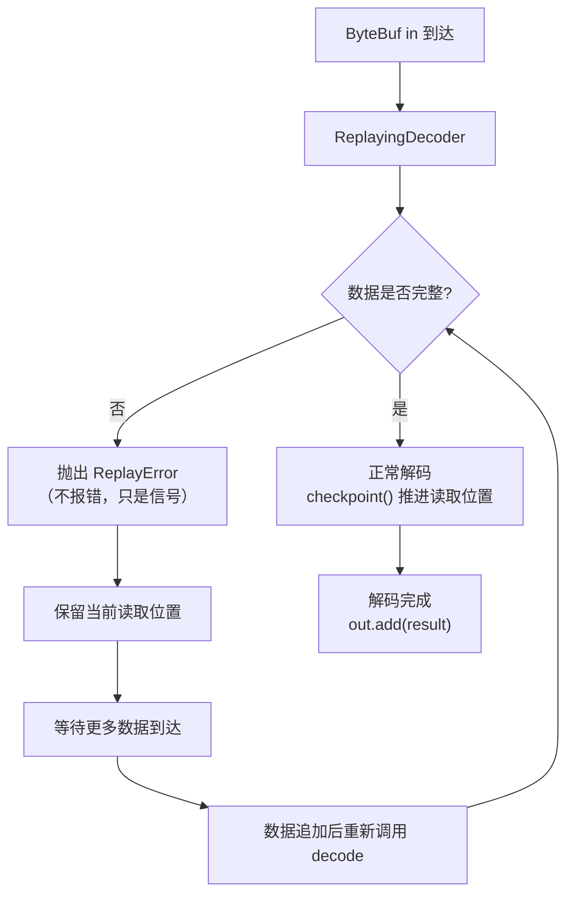

**`ReplayingDecoder` 的工作原理**：
- 当 `in.readXxx()` 发现数据不足时，**不会抛出真正的异常**，而是抛出一个特殊的 `Signal`（通过 `REPLAY` 机制）
- Netty 捕获这个信号，保留当前的 `readerIndex`，等待下一次数据到达
- 数据到达后，**从头开始重新执行 `decode` 方法**（不是从断点继续）

**`State` 类**：`CommandDecoder` 通过 `State` 对象维护跨多次调用的解析状态：
- `batchIndex`：批量命令的当前处理索引
- `level`：嵌套数组层级
- `value`：临时存储

通过 `checkpoint()` 方法保存当前状态，使得半包恢复后能正确继续解析。

**`skipCommand` 与 `skipBatchCommand`**：在正式解码前，`CommandDecoder` 会先扫描整个命令的字节范围（`endIndex`），用于在解码失败时回滚 `readerIndex` 到安全位置，避免损坏后续命令的解析。

### 5.5 Codec 体系：业务对象编解码

`Codec` 接口（`org.redisson.client.codec.Codec`）定义了业务对象的编解码契约，与 RESP 协议层解耦：

```java
public interface Codec {
    Decoder<Object> getMapValueDecoder();     // Hash 值解码
    Encoder getMapValueEncoder();              // Hash 值编码
    Decoder<Object> getMapKeyDecoder();        // Hash 键解码
    Encoder getMapKeyEncoder();                // Hash 键编码
    Decoder<Object> getValueDecoder();        // 通用值解码
    Encoder getValueEncoder();                 // 通用值编码
    ClassLoader getClassLoader();
}
```

#### Codec 体系类图

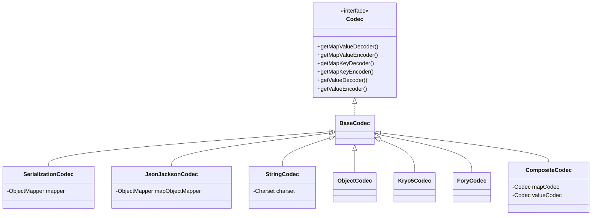

#### 主要 Codec 实现

| Codec | 序列化方式 | 适用场景 | 特点 |
|-------|----------|---------|------|
| `SerializationCodec` | Java 原生序列化 | 兼容任意 Serializable | 体积大，不跨语言 |
| `JsonJacksonCodec` | Jackson JSON | 通用，可读性好 | 跨语言，性能中等 |
| `StringCodec` | 直接字符串 | 纯字符串存储 | 最快，无序列化开销 |
| `ObjectCodec` | 默认对象编解码 | 兜底 | 基于 Serializable |
| `Kryo5Codec` | Kryo 5 | 高性能 Java 内部 | 体积小，速度快 |
| `ForyCodec` | Fory | 高性能 Java 内部 | 比 Kryo 更快 |
| `AvroJacksonCodec` | Avro | Schema 演化场景 | 跨语言 |
| `CborJacksonCodec` | CBOR | 二进制 JSON | 比 JSON 紧凑 |
| `SmileJacksonCodec` | Smile | 二进制 JSON | Jackson 生态 |
| `MsgPackJacksonCodec` | MessagePack | 跨语言二进制 | 紧凑 |
| `ZStdCodec` / `LZ4Codec` / `SnappyCodecV2` | 压缩 | 大数据存储 | 压缩 + 内层 Codec |
| `ProtobufCodec` | Protobuf | 强类型跨语言 | 需 .proto 定义 |
| `MapCacheEventCodec` | 自定义 | MapCache 事件 | 内部使用 |

**`CompositeCodec`**：组合多个 Codec，允许 Hash 的 key、value 与普通值使用不同 Codec。例如 Map 的 key 用 `StringCodec`，value 用 `JsonJacksonCodec`。

**`DefaultReferenceCodecProvider`**：Codec 注册中心，管理 Codec 实例的创建与复用。

### 5.6 Decoder / Encoder 接口体系

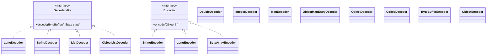

**`Decoder` 接口**（`org.redisson.client.protocol.Decoder`）：
```java
public interface Decoder<R> {
    R decode(ByteBuf buf, State state) throws IOException;
}
```
接收 RESP 解析出的 `ByteBuf`（Bulk String 内容），返回 Java 对象。

**`Encoder` 接口**（`org.redisson.client.protocol.Encoder`）：
```java
public interface Encoder {
    ByteBuf encode(Object in) throws IOException;
}
```
接收 Java 对象，返回 ByteBuf（供 `CommandEncoder` 写入 RESP）。

### 5.7 MultiDecoder：复杂结构解码

`MultiDecoder`（`org.redisson.client.protocol.decoder.MultiDecoder`）用于处理**嵌套 RESP 响应**，如 HGETALL、MGET、SCAN 等：

```java
public interface MultiDecoder<T> {
    // 选择每个元素的解码器
    default Decoder<Object> getDecoder(Codec codec, int paramNum, State state, long size, List<Object> parts) {
        return getDecoder(codec, paramNum, state, size);
    }
    // 将解析出的 parts 列表组装为最终对象
    T decode(List<Object> parts, State state);
}
```

**工作流程**：
1. `CommandDecoder` 遇到 `*N` 数组时，创建 `respParts` 列表
2. 递归解析每个元素，调用 `MultiDecoder.getDecoder()` 选择对应 `Decoder`
3. 元素解析结果加入 `respParts`
4. 所有元素解析完成后，调用 `MultiDecoder.decode(parts, state)` 组装最终对象

**示例**：`HGETALL` 命令返回 `*4\r\n$3\r\nkey1\r\n$5\r\nvalue1\r\n$3\r\nkey2\r\n$5\r\nvalue2\r\n`，`MapReplayDecoder` 将 `[key1, value1, key2, value2]` 组装为 `Map{key1=value1, key2=value2}`。

#### 完整编解码数据流

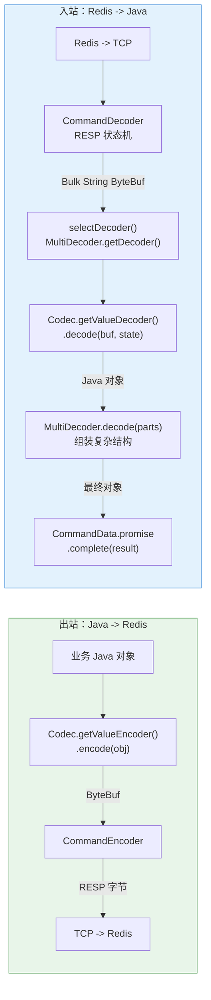

---

## 六、批量执行

### 6.1 CommandBatchService 概览

`CommandBatchService`（`org.redisson.command.CommandBatchService`）继承自 `CommandAsyncService`，提供批量命令执行能力。它将多条命令按目标节点分组，一次性发送。

**核心字段**：
- `ConcurrentMap<NodeSource, Entry> commands`：按节点分组的命令
- `Map<MasterSlaveEntry, ConnectionEntry> connections`：节点到连接的映射
- `BatchOptions options`：批量执行选项
- `AtomicBoolean executed`：是否已执行（防止重复执行）

### 6.2 两种批量模式：Pipeline 与 MULTI/EXEC

`BatchOptions` 支持两种执行模式：

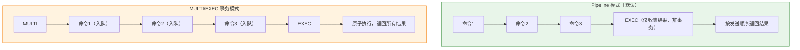

**差异**：
| 维度 | Pipeline 模式 | MULTI/EXEC 模式 |
|------|--------------|-----------------|
| 原子性 | 无（命令间可插入其他客户端命令） | 有（事务） |
| 性能 | 更高（无事务开销） | 略低（事务开销） |
| 失败影响 | 单条失败不影响其他 | 整个事务回滚 |
| 实现 | `RedisCommonBatchExecutor` | `RedisQueuedBatchExecutor` |

### 6.3 RedisQueuedBatchExecutor：命令入队

`RedisQueuedBatchExecutor`（`org.redisson.command.RedisQueuedBatchExecutor`）处理 MULTI/EXEC 事务模式：

```java
@Override
protected void sendCommand(CompletableFuture<R> attemptPromise, RedisConnection connection) {
    if (connectionEntry.isFirstCommand()) {
        // 首个命令：先发 MULTI，再发原命令
        List<CommandData<?, ?>> list = new ArrayList<>(2);
        list.add(new CommandData<>(new CompletableFuture<>(), codec, RedisCommands.MULTI, new Object[]{}));
        list.add(new CommandData<>(attemptPromise, codec, command, params));
        writeFuture = connection.send(new CommandsData(mainPromise, list, true, syncSlaves));
        connectionEntry.setFirstCommand(false);
    } else if (RedisCommands.EXEC.getName().equals(command.getName())) {
        // 最后的 EXEC：触发事务执行
        List<CommandData<?, ?>> list = new ArrayList<>();
        list.add(new CommandData<>(attemptPromise, codec, command, params));
        writeFuture = connection.send(new CommandsData(mainPromise, list,
                options.isSkipResult(), false, true, syncSlaves));
    } else {
        // 中间命令：入队
        CompletableFuture<Void> main = new CompletableFuture<>();
        writeFuture = connection.send(new CommandsData(main, list, true, syncSlaves));
    }
}
```

`CommandsData` 是批量命令的封装，包含多个 `CommandData`，通过单次 `channel.writeAndFlush` 发送，避免多次系统调用。

### 6.4 跨 Slot 命令处理

集群模式下，批量命令可能跨多个 slot。`CommandBatchService` 通过 `SlotCallback` 体系处理：

```java
public interface SlotCallback<T, R> {
    R onSlotResult(T result, int slot);
}
```

**实现类**：
- `BooleanSlotCallback`：聚合为 `boolean[]`
- `IntegerSlotCallback`：聚合为 `int[]`
- `LongSlotCallback`：聚合为 `long[]`
- `ObjectSlotCallback`：聚合为 `List<Object>`

**跨 slot 批量执行流程**：
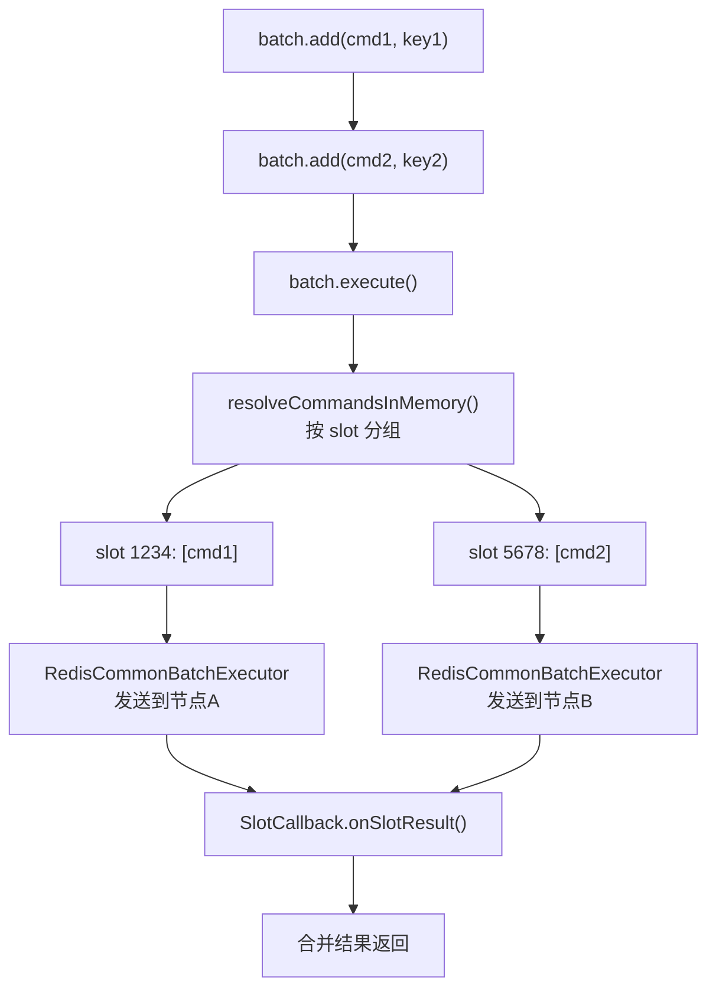

`BatchPromise` 扩展 `CompletableFuture`，跟踪每个 slot 的执行结果，通过 `OrderedCompletableFuture` 保证结果顺序与提交顺序一致。

---

## 七、PubSub 发布订阅

Redisson 将 PubSub 连接与普通命令连接**完全分离**，由 `PublishSubscribeService` 统一管理。

### 7.1 PublishSubscribeService：核心调度器

`PublishSubscribeService`（`org.redisson.pubsub.PublishSubscribeService`）是 PubSub 体系的核心。

**核心字段**：
- `ConcurrentMap<ChannelName, PubSubConnectionEntry> subscribers`：channel 到订阅入口的映射
- `ConcurrentMap<ChannelName, Set<PubSubConnectionEntry>> subscriptions`：channel 到所有订阅连接的映射
- `ConcurrentMap<MasterSlaveEntry, List<PubSubConnectionEntry>> pubSubConnections`：每个主从组的 PubSub 连接列表

### 7.2 PubSub 连接分配策略

为了避免单个 PubSub 连接订阅过多 channel，Redisson 将 channel **哈希分配**到多个 PubSub 连接：

```mermaid
graph TB
    subgraph 集群模式["集群模式"]
        C1["subscribe(channelName)"] --> S1["calcSlot(channelName)"]
        S1 --> S2["找到 slot 对应 MasterSlaveEntry"]
        S2 --> S3["从该 entry 的 pubSubConnections<br/>哈希选择一个 PubSubConnectionEntry"]
    end

    subgraph 非集群模式["非集群模式"]
        NC1["subscribe(channelName)"] --> NC2["从单一 MasterSlaveEntry<br/>的 pubSubConnections 哈希选择"]
    end

    S3 --> D["acquireConnection()"]
    NC2 --> D
    D --> E{"有空闲 PubSub 连接?"}
    E -->|有| F["在该连接上 SUBSCRIBE"]
    E -->|无| G["创建新 PubSub 连接"]
    G --> F
```

```java
protected Collection<PubSubConnectionEntry> getEntries(ChannelName channelName) {
    if (connectionManager instanceof ClusterConnectionManager) {
        ClusterConnectionManager clusterManager = (ClusterConnectionManager) connectionManager;
        int slot = ClusterSlotCalculator.calcSlot(channelName.getName());
        MasterSlaveEntry entry = clusterManager.getMasterEntryBySlot(slot);
        List<PubSubConnectionEntry> result = pubSubConnections.get(entry);
        return result != null ? result : Collections.emptyList();
    }
    // 非集群模式：使用唯一的 masterSlaveEntry
    ...
}
```

### 7.3 订阅 / 退订流程

```mermaid
sequenceDiagram
    participant U as 业务代码
    participant PSS as PublishSubscribeService
    participant PCE as PubSubConnectionEntry
    participant RPC as RedisPubSubConnection
    participant R as Redis Server

    U->>PSS: subscribe(channelName, codec, listener)
    PSS->>PSS: acquireConnection(channelName)
    alt 已有连接且未满
        PSS->>PCE: 复用现有连接
    else 需要新连接
        PSS->>PSS: entry.connectPubSubAsync()
        PSS->>RPC: 新建 RedisPubSubConnection
    end
    PSS->>PCE: 注册 listener 到 channelListeners
    PCE->>RPC: send(SUBSCRIBE channelName)
    RPC->>R: SUBSCRIBE channelName
    R-->>RPC: *3\r\n$9\r\nsubscribe\r\n$channelName\r\n:1
    RPC->>PCE: SubscribeListener.onStatus(SUBSCRIBE, channelName)
    PCE->>PSS: promise.complete(entry)
    PSS-->>U: RFuture<PubSubConnectionEntry> 完成
```

**退订流程**类似，发送 `UNSUBSCRIBE`，收到确认后从 `channelListeners` 移除监听器，若连接无任何订阅则归还连接池或关闭。

### 7.4 消息分发

当 Redis 推送消息时，`CommandPubSubDecoder` 解码 RESP 数组，`RedisPubSubConnection.onMessage` 被调用：

```java
// RedisPubSubConnection.onMessage 简化
public void onMessage(PubSubMessage message) {
    FastRemovalQueue<RedisPubSubListener<Object>> queue = listeners.get(message.getChannel());
    for (RedisPubSubListener<Object> listener : queue) {
        listener.onMessage(message.getChannel(), message.getValue());   // 通知所有监听器
    }
}
```

**消息类型与处理**：
- `message`：普通消息，`[message, channel, payload]`
- `pmessage`：模式匹配消息，`[pmessage, pattern, channel, payload]`
- `smessage`：sharded 消息（RESP3 Sharded PubSub）
- `subscribe` / `unsubscribe` / `psubscribe` / `punsubscribe`：订阅状态确认

### 7.5 PubSub 重连与重订阅

PubSub 连接断开后，必须**重新订阅所有 channel**，否则消息会丢失。`PubSubConnectionWatcher` 负责这一过程：

```mermaid
sequenceDiagram
    participant Ch as Netty Channel
    participant PCW as PubSubConnectionWatcher
    participant PCE as PubSubConnectionEntry
    participant RPC2 as 新 RedisPubSubConnection
    participant R as Redis Server

    Note over Ch: PubSub 连接断开
    Ch->>PCW: channelInactive()
    PCW->>PCE: 获取所有已订阅 channel 列表
    PCW->>RPC2: connectPubSubAsync() 重连
    RPC2->>R: TCP 重连
    R-->>RPC2: 连接建立
    PCW->>PCE: 切换到新连接
    loop 每个 channel
        PCW->>RPC2: SUBSCRIBE channel
        RPC2->>R: SUBSCRIBE channel
        R-->>RPC2: 确认
    end
    PCW->>PCW: 重订阅完成，恢复消息接收
```

`AsyncSemaphore` 用于控制并发订阅操作，避免同一连接上同时发送多个 SUBSCRIBE 导致请求-响应错乱。

---

## 八、完整时序图

### 8.1 单条命令完整执行时序

```mermaid
sequenceDiagram
    autonumber
    participant Biz as 业务代码
    participant CAS as CommandAsyncService
    participant RE as RedisExecutor
    participant CM as ConnectionManager
    participant MSE as MasterSlaveEntry
    participant CH as ConnectionsHolder
    participant RC as RedisClient
    participant Ch as Netty Channel
    participant CE as CommandEncoder
    participant CD as CommandDecoder
    participant R as Redis Server

    Biz->>CAS: bucket.set("value")
    CAS->>CAS: getNodeSource(key)<br/>calcSlot(key)
    CAS->>RE: new RedisExecutor(...)<br/>.execute()
    RE->>RE: 创建 attemptPromise
    RE->>CM: getConnection(source, readOnly)
    CM->>MSE: connectionWriteOp(command)
    MSE->>CH: acquireConnection(command)
    CH->>CH: freeConnectionsCounter.acquire()
    alt 有空闲连接
        CH->>CH: pollConnection()
    else 无空闲连接
        CH->>RC: connectAsync()
        RC->>R: TCP 连接 + 握手(AUTH/SELECT/...)
        R-->>RC: 连接就绪
        CH->>CH: allConnections.add(conn)
    end
    CH-->>RE: connectionFuture.complete(conn)

    RE->>RE: sendCommand(attemptPromise, conn)
    RE->>Ch: channel.writeAndFlush(CommandData)
    Ch->>CE: encode(CommandData)
    CE->>CE: 写入 RESP: *3\r\n$3\r\nSET\r\n...
    CE->>R: TCP 发送 RESP 字节

    RE->>RE: scheduleResponseTimeout()

    R->>R: 执行命令
    R-->>Ch: RESP 响应: +OK\r\n
    Ch->>CD: decode(ByteBuf)
    CD->>CD: 读取 '+'
    CD->>CD: readString -> "OK"
    CD->>CD: handleResult -> attemptPromise.complete("OK")

    RE->>RE: attemptPromise.whenComplete
    RE->>MSE: releaseConnection(conn)
    MSE->>CH: releaseConnection(conn)
    CH->>CH: freeConnections.addFirst(conn)
    CH->>CH: freeConnectionsCounter.release()

    RE->>RE: checkAttemptPromise -> handleSuccess
    RE->>Biz: mainPromise.complete("OK")
```

### 8.2 集群重定向时序

```mermaid
sequenceDiagram
    autonumber
    participant RE as RedisExecutor
    participant MSE1 as MasterSlaveEntry<br/>(slot 1234 节点A)
    participant Ch1 as Channel to A
    participant R_A as Redis Node A
    participant CM as ConnectionManager
    participant MSE2 as MasterSlaveEntry<br/>(slot 1234 新节点B)
    participant Ch2 as Channel to B
    participant R_B as Redis Node B

    RE->>MSE1: connectionWriteOp(slot 1234)
    MSE1-->>RE: conn to A
    RE->>Ch1: sendCommand
    Ch1->>R_A: SET key value
    R_A-->>Ch1: -MOVED 1234 nodeB:6379
    Ch1->>RE: CommandDecoder 解析<br/>RedisMovedException
    RE->>RE: attemptPromise.completeExceptionally<br/>(RedisMovedException)
    RE->>RE: checkAttemptPromise
    RE->>RE: handleRedirect
    RE->>CM: resolveIP("redis://nodeB:6379")
    CM-->>RE: ip = 10.0.0.2:6379
    RE->>RE: source = new NodeSource(1234, ip, REDIRECT)
    RE->>RE: execute() (重新执行)
    RE->>MSE2: connectionWriteOp(slot 1234)
    Note over MSE2: 已更新槽位映射
    MSE2-->>RE: conn to B
    RE->>Ch2: sendCommand
    Ch2->>R_B: SET key value
    R_B-->>Ch2: +OK
    Ch2-->>RE: 成功
```

### 8.3 PubSub 消息推送时序

```mermaid
sequenceDiagram
    autonumber
    participant U as 业务代码
    participant PSS as PublishSubscribeService
    participant RPC as RedisPubSubConnection
    participant CPD as CommandPubSubDecoder
    participant R as Redis Server
    participant Pub as 其他客户端

    U->>PSS: subscribe("ch1", listener)
    PSS->>RPC: SUBSCRIBE ch1
    RPC->>R: SUBSCRIBE ch1
    R-->>RPC: subscribe 确认

    Pub->>R: PUBLISH ch1 "hello"
    R->>RPC: *3\r\n$7\r\nmessage\r\n$3\r\nch1\r\n$5\r\nhello\r\n
    RPC->>CPD: decode(ByteBuf)
    CPD->>CPD: 解析数组 [message, ch1, hello]
    CPD->>RPC: onMessage(PubSubMessage)
    RPC->>RPC: listeners.get(ch1)
    RPC->>U: listener.onMessage("ch1", "hello")
```

---

## 九、设计原理总结

### 9.1 核心设计原则

通过对 Redisson 通信链路的完整剖析，可以提炼出以下核心设计原则：

```mermaid
mindmap
  root((Redisson 通信设计))
    异步驱动
      CompletableFuture 串联
      Promise 回调链
      无阻塞 EventLoop
      RFuture 统一抽象
    分层解耦
      业务层 / 命令层 / 连接层 / 协议层
      Codec 与 RESP 协议分离
      连接管理器多模式适配
      命令执行器与连接管理分离
    资源池化
      连接池 ConnectionsHolder
      双队列 LIFO 复用
      AsyncSemaphore 控制并发
      普通连接与 PubSub 连接隔离
    容错与自愈
      多层超时控制
      指数退避重试
      MOVED/ASK 重定向
      ConnectionWatchdog 自动重连
      FailedNodeDetector 节点故障检测
      PubSub 重连自动重订阅
    协议完备
      RESP2 + RESP3 双协议
      完整错误异常分类
      ReplayingDecoder 半包处理
      Sharable Handler 复用
    性能优化
      LongToString 缓存
      ByteBuf 零拷贝传递
      批量命令单次 writeAndFlush
      热连接 LIFO 优先复用
```

### 9.2 关键设计模式

| 模式 | 应用 | 作用 |
|------|------|------|
| **Reactor 模式** | Netty EventLoop + Channel Pipeline | 事件驱动非阻塞 IO |
| **Promise/Future** | `CompletableFuture` 串联所有异步流程 | 避免线程阻塞，全链路异步 |
| **状态机** | `CommandDecoder` RESP 解码、`ReplayingDecoder` | 处理协议解析与半包 |
| **对象池** | `ConnectionsHolder` 连接池 | 复用昂贵连接资源 |
| **策略模式** | `LoadBalancer`、`DelayStrategy`、`Codec` | 可插拔的策略 |
| **门面模式** | `CommandAsyncService` 包装 `RedisExecutor` | 简化调用 |
| **模板方法** | `BaseConnectionHandler.channelActive` | 握手流程复用 |
| **观察者模式** | `ConnectionEventsHub`、`RedisPubSubListener` | 事件通知 |
| **工厂模式** | `ConnectionManager.create(Config)` | 多模式创建 |

### 9.3 通信链路核心机制对比

| 机制 | 实现类 | 关键点 |
|------|--------|--------|
| 连接建立 | `RedisClient.connectAsync` | Netty Bootstrap + ChannelFutureListener |
| Channel Pipeline | `RedisChannelInitializer.initChannel` | 9 个 Handler 有序组装 |
| 连接握手 | `BaseConnectionHandler.channelActive` | AUTH/SELECT/HELLO/PING 串行 |
| 命令编码 | `CommandEncoder.encode` | RESP `*N` + `$len\r\n data\r\n` |
| 命令解码 | `CommandDecoder.decode` | 首字节分支状态机 |
| 半包处理 | `ReplayingDecoder<State>` | Replay 信号 + checkpoint |
| 命令发送 | `RedisConnection.send` | `channel.writeAndFlush` |
| 命令执行 | `RedisExecutor.execute` | 多层 whenComplete 串联 |
| 超时控制 | `scheduleRetryTimeout` 等 4 层 | Timer 独立调度 |
| 重试 | `checkAttemptPromise` | attempt < attempts 才重试 |
| 重定向 | `handleRedirect` | resolveIP + 更新 NodeSource |
| 连接池 | `ConnectionsHolder` | allConnections + freeConnections + AsyncSemaphore |
| 保活 | `PingConnectionHandler` / `IdleConnectionWatcher` | 应用层 PING + 池层空闲回收 |
| 重连 | `ConnectionWatchdog` | channelInactive 触发 |
| PubSub 调度 | `PublishSubscribeService` | 按 slot 哈希分配连接 |
| PubSub 重连 | `PubSubConnectionWatcher` | 重连后重新订阅 |
| 批量执行 | `CommandBatchService` / `RedisQueuedBatchExecutor` | Pipeline 或 MULTI/EXEC |

### 9.4 与其他 Redis 客户端的差异

与 Jedis、Lettuce 相比，Redisson 在通信层的设计有以下特点：

1. **完全异步**：Jedis 是同步阻塞客户端，Lettuce 虽然异步但 API 更底层；Redisson 在异步之上构建了完整的分布式服务框架
2. **连接池自实现**：Redisson 没有使用 commons-pool2，而是基于 `AsyncSemaphore` + `ConcurrentLinkedDeque` 自实现，完全异步、无锁
3. **命令队列保证顺序**：每个 Channel 维护 `CommandsQueue`，保证请求-响应 FIFO 配对，即使并发发送也不会错乱
4. **多模式统一抽象**：单机/主从/哨兵/集群/复制通过 `ConnectionManager` 统一抽象，上层 API 无感知
5. **PubSub 连接独立管理**：避免 PubSub 长连接阻塞普通命令
6. **RESP3 支持**：完整支持 RESP3 协议，包括 Map、Boolean、Double、Push 等新类型
7. **Sharable Handler**：`CommandEncoder` 等无状态 Handler 标记 `@Sharable`，所有 Channel 共享，减少对象创建

### 9.5 总结

Redisson 与 Redis 的通信交互是一个**精心设计的分层异步系统**：

- **连接层**通过 Netty Bootstrap 建立长连接，9 个 Handler 组成的 Pipeline 处理协议编解码、命令排队、保活、重连；`ConnectionsHolder` 通过双队列 + 异步信号量实现完全异步的连接池；`ConnectionManager` 适配多种部署模式
- **命令层**通过 `RedisExecutor` 的 `execute` 方法，以 `CompletableFuture.whenComplete` 链将连接获取、命令发送、响应等待、重试重定向串联，配合多层 Timer 实现细粒度超时控制
- **协议层**通过 `CommandEncoder` 将命令编码为 RESP 字节，`CommandDecoder` 以状态机解析响应并分类错误异常，`ReplayingDecoder` 自动处理半包；`Codec` 体系将业务对象编解码与 RESP 协议解耦

整个设计充分利用了 Netty 的异步事件驱动能力，通过 Promise 链式回调避免线程阻塞，通过连接池复用昂贵资源，通过多层超时与重试保证可靠性，通过 Sharable Handler 与缓存优化性能。这套机制使得 Redisson 能够在高并发、高可用场景下稳定地与 Redis 通信，是 Java Redis 客户端领域中工程化程度极高的实现。

---

> **参考源码路径**：`redisson/src/main/java/org/redisson/`
> - 连接层：`client/`、`connection/`
> - 命令层：`command/`
> - 协议层：`client/handler/`、`client/protocol/`、`client/codec/`、`codec/`
> - PubSub：`pubsub/`