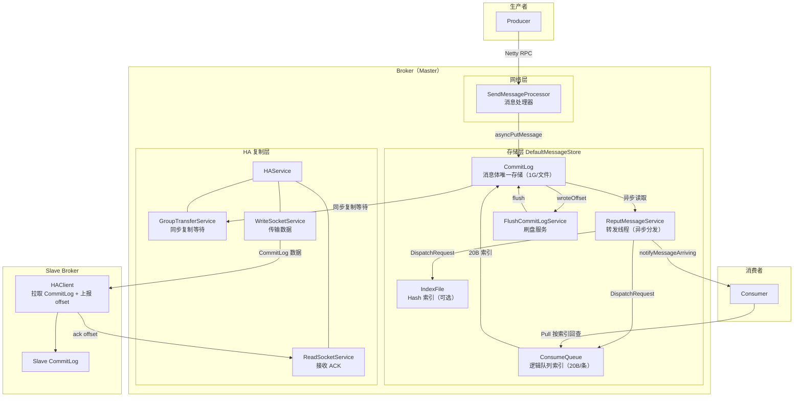
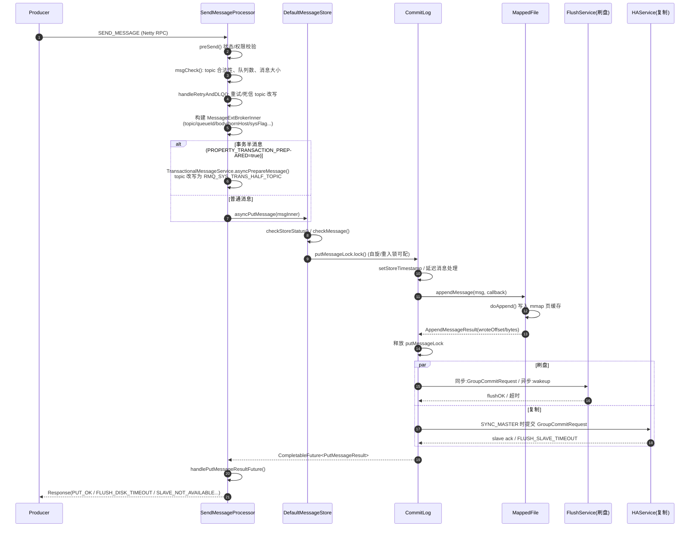
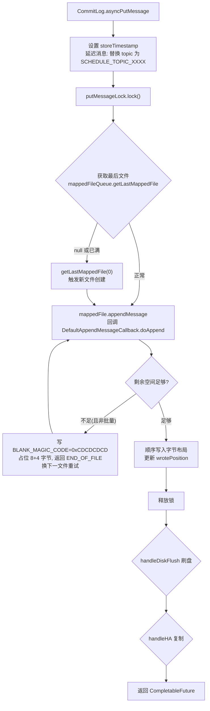
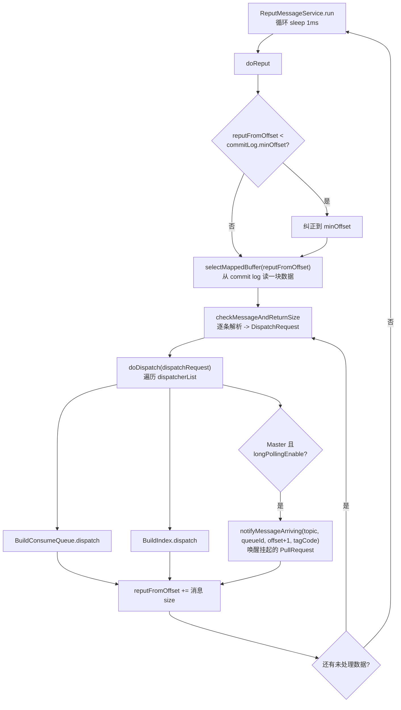
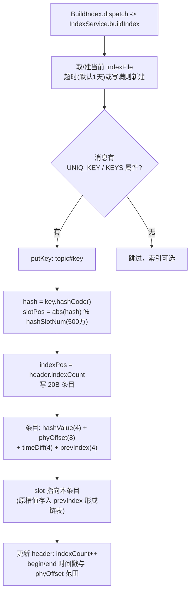
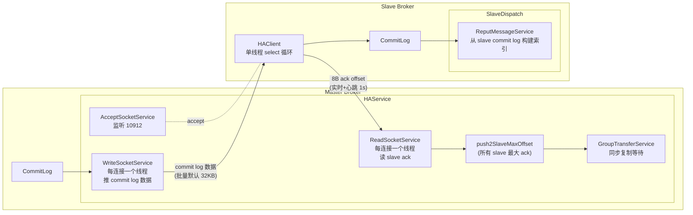
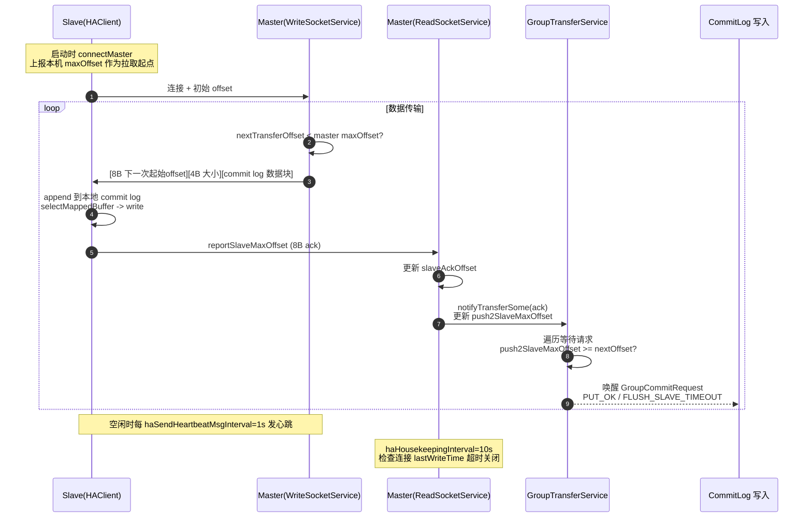
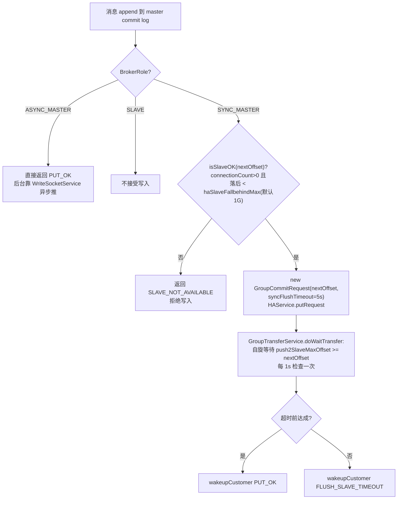
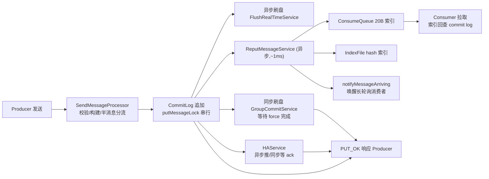

# RocketMQ 4.9.8 Broker 消息存储与同步源码深度分析

> 基于 `D:\workspace\java_projects\source_projects\rocketmq-4.9.8` 源码分析。
> 覆盖：消息接收处理流程、CommitLog/ConsumeQueue/IndexFile 构建、刷盘机制、HA 主从复制。

---

## 目录

1. [总体架构](#一总体架构)
2. [Broker 接收消息处理流程](#二broker-接收消息处理流程)
3. [CommitLog 构建](#三commitlog-构建)
4. [刷盘流程](#四刷盘流程)
5. [ConsumeQueue 与 IndexFile 构建（Reput 分发）](#五consumequeue-与-indexfile-构建reput-分发)
6. [StoreCheckpoint 恢复机制](#六storecheckpoint-恢复机制)
7. [HA 主从同步（Replica 复制）](#七ha-主从同步replica-复制)
8. [关键配置汇总](#八关键配置汇总)

---

## 一、总体架构



**三大存储文件职责：**

| 文件 | 职责 | 单条大小 | 文件大小默认值 |
|---|---|---|---|
| CommitLog | 全部消息体，所有 topic 共用 | 变长 | 1G |
| ConsumeQueue | topic+queueId 维度的逻辑队列索引 | 20 字节定长 | 30 万条 ≈ 5.72MB |
| IndexFile | 按 Key/时间查询的 hash 索引 | 20 字节/条 | 40B header + 500万 slot + 2000万 条目 ≈ 400MB |

---

## 二、Broker 接收消息处理流程

### 2.1 时序图



### 2.2 关键源码细节

**入口**：`broker/src/main/java/org/apache/rocketmq/broker/processor/SendMessageProcessor.java` 的 `asyncSendMessage()`

**校验（msgCheck）**：
- broker 是否可服务、topic 权限、订阅组权限
- 队列 id 合法性（超出 readQueueNums 时重新路由）
- 消息大小限制（默认单条 4MB）

**构建 MessageExtBrokerInner**：
```java
msgInner.setTopic(requestHeader.getTopic());
msgInner.setQueueId(queueIdInt);
msgInner.setBody(body);
msgInner.setBornTimestamp(requestHeader.getBornTimestamp());
msgInner.setBornHost(ctx.channel().remoteAddress());
msgInner.setStoreHost(this.getStoreHost());
```

**事务半消息分流**：
```java
if (Boolean.parseBoolean(origProps.get(MessageConst.PROPERTY_TRANSACTION_PREPARED))) {
    // 半消息不进真实 topic，由 TransactionalMessageService 改写 topic
    putMessageResult = this.brokerController.getTransactionalMessageService().asyncPrepareMessage(msgInner);
} else {
    putMessageResult = this.brokerController.getMessageStore().asyncPutMessage(msgInner);
}
```

**DefaultMessageStore.asyncPutMessage（store/DefaultMessageStore.java）**：
- `checkStoreStatus()`：broker 是否 shutdown、OS page cache 是否忙
- `checkMessage()`：topic/body 长度
- 通过 `putMessageLock`（可配自旋锁 `PutMessageSpinLock` 或重入锁 `PutMessageReentrantLock`）保证 CommitLog 追加的串行性
- 记录 `beginTimeInLock` 统计耗时，超过 500ms 打印告警

---

## 三、CommitLog 构建

### 3.1 写入流程图



### 3.2 消息字节布局（DefaultAppendMessageCallback.doAppend）

| 字段 | 大小 | 说明 |
|---|---|---|
| TOTALSIZE | 4 | 消息总长度 |
| MAGICCODE | 4 | 魔数（区分正常消息与 BLANK 占位） |
| BODYCRC | 4 | 消息体 CRC 校验和 |
| QUEUEID | 4 | 队列 ID |
| FLAG | 4 | 消息 flag |
| QUEUEOFFSET | 8 | 队列逻辑偏移（consume queue 中位置） |
| PHYSICALOFFSET | 8 | commit log 物理偏移 |
| SYSFLAG | 4 | 系统标记位（压缩/事务/V6 等） |
| BORNTIMESTAMP | 8 | 生产时间戳 |
| BORNHOST | 8/20 | 生产者地址（V4/V6 由 sysFlag 决定） |
| STORETIMESTAMP | 8 | 存储时间戳 |
| STOREHOST | 8/20 | broker 存储地址 |
| RECONSUMETIMES | 4 | 重试次数 |
| PreparedTransactionOffset | 8 | 事务消息物理偏移 |
| BODY_LENGTH | 4 | 消息体长度 |
| BODY | 变长 | 消息体 |
| TOPIC_LENGTH | 2 | topic 长度 |
| TOPIC | 变长 | topic 内容 |
| PROPERTIES_LENGTH | 2 | 属性长度 |
| PROPERTIES | 变长 | 属性（延迟/事务/UNIQ_KEY 等） |

### 3.3 MappedFile 与预分配

**文件**：`store/MappedFile.java`、`store/AllocateMappedFileService.java`

```java
// MappedFile.appendMessage：写入 writeBuffer（堆外）或 mappedByteBuffer（页缓存）
ByteBuffer byteBuffer = writeBuffer != null ? writeBuffer.slice() : this.mappedByteBuffer.slice();
byteBuffer.position(currentPos);
AppendMessageResult result = cb.doAppend(this.getFileFromOffset(), byteBuffer, ...);
this.wrotePosition.addAndGet(result.getWroteBytes());
```

- **AllocateMappedFileService**：后台线程用优先级队列预创建下一个 1G 文件，避免写入时同步分配 mmap 的延迟；支持预热（touch 每一页 + 预写入 0，`warmMappedFile`），并可选与 TransientStorePool 集成。
- **TransientStorePool**（`transientStorePoolEnable=true` 时）：预分配 N 个 1G **堆外直接内存**并 `mlock` 锁定不被 swap。写入路径变为：`writeBuffer(堆外) -> commit 到 FileChannel -> flush`。好处是写与刷盘隔离，读走 page cache 不与写竞争。

---

## 四、刷盘流程

### 4.1 两种模式流程图

```mermaid
flowchart TB
    subgraph SYNC["同步刷盘 SYNC_FLUSH"]
        S1[GroupCommitRequest<br/>nextOffset = wroteOffset+wroteBytes] --> S2[service.putRequest<br/>放入 requestsWrite 队列]
        S2 --> S3[GroupTransferService/GroupCommitService<br/>swap 读写队列]
        S3 --> S4[mappedFileQueue.flush(0)<br/>force 刷盘]
        S4 --> S5{flushedPosition >= nextOffset?}
        S5 -- 是 --> S6[wakeupCustomer(PUT_OK)<br/>唤醒等待的发送线程]
        S5 -- 否/超时 --> S7[FlushDiskWatcher 兜底<br/>超时返回 FLUSH_DISK_TIMEOUT<br/>默认 syncFlushTimeout=5s]
    end

    subgraph ASYNC["异步刷盘 ASYNC_FLUSH（默认）"]
        A1[写入页缓存即返回 PUT_OK] --> A2[wakeup FlushRealTimeService]
        A2 --> A3{flushCommitLogTimed?}
        A3 -- "true(默认)" --> A4[定时 500ms 醒来]
        A3 -- false --> A5[被 wakeup 立即唤醒]
        A4 --> A6[flush(flushCommitLogLeastPages=4)<br/>攒满 4 页才刷]
        A5 --> A6
        A6 --> A7["mappedByteBuffer.force() /<br/>transientStorePool: 先 commit 再 force"]
    end
```

### 4.2 关键机制

- **双队列交换（copy-on-write 思想）**：`GroupCommitService` 用 `requestsWrite/requestsRead` 两个队列，写入和消费分离后整体 swap，减少锁竞争。
- **FlushDiskWatcher（store/FlushDiskWatcher.java）**：独立守护线程，监控所有同步刷盘请求，超过 `syncFlushTimeout`（默认 5s）直接把 future 标记超时，防止发送方被无限挂起。
- **ConsumeQueue 刷盘**：`FlushConsumeQueueService` 独立刷盘线程，默认间隔 `flushConsumeQueueInterval=1000ms`，每次至少 `flushConsumeQueueLeastPages=4` 页。索引文件允许丢（可从 commit log 重建），因此无需同步刷盘。
- **isAbleToFlush 判断**：`wrotePosition - flushedPosition >= flushLeastPages * 4KB` 才执行 force，避免小数据高频刷盘。

---

## 五、ConsumeQueue 与 IndexFile 构建（Reput 分发）

### 5.1 Reput 转发线程

**文件**：`store/DefaultMessageStore.java` 内部类 `ReputMessageService`（约 1972 行起）



要点：
- **完全异步**：消息写进 commit log 页缓存后即对生产者返回，consume queue/index 由 reput 线程事后构建（默认落后写入约 1ms 内）。
- reput 只在 Master（及允许的 SLAVE）执行；消费进度通知用于长轮询消费者挂起请求的即时唤醒。

### 5.2 ConsumeQueue 索引构建

**文件**：`store/ConsumeQueue.java`

**Dispatcher 分流（事务过滤）**——`CommitLogDispatcherBuildConsumeQueue`：
```java
switch (MessageSysFlag.getTransactionValue(request.getSysFlag())) {
    case TRANSACTION_NOT_TYPE:
    case TRANSACTION_COMMIT_TYPE:
        putMessagePositionInfo(request);   // 正常写索引
        break;
    case TRANSACTION_PREPARED_TYPE:        // 半消息不进消费队列
    case TRANSACTION_ROLLBACK_TYPE:
        break;
}
```

**20 字节条目布局（CQ_STORE_UNIT_SIZE = 20）**：

| 字段 | 大小 | 说明 |
|---|---|---|
| 消息物理偏移 | 8 | 指向 commit log 绝对位置 |
| 消息大小 | 4 | commit log 中该消息的 TOTALSIZE |
| tag hashcode | 8 | 服务端按 tag 过滤；启用扩展文件时为负数地址（指向 CQ_EXT） |

- `putMessagePositionInfo`：追加条目 + 更新 `maxPhysicOffset`；写失败时重试最多 30 次（每次 1s），全部失败置 `CQ_WRITEABLE=false` 拒绝写入。
- **ConsumeQueueExt 扩展文件**：可选（`enableConsumeQueueExt`，多用于 broker 端 SQL92 过滤），存存储时间、filter 位图、真实 tag hash，主条目的第 3 个 8 字节存负数编码的 ext 地址以示区分。
- **truncateDirty**：崩溃恢复时把超过确认 offset 的脏条目截断。

### 5.3 IndexFile 构建

**文件**：`store/index/IndexService.java`、`store/index/IndexFile.java`



**文件布局**：
```
┌──────────────┬──────────────────┬────────────────────────┐
│ IndexHeader  │  HashSlot Table  │    Index 条目链表        │
│ 40 字节      │  500万 × 4B      │    2000万 × 20B         │
│ 起止时间戳    │  slot -> 最新     │    hash + phyOffset     │
│ 起止物理偏移  │  条目位置         │    + timeDiff + prev    │
└──────────────┴──────────────────┴────────────────────────┘
```

- **哈希冲突解决**：同 slot 冲突用 `prevIndex` 串成链表（新条目头插），查询 `selectPhyOffset` 遍历链表比对 hash 值与时间范围。
- **timeDiff**：`storeTimestamp - header.beginTime`（秒），查询时用它过滤时间窗。
- **清理**：`deleteExpiredFile` 按文件起始时间早于 checkpoint 最小时间戳即整文件删除。

---

## 六、StoreCheckpoint 恢复机制

**文件**：`store/StoreCheckpoint.java`

| 字段 | 偏移 | 含义 |
|---|---|---|
| physicMsgTimestamp | 0 | commit log 最新确认刷盘时间 |
| logicsMsgTimestamp | 8 | consume queue 最新构建时间 |
| indexMsgTimestamp | 16 | index 最新构建时间 |

**作用**：broker 异常退出后重启恢复（`DefaultMessageStore.recover`）依据：
1. commit log 从 checkpoint/最深文件正向校验 CRC 恢复写位置；
2. consume queue / index 按各自时间戳截断之后的脏数据（`truncateDirty`），保持三者一致；
3. `getMinTimestamp()` 同时作为过期文件删除的下界。

---

## 七、HA 主从同步（Replica 复制）

### 7.1 架构图



### 7.2 数据同步时序图



### 7.3 写入侧同步复制流程（CommitLog）



**关键实现细节**：
- `GroupTransferService` 也用双队列交换批量处理请求；`doWaitTransfer` 中先 `waitForRunning(1000)` 挂起，被 `notifyTransferSome` 唤醒后逐个检查。
- Master 通过 `HAConnection.slaveAckOffset`（每连接独立）感知各 slave 进度，全局取最大值存 `push2SlaveMaxOffset`。
- `WriteSocketService` 一次传输按 `haTransferBatchSize=32KB` 批量读取 commit log，并监控 `headSlowTimeMills` 标识慢 slave。
- **SYNC_MASTER 保证的是"至少一个 slave 收到"**，且 slave 收到只意味着写入 slave 的 page cache/commit log，不等 slave 刷盘（`slave` 的刷盘独立异步）。

### 7.4 BrokerRole 行为对比

| 角色 | 写入 | 复制 | 响应语义 |
|---|---|---|---|
| ASYNC_MASTER | 接受 | 异步推，不等 ack | master 本地成功即回（可能丢） |
| SYNC_MASTER | 接受 | 等至少一个 slave ack | master+slave 均收到才回 |
| SLAVE | 拒绝 | 从 master 拉取 | 只读服务；可参与消费、提供 HA |

DLedger（`store/dledger/`）是基于 Raft 的另一套复制方案（多副本自动选主），与 `store/ha/` 的主从机制互斥，走 `DLedgerCommitLog` 路径，此处不展开。

---

## 八、关键配置汇总

**文件**：`store/src/main/java/org/apache/rocketmq/store/config/MessageStoreConfig.java`

| 配置项 | 默认值 | 说明 |
|---|---|---|
| mappedFileSizeCommitLog | 1073741824 (1G) | 单个 commit log 文件大小 |
| mappedFileSizeConsumeQueue | 300000 × 20B | 单个 consume queue 文件条目数 |
| flushDiskType | ASYNC_FLUSH | 刷盘模式 |
| syncFlushTimeout | 5000ms | 同步刷盘超时 |
| flushIntervalFlushRealTimeService | 500ms | 异步刷盘间隔 |
| flushCommitLogTimed | true | 定时刷 vs 唤醒即刷 |
| flushCommitLogLeastPages | 4 | 异步刷盘攒页阈值 |
| flushConsumeQueueInterval | 1000ms | consume queue 刷盘间隔 |
| brokerRole | ASYNC_MASTER | ASYNC_MASTER / SYNC_MASTER / SLAVE |
| haListenPort | 10912 | master HA 监听端口 |
| haSendHeartbeatMsgInterval | 1000ms | slave 心跳/上报间隔 |
| haHousekeepingInterval | 10000ms | master 连接空闲清理间隔 |
| haTransferBatchSize | 32KB | 每次传输批量大小 |
| haSlaveFallbehindMax | 268435456 (256MB) | slave 落后多少判定不可用 |
| transientStorePoolEnable | false | 启用堆外写缓冲 |
| transientStorePoolSize | 5 | 堆外缓冲个数（=1G×5） |
| messageIndexEnable | true | 是否构建 IndexFile |
| maxHashSlotNum | 500万 | 索引文件 hash 槽数 |
| maxIndexNum | 2000万 | 索引文件条目数 |

---

## 九、端到端流程总结



**一条消息的完整生命周期**：网络层校验 → 加锁串行追加 commit log（页缓存）→（按配置）同步刷盘/等 slave ack → reput 线程异步构建 consume queue + index → 通知消费者 → 消费者按索引回查 commit log 消费。存储与索引构建解耦、写路径全部顺序追加、刷盘与复制可插拔，是 RocketMQ 高吞吐的三个核心设计。
