# RocketMQ 4.9.8 生产者启动与消息发送源码深度分析

> 基于 rocketmq-4.9.8 源码（client 模块），所有分析均对应到具体类与方法。

---

## 目录

1. [整体架构](#1-整体架构)
2. [核心类与配置默认值](#2-核心类与配置默认值)
3. [生产者启动流程](#3-生产者启动流程)
4. [MQClientInstance 启动详解](#4-mqclientinstance-启动详解)
5. [消息发送总体流程（sendDefaultImpl）](#5-消息发送总体流程)
6. [主题路由获取（tryToFindTopicPublishInfo）](#6-主题路由获取)
7. [队列选择与容错策略（MQFaultStrategy）](#7-队列选择与容错策略)
8. [消息发送核心（sendKernelImpl）](#8-消息发送核心)
9. [底层网络通信（MQClientAPIImpl.sendMessage）](#9-底层网络通信)
10. [异步发送与 Oneway 发送](#10-异步发送与-oneway-发送)
11. [批量消息发送](#11-批量消息发送)
12. [总结](#12-总结)

---

## 1. 整体架构

### 1.1 生产者客户端架构图

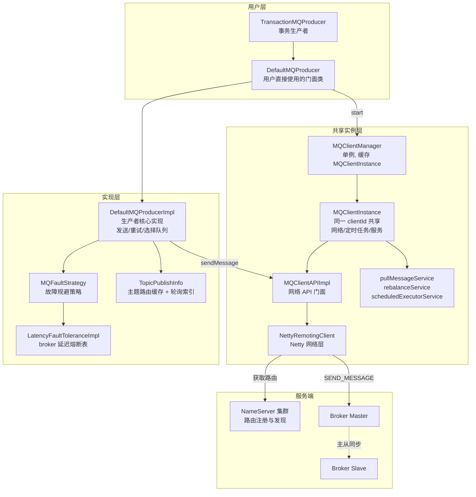

### 1.2 关键设计思想

| 设计 | 说明 |
|---|---|
| 门面模式 | `DefaultMQProducer` 只是 API 门面，真正的逻辑在 `DefaultMQProducerImpl` |
| 实例共享 | 同一 `clientId`（IP@instanceName）的 Producer/Consumer **共享同一个 `MQClientInstance`**，由 `MQClientManager` 缓存 |
| 读写分离 | Producer 只与 Master 通信（`findBrokerAddressInPublish` 只取 `MASTER_ID`） |
| 路由本地缓存 | 路由信息从 NameServer 拉取后缓存在 `topicPublishInfoTable`，定时刷新 + 发送时兜底刷新 |

---

## 2. 核心类与配置默认值

### 2.1 DefaultMQProducer 关键默认配置

`client/src/main/java/org/apache/rocketmq/client/producer/DefaultMQProducer.java`

| 配置项 | 默认值 | 说明 |
|---|---|---|
| `sendMsgTimeout` | 3000ms | 同步发送超时时间 |
| `compressMsgBodyOverHowmuch` | 4096 (4KB) | 消息体超过此值才压缩 |
| `retryTimesWhenSendFailed` | 2 | 同步发送失败重试次数（总尝试 = 1 + 2 = 3） |
| `retryTimesWhenSendAsyncFailed` | 2 | 异步发送失败重试次数 |
| `retryAnotherBrokerWhenNotStoreOK` | false | 非 SEND_OK 时是否换 broker 重发 |
| `maxMessageSize` | 4MB | 消息最大限制 |
| `sendMessageWithVIPChannel` | true(4.x) | — | VIP 通道（端口 -2，即 10911→10909） |
| `createTopicKey` | TBW102 | — | 自动创建 topic 时使用的默认主题 |

### 2.2 涉及的核心类

| 类 | 路径 | 职责 |
|---|---|---|
| `DefaultMQProducer` | `client/producer/DefaultMQProducer.java` | 门面 API |
| `DefaultMQProducerImpl` | `client/impl/producer/DefaultMQProducerImpl.java` | 发送核心逻辑 |
| `TopicPublishInfo` | `client/impl/producer/TopicPublishInfo.java` | 路由缓存 + 队列轮询 |
| `MQFaultStrategy` | `client/latency/MQFaultStrategy.java` | 延迟故障规避 |
| `LatencyFaultToleranceImpl` | `client/latency/LatencyFaultToleranceImpl.java` | broker 熔断状态表 |
| `MQClientInstance` | `client/impl/factory/MQClientInstance.java` | 客户端共享实例 |
| `MQClientAPIImpl` | `client/impl/MQClientAPIImpl.java` | 协议封装层 |
| `NettyRemotingClient` | `remoting/.../NettyRemotingClient.java` | Netty 网络层 |

---

## 3. 生产者启动流程

### 3.1 启动流程图

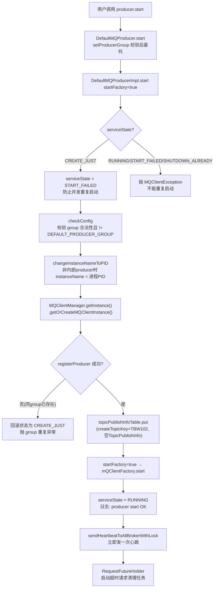

### 3.2 启动时序图

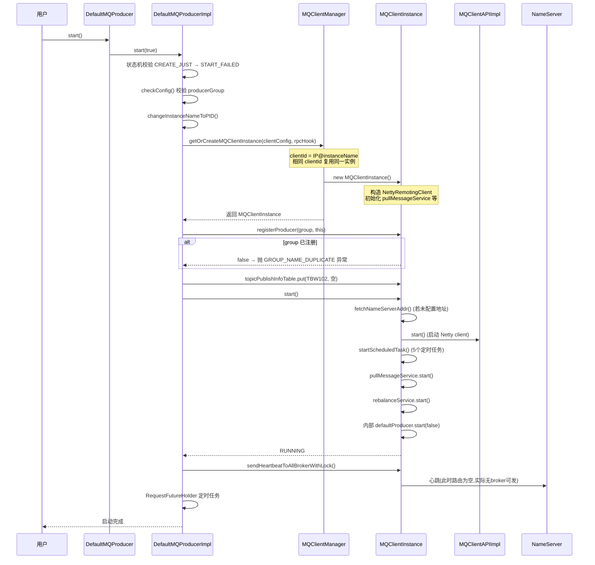

### 3.3 关键源码：DefaultMQProducerImpl.start()

```java
// DefaultMQProducerImpl.java
public void start(final boolean startFactory) throws MQClientException {
    switch (this.serviceState) {
        case CREATE_JUST:
            this.serviceState = ServiceState.START_FAILED;   // 先置失败，防止启动过程中被再次调用

            this.checkConfig();                               // 校验 group

            if (!this.defaultMQProducer.getProducerGroup().equals(MixAll.CLIENT_INNER_PRODUCER_GROUP)) {
                this.defaultMQProducer.changeInstanceNameToPID(); // instanceName → PID，保证同机多进程 clientId 不冲突
            }

            // 获取/创建共享的 MQClientInstance
            this.mQClientFactory = MQClientManager.getInstance().getOrCreateMQClientInstance(this.defaultMQProducer, rpcHook);

            // 按 producerGroup 注册到实例
            boolean registerOK = mQClientFactory.registerProducer(this.defaultMQProducer.getProducerGroup(), this);
            if (!registerOK) {
                this.serviceState = ServiceState.CREATE_JUST;   // 回滚状态
                throw new MQClientException("The producer group[...] has been created before...");
            }

            // 预置默认主题 TBW102 的空路由占位
            this.topicPublishInfoTable.put(this.defaultMQProducer.getCreateTopicKey(), new TopicPublishInfo());

            if (startFactory) {
                mQClientFactory.start();                       // 启动共享客户端实例
            }

            this.serviceState = ServiceState.RUNNING;
            break;
        ...
    }
    this.mQClientFactory.sendHeartbeatToAllBrokerWithLock();    // 立即心跳
    RequestFutureHolder.getInstance().startScheduledTask(this); // 请求超时清理
}
```

### 3.4 ServiceState 状态机

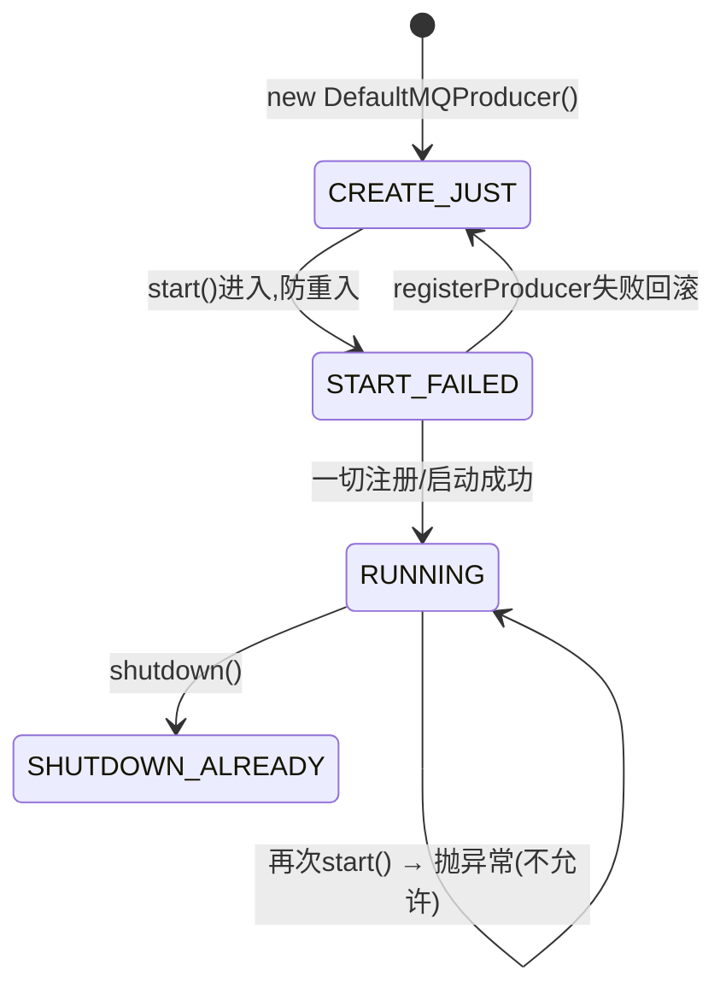

### 3.5 MQClientManager 的实例复用

```java
// MQClientManager.getOrCreateMQClientInstance()
String clientId = clientConfig.buildMQClientId();   // IP@instanceName[@unitName]
MQClientInstance instance = this.factoryTable.get(clientId);
if (null != instance) {
    return instance;                                  // 复用
}
instance = new MQClientInstance(clientConfig, this.factoryIndexGenerator.getAndIncrement(), clientId, rpcHook);
```

- **复用意义**：同一个 JVM 中，多个 Producer/Consumer 只要 `clientId` 相同，就共享一个 `MQClientInstance`，即共享 Netty 连接、定时任务、拉取/平衡线程。
- `changeInstanceNameToPID()` 保证同一机器上不同进程的 instanceName 不同（用 PID），避免误复用。

---

## 4. MQClientInstance 启动详解

### 4.1 start() 源码（MQClientInstance.java）

```java
public void start() throws MQClientException {
    synchronized (this) {
        switch (this.serviceState) {
            case CREATE_JUST:
                this.serviceState = ServiceState.START_FAILED;
                // 1. 未配置 NameServer 地址时，从地址服务器(http)拉取
                if (null == this.clientConfig.getNamesrvAddr()) {
                    this.mQClientAPIImpl.fetchNameServerAddr();
                }
                // 2. 启动 Netty 网络客户端
                this.mQClientAPIImpl.start();
                // 3. 启动各种定时任务
                this.startScheduledTask();
                // 4. 启动消息拉取服务(消费者用)
                this.pullMessageService.start();
                // 5. 启动重平衡服务(消费者用)
                this.rebalanceService.start();
                // 6. 启动内部默认生产者(startFactory=false, 避免递归)
                this.defaultMQProducer.getDefaultMQProducerImpl().start(false);
                this.serviceState = ServiceState.RUNNING;
                break;
            ...
        }
    }
}
```

> 注意第 6 步：`MQClientInstance` 内部持有一个 `defaultMQProducer`（`CLIENT_INNER_PRODUCER_GROUP` 组），用于客户端内部的消息回发（如事务消息回查、消费者回发消息）。它调用 `start(false)` 防止递归启动 factory。

### 4.2 五大定时任务（startScheduledTask）

| # | 任务 | 初始延迟 | 周期 | 作用 |
|---|---|---|---|---|
| 1 | `fetchNameServerAddr` | 10s | 2min | 仅当未静态配置 NameServer 时，定期从 HTTP 地址服务拉取 |
| 2 | `updateTopicRouteInfoFromNameServer` | 10ms | `pollNameServerInterval`(默认30s) | 刷新所有订阅/发布 topic 的路由 |
| 3 | `cleanOfflineBroker` + `sendHeartbeatToAllBrokerWithLock` | 1s | `heartbeatBrokerInterval`(默认30s) | 清理下线 broker、发心跳 |
| 4 | `persistAllConsumerOffset` | 10s | `persistConsumerOffsetInterval`(默认5s) | 持久化消费者位点(生产者不涉及) |
| 5 | `adjustThreadPool` | 1min | 1min | 动态调整消费线程池(生产者不涉及) |

```java
// 定时刷新路由(核心)
this.scheduledExecutorService.scheduleAtFixedRate(new Runnable() {
    public void run() {
        MQClientInstance.this.updateTopicRouteInfoFromNameServer();
    }
}, 10, this.clientConfig.getPollNameServerInterval(), TimeUnit.MILLISECONDS);

// 心跳 + 清理下线 broker
this.scheduledExecutorService.scheduleAtFixedRate(new Runnable() {
    public void run() {
        MQClientInstance.this.cleanOfflineBroker();
        MQClientInstance.this.sendHeartbeatToAllBrokerWithLock();
    }
}, 1000, this.clientConfig.getHeartbeatBrokerInterval(), TimeUnit.MILLISECONDS);
```

### 4.3 Netty 客户端配置（MQClientInstance 构造函数）

`MQClientInstance` 构造时创建 `MQClientAPIImpl`，内部创建 `NettyRemotingClient`，默认参数（`NettyClientConfig`）：

| 参数 | 默认值 | 说明 |
|---|---|---|
| `clientWorkerThreads` | 4 | Netty work 线程数 |
| `connectTimeoutMillis` | 3000 | 连接超时 |
| `clientCallbackExecutorThreads` | Runtime可用核数 | 回调线程池 |
| `clientOnewaySemaphoreValue` | 65535 | oneway 信号量 |
| `clientAsyncSemaphoreValue` | 65535 | 异步信号量 |
| `socketSndBufSize / socketRcvBufSize` | 65535 | 收发缓冲区 |

---

## 5. 消息发送总体流程

### 5.1 三种发送模式

| 模式 | API | 特点 | 重试 |
|---|---|---|---|
| 同步 | `send(msg)` | 阻塞等待结果，返回 `SendResult` | 1 + retryTimesWhenSendFailed = 3 次 |
| 异步 | `send(msg, callback)` | 立即返回，回调通知 | 1 + retryTimesWhenSendAsyncFailed 次(内部线程重试) |
| 单向 | `sendOneway(msg)` | 不关心结果，无响应 | 无重试 |

### 5.2 sendDefaultImpl 主流程图（DefaultMQProducerImpl.java）

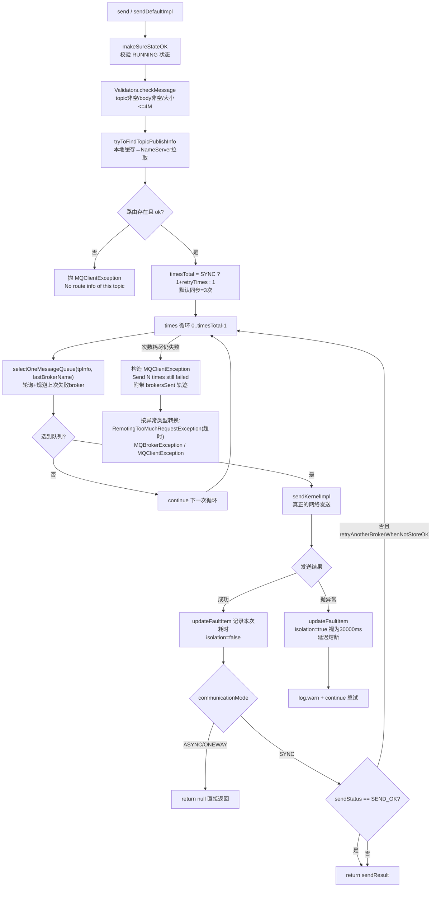

### 5.3 核心源码

```java
// DefaultMQProducerImpl.java sendDefaultImpl（精简）
long beginTimestampFirst = System.currentTimeMillis();
long beginTimestampPrev = beginTimestampFirst;
this.makeSureStateOK();                                     // 校验 RUNNING
Validators.checkMessage(msg, this.defaultMQProducer);       // 校验消息
TopicPublishInfo topicPublishInfo = this.tryToFindTopicPublishInfo(msg.getTopic());

int timesTotal = communicationMode == CommunicationMode.SYNC
    ? 1 + this.defaultMQProducer.getRetryTimesWhenSendFailed() : 1;   // 同步默认 3 次
int times = 0;
String[] brokersSent = new String[timesTotal];

for (; times < timesTotal; times++) {
    String lastBrokerName = null == mq ? null : mq.getBrokerName();
    MessageQueue mqSelected = this.selectOneMessageQueue(topicPublishInfo, lastBrokerName);
    if (mqSelected != null) {
        mq = mqSelected;
        brokersSent[times] = mq.getBrokerName();
        beginTimestampPrev = System.currentTimeMillis();
        try {
            // 核心发送，timeout 减去已消耗时间（保证整体超时）
            sendResult = this.sendKernelImpl(msg, mq, communicationMode, sendCallback,
                topicPublishInfo, timeout - (beginTimestampPrev - beginTimestampFirst));
            endTimestamp = System.currentTimeMillis();
            this.updateFaultItem(mq.getBrokerName(), endTimestamp - beginTimestampPrev, false);

            switch (communicationMode) {
                case ASYNC: return null;   // 异步由回调处理结果
                case ONEWAY: return null;
                case SYNC:
                    if (sendResult.getSendStatus() != SendStatus.SEND_OK
                        && this.defaultMQProducer.isRetryAnotherBrokerWhenNotStoreOK()) {
                        continue;   // 非 SEND_OK(刷盘/同步超时) 且配置允许 → 换 broker 重试
                    }
                    return sendResult;
            }
        } catch (RemotingException | MQClientException | MQBrokerException | InterruptedException e) {
            endTimestamp = System.currentTimeMillis();
            // isolation=true：异常直接按 30000ms 延迟计算熔断时长
            this.updateFaultItem(mq.getBrokerName(), endTimestamp - beginTimestampPrev, true);
            exception = e;
            continue;   // 立即重试(可能换 broker)
        }
    } else {
        break;
    }
}

// 全部失败 → 抛出带 brokersSent 轨迹的异常
throw new MQClientException("Send [" + times + "] times, still failed, ... BrokersSent: "
    + Arrays.toString(brokersSent), exception);
```

### 5.4 同步发送完整时序图

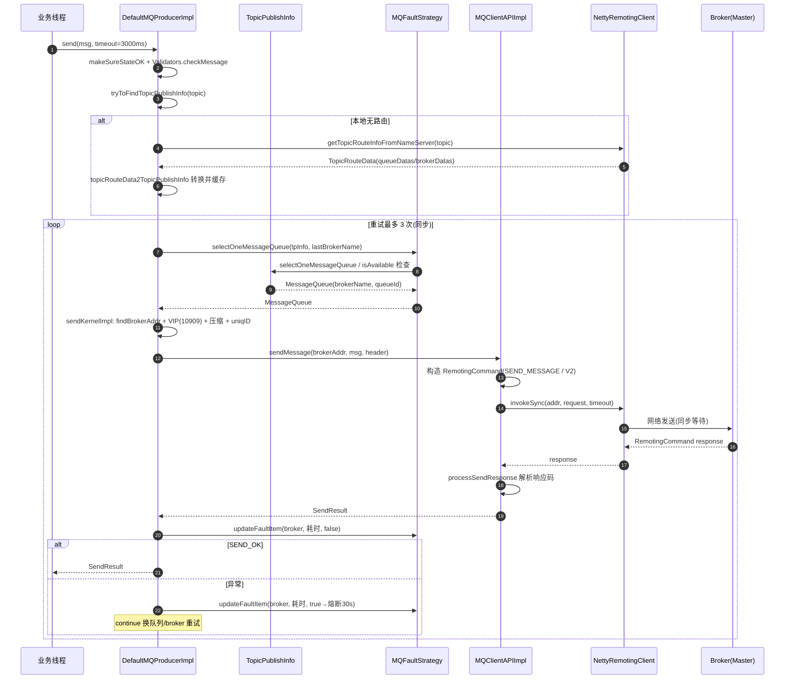

---

## 6. 主题路由获取

### 6.1 tryToFindTopicPublishInfo（DefaultMQProducerImpl.java）

```java
private TopicPublishInfo tryToFindTopicPublishInfo(final String topic) {
    TopicPublishInfo topicPublishInfo = this.topicPublishInfoTable.get(topic);
    if (null == topicPublishInfo || !topicPublishInfo.ok()) {
        // 1. 放入空占位，然后主动从 NameServer 拉一次
        this.topicPublishInfoTable.putIfAbsent(topic, new TopicPublishInfo());
        this.mQClientFactory.updateTopicRouteInfoFromNameServer(topic);
        topicPublishInfo = this.topicPublishInfoTable.get(topic);
    }
    if (topicPublishInfo.isHaveTopicRouterInfo() || topicPublishInfo.ok()) {
        return topicPublishInfo;
    } else {
        // 2. topic 不存在 → 用默认主题 TBW102 再试一次(支持 broker 自动创建 topic)
        this.mQClientFactory.updateTopicRouteInfoFromNameServer(topic, true, this.defaultMQProducer);
        topicPublishInfo = this.topicPublishInfoTable.get(topic);
        return topicPublishInfo;
    }
}
```

### 6.2 路由转换：topicRouteData2TopicPublishInfo（MQClientInstance.java）

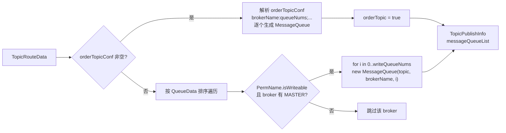

要点：
- **只保留可写（`isWriteable`）且存在 Master 地址的 broker** 的写队列 —— 印证生产者只发 Master。
- `haveTopicRouterInfo=true` 标记真实路由（区别于空占位对象）。

---

## 7. 队列选择与容错策略

### 7.1 两层选择逻辑总览

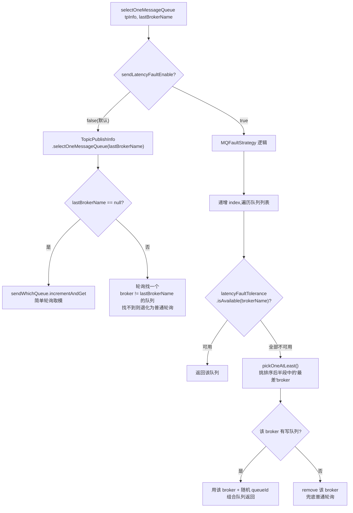

### 7.2 普通轮询（TopicPublishInfo.java）

```java
// 简单轮询：ThreadLocalIndex 每线程独立计数
public MessageQueue selectOneMessageQueue() {
    int index = this.sendWhichQueue.incrementAndGet();     // 线程本地递增
    int pos = Math.abs(index) % this.messageQueueList.size();
    if (pos < 0) pos = 0;
    return this.messageQueueList.get(pos);
}

// 规避上次失败的 broker
public MessageQueue selectOneMessageQueue(final String lastBrokerName) {
    if (lastBrokerName == null) return selectOneMessageQueue();
    for (int i = 0; i < this.messageQueueList().size(); i++) {
        int index = this.sendWhichQueue.incrementAndGet();
        int pos = Math.abs(index) % this.messageQueueList.size();
        MessageQueue mq = this.messageQueueList.get(pos);
        if (!mq.getBrokerName().equals(lastBrokerName)) return mq;  // 规避
    }
    return selectOneMessageQueue();   // 全是同一 broker 时退化
}
```

`ThreadLocalIndex`（client/common/ThreadLocalIndex.java）：每个线程一个独立计数器，避免线程竞争；初值随机，使不同线程负载分散。

### 7.3 MQFaultStrategy（延迟故障规避）

```java
// MQFaultStrategy.java
private boolean sendLatencyFaultEnable = false;   // 默认关闭
private long[] latencyMax = {50L, 100L, 550L, 1000L, 2000L, 3000L, 15000L};
private long[] notAvailableDuration = {0L, 0L, 30000L, 60000L, 120000L, 180000L, 600000L};

// 异常/发送完成后更新
public void updateFaultItem(final String brokerName, final long currentLatency, boolean isolation) {
    if (this.sendLatencyFaultEnable) {
        // isolation=true(异常) 按 30000ms 档计算 → 熔断 10 分钟
        long duration = computeNotAvailableDuration(isolation ? 30000 : currentLatency);
        this.latencyFaultTolerance.updateFaultItem(brokerName, currentLatency, duration);
    }
}

// 根据延迟落在哪一档，返回对应熔断时长
private long computeNotAvailableDuration(final long currentLatency) {
    for (int i = latencyMax.length - 1; i >= 0; i--) {
        if (currentLatency >= latencyMax[i]) return this.notAvailableDuration[i];
    }
    return 0;
}
```

延迟与熔断时间映射表：

| 本次发送耗时 | 落入档位 | broker 规避时长 |
|---|---|---|
| < 100ms | 0/1档 | 不规避(0ms) |
| ≥ 550ms | 2档 | 30s |
| ≥ 1000ms | 3档 | 60s |
| ≥ 2000ms | 4档 | 120s |
| ≥ 3000ms | 5档 | 180s |
| ≥ 15000ms / 发送异常 | 6档 | 600s(10分钟) |

### 7.4 LatencyFaultToleranceImpl.FaultItem

```java
class FaultItem implements Comparable<FaultItem> {
    private final String name;
    private volatile long currentLatency;    // 最近一次耗时
    private volatile long startTimestamp;    // now + notAvailableDuration，"解禁"时间

    public boolean isAvailable() {
        return (System.currentTimeMillis() - startTimestamp) >= 0;   // 到达解禁时间即可用
    }

    public int compareTo(FaultItem other) {  // 可用 > 不可用；延迟小者优先
        if (this.isAvailable() != other.isAvailable()) return this.isAvailable() ? -1 : 1;
        if (this.currentLatency < other.currentLatency) return -1;
        ...
    }
}
```

`pickOneAtLeast()`：将 faultItemTable 全部 item 排序后取**后半段（较差的一半）**轮询挑一个 —— 含义是当所有 broker 都处于熔断期时，仍要挑一个"次差"的继续发，保证可用性优先于规避。

### 7.5 容错机制全景

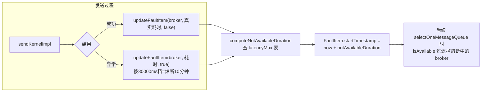

---

## 8. 消息发送核心

### 8.1 sendKernelImpl 流程图（DefaultMQProducerImpl.java）

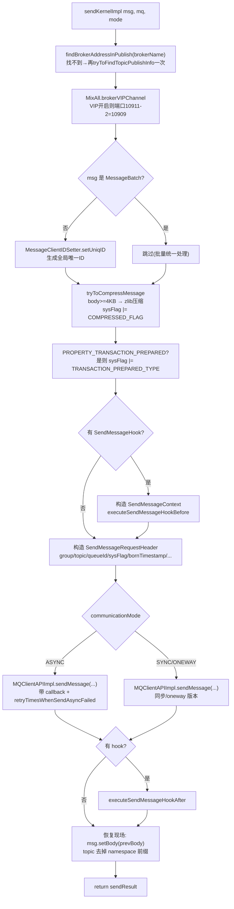

### 8.2 关键源码片段

```java
// 获取 broker 地址（只找 Master）
String brokerAddr = this.mQClientFactory.findBrokerAddressInPublish(mq.getBrokerName());
if (null == brokerAddr) {
    tryToFindTopicPublishInfo(mq.getTopic());   // 兜底再刷路由
    brokerAddr = this.mQClientFactory.findBrokerAddressInPublish(mq.getBrokerName());
}

// VIP 通道：高优先级端口 = 原端口 - 2 (10911 → 10909)
brokerAddr = MixAll.brokerVIPChannel(this.defaultMQProducer.isSendMessageWithVIPChannel(), brokerAddr);

// 唯一 ID
if (!(msg instanceof MessageBatch)) {
    MessageClientIDSetter.setUniqID(msg);
}

// 压缩（tryToCompressMessage）
// body >= compressMsgBodyOverHowmuch(4KB) 时压缩；MessageBatch 不压缩

// 构造请求头
SendMessageRequestHeader requestHeader = new SendMessageRequestHeader();
requestHeader.setProducerGroup(this.defaultMQProducer.getProducerGroup());
requestHeader.setTopic(msg.getTopic());
requestHeader.setQueueId(mq.getQueueId());
requestHeader.setSysFlag(sysFlag);
requestHeader.setBornTimestamp(System.currentTimeMillis());
requestHeader.setProperties(MessageDecoder.messageProperties2String(msg.getProperties()));
requestHeader.setBatch(msg instanceof MessageBatch);
```

### 8.3 VIP 通道说明

生产者与 Broker 的网络通信默认走 VIP 通道（`brokerVIPChannel`）：把 broker 端口减 2（10911→10909）。目的：读写端口分离，避免发送与拉取互相争抢带宽。Broker 配置 `brokerVIPChannel` 可关闭，客户端也要相应设置 `setSendMessageWithVIPChannel(false)`。

---

## 9. 底层网络通信

### 9.1 MQClientAPIImpl.sendMessage（MQClientAPIImpl.java）

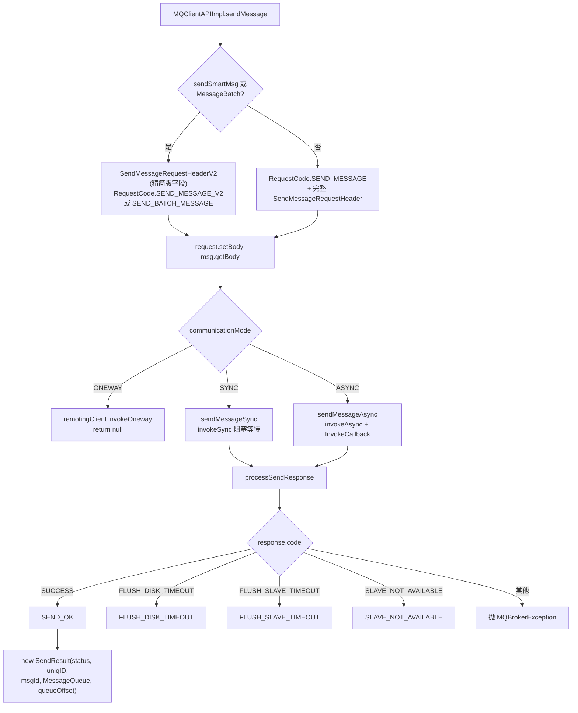

### 9.2 processSendResponse 响应码语义

| ResponseCode | SendStatus | 含义 |
|---|---|---|
| SUCCESS | SEND_OK | 完全成功 |
| FLUSH_DISK_TIMEOUT | FLUSH_DISK_TIMEOUT | 同步刷盘超时（消息已在内存，可能丢失） |
| FLUSH_SLAVE_TIMEOUT | FLUSH_SLAVE_TIMEOUT | 同步复制到 slave 超时（master 已落盘） |
| SLAVE_NOT_AVAILABLE | SLAVE_NOT_AVAILABLE | slave 不可用，未完成同步复制 |
| 其他 | — | 抛 `MQBrokerException` |

### 9.3 SendMessageRequestHeader 主要字段

`producerGroup`、`topic``defaultTopic`(TBW102)、`defaultTopicQueueNums`、`queueId`、`sysFlag`(压缩/事务标记)、`bornTimestamp`、`flag`、`properties`(消息属性字符串)、`reconsumeTimes`、`batch`、`transactionId` 等。V2 版本对字段做了紧凑编码，减少网络开销。

### 9.4 通信层调用链

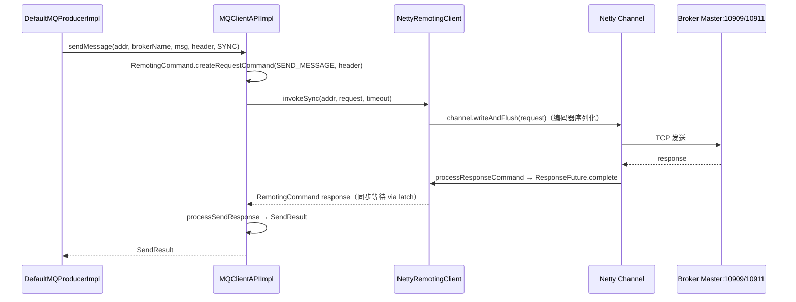

---

## 10. 异步发送与 Oneway 发送

### 10.1 异步发送链路

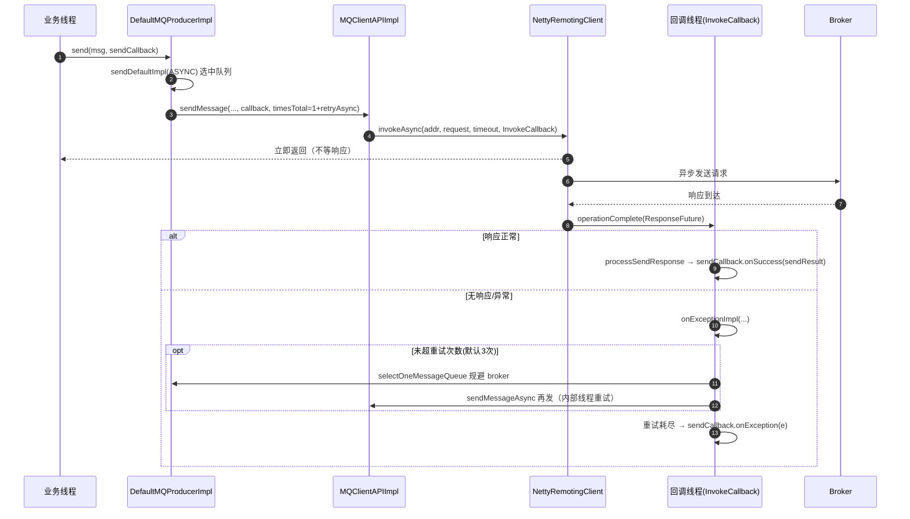

### 10.2 onExceptionImpl（MQClientAPIImpl.java）

```java
private void onExceptionImpl(...) {
    int tmp = curTimes.incrementAndGet();
    if (needRetry && tmp <= timesTotal) {
        // 规避失败 broker，重新选队列，继续异步发送
        MessageQueue mqChosen = producer.selectOneMessageQueue(topicPublishInfo, brokerName);
        String addr = instance.findBrokerAddressInPublish(mqChosen.getBrokerName());
        sendMessageAsync(addr, mqChosen.getBrokerName(), msg, timeoutMillis, request, ...);
    } else {
        if (context != null) {                     // 触发 after hook
            context.setException(e);
            context.getProducer().executeSendMessageHookAfter(context);
        }
        sendCallback.onException(e);               // 最终通知用户失败
    }
}
```

与同步重试的区别：**异步重试在回调线程中执行**，不阻塞业务线程；`needRetry` 在超时(`timeoutMillis < 0`)时为 false，不再重试。

### 10.3 Oneway

`sendOneway` → `sendDefaultImpl(ONEWAY)` → `sendKernelImpl` → `MQClientAPIImpl` → `remotingClient.invokeOneway`（受 `clientOnewaySemaphoreValue` 信号量限流），**不等待、不解析响应、无重试**。适合日志类可容忍丢失的场景。

---

## 11. 批量消息发送

`common/message/MessageBatch.java`

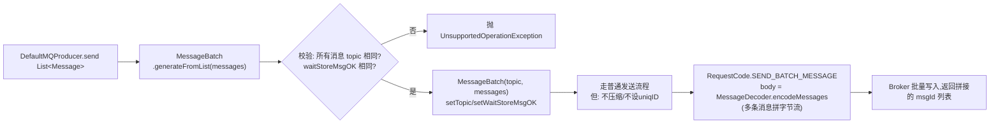

要点：
- 批量消息要求**同一 topic 且 waitStoreMsgOK 一致**，否则抛异常。
- `MessageBatch` 本身是一条"大消息"，body 是多条消息的编码拼接，`encode()` 使用 `MessageDecoder.encodeMessages`。
- 批量消息**不压缩、不逐条设置 uniqID**，请求码用 `SEND_BATCH_MESSAGE`。
- 响应中 msgId 为多条消息 ID 的拼接串，`SendResult` 一并返回。
- 单批总量同样受 `maxMessageSize`(4M) 限制。

---

## 12. 总结

### 12.1 一图总览：启动 + 发送全景

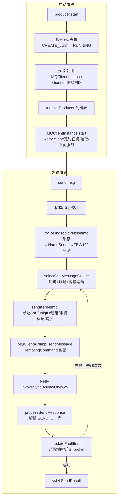

### 12.2 关键设计要点

1. **状态机防重**：`CREATE_JUST → START_FAILED → RUNNING` 的三段式转换防止并发/重复启动；注册失败回滚到 `CREATE_JUST`。
2. **实例共享**：`MQClientManager` 以 clientId 为 key 缓存 `MQClientInstance`，多 Producer/Consumer 共享网络与后台任务，是客户端的"连接池"式设计。
3. **路由三级获取**：本地缓存 → 主动查 NameServer → 默认主题 TBW102 兜底（支持 broker 端自动建 topic）。
4. **只写 Master**：`topicRouteData2TopicPublishInfo` 只保留可写且有 Master 的队列；`findBrokerAddressInPublish` 只取 `MASTER_ID`。
5. **两级队列选择**：默认轮询 + 规避上次失败 broker；开启 `sendLatencyFaultEnable` 后叠加基于延迟分级的 broker 熔断（50ms~15000ms → 0~600s 规避时长）。
6. **同步重试 3 次且换 broker**：`brokersSent` 数组记录每次尝试的 broker，异常按 `isolation=true` 直接按 30s 档熔断 10 分钟。
7. **超时扣减**：重试时 `timeout - costTime`，保证总耗时不超过用户设置的超时。
8. **VIP 通道**：默认端口 -2（10909），读写流量分离。
9. **发送钩子**：`SendMessageHook` before/after 环绕（trace 场景使用），发送后恢复消息原始 body/topic（namespace 剥离）。
10. **三种通信模式**：SYNC（invokeSync 阻塞）、ASYNC（invokeAsync + 回调线程重试）、ONEWAY（信号量限流、无响应无重试）。
