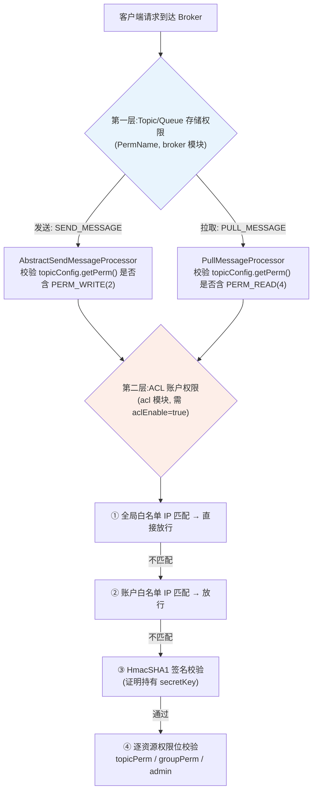
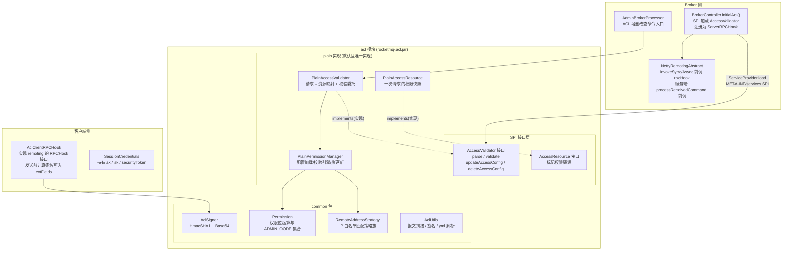
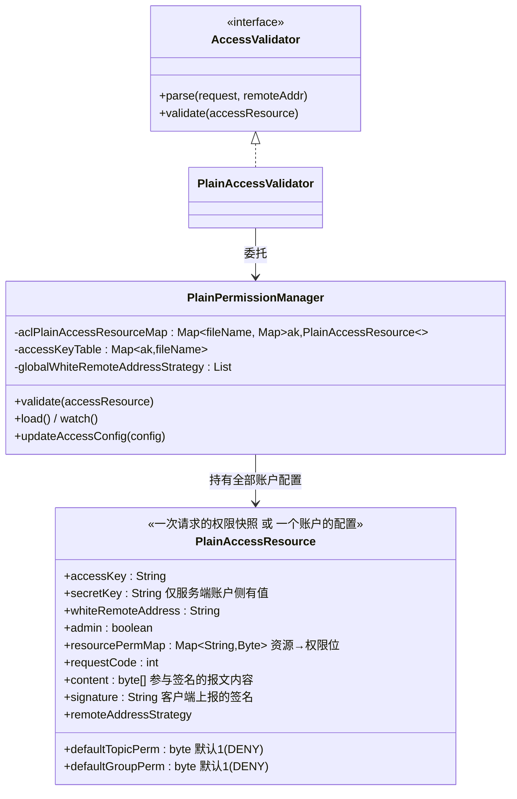
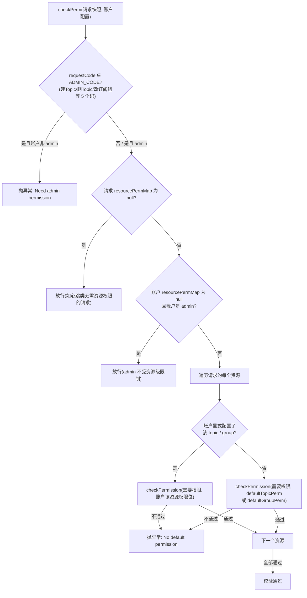
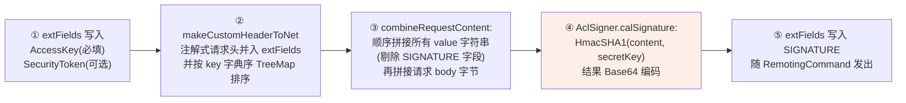
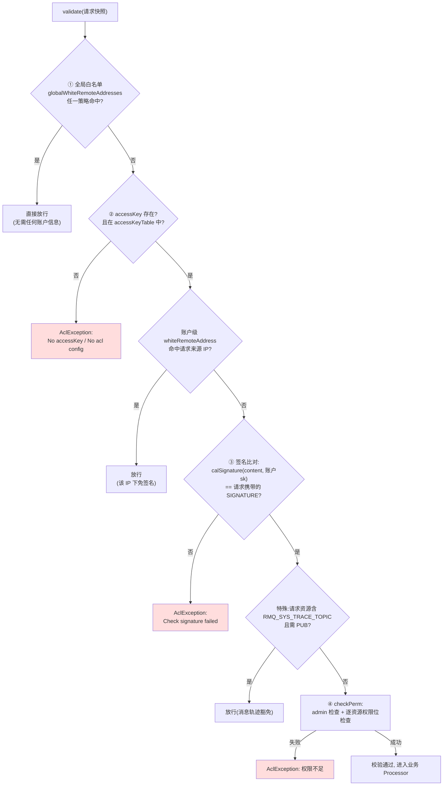
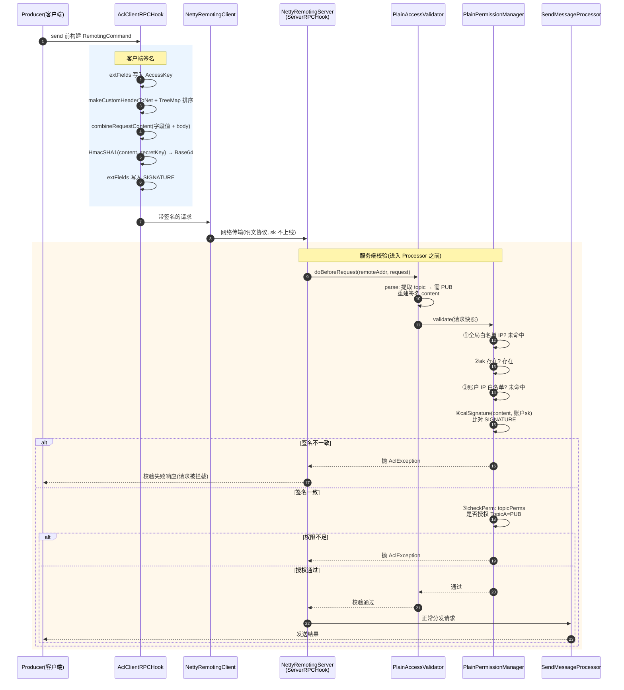
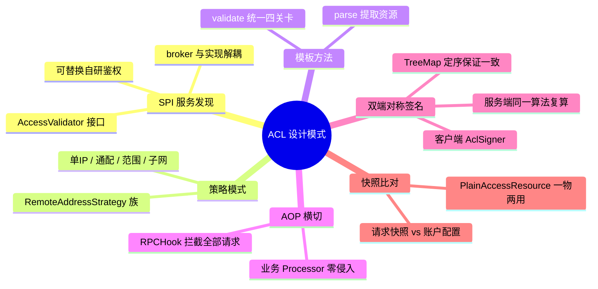

# RocketMQ 权限校验(ACL)源码深度剖析

> 基于 RocketMQ 4.9.8 源码,深入分析权限校验的实现原理:整体架构、权限模型设计、签名算法、校验全流程、配置热更新,以及客户端与服务端的协作机制。

---

## 目录

1. [两层权限体系总览](#1-两层权限体系总览)
2. [ACL 模块架构](#2-acl-模块架构)
3. [权限模型设计](#3-权限模型设计)
4. [配置文件与账户模型](#4-配置文件与账户模型)
5. [客户端签名流程](#5-客户端签名流程)
6. [服务端校验流程](#6-服务端校验流程)
7. [完整端到端时序图](#7-完整端到端时序图)
8. [配置热更新与运维命令](#8-配置热更新与运维命令)
9. [设计模式与扩展性分析](#9-设计模式与扩展性分析)
10. [安全性与局限](#10-安全性与局限)
11. [关键源码索引](#11-关键源码索引)

---

## 1. 两层权限体系总览

RocketMQ 的"权限"实际上由**相互独立的两层**组成,极易混淆,先做区分:



| | 第一层:Topic 存储权限(PermName) | 第二层:ACL 账户权限 |
|---|---|---|
| 所属模块 | broker(common 定义 PermName) | acl |
| 作用对象 | **Topic 本身**(与账户无关) | **账户(AccessKey)** |
| 权限值 | PERM_WRITE=2、PERM_READ=4、PERM_INHERIT=8,组合如 6=可读可写 | PUB=4、SUB=8、DENY=1、ANY=2 |
| 配置位置 | `mqadmin updateTopic -p 6` 写入 TopicConfig | `conf/plain_acl.yml` |
| 默认状态 | 生效(默认 perm=6) | 关闭(`aclEnable=false`) |

> 下文聚焦第二层(ACL),这是"权限校验"通常指的部分。**第一层在业务 Processor 内校验,第二层在请求进入任何 Processor 之前由 RPCHook 统一拦截**,这是架构上的关键差异。

## 2. ACL 模块架构

### 2.1 模块分层



### 2.2 核心接口:AccessValidator

```java
public interface AccessValidator {
    AccessResource parse(RemotingCommand request, String remoteAddr);   // 请求 → 权限资源
    void validate(AccessResource accessResource);                       // 执行校验
    boolean updateAccessConfig(PlainAccessConfig plainAccessConfig);    // 运维:更新账户
    boolean deleteAccessConfig(String accesskey);                       // 运维:删除账户
    boolean updateGlobalWhiteAddrsConfig(List<String> globalWhiteAddrsList); // 运维:改白名单
    AclConfig getAllAclConfig();                                        // 运维:查询全量
}
```

**关键架构决策**:校验器通过 **Java SPI**(`META-INF/service/org.apache.rocketmq.acl.AccessValidator`)加载,broker 与 acl 模块解耦——broker 只依赖接口,替换实现(如对接自研权限系统)无需改动 broker 代码。

### 2.3 Broker 侧挂载点:RPCHook 拦截

`BrokerController.initialAcl()`(BrokerController.java:500-528):

```java
if (!this.brokerConfig.isAclEnable()) return;                    // aclEnable=false 时整体跳过

List<AccessValidator> accessValidators =
    ServiceProvider.load(ServiceProvider.ACL_VALIDATOR_ID, AccessValidator.class);  // SPI

for (AccessValidator accessValidator : accessValidators) {
    accessValidatorMap.put(validator.getClass(), validator);
    this.registerServerRPCHook(new RPCHook() {
        public void doBeforeRequest(String remoteAddr, RemotingCommand request) {
            // Do not catch the exception —— 校验失败直接抛出,阻断请求
            validator.validate(validator.parse(request, remoteAddr));
        }
    });
}
```

这个匿名 RPCHook 被注册进 `NettyRemotingServer`,**在请求分发到任何 Processor 之前执行**——ACL 是横切关注件(AOP 思想),SendMessageProcessor、PullMessageProcessor 等业务代码完全无感知。

## 3. 权限模型设计

### 3.1 权限位定义(Permission)

```java
public static final byte DENY = 1;      // 0001 显式拒绝,优先级最高
public static final byte ANY = 1 << 1;  // 0010 任意(PUB 或 SUB 任一即可)
public static final byte PUB  = 1 << 2; // 0100 发布
public static final byte SUB  = 1 << 3; // 1000 订阅
```

校验算法(`Permission.checkPermission`,Permission.java:48):

```java
public static boolean checkPermission(byte neededPerm, byte ownedPerm) {
    if ((ownedPerm & DENY) > 0)  return false;                    // ① 拥有 DENY 一票否决
    if ((neededPerm & ANY) > 0)   return (ownedPerm & PUB) > 0
                                     || (ownedPerm & SUB) > 0;    // ② 需要 ANY:有 PUB 或 SUB 即可
    return (neededPerm & ownedPerm) > 0;                          // ③ 位与判断
}
```

### 3.2 主体与资源模型



**一物两用**是模型的精髓:`PlainAccessResource` 既表示"**账户配置**"(服务端从 yml 加载,含 secretKey 与权限表),也表示"**一次待校验的请求**"(parse 产出,含客户端声明的 ak、签名、请求涉及的资源及所需权限)。校验 = 用请求快照逐一比对账户配置。

### 3.3 权限判定矩阵(PlainPermissionManager.checkPerm)



**资源粒度的两级默认**:每个账户可对任意 topic / group(以 `%RETRY%组名` 形式表示)配置权限;未显式配置的资源回退到 `defaultTopicPerm` / `defaultGroupPerm`(yml 未配时默认 DENY,即**白名单语义,默认拒绝**)。

## 4. 配置文件与账户模型

`conf/plain_acl.yml`(由 PlainPermissionManager 构造器加载,支持 `conf/acl/` 目录下多 yml 文件合并):

```yaml
globalWhiteRemoteAddresses:      # 全局白名单:命中即完全放行(跳过签名与权限校验)
- 10.10.103.*
- 192.168.0.*

accounts:
- accessKey: RocketMQ            # 账户标识(明文传输)
  secretKey: 12345678            # HMAC 密钥(永不上网络)
  whiteRemoteAddress: 10.10.103.   # 账户级 IP 白名单
  admin: true                    # 管理员:豁免资源级校验,可执行 ADMIN_CODE
  defaultTopicPerm: DENY         # 该账户对未显式配置 topic 的默认权限
  defaultGroupPerm: SUB
  topicPerms:
  - TopicA=PUB|SUB               # 资源级显式授权
  - TopicB=PUB
  groupPerms:
  - groupA=DENY                  # 注意:group 名,加载时自动转为 %RETRY%groupA
```

IP 白名单由策略族 `RemoteAddressStrategyFactory` 解析,支持多种模式(策略模式):

| 模式 | 示例 | 匹配策略类 |
|---|---|---|
| 单 IP | `10.10.103.1` | OneRemoteAddressStrategy |
| 通配前缀 | `10.10.103.*` | MultipleRemoteAddressStrategy |
| 范围 | `10.10.103.1-200` | RangeRemoteAddressStrategy |
| 子网 | `10.10.103.1/24` | ZeroRemoteAddressStrategy(IPv4 按 mask 位运算,IPv6 不支持) |

## 5. 客户端签名流程

### 5.1 挂载方式

客户端将 `AclClientRPCHook` 传入 `DefaultMQAdminExt / DefaultMQProducer / DefaultMQPushConsumer` 的构造函数(或 `setAclRPCHook`),最终随 ClientConfig 进入 `MQClientInstance` 的 Netty 客户端。mqadmin 场景由 `AclUtils.getAclRPCHook(conf/tools.yml)` 自动构建。

### 5.2 签名计算(AclClientRPCHook.doBeforeRequest)

每个出站请求在 `NettyRemotingAbstract.invokeSync/Async` 中先执行 `rpcHook.doBeforeRequest(addr, request)`:



**签名覆盖的要素**(防篡改设计):

- 所有请求字段(含 topic、group、body)→ 改任何业务参数都会导致签名失效;
- AccessKey 本身也被签 → 防止冒用他人 ak;
- 排序(TreeMap)→ 客户端与服务端独立计算时保证拼接顺序一致;
- **SecretKey 永不传输**,只作为 HMAC 密钥 → 网络上无任何密钥明文。

签名算法(`AclSigner.java:56`):

```java
Mac mac = Mac.getInstance("HmacSHA1");
mac.init(new SecretKeySpec(key, algorithm.toString()));
return Base64.encodeBase64(mac.doFinal(data));
```

## 6. 服务端校验流程

### 6.1 第一步:parse——请求到权限资源的映射

`PlainAccessValidator.parse`(PlainAccessValidator.java:54-147)按 RequestCode 提取该请求涉及的资源及所需权限:

| RequestCode | 提取的资源 → 所需权限 |
|---|---|
| SEND_MESSAGE / V2 | topic → PUB;若发往 `%RETRY%` topic → 该组 → SUB |
| CONSUMER_SEND_MSG_BACK | `%RETRY%group` → SUB |
| PULL_MESSAGE | topic → SUB **且** `%RETRY%consumerGroup` → SUB |
| QUERY_MESSAGE | topic → SUB |
| HEART_BEAT | 请求体内每个消费组及其全部订阅 topic → SUB |
| UPDATE_CONSUMER_OFFSET | `%RETRY%group` 与 topic → SUB |
| 其他 | 不提取资源(仅校验身份) |

同时重建与客户端相同的**签名内容**(TreeMap 排序 + 剔除 SIGNATURE/UNIQUE_MSG_QUERY_FLAG + 拼接 body),存入 `content` 字段。

> 细节:消费组在权限模型中一律以重试 topic 形式(`%RETRY%组名`)表达,因此 `groupPerms` 与 `topicPerms` 在内存中统一收敛为 `resourcePermMap`。

### 6.2 第二步:validate——四道关卡

`PlainPermissionManager.validate`(PlainPermissionManager.java:654-699):



**校验顺序的安全含义**:白名单(网络层信任)→ 身份(签名,持有正确 sk)→ 授权(权限位)。签名校验放在权限检查之前,确保后续比对发生在"确认是本人"的前提下;且**异常不捕获**(initialAcl 中注释 "Do not catch the exception"),直接中断请求分发,客户端收到 `AclException` 对应的Remoting 错误响应。

## 7. 完整端到端时序图

以开启了 ACL 的集群上一次 `producer.send(msg)` 为例:



## 8. 配置热更新与运维命令

### 8.1 文件监听热更新

`PlainPermissionManager` 构造器中 `load()` + `watch()`:

- `watch()` 启动 `FileWatchService`(守护线程,默认每 5s 比对文件 md5),`plain_acl.yml` 及 `conf/acl/` 目录下全部 yml 变更后**自动重载**;
- 账户以 `accessKeyTable: ak → 文件名` + `aclPlainAccessResourceMap: 文件名 → ak → 配置` 两级 map 存储,**支持多配置文件拆分管理**(如按团队拆文件);
- 每个配置文件维护独立 `DataVersion`,用于主从/多 broker 间的版本对比。

### 8.2 运维命令(mqadmin / Dashboard 同源)

AdminBrokerProcessor 中的处理入口:

| 命令 | RequestCode | 调用 |
|---|---|---|
| updateAccessConfig | UPDATE_AND_CREATE_ACL_CONFIG | `accessValidator.updateAccessConfig(config)` → 内存更新 + 回写 yml |
| deleteAccessConfig | DELETE_ACL_CONFIG | `accessValidator.deleteAccessConfig(ak)` |
| updateGlobalWhiteAddr | UPDATE_GLOBAL_WHITE_ADDRS_CONFIG | `accessValidator.updateGlobalWhiteAddrsConfig(...)` |
| getAclConfig | GET_BROKER_CONFIG(带子命令) | `accessValidator.getAllAclConfig()` |

注意:这些命令本身也是请求,**同样先经过 ACL 校验**(需要 admin 账户),即"改权限需要先有权限"。mqadmin 通过 `conf/tools.yml` 提供管理员 ak/sk(见 tools 模块分析中 `AclUtils.getAclRPCHook`)。

### 8.3 版本同步

`getAllAclConfigVersion()` 返回各文件 `DataVersion`,Dashboard 据此感知多 broker 间 ACL 配置不一致(仅展示对比,不自动同步;同步需依赖 broker 主从复制磁盘文件或运维手段)。

## 9. 设计模式与扩展性分析



- **SPI 扩展点**是最大亮点:broker 完全不知道 PlainAccessValidator 的存在,替换为 LDAP/RBAC 对接实现只需改 `META-INF/services` 注册文件;
- **RPCHook 是客户端/服务端复用的同一抽象**:客户端用它做"发送前签名",服务端用它做"分发前校验"——同一接口在两端语义对称;
- **签名与校验算法共享**:`AclUtils.combineRequestContent` 被 AclClientRPCHook(客户端)与 PlainAccessValidator.parse(服务端)调用同一份代码,从机制上杜绝两端拼接规则不一致的隐患。

## 10. 安全性与局限

| 方面 | 现状 | 说明 |
|---|---|---|
| 密钥保护 | 较好 | sk 仅作 HMAC 密钥不上网络;但 yml 明文存储在磁盘,依赖机器安全 |
| 传输安全 | 弱 | Remoting 协议明文,签名只防篡改不防窃听;生产环境应配合 TLS(4.9.x 支持 `tls.server.*` 配置) |
| 签名算法 | 一般 | HmacSHA1(算法偏老但仍是安全的 HMAC 用法);不可更换为账户级配置 |
| 重放攻击 | 未防护 | 请求无时间戳/nonce 参与签名,理论上可重放(受权限位约束) |
| 权限粒度 | 中 | Topic 与消费组两级;无队列级、无时间窗口、无 QPS 限额 |
| admin 语义 | 粗粒度 | admin=true 豁免**全部**资源级校验,无细分只读管理员 |
| 全局白名单 | 高风险 | 命中即完全跳过校验(含签名),配置 `*` 或过宽网段等于关闭 ACL |
| 性能 | 良好 | 校验为纯内存位运算 + 一次 HMAC(微秒级),yml 只在加载/变更时解析 |

**默认行为**:4.9.8 中 `aclEnable=false`(BrokerConfig),即**默认不开启**;开启后无 ak 请求直接被拒(白名单除外),符合 fail-safe 设计。

## 11. 关键源码索引

| 功能 | 文件:行号 |
|---|---|
| SPI 加载与 RPCHook 注册 | `broker/.../BrokerController.java:500-528`(initialAcl) |
| 请求→资源映射 parse | `acl/.../plain/PlainAccessValidator.java:54-147` |
| validate 委托 | `acl/.../plain/PlainAccessValidator.java:150-152` |
| 四道关卡校验 | `acl/.../plain/PlainPermissionManager.java:654-699` |
| admin + 逐资源权限检查 | `acl/.../plain/PlainPermissionManager.java:579-614`(checkPerm) |
| 权限位定义与位运算 | `acl/.../common/Permission.java:26-56` |
| ADMIN_CODE 集合 | `acl/.../common/Permission.java:33-46` |
| 客户端签名 | `acl/.../common/AclClientRPCHook.java:37-47` |
| HmacSHA1 签名算法 | `acl/.../common/AclSigner.java:44-66` |
| 报文拼接规则 | `acl/.../common/AclUtils.java:48-76` |
| 账户/资源快照模型 | `acl/.../plain/PlainAccessResource.java:25-53` |
| 配置加载与多文件支持 | `acl/.../plain/PlainPermissionManager.java:85-112`(构造器/getAllAclFiles) |
| IP 白名单策略族 | `acl/.../plain/RemoteAddressStrategyFactory.java` |
| ACL 运维命令入口 | `broker/.../processor/AdminBrokerProcessor.java:346-449` |
| mqadmin 侧钩子构建 | `tools` 模块 `AclUtils.getAclRPCHook`(读 conf/tools.yml) |
