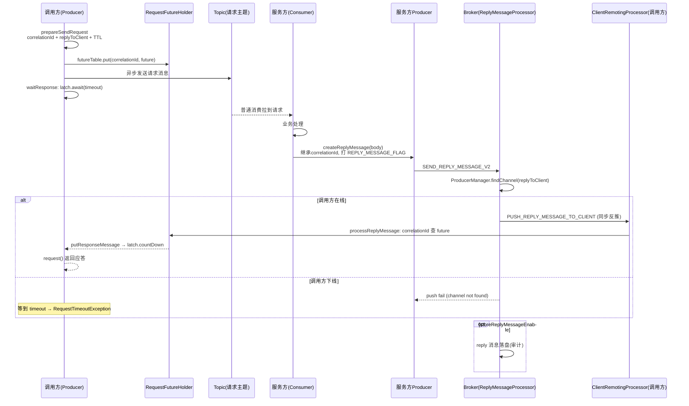

# RocketMQ Batch 消息与 Request-Reply 源码深度分析

> 基于 RocketMQ 4.9.8 源码，精读批量消息的编解码与 `CommitLog.putMessages` 落盘路径，以及 Request-Reply 请求应答模式的三段接力（correlationId 关联、Broker 反向推送、ReplyMessageProcessor）。这是 4.9.8 剩余模块的倒数第二篇。

---

## 一、Batch 消息：一次网络往返写 N 条

### 1.1 动机与限制

发 100 条消息 = 100 次网络 RTT + 100 次 Broker 处理 + 100 次 CommitLog 锁竞争。批量把 N 条消息拼成**一条"大消息"**，只付一次代价。

客户端约束（`MessageBatch.generateFromList`，`MessageBatch.java:42-71`）：

```java
public static MessageBatch generateFromList(Collection<Message> messages) {
    ...
    for (Message message : messages) {
        if (message.getDelayTimeLevel() > 0) {
            throw new UnsupportedOperationException("TimeDelayLevel is not supported for batching");   // ① 不支持延迟
        }
        if (message.getTopic().startsWith(MixAll.RETRY_GROUP_TOPIC_PREFIX)) {
            throw new UnsupportedOperationException("Retry Group is not supported for batching");      // ② 不支持重试 topic
        }
        if (first == null) {
            first = message;
        } else {
            if (!first.getTopic().equals(message.getTopic())) {
                throw new UnsupportedOperationException("The topic of the messages in one batch should be the same");   // ③ 必须同 topic
            }
            if (first.isWaitStoreMsgOK() != message.isWaitStoreMsgOK()) {
                throw new UnsupportedOperationException("The waitStoreMsgOK of the messages in one batch should the same");   // ④ 同步标志一致
            }
        }
        messageList.add(message);
    }
    ...
}
```

四条硬约束：**同 topic、同 waitStoreMsgOK、不支持延迟级别、不支持 retry topic**。（不同队列号也不行——整批落同一个队列，见下文。）

### 1.2 客户端编码：JSON 打包

`DefaultMQProducer.batch`（`DefaultMQProducer.java:979-994`）：

```java
private MessageBatch batch(Collection<Message> msgs) throws MQClientException {
    MessageBatch msgBatch;
    try {
        msgBatch = MessageBatch.generateFromList(msgs);
        for (Message message : msgBatch) {
            Validators.checkMessage(message, this);
            MessageClientIDSetter.setUniqID(message);      // 每条仍有自己的 uniqID（msgId）
            message.setTopic(withNamespace(message.getTopic()));
        }
        msgBatch.setBody(msgBatch.encode());               // ★ 整批编码为一条消息的 body
    } catch (Exception e) {
        throw new MQClientException("Failed to initiate the MessageBatch", e);
    }
    msgBatch.setTopic(withNamespace(msgBatch.getTopic()));
    return msgBatch;
}
```

`MessageBatch.encode()`（`MessageBatch.java:34-36`）：

```java
public byte[] encode() {
    return MessageDecoder.encodeMessages(messages);    // List<Message> → JSON 数组字节
}
```

**批消息的 body 就是 N 条消息的 JSON 数组**。注意 `MessageBatch` 本身继承 `Message` 且 `implements Iterable<Message>`——对外它就是一条普通消息，单条消息的发送/重试/压缩路径全部复用。

### 1.3 Broker 侧：asyncSendBatchMessage 与 putMessages

入口分流（`SendMessageProcessor.java:102-106`）：

```java
mqtraceContext = buildMsgContext(ctx, request, requestHeader);
this.executeSendMessageHookBefore(ctx, request, mqtraceContext);
if (requestHeader.isBatch()) {
    return this.asyncSendBatchMessage(ctx, request, mqtraceContext, requestHeader);
} else {
    return this.asyncSendMessage(ctx, request, mqtraceContext, requestHeader);
}
```

`asyncSendBatchMessage`（:577-622）核心：

```java
MessageExtBatch messageExtBatch = new MessageExtBatch();
messageExtBatch.setTopic(requestHeader.getTopic());
messageExtBatch.setQueueId(queueIdInt);                 // 整批同一个 queueId（不传则随机选）
...
messageExtBatch.setBody(request.getBody());             // 就是客户端的 JSON 数组
...
MessageAccessor.putProperty(messageExtBatch, MessageConst.PROPERTY_CLUSTER, clusterName);

CompletableFuture<PutMessageResult> putMessageResult =
    this.brokerController.getMessageStore().asyncPutMessages(messageExtBatch);   // → CommitLog.putMessages
return handlePutMessageResultFuture(putMessageResult, response, request, messageExtBatch, ...);
```

**Broker 不解析 JSON**——它把整个 body 原样交给 `CommitLog.putMessages`。真正的拆分发生在存储层：`putMessages` 在**一次 CommitLog 锁内**循环解析 body 里的每条消息（`MessageDecoder.decodeMessages`），逐条追加、每条各自生成 queueOffset 与物理位点，最后**只刷一次盘**。收益来源：

1. 一次网络 RTT（客户端合并）
2. 一次 Broker 请求处理（requestHeader 只有一份）
3. 一次 CommitLog 锁 + 一次刷盘（存储层合并）

消费端**完全无感知**——ConsumeQueue 里每条消息是独立索引单元，消费者拉到的就是一条条普通消息。这是"批发零改造"的精妙之处。

### 1.4 Batch 的代价

| 代价 | 说明 |
|------|------|
| 整批同队列 | 不能利用多队列并行（发送端选队列只选一次） |
| body 膨胀 | JSON 格式头开销（4.9.x 无二进制批量协议） |
| 无部分成功 | 一批要么整体 OK 要么整体失败；某条超过 maxMessageSize 整批被拒 |
| 失败重试粒度粗 | 批量发送失败重试 = 整批重试，可能放大重复 |

---

## 二、Request-Reply：把 MQ 用成 RPC

### 2.1 语义：消息队列上的同步调用

```
调用方(Producer) --请求消息--> TopicA --> 服务方(Consumer)
服务方处理完 --reply消息--> Broker --反向推送--> 调用方（不经过消费队列！）
```

三个关键设计：
1. **correlationId** 串联请求与应答（跨进程的 Future key）
2. **应答不走消费链路**：Broker 收到 reply 消息后通过 ProducerManager 找到调用方连接，**主动反向推送**（和事务回查 CHECK_TRANSACTION_STATE 同一套 Broker2Client 机制）
3. **可选落盘**：`storeReplyMessageEnable`（默认 true）决定 reply 是否同时存进 Topic（留审计痕迹，不影响投递）

### 2.2 第一段：调用方发请求（prepareSendRequest + request）

`DefaultMQProducerImpl.request`（:1369-1398）：

```java
public Message request(final Message msg, long timeout) ... {
    long beginTimestamp = System.currentTimeMillis();
    prepareSendRequest(msg, timeout);                      // ① 打标
    final String correlationId = msg.getProperty(MessageConst.PROPERTY_CORRELATION_ID);

    try {
        final RequestResponseFuture requestResponseFuture = new RequestResponseFuture(correlationId, timeout, null);
        RequestFutureHolder.getInstance().getRequestFutureTable().put(correlationId, requestResponseFuture);   // ② 注册 Future

        long cost = System.currentTimeMillis() - beginTimestamp;
        this.sendDefaultImpl(msg, CommunicationMode.ASYNC, new SendCallback() {   // ③ 异步发请求
            @Override
            public void onSuccess(SendResult sendResult) {
                requestResponseFuture.setSendRequestOk(true);      // 只标记"发出去了"
            }
            @Override
            public void onException(Throwable e) {
                requestResponseFuture.setSendRequestOk(false);
                requestResponseFuture.putResponseMessage(null);   // 唤醒等待者（失败）
                requestResponseFuture.setCause(e);
            }
        }, timeout - cost);

        return waitResponse(msg, timeout, requestResponseFuture, cost);   // ④ 本地阻塞等应答
    } finally {
        RequestFutureHolder.getInstance().getRequestFutureTable().remove(correlationId);
    }
}
```

`prepareSendRequest`（:1565-1582）打上三个属性：

```java
private void prepareSendRequest(final Message msg, long timeout) {
    String correlationId = CorrelationIdUtil.createCorrelationId();       // 请求-应答关联 ID
    String requestClientId = this.getMqClientFactory().getClientId();     // ★ 谁在等应答
    MessageAccessor.putProperty(msg, MessageConst.PROPERTY_CORRELATION_ID, correlationId);
    MessageAccessor.putProperty(msg, MessageConst.PROPERTY_MESSAGE_REPLY_TO_CLIENT, requestClientId);
    MessageAccessor.putProperty(msg, MessageConst.PROPERTY_MESSAGE_TTL, String.valueOf(timeout));

    boolean hasRouteData = this.getMqClientFactory().getTopicRouteTable().containsKey(msg.getTopic());
    if (!hasRouteData) {
        ...
        this.tryToFindTopicPublishInfo(msg.getTopic());
        this.getMqClientFactory().sendHeartbeatToAllBrokerWithLock();     // 主动心跳:让 Broker 尽快登记自己
        ...                                                // (否则 Broker 可能不知道怎么把应答推回来!)
    }
}
```

**`PROPERTY_MESSAGE_REPLY_TO_CLIENT` 是应答回程的"回邮地址"**——Broker 靠它在 ProducerManager 里查连接。首次 request 时路由表可能没有该 topic、Broker 可能没登记本客户端，所以这里强制刷新路由 + 立即心跳（耗时 > 500ms 还会 warn）。

`waitResponse`（:1514-1526）区分两种失败：

```java
private Message waitResponse(Message msg, long timeout, RequestResponseFuture requestResponseFuture, long cost) ... {
    Message responseMessage = requestResponseFuture.waitResponseMessage(timeout - cost);   // CountDownLatch.await
    if (responseMessage == null) {
        if (requestResponseFuture.isSendRequestOk()) {
            throw new RequestTimeoutException(..., "send request message to <" + msg.getTopic() + "> OK, but wait reply message timeout, ...");
        } else {
            throw new MQClientException("send request message to <" + msg.getTopic() + "> fail", requestResponseFuture.getCause());
        }
    }
    return responseMessage;
}
```

请求发出去了但没等到应答 → `RequestTimeoutException`（服务方没回/回程丢了）；请求本身没发出去 → 普通 `MQClientException`。`RequestResponseFuture.waitResponseMessage`（`RequestResponseFuture.java:56-59`）就是 `CountDownLatch.await(timeout)`——同步语义在客户端本地实现，Broker 全程不维护任何请求状态。

六个 request 重载对应三种发送方式（默认路由 / selector 选队列 / 指定 mq）× 两种等待（同步阻塞 / RequestCallback 异步回调），逻辑同构。

### 2.3 第二段：服务方消费请求并回发 reply

服务方就是普通 Consumer，收到请求消息后业务处理，然后构造应答（`MessageUtil.createReplyMessage`，`MessageUtil.java:28-49`）：

```java
public static Message createReplyMessage(final Message requestMessage, final byte[] body) throws MQClientException {
    if (requestMessage != null) {
        Message replyMessage = new Message();
        String cluster = requestMessage.getUserProperty(MessageConst.PROPERTY_CLUSTER);
        if (cluster != null) {
            MessageAccessor.putProperty(replyMessage, MessageConst.PROPERTY_TOPIC, requestMessage.getUserProperty(MessageConst.PROPERTY_TOPIC));
            MessageAccessor.putProperty(replyMessage, MessageConst.PROPERTY_CLUSTER, cluster);
            ...
            MessageAccessor.putProperty(replyMessage, MessageConst.PROPERTY_MESSAGE_TYPE, MixAll.REPLY_MESSAGE_FLAG);   // ★ 标记为 reply
            // 继承 correlationId / replyToClient / TTL / born time 等
            ...
        }
        ...
    }
}
```

关键属性 `PROPERTY_MESSAGE_TYPE = "TRAN_MSG...REPLY_MESSAGE"`（`MixAll.REPLY_MESSAGE_FLAG`）——**应答消息用属性而非 topic 区分**。reply 消息通过服务方自己的 Producer 发送，`MQClientAPIImpl.sendMessage`（:442-448）在编码时检查：

```java
boolean isReply = msgType != null && msgType.equals(MixAll.REPLY_MESSAGE_FLAG);
if (isReply) {
    ...
    request = RemotingCommand.createRequestCommand(RequestCode.SEND_REPLY_MESSAGE_V2, requestHeaderV2);   // 走 reply 专属请求码
} else {
    request = RemotingCommand.createRequestCommand(...SEND_MESSAGE...);
}
```

**这就是 MQClientInstance 篇里"内置 Producer 四用途"之三**——服务方 Demo 里显式 new Producer 回发，底层同样依赖容器化的发送链路。

### 2.4 第三段：Broker 转投（ReplyMessageProcessor）

`ReplyMessageProcessor` 继承自 SendMessageProcessor，处理 `SEND_REPLY_MESSAGE`。核心（:130-153 + :156-211）：

```java
// 队列选择：reply topic 通常无 TopicConfig，随机打散
queueIdInt = ThreadLocalRandom.current().nextInt(99999999) % topicConfig.getWriteQueueNums();
...
MessageExtBrokerInner msgInner = new MessageExtBrokerInner();
...（组装消息）

// ① 先反向推送
PushReplyResult pushReplyResult = this.pushReplyMessage(ctx, requestHeader, msgInner);
this.handlePushReplyResult(pushReplyResult, response, responseHeader, queueIdInt);

// ② 再可选落盘（审计用）
if (this.brokerController.getBrokerConfig().isStoreReplyMessageEnable()) {
    PutMessageResult putMessageResult = this.brokerController.getMessageStore().putMessage(msgInner);
    this.handlePutMessageResult(putMessageResult, request, msgInner, responseHeader, sendMessageContext, queueIdInt);
}
```

`pushReplyMessage`（:156-211）——回程的核心：

```java
RemotingCommand request = RemotingCommand.createRequestCommand(RequestCode.PUSH_REPLY_MESSAGE_TO_CLIENT, replyMessageRequestHeader);
request.setBody(msg.getBody());

String senderId = msg.getProperties().get(MessageConst.PROPERTY_MESSAGE_REPLY_TO_CLIENT);   // 回邮地址
PushReplyResult pushReplyResult = new PushReplyResult(false);

if (senderId != null) {
    Channel channel = this.brokerController.getProducerManager().findChannel(senderId);      // ★ 查调用方连接
    if (channel != null) {
        msg.getProperties().put(MessageConst.PROPERTY_PUSH_REPLY_TIME, String.valueOf(System.currentTimeMillis()));
        ...
        RemotingCommand pushResponse = this.brokerController.getBroker2Client().callClient(channel, request);   // 同步反推
        switch (pushResponse.getCode()) {
            case ResponseCode.SUCCESS: pushReplyResult.setPushOk(true); break;
            ... // 失败: "push reply message to <senderId> fail."
        }
    } else {
        pushReplyResult.setPushOk(false);
        pushReplyResult.setRemark("push reply message fail, channel of <" + senderId + "> not found.");   // 调用方已下线
    }
}
```

**Broker 是"邮局"**：按回邮地址（clientId）在自己登记的 Producer 连接表里找到调用方 channel，把 reply 消息直接推过去。调用方不在线 → push 失败（应答丢失，调用方等到超时）。

### 2.5 应答到家：ClientRemotingProcessor.receiveReplyMessage

调用方 Netty 客户端注册了 `PUSH_REPLY_MESSAGE_TO_CLIENT` 处理器（`MQClientAPIImpl.java:214`）。`ClientRemotingProcessor.receiveReplyMessage`（:228-277）：

```java
private RemotingCommand receiveReplyMessage(ChannelHandlerContext ctx, RemotingCommand request) ... {
    ...
    MessageExt msg = new MessageExt();
    ...（从 requestHeader 还原 topic/body/属性，必要时解压）
    MessageAccessor.putProperty(msg, MessageConst.PROPERTY_REPLY_MESSAGE_ARRIVE_TIME, String.valueOf(receiveTime));
    ...
    processReplyMessage(msg);      // ★ 交给 Future 表
    ...
}

private void processReplyMessage(MessageExt replyMsg) {
    final String correlationId = replyMsg.getUserProperty(MessageConst.PROPERTY_CORRELATION_ID);
    final RequestResponseFuture requestResponseFuture =
        RequestFutureHolder.getInstance().getRequestFutureTable().get(correlationId);   // 查 Future 表
    if (requestResponseFuture != null) {
        requestResponseFuture.putResponseMessage(replyMsg);       // CountDownLatch.countDown → 唤醒 request() 调用者
        RequestFutureHolder.getInstance().getRequestFutureTable().remove(correlationId);
        if (requestResponseFuture.getRequestCallback() != null) {
            requestResponseFuture.getRequestCallback().onSuccess(replyMsg);   // 异步模式回调
        }
    } else {
        String bornHost = replyMsg.getBornHostString();
        log.warn(String.format("receive reply message, but not matched any request, CorrelationId: %s , reply from host: %s",
            correlationId, bornHost));      // 迟到的应答（请求已超时清理）
    }
}
```

correlationId 命中 Future → 唤醒阻塞线程 / 触发回调。未命中（请求已超时被清理）只 warn 丢弃。

### 2.6 兜底：RequestFutureHolder 清理泄漏

`RequestFutureHolder` 是单例，起一个扫描线程周期清理超时的 Future（防内存泄漏）：对每个 `isTimeout()` 的 future 执行 `executeRequestCallback`（异步模式触发 onException 超时回调）并移除。同步模式的 finally remove + 扫描清理双保险。

### 2.7 全链路时序图



---

## 三、Batch 与 Request-Reply 的对照总结

| 维度 | Batch | Request-Reply |
|------|-------|---------------|
| 目标 | 吞吐（合并写） | 语义（同步 RPC） |
| 改造点 | 客户端编码 + 存储层 putMessages | 请求打标 + Future 表 + Broker 反推 |
| Broker 新感知 | requestHeader.isBatch() 分流 | 新 RequestCode + ProducerManager 查连接 |
| 消费端感知 | **无**（拆成普通消息） | 服务方是普通消费者（reply 走推送不走队列） |
| 失败语义 | 整批失败 | 请求超时/发送失败两种异常 |
| 状态维护 | 无状态 | correlationId → Future 客户端内存表 |

两者的共同哲学：**在既有消息主干上加"薄薄的语义层"**——Batch 复用单消息的全部发送/存储路径，Request-Reply 复用发送链路 + 事务回查的 Broker2Client 反推机制，Broker 核心存储零改动。

## 四、陷阱清单

| # | 陷阱 | 现象 | 根因 |
|---|------|------|------|
| 1 | **Batch 混入不同 topic** | UnsupportedOperationException | generateFromList 逐条校验（:57-58） |
| 2 | **Batch + 延迟消息** | UnsupportedOperationException | :48-50 显式拒绝 |
| 3 | **Batch 超过 maxMessageSize** | 整批被拒 | body 是全部消息之和，受单消息大小限制 |
| 4 | **Request-Reply 当可靠 RPC 用** | 偶发超时丢应答 | 回程是"推送到在线连接"，调用方下线/GC/重启即丢；TTL 只是属性不做投递保障 |
| 5 | **服务方处理慢** | 大量 RequestTimeoutException | 超时计时从发送开始，含服务方消费排队时间；timeout 要覆盖全链路 |
| 6 | **首次 request 偶发失败** | channel not found | 调用方未在 Broker 登记；prepareSendRequest 已做心跳兜底（:1576），但仍有窗口 |
| 7 | **reply 消息堆积在 Topic** | 磁盘占用 | storeReplyMessageEnable=true 时每条 reply 都落盘（默认行为，审计与成本二选一） |
| 8 | **回调模式忘处理 onException** | 请求失败无感知 | requestFail 只触发回调，不抛异常 |
| 9 | **同 correlationId 撞车** | 应答串台 | CorrelationIdUtil 用 UUID，理论不撞；自己手工构造 reply 消息时若复制 correlationId 错误则 warn "not matched any request" |

## 五、运维与调试手册

**日志关键字：**

| 关键字 | 侧 | 含义 |
|--------|-----|------|
| `receive reply message, but not matched any request` | 调用方 | 迟到/孤儿应答（请求已超时） |
| `push reply message to <...> fail. channel of <...> not found` | Broker | 调用方不在线，应答丢弃 |
| `prepare send request for <...> cost ... ms` | 调用方 | 首次 request 的路由+心跳开销 > 500ms |
| `execute requestCallback in requestFail, and callback throw` | 调用方 | 用户回调抛异常 |

**断点路线：**

| 观察目标 | 断点位置 |
|---------|---------|
| 批量约束校验 | `MessageBatch.generateFromList:42` |
| 批量编码 | `MessageBatch.encode:34`（JSON） |
| Broker 批量分流 | `SendMessageProcessor.asyncProcessRequest:102` |
| 批量落盘 | `SendMessageProcessor.asyncSendBatchMessage:577` → `CommitLog.putMessages` |
| 请求打标 | `DefaultMQProducerImpl.prepareSendRequest:1565` |
| 同步等待 | `RequestResponseFuture.waitResponseMessage:56` |
| reply 发送识别 | `MQClientAPIImpl.sendMessage:442`（REPLY_MESSAGE_FLAG） |
| Broker 反推 | `ReplyMessageProcessor.pushReplyMessage:156`（findChannel） |
| 应答回家 | `ClientRemotingProcessor.processReplyMessage:279` |

## 六、设计得与失

**得：**
1. Batch 的"JSON 打包 + 存储层拆包"让**消费端与索引层零改动**，批量收益全部落在网络/锁/刷盘三个瓶颈上。
2. Request-Reply 的 correlationId + 本地 Future 表，把 RPC 同步语义完全做在客户端，Broker 只当无状态邮局。
3. 回程复用 Broker2Client 反推通道（与事务回查同机制），`storeReplyMessageEnable` 把审计投递与实时投递解耦。

**失：**
1. Batch 的 JSON 编码体积放大明显，且无部分成功语义（5.x 逐步二进制化）。
2. Request-Reply 应答**至多一次**：调用方不在线应答即丢，且 `Broker2Client.callClient` 是同步调用，慢客户端会占用 Broker 线程。
3. reply 消息落盘后无人消费的话会堆积到过期删除，纯占磁盘。
4. 超时控制是"尽力而为"的 TTL 属性，服务方拿不到"还剩多少时间"的准确信息。

## 七、一句话总结

> **Batch 把 N 条消息 JSON 缝成一条、一次锁一次刷盘、消费端毫无感知地拆开；Request-Reply 把 correlationId 当回邮地址、调用方在本地 Future 表上 latch 等信，服务方回发 reply 后 Broker 查 ProducerManager 反推到家——前者合并写路径、后者复用推送通道，Broker 存储核心一行业没改。**

---

*上一篇：[RocketMQ MQClientInstance客户端容器源码深度分析](RocketMQ MQClientInstance客户端容器源码深度分析.md) · 下一篇：LMQ 轻量队列（4.9.8 最后一个剩余模块，说"下一篇"继续）*
