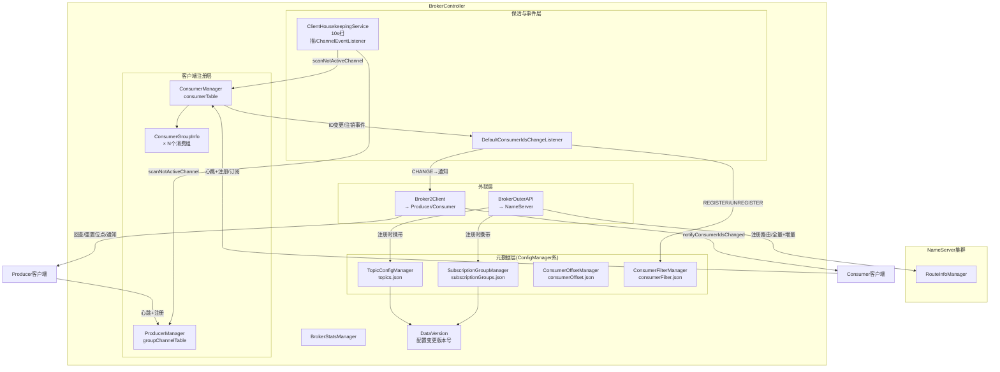
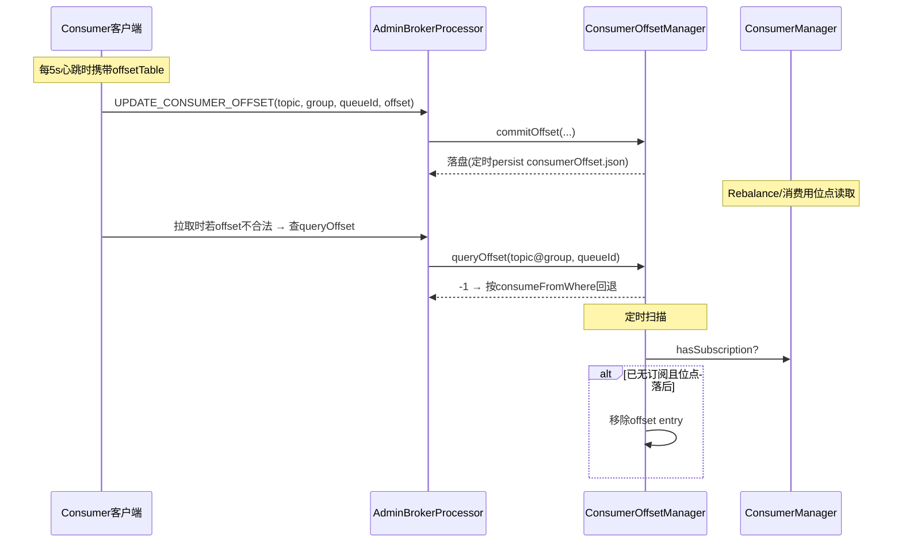
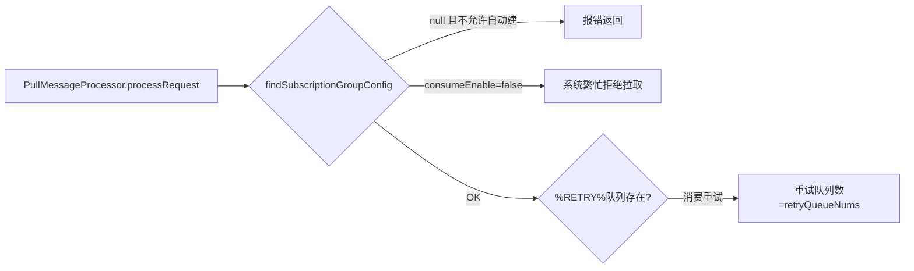
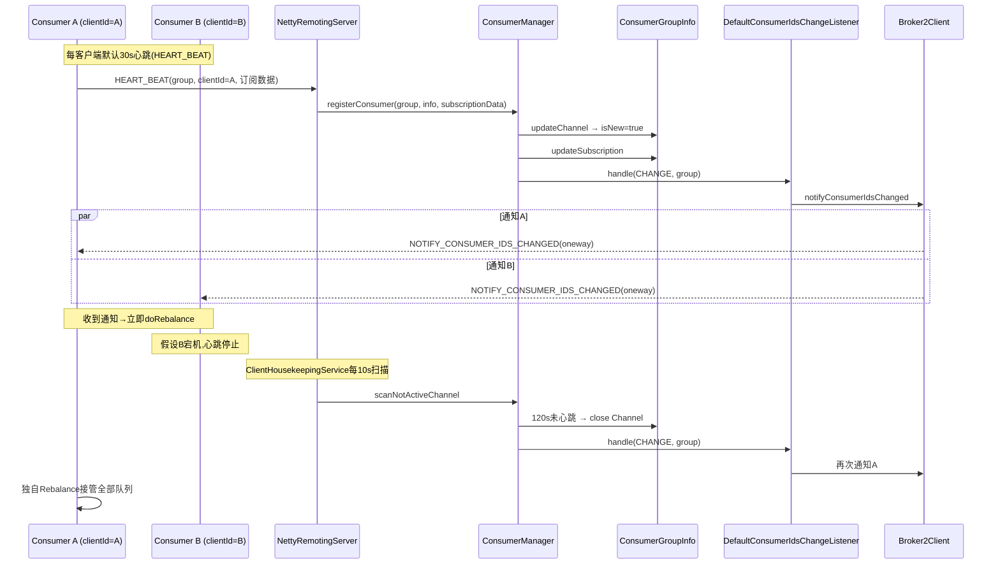
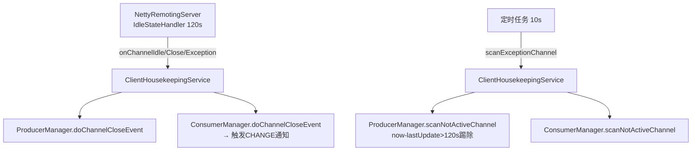
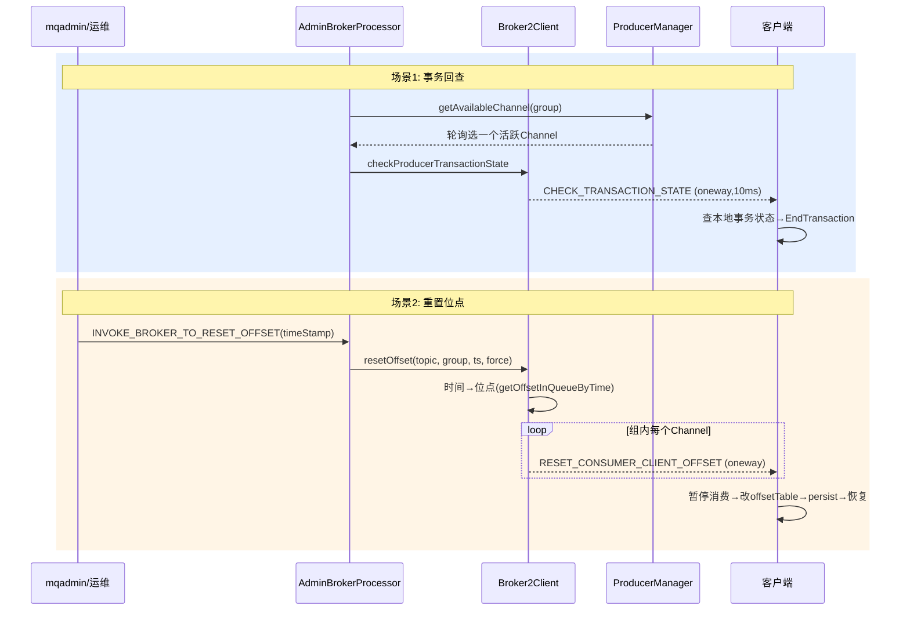
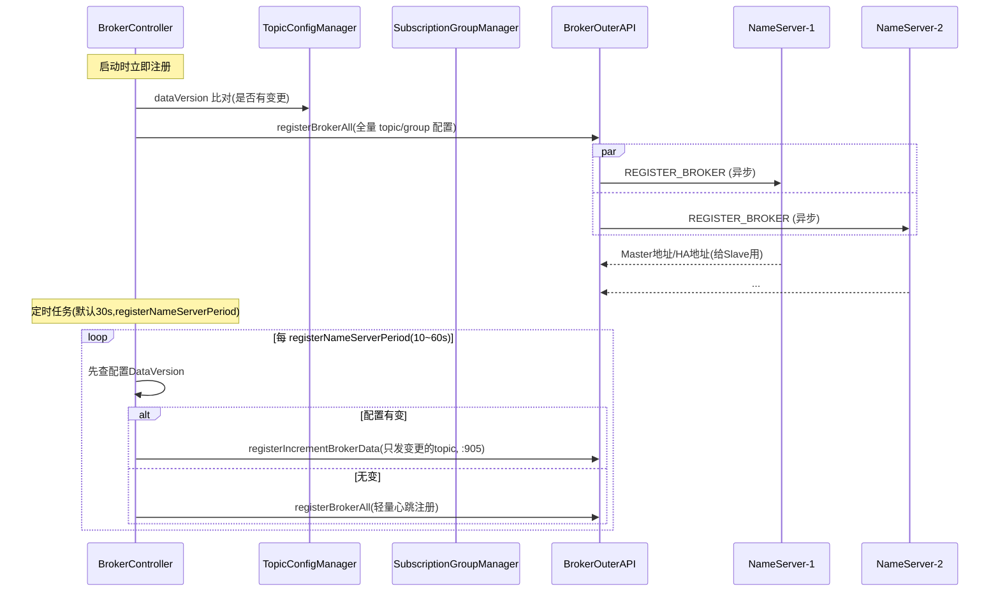
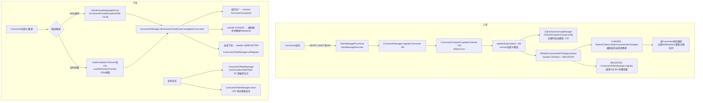

# RocketMQ Broker 管理组件群源码深度分析

> 基于 RocketMQ 4.9.8 源码。本文剖析 Broker 中 11 个管理组件：TopicConfigManager、ConsumerFilterManager、ConsumerOffsetManager、ProducerManager、ConsumerManager、ConsumerGroupInfo、SubscriptionGroupManager、DefaultConsumerIdsChangeListener、ClientHousekeepingService、Broker2Client、BrokerOuterAPI、BrokerStatsManager，覆盖作用、核心数据结构、工作流程与源码精读。

---

## 一、引言：为什么 Broker 需要"管理组件群"

上一篇我们分析了 Broker 启动全景，其中 `BrokerController` 构造函数把十几个 Manager/Service 逐一 new 出来。这些组件 collectively 构成了 Broker 的"元数据大脑 + 客户端注册中心 + 外联通道"：

- **元数据持久化派**（继承 `ConfigManager`）：TopicConfigManager、ConsumerOffsetManager、ConsumerFilterManager、SubscriptionGroupManager——负责把 Broker 上的关键元数据以 JSON 落盘到 `~/store/config/` 目录；
- **客户端注册中心派**：ProducerManager、ConsumerManager（含 ConsumerGroupInfo）——维护"哪些生产者/消费者此刻连着我"的在线表；
- **事件与保活派**：DefaultConsumerIdsChangeListener、ClientHousekeepingService——消费组变更通知、超时连接清理；
- **外联派**：BrokerOuterAPI（Broker→NameServer）、Broker2Client（Broker→客户端反向推送）；
- **观测派**：BrokerStatsManager——TPS/延迟等运行时统计。

### 1.1 全景架构图



### 1.2 BrokerController 中的装配位置

`broker/src/main/java/org/apache/rocketmq/broker/BrokerController.java` 构造函数（193-213 行附近）：

```java
// BrokerController.java:196-199
this.clientHousekeepingService = new ClientHousekeepingService(this);
this.broker2Client = new Broker2Client(this);
// ...
this.brokerOuterAPI = new BrokerOuterAPI(nettyClientConfig);
// BrokerController.java:213
this.brokerStatsManager = new BrokerStatsManager(...);
```

其余元数据 Manager 在更早的构造段落中初始化（topicConfigManager 在构造函数最前面、consumerOffsetManager / subscriptionGroupManager / consumerFilterManager 随后），并在 `initialize()` 中调用各自的 `load()` 完成冷启动恢复。

---

## 二、TopicConfigManager —— Topic 元数据中枢

**文件**：`broker/src/main/java/org/apache/rocketmq/broker/topic/TopicConfigManager.java`（类定义 :43）

### 2.1 作用

Broker 上所有 Topic 的"户口本"：队列数、权限、系统标记。创建 Topic（显式/自动创建/命令行）、更新队列数、删除 Topic 全部走它，且每次变更都会推进 DataVersion，供增量注册 NameServer 使用。

### 2.2 核心数据结构

```java
// TopicConfigManager.java:48-53
private transient final Lock topicConfigTableLock = new ReentrantLock();
// key = topic 名, value = TopicConfig(读写队列数/perm/sysFlag/order)
private final ConcurrentMap<String, TopicConfig> topicConfigTable = new ConcurrentHashMap<>(1024);
private final DataVersion dataVersion = new DataVersion();
private transient BrokerController brokerController;
```

`TopicConfig` 关键字段：`readQueueNums`、`writeQueueNums`、`perm`(6=读写,4=只写,2=只读)、`topicSysFlag`（ORDER=顺序、ORDERLY_READ...）。

### 2.3 核心方法精读

**① 构造函数（:58-150）初始化系统 Topic**：按 `autoCreateTopicEnable` 创建 TBW102（自动创建模板 Topic）、`Benchmark_Test`、`{clusterName}`、`{brokerName}`、`OFFSET_MOVED_EVENT`、`SCHEDULE_TOPIC_XXXX`（延迟消息）、`RMQ_SYS_TRACE_TOPIC`（轨迹）、`DefaultCluster_REPLY_TOPIC`（Request-Reply）。

**② createTopicInSendMessageMethod（:156-226）自动创建**：Producer 发消息遇到未知 Topic 时，以 TBW102 的队列数为模板克隆出新 TopicConfig，加 `topicConfigTableLock` 写入、`dataVersion` 递增、`persist()`。

```java
// :196 附近核心逻辑
TopicConfig defaultTopicConfig = this.topicConfigTable.get(defaultTopic);
// 校验 perm 包含 PERM_WRITE / 队列数合法后
topicConfig = new TopicConfig(topic);
// 以 defaultTopic 的队列数为准，而非请求头里的 queueNum
```

**③ updateTopicConfig（:357-368）**：加锁 put → `dataVersion.nextVersion()` → `persist()`。**注意是"全量 JSON 重写"式持久化**。

**④ updateTopicUnitFlag（:312-333）**：更新单元化标记（云上多单元部署用），改 sysFlag 后同样落盘。

### 2.4 持久化机制

继承 `ConfigManager`（`org.apache.rocketmq.common.ConfigManager`）：

- `configFilePath()` → `${storePathRootDir}/config/topics.json`
- `encode()` 把 topicConfigTable + dataVersion 序列化成 JSON
- `persist()` 内部有 `storeTimeInterval`（默认 10s 由 BrokerController 定时器触发）+ 变更即时落盘
- `load()`：读文件 → decode → 反序列化进内存 Map；若 `topicConfigTable` 为空且文件不存在，返回 false 触发 Broker 用默认配置重建

---

## 三、ConsumerOffsetManager —— 消费位点仓库

**文件**：`broker/src/main/java/org/apache/rocketmq/broker/offset/ConsumerOffsetManager.java`（:36）

### 3.1 核心数据结构（一行代码的灵魂）

```java
// ConsumerOffsetManager.java:40-41
protected ConcurrentMap<String/* topic@group */, ConcurrentMap<Integer, Long>> offsetTable =
        new ConcurrentHashMap<>(512);
```

- 外层 key：`topic@consumerGroup` 复合字符串
- 内层 key：queueId → 消费位点（Long）

### 3.2 核心方法精读

**① commitOffset（:121-139）**：消费组汇报位点（UPDATE_CONSUMER_OFFSET 请求）入口。先构造 `topic@group` key，内层 Map 用 `putIfAbsent`/`put` 写入。集群模式下由 Broker 记账（客户端不本地持久化），广播模式客户端自己记。

**② queryOffset（:142-153）**：查位点，不存在返回 -1（客户端会走 `consumeFromWhere` 决定从最大/最小开始）。

**③ whichTopicByConsumer（:85-101）**：遍历 offsetTable 反查该 group 订阅过哪些 Topic（key 拆 `@`）。

**④ scanUnsubscribedTopic（:52-69）**：定时任务调用。若某 `topic@group` 在 ConsumerManager 里已查不到订阅关系（消费者全部下线/改订阅），且位点落后于该队列 minOffset，则删除该 entry——防止"幽灵位点"。

**⑤ cleanOffset（:235-249）**：删除消费组在指定 Topic 上的全部位点（`mqadmin deleteConsumerGroup` 或消费组被清时调用）。

### 3.3 与其他组件的协作



---

## 四、SubscriptionGroupManager —— 消费组配置

**文件**：`broker/src/main/java/org/apache/rocketmq/broker/subscription/SubscriptionGroupManager.java`（:34）

### 4.1 核心数据结构

```java
// SubscriptionGroupManager.java:37-40
private final ConcurrentMap<String /* group */, SubscriptionGroupConfig> subscriptionGroupTable
        = new ConcurrentHashMap<>(1024);
private final DataVersion dataVersion = new DataVersion();
```

`SubscriptionGroupConfig` 字段（部分）：`consumeEnable`（可置 false 禁消费，用于停服/封组）、`consumeFromMinEnable`、`consumeBroadcastEnable`、`retryQueueNums`（默认 1，重试队列 %RETRY%group 的队列数）、`retryMaxTimes`（默认 16）、`groupSysFlag`（单/多播）、`whichBrokerWhenConsumeSlowly`。

### 4.2 核心方法

**① 构造函数**：`autoCreateSubscriptionGroup=true`（默认）时，预置 `TOOLS_CONSUMER_GROUP`、`SELF_TEST_C_GROUP`、`CID_ONS-HTTP-...`、`CID_RMQ_SYS_...` 等系统组。

**② findSubscriptionGroupConfig（:120-136）**：查询组配置；若不存在且 `autoCreateSubscriptionGroup` 开启，**现场 new 一个默认配置放进去并持久化**（所以 4.x 里随便写个 group 名也能消费——这是把双刃剑）。

**③ updateSubscriptionGroupConfig（:99-110）**：`mqadmin updateSubGroup` 通道，更新 → `dataVersion.nextVersion()` → persist → 通知订阅关系变化。

**④ disableConsume（:112-118）**：`consumeEnable=false`，之后该组的拉取请求直接被 PullMessageProcessor 拒绝（`SUBSCRIPTION_GROUP_NOT_EXIST`/`NO_PERMISSION` 相关错误码）。

### 4.3 在消息链路中的位置



---

## 五、ConsumerFilterManager —— SQL92 过滤表达式仓库

**文件**：`broker/src/main/java/org/apache/rocketmq/broker/filter/ConsumerFilterManager.java`（:44）

> 详细原理见《RocketMQ消息过滤原理源码深度分析-TAG-SQL92-类过滤.md》与《布隆过滤器原理详解.md》，此处聚焦管理视角。

### 5.1 核心数据结构

```java
// ConsumerFilterManager.java:50-54
// key = topic
private ConcurrentMap<String, FilterDataMapByTopic> filterDataByTopic = new ConcurrentHashMap<>(256);
private transient BloomFilter bloomFilter;   // 全局共享布隆过滤器(默认 fpp=1e-16, 期望插入数=??)
```

内部类 `FilterDataMapByTopic`（:324-468）：

```java
// key = consumerGroup, value = ConsumerFilterData
ConcurrentHashMap<String, ConsumerFilterData> groupFilterData;
```

`ConsumerFilterData`：`expression`（SQL92 字符串）、`compiledExpression`（编译后的 Expression 树）、`bornTime`、`deadTime`（过期时间戳）、`bloomFilterData`（该组参数的 bit 位摘要）。

### 5.2 核心方法

- **register(批量, :105-136)**：来自 Consumer 心跳中携带的订阅数据。遍历所有 Topic-Group，带 `isRegister=true` 标志单条注册；同时把本次心跳没出现的旧订阅标记 deadTime。
- **register(单条, :138-159)**：编译表达式（`FilterFactory.INSTANCE.compile`），若编译失败**返回 false，注册被拒**；成功则生成布隆参数、记录 born/deadTime。
- **unRegister（:161-165）**：消费组全部下线时按 group 清除。
- **clean（:291-314）**：定时任务，deadTime 早于 `deadStamp` 阈值的过滤数据被删除（默认存活 24h，见 `ConsumerFilterManager` 中 `consumerFilterDataExpireSecond` 相关逻辑）。
- **get（:167-176）**：`getMessage` 时按 topic+group 取已编译表达式，对 CommitLog 里的消息属性做服务端过滤。

### 5.3 与 ConsumerManager 的联动

心跳 → ConsumerManager.registerConsumer → 触发 DefaultConsumerIdsChangeListener.REGISTER → consumerFilterManager.register。整条链路保证"订阅 SQL92 表达式的组"永远有编译好的过滤器可用。

---

## 六、ProducerManager / ConsumerManager —— 客户端注册中心

### 6.1 ProducerManager

**文件**：`broker/src/main/java/org/apache/rocketmq/broker/client/ProducerManager.java`（:37）

```java
// ProducerManager.java:41-44
// 外层key=group, 内层key=Channel, value=ClientChannelInfo
private final ConcurrentHashMap<String, ConcurrentHashMap<Channel, ClientChannelInfo>> groupChannelTable
        = new ConcurrentHashMap<>();
private final ConcurrentHashMap<String, Channel> clientChannelTable = new ConcurrentHashMap<>(); // clientId→Channel
private PositiveAtomicCounter positiveAtomicCounter = new PositiveAtomicCounter();
```

`ClientChannelInfo`：`clientId`、`remoteAddr`、`language`、`version`、`lastUpdateTimestamp`。

核心方法：

- **registerProducer（:125-146）**：心跳（每 30s 一次的 `HEART_BEAT` 请求）时调用，put/update lastUpdateTimestamp。
- **scanNotActiveChannel（:80-103）**：`now - lastUpdateTimestamp > CHANNEL_EXPIRED_TIME(120s)` → 关闭 Channel → 触发 doChannelCloseEvent。**两分钟收不到心跳就踢人**。
- **doChannelCloseEvent（:105-123）**：遍历所有 group 移除该 Channel（注意：producer 掉线不会像 consumer 那样触发通知，因为生产无重平衡）。
- **getAvailableChannel（:165-203）**：供事务消息回查选通道——`positiveAtomicCounter` 轮询 + isActive + isWritable 校验。

### 6.2 ConsumerManager

**文件**：`broker/src/main/java/org/apache/rocketmq/broker/client/ConsumerManager.java`（:36）

```java
// ConsumerManager.java:39-41
private final ConcurrentMap<String /* Group */, ConsumerGroupInfo> consumerTable
        = new ConcurrentHashMap<>(1024);
private final ConsumerIdsChangeListener consumerIdsChangeListener;
```

核心方法：

- **registerConsumer（:98-122）**：心跳/上线注册。流程：
  1. 取/建 ConsumerGroupInfo；
  2. `updateChannel(...)` 更新通道表——返回 `isNew=true` 说明来了新消费者；
  3. `updateSubscription(...)` 更新订阅；
  4. 若 new 或订阅变化 → `consumerIdsChangeListener.handle(CHANGE, group, ...)` **触发全组通知**。
- **unregisterConsumer（:125-141）**：下线（含 `UNREGISTER_CLIENT` 请求），移除通道后组内空了就 remove 整个 ConsumerGroupInfo；触发 UNREGISTER 事件。
- **doChannelCloseEvent（:77-96）**：连接异常路径的注销，同样触发 CHANGE 通知。
- **scanNotActiveChannel（:144-174）**：同 Producer 逻辑，120s 超时踢除。
- **findSubscriptionData（:55-62）/ queryTopicConsumeByWho（:176-188）**：供拉取校验与 `topicRoute`/`topicStatus` 查询。

### 6.3 ConsumerGroupInfo —— 一个消费组的全息画像

**文件**：`broker/src/main/java/org/apache/rocketmq/broker/client/ConsumerGroupInfo.java`（:35）

```java
// ConsumerGroupInfo.java:37-45
private final String groupName;
private final ConcurrentMap<String /* Topic */, SubscriptionData> subscriptionTable = new ConcurrentHashMap<>();
private final ConcurrentMap<Channel, ClientChannelInfo> channelInfoTable = new ConcurrentHashMap<>(16);
private volatile ConsumeType consumeType;          // 激活/被动
private volatile MessageModel messageModel;        // 集群/广播
private volatile ConsumeFromWhere consumeFromWhere;
private volatile long lastUpdateTimestamp = System.currentTimeMillis();
```

- **updateChannel（:116-147）**：新 Channel put 进表，老的刷新 `lastUpdateTimestamp`（供 housekeeping 判断存活），返回是否新增。
- **updateSubscription（:149-203）**：逐个 Topic 对比 `SubscriptionData`，**只有 version 更大才覆盖**；并删除本次心跳中不再订阅的 Topic（订阅了又取消的场景）。
- **getAllClientId（:83-...）**：拼 `clientId@remoteAddr` 列表——这正是 `getAllConsumerIdList()`，会被注册到 NameServer（消费组在线状态来源），也是客户端 Rebalance 分配的消费 ID 列表。

### 6.4 注册中心工作全流程（时序图）



---

## 七、DefaultConsumerIdsChangeListener —— 消费组事件分发器

**文件**：`broker/src/main/java/org/apache/rocketmq/broker/client/DefaultConsumerIdsChangeListener.java`（:27），接口 `ConsumerIdsChangeListener.java:19-22`。

```java
// DefaultConsumerIdsChangeListener.java:34-64
public void handle(ConsumerGroupEvent event, String group, Object... args) {
    switch (event) {
        case CHANGE:   // 组内成员或订阅变化 → 通知全组客户端立即重平衡
            // 遍历该组所有 Channel:
            // broker2Client.notifyConsumerIdsChanged(channel, group);
            break;
        case UNREGISTER:  // 组注销 → 按组清理过滤数据
            // consumerFilterManager.unRegister(group)
            break;
        case REGISTER:    // 组注册 → 注册SQL92过滤表达式
            // 遍历 args 中的 SubscriptionData:
            // consumerFilterManager.register(topic, group, ...)
            break;
    }
}
```

三事件语义：

| 事件 | 触发时机 | 动作 |
|---|---|---|
| CHANGE | registerConsumer 检测到新通道/订阅变化；doChannelCloseEvent；scanNotActiveChannel 踢人 | 对组内所有在线 Channel oneway 推送 `NOTIFY_CONSUMER_IDS_CHANGED` |
| REGISTER | registerConsumer 时（订阅含 SQL92 表达式） | 向 ConsumerFilterManager 注册/刷新编译后的表达式 |
| UNREGISTER | unregisterConsumer / 组彻底下线 | 从 ConsumerFilterManager 移除该组表达式 |

> 这是 Broker 端"感知拓扑变化 → 驱动客户端重平衡"的关键齿轮，把 ConsumerManager（连接状态）与 Broker2Client（反向推送）解耦。

---

## 八、ClientHousekeepingService —— 客户端连接保活

**文件**：`broker/src/main/java/org/apache/rocketmq/broker/client/ClientHousekeepingService.java`（:30）

它身兼两职：

**① 定时扫描器（:41-58）**

```java
// ClientHousekeepingService.java:41-53
public void start() {
    this.scheduledExecutorService.scheduleAtFixedRate(new Runnable() {
        @Override public void run() {
            try { ClientHousekeepingService.this.scanExceptionChannel(); }
            catch (Throwable e) { log.error("Error occurred when scan not active client channels.", e); }
        }
    }, 1000 * 10, 1000 * 10, TimeUnit.MILLISECONDS);   // 延迟10s启动,每10s一次
}

private void scanExceptionChannel() {   // :55-58
    this.brokerController.getProducerManager().scanNotActiveChannel();
    this.brokerController.getConsumerManager().scanNotActiveChannel();
}
```

**② ChannelEventListener（:64-85）**：实现 Netty 层事件回调，`onChannelClose / onChannelException / onChannelIdle` 三个事件全部转投给 ProducerManager 与 ConsumerManager 的 `doChannelCloseEvent`（`onChannelConnect` 为空实现）。它作为 listener 注册进 `NettyRemotingServer`，Netty pipeline 检测到链路断开/异常/空闲（IdleStateHandler 120s）时回调——**"事件驱动 + 定时扫描"双保险**。



---

## 九、Broker2Client —— Broker 反向控制通道

**文件**：`broker/src/main/java/org/apache/rocketmq/broker/client/net/Broker2Client.java`（:54）

Broker 不仅是"服务端"，有时要**主动向客户端发指令**。全部 5 个方法：

| 方法 | 行号 | RequestCode | 调用方/时机 |
|---|---|---|---|
| `checkProducerTransactionState` | :62-76 | CHECK_TRANSACTION_STATE | 事务消息回查：`TransactionalMessageCheckService` 定时扫描半消息后，经 ProducerManager.getAvailableChannel 找到原生产者，oneway 发回查请求 |
| `callClient` | :78-82 | 任意 | 通用同步调用封装（invokeSync，10s 超时），如查询 ConsumerRunningInfo |
| `notifyConsumerIdsChanged` | :84-102 | NOTIFY_CONSUMER_IDS_CHANGED | DefaultConsumerIdsChangeListener.CHANGE 事件 → oneway 通知组内所有消费者立即重平衡 |
| `resetOffset` | :104-217 | RESET_CONSUMER_CLIENT_OFFSET | `mqadmin resetOffsetByTime`：先由 `getOffsetInQueueByTime` 把时间转位点，再向组内所有客户端 oneway 下发重置表（isForce=false 时只往小重置，防倒退；不在线返回 CONSUMER_NOT_ONLINE :208） |
| `getConsumeStatus` | :230-298 | GET_CONSUMER_STATUS_FROM_CLIENT | `mqadmin consumerStatus`：逐个消费者 invokeSync 拉回其本地位点表，按 clientId 汇总 |

**resetOffset 核心决策（:149-153）**：

```java
if (isForce || timeStampOffset < consumerOffset) {
    offsetTable.put(mq, timeStampOffset);   // 强制 / 时间位点在当前位点之前 → 重置
} else {
    offsetTable.put(mq, consumerOffset);    // 否则保持(不允许向前跳)
}
```

> 注意：4.9.8 中 `wipeWritePermOfBroker` 是 **AdminBrokerProcessor → BrokerOuterAPI → NameServer** 方向的调用（Broker 收到 `WIPE_WRITE_PERM_OF_BROKER` 请求时通知 NameServer 抹掉本机写权限，用于 Master 宕机切主时防旧 Master 复活写脏数据），**不在 Broker2Client 中**——方向恰好相反，容易混淆。



---

## 十、BrokerOuterAPI —— Broker 的对外 RPC 封装

**文件**：`broker/src/main/java/org/apache/rocketmq/broker/out/BrokerOuterAPI.java`（:60）

### 10.1 定位

Broker 对 NameServer 的所有通信都走它。内部持有一个 `NettyRemotingClient`（:62），并支持两种 NameServer 寻址：静态 `nameSrvAddr` 与动态 `TopAddressing`（:63，从 `jmenv.tbsite.net` 地址服务器拉取，云上环境用）。

```java
// BrokerOuterAPI.java:62-66
private final NettyRemotingClient remotingClient;
private final TopAddressing topAddressing;
private String nameSrvAddr;
private final ExecutorService brokerOuterExecutor;   // 异步注册用的线程池
```

### 10.2 核心方法

**① registerBrokerAll（:113-...）—— Broker 注册的心脏**

```java
// 精简后的流程
List<RegisterBrokerResult> registerBrokerAll(final String clusterName, final String brokerName,
    final String brokerAddr, ...) {
    // 1. 组装 TopicConfigAndQueueMappingWrapper / SubscriptionGroupWrapper 请求体
    // 2. 对每个 NameServer 提交异步注册任务到 brokerOuterExecutor
    // 3. invokeAsync(nameSrvAddr, request, timeoutMills, callback)
    // 4. future.get() 等全部返回,聚合结果列表
}
```

要点：
- **遍历所有 NameServer 逐一注册**（Nameserver 无主，路由信息靠 Broker 广播同步）；
- 返回的 `RegisterBrokerResult` 里带着 **Master 地址与 HaServerAddr**——Slave 收到后据此连 Master 的 HA 端口做主从同步；
- `registerBrokerAll` 有 boolean 返回重载，`false` 表示"配置无变化可跳过"（BrokerController 里先比较 DataVersion）。

**② unregisterBrokerAll（:211）**：Broker 正常 shutdown 时向所有 NameServer 发 `BROKER_UNREGISTER`，携带该 Broker 上全部 Topic/消费组数据用于路由剔除。

**③ getAllTopicConfig（:319）**：从 NameServer 拉 Topic 配置（Slave 场景同步元数据用）。

**④ 其他**：`lockBatchMQ`/`unlockBatchMQ`（顺序消费向 Master 申请 MessageQueue 锁）、`getAllConsumerOffset`、`getAllSubscriptionGroupConfig`、`getAllDelayOffset`——Slave 启动时从 Master（非 NameServer）同步这些元数据的请求也经由本类的 remotingClient 发出。

### 10.3 BrokerController 的注册调度



---

## 十一、BrokerStatsManager —— 运行时统计中枢

**文件**：`store/src/main/java/org/apache/rocketmq/store/stats/BrokerStatsManager.java`（:31，注意它在 **store** 模块而非 broker 模块——因为 store 层也要埋点）

### 11.1 核心数据结构

```java
// BrokerStatsManager.java:74-78
private final ConcurrentMap<String, StatsItemSet> statsTable = new ConcurrentHashMap<>();
private final String clusterName;
private final boolean enableQueueStat;
private final MomentStatsItemSet momentStatsItemSetFallSize;  // 瞬时项: 落后Master多少字节(SLAVE)
private final MomentStatsItemSet momentStatsItemSetFallTime;  // 瞬时项: 落后Master多少毫秒
```

三层统计组件（`store/stats/` 包）：

- **StatsItem**：`AtomicLong value`（累计值）+ `LinkedList<CallSnapshot> lsTop`（最近 N 分钟分钟级快照）→ 由快照差值算分钟级 TPS。
- **StatsItemSet**：同名指标的一组 StatsItem（按 `topic@group` / `topic` 细分 key），内置三个定时任务：每分钟采样快照、每 10 分钟打印、每天 0 点落盘 `~/store/stats/`。
- **MomentStatsItemSet**：不累加，只记录"此刻值"（如从库落后量），每分钟输出一次超阈值告警（`fallBehind` 日志）。

### 11.2 典型指标常量（:80-100 附近）

| 常量 | 含义 |
|---|---|
| TOPIC_PUT_NUMS / TOPIC_PUT_SIZE | Topic 发送条数/字节数 |
| GROUP_PUT_NUMS / GROUP_PUT_SIZE | 组重试队列写入（含 DLQ） |
| GROUP_GET_NUMS / GROUP_GET_SIZE | 组消费条数/字节数 |
| SNDBCK_PUT_NUMS / SNDBCK_PUT_SIZE | 消费失败重回队列数 |
| GROUP_GET_LATENCY | 组拉取延迟（分 level 桶） |
| COMMERCIAL_SEND_TIMES / COMMERCIAL_RCV_TIMES | 商业(云)计数埋点 |
| DLQ_PUT_NUMS | 死信写入 |

### 11.3 埋点方式

```java
// 典型调用(BrokerStatsManager.java:265-292 附近)
brokerStatsManager.incGroupGetLatency(group, topic, queueId, costTime);  // 延迟: 按level分桶 inc
brokerStatsManager.tpsGroupGetNums(topic, group, msgs.size());           // TPS: 累加值
```

调用方：SendMessageProcessor（put 成功→TOPIC_PUT_*）、PullMessageProcessor（GROUP_GET_*、延迟）、SendMessageHook（COMMERCIAL_*）、DefaultMessageStore（落盘延迟、SLAVE fallSize/fallTime）。

**统计生命周期**：`start()` 时给每个 StatsItemSet 启动定时器；`onTopicDeleted/onGroupDeleted`（:137-154）删除指标项防止 Map 无限膨胀；`shutdown()` 输出最终快照。

> 所有统计**只进内存 + 日志 + stats 目录 CSV，不落 store 文件**，Broker 重启即清零——生产监控请依赖 Exporter/Dashboard 而非本地累计值。

---

## 十二、组件协作总流程：一次"消费者上下线"的完整链路



---

## 十三、组件对照总表

| 组件 | 模块 | 持久化文件 | 核心数据结构 | 变更触发下游 |
|---|---|---|---|---|
| TopicConfigManager | broker/topic | config/topics.json | `Map<topic, TopicConfig>` + DataVersion | 增量注册 NameServer |
| ConsumerOffsetManager | broker/offset | config/consumerOffset.json | `Map<topic@group, Map<queueId, offset>>` | 消费进度/Rebalance |
| ConsumerFilterManager | broker/filter | config/consumerFilter.json | `Map<topic, Map<group, ConsumerFilterData>>` + BloomFilter | 服务端 SQL92 过滤 |
| SubscriptionGroupManager | broker/subscription | config/subscriptionGroups.json | `Map<group, SubscriptionGroupConfig>` + DataVersion | 拉取鉴权/重试队列 |
| ProducerManager | broker/client | 无（内存） | `Map<group, Map<Channel, ClientChannelInfo>>` | 事务回查选通道 |
| ConsumerManager | broker/client | 无（内存） | `Map<group, ConsumerGroupInfo>` | 触发 CHANGE/REGISTER/UNREGISTER |
| ClientHousekeepingService | broker/client | 无 | 定时器 + ChannelEventListener | 踢除超时连接 |
| DefaultConsumerIdsChangeListener | broker/client | 无 | 事件枚举 | Broker2Client 通知 / FilterManager 注册 |
| Broker2Client | broker/client/net | 无 | 复用 RemotingServer | 反向指令下发 |
| BrokerOuterAPI | broker/out | 无 | NettyRemotingClient | NameServer 注册/顺序锁 |
| BrokerStatsManager | **store**/stats | stats/*.csv(只读性) | `Map<指标名, StatsItemSet>` | 监控/日志 |

---

## 十四、陷阱与运维调试清单

1. **心跳周期与踢人阈值**：客户端心跳 30s，服务端 120s 判死——容忍连续 3 次心跳丢失。若网络抖动 >120s，消费者被踢 → 全组 Rebalance → 顺序消费队列锁重分配，**可能触发重复消费**。
2. **autoCreateSubscriptionGroup 双刃剑**：随便写 group 名会自动建组并落盘，组配置表会被"脏组"污染（`mqadmin consumerProgress` 可见）；生产环境建议关闭。
3. **位点文件是全量 JSON**：消费组极多时 consumerOffset.json 越来越大，persist 是全量重写，IO 放大；且异常断电可能丢最近未持久化的位点（默认每 5s 持久化一次，最多回退 5s 进度）。
4. **消费组配置(内存态)重启即失**：ConsumerManager/ProducerManager 是纯内存的，Broker 重启瞬间所有客户端需靠心跳重新注册，期间 `NOTIFY_CONSUMER_IDS_CHANGED` 风暴式触发全量 Rebalance（大量消费组时注意启动毛刺）。
5. **updateSubscription 只认大 version**：客户端伪造/回退订阅版本号（自定义 hook 改 SubscriptionData.version）会导致订阅不生效；同理灰度发布新旧订阅不一致时以高 version 为准。
6. **BrokerStatsManager 在 store 模块**：找统计源码别只搜 broker 模块；重启清零，历史趋势要看外部监控。
7. **ConsumerFilterManager 编译失败即注册失败**：SQL92 表达式语法错误会注册不生效且只有 warn 日志（`register false, ...`），表现为"消息过滤了但没消费"，`mqadmin consumerConnection -g` 看订阅是否为空。
8. **wipeWritePerm 方向易混淆**：是 Broker→NameServer（BrokerOuterAPI 方向）的权限擦除，不是 Broker2Client 的方法。

**mqadmin 调试速查**：

```bash
# 查消费组在线消费者(来自ConsumerManager.consumerTable)
mqadmin consumerConnection -n localhost:9876 -g myGroup
# 查Topic被谁订阅(ConsumerManager.queryTopicConsumeByWho)
mqadmin topicRoute / whoConsumeTheMessage ...
# 查/重置位点(ConsumerOffsetManager)
mqadmin consumerProgress -g myGroup
mqadmin resetOffsetByTime -t myTopic -g myGroup -s 2024-01-01#12:00:00:000
# 查看组配置(SubscriptionGroupManager) / 更新
mqadmin examineSubscriptionGroupConfig -g myGroup
mqadmin updateSubGroup -c myCluster -g myGroup -n consumeEnable=false
# Broker统计(BrokerStatsManager落盘)
cat ~/store/stats/*.csv | tail
```

---

## 十五、设计得与失

**得**：
- ConfigManager 统一了"内存 Map + JSON 全量落盘 + load 恢复"的模板，四个元数据 Manager 零重复代码，新增元数据类型成本极低；
- "心跳注册 + 事件监听器 + 定时扫描"三层连接管理，事件驱动保实时、定时扫描兜底，链路健壮；
- ConsumerIdsChangeListener 用事件枚举解耦了 ConsumerManager 与通知/过滤逻辑，Broker2Client 反向通道使 Rebalance 通知、事务回查、位点重置共用一条链路；
- DataVersion 机制让增量注册 NameServer 成为可能，避免每 30s 全量推送大路由表。

**失**：
- 元数据持久化是**单文件全量 JSON 重写**，规模大时（十万 Topic/组）写放大严重，5.x 后演进为 config 部分仍如此，最终靠 RocksDB/Controller 方案缓解；
- ConsumerManager 纯内存，重启后到全量心跳补齐之间有"假下线"窗口；
- registerConsumer 触发通知是同步遍历 oneway，消费组内客户端极多时 clientManageExecutor 可能成为心跳处理瓶颈；
- 统计指标名与 key 拼接（topic@group）没有统一抽象，二次开发埋点容易拼错。

**一句话总结**：Broker 管理组件群 = 四本"可落盘的账本"（Topic/位点/订阅组/过滤）+ 两张"在线连接表"（生产/消费）+ 一套"保活与事件广播机制"（Housekeeping + IdsChangeListener）+ 一条"对外通道"（OuterAPI→NameServer / Broker2Client→Client）+ 一只"秒表"（StatsManager），它们共同把 Broker 从一台"存储机器"升级成了一台"有路由、有状态、可运维的消息服务器"。

---

> 上一篇：[RocketMQ mmap内存映射与刷盘机制源码深度分析](RocketMQ%20mmap内存映射与刷盘机制源码深度分析.md)
> 本系列至此 4.9.8 全模块已覆盖；本文作为 Broker 管理组件群的综合篇，可回链：[存储文件恢复与Broker启动全景](RocketMQ存储文件恢复与Broker启动全景源码深度分析.md)、[Rebalance负载均衡](RocketMQ%20Rebalance负载均衡源码深度分析.md)、[消费位点管理](RocketMQ消费位点管理源码深度分析.md)、[消息过滤](RocketMQ消息过滤原理源码深度分析-TAG-SQL92-类过滤.md)。
