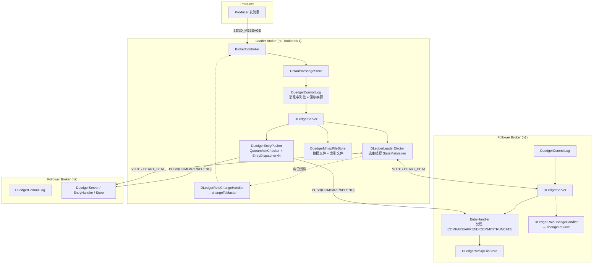
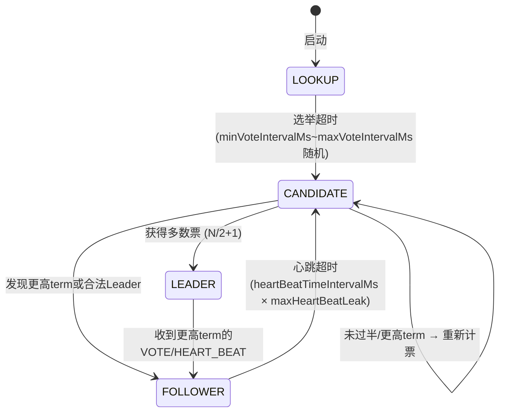
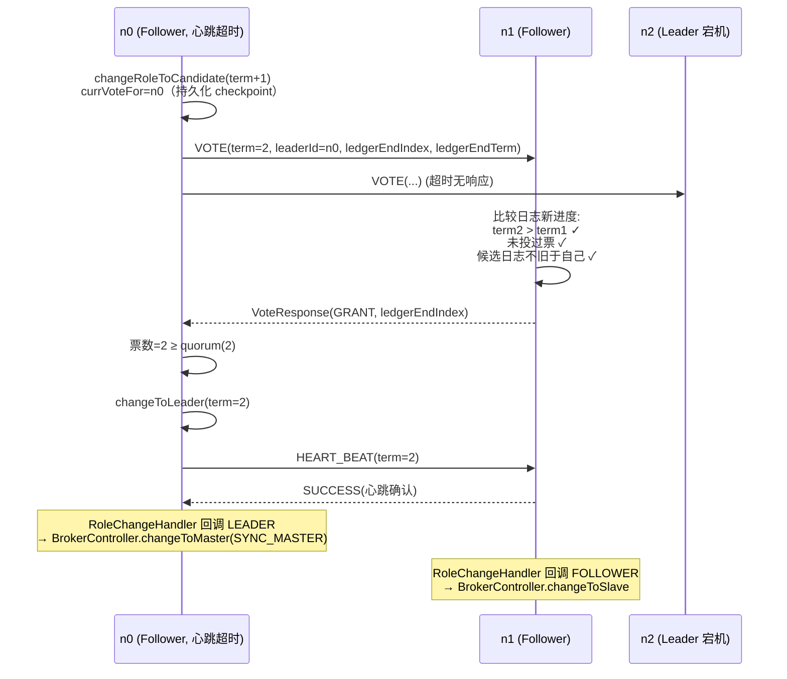
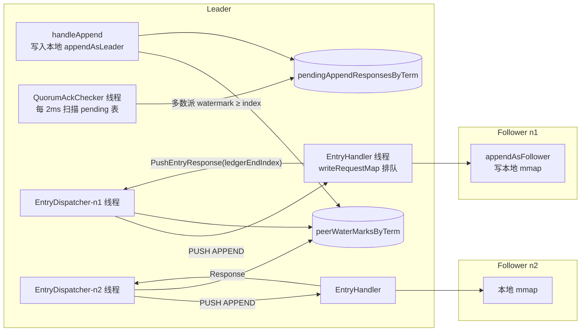
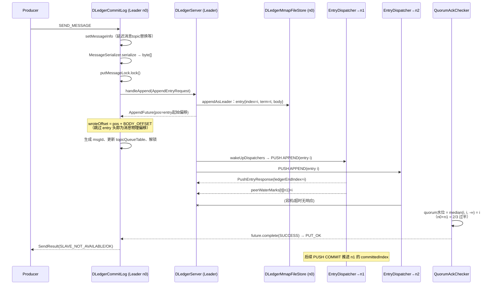
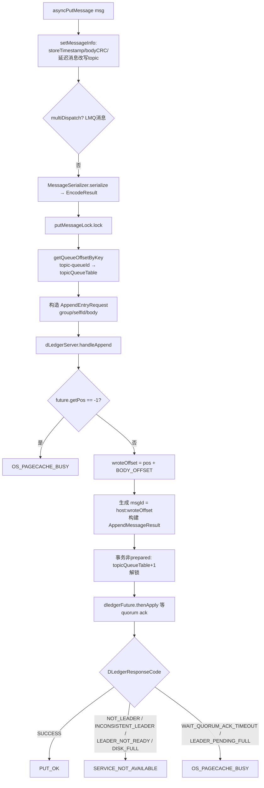
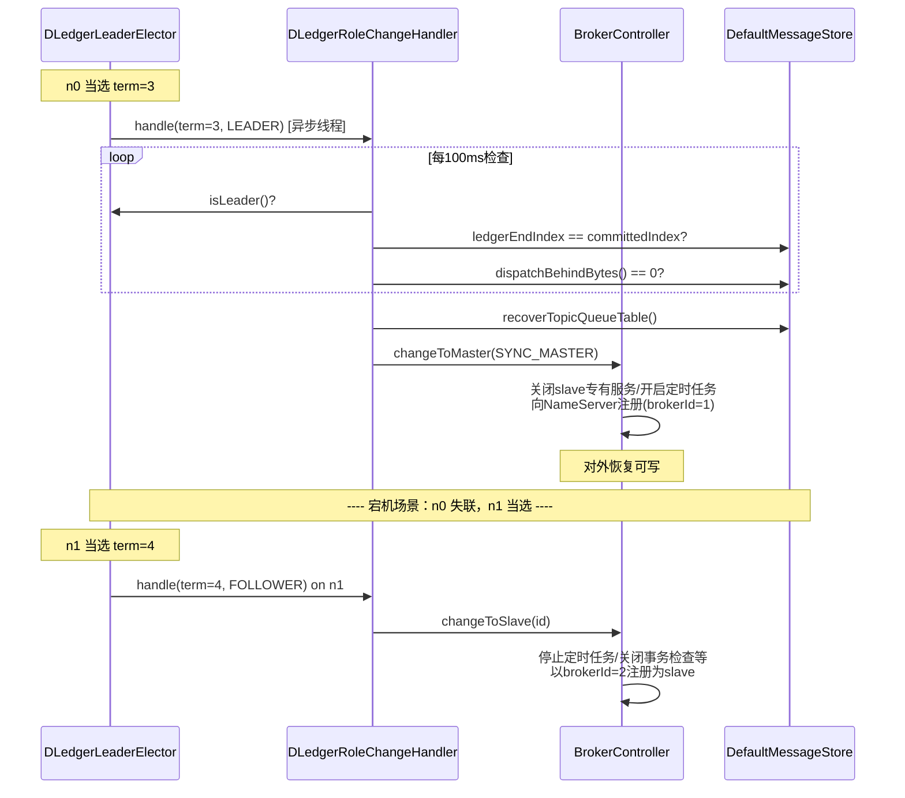
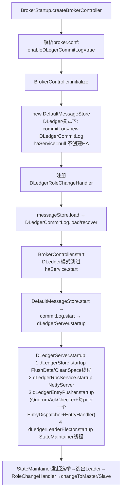
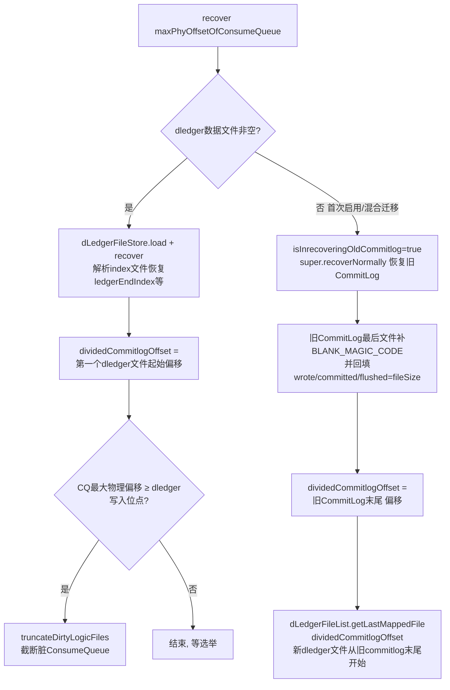

# RocketMQ DLedger 模式源码深度分析（4.9.8）

> 基于 `rocketmq-4.9.8` 源码 + 其依赖库 `io.openmessaging.storage:dledger:0.3.2`（`store/pom.xml` 引入）联合分析。
> RocketMQ 侧源码给出精确文件与行号；DLedger 内部实现基于 0.3.2 版本 jar 的类结构反编译核验（方法名、字段、线程模型均为实际签名）。

---

## 目录

1. [DLedger 是什么](#一dledger-是什么)
2. [整体架构](#二整体架构)
3. [DLedger 核心组件（0.3.2 库内部）](#三dledger-核心组件)
4. [Raft 选主实现](#四raft-选主实现)
5. [日志复制与 Quorum Ack](#五日志复制与-quorum-ack)
6. [DLedger 日志存储](#六dledger-日志存储)
7. [RocketMQ 侧集成：DLedgerCommitLog](#七rocketmq-侧集成dledgercommitlog)
8. [Broker 角色切换：DLedgerRoleChangeHandler](#八broker-角色切换)
9. [启动与恢复流程](#九启动与恢复流程)
10. [与主从 HA 模式的对比](#十与主从-ha-模式的对比)

---

## 一、DLedger 是什么

DLedger（`io.openmessaging.storage:dledger`）是 OpenMessaging 社区基于 **Raft 一致性协议** 实现的 commitlog 存储库，RocketMQ 4.5+ 将其作为可选的多副本方案集成进 Broker。

**为什么需要它：** RocketMQ 4.5 之前只有主从（Master/Slave）+ HA 同步复制，主从模式有两个致命缺陷：

- **Slave 不能自动切换为 Master**：Master 宕机需要人工（或外部运维工具）执行 `changeMaster`，期间集群不可写；
- **数据可靠性依赖配置**：SYNC_MASTER 只是同步复制，切换时仍可能丢数据，没有"多数派提交"的共识保证。

DLedger 模式下，一组 Broker（通常是 3 台或 5 台）组成一个 **dLegerGroup**，通过 Raft 协议：

1. **自动选主**：Leader 宕机后秒级完成选举，无需人工干预；
2. **多数派（Quorum）提交**：消息写入至少 `N/2+1` 个节点才算成功，任意少数派故障不丢已确认消息；
3. **日志一致性**：Raft log 保证各副本 commitlog 完全一致，Follower 可直接截断（truncate）与 Leader 不一致的日志后重同步。

### 工程现状（重要）

在 4.9.8 源码树中，DLedger **不是** RocketMQ 内部的模块，而是外部 Maven 依赖：

```xml
<!-- store/pom.xml -->
<dependency>
    <groupId>io.openmessaging.storage</groupId>
    <artifactId>dledger</artifactId>   <!-- 0.3.2 -->
    <exclusions>...</exclusions>
</dependency>
```

RocketMQ 侧与之相关的源码只有三个文件：

| 文件 | 作用 |
|---|---|
| `store/src/main/java/org/apache/rocketmq/store/dledger/DLedgerCommitLog.java` | 继承 `CommitLog`，用 DLedger 替代本地 CommitLog 写入 |
| `broker/src/main/java/org/apache/rocketmq/broker/dledger/DLedgerRoleChangeHandler.java` | 监听 Raft 角色变化，联动 Broker 主从状态 |
| `store/src/main/java/org/apache/rocketmq/store/config/MessageStoreConfig.java` | `enableDLegerCommitLog`、`dLegerGroup` 等配置（:157 附近） |

> 注：5.x 版本 Controller（JRaft/DLedger Controller）是另一套机制（解决元数据切换 + 主从副本自动上下线），与本文的 4.x DLedger CommitLog 多副本不同。

---

## 二、整体架构



关键设计点：

- **Raft 协议栈内嵌在每个 Broker 进程中**（DLedgerServer 自带 NettyServer/NettyClient，复用了 `rocketmq-remoting` 的 `NettyRemotingServer/NettyRemotingClient`），端口为 peers 中配置的 dLedger 端口；
- **只有 Leader 可写**：Follower 收到客户端写请求由上层 Broker 角色挡掉（`SLAVE` 不可写），DLedger 内部 `handleAppend` 也会校验 `isLeader()` 返回 `NOT_LEADER`；
- **Follower 可读**：消息已被 Quorum 确认并复制到本地 commitlog，ConsumeQueue/Index 由本地 `ReputMessageService` 异步构建，消费者可直接从 Follower 拉取。

### RPC 协议命令码（DLedgerRequestCode）

| 命令码 | 用途 | 处理方法（DLedgerServer） |
|---|---|---|
| `METADATA` | 查询 leader/peers 元信息 | `handleMetadata` |
| `APPEND` | 客户端（即 DLedgerCommitLog）追加日志 | `handleAppend` |
| `GET` | 按 index 读日志 | `handleGet` |
| `PULL` | Follower 主动拉日志（降级路径） | `handlePull` |
| `PUSH` | Leader → Follower 日志推送（复制主路径） | `handlePush`（EntryHandler） |
| `VOTE` | 选举投票 | `handleVote`（DLedgerLeaderElector） |
| `HEART_BEAT` | Leader 心跳 | `handleHeartBeat`（DLedgerLeaderElector） |
| `LEADERSHIP_TRANSFER` | 主动权交接（ preferredLeaderId 用） | `handleLeadershipTransfer` |

---

## 三、DLedger 核心组件

`DLedgerServer` 是门面类，聚合了以下组件（均验证自 0.3.2 jar）：

```
DLedgerServer
 ├── MemberState              // Raft 成员状态机：role/currTerm/leaderId/currVoteFor/ledgerEndIndex/ledgerEndTerm
 ├── DLedgerStore             // 接口，实际为 DLedgerMmapFileStore（文件存储）
 ├── DLedgerRpcService        // 实际为 DLedgerRpcNettyService（复用 rocketmq-remoting）
 ├── DLedgerEntryPusher       // 日志复制（Leader 侧推送 + Follower 侧接收 + QuorumAckChecker）
 ├── DLedgerLeaderElector     // 选主
 └── StateMachineCaller       // 0.3.x 新增状态机回调（RocketMQ 未使用，fsmCaller 为空 Optional）
```

### MemberState（Raft 状态核心）

```java
// io.openmessaging.storage.dledger.MemberState（javap 验证的字段）
private volatile Role role;          // LEADER / FOLLOWER / CANDIDATE
private volatile String leaderId;
private volatile long currTerm;      // 当前任期
private volatile String currVoteFor; // 当前任期投给谁（Raft 要求任期 内持久化投票，防脑裂双票）
private volatile long ledgerEndIndex; // 本地最后一条日志 index
private volatile long ledgerEndTerm;  // 本地最后一条日志 term
private long knownMaxTermInGroup;
private final Map<String, Boolean> peersLiveTable;
private volatile String transferee;   // LEADERSHIP_TRANSFER 目标

// term 与 voteFor 会持久化到 ${store}/checkpoint 文件（TERM_PERSIST_FILE），重启不丢
synchronized void changeToLeader(long term);
synchronized void changeToFollower(long term, String leaderId);
synchronized void changeToCandidate(long term);
```

`RoleChangeHandler` 回调接口（RocketMQ 的 `DLedgerRoleChangeHandler` 即实现它）在角色变化时被异步通知（term, role）。

---

## 四、Raft 选主实现

### 4.1 状态机与超时参数



DLedgerConfig 关键参数（jar 中验证的字段，含默认值语义）：

| 参数 | 含义 |
|---|---|
| `heartBeatTimeIntervalMs`（默认 2000） | Leader 心跳间隔 |
| `maxHeartBeatLeak`（默认 2） | Follower 允许漏掉的心跳数，超过即触发选举 |
| `minVoteIntervalMs / maxVoteIntervalMs`（默认 1000/3000） | 选举随机退避区间，避免活锁 |
| `enableLeaderElector` | 是否开启选举 |
| `preferredLeaderId` | 候选首选 leader（RocketMQ 配置透传） |

### 4.2 StateMaintainer 主循环

`DLedgerLeaderElector` 内部有一个 `StateMaintainer extends ShutdownAbleThread` 线程，`doWork()` 按当前角色分派（方法签名验证自 jar）：

```java
private void maintainAsLeader() throws Exception;   // 周期 sendHeartbeats()，维护心跳时间戳
private void maintainAsFollower();                  // 检查 lastLeaderHeartBeatTime，超时→changeRoleToCandidate
private void maintainAsCandidate() throws Exception;// nextTerm()++, 向所有 peers 发 VOTE（voteForQuorumResponses）
```

选主时序：



投票约束（`handleVote`，与标准 Raft 一致）：

1. 请求 term < 本地 currTerm → 拒绝（`EXPIRED_TERM`）；
2. 同一 term 已投给别人 → 拒绝；
3. **日志完整性检查**：候选人的 `(ledgerEndTerm, ledgerEndIndex)` 必须不旧于自己的，保证新 Leader 拥有全部已提交日志。

心跳处理（`handleHeartBeat`）同理：term 更高则无条件转 Follower；term 相同且自己是 Follower 则刷新 `lastLeaderHeartBeatTime`。term 变化由 `peersLiveTable` 追踪，`needIncreaseTermImmediately` 处理"同 term 双 Leader 异常"场景。

---

## 五、日志复制与 Quorum Ack

这是 DLedger 最核心的部分，由 `DLedgerEntryPusher` 承担，内部含三个关键子组件：



### 5.1 Leader 侧写入（handleAppend / waitAck）

1. `dLedgerStore.appendAsLeader(entry)`：写入本地 mmap 文件，为 entry 分配递增 `index`，记录 `term`；
2. `waitAck(entry)`：把 `TimeoutFuture<AppendEntryResponse>` 放入 `pendingAppendResponsesByTerm`（key=term → index → future），并 `wakeUpDispatchers()` 唤醒各 Follower 的 EntryDispatcher；
3. `isPendingFull(term)`：pending 超过 `maxPendingRequestsNum` 时拒绝写入（`LEADER_PENDING_FULL` → RocketMQ 映射为 `OS_PAGECACHE_BUSY`）。

### 5.2 QuorumAckChecker（多数派提交线程）

独立线程周期运行（`lastQuorumIndex` 记录上次提交位点）：

1. 收集每个 peer 的 `peerWaterMarks[term][peerId]`（Follower 通过 Push 响应汇报的 ledgerEndIndex）+ 自己的 ledgerEndIndex；
2. 排序取**中位数**（即 quorum 水位）；
3. 将 pending 表中所有 `index ≤ quorumIndex` 的 future 以 `SUCCESS` 完成 —— 这一步触发 DLedgerCommitLog 的 `thenApply`，消息对客户端可见；
4. `updateCommittedIndex()` 推进 `DLedgerMmapFileStore.ledgerCommittedIndex`（即 `committedPos`）；
5. 超时（`maxWaitAckTimeMs`）未过半的 future 以 `WAIT_QUORUM_ACK_TIMEOUT` 完成。

### 5.3 EntryDispatcher（Leader → 每 Follower 一个推送线程）

状态字段（javap 验证）：`type`（AtomicReference<PushEntryRequest.Type>）、`compareIndex`、`writeIndex`、`pendingMap`、`batchPendingMap`、`quota`（限流）。核心方法 `checkNotLeaderAndFreshState()` → `doAppendInner()` / `doCompare()` / `doCommit()` / `doCheckAppendResponse()`。

推送请求有 4 种类型（`PushEntryRequest$Type`，与 EntryHandler 的 `handleDo*` 方法一一对应）：

| Type | 语义 | Follower 处理（handleDoXxx） |
|---|---|---|
| `COMPARE` | 携带 leader 某条 entry（index/term/pos），让 Follower 对齐日志起点 | `handleDoCompare`：本地截断到匹配位置，返回本地 ledgerEndIndex |
| `APPEND` | 携带 entry body，追加日志 | `handleDoAppend` / `handleDoBatchAppend`：写本地存储，响应 ledgerEndIndex |
| `COMMIT` | 只带 commitIndex，推进 Follower 的提交位点 | `handleDoCommit`：更新 committedIndex |
| `TRUNCATE` | 强制截断到指定 index | `handleDoTruncate`：`truncate()` 本地多余日志 |

Flow：Dispatcher 先发 `COMPARE` 确认双方日志起点一致（不一致则回退 `compareIndex` 继续比，必要时 `TRUNCATE` 截断分歧日志），随后流水线式发 `APPEND`（受 `maxPendingSize` / `quota` 流控），每 1000ms 至少发一次 `COMMIT`（`lastPushCommitTimeMs`）。Follower 落后太多时 Leader 会改走 `PULL` 由 Follower 主动拉取。

### 5.4 EntryHandler（Follower 接收线程）

- `compareOrTruncateRequests`（BlockingQueue）：COMPARE/TRUNCATE/COMMIT 请求**串行**优先处理；
- `writeRequestMap`（ConcurrentMap<index, Pair<request, future>>）：APPEND 请求可乱序到达、按 index 顺序回填后统一持久化，再批量响应；
- `checkAppendFuture` / `checkAbnormalFuture`：处理超时与空洞。

### 5.5 端到端消息写入时序



图中 n2 宕机仍可写入成功 —— 这正是多数派协议的容错能力（3 节点容忍 1 节点故障）。

---

## 六、DLedger 日志存储

`DLedgerMmapFileStore`（`io.openmessaging.storage.dledger.store.file`）的文件布局：

```
${storePathRootDir}/dledger/
 ├── checkpoint               # MemberState 持久化的 currTerm/currVoteFor
 ├── data/                   # 数据文件目录
 │    ├── 00000000000000000000   # ledger 数据文件（大小=mappedFileSizeForEntryData，默认1G，与CommitLog一致）
 │    └── ...
 └── index/                  # 索引文件目录
      ├── 00000000000000000000   # index→(pos,size) 索引（mappedFileSizeForEntryIndex）
      └── ...
```

### DLedgerEntry 物理格式（javap 验证）

```java
public class DLedgerEntry {
    public static final int POS_OFFSET;   // magic(4)+size(4) 后的 pos 偏移
    public static final int HEADER_SIZE;  // 头部总长
    public static final int BODY_OFFSET;  // body 起始偏移 = 32（magic+size+index+term+pos+channel+chainCrc+bodyCrc）
    private int magic;
    private int size;
    private long index;     // 日志序号（从 0 或 dividedCommitlogOffset 对应值递增）
    private long term;      // 写入任期
    private long pos;       // 在数据文件中的全局物理偏移
    private int channel;
    private int chainCrc;   // 前一条日志的 CRC 链（防篡改/校验链）
    private int bodyCrc;
    private byte[] body;    // ← RocketMQ 消息序列化字节
}
```

**RocketMQ 消息偏移映射的关键**：`body` 直接复用 CommitLog 的消息编码（总长/魔数/CRC/queueOffset/phyOffset/...），entry 的 `pos + DLedgerEntry.BODY_OFFSET` 就是消息在"虚拟 CommitLog"中的物理偏移。DLedgerCommitLog 构造时注册的 AppendHook（DLedgerCommitLog.java:109-114）在 entry 写盘后**回填消息体内的 PHY_POS 字段**：

```java
// DLedgerCommitLog.java:109-114
DLedgerMmapFileStore.AppendHook appendHook = (entry, buffer, bodyOffset) -> {
    assert bodyOffset == DLedgerEntry.BODY_OFFSET;
    buffer.position(buffer.position() + bodyOffset + MessageDecoder.PHY_POS_POSITION);
    buffer.putLong(entry.getPos() + bodyOffset);   // 把真实物理偏移写进消息头
};
```

四个水位/位点概念：

| 概念 | 含义 |
|---|---|
| `ledgerBeginIndex / ledgerEndIndex` | 本地日志首/尾 index |
| `ledgerCommittedIndex`（committedPos） | **已获多数派确认**的 index，对 RocketMQ 即 `getMaxOffset()` |
| `flushedWhere` | 数据文件刷盘位点（FlushDataService 定期 flush，`flushFileInterval`） |
| `wrotePosition` | mmap 写入位点 |

后台服务线程：`FlushDataService`（周期刷数据+索引文件）、`CleanSpaceService`（按 `fileReservedHours`/`deleteWhen`/`diskSpaceRatioToCheckExpired` 清理过期文件 —— RocketMQ 把自己的 CommitLog 保留时间透传过去，见 DLedgerCommitLog.java:100-101）。

---

## 七、RocketMQ 侧集成：DLedgerCommitLog

`DLedgerCommitLog extends CommitLog`（store/.../dledger/DLedgerCommitLog.java，共 ~950 行），用**组合替代重写**：保留父类的 `mappedFileQueue`（用于兼容旧 CommitLog 数据），新增 DLedger 四件套（:70-73）。

### 7.1 构造：配置透传（:88-118）

```java
public DLedgerCommitLog(final DefaultMessageStore defaultMessageStore) {
    super(defaultMessageStore);
    dLedgerConfig = new DLedgerConfig();
    dLedgerConfig.setStoreType(DLedgerConfig.FILE);
    dLedgerConfig.setSelfId(...getdLegerSelfId());        // 如 "n0"
    dLedgerConfig.setGroup(...getdLegerGroup());          // dLeger 组名 = brokerName
    dLedgerConfig.setPeers(...getdLegerPeers());          // "n0-ip:port;n1-ip:port;n2-ip:port"
    dLedgerConfig.setStoreBaseDir(...getStorePathRootDir());
    dLedgerConfig.setDataStorePath(...getStorePathDLedgerCommitLog());
    dLedgerConfig.setMappedFileSizeForEntryData(...getMappedFileSizeCommitLog()); // 单文件大小对齐 CommitLog
    ...
    id = Integer.parseInt(dLedgerConfig.getSelfId().substring(1)) + 1;  // "n0"→1, "n1"→2（brokerId）
    dLedgerServer = new DLedgerServer(dLedgerConfig);
    dLedgerFileStore = (DLedgerMmapFileStore) dLedgerServer.getdLedgerStore();
    dLedgerFileStore.addAppendHook(appendHook);           // PHY_POS 回填钩子
    ...
}
```

注意 `brokerId` 的推导（:106）：`dLegerSelfId=n0 → brokerId=1`。**DLedger 模式下 brokerId=0（旧 Master）不使用**，因此一个 dLegerGroup 内永远不会出现两个节点都认为自己是 0 号 Master 的情况，天然避免了旧模式的脑裂注册问题。

### 7.2 写消息：asyncPutMessage（:424-534）



要点：

- **锁粒度变化**：传统 CommitLog 在锁内做"序列化+写 mmap"；DLedger 模式锁内只做 `handleAppend`（写 Leader 本地 mmap 是同步的，但**等 Follower 确认在锁外异步进行**），锁内还负责分配 queueOffset（保证队列单调）。`beginTimeInDledgerLock` 用于 `lockTimeMills()` 监控（:711-723）；
- **msgId 生成在 Quorum 确认之前**（因为 pos 在 appendAsLeader 时即确定），但客户端最终拿到 PUT_OK 一定意味着多数派已复制；
- 批量消息 `asyncPutMessages`（:536-661）走 `BatchAppendEntryRequest` + `BatchAppendFuture`，一次 Raft 日志携带多条消息（`enableBatchPush`，0.3.2 新特性），显著降低小消息场景的复制开销；

### 7.3 读消息与位点换算（:152-269, :663-675）

```java
public long getMaxOffset() {                      // :153 只有 committed 之后的才可读
    if (dLedgerFileStore.getCommittedPos() > 0) return dLedgerFileStore.getCommittedPos();
    if (dLedgerFileList.getMinOffset() > 0) return dLedgerFileList.getMinOffset();
    return 0;
}
public long getConfirmOffset() { return this.getMaxOffset(); }  // :172 confirmOffset = committedPos
public SelectMappedBufferResult getData(long offset, ...) {     // :253
    if (offset >= dLedgerFileStore.getCommittedPos()) return null; // 未提交不可读
    MmapFile mappedFile = dLedgerFileList.findMappedFileByOffset(offset, ...);
    // 注意 pos = offset % fileSize —— 因为 dividedCommitlogOffset 对齐了文件大小
    return convertSbr(truncate(mappedFile.selectMappedBuffer(pos)));
}
```

`truncate()`（:231-242）保证读到committedPos 边界内。这些 SelectMmapBufferResult 通过内部类 `DLedgerSelectMappedBufferResult` 适配成 RocketMQ 的 `SelectMappedBufferResult` 接口。

### 7.4 消费派发适配：checkMessageAndReturnSize（:335-370）

`ReputMessageService` 构建ConsumeQueue 时逐条解析 CommitLog。DLedger entry 有 32 字节头，所以解析时要跳过 `DLedgerEntry.BODY_OFFSET`，并把 `DispatchRequest.msgSize` 加上头长（:361-364）；同时兼容旧 CommitLog（通过第 5~8 字节是否为 BLANK/MESSAGE_MAGIC_CODE 判断走父类逻辑，:348-354）。

### 7.5 杂项委托

| CommitLog 方法 | DLedger 实现 |
|---|---|
| `flush()` | `dLedgerFileStore.flush()`，返回 `flushedWhere`（:146-150） |
| `start()/shutdown()` | `dLedgerServer.startup()/shutdown()`（:136-144），内部依次启动 store、rpcService、entryPusher、leaderElector |
| `appendData()` | 直接 return false（:699-703，阻断旧 HAService 调用） |
| `setConfirmOffset()` | warn 拒绝（:176-179） |
| `deleteExpiredFile()`（:192-220） | 切换期兼容逻辑：旧 CommitLog 文件删完前对 DLedger `disableDeleteDledger()`（保留10年），防止新旧数据重叠误删 |
| `remainHowManyDataToCommit/Flush` | 委托 `dLedgerFileList`（:182-189） |

---

## 八、Broker 角色切换

`DLedgerRoleChangeHandler`（broker/.../dledger/DLedgerRoleChangeHandler.java，全文 105 行）实现 `DLedgerLeaderElector.RoleChangeHandler`，把 Raft 角色翻译成 Broker 主从状态。注册点在 `BrokerController.initialize()`（BrokerController.java:253-256）：

```java
if (messageStoreConfig.isEnableDLegerCommitLog()) {
    DLedgerRoleChangeHandler roleChangeHandler =
        new DLedgerRoleChangeHandler(this, (DefaultMessageStore) messageStore);
    ((DLedgerCommitLog) ((DefaultMessageStore) messageStore).getCommitLog())
        .getdLedgerServer().getdLedgerLeaderElector().addRoleChangeHandler(roleChangeHandler);
}
```

角色处理逻辑（单线程 executor 异步执行，:49-95）：

```java
case CANDIDATE:
    // 选举期间既不能读也不能写，先降为 slave 视角
    if (currBrokerRole != SLAVE) brokerController.changeToSlave(dLedgerCommitLog.getId());
    break;
case FOLLOWER:
    brokerController.changeToSlave(dLedgerCommitLog.getId());   // brokerId = n{X} 编号+1
    break;
case LEADER:
    // 等待两件事完成后才真正升主：
    while (true) {
        if (!memberState.isLeader()) break;                      // ① 角色没变卦
        if (ledgerEndIndex == -1) break;                         // ② 空日志直接升主
        if (ledgerEndIndex == committedIndex                     //    Raft 日志全部提交
            && messageStore.dispatchBehindBytes() == 0) break;   //    ConsumeQueue 追平 commitlog
        Thread.sleep(100);
    }
    if (succ) {
        messageStore.recoverTopicQueueTable();                   // 重建 topic→queueOffset 表
        brokerController.changeToMaster(BrokerRole.SYNC_MASTER); // 升主（SLAVE→SYNC_MASTER）
    }
```

**等待 `dispatchBehindBytes()==0` 是关键安全设计**：新 Leader 上任时，本地 ConsumeQueue 可能落后于 commitlog（旧 Leader 最后写入的部分日志只在新 Leader 上被确认）。若立即对外提供读服务，消费者会漏掉这段消息。必须等 ReputMessageService 派发追平后才升 Master。



---

## 九、启动与恢复流程

### 9.1 启动链路



相关源码锚点：`DefaultMessageStore.java:138-154`（构造分支）、`BrokerController.java:419`（跳过 HA 启动）、`BrokerController.java:876`（DLedger 模式关闭时的处理）。

### 9.2 恢复：recover（DLedgerCommitLog.java:271-322）

`recoverNormally` 与 `recoverAbnormal` 都收敛到同一个 `recover()`（DLedger 内部通过 Raft 截断自行保证一致性，无需区分正常/异常）：



两个精妙设计：

1. **混合部署迁移**：`dividedCommitlogOffset` 把 CommitLog 分成两段，`getData/getMessage` 中 `offset < dividedCommitlogOffset` 走父类（旧 CommitLog），否则走 DLedger 文件（:245-269, :663-675）——支持存量单机 Master 平滑升级为 DLedger 组；
2. **偏移连续性**：DLedger 数据文件从 `dividedCommitlogOffset` 开始编号，且该值对齐文件大小（旧 CommitLog 补 BLANK 到文件末尾），使得 `offset % fileSize` 即文件内偏移（:263），上层 ConsumeQueue/Index 完全无感知。

### 9.3 消费与派发闭环

DLedger 模式下每个副本本地都持有完整（最终一致）的 commitlog，因此：

- `ReputMessageService` 在**每个副本**上独立从 `reputFromOffset` 派发 ConsumeQueue/IndexFile；
- 消费者可从 Follower 拉消息（读写分离），但注意 Follower 的 `getMaxOffset()` 只有 `committedPos`，未提交部分天然不可读；
- `ConsumeQueue.java:407` 中 DLedger 模式有专门的刷盘/校验分支处理。

---

## 十、与主从 HA 模式的对比

| 维度 | 主从 HA（CommitLog + HAService） | DLedger（DLedgerCommitLog） |
|---|---|---|
| 复制协议 | 主从异步/同步复制（SYNC_MASTER 需 slave ack，但无选举） | Raft 多数派（Quorum）共识 |
| 切主 | 人工/DLedger Controller（4.x 需运维） | 自动选举，秒级完成 |
| 数据安全 | SYNC_MASTER 停机不丢，但切主后仍可能用旧 slave（数据回退） | 已 ACK 消息保证不丢（多数派持久） |
| 写性能 | 单机顺序写 + 同步复制 | Leader 顺序写 + 网络推送，`enableBatchPush` 批量化后接近同步复制 |
| brokerId | Master=0，Slave=1..n，静态配置 | 由 `dLegerSelfId` 推导（n0→1），Leader 即"Master" |
| HA 组件 | HAService/HAConnection（DefaultMessageStore.java:150-154） | 置 null，由 DLedgerServer 内嵌 Netty 复制通道替代 |
| confirmOffset | 可配置的 Master-Slave 一致位点 | 恒等于 `committedPos`（DLedgerCommitLog.java:172-174） |
| 消息读取 | 主从都可读 | Leader/Follower 都可读（读的是已提交部分） |
| 部署形态 | Master/Slave 成对，brokerName 相同 | dLegerGroup 3/5 节点，`dLegerPeers` 显式声明 |

### 典型部署配置

```properties
# 三节点 dledger 组（三个 broker 实例分别配置不同的 selfId）
enableDLegerCommitLog = true
dLegerGroup       = broker-a                  # = brokerName
dLegerPeers       = n0-IP:20911;n1-IP:20911;n2-IP:20911
dLegerSelfId      = n0                        # 本机是 n0
storePathRootDir  = /data/rocketmq/store      # dledger 数据落在 {root}/dledger/
sendMessageThreadPoolNums = 16
```

---

## 附录：关键源码索引

| 内容 | 位置 |
|---|---|
| DLedgerCommitLog 全部实现 | `store/src/main/java/org/apache/rocketmq/store/dledger/DLedgerCommitLog.java` |
| 构造/配置透传/AppendHook | 同上 :88-118 |
| 单条消息写入 | 同上 :424-534 |
| 批量消息写入 | 同上 :536-661 |
| 恢复（含混合迁移） | 同上 :271-332 |
| ConsumeQueue 派发适配 | 同上 :335-370 |
| 偏移/位点换算 | 同上 :152-189, :231-269 |
| 角色变化处理 | `broker/src/main/java/org/apache/rocketmq/broker/dledger/DLedgerRoleChangeHandler.java` :49-95 |
| Handler 注册 | `broker/src/main/java/org/apache/rocketmq/broker/BrokerController.java` :253-256 |
| CommitLog 实现选择 / HA 禁用 | `store/src/main/java/org/apache/rocketmq/store/DefaultMessageStore.java` :138-154 |
| DLedger 配置字段 | `store/src/main/java/org/apache/rocketmq/store/config/MessageStoreConfig.java` :157 附近 |
| DLedger 库本体 | 外部依赖 `io.openmessaging.storage:dledger:0.3.2`（`store/pom.xml`） |
| DLedger 集成测试 | `store/src/test/java/org/apache/rocketmq/store/dledger/`（DLedgerCommitlogTest / MixCommitlogTest） |

*DLedger 0.3.2 内部类结构（DLedgerServer/DLedgerLeaderElector/DLedgerEntryPusher 及其内部类 EntryDispatcher/EntryHandler/QuorumAckChecker、MemberState、DLedgerEntry、请求码/响应码）均经本地 Maven 仓库 `dledger-0.3.2.jar` 反编译签名核验。*
