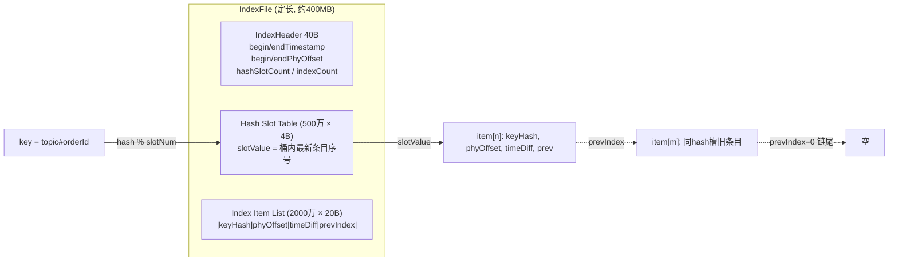
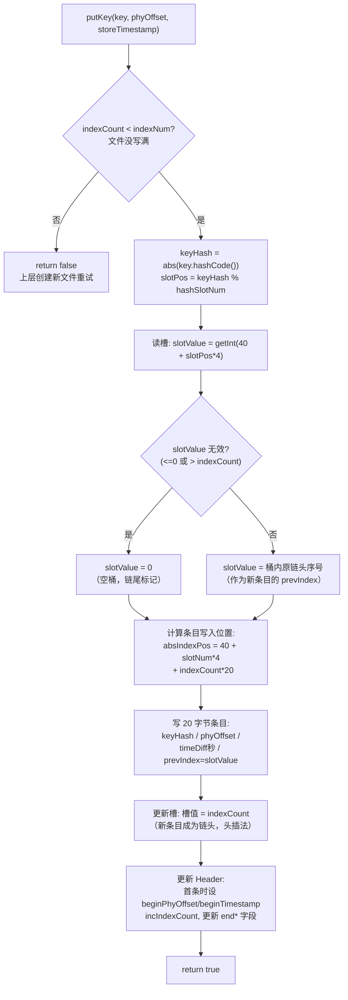
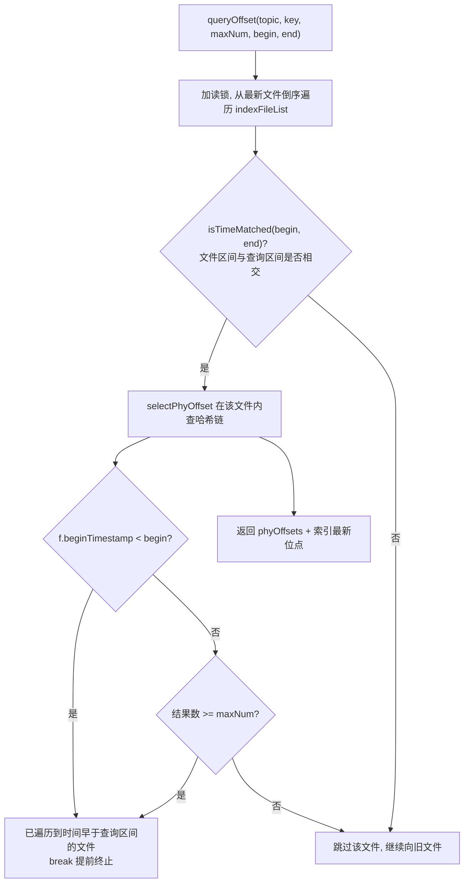
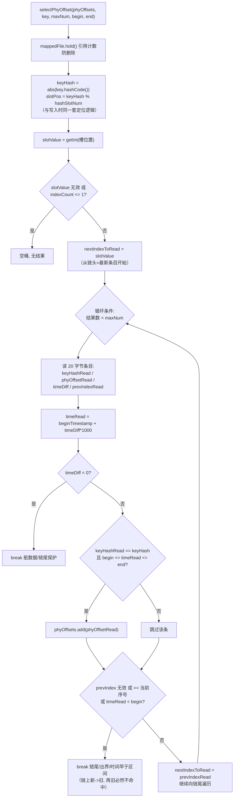
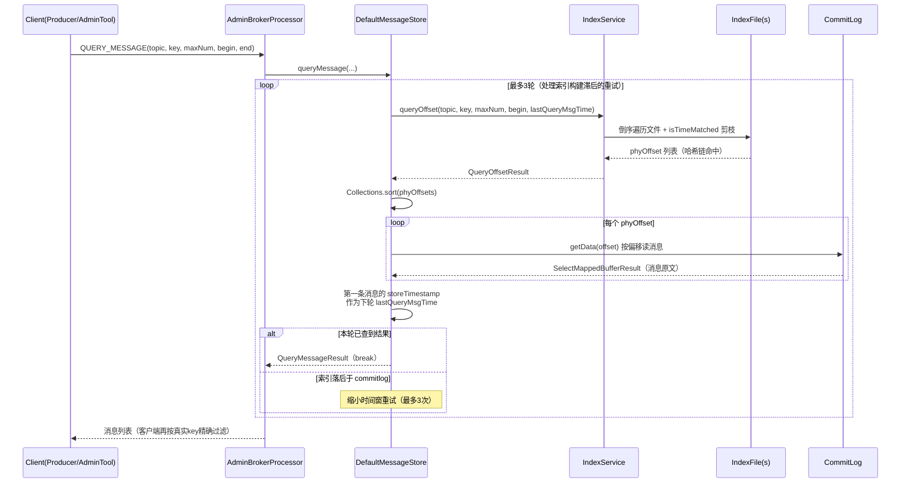

# RocketMQ IndexFile 索引文件源码深度分析（4.9.8）

> 涉及源码：
> - `store/src/main/java/org/apache/rocketmq/store/index/IndexFile.java`（核心：文件布局、putKey 写入、selectPhyOffset 查询）
> - `store/src/main/java/org/apache/rocketmq/store/index/IndexHeader.java`（40 字节文件头）
> - `store/src/main/java/org/apache/rocketmq/store/index/IndexService.java`（文件生命周期管理、buildIndex、queryOffset）
> - `store/src/main/java/org/apache/rocketmq/store/DefaultMessageStore.java:978`（queryMessage 查询入口）、`:171`（索引派发器注册）

---

## 一、IndexFile 是什么

RocketMQ 的 CommitLog 是纯顺序写的 append-only 文件，按 Topic+QueueId 消费走的是 ConsumeQueue；但两类场景 ConsumeQueue 无法支撑：

1. **按 Key 查消息**：业务为消息设置了 Key（订单号、流水号等），需要反查消息内容（如对账、问题排查、`queryMsgById`/`queryMsgByKey`）；
2. **按时间区间查消息**：控制台/运维工具按时间范围检索某 Topic/Key 的消息。

IndexFile 就是为这两类需求设计的**哈希索引**，本质是一个落盘的、定长的、类似 HashMap 的结构。它在消息写入 CommitLog 之后由 `ReputMessageService` 异步构建（最终一致性），**查询走不到它也不影响正常收发消息** -- 索引是旁路能力。

```
消息写入路径:  Producer -> CommitLog -> (异步dispatch) -> ConsumeQueue  (消费用)
                                              └------> IndexFile       (按Key/时间查询用)
```

---

## 二、文件物理结构

### 2.1 三段式布局

一个 IndexFile 由三部分组成（IndexFile.java:41-42）：

```java
int fileTotalSize = IndexHeader.INDEX_HEADER_SIZE   // 40 字节头部
                  + (hashSlotNum * hashSlotSize)    // 槽位表：每槽 4 字节
                  + (indexNum * indexSize);         // 索引条目区：每条 20 字节
```

```
+-------------------+-----------------------+----------------------------+
|   IndexHeader     |   Hash Slot Table     |       Index Item List      |
|     40 字节        |   hashSlotNum × 4B    |       indexNum × 20B       |
+-------------------+-----------------------+----------------------------+
 0                40                    40+4N                     文件末尾
```

默认配置（MessageStoreConfig.java:118-121）：

| 配置 | 默认值 | 说明 |
|---|---|---|
| `messageIndexEnable` | true | 是否构建索引 |
| `maxHashSlotNum` | 5,000,000 | 槽位数 N |
| `maxIndexNum` | 5,000,000 × 4 = 20,000,000 | 索引条目数 M（槽位×4，负载因子设计） |
| `maxMsgsNumBatch` | 64 | 单次查询最多返回条数上限 |

因此单个 IndexFile 大小 = `40 + 500万×4 + 2000万×20` = **420,000,040 字节 ≈ 400MB**。

文件名是**创建时刻的时间戳**（`UtilAll.timeMillisToHumanString`，如 `20260831080000`，IndexService.java:316-318），文件列表按名字升序即按时间有序 -- 这是"按时间区间定位文件"的基础。

### 2.2 IndexHeader（头部 40 字节，IndexHeader.java:24-30）

| 偏移 | 长度 | 字段 | 含义 |
|---|---|---|---|
| 0 | 8 | beginTimestamp | 本文件第一条索引对应的消息存储时间 |
| 8 | 8 | endTimestamp | 本文件最后一条索引对应的消息存储时间 |
| 16 | 8 | beginPhyOffset | 本文件第一条索引的 commitlog 物理偏移 |
| 24 | 8 | endPhyOffset | 本文件最后一条索引的 commitlog 物理偏移 |
| 32 | 4 | hashSlotCount | 已使用的槽数（仅统计，无查询用途） |
| 36 | 4 | indexCount | 已写入的索引条目数，**初始值为 1**（见下文） |

设计意图：**头部的 [begin, end] 双闭区间既是时间过滤的元数据，也是 commitlog 偏移的覆盖区间**。查询时先用 `isTimeMatched()` 在文件粒度剪枝，一条磁盘 IO 都不用花；删除过期文件时（IndexService.java:90-121）用 `endPhyOffset < commitlog最小offset` 判断整个文件是否可删。

### 2.3 Hash Slot（槽位，每槽 4 字节）

每个槽存的是一个 **int 值：该槽下最新一条索引在 Index Item List 中的序号（相对位置）**。相当于 HashMap 桶的"桶头指针"，指向链表的第一个结点。

- 槽位置 = `40 + slotPos * 4`（IndexFile.java:92）
- `slotValue <= 0 || slotValue > indexCount` 视为无效槽（空桶）

### 2.4 Index Item（索引条目，每条 20 字节，IndexFile.java:117-120）

| 偏移 | 长度 | 字段 | 含义 |
|---|---|---|---|
| 0 | 4 | keyHash | key 的正数哈希（`Math.abs(key.hashCode())`） |
| 4 | 8 | phyOffset | 消息在 CommitLog 中的物理偏移（**指向最终消息**） |
| 12 | 4 | timeDiff | 相对文件 beginTimestamp 的秒级差值（存储时间被压缩到 4 字节） |
| 16 | 4 | prevIndex | **同槽位前一条索引的序号 -- 链表指针，冲突链** |

这就是一个**拉链法哈希表**：



---

## 三、为什么这么设计

### 3.1 为什么用哈希索引而不是 B+Tree（如 MySQL）？

- **写入模型匹配**：RocketMQ 追求 CommitLog 100% 顺序写。索引也是**纯追加写**（indexCount 只增不减，条目永远写在尾部），槽数组只在固定偏移上做覆盖更新（把桶头指针指向新条目）。没有 B+Tree 的分裂/合并/页移动，mmap 上写性能稳定且接近顺序写；
- **查询需求匹配**：Key 查询只要求"等值查找 + 时间过滤"，点查场景哈希表 O(1) 定位桶，冲突链通常很短，完全够用；不需要 B+Tree 的范围扫描能力（时间范围是靠"文件级剪枝 + 链上逐条比对 timeDiff"实现的）；
- **实现极简、无锁可恢复**：定长文件 + 头部计数器，宕机恢复时 load 头部即可知道写到了哪里，配合 checkpoint 做截断（IndexService.java:68-74）。

### 3.2 关键设计细节与背后的考量

1. **槽位数:条目数 = 1:4（负载因子 4）**：用 20MB 槽区换更短的冲突链，空间换时间；
2. **条目区初始 indexCount = 1**（IndexHeader.java:37）：第 0 号条目**永不使用**。这样"slotValue/prevIndex = 0"可以安全地表示空指针（invalidIndex=0），省掉了额外的空标记；
3. **timeDiff 存相对秒差而不是 8 字节绝对时间戳**：单个文件只覆盖一段短时间（写满 2000 万条就换文件），`endTimestamp - beginTimestamp` 远小于 `Integer.MAX_VALUE`（68 年），所以 4 字节够用。省下的空间换来的是--查询时间过滤在**内存中按需还原**（`timeRead = beginTimestamp + timeDiff*1000`，IndexFile.java:206-208），磁盘上的条目更紧凑、page cache 命中率更高；
4. **链头插（新条目在链头）**：putKey 把槽值更新为新条目序号（:122），新消息优先被查到。同时查询是从新到旧遍历，一旦 `timeRead < begin`（查询区间起点）即可提前断链（:217）--**链上条目按写入时间递减**，保证剪枝正确；
5. **keyHash 用 int 而不是完整 key**：条目里没有存 key 原文（省空间），代价是哈希碰撞时可能查到"假阳性"条目。**这正是 phyOffset 指回 CommitLog 的第二个作用**：上层 `queryMessage` 从 CommitLog 读出完整消息后由调用方比对真实 key（客户端 `DefaultMQProducer.queryMessage` 拿到消息后再精确匹配），索引层只做初筛；
6. **buildKey = `topic + "#" + key`**（IndexService.java:197-199）：索引天然按 Topic 隔离，不同 Topic 同名 Key 互不干扰；
7. **一个文件写满即换新文件**（IndexService.java:302-308）：新文件头部用前一个文件的 `endPhyOffset/endTimestamp` 初始化（IndexFile.java:51-59），保证所有文件的时间/偏移区间**首尾相接**，按时间二分定位文件不会漏。

### 3.3 索引构建时机（异步、可重放）

```
CommitLog 写入
   └── ReputMessageService（异步线程，DefaultMessageStore）
        └── dispatcherList（:169-171）
             ├── CommitLogDispatcherBuildConsumeQueue  -> ConsumeQueue
             └── CommitLogDispatcherBuildIndex         -> indexService.buildIndex(req)
```

`buildIndex`（IndexService.java:201-246）为一条消息写入**一个或多个**条目：

- **uniqKey**（客户端自动生成的 UNIQ_KEY 属性）：始终写入（:222-228），这就是 `queryMsgByUniqKey` 能工作的原因；
- **业务 Keys**：按空格分隔（`MessageConst.KEY_SEPARATOR`）可多个，逐个写入（:230-242）--一条消息可能产生多条索引；
- **事务回滚消息不建索引**（:218-219）；
- **幂等保护**：`msg.getCommitLogOffset() < indexFile.getEndPhyOffset()` 直接跳过（:208-210），防止 dispatch 重放时重复写。

---

## 四、写入原理：putKey



对应源码 IndexFile.java:88-146。注意所有写入都是对 `MappedByteBuffer` 的直接 put（mmap 随机写），随后台 `FlushDataService`/文件切换时 `mappedByteBuffer.force()` 落盘（IndexFile.java:70-78）。

---

## 五、查询原理

### 5.1 查询入口链路

```
Client: DefaultMQProducer.queryMessage(topic, key, maxNum, begin, end)   -- QueryMessageRequestHeader
  -> Broker: AdminBrokerProcessor.processRequest # QUERY_MESSAGE
     -> DefaultMessageStore.queryMessage()  (DefaultMessageStore.java:978-1025)
        -> IndexService.queryOffset()       (IndexService.java:157-195)   -- 得到 phyOffset 列表
        -> commitLog.getData(phyOffset)     -- 回 CommitLog 逐条取出完整消息
```

### 5.2 第一步：文件级时间剪枝（IndexService.queryOffset）



`isTimeMatched`（IndexFile.java:168-173）判断的是**文件时间区间 [beginTimestamp, endTimestamp] 与查询区间 [begin, end] 是否有交集**（包含查询区间完全覆盖文件区间的情形）。因为文件按时间有序且区间首尾相接，一旦文件的 beginTimestamp 都早于查询起点，更老的文件不可能命中，直接 break -- **用 O(文件数) 的内存比较替代了逐文件扫描**。

### 5.3 第二步：单文件内哈希链遍历（IndexFile.selectPhyOffset）



对应源码 IndexFile.java:175-230。要点：

1. **定位桶是纯算术**：`hash % slotNum` + 一次 4 字节读，无任何磁盘查找结构；
2. **遍历方向 = 链头到链尾 = 时间从新到旧**，配合 `timeRead < begin` 提前断链（:217），时间过滤不是全链扫描；
3. **双重命中校验**：`keyHashRead == keyHash`（哈希等值）**且** `timeRead ∈ [begin, end]`（时间区间）；
4. **哈希碰撞容忍**：keyHash 相同但实际 key 不同的条目也会混入结果 --由上层读出消息原文后精确过滤；
5. **防御性检查**：`prevIndexRead == nextIndexToRead` 防脏数据自环（:217），slotValue/prevIndex 越界判断（:184, :215-216）防损坏文件导致的越界读。

### 5.4 第三步：回 CommitLog 取消息（DefaultMessageStore.queryMessage）



**为什么有最多 3 轮重试**（DefaultMessageStore.java:983）：索引是异步构建的，查询瞬间最新消息可能还没建索引。若第一轮无结果且 `lastQueryMsgTime > begin`，就把区间右端点收缩为上一轮查到的第一条消息时间再查一次 -- 典型的"读已索引部分"的补偿策略。

### 5.5 按时间区间查询的完整语义

纯按时间（不指定 key，如控制台按时间轴浏览）不走 IndexFile 的哈希链，而是 Broker 端先用时间戳换算出近似 commitlog 偏移（`messageStore.getOffsetInQueueByTime` / `commitLog` 的 `getOffsetByTimestamp`，基于每个 MappedFile 文件名+首条消息时间戳估算），再顺序扫描。IndexFile 的 `beginTimestamp/endTimestamp` 主要服务于**Key + 时间区间组合查询**的文件剪枝（这正是 `queryMessage` 的签名同时带 key 和 begin/end 的原因）。

---

## 六、生命周期

| 阶段 | 实现 | 说明 |
|---|---|---|
| 创建 | `IndexService.getAndCreateLastIndexFile`（:292-345） | 最后一个文件写满时创建新文件（文件名=当前时间戳），新文件头部继承前文件 endPhyOffset/endTimestamp；同时**异步 flush 前一个文件**并更新 checkpoint 的 indexMsgTimestamp（:330-341, :347-363） |
| 写入 | `buildIndex`（:201-246）+ `IndexFile.putKey` | ReputMessageService 异步派发，写满重试新文件最多 3 次（:268-290），彻底失败则 `makeIndexFileError()` 标记索引不可用 |
| 刷盘 | `FlushDataService` 定期 flush 最后一个文件；文件切换时刷上一个文件 | `mappedByteBuffer.force()`（IndexFile.java:70-78） |
| 加载/恢复 | `load(lastExitOK)`（:57-88） | 按文件名升序加载；**异常退出**时删除 endTimestamp 落后于 checkpoint.indexMsgTimestamp 的尾部脏文件（:68-74） |
| 删除 | `deleteExpiredFile(offset)`（:90-121） | commitlog 过期删除后，endPhyOffset 小于 commitlog 最小偏移的索引文件（保留最后一个之前的）整体删除 |

### 容量与演进

- 单文件 2000 万条目 ÷ 每条消息（1 uniqKey + n 业务 key）≈ 1000万~2000万条消息，写满即滚动新文件；
- 4.x 的 IndexFile 不支持删除单条索引（append-only），Key 大量重复/删除场景链会变长，查询靠 `maxNum`（默认 64，`maxMsgsNumBatch`）兜底；
- 5.x 引入了可选的 RocksDB 索引替代实现，但 4.9.8 就是上述经典哈希文件结构。

---

## 附录：源码索引

| 内容 | 位置 |
|---|---|
| 文件布局常量（hashSlotSize=4 / indexSize=20 / invalidIndex=0） | IndexFile.java:30-32 |
| 文件大小计算与构造 | IndexFile.java:39-60 |
| putKey 写入（头插拉链） | IndexFile.java:88-146 |
| 哈希函数 | IndexFile.java:148-154 |
| isTimeMatched 文件级时间剪枝 | IndexFile.java:168-173 |
| selectPhyOffset 哈希链查询 | IndexFile.java:175-230 |
| 头部 40 字节定义 | IndexHeader.java:24-30 |
| indexCount 初始为 1 | IndexHeader.java:37 |
| buildIndex（uniqKey+业务key） | IndexService.java:201-246 |
| queryOffset（倒序遍历+剪枝） | IndexService.java:157-195 |
| buildKey（topic#key） | IndexService.java:197-199 |
| 文件创建/滚动/刷盘 | IndexService.java:292-363 |
| 异常恢复删脏文件 | IndexService.java:68-74 |
| queryMessage 入口（3 轮重试） | DefaultMessageStore.java:978-1025 |
| 索引派发器注册 | DefaultMessageStore.java:171 |
| 默认配置 | MessageStoreConfig.java:118-121 |
