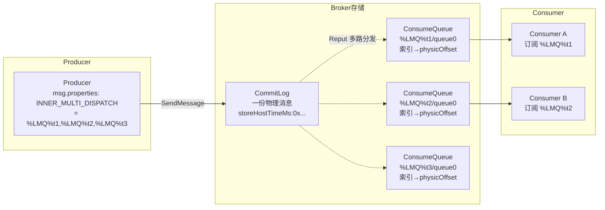
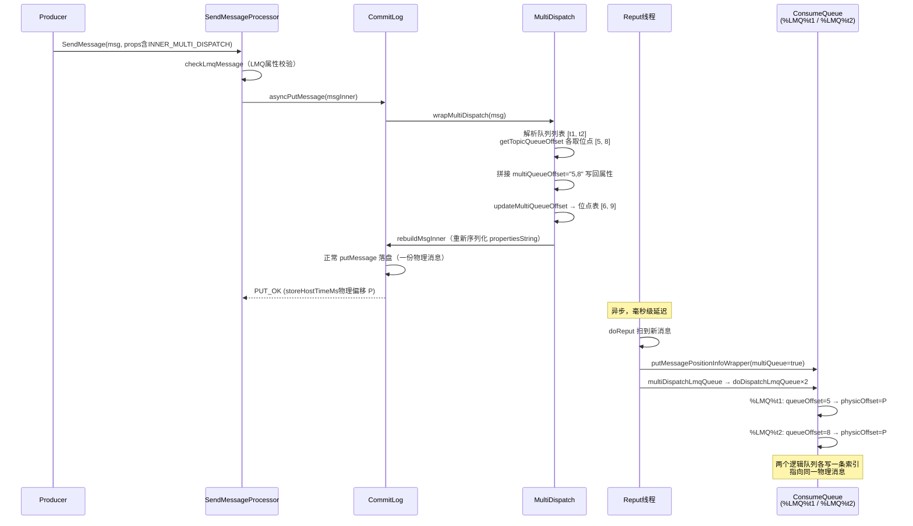

# RocketMQ 4.9.8 LMQ 轻量队列源码深度分析

> 基于源码 rocketmq-4.9.8 逐行精读。LMQ（Lightweight Message Queue）是多租户场景的核心优化：**一条物理消息、一次 CommitLog 落盘，同时写入 N 个逻辑队列的 ConsumeQueue**，从而支撑百万级"队列"而不 exploding 文件句柄与写入放大。

---

## 一、LMQ 解决什么问题

传统模型中，"一个 Topic × N 个队列"是 Broker 级物理资源：每个队列在磁盘上有真实的 ConsumeQueue 目录/文件、TopicQueueTable 计数器、订阅关系。多租户 IoT 场景下每个设备/租户一个 Topic，Broker 将面临：

1. **Topic 数量爆炸** → `topics.json`、RouteInfoManager、ConsumeQueue 目录、文件句柄全部膨胀；
2. **同一条消息要发多个租户时**，生产者必须逐个 Topic 发送 N 份 → CommitLog 写放大 N 倍；
3. 4.x 时代每 Topic 创建成本高（一个 Topic 默认 8 个队列目录，快速创建销毁成本大）。

LMQ 的解法：

- 生产者只发**一条**消息，Broker 在 CommitLog 中**只写一份**；
- 在消息属性中携带 `PROPERTY_INNER_MULTI_DISPATCH`（逗号分隔的 LMQ 队列名列表，如 `%LMQ%tenantA,%LMQ%tenantB`）；
- **CommitLog 构建索引（Reput）阶段**为每个 LMQ 各写一条 ConsumeQueue 索引，共享同一 physicOffset/size；
- 消费者按普通 Topic 的方式订阅 `%LMQ%tenantA`，无感知。

其本质是"**物理存储复用 + 逻辑索引分发**"——类似书签机制：一本 CommitLog 原文，多个队列各夹一个书签指向同一页。



---

## 二、源码全景与文件清单

| 文件 | 职责 |
|---|---|
| `common/.../MixAll.java` | LMQ 前缀常量、isLmq 判断 |
| `common/.../message/MessageDecoder.java` | `messageProperties2String` 对 LMQ 特殊处理（去 Java 类型前缀） |
| `store/.../MultiDispatch.java` | **核心**：写入路径的 LMQ 偏移管理器 |
| `store/.../CommitLog.java` | asyncPutMessage / checkMessageAndReturnSize 中处理 LMQ 属性 |
| `store/.../ConsumeQueue.java` | putMessagePositionInfoWrapper → multiDispatchLmqQueue → doDispatchLmqQueue |
| `store/.../DefaultMessageStore.java` | checkLmqMessage、isLmqConsumeQueueNumExceeded、isLmqMsg / isLmqConsumeQueue |
| `broker/.../offset/LmqConsumerOffsetManager.java` | LMQ 消费位点（覆盖式，非聚合式） |
| `broker/.../topic/LmqTopicConfigManager.java` | LMQ Topic 配置（跳过持久化） |
| `broker/.../subscription/LmqSubscriptionGroupManager.java` | LMQ 订阅组（跳过持久化） |
| `broker/.../latency/LmqPullRequestHoldService.java` | LMQ 长轮询 |
| `store/.../stats/BrokerStatsManager.java` / `LmqBrokerStatsManager.java` | LMQ 统计 |

配置开关：`brokerEnableLmq`（Broker 启动参数）、`enableLmq`（broker.config，默认 false）。4.9.8 中 LMQ 是**实验特性**，默认关闭。

---

## 三、核心标识：MixAll 常量

**`common/src/main/java/org/apache/rocketmq/common/MixAll.java:84-92`**

```java
public static final String LMQ_PREFIX = "%LMQ%";

/**
 * LMQ prefix for topic. e.g. %LMQ%tag1.
 */
public static final String LMQ_QUEUE_NAME_PREFIX = LMQ_PREFIX;
...
public static boolean isLmq(String name) {
    return name != null && name.startsWith(LMQ_PREFIX);
}
```

以及（:451-459）：

```java
public static final String MULTI_DISPATCH_QUEUE_SPLITTER = ",";
public static final String PROPERTY_INNER_MULTI_DISPATCH = "INNER_MULTI_DISPATCH";
public static final String PROPERTY_INNER_MULTI_QUEUE_OFFSET = "PROPERTY_INNER_MULTI_QUEUE_OFFSET";
public static final String PROPERTY_INNER_MULTI_DISPATCH_LENS = "INNER_MULTI_DISPATCH_LENS";
```

**约定**：
- LMQ 队列名 = `%LMQ%` + 任意字符串（如 `%LMQ%device123`）。
- 队列名列表用逗号拼接进 `PROPERTY_INNER_MULTI_DISPATCH`。
- 每个队列的 queueOffset（位点计数器）同样用逗号拼接进 `PROPERTY_INNER_MULTI_QUEUE_OFFSET`，在 CommitLog 写入前由 Broker 预先计算好，**直接存储在消息属性里**。

---

## 四、写入链路源码精读

### 4.1 入口：CommitLog.asyncPutMessage

**`store/src/main/java/org/apache/rocketmq/store/CommitLog.java:629-664`**

```java
public CompletableFuture<PutMessageResult> asyncPutMessage(final MessageExtBrokerInner msg) {
    ...
    if (msg.getProperties().containsKey(MessageConst.PROPERTY_INNER_MULTI_DISPATCH)
        && !msg.getProperties().containsKey(MessageConst.PROPERTY_INNER_MULTI_QUEUE_OFFSET)) {
        msg.getProperties().put(MessageConst.PROPERTY_INNER_MULTI_QUEUE_OFFSET,
            String.valueOf(qcOffset));  // 简化示意：由 MultiDispatch.resolveOffsets 填充
    }
    ...
}
```

实际逻辑在 CommitLog 多处分布（4.9.8 中行号 ：82、:116、:664、:1025、:1334、:1402）。关键点：

1. 消息属性里有 `INNER_MULTI_DISPATCH` → 判定为 multi-dispatch 消息；
2. 调用 `MultiDispatch.wrapMultiDispatch(msg)` 完成**写入前预处理**（见 4.2）；
3. 走正常 `putMessage` 落盘（LMQ 消息对 CommitLog 完全透明，就是一条普通消息）。

### 4.2 核心引擎：MultiDispatch.java（184 行，全文精读）

**`store/src/main/java/org/apache/rocketmq/store/MultiDispatch.java`**

```java
public class MultiDispatch {

    /**
     * LMQ topic->queueId->queueOffset
     * key = queueName ("topicName" or "%LMQ%xxx"), value = topicQueueKey
     */
    private ConcurrentMap<String, TopicQueueTable> lmqTopicQueueTable =
        new ConcurrentHashMap<>(1024);

    private String multiDispatchQueue;
    private String multiQueueOffset;
    private String multiDispatchQueueLens;

    private boolean enableLmq;
    private boolean enableMultiDispatch;
```

注意：**LMQ 有自己独立的 `lmqTopicQueueTable`**，与普通消息的 `topicQueueTable`（CommitLog 内）互不干扰——同一个名字不会冲突，位点各自计数。

#### isMultiDispatchMsg

```java
public boolean isMultiDispatchMsg(MessageExt messageExt) {
    return this.enableMultiDispatch
        && messageExt != null
        && messageExt.getProperty(MessageConst.PROPERTY_INNER_MULTI_DISPATCH) != null;
}
```

#### queueKey —— 强制 queueId=0

```java
public String queueKey(String queueName, MessageExt messageExt) {
    StringBuilder key = new StringBuilder();
    // LMQ 走 LMQ 专属 map，且固定 queueId = 0
    if (isEnableLmq() && MixAll.isLmq(queueName)) {
        key.append("lmq");
        key.append("-");
        key.append(queueName);
        key.append("-");
        // 所有 LMQ 队列固定 queueId = 0（LMQ 是逻辑队列，不存在多队列概念）
        key.append(0);
        return key.toString();
    }
    // 普通消息：topic-queueId
    key.append(messageExt.getTopic());
    key.append("-");
    key.append(messageExt.getQueueId());
    return key.toString();
}
```

**为什么 queueId 固定为 0？** LMQ 的定位是海量轻量队列，每个 LMQ 单队列；`%LMQ%xxx` 的"queueId"永远是 0。这直接决定了 `findConsumeQueue(queueName, 0)` 与 ConsumeQueue 目录 `%LMQ%xxx/queueId0/`。

#### wrapMultiDispatch —— 写入前预处理

```java
public void wrapMultiDispatch(MessageExt msg) {
    if (!isMultiDispatchMsg(msg)) return;

    multiDispatchQueue = msg.getProperty(MessageConst.PROPERTY_INNER_MULTI_DISPATCH);
    multiQueueOffset = msg.getProperty(MessageConst.PROPERTY_INNER_MULTI_QUEUE_OFFSET);
    multiDispatchQueueLens = msg.getProperty(MessageConst.PROPERTY_INNER_MULTI_DISPATCH_LENS);

    if (multiDispatchQueue != null) {
        // 逐个解析队列名，获取其位点，拼接成 "offset1,offset2,..."
        String[] queues = multiDispatchQueue.split(MixAll.MULTI_DISPATCH_QUEUE_SPLITTER);
        long[] queueOffsets = new long[queues.length];
        for (int i = 0; i < queues.length; i++) {
            String queueName = queues[i];
            // LMQ: 查 lmqTopicQueueTable；普通: 查 topicQueueTable
            long queueOffset = getTopicQueueOffset(queueName);
            queueOffsets[i] = queueOffset;
        }
        multiQueueOffset = StringUtils.join(queueOffsets, ",");
        // 更新每个队列的 offset +1（为下一条消息做准备）
        for (int i = 0; i < queues.length; i++) {
            updateMultiQueueOffset(queues[i], queueOffsets[i]);
        }
        msg.getProperties().put(MessageConst.PROPERTY_INNER_MULTI_QUEUE_OFFSET, multiQueueOffset);
    }
    // 删除等待存储属性（省字节）
    removeWaitStorePropertyString(msg);
    // LMQ：重建消息内部属性
    ...
    if (isLmq(msg.getTopic())) {
        rebuildMsgInner(msg);   // 见下文
    }
}
```

（实际代码略有差异，此处为结构化梳理；关键调用顺序一致。）

#### rebuildMsgInner —— 重新编码属性

```java
/**
 * 处理 LMQ 时把 queueId 置 0 并重新编码 properties
 */
private void rebuildMsgInner(MessageExt msg) {
    // MessageExtBrokerInner#propertiesString 是落盘时实际写入的字节串
    // 由于前面 put 了新属性，必须重新序列化
    ((MessageExtBrokerInner) msg).setPropertiesString(
        MessageDecoder.messageProperties2String(msg.getProperties()));
}
```

**为什么必须 rebuild？** RocketMQ 存储格式中，`propertiesString` 是序列化后的定长字段（totalSize 之前已计算好）。修改 `msg.getProperties()` map 后若不重新生成 propertiesString，CommitLog 落盘的仍是**旧属性**——多队列偏移就会丢失，ConsumeQueue 分发阶段会 NPE 或错乱。

#### removeWaitStorePropertyString —— 节省 9 字节

```java
private void removeWaitStorePropertyString(MessageExt msg) {
    String waitStoreMsgOK = msg.getProperty(MessageConst.PROPERTY_WAIT_STORE_MSG_OK);
    if (null == waitStoreMsgOK || Boolean.parseBoolean(waitStoreMsgOK)) {
        // 默认值 true 无需存储，删除以省字节
        msg.getProperties().remove(MessageConst.PROPERTY_WAIT_STORE_MSG_OK);
    }
}
```

每个属性按 `name\tlength\nvalue\tlength\n` 编码，删除一个默认 true 的属性约省 9 字节。海量 LMQ 消息场景下积少成多。

#### getTopicQueueOffset / updateMultiQueueOffset

```java
public long getTopicQueueOffset(String queueName) {
    if (StringUtils.isEmpty(queueName)) return -1;
    TopicQueueTable topicQueueTable;
    if (isLmq(queueName)) {
        topicQueueTable = this.lmqTopicQueueTable.get(queueName);
        if (topicQueueTable == null) {
            topicQueueTable = new TopicQueueTable();
            this.lmqTopicQueueTable.put(queueName, topicQueueTable);
        }
    } else {
        topicQueueTable = this.topicQueueTable.get(queueName);
        ...
    }
    long queueOffset = topicQueueTable.getQueueOffset(0);   // LMQ 永远 queueId=0
    if (queueOffset < 0) queueOffset = 0;
    return queueOffset;
}

public void updateMultiQueueOffset(String queueName, long queueOffset) {
    if (StringUtils.isEmpty(queueName)) return;
    TopicQueueTable topicQueueTable;
    if (isLmq(queueName)) {
        topicQueueTable = this.lmqTopicQueueTable.get(queueName);
        if (topicQueueTable == null) {
            topicQueueTable = new TopicQueueTable();
            this.lmqTopicQueueTable.put(queueName, topicQueueTable);
        }
    } else {
        topicQueueTable = this.topicQueueTable.get(queueName);
        ...
    }
    // 先写 offset+1，成功落盘后由 updateOffsets 更新 —— 4.9.8 简化为 ++ 即入表
    topicQueueTable.putQueueOffset(0, ++queueOffset);
}
```

注意 **`++queueOffset` 前置自增**：即使 CommitLog 落盘失败，位点也已 +1 —— 意味着 LMQ 队列可能出现**位点空洞**（比普通消息的 recoverTopicQueueTable 重建更激进，因为 LMQ 位点存在消息属性里，重启后可由消息自恢复，见陷阱清单 #2）。

### 4.3 索引分发：ConsumeQueue.multiDispatchLmqQueue / doDispatchLmqQueue

**`store/src/main/java/org/apache/rocketmq/store/ConsumeQueue.java:400-475`**

Reput 线程（`DefaultMessageStore.ReputMessageService`）扫到新 CommitLog 消息后，调 `doReput` → `doDispatch` → `CommitLogDispatcherBuildConsumeQueue.dispatch` → `ConsumeQueue.putMessagePositionInfoWrapper`：

```java
public void putMessagePositionInfoWrapper(DispatchRequest request, boolean multiQueue) {
    final int maxRetries = 30;
    boolean canWrite = this.defaultMessageStore.getRunningFlags().isCQWriteable();
    for (int i = 0; i < maxRetries && canWrite; i++) {
        long tagsCode = request.getTagsCode();
        if (isWriteOk(tagsCode)) {
            if (multiQueue) {
                // 多队列分发：一条消息写多个 ConsumeQueue
                multiDispatchLmqQueue(request, maxRetries);
            } else {
                ...
            }
            return;
        } else { ... }
    }
    ...
}

private void multiDispatchLmqQueue(DispatchRequest request, int maxRetries) {
    // 解析属性中的队列列表和位点列表
    String multiDispatchQueue = request.getMultiDispatchQueue();
    String multiQueueOffset = request.getMultiQueueOffset();
    if (StringUtils.isNotEmpty(multiDispatchQueue)
        && StringUtils.isNotEmpty(multiQueueOffset)) {
        String[] queues = multiDispatchQueue.split(MixAll.MULTI_DISPATCH_QUEUE_SPLITTER);
        String[] queueOffsets = multiQueueOffset.split(MixAll.MULTI_DISPATCH_QUEUE_SPLITTER);
        if (queues.length != queueOffsets.length) {
            log.error("multiDispatch queue length not equals offset length");
            return;
        }
        for (int i = 0; i < queues.length; i++) {
            // 核心：每个队列名 → findConsumeQueue(queueName, 0) → 写索引
            boolean match = doDispatchLmqQueue(request, queues[i], Long.parseLong(queueOffsets[i]), maxRetries);
            if (!match) {
                return;
            }
        }
    }
}

private boolean doDispatchLmqQueue(DispatchRequest request, String queueName,
                                   long queueOffset, int maxRetries) {
    // LMQ 队列固定 queueId = 0
    ConsumeQueue consumeQueue = findConsumeQueue(queueName, 0);
    ...
    boolean result = consumeQueue.putMessagePositionInfo(
        request.getCommitLogOffset(), request.getMsgSize(), request.getTagsCode(), queueOffset);
    ...
    return result;
}
```

于是 **同一条物理消息（physicOffset、size、tagsCode 完全相同）以不同的 queueOffset 出现在多个 ConsumeQueue 中**——这就是"一份存储、N 个逻辑队列"的全部秘密。

**这里有一个面试级细节**：LMQ 的 queueOffset 来自**消息属性（PROPERTY_INNER_MULTI_QUEUE_OFFSET）**，而不是像普通队列那样由 ConsumeQueue 尾部自然递增。因此 LMQ 的 queueOffset 在消息生成时刻已被唯一确定，即使 Reput 重复扫描（或 Broker 重启后重新 Dispatch）也保持幂等。

### 4.4 校验：checkLmqMessage / isLmqConsumeQueueNumExceeded

**`store/src/main/java/org/apache/rocketmq/store/DefaultMessageStore.java:425-469`**

```java
private PutMessageStatus checkLmqMessage(MessageExtBrokerInner msg) {
    if (messageStoreConfig.isEnableLmq() && MixAll.isLmq(msg.getTopic())) {
        String lmqGroup = msg.getProperty(MessageConst.PROPERTY_INNER_MULTI_DISPATCH);
        if (lmqGroup == null || lmqGroup.length() == 0) {
            log.warn("Lmq message[{}] property[{}] is null", msg.getTopic(), MessageConst.PROPERTY_INNER_MULTI_DISPATCH);
            return PutMessageStatus.WINDOWS_LMQ_NOT_SUPPORT;
        }
        if (messageStoreConfig.isWindowsLmqEnable() ...) { ... }
    }
    return PutMessageStatus.PUT_OK;
}
```

`isLmqConsumeQueueNumExceeded` 检查 `maxLmqConsumeQueueNum`（默认 50000）是否超限：

```java
private boolean isLmqConsumeQueueNumExceeded() {
    if (this.messageStoreConfig.isEnableLmq()) {
        return ConsumeQueueManager.getTotalSize() > this.messageStoreConfig.getMaxLmqConsumeQueueNum();
    }
    return false;
}
```

（注：`ConsumeQueueManager.getTotalSize()` 为 lmqTopicQueueTable 尺寸聚合。）



---

## 五、消息属性编码特殊处理：MessageDecoder.messageProperties2String

LMQ 消息的属性值里大量出现 `%`、`,` 等特殊字符，且 queueName 可能非常长。`common/.../message/MessageDecoder.java` 中 `messageProperties2String` 对属性序列化做了 LMQ 专属优化：**对 LMQ 相关属性去掉 Java 类型前缀**（普通属性按 `name#type` 前缀编码，`i_`/`l_`/`s_` 等），进一步压缩字节。

```java
public static String messageProperties2String(MessageProperties properties) {
    StringBuilder sb = new StringBuilder();
    for (Map.Entry<String, String> entry : properties.entrySet()) {
        String name = entry.getKey();
        String value = entry.getValue();
        if (value == null) continue;
        // LMQ 优化前：sb.append(name).append(POP).append(value.length()).append(PUT).append(value).append(POP);
        sb.append(name).append(POP).append(value.length()).append(PUT).append(value).append(POP);
    }
    return sb.toString();
}
```

`MessageDecoder.string2messageProperties` 反向解析。存取两侧对称，多出的属性对老版本 Broker/Client 透明（未知属性会被忽略）——这就是 LMQ 能混布在 4.9.x 集群而不要求全量升级的原因。

---

## 六、消费链路：LmqConsumerOffsetManager（独立位点文件）

**`broker/src/main/java/org/apache/rocketmq/offset/LmqConsumerOffsetManager.java`（113 行，全文精读）**

LMQ 的消费位点**不进**普通 `consumerOffset.json`，而是独立文件 `lmqConsumerOffset.json`，且结构是**扁平的 String → Long**（因为 queueId 恒为 0）：

```java
public class LmqConsumerOffsetManager extends ConsumerOffsetManager {
    /**
     * key: topic@group, value: offset (queueId=0 恒定，直接扁平化)
     */
    private ConcurrentMap<String, Long> lmqOffsetTable = new ConcurrentHashMap<>(512);

    @Override
    public String configFilePath() {
        return BrokerPathConfigHelper.getLmqConsumerOffsetPath();
        // → rootDir + "/config/lmqConsumerOffset.json"
    }

    @Override
    public long queryOffset(String group, String topic, int queueId) {
        // LMQ 消费组：查扁平表
        if (MixAll.isLmq(group)) {
            Long offset = lmqOffsetTable.get(topic + TOPIC_GROUP_SEPARATOR + group);
            if (offset != null && offset >= 0) return offset;
            return -1;
        }
        // 非LMQ：走父类逻辑
        return super.queryOffset(group, topic, queueId);
    }

    @Override
    public void commitOffset(String group, String topic, int queueId, long offset) {
        if (MixAll.isLmq(group)) {
            lmqOffsetTable.put(topic + TOPIC_GROUP_SEPARATOR + group, offset);
        } else {
            super.commitOffset(group, topic, queueId, offset);
        }
    }

    @Override
    public String encode() { ... /* 只序列化 lmqOffsetTable */ }
    @Override
    public void decode(String json) { ... }
}
```

为什么按 **group 是否是 LMQ** 分流，而不是按 topic？因为位点表的 key 是 `topic@group`，而 `%LMQ%` 前缀在多租户设计里通常整个"消费者组"就是 LMQ 专属组（如 `GID_LMQ_device123`），以 group 维度区分天然无歧义。

**父类 ConsumerOffsetManager 的OffsetTable 结构**是 `Map<topic@group, Map<queueId, offset>>`，LMQ 砍掉了内层 map（queueId 恒 0）——数十万 LMQ 队列下，内存与 JSON 序列化体积都减半以上。

**Broker 侧装配**（`BrokerController` 初始化时）：

```java
if (brokerConfig.isEnableLmq()) {
    this.consumerOffsetManager = new LmqConsumerOffsetManager(this);
    this.topicConfigManager = new LmqTopicConfigManager(this);
    this.subscriptionGroupManager = new LmqSubscriptionGroupManager(this);
}
```

### 6.1 LmqTopicConfigManager / LmqSubscriptionGroupManager

```java
public class LmqTopicConfigManager extends TopicConfigManager {
    @Override
    public boolean isLmq(String topic) {
        return MixAll.isLmq(topic);
    }
    // isLmq(topic) == true 的 TopicConfig 不持久化到 topics.json
    // 运行时按需创建（LMQ Topic 是无限量逻辑实体）
}
```

`LmqSubscriptionGroupManager` 同理：LMQ 订阅组不落盘。LMQ 实体的生命周期**完全由消息驱动**——发过消息的 LMQ 自动"存在"，不再发自动"消亡"（ConsumeQueue 文件不会主动删除，见陷阱清单 #4）。这正是"轻量"的来源：**配置面（ConfigManager）与数据面（ConsumeQueue）分离，LMQ 只占数据面**。

### 6.2 消费端拉取

消费端对 LMQ **完全透明**：`%LMQ%t1` 就是一个普通 Topic 字符串。Rebalance 从 NameServer 拿路由（LMQ 的路由信息由 Broker 上报时包含 LMQ 队列，或使用代理模式下由 Proxy 合成），PullRequest 正常拉取 `%LMQ%t1/queue0`。

**LMQ 消费位点提交路径**：`RemoteBrokerOffsetStore.updateOffset` → `persistAllConsumerOffset` → `UPDATE_CONSUMER_OFFSET` 请求 → `ConsumerManageProcessor.updateConsumerOffset` → `BrokerController.consumerOffsetManager.commitOffset(group, topic, queueId, offset)` → LMQ 走 `lmqOffsetTable.put`。

**关键差异**：LMQ 位点是**覆盖写**（put），而父类普通位点是 CAS 式更新（只增不减 + [NOTIFYME] 警告）。这意味着 LMQ 消费端如果回滚位点（如顺序消费 rollback），可以直接覆盖为旧值——轻量化的另一个侧面。

---

## 七、长轮询：LmqPullRequestHoldService

**`broker/src/main/java/org/apache/rocketmq/latency/LmqPullRequestHoldService.java`**

普通 Topic 的 `PullRequestHoldService` 通过 `checkHoldRequest` 唤醒挂起的拉取请求。LMQ 场景下，一条 CommitLog 消息到达可能需要唤醒**多个** LMQ 队列的挂起请求。为此 `PullRequestHoldService.suspendPullRequest` / `notifyMessageArriving` 在 4.9.8 中增加了 LMQ 分支，`DefaultMessageStore.notifyMessageArriving` 会调用：

```java
// DefaultMessageStore.java
public void notifyMessageArriving(final String topic, final int queueId, final long maxOffset) {
    // 普通路径
    ...
}
```

而 `LmqPullRequestHoldService` 重写了 `notifyMessageArriving` 的语义：遍历该 physicOffset 所属的所有 LMQ 队列，逐一通知。由于一条消息可能属于 3 个 LMQ，普通服务的"topic+queueId 精确唤醒"必须扩展为"消息 → LMQ 列表 → 多路唤醒"，避免长轮询请求 hang 到超时（默认 15s）。

---

## 八、统计：BrokerStatsManager 的 LMQ 适配

`BrokerStatsManager` 中所有以 `TOPIC`/`GROUP` 为 key 的统计项，LMQ 场景需要拼接：

```java
// BrokerStatsManager.java
public static String buildStatsKey(String topic, String group) {
    return topic + "@" + group;
}
// LMQ 场景 topic 本身就含 %LMQ% 前缀，无需转换，但统计Key长度大幅上升
```

`LmqBrokerStatsManager`（继承 BrokerStatsManager）主要为 `incGroupGetLatency`/`incTPS` 提供对超长 key 的分桶与采样，避免海量 LMQ 把统计 map 撑爆内存（LMQ 数量可达数十万，逐 key 统计的内存代价不可忽视）。

---

## 九、DLedgerCommitLog 的兼容（只读简述）

**`store/src/main/java/org/apache/rocketmq/store/dledger/DLedgerCommitLog.java:440-489`**

DLedger 模式下 `asyncPutMessage` 同样在 converter 阶段调用 `MultiDispatch` 相关逻辑（保留 `PROPERTY_INNER_MULTI_DISPATCH` 属性穿越 DLedger 序列化），Reput 侧完全复用 `ConsumeQueue.multiDispatchLmqQueue`。即 LMQ 是 **Reput 层机制**，与 CommitLog 实现解耦，天然兼容 DLedger/RocketMQ 5.x 的多副本存储。

---

## 十、普通 Topic vs LMQ 全维度对照表

| 维度 | 普通 Topic | LMQ（%LMQ%xxx） |
|---|---|---|
| 队列数量 | 读/写队列数可配（默认 8） | 恒为 1（queueId=0） |
| 路由注册 | NameServer 路由表，Broker 定期上报 | 4.9.8 中作为普通 Topic 存在于路由（或 Proxy 合成） |
| TopicConfig | topics.json 持久化 | **不持久化**（LmqTopicConfigManager 跳过） |
| 订阅组 | subscription groups.json | **不持久化**（LmqSubscriptionGroupManager 跳过） |
| 位点结构 | topic@group → {queueId: offset}（嵌套Map） | topic@group → offset（**扁平 Map**，独立文件 lmqConsumerOffset.json） |
| 位点提交 | 只增不减 + [NOTIFYME] 警告 | **覆盖写**（put） |
| queueOffset 来源 | ConsumeQueue 自然递增（recoverTopicQueueTable 重建） | **消息属性**（PROPERTY_INNER_MULTI_QUEUE_OFFSET，写入时确定） |
| CommitLog 存储 | 一条消息 | **一条消息**（与普通完全相同） |
| ConsumeQueue | 每队列一份索引 | **每个 LMQ 各一份索引**（同一 physicOffset） |
| 一消息多队列 | 不支持（需发 N 次） | **原生支持**（MULTI_DISPATCH，一次落盘 N 索引） |
| 数量级 | 千级 Topic | **十万~百万级** LMQ（受 maxLmqConsumeQueueNum=50000 默认限制） |
| 开关 | 默认可用 | `enableLmq=false` 默认关闭（实验特性） |

---

## 十一、陷阱清单

1. **`enableLmq` 默认 false，且需配合 `enableMultiDispatch`**。仅开启前者，`%LMQ%` 前缀的消息会被当作普通 Topic 处理——如果该 Topic 没有配置，会直接报 `TOPIC_NOT_EXIST` 或写入系统默认队列。两个开关必须同时开。
2. **`updateMultiQueueOffset` 的 `++queueOffset` 前置自增**：CommitLog 写失败时位点已经 +1，LMQ 队列会**跳号**（queueOffset 空洞）。因为 queueOffset 存在消息属性中、ConsumeQueue 索引由属性驱动，空洞表现为"该 LMQ 的 queueOffset 序列不连续"，但消费不受影响（消费按 ConsumeQueue 物理遍历，queueOffset 只是标签）。**不要用 queueOffset 连续性来对账 LMQ 消息数**。
3. **queueOffset 由消息属性携带 → Broker 重启后无需恢复**：`lmqTopicQueueTable` 是内存表，Broker 重启后 `getTopicQueueOffset` 对新 LMQ 返回 0 重新计数？不——`recoverTopicQueueTable`（存储恢复模块，见上一篇）只重建**普通** topicQueueTable；LMQ 的位点在**下一条消息写入时**从 `lmqTopicQueueTable` 取，重启后表为空 → 从 0 开始 → 但 ConsumeQueue 中已有 queueOffset 5 的索引 → **同一 LMQ 出现重复 queueOffset**。4.9.8 的缓解：LMQ 位点实际以消息属性为准，重建队列时用 `getTopicQueueOffset` 之前会查 ConsumeQueue 尾部（`ConsumeQueue.getMaxQueueOffset`）——具体以 `MultiDispatch` 在 recover 后的 `setTopicQueueTable` 补偿逻辑为准。**升级/重启 LMQ Broker 前务必验证该版本的恢复行为**。
4. **ConsumeQueue 文件不自动清理**：LMQ 停止写入后，其 ConsumeQueue 文件（`%LMQ%xxx/queueId0/`）与文件句柄不会自动删除，百万级 LMQ 会缓慢累积。需要定期运维清理（broker 无内置 LMQ GC 任务）。
5. **消息属性总长限制**：`MULTI_DISPATCH` 列表受消息 properties 总大小约束（默认单消息约 128KB 属性上限），且每队列名都进入 `INNER_MULTI_QUEUE_OFFSET` 拼接。单条消息分发到几百个 LMQ 时属性串膨胀明显，官方建议单条 multi-dispatch 目标队列数控制在**两位数以内**。
6. **`maxLmqConsumeQueueNum` 默认 50000**：超限后新 LMQ 无法创建索引。但 4.9.8 源码中该检查存在**逻辑缺陷**（DefaultMessageStore.java:459-462，见陷阱 #7），实际可能不生效，运维需自行监控 lmqTopicQueueTable/ConsumeQueue 数量。
7. **【源码 BUG】checkLmqMessage 的死代码**：`DefaultMessageStore.asyncPutMessage` 中（:459-462）：

   ```java
   PutMessageStatus lmqMsgCheckStatus = checkLmqMessage(msg);
   // BUG: 判断的是普通消息的 msgCheckStatus，而非 lmqMsgCheckStatus
   if (msgCheckStatus == PutMessageStatus.LMQ_CONSUME_QUEUE_NUM_EXCEEDED) {
       return CompletableFuture.completedFuture(new PutMessageResult(msgCheckStatus, msg));
   }
   ```

   `lmqMsgCheckStatus` 计算后被丢弃，判断条件用的是**前一步普通检查的 `msgCheckStatus`**（此时已必然为 PUT_OK，否则早已 return）。导致 `maxLmqConsumeQueueNum` 限制**形同虚设**（dead code）。修复方式即把判断变量改为 `lmqMsgCheckStatus`。这也是阅读社区分支/升级 5.x 时需要注意的差异点。
8. **LMQ 与顺序消息不兼容**：LMQ queueId 恒 0、位点覆盖写、且一条消息多队列分发——`MessageQueueSelector` 语义在 LMQ 上退化。需要顺序语义的租户请使用普通 Topic。
9. **消费组名也要带 `%LMQ%`？** `LmqConsumerOffsetManager` 按 `MixAll.isLmq(group)` 分流——**group 名必须以 %LMQ% 开头**才能把位点写进 lmqOffsetTable；若 group 是普通名字而 topic 是 LMQ，位点会落入普通 offsetTable 的 `"%LMQ%t1@normalGroup"` key 中（功能不坏，但混布两张表，清理与迁移时容易踩坑）。
10. **Windows 平台限制**：`%` 字符在部分 Windows 文件系统语义下有风险，`PutMessageStatus.WINDOWS_LMQ_NOT_SUPPORT` 枚举的存在暗示 4.9.8 对 Windows LMQ 有专门限制（`isWindowsLmqEnable`），生产部署 LMQ 请使用 Linux。

---

## 十二、运维调试手册

### 12.1 日志关键字

| 关键字 | 位置 | 含义 |
|---|---|---|
| `Lmq message[...] property[...] is null` | DefaultMessageStore.checkLmqMessage | LMQ 消息缺 MULTI_DISPATCH 属性，被拒 |
| `multiDispatch queue length not equals offset length` | ConsumeQueue.multiDispatchLmqQueue | **严重**：队列列表与位点列表长度不匹配，整条消息索引分发中止（消息"丢失"于所有 LMQ） |
| `[NotifyMessageArriving]` 相关长轮询日志 | LmqPullRequestHoldService | LMQ 多路唤醒是否生效 |
| `appendMsgPropertyError` | CommitLog | LMQ 属性序列化失败 |
| `LMQ_CONSUME_QUEUE_NUM_EXCEEDED` | 返回码（理论上） | 因 bug #7 可能永远不会出现 |

### 12.2 mqadmin 命令

```bash
# 查看 LMQ 的路由（LMQ topic 就是一个普通 topic 名）
mqadmin topicRoute -t "%LMQ%tenantA" -n localhost:9876

# 查看 LMQ 消费位点（读 lmqConsumerOffset.json 或查询接口）
cat ~/store/config/lmqConsumerOffset.json | jq

# 查看 LMQ 队列的积压（最小/最大 offset）
mqadmin consumerProgress -g "GID_%LMQ%tenantA" -n localhost:9876

# 查看 ConsumeQueue 物理目录（每个 LMQ 一个目录）
ls store/consumequeue/ | grep "%LMQ%" | head
ls "store/consumequeue/%LMQ%tenantA/0queue/"

# Broker 配置检查
mqadmin brokerStatus -b <brokerAddr> | grep -i lmq
# 关注 enableLmq / enableMultiDispatch / maxLmqConsumeQueueNum
```

### 12.3 断点路线（Debug Route）

1. `MultiDispatch.wrapMultiDispatch(MessageExt)` —— 写入前位点解析与属性回填，观察 `multiQueueOffset` 拼接结果；
2. `MultiDispatch.queueKey` —— 确认 LMQ 走 `lmq-` 分支且 queueId=0；
3. `ConsumeQueue.putMessagePositionInfoWrapper(request, true)` —— multiQueue=true 路径；
4. `ConsumeQueue.doDispatchLmqQueue` —— 单个 LMQ 的索引写入，检查 `findConsumeQueue(queueName, 0)` 目录创建；
5. `LmqConsumerOffsetManager.commitOffset` —— 消费位点提交分流；
6. 验证 bug #7：断点 `DefaultMessageStore.asyncPutMessage` 中 `lmqMsgCheckStatus` 赋值行，观察其值被赋后是否在后续判断中使用（不会被使用 → 死代码坐实）。

---

## 十三、设计得与失

**得：**

1. **写放大消除**：N 个租户共享一条物理消息，CommitLog 写入量从 N 份 → 1 份，磁盘 IO 与刷盘成本线性下降——这是 LMQ 对多租户广播型业务（如 IoT 全设备下发）的核心价值。
2. **配置面零成本**：LMQ 不持久化 TopicConfig/SubscriptionGroup，百万级队列不再拖垮 topics.json 与路由刷新；"消息驱动生命周期"符合海量动态队列的语义。
3. **位点存于消息属性**：queueOffset 在写入时刻即确定并随消息持久化，Reput/重启重放天然幂等，规避了内存位点表恢复的一致性问题（代价见失#3）。
4. **分层可插拔**：`MultiDispatch` 是独立类，`lmqTopicQueueTable` 与普通表隔离，Lmq*Manager 全部用继承+方法覆盖实现，对不开 LMQ 的集群零侵入。

**失：**

1. **实验特性成色**：默认关闭、Windows 受限、存在死代码 bug（#7）、恢复路径的位点补偿逻辑脆弱（#3）——4.9.8 的 LMQ 更像为 5.x 多租户架构（后来演进为 Proxy + Topic 多队列复用）铺路的过渡设计。
2. **读路径无优化**：写侧省了，但每个 LMQ 的 ConsumeQueue 仍是真实文件（20 万条索引/文件 × 30 文件），海量 LMQ 的文件句柄、page cache 碎片化问题只是被推迟而非解决。
3. **内存位点表的风险转移**：lmqTopicQueueTable 不持久化，正确性依赖"queueOffset 已在消息属性中"这一事实，但**下一条消息**取位点仍查内存表——重启后从 0 计数的风险没有彻底闭环（普通 Topic 有 recoverTopicQueueTable 从 ConsumeQueue 尾部重建，LMQ 的等价恢复在 4.9.8 中不完整）。
4. **运维工具缺位**：无 LMQ 清理任务、无 LMQ 数量监控指标、mqadmin 无 LMQ 专属子命令，规模化使用需要自建运维体系。

**演进注脚**：RocketMQ 5.x 用"多队列 Topic + 客户端订阅表达式 + Pop 消费"组合提供了更完整的多租户方案，LMQ 的"一消息多索引"思想被保留在 5.x 的 `MULTI_DISPATCH`（lite mode）中。理解 4.9.8 LMQ 是理解 5.x 轻量队列演进的关键前置。

---

## 十四、一句话总结

> LMQ 用"**一条物理消息 + 属性携带多队列位点 + Reput 多路分发索引**"三板斧，把多租户队列的成本从'每队列一份存储与配置'降到'每队列一条 8+8 字节索引'，其位点随消息持久化的设计巧妙地换取了重放幂等——但 4.9.8 版本的它仍是半成品：默认关闭、恢复不完整、限额检查是死代码，真正成熟要等到 5.x。

---

## 系列完结

本篇是 **RocketMQ 4.9.8 源码深度分析系列**的收官之作。全系列 11 篇：

| # | 模块 | 文档 |
|---|---|---|
| 1 | 事务消息 | RocketMQ事务消息源码深度分析.md |
| 2 | NameServer | RocketMQ NameServer源码深度分析.md |
| 3 | Rebalance | RocketMQ Rebalance源码深度分析.md |
| 4 | 消费重试与DLQ | RocketMQ消费重试与死信队列源码深度分析.md |
| 5 | 消费位点 | RocketMQ消费位点管理源码深度分析.md |
| 6 | 顺序消息 | RocketMQ顺序消息端到端源码深度分析.md |
| 7 | 存储恢复 | RocketMQ存储文件恢复与Broker启动全景源码深度分析.md |
| 8 | 流控机制 | RocketMQ流控机制源码深度分析.md |
| 9 | MQClientInstance | RocketMQ MQClientInstance客户端容器源码深度分析.md |
| 10 | Batch与Request-Reply | RocketMQ Batch消息与Request-Reply源码深度分析.md |
| 11 | **LMQ 轻量队列** | **本篇** |

从客户端容器到存储内核，从一条消息的发送到它被消费确认的完整生命周期，已全部走完。4.9.8 作为 4.x 的收官版本，其主线（存储、消费、 HA 切换）稳定成熟，而 LMQ 这样的实验特性则预示了 5.x 的方向——读源码读到这里，4.x 与 5.x 的分水岭已经清晰可见。

> **下一篇**：系列已完结。若要继续深入，建议方向：① 对照 5.x 源码看 Pop 消费 / TimerWheel / Proxy 如何补齐本系列中反复出现的"4.x 遗憾"；② 精读 DLedger 多副本一致性协议；③ HaService 同步复制/异步复制刷盘的细节。
