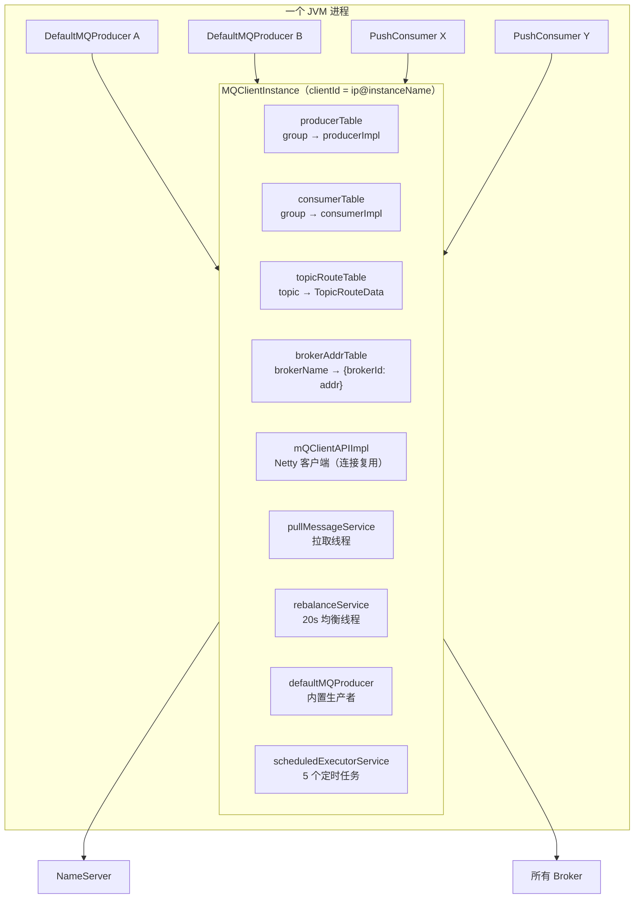
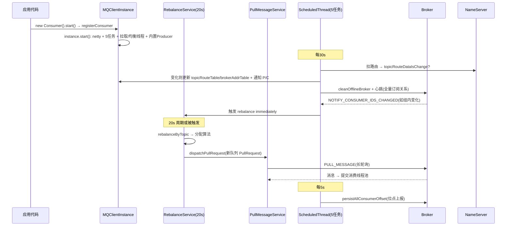

# RocketMQ MQClientInstance 客户端容器源码深度分析

> 基于 RocketMQ 4.9.8 源码，精读 `client/impl/factory/MQClientInstance.java` 与 `MQClientManager.java`——前面所有客户端文档（Producer/Consumer/Rebalance/拉取/位点/顺序）里的"mQClientFactory"，本文把这台"底座机器"彻底拆开：一个 JVM 里到底有几个 MQClientInstance、心跳怎么发、路由怎么缓存、内置 Producer 是干嘛的。

---

## 一、为什么需要 MQClientInstance：资源共享的容器

如果每个 `DefaultMQProducer` / `DefaultMQPushConsumer` 各自维护网络连接、路由缓存、定时任务，一个应用里 3 个 Producer + 5 个 Consumer 就要 8 套 Netty client、8 套定时器、8 份路由表——浪费且低效。

**MQClientInstance 是按 clientId 去重的单例容器**，把所有客户端共享的东西收拢：



## 二、创建与去重：clientId 是唯一钥匙

`MQClientManager.java:43-58`：

```java
private ConcurrentMap<String/* clientId */, MQClientInstance> factoryTable =
    new ConcurrentHashMap<String, MQClientInstance>();

public MQClientInstance getOrCreateMQClientInstance(final ClientConfig clientConfig, RPCHook rpcHook) {
    String clientId = clientConfig.buildMQClientId();           // ip@instanceName[@unitName]
    MQClientInstance instance = this.factoryTable.get(clientId);
    if (null == instance) {
        instance = new MQClientInstance(clientConfig.cloneClientConfig(),
            this.factoryIndexGenerator.getAndIncrement(), clientId, rpcHook);
        MQClientInstance prev = this.factoryTable.putIfAbsent(clientId, instance);
        if (prev != null) {
            instance = prev;                                     // 并发兜底
            log.warn("Returned Previous MQClientInstance for clientId:[{}]", clientId);
        }
        ...
    }
    return instance;
}
```

`clientId = 本机IP @ instanceName [@ unitName]`。**这就是著名的 instanceName 陷阱**：两个不同 consumerGroup 的 Consumer，如果 instanceName 相同（默认 `DEFAULT`，启动后被改写为本机 IP 或进程号……准确地说：默认值 "DEFAULT"，Producer/Consumer start 时若未设置会改写为进程 PID 相关值），且 IP 相同 → **共用同一个 MQClientInstance**。

共用的含义（`registerConsumer`，`MQClientInstance.java:873-879`）：

```java
public synchronized boolean registerConsumer(final String group, final MQConsumerInner consumer) {
    MQConsumerInner prev = this.consumerTable.putIfAbsent(group, consumer);
    if (prev != null) {
        log.warn("the consumer group[" + group + "] exist already.");
        return false;       // 注册失败 → 消费者 start 抛异常
    }
    return true;
}
```

**同一个 MQClientInstance 里，一个 consumerGroup 只能有一个消费者实例**——第二个同组 Consumer 会因 register 失败直接起不来（报 "consumer group exist already"）。同理 `registerProducer`（:913-925）。想同组多实例共存必须改 instanceName（或不同 IP 的机器——分布式部署天然不同 clientId）。

而"故意共用"的价值：**同 JVM 的 Producer + Consumer 共享连接与路由**——生产与消费合一的应用（如回调类服务）只建一套 Netty 连接。

## 三、构造函数：一个实例装了什么（:127-159）

```java
public MQClientInstance(ClientConfig clientConfig, int instanceIndex, String clientId, RPCHook rpcHook) {
    ...
    this.clientRemotingProcessor = new ClientRemotingProcessor(this);      // 处理 Broker 反向推送
    this.mQClientAPIImpl = new MQClientAPIImpl(this.nettyClientConfig, this.clientRemotingProcessor, rpcHook, clientConfig);

    if (this.clientConfig.getNamesrvAddr() != null) {
        this.mQClientAPIImpl.updateNameServerAddressList(this.clientConfig.getNamesrvAddr());
    }

    this.mQAdminImpl = new MQAdminImpl(this);          // maxOffset/searchOffset 等管理 API

    this.pullMessageService = new PullMessageService(this);      // 拉取线程（单线程轮询队列）
    this.rebalanceService = new RebalanceService(this);          // 20s 均衡线程

    this.defaultMQProducer = new DefaultMQProducer(MixAll.CLIENT_INNER_PRODUCER_GROUP);   // ★ 内置生产者
    this.defaultMQProducer.resetClientConfig(clientConfig);

    this.consumerStatsManager = new ConsumerStatsManager(this.scheduledExecutorService);
    ...
}
```

### 内置生产者（CLIENT_INNER_PRODUCER_GROUP）的四个用途

这个用户看不见的 Producer 是很多"魔法"的幕后执行者：

| 用途 | 调用点 |
|------|--------|
| 消费重试客户端兜底路径 | `DefaultMQPushConsumerImpl.sendMessageBack` 失败后自发 retry 消息 |
| 顺序消费超限转 DLQ | `ConsumeMessageOrderlyService.sendMessageBack:391` |
| Request-Reply 应答 | `RequestResponseFuture` 收到请求后回发 `%REPLY%` 消息 |
| 心跳检查/事物回查配套 | producerTable 里永远有它，心跳数据不为空 |

所以 `sendHeartbeatToAllBroker` 里 `producerEmpty` 几乎永远为 false——内置生产者保证了心跳永远有内容可发。

## 四、start()：五步启动序列（:225-254）

```java
public void start() throws MQClientException {
    synchronized (this) {
        switch (this.serviceState) {
            case CREATE_JUST:
                this.serviceState = ServiceState.START_FAILED;    // 先置失败态，防止半启动状态被误用

                if (null == this.clientConfig.getNamesrvAddr()) {
                    this.mQClientAPIImpl.fetchNameServerAddr();   // 1. 未配置则走 HTTP 地址服务器
                }
                this.mQClientAPIImpl.start();                     // 2. Netty 客户端启动
                this.startScheduledTask();                        // 3. 五个定时任务
                this.pullMessageService.start();                  // 4a. 拉取线程
                this.rebalanceService.start();                    // 4b. 均衡线程
                this.defaultMQProducer.getDefaultMQProducerImpl().start(false);   // 5. 内置 Producer（不再注册 instance，防递归）
                this.serviceState = ServiceState.RUNNING;
                break;
            ...
        }
    }
}
```

注意第 5 步 `start(false)` 的参数：`namespaceOnly=false` 表示**不再触发 registerClient**——内置 Producer 自己就在这个 instance 里，递归注册没有意义。这是"容器里长出一个组件，组件不能反手再注册回容器"的标准处理。

## 五、五个定时任务：客户端的自主神经系统（:256-319）

```java
private void startScheduledTask() {
    // ① NameServer 地址刷新（仅当未静态配置）：每 2 分钟
    if (null == this.clientConfig.getNamesrvAddr()) {
        ...fetchNameServerAddr(); ...  1000 * 60 * 2 ...
    }

    // ② 路由刷新：每 pollNameServerInterval（默认 30s）
    ...updateTopicRouteInfoFromNameServer(); ... 10, pollNameServerInterval ...

    // ③ 心跳 + 清理下线 Broker：每 heartbeatBrokerInterval（默认 30s）
    ...cleanOfflineBroker(); sendHeartbeatToAllBrokerWithLock(); ... heartbeatBrokerInterval ...

    // ④ 位点持久化：每 persistConsumerOffsetInterval（默认 5s）
    ...persistAllConsumerOffset(); ... 1000 * 10, persistConsumerOffsetInterval ...

    // ⑤ 消费线程池动态调整：每 1 分钟
    ...adjustThreadPool(); ... 1, 1, MINUTES ...
}
```

单线程 `scheduledExecutorService`（`MQClientFactoryScheduledThread`）串行跑全部任务——**客户端定时任务永远不并发**，规避了几乎所有任务间的竞态（代价：一个任务卡住会拖累其它任务，比如②里 NameServer 超时会推迟④的位点上报）。

| # | 任务 | 周期 | 已有文档详解 |
|---|------|------|------------|
| ① | NS 地址拉取（HTTP 地址服务器） | 2min | — |
| ② | 路由刷新 | 30s | 见下文第六节 |
| ③ | 心跳 + 清理下线 Broker | 30s | 见下文第七节 |
| ④ | 位点持久化 | 5s | 《消费位点管理》篇 |
| ⑤ | 线程池扩缩容 | 1min | 按积压量调整 consumeExecutor |

## 六、路由刷新：updateTopicRouteInfoFromNameServer

(:325-355) 收集 topicList → (:606+) 逐 topic 拉取并判断变化：

```java
// :325-354 先汇聚所有需要路由的 topic
Set<String> topicList = new HashSet<String>();
{ /* 遍历 consumerTable → 每个 impl.subscriptions() 的 topic */ }
{ /* 遍历 producerTable → 每个 impl.getPublishTopicList() */ }

// :623-639 逐 topic 处理
topicRouteData = this.mQClientAPIImpl.getTopicRouteInfoFromNameServer(topic, ...);
if (topicRouteData != null) {
    TopicRouteData old = this.topicRouteTable.get(topic);
    boolean changed = topicRouteDataIsChange(old, topicRouteData);       // 排序后 equals 比对
    if (!changed) {
        changed = this.isNeedUpdateTopicRouteInfo(topic);                // 兜底：即使路由没变，本地发布/订阅信息缺失也强制刷
    } else {
        log.info("the topic[{}] route info changed, old[{}] ,new[{}]", topic, old, topicRouteData);
    }
    if (changed) {
        TopicRouteData cloneTopicRouteData = topicRouteData.cloneTopicRouteData();

        for (BrokerData bd : topicRouteData.getBrokerDatas()) {
            this.brokerAddrTable.put(bd.getBrokerName(), bd.getBrokerAddrs());   // ★ 顺带维护 brokerAddrTable
        }
        // Update Pub info / Sub info → 通知每个 producer/consumer 更新内存
        ...
    }
}
```

三层设计：

1. **`topicRouteDataIsChange`（:791-800）**：排序后 equals——排序是必须的，NameServer 是 AP 无序返回，不排序会误报"变化"刷屏。
2. **`isNeedUpdateTopicRouteInfo`（:803+）兜底**：即使路由内容没变，只要某个 producer 的 publishInfo 或 consumer 的 subscribeInfo 在本地缺失（比如上轮刷新失败），强制视为 changed——**客户端宁可多刷，不可缺失**。
3. **变化时的级联更新**：更新 `topicRouteTable`、`brokerAddrTable`，再回调每个 Producer（`updateTopicPublishInfo`）与 Consumer（`updateTopicSubscribeInfo` + 触发 rebalance immediately——这就是路由变化触发 Rebalance 的链路）。

刷新整体持有 `lockNamesrv`，与 `cleanOfflineBroker` 互斥——路由表的读改写串行化。

### 读队列与写队列的转换（:161-223）

路由数据 → 发布/订阅视图的两条静态方法（此前多篇引用，这里给出原文）：

- `topicRouteData2TopicPublishInfo`：只取 **writeQueueNums** 且要求 `brokerAddrs` 含 MASTER_ID（**生产必须找 Master**）；orderTopicConf 存在时直接按 `broker:queueNums` 解析。
- `topicRouteData2TopicSubscribeInfo`：取 **readQueueNums**（消费可读 Slave），无 Master 限制。

## 七、心跳与 Broker 管理

### cleanOfflineBroker（:386+）

对 `brokerAddrTable` 逐 brokerName 检查其地址是否还出现在**任何 topic 的新路由**里（:519-528 的 `isBrokerAddrExistInTopicRoute` 逻辑），不存在则从 brokerAddrTable 移除——Broker 下线（NameServer 已剔除其路由）后 30s 内客户端清掉本地地址缓存，后续请求自然触发重查路由。

### sendHeartbeatToAllBrokerWithLock（:468-481）

```java
public void sendHeartbeatToAllBrokerWithLock() {
    if (this.lockHeartbeat.tryLock()) {          // tryLock！拿不到直接放弃（30s 后再来）
        try {
            this.sendHeartbeatToAllBroker();
            this.uploadFilterClassSource();      // 顺带上传类过滤的 class 文件
        } finally {
            this.lockHeartbeat.unlock();
        }
    } else {
        log.warn("lock heartBeat, but failed. [{}]", this.clientId);
    }
}
```

`sendHeartbeatToAllBroker`（:531+）：组装 `HeartbeatData`（全量 producer/consumer 的订阅关系、消费类型、消息模型），向 **brokerAddrTable 里每一个地址（含 Master 与 Slave）** 发心跳。Broker 收到后在 ConsumerManager/ProducerManager 登记该客户端（连接在线表），若订阅关系版本变还会触发 `NOTIFY_CONSUMER_IDS_CHANGED` 反向推送（Rebalance 篇已详）。

**心跳是 Rebalance 的间接触发器**：Broker 端发现某组消费者集合变化 → 推送通知 → 客户端 rebalance immediately——所以扩容消费者后几乎秒级触发再均衡，不用等 20s 周期。

### findBrokerAddressInSubscribe（:984+）

按 brokerName + brokerId 找地址；拉取场景 slaveReadEnable 时会随机挑一个 Slave 分摊读压力。找不到时调用方（如位点上报/拉取）先刷新路由再试一次——"找不到就刷路由再找"是客户端对 AP 路由一致性的标准补偿动作。

## 八、生命周期闭环：注册与注销

```
producer.start()  → instance.registerProducer(group)   → producerTable.putIfAbsent
consumer.start()  → instance.registerConsumer(group)   → consumerTable.putIfAbsent
producer.shutdown()/consumer.shutdown() → unregisterProducer/Consumer → unregisterClient
```

`unregisterClient`（:886-911）：向 brokerAddrTable 里**每个 Master** 发 UNREGISTER_CLIENT（带 producerGroup/consumerGroup），Broker 端从 ConsumerManager 移除该客户端 → 组内成员变化 → 触发其他消费者 Rebalance。**优雅停机的价值链**：consumer.shutdown() → 注销 → 别的客户端立刻接走队列，无重叠窗口；kill -9 则要等 Broker 端 120s 连接过期检测。

## 九、全容器协作时序（一张图串起所有已读模块）



## 十、陷阱清单

| # | 陷阱 | 现象 | 根因 |
|---|------|------|------|
| 1 | **同 JVM 同 group 双 Consumer** | "consumer group exist already" 启动失败 | 一个 MQClientInstance 内 group 唯一（:873-879） |
| 2 | **instanceName 不区分** | 同机两个"独立"应用互相干扰/消费者串台 | clientId 相同 → 共享容器：共享路由、心跳、instanceIndex |
| 3 | **单线程定时器被拖垮** | 位点上报延迟、路由刷新停摆 | 5 个任务共用 1 个 scheduledExecutorService，NameServer 超时阻塞队列 |
| 4 | **kill -9 后 120s 才再均衡** | 下线消费者队列 2 分钟无人接管 | 靠 Broker 连接过期检测；shutdown() 注销才是秒级（:886+） |
| 5 | **内置 Producer 无感打满** | 心跳永远显示有 producer | CLIENT_INNER_PRODUCER_GROUP 常驻（:149） |
| 6 | **consumeTimeout 位点依赖共享容器** | 多实例混乱排查困难 | 内置 producer 与业务 producer 共用 clientConfig（resetClientConfig） |
| 7 | **静态配置 namesrvAddr 后不再走地址服务器** | 运维改地址服务器不生效 | :257 `if (null == namesrvAddr)` 才有 2min 拉取任务 |

## 十一、运维与调试手册

**日志关键字：**

| 关键字 | 含义 |
|--------|------|
| `Created a new client Instance ... ClientID` | 新容器创建（每次都打，含完整 config） |
| `Returned Previous MQClientInstance for clientId` | 并发创建被去重 |
| `the consumer group[...] exist already` | 同组注册冲突 |
| `the topic[...] route info changed, old[...] ,new[...]` | 路由变化（对照变更时间排查运维操作） |
| `sending heartbeat, but no consumer and no producer` | producerEmpty && consumerEmpty（几乎不应出现，内置 producer 兜底） |
| `lock heartBeat, but failed` | 心跳锁竞争（通常无害，说明有心跳在跑） |

**断点路线：**

| 观察目标 | 断点位置 |
|---------|---------|
| 容器创建/去重 | `MQClientManager.getOrCreateMQClientInstance:47` |
| 启动序列 | `MQClientInstance.start:225` |
| 路由变化判定 | `topicRouteDataIsChange:791` / `isNeedUpdateTopicRouteInfo:803` |
| 心跳组装 | `sendHeartbeatToAllBroker:531` |
| Broker 下线清理 | `cleanOfflineBroker:386` |
| 注销链路 | `unregisterClient:886` |

## 十二、设计得与失

**得：**
1. **clientId 去重的容器模式**让单 JVM 内资源共享成为默认行为，Netty 连接数与 NameServer 压力随客户端数量对数增长。
2. **单线程定时器 + tryLock** 两处"串行化"决策消灭了任务竞态类 bug，代码里几乎没有复杂并发。
3. `isNeedUpdateTopicRouteInfo` 的"本地缺失强制刷"兜底，把 AP 路由的最终一致性窗口压到最短。
4. 内置 Producer 一个角色复用于重试兜底/DLQ 转发/Request-Reply 回复，巧妙且零用户感知。

**失：**
1. 单线程定时器是单点：一个慢任务拖累全部（5.x 仍未拆分）。
2. instanceName 默认值的"隐式共享"语义反直觉，是新手最容易踩的坑（文档级问题而非代码缺陷）。
3. 心跳全量推送所有订阅关系，订阅多的大客户端心跳包可观。
4. unregisterClient 只通知 Master，Slave 端的客户端登记要靠连接过期自然清除。

## 十三、一句话总结

> **clientId 是钥匙、容器是底座：同 JVM 同 clientId 共享一个 MQClientInstance（Netty + 路由表 + 拉取/均衡线程 + 五任务单线程定时器 + 内置 Producer），group 在容器内唯一，路由 30s 刷、心跳 30s 打、位点 5s 报——前面每一篇里的 mQClientFactory，就是这台按 tryLock 与单线程武装到牙齿、宁可多刷不可缺失的共享机器。**

---

*上一篇：[RocketMQ流控机制源码深度分析](RocketMQ流控机制源码深度分析.md) · 下一篇：Batch 消息与 Request-Reply（说"下一篇"继续；LMQ 轻量队列为最后一个 4.9.8 剩余模块）*
