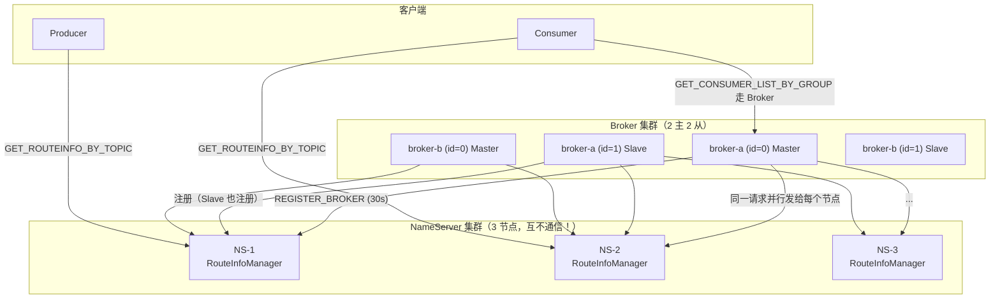
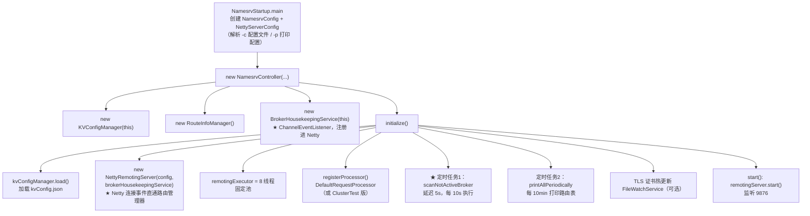
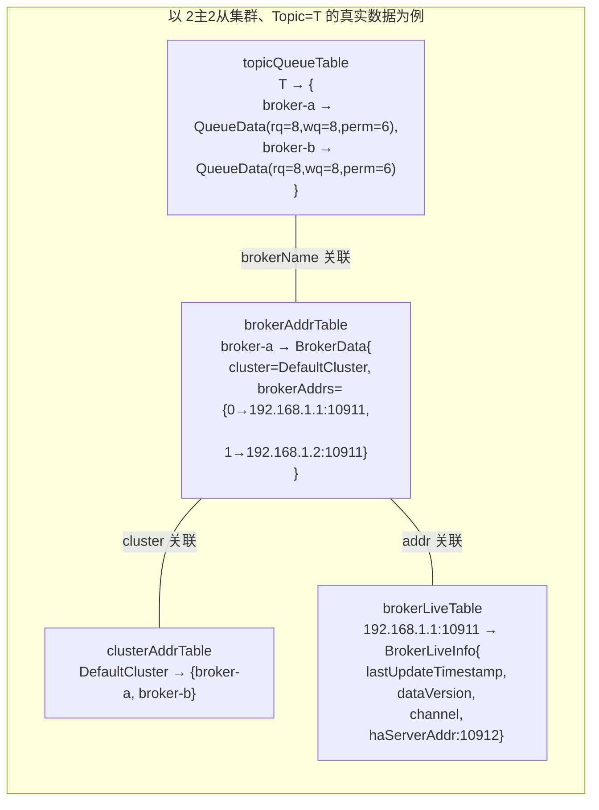
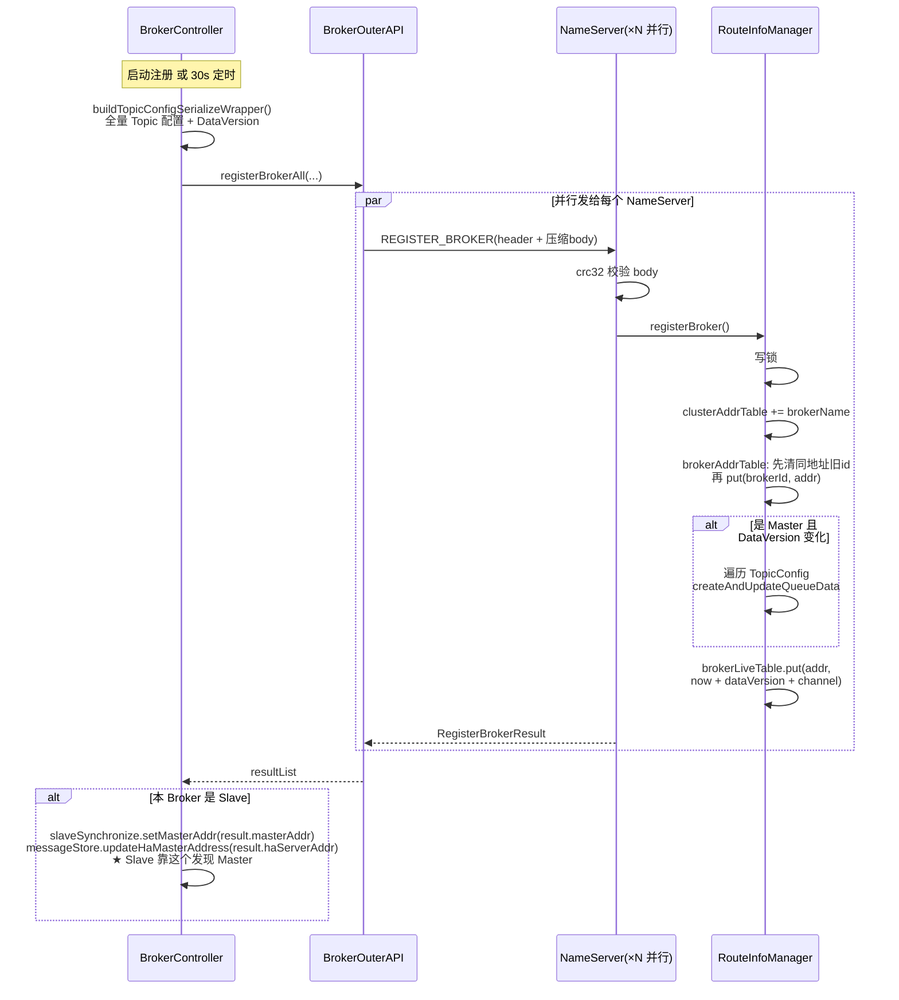
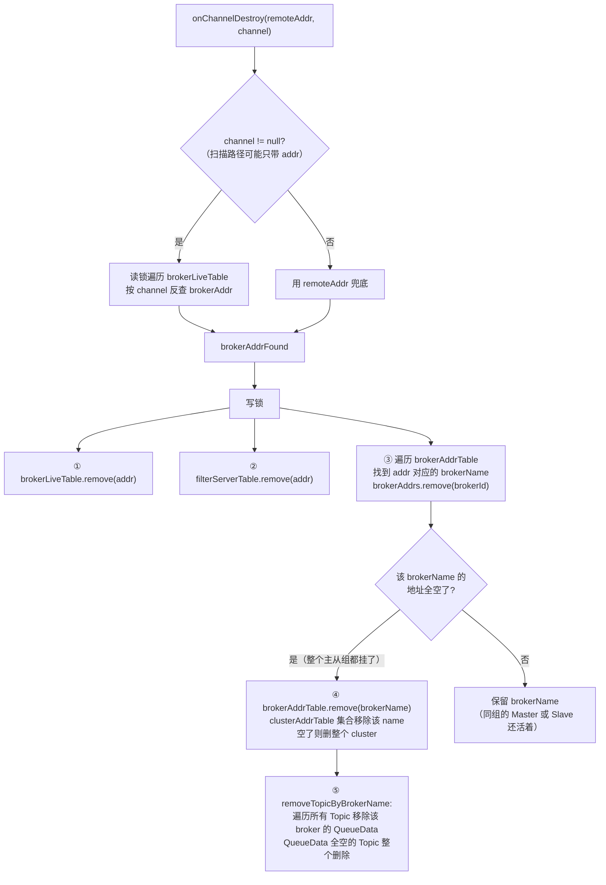
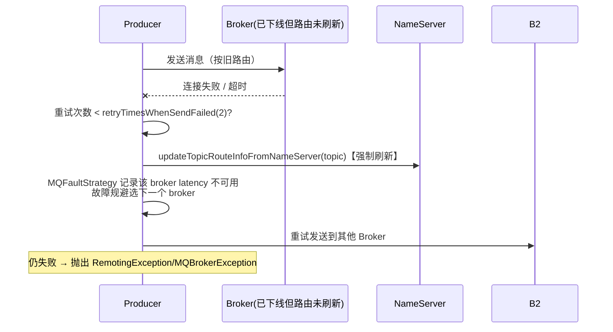

# RocketMQ NameServer 路由中心源码深度分析

> 基于 RocketMQ 4.9.8 源码，行号为当前仓库实际行号。
> 涉及文件：
> - namesrv/.../NamesrvController.java（启动控制器）
> - namesrv/.../routeinfo/RouteInfoManager.java（核心：五张路由表）
> - namesrv/.../routeinfo/BrokerHousekeepingService.java（连接断开监听）
> - namesrv/.../processor/DefaultRequestProcessor.java（请求分发）
> - namesrv/.../kvconfig/KVConfigManager.java（KV 配置）
> - broker/.../BrokerController.java（注册调度 registerBrokerAll）
> - broker/.../out/BrokerOuterAPI.java（注册/反注册/版本探测的网络层）
> - client/.../impl/factory/MQClientInstance.java（客户端路由发现与转换）

---

## 一、总体架构：极简的"注册中心"

NameServer 是 RocketMQ 中代码量最小的核心模块（namesrv 模块不足 30 个类），它的设计哲学是
**用"无状态 + 彼此独立"换"零协调"**：



**与 ZooKeeper 的根本差异**：

| 维度 | ZooKeeper | NameServer |
|------|-----------|-----------|
| 节点关系 | ZAB 协议多数派复制，彼此强耦合 | **互不感知，无任何通信** |
| 一致性 | CP（写入需多数派确认） | AP（每个节点独立接受注册，短暂不一致） |
| 数据容错 | Leader 挂了要选举（不可用窗口） | 任意节点挂了客户端换一个 |
| 客户端容错 | 依赖 ZK 客户端 session | 主动轮询 + 发送失败强制刷新 + 故障规避 |
| 复杂度 | 一套额外中间件 | 一个无状态 Java 进程 |

代价：不同 NameServer 节点的路由表**可能短暂不一致**（某台 Broker 注册到了 NS-1 但还没到 NS-3）。
RocketMQ 用客户端容错弥补——路由旧导致发送失败时，立刻强制刷新路由再重试（见第六节）。

---

## 二、启动流程：NamesrvController（namesrv/.../NamesrvController.java）



源码要点（:76-130）：

```java
public boolean initialize() {
    this.kvConfigManager.load();
    // 注意第二个参数：ChannelEventListener = brokerHousekeepingService
    // → Netty 的 connect/close/exception/idle 事件直接回调到路由管理
    this.remotingServer = new NettyRemotingServer(this.nettyServerConfig, this.brokerHousekeepingService);
    this.remotingExecutor = Executors.newFixedThreadPool(
        nettyServerConfig.getServerWorkerThreads(), ...);   // 默认 8 线程处理所有请求
    this.registerProcessor();
    // ★ 每 10s 扫描不活跃 Broker（并非 5s，别记错——5s 是首次延迟）
    this.scheduledExecutorService.scheduleAtFixedRate(
        NamesrvController.this.routeInfoManager::scanNotActiveBroker,
        5, 10, TimeUnit.SECONDS);
    ...
}
```

NameServer 整个进程只有 **2 个定时任务 + 1 个 Netty Server**，没有任何持久化路由的逻辑——
**路由数据全部内存态，重启即失，靠 Broker 30s 心跳重新注册重建**。这就是"无状态"。

---

## 三、核心数据结构：五张表（RouteInfoManager.java:56-69）

```java
private final static long BROKER_CHANNEL_EXPIRED_TIME = 1000 * 60 * 2;  // 120s
private final ReadWriteLock lock = new ReentrantReadWriteLock();          // 全局一把读写锁

// 1. Topic → {brokerName → QueueData}
private final HashMap<String, Map<String, QueueData>> topicQueueTable;
// 2. brokerName → BrokerData{clusterName, brokerAddrs: {brokerId → addr}}
private final HashMap<String, BrokerData> brokerAddrTable;
// 3. clusterName → Set<brokerName>
private final HashMap<String, Set<String>> clusterAddrTable;
// 4. brokerAddr → BrokerLiveInfo{lastUpdateTimestamp, dataVersion, channel, haServerAddr}
private final HashMap<String, BrokerLiveInfo> brokerLiveTable;
// 5. brokerAddr → List<FilterServer 地址>
private final HashMap<String, List<String>> filterServerTable;
```



**五个关键认识**：

1. **表间无外键，全靠字符串关联**（topic↔brokerName↔clusterName↔addr），注册/注销代码负责维护一致性。
2. **brokerAddrTable 的 key 是 brokerName**——同一 brokerName 下按 brokerId 挂多个地址（0=Master，
   `MixAll.MASTER_ID`；非 0 = Slave）。**"一组主从"是一个逻辑 Broker**。
3. **brokerLiveTable 的 key 是具体地址**——主从各自心跳，各自保活。
4. **DataVersion 是增量注册的基础**：Broker 每次修改 Topic 配置都会 `dataVersion.nextVersion()`，
   NameServer 用它判断"要不要重建 QueueData"（见 4.2）。
5. **一把全局 ReentrantReadWriteLock**（非 ConcurrentHashMap）保护所有表：注册/注销/擦写权限用写锁，
   查询路由用读锁。简单粗暴但足够（路由操作频率极低：每 30s 一次注册、查询是纯内存读）。

### QueueData / BrokerData / TopicRouteData 字段

```
QueueData{brokerName, readQueueNums, writeQueueNums, perm(6=RW), topicSysFlag}
BrokerData{cluster, brokerName, brokerAddrs: HashMap<brokerId, addr>}
TopicRouteData{orderTopicConf, queueDatas[], brokerDatas[], filterServerTable}   ← 返回给客户端的完整路由
```

注意 **readQueueNums 与 writeQueueNums 可以不同**——扩容时先扩 write（新消息进新队列），
观察稳定后再扩 read（消费者才会消费新队列），实现平滑扩缩容。

---

## 四、路由注册全链路

### 4.1 Broker 端：注册调度（BrokerController.java:879-945）

```java
// start() 中：
if (!messageStoreConfig.isEnableDLegerCommitLog()) {
    this.registerBrokerAll(true, false, true);          // ① 启动立即注册一次
}
// ② 定时注册：初始延迟 10s，周期 max(10s, min(registerNameServerPeriod, 60s))
//    registerNameServerPeriod 默认 30000 → 实际 30s
this.scheduledExecutorService.scheduleAtFixedRate(() -> {
    BrokerController.this.registerBrokerAll(true, false, brokerConfig.isForceRegister());
}, 1000 * 10, Math.max(10000, Math.min(brokerConfig.getRegisterNameServerPeriod(), 60000)), MS);
```

**registerBrokerAll 的条件判断（:923-945）**：

```java
public synchronized void registerBrokerAll(final boolean checkOrderConfig,
    boolean oneway, boolean forceRegister) {
    // 全量打包 Topic 配置（含 DataVersion）
    TopicConfigSerializeWrapper topicConfigWrapper =
        this.getTopicConfigManager().buildTopicConfigSerializeWrapper();
    // 权限降级处理：brokerPermission 只读时替换所有 TopicConfig 的 perm
    if (!PermName.isWriteable(...) || !PermName.isReadable(...)) { ... }

    if (forceRegister || needRegister(clusterName, brokerAddr, brokerName, brokerId,
        topicConfigWrapper, registerBrokerTimeoutMills)) {
        doRegisterBrokerAll(checkOrderConfig, oneway, topicConfigWrapper);
    }
}
```

**needRegister 优化（BrokerOuterAPI.needRegister:257+）**：向每个 NameServer 发
`QUERY_DATA_VERSION`（携带自己的 DataVersion），NameServer 比对 brokerLiveTable 里存的版本，
返回 changed 标志。**版本没变就不发全量注册**——省掉心跳包里的大 body。`forceRegister=true` 时跳过探测直接全量注册。

### 4.2 网络层：并行注册所有 NameServer（BrokerOuterAPI.registerBrokerAll:113-168）

```java
public List<RegisterBrokerResult> registerBrokerAll(...) {
    final List<RegisterBrokerResult> registerBrokerResultList = new CopyOnWriteArrayList<>();
    List<String> nameServerAddressList = this.remotingClient.getNameServerAddressList();
    ...
    // 请求体：全量 topicConfigTable + filterServerList，可压缩（compressedRegister 默认 true）
    RegisterBrokerBody requestBody = new RegisterBrokerBody();
    requestBody.setTopicConfigSerializeWrapper(topicConfigWrapper);
    requestBody.setFilterServerList(filterServerList);
    final byte[] body = requestBody.encode(compressed);
    final int bodyCrc32 = UtilAll.crc32(body);      // body 校验和放 header
    requestHeader.setBodyCrc32(bodyCrc32);

    // ★ 每个名称服务器一个任务，线程池并行注册
    final CountDownLatch countDownLatch = new CountDownLatch(nameServerAddressList.size());
    for (final String namesrvAddr : nameServerAddressList) {
        brokerOuterExecutor.execute(() -> {
            try {
                RegisterBrokerResult result = registerBroker(namesrvAddr, oneway, timeoutMills, requestHeader, body);
                if (result != null) registerBrokerResultList.add(result);
            } catch (Exception e) {
                log.warn("registerBroker Exception, {}", namesrvAddr, e);  // 单节点失败不影响其他
            } finally {
                countDownLatch.countDown();
            }
        });
    }
    countDownLatch.await(timeoutMills, TimeUnit.MILLISECONDS);   // 等待全部返回（或超时）
    return registerBrokerResultList;
}
```

要点：
- **并行 + CountDownLatch**：向 N 个 NameServer 的注册并发执行，单个节点慢/挂不拖累其他。
- **注册请求很大**（全量 Topic 配置，topic 多时几百 KB），所以默认 body 压缩 + CRC32 校验。
- 注册**不是 oneway**（定时注册里 oneway=false）：Slave 需要从返回值拿 masterAddr/haServerAddr。

### 4.3 NameServer 端：registerBroker（RouteInfoManager.java:138-233）

这是路由注册的核心，逐段拆解：

```java
public RegisterBrokerResult registerBroker(final String clusterName,
    final String brokerAddr, final String brokerName, final long brokerId,
    final String haServerAddr, final TopicConfigSerializeWrapper topicConfigWrapper,
    final List<String> filterServerList, final Channel channel) {
    RegisterBrokerResult result = new RegisterBrokerResult();
    this.lock.writeLock().lockInterruptibly();          // ① 全局写锁

    // ② 集群表：clusterName → brokerName 集合
    Set<String> brokerNames = this.clusterAddrTable.computeIfAbsent(clusterName, k -> new HashSet<>());
    brokerNames.add(brokerName);

    boolean registerFirst = false;
    // ③ brokerAddr 表：brokerName → BrokerData
    BrokerData brokerData = this.brokerAddrTable.get(brokerName);
    if (null == brokerData) {                            // 首次注册该 brokerName
        registerFirst = true;
        brokerData = new BrokerData(clusterName, brokerName, new HashMap<>());
        this.brokerAddrTable.put(brokerName, brokerData);
    }
    Map<Long, String> brokerAddrsMap = brokerData.getBrokerAddrs();
    // ④ ★ 主从切换处理：同一地址只能有一个 brokerId 记录
    //    场景：手动把 Slave 提升为 Master（brokerId 1→0），先删 <1,addr> 再加 <0,addr>
    Iterator<Entry<Long, String>> it = brokerAddrsMap.entrySet().iterator();
    while (it.hasNext()) {
        Entry<Long, String> item = it.next();
        if (null != brokerAddr && brokerAddr.equals(item.getValue()) && brokerId != item.getKey()) {
            it.remove();
        }
    }
    String oldAddr = brokerData.getBrokerAddrs().put(brokerId, brokerAddr);   // ⑤ 注册地址
    registerFirst = registerFirst || (null == oldAddr);

    // ⑥ ★ 只有 Master 且 Topic 配置版本变化时才重建 QueueData
    if (null != topicConfigWrapper && MixAll.MASTER_ID == brokerId) {
        if (this.isBrokerTopicConfigChanged(brokerAddr, topicConfigWrapper.getDataVersion())
                || registerFirst) {
            ConcurrentMap<String, TopicConfig> tcTable = topicConfigWrapper.getTopicConfigTable();
            for (Map.Entry<String, TopicConfig> entry : tcTable.entrySet()) {
                this.createAndUpdateQueueData(brokerName, entry.getValue());
            }
        }
    }

    // ⑦ ★ 保活表：地址 → {时间戳, dataVersion, channel, haAddr}
    BrokerLiveInfo prevBrokerLiveInfo = this.brokerLiveTable.put(brokerAddr,
        new BrokerLiveInfo(System.currentTimeMillis(),   // lastUpdateTimestamp = now
            topicConfigWrapper.getDataVersion(), channel, haServerAddr));

    // ⑧ filterServer 表维护
    if (filterServerList != null) { ... }

    // ⑨ ★ Slave 注册的返回值：告诉它 Master 的地址
    //    （Slave 启动时不知道 Master 在哪，靠注册 NameServer 拿到 masterAddr + haServerAddr，
    //     用于 HA 复制连接和 slaveSync 同步配置/位点）
    if (MixAll.MASTER_ID != brokerId) {
        String masterAddr = brokerData.getBrokerAddrs().get(MixAll.MASTER_ID);
        if (masterAddr != null) {
            BrokerLiveInfo brokerLiveInfo = this.brokerLiveTable.get(masterAddr);
            if (brokerLiveInfo != null) {
                result.setHaServerAddr(brokerLiveInfo.getHaServerAddr());
                result.setMasterAddr(masterAddr);
            }
        }
    }
    ...
    return result;
}
```

**createAndUpdateQueueData（:255-276）**——QueueData 的"增量合并"：

```java
private void createAndUpdateQueueData(final String brokerName, final TopicConfig topicConfig) {
    QueueData queueData = new QueueData();
    queueData.setBrokerName(brokerName);
    queueData.setWriteQueueNums(topicConfig.getWriteQueueNums());
    queueData.setReadQueueNums(topicConfig.getReadQueueNums());
    queueData.setPerm(topicConfig.getPerm());
    queueData.setTopicSysFlag(topicConfig.getTopicSysFlag());

    Map<String, QueueData> queueDataMap = this.topicQueueTable.get(topicConfig.getTopicName());
    if (null == queueDataMap) {          // Topic 新建
        queueDataMap = new HashMap<>();
        queueDataMap.put(queueData.getBrokerName(), queueData);
        this.topicQueueTable.put(topicConfig.getTopicName(), queueDataMap);
    } else {                             // Topic 更新（覆盖该 broker 的 QueueData）
        QueueData old = queueDataMap.put(queueData.getBrokerName(), queueData);
        if (old != null && !old.equals(queueData)) {
            log.info("topic changed, {} OLD: {} NEW: {}", ...);   // 队列数变化留痕
        }
    }
}
```

**增量注册的三个层次**（性能设计的精髓）：

| 层次 | 判断 | 动作 |
|------|------|------|
| 心跳层 | 每 30s 一次 | 只更新 brokerLiveTable 的时间戳，**不动 topicQueueTable** |
| 版本层 | DataVersion 未变 | 跳过 QueueData 重建（isBrokerTopicConfigChanged） |
| 全量层 | 版本变了 / 首次注册 | 遍历全量 TopicConfig 重建 QueueData |

Broker 端创建/修改 Topic 时（`TopicConfigManager.updateTopicConfig` → `dataVersion.nextVersion()`）
会调用 `registerIncrementBrokerData`——**只发单个 Topic 的增量注册**，而不是等 30s 心跳。

### 4.4 注册时序图



---

## 五、路由剔除：三条路径

### 5.1 路径一：定时扫描（被动，慢路径）

**scanNotActiveBroker（RouteInfoManager.java:468-485）**——NamesrvController 每 10s 调一次：

```java
public int scanNotActiveBroker() {
    int removeCount = 0;
    Iterator<Entry<String, BrokerLiveInfo>> it = this.brokerLiveTable.entrySet().iterator();
    while (it.hasNext()) {
        Entry<String, BrokerLiveInfo> next = it.next();
        long last = next.getValue().getLastUpdateTimestamp();
        if ((last + BROKER_CHANNEL_EXPIRED_TIME) < System.currentTimeMillis()) {   // 120s
            RemotingUtil.closeChannel(next.getValue().getChannel());   // 关连接
            it.remove();                                               // 删保活表
            this.onChannelDestroy(next.getKey(), next.getValue().getChannel());  // 级联删除
            removeCount++;
        }
    }
    return removeCount;
}
```

**感知延迟分析**：Broker 挂掉 → 最长 30s 无心跳 → 最长再等 120s 过期 → 最长 10s 等扫描 →
客户端最长 30s 后刷新路由。**最坏情况约 3 分钟**，这就是为什么不能只依赖扫描——需要路径二。

### 5.2 路径二：连接断开监听（主动，快路径）

**BrokerHousekeepingService（全文仅 50 行）**：

```java
public class BrokerHousekeepingService implements ChannelEventListener {
    public void onChannelClose(String remoteAddr, Channel channel) {
        this.namesrvController.getRouteInfoManager().onChannelDestroy(remoteAddr, channel);
    }
    public void onChannelException(String remoteAddr, Channel channel) { ...同上... }
    public void onChannelIdle(String remoteAddr, Channel channel) { ...同上... }
    // onChannelConnect 为空 —— 只关心断开
}
```

Netty 层触发点：TCP FIN（close）、连接异常（exceptionCaught）、**120s 空闲**
（IdleStateHandler——正常心跳 30s 会重置空闲计时，空闲 2 分钟≈心跳断了）。三个事件都指向
`onChannelDestroy`——**kill -9、断电、网络分区都在秒级被感知**，这是 120s 扫描的补充。

### 5.3 级联删除：onChannelDestroy（:487-599）

无论哪条路径触发，最终都走 `onChannelDestroy`，做四张表的级联清理：



**级联删除的谨慎设计**：只有当 brokerName 下**所有地址**（主+从）都消失才删 brokerName，
只有 Topic 的 **QueueData 全空**才删 Topic。Master 挂了但 Slave 在，路由表仍保留该 Broker 的
读能力——配合 `wipeWritePerm`（见 5.4）实现"只读"降级。

**removeTopicByBrokerName（:391-407）**：

```java
private void removeTopicByBrokerName(final String brokerName) {
    Set<String> noBrokerRegisterTopic = new HashSet<>();
    this.topicQueueTable.forEach((topic, queueDataMap) -> {
        QueueData old = queueDataMap.remove(brokerName);       // 移除该 broker 的队列
        if (queueDataMap.size() == 0) {
            noBrokerRegisterTopic.add(topic);                  // 没有任何 broker 提供该 topic → 待删
        }
    });
    noBrokerRegisterTopic.forEach(topicQueueTable::remove);
}
```

### 5.4 路径三：主动注销（Broker 正常 shutdown）

Broker 的 ShutdownHook → `BrokerController.shutdown()` → `brokerOuterAPI.unregisterBrokerAll()`
→ 逐个 NameServer 发 `UNREGISTER_BROKER`（**同步调用，逐个串行**，不像注册是并行）→
`RouteInfoManager.unregisterBroker（:331-389）`：清理逻辑与 onChannelDestroy 相同的四表级联，
但**不需要反查**（请求自带 clusterName/brokerAddr/brokerName/brokerId 四元组）。

### 5.5 写权限擦除：wipeWritePerm（优雅停机运维）

`mqadmin wipeWritePerm -b broker-a` → `WipeWritePermOfBrokerRequestHeader` →
`operateWritePermOfBroker(:302-329)`：

```java
for (每个 topic 的 queueDataMap) {
    QueueData qd = queueDataMap.get(brokerName);
    if (qd != null) {
        switch (requestCode) {
            case WIPE_WRITE_PERM_OF_BROKER:
                perm &= ~PermName.PERM_WRITE;             // 6(110) → 4(100) 只读
                break;
            case ADD_WRITE_PERM_OF_BROKER:
                perm = PermName.PERM_READ | PermName.PERM_WRITE;  // 恢复 6
                break;
        }
        qd.setPerm(perm);
    }
}
```

**用途**：计划内下线 Broker 时，先擦写权限 → 客户端 30s 内刷新路由发现"该 broker 不可写" →
新消息全部去别的 Broker → 消息发完后再停 Broker，实现**近乎无损的滚动重启**。
（wipe 是即时的、add 是恢复；注意它改的是 NameServer 内存路由，Broker 重启注册后 Master 会把
权限注册回来，所以 wipe 只在"Broker 停止前"有效。）

---

## 六、路由发现：客户端侧

### 6.1 刷新时机（MQClientInstance）

```java
// MQClientInstance.updateTopicRouteInfoFromNameServer()（:325-359，定时任务入口）
// 拉取订阅集：所有 producer 的 topic + 所有 consumer 的订阅 topic + 默认 TBW102
// 对每个 topic 调 updateTopicRouteInfoFromNameServer(topic)

// 定时任务（startScheduledTask）：
//   ① 每 30s：updateTopicRouteInfoFromNameServer（全量刷新路由）
//   ② 每 30s：cleanOfflineBroker + sendHeartbeatToAllBroker（心跳到所有 broker）
//   ③ 每 5s：persistAllConsumerOffset
//   ④ 每 1min：adjustThreadPool
```

### 6.2 updateTopicRouteInfoFromNameServer（:606-689）

```java
public boolean updateTopicRouteInfoFromNameServer(final String topic, boolean isDefault,
    DefaultMQProducer defaultMQProducer) {
    if (this.lockNamesrv.tryLock(LOCK_TIMEOUT_MILLIS, TimeUnit.MILLISECONDS)) {   // 3s tryLock
        try {
            TopicRouteData topicRouteData;
            if (isDefault && defaultMQProducer != null) {
                // ③ 默认 Topic 路径（autoCreateTopicEnable）：查 TBW102 的路由，
                //    并把队列数裁剪为 defaultTopicQueueNums（默认 4）
                topicRouteData = this.mQClientAPIImpl.getDefaultTopicRouteInfoFromNameServer(
                    defaultMQProducer.getCreateTopicKey(), ...);
                if (topicRouteData != null) {
                    for (QueueData data : topicRouteData.getQueueDatas()) {
                        int queueNums = Math.min(defaultMQProducer.getDefaultTopicQueueNums(),
                            data.getReadQueueNums());
                        data.setReadQueueNums(queueNums);
                        data.setWriteQueueNums(queueNums);
                    }
                }
            } else {
                // ① 正常路径：GET_ROUTEINFO_BY_TOPIC
                topicRouteData = this.mQClientAPIImpl.getTopicRouteInfoFromNameServer(topic, ...);
            }
            if (topicRouteData != null) {
                TopicRouteData old = this.topicRouteTable.get(topic);
                // ② 变更检测：新旧路由比对（topicRouteDataIsChange）
                boolean changed = topicRouteDataIsChange(old, topicRouteData);
                if (!changed) {
                    changed = this.isNeedUpdateTopicRouteInfo(topic);  // 本地缺 producer/consumer 表项也强制更
                }
                if (changed) {
                    // ③ 深拷贝留档
                    TopicRouteData cloneTopicRouteData = topicRouteData.cloneTopicRouteData();
                    // ④ 记录 brokerAddrTable（brokerName → 地址表）——发送时按名找地址
                    for (BrokerData bd : topicRouteData.getBrokerDatas()) {
                        this.brokerAddrTable.put(bd.getBrokerName(), bd.getBrokerAddrs());
                    }
                    // ⑤ 生成发布信息：给所有 producer
                    if (!producerTable.isEmpty()) {
                        TopicPublishInfo publishInfo = topicRouteData2TopicPublishInfo(topic, topicRouteData);
                        publishInfo.setHaveTopicRouterInfo(true);
                        for (每个 producer) impl.updateTopicPublishInfo(topic, publishInfo);
                    }
                    // ⑥ 生成订阅信息：给所有 consumer（触发 Rebalance 重算队列分配）
                    if (!consumerTable.isEmpty()) {
                        Set<MessageQueue> subscribeInfo = topicRouteData2TopicSubscribeInfo(topic, topicRouteData);
                        for (每个 consumer) impl.updateTopicSubscribeInfo(topic, subscribeInfo);
                    }
                    this.topicRouteTable.put(topic, cloneTopicRouteData);
                    return true;
                }
            }
        } finally {
            this.lockNamesrv.unlock();
        }
    }
    ...
}
```

**异常容错细节**（:674-677）：查路由抛 `MQClientException`（TOPIC_NOT_EXIST）时，
对 `%RETRY%` 前缀和 TBW102 的 topic **静默**（它们查不到很正常），其他打 warn——
否则重试 Topic 每次刷新都会刷屏。

### 6.3 路由数据的两种转换（:161-223）

**发布视角 topicRouteData2TopicPublishInfo**：

```java
// 顺序 Topic 特殊处理：orderTopicConf = "broker-a:8;broker-b:8"
if (route.getOrderTopicConf() != null && length > 0) {
    String[] brokers = route.getOrderTopicConf().split(";");
    for (String broker : brokers) {
        String[] item = broker.split(":");
        int nums = Integer.parseInt(item[1]);
        for (int i = 0; i < nums; i++)
            info.getMessageQueueList().add(new MessageQueue(topic, item[0], i));
    }
    info.setOrderTopic(true);   // 顺序 Topic 不走轮询选择器
} else {
    List<QueueData> qds = route.getQueueDatas();
    Collections.sort(qds);                       // ★ 按 brokerName 排序保证确定性
    for (QueueData qd : qds) {
        if (PermName.isWriteable(qd.getPerm())) {            // ① 只加可写队列
            BrokerData brokerData = route 中找同名的;
            if (!brokerData.getBrokerAddrs().containsKey(MixAll.MASTER_ID))
                continue;                                     // ② 没有 Master 就跳过（只发 Master）
            for (int i = 0; i < qd.getWriteQueueNums(); i++)  // ③ 只加 write 队列
                info.getMessageQueueList().add(new MessageQueue(topic, qd.getBrokerName(), i));
        }
    }
}
```

**消费视角 topicRouteData2TopicSubscribeInfo（:210-223）**：

```java
for (QueueData qd : route.getQueueDatas()) {
    if (PermName.isReadable(qd.getPerm())) {          // 只加可读
        for (int i = 0; i < qd.getReadQueueNums(); i++)   // 只加 read 队列
            mqList.add(new MessageQueue(topic, qd.getBrokerName(), i));
    }
}
```

**三个不对称**：生产用 write 队列+只认 Master；消费用 read 队列+主从都可读；`Collections.sort(qds)`
保证所有客户端对同一路由生成**相同的队列列表顺序**——这是 Rebalance 分配算法确定性的前提。

### 6.4 发送失败的容错闭环（路由过期自愈）



DefaultMQProducerImpl.sendDefaultImpl 的重试循环里，每次重试前调
`this.mQClientInstance.updateTopicRouteInfoFromNameServer(topic)`——**路由不一致窗口被
"发送失败"这个事件即时收敛**，这就是 NameServer 敢做 AP 的底气。

---

## 七、请求清单：DefaultRequestProcessor（:103-153）

| RequestCode | 方法 | 调用方 |
|-------------|------|--------|
| PUT_KV_CONFIG / GET_KV_CONFIG / DELETE_KV_CONFIG | kvConfig 三件套 | mqadmin / Broker（顺序 Topic 配置） |
| QUERY_DATA_VERSION | 版本探测 | Broker 心跳前的 needRegister |
| **REGISTER_BROKER** (103) | registerBroker（V3_0_11+ 走带 FilterServer 版本） | Broker |
| **UNREGISTER_BROKER** (104) | unregisterBroker | Broker shutdown |
| **GET_ROUTEINFO_BY_TOPIC** (105) | getRouteInfoByTopic | Producer/Consumer |
| GET_BROKER_CLUSTER_INFO (106) | 集群全量信息 | mqadmin clusterList |
| WIPE/ADD_WRITE_PERM_OF_BROKER | 写权限擦除/恢复 | mqadmin |
| GET_ALL_TOPIC_LIST_FROM_NAMESERVER | 全部 Topic | mqadmin topicList |
| DELETE_TOPIC_IN_NAMESRV | 删路由 | mqadmin deleteTopic -c |
| GET_SYSTEM_TOPIC_LIST_FROM_NS | 系统 Topic（集群名/broker 名也是系统 Topic） | 客户端首次 |
| GET_UNIT_TOPIC_LIST 等 | 单元化 Topic | 单元化部署 |
| UPDATE/GET_NAMESRV_CONFIG | 配置热更 | mqadmin updateNamsrvConfig |

**getRouteInfoByTopic（:366-401）** 的一个细节：NameServer 开启 `orderMessageEnable` 时，
从 **KVConfig**（namespace=`ORDER_TOPIC_CONFIG`）里取顺序 Topic 的配置塞进
`topicRouteData.orderTopicConf`——顺序 Topic 的路由不走 topicQueueTable，走 KV 配置。

---

## 八、KVConfigManager：NameServer 里唯一的持久化

路由表不落盘，但 KV 配置落盘（`kvConfig.json`）：

```java
// config namespace → (key → value) 两级 Map
private final HashMap<String/* namespace */, HashMap<String/* key */, String/* value */>> configTable;
```

用途：顺序 Topic 路由（NAMESPACE_ORDER_TOPIC_CONFIG）、客户端 SDK 的全局配置下发
（`producer.sendMsgTimeout` 等可从 NameServer 下发覆盖）。
`mqadmin updateKvConfig` 更新，`persist()` 每 5s/更新时写文件。

---

## 九、设计复盘：为什么这么设计

### 9.1 为什么 Broker 注册"所有" NameServer 而不是选主写再同步？

没有主 → 没有选举 → 没有 split-brain → 部署运维极简。代价是 N 倍写入，但注册频率极低
（每 30s × Broker 数），完全可接受。**用低频写换去了共识协议的全部复杂度**。

### 9.2 为什么选 AP 而不是 CP？

路由数据的特性：**可重建、可旧、必须可用**。
- 可重建：Broker 心跳 30s 重建全部路由；
- 可旧：客户端有发送失败强制刷新的兜底；
- 必须可用：注册中心不可用会阻塞所有新 Topic/新客户端——AP 是正确取舍。

### 9.3 已知局限（4.9.8 视角）

1. **无 watch/push 机制**：客户端只能 30s 轮询，变更感知慢（5.x 引入）；
2. **路由变更不通知**：Broker 扩容后，存量客户端最长 30s 才看到新队列（发送侧影响小，
   消费侧会推迟 Rebalance）；
3. **一把全局锁**：超大规模（万级 Topic + 频繁注册）时写锁竞争；topicQueueTable 遍历类操作
   （wipeWritePerm、removeTopicByBrokerName）是 O(Topic 数)；
4. **NameServer 各节点数据不一致窗口**：运维命令（如 wipeWritePerm）打到不同节点结果可能不同——
   `updateNamsrvConfig` 的黑名单机制部分缓解了误操作风险。

### 9.4 与 5.x 的演进方向

5.0 的 NameServer 增加了**路由变更通知**（RequestCode.NOTIFY_TOPIC_IDS_CHANGED）与
`getRouteInfoByTopic` 的轻量化；Controller 模式（4.9.8 已内置）把"选主"也纳入
NameServer 域——理解本文的五张表是理解这些演进的地基。

---

## 十、调试与验证手册

**断点路线**：
1. `RouteInfoManager.registerBroker:150`（写锁入口）——观察四张表的初始状态与 registerFirst；
2. `createAndUpdateQueueData:263`——Topic 变更时 old vs new QueueData；
3. `scanNotActiveBroker:474`——调小 `BROKER_CHANNEL_EXPIRED_TIME` 常量观察剔除；
4. `onChannelDestroy:516`——kill Broker 进程，秒级触发（而非等 120s）；
5. `MQClientInstance.updateTopicRouteInfoFromNameServer:625`——客户端 changed 判定与双视角转换。

**mqadmin 对照验证**：

```bash
mqadmin clusterList -n localhost:9876          # 对应 GET_BROKER_CLUSTER_INFO，看 brokerLiveTable
mqadmin topicRoute -t TopicTest -n localhost:9876   # 对应 GET_ROUTEINFO_BY_TOPIC，看 pickupTopicRouteData 输出
mqadmin topicList -n localhost:9876            # getAllTopicList
mqadmin brokerStatus -b <addr>                 # Broker 侧注册统计
```

**NamesrvController.printAllPeriodically** 每 10 分钟把五张表全量打进 namesrv.log——
是最直观的运行时路由快照。

---

## 十一、一句话总结

> NameServer = **五张内存表（topic/cluster/brokerAddr/live/filterServer）+ 一把读写锁 +
> 两个定时任务（10s 扫描过期 + 10min 打印）+ 一个连接事件监听器**；注册是 Broker 30s 心跳
> 并行广播所有节点（DataVersion 增量），剔除是 120s 扫描 + 连接断开监听双保险，发现是客户端
> 30s 轮询 + 发送失败强制刷新兜底——用 AP 一致性 + 客户端容错，换掉了整套共识协议。
