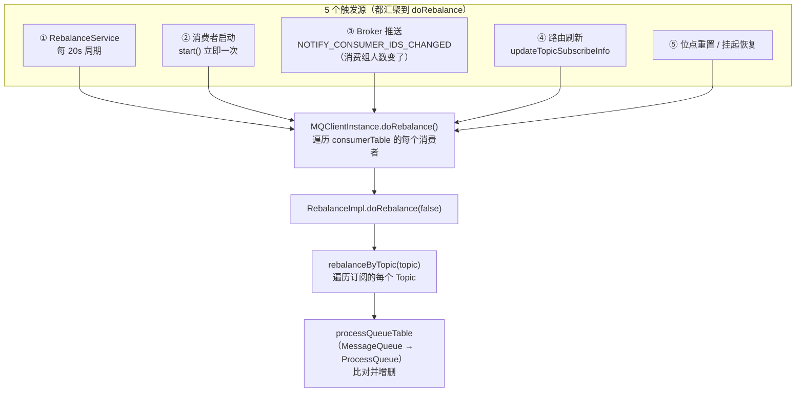
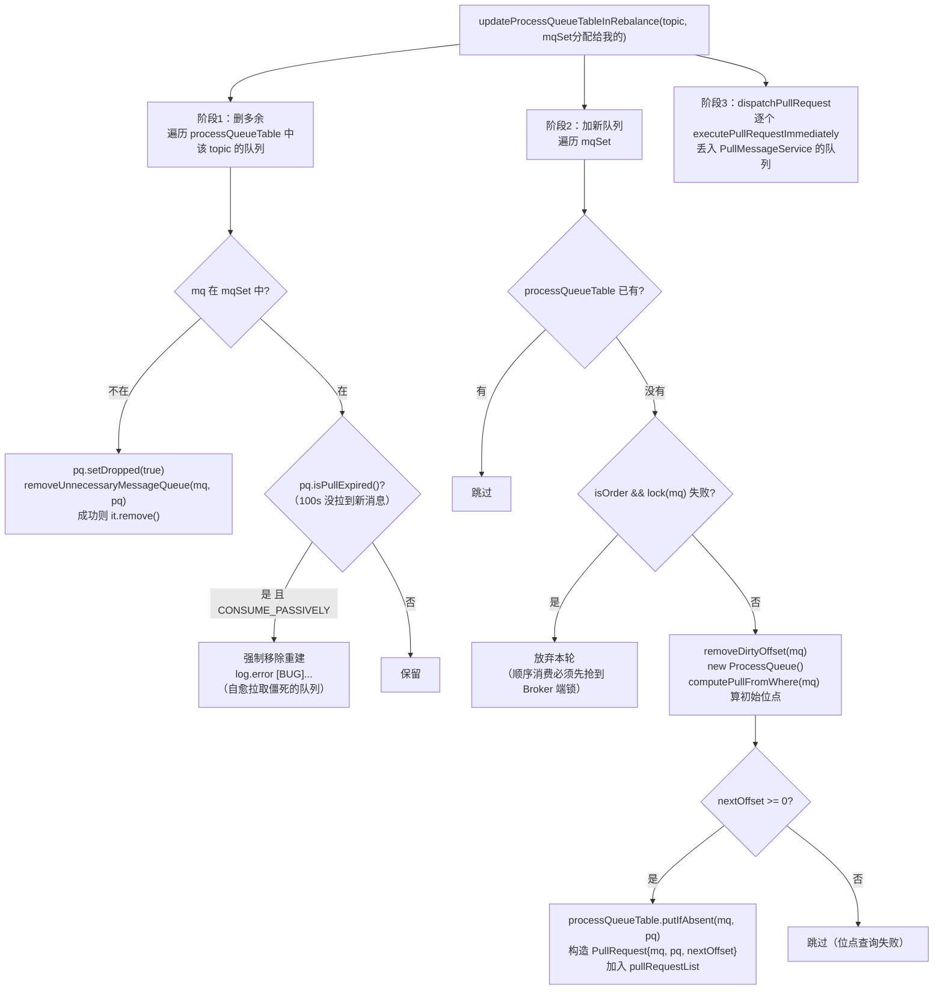
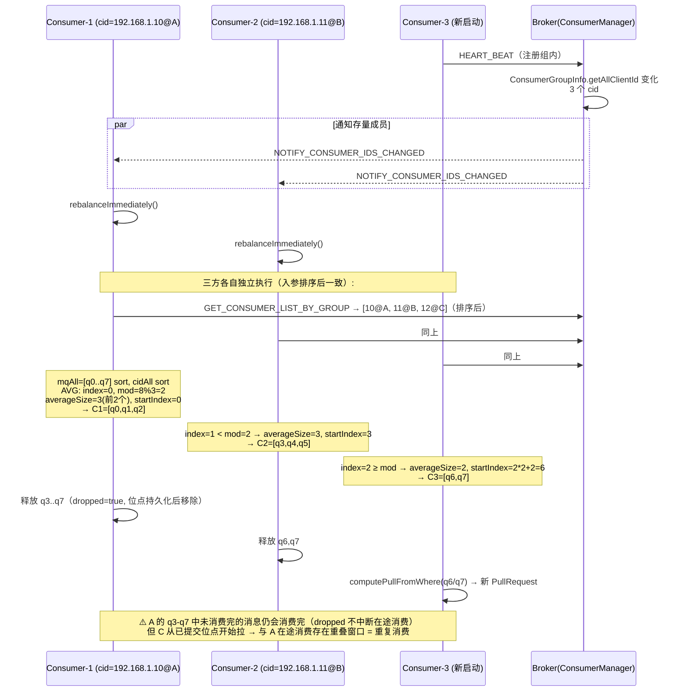
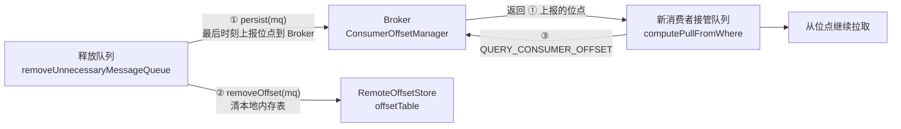

# RocketMQ Rebalance 负载均衡源码深度分析

> 基于 RocketMQ 4.9.8 源码，行号为当前仓库实际行号。
> 涉及文件：
> - client/.../impl/consumer/RebalanceService.java（调度线程）
> - client/.../impl/consumer/RebalanceImpl.java（核心抽象基类）
> - client/.../impl/consumer/RebalancePushImpl.java（Push 消费者特化）
> - client/.../consumer/rebalance/AllocateMessageQueue*（6 种分配策略）
> - client/.../impl/factory/MQClientInstance.java（doRebalance 入口 / findConsumerIdList / rebalanceImmediately）
> - broker/.../client/rebalance/RebalanceLockManager.java（服务端队列锁）
> - broker/.../processor/ConsumerManageProcessor.java（GET_CONSUMER_LIST_BY_GROUP）

---

## 一、总体设计：无协调者的分布式分配

Rebalance 解决"一个消费组的 N 个队列如何分给 M 个消费者"。RocketMQ 的方案是
**每个消费者独立计算，不经过任何服务器**：

```
所有消费者输入相同（排序后的队列列表 + 排序后的消费者列表）
+ 相同的算法（AllocateMessageQueueStrategy）
= 相同的输出（各自拿到自己那一份）
```

这要求两个关键保证：
1. **输入一致性**：cid 列表来自 Broker 的 ConsumerManager（心跳维护），mq 列表来自 NameServer
   路由，两边都 `Collections.sort` 后再进算法；
2. **算法确定性**：分配策略纯函数，无随机、无时间依赖。

**对比其他方案**：Kafka早期的 ZK watch 模型（有协调、易风暴）、RocketMQ 5.0 的服务端
assignment（客户端更轻）。4.x 的客户端自算方案把复杂度留在客户端，换来 Broker 零负担。



### 触发路径源码

```java
// RebalanceService.java:25-46 —— 周期触发
public class RebalanceService extends ServiceThread {
    private static long waitInterval =
        Long.parseLong(System.getProperty("rocketmq.client.rebalance.waitInterval", "20000")); // 默认 20s
    public void run() {
        while (!this.isStopped()) {
            this.waitForRunning(waitInterval);          // 可被 wakeup() 提前唤醒
            this.mqClientFactory.doRebalance();
        }
    }
}

// MQClientInstance.java:950-952 —— 立即触发（Broker 通知 / 启动）
public void rebalanceImmediately() {
    this.rebalanceService.wakeup();                     // 打断 waitForRunning 的等待
}
```

**③ 的完整链路**（最经典的"服务端反向通知"）：消费者 A 启动 → 心跳（HEART_BEAT）到 Broker →
Broker `ConsumerManager.registerConsumer` 发现该组 cid 数量变化 → 向该组**其他所有在线消费者**
的 channel 推 `NOTIFY_CONSUMER_IDS_CHANGED` → 其他消费者 `ClientRemotingProcessor.
notifyConsumerIdsChanged` → `rebalanceImmediately()`——**新成员加入在秒级（而非 20s 后）触发
全员重平衡**。消费者退出同理（Broker `ChannelEventListener` 发现连接断开 → ConsumerGroupInfo
移除 → 通知）。

---

## 二、核心数据结构

```java
// RebalanceImpl.java:46-54 —— 三张核心表
protected final ConcurrentMap<MessageQueue, ProcessQueue> processQueueTable;      // 我持有的队列 → 消息快照
protected final ConcurrentMap<String, Set<MessageQueue>> topicSubscribeInfoTable; // topic → 全部队列（来自路由）
protected final ConcurrentMap<String, SubscriptionData> subscriptionInner;        // topic → 订阅信息
protected AllocateMessageQueueStrategy allocateMessageQueueStrategy;              // 分配策略
```

**MessageQueue**：`{topic, brokerName, queueId}`——队列的全球唯一标识（brokerName 而非地址，
主从切换不影响队列身份）。
**ProcessQueue**：该队列在客户端的内存镜像（`msgTreeMap` TreeMap 按 queueOffset 排序）、
消费位点（`committedOffset`）、`dropped`/`locked` 标志。

---

## 三、doRebalance 主流程源码精读

### 3.1 RebalanceImpl.doRebalance（:217-233）

```java
public void doRebalance(final boolean isOrder) {
    Map<String, SubscriptionData> subTable = this.getSubscriptionInner();
    if (subTable != null) {
        for (final Map.Entry<String, SubscriptionData> entry : subTable.entrySet()) {
            final String topic = entry.getKey();
            try {
                this.rebalanceByTopic(topic, isOrder);
            } catch (Throwable e) {
                if (!topic.startsWith(MixAll.RETRY_GROUP_TOPIC_PREFIX)) {  // %RETRY% 异常静默
                    log.warn("rebalanceByTopic Exception", e);
                }
            }
        }
    }
    this.truncateMessageQueueNotMyTopic();   // ★ 清理订阅已取消但 processQueueTable 残留的队列
}
```

`truncateMessageQueueNotMyTopic（:311-324）`：unsubscribe 后 subscriptionInner 已删，
但 processQueueTable 里的队列还在拉取——每轮 Rebalance 末尾兜底清理（`pq.setDropped(true)` +
移除）。

### 3.2 rebalanceByTopic（:239-309）——广播 vs 集群

```java
private void rebalanceByTopic(final String topic, final boolean isOrder) {
    switch (messageModel) {
        case BROADCASTING: {
            // 广播模式：不分配！每个消费者要全部队列
            Set<MessageQueue> mqSet = this.topicSubscribeInfoTable.get(topic);
            if (mqSet != null) {
                boolean changed = this.updateProcessQueueTableInRebalance(topic, mqSet, isOrder);
                if (changed) {
                    this.messageQueueChanged(topic, mqSet, mqSet);   // mqAll == mqDivided
                }
            }
            break;
        }
        case CLUSTERING: {
            // ① 队列全集：本地缓存（NameServer 路由刷新时写入 topicSubscribeInfoTable）
            Set<MessageQueue> mqSet = this.topicSubscribeInfoTable.get(topic);
            // ② 消费者全集：RPC 到 Broker 查询 GET_CONSUMER_LIST_BY_GROUP
            List<String> cidAll = this.mQClientFactory.findConsumerIdList(topic, consumerGroup);
            if (null == mqSet) { ... warn ... }       // Topic 路由还没有（%RETRY% 静默）
            if (null == cidAll) { ... warn ... }      // Broker 不可达 → 本轮放弃（保底等下一轮）

            if (mqSet != null && cidAll != null) {
                // ③ ★ 双排序 —— 确定性分配的前提！
                List<MessageQueue> mqAll = new ArrayList<MessageQueue>();
                mqAll.addAll(mqSet);
                Collections.sort(mqAll);
                Collections.sort(cidAll);

                // ④ 调用分配策略（默认 AllocateMessageQueueAveragely）
                AllocateMessageQueueStrategy strategy = this.allocateMessageQueueStrategy;
                List<MessageQueue> allocateResult = null;
                try {
                    allocateResult = strategy.allocate(this.consumerGroup,
                        this.mQClientFactory.getClientId(), mqAll, cidAll);
                } catch (Throwable e) {
                    log.error("AllocateMessageQueueStrategy.allocate Exception...", e);
                    return;                           // 策略失败本轮放弃，下一轮再来
                }

                Set<MessageQueue> allocateResultSet = new HashSet<MessageQueue>();
                if (allocateResult != null) allocateResultSet.addAll(allocateResult);

                // ⑤ 用分配结果更新本地队列表
                boolean changed = this.updateProcessQueueTableInRebalance(topic, allocateResultSet, isOrder);
                if (changed) {
                    log.info("rebalanced result changed. allocateMessageQueueStrategyName={}, " +
                        "group={}, topic={}, clientId={}, mqAllSize={}, cidAllSize={}, " +
                        "rebalanceResultSize={}, rebalanceResultSet={}", ...);   // ★ 关键日志：排查分配问题的第一入口
                    this.messageQueueChanged(topic, mqSet, allocateResultSet);
                }
            }
            break;
        }
    }
}
```

**findConsumerIdList 的数据源**：`GET_CONSUMER_LIST_BY_GROUP` → Broker
`ConsumerManageProcessor.getConsumerListByGroup` → `ConsumerManager.getConsumerGroupInfo(group)
.getAllClientId()`——即**心跳里上报的 clientId 集合**（clientId = IP@instanceName）。
这解释了为什么"心跳"是 Rebalance 的根基：不心跳的消费者会被 ConsumerManager 从组里剔除，
下一轮所有人的 cidAll 就少了它，队列被重新分配。

**广播模式注意**：`cidAll` 根本没参与计算（不调 findConsumerIdList），广播消费者之间互不相干，
位点存本地文件（LocalFileOffsetStore）。

### 3.3 updateProcessQueueTableInRebalance（:326-407）——最核心的"对账"

这个方法做三件事：**删多余队列、加新队列、派发拉取请求**。



阶段 2 的两个细节：

1. **`isOrder && !this.lock(mq)`**：顺序消费在新建队列前必须先拿到 Broker 端分布式锁
   （见第五节），拿不到就等下一轮——防止两个消费者同时消费同一队列破坏顺序。
   并发消费则直接建队列（重复消费由消费失败重试/幂等兜底）。
2. **`putIfAbsent` 而非 put**：多线程同时触发 Rebalance（定时线程 + Broker 通知线程）时
   防止重复建队列；失败方走 `mq already exists` 分支。

### 3.4 消费者扩容时序图（3 个队列组，2→3 消费者）



---

## 四、六种分配策略源码精读

所有策略实现 `AllocateMessageQueueStrategy.allocate(group, currentCID, mqAll, cidAll)`，
父类 `AbstractAllocateMessageQueueStrategy.check()` 做统一前置校验
（currentCID 必须在 cidAll 中，否则返回空——**客户端自己被 Broker 剔除时拿到空集，
下一轮会释放全部队列**，这是"消费者掉线队列自动转移"的实现机制）。

### 4.1 AllocateMessageQueueAveragely（默认，连续分段）

```java
// AllocateMessageQueueAveragely.java:29-48
public List<MessageQueue> allocate(String consumerGroup, String currentCID,
    List<MessageQueue> mqAll, List<String> cidAll) {
    List<MessageQueue> result = new ArrayList<MessageQueue>();
    if (!check(consumerGroup, currentCID, mqAll, cidAll)) return result;

    int index = cidAll.indexOf(currentCID);
    int mod = mqAll.size() % cidAll.size();
    // 前 mod 个消费者每人多分 1 个
    int averageSize =
        mqAll.size() <= cidAll.size() ? 1 :
        (mod > 0 && index < mod ? mqAll.size() / cidAll.size() + 1 : mqAll.size() / cidAll.size());
    int startIndex = (mod > 0 && index < mod) ? index * averageSize : index * averageSize + mod;
    int range = Math.min(averageSize, mqAll.size() - startIndex);
    for (int i = 0; i < range; i++) {
        result.add(mqAll.get((startIndex + i) % mqAll.size()));
    }
    return result;   // getName() = "AVG"
}
```

以 8 队列 3 消费者为例：`mod=2`，cid[0]、cid[1] 各 3 个，cid[2] 2 个 → **[q0q1q2][q3q4q5][q6q7]**
——连续分段，同一消费者的队列集中，利于 PageCache 局部性。

### 4.2 AllocateMessageQueueAveragelyByCircle（环形轮流）

```java
// AllocateMessageQueueAveragelyByCircle.java:29-44
int index = cidAll.indexOf(currentCID);
for (int i = index; i < mqAll.size(); i++) {
    if (i % cidAll.size() == index) {
        result.add(mqAll.get(i));
    }
}
```

8 队列 3 消费者 → C1=[q0,q3,q6]、C2=[q1,q4,q7]、C3=[q2,q5]——**交错分布**。
适用场景：队列代表不同 Broker，希望每个消费者的流量均摊到所有 Broker（避免单消费者
压垮单个 Broker 的网络）；代价是丢失局部性。

### 4.3 其余四种

| 策略 | getName | 逻辑 | 适用 |
|------|---------|------|------|
| `AllocateMessageQueueByConfig` | CONFIG | 直接返回 `configList`（外部注入） | 运维手工指定 |
| `AllocateMessageQueueByMachineRoom` | MACHINE_ROOM | 只取 `consumeridcs` 配置的机房内 cid 分配 | 多机房同 Topic |
| `AllocateMachineRoomNearby` | MACHINE_ROOM_NEARBY | 按自定义 `MachineRoomResolver` 把 mq/cid 分机房，**就近**机房分配 | 就近消费 |
| `AllocateMessageQueueConsistentHash` | CONSISTENT_HASH | cidAll 构建虚拟节点（`virtualNode` 默认 10×）一致性哈希环，取 currentCID 顺时针遇到的节点负责的 mq | 减少扩缩容时的队列迁移量 |

**ConsistentHash 的价值**：AVG 策略下消费者数变化会导致大面积重排（8 队列 2→3 消费者，
几乎所有人分配都变）；一致性哈希只迁移哈希环上变化节点附近的队列。但注意 **4.x 消费进度
按队列存位点**，队列迁移必然带来重复消费窗口，一致性哈希只是缩小它。

### 4.4 策略选择注意

- 必须保证**同组所有消费者用同一策略**（各算各的，策略不同 → 分配结果冲突 → 重复消费）。
- 默认 AVG 在"队列数 < 消费者数"时让前 mod 个消费者各 1 个、其余 0 个——**消费者多于队列时
  多出来的消费者空转**（白启动进程），扩容消费者前先确认队列数足够。

---

## 五、Broker 端队列锁：RebalanceLockManager

**为什么需要服务端锁**：Rebalance 的"释放-新建"之间有时间窗口，两个消费者可能短暂
同时持有同一队列。并发消费无所谓（重复消费兜底），**顺序消费不可接受**——所以顺序
模式在队列粒度上加 Broker 端互斥锁。

### 5.1 数据结构与锁逻辑

```java
// broker/.../client/rebalance/RebalanceLockManager.java
// group → (MessageQueue → LockEntry{clientId, timestamp})
private final ConcurrentHashMap<String/* group */, ConcurrentHashMap<MessageQueue, LockEntry>> mqLockTable;

public Set<MessageQueue> tryLockBatch(final String group, Set<MessageQueue> mqs, String clientId) {
    Set<MessageQueue> lockedMqs = ...; Set<MessageQueue> notLockedMqs = ...;
    for (MessageQueue mq : mqs) {
        if (this.isLocked(group, mq, clientId)) lockedMqs.add(mq);   // 自己已持有 → 续期
        else notLockedMqs.add(mq);
    }
    if (!notLockedMqs.isEmpty()) {
        this.lock.lockInterruptibly();
        // group 不存在则建；对每个未锁 mq：
        //   无 LockEntry → 新建，clientId=我，加锁成功
        //   有 LockEntry：
        //     是我的 → 续期 timestamp
        //     不是我的 → 检查是否过期（isLocked 里：now - timestamp > REBALANCE_LOCK_MAX_LIVE_TIME）
        //               过期 → 抢过来；没过期 → 失败
        ...
    }
    return lockedMqs;
}
```

关键参数（BrokerConfig）：

| 配置 | 默认 | 含义 |
|------|------|------|
| `rebalanceLockMaxLiveTime` | 60000 | 锁最长存活 60s，超时视为持锁者死亡，可被抢占 |
| `rebalanceLockExpirationTime`（部分版本叫 rebalanceLockMaxLiveTime） | 60000 | 客户端续锁周期基准 |

### 5.2 客户端的三种锁调用（RebalanceImpl:134-215）

```java
// ① 单队列锁：Rebalance 新增顺序队列前
public boolean lock(final MessageQueue mq) {
    requestBody.setConsumerGroup(this.consumerGroup);
    requestBody.setClientId(this.mQClientFactory.getClientId());
    Set<MessageQueue> lockedMq = mQClientAPIImpl.lockBatchMQ(brokerAddr, requestBody, 1000);
    for (MessageQueue mmqq : lockedMq) {
        ProcessQueue processQueue = this.processQueueTable.get(mmqq);
        if (processQueue != null) {
            processQueue.setLocked(true);
            processQueue.setLastLockTimestamp(System.currentTimeMillis());
        }
    }
    return lockedMq.contains(mq);
}

// ② 批量锁：ConsumeMessageOrderlyService 每 20s 对全部队列续锁 lockAll()
//    （遍历 processQueueTable 按 brokerName 分组，LOCK_BATCH_MQ）

// ③ 解锁：unlock(mq, oneway) / unlockAll —— Rebalance 释放顺序队列、消费者 shutdown 时
```

`ProcessQueue.locked` 为 false 的顺序队列，消费时 `checkRebalance`... 具体：顺序消费线程
每次消费前检查 `!pq.isLocked() || pullThreshold...` 触发 `ConsumeMessageOrderlyService.
tryLockLaterAndReconsume`——**丢锁的队列暂缓消费**，等重新抢到锁再继续。

### 5.3 释放顺序队列的延迟解锁（RebalancePushImpl:85-128）

```java
@Override
public boolean removeUnnecessaryMessageQueue(MessageQueue mq, ProcessQueue pq) {
    // ① 先持久化位点并从内存移除（两种模式都做）
    this.defaultMQPushConsumerImpl.getOffsetStore().persist(mq);
    this.defaultMQPushConsumerImpl.getOffsetStore().removeOffset(mq);

    // ② 顺序消费 + 集群模式：释放前要确认没有在途消息
    if (this.defaultMQPushConsumerImpl.isConsumeOrderly()
        && MessageModel.CLUSTERING.equals(...messageModel())) {
        if (pq.getConsumeLock().tryLock(1000, TimeUnit.MILLISECONDS)) {   // 消费锁：等正在消费的批次结束
            try {
                return this.unlockDelay(mq, pq);
            } finally { pq.getConsumeLock().unlock(); }
        } else {
            pq.incTryUnlockTimes();     // 消费卡住 1s 以上 → 本轮不移除，下一轮再试
            return false;
        }
    }
    return true;                        // 并发消费直接返回 true（立即移除）
}

private boolean unlockDelay(final MessageQueue mq, final ProcessQueue pq) {
    if (pq.hasTempMessage()) {          // msgTreeMap 还有未消费完的消息
        // ★ 延迟 UNLOCK_DELAY_TIME_MILL(1s) 再解锁——给在途消费留时间
        schedule(() -> RebalancePushImpl.this.unlock(mq, true), UNLOCK_DELAY_TIME_MILLS);
    } else {
        this.unlock(mq, true);          // 干净队列立即解锁
    }
    return true;
}
```

这是**双层锁（Broker 锁 + 本地 consumeLock）+ 延迟解锁**的完整配合：本地锁保证解锁时
没有正在消费的批次，延迟 1s 解锁给位点上报留余量，Broker 锁 60s 过期兜底客户端崩溃。

---

## 六、computePullFromWhere：新队列从哪开始拉（RebalancePushImpl:153-227）

新分配到队列时的初始位点决策，只在**该组无已存储位点**时生效：

```java
switch (consumeFromWhere) {
    case CONSUME_FROM_LAST_OFFSET: {         // 默认
        long lastOffset = offsetStore.readOffset(mq, READ_FROM_STORE);  // 先查 Broker/本地
        if (lastOffset >= 0) {
            result = lastOffset;             // ★ 有位点（消费过）→ 严格从位点继续，配置无效
        } else if (-1 == lastOffset) {       // 无位点（组首次上线）
            if (mq.getTopic().startsWith(MixAll.RETRY_GROUP_TOPIC_PREFIX)) {
                result = 0L;                 // 重试 Topic 从头（别丢重试消息）
            } else {
                result = maxOffset(mq);      // 普通 Topic 从最大位点（跳过历史堆积）
            }
        } else result = -1;                  // -2：查询异常，跳过该队列本轮
        break;
    }
    case CONSUME_FROM_FIRST_OFFSET: {        // 无位点时从 0
        ... result = 0L;
    }
    case CONSUME_FROM_TIMESTAMP: {           // 无位点时按时间戳 searchOffset
        ... result = searchOffset(mq, consumeTimestamp);   // 默认 "yyyyMMddHHmmss" 半小时前
        // %RETRY% Topic 特殊：maxOffset（重试消息优先消费新的）
    }
}
```

**最重要的运维认知**：`CONSUME_FROM_FIRST_OFFSET` **不会**让一个已经消费过的组从头重放——
`lastOffset >= 0` 分支永远优先。想重置位点必须用 `mqadmin resetOffsetByTime/-ResetOffset` /
控制台 skip（本质是 Broker 下发 `RESET_CONSUMER_OFFSET`，客户端清 ProcessQueue 从新位点拉）。

**readOffset 返回值语义**：`>=0` 有位点；`-1` 无位点；`-2` 查询失败（READ_FROM_STORE 会
向 Broker 发 `QUERY_CONSUMER_OFFSET`）。

---

## 七、消费位点在 Rebalance 中的流转

Rebalance 是位点多副本一致性的关键参与者，完整链路：



**重叠窗口**（重复消费的根源）：①旧消费者上报位点（S1）→ ③新消费者从 S1 开始拉。但旧
消费者在 S1 之后可能已拉到内存（ProcessQueue.msgTreeMap 中 S1..S2 未消费完）——dropped=true
只是不再拉新、不再提交位点，**已在消费中的消息仍会执行完 listener**。新消费者拉 S1..S2 重叠。
RocketMQ 至少一次语义下的正常现象，业务幂等是标配。

---

## 八、ProcessQueue 的 dropped 语义（贯穿全流程）

```java
pq.setDropped(true) 被调用的场景：
  1. Rebalance 释放队列（不在分配结果中）
  2. truncateMessageQueueNotMyTopic（订阅取消）
  3. pullExpired 自愈重建
  4. 消费者 shutdown（destroy）

dropped=true 的效果（散布在 PullRequest / ConsumeMessageConcurrentlyService / ProcessQueue）：
  - PullRequest 执行时跳过（不再拉取）
  - 消息从 msgTreeMap remove 后不再检查顺序（解锁流程除外）
  - 位点提交时 updateOffset 仍会执行最后一次（在途消息消费完后）
  - ProcessQueue 里的消息消费到一半也不会中断（listener 照常执行完）
```

---

## 九、设计复盘与已知问题

### 9.1 为什么客户端自算而不是服务端分配？

- Broker 零状态扩展（Rebalance 计算分布在消费者侧）；
- 无协调者 → 无单点、无选举；
- 消费者数×队列数的分配计算天然并行。

代价：
- **需要 GET_CONSUMER_LIST_BY_GROUP RPC**：每次 Rebalance 每队列组一次，Broker 承受
  心跳 × 20s 的查询放大；
- **输入一致性是概率性的**：不同消费者同一时刻的 cidAll 可能不同（一个刚收到通知、一个
  还在用旧缓存）→ 分配结果短暂不一致 → 重复消费窗口。20s 周期最终收敛。

### 9.2 排查实战

| 现象 | 定位 |
|------|------|
| 消息重复消费 | 找 `rebalanced result changed` 日志 → 看是否频繁触发（扩缩容/心跳超时/Broker 通知风暴） |
| 部分消费者拿不到队列 | `cidAllSize > mqAllSize`（消费者多于队列）；或 check() 返回空（自己被 Broker 剔除→ 心跳断？instanceName 重复？） |
| 队列频繁被移除又加回 | `pullExpired`（100s 无新消息会自愈重建，正常）；或 Broker 端位点查询 -2 |
| 顺序消费卡住不消费 | `lock failed` 日志 → Broker 锁被旧消费者持有（60s 内）；查 `mqLockTable` |
| 新消费者不接管队列 | 通知未达（Broker 只通知在线 channel），最长等 20s 周期 |

### 9.3 与 5.0 的演进

5.0 引入**服务端分配**（assignment 模式）与 Pop 消费（队列不独占，无需 Rebalance 分队列），
核心动机正是消除"客户端自算的不一致窗口"和"队列数对消费者数的限制"。4.x 的理解是地基。

---

## 十、调试手册

**断点路线**：
1. `RebalanceImpl.rebalanceByTopic:283`——看 allocate 入参（mqAll/cidAll 排序后）与出参；
2. `updateProcessQueueTableInRebalance:337`——dropped 设置与 removeUnnecessaryMessageQueue；
3. `RebalancePushImpl.computePullFromWhereWithException:162`——readOffset 三种返回值分支；
4. `RebalanceLockManager.tryLockBatch:117`——顺序消费锁竞争；
5. Broker `ConsumerManager.registerConsumer`——NOTIFY_CONSUMER_IDS_CHANGED 的触发点。

**日志关键字**（logs/rocketmq_client.log）：
- `rebalanced result changed. allocateMessageQueueStrategyName=AVG, group=..., cidAllSize=..., rebalanceResultSet=...`——每次分配变化全量留痕；
- `doRebalance, {group}, remove unnecessary mq, {mq}` / `add a new mq`——队列增删明细；
- `the message queue lock Failed`——顺序消费锁竞争失败。

**mqadmin**：

```bash
mqadmin consumerProgress -g myGroup -n localhost:9876   # 每个队列的位点 vs 消费者分布
mqadmin consumerConnection -g myGroup                   # 组内在线消费者 clientId
```

---

## 十一、一句话总结

> Rebalance = **每 20s（或被 Broker 通知/启动/路由变更唤醒）每个消费者本地重算**：
> 排序后的 (队列全集 × 消费者全集) 过一遍确定性分配策略（默认 AVG 连续分段），与
> processQueueTable 对账——多则 dropped+位点持久化+移除（顺序模式加 Broker 锁与延迟解锁），
> 少则查位点建 ProcessQueue 派发 PullRequest；一致性靠"输入相同+算法相同"的约定而非协调者，
> 重复消费窗口是这套设计的固有代价。
