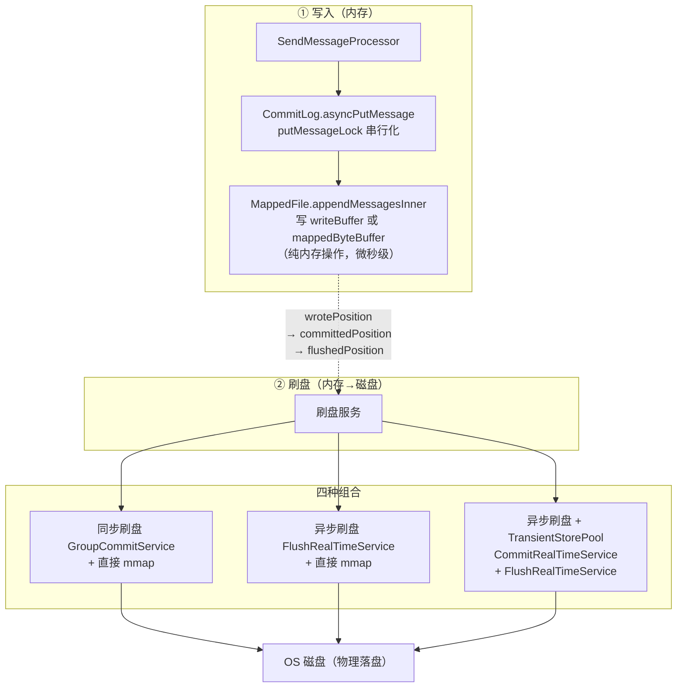
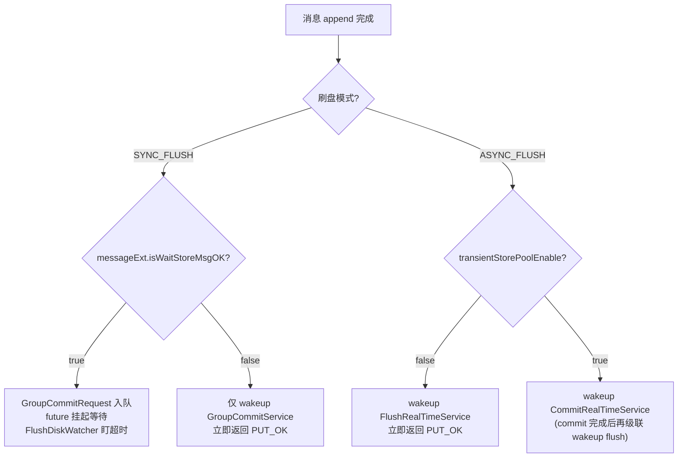
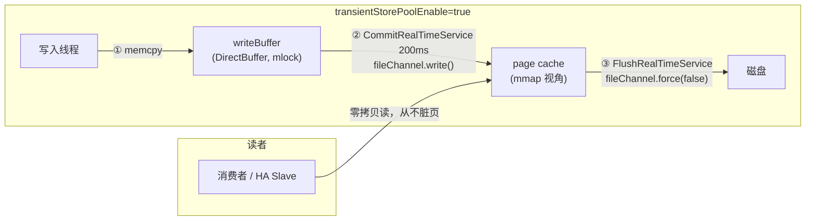

# RocketMQ 4.9.8 mmap 内存映射与刷盘机制源码深度分析

> 基于源码 rocketmq-4.9.8 逐行精读。本篇是系列的补充篇：**存储层最底层的两块基石**——MappedFile 的 mmap 读写模型，以及 CommitLog / ConsumeQueue 的同步/异步刷盘服务体系。前面所有写路径（普通消息、Batch、LMQ）最终都落到这里。

---

## 一、全链路位置：一条消息写完之后发生了什么



**核心认知**：RocketMQ 的"写消息"从来不直接碰磁盘——`appendMessage` 只是往 JVM 直接内存（mmap 映射区或 DirectBuffer）里 `memcpy`，返回 PUT_OK 时数据**只保证在 page cache 里**。真正落盘由独立的刷盘线程异步完成；只有同步刷盘模式才等落盘确认。

---

## 二、mmap 内存映射：MappedFile.init

**`store/src/main/java/org/apache/rocketmq/store/MappedFile.java:162-188`**

```java
private void init(final String fileName, final int fileSize) throws IOException {
    this.fileName = fileName;
    this.fileSize = fileSize;
    this.file = new File(fileName);
    this.fileFromOffset = Long.parseLong(this.file.getName());  // 文件名即起始偏移
    ...
    this.fileChannel = new RandomAccessFile(this.file, "rw").getChannel();
    this.mappedByteBuffer = this.fileChannel.map(MapMode.READ_WRITE, 0, fileSize);
    ...
}
```

**三个关键设计**：

1. **文件名 = 起始全局偏移**：`Long.parseLong(file.getName())`，`00000000000000000000` 这种 20 位零填充文件名本身就是该文件在 CommitLog 中的起始 offset。定位消息只需 `offset % 1G` 得到文件内位置，`offset / 1G` 找文件——CommitLog 天然的 O(1) 定位。
2. **`MapMode.READ_WRITE`**：映射区可写，写入即修改 page cache（脏页），由内核 pdflush/刷盘线程回写。**没有显式的 `write()` 系统调用**。
3. **文件大小固定**：`mappedFileSizeCommitLog = 1024 * 1024 * 1024`（MessageStoreConfig.java:42，默认 1G）。mmap 映射区间在创建时确定、不可扩展，所以必须预分配固定大小、写满换文件。

**为什么是 1G？** 32 位系统虚拟地址空间只有 4G（用户态约 3G），单文件映射过大会耗尽地址空间；64 位下 1G 是兼容性与内存粒度的折中。RocketMQ 全程只用 4G+ 的堆外（mmap + DirectBuffer），**JVM 堆内不存消息体**，避免大堆 GC。

### 2.1 MappedFile 的"水位线"：三个位置计数器

| 字段 | 类型 | 含义 | 推进者 |
|---|---|---|---|
| `wrotePosition` | `AtomicInteger` | 已**写入**到内存映射区的位置 | appendMessagesInner（写入线程，持锁） |
| `committedPosition` | `AtomicInteger` | 已从 writeBuffer **提交**到 FileChannel 的位置 | commit()（仅 TransientStorePool 模式有意义） |
| `flushedPosition` | `AtomicInteger` | 已**刷盘**（force）的位置 | flush()（刷盘线程） |

**`MappedFile.java:495`**：

```java
public int getReadPosition() {
    return this.writeBuffer == null ? this.wrotePosition.get() : this.committedPosition.get();
}
```

这条代码揭示了半条真相：**读消息（包括 HA 同步给 Slave、消费者）最多只能读到 committedPosition**。TransientStorePool 模式下，消息还在 writeBuffer 里没 commit 到 FileChannel 时，MappedByteBuffer（映射 FileChannel）里根本看不到它——此时 HA 同步、消费者读取都会"看不见"这条消息，直到 commit 完成。

三条水位的正常序：`wrotePosition ≥ committedPosition ≥ flushedPosition`。三者差距 = 积压量（`remainHowManyDataToFlush`，CommitLog.java:175）。

### 2.2 写入：appendMessagesInner 的双通道选择

**`MappedFile.java:212-238`**

```java
public AppendMessageResult appendMessagesInner(final MessageExt messageExt, final AppendMessageCallback cb,
        PutMessageContext putMessageContext) {
    int currentPos = this.wrotePosition.get();
    if (currentPos < this.fileSize) {
        // ★ 关键一行：有 writeBuffer（TransientStorePool）则写堆外 DirectBuffer，否则写 mmap 映射区
        ByteBuffer byteBuffer = writeBuffer != null ? writeBuffer.slice() : this.mappedByteBuffer.slice();
        byteBuffer.position(currentPos);
        AppendMessageResult result;
        if (messageExt instanceof MessageExtBrokerInner) {
            result = cb.doAppend(this.getFileFromOffset(), byteBuffer, this.fileSize - currentPos,
                    (MessageExtBrokerInner) messageExt, putMessageContext);
        } else if (messageExt instanceof MessageExtBatch) {
            ...
        }
        this.wrotePosition.addAndGet(result.getWroteBytes());
        ...
    }
    ...
}
```

两条通道（见第四节）：

| | 通道 A：直接 mmap | 通道 B：TransientStorePool |
|---|---|---|
| 写入目标 | `mappedByteBuffer`（page cache） | `writeBuffer`（mlock 锁定的 DirectBuffer） |
| 落盘路径 | 写 page cache → `mappedByteBuffer.force()` | 写堆外 → `fileChannel.write()` → `fileChannel.force(false)` |
| 页污染 | 污染 page cache（缓存与脏页耦合） | CommitLog 脏页不进 page cache，读缓存更"干净" |
| 与 HA 关系 | Slave 可立即读到（getReadPosition=wrotePosition） | 需等 commit 后 Slave 才能读 |

### 2.3 mmap 的代价与 RocketMQ 的应对

mmap 的三大经典问题及对应源码机制：

| 问题 | RocketMQ 应对 | 源码位置 |
|---|---|---|
| mmap 建立映射时缺页中断慢（1G 文件首次写很痛） | **预热** warmMappedFile：每 4K 写一个 0，强制缺页 | MappedFile.java:502 |
| 新文件创建（mmap+预热）耗时阻塞写入 | **异步预分配** AllocateMappedFileService，提前 mmap 好 2 个文件待命 | AllocateMappedFileService.java:146 |
| 删除 mmap 文件时若还有引用会 crash | 引用计数 `hold()/release()`（ReferenceResource） | MappedFile.java:291/306 |

**预热源码（MappedFile.java:502-537）**：

```java
public void warmMappedFile(FlushDiskType type, int pages) {
    long beginTime = System.currentTimeMillis();
    ByteBuffer byteBuffer = this.mappedByteBuffer.slice();
    int flush = 0;
    long time = System.currentTimeMillis();
    for (int i = 0, j = 0; i < this.fileSize; i += MappedFile.OS_PAGE_SIZE, j++) {
        byteBuffer.put(i, (byte) 0);           // 每 4K 写一个 0 → 触发缺页，页表建立
        // 同步刷盘模式下，每攒够 pages 页就 force 一次，避免脏页雪崩
        if (type == FlushDiskType.SYNC_FLUSH) {
            if ((i / OS_PAGE_SIZE) - (flush / OS_PAGE_SIZE) >= pages) {
                flush = i;
                mappedByteBuffer.force();
            }
        }
        if (j % 1000 == 0) {                   // 每 1000 页让出 CPU，"prevent gc"
            log.info("j={}, costTime={}", j, System.currentTimeMillis() - time);
            time = System.currentTimeMillis();
            Thread.sleep(0);
        }
    }
    if (type == FlushDiskType.SYNC_FLUSH) {
        mappedByteBuffer.force();              // 预热完成最终全量 force
    }
    ...
}
```

**异步预分配（AllocateMappedFileService.java:146-218）**：单独一个线程跑 `mmapOperation()`，从 `requestQueue.take()` 拿任务 → `new MappedFile(...)`（或 SPI 扩展 + TransientStorePool init）→ 可选 warmMappedFile → `countDownLatch.countDown()`。`MappedFileQueue.getLastMappedFile()` 发现当前文件快满时，**提前**提交下一个文件的分配请求并等待完成——写入线程永远拿到已经 mmap 好的文件，不会在写入热路径上付出 mmap 代价。若分配超过 1s（waitForRunning 超时），会打 `infinite, maybe the broker is falling behind` 告警日志。

---

## 三、刷盘服务体系：CommitLog 的三个内部线程类

### 3.1 服务选择：构造函数

**`CommitLog.java:99-105`**

```java
if (FlushDiskType.SYNC_FLUSH == ... .getFlushDiskType()) {
    this.flushCommitLogService = new GroupCommitService();     // 同步刷盘
} else {
    this.flushCommitLogService = new FlushRealTimeService();   // 异步刷盘
}
this.commitLogService = new CommitRealTimeService();           // 堆外→FileChannel 提交（仅 TransientStorePool）
```

`FlushDiskType` 在 broker 配置 `flushDiskType=SYNC_FLUSH / ASYNC_FLUSH`，默认 ASYNC_FLUSH。

### 3.2 写入线程如何"请求"刷盘：submitFlushRequest

**`CommitLog.java:862-886`**

```java
public CompletableFuture<PutMessageStatus> submitFlushRequest(AppendMessageResult result, MessageExt messageExt) {
    // Synchronization flush
    if (FlushDiskType.SYNC_FLUSH == ...getFlushDiskType()) {
        final GroupCommitService service = (GroupCommitService) this.flushCommitLogService;
        if (messageExt.isWaitStoreMsgOK()) {
            // 构造请求：nextOffset = 本条消息写完后的偏移（"我要求至少刷到这里"）
            GroupCommitRequest request = new GroupCommitRequest(result.getWroteOffset() + result.getWroteBytes(),
                    ...getSyncFlushTimeout());   // 默认 5s
            flushDiskWatcher.add(request);        // 超时看门狗
            service.putRequest(request);
            return request.future();              // 挂起，等刷盘线程唤醒
        } else {
            service.wakeup();                     // waitStoreMsgOK=false：不等，只唤醒
            return CompletableFuture.completedFuture(PutMessageStatus.PUT_OK);
        }
    }
    // Asynchronous flush
    else {
        if (!....isTransientStorePoolEnable()) {
            flushCommitLogService.wakeup();       // 直接 mmap：唤醒异步刷盘
        } else {
            commitLogService.wakeup();            // 堆外池：先唤醒 commit 服务
        }
        return CompletableFuture.completedFuture(PutMessageStatus.PUT_OK);
    }
}
```

**决策树**：



注意 `submitFlushRequest` 与 `submitReplicaRequest`（:888-905，SYNC_MASTER 复制）返回的 future 由 `thenCombine` 合并（:850）——**同步刷盘 + 同步复制的总耗时 = max(flush, replica)**，两个确认并行等待。这是 4.9.8 相对 4.5 之前版本的优化（旧版 GroupCommitService 兼管复制，新版已拆分）。

### 3.3 同步刷盘：GroupCommitService（组提交）

**`CommitLog.java:1201-1297`**

```java
class GroupCommitService extends FlushCommitLogService {
    // ★ 双缓冲：写入线程只碰 requestsWrite，刷盘线程只碰 requestsRead
    private volatile LinkedList<GroupCommitRequest> requestsWrite = new LinkedList<>();
    private volatile LinkedList<GroupCommitRequest> requestsRead = new LinkedList<>();

    public synchronized void putRequest(final GroupCommitRequest request) {
        lock.lock();
        try { this.requestsWrite.add(request); } finally { lock.unlock(); }
        this.wakeup();
    }

    private void swapRequests() {     // 原子交换两个队列
        lock.lock();
        try {
            LinkedList<GroupCommitRequest> tmp = this.requestsWrite;
            this.requestsWrite = this.requestsRead;
            this.requestsRead = tmp;
        } finally { lock.unlock(); }
    }

    private void doCommit() {
        if (!this.requestsRead.isEmpty()) {
            for (GroupCommitRequest req : this.requestsRead) {
                // There may be a message in the next file, so a maximum of two times the flush
                boolean flushOK = CommitLog.this.mappedFileQueue.getFlushedWhere() >= req.getNextOffset();
                for (int i = 0; i < 2 && !flushOK; i++) {
                    CommitLog.this.mappedFileQueue.flush(0);      // flushLeastPages=0：无条件全量刷
                    flushOK = CommitLog.this.mappedFileQueue.getFlushedWhere() >= req.getNextOffset();
                }
                req.wakeupCustomer(flushOK ? PutMessageStatus.PUT_OK : PutMessageStatus.FLUSH_DISK_TIMEOUT);
            }
            ...
            this.requestsRead = new LinkedList<>();
        } else {
            // 因为个别消息 waitStoreMsgOK=false，会走到这里兜底刷一次
            CommitLog.this.mappedFileQueue.flush(0);
        }
    }

    public void run() {
        while (!this.isStopped()) {
            try {
                this.waitForRunning(10);       // ★ 最多等 10ms —— 组提交的"攒批窗口"
                this.doCommit();
            } catch (Exception e) { ... }
        }
        // shutdown 前：再 swap 一次，把残余请求刷完
        Thread.sleep(10);
        synchronized (this) { this.swapRequests(); }
        this.doCommit();
    }

    @Override
    protected void onWaitEnd() { this.swapRequests(); }   // waitForRunning 醒来时交换缓冲
}
```

**组提交（Group Commit）的精髓**：10ms 窗口内到达的所有请求，被一次 `flush(0)` 统一满足。`flush(0)` 落盘的是 `getReadPosition()`（wrotePosition），所以**只要队列里最老的 nextOffset ≤ flushedWhere，后到的所有请求也一并满足**——N 个并发写请求只付一次 force 的代价。`for (i=0; i<2; ...)` 的两次上限是处理"消息跨文件"边界（一次 flush 只推进到当前文件尾，第二次 flush 推进到下一文件）。

**双缓冲交换（swapRequests）**：把"生产者入队"与"消费者处理"解耦到两个链表，交换瞬间持自旋锁，doCommit 遍历期间写入线程可继续往新的 requestsWrite 里塞——**刷盘全程不阻塞写入**。

### 3.4 超时看门狗：FlushDiskWatcher

**`store/src/main/java/org/apache/rocketmq/store/FlushDiskWatcher.java:38-68`**

```java
public void run() {
    while (!isStopped()) {
        GroupCommitRequest request = commitRequests.take();
        while (!request.future().isDone()) {
            long now = System.nanoTime();
            if (now - request.getDeadLine() >= 0) {
                request.wakeupCustomer(PutMessageStatus.FLUSH_DISK_TIMEOUT);  // 硬超时
                break;
            }
            long sleepTime = (request.getDeadLine() - now) / 1_000_000;
            sleepTime = Math.min(10, sleepTime);
            if (sleepTime == 0) {
                request.wakeupCustomer(PutMessageStatus.FLUSH_DISK_TIMEOUT);
                break;
            }
            Thread.sleep(sleepTime);
        }
    }
}
```

单线程守护队列中每个请求的 deadline（`syncFlushTimeout=5s`，MessageStoreConfig.java:135）。没有它，若 GroupCommitService 卡死（如磁盘 hang），所有同步写请求会无限等待——看门狗保证 5s 内给出 FLUSH_DISK_TIMEOUT 明确答案。这是 4.9.x 加入的可用性改进。

### 3.5 异步刷盘：FlushRealTimeService

**`CommitLog.java:1089-1168`**

```java
class FlushRealTimeService extends FlushCommitLogService {
    private long lastFlushTimestamp = 0;

    public void run() {
        while (!this.isStopped()) {
            boolean flushCommitLogTimed = ....isFlushCommitLogTimed();   // 默认 true
            int interval = ....getFlushIntervalCommitLog();              // 默认 500ms
            int flushPhysicQueueLeastPages = ....getFlushCommitLogLeastPages();     // 默认 4 页
            int flushPhysicQueueThoroughInterval = ....getFlushCommitLogThoroughInterval();  // 默认 10s

            boolean printFlushProgress = false;
            long currentTimeMillis = System.currentTimeMillis();
            if (currentTimeMillis >= (this.lastFlushTimestamp + flushPhysicQueueThoroughInterval)) {
                this.lastFlushTimestamp = currentTimeMillis;
                flushPhysicQueueLeastPages = 0;    // ★ 彻底刷：忽略页数门槛
                printFlushProgress = (printTimes++ % 10) == 0;
            }

            try {
                if (flushCommitLogTimed) {
                    Thread.sleep(interval);        // 定时模式：睡 500ms
                } else {
                    this.waitForRunning(interval); // 唤醒模式：写线程 wakeup 可提前触发
                }
                ...
                long begin = System.currentTimeMillis();
                CommitLog.this.mappedFileQueue.flush(flushPhysicQueueLeastPages);
                long storeTimestamp = CommitLog.this.mappedFileQueue.getStoreTimestamp();
                if (storeTimestamp > 0) {
                    ....getStoreCheckpoint().setPhysicMsgTimestamp(storeTimestamp);  // 推进 checkpoint
                }
                long past = System.currentTimeMillis() - begin;
                if (past > 500) {
                    log.info("Flush data to disk costs {} ms", past);   // 刷盘慢告警
                }
            } catch (Throwable e) { ... }
        }
        // 退出前最多重试 10 次全量刷
        for (int i = 0; i < RETRY_TIMES_OVER && !result; i++) {
            result = CommitLog.this.mappedFileQueue.flush(0);
            ...
        }
    }
}
```

**两级节流的经典模式**（`flushLeastPages` 机制，MappedFile.isAbleToFlush:356-369）：

```java
private boolean isAbleToFlush(final int flushLeastPages) {
    int flush = this.flushedPosition.get();
    int write = getReadPosition();
    if (this.isFull()) return true;               // 文件写满：无条件刷
    if (flushLeastPages > 0) {
        return ((write / OS_PAGE_SIZE) - (flush / OS_PAGE_SIZE)) >= flushLeastPages;
    }
    return write > flush;
}
```

平时（攒够 **4 页脏页**才 force，`flushCommitLogLeastPages=4`）：低流量时避免每条消息都触发 force，攒批落盘；每 **10 秒**（thoroughInterval）强制 `flushPhysicQueueLeastPages=0`：不管脏页多少全量刷一次——保证异步刷盘模式的**最大丢消息窗口 ≈ 10 秒**（而非无限大）。**文件写满（isFull）也绕过页数门槛**，保证换文件前数据完整。

`flushCommitLogTimed=true`（默认）用 `Thread.sleep`，即使写线程 wakeup 也不提前醒——纯粹定时；false 时 `waitForRunning` 可被写入线程即时唤醒（写完立刻刷，低延迟高 IO 模式）。

### 3.6 堆外池模式：CommitRealTimeService

**`CommitLog.java:1036-1087`**

```java
class CommitRealTimeService extends FlushCommitLogService {
    private long lastCommitTimestamp = 0;

    public void run() {
        while (!this.isStopped()) {
            int interval = ....getCommitIntervalCommitLog();                // 默认 200ms
            int commitDataLeastPages = ....getCommitCommitLogLeastPages();  // 默认 4 页
            int commitDataThoroughInterval = ....getCommitCommitLogThoroughInterval();  // 默认 200ms！

            long begin = System.currentTimeMillis();
            if (begin >= (this.lastCommitTimestamp + commitDataThoroughInterval)) {
                this.lastCommitTimestamp = begin;
                commitDataLeastPages = 0;         // thoroughInterval 只有 200ms，几乎每次都是全量 commit
            }

            boolean result = CommitLog.this.mappedFileQueue.commit(commitDataLeastPages);
            long end = System.currentTimeMillis();
            if (!result) {
                this.lastCommitTimestamp = end;   // result=false 说明还有数据没提交完
                flushCommitLogService.wakeup();   // ★ commit 有产出 → 级联唤醒真正的 flush 线程
            }
            if (end - begin > 500) {
                log.info("Commit data to file costs {} ms", end - begin);
            }
            this.waitForRunning(interval);
        }
        // 退出前 retry 10 次 commit(0)
        ...
    }
}
```

`commitThoroughInterval=200ms` 比 flush 的 10s 激进得多——因为 commit（writeBuffer→FileChannel 的 `fileChannel.write`，MappedFile.commit0:338-354）只是堆外到 page cache 的内存拷贝，不碰磁盘，代价低可以高频做。真正昂贵的 `fileChannel.force` 仍由 FlushRealTimeService 按 500ms/4页/10s 节奏执行。

---

## 四、TransientStorePool：读写分离的堆外缓冲池

**`store/src/main/java/org/apache/rocketmq/store/TransientStorePool.java:31-89`**（全文 89 行）

```java
public class TransientStorePool {
    private final int poolSize;                  // transientStorePoolSize = 5
    private final int fileSize;                  // = mappedFileSizeCommitLog = 1G
    private final Deque<ByteBuffer> availableBuffers;

    /** It's a heavy init method. */
    public void init() {
        for (int i = 0; i < poolSize; i++) {
            ByteBuffer byteBuffer = ByteBuffer.allocateDirect(fileSize);   // 5 个 1G DirectBuffer
            final long address = ((DirectBuffer) byteBuffer).address();
            Pointer pointer = new Pointer(address);
            LibC.INSTANCE.mlock(pointer, new NativeLong(fileSize));        // ★ mlock 锁内存，禁止 swap
            availableBuffers.offer(byteBuffer);
        }
    }
    ...
    public void returnBuffer(ByteBuffer byteBuffer) {
        byteBuffer.position(0);
        byteBuffer.limit(fileSize);
        this.availableBuffers.offerFirst(byteBuffer);   // 归还复用，不释放
    }

    public ByteBuffer borrowBuffer() {
        ByteBuffer buffer = availableBuffers.pollFirst();
        if (availableBuffers.size() < poolSize * 0.4) {
            log.warn("TransientStorePool only remain {} sheets.", availableBuffers.size());  // 池水位告警
        }
        return buffer;
    }
}
```

**设计动机**：直接 mmap 模式下，写入会污染 page cache——消息写入产生的脏页与消费者读取所依赖的缓存是同一块。大流量写入时内核忙于回写脏页，导致**读缓存命中率下降**（读请求被打到磁盘）。TransientStorePool 引入 `写路径（堆外 DirectBuffer）` 与 `读缓存（mmap page cache）` 的物理分离：



配套机制（MappedFile.java）：

- `init(fileName, fileSize, transientStorePool)`（:155-160）：创建 MappedFile 时从池里 `borrowBuffer()`；
- `commit()`（:315-336）：writeBuffer==null 时**直接返回 wrotePosition**（"无需提交"）；否则 `commit0()` 把 `[committedPosition, wrotePosition)` 拷到 FileChannel；**文件写满且全部 commit 完成后归还 buffer**（:330-333 `returnBuffer` + `writeBuffer=null`）；
- `flush()`（:289-313）：判断条件 `writeBuffer != null || fileChannel.position() != 0` → 用 `fileChannel.force(false)`，否则 `mappedByteBuffer.force()`。**注释原文：`We only append data to fileChannel or mappedByteBuffer, never both.`** —— 一个 MappedFile 的生命周期内只会走其中一条路，所以 flush 判断 fileChannel.position 即可区分。

**代价**：多一次堆外→page cache 的内存拷贝（commit0）；池子独占 5G 堆外内存且 mlock 锁死（不可 swap）；**HA 同步延迟增加**——Slave 在 commit 之前读不到新消息（getReadPosition 返回 committedPosition，MappedFile.java:495）。

---

## 五、MappedFileQueue 的队列级推进

**`store/src/main/java/org/apache/rocketmq/store/MappedFileQueue.java:439-467`**

```java
public boolean flush(final int flushLeastPages) {
    boolean result = true;
    MappedFile mappedFile = this.findMappedFileByOffset(this.flushedWhere, this.flushedWhere == 0);
    if (mappedFile != null) {
        long tmpTimeStamp = mappedFile.getStoreTimestamp();
        int offset = mappedFile.flush(flushLeastPages);
        long where = mappedFile.getFileFromOffset() + offset;
        result = where == this.flushedWhere;        // true 表示"没刷出任何新数据"
        this.flushedWhere = where;                  // 队列级水位 = 文件起始偏移 + 文件内刷盘位置
        if (0 == flushLeastPages) {
            this.storeTimestamp = tmpTimeStamp;     // 全量刷时更新 storeTimestamp（供 StoreCheckpoint）
        }
    }
    return result;
}

public boolean commit(final int commitLeastPages) {
    ... // 与 flush 完全同构，推进 committedWhere
}
```

CommitLog 全局只有**一个**刷盘游标 `flushedWhere`，永远只刷"当前活跃文件"——历史文件在写满时已被 isFull() 绕过页数门槛刷干净。`result=false`（有新数据刷出）被 CommitRealTimeService 用来触发级联唤醒 flush 线程（CommitLog.java:1065-1069）。

---

## 六、ConsumeQueue / IndexFile / Checkpoint 的刷盘（对照）

**`DefaultMessageStore.java:1908-1946`** `FlushConsumeQueueService`：

```java
private void doFlush(int retryTimes) {
    int flushConsumeQueueLeastPages = ....getFlushConsumeQueueLeastPages();   // 2 页
    if (retryTimes == RETRY_TIMES_OVER) {
        flushConsumeQueueLeastPages = 0;                                      // 最后一搏：全量
    }
    long logicsMsgTimestamp = 0;
    int flushConsumeQueueThoroughInterval = ....getFlushConsumeQueueThoroughInterval();  // 60s
    long currentTimeMillis = System.currentTimeMillis();
    if (currentTimeMillis >= (this.lastFlushTimestamp + flushConsumeQueueThoroughInterval)) {
        this.lastFlushTimestamp = currentTimeMillis;
        flushConsumeQueueLeastPages = 0;
        logicsMsgTimestamp = DefaultMessageStore.this.getStoreCheckpoint().getLogicsMsgTimestamp();
    }
    ConcurrentMap<String, ConcurrentMap<Integer, ConsumeQueue>> tables = ...consumeQueueTable;
    for (ConcurrentMap<Integer, ConsumeQueue> maps : tables.values()) {
        for (ConsumeQueue cq : maps.values()) {
            boolean result = false;
            for (int i = 0; i < retryTimes && !result; i++) {
                result = cq.flush(flushConsumeQueueLeastPages);   // 每个 ConsumeQueue 逐个刷
            }
        }
    }
    if (0 == flushConsumeQueueLeastPages) {
        if (logicsMsgTimestamp > 0) {
            ....getStoreCheckpoint().setLogicsMsgTimestamp(logicsMsgTimestamp);
        }
        DefaultMessageStore.this.getStoreCheckpoint().flush();    // ★ 全量刷时顺带刷 checkpoint
    }
}
```

**为什么 ConsumeQueue 可以比 CommitLog 更"懒"？** ConsumeQueue 只是 CommitLog 的索引，CommitLog 恢复后可通过 reput 重建索引（存储恢复篇的 recoverAbnormal 路径），丢索引不等于丢消息——所以它 2 页/1000ms/60s 彻底刷，宽松得多。而 StoreCheckpoint（3 个时间戳）只跟 ConsumeQueue 的**全量刷**绑定（thoroughInterval 60s 一次），与存储恢复篇的 `getMinTimestamp()-3s` 保守窗口闭环。

| 存储 | 刷盘服务 | interval | leastPages | thoroughInterval |
|---|---|---|---|---|
| CommitLog（异步） | FlushRealTimeService | 500ms | 4 | 10s |
| CommitLog（堆外 commit） | CommitRealTimeService | 200ms | 4 | 200ms |
| CommitLog（同步） | GroupCommitService | 10ms 攒批 | 0（无条件） | — |
| ConsumeQueue | FlushConsumeQueueService | 1000ms | 2 | 60s |
| IndexFile | 内建定时（60s 全量） | 60s | — | — |

---

## 七、同步刷盘完整时序（最核心的图）

```mermaid
sequenceDiagram
    participant PT as 写入线程(Netty)
    participant GC as GroupCommitService
    participant WD as FlushDiskWatcher
    participant MF as MappedFile/mmap
    participant OS as OS磁盘

    PT->>MF: appendMessagesInner (memcpy到page cache)
    PT->>GC: putRequest(nextOffset=X)
    PT->>WD: add(request) 超时看门狗
    PT--xPT: future.get() 挂起

    Note over GC: waitForRunning(10) 攒批窗口<br/>期间 T2、T3 的请求也进入 requestsWrite

    GC->>GC: onWaitEnd → swapRequests
    GC->>GC: doCommit: 遍历 requestsRead
    GC->>MF: mappedFileQueue.flush(0)
    MF->>OS: mappedByteBuffer.force() ★真正的fsync
    MF-->>GC: flushedPosition = wrotePosition
    GC->>GC: flushedWhere ≥ nextOffset ? PUT_OK
    GC--xWD: req.wakeupCustomer(PUT_OK)<br/>future.complete → 写入线程 T1/T2/T3 同时唤醒
    Note over GC,PT: N 个请求一次 force 全部满足（组提交）
```



---

## 八、配置速查表（含默认值，MessageStoreConfig.java 行号）

| 配置项 | 默认值 | 行号 | 含义 |
|---|---|---|---|
| `mappedFileSizeCommitLog` | 1G | :42 | 单个 CommitLog 文件大小 |
| `flushDiskType` | ASYNC_FLUSH | — | 同步/异步刷盘 |
| `syncFlushTimeout` | 5s | :135 | 同步刷盘超时（FlushDiskWatcher deadline） |
| `flushIntervalCommitLog` | 500ms | :56 | 异步刷盘间隔 |
| `flushCommitLogLeastPages` | 4 | :97 | 异步刷盘最少脏页数 |
| `flushCommitLogThoroughInterval` | 10s | :104 | 异步刷盘彻底刷间隔（最大丢消息窗口） |
| `flushCommitLogTimed` | true | :70 | true=纯定时 sleep，false=可被写线程唤醒 |
| `commitIntervalCommitLog` | 200ms | :61 | 堆外→FileChannel 提交间隔 |
| `commitCommitLogLeastPages` | 4 | :99 | 提交最少页数 |
| `commitCommitLogThoroughInterval` | 200ms | :105 | 彻底提交间隔 |
| `transientStorePoolEnable` | false | :150 | 堆外写缓冲池开关 |
| `transientStorePoolSize` | 5 | :151 | 池中 DirectBuffer 个数（×1G） |
| `warmMapedFileEnable` | false | :141 | 新文件 mmap 预热开关 |
| `flushLeastPagesWhenWarmMapedFile` | 4096 | :101 | 预热时同步模式每多少页 force 一次 |
| `useReentrantLockWhenPutMessage` | true | :66 | 写锁：ReentrantLock vs 自旋锁 |
| `flushIntervalConsumeQueue` | 1000ms | :72 | ConsumeQueue 刷盘间隔 |
| `flushConsumeQueueLeastPages` | 2 | :103 | ConsumeQueue 最少脏页 |
| `flushConsumeQueueThoroughInterval` | 60s | :106 | ConsumeQueue 彻底刷间隔 |

---

## 九、陷阱清单

1. **异步刷盘的丢消息窗口 ≈ 10s，不是 500ms**：低流量时 leastPages=4 攒不住 4 页脏页，flush 不执行，全靠 10s 的 thoroughInterval 兜底。OS 宕机（非进程 crash）时 page cache 里最多丢 10s 的"已 PUT_OK"消息。进程 crash 不丢（page cache 属于 OS）。
2. **同步刷盘也分两种语义**：`waitStoreMsgOK=true`（默认）才真正等待落盘；生产端 `setWaitStoreMsgOK(false)` 的消息在 SYNC_FLUSH 集群里只触发一次 wakeup 不等待——同一个集群里存在两种持久化级别的消息，别混为一谈。
3. **`flushCommitLogTimed=true`（默认）时写线程 wakeup 无效**：FlushRealTimeService 用 `Thread.sleep(500)`，收不到 wakeup。想要"写完立刻刷"的亚秒级异步刷盘，必须设 false。
4. **TransientStorePool 与同步复制（SYNC_MASTER）叠加会放大复制延迟**：getReadPosition 返回 committedPosition（MappedFile.java:495），Slave 最早也要等 200ms 的 CommitRealTimeService 提交后才能读到新消息。追求 RPO≈0 的组合（SYNC_FLUSH + SYNC_MASTER）**不要开 transientStorePoolEnable**——源码意图上堆外池是为高吞吐异步场景设计的。
5. **堆外池内存是 mlock 锁死的 5G**：`TransientStorePool.init` 对每个 DirectBuffer 调 `LibC.mlock`，禁止换出。容器内存配额没算这 5G（堆外）+ mmap page cache 的账，会被 OOM kill。
6. **GroupCommitService 的"组"只在 10ms 窗口内成立**：低并发时每个请求几乎独占一次 force，同步刷盘吞吐 ≈ 100 msg/s（10ms×2 次上限）是常态；高并发才摊薄 force 成本。压测同步刷盘性能必须用并发压。
7. **`for (i=0; i<2; ...)` 两次 flush 上限**：跨 CommitLog 文件边界的消息（尾部写不下转新文件）需要两次 flush 才能覆盖 nextOffset；若两个文件都很大且 force 很慢，可能两次后仍不满足 → 返回 FLUSH_DISK_TIMEOUT（此时数据可能实际已在 page cache，只是没 force 完）。
8. **`flush(false)` 的语义**：`fileChannel.force(false)` / `mappedByteBuffer.force()` 的参数是"是否连元数据（文件大小/mtime）一起刷"。RocketMQ 固定传 false——mmap 文件大小预分配不变更，元数据无需每次刷。新文件首次 force 理论上仍需元数据，靠 force(false)+文件预分配（大小在 mmap 时已定）规避。
9. **warmMapedFileEnable 默认 false**：默认不预热，新 CommitLog 文件的第一次写入要付出 1G 文件逐步缺页中断的代价——表现为"每小时左右一次写入毛刺"（1G/写入速率）。生产高稳定场景建议开启（预热只发生在异步预分配线程，不碰写入热路径）。
10. **ConsumeQueue 丢索引不可怕，但 StoreCheckpoint 绑定要理解**：ConsumeQueue 全量刷（60s 一次）才刷 checkpoint。 Broker 崩溃后恢复用 checkpoint 的 minTimestamp-3s 回退（存储恢复篇），所以 checkpoint 的滞后直接决定 recoverAbnormally 的重放工作量。
11. **`useReentrantLockWhenPutMessage` 默认 true（4.9.x）**：写入串行锁用 ReentrantLock 而非自旋锁。自旋锁在锁内时间极短（纯 memcpy）时更快，但会空烧 CPU 且与 synchronized 块交互易出问题；社区在 4.x 后期把默认值改回了 ReentrantLock。流控篇的 `osPageCacheBusyTimeOutMills`（beginTimeInLock>1s）监控的就是这把锁的持有时长。
12. **`remainHowManyDataToFlush` 是容量规划金指标**：`(wrotePosition - flushedPosition)` 全局累加即"未落盘字节数"。持续增长说明磁盘吞吐跟不上写入（或 force 阻塞），是磁盘故障最早期信号。

---

## 十、运维调试手册

### 10.1 日志关键字

| 关键字 | 位置 | 含义 |
|---|---|---|
| `Flush data to disk costs {} ms` | FlushRealTimeService:1134 | 单次 force 超 500ms——磁盘慢/IO 争抢 |
| `Commit data to file costs {} ms` | CommitRealTimeService:1072 | writeBuffer→FileChannel 提交超 500ms |
| `Error occurred when force data to disk.` | MappedFile.flush:302 | force 抛异常（磁盘错误，**最高危**） |
| `Error occurred when commit data to FileChannel.` | MappedFile.commit0:351 | commit 异常（堆外池模式高危） |
| `create mappedFile spent time(ms) {}` | AllocateMappedFileService:182 | 预分配慢（>10ms），队列积压 |
| `infinite, maybe the broker is falling behind` | MappedFileQueue.getLastMappedFile | 预分配请求 1s 未完成 |
| `TransientStorePool only remain {} sheets.` | TransientStorePool:78 | 池水位 < 40%（5 个只剩 2 个）——文件未写满未归还 |
| `mapped file warm-up done` | MappedFile:535 | 预热完成及耗时 |
| `[PCBUSY_CLEAN_QUEUE]` | BrokerFastFailure（流控篇） | 与刷盘阻塞叠加时的快速失败 |
| `GroupCommitService service has exception` | CommitLog:1262 | 同步刷盘服务异常 |

### 10.2 mqadmin / 监控命令

```bash
# 刷盘/写入水位（关键项：DispatchMaxBuffer, remainHowManyDataToFlush 相关）
mqadmin brokerStatus -b <brokerAddr>
# 关注：
#   putMessageEntireTimeMax        —— 写入耗时（含锁）
#   queryMessageThreadPoolQueueSize
#   remainHowManyDataToFlush       —— 未刷盘字节（derived）
#   flushDiskWhere / commitLogDir 磁盘水位

# OS 层（比 JMX 更真实）
cat /proc/meminfo | grep -i dirty      # 脏页字节数（异步刷盘模式的实时积压）
iostat -x 1                            # %util / await：force 慢的根因排查
vmstat 1                               # bi/bo 块IO
```

### 10.3 断点路线（Debug Route）

1. `CommitLog.submitFlushRequest`（:862）——确认走了哪条分支（SYNC/ASYNC、pool 与否）；
2. `GroupCommitService.doCommit`（:1227）——断点观察 requestsRead 批量满足（组提交效果）；
3. `MappedFile.flush`（:289）——区分 `fileChannel.force` vs `mappedByteBuffer.force` 两条路径；
4. `MappedFile.isAbleToFlush`（:356）——leastPages 门槛判定，验证 10s thoroughInterval 生效；
5. `MappedFile.commit0`（:338）——堆外池模式的内存拷贝；
6. `FlushDiskWatcher.run`（:38）——同步刷盘超时的兜底路径；
7. `TransientStorePool.borrowBuffer`（:75）——池借还节奏与水位告警；
8. `AllocateMappedFileService.mmapOperation`（:146）——异步预分配与 warmMappedFile。

---

## 十一、设计得与失

**得：**

1. **写入即返回**：mmap 把"写文件"降维成内存拷贝，配合预分配+预热，写入热路径上没有任何系统调用（除了偶尔的缺页），这是 RocketMQ 单机十万级 TPS 的物理基础。
2. **组提交摊薄 fsync**：GroupCommitService 的 10ms 双缓冲攒批，让同步刷盘的并发吞吐不因 fsync 慢而线性劣化——数据库 WAL 同款思想。
3. **两级节流（页数+彻底刷间隔）**：`leastPages` 让刷盘频率自适应流量（低频攒批、高频立即刷），`thoroughInterval` 封顶丢消息窗口，两者正交可独立调参。
4. **读写路径可选分离**：TransientStorePool 用 5G mlock 堆外内存换取 page cache 读命中率，是一个明码标价的可选 trade-off，默认不开、零默认成本。
5. **全链路异步化 + 看门狗**：flush/commit 全部 ServiceThread 化，CompletableFuture 把刷盘与复制并行 thenCombine；FlushDiskWatcher 保证最坏情况下 5s 给出确定答复，不会无限挂起。

**失：**

1. **异步刷盘 10s 丢消息窗口无法消除**（只能缩短 thoroughInterval，代价是 force 频率上升）——mmap 方案的固有代价，Kafka 同样存在。真正消除需要 SYNC_FLUSH 的性能开销。
2. **mmap 1G 文件粒度太粗**：小流量场景（每天几个 G）单文件长期写不满，thoroughInterval 的全量 force 反复刷同一个大文件的少量脏页（好在 force 只刷脏页，成本可控但语义上仍粗放）。
3. **堆外池模式的复制延迟副作用**（陷阱 #4）在文档中长期语焉不详，很多"开了池子复制变慢"的线上问题根源在此。
4. **GroupCommitService 是全局单线程**：同步刷盘集群的所有 force 串行化在一个线程上，磁盘随机 IO 或单次 force 抖动直接传导到所有同步写请求的 P99。
5. **FlushRealTimeService 的 timed/sleep 模式默认不可唤醒**（陷阱 #3），配置语义隐蔽，容易让"调小 interval 求低延迟"的调参落空。

---

## 十二、一句话总结

> RocketMQ 用 **mmap 把写消息变成内存拷贝、用三个水位线（wrote/committed/flushed）把"写"与"盘"解耦、用组提交让 N 个同步写摊薄一次 fsync、用 leastPages+thoroughInterval 双闸门让异步刷盘自适应流量**——写入快到没有系统调用，落盘慢到只付一次代价，而这两端的鸿沟，就是异步模式下最多 10 秒、同步模式下一毫秒都不容忍的持久化光谱。

---

## 系列导航

- **上一篇**：[RocketMQ LMQ轻量队列源码深度分析](RocketMQ%20LMQ轻量队列源码深度分析.md)（系列第 11 篇收官）
- **本篇**：系列补充篇 ③（mmap 与刷盘）——与 [存储恢复篇](RocketMQ存储文件恢复与Broker启动全景源码深度分析.md)（abort/checkpoint/recover）、[流控篇](RocketMQ流控机制源码深度分析.md)（isOSPageCacheBusy 与写锁监控）构成存储子系统的完整闭环
- 全系列 11 篇 + 本补充篇，4.9.8 源码主干至此全部覆盖
