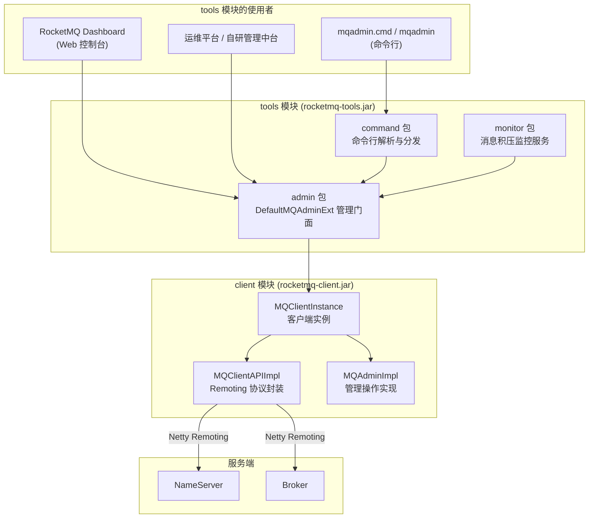
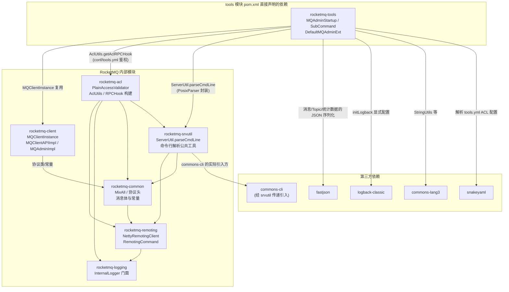
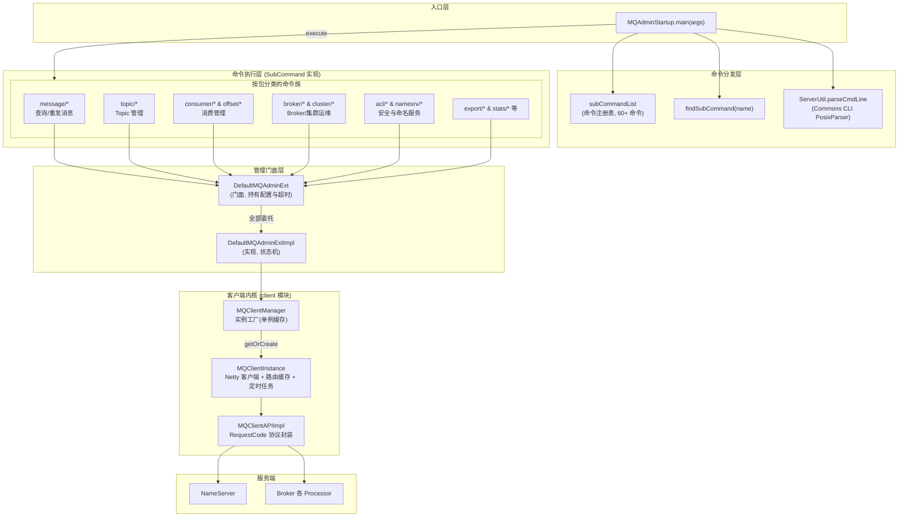
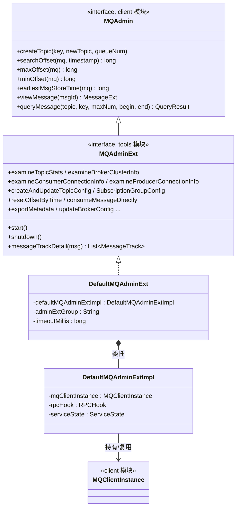
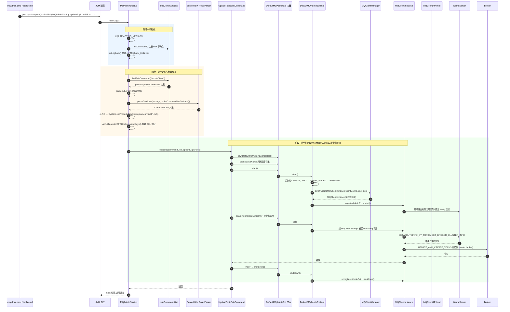
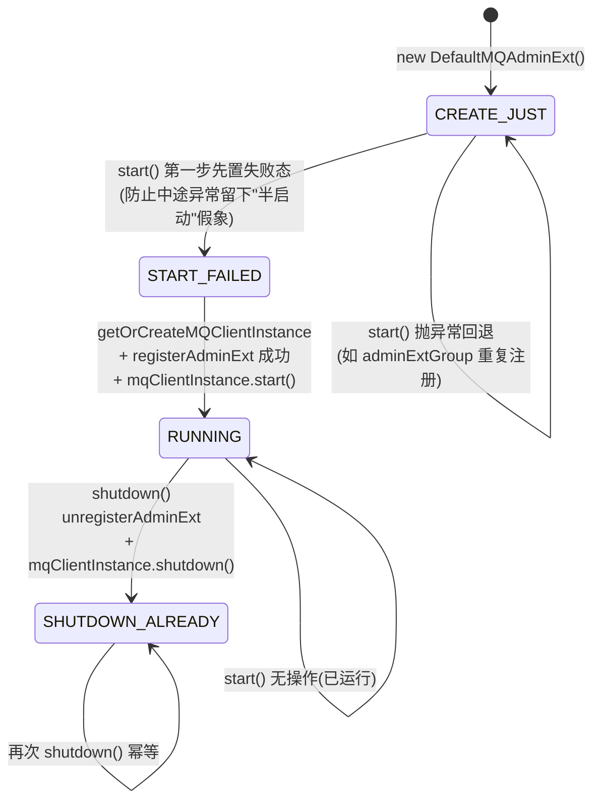
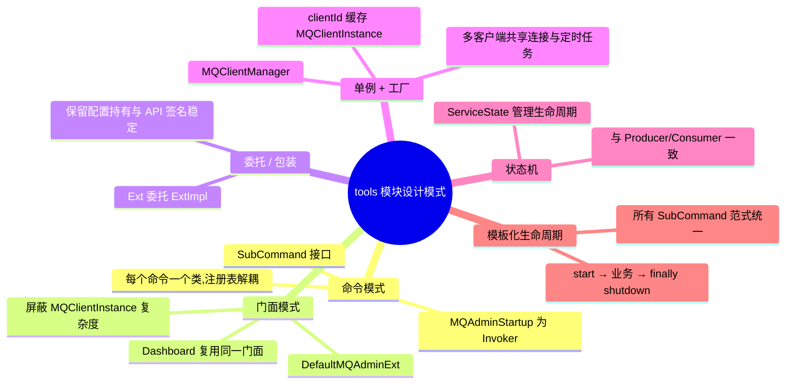

# RocketMQ tools 模块源码深度剖析

> 基于 RocketMQ 4.9.8 源码,深入分析 `tools` 模块(`rocketmq-tools.jar`)的整体设计、架构分层与命令执行流程。该模块是 mqadmin 命令行工具与 Dashboard 控制台的共同底层。

---

## 目录

1. [模块定位与依赖关系](#1-模块定位与依赖关系)
2. [包结构与职责划分](#2-包结构与职责划分)
3. [整体架构](#3-整体架构)
4. [核心抽象设计](#4-核心抽象设计)
5. [命令执行完整流程](#5-命令执行完整流程)
6. [DefaultMQAdminExt 生命周期状态机](#6-defaultmqadminext-生命周期状态机)
7. [命令分类全景](#7-命令分类全景)
8. [设计模式分析](#8-设计模式分析)
9. [ACL 安全集成](#9-acl-安全集成)
10. [monitor 监控子系统](#10-monitor-监控子系统)
11. [关键源码索引](#11-关键源码索引)

---

## 1. 模块定位与依赖关系

`tools` 模块在 RocketMQ 客户端生态中处于**最上层**的位置——它不实现任何网络协议和通信细节,而是把 `client` 模块的能力组装成"运维管理 API + 命令行工具"两种形态:



**Maven 依赖方向**:tools → client → (common, remoting)。tools 对 store/broker 模块仅保留编译期依赖用于个别工具类(如 `QueryConsumeQueueCommand` 使用的常量),运行时通过 `lib/*` 通配 classpath 加载全部 jar。

### 1.1 Maven 模块依赖关系图

以下依赖关系逐一核对自 4.9.8 各模块的 `pom.xml` 声明(非传递依赖):



各直接依赖在 tools 模块中的**具体用途**(对应源码):

| 依赖 | 用途 |
|---|---|
| rocketmq-client | AdminExt 底层复用 `MQClientInstance`/`MQClientAPIImpl`;消息查询走 `MQAdminImpl` |
| rocketmq-acl | `AclUtils.getAclRPCHook()` 读取 `conf/tools.yml` 构建 ACL 钩子;`PlainAccessConfig` 用于 ACL 管理命令 |
| rocketmq-srvutil | `ServerUtil.parseCmdLine()` / `buildCommandlineOptions()` 封装 commons-cli 解析;`PrintUtil` 结果格式化 |
| fastjson | ClusterInfo、TopicStatsTable 等 body 的 JSON 编解码 |
| logback-classic | `initLogback()` 用 JoranConfigurator 加载 `conf/logback_tools.xml` |
| commons-lang3 | `StringUtils.split(msgIds, ",")` 等字符串处理 |
| snakeyaml | 解析 `tools.yml` 中的 ACL 账户配置 |

> 注意 `rocketmq-srvutil` 是一个极小的"胶水"模块,commons-cli 实际由它引入(tools 的 pom 中并未直接声明 commons-cli);`common → remoting` 是 4.9.x 的既有声明(remoting 自身只依赖 logging),与直觉的"remoting 依赖 common"方向相反,属于历史分层遗留。

## 2. 包结构与职责划分

```
org.apache.rocketmq.tools
├── admin/                          ← 管理门面层(核心)
│   ├── MQAdminExt.java             管理接口:继承 client 模块的 MQAdmin,扩展 40+ 运维方法
│   ├── DefaultMQAdminExt.java      门面实现:继承 ClientConfig,委托给 Impl
│   ├── DefaultMQAdminExtImpl.java  真正实现:持有 MQClientInstance,状态机管理生命周期
│   └── api/
│       ├── MessageTrack.java       消息轨迹(消费组是否消费)
│       └── TrackType.java          轨迹类型枚举(CONSUMED / NOT_CONSUMED / UNKNOWN)
│
├── command/                        ← 命令行层
│   ├── MQAdminStartup.java         main 入口:命令注册表 + 分发器
│   ├── SubCommand.java             命令接口(命令模式核心抽象)
│   ├── SubCommandException.java    命令执行异常包装
│   ├── CommandUtil.java            命令公共工具:按集群名找 master/slave 地址
│   ├── message/                    消息查询、重发、直接消费、按队列打印
│   ├── topic/                      Topic 增删改、路由/状态查询、权限
│   ├── broker/                     Broker 配置/状态/清理类命令
│   ├── consumer/                   消费组/订阅组管理、消费状态
│   ├── connection/                 生产者/消费者连接查询
│   ├── offset/                     位点重置、克隆、跳过堆积
│   ├── cluster/                    集群列表、发送 RT 检测
│   ├── namesrv/                    NameServer 配置与 KV 管理
│   ├── acl/                        ACL 访问控制管理
│   ├── queue/                      ConsumeQueue 内容查询
│   ├── stats/                      全量统计
│   ├── producer/                   生产者状态查询
│   └── export/                     元数据/配置/指标导出
│
└── monitor/                        ← 监控子系统
    ├── MonitorService.java         后台监控服务(独立于命令行)
    ├── MonitorConfig.java
    ├── MonitorListener.java / DefaultMonitorListener.java
    └── UndoneMsgs / FailedMsgs / DeleteMsgsEvent   监控数据模型
```

**三层职责一目了然**:`command`(CLI 解析分发)→ `admin`(运维 API 门面)→ client 模块(通信实现)。`monitor` 是基于 admin API 构建的独立增值组件。

## 3. 整体架构



## 4. 核心抽象设计

### 4.1 SubCommand 接口——命令模式

`command/SubCommand.java`,仅 5 个方法,是所有 60+ 命令的统一抽象:

```java
public interface SubCommand {
    String commandName();                                          // 命令名,如 "queryMsgById"
    default String commandAlias() { return null; }                 // 可选别名
    String commandDesc();                                          // 帮助描述
    Options buildCommandlineOptions(final Options options);        // 声明命令行选项(commons-cli)
    void execute(CommandLine commandLine, Options options, RPCHook rpcHook) throws SubCommandException;
}
```

**设计要点**:

- `buildCommandlineOptions` 是**选项声明与解析框架的解耦点**——每个命令自己声明支持哪些参数(`-t`、`-i` 必填等),解析由框架统一完成;
- `execute` 的入参是解析后的 `CommandLine`,命令实现不关心原始字符串;
- `commandAlias` 用 default 方法(Java 8)保证向后兼容,新命令可不实现。

### 4.2 MQAdminExt 接口体系——门面与继承分层

管理 API 接口分为两层:



**分层逻辑**:

- **`MQAdmin`(client 模块)**:只定义"消息视角"的通用管理能力(查消息、查位点),任何客户端(Producer/Consumer/Admin)都可能用到;
- **`MQAdminExt`(tools 模块)**:扩展出"运维视角"的重型能力——集群拓扑查询、Topic/订阅组配置管理、位点重置、消费轨迹、指标导出,共 40+ 方法,并增加了 `start()/shutdown()` 生命周期;
- **`DefaultMQAdminExt`**:纯门面,持有 `adminExtGroup`、`timeoutMillis` 配置,所有方法一行委托给 Impl。它还继承 `ClientConfig`,因此自动获得 `namesrvAddr`、`instanceName` 等客户端公共配置(这正是 `-n` 参数通过系统属性 `rocketmq.namesrv.addr` 生效的机制);
- **`DefaultMQAdminExtImpl`**:真正实现,持有 `MQClientInstance` 与状态机。

### 4.3 与客户端内核的复用关系

`DefaultMQAdminExtImpl.start()`(DefaultMQAdminExtImpl.java:131)的关键代码:

```java
this.defaultMQAdminExt.changeInstanceNameToPID();          // instanceName 改为 PID
this.mqClientInstance = MQClientManager.getInstance()      // 单例工厂
    .getOrCreateMQClientInstance(this.defaultMQAdminExt, rpcHook);
mqClientInstance.registerAdminExt(adminExtGroup, this);    // 注册 adminExt 组
mqClientInstance.start();                                  // 复用 MQClientInstance 全部基础设施
```

这意味着 **AdminExt 与 Producer/Consumer 共享同一套客户端基础设施**:Netty 连接池、路由定时刷新(`updateTopicRouteInfoFromNameServer`)、`MQClientAPIImpl` 协议封装。同一个 JVM 内相同 clientId 的多个客户端会复用同一个 `MQClientInstance`(Dashboard 常驻进程正是靠这个机制复用连接)。

## 5. 命令执行完整流程

### 5.1 总体时序图:mqadmin 任意命令的执行

以 `mqadmin.cmd updateTopic -n NS -c DefaultCluster -t TopicA -r 8 -w 8` 为例:



### 5.2 命令执行的代码骨架(几乎所有 SubCommand 的固定范式)

```java
public void execute(CommandLine commandLine, Options options, RPCHook rpcHook) throws SubCommandException {
    DefaultMQAdminExt admin = new DefaultMQAdminExt(rpcHook);
    admin.setInstanceName(Long.toString(System.currentTimeMillis())); // ① 唯一实例名
    try {
        admin.start();                                                // ② 启动
        // ... ③ 业务逻辑:admin.xxx() 若干次
    } catch (Exception e) {
        throw new SubCommandException(this.getClass().getSimpleName() + " command failed", e);
    } finally {
        admin.shutdown();                                             // ④ 释放
    }
}
```

**为什么 `setInstanceName(时间戳)`?** `MQClientManager` 以 `clientId = ip@instanceName` 为 key 缓存 `MQClientInstance`。CLI 场景下同机可能有多个 mqadmin 进程(甚至同一进程内多条命令),用时间戳强制唯一,避免复用他人实例导致 shutdown 时误伤;同时 `DefaultMQAdminExtImpl.start()` 中的 `changeInstanceNameToPID()` 兜底保证 instanceName 非空。这是**一次性进程**与**Dashboard 常驻复用**两种用法的关键差异点。

### 5.3 参数解析细节

- 框架级公共选项由 `ServerUtil.buildCommandlineOptions()` 提供(如 `-n` namesrv);
- 命令级选项由各命令 `buildCommandlineOptions()` 追加(如 updateTopic 的 `-c/-t/-r/-w/-p`);
- `PosixParser` 解析失败(缺必填项)时框架自动打印该命令的用法并 `return`(commandLine 为 null),不抛异常;
- 解析成功后 **`-n` 被转化为系统属性**(MQAdminStartup.java:143-146),后续 `ClientConfig.getNamesrvAddr()` 读取顺序为:系统属性 `rocketmq.namesrv.addr` > 环境变量 `NAMESRV_ADDR` > `-n` 之外无默认——因此 `-n` 不传且无环境变量时命令会失败。

### 5.4 典型命令族的执行差异

| 命令族 | 典型命令 | AdminExt 用法特点 |
|---|---|---|
| message/ | queryMsgById / queryMsgByKey | 只读查询;queryMsgById 末尾追加 `messageTrackDetail`(需遍历全部 broker) |
| message/ | sendMessage / consumeMessage / ConsumeMessageCommand | 除 AdminExt 外**额外创建 DefaultMQProducer / DefaultMQPushConsumer**(如 QueryMsgByIdSubCommand 中 `-s` 重发功能创建 `ReSendMsgById` 生产者组) |
| topic/ | updateTopic | 写操作:先 `examineBrokerClusterInfo` 定位 master,再逐台 `createAndUpdateTopicConfig` |
| broker/ | updateBrokerConfig | 写操作:经 `CommandUtil.fetchMasterAddrByClusterName` 找到目标 broker,逐台更新 |
| offset/ | resetOffsetByTime | 涉及 consumer 连接,需与在线客户端交互 |
| export/ | exportMetadata | 全量拉取,数据量大时逐 broker 分页 |

## 6. DefaultMQAdminExt 生命周期状态机

`DefaultMQAdminExtImpl` 用 `ServiceState` 枚举(CREATE_JUST / RUNNING / START_FAILED / SHUTDOWN_ALREADY)管理生命周期,与 Producer/Consumer 的状态机模式完全一致:



**两个防御性细节**:

1. `start()` 先把状态置为 `START_FAILED` 再初始化——若初始化中途抛异常,对象不会停留在 CREATE_JUST 被误以为可用;
2. `registerAdminExt` 失败(同组名已注册)会回退状态并抛 `MQClientException`,提示更换 `adminExtGroup`。

## 7. 命令分类全景

`MQAdminStartup.initCommand()`(159-233 行)集中注册全部命令,按包统计:

| 包 | 命令数 | 代表命令 | 主要调用的 AdminExt API |
|---|---|---|---|
| topic/ | 11 | updateTopic、deleteTopic、topicList、topicRoute、topicStatus、allocateMQ | createAndUpdateTopicConfig、examineTopicRouteInfo、examineTopicListInfo |
| message/ | 10 | queryMsgById/ByKey/ByOffset/ByUniqueKey、printMsg、sendMessage、consumeMessage | viewMessage、queryMessage、consumeMessageDirectly |
| broker/ | 8 | updateBrokerConfig、brokerStatus、getBrokerConfig、cleanExpiredCQ、deleteExpiredCommitLog | updateBrokerConfig、getBrokerConfig、getBrokerRuntimeInfo |
| consumer/ + connection/ | 12 | consumerProgress、consumerStatus、updateSubGroup、consumerConnection | examineConsumeStats、createAndUpdateSubscriptionGroupConfig、examineConsumerConnectionInfo |
| offset/ | 4 | resetOffsetByTime、cloneGroupOffset、skipAccumulation | resetOffsetByTime、getConsumeStatus |
| acl/ | 4 | updateAccessConfig、deleteAccessConfig、updateGlobalWhiteAddr | createAndUpdatePlainAccessConfig 等 ACL 系列接口 |
| namesrv/ | 6 | getNamesrvConfig、updateNamesrvConfig、wipeWritePerm | getKVConfig / updateKVConfig(直连 NameServer) |
| cluster/ + stats/ + queue/ + producer/ + export/ | 8 | clusterList、statsAll、queryConsumeQueue、exportMetadata | examineBrokerClusterInfo、exportAllConfigs 等 |

> 帮助入口:`mqadmin`(无参)打印全部命令列表;`mqadmin help queryMsgById` 打印单命令用法(依赖 `main0` 中 `case 2` 分支,见 MQAdminStartup.java:115-128)。

## 8. 设计模式分析



逐条展开:

1. **命令模式(核心)**:`MQAdminStartup` 是 Invoker,`SubCommand` 是抽象命令,60+ 实现类是具体命令,`CommandLine` 参数对象是请求载体。新增命令只需"实现接口 + 一行注册",分发器零改动——对扩展开放;
2. **门面模式**:`DefaultMQAdminExt` 把"路由获取 → 定位 broker → 发送协议命令 → 解析响应"的复杂编排收敛为单方法调用(如 `examineBrokerClusterInfo()` 内部组装完整拓扑),Dashboard 才能以极薄的服务层直接复用;
3. **委托/包装**:`DefaultMQAdminExt`(持有配置、暴露 API)与 `DefaultMQAdminExtImpl`(持有运行时状态)分离,外部只见门面;4.9.x 中 Impl 标记 `@Deprecated` 但仍是实际实现,体现过渡期 API 兼容策略;
4. **单例 + 缓存工厂**:`MQClientManager.getInstance()` 按 `clientId`(ip@instanceName)缓存 `MQClientInstance`,AdminExt、Producer、Consumer 同 JVM 共享 Netty 客户端、路由缓存与心跳任务;
5. **状态机**:见第 6 节,保证 start/shutdown 的幂等与并发安全语义;
6. **模板化生命周期**:每个 SubCommand 的 `execute` 都遵循 `new → setInstanceName → start → 业务 → finally shutdown` 范式(个别命令还会额外启 Producer/Consumer),一致性强,排查问题有固定套路。

## 9. ACL 安全集成

命令分发前的最后一环(MQAdminStartup.java:148):

```java
cmd.execute(commandLine, options,
    AclUtils.getAclRPCHook(rocketmqHome + MixAll.ACL_TOOLS_CONF_FILE));  // conf/tools.yml
```

- `conf/tools.yml`(不存在则 rpcHook 为 null,即关闭 ACL)中配置 accessKey/secretKey;
- `RPCHook` 会被透传到 `MQClientInstance` 的 Netty Bootstrap pipeline,在每条 RemotingCommand 上追加签名字段;
- 服务端 broker 的 `PlainAccessValidator` 校验签名与权限——写操作类命令(updateTopic 等)需要对应 WRITE 权限的 AK;
- `rocketmqHome` 的取值顺序:`-Drocketmq.home.dir` 系统属性 > `ROCKETMQ_HOME` 环境变量,与 mqadmin.cmd 的前置检查呼应。

## 10. monitor 监控子系统

`monitor` 包是与命令行平行的子系统,`MonitorService` 実现了 `Runnable`:

- 用 `DefaultMonitorListener` 消费 `MonitorConfig` 指定的系统 Topic,统计 `UndoneMsgs`(未消费堆积)、`FailedMsgs`(消费失败);
- 与命令行的一次性执行不同,它是**常驻后台服务**(定时任务周期性调用 AdminExt 的 `examineConsumeStats` 等);
- `StartMonitoringSubCommand`(consumer/ 包)是其 CLI 启动入口;
- 该包是 Dashboard"消费进度/堆积告警"功能的思想原型。

## 11. 关键源码索引

| 功能 | 文件:行号/说明 |
|---|---|
| main 入口与分发 | `tools/.../command/MQAdminStartup.java:98-157`(main0)、`159-233`(initCommand)、`252-260`(findSubCommand) |
| help 子命令 | `MQAdminStartup.java:115-128`(case 2 分支) |
| `-n` 转系统属性 | `MQAdminStartup.java:143-146` |
| ACL 钩子构建 | `MQAdminStartup.java:148`、`AclUtils.getAclRPCHook` |
| 命令接口 | `tools/.../command/SubCommand.java`(全文 35 行) |
| AdminExt 生命周期 | `tools/.../admin/DefaultMQAdminExtImpl.java:131-164`(start)、`166-182`(shutdown) |
| 客户端实例复用 | `DefaultMQAdminExtImpl.java:136-148`(changeInstanceNameToPID / getOrCreate / registerAdminExt) |
| 系统组白名单 | `DefaultMQAdminExtImpl.java:102-118`(SYSTEM_GROUP_SET) |
| 门面委托示例 | `tools/.../admin/DefaultMQAdminExt.java:125-135`(viewMessage / queryMessage) |
| 集群地址工具 | `tools/.../command/CommandUtil.java:42-77` |
| 消息轨迹 API | `tools/.../admin/api/MessageTrack.java`、`TrackType.java` |
| 命令范式范例 | `QueryMsgByIdSubCommand.java:208-258`(含额外的 Producer 生命周期) |
| 监控服务 | `tools/.../monitor/MonitorService.java` |
