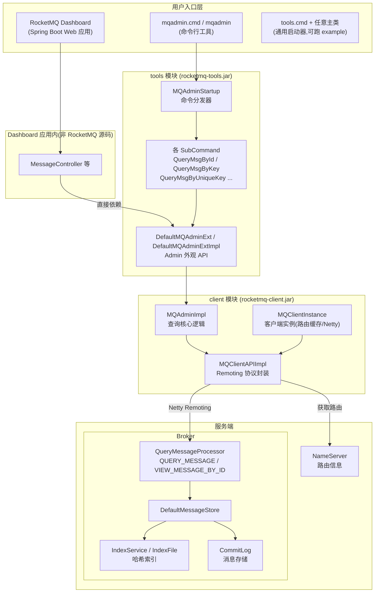
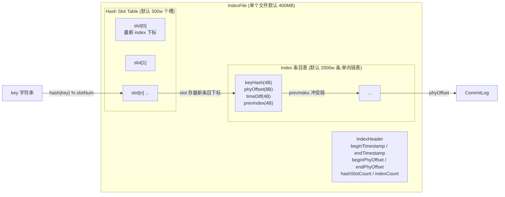
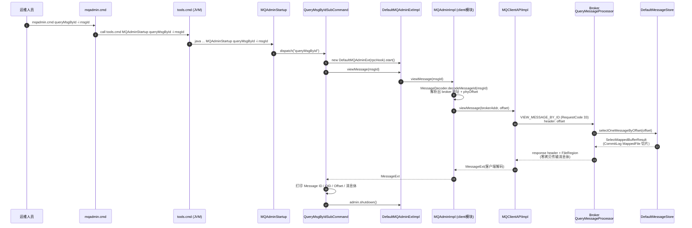
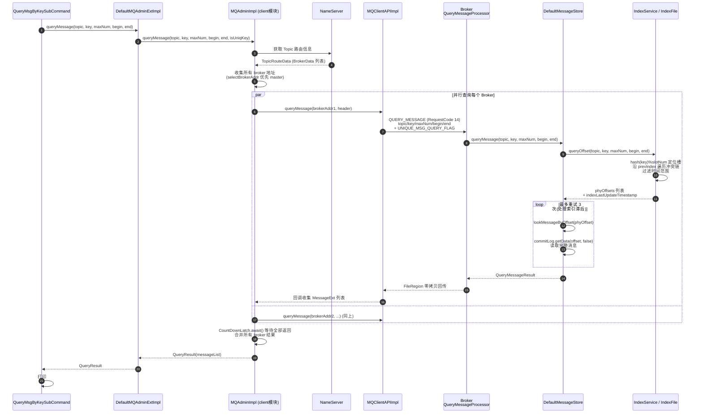
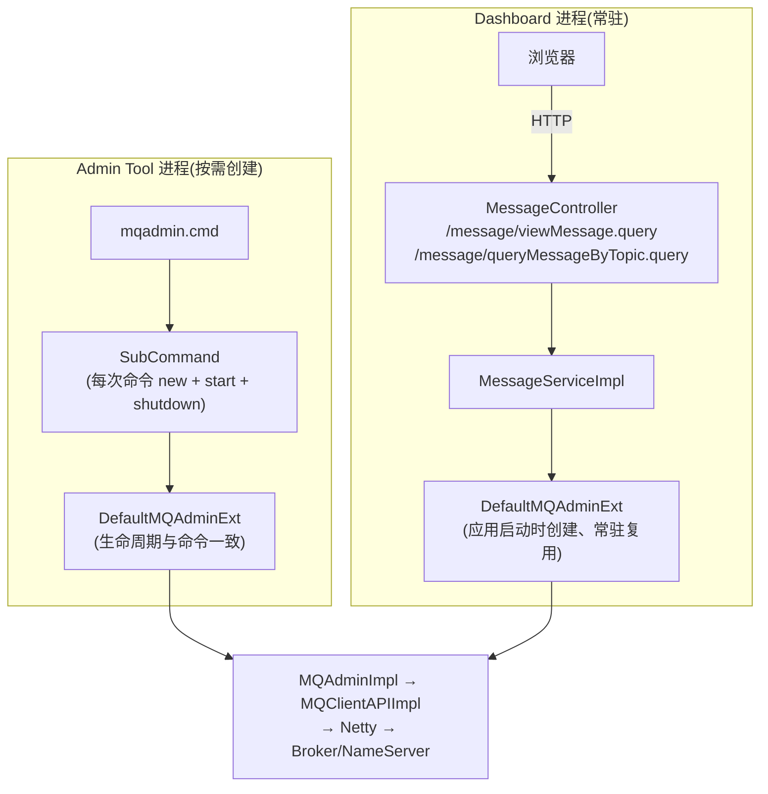
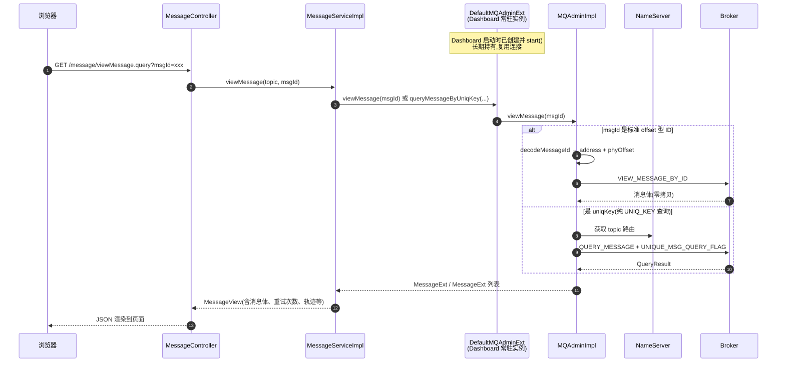
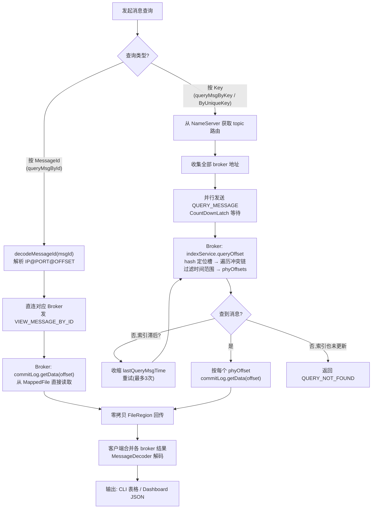
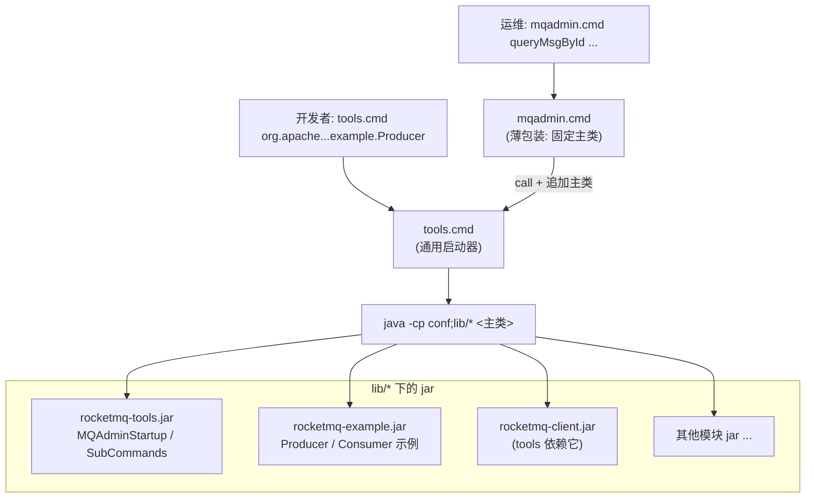
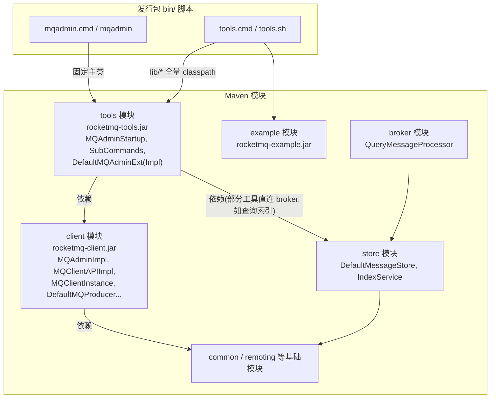

# RocketMQ 消息查询深度剖析

> 基于 RocketMQ 4.9.8 源码分析:消息查询的原理与流程、Dashboard 控制台查询与 Admin Tool 查询的对比、`tools.cmd` 与 `mqadmin.cmd` 脚本的区别、tools/client 模块与脚本的映射关系。

---

## 目录

1. [总体架构](#1-总体架构)
2. [消息查询的底层原理](#2-消息查询的底层原理)
3. [Admin Tool 查询流程(mqadmin)](#3-admin-tool-查询流程mqadmin)
4. [Dashboard 控制台查询流程](#4-dashboard-控制台查询流程)
5. [两种查询方式的对比](#5-两种查询方式的对比)
6. [tools.cmd 与 mqadmin.cmd 的区别](#6-toolscmd-与-mqadmincmd-的区别)
7. [模块与脚本的映射关系](#7-模块与脚本的映射关系)
8. [关键源码索引](#8-关键源码索引)

---

## 1. 总体架构

无论是 Dashboard 控制台还是 Admin Tool,本质上都是 **RocketMQ 客户端**,都通过同一套客户端内核(`MQClientInstance` / `MQClientAPIImpl`)与 NameServer、Broker 通信。Broker 端由 `QueryMessageProcessor` 统一处理查询请求,底层依赖 **IndexFile 索引文件** 与 **CommitLog**。



**核心结论:Dashboard 与 mqadmin 在客户端底层走的是完全相同的代码路径**(`DefaultMQAdminExtImpl` → `MQAdminImpl` → `MQClientAPIImpl`),区别只在最外层的入口形态(Web 页面 vs 命令行)。

---

## 2. 消息查询的底层原理

### 2.1 两种查询维度

| 查询方式 | 输入 | 依赖的存储结构 | 复杂度 | RequestCode |
|---|---|---|---|---|
| **按 MessageId 查(View)** | `ip@port@phyOffset` | CommitLog 直接定位 | O(1) | `VIEW_MESSAGE_BY_ID (33)` |
| **按 Key/UniqueKey 查(Query)** | topic + key + 时间范围 | IndexFile 哈希索引 + CommitLog | hash 查找 + 冲突链遍历 | `QUERY_MESSAGE (14)` |

### 2.2 MessageId 的结构

MessageId 由客户端在发送时生成(`MessageClientIDSetter`),格式为 `IP@PORT@物理偏移量`。**最后一段就是消息写入 CommitLog 后的全局物理偏移量**,因此按 Id 查询根本不需要索引:

```
7F000001@1F90@000000000000000000C8
   │      │            │
   │      │            └── phyOffset (CommitLog 全局偏移量)
   │      └── broker 端口
   └── broker IP(发送该消息时所在的 broker 地址)
```

客户端解析逻辑(`MQAdminImpl.viewMessage`, MQAdminImpl.java:258):

```java
messageId = MessageDecoder.decodeMessageId(msgId);          // 解析出 address + offset
api.viewMessage(socketAddress2String(messageId.getAddress()),
                messageId.getOffset(), timeoutMillis);       // 直连该 broker 按 offset 读取
```

### 2.3 IndexFile 哈希索引结构

按 Key 查询依赖 broker 端构建的索引文件。消息写入 CommitLog 后,`ReputMessageService`(异步 reput 线程)会为每条消息的 `UNIQ_KEY` 和用户 keys 各建一条索引:



查询流程(`IndexService.queryOffset`):

1. 对 key 计算 `hash(key) % slotCount` 定位到槽;
2. 取槽中最新 index 条目下标,沿 `prevIndex` 指针**逆向遍历链表**(新消息在前);
3. 校验 `keyHash` 一致 + `storeTime` 在 `[begin, end]` 范围内,收集对应的 `phyOffset`;
4. 槽中记录的 `indexLastUpdateTimestamp` 若早于查询起始时间,说明**索引构建滞后**,需重试。

### 2.4 Broker 端消息回传:PageCache + 零拷贝

Broker 查到消息后不反序列化,而是把 CommitLog 的 MappedFile 缓冲区包装成 Netty `FileRegion`,通过 **sendfile 零拷贝**直接写回网络(QueryMessageProcessor.java:101):

```java
FileRegion fileRegion = new QueryMessageTransfer(
    response.encodeHeader(queryMessageResult.getBufferTotalSize()),
    queryMessageResult);
ctx.channel().writeAndFlush(fileRegion);
```

---

## 3. Admin Tool 查询流程(mqadmin)

### 3.1 命令入口链

```
mqadmin.cmd queryMsgById -i <msgId>
        │
        └─ call tools.cmd org.apache.rocketmq.tools.command.MQAdminStartup queryMsgById -i <msgId>
                │
                └─ MQAdminStartup.main()
                     ├─ initCommand(): 注册全部 SubCommand
                     ├─ 解析第一个参数 → 找到 QueryMsgByIdSubCommand
                     └─ subCommand.execute(commandLine, options, rpcHook)
                          └─ DefaultMQAdminExt.start() → 发起查询 → shutdown()
```

`QueryMsgByKeySubCommand.execute`(QueryMsgByKeySubCommand.java:56)的典型模式:

```java
DefaultMQAdminExt admin = new DefaultMQAdminExt(rpcHook);
admin.setInstanceName(Long.toString(System.currentTimeMillis())); // 避免实例名冲突
admin.start();
QueryResult queryResult = admin.queryMessage(topic, key, 64, 0, Long.MAX_VALUE);
admin.shutdown();
```

### 3.2 时序图:queryMsgById(按 MessageId 查询)



### 3.3 时序图:queryMsgByKey / queryMsgByUniqueKey(按 Key 查询)



### 3.4 关键源码逻辑:DefaultMessageStore.queryMessage

`DefaultMessageStore.queryMessage`(DefaultMessageStore.java:978):

```java
long lastQueryMsgTime = end;
for (int i = 0; i < 3; i++) {   // 最多 3 次,处理索引构建滞后
    QueryOffsetResult r = this.indexService.queryOffset(topic, key, maxNum, begin, lastQueryMsgTime);
    if (r.getPhyOffsets().isEmpty()) break;

    for (int m = 0; m < r.getPhyOffsets().size(); m++) {
        long offset = r.getPhyOffsets().get(m);
        MessageExt msg = this.lookMessageByOffset(offset);
        if (0 == m) lastQueryMsgTime = msg.getStoreTimestamp();  // 逐步收缩时间上界
        SelectMappedBufferResult result = this.commitLog.getData(offset, false);
        queryMessageResult.addMessage(result);
    }
    if (queryMessageResult.getBufferTotalSize() > 0) break;
    if (lastQueryMsgTime < begin) break;
}
```

**为什么要重试?** IndexFile 由 reput 线程异步构建,若消息刚写入还没建索引,第一次查不到;通过 `indexLastUpdateTimestamp` 判断索引落后程度,收缩 `lastQueryMsgTime` 后再查。

### 3.5 queryMsgByUniqueKey 的特殊之处

UNIQ_KEY 本质也是走 IndexFile 查询,但有两个增强(DefaultMQAdminExtImpl.java:1126、MQAdminImpl.java:283):

- 客户端通过 `MessageClientIDSetter.getNearlyTimeFromID(uniqKey)` 从 uniqKey 中**反推出消息的大致生成时间**(uniqKey 内嵌时间戳),从而自动推算 begin 时间,用户无需手动指定时间范围;
- Broker 端检测到 `UNIQUE_MSG_QUERY_FLAG=true` 时,将 maxNum 强制改为 `defaultQueryMaxNum`(QueryMessageProcessor.java:82),因为 uniqKey 逻辑上只对应一条消息。

---

## 4. Dashboard 控制台查询流程

RocketMQ Dashboard(原 rocketmq-console,独立的 Spring Boot 项目)是**长期运行的 Web 服务**,内部直接引入 `rocketmq-tools` 依赖,通过 `DefaultMQAdminExt` 与集群交互。

### 4.1 与 Admin Tool 的架构差异



### 4.2 Dashboard 查询消息的时序图



> 注:Dashboard 按 Topic + 时间范围浏览消息(`queryMessageByTopic`)走的是另一条路径——先 `searchOffset(mq, timestamp)` 按时间定位每个队列的起始 offset,再调用 `QUERY_CONSUMER_TIME_SPAN` / `pullMessage` 拉取,而不是走 IndexFile。这是"按 Topic 浏览"与"按 Key 查询"的本质区别。

### 4.3 Dashboard 与 Admin Tool 的本质对比

| 维度 | Dashboard | Admin Tool (mqadmin) |
|---|---|---|
| 形态 | 常驻 Web 服务 | 按需执行的一次性进程 |
| 依赖方式 | Maven 依赖 `rocketmq-tools` jar | 发行包 `lib/*` 全量 jar |
| AdminExt 生命周期 | 启动时创建、全局复用(连接池复用) | 每条命令 `new → start → 用完 shutdown` |
| 查询入口 API | `MessageService.viewMessage / queryMessageByTopic` | `QueryMsgByIdSubCommand` 等 SubCommand |
| 客户端底层 | **完全相同**:`DefaultMQAdminExtImpl → MQAdminImpl → MQClientAPIImpl` | **完全相同** |
| 认证 | 集中配置 ACL(rpcHook 全局注入) | 每次命令 `-u/-p` 或 `tools.yml`/`admin.properties` |
| 输出 | JSON → 页面渲染,可看轨迹、重试次数 | stdout 表格/文本 |

---

## 5. 两种查询方式的对比

从**查询语义**维度(与入口无关,Dashboard 和 mqadmin 都支持这两种语义):

| | 按 MessageId | 按 Key / UniqueKey |
|---|---|---|
| 底层协议 | `VIEW_MESSAGE_BY_ID` | `QUERY_MESSAGE` |
| 目标 broker | 由 msgId 内嵌地址直接决定 | 从 NameServer 路由获取,并行查所有 broker |
| 是否需要索引 | 否,CommitLog O(1) 定位 | 是,依赖 IndexFile(`messageIndexEnable=true`) |
| 时间范围 | 不需要 | 需要(默认 0 ~ Long.MAX) |
| 索引滞后处理 | 不存在 | 最多重试 3 次,逐步收缩 lastQueryMsgTime |
| 查不到的常见原因 | CommitLog 文件已被删除(过期清理) | 索引文件过期删除 / keys 未设置 / 时间范围错误 / broker 未建索引 |



---

## 6. tools.cmd 与 mqadmin.cmd 的区别

### 6.1 脚本内容对照

**tools.cmd(distribution/bin/tools.cmd)— 通用 Java 启动器:**

```bat
set CLASSPATH=.;%BASE_DIR%conf;%BASE_DIR%lib\*;%CLASSPATH%     REM 加载所有 jar
set "JAVA_OPT=%JAVA_OPT% -server -Xms1g -Xmx1g -Xmn256m ..."    REM JVM 参数在这里
"%JAVA%" %JAVA_OPT% %*                                          REM 第一个参数 = 主类名
```

**mqadmin.cmd(distribution/bin/mqadmin.cmd)— mqadmin 专用包装:**

```bat
if not exist "%ROCKETMQ_HOME%\bin\tools.cmd" echo Please set the ROCKETMQ_HOME ... & EXIT /B 1
call "%ROCKETMQ_HOME%\bin\tools.cmd" org.apache.rocketmq.tools.command.MQAdminStartup %*
```

### 6.2 关系图



### 6.3 对比表

| | tools.cmd | mqadmin.cmd |
|---|---|---|
| 定位 | 通用启动器 | mqadmin CLI 专用入口 |
| 是否指定主类 | 否,由调用者第一个参数传入 | 固定 `org.apache.rocketmq.tools.command.MQAdminStartup` |
| JVM/Classpath 配置 | 在本脚本(`-Xms1g -Xmx1g -Xmn256m`) | 无,复用 tools.cmd |
| 前置检查 | 检查 `JAVA_HOME` | 检查 `ROCKETMQ_HOME` |
| 可运行的类 | lib 下所有 jar 的任意 main 类(含 example、tools) | 仅 mqadmin 子命令 |
| 典型用法 | `tools.cmd org.apache.rocketmq.example.quickstart.Producer` | `mqadmin.cmd queryMsgById -i xxx` |

**实践要点**:

- 修改 mqadmin 的堆内存,要改 **tools.cmd**(Linux 下为 `tools.sh`),改 mqadmin.cmd/mqadmin 无效;
- Linux 下结构完全对应:`mqadmin` shell 脚本内部 `sh ${ROCKETMQ_HOME}/bin/tools.sh org.apache.rocketmq.tools.command.MQAdminStartup "$@"`;
- 等价关系:`mqadmin.cmd queryMsgById -i x` ≡ `tools.cmd org.apache.rocketmq.tools.command.MQAdminStartup queryMsgById -i x`。

---

## 7. 模块与脚本的映射关系

### 7.1 Maven 模块依赖图



### 7.2 职责划分

| 模块 | jar | 职责 | 对应脚本 |
|---|---|---|---|
| **tools** | rocketmq-tools.jar | mqadmin 命令解析与分发(`MQAdminStartup`)、Admin 外观 API(`DefaultMQAdminExt`,基于 `@Deprecated` 内部实现类包装) | **mqadmin.cmd 的直接载体**;也被 tools.cmd 加载 |
| **client** | rocketmq-client.jar | 客户端内核:路由获取与缓存、Netty 连接管理、`MQAdminImpl`(查询核心逻辑:decodeMessageId / queryMessage 并行扇出)、生产者/消费者 | 无直接脚本,是 tools 的传递依赖 |
| **example** | rocketmq-example.jar | 官方示例(Producer/Consumer 等) | 通过 tools.cmd 通用入口运行 |
| **broker / store** | — | 服务端:QueryMessageProcessor、IndexFile、CommitLog | 由 mqbroker.cmd 启动,不在客户端脚本范围 |

### 7.3 概念澄清

- "tools.cmd 对应 tools 模块" **不完全准确**——tools.cmd 的 classpath 是 `lib/*` 全量 jar,tools 模块只是它能加载的模块之一(名字确实源自最初为 tools 模块服务,但实际是**所有客户端工具类的公共入口**);
- tools 模块**依赖 client 模块**,消息查询的真正逻辑(`MQAdminImpl`)在 client 模块中,tools 模块只做"命令行解析 + Admin API 门面";
- Dashboard 同样依赖 tools 模块(`rocketmq-tools` 作为 Maven 依赖),所以 Dashboard、mqadmin、example 三者在客户端层面共享同一套 `DefaultMQAdminExt → MQAdminImpl → MQClientAPIImpl` 代码。

---

## 8. 关键源码索引

| 功能 | 文件:行号 |
|---|---|
| mqadmin 脚本包装 | `distribution/bin/mqadmin.cmd:18` |
| 通用启动器(JVM 参数/Classpath) | `distribution/bin/tools.cmd:26-34` |
| mqadmin 命令分发 | `tools/.../command/MQAdminStartup.java` |
| queryMsgByKey 子命令 | `tools/.../command/message/QueryMsgByKeySubCommand.java:56-85` |
| Admin API 门面 | `tools/.../admin/DefaultMQAdminExtImpl.java:1114-1130` |
| viewMessage(解析 msgId) | `client/.../impl/MQAdminImpl.java:258-269` |
| queryMessage(并行扇出所有 broker) | `client/.../impl/MQAdminImpl.java:295-347` |
| uniqKey 反推时间 | `client/.../impl/MQAdminImpl.java:283-293` |
| Broker 请求路由(QUERY_MESSAGE / VIEW_MESSAGE_BY_ID) | `broker/.../processor/QueryMessageProcessor.java:50-124` |
| UNIQUE_MSG_QUERY_FLAG 处理 | `broker/.../processor/QueryMessageProcessor.java:82-85` |
| 索引查询 + 3 次重试 | `store/.../DefaultMessageStore.java:978-1022` |
| IndexFile 哈希索引结构 | `store/.../index/IndexFile.java` / `IndexService.java` |
| 零拷贝回传(FileRegion) | `broker/.../pagecache/QueryMessageTransfer.java` |
