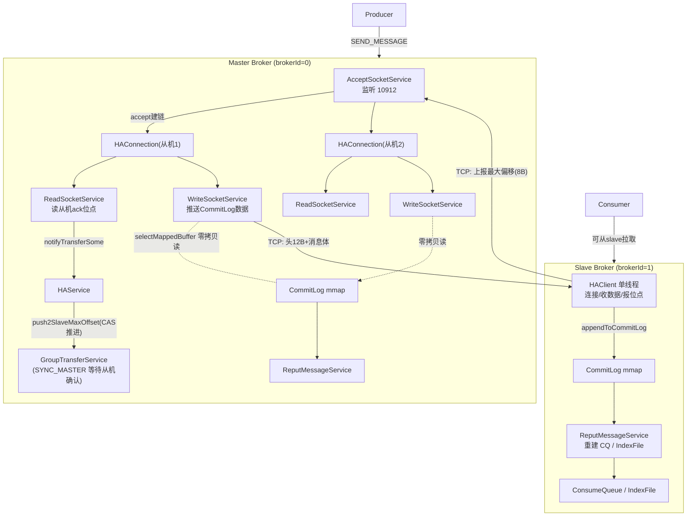
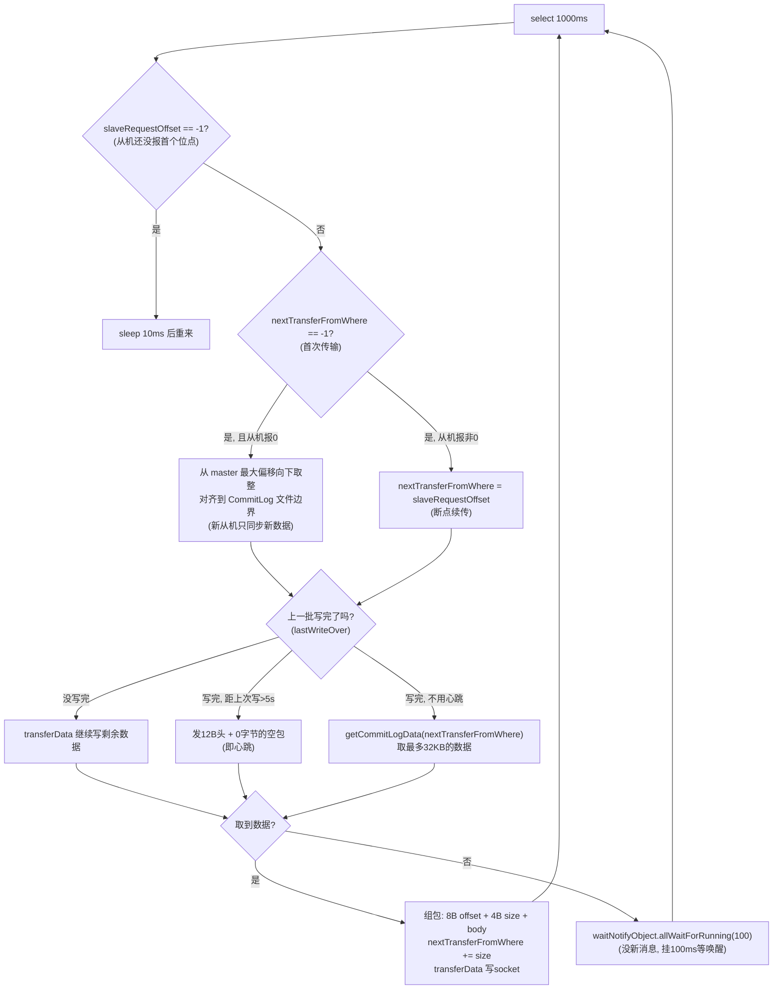
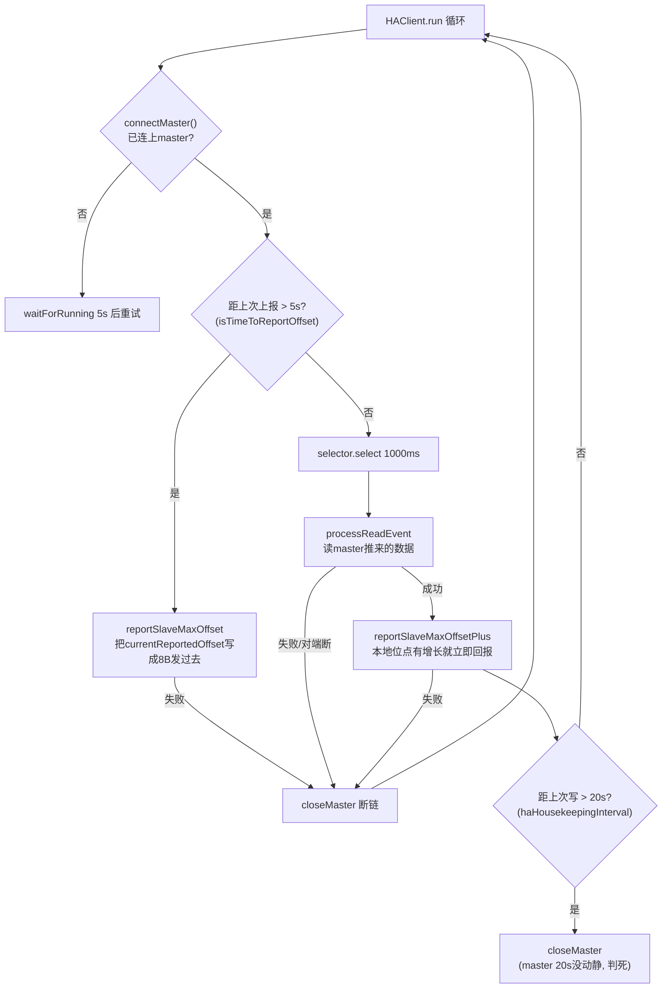
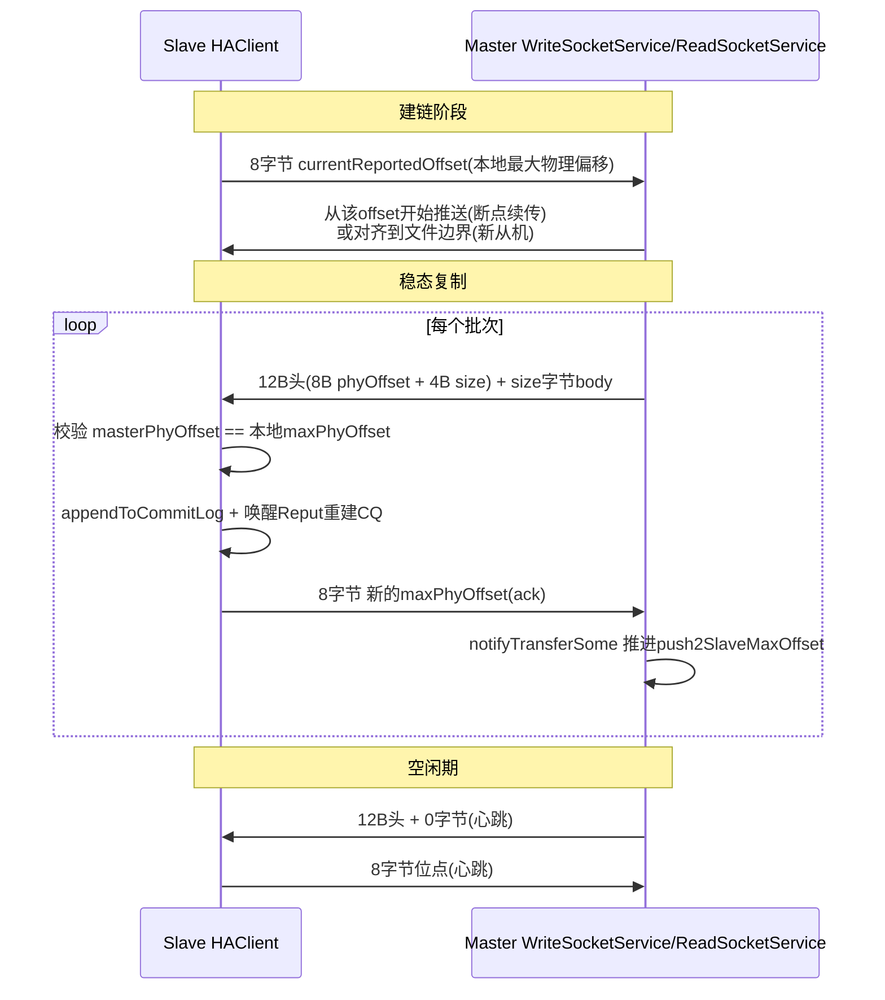
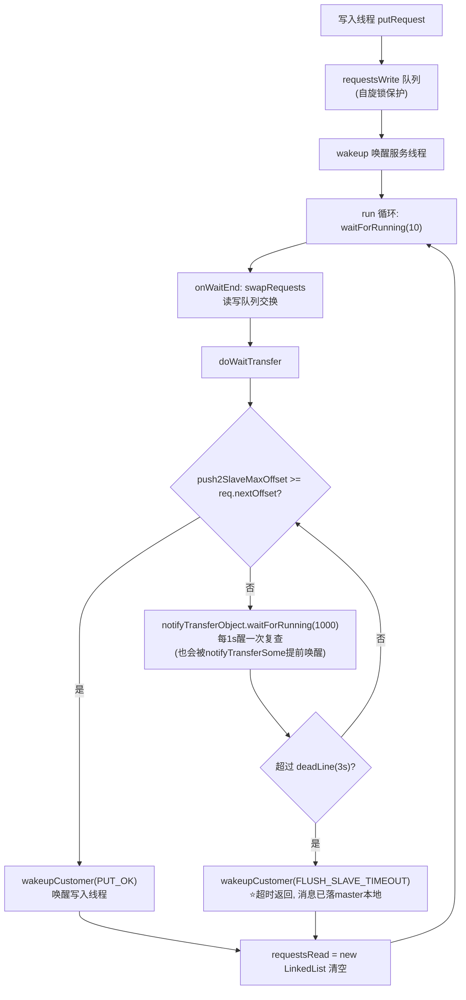
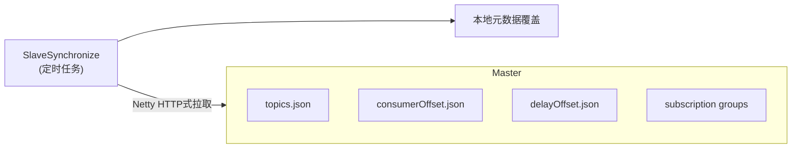
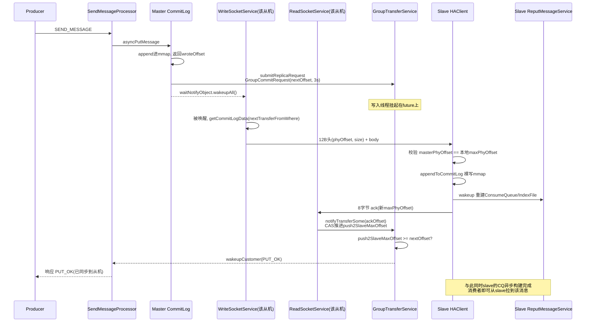

# RocketMQ 4.9.8 主从同步（HA）源码深度分析

> 源码基线：`store/src/main/java/org/apache/rocketmq/store/ha/`（HAService.java、HAConnection.java、WaitNotifyObject.java），辅以 `CommitLog.java`、`DefaultMessageStore.java`、`BrokerController.java`。
> 本文所有 mermaid 图节点文字含括号处均已加引号，图内不含代码行号；行号只出现在正文。

## 目录

1. [总体架构](#一总体架构)
2. [角色与配置](#二角色与配置)
3. [Master 端：HAService 与三个内部服务](#三master-端haService-与三个内部服务)
4. [Slave 端：HAClient 主循环](#四slave-端haclient-主循环)
5. [网络协议：主从到底传了什么](#五网络协议主从到底传了什么)
6. [SYNC_MASTER 写入路径：GroupTransferService](#六sync_master-写入路径grouptransferservice)
7. [数据一致性校验与容错](#七数据一致性校验与容错)
8. [Broker 元数据同步：SlaveSynchronize](#八broker-元数据同步slavesynchronize)
9. [全链路时序图](#九全链路时序图)
10. [设计分析与 FAQ](#十设计分析与-faq)

---

## 一、总体架构

RocketMQ 4.x 的主从复制是**基于原生 SocketChannel 的推送-拉取混合模型**：

- Master 上的 `AcceptSocketService` 监听 HA 端口（默认 10912 = listenPort + 1），每个 slave 连上来建一条 `HAConnection`；
- 一条 `HAConnection` 内部有**两个线程**：`ReadSocketService`（读 slave 上报的位点）+ `WriteSocketService`（把 CommitLog 数据推给 slave）；
- Slave 端的 `HAClient` 是**单线程**：连接 master、上报本地最大物理偏移、接收数据并**直接 append 进本地 CommitLog**；
- 复制的对象**只有 CommitLog**。ConsumeQueue/IndexFile 是 slave 收到数据后由本地 ReputMessageService 异步重建出来的。



关键认知：

- **HA 通道与业务通道完全隔离**：业务走 10911（Netty），复制走 10912（原生 NIO），互不影响；
- **位点双向流动**：slave 上报"我已同步到哪"（8 字节），master 推送"从某某偏移开始的数据"（12 字节头 + body）；
- **一切围绕 `push2SlaveMaxOffset`**：master 用这个 AtomicLong 记录"最落后的 slave 已确认到哪"，SYNC_MASTER 的写请求就是等它越过自己的 `nextOffset`。

---

## 二、角色与配置

`BrokerRole` 三态：`ASYNC_MASTER` / `SYNC_MASTER` / `SLAVE`。注意一个细节：**master 和 slave 都会启动 HAService**（`DefaultMessageStore.start()` 中 `haService.start()`），只是 slave 上 AcceptSocketService 通常没有 slave 来连；真正区分身份的是"有没有 HAClient 连上 master"。

相关配置（`MessageStoreConfig.java:124-136`）：

| 配置 | 默认值 | 说明 |
|---|---|---|
| `haListenPort` | 10912 | master HA 监听端口（listenPort+1） |
| `haMasterAddress` | null | slave 直连 master 的 HA 地址（可选） |
| `haSendHeartbeatInterval` | 5s | 双向"心跳"间隔：slave 报位点 / master 发空数据包 |
| `haHousekeepingInterval` | 20s | 双向超时踢链：20s 没读到数据就断开重连 |
| `haTransferBatchSize` | 32KB | master 单次推送的最大数据量 |
| `haSlaveFallbehindMax` | 256MB | 判定 slave"还活着且没掉太远"的落后阈值 |
| `slaveTimeout` | 3000ms | SYNC_MASTER 等待从机确认的超时（即"半同步"退化窗口） |

---

## 三、Master 端：HAService 与三个内部服务

`HAService`（HAService.java:44-68）字段一览：

```java
private final AtomicInteger connectionCount;      // 存活从机数
private final List<HAConnection> connectionList;  // 连接链表
private final AtomicLong push2SlaveMaxOffset;     // ⭐ 全局复制水位线
private final GroupTransferService groupTransferService;
private final HAClient haClient;                  // master上通常闲置
```

`start()`（HAService.java:109-114）依次拉起：`beginAccept()` 监听端口 -> AcceptSocketService 线程 -> GroupTransferService 线程 -> HAClient 线程。

### 3.1 AcceptSocketService：建链

纯 NIO accept 循环（HAService.java:201-240）：`selector.select(1000)` -> 收到 OP_ACCEPT 就 `new HAConnection(this, sc)` 并 `conn.start()`。**每个 slave 连接 = 一条 HAConnection = 两个新线程**，因此 master 的线程开销与从机数线性相关。

`HAConnection` 构造（HAConnection.java:43-59）会设置 `TcpNoDelay=true`、`SoLinger=false`，并 `connectionCount.incrementAndGet()`。

### 3.2 ReadSocketService：收 ack、推进水位线

每 1s select 一次，读 slave 上报的 8 字节位点（HAConnection.java:157-205）。核心逻辑：

```java
if ((byteBufferRead.position() - processPosition) >= 8) {   // 凑满8字节按8对齐读
    long readOffset = byteBufferRead.getLong(pos - 8);
    slaveAckOffset = readOffset;
    if (slaveRequestOffset < 0) {
        slaveRequestOffset = readOffset;   // ⭐第一个包: 从机声明起始同步位点
    } else if (slaveAckOffset > master.getMaxPhyOffset()) {
        return false;                      // ⭐从机位点超过master本地 => 判定脏数据断链
    }
    haService.notifyTransferSome(slaveAckOffset);  // ⭐推进全局水位线
}
```

三个要点：

1. **`slaveRequestOffset` 只赋值一次**（第一次收到的包），它决定 master 从哪个偏移开始推数据；
2. **持续校验**：从机上报的位点若超过 master 自己的 CommitLog 最大偏移，说明两边数据对不上，直接断链让从机重连重新对齐；
3. `notifyTransferSome`（HAService.java:89-99）用 **CAS 循环**把 `push2SlaveMaxOffset` 向前推（只增不减，多连接并发时取 max 语义），然后 `groupTransferService.notifyTransferSome()` 唤醒等待复制的写请求。

> 注意"只增不减"的含义：多 slave 场景下 `push2SlaveMaxOffset` 反映的是**最落后 slave** 的进度（因为 CAS 只在 offset > 当前值时成功），SYNC_MASTER 等的正是这个最保守值。

### 3.3 WriteSocketService：推送数据

master 向 slave 推数据的主循环（HAConnection.java:230-310），逻辑分四段：



三个精妙之处：

**① 新从机上线只同步增量**：如果 slave 首个上报位点为 0（全新从机），master 不是从 0 开始全量推送，而是把 `maxOffset` **向下对齐到 CommitLog 文件边界**（1G 的整数倍）作为起点（HAConnection.java:240-251）。新从机放弃历史数据，从当前文件起点开始追。全量同步需要外部工具（或配置从机已有数据再报位点）。

**② 没数据时挂起 + 被写路径唤醒**：`getCommitLogData` 返回 null（没有新消息可推）时调用 `haService.getWaitNotifyObject().allWaitForRunning(100)`。而 SYNC_MASTER 写入路径 `submitReplicaRequest`（CommitLog.java:888-897）在挂上请求后会 `service.getWaitNotifyObject().wakeupAll()`--**新消息一写入，所有 WriteSocketService 被立刻叫醒去推送**，延迟从最坏 100ms 降到接近实时。

**③ 传输即零拷贝**：`getCommitLogData` 底层是 `commitLog.getData(offset)` -> `mappedFile.selectMappedBuffer(...)`，返回**直接指向 CommitLog mmap 的 ByteBuffer 视图**，`socketChannel.write()` 从 page cache 直出，不经 JVM 堆复制。

`transferData()`（HAConnection.java:333-381）细节：先写完 12B 头再写 body；每次 `write()` 返回 0 连续 3 次就 break 让出循环（对端缓冲满，下轮继续）；**写成功一部分也更新 `lastWriteTimestamp`**（作为"连接还活着"的判据）。

---

## 四、Slave 端：HAClient 主循环

`HAClient`（HAService.java:329-626）是 slave 复制的全部，单线程 `run()`（HAService.java:546-593）：



关键方法拆解：

### 4.1 connectMaster（HAService.java:496-516）

- socketChannel 为 null 时用 `masterAddress` 建链并注册 OP_READ；
- **连上的瞬间把 `currentReportedOffset` 初始化为本地 `getMaxPhyOffset()`**--这就是 slave 向 master 声明"我有这么多数据"的断点续传位点。

masterAddress 从哪来？两条路（BrokerController.java:422 / :964-966）：

1. 启动时直接读配置 `haMasterAddress`；
2. **周期性向 NameServer 注册时**，NameServer 返回同 brokerName 组内 master 的 `haServerAddr`（`updateMasterHAServerAddrPeriodically`，默认只有 slave 会开启）。也就是说**从机找 master 是靠 NameServer 的路由信息动态发现的**，无需静态配置。

### 4.2 dispatchReadRequest（HAService.java:435-479）：核心接收逻辑

```java
final int msgHeaderSize = 8 + 4;              // phyOffset + size
while (true) {
    int diff = byteBufferRead.position() - dispatchPosition;
    if (diff >= msgHeaderSize) {
        long masterPhyOffset = byteBufferRead.getLong(dispatchPosition);
        int bodySize = byteBufferRead.getInt(dispatchPosition + 8);
        long slavePhyOffset = defaultMessageStore.getMaxPhyOffset();
        if (slavePhyOffset != 0 && slavePhyOffset != masterPhyOffset) {
            // ⭐ 数据不一致: master推的起点 != slave本地末尾 => 断链重来
            return false;
        }
        if (diff >= msgHeaderSize + bodySize) {
            defaultMessageStore.appendToCommitLog(masterPhyOffset, bodyData, dataStart, bodySize);
            dispatchPosition += msgHeaderSize + bodySize;
            reportSlaveMaxOffsetPlus();      // ⭐每写一批立刻回报
            continue;
        }
    }
    if (!byteBufferRead.hasRemaining()) reallocateByteBuffer();  // 半包搬移
    break;
}
```

**这是整个 HA 的正确性核心**：master 每个数据包头部都带着"这批数据的起始物理偏移"，slave 写入前先验证 `masterPhyOffset == 本地 getMaxPhyOffset()`，不等说明链路错位（可能上次断链时丢过数据），**宁可断链重同步也不写出错位数据**。配合 master 端反向校验（3.2 节），两端互为对方的"位移对账"。

### 4.3 appendToCommitLog：slave 的写入捷径（DefaultMessageStore.java:951-965）

slave 收到数据后**不走 PutMessage 正常流程**（无锁、无校验、无 topicQueueTable 维护），直接：

```java
this.commitLog.appendData(startOffset, data, dataStart, dataLength);
this.reputMessageService.wakeup();   // ⭐立刻唤醒分发服务
```

- `appendData` 是"裸写"：按 startOffset 定位 MappedFile 原样贴字节；
- 写完立刻唤醒 **ReputMessageService**，由它在 slave 本地异步重建 ConsumeQueue 和 IndexFile（复用 master 完全一样的分发代码）；
- 所以 slave 的 CommitLog 内容与 master **逐字节一致**，而 CQ/Index 是本地派生物--这就是"只复制 CommitLog"的底气：**索引永远可以从 CommitLog 无损重建**。

### 4.4 心跳与保活

- slave 每 5s 至少报一次位点（`haSendHeartbeatInterval`）；
- master 每超过 5s 没数据可推就发一个 **size=0 的空包**当心跳（3.3 节 H 分支）；
- 两端都有 20s housekeeping：超过 20s 没有任何对端数据就 closeMaster / 断链重连。

### 4.5 半包处理：reallocateByteBuffer（HAService.java:383-398）

读缓冲 4MB，一次 TCP 读可能只到半个包（头到了 body 没到）。此时把未消费的尾部字节搬到 backup buffer 头部、交换两个 buffer、`dispatchPosition=0`、position 指向剩余数据之后--**手工实现了一层粘包/半包协议**（因为协议头里没有总长字段，只能"够 12B 才知道 body 多长，再等够 body"）。

---

## 五、网络协议：主从到底传了什么

HA 通道是一条裸 TCP 上的**极简二进制协议**：



| 方向 | 帧结构 | 触发时机 |
|---|---|---|
| slave -> master | `[8B offset]` | 建链首包、每写入一批后立即、每 5s 心跳 |
| master -> slave | `[8B phyOffset][4B size][body×size]` | 有新 CommitLog 数据时（≤32KB/批）、5s 空心跳（size=0） |

没有 CRC、没有序列号、没有 ack 重传机制--**可靠性完全依赖"偏移对账 + 断链重同步"**：任何不一致都会被 4.2 的等值校验发现并断链，重连后从 slave 已确认位点续传。TCP 自身的校验和负责传输完整性。

---

## 六、SYNC_MASTER 写入路径：GroupTransferService

`ASYNC_MASTER`：写完本地 CommitLog 就返回，复制全靠后台推送，**可能丢消息**。
`SYNC_MASTER`：写入线程还要等 slave 确认，是"半同步"复制。

### 6.1 提交复制请求：submitReplicaRequest（CommitLog.java:888-905）

```java
if (BrokerRole.SYNC_MASTER == brokerRole) {
    if (messageExt.isWaitStoreMsgOK()) {
        if (service.isSlaveOK(wroteOffset + wroteBytes)) {   // 有从机且落后<256MB
            GroupCommitRequest request = new GroupCommitRequest(
                wroteOffset + wroteBytes,                     // ⭐nextOffset: 本消息末尾
                slaveTimeout);                                // 3s 超时
            service.putRequest(request);
            service.getWaitNotifyObject().wakeupAll();        // ⭐叫醒WriteSocketService去推
            return request.future();                          // 写入线程挂在这个future上
        } else {
            return SLAVE_NOT_AVAILABLE;                       // ⭐没有可用从机 => 直接拒绝写入!
        }
    }
}
return PUT_OK;   // ASYNC_MASTER / waitStoreMsgOK=false / SLAVE 都走这
```

两个要点：

- `isSlaveOK`（HAService.java:80-87）= **有从机连接 && 主从落后 < 256MB**。SYNC_MASTER 模式下从机全挂时写入直接失败（`SLAVE_NOT_AVAILABLE`），这正是它"不丢消息"的代价；
- `waitStoreMsgOK=false` 的消息（如延迟消息投递、事务回查通知）即使是 SYNC_MASTER 也不等待复制。

### 6.2 GroupCommitRequest（CommitLog.java:1170-1178）

```java
public static class GroupCommitRequest {
    private final long nextOffset;          // 本条消息写入后的末尾偏移
    private CompletableFuture<PutMessageStatus> flushOKFuture;
    private final long deadLine;            // System.nanoTime() + slaveTimeout
}
```

### 6.3 GroupTransferService：批量等待（HAService.java:254-327）

典型的**写读双队列 + 交换**模式：



机制解读：

- **请求聚合**：大量并发写请求进入 requestsWrite，服务线程每 10ms 交换一次队列，然后**串行等待**同一批请求--由于水位线单调递增，前面的请求满足了后面的往往也满足，等待天然批量摊薄；
- **双重唤醒**：等待中的 `waitForRunning(1000)` 既会被 1s 定时唤醒，也会被 `notifyTransferSome`（收到从机 ack 推进水位线时）立即唤醒，正常路径延迟极低；
- **超时降级**：3 秒（`slaveTimeout`）等不到从机确认就返回 `FLUSH_SLAVE_TIMEOUT`。**注意消息此时已经写入 master 的 CommitLog**（还可能已刷盘）--这是"半同步"的窗口：主从都活着时是同步语义，从机掉线瞬间的消息可能只存在于 master。这是 4.x 的设计选择：不因从机抖动阻塞写入（5.x 的 Controller/DLedger 才提供真正的多数派）。

### 6.4 ASYNC vs SYNC 对比

| | ASYNC_MASTER | SYNC_MASTER |
|---|---|---|
| 写入返回时机 | master 本地写入（刷盘策略另算） | 从机 ack 水位线越过消息末尾 / 3s 超时 |
| 无可用从机时 | 正常写入 | **SLAVE_NOT_AVAILABLE 拒写** |
| master 宕机丢失风险 | 未同步的数据丢失 | 3s 窗口内的数据（超时已落 master） |
| 写入延迟 | 最低 | 约等于一次主从 RTT（正常 <5ms） |

---

## 七、数据一致性校验与容错

汇总散落两端的所有防御机制：

| 场景 | 校验点 | 动作 |
|---|---|---|
| slave 上报位点 > master 本地 maxPhyOffset | ReadSocketService | return false 断链 |
| master 推送起点 ≠ slave 本地 maxPhyOffset | HAClient.dispatchReadRequest | return false 断链 |
| 从机首包位点 0 | WriteSocketService | 对齐到文件边界，增量同步 |
| 从机首包位点非 0 | WriteSocketService | 断点续传 |
| 20s 无对端数据 | 两端 housekeeping | 断链重连 |
| 复制超时（3s） | GroupTransferService | FLUSH_SLAVE_TIMEOUT，不回滚已写数据 |
| SYNC_MASTER 无从机 | submitReplicaRequest 前置 | SLAVE_NOT_AVAILABLE 拒写 |

断链后的恢复路径：slave `closeMaster` 清空缓冲与 dispatchPosition -> 主循环 5s 后重连 -> `connectMaster` 重置 `currentReportedOffset = 本地maxPhyOffset` -> 首包上报 -> master 从该位点续推。**整个过程没有"回滚"，只有"从确认位点重新对齐"**，at-least-once 语义。

---

## 八、Broker 元数据同步：SlaveSynchronize

存储层 HA 只复制 CommitLog。但 broker 还有**元数据**（topic 配置、消费位点、延迟位点、订阅组）也必须同步到 slave，否则切主后消费进度会错乱。这是 broker 层的 `SlaveSynchronize`（broker/slave/SlaveSynchronize.java）：

```java
public void syncAll() {
    syncTopicConfig();           // topic 路由/队列数
    syncConsumerOffset();        // ⭐ 各消费组的消费进度
    syncDelayOffset();           // delayOffset.json
    syncSubscriptionGroupConfig();
}
```

实现方式与存储 HA 完全不同：**slave 定期（默认 60s？由 brokerConfig 控制）通过普通 Netty 请求主动拉取 master 的快照文件**（`GET_ALL_TOPIC_CONFIG` / `GET_ALL_CONSUMER_OFFSET` 等命令），master 侧有 `BrokerOuterAPI`-对应的 processor 应答。master 地址来自 slave 注册到 NameServer 时拿到的 `masterAddr`（BrokerController.java:968 `slaveSynchronize.setMasterAddr(...)`，与 HA 地址同一次注册中获得）。



注意：元数据同步是**周期性快照覆盖**，非实时。slave 上的消费位点更新还有另一条路径--从 slave 拉消息的消费者默认**把 offset 提交到 master**（`SendMessageProcessor`/`ConsumerManageProcessor` 在 slave 收到 UPDATE_CONSUMER_OFFSET 会转发 master 或由客户端直接对 master 提交），避免位点在 slave 上"孤儿化"。

---

## 九、全链路时序图

SYNC_MASTER + 从机正常时的完整写入-复制-确认链路：



---

## 十、设计分析与 FAQ

### 10.1 设计亮点

1. **极简协议换极高吞吐**：12B 头 + 连续 CommitLog 字节流，master 侧零拷贝直推 page cache，单连接吞吐可达数百 MB/s；
2. **偏移即状态**：不存 WAL、不发重传请求，两端用"你报的偏移我认不认 / 我推的偏移你对不对"完成对账，任何错位即刻断链自愈；
3. **只复制 CommitLog**：CQ/Index 在 slave 本地由同一份 Reput 代码重建，天然一致且大幅减少复制流量；
4. **写请求与推送联动**：`wakeupAll` 把"新消息写入"和"立刻推送"打通，SYNC 模式延迟接近一次 RTT；
5. **请求聚合等待**：GroupTransferService 双队列交换 + 水位线单调性，把 N 个写请求的等待合并成 O(1) 的水位线比较。

### 10.2 为什么要用原生 NIO 而不是 Netty

HA 传输是**单向流式大块数据**（master->slave 连续推），不需要 Netty 的编解码器、事件模型和内存池抽象；原生 SocketChannel + 两个 1MB/4MB 的 ByteBuffer 足够，还避免了 Netty 业务线程池的上下文切换。业务端口（10911/10909）用 Netty 是因为请求-响应模型复杂。

### 10.3 FAQ

**Q1：slave 上的 ConsumeQueue 是复制来的吗？**
不是。只有 CommitLog 走 HA 通道；CQ/Index 由 slave 本地 ReputMessageService 从 CommitLog 重建（4.3 节），因此主从的 CQ 内容最终一致但构建进度可能略有滞后。

**Q2：SYNC_MASTER 就一定不丢消息吗？**
不保证。3s 超时窗口（`slaveTimeout`）内的消息可能只落在 master；且 slave 落的是**页缓存**，未刷盘（slave 的刷盘有自己的策略）。真正的强一致需要 5.x 的 Controller + 多副本（Raft/leveld Dor DLedger）。

**Q3：从机落后多少算"不可用"？**
`haSlaveFallbehindMax` = 256MB。SYNC_MASTER 的 `isSlaveOK` 检查的是 `masterPutWhere - push2SlaveMaxOffset < 256MB`，落后超过即拒写（SLAVE_NOT_AVAILABLE）。另外消费者从 slave 拉消息时，`PullMessageProcessor` 也会基于位点判断是否建议走 master。

**Q4：新加一台空 slave，历史消息会同步过去吗？**
默认**不会**。slave 首包上报 offset=0，master 对齐到当前 CommitLog 文件边界只推增量（3.3 节）。历史数据要么提前拷贝 commitlog 目录，要么接受只同步新消息。

**Q5：master 宕机后 slave 会自动转主吗？**
4.x 不会自动切主（无选主机制）。老 master 修复重启前，可以手工把 slave 以 `brokerId=0` 重启（或用 mqadmin）提升为 master，NameServer 路由随即更新。5.x Controller/DLedger 才有自动选主。

**Q6：`push2SlaveMaxOffset` 为什么只增不减？**
多 slave 时它表示"最落后从机"的水位（CAS 只在更大时成功）。若允许回退，从机短暂重连会把水位拉低，SYNC 写入会集体卡住。

**Q7：slave 怎么知道 master 的 HA 地址？**
优先静态配置 `haMasterAddress`；否则每次向 NameServer 注册时，NameServer 返回同 brokerName 的 master 注册上的 `haServerAddr`（BrokerController.java:964-966），周期性更新，master 换地址也能跟上。

### 10.4 关键源码文件索引

| 文件 | 职责 |
|---|---|
| store/ha/HAService.java | HA 总入口：AcceptSocketService / GroupTransferService / HAClient 三个内部类 |
| store/ha/HAConnection.java | 一条从机连接：ReadSocketService + WriteSocketService |
| store/ha/WaitNotifyObject.java | 写路径与推送线程的唤醒工具 |
| store/CommitLog.java | GroupCommitRequest、submitReplicaRequest |
| store/DefaultMessageStore.java | appendToCommitLog（slave 裸写入口）、updateHaMasterAddress |
| broker/BrokerController.java | 注册回路：从 NameServer 获取 master HA 地址、 SlaveSynchronize 调度 |
| broker/slave/SlaveSynchronize.java | 元数据（topic/offset/订阅组）周期性同步 |
