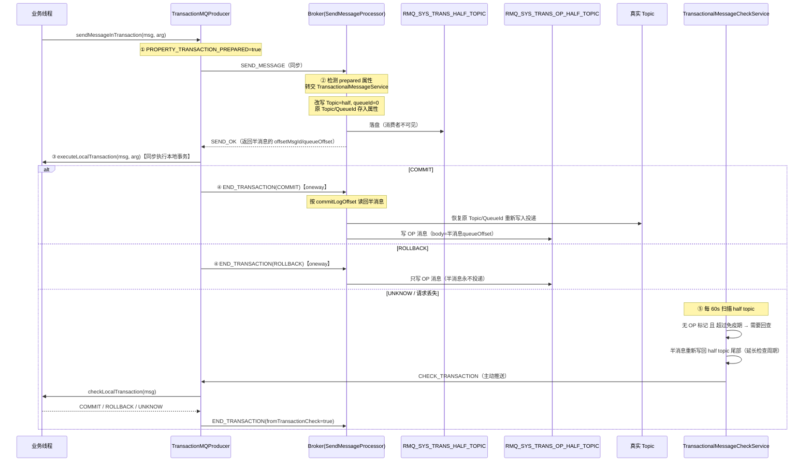
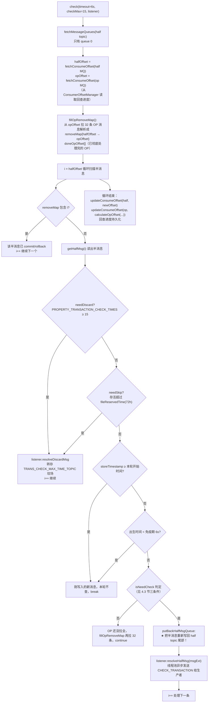
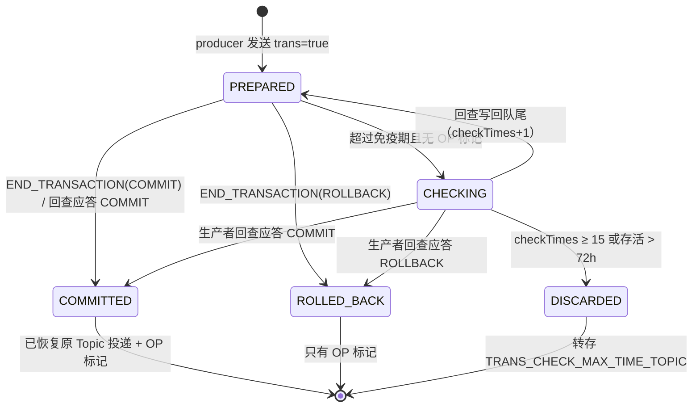
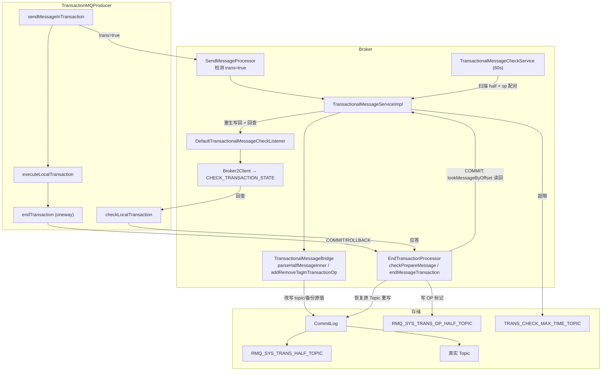

# RocketMQ 事务消息源码深度分析

> 基于 RocketMQ 4.9.8 源码，所有行号均为当前仓库源码实际行号。
> 涉及文件：
> - client/.../impl/producer/DefaultMQProducerImpl.java（sendMessageInTransaction / endTransaction / checkTransactionState）
> - client/.../impl/ClientRemotingProcessor.java（checkTransactionState 处理 Broker 回查）
> - broker/.../processor/SendMessageProcessor.java（半消息拦截）
> - broker/.../processor/EndTransactionProcessor.java（二次确认处理）
> - broker/.../transaction/queue/TransactionalMessageServiceImpl.java（核心服务实现）
> - broker/.../transaction/queue/TransactionalMessageBridge.java（存储桥接）
> - broker/.../transaction/TransactionalMessageCheckService.java（回查调度线程）
> - broker/.../transaction/AbstractTransactionalMessageCheckListener.java（回查发送器）
> - broker/.../transaction/queue/DefaultTransactionalMessageCheckListener.java（超限丢弃）

---

## 一、总体设计：为什么需要事务消息

分布式场景下"执行本地 DB 事务 + 发 MQ 消息"无法原子完成：

- 先发消息后写库：写库失败，消费者却已收到消息（脏数据）；
- 先写库后发消息：发消息失败，下游永远收不到（数据不一致）。

RocketMQ 的方案是**两阶段提交 + 回查兜底**：

1. 生产者先发一条**半消息（Half Message）**——Broker 收到后改写到系统内部 Topic（`RMQ_SYS_TRANS_HALF_TOPIC`），对消费者不可见；
2. 生产者执行本地事务，根据结果发**二次确认（COMMIT / ROLLBACK）**；
3. COMMIT → Broker 把半消息**恢复原 Topic 重新投递**；ROLLBACK → 半消息作废；
4. 若二次确认丢失，Broker 定时**回查（Check）**生产者的本地事务状态，仍以生产者答复为准。



三个系统 Topic（均在 broker 启动时由 `BrokerController` 创建 TopicConfig）：

| Topic | 用途 |
|-------|------|
| `RMQ_SYS_TRANS_HALF_TOPIC` | 存半消息，readQueueNums=writeQueueNums=1 |
| `RMQ_SYS_TRANS_OP_HALF_TOPIC` | 存 OP 消息（已 commit/rollback 的标记） |
| `TRANS_CHECK_MAX_TIME_TOPIC` | 回查超限（默认 15 次）的半消息"坟场" |

---

## 二、生产者端源码精读

### 2.1 sendMessageInTransaction（DefaultMQProducerImpl.java:1222-1302）

```java
public TransactionSendResult sendMessageInTransaction(final Message msg,
    final LocalTransactionExecuter localTransactionExecuter, final Object arg)
    throws MQClientException {
    TransactionListener transactionListener = getCheckListener();
    if (null == localTransactionExecuter && null == transactionListener) {
        throw new MQClientException("tranExecutor is null", null);   // 两个都为空直接拒绝
    }

    // 事务消息不支持延迟：忽略并清除 DelayTimeLevel
    if (msg.getDelayTimeLevel() != 0) {
        MessageAccessor.clearProperty(msg, MessageConst.PROPERTY_DELAY_TIME_LEVEL);
    }

    Validators.checkMessage(msg, this.defaultMQProducer);

    SendResult sendResult = null;
    // ① 打事务标记 + 携带生产组（回查时 Broker 靠它反查生产者 channel）
    MessageAccessor.putProperty(msg, MessageConst.PROPERTY_TRANSACTION_PREPARED, "true");
    MessageAccessor.putProperty(msg, MessageConst.PROPERTY_PRODUCER_GROUP,
        this.defaultMQProducer.getProducerGroup());
    try {
        sendResult = this.send(msg);        // ② 同步发送（复用普通发送链路）
    } catch (Exception e) {
        throw new MQClientException("send message Exception", e);
    }
```

**关键属性**：
- `PROPERTY_TRANSACTION_PREPARED = "trans"`（值为 "true"）——Broker 端识别半消息的依据；
- `PROPERTY_PRODUCER_GROUP`——**回查的路由依据**。注意：回查要求 `TransactionMQProducer` 的 producerGroup 对应的生产者仍在线，因为 Broker 是按 group 找 channel 反向推送的。

```java
    LocalTransactionState localTransactionState = LocalTransactionState.UNKNOW;
    Throwable localException = null;
    switch (sendResult.getSendStatus()) {
        case SEND_OK: {
            try {
                if (sendResult.getTransactionId() != null) {
                    msg.putUserProperty("__transactionId__", sendResult.getTransactionId());
                }
                String transactionId = msg.getProperty(MessageConst.PROPERTY_UNIQ_CLIENT_MESSAGE_ID_KEYIDX);
                if (null != transactionId && !"".equals(transactionId)) {
                    msg.setTransactionId(transactionId);
                }
                // ③ 执行本地事务：新版 API 用 TransactionListener，旧 API 用 LocalTransactionExecuter
                if (null != localTransactionExecuter) {
                    localTransactionState = localTransactionExecuter.executeLocalTransactionBranch(msg, arg);
                } else if (transactionListener != null) {
                    localTransactionState = transactionListener.executeLocalTransaction(msg, arg);
                }
                if (null == localTransactionState) {
                    localTransactionState = LocalTransactionState.UNKNOW;   // null 一律当 UNKNOW
                }
            } catch (Throwable e) {
                localException = e;           // 本地事务抛异常 → 状态 UNKNOW，交给回查
            }
        }
        break;
        case FLUSH_DISK_TIMEOUT:
        case FLUSH_SLAVE_TIMEOUT:
        case SLAVE_NOT_AVAILABLE:
            // ④ 半消息本身没存可靠 → 直接 ROLLBACK（半消息可能根本没落盘）
            localTransactionState = LocalTransactionState.ROLLBACK_MESSAGE;
            break;
    }

    // ⑤ 发送二次确认
    this.endTransaction(msg, sendResult, localTransactionState, localException);
    ...
}
```

**④ 处的设计意图**：`FLUSH_*_TIMEOUT` 时半消息的持久性没有保障（SYNC_FLUSH 超时 / SYNC_SLAVE 复制失败），
与其留下一个"可能丢的半消息"等回查，不如立刻 rollback。

### 2.2 endTransaction（DefaultMQProducerImpl.java:1312-1350）

```java
public void endTransaction(final Message msg, final SendResult sendResult,
    final LocalTransactionState localTransactionState, final Throwable localException) {
    // ⑥ 从半消息的 offsetMsgId 解析出 commitLogOffset
    //    （offsetMsgId = brokerAddr + 半消息在 CommitLog 中的物理偏移）
    final MessageId id;
    if (sendResult.getOffsetMsgId() != null) {
        id = MessageDecoder.decodeMessageId(sendResult.getOffsetMsgId());
    } else {
        id = MessageDecoder.decodeMessageId(sendResult.getMsgId());
    }
    ...
    EndTransactionRequestHeader requestHeader = new EndTransactionRequestHeader();
    requestHeader.setTransactionId(transactionId);
    requestHeader.setCommitLogOffset(id.getOffset());       // 精确定位半消息
    switch (localTransactionState) {
        case COMMIT_MESSAGE:  requestHeader.setCommitOrRollback(MessageSysFlag.TRANSACTION_COMMIT_TYPE);   break; // 8
        case ROLLBACK_MESSAGE: requestHeader.setCommitOrRollback(MessageSysFlag.TRANSACTION_ROLLBACK_TYPE); break; // 9
        case UNKNOW:          requestHeader.setCommitOrRollback(MessageSysFlag.TRANSACTION_NOT_TYPE);   break;    // 0
    }
    requestHeader.setTranStateTableOffset(sendResult.getQueueOffset());  // 半消息在 half topic 的队列偏移
    ...
    // ⑦ oneway 发送——不关心结果，失败了靠 Broker 回查兜底
    this.mQClientFactory.getMQClientAPIImpl().endTransactionOneway(brokerAddr, requestHeader, remark,
        this.defaultMQProducer.getSendMsgTimeout());
}
```

**三个关键设计**：

1. **oneway 发送**：二次确认不等待响应。若失败/丢失，Broker 的回查机制会兜底——这是整个方案"最终一致"的根基。
2. **commitLogOffset 作为半消息的"主键"**：EndTransactionProcessor 靠它从 CommitLog `lookMessageByOffset` 直接读回半消息，无需遍历 half topic。
3. **UNKNOW 不发任何确认**（`TRANSACTION_NOT_TYPE`），Broker 端收到后直接 `return null` 什么都不做（见 3.2 节），消息留在 half topic 等回查。

`EndTransactionRequestHeader` 核心字段：

| 字段 | 含义 |
|------|------|
| commitLogOffset | 半消息的 CommitLog 物理偏移（定位半消息） |
| tranStateTableOffset | 半消息在 half topic 的 queueOffset（写 OP 消息的 body 用） |
| commitOrRollback | 8=COMMIT / 9=ROLLBACK / 0=UNKNOW |
| fromTransactionCheck | 是否来自回查流程（区分日志语义） |
| producerGroup | 校验用（必须与半消息属性一致） |

---

## 三、Broker 端源码精读

### 3.1 半消息的拦截与改写

**入口：SendMessageProcessor.java:450-458**

```java
if (msgInner.getSysFlag() == ... /* 略 */) { ... }
String traFlag = oriProps.get(MessageConst.PROPERTY_TRANSACTION_PREPARED);
if (traFlag != null && Boolean.parseBoolean(traFlag)) {
    if (this.brokerController.getBrokerConfig().isRejectTransactionMessage()) {
        response.setCode(ResponseCode.NO_PERMISSION);   // slave 可配置拒绝事务消息
        ...
    }
    // 转交事务服务：写 half topic
    putMessageResult = this.brokerController.getTransactionalMessageService().prepareMessage(msgInner);
} else {
    putMessageResult = this.brokerController.getMessageStore().putMessage(msgInner);  // 普通消息
}
```

**改写逻辑：TransactionalMessageBridge.parseHalfMessageInner（:203-213）**

```java
private MessageExtBrokerInner parseHalfMessageInner(MessageExtBrokerInner msgInner) {
    // 原始目的地备份到属性
    MessageAccessor.putProperty(msgInner, MessageConst.PROPERTY_REAL_TOPIC, msgInner.getTopic());
    MessageAccessor.putProperty(msgInner, MessageConst.PROPERTY_REAL_QUEUE_ID,
        String.valueOf(msgInner.getQueueId()));
    // 清掉事务系统标志位（防止二次进入事务分支）
    msgInner.setSysFlag(
        MessageSysFlag.resetTransactionValue(msgInner.getSysFlag(), MessageSysFlag.TRANSACTION_NOT_TYPE));
    // ★ 核心改写：Topic 换成 half，队列固定 0
    msgInner.setTopic(TransactionalMessageUtil.buildHalfTopic());
    msgInner.setQueueId(0);
    msgInner.setPropertiesString(MessageDecoder.messageProperties2String(msgInner.getProperties()));
    return msgInner;
}
```

**"半消息对消费者不可见"的原理**：不是靠过滤，而是**物理上就不在业务 Topic 里**——消费者订阅的是原
Topic 的 ConsumeQueue，而消息写到了 `RMQ_SYS_TRANS_HALF_TOPIC` 的 queue 0。原 Topic/queueId 被
塞进 `PROPERTY_REAL_TOPIC`/`PROPERTY_REAL_QUEUE_ID` 属性，等 COMMIT 时再恢复。

> 注意 queueId 恒为 0：half topic 只有一个队列（1 读 1 写），保证事务消息全局有序地被回查线程顺序扫描。

### 3.2 EndTransactionProcessor——二次确认处理（:52-157）

```java
public RemotingCommand processRequest(...) {
    if (BrokerRole.SLAVE == brokerController.getMessageStoreConfig().getBrokerRole()) {
        response.setCode(ResponseCode.SLAVE_NOT_AVAILABLE);   // 只有 Master 能处理
        return response;
    }

    // ① 分支：来自回查的确认（fromTransactionCheck=true）——只打日志
    if (requestHeader.getFromTransactionCheck()) {
        switch (requestHeader.getCommitOrRollback()) {
            case TRANSACTION_NOT_TYPE:   // 生产者回查仍返回 UNKNOW → 什么都不做，下轮再查
                return null;
            case TRANSACTION_COMMIT_TYPE: /* fall through 到下面的真正处理 */
            case TRANSACTION_ROLLBACK_TYPE:
                break;
        }
    } else {
        // ② 分支：发送流程中的直接确认
        switch (requestHeader.getCommitOrRollback()) {
            case TRANSACTION_NOT_TYPE: return null;   // 客户端 UNKNOW → 直接忽略
            ...
        }
    }

    // ③ COMMIT 分支
    if (TRANSACTION_COMMIT_TYPE == requestHeader.getCommitOrRollback()) {
        result = this.brokerController.getTransactionalMessageService().commitMessage(requestHeader);
        //   └→ getHalfMessageByOffset: store.lookMessageByOffset(commitLogOffset) 按 offset 读回半消息
        if (result.getResponseCode() == ResponseCode.SUCCESS) {
            // ④ 防伪校验（详见下文 checkPrepareMessage）
            RemotingCommand res = checkPrepareMessage(result.getPrepareMessage(), requestHeader);
            if (res.getCode() == ResponseCode.SUCCESS) {
                // ⑤ 恢复原 Topic，构造终态消息
                MessageExtBrokerInner msgInner = endMessageTransaction(result.getPrepareMessage());
                msgInner.setSysFlag(MessageSysFlag.resetTransactionValue(msgInner.getSysFlag(),
                    requestHeader.getCommitOrRollback()));
                msgInner.setQueueOffset(requestHeader.getTranStateTableOffset());
                msgInner.setPreparedTransactionOffset(requestHeader.getCommitLogOffset());  // ★
                msgInner.setStoreTimestamp(result.getPrepareMessage().getStoreTimestamp());
                MessageAccessor.clearProperty(msgInner, MessageConst.PROPERTY_TRANSACTION_PREPARED);
                // ⑥ 重新写入 CommitLog（此时 Topic 是真实 Topic，BuildConsumeQueue 正常建索引）
                RemotingCommand sendResult = sendFinalMessage(msgInner);
                if (sendResult.getCode() == ResponseCode.SUCCESS) {
                    // ⑦ 写 OP 标记，标记该半消息已处理
                    this.brokerController.getTransactionalMessageService()
                        .deletePrepareMessage(result.getPrepareMessage());
                }
                return sendResult;
            }
        }
    } else if (TRANSACTION_ROLLBACK_TYPE == ...) {
        result = ...rollbackMessage(requestHeader);      // 同样按 offset 读回半消息
        if (SUCCESS) {
            checkPrepareMessage(...);
            // rollback 不投递，只写 OP 标记
            this.brokerController.getTransactionalMessageService()
                .deletePrepareMessage(result.getPrepareMessage());
        }
    }
    ...
}
```

**checkPrepareMessage 防伪三连（:164-192）**：

```java
// 1. 生产组必须匹配（防止 A 组的生产者 commit B 组的半消息）
if (!pgroupRead.equals(requestHeader.getProducerGroup())) → "The producer group wrong"
// 2. queueOffset 必须匹配（tranStateTableOffset）
if (msgExt.getQueueOffset() != requestHeader.getTranStateTableOffset()) → "...offset wrong"
// 3. commitLogOffset 必须匹配
if (msgExt.getCommitLogOffset() != requestHeader.getCommitLogOffset()) → "...offset wrong"
```

**endMessageTransaction（:194-217）——恢复原貌**：

```java
msgInner.setTopic(msgExt.getUserProperty(MessageConst.PROPERTY_REAL_TOPIC));       // 恢复原 Topic
msgInner.setQueueId(Integer.parseInt(msgExt.getUserProperty(PROPERTY_REAL_QUEUE_ID)));
...
MessageAccessor.clearProperty(msgInner, MessageConst.PROPERTY_REAL_TOPIC);         // 清理内部属性
MessageAccessor.clearProperty(msgInner, MessageConst.PROPERTY_REAL_QUEUE_ID);
```

注意 `msgInner.setPreparedTransactionOffset(requestHeader.getCommitLogOffset())`——终态消息携带
`preparedTransactionOffset`，消费者可通过 `msg.getPreparedTransactionOffset() != 0` 识别"这是一条
事务消息"。同时 `setStoreTimestamp(半消息的存储时间)` 而非当前时间——终态消息保留半消息的时间戳。

### 3.3 OP 消息的写入——deletePrepareMessage

`deletePrepareMessage` 名字有误导性，它**不删除任何数据**（CommitLog 追加写不可删），而是写一条
OP 标记消息：

**TransactionalMessageServiceImpl.deletePrepareMessage（:468-477）**

```java
public boolean deletePrepareMessage(MessageExt msgExt) {
    if (this.transactionalMessageBridge.putOpMessage(msgExt, TransactionalMessageUtil.REMOVETAG)) {
        return true;
    }
    ...
}
```

**TransactionalMessageBridge.addRemoveTagInTransactionOp（:310-315）**

```java
private boolean addRemoveTagInTransactionOp(MessageExt prepareMessage, MessageQueue messageQueue) {
    // OP 消息：topic = op topic, tags = "d", body = 半消息的 queueOffset（十进制字符串）
    Message message = new Message(TransactionalMessageUtil.buildOpTopic(),
        TransactionalMessageUtil.REMOVETAG,
        String.valueOf(prepareMessage.getQueueOffset()).getBytes(TransactionalMessageUtil.charset));
    writeOp(message, messageQueue);
    return true;    // 注意：永远返回 true（即使底层 putMessage 失败也返回 true！见下文坑）
}
```

OP 消息结构：

| 字段 | 值 |
|------|-----|
| topic | `RMQ_SYS_TRANS_OP_HALF_TOPIC` |
| tags | `"d"`（REMOVETAG） |
| body | 半消息在 half topic 中的 **queueOffset**（字符串） |
| queueOffset | OP 消息自己在 op topic 中的偏移（回查推进 op 位点用） |

**设计哲学**：CommitLog 不可变 → 用"标记消息"实现逻辑删除。与消费位点、DLedger 的 op 日志、
Pop 消息的 revive topic 是同一套思路：**追加写 + 标记 + 扫描配对**。

> ⚠️ 源码坑：`writeOp` → `putMessage` 失败只打 error 日志，`addRemoveTagInTransactionOp` 仍然
> `return true`。若 OP 写失败，半消息会被回查线程再次扫到并重复回查/投递——**COMMIT 时 OP 写失败
> 会导致消息重复投递**（幂等仍需业务保证）。

---

## 四、回查机制源码精读（最复杂的部分）

### 4.1 调度线程

**TransactionalMessageCheckService（:40-57）**——一个 `ServiceThread`：

```java
public void run() {
    long checkInterval = brokerController.getBrokerConfig().getTransactionCheckInterval(); // 默认 60s
    while (!this.isStopped()) {
        this.waitForRunning(checkInterval);
    }
}

@Override
protected void onWaitEnd() {
    long timeout = brokerController.getBrokerConfig().getTransactionTimeOut();  // 默认 6s
    int checkMax = brokerController.getBrokerConfig().getTransactionCheckMax(); // 默认 15
    this.brokerController.getTransactionalMessageService()
        .check(timeout, checkMax, this.brokerController.getTransactionalMessageCheckListener());
}
```

关键默认值（BrokerConfig）：

| 配置 | 默认 | 含义 |
|------|------|------|
| transactionCheckInterval | 60000 | 回查线程周期 |
| transactionTimeOut | 6000 | 事务"免疫期"：半消息出生后 6s 内不回查 |
| transactionCheckMax | 15 | 最大回查次数，超过进 TRANS_CHECK_MAX_TIME_TOPIC |
| transactionCheckIntervalMax 等 | ... | 回查间隔抖动上限 |

### 4.2 check() 主流程（TransactionalMessageServiceImpl.java:127-253）

这是整个事务消息最精妙的方法，本质是**用"消费者"的方式消费 half topic 和 op topic**——
一个伪装成消费组的回查器（消费组名 `TRANSACTION_CHECK`，见 `TransactionalMessageUtil.buildConsumerGroup()`）。



对应源码主干（逐段）：

```java
public void check(long transactionTimeout, int transactionCheckMax,
    AbstractTransactionalMessageCheckListener listener) {
    String topic = TopicValidator.RMQ_SYS_TRANS_HALF_TOPIC;
    Set<MessageQueue> msgQueues = transactionalMessageBridge.fetchMessageQueues(topic);
    for (MessageQueue messageQueue : msgQueues) {         // 实际只有 queue 0
        long startTime = System.currentTimeMillis();
        MessageQueue opQueue = getOpQueue(messageQueue);  // half qid → op qid 一一映射
        // 回查进度（伪装消费组的消费位点，存 ConsumerOffsetManager）
        long halfOffset = transactionalMessageBridge.fetchConsumeOffset(messageQueue);
        long opOffset = transactionalMessageBridge.fetchConsumeOffset(opQueue);
        ...
        List<Long> doneOpOffset = new ArrayList<>();
        HashMap<Long, Long> removeMap = new HashMap<>();
        PullResult pullResult = fillOpRemoveMap(removeMap, opQueue, opOffset, halfOffset, doneOpOffset);
        ...
        long i = halfOffset;
        while (true) {
            if (System.currentTimeMillis() - startTime > MAX_PROCESS_TIME_LIMIT) { // 单队列最长处理 60s
                break;
            }
            if (removeMap.containsKey(i)) {         // 有 OP 标记 → 已处理，跳过
                doneOpOffset.add(removeMap.remove(i));
            } else {
                GetResult getResult = getHalfMsg(messageQueue, i);   // 每次只拉 1 条
                MessageExt msgExt = getResult.getMsg();
                if (msgExt == null) { ... break/continue 处理空洞 ... }
                if (needDiscard(msgExt, transactionCheckMax) || needSkip(msgExt)) {
                    listener.resolveDiscardMsg(msgExt);   // 进坟场
                    i++; continue;
                }
                if (msgExt.getStoreTimestamp() >= startTime) break;  // 新消息下轮再查
                // 免疫期判断 ...
                if (isNeedCheck) {
                    if (!putBackHalfMsgQueue(msgExt, i)) continue;   // ★ 写回队尾
                    listener.resolveHalfMsg(msgExt);                 // ★ 发起回查
                } else {
                    // OP 消息还没拉到覆盖当前 half offset 的部分，继续拉 OP
                    pullResult = fillOpRemoveMap(removeMap, opQueue,
                        pullResult.getNextBeginOffset(), halfOffset, doneOpOffset);
                    continue;
                }
            }
            i++;
        }
        // 推进回查进度
        transactionalMessageBridge.updateConsumeOffset(messageQueue, newOffset);
        transactionalMessageBridge.updateConsumeOffset(opQueue, calculateOpOffset(doneOpOffset, opOffset));
    }
}
```

### 4.3 三个精妙细节

#### 细节 1：fillOpRemoveMap——removeMap 与 doneOpOffset 的区别

```java
for (MessageExt opMessageExt : opMsg) {
    // OP 消息 body = 它标记的半消息 queueOffset
    Long queueOffset = getLong(new String(opMessageExt.getBody(), charset));
    if (REMOVETAG.equals(opMessageExt.getTags())) {
        if (queueOffset < miniOffset) {
            // 该 OP 标记的半消息已经在回查进度之前 → OP 自身使命完成
            doneOpOffset.add(opMessageExt.getQueueOffset());   // OP 自己的 offset
        } else {
            // 该 OP 标记的半消息还在本轮扫描范围内 → 建 half→op 映射
            removeMap.put(queueOffset, opMessageExt.getQueueOffset());
        }
    }
}
```

- **removeMap**：`半消息offset → OP消息offset`。扫描半消息时 O(1) 判断"是否已被处理"。
- **doneOpOffset**：对应的半消息已经越过回查指针（`< miniOffset`），这些 **OP 消息自身**可以被跳过——
  `calculateOpOffset` 把 op topic 的位点推过这些连续的已完成 OP：

```java
private long calculateOpOffset(List<Long> doneOffset, long oldOffset) {
    Collections.sort(doneOffset);
    long newOffset = oldOffset;
    for (int i = 0; i < doneOffset.size(); i++) {
        if (doneOffset.get(i) == newOffset) newOffset++;   // 只有连续才推进
        else break;
    }
    return newOffset;
}
```

即 OP 位点只能跳过**连续段**，中间有空洞就停——保证不漏判。

#### 细节 2：putBackHalfMsgQueue——为什么回查前要把半消息写回队尾？（:100-124）

```java
private boolean putBackHalfMsgQueue(MessageExt msgExt, long offset) {
    PutMessageResult putMessageResult = putBackToHalfQueueReturnResult(msgExt); // 重新 putMessage
    if (PUT_OK == putMessageResult.getPutMessageStatus()) {
        // ★ 用新消息的 offset/msgId 覆盖 msgExt 字段
        msgExt.setQueueOffset(putMessageResult.getAppendMessageResult().getLogicsOffset());
        msgExt.setCommitLogOffset(putMessageResult.getAppendMessageResult().getWroteOffset());
        msgExt.setMsgId(putMessageResult.getAppendMessageResult().getMsgId());
        return true;
    }
    ...
}
```

**原因有三**：

1. **自增回查计数**：`needDiscard` 靠 `PROPERTY_TRANSACTION_CHECK_TIMES` 属性判断次数，但消息属性
   不可变——重写一条新消息（属性里 checkTimes+1）实现计数。
2. **给 EndTransactionProcessor 提供新偏移**：回查后生产者 COMMIT 时带上的是**新消息**的
   commitLogOffset/queueOffset，processor 校验和写 OP 都针对新消息，天然幂等——**即使生产者对同一条
   消息重复收到回查、重复 COMMIT，也只会投递一次**（第二次的 OP 标记配上第一次的 OP，都被 removeMap 吃掉）。
3. **控制扫描节奏**：写回队尾的消息 storeTimestamp 是新的，下次扫描到它会先撞"刚写入"和"免疫期"
   判断而跳过，天然实现了**回查退避**（每轮 check 只回查一次同一条消息）。

#### 细节 3：isNeedCheck 的三条件（:221-224）

```java
List<MessageExt> opMsg = pullResult.getMsgFoundList();
boolean isNeedCheck = (opMsg == null && valueOfCurrentMinusBorn > checkImmunityTime)                       // ①
    || (opMsg != null && (opMsg.get(opMsg.size() - 1).getBornTimestamp() - startTime > transactionTimeout)) // ②
    || (valueOfCurrentMinusBorn <= -1);                                                                    // ③
```

- ①：本轮没拉到任何 OP 消息 且 半消息出生超过免疫期 → 该查了；
- ②：拉到的最后一条 OP 消息的出生时间 - 本轮开始时间 > transactionTimeout，说明**回查请求发出后
  超过了 timeout 仍未有新的 OP 出现**（生产者没响应）→ 需要再查；
- ③：`currentTime - bornTimestamp <= -1` 时钟回拨场景，强制查。

免疫期还有一条特殊路径 `checkPrepareQueueOffset`（:326-345）：处理 `PROPERTY_TRANSACTION_PREPARED_QUEUE_OFFSET`
（写回队尾的"重生"消息携带原 queueOffset）——如果重生消息的原 offset 已有 OP 标记，说明上一轮回查
已经成功 commit/rollback，直接跳过不再回查；否则再写回一次。这是细节 2 的第 2 点的延伸：**重生消息
通过保留原 offset 属性避免重复回查已终结的事务**。

### 4.4 回查请求的发送——AbstractTransactionalMessageCheckListener（:59-89）

```java
// 回查不走 check 主线程，丢进独立线程池（2~5 线程，队列 2000，CallerRuns 兜底）
private static ExecutorService executorService = new ThreadPoolExecutor(2, 5, 100, SECONDS,
    new ArrayBlockingQueue<Runnable>(2000), ..., new CallerRunsPolicy());

public void sendCheckMessage(MessageExt msgExt) throws Exception {
    CheckTransactionStateRequestHeader header = new CheckTransactionStateRequestHeader();
    header.setCommitLogOffset(msgExt.getCommitLogOffset());      // 重生后的新 offset
    header.setOffsetMsgId(msgExt.getMsgId());
    header.setMsgId(msgExt.getUserProperty(PROPERTY_UNIQ_CLIENT_MESSAGE_ID_KEYIDX));
    header.setTranStateTableOffset(msgExt.getQueueOffset());
    // ★ 恢复原 Topic 再发给生产者（生产者业务侧看到的是原始消息）
    msgExt.setTopic(msgExt.getUserProperty(PROPERTY_REAL_TOPIC));
    msgExt.setQueueId(Integer.parseInt(msgExt.getUserProperty(PROPERTY_REAL_QUEUE_ID)));
    msgExt.setStoreSize(0);
    String groupId = msgExt.getProperty(PROPERTY_PRODUCER_GROUP);
    // ★ 按生产组找可用 channel —— 回查要求同 group 的生产者在线！
    Channel channel = brokerController.getProducerManager().getAvailableChannel(groupId);
    if (channel != null) {
        brokerController.getBroker2Client()
            .checkProducerTransactionState(groupId, channel, header, msgExt);
    } else {
        LOGGER.warn("Check transaction failed, channel is null. groupId={}", groupId);
        // channel 没找到 → 什么都不做，等下一轮（消息还在 half topic，靠重生机制继续）
    }
}
```

**反向调用通道**：`Broker2Client.checkProducerTransactionState` 构造
`RequestCode.CHECK_TRANSACTION_STATE`（code=36）的 RemotingCommand，**Broker 作为请求方**通过
已建立的 TCP 连接推给生产者——这就是 Remoting 模块双向通信的典型应用（Broker 也能主动调客户端）。

### 4.5 生产者处理回查——ClientRemotingProcessor + DefaultMQProducerImpl

**ClientRemotingProcessor.checkTransactionState（:101-133）**（Netty 回调线程直接执行）：

```java
final MessageExt messageExt = MessageDecoder.decode(byteBuffer);       // 反序列化半消息
String transactionId = messageExt.getProperty(PROPERTY_UNIQ_CLIENT_MESSAGE_ID_KEYIDX);
final String group = messageExt.getProperty(PROPERTY_PRODUCER_GROUP);
MQProducerInner producer = this.mqClientFactory.selectProducer(group); // 按组找生产者实例
producer.checkTransactionState(addr, messageExt, requestHeader);       // 委托
```

**DefaultMQProducerImpl.checkTransactionState（:306-351）**：

```java
Runnable request = new Runnable() {
    public void run() {
        TransactionListener transactionListener = getCheckListener();
        LocalTransactionState localTransactionState = LocalTransactionState.UNKNOW;
        try {
            // ★ 调业务实现的 checkLocalTransaction —— 必须能根据消息恢复事务状态判断
            localTransactionState = transactionListener.checkLocalTransaction(message);
        } catch (Throwable e) { ... }
        this.processTransactionState(localTransactionState, group, exception);
    }
};
// 丢到回查线程池异步执行，不阻塞 Netty IO 线程
this.mQClientFactory.getPullRequestQueue()... /* 实际: checkExecutor.submit(request) */
```

`processTransactionState` 最终复用 `endTransactionOneway` 发送
`EndTransactionRequestHeader(fromTransactionCheck=true)`，回到 3.2 节的 EndTransactionProcessor——
**回查的应答与直接二次确认走同一条处理路径**，这就是 3.2 节 `if (requestHeader.getFromTransactionCheck())`
分支存在的原因（语义区分：回查应答的 COMMIT/ROLLBACK 打 warn 日志留痕，NOT_TYPE 静默忽略）。

### 4.6 超限丢弃——DefaultTransactionalMessageCheckListener.resolveDiscardMsg（:43-59）

```java
public void resolveDiscardMsg(MessageExt msgExt) {
    log.error("MsgExt:{} has been checked too many times, so discard it by moving it to system topic TRANS_CHECK_MAXTIME_TOPIC");
    MessageExtBrokerInner brokerInner = toMessageExtBrokerInner(msgExt);
    // 写入 TRANS_CHECK_MAX_TIME_TOPIC（自动创建，1 队列）—— 不投递、只留档
    PutMessageResult putMessageResult = this.getBrokerController().getMessageStore().putMessage(brokerInner);
    ...
}
```

被丢弃的半消息**不会投递给消费者**，进坟场 Topic 留待人工排查（`queryMsgById` 可查）。
这意味着：**如果生产者 15 次回查都返回不了结果（比如本地事务状态数据被清），消息会被静默丢弃——
事务消息的"最终一致"有上限，业务方必须保证 checkLocalTransaction 的可恢复性**。

---

## 五、状态机与属性总览

### 5.1 半消息生命周期状态机



### 5.2 涉及的消息属性速查

| 属性 | 写入方 | 用途 |
|------|--------|------|
| `trans`（PROPERTY_TRANSACTION_PREPARED） | 生产者 | 标记半消息请求 |
| `PGROUP`（PROPERTY_PRODUCER_GROUP） | 生产者 | 回查时反查生产者 channel、EndTransaction 校验 |
| `REAL_TOPIC` / `REAL_QID` | Broker（parseHalfMessageInner） | 备份原始目的地 |
| `UNIQ_KEY` | 客户端 | 客户端唯一 ID，即 transactionId |
| `TRAN_MSG_CHECK_TIMES` | Broker（needDiscard） | 回查计数 |
| `TRAN_MSG_PREPARED_QUEUE_OFFSET` | Broker（renewImmunity） | 重生消息携带原 offset，防重复回查 |
| `CHECK_IMMUNITY_TIME_IN_SECONDS` | 可由生产者设置 | 覆盖默认免疫期（-1=用 broker 的 transactionTimeOut） |

### 5.3 一次成功事务的文件级视图

```
CommitLog（按写入顺序）:
  [1] 半消息A  topic=RMQ_SYS_TRANS_HALF_TOPIC qid=0  ← prepare
  [2] 终态消息 topic=OrderTopic qid=3                 ← COMMIT 时恢复写入（消费者可见的其实是他）
  [3] OP消息   topic=RMQ_SYS_TRANS_OP_HALF_TOPIC body="0"  ← 标记 halfOffset=0 已处理

consumequeue/OrderTopic/3/   ← 只有 [2] 的索引（半消息和 OP 从未出现在业务 Topic 索引里）
consumequeue/RMQ_SYS_TRANS_HALF_TOPIC/0/      ← [1] 的索引（回查线程按它扫）
consumequeue/RMQ_SYS_TRANS_OP_HALF_TOPIC/0/   ← [3] 的索引

config/consumerOffset.json
  "TRANSACTION_CHECK@RMQ_SYS_TRANS_HALF_TOPIC": {0: N}   ← 回查进度（伪装消费组）
  "TRANSACTION_CHECK@RMQ_SYS_TRANS_OP_HALF_TOPIC": {0: M}
```

---

## 六、可靠性分析与经典问题

### 6.1 各环节失败矩阵

| 失败点 | 后果 | 兜底机制 |
|--------|------|---------|
| 半消息发送失败 | 事务不执行 | 生产者抛异常，业务回滚 |
| 半消息 SEND_OK 但 FLUSH 失败 | 半消息可能丢 | 客户端直接 ROLLBACK（2.1 节④） |
| 本地事务执行抛异常 | 状态 UNKNOW | endTransaction 发 NOT_TYPE → 回查 |
| END_TRANSACTION 请求丢失 | 半消息悬置 | 回查线程 |
| 回查时生产者不在线 | 无法确认 | channel==null 打 warn，下轮继续；15 次后进坟场 |
| 回查应答丢失 | 半消息继续悬置 | 重生机制继续回查（checkTimes+1） |
| COMMIT 时 OP 写失败 | 消息**重复投递** | 无兜底（addRemoveTagInTransactionOp 恒返回 true），业务幂等 |
| 回查应答 COMMIT 但终态写失败 | 返回非 SUCCESS | 生产者不重试（oneway）→ 下轮回查重来 |

### 6.2 为什么是"最终一致"而不是强一致

- COMMIT 后终态消息的可见依赖 CommitLog 刷盘/主从复制——与普通消息一致性级别相同；
- 生产者本地事务成功但所有回查都超时 → 消息被丢弃（**本地事务成功 ≠ 消息必达**）；
- OP 写失败可能重复投递（**消息可能多**）。因此事务消息提供的是**界于至多一次和至少一次之间的
  最终一致语义**，业务侧仍需幂等 + 状态可恢复。

### 6.3 与延迟消息/Pop 消息的"同构性"

三个特性共用同一套底层哲学——**不可变 CommitLog + 标记消息 + 扫描配对**：

| 特性 | 数据 Topic | 标记 Topic | 扫描者 |
|------|-----------|-----------|--------|
| 事务消息 | RMQ_SYS_TRANS_HALF_TOPIC | RMQ_SYS_TRANS_OP_HALF_TOPIC | TransactionalMessageCheckService |
| 延迟消息 | SCHEDULE_TOPIC_XXXX（每等级一队列） | （无，靠恢复真实 Topic + 位点推进） | ScheduleMessageService |
| Pop 消费 | 原队列 + ck（revive topic） | ack 配对 revive | PopReviveService |

理解其一，可类推其余。

### 6.4 使用注意事项（源码推导）

1. **回查要求生产者在线**：`ProducerManager.getAvailableChannel(group)` 按 group 找 channel。
   TransactionMQProducer 的 producerGroup 必须唯一且保持在线（生产者集群中至少一个存活即可，
   回查会打到任意一个，靠 checkLocalTransaction 的幂等/可恢复性）。
2. **executeLocalTransaction 里不要做长事务**：它同步阻塞发送线程，且免疫期默认只有 6s——
   超过后 Broker 开始回查，而本地事务还没执行完，回查可能拿到错误的 UNKNOW（无害，但会消耗回查次数）。
   长事务应设置 `CHECK_IMMUNITY_TIME_IN_SECONDS` 属性覆盖免疫期。
3. **checkLocalTransaction 必须可恢复**：推荐本地事务执行时先落一条"事务执行记录"（含 transactionId
   与状态），回查时查这条记录。
4. **半消息对顺序消息不友好**：COMMIT 时终态消息写入的是**当时**的 queueId（恢复自属性），
   若期间该队列被写满/路由变化，可能失去原有顺序语义（queueOffset 是半消息的，不代表投递位置）。
5. **性能开销**：每条事务消息 = 3 次 CommitLog 写入（半消息 + 终态/OP）+ 潜在的重生写放大
   （每次回查一条重写）。

---

## 七、一图总结



**一句话总结**：RocketMQ 事务消息 = **半消息改写（对消费者物理不可见）+ 本地事务回调 + oneway
二次确认（允许丢失）+ 伪装消费组的扫描回查（half/op 配对，重生退避，15 次封顶）**，
所有环节都建立在"CommitLog 追加不可变 + 标记消息逻辑删除"的存储哲学之上。
