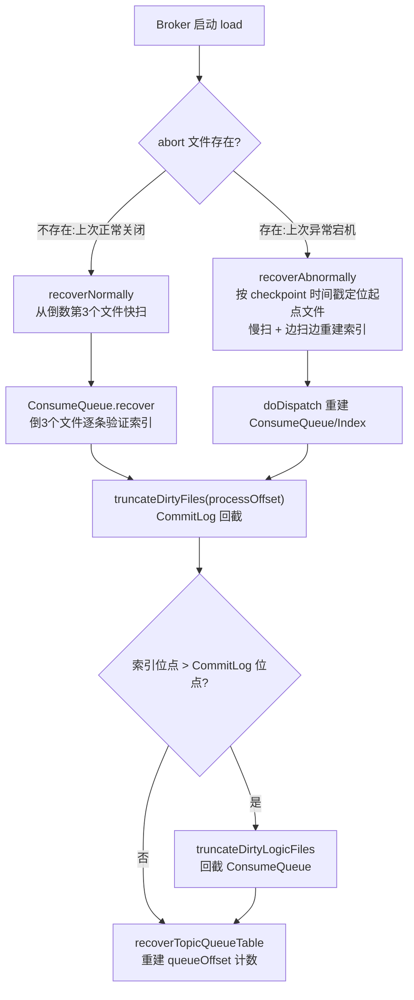
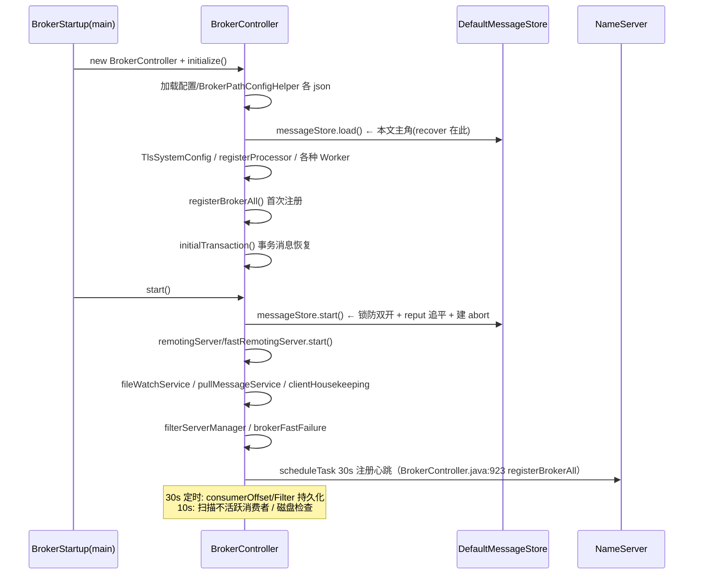
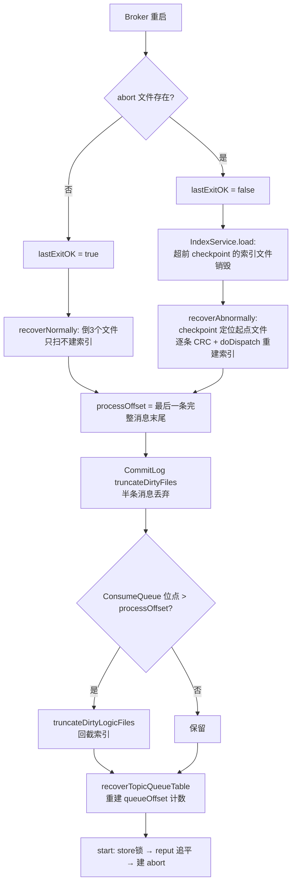

# RocketMQ 存储文件恢复与 Broker 启动全景源码深度分析

> 基于 RocketMQ 4.9.8 源码，精读 `DefaultMessageStore.load/start/shutdown`、`CommitLog.recoverNormally/recoverAbnormally`、`ConsumeQueue.recover`、`StoreCheckpoint`、`abort` 文件机制，彻底搞清楚"Broker 挂掉重启后，那半条写了一半的消息去哪了"。

---

## 一、问题本质：mmap 之后，谁来定义"哪部分数据是有效的"

RocketMQ 写消息是写 mmap 内存映射（MappedByteBuffer），OS 异步刷盘：

```
写入:  消息 → pageCache（即刻返回，AppendMessageResult OK）
刷盘:  GroupCommitService/FlushRealTimeService → fileChannel.force()（异步）
```

宕机瞬间的三种脏状态：

| 脏状态 | 产生原因 | 后果 |
|--------|---------|------|
| CommitLog 尾部有**半条消息** | 写了 totalSize 但 body 没写完，或刷盘只刷了一半 | 长度字段不可信，必须逐条校验 |
| ConsumeQueue 索引超前于 CommitLog | reput 线程写了索引，但消息本身被截断 | 索引指向不存在的物理 offset |
| IndexFile 超前 | 索引构建完成但消息被回截 | 按 index 查到的 offset 无效 |

恢复的目标：**找到一个"所有刷盘数据都完整"的截断点（processOffset），把它之后的一切清掉，并让三套文件（CommitLog / ConsumeQueue / IndexFile）对齐到同一点。**

### 三个关键角色

1. **abort 文件**（`${storePathRootDir}/abort`）：Broker 启动完成时创建（`DefaultMessageStore.java:303 createTempFile`），正常关闭时删除（:338）。**它存在 = 上次没关好**。这是判断正常/异常宕机的唯一依据。
2. **StoreCheckpoint**（`checkpoint` 文件）：三个 long 时间戳（见第四节），异常恢复时用来定位"从哪个 CommitLog 文件开始扫"。
3. **checkMessageAndReturnSize**：逐条解析 CommitLog 消息，校验 magic code + totalSize + CRC，是恢复的原子操作。

---

## 二、恢复总入口：DefaultMessageStore.load()

`DefaultMessageStore.java:193-231`：

```java
public boolean load() {
    boolean result = true;
    try {
        boolean lastExitOK = !this.isTempFileExist();          // ① abort 不存在 = 上次正常关闭
        log.info("last shutdown {}", lastExitOK ? "normally" : "abnormally");

        result = result && this.commitLog.load();              // ② 加载 CommitLog 文件列表(mmap)
        result = result && this.loadConsumeQueue();            // ③ 按 目录结构 建 ConsumeQueue 对象

        if (result) {
            this.storeCheckpoint = new StoreCheckpoint(...);   // ④ 加载 checkpoint 三个时间戳
            this.indexService.load(lastExitOK);                // ⑤ 索引文件加载/淘汰
            this.recover(lastExitOK);                          // ⑥ 核心恢复
            log.info("load over, and the max phy offset = {}", this.getMaxPhyOffset());
            if (null != scheduleMessageService) {
                result = this.scheduleMessageService.load();   // ⑦ 延迟队列进度(delays.json)
            }
        }
    } catch (Exception e) { ... result = false; }
    ...
    return result;
}
```

`loadConsumeQueue()`（:1392-1424）：ConsumeQueue 的存储结构即目录结构——`consumequeue/{topic}/{queueId}/` 按文件名加载，**目录即元数据**，所以删 Topic = 删目录。

### recover 分流（:1429-1439）

```java
private void recover(final boolean lastExitOK) {
    long maxPhyOffsetOfConsumeQueue = this.recoverConsumeQueue();   // 先恢复索引，拿到索引侧最大物理位点

    if (lastExitOK) {
        this.commitLog.recoverNormally(maxPhyOffsetOfConsumeQueue);
    } else {
        this.commitLog.recoverAbnormally(maxPhyOffsetOfConsumeQueue);
    }

    this.recoverTopicQueueTable();    // 重建 topicQueueTable（下一条消息的 queueOffset 来源）
}
```



**先恢复 ConsumeQueue 再恢复 CommitLog** 的原因：索引侧扫出的 `maxPhysicOffset` 是"数据可信上限"的第三方参照——CommitLog 扫出的 processOffset 若比它小，说明索引超前，需要回截索引对齐。

---

## 三、两条恢复路径逐行精读

### 3.1 ConsumeQueue.recover（两条路径共用）

`ConsumeQueue.java:92-152`：

```java
public void recover() {
    final List<MappedFile> mappedFiles = this.mappedFileQueue.getMappedFiles();
    if (!mappedFiles.isEmpty()) {
        int index = mappedFiles.size() - 3;        // 同样从倒数第 3 个文件开始
        if (index < 0) index = 0;
        ...
        while (true) {
            for (int i = 0; i < mappedFileSizeLogics; i += CQ_STORE_UNIT_SIZE) {   // 每 20 字节一个索引单元
                long offset = byteBuffer.getLong();     // 物理位点
                int size = byteBuffer.getInt();         // 消息大小
                long tagsCode = byteBuffer.getLong();   // tag hash / ext 地址
                if (offset >= 0 && size > 0) {
                    mappedFileOffset = i + CQ_STORE_UNIT_SIZE;
                    this.maxPhysicOffset = offset + size;    // 持续推进最大物理位点
                    if (isExtAddr(tagsCode)) {
                        maxExtAddr = tagsCode;
                    }
                } else {
                    break;   // 遇到全 0（空洞）即认为到头
                }
            }
            ...  // 文件满则 index++ 切下一个
        }
        processOffset += mappedFileOffset;
        this.mappedFileQueue.setFlushedWhere(processOffset);
        this.mappedFileQueue.setCommittedWhere(processOffset);
        this.mappedFileQueue.truncateDirtyFiles(processOffset);    // 索引文件自身也回截
        if (isExtReadEnable()) {
            this.consumeQueueExt.recover();    // ConsumeQueueExt（SQL92 位图）同样处理
        }
        ...
    }
}
```

**为什么从倒数第 3 个文件开始？** 一个索引文件 30 万条单元（`mappedFileSizeConsumeQueue=300000*20`），从倒数第 3 个开始扫，兼顾"重扫范围足够覆盖脏数据"与"启动速度"。正常关机时刷盘点是准确的，倒 3 个文件足以兜住极少量未刷脏页。

### 3.2 recoverNormally：正常关闭（快路径）

`CommitLog.java:210-271`：

```java
public void recoverNormally(long maxPhyOffsetOfConsumeQueue) {
    boolean checkCRCOnRecover = ...isCheckCRCOnRecover();    // 默认 true
    final List<MappedFile> mappedFiles = this.mappedFileQueue.getMappedFiles();
    if (!mappedFiles.isEmpty()) {
        int index = mappedFiles.size() - 3;                  // 倒数第 3 个
        if (index < 0) index = 0;

        MappedFile mappedFile = mappedFiles.get(index);
        ByteBuffer byteBuffer = mappedFile.sliceByteBuffer();
        long processOffset = mappedFile.getFileFromOffset();
        long mappedFileOffset = 0;
        while (true) {
            DispatchRequest dispatchRequest = this.checkMessageAndReturnSize(byteBuffer, checkCRCOnRecover);
            int size = dispatchRequest.getMsgSize();
            if (dispatchRequest.isSuccess() && size > 0) {
                mappedFileOffset += size;                     // 完整消息 → 前进
            }
            else if (dispatchRequest.isSuccess() && size == 0) {
                index++;                                      // 到文件尾空洞 → 切下一文件
                ...
            }
            else if (!dispatchRequest.isSuccess()) {
                log.info("recover physics file end, " + mappedFile.getFileName());
                break;                                        // CRC 失败/magic 错 → 到头了
            }
        }

        processOffset += mappedFileOffset;
        this.mappedFileQueue.setFlushedWhere(processOffset);   // 恢复刷盘位点
        this.mappedFileQueue.setCommittedWhere(processOffset);
        this.mappedFileQueue.truncateDirtyFiles(processOffset); // ★ 截断脏数据

        // Clear ConsumeQueue redundant data
        if (maxPhyOffsetOfConsumeQueue >= processOffset) {
            log.warn("maxPhyOffsetOfConsumeQueue({}) >= processOffset({}), truncate dirty logic files", ...);
            this.defaultMessageStore.truncateDirtyLogicFiles(processOffset);   // ★ 索引超前则回截索引
        }
    } else {
        // CommitLog 文件全没了（被人工清空）
        log.warn("The commitlog files are deleted, and delete the consume queue files");
        this.mappedFileQueue.setFlushedWhere(0);
        this.mappedFileQueue.setCommittedWhere(0);
        this.defaultMessageStore.destroyLogics();    // 索引全删
    }
}
```

**checkMessageAndReturnSize 的三态返回**（`CommitLog.java:288+`，javadoc 写明）：

| 返回 | 含义 |
|------|------|
| `> 0`（success） | 完整消息，size 字节有效 |
| `0`（success） | 文件末尾的 BLANK_MAGIC_CODE 填充区（写新文件前预填的空白标记） |
| `-1`（fail） | magic code 错 / totalSize 不合法 / **CRC 校验失败** → 恢复终止点 |

**注意正常路径不 doDispatch**——因为正常关闭时 reput 已把索引建齐，无需重建。

**truncateDirtyFiles 的动作**（MappedFileQueue）：processOffset 之后的内容作废——若 processOffset 落在最后一个文件中间，该文件 `setWrotePosition` 截断复用；若之后还有文件，直接删除。这就是"半条消息被丢弃"的物理动作。

### 3.3 recoverAbnormally：异常宕机（慢路径 + 索引重建）

`CommitLog.java:467-550`，与正常路径的三大差异：

**差异一：起点由 StoreCheckpoint 时间戳决定**（:473-486 + `isMappedFileMatchedRecover:552-586`）：

```java
int index = mappedFiles.size() - 1;
for (; index >= 0; index--) {
    mappedFile = mappedFiles.get(index);
    if (this.isMappedFileMatchedRecover(mappedFile)) {   // 从最新文件往前找
        log.info("recover from this mapped file " + mappedFile.getFileName());
        break;
    }
}
if (index < 0) {
    index = 0;
    mappedFile = mappedFiles.get(index);    // 全不匹配则从第一个文件扫（灾难场景，巨慢）
}
```

`isMappedFileMatchedRecover` 的判定（:552-586）：

```java
int magicCode = byteBuffer.getInt(MessageDecoder.MESSAGE_MAGIC_CODE_POSTION);
if (magicCode != MESSAGE_MAGIC_CODE) return false;    // 文件头第一条消息就烂 → 不能从这里恢复

long storeTimestamp = byteBuffer.getLong(msgStoreTimePos);   // 文件首消息的存储时间戳
if (0 == storeTimestamp) return false;

if (...isMessageIndexEnable() && ...isMessageIndexSafe()) {
    if (storeTimestamp <= checkpoint.getMinTimestampIndex()) return true;   // 保守：连索引一起对齐
} else {
    if (storeTimestamp <= checkpoint.getMinTimestamp()) return true;        // 常规：三时间戳最小值再减 3s
}
```

**语义**：从最新文件倒着找第一个"文件首条消息时间戳 ≤ checkpoint 最小时间戳"的文件，**从这个文件开头的完整消息开始重扫**。checkpoint 保证这个文件及之前的数据都已完整刷盘——之前的数据不用再逐条校验，之后的全部重放。

**差异二：边扫边重建索引**（:495-507）：

```java
if (dispatchRequest.isSuccess()) {
    if (size > 0) {
        mappedFileOffset += size;
        if (...isDuplicationEnable()) {
            if (dispatchRequest.getCommitLogOffset() < ...getConfirmOffset()) {
                this.defaultMessageStore.doDispatch(dispatchRequest);   // 主从复制场景只分发已确认部分
            }
        } else {
            this.defaultMessageStore.doDispatch(dispatchRequest);       // ★ 重建 ConsumeQueue + IndexFile
        }
    }
    ...
}
```

异常宕机时 ConsumeQueue/Index 可能落后 CommitLog（reput 线程没来得及追），恢复过程**顺带把扫描过的每条消息重新分发**（doDispatch → CommitLogDispatcherBuildConsumeQueue / BuildIndex / CalcBitMap）——所以这条路径又慢又重：不但要逐条 CRC，还要重建全部索引。

**差异三：截断逻辑相同但触发概率高**——异常宕机 pageCache 丢失，processOffset 大概率 < ConsumeQueue 已有位点，`truncateDirtyLogicFiles` 把超前索引回截。

### 3.4 为什么从"倒数第 3 个"还是"checkpoint 定位"看设计

| | recoverNormally | recoverAbnormally |
|--|----------------|-------------------|
| 起点 | 固定倒 3 个文件 | checkpoint 时间戳定位（可能更早） |
| 逐条 CRC | 是 | 是 |
| 重建索引 | 否（reput 追平过） | **是（doDispatch 全量重放）** |
| 耗时 | 毫秒~秒级 | 可能分钟级（大 CommitLog） |
| 触发条件 | abort 不存在 | abort 存在 |

---

## 四、StoreCheckpoint：三个时间戳的保险丝

`StoreCheckpoint.java:30-123`，整个文件就 24 字节 mmap：

```java
private volatile long physicMsgTimestamp = 0;    // CommitLog 最新刷盘消息时间戳
private volatile long logicsMsgTimestamp = 0;    // ConsumeQueue 最新构建时间戳
private volatile long indexMsgTimestamp = 0;     // IndexFile 最新构建时间戳

public long getMinTimestamp() {                  // :105-113
    long min = Math.min(this.physicMsgTimestamp, this.logicsMsgTimestamp);
    min -= 1000 * 3;                             // ★ 再往前多让 3 秒！
    if (min < 0) min = 0;
    return min;
}
```

**三个时间戳谁在更新？**
- `physicMsgTimestamp`：FlushRealTimeService/GroupCommitService 刷盘后更新
- `logicsMsgTimestamp`：reput 线程分发 ConsumeQueue 后更新
- `indexMsgTimestamp`：索引构建后更新（`flush()` 时落盘）

**为什么 getMinTimestamp 要额外减 3 秒？** checkpoint 自身也是 mmap 异步 flush 的，内存值可能比磁盘值新——磁盘上存的可能是 3 秒前的快照。回退 3s 使"从 checkpoint 推断的恢复起点"绝对保守：宁可多扫几条早已完好的消息，绝不放过一条脏消息。**这是"恢复必须保守"哲学的具象化**（与 `IndexService.load` 的淘汰逻辑共用该哲学，见下）。

**MinTimestampIndex 的用途**：开启 `messageIndexSafe=true`（默认 false）时，恢复起点用"三时间戳 + index 的最小值"，即**把索引也纳入对齐基准**——最保守模式，reput 需要重建的索引更多，但绝不会留下超前的脏索引。

### IndexService.load（`IndexService.java:57-86`）

```java
for (File file : files) {    // 升序
    IndexFile f = new IndexFile(file.getPath(), ...);
    f.load();
    if (!lastExitOK) {
        if (f.getEndTimestamp() > checkpoint.getIndexMsgTimestamp()) {
            f.destroy(0);      // 异常宕机：索引文件末条时间戳超过 checkpoint → 整个文件删掉重建
            continue;
        }
    }
    this.indexFileList.add(f);
}
```

索引文件的淘汰粒度是**整文件**——不精确回截（索引按 hash 冲突链组织，中间截断会破坏链表），超前的直接销毁，靠 recoverAbnormally 的 doDispatch 重建。

---

## 五、recoverTopicQueueTable：重建"下一条 queueOffset"

`DefaultMessageStore.java:1477-1490`：

```java
public void recoverTopicQueueTable() {
    HashMap<String/* topic-queueid */, Long/* offset */> table = new HashMap<String, Long>(1024);
    long minPhyOffset = this.commitLog.getMinOffset();
    for (ConcurrentMap<Integer, ConsumeQueue> maps : this.consumeQueueTable.values()) {
        for (ConsumeQueue logic : maps.values()) {
            String key = logic.getTopic() + "-" + logic.getQueueId();
            table.put(key, logic.getMaxOffsetInQueue());       // 从 ConsumeQueue 尾部取队列最大逻辑位点
            logic.correctMinOffset(minPhyOffset);              // 修正 minOffset（CommitLog 删除导致的前移）
        }
    }
    this.commitLog.setTopicQueueTable(table);
    this.commitLog.setLmqTopicQueueTable(table);
}
```

这条最容易被忽略：**消息体内的 queueOffset 字段不是查出来的，是内存计数器加出来的**（`CommitLog.putMessage` 里 `queueOffset = topicQueueTable.get(key).incrementAndGet()` 之类逻辑）。恢复后必须从 ConsumeQueue 重建每个队列的计数器，否则下一条消息的 queueOffset 从 0 开始写——队列位点直接错乱。

`correctMinOffset` 同步修正队列的 minOffset（CommitLog 过期删除后，原 minOffset 对应的物理文件可能没了）。

---

## 六、DefaultMessageStore.start()：恢复之后的开机自检

`DefaultMessageStore.java:236-306`：

```java
public void start() throws Exception {
    lock = lockFile.getChannel().tryLock(0, 1, false);      // ① store 目录级文件锁：防双开
    if (lock == null || lock.isShared() || !lock.isValid()) {
        throw new RuntimeException("Lock failed,MQ already started");
    }
    ...
    {
        // ② 决定 reput 起始位点：所有 ConsumeQueue 的 maxPhysicOffset 的最大值
        long maxPhysicalPosInLogicQueue = commitLog.getMinOffset();
        for (...每个 ConsumeQueue...) {
            if (logic.getMaxPhysicOffset() > maxPhysicalPosInLogicQueue) {
                maxPhysicalPosInLogicQueue = logic.getMaxPhysicOffset();
            }
        }
        if (maxPhysicalPosInLogicQueue < this.commitLog.getMinOffset()) {
            maxPhysicalPosInLogicQueue = this.commitLog.getMinOffset();
            // ConsumeQueue 被人工删除/换机器拷贝了 CommitLog：从 CommitLog 最小位点重放
            log.warn("[TooSmallCqOffset] maxPhysicalPosInLogicQueue={} clMinOffset={}", ...);
        }
        log.info("[SetReputOffset] maxPhysicalPosInLogicQueue={} clMinOffset={} clMaxOffset={}", ...);
        this.reputMessageService.setReputFromOffset(maxPhysicalPosInLogicQueue);
        this.reputMessageService.start();                   // ③ 启动 reput（构建索引的常驻线程）

        // ④ 等待 reput 追平 CommitLog 才继续（异常恢复时可能要补建大量索引）
        while (true) {
            if (dispatchBehindBytes() <= 0) {
                break;
            }
            Thread.sleep(1000);
            log.info("Try to finish doing reput the messages fall behind during the starting, ...");
        }
        this.recoverTopicQueueTable();                      // ⑤ 追平后再重建一次计数表（reput 可能又推进了）
    }

    if (!messageStoreConfig.isEnableDLegerCommitLog()) {
        this.haService.start();                             // ⑥ 主从复制
        this.handleScheduleMessageService(...);             // ⑦ 延迟消息（Slave 不启动投递）
    }

    this.flushConsumeQueueService.start();
    this.commitLog.start();
    this.storeStatsService.start();

    this.createTempFile();                                  // ⑧ ★ 创建 abort 文件（宣布"我开着"）
    this.addScheduleTask();                                 // ⑨ 过期清理/自检/磁盘检查定时任务
    this.shutdown = false;
}
```

两个重点：

**① store 锁防双开**：对 `store/lock` 文件加 JVM 进程级 FileLock——同机误起第二个 Broker 进程（同 storePath）直接抛异常。防的是"两个进程 mmap 同一批文件互相写坏"。

**④⑤ 先追平再服务**：reput 没追平前不启动 HA/延迟消息等服务。`recoverTopicQueueTable` 在追平后**再执行一次**（load 阶段那次的结果可能已过时）——严谨到近乎啰嗦，但队列位点错乱无药可救，宁可啰嗦。

---

## 七、正常关闭：如何把"下次快恢复"变成确定的事

`DefaultMessageStore.shutdown()`（:308-354）关键序列：

```java
public void shutdown() {
    if (!this.shutdown) {
        this.shutdown = true;
        this.scheduledExecutorService.shutdown();       // 1. 停定时任务
        this.diskCheckScheduledExecutorService.shutdown();
        Thread.sleep(1000);                             // 2. 等在途写完成

        if (this.scheduleMessageService != null) this.scheduleMessageService.shutdown();
        if (this.haService != null) this.haService.shutdown();
        this.storeStatsService.shutdown();
        this.indexService.shutdown();
        this.commitLog.shutdown();                      // 3. 刷盘（GroupCommitService 收尾 force）
        this.reputMessageService.shutdown();
        this.flushConsumeQueueService.shutdown();
        this.allocateMappedFileService.shutdown();
        this.storeCheckpoint.flush();                   // 4. checkpoint 三时间戳落盘
        this.storeCheckpoint.shutdown();

        if (this.runningFlags.isWriteable() && dispatchBehindBytes() == 0) {
            this.deleteFile(StorePathConfigHelper.getAbortFile(...));   // 5. ★ 删 abort = 宣布正常关闭
            shutDownNormal = true;
        } else {
            log.warn("the store may be wrong, so shutdown abnormally, and keep abort file.");
        }
    }
    ...
}
```

**注意条件 `dispatchBehindBytes() == 0`**：即使走的是"正常关闭"流程，如果索引还没追平（或磁盘错误导致 runningFlags 不可写），abort 文件**保留**——下次按异常恢复处理。**abort 的删除是一种"承诺"：我保证数据全部一致。不敢承诺就不删。**

---

## 八、Broker 启动全景：load 之外的另一半

存储层 load/recover 只是 `BrokerController.initialize()` → `start()` 的一环。全景时序：



（NameServer 注册、路由注销等详见《NameServer路由中心》篇；位点持久化详见《消费位点管理》篇。）

---

## 九、一张图总览恢复决策



---

## 十、陷阱清单

| # | 陷阱 | 现象 | 根因 |
|---|------|------|------|
| 1 | **kill -9 后第一次启动特别慢** | 分钟级无响应 | recoverAbnormally 从 checkpoint 位置逐条 CRC + doDispatch 重建索引；CommitLog 越大越久 |
| 2 | **半条消息"丢了"** | 客户端 SLAVE_NOT_AVAILABLE 之后部分已应答消息消失 | 同步刷盘才有强保证；异步刷盘宕机，pageCache 未刷部分（含半条）被 truncate 掉是设计行为 |
| 3 | **手工删了部分 ConsumeQueue 目录** | `[TooSmallCqOffset]` 警告 + 重放海量消息 | start() 从 CommitLog 最小位点全量 reput（:263-274），人工修复要预估影响 |
| 4 | **同 storePath 双开 Broker** | "Lock failed, MQ already started" | store 目录级 FileLock 防护（:238-241） |
| 5 | **非正常关闭后 abort 一直在** | 每次启动都走慢恢复 | shutdown 时 `dispatchBehindBytes() != 0` 或磁盘错误 → 保留 abort（:337-342）；查 store.log |
| 6 | **checkCRCOnRecover=false 求快** | 偶发半条消息被当作完整消息 | CRC 是半条消息的最后防线，关掉等于裸奔 |
| 7 | **磁盘坏 → magic code 全烂** | 恢复从第一个文件扫，巨慢或失败 | isMappedFileMatchedRecover 全不匹配 → index=0 兜底 |
| 8 | **同步双写集群丢已确认消息** | Master+Slave 同时物理损坏 | 恢复只能截断到"最后一条完整消息"，之前的物理损伤无法自愈，需备份 |

## 十一、运维与调试手册

**日志关键字（store.log / broker.log）：**

| 关键字 | 含义 |
|--------|------|
| `last shutdown normally / abnormally` | load() 第一步的判定结果（:198） |
| `store checkpoint file physicMsgTimestamp ...` | checkpoint 三时间戳值 |
| `recover from this mapped file <file>` | 异常恢复的起点文件 |
| `maxPhyOffsetOfConsumeQueue >= processOffset, truncate dirty logic files` | 索引超前被回截（注意是 warn 级） |
| `The commitlog files are deleted` | CommitLog 全没了，索引全删 |
| `[TooSmallCqOffset]` | ConsumeQueue 落后于 CommitLog 最小位点 |
| `[SetReputOffset] ...` | reput 起点 |
| `Try to finish doing reput the messages fall behind` | 启动期 reput 追平中（每秒一条） |
| `the store may be wrong, so shutdown abnormally, and keep abort file` | 关闭时不敢删 abort |
| `Lock failed,MQ already started` | 双开 |

**文件检查：**

```bash
ls ${storePathRootDir}
# abort        存在=上次异常；启动后正常存在（运行中）
# checkpoint   24 字节：3 个 long 时间戳（可 xxd 查看）
# lock         运行时锁文件
# commitlog/ consumequeue/ index/ config/
```

**断点路线：**

| 观察目标 | 断点位置 |
|---------|---------|
| 正常/异常判定 | `DefaultMessageStore.isTempFileExist:1386` |
| ConsumeQueue 恢复 | `ConsumeQueue.recover:92` |
| 逐条消息校验 | `CommitLog.checkMessageAndReturnSize:288` |
| 截断点计算 | `CommitLog.recoverNormally:254` / `recoverAbnormally:532` |
| 异常恢复起点 | `CommitLog.isMappedFileMatchedRecover:552` |
| 索引重建 | `DefaultMessageStore.doDispatch:1524` |
| queueOffset 计数表 | `DefaultMessageStore.recoverTopicQueueTable:1477` |
| abort 创建/删除 | `createTempFile:1313` / `shutdown:338` |

## 十二、设计得与失

**得：**
1. **abort 文件 + checkpoint 时间戳**两个廉价信号，把"恢复的保守程度"分成两档，正常重启毫秒级、异常重启才付出全量校验代价。
2. **恢复顺序讲究**：先索引（拿参照位点）→ 再 CommitLog（定截断点）→ 回截对齐 → 重建计数表 → start 时 reput 追平后再重建一次——每一步的输出都是下一步的输入。
3. **doDispatch 复用**：异常恢复的索引重建直接复用运行期的分发链路（同一套 BuildConsumeQueue/BuildIndex/CalcBitMap），没有两套代码。
4. **关闭即承诺**：不敢删 abort 就保留，宁可下次慢恢复也不冒进——全篇贯彻"恢复必须保守"。

**失：**
1. 异常恢复**单线程**逐条扫，TB 级 CommitLog 重启可能十分钟级（5.x 改为并行恢复）。
2. `getMinTimestamp` 的 3 秒回退是经验值而非协议保证，时钟跳变场景仍可能漏脏数据。
3. 索引文件淘汰粒度太粗（整文件销毁），一个超前索引文件可能牵连大量完好索引重建。
4. 正常/异常判定完全依赖本机 abort 文件，磁盘级故障（abort 都写不进）时无从判定。

## 十三、一句话总结

> **abort 文件定快慢（正常倒 3 文件快扫、异常按 checkpoint 定位慢扫），逐条 CRC 找到最后一条完整消息作为截断点，CommitLog 与超前索引统统回截对齐，异常路径顺带 doDispatch 重建索引，追平 reput、重建 queueOffset 计数表之后才敢写 abort 宣布"我在正常运行"——一切只承诺一件事：磁盘上留下的，全是完整消息。**

---

*上一篇：[RocketMQ顺序消息端到端源码深度分析](RocketMQ顺序消息端到端源码深度分析.md) · 下一篇：流控机制（说"下一篇"继续）*
