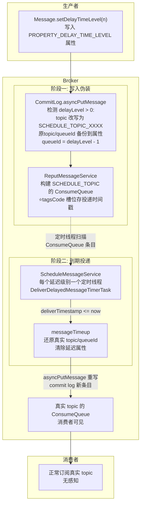
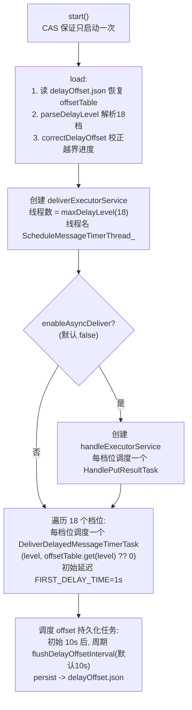
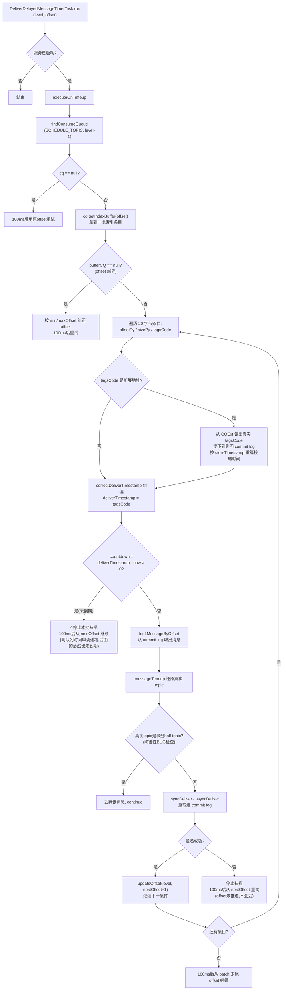
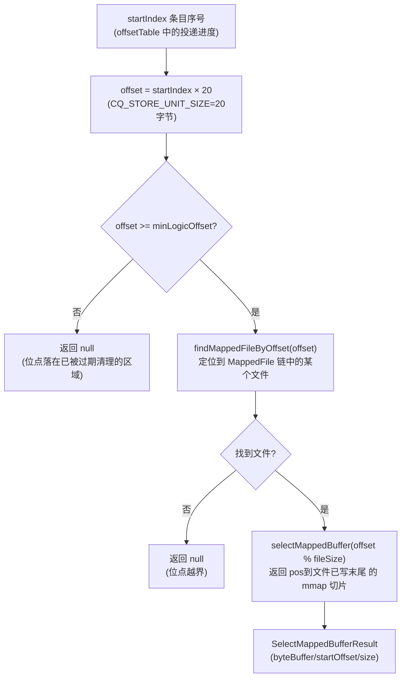
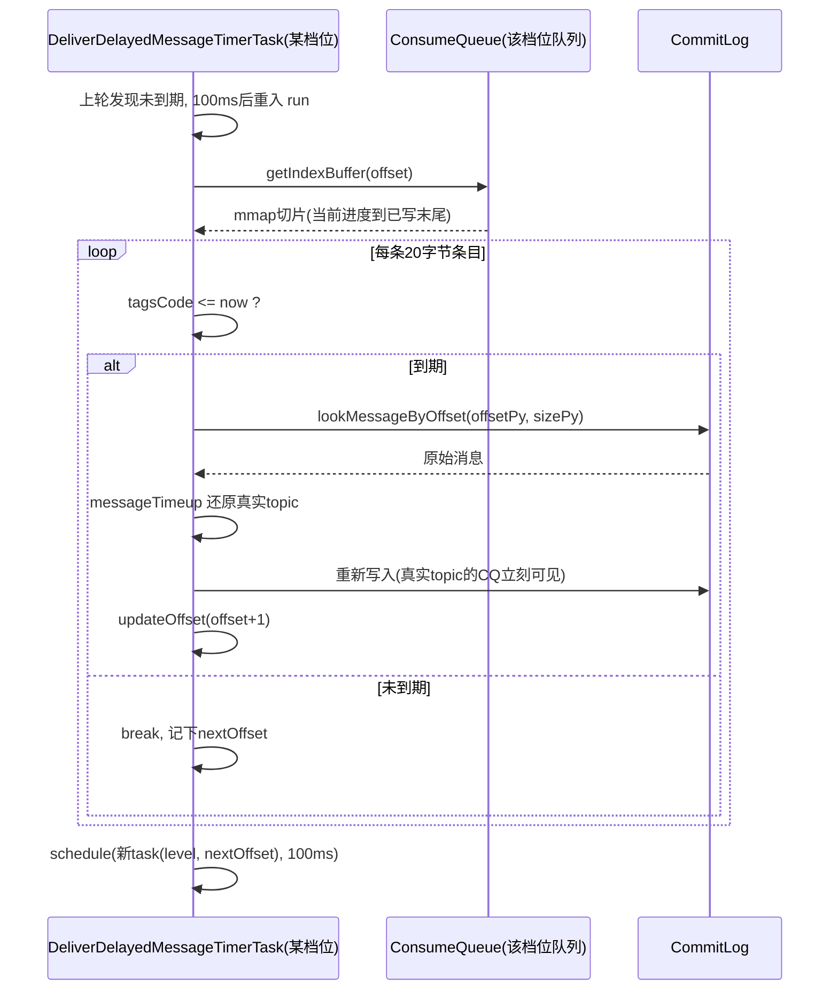
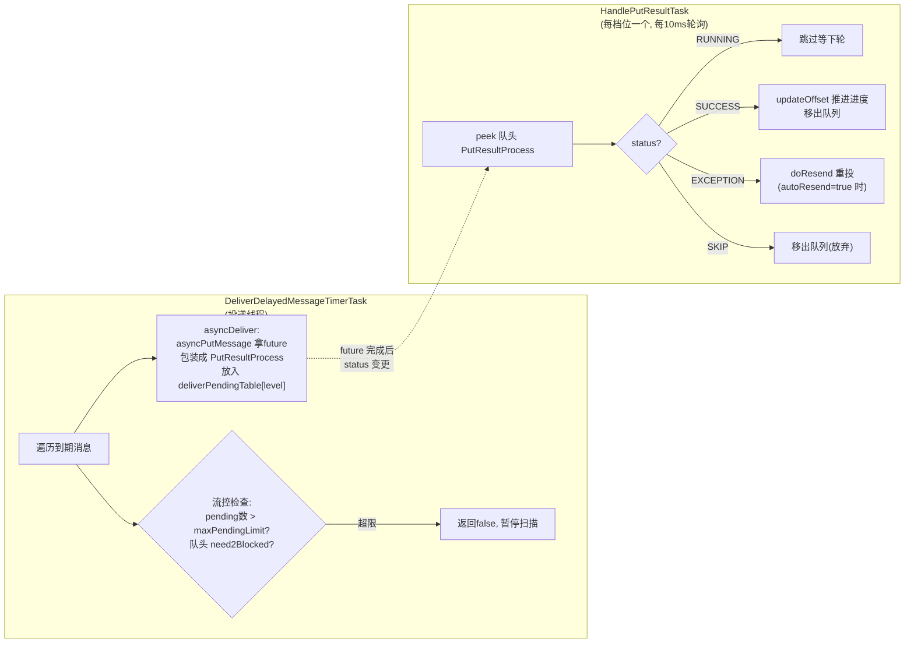
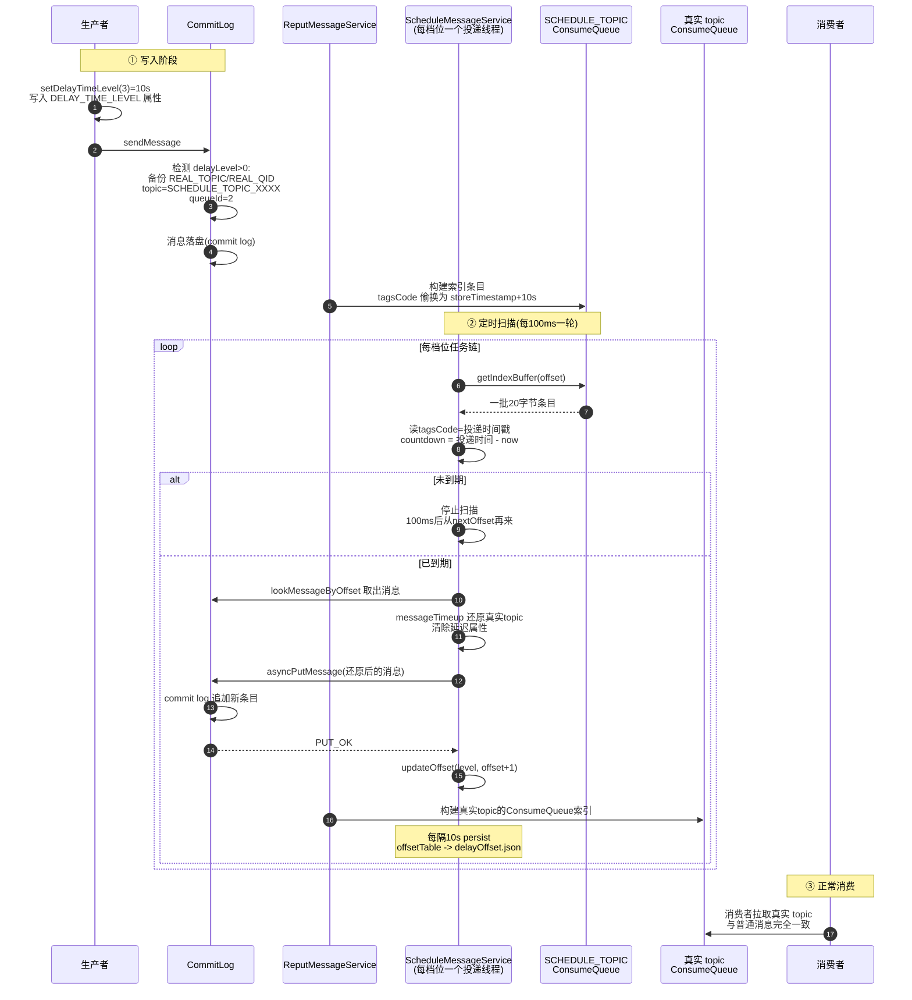

# RocketMQ 4.9.8 延迟消息实现原理与 ScheduleMessageService 源码深度分析

> 基于 `D:\workspace\java_projects\source_projects\rocketmq-4.9.8` 源码。
> 核心文件：`store/src/main/java/org/apache/rocketmq/store/schedule/ScheduleMessageService.java`（下文简称 SMS）、`store/.../CommitLog.java`。
> 覆盖：18 档延迟模型、写入路径的消息变换、tagsCode 复用技巧、DeliverDelayedMessageTimerTask 执行流程、同步/异步投递、offset 持久化与崩溃恢复、关键设计分析。

---

## 目录

1. [总体架构：两阶段设计](#一总体架构两阶段设计)
2. [18 档延迟模型与解析](#二18-档延迟模型与解析)
3. [写入路径：CommitLog 的消息变换](#三写入路径commitlog-的消息变换)
4. [核心技巧：tagsCode 字段复用](#四核心技巧tagscode-字段复用)
5. [ScheduleMessageService 启动与数据结构](#五schedulemessageservice-启动与数据结构)
6. [DeliverDelayedMessageTimerTask：到期投递核心流程](#六deliverdelayedmessagetimertask到期投递核心流程)
7. [messageTimeup：消息还原](#七messagetimeup消息还原)
8. [同步投递 vs 异步投递](#八同步投递-vs-异步投递)
9. [offset 持久化与崩溃恢复](#九offset-持久化与崩溃恢复)
10. [全链路时序图](#十全链路时序图)
11. [关键设计分析](#十一关键设计分析)
12. [配置速查与 FAQ](#十二配置速查与-faq)

---

## 一、总体架构：两阶段设计

RocketMQ 4.x 的延迟消息是**两阶段**的：先把延迟消息伪装成系统 topic 的普通消息存起来，再由定时任务扫描到期后**重写一份**到真实 topic。



三个关键认知：

1. **延迟消息在存储层就是一条普通消息**：commit log 里没有"延迟消息"这个概念，只是 topic 变成了系统 topic `SCHEDULE_TOPIC_XXXX`（`TopicValidator.RMQ_SYS_SCHEDULE_TOPIC`）；
2. **到期投递 = 重写一遍**：投递时 `messageTimeup` 还原成真实 topic 后再次走 `asyncPutMessage`，commit log 中会出现**两个条目**（伪装条目 + 真实条目），各占一份存储直到过期清理；
3. **消费者完全无感知**：真实条目是一字不差的新消息，tag/属性/key 全部保留。

---

## 二、18 档延迟模型与解析

### 2.1 档位定义

```properties
# broker.conf, MessageStoreConfig.messageDelayLevel
messageDelayLevel = 1s 5s 10s 30s 1m 2m 3m 4m 5m 6m 7m 8m 9m 10m 20m 30m 1h 2h
```

**档位即队列**：SCHEDULE_TOPIC 的 queueId 与档位一一对应：

```java
// ScheduleMessageService.java
public static int queueId2DelayLevel(final int queueId) { return queueId + 1; }
public static int delayLevel2QueueId(final int delayLevel) { return delayLevel - 1; }
```

档位 3（10s）的消息全部进 queueId=2 的队列。**同一档位的消息在同一个队列里天然按存储时间有序**，投递时间也按存储时间单调递增--这是后面"扫描到未到期消息即可停止"的前提。

### 2.2 parseDelayLevel：解析配置

（`ScheduleMessageService.parseDelayLevel`）启动时解析配置串：

```java
timeUnitTable.put("s", 1000L);          // 支持的单位
timeUnitTable.put("m", 1000L * 60);
timeUnitTable.put("h", 1000L * 60 * 60);
timeUnitTable.put("d", 1000L * 60 * 60 * 24);

String[] levelArray = levelString.split(" ");
for (int i = 0; i < levelArray.length; i++) {
    String ch = value.substring(value.length() - 1);       // 末尾字符=单位
    long delayTimeMillis = timeUnitTable.get(ch) * num;    // 换算成毫秒
    this.delayLevelTable.put(i + 1, delayTimeMillis);      // 档位 -> 毫秒
    if (level > this.maxDelayLevel) { this.maxDelayLevel = level; }
}
```

- 结果存入 `delayLevelTable: ConcurrentMap<level, delayMillis>`，同时求出 `maxDelayLevel`（默认 18）；
- **档位数就是队列数，也决定线程数**（每个档位一个投递线程）；
- 改配置可以增删档位（比如 32 档），但**修改后 broker 重启才能生效**，且旧消息已按旧档位写入对应队列，需保证兼容。

### 2.3 computeDeliverTimestamp

```java
public long computeDeliverTimestamp(final int delayLevel, final long storeTimestamp) {
    Long time = this.delayLevelTable.get(delayLevel);
    if (time != null) { return time + storeTimestamp; }
    return storeTimestamp + 1000;    // 找不到档位兜底1s
}
```

**投递时间 = 存储时间 + 档位时长**。注意是 broker 的 storeTimestamp，不是生产者的 bornTimestamp--所以"延迟10s"的真实含义是"从 broker 收到消息算起 10s"。

---

## 三、写入路径：CommitLog 的消息变换

### 3.1 客户端入口

`Message.setDelayTimeLevel(level)`（`common/.../message/Message.java:147`）只是往 properties 写一个属性：

```java
this.putProperty(MessageConst.PROPERTY_DELAY_TIME_LEVEL, String.valueOf(level));
```

属性随消息体一起序列化发送，broker 端不需要任何额外请求字段。

### 3.2 broker 端变换

（`CommitLog.asyncPutMessage`，消息落盘前的处理）：

```java
if (msg.getDelayTimeLevel() > 0) {
    // 超过最大档位钳制到最大档位(如 level=100 -> 18)
    if (msg.getDelayTimeLevel() > this.defaultMessageStore.getScheduleMessageService().getMaxDelayLevel()) {
        msg.setDelayTimeLevel(...getMaxDelayLevel());
    }

    topic = TopicValidator.RMQ_SYS_SCHEDULE_TOPIC;                    // 改写 topic
    int queueId = ScheduleMessageService.delayLevel2QueueId(msg.getDelayTimeLevel());   // queueId = level-1

    // 备份真实身份到属性
    MessageAccessor.putProperty(msg, MessageConst.PROPERTY_REAL_TOPIC, msg.getTopic());
    MessageAccessor.putProperty(msg, MessageConst.PROPERTY_REAL_QUEUE_ID, String.valueOf(msg.getQueueId()));
    msg.setPropertiesString(MessageDecoder.messageProperties2String(msg.getProperties()));

    msg.setTopic(topic);
    msg.setQueueId(queueId);
}
```

变换总结：

| 字段 | 原始消息 | 伪装后（写进 commit log 的） |
|---|---|---|
| topic | `OrderTopic` | `SCHEDULE_TOPIC_XXXX` |
| queueId | 0~n | `delayLevel - 1` |
| 属性 | - | 新增 `REAL_TOPIC=OrderTopic`、`REAL_QID=n`、`DELAY_TIME_LEVEL=k` |
| body/tag/其他属性 | 不变 | 不变 |

于是这条消息会像普通消息一样走 commit log 落盘、reput 构建 `SCHEDULE_TOPIC_XXXX/queueId=level-1` 的 ConsumeQueue--**延迟基础设施完全复用了普通消息的存储链路，零新概念**。

---

## 四、核心技巧：tagsCode 字段复用

这是 4.x 延迟消息最精妙的设计。回顾 ConsumeQueue 条目的 20 字节布局：

```
[ commit log 物理偏移(8B) | 消息大小(4B) | tagsCode(8B) ]
```

正常消息的 tagsCode 是 tag 的 hashcode。但 reput 线程构建索引时（`CommitLog.checkMessageAndReturnSize`）对 SCHEDULE_TOPIC 做了特殊处理：

```java
// CommitLog.checkMessageAndReturnSize, 构造 DispatchRequest 时
String t = propertiesMap.get(MessageConst.PROPERTY_DELAY_TIME_LEVEL);
if (TopicValidator.RMQ_SYS_SCHEDULE_TOPIC.equals(topic) && t != null) {
    int delayLevel = Integer.parseInt(t);
    if (delayLevel > ...getMaxDelayLevel()) { delayLevel = ...getMaxDelayLevel(); }
    if (delayLevel > 0) {
        tagsCode = this.defaultMessageStore.getScheduleMessageService()
            .computeDeliverTimestamp(delayLevel, storeTimestamp);   // ⭐ tagsCode = 投递时间戳
    }
}
```

**tagsCode 被偷换成"投递时间戳"**。收益：

1. **零额外存储**：投递时间不需要新文件/新字段，就藏在 ConsumeQueue 索引条目里；
2. **扫描免反序列化**：定时任务只读 20 字节索引条目就能判断"到期没有"，不用回 commit log 解析消息属性；
3. **天然有序**：同档位队列里 tagsCode 随存储时间单调递增，扫描发现未到期即可停。

代价：SCHEDULE_TOPIC 的消息不支持 tag 过滤（tagsCode 被占用了，反正也没人消费这个系统 topic，无所谓）。

> 如果开启了 ConsumeQueueExt（`cq.isExtAddr(tagsCode)` 判断 tagsCode 是负数扩展地址），会从扩展文件读出真实 tagsCode；扩展文件读不到时兜底回 commit log 取 storeTimestamp 重算投递时间（`executeOnTimeup` 内的 `[BUG]` 分支）。

---

## 五、ScheduleMessageService 启动与数据结构

### 5.1 核心字段

```java
public class ScheduleMessageService extends ConfigManager {
    // 档位 -> 延迟毫秒数 (parseDelayLevel 填充)
    private final ConcurrentMap<Integer, Long> delayLevelTable;
    // 档位 -> 已投递到的 ConsumeQueue offset (投递进度)
    private final ConcurrentMap<Integer, Long> offsetTable;
    // 投递线程池: 大小 = maxDelayLevel(默认18), 每档位一个线程
    private ScheduledExecutorService deliverExecutorService;
    // 异步投递开关+处理器(默认关闭)
    private boolean enableAsyncDeliver;
    private ScheduledExecutorService handleExecutorService;
    // 异步模式下每档位的"投递中"队列
    private final Map<Integer, LinkedBlockingQueue<PutResultProcess>> deliverPendingTable;
}
```

### 5.2 启动流程

（`start()`，broker 的 `DefaultMessageStore` 启动时调用）



常量表（节拍器，后面反复出现）：

| 常量 | 值 | 用途 |
|---|---|---|
| `FIRST_DELAY_TIME` | 1000ms | 首次调度延迟 |
| `DELAY_FOR_A_WHILE` | 100ms | 正常情况下一轮扫描后的休眠（**延迟精度即 100ms**） |
| `DELAY_FOR_A_PERIOD` | 10000ms | 执行异常后的休眠 |
| `DELAY_FOR_A_SLEEP` | 10ms | HandlePutResultTask 的轮询周期 |
| `WAIT_FOR_SHUTDOWN` | 5000ms | 关闭时等待线程池终止 |

---

## 六、DeliverDelayedMessageTimerTask：到期投递核心流程

这是延迟消息的心脏。**每个档位一个自续的定时任务链**：任务执行完自己调度下一个自己（新 offset），永不停止。

### 6.1 主流程图



### 6.2 逐点解析

**① 为什么"发现未到期就停"是对的**：同一档位的投递时间 = storeTimestamp + 固定时长，而队列内 storeTimestamp 单调递增，所以 tagsCode 单调递增。第一条未到期意味着后面全部未到期，**扫描是 O(到期消息数) 而不是 O(全部消息)**。代价是 100ms 空轮询一次（`DELAY_FOR_A_WHILE`），18 个线程各睡各的，开销可忽略。

**② correctDeliverTimestamp 纠偏**（`DeliverDelayedMessageTimerTask` 内部方法）：

```java
long maxTimestamp = now + delayLevelTable.get(this.delayLevel);
if (deliverTimestamp > maxTimestamp) {
    result = now;    // 投递时间超前 now+本档位时长 => 数据异常/时钟回拨, 立即投递
}
```

防御性逻辑：正常 tagsCode 最多是"存储时间+档位时长"，不可能超过 now+档位时长（除非 storeTimestamp 被篡改或系统时钟回拨）。与其卡住不如立即投递。

**③ 投递失败不推进 offset**：`syncDeliver` 失败时直接 `scheduleNextTimerTask(nextOffset, 100ms)` 返回，offsetTable 不动，下轮重扫同一条消息--**at-least-once**，但绝不错过。

**④ 事务 half topic 防御**：`messageTimeup` 还原出的真实 topic 若是 `RMQ_SYS_TRANS_HALF_TOPIC`，说明消息属性被污染，打 `[BUG]` 日志丢弃，防止延迟投递把事务消息搅乱。

### 6.3 getIndexBuffer：从逻辑序号到 mmap 内存切片

流程图中 `cq.getIndexBuffer(offset)` 这一步是扫描的物理基础，值得单独拆开（`ConsumeQueue.java:544-554`）：

```java
public SelectMappedBufferResult getIndexBuffer(final long startIndex) {
    long offset = startIndex * CQ_STORE_UNIT_SIZE;          // 条目序号 → 字节偏移 (×20)
    if (offset >= this.getMinLogicOffset()) {               // 前置校验：越过已删除区域
        MappedFile mappedFile = this.mappedFileQueue.findMappedFileByOffset(offset);
        if (mappedFile != null) {
            return mappedFile.selectMappedBuffer((int) (offset % mappedFileSize));
        }
    }
    return null;
}
```

它做了三件事：



关键点：

- **入参是"第几条"而非字节偏移**。任务里的 `this.offset` 是条目序号（投递进度），乘以 20 才是字节位置；
- **ConsumeQueue 也是多文件链表**（默认 30 万条 × 20B ≈ 5.72MB 一个 MappedFile），所以要先 `findMappedFileByOffset` 定位文件，再在文件内取 `offset % fileSize` 的相对位置；
- **零拷贝**：返回的 `SelectMappedBufferResult` 中 `ByteBuffer` 是**直接指向 mmap 内存的只读切片**，position 在目标条目、limit 是该文件的 `wrotePosition`（已写末尾），不把数据复制进 JVM 堆；
- **返回 null 的两种情况**正好对应主流程图中的"越界"分支：`offset < minLogicOffset`（区域已被物理删除）时外层会调用 `correctOffset` 把位点修正到 `minLogicOffset` 重扫。

拿到切片后，`executeOnTimeup` 的用法：

```java
long maxOffset = this.offset + bufferCQ.getSize() / CQ_STORE_UNIT_SIZE;  // 本批最后一条的序号边界
ByteBuffer byteBuffer = bufferCQ.getByteBuffer();
while (nextOffset < maxOffset) {
    long offsetPy = byteBuffer.getLong();   // 8B CommitLog 物理偏移
    int sizePy  = byteBuffer.getInt();      // 4B 消息总大小
    long tagsCode = byteBuffer.getLong();   // 8B -- 被 checkMessageAndReturnSize 偷换成投递时间戳
    ...
}
```

`maxOffset = offset + size/20` 算出"从当前进度到已写末尾还有多少条"，然后每轮循环顺序读 20 字节；`tagsCode` 取出来与 `now` 比较即判断是否到期。

### 6.4 它如何做到"准点"投递

核心答案：**不靠精确的定时器，而是靠"单调有序 + 100ms 轮询 + 位点推进"逼近精确**。五个机制配合：

**① 排序即调度：tagsCode 单调递增，"时间有序"变成"位置有序"**

每个档位的投递时间 = `storeTimestamp + 固定档位时长`（`computeDeliverTimestamp`）。同一队列内消息按写入顺序排列，**storeTimestamp 单调递增 -> tagsCode（投递时间戳）单调递增**。

于是"找出所有到期消息"这个时间问题，被转化为纯位置问题：**从位点开始顺序扫，遇到第一条未到期就停**（`countdown > 0` 时 break，100ms 后从 `nextOffset` 继续）。扫描代价只与到期消息数成正比，与队列里堆了多少未到期消息无关。ConsumeQueue 本身就是按到期时间排好序的"优先级队列"--不需要堆、不需要时间轮。

**② 100ms 轮询精度：DELAY_FOR_A_WHILE**

未到期时任务以 100ms 为周期自我调度。理论投递误差上限 = 100ms + 本轮扫描耗时。RocketMQ 定位是"延迟消息"而非"精确定时"，18 档最小档位就是 1s，100ms 误差完全够用。

**③ 到期判定只是一次内存比较**

```java
long countdown = deliverTimestamp - System.currentTimeMillis();
if (countdown > 0) break;  // 未到期, 后面必然也未到期
```

**④ 正确性保障：位点推进决定"不丢不错"**

- 投递成功才 `updateOffset(level, nextOffset + 1)`；失败不推进位点，100ms 后重扫同一条--**at-least-once**，宁可重复不可漏发；
- `correctDeliverTimestamp` 纠偏：tagsCode 超前 `now + 档位时长`（时钟回拨/数据异常）时钳制成 now 立即投递，任务链永不卡死；
- 崩溃恢复：位点持久化在 `delayOffset.json`，重启后 `correctDelayOffset` 校正，投递进度无缝衔接。

**⑤ 每档位独立任务链，互不干扰**

18 个档位 = 18 个队列 = 18 条自续任务链，各自维护自己的 offset。1s 档高频轮询不拖累 2h 档，长延迟消息"躺着等"不占任何调度资源。

一次完整投递的时序：



**为什么"够准"**：误差来源只有三处--轮询间隔 100ms、扫描一批的耗时、重写 CommitLog 的耗时（后两者通常远小于 100ms）。消息一旦重写进真实 topic 的 ConsumeQueue，对消费者来说与普通消息无差别，立即可被长轮询拉走。也就是说 `ScheduleMessageService` 只需保证"最迟 ~100ms 发现到期"，**剩下的投递时效由正常消费链路（长轮询 notifyMessageArriving）承担**。

---

## 七、messageTimeup：消息还原

（`ScheduleMessageService.messageTimeup`）到期消息的"卸妆"：

```java
private MessageExtBrokerInner messageTimeup(MessageExt msgExt) {
    MessageExtBrokerInner msgInner = new MessageExtBrokerInner();
    msgInner.setBody(msgExt.getBody());                          // body 原样
    MessageAccessor.setProperties(msgInner, msgExt.getProperties());  // 属性原样(含REAL_TOPIC等)
    msgInner.setBornTimestamp(msgExt.getBornTimestamp());        // born时间保留原值!
    msgInner.setBornHost(msgExt.getBornHost());
    msgInner.setReconsumeTimes(msgExt.getReconsumeTimes());

    msgInner.setWaitStoreMsgOK(false);                           // 异步投递不等待同步复制
    MessageAccessor.clearProperty(msgInner, MessageConst.PROPERTY_DELAY_TIME_LEVEL);  // 清除延迟标记

    msgInner.setTopic(msgInner.getProperty(MessageConst.PROPERTY_REAL_TOPIC));    // ⭐还原真实topic
    msgInner.setQueueId(Integer.parseInt(msgInner.getProperty(    // ⭐还原真实queueId
        MessageConst.PROPERTY_REAL_QUEUE_ID)));
    return msgInner;
}
```

细节：

- **bornTimestamp/bornHost 保留原始值**：消费端看到的"消息产生时间"是生产者第一次发送的时间，不是投递时间；
- `waitStoreMsgOK=false`：重投消息不等 slave 同步复制（它本质上已在 broker 内部，丢一条可以从 SCHEDULE_TOPIC 重扫）；
- REAL_TOPIC/REAL_QID 属性本身留在 properties 里没有清理（无害，且可用于排查）。

---

## 八、同步投递 vs 异步投递

### 8.1 同步投递（默认）

```java
private boolean syncDeliver(MessageExtBrokerInner msgInner, String msgId, long offset, long offsetPy, int sizePy) {
    PutResultProcess resultProcess = deliverMessage(msgInner, msgId, offset, offsetPy, sizePy, false);
    PutMessageResult result = resultProcess.get();          // 阻塞等 putMessage 完成
    boolean sendStatus = result != null && result.getPutMessageStatus() == PutMessageStatus.PUT_OK;
    if (sendStatus) {
        ScheduleMessageService.this.updateOffset(this.delayLevel, resultProcess.getNextOffset());
    }
    return sendStatus;
}
```

`deliverMessage` 内部调用 `writeMessageStore.asyncPutMessage(msgInner)`（拿到 CompletableFuture，`PutResultProcess.get()` 同步等待）。**投递线程串行地"写一条-等一条-推进一个 offset"**，逻辑简单、进度绝对可靠；代价是大批量到期时（整点营销场景）吞吐受限。

### 8.2 异步投递（`enableScheduleAsyncDeliver=true` 开启）



关键点：

- **offset 推进延迟到写成功确认后**（HandlePutResultTask 里 SUCCESS 才 `updateOffset`），失败消息 `doResend` 无限重试（`autoResend=true`），不丢；
- **流控**：pending 队列超过 `scheduleAsyncDeliverMaxPendingLimit`（默认 100）或队头重试次数过多（`need2Blocked`，resendCount 超阈值）时暂停扫描，防止堆积；
- `PutResultProcess` 是投递请求的状态机封装：topic/offset/物理位置/msgId + future + `ProcessStatus{RUNNING, SUCCESS, EXCEPTION, SKIP}` + resendCount。

**进度推进差异**：同步模式投递线程自己推进；异步模式投递线程只管"塞队列"，进度由 handle 线程按 SUCCESS 确认推进--**保证 offset 永远不会超前于实际写入成功**。

---

## 九、offset 持久化与崩溃恢复

### 9.1 持久化

`ScheduleMessageService` 继承 `ConfigManager`，复用 RocketMQ 的配置持久化框架：

- 文件路径：`StorePathConfigHelper.getDelayOffsetStorePath` -> `{storePathRootDir}/config/delayOffset.json`；
- 内容：`{"offsetTable": {level: offset}}`（`DelayOffsetSerializeWrapper`）；
- 时机：① start 时调度的定时任务（初始 10s，周期 `flushDelayOffsetInterval` 默认 10s）；② shutdown 时强制 persist（`shutdown()` 末尾）。

### 9.2 崩溃恢复：load + correctDelayOffset

（`load()`）启动时三步：

```java
public boolean load() {
    boolean result = super.load();          // 读 delayOffset.json -> offsetTable
    result = result && this.parseDelayLevel();
    result = result && this.correctDelayOffset();
    return result;
}
```

`correctDelayOffset()`（`:216-250`）对每个档位把 offset 钳制到 ConsumeQueue 的合法区间：

```java
if (currentDelayOffset < cqMinOffset) { correctDelayOffset = cqMinOffset; }  // 落后太多(消息被删): 跳到最小
if (currentDelayOffset > cqMaxOffset) { correctDelayOffset = cqMaxOffset; }  // 超前(文件损坏): 拉回最大
```

**崩溃语义分析**：persist 是 10s 一次，宕机最多回退 10s 的进度 -> 这 10s 内**已投递**的消息重启后会重扫重投 -> 消费端收到重复消息（at-least-once，业务幂等兜底）。反过来绝不丢：未投递的 offset 一定还没 persist，重启后从旧 offset 重扫即可。

### 9.3 投递进度 vs 消费进度

两种 offset 是完全独立的两套体系：

| | SCHEDULE_TOPIC 的投递进度 | 真实 topic 的消费进度 |
|---|---|---|
| 存储 | `delayOffset.json`（broker 本地） | `consumerOffset.json`（broker） |
| 维护者 | ScheduleMessageService | 消费者 + ConsumerOffsetManager |
| 粒度 | 每档位一个 offset | 每消费组每队列一个 offset |

---

## 十、全链路时序图



---

## 十一、关键设计分析

### 11.1 为什么用"18 个队列"而不是时间轮

| 维度 | 18 档队列方案（4.x） | 时间轮（5.x / timer） |
|---|---|---|
| 支持的延迟 | 离散档位 | 任意时间（默认上限3天） |
| 精度 | 100ms（DELAY_FOR_A_WHILE） | 1s（timerPrecisionMs） |
| 存储 | 复用 ConsumeQueue，tagsCode 存投递时间 | 独立 TimerWheel + TimerLog |
| 到期判断 | 顺序扫描索引条目 | 时间轮槽位 O(1) |
| 实现复杂度 | 极低（约700行） | 高 |

4.x 的方案本质是**"按档位分桶 + 桶内有序扫描"**：档位内消息有序使得扫描可以提前终止，18 个桶并行扫描。在档位有限的业务场景下，这是投入产出比极高的设计。

### 11.2 双写消息体的代价

到期投递是**重写**而不是"修改可见性"（commit log 是纯追加存储，无法原地修改 topic）。代价：

- 每条延迟消息占**两份**存储（伪装条目 + 真实条目）；
- 消息不能太大太多，否则延迟风暴（如整点千万级同时到期）会打爆 commit log 写入。

收益：投递出去的消息与普通消息**完全同构**，消费、重试、死信、位点全部免费复用。

### 11.3 自续定时任务链

没有用"一个线程死循环"，而是每个任务执行完 `schedule(new DeliverDelayedMessageTimerTask(level, nextOffset), 100ms)` 调度下一个自己：

- 任务无状态化（offset 随任务传递），异常隔离（单轮异常下一轮照常）；
- 执行异常时延迟拉长到 10s（`DELAY_FOR_A_PERIOD`）自动降速；
- offset 从线程池角度看是"最终一致"的：内存 offsetTable 即时更新，文件 10s 落一次盘。

### 11.4 与重试队列的复用

`%RETRY%` 消费重试也走同一套延迟机制：消费失败 `sendMessageBack` 后，broker 把消息写入重试 topic 并设置 `delayTimeLevel = 3 + reconsumeTimes`（从 10s 档起步），到期由 SMS 投递。**重试消息的梯度延迟、事务消息的回查兜底，全部站在 ScheduleMessageService 的肩膀上**。

---

## 十二、配置速查与 FAQ

### 12.1 配置速查

| 配置 | 默认值 | 说明 |
|---|---|---|
| `messageDelayLevel` | 1s 5s 10s 30s 1m 2m 3m 4m 5m 6m 7m 8m 9m 10m 20m 30m 1h 2h | 档位定义（可增删，重启生效） |
| `flushDelayOffsetInterval` | 10s | 投递进度持久化周期 |
| `enableScheduleAsyncDeliver` | false | 异步投递开关 |
| `scheduleAsyncDeliverMaxPendingLimit` | 100 | 异步投递 pending 流控上限 |

### 12.2 FAQ

**Q1：延迟精度是多少？**
约 100ms。扫描间隔 `DELAY_FOR_A_WHILE=100ms`，一轮最多处理一个 `getIndexBuffer` 批次的条目，处理完继续下一轮。压力小时实际误差接近 100ms；大批量到期时受投递吞吐影响会累积延迟。

**Q2：`setDelayTimeLevel(100)` 超过 18 会怎样？**
CommitLog 写入时钳制到 maxDelayLevel（18 = 2h），消息正常延迟 2h 投递，不报错。

**Q3：broker 宕机，延迟消息会丢吗？**
不会。未投递消息还在 SCHEDULE_TOPIC 的 commit log 里，重启后从 delayOffset.json 恢复进度继续扫描；最多重复投递最近 10s 内已投递的消息（persist 周期窗口）。

**Q4：修改 messageDelayLevel 缩短档位列表（比如删掉 2h）会怎样？**
风险操作。已写入 queueId=17（level 18）的旧消息仍在那条队列里；新配置 maxDelayLevel=17 后，CommitLog 钳制新消息没问题，但**旧队列的投递线程不再启动**（遍历的是新 delayLevelTable），queueId=17 的消息将永远不被投递。扩档安全，减档危险。

**Q5：延迟消息支持事务消息/顺序消息吗？**
延迟+事务组合没有意义（事务消息本身用 half topic 机制，`messageTimeup` 里还有防御检查直接丢弃 real topic 为 half topic 的消息）。顺序消息可以设延迟，但投递时间是"到期时间"，与队列内其他消息的先后顺序会被打乱，实际上破坏顺序语义。

**Q6：SCHEDULE_TOPIC 的消息会被消费者误消费吗？**
不会。`TopicValidator.RMQ_SYS_SCHEDULE_TOPIC` 是系统 topic，`autoCreateTopicEnable` 与权限校验都会拦住普通订阅；且它的 tagsCode 被投递时间戳占用，即使订阅也无法按 tag 过滤。

**Q7：怎么监控延迟消息积压？**
`buildRunningStats`（`:102-113`）为每个档位输出 `scheduleMessageOffset_{level} = {已投递offset},{队列maxOffset}`，差值即积压量，随 broker 运行时信息上报（mqadmin brokerStatus 可见）。
