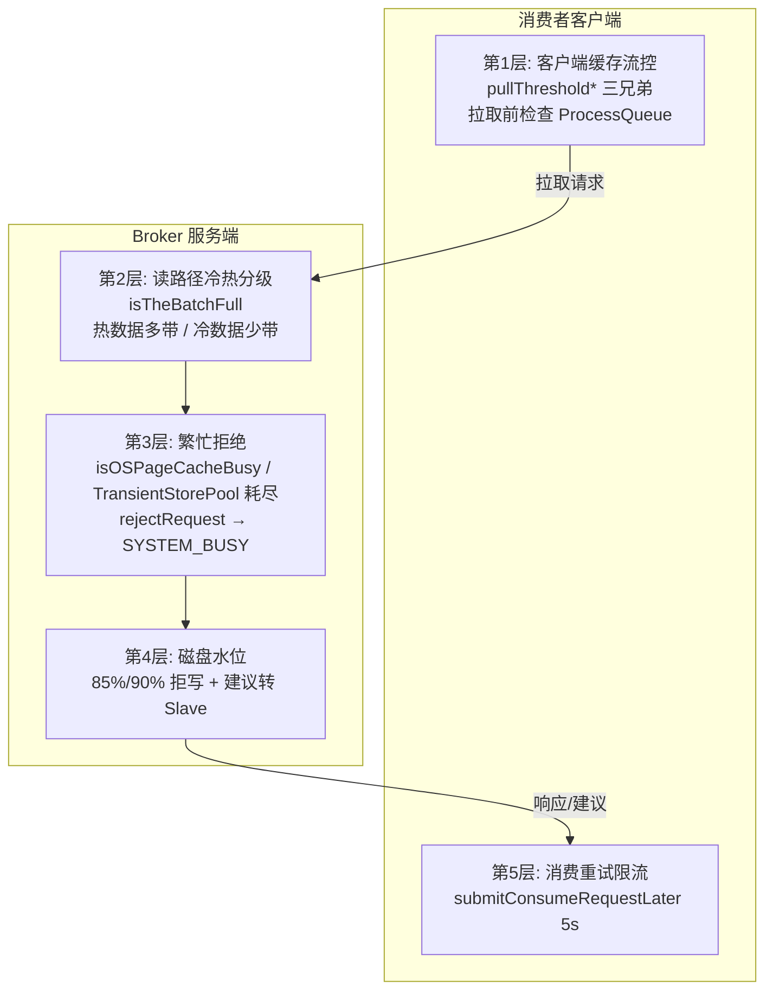
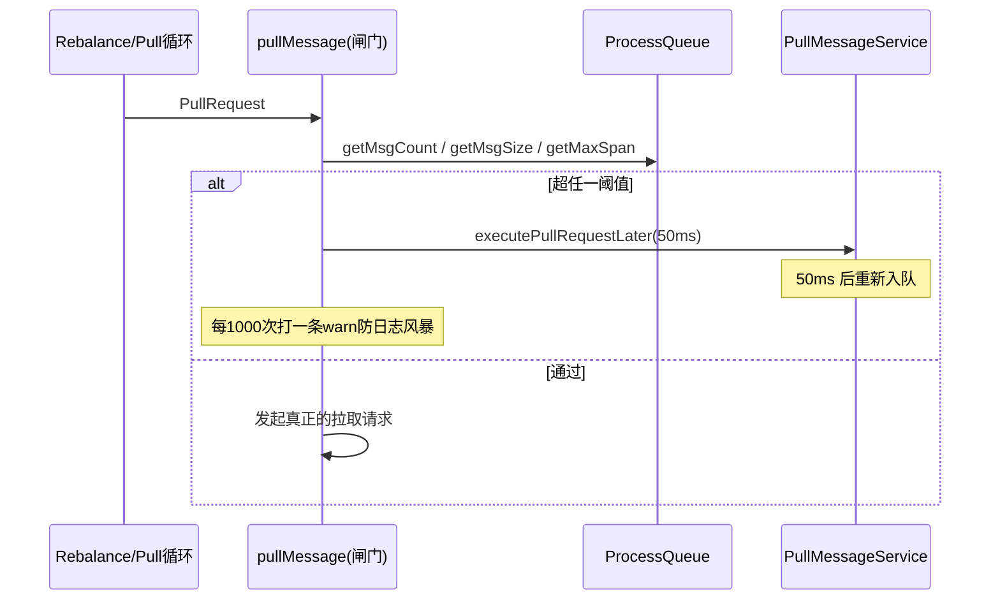
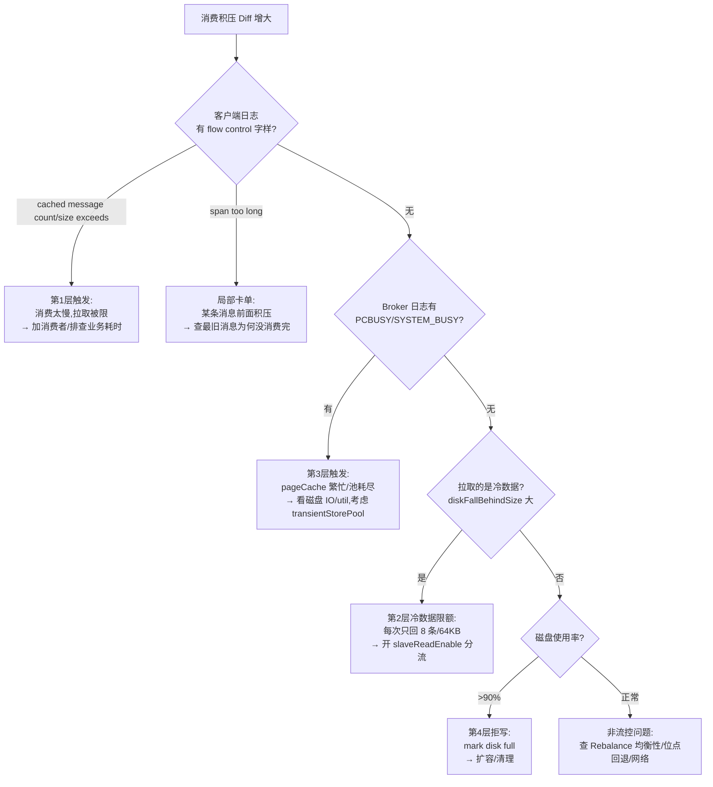

# RocketMQ 流控机制源码深度分析

> 基于 RocketMQ 4.9.8 源码，精读客户端三级缓存流控（`DefaultMQPushConsumerImpl.pullMessage`）、Broker 读路径冷热分级（`DefaultMessageStore.getMessage`）、OS PageCache 繁忙与 TransientStorePool、磁盘水位（`CleanCommitLogService.isSpaceFull`）、BrokerFastFailure 快速失败，回答"消息积压时系统为什么不把自己打死，以及积压到底卡在哪一层"。

---

## 一、全景：五层流控各守一段

消息从存储到消费经过五个可能拥塞的环节，每层都有自己的保护机制：



**为什么流控必须分层？** 单点保护无法区分"谁的问题"：
- 消费者太慢 → 应该限制**它**继续拉（第 1 层，客户端自治）
- Broker 页缓存抖动 → 应该**少给**数据而不是不给（第 2 层，降级服务）
- Broker 真的忙不过来 → 应该**快速拒绝**而不是让请求排队（第 3 层）
- 磁盘快满 → 应该**停止写入**保护存量数据（第 4 层）

---

## 二、第 1 层：客户端缓存流控（pullMessage 前置检查）

`DefaultMQPushConsumerImpl.pullMessage`（`DefaultMQPushConsumerImpl.java:219-303`）是每次拉取的必经关口，四个闸门依次检查：

### 闸门 0：暂停与状态

```java
if (this.isPause()) {                                          // :236-240
    this.executePullRequestLater(pullRequest, PULL_TIME_DELAY_MILLS_WHEN_SUSPEND);   // 1s
    return;
}
```

`consumer.pause()` 手动暂停拉取（运维用），1s 后重试。

### 闸门 1：队列级条数（:245-253）

```java
long cachedMessageCount = processQueue.getMsgCount().get();
long cachedMessageSizeInMiB = processQueue.getMsgSize().get() / (1024 * 1024);

if (cachedMessageCount > this.defaultMQPushConsumer.getPullThresholdForQueue()) {
    this.executePullRequestLater(pullRequest, PULL_TIME_DELAY_MILLS_WHEN_CACHE_FLOW_CONTROL);   // 50ms
    if ((queueFlowControlTimes++ % 1000) == 0) {     // ★ 每 1000 次才打一条 warn，防日志风暴
        log.warn("the cached message count exceeds the threshold {}, so do flow control, ...", ...);
    }
    return;
}
```

`pullThresholdForQueue` 默认 **1000** 条：单个队列本地缓存（ProcessQueue.msgTreeMap 中"已拉未消费"）超过 1000 条，暂停拉取 50ms。

### 闸门 2：队列级字节（:255-263）

```java
if (cachedMessageSizeInMiB > this.defaultMQPushConsumer.getPullThresholdSizeForQueue()) {   // 默认 100 MiB
    this.executePullRequestLater(pullRequest, PULL_TIME_DELAY_MILLS_WHEN_CACHE_FLOW_CONTROL);
    ...
    return;
}
```

条数阈值防不住"单条消息很大"的场景（1KB 与 1MB 的消息 1000 条差 1000 倍内存），字节阈值兜底。

### 闸门 3：消息跨度 maxSpan（:265-275，仅并发模式）

```java
if (!this.consumeOrderly) {
    if (processQueue.getMaxSpan() > this.defaultMQPushConsumer.getConsumeConcurrentlyMaxSpan()) {   // 默认 2000
        this.executePullRequestLater(pullRequest, PULL_TIME_DELAY_MILLS_WHEN_CACHE_FLOW_CONTROL);
        ...
        return;
    }
}
```

`maxSpan = lastKey - firstKey`（树中最大队列偏移 - 最小队列偏移）。**它防的不是内存，是"局部顺序失衡"**：并发消费乱序完成时，可能 offset=5..1000 都消费完了，唯独 offset=3 卡住——此时树里只有 1 条消息（条数/字节阈值都不触发），但 span=997。跨度大说明**后续消息在等前面一条**，继续拉只是白白堆内存。顺序模式跳过此检查（顺序消费本来就要按 span 排）。

### Topic 级阈值的实现真相（:63-77 in RebalancePushImpl）

`pullThresholdForTopic` 不是在拉取时逐次检查——而是在 **Rebalance 回调 `messageQueueChanged` 里换算**：

```java
int currentQueueCount = this.processQueueTable.size();
int pullThresholdForTopic = ...getPullThresholdForTopic();     // 默认 -1 不启用
if (pullThresholdForTopic != -1) {
    int newVal = Math.max(1, pullThresholdForTopic / currentQueueCount);   // 均摊到每个队列
    this.defaultMQPushConsumerImpl.getDefaultMQPushConsumer().setPullThresholdForQueue(newVal);
    log.info("The pullThresholdForQueue is changed from {} to {}", ...);
}
```

Topic 总阈值 ÷ 当前持有队列数 = 新的队列阈值。**副作用**：它直接覆盖了用户单独设置的 `pullThresholdForQueue`，且队列数变化时全组生效——两套阈值同时配会互相打架。

### 流控后干什么：50ms 延迟重排

`PULL_TIME_DELAY_MILLS_WHEN_CACHE_FLOW_CONTROL = 50ms`——被流控的 PullRequest 丢回 `PullMessageService` 的延迟队列，50ms 后重试。不销毁、不丢弃，只是"踩刹车"。注意这是**每个队列独立刹车**：一个队列积压不影响其他队列的拉取。

### 时序图



---

## 三、第 2 层：Broker 读路径冷热分级（isTheBatchFull）

Broker 每次拉取最多返回 32 条（`maxMsgNums`），但**热数据与冷数据的限额不同**。`DefaultMessageStore.getMessage` 循环读取时（:640-645）：

```java
boolean isInDisk = checkInDiskByCommitOffset(offsetPy, maxOffsetPy);
if (this.isTheBatchFull(sizePy, maxMsgNums, getResult.getBufferTotalSize(),
    getResult.getMessageCount(), isInDisk)) {
    break;
}
```

`checkInDiskByCommitOffset`（:1268-1271）的判据：

```java
private boolean checkInDiskByCommitOffset(long offsetPy, long maxOffsetPy) {
    long memory = (long) (StoreUtil.TOTAL_PHYSICAL_MEMORY_SIZE
        * (this.messageStoreConfig.getAccessMessageInMemoryMaxRatio() / 100.0));   // 默认 40% 物理内存
    return (maxOffsetPy - offsetPy) > memory;
}
```

**"冷热"不是看数据是否真的在 pageCache**，而是用距离衡量：这条消息的物理位点距 CommitLog 末端超过"物理内存 × 40%"，就按冷数据处理（大概率要读磁盘）。

`isTheBatchFull`（:1273-1302）按冷热执行不同限额：

```java
private boolean isTheBatchFull(int sizePy, int maxMsgNums, int bufferTotal, int messageTotal, boolean isInDisk) {
    if (0 == bufferTotal || 0 == messageTotal) return false;   // 第一条必带
    if (maxMsgNums <= messageTotal) return true;               // 绝对条数上限

    if (isInDisk) {
        if ((bufferTotal + sizePy) > this.messageStoreConfig.getMaxTransferBytesOnMessageInDisk()) return true;   // 64KB
        if (messageTotal > this.messageStoreConfig.getMaxTransferCountOnMessageInDisk() - 1) return true;         // 8 条
    } else {
        if ((bufferTotal + sizePy) > this.messageStoreConfig.getMaxTransferBytesOnMessageInMemory()) return true; // 256KB
        if (messageTotal > this.messageStoreConfig.getMaxTransferCountOnMessageInMemory() - 1) return true;       // 32 条
    }
    return false;
}
```

| 数据类型 | 判据 | 单次最多字节 | 单次最多条数 |
|----------|------|-------------|-------------|
| 热（在"内存窗口"内） | 距末端 ≤ 40% 物理内存 | 256 KB | 32 条 |
| 冷（超出窗口） | 距末端 > 40% 物理内存 | **64 KB** | **8 条** |

**设计意图**：冷数据每条都要触发磁盘 IO，一次拉 32 条会长时间占住拉取线程和网络——所以冷数据少给（8 条/64KB），让积压消费者更频繁地小批量拉取，避免单个慢请求拖垮整个 Broker 的拉取线程池。这就是**追赶积压时吞吐反而更低**的根源之一。

### 同一函数里的 Slave 建议（:702-705）

```java
long diff = maxOffsetPy - maxPhyOffsetPulling;
long memory = (long) (StoreUtil.TOTAL_PHYSICAL_MEMORY_SIZE
    * (this.messageStoreConfig.getAccessMessageInMemoryMaxRatio() / 100.0));
getResult.setSuggestPullingFromSlave(diff > memory);
```

消费者要拉的数据距 CommitLog 末端超过 40% 物理内存（即**在拉很旧的数据、且大概率要读盘**），响应里带上 `suggestPullingFromSlave=true`。客户端 `PullMessageProcessor.java:266-274`（Broker 侧组装）：

```java
if (this.brokerController.getBrokerConfig().isSlaveReadEnable()) {      // 默认 false！
    if (getMessageResult.isSuggestPullingFromSlave()) {
        responseHeader.setSuggestWhichBrokerId(subscriptionGroupConfig.getWhichBrokerWhenConsumeSlowly());   // 转从
    } else {
        responseHeader.setSuggestWhichBrokerId(subscriptionGroupConfig.getBrokerId());
    }
}
```

**读旧数据的消费者被赶到 Slave**，把磁盘 IO 压力从 Master（还要忙着接收写入）剥离出去。注意 `slaveReadEnable` 默认关闭，需要显式开启才有意义。

---

## 四、第 3 层：Broker 繁忙拒绝（pageCache busy / TransientStorePool）

### isOSPageCacheBusy（`DefaultMessageStore.java:539-544`）

```java
public boolean isOSPageCacheBusy() {
    long begin = this.getCommitLog().getBeginTimeInLock();
    long diff = this.systemClock.now() - begin;
    return diff < 10000000
        && diff > this.messageStoreConfig.getOsPageCacheBusyTimeOutMills();   // 默认 1000ms
}
```

`beginTimeInLock` 是 CommitLog 写消息进入**自旋锁的时刻**。判据：当前距最近一次拿锁超过 1 秒（还没拿到的写线程等了 1s+，说明页缓存刷盘严重阻塞），但小于 10^7ms（排除"从没写过消息"的初始值 0 场景）。**这是对"写入被 pageCache 阻塞"的间接测量**——mmap 写入如果触碰脏页回写，会被内核卡住，锁持有时间随之暴涨。

### TransientStorePool 耗尽（:1596-1598）

```java
public boolean isTransientStorePoolDeficient() {
    return remainTransientStoreBufferNumbs() == 0;
}
```

`transientStorePoolEnable`（**默认 false**）开启后，写路径变为"堆外 DirectBuffer → commit 线程拷贝到 FileChannel"，与 pageCache 解耦，彻底规避 mmap 脏页阻塞锁。代价是池子有限（`transientStorePoolSize` 默认 5 个 1G 缓冲），**池耗尽 = 写入无缓冲可用**，视为繁忙。

### 两道拒绝闸门

**写入侧**——`SendMessageProcessor.rejectRequest`（`SendMessageProcessor.java:110-114`）：

```java
@Override
public boolean rejectRequest() {
    return this.brokerController.getMessageStore().isOSPageCacheBusy()
        || this.brokerController.getMessageStore().isTransientStorePoolDeficient();
}
```

Netty 层在请求进入线程池**之前**调用 rejectRequest，繁忙时直接返回 `SYSTEM_BUSY`（"broker busy, start flow control for a while"），请求根本不排队。

**快速失败清理**——`BrokerFastFailure.cleanExpiredRequest`（`BrokerFastFailure.java:65-94`），每 10ms 执行：

```java
private void cleanExpiredRequest() {
    while (this.brokerController.getMessageStore().isOSPageCacheBusy()) {
        if (!this.brokerController.getSendThreadPoolQueue().isEmpty()) {
            final Runnable runnable = this.brokerController.getSendThreadPoolQueue().poll(0, TimeUnit.SECONDS);
            final RequestTask rt = castRunnable(runnable);
            rt.returnResponse(RemotingSysResponseCode.SYSTEM_BUSY,
                String.format("[PCBUSY_CLEAN_QUEUE]broker busy, start flow control for a while, period in queue: %sms, size of queue: %d", ...));
        } else break;
    }

    cleanExpiredRequestInQueue(sendThreadPoolQueue, waitTimeMillsInSendQueue);      // 默认 200ms
    cleanExpiredRequestInQueue(pullThreadPoolQueue, waitTimeMillsInPullQueue);      // 默认 5s
    cleanExpiredRequestInQueue(heartbeatThreadPoolQueue, waitTimeMillsInHeartbeatQueue);
    cleanExpiredRequestInQueue(endTransactionThreadPoolQueue, ...);
}
```

两个动作：① pageCache 繁忙时把**发送线程池队列里积压的任务直接弹出**并回 SYSTEM_BUSY；② 四个线程池各自的"排队超时"清理——请求在队列里等超过 `waitTimeMillsInSendQueue` 等阈值，直接回 `SYSTEM_BUSY`，不再执行。**宁可拒绝，不让客户端傻等超时**——客户端收到 SYSTEM_BUSY 后走 `pullTimeDelayMillsWhenFlowControl`（pull 侧 3s）退避重试。

### 客户端对 Broker 流控的响应（`DefaultMQPushConsumerImpl.java:408-412`）

```java
if (e instanceof MQBrokerException && ((MQBrokerException) e).getResponseCode() == ResponseCode.FLOW_CONTROL) {
    DefaultMQPushConsumerImpl.this.executePullRequestLater(pullRequest, PULL_TIME_DELAY_MILLS_WHEN_BROKER_FLOW_CONTROL);   // 3s
} else {
    DefaultMQPushConsumerImpl.this.executePullRequestLater(pullRequest, pullTimeDelayMillsWhenException);   // 3s，可配
}
```

区分"Broker 主动流控"（3s 固定退避，礼貌配合）与"普通异常"（可配退避）。

---

## 五、第 4 层：磁盘水位（拒写 + 分级处理）

`CleanCommitLogService`（:1650-1863），三个水位由系统属性控制：

| 水位 | 默认值 | 含义 | 动作 |
|------|--------|------|------|
| `diskMaxUsedSpaceRatio` | 75（配置项） | 磁盘使用率上限 | 触发过期文件删除 |
| `diskSpaceCleanForciblyRatio` | 0.85（sys prop） | 强制清理线 | 立即强制删除（忽略 fileReservedTime） |
| `diskSpaceWarningLevelRatio` | 0.90（sys prop） | 告警/拒写线 | `runningFlags.getAndMakeDiskFull()` |

`isSpaceFull`（:1841-1863）由 10s 周期任务调用（`addScheduleTask`，:1364-1368）：

```java
public boolean isSpaceFull() {
    double physicRatio = calcStorePathPhysicRatio();
    double ratio = ...getDiskMaxUsedSpaceRatio() / 100.0;
    if (physicRatio > ratio) {
        DefaultMessageStore.log.info("physic disk of commitLog used: " + physicRatio);
    }
    if (physicRatio > this.diskSpaceWarningLevelRatio) {
        boolean diskok = DefaultMessageStore.this.runningFlags.getAndMakeDiskFull();
        if (diskok) {
            DefaultMessageStore.log.error("physic disk of commitLog maybe full soon, used " + physicRatio + ", so mark disk full");
        }
        return true;
    } else {
        boolean diskok = DefaultMessageStore.this.runningFlags.getAndMakeDiskOK();
        if (!diskok) {
            DefaultMessageStore.log.info("physic disk space of commitLog OK " + physicRatio + ", so mark disk ok");
        }
        return false;
    }
}
```

`runningFlags` 的 `diskFull` 位被 SendMessageProcessor 检查：满了返回 `SYSTEM_ERROR` + "disk full" 直接拒写（写入检查在 `DefaultMessageStore.putMessage` 里也会查 `isWriteable`）。**注意状态可恢复**：水位降回 90% 以下自动 `getAndMakeDiskOK` 恢复写入，且只在状态翻转时打日志（diskok 布尔语义），不刷屏。

磁盘水位是**最后一道闸**——前面所有流控都是"服务降级"，这一道是"保护性关机"，防止磁盘写满把整个 Broker 进程拖死（连位点 JSON 都写不进）。

---

## 六、第 5 层：消费侧兜底限流

前面四层都在"入口"限流，消费失败堆积还有一道内部闸（详见《消费重试与DLQ》篇）：

- `ConsumeMessageConcurrentlyService.submitConsumeRequestLater`：消费线程池满（`consumeRequestQueue` 积压）时，消息 5s 后重新入队——**消费速度跟不上时不无脑堆队列**。
- 有序模式的 `suspendCurrentQueueTimeMillis`（默认 1s，上限 30s）：失败原地重试的节流阀。

---

## 七、一张表总览所有阈值

| 层 | 参数 | 默认值 | 位置 |
|----|------|--------|------|
| 客户端 | `pullThresholdForQueue` | 1000 条 | pushMessage:245 |
| 客户端 | `pullThresholdSizeForQueue` | 100 MiB | pushMessage:255 |
| 客户端 | `consumeConcurrentlyMaxSpan` | 2000 | pushMessage:266 |
| 客户端 | `pullThresholdForTopic` | -1（不启用） | Rebalance 换算 |
| 客户端 | `pullInterval` | 0（不延迟） | FOUND 分支 :345 |
| 客户端 | `PULL_TIME_DELAY_MILLS_WHEN_CACHE_FLOW_CONTROL` | 50ms | 常量 |
| 客户端 | `PULL_TIME_DELAY_MILLS_WHEN_BROKER_FLOW_CONTROL` | 3000ms | 常量 |
| Broker | `maxTransferBytesOnMessageInMemory` | 256 KB | isTheBatchFull |
| Broker | `maxTransferCountOnMessageInMemory` | 32 条 | isTheBatchFull |
| Broker | `maxTransferBytesOnMessageInDisk` | 64 KB | isTheBatchFull |
| Broker | `maxTransferCountOnMessageInDisk` | 8 条 | isTheBatchFull |
| Broker | `accessMessageInMemoryMaxRatio` | 40（% 物理内存） | 冷热分界 |
| Broker | `osPageCacheBusyTimeOutMills` | 1000ms | isOSPageCacheBusy |
| Broker | `waitTimeMillsInSendQueue` | 200ms | FastFailure |
| Broker | `waitTimeMillsInPullQueue` | 5000ms | FastFailure |
| Broker | `diskMaxUsedSpaceRatio` | 75% | 删除触发 |
| Broker | `diskSpaceCleanForciblyRatio` | 85%（sys prop） | 强制清理 |
| Broker | `diskSpaceWarningLevelRatio` | 90%（sys prop） | 拒写 |
| Broker | `slaveReadEnable` | false | 慢消费转从 |

---

## 八、积压排查决策树（把流控知识变成排障工具）



---

## 九、陷阱清单

| # | 陷阱 | 现象 | 根因 |
|---|------|------|------|
| 1 | **topic 级阈值覆盖队列级** | 单独设置的 pullThresholdForQueue 不生效 | `messageQueueChanged` 直接 `setPullThresholdForQueue(总阈值/队列数)`（RebalancePushImpl:68） |
| 2 | **追赶积压反而更慢** | 清空积压期间 TPS 反而下降 | 冷数据 8 条/64KB 限额（isTheBatchFull），设计如此 |
| 3 | **slaveReadEnable 没开就抱怨 Master 读压力大 | Master 磁盘 IO 打满 | suggestPullingFromSlave 响应了但 Broker 不组装建议（:266） |
| 4 | **消费端大消息** | 条数阈值不触发但 OOM | pullThresholdForQueue=1000 时 1000×4MB=4GB；必须配字节阈值 |
| 5 | **transientStorePoolEnable 乱开** | 内存翻倍 + 池耗尽拒写 | 写路径堆外缓冲与 pageCache 双份内存 |
| 6 | **客户端流控日志误读** | "1000 次才打一条"导致以为没触发 | `queueFlowControlTimes++ % 1000 == 0` 是防日志风暴，实际每 50ms 一次 |
| 7 | **waitTimeMillsInSendQueue 调小求快** | 大量 SYSTEM_BUSY 重试风暴 | 快速失败把排队请求直接拒绝，客户端重试放大流量 |
| 8 | **磁盘水位 90% 拒写被当成故障** | 突然全部发送失败 "disk full" | 保护性设计；降下水位自动恢复 getAndMakeDiskOK |

## 十、运维与调试手册

**日志关键字：**

| 关键字 | 侧 | 含义 |
|--------|-----|------|
| `the cached message count/size exceeds the threshold` | 客户端 | 第 1 层队列级流控（每 1000 次一条） |
| `the queue's messages, span too long` | 客户端 | maxSpan 流控，局部卡单 |
| `[PCBUSY_CLEAN_QUEUE]broker busy` | Broker | FastFailure 清理发送队列 |
| `broker busy, start flow control for a while` | Broker | rejectRequest 拒绝（pageCache/池） |
| `physic disk of commitLog maybe full soon, so mark disk full` | Broker | 90% 水位拒写 |
| `physic disk space of commitLog OK ... so mark disk ok` | Broker | 水位恢复 |
| `The pullThresholdForQueue is changed from ... to ...` | 客户端 | topic 级阈值换算覆盖 |

**mqadmin：**

```bash
# 积压 + 拉取 RT 一眼看全
mqadmin consumerProgress -g myGroup -n 127.0.0.1:9876

# Broker 统计（拉取 TPS / 磁盘 fallen behind）
mqadmin brokerStatus -b <brokerAddr> | grep -i -E "pull|disk"
```

**断点路线：**

| 观察目标 | 断点位置 |
|---------|---------|
| 客户端流控触发 | `DefaultMQPushConsumerImpl.pullMessage:245/255/266` |
| topic 阈值换算 | `RebalancePushImpl.messageQueueChanged:63` |
| 冷热判定 | `DefaultMessageStore.checkInDiskByCommitOffset:1268` |
| 批次限额 | `DefaultMessageStore.isTheBatchFull:1273` |
| 慢消费转从 | `DefaultMessageStore.getMessage:702`（setSuggestPullingFromSlave） |
| 写入繁忙 | `SendMessageProcessor.rejectRequest:111` |
| 快速失败 | `BrokerFastFailure.cleanExpiredRequest:65` |
| 磁盘水位 | `CleanCommitLogService.isSpaceFull:1841` |

## 十一、设计得与失

**得：**
1. **客户端自治流控**是最核心的一层——每个消费者对自己的 ProcessQueue 限流，Broker 无需维护任何消费者级别的配额状态，天然分布式。
2. **冷热分级**用"距末端距离"这个廉价代理指标代替真实 pageCache 探测，零成本实现读降级。
3. **拒绝优先于排队**：rejectRequest 在 Netty 层拦截 + FastFailure 清队列，不让请求在 Broker 内无效等待——快速失败把等待成本转化为客户端的退避节流。
4. 状态翻转才打日志（流控 1000 次一条、磁盘 full/ok 翻转打），日志风暴防控意识贯穿始终。

**失：**
1. `accessMessageInMemoryMaxRatio` 是"物理内存 40%"的静态估计，与真实 pageCache 占用无关，容器内存限制（cgroup）下判断可能严重失真。
2. topic 级阈值用"除法均摊"实现，覆盖队列级配置且随 Rebalance 抖动，语义生硬。
3. 冷数据 8 条/64KB 的惩罚对"刚好在读盘边界的正常消费者"误伤，无平滑过渡。
4. slaveReadEnable 默认关闭，慢消费转从机制形同虚设，多数生产部署从未受益。

## 十二、一句话总结

> **客户端靠 ProcessQueue 三阈值（条数/字节/跨度）自治刹车 50ms，Broker 靠"距末端 40% 内存"判冷热（热 32 条/冷 8 条）降级给量，真忙就 rejectRequest 快速失败 SYSTEM_BUSY，磁盘 90% 一刀切拒写——五层闸门层层把"慢"转化为"少拉一点"而不是"系统打死"，排障时只需定位积压卡在哪一层。**

---

*上一篇：[RocketMQ存储文件恢复与Broker启动全景源码深度分析](RocketMQ存储文件恢复与Broker启动全景源码深度分析.md) · 下一篇：Pop 消费模式（说"下一篇"继续）*
