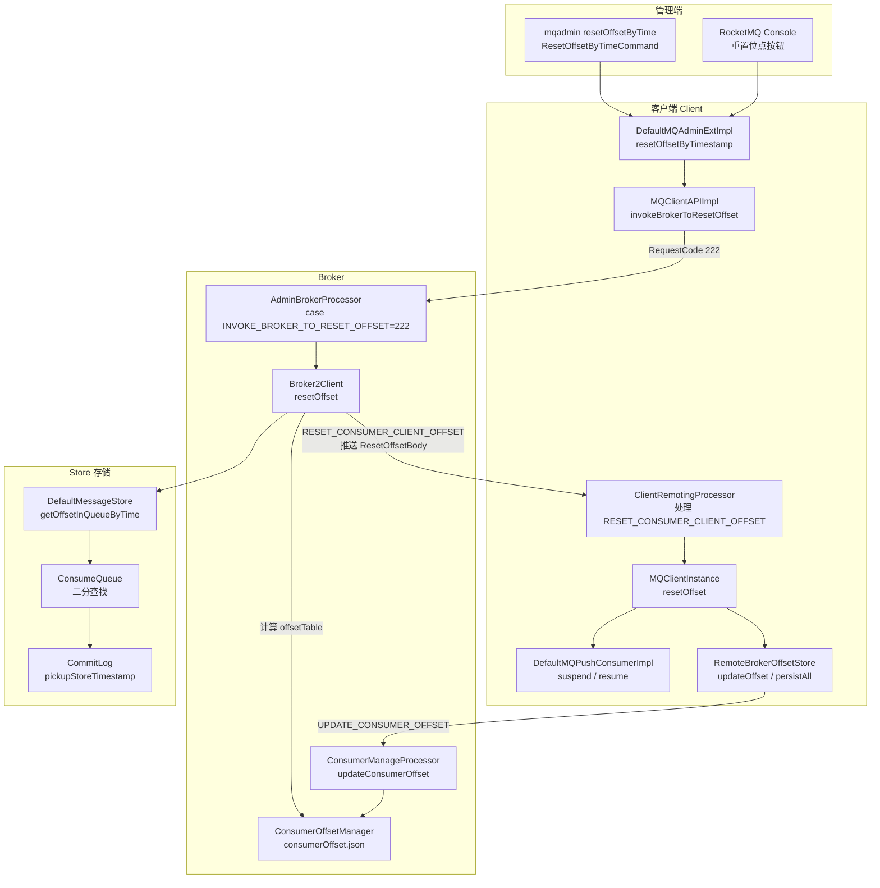
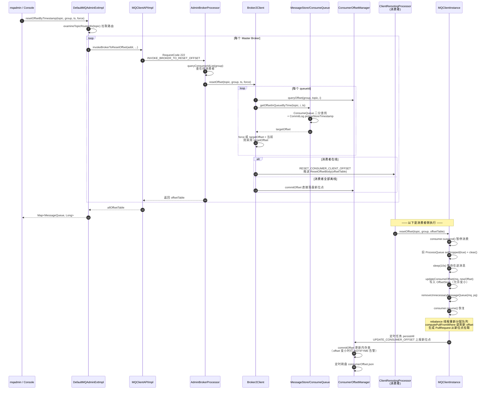
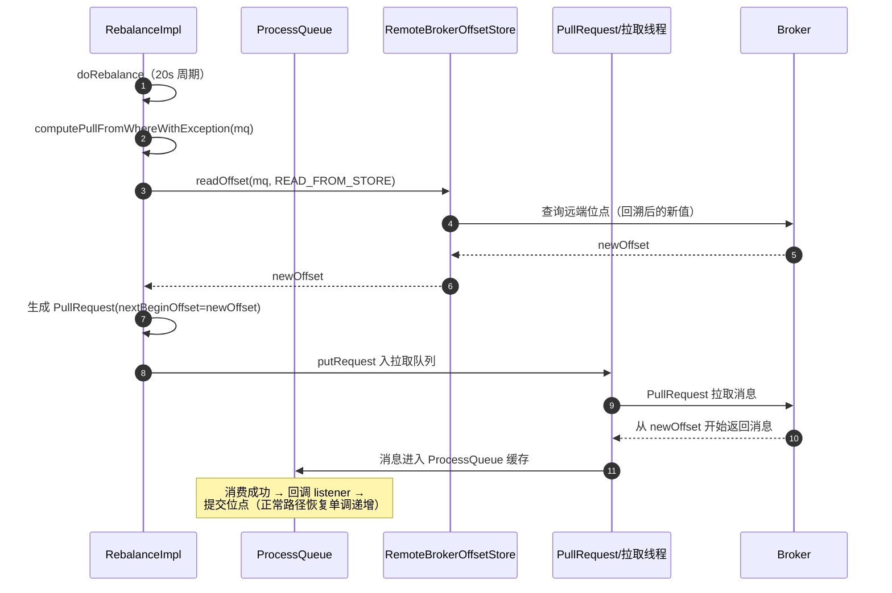
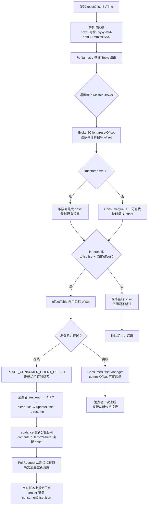
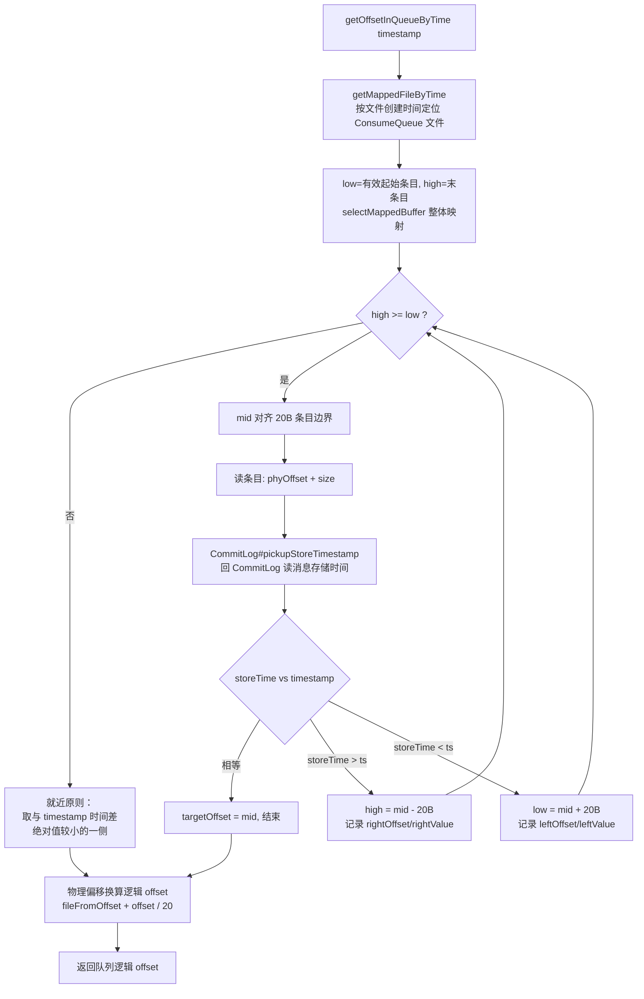
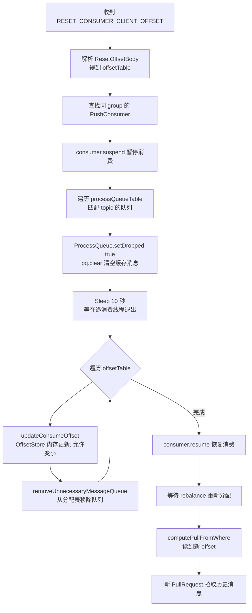
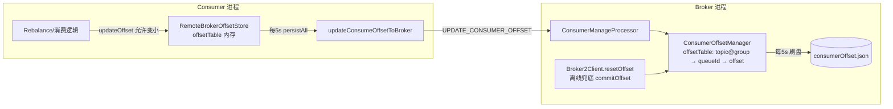

# RocketMQ 4.9.8 消息回溯（Reset Offset）深度解析

> 源码版本：RocketMQ 4.9.8
> 涉及模块：`tools`、`client`、`broker`、`store`

---

## 目录

1. [什么是消息回溯](#一什么是消息回溯)
2. [应用场景](#二应用场景)
3. [具体操作示例](#三具体操作示例)
4. [整体架构](#四整体架构)
5. [源码深度分析](#五源码深度分析)
6. [关键源码：按时间二分查找 offset](#六关键源码按时间二分查找-offset)
7. [时序图](#七时序图)
8. [流程图汇总](#八流程图汇总)
9. [注意事项与最佳实践](#九注意事项与最佳实践)

---

## 一、什么是消息回溯

**消息回溯（消息重置 / Reset Offset）** 是指把某个消费者组（Consumer Group）在某个 Topic 上的**消费位点（Consumer Offset）** 回退到历史某个位置（按 offset 或按时间戳），使消费者**重新消费该位置之后的历史消息**。

正常消费流程中，位点只增不减：

```
消费成功 → offset + 1 → 上报 Broker → 持久化到 consumerOffset.json
```

消息回溯则打破这个单调性，把位点"倒拨"：

```
回溯前：  [0] [1] [2] [3] [4] [5] [6] ← offset = 6（正在消费）
回溯到 3：[0] [1] [2] [3] [4] [5] [6] ← offset = 3（消息 3/4/5 将被重新消费）
```

### 核心数据结构

Broker 端位点存储在 `ConsumerOffsetManager` 中（`broker/src/main/java/org/apache/rocketmq/broker/offset/ConsumerOffsetManager.java`），落盘文件为 `${storePathRootDir}/config/consumerOffset.json`：

```java
// key = "topic@group"，value = <queueId, offset>
protected ConcurrentMap<String/* topic@group */, ConcurrentMap<Integer, Long>> offsetTable =
    new ConcurrentHashMap<String, ConcurrentMap<Integer, Long>>(512);
```

文件内容示例：

```json
{
  "offsetTable": {
    "TopicTest@my_consumer_group": { "0": 3520, "1": 3521, "2": 3519, "3": 3520 }
  }
}
```

**消息回溯的本质 = 修改这张表 + 通知在线消费者从新位点拉取。**

---

## 二、应用场景

| 场景 | 说明 |
|------|------|
| 消费逻辑 Bug 修复 | 上线新逻辑后重新消费之前处理失败/错误的消息 |
| 数据回灌 | 新业务需要消费 N 天前的历史消息 |
| 消息丢失恢复 | 消费者宕机期间消息被跳过（异常提交位点） |
| 新增旁路业务 | 新 Group 指定从某个时间点开始消费 |
| 测试验证 | 重放流量验证消费逻辑正确性 |

---

## 三、具体操作示例

### 3.1 mqadmin 按时间重置（最常用）

命令实现类：`tools/src/main/java/org/apache/rocketmq/tools/command/offset/ResetOffsetByTimeCommand.java`

```bash
sh mqadmin resetOffsetByTime -n 127.0.0.1:9876 \
  -g my_consumer_group \
  -t TopicTest \
  -s "2026-09-20#10:00:00:000" \
  -f true
```

**参数说明**：

| 参数 | 含义 |
|------|------|
| `-n` | Namesrv 地址 |
| `-g` | 消费者组（必填） |
| `-t` | Topic（必填） |
| `-s` | 时间戳（必填），支持三种格式：`now` / 毫秒时间戳 / `yyyy-MM-dd#HH:mm:ss:SSS` |
| `-f` | 是否强制回滚（默认 `true`）。`true`：即使目标 offset 大于当前 offset 也强制重置；`false`：只允许位点"变小" |
| `-c` | 是否重置 C++ 客户端位点 |

> ⚠️ `-f true` 是"危险开关"：设为 true 时，如果时间戳对应 offset **大于**当前位点，也会把位点向前跳（跳过消息）；设为 false 则只回退不前进。

### 3.2 控制台操作

RocketMQ Console（rocketmq-dashboard）→ Consumer 页面 → 「重置位点」按钮，选择时间点提交。其底层与 mqadmin 完全相同，调用 `DefaultMQAdminExt#resetOffsetByTimestamp`。

### 3.3 Java API 方式

```java
DefaultMQAdminExt admin = new DefaultMQAdminExt();
admin.setNamesrvAddr("127.0.0.1:9876");
admin.start();

// isForce = false：仅当目标 offset < 当前 offset 时才回退
Map<MessageQueue, Long> offsetTable =
    admin.resetOffsetByTimestamp("TopicTest", "my_consumer_group",
        System.currentTimeMillis() - 3600_000L, false);

offsetTable.forEach((mq, offset) ->
    System.out.println(mq + " -> " + offset));

admin.shutdown();
```

### 3.4 LitePullConsumer 主动 seek

Push 消费者没有 `seek` 方法（重置依赖 Broker 通知），但 **`DefaultLitePullConsumer` 提供了 `seek`**，可在运行期自行回溯：

```java
DefaultLitePullConsumer consumer = new DefaultLitePullConsumer("my_group");
consumer.setNamesrvAddr("127.0.0.1:9876");
consumer.subscribe("TopicTest", "*");
consumer.start();

// 将某个队列的拉取位点直接 seek 到指定 offset
Collection<MessageQueue> mqs = consumer.fetchMessageQueues("TopicTest");
for (MessageQueue mq : mqs) {
    consumer.seek(mq, 100L);   // 从 offset=100 开始重新拉取
}
```

### 3.5 验证

```bash
# 查看消费进度（对比 offset 是否已回退）
sh mqadmin consumerProgress -n 127.0.0.1:9876 -g my_consumer_group
```

---

## 四、整体架构



**两阶段设计**是 RocketMQ 消息回溯最精妙的地方：

1. **第一阶段（在线消费者）**：Broker 不直接改自己的位点表，而是把计算好的 offsetTable **推送给在线消费者**，由消费者自己暂停、丢弃缓存、更新本地 offset，再通过正常的位点上报流程"自证"地把新位点提交回 Broker——保证了内存中未消费消息不会乱序或重复提交。
2. **第二阶段（离线兜底）**：如果消费者组全部离线，Broker 直接落盘新位点（`resetOffset` 中 `consumerOffsetManager.commitOffset`）。

---

## 五、源码深度分析

### 5.1 管理端入口：ResetOffsetByTimeCommand

`tools/.../command/offset/ResetOffsetByTimeCommand.java`：

```java
// 时间戳解析：支持 now / 毫秒值 / yyyy-MM-dd#HH:mm:ss:SSS
long timestamp = timeStamp.length() == 9 ? Long.parseLong(timeStamp) : 0;
if ("now".equals(timeStamp)) {
    timestamp = System.currentTimeMillis();
} else if (timestamp == 0) {
    timestamp = Timestamp.parse(timeStamp).getTime(); // yyyy-MM-dd#HH:mm:ss:SSS
}

// isForce 默认 true；timestamp == -1 表示跳到最大 offset（跳过所有消息）
Map<MessageQueue, Long> offsetTable = defaultMQAdminExt.resetOffsetByTimestamp(
    topic, group, timestamp, force);
```

### 5.2 客户端管理 API：DefaultMQAdminExtImpl

`tools/.../admin/DefaultMQAdminExtImpl.java`：

```java
public Map<MessageQueue, Long> resetOffsetByTimestamp(String topic, String group,
        long timestamp, boolean isForce, boolean isC) {
    // 1. 从 Namesrv 拉取 Topic 路由
    TopicRouteData topicRouteData = this.examineTopicRouteInfo(topic);
    Map<MessageQueue, Long> allOffsetTable = new HashMap<>();
    // 2. 遍历该 Topic 的所有 Master Broker
    for (BrokerData brokerData : topicRouteData.getBrokerDatas()) {
        String addr = brokerData.selectBrokerAddr();
        Map<MessageQueue, Long> offsetTable =
            this.mqClientInstance.getMQClientAPIImpl()
                .invokeBrokerToResetOffset(addr, topic, group, timestamp, isForce, timeout, isC);
        allOffsetTable.putAll(offsetTable);
    }
    return allOffsetTable;
}
```

`MQClientAPIImpl#invokeBrokerToResetOffset` 构造 `RequestCode.INVOKE_BROKER_TO_RESET_OFFSET (222)` 请求，**同步阻塞**等待 Broker 返回。

### 5.3 Broker 端：AdminBrokerProcessor → Broker2Client

`broker/.../processor/AdminBrokerProcessor.java`：

```java
case RequestCode.INVOKE_BROKER_TO_RESET_OFFSET:
    return this.resetOffset(ctx, request);
```

`AdminBrokerProcessor#resetOffset` 做三件事：

```java
// 1. 查询该 group 在该 broker 上所有在线的 consumer id
Set<String> consumerIdSet = this.brokerController.getConsumerManager()
    .queryTopicConsumeByWho(topic) ... queryConsumerIdList(group, topic);
// 2. 委托 Broker2Client 计算并下发
RemotingCommand resetOffsetBuilder = this.broker2Client.resetOffset(...)
    .setCode(RequestCode.RESET_CONSUMER_CLIENT_OFFSET);
// 3. 消费者全部离线 → 直接落盘
if (idSet.isEmpty()) {
    ... brokerController.getConsumerOffsetManager()
        .commitOffset(RemotingHelper.parseChannelRemoteAddr(ctx.channel()),
            requestHeader.getGroup(), topic, queueId, offset);
}
```

核心计算在 `broker/.../client/net/Broker2Client.java#resetOffset`：

```java
for (int i = 0; i < topicConfig.getReadQueueNums(); i++) {
    MessageQueue mq = new MessageQueue(topic, brokerName, i);
    // 当前已提交位点
    long consumerOffset = consumerOffsetManager.queryOffset(group, topic, i);
    // 目标位点：timestamp == -1 → 最大 offset；否则按时间查找
    long timeStampOffset = (timeStamp == -1)
        ? messageStore.getMaxOffsetInQueue(topic, i)
        : messageStore.getOffsetInQueueByTime(topic, i, timeStamp);

    // ★ 关键分支：force / 只回退
    if (isForce || timeStampOffset < consumerOffset) {
        offsetTable.put(mq, timeStampOffset);   // 强制 → 无条件使用目标位点
    } else {
        offsetTable.put(mq, consumerOffset);    // 非 force 且目标更大 → 保持原位点
    }
}
// 逐个向在线 consumer 推送 RESET_CONSUMER_CLIENT_OFFSET + ResetOffsetBody(offsetTable)
```

### 5.4 消费者端接收推送：ClientRemotingProcessor

`client/.../impl/ClientRemotingProcessor.java`：

```java
case RequestCode.RESET_CONSUMER_CLIENT_OFFSET:
    return this.resetOffset(ctx, request);
```

解析 `ResetOffsetBody` 中的 `offsetTable` 后调用 `MQClientInstance#resetOffset`：

```java
public synchronized void resetOffset(String topic, String group,
        Map<MessageQueue, Long> offsetTable) {
    DefaultMQPushConsumerImpl consumer = ...;
    try {
        consumer.suspend();                          // ① 暂停消费（拦截新消息进入）
        // ② 将旧 ProcessQueue 标记 dropped 并清空（丢弃内存中已拉取未消费的消息）
        for (entry : processQueueTable.entrySet()) {
            if (topic.equals(mq.getTopic()) && offsetTable.containsKey(mq)) {
                pq.setDropped(true);
                pq.clear();
            }
        }
        TimeUnit.SECONDS.sleep(10);                  // ③ 等待在途消息处理完
        // ④ 更新本地 offset 并移除队列，触发 rebalance 重建
        for (mq : offsetTable.keySet()) {
            consumer.updateConsumeOffset(mq, offset);            // 写入 OffsetStore 内存
            consumer.getRebalanceImpl()
                .removeUnnecessaryMessageQueue(mq, pq);          // 从 processQueueTable 移除
        }
    } finally {
        consumer.resume();                            // ⑤ 恢复消费
    }
}
```

> **为什么 `sleep(10)`？** 丢弃 ProcessQueue 后，可能仍有消费线程正在处理该队列的消息，`removeUnnecessaryMessageQueue` 内部要确保位点正确提交，sleep 是给在途消费线程的缓冲窗口，防止旧位点覆盖新位点。

### 5.5 位点更新与上报：RemoteBrokerOffsetStore

`client/.../consumer/store/RemoteBrokerOffsetStore.java`：

```java
// 更新本地内存位点（回溯时 increaseOnly = false，允许变小）
public void updateOffset(MessageQueue mq, long offset, boolean increaseOnly) {
    AtomicLong offsetOld = this.offsetTable.get(mq);
    if (null == offsetOld) {
        offsetOld = this.offsetTable.putIfAbsent(mq, new AtomicLong(offset));
    }
    if (null != offsetOld) {
        if (increaseOnly) MixAll.compareAndIncreaseOnly(offsetOld, offset);
        else offsetOld.set(offset);      // ← 回溯走这里，直接覆盖
    }
}
```

`DefaultMQPushConsumerImpl#updateConsumeOffset` 调用 `offsetStore.updateOffset(mq, offset, false)`，随后由定时任务（每 5s，`MQClientInstance#persistAllConsumerOffset`）执行 `persistAll` → `updateConsumeOffsetToBroker` 上报：

```java
private void updateConsumeOffsetToBroker(MessageQueue mq, long offset, boolean isOneway) {
    UpdateConsumerOffsetRequestHeader requestHeader = new UpdateConsumerOffsetRequestHeader();
    requestHeader.setTopic(mq.getTopic());
    requestHeader.setConsumerGroup(this.groupName);
    requestHeader.setQueueId(mq.getQueueId());
    requestHeader.setCommitOffset(offset);
    // RequestCode.UPDATE_CONSUMER_OFFSET，目标 Master Broker
    ...
}
```

Broker 端 `ConsumerManageProcessor#updateConsumerOffset` → `ConsumerOffsetManager#commitOffset`，同时会打印告警（回溯场景下新 offset 小于旧 offset）：

```java
Long storeOffset = map.put(queueId, offset);
if (storeOffset != null && offset < storeOffset) {
    log.warn("[NOTIFYME]update consumer offset less than store. clientHost={}, key={}, "
        + "queueId={}, requestOffset={}, storeOffset={}", ...);
}
```

> 注意：`ConsumerOffsetManager` 是内存结构 + 定时（默认 5s，`brokerController.getScheduledExecutorService`）刷盘到 `consumerOffset.json`，所以回溯后几秒内 Broker 宕机有极小概率丢失重置结果。

### 5.6 Rebalance 后如何从新位点拉取

队列被移除后，rebalance 线程（每 20s）会重新分配该队列。分配成功后调用 `RebalancePushImpl#computePullFromWhereWithException` 计算拉取起点：

```java
case CONSUME_FROM_LAST_OFFSET: {
    // 优先从 OffsetStore 读（READ_FROM_STORE：远程模式直接查 Broker）
    long lastOffset = offsetStore.readOffset(mq, ReadOffsetType.READ_FROM_STORE);
    if (lastOffset >= 0) {
        result = lastOffset;      // ← 回溯后的新 offset 在这里生效
    } else if (-1 == lastOffset) {
        result = this.mQClientFactory.getMQAdminImpl().maxOffset(mq);
    }
    break;
}
```

拿到位点后创建 `PullRequest(offset = 新位点)` 放入拉取线程池，`ProcessQueue#setNextBeginOffset`，从新 offset 开始 `pull` —— **回溯后的消息被重新拉取、重新消费**。

### 5.7 LitePullConsumer 的 seek（对照实现）

`DefaultLitePullConsumer#seek` 的思路更直接：更新 assignment 中该队列的 offset 并重置对应的 `ProcessQueue` 缓冲，拉取循环 `PullTaskImpl` 下轮从新 offset 拉取——因为它不经过 Broker 推送，适合程序内自主回溯。

---

## 六、关键源码：按时间二分查找 offset

这是消息回溯最核心的存储层算法：`store/src/main/java/org/apache/rocketmq/store/ConsumeQueue.java#getOffsetInQueueByTime`。

**背景知识**：ConsumeQueue 是 CommitLog 的索引文件，每个条目固定 `CQ_STORE_UNIT_SIZE = 20` 字节（8B 物理偏移 + 4B 消息长度 + 8B tag hashcode），但**条目本身不含时间戳**。因此查找时需要根据物理偏移回到 CommitLog 读取消息头里的存储时间（`pickupStoreTimestamp`）。

```java
public long getOffsetInQueueByTime(final long timestamp) {
    // 1. 按时间定位到大致的 ConsumeQueue 物理文件（每个文件约 30 万条目）
    MappedFile mappedFile = this.mappedFileQueue.getMappedFileByTime(timestamp);
    if (mappedFile != null) {
        int low = minLogicOffset > mappedFile.getFileFromOffset()
            ? (int) (minLogicOffset - mappedFile.getFileFromOffset()) : 0;
        int high;
        SelectMappedBufferResult sbr = mappedFile.selectMappedBuffer(0);
        ByteBuffer byteBuffer = sbr.getByteBuffer();
        high = byteBuffer.limit() - CQ_STORE_UNIT_SIZE;

        // 2. 对 ConsumeQueue 索引条目做二分查找
        while (high >= low) {
            // mid 必须对齐到 20 字节条目边界
            midOffset = (low + high) / (2 * CQ_STORE_UNIT_SIZE) * CQ_STORE_UNIT_SIZE;
            byteBuffer.position(midOffset);
            long phyOffset = byteBuffer.getLong();   // 8B：CommitLog 物理偏移
            int size = byteBuffer.getInt();          // 4B：消息总大小
            // 3. 回 CommitLog 取该消息的存储时间戳
            long storeTime = this.defaultMessageStore
                .getCommitLog().pickupStoreTimestamp(phyOffset, size);

            if (storeTime == timestamp) { targetOffset = midOffset; break; }
            else if (storeTime > timestamp) {        // 目标在前半段
                high = midOffset - CQ_STORE_UNIT_SIZE;
                rightOffset = midOffset; rightIndexValue = storeTime;
            } else {                                 // 目标在后半段
                low = midOffset + CQ_STORE_UNIT_SIZE;
                leftOffset = midOffset; leftIndexValue = storeTime;
            }
        }

        // 4. 无精确匹配 → 取与 timestamp 绝对差值更近的一侧
        if (targetOffset != -1) offset = targetOffset;
        else if (leftIndexValue == -1)  offset = rightOffset;
        else if (rightIndexValue == -1) offset = leftOffset;
        else offset = Math.abs(timestamp - leftIndexValue)
                    > Math.abs(timestamp - rightIndexValue) ? rightOffset : leftOffset;

        // 5. 物理偏移换算回队列逻辑 offset（每个条目 20B，mmap 定位）
        return (mappedFile.getFileFromOffset() + offset) / CQ_STORE_UNIT_SIZE;
    }
    return 0;
}
```

**算法要点**：

1. **两级定位**：先 `getMappedFileByTime` 用文件创建时间粗定位 ConsumeQueue 文件，再在文件内二分。
2. **索引无时间戳**：二分比较的是 `CommitLog#pickupStoreTimestamp` 的结果，即"每比较一次就回 CommitLog 读一次消息头（`MessageExtEncoder` 中的 storeTimestamp 字段）"。
3. **就近原则**：找不到精确匹配时，取时间差绝对值较小的那条消息（保证回溯起点最接近目标时间）。
4. 复杂度 O(log n) 次索引比较 + O(log n) 次 CommitLog 随机读（PageCache 命中时开销很小）。

---

## 七、时序图

### 7.1 主流程：按时间重置（在线消费者）



### 7.2 消费者侧细化的状态流转



---

## 八、流程图汇总

### 8.1 消息回溯总体流程



### 8.2 ConsumeQueue 二分查找算法



### 8.3 消费者处理重置请求（MQClientInstance#resetOffset）



### 8.4 位点存储与同步架构



---

## 九、注意事项与最佳实践

### 9.1 消息会重复消费 → 必须幂等

回溯后历史消息重新投递，消费端**必须保证幂等**（业务唯一键去重、状态机校验等）。

### 9.2 受消息保留时间限制

RocketMQ 默认保留 72 小时（`fileReservedTime=72`），过期消息被物理删除。若回溯时间点早于最小 offset，`getOffsetInQueueByTime` 会返回文件起点，实际从最早可用消息开始。

### 9.3 `-f` 参数语义

| force | 目标 offset < 当前 | 目标 offset > 当前 |
|-------|------------------|------------------|
| `true`（默认） | 回退 | **前进（跳过消息）** |
| `false` | 回退 | 保持不变 |

只想"回退"请显式加 `-f false`，避免误跳消息。

### 9.4 集群模式 vs 广播模式

- **集群模式**：本文主流程（Broker 推送 / Broker 落盘）。
- **广播模式**：位点存在消费者本地 `~/.rocketmq_offsets/`（`LocalFileOffsetStore`），mqadmin 的 resetOffsetByTime 对其无效，需手动修改本地 offset 文件。

### 9.5 在线 vs 离线重置的差异

| 场景 | 实现路径 | 生效时机 |
|------|---------|---------|
| 消费者在线 | Broker 推送 → 消费者自行清缓存、更新位点 | 立即（秒级，含 10s 缓冲） |
| 消费者离线 | Broker 直接改 `ConsumerOffsetManager` 并落盘 | 消费者下次启动时 |

在线重置之所以不直接改 Broker 位点，是为了避免消费者内存中已拉取的消息继续以旧位点提交，覆盖掉重置结果——**由消费者主动"承认"新位点，再走正常上报链路，保证最终一致**。

### 9.6 关键源码索引

| 功能 | 类#方法 | 路径 |
|------|--------|------|
| 命令入口 | `ResetOffsetByTimeCommand` | `tools/.../command/offset/` |
| 管理实现 | `DefaultMQAdminExtImpl#resetOffsetByTimestamp` | `tools/.../admin/` |
| 请求构造 | `MQClientAPIImpl#invokeBrokerToResetOffset` | `client/.../impl/` |
| Broker 分发 | `AdminBrokerProcessor#resetOffset`（RequestCode 222） | `broker/.../processor/` |
| 核心计算+下发 | `Broker2Client#resetOffset` | `broker/.../client/net/` |
| 时间二分查找 | `ConsumeQueue#getOffsetInQueueByTime` | `store/` |
| 消费者接收 | `ClientRemotingProcessor#resetOffset` | `client/.../impl/` |
| 消费者执行 | `MQClientInstance#resetOffset` | `client/.../impl/` |
| 位点存储(客户端) | `RemoteBrokerOffsetStore#updateOffset/persistAll` | `client/.../consumer/store/` |
| 位点存储(Broker) | `ConsumerOffsetManager#commitOffset` | `broker/.../offset/` |
| 拉取起点 | `RebalancePushImpl#computePullFromWhereWithException` | `client/.../consumer/` |

---

> **一句话总结**：消息回溯 = 管理端发起 → Broker 用 ConsumeQueue 二分查找把时间戳换算成 offset → 推送给在线消费者（或离线直接落盘）→ 消费者暂停并清空缓存、更新本地位点 → rebalance 后从新位点重新拉取，历史消息得以重放。
