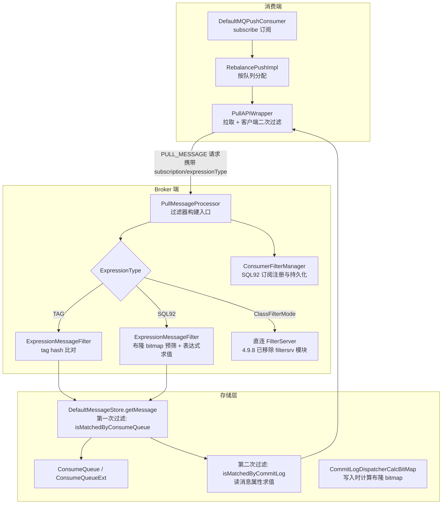
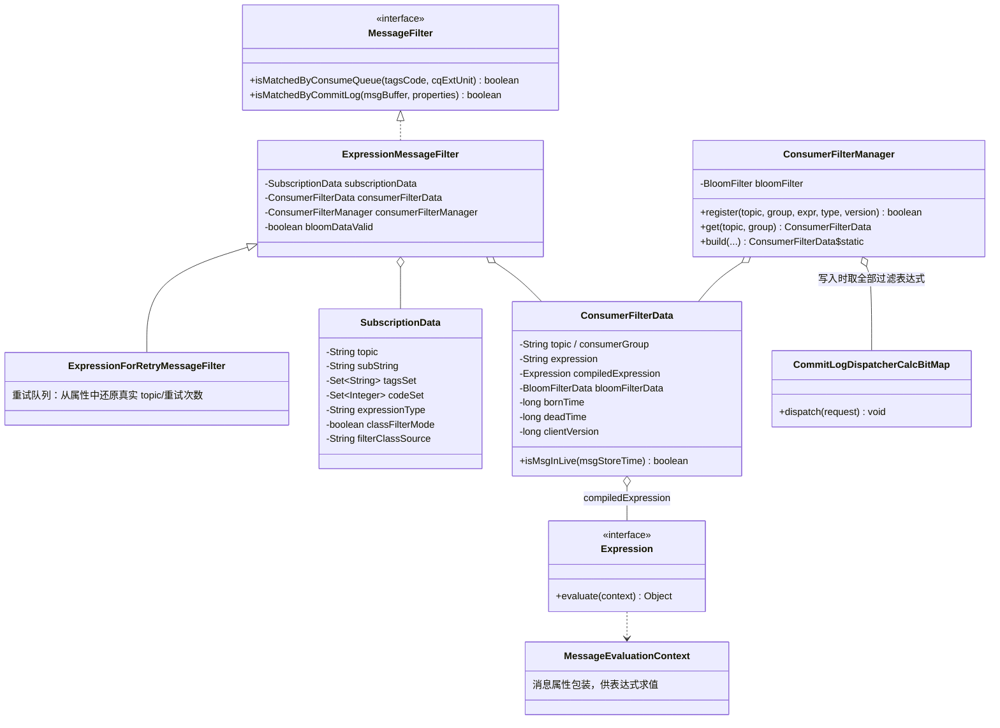
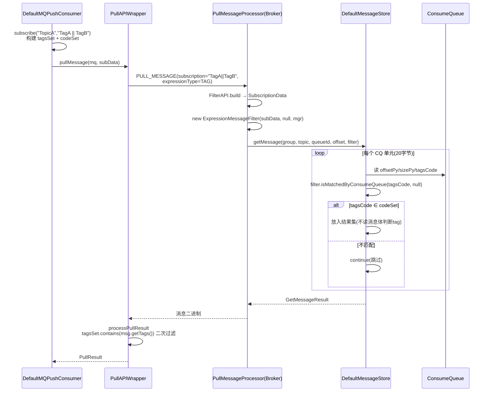
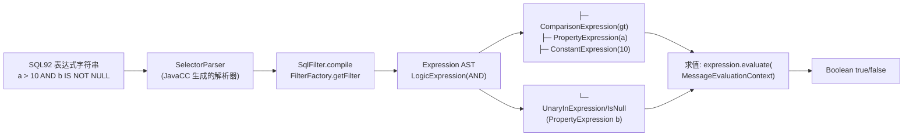
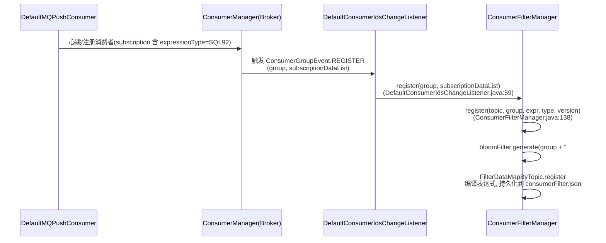
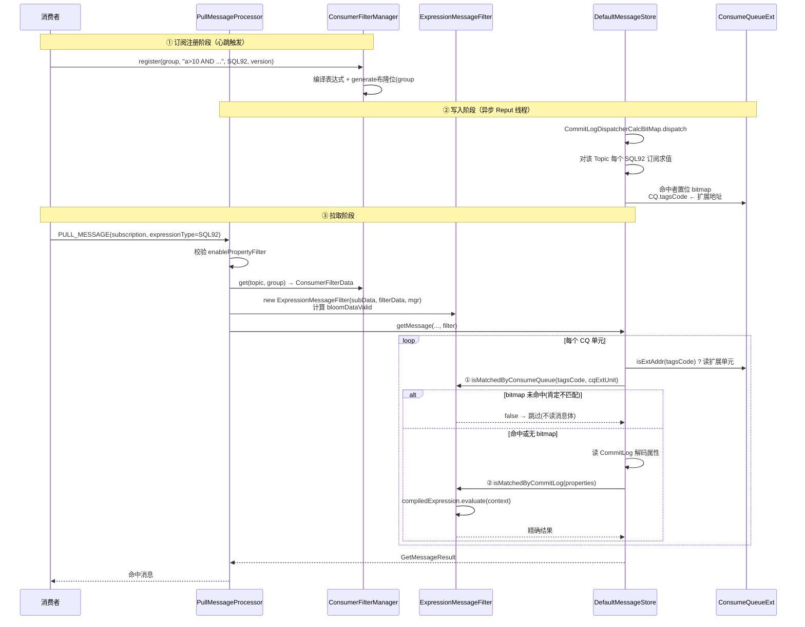
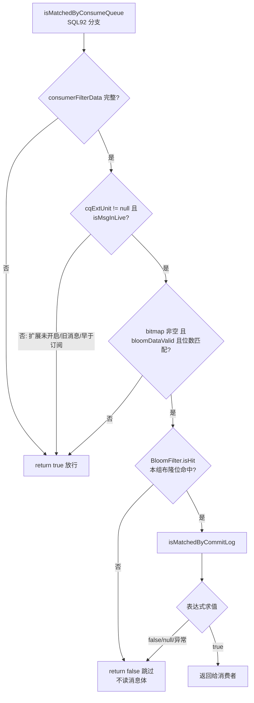
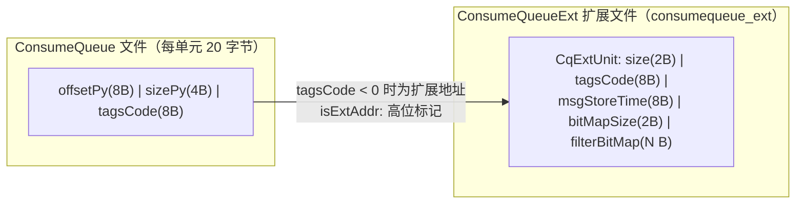
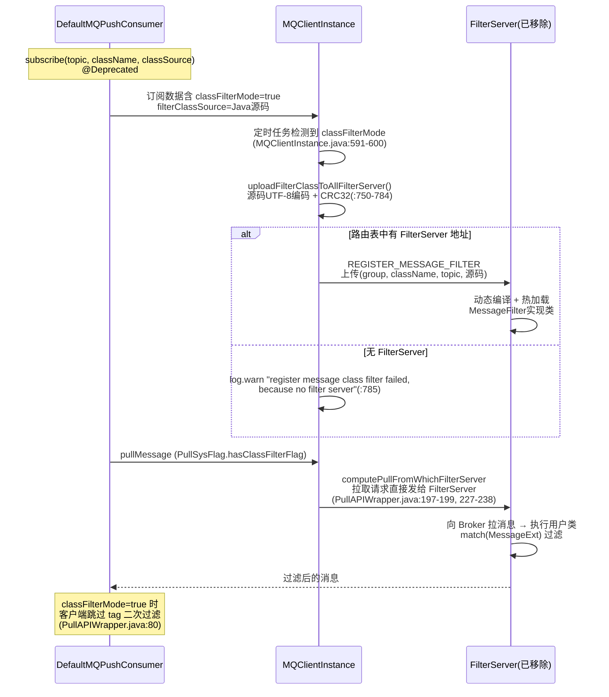
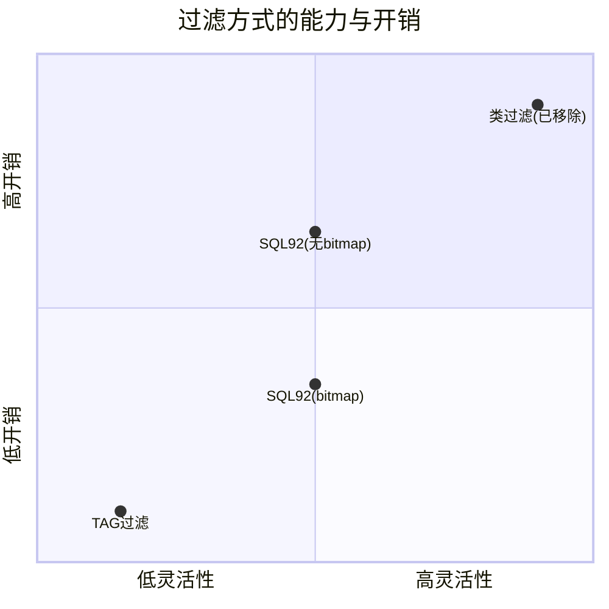

# RocketMQ 消息过滤原理源码深度分析（4.9.8）

> 基于 RocketMQ 4.9.8 源码，深入剖析 TAG 过滤、SQL92 过滤、类过滤（ClassFilterMode）三种过滤方式的完整执行流程。
> 所有结论均标注源码位置：`文件路径:行号`。

---

## 目录

1. [总体架构](#1-总体架构)
2. [过滤体系核心类图](#2-过滤体系核心类图)
3. [TAG 过滤执行流程](#3-tag-过滤执行流程)
4. [SQL92 过滤执行流程](#4-sql92-过滤执行流程)
5. [布隆过滤器与 ConsumeQueue 扩展文件](#5-布隆过滤器与-consumequeue-扩展文件)
6. [类过滤（ClassFilterMode）执行流程](#6-类过滤classfiltermode执行流程)
7. [三种过滤方式对比](#7-三种过滤方式对比)
8. [关键配置汇总](#8-关键配置汇总)

---

## 1. 总体架构

RocketMQ 的消息过滤横跨 **消费端 → Broker → 存储层** 三个层次：



核心思想：

- **TAG 过滤**：Broker 端在 ConsumeQueue 层用 tag hash 比对（不读消息体），客户端再做一次字符串精确比对兜底（防止 hash 碰撞）。
- **SQL92 过滤**：Broker 端两阶段过滤——先在 ConsumeQueue 扩展文件层用**布隆过滤器 bitmap** 预筛（不读消息体），命中的消息再读 CommitLog 解析属性、执行 SQL92 表达式。
- **类过滤**：拉取请求直接路由到独立的 FilterServer 进程执行用户自定义 Java 类。**4.9.8 已从源码中移除 filtersrv 模块**，仅保留客户端兼容代码（`MQClientInstance.java:746` 注释明确说明 *filterServer was removed*）。

---

## 2. 过滤体系核心类图



---

## 3. TAG 过滤执行流程

### 3.1 原理概述

TAG 过滤利用 **ConsumeQueue 存储单元中的 tagsCode 字段**（tag 字符串的 `hashCode()`）完成服务端比对，**完全不需要读 CommitLog 消息体**，性能极高；客户端收到消息后再用原始 tag 字符串做一次精确比对，兜底 hash 碰撞。

### 3.2 生产端：tag 写入与 tagsCode 计算

tag 存在消息属性 `PROPERTY_TAGS = "TAGS"` 中。构建存储消息时计算 tagsCode：

```java
// store/src/main/java/org/apache/rocketmq/store/MessageExtBrokerInner.java:39
public static long tagsString2tagsCode(final TopicFilterType filter, final String tags) {
    if (null == tags || tags.length() == 0) {
        return 0;
    }
    return tags.hashCode();   // Java String.hashCode，int 提升为 long
}
```

> 注意：若该 Topic 需要 SQL92 过滤（`TopicFilterType.SINGLE_TAG`/`MULTI_TAG` 且 broker 开启了扩展存储），`CommitLog#assignOffset`/`ConsumeQueue#putMessagePositionInfo` 会把 ConsumeQueue 里的 tagsCode 替换为 **ConsumeQueueExt 的扩展地址**（负数，见第 5 节），原始 tag hash 挪到扩展单元里。TAG 与 SQL92 的存储格式由此统一。

### 3.3 消费端：订阅数据构建

```java
// common/src/main/java/org/apache/rocketmq/common/filter/FilterAPI.java
// subscribe("TopicA", "TagA || TagB") 时：
String[] tags = subString.split("\\|\\|");
for (String tag : tags) {
    subscriptionData.getTagsSet().add(trimString);            // 原始字符串
    subscriptionData.getCodeSet().add(trimString.hashCode()); // hash，与 broker 端一致
}
```

`SubscriptionData`（`common/.../protocol/heartbeat/SubscriptionData.java`）关键字段：`tagsSet`、`codeSet`、`expressionType`（默认 `TAG`）、`classFilterMode`。

### 3.4 Broker 端：ConsumeQueue 层比对

拉取请求最终进入 `DefaultMessageStore#getMessage`，对每个 CQ 单元调用过滤器：

```java
// broker/.../filter/ExpressionMessageFilter.java:71-81
if (ExpressionType.isTagType(subscriptionData.getExpressionType())) {
    if (tagsCode == null) return true;                       // CQ 扩展读取失败，放行交给客户端
    if (subscriptionData.getSubString().equals(SubscriptionData.SUB_ALL)) return true;  // 订阅全部
    return subscriptionData.getCodeSet().contains(tagsCode.intValue());  // hash 集合比对
}
```

`ExpressionType.isTagType()`（`common/.../filter/ExpressionType.java`）：`type == null || "".equals(type) || TAG.equals(type)`，即空类型也按 TAG 处理。

### 3.5 客户端：二次精确过滤

```java
// client/.../consumer/PullAPIWrapper.java:79-89  processPullResult()
if (!subscriptionData.getTagsSet().isEmpty() && !subscriptionData.isClassFilterMode()) {
    msgListFilterAgain = new ArrayList<>(msgList.size());
    for (MessageExt msg : msgList) {
        if (msg.getTags() != null
            && subscriptionData.getTagsSet().contains(msg.getTags())) {  // 字符串精确匹配！
            msgListFilterAgain.add(msg);
        }
    }
}
```

注意两点：
1. 客户端用的是**原始字符串集合** `tagsSet`，防 hash 碰撞；
2. `classFilterMode == true` 时跳过客户端过滤（消息已由 FilterServer 过滤）。

### 3.6 TAG 过滤完整时序图



---

## 4. SQL92 过滤执行流程

### 4.1 原理概述

SQL92 过滤允许按**消息属性**做类 SQL 查询，例如：

```java
consumer.subscribe("TopicA", MessageSelector.bySql(
    "a BETWEEN 0 AND 3 AND b IS NOT NULL AND c IN ('tag1','tag2')"));
```

Broker 端分两阶段：
- **第一阶段（ConsumeQueue 层）**：若开启了 bitmap，用布隆过滤器预筛，绝大多数不匹配的消息**不读消息体**就被跳过；
- **第二阶段（CommitLog 层）**：候选消息读出属性，执行编译后的 SQL92 表达式精确判断。

### 4.2 SQL92 语法与解析（filter 模块）

| 语法 | 示例 |
|---|---|
| 比较 | `a > 10`, `b = 'abc'`, `c <> 5` |
| 范围 | `a BETWEEN 0 AND 100`, `NOT BETWEEN` |
| 集合 | `a IN (1,2,3)`, `NOT IN` |
| 判空 | `a IS NULL`, `a IS NOT NULL` |
| 逻辑 | `AND`, `OR`, `NOT` |
| 字面量 | 字符串 `'x'`、数字、布尔 `TRUE/FALSE` |
| 函数 | `NOW()`（`NowExpression`） |

解析链路（`filter/src/main/java/org/apache/rocketmq/filter/`）：



- AST 节点：`LogicExpression`、`ComparisonExpression`、`UnaryInExpression`、`PropertyExpression`、`ConstantExpression`、`BooleanConstantExpression`、`NowExpression`（`filter/.../expression/` 目录）。
- `MessageEvaluationContext`（`broker/.../filter/MessageEvaluationContext.java`）包装消息属性 Map，`PropertyExpression` 求值时从中取值，并做类型推断（数字/字符串）。
- 表达式**编译一次，多次求值**：编译结果缓存在 `ConsumerFilterData.compiledExpression` 中。

### 4.3 订阅注册：ConsumerFilterManager

SQL92 订阅随心跳/订阅上报到 Broker，注册链路：



- `ConsumerFilterManager.build()`（`:78`）负责编译表达式；TAG 类型直接返回 null 不注册。
- `ConsumerFilterData` 关键字段（`broker/.../filter/ConsumerFilterData.java`）：
  - `bornTime`：表达式注册时间；`deadTime`：表达式被移除的时间；
  - `isMsgInLive(msgStoreTime)`（`:58`）：`msgStoreTime > bornTime` —— 只有**表达式注册之后**写入的消息才可能有 bitmap；
  - 过期清理：`filterDataCleanTimeSpan`（默认 24h）后 dead 数据被清理。
- 布隆过滤器的 key 是 `consumerGroup#topic`（`ConsumerFilterManager.java:156`），即**每个"消费组+主题"组合在 bitmap 中占一组哈希位**。

### 4.4 写入路径：CommitLogDispatcherCalcBitMap

消息写入 CommitLog 后，ReputMessageService 构建 ConsumeQueue 时分发（`BrokerController` 中注册了多个 `CommitLogDispatcher`，`CommitLogDispatcherCalcBitMap` 是其中之一）：

```java
// broker/.../filter/CommitLogDispatcherCalcBitMap.java:48-100
public void dispatch(DispatchRequest request) {
    if (!this.brokerConfig.isEnableCalcFilterBitMap()) {   // 未开启直接跳过
        return;
    }
    Collection<ConsumerFilterData> filterDatas = consumerFilterManager.get(request.getTopic());
    if (filterDatas == null || filterDatas.isEmpty()) return;

    // 创建与布隆过滤器等长的 bit 数组
    BitsArray filterBitMap = BitsArray.create(
        this.consumerFilterManager.getBloomFilter().getM());

    for (ConsumerFilterData filterData : filterDatas) {     // 遍历该 Topic 所有 SQL92 订阅
        Object ret = filterData.getCompiledExpression()
            .evaluate(new MessageEvaluationContext(request.getPropertiesMap())); // 写入时求值
        if (ret instanceof Boolean && (Boolean) ret) {      // 表达式为 true → 该组命中
            consumerFilterManager.getBloomFilter()
                .hashTo(filterData.getBloomFilterData(), filterBitMap); // 置位
        }
    }
    request.setBitMap(filterBitMap.bytes());               // 随 DispatchRequest 交给 ConsumeQueue
}
```

随后 `ConsumeQueue#putMessagePositionInfo`（`store/.../ConsumeQueue.java:375-399`）把 bitmap 写入 **ConsumeQueueExt**，并把 CQ 单元的 tagsCode 替换为**扩展地址**。

> **代价提示**：开启 bitmap 后，**每条消息写入时都要执行该 Topic 下所有消费组的 SQL92 表达式各一次**，消费组越多写入越慢——这是用写入开销换拉取性能。

### 4.5 拉取路径：两次过滤

#### 入口：PullMessageProcessor

```java
// broker/.../processor/PullMessageProcessor.java
// ① 校验 broker 是否允许属性过滤(:223-228)
if (!ExpressionType.isTagType(subscriptionData.getExpressionType())
    && !this.brokerController.getBrokerConfig().isEnablePropertyFilter()) {
    // 返回错误："The broker does not support consumer to filter message by SQL92"
}

// ② 无订阅标志时从 ConsumerFilterManager 取已注册的过滤数据(:205-212)
consumerFilterData = consumerFilterManager.get(topic, consumerGroup);
if (consumerFilterData == null) {
    // 返回 FILTER_DATA_NOT_EXIST："Your expression may be wrong!"
}

// ③ 构建过滤器(:230-237)
if (brokerConfig.isFilterSupportRetry()) {
    messageFilter = new ExpressionForRetryMessageFilter(subscriptionData, consumerFilterData, mgr);
} else {
    messageFilter = new ExpressionMessageFilter(subscriptionData, consumerFilterData, mgr);
}
```

#### 第一次过滤：isMatchedByConsumeQueue（bitmap 预筛）

```java
// broker/.../filter/ExpressionMessageFilter.java:82-114
// SQL92 分支（非 TAG 类型）
// ① 前置：过滤数据必须完整(:84-87)
if (consumerFilterData == null || expression == null
    || compiledExpression == null || bloomFilterData == null) {
    return true;   // 无法预筛，放行交给第二次过滤
}
// ② 消息早于表达式注册时间（写入时该消费者表达式不存在 → bitmap 无位）(:90-93)
if (cqExtUnit == null || !consumerFilterData.isMsgInLive(cqExtUnit.getMsgStoreTime())) {
    return true;   // 放行
}
// ③ bitmap 有效性：非空、参数匹配(:97-100)
if (filterBitMap == null || !this.bloomDataValid
    || filterBitMap.length * Byte.SIZE != bloomFilterData.getBitNum()) {
    return true;   // 放行
}
// ④ 布隆判断(:102-107)
BitsArray bitsArray = BitsArray.create(filterBitMap);
return bloomFilter.isHit(consumerFilterData.getBloomFilterData(), bitsArray);
// 未命中 → 该消息写入时表达式求值一定为 false → 跳过（不读消息体）
// 命中（含极小概率误判）→ 进入第二次过滤
```

其中 `bloomDataValid` 在构造函数中判定（`:48-57`）：broker 当前布隆过滤器参数（误判率/位数）必须与订阅时生成的 `bloomFilterData` 一致，否则视为失效（防止改配置后旧 bitmap 误判）。

`DefaultMessageStore#getMessage` 中 CQ 单元的读取与扩展地址解析（`store/.../DefaultMessageStore.java:628-661`）：

```java
long tagsCode = bufferConsumeQueue.getByteBuffer().getLong();   // CQ 第 12-20 字节
boolean extRet = false;
if (consumeQueue.isExtAddr(tagsCode)) {        // tagsCode 是扩展地址(负数)？
    extRet = consumeQueue.getExt(tagsCode, cqExtUnit);          // 读扩展单元
    if (extRet) tagsCode = cqExtUnit.getTagsCode();             // 还原真实 tag hash
}
// 第一关：
if (!messageFilter.isMatchedByConsumeQueue(tagsCode, extRet ? cqExtUnit : null)) {
    continue;   // 跳过该消息，不读 CommitLog
}
// 第二关（读 CommitLog 消息体/属性）：
if (!messageFilter.isMatchedByCommitLog(null, null)) { continue; }
```

#### 第二次过滤：isMatchedByCommitLog（表达式精确求值）

```java
// broker/.../filter/ExpressionMessageFilter.java:117-160
ConsumerFilterData realFilterData = this.consumerFilterData;
if (realFilterData == null || expression == null || compiledExpression == null) {
    return true;   // 无服务端过滤数据（如客户端过滤模式），放行给客户端
}
// 解码消息属性（properties 为 null 时从 msgBuffer 解码）
Object ret = realFilterData.getCompiledExpression()
    .evaluate(new MessageEvaluationContext(tempProperties));   // 精确求值
if (ret == null || !(ret instanceof Boolean)) return false;
return (Boolean) ret;
```

#### 重试队列的特殊处理：ExpressionForRetryMessageFilter

重试消息的 Topic 是 `%RETRY%group`，但过滤应按**原 Topic** 进行。`ExpressionForRetryMessageFilter`（`broker/.../filter/ExpressionForRetryMessageFilter.java:59-67`）重写 `isMatchedByCommitLog`：从消息属性 `PROPERTY_RETRY_TOPIC` 还原真实 Topic、从 `PROPERTY_RECONSUME_TIME` 取重试次数（默认最多重试 16 次，`MixAll.RETRY_TIMES_LEVEL_ABOVE_10` 等逻辑），再按原 Topic 的过滤规则求值。由 `filterSupportRetry`（默认 false）决定是否启用。

### 4.6 SQL92 完整时序图



### 4.7 SQL92 过滤决策流程图



---

## 5. 布隆过滤器与 ConsumeQueue 扩展文件

### 5.1 ConsumeQueue 与扩展文件结构



- 扩展单元结构见 `store/.../ConsumeQueueExt.CqExtUnit`（`ConsumeQueueExt.java`）；
- 地址识别：`ConsumeQueueExt.isExtAddr()` 通过 `Long.MIN_VALUE` 的 magic 位标记区分地址与普通 tag hash（`ConsumeQueue.java:637`）；
- 开关：`MessageStoreConfig.enableConsumeQueueExt`（默认 false）控制扩展文件的创建（`ConsumeQueue.java:72-79`），`bitMapLengthConsumeQueueExt` 控制 bitmap 长度。

### 5.2 布隆过滤器实现（filter/.../util/BloomFilter.java）

```java
// ConsumerFilterManager.java:58-70
// 默认：误判率 20%，预期 64 个消费组
this.bloomFilter = BloomFilter.createByFn(20, 64);
// 实际使用 broker 配置：
this.bloomFilter = BloomFilter.createByFn(
    brokerConfig.getMaxErrorRateOfBloomFilter(),      // 误判率，默认 20
    Math.max(brokerConfig.getExpectConsumerNumUseFilter(), 1) + 1); // 预期消费组数，默认 32
```

原理要点：

- **误判率公式**：`f = (1 - e^(-k·n/m))^k`，其中 k = 哈希函数个数，n = 预期元素（消费组）数，m = 位数。`createByFn` 由 f、n 反推 m 和 k；
- **哈希**：对 `consumerGroup#topic` 字符串做 Murmur3 128 位哈希得 `hash1/hash2`，第 i 个位置取 `(hash1 + i·hash2) % m`（双重哈希，避免多次完整哈希）；
- `BloomFilterData` 保存某个组的 `bitPos[]`（k 个位置）与 `bitNum`（m）；
- `hashTo(data, bitsArray)`：写入时对命中表达式的组，在 bitmap 中 setBit 这 k 个位置；
- `isHit(data, bitsArray)`：拉取时检查这 k 个位置是否全为 1——**全 1 → 可能命中（含误判），有 0 → 一定不命中**；
- `BitsArray`：byte[] 的位操作封装，支持按索引 set/get bit。

### 5.3 为什么需要 bitmap？

不开 bitmap 时，SQL92 过滤的每次拉取都要对**每条候选消息读 CommitLog、解码属性、执行表达式**——IO 与 CPU 开销大。开启后：

| 场景 | 不开 bitmap | 开 bitmap |
|---|---|---|
| 不匹配的消息 | 读消息体 + 求值 | bitmap 判断即跳过（0 次消息体 IO） |
| 匹配的消息 | 求值 1 次 | 写入时求值 1 次 + 拉取时求值 1 次 |
| 写入开销 | 无 | 每条消息 × 每个订阅求值一次 |

**误判代价**：极小概率 bitmap 命中但实际不匹配——无妨，第二阶段表达式求值会纠正。

---

## 6. 类过滤（ClassFilterMode）执行流程

### 6.1 设计思想

TAG/SQL92 表达式能力有限，类过滤允许用户上传一段 **Java 源码**（实现 `MessageFilter` 接口的 `match(MessageExt)` 方法），在**独立部署的 FilterServer 进程**中编译、加载、执行，Broker 本身不承担过滤（避免用户代码拖垮 Broker）。

### 6.2 4.9.8 中的重要变化：FilterServer 已被移除

- 4.9.8 源码中 **filtersrv 模块已不存在**（模块列表中只有 filter 模块，后者仅包含表达式解析，不含服务端）；
- `MQClientInstance.java:745-747` 的 Javadoc 明确写着：*"This method will be removed in the version 5.0.0, **because filterServer was removed**"*；
- Broker 端保留的兼容代码仅剩 `BrokerOuterAPI` 中对 filter server 地址的请求转发；
- `ExpressionMessageFilter.isMatchedByConsumeQueue/isMatchedByCommitLog` 开头的 `if (subscriptionData.isClassFilterMode()) return true;`（`:66-68`、`:123-125`）表示类过滤模式下 **Broker 不做任何过滤**——因为拉取根本不会到达 Broker。

### 6.3 历史执行流程（4.9.8 客户端仍保留的代码路径）



### 6.4 现状结论

在 4.9.8 中类过滤实际上**不可用**（没有 FilterServer 可部署），正确姿势是使用 SQL92 过滤替代。文档保留此节是为了理解历史架构与 `classFilterMode` 标志在代码中的余留行为（跳过 Broker 端与客户端的过滤逻辑）。

---

## 7. 三种过滤方式对比



| 维度 | TAG | SQL92 | 类过滤 |
|---|---|---|---|
| 过滤依据 | tag 字符串 hash | 任意消息属性 | 任意 Java 逻辑 |
| Broker 端比对层次 | ConsumeQueue（不读消息体） | bitmap 预筛 + CommitLog 求值 | 不在 Broker（FilterServer） |
| 客户端兜底 | 是（字符串精确匹配） | 否（服务端已精确） | 否 |
| 需要 `enablePropertyFilter` | 否 | **是** | - |
| 需要 `enableCalcFilterBitMap` + `enableConsumeQueueExt` | 否 | bitmap 加速需要 | - |
| 写入开销 | 无 | bitmap 开启后有 | - |
| hash 碰撞风险 | 有（客户端兜底） | 无 | 无 |
| 4.9.8 可用性 | ✅ | ✅ | ❌（filtersrv 已移除） |

---

## 8. 关键配置汇总

```properties
# ============ SQL92 过滤（BrokerConfig）============
# 允许按属性过滤（SQL92 总开关，默认 false，不开则拉取直接报错）
enablePropertyFilter=true

# ============ bitmap 加速（BrokerConfig + MessageStoreConfig）============
# 写入时计算布隆 bitmap（默认 false）
enableCalcFilterBitMap=true
# 启用 ConsumeQueue 扩展文件（默认 false，bitmap 的存储载体）
enableConsumeQueueExt=true
# 预期使用过滤的消费组数量（决定布隆位数，默认 32）
expectConsumerNumUseFilter=32
# 布隆误判率上限 %（默认 20）
maxErrorRateOfBloomFilter=20
# 扩展文件 bitmap 长度（MessageStoreConfig，字节）
# bitMapLengthConsumeQueueExt=64

# ============ 其他 ============
# 重试队列是否使用过滤（BrokerConfig，默认 false）
# filterSupportRetry=false
```

**最佳实践提示**：
1. `enablePropertyFilter` 必须开启，否则 SQL92 拉取报 *"The broker does not support consumer to filter message by SQL92"*；
2. bitmap 两个开关需**同时开启**且只对**开启后写入、且消费者订阅后写入**的消息生效（`isMsgInLive` 检查）；
3. 修改 `maxErrorRateOfBloomFilter`/`expectConsumerNumUseFilter` 会导致新旧 bitmap 参数不一致（`bloomDataValid=false`），bitmap 预筛退化为直接放行；
4. 开启 bitmap 后写入开销随该 Topic 的 SQL92 订阅数线性增长，订阅组多时需评估。

---

## 附：关键源码文件索引

| 职责 | 文件 |
|---|---|
| 过滤器接口 | `store/.../MessageFilter.java` |
| TAG/SQL92 服务端过滤 | `broker/.../filter/ExpressionMessageFilter.java` |
| 重试队列过滤 | `broker/.../filter/ExpressionForRetryMessageFilter.java` |
| SQL92 订阅注册/持久化 | `broker/.../filter/ConsumerFilterManager.java`、`ConsumerFilterData.java` |
| 写入时 bitmap 计算 | `broker/.../filter/CommitLogDispatcherCalcBitMap.java` |
| 拉取入口/过滤器构建 | `broker/.../processor/PullMessageProcessor.java` |
| 两次过滤调度 | `store/.../DefaultMessageStore.java` #getMessage |
| CQ 扩展文件 | `store/.../ConsumeQueueExt.java`、`ConsumeQueue.java` |
| 表达式解析/AST | `filter/.../parser/SelectorParser.java`、`filter/.../expression/*` |
| 布隆过滤器 | `filter/.../util/BloomFilter.java`、`BloomFilterData.java`、`BitsArray.java` |
| 客户端二次过滤 | `client/.../consumer/PullAPIWrapper.java` |
| 类过滤客户端余留 | `client/.../factory/MQClientInstance.java`、`client/.../impl/MQClientAPIImpl.java` |
| 订阅数据构建 | `common/.../filter/FilterAPI.java`、`common/.../protocol/heartbeat/SubscriptionData.java` |
