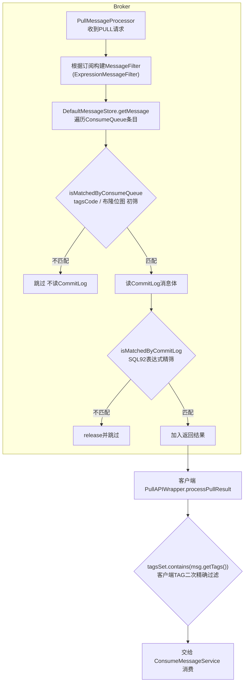
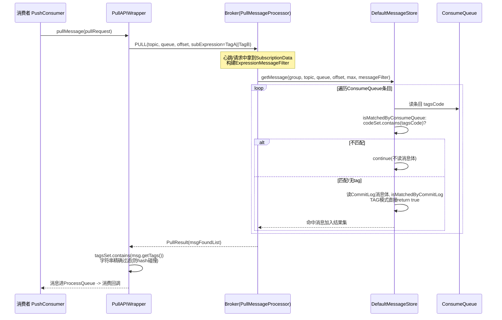

# RocketMQ 消息过滤实现原理源码深度分析（4.9.8）

> 涉及模块：`common`（SubscriptionData / ExpressionType）、`filter`（表达式引擎）、`store`（ConsumeQueue/ConsumeQueueExt 过滤数据）、`broker`（PullMessageProcessor / ConsumerFilterManager / ExpressionMessageFilter）、`client`（PullAPIWrapper 客户端二次过滤）

---

## 一、总体原理

RocketMQ 的消息过滤解决的问题是：**同一个 Topic、同一个队列中混杂着多种消息，消费者只想消费自己关心的那部分**。整条链路上有三个可以执行过滤的位置：

```
Producer 写消息(带Tag/属性)
    -> Broker 存储(CommitLog + ConsumeQueue)
        -> 消费者拉取: Broker 边遍历边过滤后返回   ← 服务端过滤(主)
        -> 消费者收到后再过滤一遍                 ← 客户端过滤(兜底)
```



**两级服务端过滤的设计动机**（对应 `MessageFilter` 接口的方法）：

| 方法 | 数据来源 | 成本 | 作用 |
|---|---|---|---|
| `isMatchedByConsumeQueue(tagsCode, cqExtUnit)` | ConsumeQueue 索引条目（20 字节）+ 扩展文件 | 极低（不碰消息体） | **初筛**：TAG 用 hash code 比对，SQL92 用布隆位图 |
| `isMatchedByCommitLog(msgBuffer, properties)` | CommitLog 消息原文 | 较高（需读消息体） | **精筛**：SQL92 表达式真实求值 |

先初筛再精筛，绝大多数不匹配的消息在**不读 CommitLog 消息体**的情况下就被跳过，这是性能关键。

## 二、四种过滤方式总览

| 过滤方式 | 表达式类型 | 执行位置 | 依赖组件 | 状态 |
|---|---|---|---|---|
| TAG 标签过滤 | `ExpressionType.TAG` | Broker（hash code 初筛）+ 客户端（字符串精筛） | SubscriptionData.tagsSet/codeSet | **默认，最常用** |
| SQL92 表达式过滤 | `ExpressionType.SQL92` | Broker | SelectorParser 表达式引擎 + 布隆过滤器 + ConsumeQueueExt | 需 `enablePropertyFilter=true` |
| 类过滤（CLASS_FILTER） | 自定义 Java 类 | FilterServer 进程（代理拉取+回调用户类） | FilterServerManager | 4.x 遗留，基本弃用 |
| 无过滤（SUB_ALL "*"） | TAG | 不过滤 | - | 全量消费 |

订阅数据模型 `SubscriptionData`（common/.../heartbeat/SubscriptionData.java）：

```java
private String topic;
private String subString;          // 原始表达式："TagA || TagB" 或 "a > 5 AND b = 'x'"
private String expressionType;     // TAG / SQL92
private Set<String> tagsSet;       // TAG 模式: 标签字符串集合（客户端精筛用）
private Set<Integer> codeSet;      // TAG 模式: 标签hashCode集合（Broker初筛用）
private Long subVersion;
private boolean classFilterMode;   // 类过滤模式
```

客户端订阅入口（DefaultMQPushConsumerImpl.java:890-933）：
- `subscribe(topic, subExpression)` -> `FilterAPI.buildSubscriptionData`（TAG 解析，按 `||` 拆分填 tagsSet/codeSet）；
- `subscribe(topic, MessageSelector)` -> `FilterAPI.build`（MessageSelector 可指定 SQL92，表达式原样放入 subString）；
- 订阅信息随**心跳**发送到 Broker（`sendHeartbeatToAllBrokerWithLock`），Broker 侧持久化为消费组订阅关系。

---

## 三、TAG 过滤（主流方式）

### 3.1 存储层支持：ConsumeQueue 里的 tagsCode

ConsumeQueue 每个条目 20 字节 = `commitlogOffset(8) + msgSize(4) + tagsCode(8)`。**tagsCode 是 Tag 字符串的 hashCode**，在建 ConsumeQueue 时由 DispatchRequest 携带写入。也就是说：**存储层在索引里为 TAG 过滤预留了 hash 桶位**，过滤无需读消息体。

### 3.2 Broker 端初筛（ExpressionMessageFilter.isMatchedByConsumeQueue）

ExpressionMessageFilter.java:70-81 的核心逻辑：

```java
// by tags code.
if (ExpressionType.isTagType(subscriptionData.getExpressionType())) {
    if (tagsCode == null) return true;                       // 消息无tag, 不过滤
    if (subscriptionData.getSubString().equals(SUB_ALL)) return true;  // "*"
    return subscriptionData.getCodeSet().contains(tagsCode.intValue());  // hash比对
}
```

**用 hashCode 比对而非字符串比对**：O(1) 集合查找且不触碰消息体。代价是 hash 碰撞可能放行"假阳性"消息 -- 这由客户端二次过滤兜底。

### 3.3 客户端二次精筛（PullAPIWrapper.processPullResult）

PullAPIWrapper.java:79-89：

```java
if (!subscriptionData.getTagsSet().isEmpty() && !subscriptionData.isClassFilterMode()) {
    msgListFilterAgain = new ArrayList<>(msgList.size());
    for (MessageExt msg : msgList) {
        if (msg.getTags() != null
            && subscriptionData.getTagsSet().contains(msg.getTags())) {  // 字符串精确比对
            msgListFilterAgain.add(msg);
        }
    }
}
```



**注意**：SQL92 过滤的客户端不做二次过滤（表达式只在 Broker 执行）；TAG 过滤客户端兜底是因为 hashCode 碰撞。另外消费者从 **SLAVE 拉取**时，若从库订阅信息滞后，可能退化为不过滤，客户端过滤同样兜底。

---

## 四、SQL92 表达式过滤

### 4.1 表达式语法与解析引擎（filter 模块）

开启条件：`brokerConfig.enablePropertyFilter = true`。语法示例：

```sql
-- 生产端: msg.putUserProperty("region", "hz"); 消费端:
subscribe("TopicTest", MessageSelector.bySql("region = 'hz' AND price > 100"))
```

表达式类层次（filter/.../expression/）：

```
Expression (evaluate)
 └── BooleanExpression (matches)
      ├── BinaryExpression
      │    ├── ComparisonExpression   >, >=, <, <=, =, <>, BETWEEN, IN, IS NULL...
      │    └── LogicExpression        AND, OR, NOT
      ├── ConstantExpression / BooleanConstantExpression
      └── PropertyExpression          从消息属性取值
```

解析器 `SelectorParser` 由 **JavaCC** 生成（生成 JavaCC 文件），`SqlFilter` 实现 `FilterSpi`：把 SQL92 字符串解析成表达式树并**编译缓存**在 `ConsumerFilterData.compiledExpression` 中，拉取时反复求值无需重复解析。

### 4.2 订阅持久化：ConsumerFilterManager / ConsumerFilterData

Broker 侧 `ConsumerFilterManager`（broker/.../filter/ConsumerFilterManager.java）按 `topic -> List<ConsumerFilterData>` 管理，并实现 `ConfigManager` 落盘（`consumerFilter.json`），**重启不丢订阅表达式**。

ConsumerFilterData 关键字段：

| 字段 | 说明 |
|---|---|
| consumerGroup / topic | 订阅归属 |
| expression / expressionType | 原始表达式与类型 |
| compiledExpression | 编译后的表达式树（transient，重启时重新编译） |
| bornTime / deadTime | 过滤数据生死时间（用于判断消息是否在订阅生效之后） |
| **bloomFilterData** | 该订阅对应的布隆过滤器参数（每订阅一份） |
| clientVersion | 客户端版本 |

### 4.3 布隆过滤器加速：写入时预计算位图

SQL92 求值必须读消息属性，如果每条消息在拉取时对每个订阅组都求值一次，多消费组场景开销 = 消息数 × 订阅数。RocketMQ 的解法是**写入时预计算**：

`CommitLogDispatcherCalcBitMap`（broker/.../filter/CommitLogDispatcherCalcBitMap.java:48-100，注册于 BrokerController，`enableCalcFilterBitMap` 控制）：

```java
// 消息写入后异步dispatch阶段:
Collection<ConsumerFilterData> filterDatas = consumerFilterManager.get(request.getTopic());
BitsArray filterBitMap = BitsArray.create(bloomFilter.getM());   // 全组共享的位图
for (ConsumerFilterData filterData : filterDatas) {
    // 对该topic的每一个SQL订阅表达式求值
    Object ret = filterData.getCompiledExpression()
        .evaluate(new MessageEvaluationContext(request.getPropertiesMap()));
    if (ret == Boolean.TRUE) {
        // 命中 -> 把该订阅的布隆指纹按到全局位图上
        consumerFilterManager.getBloomFilter().hashTo(filterData.getBloomFilterData(), filterBitMap);
    }
}
request.setBitMap(filterBitMap.bytes());   // 挂到DispatchRequest
```

位图随 ConsumeQueue 构建写入**扩展文件** `ConsumeQueueExt`（ConsumeQueue.java:389-402）：

```java
if (isExtWriteEnable()) {                       // enableConsumeQueueExt
    CqExtUnit cqExtUnit = new CqExtUnit();
    cqExtUnit.setFilterBitMap(request.getBitMap());
    cqExtUnit.setMsgStoreTime(request.getStoreTimestamp());
    cqExtUnit.setTagsCode(request.getTagsCode());
    long extAddr = this.consumeQueueExt.put(cqExtUnit);
    if (isExtAddr(extAddr)) {
        tagsCode = extAddr;                     // CQ条目的tagsCode字段改存扩展地址(负数标记)
    }
}
```

CQExtUnit 结构（ConsumeQueueExt.java）：`size + tagsCode + msgStoreTime + bitMapSize + filterBitMap`。**CQ 条目的 tagsCode 字段被复用为指向扩展单元的负数地址**，实现零额外索引结构扩展。

### 4.4 拉取时两级求值（ExpressionMessageFilter）

**第一级 -- 布隆初筛**（ExpressionMessageFilter.java:82-114）：

```java
// no expression or no bloom -> 放行精筛
if (consumerFilterData == null || ... getBloomFilterData() == null) return true;
// 消息早于订阅生效时间 -> 放行(交给客户端/视为需要)
if (cqExtUnit == null || !consumerFilterData.isMsgInLive(cqExtUnit.getMsgStoreTime())) return true;
byte[] filterBitMap = cqExtUnit.getFilterBitMap();
if (filterBitMap == null || !bloomDataValid || 长度不匹配) return true;   // 位图缺失,放行精筛
// 布隆判定: 该消息的位图是否包含此订阅的指纹位
return bloomFilter.isHit(consumerFilterData.getBloomFilterData(), BitsArray.create(filterBitMap));
```

布隆判定的语义：**若返回 false，则该订阅的表达式对此消息**一定**不成立，直接跳过（不读消息体）；若返回 true，可能命中（哈希碰撞），再进第二级**。

**第二级 -- 表达式精筛**（isMatchedByCommitLog，:118+）：

```java
Object ret = consumerFilterData.getCompiledExpression()
    .evaluate(new MessageEvaluationContext(properties));   // properties来自CommitLog消息体
return ret != null && (Boolean) ret;
```

至此完成 `布隆位图(不读消息体) -> 表达式求值(读消息体)` 的漏斗。所有"放行"分支（位图缺失、订阅后消息、扩展损坏等）都保守地进入下一级，**宁可多精筛不可漏消息**。

### 4.5 重试队列的特殊处理

`ExpressionForRetryMessageFilter`（PullMessageProcessor.java:230-237，`filterSupportRetry` 时使用）：重试消息（%RETRY% topic）的属性在重投时可能被修改，因此在 CommitLog 精筛时需要把重试消息视为**始终匹配**（其 isMatchedByCommitLog 直接放行），由客户端最终判断。

---

## 五、类过滤（CLASS_FILTER，已边缘化）

`DefaultMQPushConsumerImpl.subscribe(topic, fullClassName, filterClassSource)`（:902-914）：客户端上传**过滤器类的源码**，`classFilterMode=true`。Broker 检测到后建议消费者改从 **FilterServer**（独立进程，动态编译上传的类）拉取消息，FilterServer 代理消费者从 Broker 拉取并执行用户 `MessageFilter` 实现（`match(MessageExt)`）后再返回。因安全（任意代码上传）与运维复杂度，实践中已基本被 TAG/SQL92 取代，5.x 已移除。

代码中体现为：`ExpressionMessageFilter` 对 `isClassFilterMode()` 一律 return true（:66-68, :123-125），即存储层不做类过滤。

---

## 六、Broker 拉取主流程中的过滤挂载点

PullMessageProcessor（broker/.../processor/PullMessageProcessor.java）：

1. **获取订阅信息**：优先校验消费组订阅一致性，取 `subscriptionData`；
2. **构造过滤器**：

```java
MessageFilter messageFilter;
if (this.brokerController.getBrokerConfig().isFilterSupportRetry()) {
    messageFilter = new ExpressionForRetryMessageFilter(subscriptionData, consumerFilterData, consumerFilterManager);
} else {
    messageFilter = new ExpressionMessageFilter(subscriptionData, consumerFilterData, consumerFilterManager);
}
```

其中 `consumerFilterData` 由 `ConsumerFilterManager.get(topic, group)` 获取（SQL92 才有值，TAG 为 null）；

3. **传入存储层**：`messageStore.getMessage(group, topic, queueId, offset, maxMsgNums, messageFilter)`；
4. **存储层遍历**（DefaultMessageStore.java:660-690）：

```java
if (messageFilter != null
    && !messageFilter.isMatchedByConsumeQueue(isTagsCodeLegal ? tagsCode : null, extRet ? cqExtUnit : null)) {
    continue;   // 初筛失败, 连CommitLog都不读
}
SelectMappedBufferResult selectResult = this.commitLog.getMessage(offsetPy, sizePy);
if (messageFilter != null
    && !messageFilter.isMatchedByCommitLog(selectResult.getByteBuffer().slice(), null)) {
    selectResult.release();   // 精筛失败, 立即释放
    continue;
}
getResult.addMessage(selectResult);
```

**重要细节 -- 拉不到消息的处理**：若一个 maxMsgs 批次全被过滤掉，`GetMessageStatus = NO_MATCHED_MESSAGE`，Broker 返回的 `nextBeginOffset` 仍会前进，消费者会继续从新位点拉取（不会卡死在被过滤的消息上）。同时 Broker 若在拉取期间又写入了新消息，会返回 `OFFSET_ILLEGAL` 建议消费者校正位点（这也是长轮询+过滤场景的位点推进机制）。

---

## 七、设计总结

1. **索引内嵌过滤数据**：ConsumeQueue 条目 8 字节 tagsCode 使 TAG 过滤完全不读消息体；SQL92 通过 ConsumeQueueExt 的布隆位图达到同样效果 -- **把过滤成本从"读消息体"降到"读索引"**；
2. **写入时预计算 vs 拉取时计算**：SQL92 采用写入时对所有订阅预计算布隆位图（CommitLogDispatcherCalcBitMap），用写入侧少量开销（仅当存在 SQL 订阅时）换拉取侧大量求值开销，且天然适配一写多读模型；
3. **两级过滤 + 保守放行**：所有不确定场景（hash 碰撞、布隆假阳性、位图缺失、扩展损坏）都放行到下一级，客户端 TAG 二次过滤兜底，保证**不漏消息**（ RocketMQ 选择"宁可多传不可漏投"）；
4. **正确性与位点解耦**：过滤不影响消费位点语义（offset 是队列全局位点，不是"命中条目序号"），所以订阅关系变更后从头消费也不会错乱。

## 附录：源码索引

| 内容 | 位置 |
|---|---|
| MessageFilter 两级接口 | store/.../MessageFilter.java |
| TAG 初筛（codeSet 比对） | broker/.../filter/ExpressionMessageFilter.java:70-81 |
| SQL92 布隆初筛 | 同上 :82-114 |
| SQL92 表达式精筛 | 同上 :118-150 |
| 重试消息过滤器 | broker/.../filter/ExpressionForRetryMessageFilter.java |
| 布隆位图预计算 | broker/.../filter/CommitLogDispatcherCalcBitMap.java:48-100 |
| 订阅注册与持久化 | broker/.../filter/ConsumerFilterManager.java |
| 过滤数据模型 | broker/.../filter/ConsumerFilterData.java |
| 表达式树/JavaCC 解析 | filter/.../expression/, filter/.../parser/SelectorParser.java |
| 扩展文件存储位图 | store/.../ConsumeQueue.java:384-404, store/.../ConsumeQueueExt.java |
| 存储层过滤遍历 | store/.../DefaultMessageStore.java:660-690 |
| 拉取请求构建过滤器 | broker/.../processor/PullMessageProcessor.java |
| 客户端 TAG 二次过滤 | client/.../consumer/PullAPIWrapper.java:70-116 |
| 订阅入口（TAG/SQL/类） | client/.../consumer/DefaultMQPushConsumerImpl.java:890-933 |
| 订阅数据模型 | common/.../protocol/heartbeat/SubscriptionData.java |
