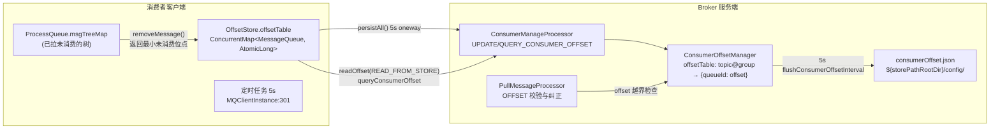
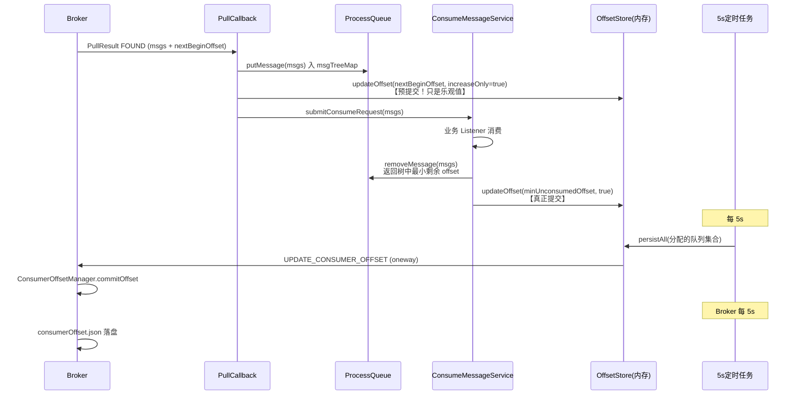
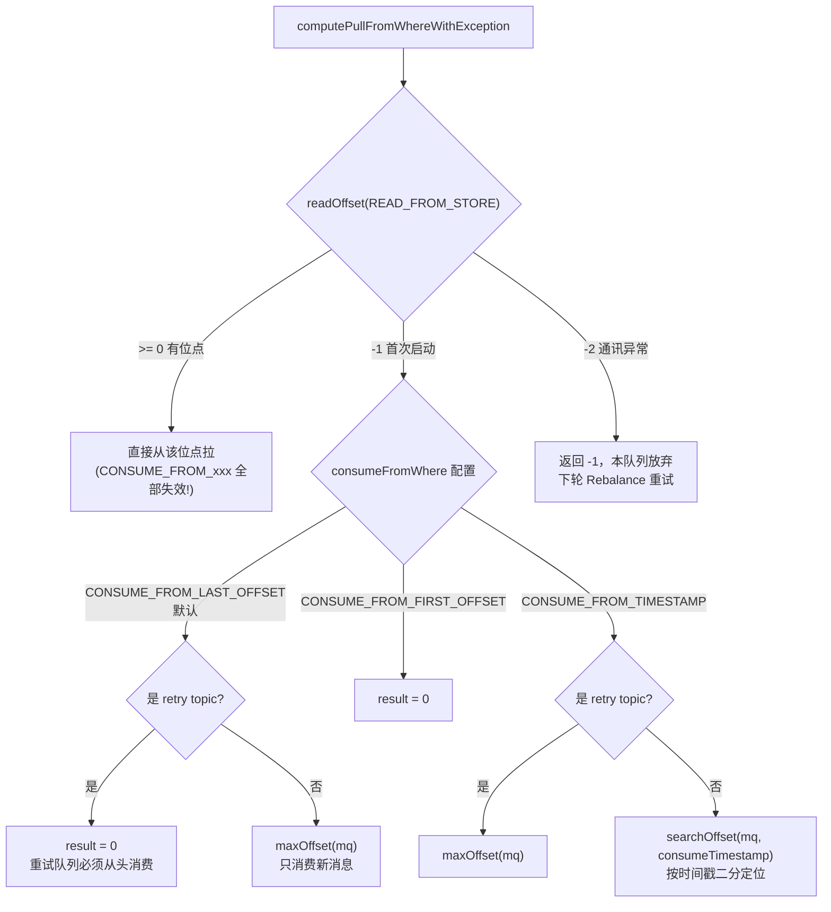
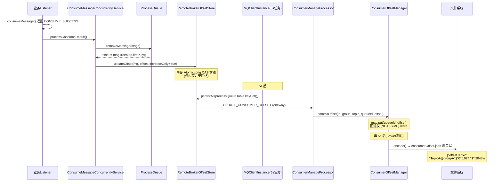

# RocketMQ 消费位点管理源码深度分析

> 基于 RocketMQ 4.9.8 源码，逐一精读 `client/consumer/store/OffsetStore` 体系与 `broker/offset/ConsumerOffsetManager`，彻底搞清楚"一条消息消费完成后，位点是怎么被记住的"。

---

## 一、为什么位点管理是消费链路的"命门"

消费位点（Consumer Offset）回答一个问题：**"这个消费组在这个队列上，下一批该从哪条消息开始拉？"**

它决定了三件事：

| 影响面 | 说明 |
|--------|------|
| **不丢消息** | 位点提交慢于实际消费 → 崩溃后重复消费（可接受，靠幂等兜底）；位点提交快于实际消费 → 崩溃后**消息丢失**（不可接受！） |
| **不卡消费** | 位点提交错误（如提交了 max+1 或落后于 minOffset）→ 拉取报 OFFSET_ILLEGAL，队列被丢弃重平衡 |
| **集群扩缩容** | Rebalance 队列转移后，新主人必须能从 Broker 读到正确位点续传 |

RocketMQ 的设计抉择：

1. **位点不进 CommitLog，不进 ConsumeQueue**——它是纯"消费组维度"的状态，与消息存储解耦，单独一个 JSON 文件持久化。
2. **客户端内存表 + 定时上报 Broker**——消费成功只更新本地内存（零网络开销），每 5s 批量 oneway 上报。
3. **提交语义是"最小未消费位点"**——不是"我消费到哪了"，而是"我保证这之前的都消费完了"（ACt：at-least-once 的直接来源）。

### 整体架构图



两条独立的持久化链路要分清：

- **集群模式（BROADCASTING=false）**：客户端 `RemoteBrokerOffsetStore` → Broker `ConsumerOffsetManager` → `consumerOffset.json`。位点归 Broker 管。
- **广播模式（BROADCASTING=true）**：客户端 `LocalFileOffsetStore` → 本地 `~/.rocketmq_offsets/{clientId}/{group}/offsets.json`。Broker 完全不参与。

---

## 二、客户端接口：OffsetStore 三兄弟

`client/src/main/java/org/apache/rocketmq/client/consumer/store/OffsetStore.java`

```java
public interface OffsetStore {
    void load() throws MQClientException;                 // 启动时加载
    void updateOffset(MessageQueue mq, long offset, boolean increaseOnly);  // 消费成功后更新
    long readOffset(final MessageQueue mq, final ReadOffsetType type);      // 读位点
    void persistAll(Set<MessageQueue> mqs);               // 批量持久化
    void persist(MessageQueue mq);                        // 单队列持久化
    void removeOffset(MessageQueue mq);                   // 队列被移除时清理
    Map<MessageQueue, Long> cloneOffsetTable(String topic);
}
```

实现类的选择在 `DefaultMQPushConsumerImpl.start()`：

```java
if (this.defaultMQPushConsumer.get_messageModel() == MessageModel.BROADCASTING) {
    this.offsetStore = new LocalFileOffsetStore(this.mQClientFactory, this.defaultMQPushConsumer.getConsumerGroup());
} else {
    this.offsetStore = new RemoteBrokerOffsetStore(this.mQClientFactory, this.defaultMQPushConsumer.getConsumerGroup());
}
this.offsetStore.load();
```

### updateOffset 的 increaseOnly 参数（最容易被忽视的细节）

`RemoteBrokerOffsetStore.java:58-73`：

```java
public void updateOffset(MessageQueue mq, long offset, boolean increaseOnly) {
    AtomicLong offsetOld = this.offsetTable.get(mq);
    if (null == offsetOld) {
        offsetOld = this.offsetTable.putIfAbsent(mq, new AtomicLong(offset));
    }
    if (null != offsetOld) {
        if (increaseOnly) {
            MixAll.compareAndIncreaseOnly(offsetOld, offset);  // CAS 只增不减
        } else {
            offsetOld.set(offset);                              // 无条件覆盖
        }
    }
}
```

两种调用方语义完全不同：

| 调用点 | increaseOnly | 原因 |
|--------|-------------|------|
| `ConsumeMessageConcurrentlyService.java:300` 消费成功后 | **true** | 并发消费乱序完成，旧批次回调可能后到，只允许位点前进 |
| `DefaultMQPushConsumerImpl.java:382` OFFSET_ILLEGAL 纠正 | **false** | 需要强行回拨到 Broker 建议的正确位点 |
| `DefaultMQPushConsumerImpl.java:947` updateConsumeOffset（用户 API） | **false** | 用户手动重置位点，允许回退 |

CAS 只增不减的实现（`MixAll.compareAndIncreaseOnly`）：

```java
public static boolean compareAndIncreaseOnly(AtomicLong target, long value) {
    long prev = target.get();
    while (value > prev) {
        if (target.compareAndSet(prev, value)) {
            return true;
        }
        prev = target.get();
    }
    return false;
}
```

### readOffset 的三态返回值（负数即状态码）

`RemoteBrokerOffsetStore.java:76-111`：

```java
public long readOffset(final MessageQueue mq, final ReadOffsetType type) {
    switch (type) {
        case MEMORY_FIRST_THEN_STORE:
        case READ_FROM_MEMORY: {
            AtomicLong offset = this.offsetTable.get(mq);
            if (offset != null) {
                return offset.get();
            } else if (ReadOffsetType.READ_FROM_MEMORY == type) {
                return -1;                       // 内存没有
            }
        }
        case READ_FROM_STORE: {
            try {
                long brokerOffset = this.fetchConsumeOffsetFromBroker(mq);
                this.updateOffset(mq, offset.get(), false);   // 回填内存缓存
                return brokerOffset;
            } catch (MQBrokerException e) {
                return -1;                       // Broker 也没有该组位点（首次启动）
            } catch (Exception e) {
                return -2;                       // 网络等异常，本次放弃
            }
        }
    }
    return -1;
}
```

**返回值语义表（computePullFromWhere 靠它分支）：**

| 返回值 | 含义 | 消费端反应 |
|--------|------|-----------|
| `>= 0` | 有效位点 | 从该位点开始拉 |
| `-1` | 无位点记录（内存和 Broker 都没有） | 走 CONSUME_FROM_xxx 首次启动策略 |
| `-2` | 通讯异常 | 放弃本次，Rebalance 下轮再试（**不能**当作首次启动） |

注意 Java switch 的 fall-through：`MEMORY_FIRST_THEN_STORE` 会穿透到 `READ_FROM_STORE` 分支——内存 miss 时自动去 Broker 查。

---

## 三、位点是何时被更新的：一消息的位点生命周期



关键在**两次 updateOffset**：

**第一次（预提交）** `DefaultMQPushConsumerImpl.java:494`，拉到消息立刻执行：

```java
// pullCallback FOUND 分支
boolean dispatchToConsumeThread = ...;
DefaultMQPushConsumerImpl.this.offsetStore.updateOffset(pullRequest.getMessageQueue(),
    pullRequest.getNextBeginOffset(), true);
```

把位点先推到 `nextBeginOffset`（乐观假设这批都能消费成功）。**这是位点短暂"超前"的来源**：如果此刻进程崩溃、且恰逢 5s 定时上报把超前值刷到了 Broker，重启后会丢这批消息吗？不会——因为崩溃时 ProcessQueue 里未消费的消息丢失了，但拉取位点已经 past them，这批消息确实**丢了**（at-most-once 窗口）。这个窗口 = 0~5s（上报周期）+ 消费耗时。这就是 RocketMQ 集群模式"极小概率丢消息"的根因，幂等消费是生产要求的直接原因。

**第二次（真正提交）** `ConsumeMessageConcurrentlyService.java:298-301`，消费完成后：

```java
long offset = consumeRequest.getProcessQueue().removeMessage(consumeRequest.getMsgs());
if (offset >= 0 && !consumeRequest.getProcessQueue().isDropped()) {
    this.defaultMQPushConsumerImpl.getOffsetStore().updateOffset(consumeRequest.getMessageQueue(), offset, true);
}
```

`ProcessQueue.removeMessage()`（`ProcessQueue.java:191-224`）是"最小未消费位点"语义的核心：

```java
public long removeMessage(final List<MessageExt> msgs) {
    long result = -1;
    this.treeMapLock.writeLock().lockInterruptibly();
    try {
        if (!msgTreeMap.isEmpty()) {
            result = this.queueOffsetMax + 1;       // 默认：树空则提交 max+1
            for (MessageExt msg : msgs) {
                msgTreeMap.remove(msg.getQueueOffset());   // 按队列偏移移除
                ...
            }
            if (!msgTreeMap.isEmpty()) {
                result = msgTreeMap.firstKey();     // 树不空则提交最小剩余 offset
            }
        }
    } finally { ... }
    return result;
}
```

**为什么是 `firstKey()` 而不是"已消费的最大 offset + 1"？** 因为并发消费乱序完成：offset=5 消费完了，offset=3 还在跑，若提交 6，则 3 失败/崩溃后重启就从 6 拉起，**3 号消息永久丢失**。`firstKey()` 保证提交的位点之前的消息**全部**已从树中移除（即全部消费动作完成），这是 at-least-once 的根本保证。

代价：若 offset=3 的消息消费失败走重试（被 sendMessageBack 转移到 retry topic），它会从树中 remove，`firstKey()` 前进——重试消息的进度由 retry topic 独立管理，原队列不阻塞。

---

## 四、5s 上报链路：persistAll 逐行精读

### 客户端侧定时器

`MQClientInstance.java:296-306`：

```java
this.scheduledExecutorService.scheduleAtFixedRate(new Runnable() {
    @Override
    public void run() {
        try {
            MQClientInstance.this.persistAllConsumerOffset();
        } catch (Exception e) { ... }
    }
}, 1000 * 10, this.clientConfig.getPersistConsumerOffsetInterval(), TimeUnit.MILLISECONDS);
```

`persistConsumerOffsetInterval` 默认 `5000ms`（`ClientConfig.java`）。`persistAllConsumerOffset()` 遍历 consumerTable 每个消费组，最终调 `DefaultMQPushConsumerImpl.persistConsumerOffset()`（`DefaultMQPushConsumerImpl.java:1029`）：

```java
public void persistConsumerOffset() {
    try {
        this.makeSureStateOK();
        Set<MessageQueue> mqs = new HashSet<MessageQueue>();
        Set<MessageQueue> allocMqs = this.rebalanceImpl.getProcessQueueTable().keySet();  // 只上报当前分配到的队列
        for (MessageQueue mq : allocMqs) {
            if (!this.processQueueTable.get(mq).isDropped()) {
                mqs.add(mq);
            }
        }
        this.offsetStore.persistAll(mqs);
    } catch (Exception e) { ... }
}
```

**只上报本客户端当前持有的队列**——Rebalance 转移走的队列不上报（否则可能用旧位点覆盖新主人）。

### RemoteBrokerOffsetStore.persistAll（`RemoteBrokerOffsetStore.java:114-147`）

```java
public void persistAll(Set<MessageQueue> mqs) {
    final HashSet<MessageQueue> unusedMQ = new HashSet<MessageQueue>();
    for (Map.Entry<MessageQueue, AtomicLong> entry : this.offsetTable.entrySet()) {
        MessageQueue mq = entry.getKey();
        AtomicLong offset = entry.getValue();
        if (offset != null) {
            if (mqs.contains(mq)) {
                try {
                    this.updateConsumeOffsetToBroker(mq, offset.get());   // oneway 上报
                    log.info("[persistAll] Group: {} ClientId: {} updateConsumeOffsetToBroker {} {}",
                        this.groupName, this.mQClientFactory.getClientId(), mq, offset.get());
                } catch (Exception e) {
                    log.error("updateConsumeOffsetToBroker exception, " + mq.toString(), e);
                }
            } else {
                unusedMQ.add(mq);     // 不在分配集合 → 标记为废弃
            }
        }
    }
    if (!unusedMQ.isEmpty()) {
        for (MessageQueue mq : unusedMQ) {
            this.offsetTable.remove(mq);   // 顺带清理内存表
            log.info("remove unused mq, {}, {}", mq, this.groupName);
        }
    }
}
```

三个细节：

1. **oneway 发送**（`updateConsumeOffsetToBroker` 默认 `isOneway=true`，`RemoteBrokerOffsetStore.java:190-193`）：上报是尽力而为，失败只打日志，下个 5s 周期重来。位点的最终一致性容忍秒级误差。
2. **单队列单请求**：每个 MessageQueue 一个 UPDATE_CONSUMER_OFFSET 请求（非批量协议），队列多时一次 persistAll 会有多个小请求。
3. **unusedMQ 内存清理**：Rebalance 丢掉的队列，本地 offsetTable 同步删除，防止内存泄漏 + 防止旧客户端僵尸上报。

上报强制找 **MASTER**（`RemoteBrokerOffsetStore.java:201`）：

```java
FindBrokerResult findBrokerResult = this.mQClientFactory.findBrokerAddressInSubscribe(mq.getBrokerName(), MixAll.MASTER_ID, true);
```

找不到 Master 时先刷新路由再找一次，仍没有则抛异常放弃本次（源码注释自嘲 "here need to be optimized"——Master 切换期间位点上报会断，这是 4.x 已知的粗糙点，5.x Controller/Dledger 才改善）。

---

## 五、Broker 端：ConsumerOffsetManager 精读

### 数据结构（`ConsumerOffsetManager.java:40-41`）

```java
protected ConcurrentMap<String/* topic@group */, ConcurrentMap<Integer, Long>> offsetTable =
    new ConcurrentHashMap<String, ConcurrentMap<Integer, Long>>(512);
```

**两级 map：`topic@group` → `{queueId → offset}`**。注意 key 分隔符是 `@`——所以官方约束 topic、consumerGroup 命名不能含 `@`（`TOPIC_GROUP_SEPARATOR`），这也是 `scanUnsubscribedTopic` 里 `split("@")` 能成立的前提。

LmqConsumerOffsetManager（开启 `enableLmq` 时启用，`BrokerController.java:187`）继承此类，仅重写 decode 以支持 LMQ 混合存储。

### commitOffset（`ConsumerOffsetManager.java:121-140`）

```java
private void commitOffset(final String clientHost, final String key, final int queueId, final long offset) {
    ConcurrentMap<Integer, Long> map = this.offsetTable.get(key);
    if (null == map) {
        map = new ConcurrentHashMap<Integer, Long>(32);
        map.put(queueId, offset);
        this.offsetTable.put(key, map);
    } else {
        Long storeOffset = map.put(queueId, offset);      // 直接覆盖，不做 CAS！
        if (storeOffset != null && offset < storeOffset) {
            log.warn("[NOTIFYME]update consumer offset less than store. clientHost={}, key={}, queueId={}, "
                + "requestOffset={}, storeOffset={}", ...);
        }
    }
}
```

**注意：Broker 端只覆盖 + 打 warn，不拒绝回退。** 客户端的 increaseOnly 保护只在内存表里；一旦两个客户端短暂持有同一队列（Rebalance 重叠窗口），旧主人 5s 定时任务可能把**旧位点**上报上来覆盖新位点 → 已消费消息被重复消费。`[NOTIFYME]` 日志就是给运维抓这个场景的。

### 请求入口（`ConsumerManageProcessor.java`）

```java
// UPDATE_CONSUMER_OFFSET (:104-116)
this.brokerController.getConsumerOffsetManager().commitOffset(
    RemotingHelper.parseChannelRemoteAddr(ctx.channel()),          // 只用于日志
    requestHeader.getConsumerGroup(), requestHeader.getTopic(),
    requestHeader.getQueueId(), requestHeader.getCommitOffset());
// 没有任何校验：不验证 group 是否存在、offset 是否合法——纯内存 map put

// QUERY_CONSUMER_OFFSET (:118-153)
long offset = this.brokerController.getConsumerOffsetManager().queryOffset(group, topic, queueId);
if (offset >= 0) {
    responseHeader.setOffset(offset);          // 正常返回
} else {
    long minOffset = this.brokerController.getMessageStore().getMinOffsetInQueue(topic, queueId);
    if (minOffset <= 0
        && !this.brokerController.getMessageStore().checkInDiskByConsumeOffset(topic, queueId, 0)) {
        responseHeader.setOffset(0L);          // 兜底：队列从头可用且 offset 0 在内存里 → 直接答 0
        response.setCode(ResponseCode.SUCCESS);
    } else {
        response.setCode(ResponseCode.QUERY_NOT_FOUND);  // 真没有 → 客户端走首次启动策略
    }
}
```

查询兜底分支的巧妙之处：**首次启动时 minOffset=0 且消息在 CommitLog 里未被刷盘淘汰（checkInDiskByConsumeOffset=false 表示在 pageCache 内），Broker 直接返回 0**，省去客户端再来一次 maxOffset/minOffset 查询。这个分支也是 `queryOffset` 返回 -1（`ConsumerOffsetManager.java:152`）的完整语义闭环。

### 持久化（JSON 文件）

- 路径：`${storePathRootDir}/config/consumerOffset.json`（`ConsumerOffsetManager.java:160-162` → `BrokerPathConfigHelper.getConsumerOffsetPath`）
- 周期：`BrokerController.java:359-365`，`flushConsumerOffsetInterval` 默认 **5s**：

```java
this.scheduledExecutorService.scheduleAtFixedRate(() -> {
    try {
        BrokerController.this.consumerOffsetManager.persist();
    } catch (Throwable e) { ... }
}, 1000 * 10, this.brokerConfig.getFlushConsumerOffsetInterval(), TimeUnit.MILLISECONDS);
```

- Broker 正常关闭时兜底再 persist 一次（`BrokerController.java:801`）。
- 内容是整个 offsetTable 的 JSON 快照（`encode → RemotingSerializable.toJson`），**全量覆盖写**，不是增量。
- **位点数据不做主从同步**：Slave 从 Master 拉的是消息存储（HA 复制），`consumerOffset.json` 各写各的。Master 宕机切主后，新 Master 的位点可能落后（它只被动接收过 Master 期间的少量上报）——这是 4.x 主从切换后"重复消费"的根源。

### scanUnsubscribedTopic（`ConsumerOffsetManager.java:52-69`）

```java
public void scanUnsubscribedTopic() {
    Iterator<Entry<String, ConcurrentMap<Integer, Long>>> it = this.offsetTable.entrySet().iterator();
    while (it.hasNext()) {
        ...
        if (null == brokerController.getConsumerManager().findSubscriptionData(group, topic)   // 无活跃订阅
            && this.offsetBehindMuchThanData(topic, next.getValue())) {                        // 且位点已 <= minOffset
            it.remove();
            log.warn("remove topic offset, {}", topicAtGroup);
        }
    }
}
```

自动 GC 不再订阅且已"消费到底"的位点记录，防止 offsetTable 无限膨胀。`offsetBehindMuchThanData`（:71-83）要求**所有队列**的位点都 `<= minOffsetInStore`（即数据都已被 CommitLog 删除），条件相当保守。

---

## 六、消费起点：computePullFromWhere 决策树

`RebalancePushImpl.java:153-227`（Rebalance 为新队列构造 PullRequest 时调用）：



逐条解读源码要点：

1. **存储位点永远优先**（4 个 case 的第一个判断都是 `lastOffset >= 0 → result = lastOffset`）。`CONSUME_FROM_FIRST_OFFSET` 对**已消费过的组不回放历史**——它只影响"Broker 上无位点"的首次启动。想重新从头消费必须先 `mqadmin resetOffsetByTime`/`resetOffsetByQueue` 或换组名。

2. **retry topic 特殊处理**（`:168-169`）：`%RETRY%` 开头的队列首次启动取 0 而非 maxOffset——重试消息绝不能跳过。（CONSUME_FROM_TIMESTAMP 分支下 retry 却取 maxOffset，`:199-201`，两处不对称是历史行为，值得注意。）

3. **`CONSUME_FROM_MIN_OFFSET`/`CONSUME_FROM_MAX_OFFSET` 两个 case 名与实际行为不符**：它们与 LAST_OFFSET 落在同一个 case 块（`:158-161`），实际都执行 maxOffset 逻辑——遗留枚举，仅兼容旧客户端。

4. `-2`（通讯异常）时返回 -1，外层 `RebalanceImpl.updateProcessQueueTableInRebalance` 会因 `nextOffset < 0` 跳过该队列的 PullRequest 创建，等下一轮 20s Rebalance 重试——**绝不会**误走首次启动逻辑。

---

## 七、拉取时的位点校验与纠正（OFFSET_ILLEGAL 全家桶）

位点的第二道防线在 `PullMessageProcessor` → `DefaultMessageStore.getMessage`。`DefaultMessageStore.java:598-614`：

```java
if (maxOffset == 0) {
    status = GetMessageStatus.NO_MESSAGE_IN_QUEUE;
    nextBeginOffset = nextOffsetCorrection(offset, 0);
} else if (offset < minOffset) {
    status = GetMessageStatus.OFFSET_TOO_SMALL;      // 位点小于队列最小值（数据已被删除）
    nextBeginOffset = nextOffsetCorrection(offset, minOffset);
} else if (offset == maxOffset) {
    status = GetMessageStatus.OFFSET_OVERFLOW_ONE;   // 正好追平，无新消息（正常现象）
    nextBeginOffset = nextOffsetCorrection(offset, offset);
} else if (offset > maxOffset) {
    status = GetMessageStatus.OFFSET_OVERFLOW_BADLY; // 位点超最大值（位点被污染）
    nextBeginOffset = nextOffsetCorrection(offset, maxOffset);
}
```

`PullMessageProcessor.java:303-323` 把状态翻译成响应码：

| 存储状态 | 响应码 | 客户端行为 |
|----------|--------|-----------|
| OFFSET_OVERFLOW_BADLY（offset > max） | `PULL_OFFSET_MOVED` | 采纳 nextBeginOffset 纠正，继续拉 |
| OFFSET_TOO_SMALL（offset < min） | `PULL_OFFSET_MOVED` | 采纳纠正（跳到 minOffset，被删的放弃） |
| OFFSET_OVERFLOW_ONE（offset == max） | `PULL_NOT_FOUND` | 正常长轮询等待 |
| OFFSET_FOUND_NULL | `PULL_NOT_FOUND` | ConsumeQueue 文件被删除，rollNextFile 跳到下一文件 |

### PULL_OFFSET_MOVED 的双路径（`PullMessageProcessor.java:437-452`）

Broker 侧对 PULL_OFFSET_MOVED 还有"通知与否"的分流：

```java
if (this.brokerController.getBrokerConfig().isNotifyConsumerIdsChangedEnable()) {
    // 广播模式或允许通知：产生 OffsetMovedEvent，交给 notifyConsumerIdsChanged 机制
    event.setOffsetRequest(requestHeader.getQueueOffset());
    event.setOffsetNew(getMessageResult.getNextBeginOffset());
    this.generateOffsetMovedEvent(event);
    log.warn("PULL_OFFSET_MOVED:correction offset. ...");
} else {
    responseHeader.setSuggestWhichBrokerId(...);
    response.setCode(ResponseCode.PULL_RETRY_IMMEDIATELY);
    log.warn("PULL_OFFSET_MOVED:none correction. ...");
}
```

### 客户端 OFFSET_ILLEGAL 处理（最重的纠偏动作）

`DefaultMQPushConsumerImpl.java:371-395`（pullCallback）：

```java
case OFFSET_ILLEGAL:
    log.warn("the pull request offset illegal, {}, {}", pullRequest, pullResult);
    pullRequest.setNextOffset(pullResult.getNextBeginOffset());

    pullRequest.getProcessQueue().setDropped(true);        // 1. 立刻丢弃该 ProcessQueue
    DefaultMQPushConsumerImpl.this.executeTaskLater(new Runnable() {
        @Override
        public void run() {
            try {
                DefaultMQPushConsumerImpl.this.offsetStore.updateOffset(pullRequest.getMessageQueue(),
                    pullRequest.getNextOffset(), false);   // 2. 强制回写纠正位点(可回退)

                DefaultMQPushConsumerImpl.this.offsetStore.persist(pullRequest.getMessageQueue());  // 3. 立即上报

                DefaultMQPushConsumerImpl.this.rebalanceImpl.removeProcessQueue(pullRequest.getMessageQueue());  // 4. 摘除队列

                log.warn("fix the pull request offset, {}", pullRequest);
            } catch (Throwable e) { ... }
        }
    }, 10000);   // 5. 延迟 10s 执行，给在途消费留时间
} break;
```

五步走：丢弃 → 延迟 10 秒（等在途消息消费完，`!isDropped()` 保证不再提交位点）→ 回写新位点（increaseOnly=false，允许回拨）→ 立即持久化上报（不等 5s 周期）→ 移除队列。下一轮 Rebalance 重新计算起点时 `readOffset(READ_FROM_STORE)` 拿到的就是纠正后的位点。**这是"位点漂移自愈"的最后防线。**

---

## 八、广播模式：LocalFileOffsetStore 差异速览

`LocalFileOffsetStore.java`，只列关键差异：

| 维度 | RemoteBrokerOffsetStore（集群） | LocalFileOffsetStore（广播） |
|------|--------------------------------|----------------------------|
| load() | 空（位点在 Broker） | 读 `offsets.json` 回填内存（:62-75） |
| persistAll | oneway 上报 Broker | `readLocalOffset → merge → MixAll.string2File` 原子写本地 JSON（:132-162） |
| updateConsumeOffsetToBroker | 真实上报 | **空方法**（:203-206） |
| readOffset(READ_FROM_STORE) | 网络查 Broker | 读本地文件（:108-122） |
| 故障恢复 | Broker 有全量位点 | **换机器/清目录 = 位点丢失，从头或从尾重来** |

文件路径（:55-58）：`~/.rocketmq_offsets/{clientId}/{groupName}/offsets.json`，`.bak` 双文件容错（`readLocalOffsetBak`，:245-267）。`MixAll.string2File` 内部是"写临时文件 → 原子 rename"，防止写一半损坏。

广播模式没有重试、没有 Broker 位点——这解释了为什么广播消费失败只能靠业务自己处理（见上一篇《消费重试与DLQ》）。

---

## 九、全链路时序图：从消费完成到落盘



**最大丢失/重复窗口**：客户端 5s（上报）+ Broker 5s（落盘）+ 若干在途消费。Broker 宕机且 `consumerOffset.json` 未及落盘时，最多回退 5s 的位点 → 重复消费；客户端宕机且已把预提交位点上报 → 最多丢一个上报周期内未消费完的消息。

---

## 十、陷阱清单（生产事故高发区）

| # | 陷阱 | 现象 | 根因定位 |
|---|------|------|---------|
| 1 | **CONSUME_FROM_FIRST_OFFSET 以为能重放历史** | 老消费组从"当前"开始消费 | `RebalancePushImpl.java:163` 存储位点优先；须先 resetOffset |
| 2 | **位点回退覆盖**（Rebalance 重叠窗口） | 重复消费一大段 | `ConsumerOffsetManager.java:135-137` 只 warn 不拒绝；查 `[NOTIFYME]` 日志 |
| 3 | **Master 切换后位点落后** | 切主后重复消费 | 位点不参与 HA 复制，Slave 各自持久化 |
| 4 | **队列位点被 OVERFLOW 污染后自愈跳变** | 日志 OFFSET_ILLEGAL + "fix the pull request offset" | `DefaultMQPushConsumerImpl.java:389`，10s 延迟纠正 |
| 5 | **广播模式换机丢位点** | 新机器从 min/max 重新开始 | LocalFileOffsetStore 位点在本地 `~/.rocketmq_offsets` |
| 6 | **topic/group 含 `@` 字符** | 位点错乱 | `ConsumerOffsetManager.java:38` 分隔符设计 |
| 7 | **清了存储但没清位点**（deleteTopic 不彻底） | 重建同名 topic 后 OFFSET_ILLEGAL | 位点在 `config/consumerOffset.json`，与数据目录独立 |
| 8 | **push 消费但用 pull 方式 updateOffset(mq, offset, false)** | 位点可能回退造成重复 | `DefaultMQPushConsumerImpl.java:947` 用户 API 无 increaseOnly 保护 |

## 十一、运维与调试手册

**mqadmin 命令：**

```bash
# 查看消费组位点（对比 broker offset 与 consumer offset，DIFF 即积压）
mqadmin consumerProgress -g myGroup -n 127.0.0.1:9876
# 输出列: topic/qid, brokerOffset, consumerOffset, diff

# 按时间重置位点（回放/跳过）
mqadmin resetOffsetByTime -g myGroup -t TopicA -s 20260920120000 -n 127.0.0.1:9876

# 重置消费组所有订阅位点到最大（跳过积压）
mqadmin resetOffsetByTime -g myGroup -t TopicA -s now -c -n 127.0.0.1:9876

# 删除消费组（连带清理位点）
mqadmin deleteConsumerGroup -g myGroup -c DefaultCluster -n 127.0.0.1:9876
```

**断点路线（按事件触发）：**

| 观察目标 | 断点位置 |
|---------|---------|
| 消费成功位点提交 | `ProcessQueue.removeMessage` → 返回值即新位点 |
| 5s 上报 | `RemoteBrokerOffsetStore.updateConsumeOffsetToBroker:199` |
| Broker 接收 | `ConsumerManageProcessor.updateConsumerOffset:111` |
| 位点回退告警 | `ConsumerOffsetManager.commitOffset:137` 条件 offset < storeOffset |
| 首次启动起点 | `RebalancePushImpl.computePullFromWhereWithException:153` |
| 非法位点自愈 | `DefaultMQPushConsumerImpl` pullCallback `case OFFSET_ILLEGAL:371` |
| Broker 落盘 | `ConsumerOffsetManager.encode:174` / `BrokerController.java:361` |

**日志关键字：**

- 客户端：`[persistAll] Group`（每次上报）、`fix the pull request offset`（非法位点纠正）
- Broker：`[NOTIFYME]update consumer offset less than store`（位点回退！）、`the request offset over flow badly`、`remove topic offset`（位点 GC）

**手工检查位点文件：**

```bash
cat ${storePathRootDir}/config/consumerOffset.json | python -m json.tool
# 结构: {"offsetTable": {"TopicA@groupA": {"0": 1024, "1": 2048}}}
```

## 十二、设计得与失

**得：**
1. 消费路径**零同步开销**——消费成功只改内存 AtomicLong，上报是异步 oneway，吞吐不受位点影响。
2. "最小未消费位点 + increaseOnly CAS"两道保险，在并发乱序完成的场景下保证了 at-least-once。
3. OFFSET_ILLEGAL 自愈闭环（Broker 建议 nextBeginOffset → 客户端 10s 后强制回写），故障可自恢复。
4. 位点与消息存储完全解耦，重放（resetOffset）只是改一个 map 值，秒级生效。

**失：**
1. 位点**不参与主从复制**，Master 宕机窗口内的位点丢失，4.x 架构性缺陷（5.x 由 Controller + 统一元数据解决）。
2. Broker 端 commitOffset 无条件覆盖，对回退/脏上报不设防，只打 `[NOTIFYME]`。
3. UPDATE_CONSUMER_OFFSET 单队列单请求，大集群每 5s 上报风暴可观（5.x 引入批量上报）。
4. `CONSUME_FROM_MIN/MAX_OFFSET` 枚举与实际行为不符，源码阅读陷阱。

## 十三、一句话总结

> **消费成功只动内存（firstKey 最小未消费位点、CAS 只增不减），5s oneway 上报 Broker 内存 map（覆盖 + warn），再 5s 落 JSON 文件；起点永远存储优先，越界靠 OFFSET_ILLEGAL 十秒自愈——一切设计都在"最多重复、绝不丢位点之前的消息"和"消费路径零阻塞"之间取舍。**

---

*上一篇：[RocketMQ消费重试与死信队列源码深度分析](RocketMQ消费重试与死信队列源码深度分析.md) · 下一篇：顺序消息端到端（说"下一篇"继续）*
