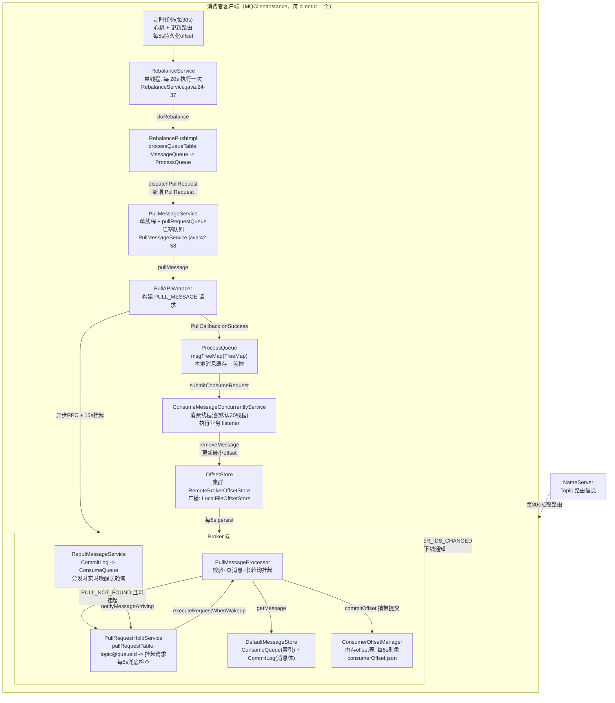
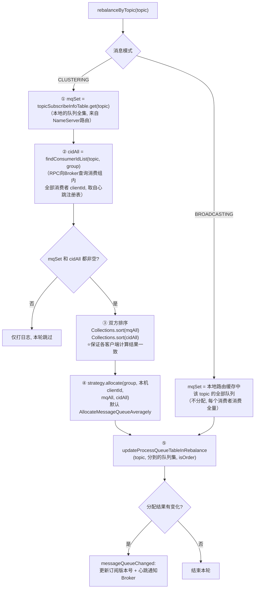
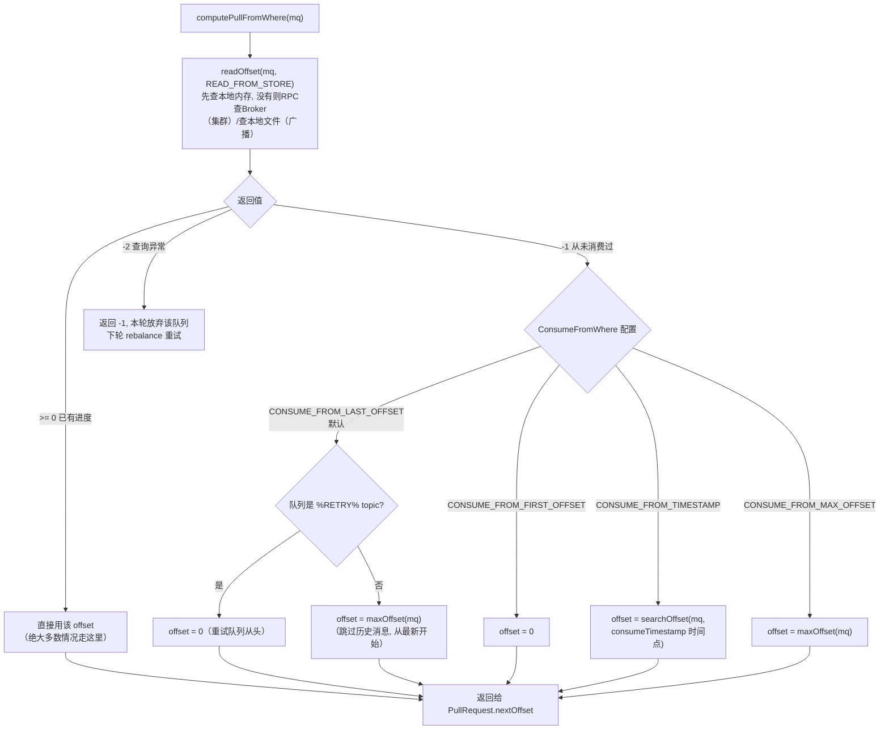
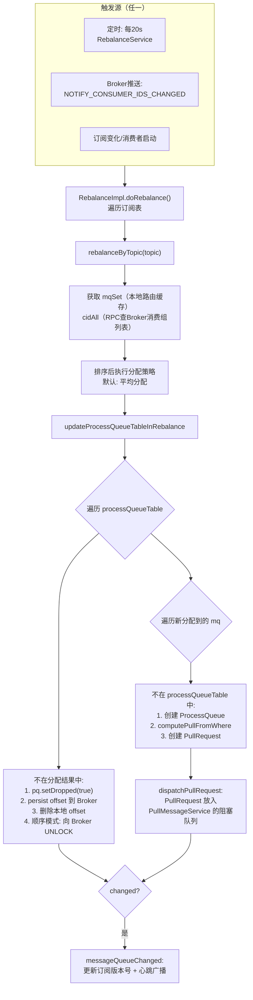
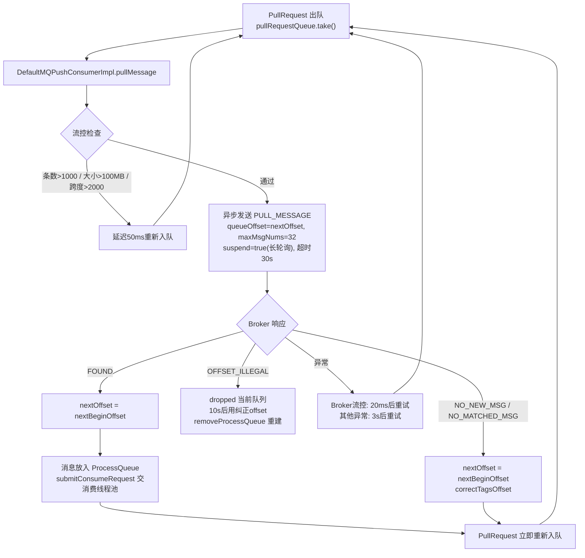
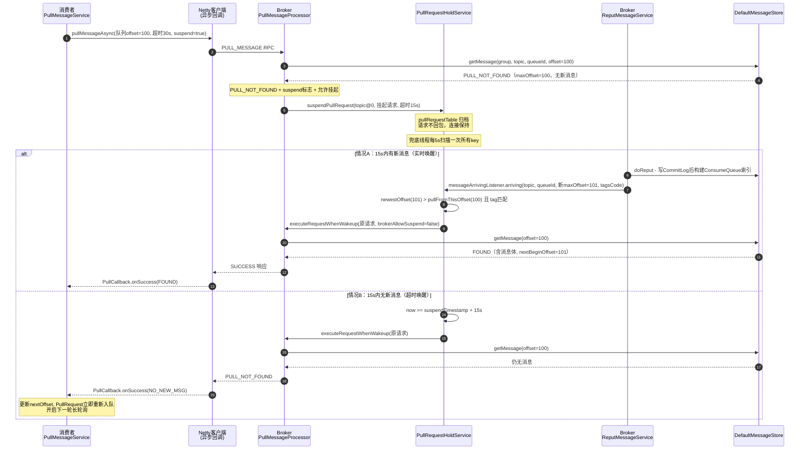
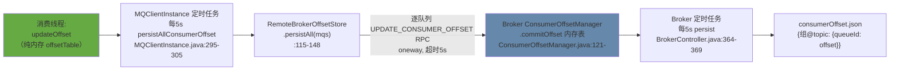
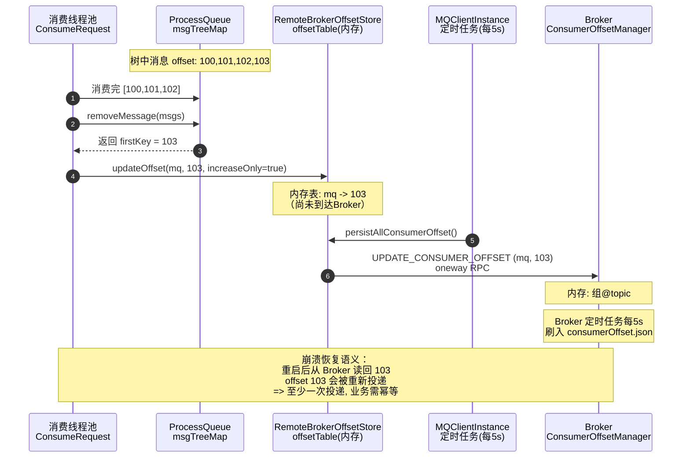
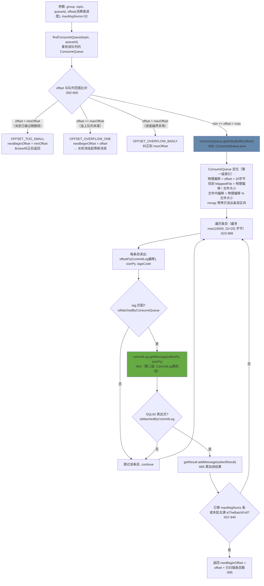
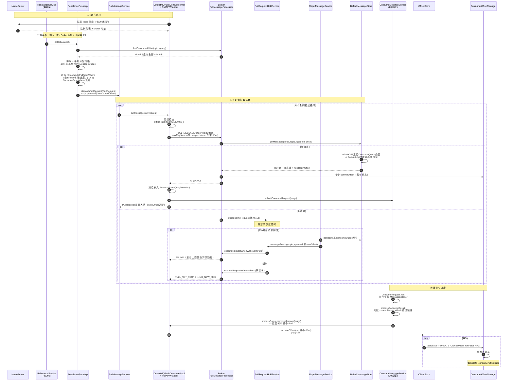

# RocketMQ 4.9.8 消费者消费流程源码深度解析

> 基于 Apache RocketMQ 4.9.8 源码（本仓库），所有结论均标注源码位置（`文件路径:行号`），可直接跳转核对。
> 覆盖五大主题：**RebalanceService 重平衡、PullMessageService 拉取消息、Broker 长轮询机制、消费进度管理、消息定位（offset -> 消息）**。

---

## 目录

1. [总体架构与线程模型](#1-总体架构与线程模型)
2. [消费者启动流程](#2-消费者启动流程)
3. [RebalanceService：重平衡](#3-rebalanceservice重平衡)
4. [PullMessageService：拉取消息](#4-pullmessageservice拉取消息)
5. [Broker 长轮询机制](#5-broker-长轮询机制)
6. [消费进度管理](#6-消费进度管理)
7. [如何定位到消息：Broker 端 getMessage](#7-如何定位到消息broker-端-getmessage)
8. [消息分发与消费：ProcessQueue 与 ConsumeMessageService](#8-消息分发与消费processqueue-与-consumemessageservice)
9. [全链路时序图](#9-全链路时序图)
10. [关键参数速查表](#10-关键参数速查表)
11. [源码级 FAQ](#11-源码级-faq)

---

## 1. 总体架构与线程模型

RocketMQ 的 Push 消费者**本质是拉模式**："推"的体验由两件事包装而成——客户端长轮询 + Broker 端挂起请求。整体数据流：

```
NameServer(路由) -> Rebalance(分配队列) -> PullMessageService(发起长轮询拉取)
    -> Broker(挂起/唤醒, offset->ConsumeQueue->CommitLog 定位消息)
    -> ProcessQueue(本地缓存) -> ConsumeMessageService(线程池消费) -> offsetStore(进度管理)
```



**客户端线程分工**（理解消费流程的关键）：

| 线程/线程池 | 数量 | 职责 | 源码 |
|---|---|---|---|
| RebalanceService | 1 | 周期性重平衡 | `RebalanceService.java:24` |
| PullMessageService | 1（+1 调度线程） | 串行执行拉取请求 | `PullMessageService.java:30-40` |
| Netty IO / 回调线程 | 若干 | 处理拉取响应，执行 PullCallback | `MQClientAPIImpl.java:701-729` |
| ConsumeMessageService | 默认 20（min=max=20） | 执行业务 MessageListener | `DefaultMQPushConsumer.java:160-165` |
| scheduledExecutorService | 若干 | 心跳(30s)、路由更新(30s)、offset 持久化(5s) | `MQClientInstance.java:255-318` |

> 注意：**每个 MessageQueue 同一时刻只有一个 PullRequest 在途**（拉完/失败后重新入队才发起下一次），因此"32 条/次 × N 个队列"是拉取吞吐的上限结构。

---

## 2. 消费者启动流程

`DefaultMQPushConsumerImpl.start()`（`DefaultMQPushConsumerImpl.java:580-700`）核心步骤：

```java
// 1. 拷贝订阅关系（集群模式自动追加订阅 %RETRY%消费组 topic）
this.copySubscription();                                    // :590, 849-879

// 2. 根据消费模式选择 offset 存储实现
if (MessageModel.BROADCASTING == this.defaultMQPushConsumer.getMessageModel()) {
    this.offsetStore = new LocalFileOffsetStore(...);       // :615 广播: 本地文件
} else {
    this.offsetStore = new RemoteBrokerOffsetStore(...);    // :619 集群: Broker 端
}
this.offsetStore.load();                                    // :628 广播模式从本地文件恢复

// 3. 启动消费服务（线程池 + 超时清理任务）
this.consumeMessageService.start();                         // :643

// 4. 向 MQClientInstance 注册消费者，并启动共享的客户端实例
boolean registerOK = mQClientFactory.registerConsumer(...); // :645
this.mQClientFactory.start();                               // :675

// 5. 订阅关系变化时立即触发一次重平衡
this.mQClientFactory.rebalanceImmediately();                // :676
```

`MQClientInstance.start()`（`MQClientInstance.java` 的 `start()`）启动基础设施：

```java
this.mQClientAPIImpl.start();       // Netty 客户端
this.startScheduledTask();          // 4个定时任务（见上表）
this.pullMessageService.start();    // 拉取服务
this.rebalanceService.start();      // 重平衡服务
this.defaultMQProducer.getDefaultMQProducerImpl().start(false); // 内置生产者(回发重试消息用)
```

同一个 clientId（ip@instanceName）的所有消费者/生产者**共享一个 MQClientInstance**（`MQClientManager` 维护的实例工厂表）。

---

## 3. RebalanceService：重平衡

### 3.1 触发时机（4 个入口）

| 触发源 | 时机 | 源码 |
|---|---|---|
| **定时触发** | 每 20 秒（`-Drocketmq.client.rebalance.waitInterval` 可调） | `RebalanceService.java:25-27, 37` |
| **Broker 推送通知** | 消费者上下线时 Broker 主动发 `NOTIFY_CONSUMER_IDS_CHANGED`，客户端收到后 `rebalanceImmediately()` 立即唤醒 | `ClientRemotingProcessor.java:143` |
| **订阅变化** | 消费者启动/调用 subscribe 后立即触发 | `DefaultMQPushConsumerImpl.java:676` |
| **路由/心跳定时任务** | 每 30s 更新 Topic 路由；路由变化会更新 `topicSubscribeInfoTable`，下轮 rebalance 生效 | `MQClientInstance.java:270-293` |

```java
// RebalanceService.java（全文仅 40 行）
public void run() {
    while (!this.isStopped()) {
        this.waitForRunning(waitInterval);       // 默认 20s, 可被 wakeup() 立即唤醒
        this.mQClientFactory.doRebalance();      // 逐个消费者执行 doRebalance
    }
}
```

### 3.2 doRebalance -> rebalanceByTopic

`RebalanceImpl.doRebalance()`（`RebalanceImpl.java:217-235`）遍历订阅表，逐 topic 调用 `rebalanceByTopic()`（`:241-319`）：



**排序是分布式一致性的关键**：每个消费者独立计算，但都基于排序后的 `mqAll`/`cidAll`，所以无需协调即可得到一致的分配结果（至少在各自视图同步的窗口内）。

### 3.3 平均分配算法（默认策略）

`AllocateMessageQueueAveragely.allocate()`（`client/.../rebalance/AllocateMessageQueueAveragely.java`）：

```java
int index = cidAll.indexOf(currentCID);      // 本机在消费者列表中的位置
int mod = mqAll.size() % cidAll.size();      // 余数: 前 mod 个消费者多分一个
int averageSize =
    mqAll.size() <= cidAll.size() ? 1
    : (mod > 0 && index < mod ? mqAll.size() / cidAll.size() + 1
                              : mqAll.size() / cidAll.size());
int startIndex = (mod > 0 && index < mod) ? index * averageSize : index * averageSize + mod;
// 从 startIndex 开始连续取 averageSize 个队列
```

例：8 个队列、3 个消费者（排序后 C0、C1、C2）：mod=2，C0/C1 各分 3 个（8/3+1），C2 分 2 个。**类似分页/轮流，不是简单取模**，队列连续有利于页缓存。

其他内置策略：`AllocateMessageQueueAveragelyByCircle`（轮询）、`AllocateMessageQueueByConfig`（固定配置）、`AllocateMessageQueueByMachineRoom`（机房就近）、`AllocateMachineRoomNearby`、`AllocateMessageQueueConsistentHash`（一致性哈希）。

### 3.4 updateProcessQueueTableInRebalance：落地分配结果

（`RebalanceImpl.java:336-417`）分两步：

**第一步：删除不再属于自己的队列**

```java
if (!mqSet.contains(mq)) {                    // :347 分配结果里没有 -> 不再归我
    pq.setDropped(true);                      // :348 ⭐ 先置dropped, 拉取/消费线程见到即退出
    if (this.removeUnnecessaryMessageQueue(mq, pq)) {  // :349 持久化并删除offset, 顺序模式还要向Broker解锁
        it.remove();
        changed = true;
    }
} else if (pq.isPullExpired()) {              // :354 队列长期没有拉取活动也会被剔除自愈
    ...
}
```

`removeUnnecessaryMessageQueue()`（`RebalancePushImpl.java:84-111`）：先 `offsetStore.persist(mq)` 把进度存到 Broker 再删本地 offset；**顺序消费**还要先拿 `consumeLock`（等在途消费完成）再 `unlockDelay()`——若 ProcessQueue 还有未消费消息，延迟 20s（`UNLOCK_DELAY_TIME_MILLS`，`RebalancePushImpl.java:36`）再向 Broker 发 UNLOCK，避免消息被别的消费者抢走造成乱序。

**第二步：为新分到的队列创建 ProcessQueue + PullRequest**

```java
if (!this.processQueueTable.containsKey(mq)) {
    if (isOrder && !this.lock(mq)) { ... continue; }   // :377 顺序模式先抢Broker分布式锁
    this.removeDirtyOffset(mq);                         // :382 清掉脏offset
    ProcessQueue pq = new ProcessQueue();
    pq.setLocked(true);
    long nextOffset = this.computePullFromWhereWithException(mq);  // :388 ⭐ 计算初始拉取位点
    if (nextOffset >= 0) {
        this.processQueueTable.putIfAbsent(mq, pq);
        PullRequest pullRequest = new PullRequest();    // :400-405 封装拉取任务
        pullRequest.setNextOffset(nextOffset);
        pullRequestList.add(pullRequest);
    }
}
this.dispatchPullRequest(pullRequestList);              // :414 丢给 PullMessageService
```

### 3.5 computePullFromWhere：初始消费位点如何决定

（`RebalancePushImpl.java:152-227`）逻辑树：



> **`CONSUME_FROM_LAST_OFFSET` 只在"首次"（Broker 上查不到该组的 offset）生效**。一旦有过消费，进度永远以 Broker/本地存储的 offset 为准，重启、`ConsumeFromWhere` 改配置都不会再跳到最新。

### 3.6 重平衡全流程图



---

## 4. PullMessageService：拉取消息

### 4.1 单线程拉取调度器

（`PullMessageService.java`）结构极简：一个 `LinkedBlockingQueue<PullRequest>` + 一个死循环线程：

```java
public void run() {
    while (!this.isStopped()) {
        PullRequest pullRequest = this.pullRequestQueue.take();  // :49 阻塞等待任务
        this.pullMessage(pullRequest);                           // :50 -> DefaultMQPushConsumerImpl.pullMessage
    }
}
```

`PullRequest` 携带：consumerGroup、MessageQueue、ProcessQueue、**nextOffset（下次拉取位点）**。它是一个**自我循环复用**的对象：每次拉取完成后同一个 PullRequest（nextOffset 已更新）会重新入队，形成该队列的专属拉取循环。

### 4.2 DefaultMQPushConsumerImpl.pullMessage：客户端流控

（`DefaultMQPushConsumerImpl.java:219-458`）真正发起拉取前的四道闸门：

```java
// 闸门0: 队列已被 rebalance 剥夺 / 消费者暂停 / 状态异常 -> 直接放弃或延后
if (processQueue.isDropped()) return;                                   // :221-224

// 闸门1: 本地缓存消息条数（阈值 pullThresholdForQueue, 默认1000）
if (cachedMessageCount > pullThresholdForQueue) {                       // :244
    this.executePullRequestLater(pullRequest, 50ms);                    // PULL_TIME_DELAY_MILLS_WHEN_CACHE_FLOW_CONTROL :92
    return;  // 每1000次打一次warn日志
}
// 闸门2: 本地缓存消息总大小（阈值 pullThresholdSizeForQueue, 默认100 MiB）
if (cachedMessageSizeInMiB > pullThresholdSizeForQueue) { ...同上... }   // :253

// 闸门3: 队列中最大/最小 offset 差（未消费消息的跨度, 阈值 consumeConcurrentlyMaxSpan, 默认2000）
if (processQueue.getMaxSpan() > consumeConcurrentlyMaxSpan) { ...同上... } // :263

// 顺序消费特殊处理: 首次拉取前用 Broker 端的 offset 修正 nextOffset（防跳消息）:274-299
```

**流控的实现是"延迟重入队"而不是拒绝**：50ms 后 PullRequest 重新进入阻塞队列，消费追上后自动恢复拉取。这是纯客户端背压（避免 OOM），与 Broker 端流控（第 5 节）相互独立。

### 4.3 发起异步拉取

通过后组装请求（`:413-453`）：

```java
// 集群模式捎带本地进度（Broker 顺手持久化, 见 6.4）
commitOffsetValue = this.offsetStore.readOffset(mq, READ_FROM_MEMORY);   // :416
if (commitOffsetValue > 0) commitOffsetEnable = true;

int sysFlag = PullSysFlag.buildSysFlag(
    commitOffsetEnable,  // commitOffset 标志: 请求头带进度
    true,                // suspend 标志: ⭐声明"支持长轮询挂起"
    subExpression != null, classFilter);

this.pullAPIWrapper.pullKernelImpl(
    mq, subExpression, expressionType, subVersion,
    pullRequest.getNextOffset(),        // queueOffset: 拉取起点
    pullBatchSize /* 默认32 */,         // maxMsgNums
    sysFlag, commitOffsetValue,
    BROKER_SUSPEND_MAX_TIME_MILLIS,     // 15s: Broker 最大挂起时长  :101
    CONSUMER_TIMEOUT_MILLIS_WHEN_SUSPEND,// 30s: 客户端 RPC 超时      :102
    CommunicationMode.ASYNC, pullCallback);  // ⭐异步: 拉取线程立即回去取下一个任务
```

`PullAPIWrapper.pullKernelImpl()`（`PullAPIWrapper.java:143-196`）：选 Broker（主/从，参考 Broker 上次建议的 `suggestWhichBrokerId`，`recalculatePullFromWhichNode():198`）-> 组装 `PullMessageRequestHeader` -> `MQClientAPIImpl.pullMessage()` 异步发出（`MQClientAPIImpl.java:679-729`，`invokeAsync` 超时 30s）。

### 4.4 PullCallback：拉取结果处理与循环驱动

（`DefaultMQPushConsumerImpl.java:311-411`，在 Netty 回调线程执行）

| PullStatus | 触发条件（Broker 端状态码） | 客户端处理 |
|---|---|---|
| `FOUND` | SUCCESS，有消息 | ① `nextOffset = nextBeginOffset`；② 消息放入 ProcessQueue 并提交消费；③ **PullRequest 立即重新入队**继续拉（`:342-347`，若配置 pullInterval>0 则延迟） |
| `NO_NEW_MSG` | PULL_NOT_FOUND（长轮询超时仍无消息） | 更新 nextOffset，`correctTagsOffset()`，立即重新入队（`:360-367`） |
| `NO_MATCHED_MSG` | PULL_RETRY_IMMEDIATELY（有消息但 tag 都不匹配） | 同上 |
| `OFFSET_ILLEGAL` | PULL_OFFSET_MOVED（offset 越界被 Broker 纠正） | **丢弃当前 ProcessQueue**，10s 后用纠正后的 offset 重建队列（`:368-392`） |
| 异常 | 网络失败 / Broker 流控（FLOW_CONTROL 响应码） | 延迟重试：Broker 流控 20ms（`:96`），其他异常 3s（`pullTimeDelayMillsWhenException`, `:88`）（`:399-410`） |

**关键理解：拉取循环永不停止**（除非队列被 dropped）。没有新消息时每轮就是一个"挂起 15s -> 超时返回 NO_NEW_MSG -> 立即重新拉"的循环，这正是长轮询的客户端配合面。



---

## 5. Broker 长轮询机制

### 5.1 为什么需要长轮询

纯推：Broker 记住每个消费者的订阅位置主动推送——实现复杂、连接状态难维护。
纯拉短轮询：消费者不断问"有了吗？有了吗？"——空闲时全是无效请求，延迟与轮询间隔正相关。
**长轮询**：消费者拉不到消息时请求**挂在 Broker 上**（默认 15s），期间新消息一到立即唤醒返回——**无效请求量 = 消费者数 × (15s 一次)**，而消息延迟接近 0。这是 Push 体验的本质。

### 5.2 Broker 端处理：PullMessageProcessor

（`broker/.../processor/PullMessageProcessor.java:91-474`）校验链与挂起点：

```java
// ① 前置校验（每步失败即返回错误码）
//   broker 可读权限 :103 / 订阅组存在 :109 / 消费组允许消费 :117
//   topic 存在 :129 / topic 可读 :137 / queueId 合法 :143
//   订阅关系校验（组内订阅一致性检查 SUBSCRIPTION_NOT_EXIST / NOT_LATEST）:173-220
//   ⚠️ 这就是"同一消费组必须订阅相同 topic + 相同表达式"的报错来源

// ② 查消息（第7节详解）
final GetMessageResult getMessageResult =
    this.brokerController.getMessageStore().getMessage(
        group, topic, queueId, queueOffset, maxMsgNums, messageFilter);   // :239-241

// ③ 状态映射
switch (getMessageResult.getStatus()) {
    case FOUND:                -> SUCCESS（带消息体返回）
    case NO_MATCHED_MESSAGE    -> PULL_RETRY_IMMEDIATELY
    case OFFSET_TOO_SMALL / OFFSET_OVERFLOW_BADLY -> PULL_OFFSET_MOVED（Broker 直接纠正 offset）
    case NO_MESSAGE_IN_QUEUE（offset==0 且队列空）
    / OFFSET_OVERFLOW_ONE / OFFSET_FOUND_NULL     -> PULL_NOT_FOUND
    ...
}

// ④ ⭐ 长轮询挂起：PULL_NOT_FOUND 且 请求带 suspend 标志 且 允许挂起
case ResponseCode.PULL_NOT_FOUND:
    if (brokerAllowSuspend && hasSuspendFlag) {                            // :410
        long pollingTimeMills = suspendTimeoutMillisLong;                  // 客户端传的 15s
        if (!this.brokerController.getBrokerConfig().isLongPollingEnable()) {
            pollingTimeMills = this.brokerController.getBrokerConfig().getShortPollingTimeMills(); // 短轮询1s
        }
        PullRequest pullRequest = new PullRequest(request, channel, pollingTimeMills,
            now, offset, subscriptionData, messageFilter);                 // :419-420
        this.brokerController.getPullRequestHoldService()
            .suspendPullRequest(topic, queueId, pullRequest);              // :422 挂到hold服务
        response = null;   // :424 ⭐ 不给客户端回包! 连接保持, 等唤醒
        break;
    }

// ⑤ 捎带提交进度（请求头带 commitOffset 且允许挂起且非Slave）
if (storeOffsetEnable) {                                                  // :465-472
    this.brokerController.getConsumerOffsetManager()
        .commitOffset(channelRemoteAddr, group, topic, queueId, requestHeader.getCommitOffset());
}
```

`brokerAllowSuspend` 参数由 Netty 处理器传入：第一个请求允许 true；**唤醒后重放的请求传 false**（防止二次挂起，见 `executeRequestWhenWakeup`）。

### 5.3 PullRequestHoldService：挂起请求的仓库与唤醒器

（`broker/.../longpolling/PullRequestHoldService.java`）

```java
// 挂起：按 topic@queueId 归档
public void suspendPullRequest(String topic, int queueId, PullRequest pullRequest) {
    String key = this.buildKey(topic, queueId);          // "topic@queueId"  :45-57
    ManyPullRequest mpr = this.pullRequestTable.get(key);
    ... mpr.addPullRequest(pullRequest);
}

// 兜底线程：每 5s 检查所有挂起请求（longPollingEnable=false 时每 1s）
public void run() {
    while (!this.isStopped()) {
        this.waitForRunning(longPollingEnable ? 5 * 1000 : shortPollingTimeMills);  // :73-79
        this.checkHoldRequest();                         // :83 逐key检查
    }
}

// 唤醒逻辑：新消息到达 或 超时
public void notifyMessageArriving(topic, queueId, maxOffset, tagsCode, ...) {   // :125-179
    ManyPullRequest mpr = this.pullRequestTable.get(key);
    List<PullRequest> requestList = mpr.cloneListAndClear();
    for (PullRequest request : requestList) {
        if (newestOffset > request.getPullFromThisOffset()) {            // :140 有新消息
            // 还要做 tag/SQL92 过滤（isMatchedByConsumeQueue + CommitLog二次过滤）
            if (match) {
                // ⭐ 重新执行一遍原来的拉取请求 —— 此时再查必有消息
                this.brokerController.getPullMessageProcessor()
                    .executeRequestWhenWakeup(request.getClientChannel(), request.getRequestCommand());  // :152
                continue;
            }
        }
        if (System.currentTimeMillis() >= request.getSuspendTimestamp() + request.getTimeoutMillis()) {
            // 挂起超时（15s到）：也重放一次，这次走正常路径返回 PULL_NOT_FOUND
            ...executeRequestWhenWakeup(...);                            // :163
            continue;
        }
        replayList.add(request);   // 既无新消息又没超时 -> 继续挂
    }
}
```

### 5.4 新消息如何"推"到挂起请求：ReputMessageService

实时唤醒的信号源在存储层（`store/.../DefaultMessageStore.java:1973-2072`）：

```java
class ReputMessageService extends ServiceThread {
    private void doReput() {
        for (...; this.isCommitLogAvailable() && doNext; ) {
            SelectMappedBufferResult result = commitLog.getData(reputFromOffset);
            DispatchRequest dispatchRequest = commitLog.checkMessageAndReturnSize(...);
            DefaultMessageStore.this.doDispatch(dispatchRequest);        // :2032 ①构建ConsumeQueue索引
            if (brokerConfig.isLongPollingEnable() && messageArrivingListener != null) {
                DefaultMessageStore.this.messageArrivingListener.arriving(   // :2037 ②通知长轮询
                    dispatchRequest.getTopic(), dispatchRequest.getQueueId(),
                    dispatchRequest.getConsumeQueueOffset() + 1,          // 新的 maxOffset
                    dispatchRequest.getTagsCode(), ...);
            }
        }
    }
}
```

`NotifyMessageArrivingListener.arriving()`（`broker/.../longpolling/NotifyMessageArrivingListener.java:31-36`）直接调 `pullRequestHoldService.notifyMessageArriving(...)`。

**即：Broker 收到消息写入 CommitLog 的瞬间（毫秒级，Reput 线程通常 1ms 内追上），ConsumeQueue 索引构建完成的同时，挂起的长轮询请求被逐个唤醒重放**。这就是"Push"的真相。

### 5.5 长轮询时序图



---

## 6. 消费进度管理

### 6.1 两种 OffsetStore

| | 集群模式 CLUSTERING | 广播模式 BROADCASTING |
|---|---|---|
| 实现 | `RemoteBrokerOffsetStore` | `LocalFileOffsetStore` |
| 真实存储 | Broker 内存 `ConsumerOffsetManager` -> `consumerOffset.json` | 客户端本地 `$HOME/.rocketmq_offsets/` 下的 json 文件 |
| 选择逻辑 | `DefaultMQPushConsumerImpl.java:614-619` | 同左 |
| 粒度 | group + topic + queueId -> offset | 同左 |
| Broker 刷盘周期 | 每 5s（`flushConsumerOffsetInterval`，`common/.../BrokerConfig.java:79`，`BrokerController.java:364-369`） | - |

### 6.2 客户端内存表：offsetTable

两个实现都先维护本地内存 `ConcurrentMap<MessageQueue, AtomicLong> offsetTable`：

- **更新**：`updateOffset(mq, offset, increaseOnly)`（`RemoteBrokerOffsetStore.java:59-74`）——消费成功后调用（见 6.3），只写内存，不落盘。
- **读取**（`readOffset`，`:77-112`）三种模式：
  - `READ_FROM_MEMORY`：只查内存（拉取时捎带 commitOffset 用）；
  - `READ_FROM_STORE`：跳过内存直接查 Broker（`QUERY_CONSUMER_OFFSET` RPC；Broker 侧 `ConsumerManageProcessor` -> `ConsumerOffsetManager.queryOffset`）；Broker 没有该组记录返回 **-1**（首次消费），其他异常 **-2**；
  - `MEMORY_FIRST_THEN_STORE`：先内存后 Broker。
- 返回值约定：`>=0` 有效进度；`-1` 无记录（触发 ConsumeFromWhere 逻辑）；`-2` 查询失败（本轮 rebalance 放弃该队列）。

### 6.3 offset 的更新时机（消费成功时）

`ConsumeMessageConcurrentlyService.processConsumeResult()`（`ConsumeMessageConcurrentlyService.java:291-296`）：

```java
// 消费完一批后，从 ProcessQueue 移除这批消息，返回树中最小的剩余 offset
long offset = consumeRequest.getProcessQueue().removeMessage(consumeRequest.getMsgs());
if (offset >= 0 && !processQueue.isDropped()) {
    this.defaultMQPushConsumerImpl.getOffsetStore()
        .updateOffset(consumeRequest.getMessageQueue(), offset, true);   // 只更新本地内存!
}
```

`ProcessQueue.removeMessage()` 返回 `msgTreeMap.firstKey()`——**进度语义是"队列中第一条未消费消息的 offset"**（下一条待消费位置），而非最后一条已消费的。

另一处更新：`correctTagsOffset()`（`DefaultMQPushConsumerImpl.java:489-493`）——当整批消息被 tag 过滤掉（ProcessQueue 已空但进度没动）时用 `nextBeginOffset` 纠正，防止 tag 过滤场景进度不动。

### 6.4 持久化链路（集群模式三级传递）



**双通道提交**——除了 5s 定时任务，每次拉取请求还**捎带**本地进度（`PullMessageProcessor.java:465-472`）：

```java
// 客户端: pullMessage 中
commitOffsetValue = this.offsetStore.readOffset(mq, READ_FROM_MEMORY);   // :416
if (commitOffsetValue > 0) commitOffsetEnable = true;                     // 打进 sysFlag + 请求头

// Broker: 处理拉取请求时顺带持久化
if (storeOffsetEnable) {   // 允许挂起 && 带commitOffset标志 && 非Slave
    this.brokerController.getConsumerOffsetManager()
        .commitOffset(..., requestHeader.getCommitOffset());              // :469-472
}
```

> 捎带提交有个限制：从节点拉取时客户端会清除 commitOffset 标志（`PullAPIWrapper.java:167-169`），且 Broker 端非 Master 不落（`:467-468`）——**进度只提交给 Master**。

队列被 rebalance 剥夺时也会立刻 persist 单队列进度（`RebalancePushImpl.java:86-87`），避免 5s 窗口内的进度丢失。

### 6.5 消费进度时序图



---

## 7. 如何定位到消息：Broker 端 getMessage

这是"消费者 offset 如何变成消息"的最后一跳，全在 `DefaultMessageStore.getMessage()`（`store/.../DefaultMessageStore.java:560-735`）。

### 7.1 存储结构回顾

```
CommitLog（所有 topic 混存, 1G/文件, 顺序写）
    |
    | ReputMessageService 异步分发构建（:2032 doDispatch）
    v
ConsumeQueue（topic/queueId 各一个, 30万条目/文件, 每条目20字节定长）
    条目 = [CommitLog物理偏移(8B) | 消息总长度(4B) | tagHash(8B)]
```

### 7.2 两级索引定位算法



`ConsumeQueue.getIndexBuffer()` 的索引数学（`ConsumeQueue.java`）：

```java
public static final int CQ_STORE_UNIT_SIZE = 20;          // 每条目20字节定长

public SelectMappedBufferResult getIndexBuffer(final long startIndex) {
    long offset = startIndex * CQ_STORE_UNIT_SIZE;        // 队列offset -> 文件内物理字节偏移
    if (offset >= this.getMinLogicOffset()) {
        MappedFile mappedFile = this.mappedFileQueue.findMappedFileByOffset(offset);  // 定位文件
        if (mappedFile != null) {
            return mappedFile.selectMappedBuffer((int) (offset % mappedFileSize));    // 文件内偏移, mmap直读
        }
    }
    return null;
}
```

**因为条目定长 20 字节，offset -> 文件 -> 文件内偏移是 O(1) 纯算术，没有任何查找结构**。`CommitLog.getMessage(offsetPy, sizePy)` 同样是 mmap 定位 + 按 sizePy 切一条消息。

### 7.3 几个容易忽略的细节

1. **tag 过滤发生在 Broker**（`:655-662`）：ConsumeQueue 条目里的 tagHash 先粗筛（hash 可能碰撞），SQL92 表达式还要解出 CommitLog 消息属性精筛（`:674-682`）；客户端拿到后还有一道兜底过滤（`PullAPIWrapper.processPullResult:80-90`）。所以 `NO_MATCHED_MSG` 意味着"有消息但都不匹配"。
2. **`isTheBatchFull`**（`:637-640`）：一批返回的消息总大小有条数/大小双限制，且**若数据在磁盘（非 page cache）会一次少给点**（`checkInDiskByCommitOffset:635`），保护 IO。
3. **`suggestPullingFromSlave`**（`:697-700`）：若该组消费落后 CommitLog 最大偏移超过物理内存的一定比例（`accessMessageInMemoryMaxRatio`，默认40%），响应头建议**下次从从节点拉取**——消费太慢读脏了主节点页缓存时自动卸载到 slave。
4. **nextBeginOffset 语义**：`offset + 实际扫描过的条目数`（含被过滤掉的），所以客户端 offset 天然跳过不匹配消息，进度不会卡死。

---

## 8. 消息分发与消费：ProcessQueue 与 ConsumeMessageService

拉到消息后（`PullCallback.onSuccess` FOUND 分支，`DefaultMQPushConsumerImpl.java:326-348`）：

```java
boolean dispatchToConsume = processQueue.putMessage(pullResult.getMsgFoundList());  // :335 放入本地树
this.consumeMessageService.submitConsumeRequest(                                    // :336-340
    msgFoundList, processQueue, messageQueue, dispatchToConsume);
```

- `ProcessQueue.putMessage()`（`ProcessQueue.java:133-`）：按 queueOffset 为 key 放入 `TreeMap<Long, MessageExt> msgTreeMap`（保证 offset 有序，才能 O(1) 取 firstKey 做进度）；返回值表示是否需要立即分发（树的旧值未清理时会延迟）。
- `ConsumeMessageConcurrentlyService.submitConsumeRequest()`（`ConsumeMessageConcurrentlyService.java:115-`）：按 `consumeMessageBatchMaxSize`（默认 1，即一条一个任务）切分，逐个 `consumeExecutor.submit(new ConsumeRequest(...))`；线程池打满（RejectedExecutionException）时延迟 5s 重投（`submitConsumeRequestLater`）。
- `ConsumeRequest.run()` 执行业务 listener -> `processConsumeResult` -> `removeMessage` -> `updateOffset`（见第 6 节）。

拉取与消费解耦于 `ProcessQueue`：**拉取线程往里放，消费线程从里取，进度取树的最小 key**——这也是流控阈值（树的大小）能反映消费积压的原因。

---

## 9. 全链路时序图



---

## 10. 关键参数速查表

| 参数 | 默认值 | 位置 | 作用 |
|---|---|---|---|
| `rocketmq.client.rebalance.waitInterval` | 20000ms | `RebalanceService.java:25` | 重平衡周期 |
| `pullBatchSize` | 32 | `DefaultMQPushConsumer.java:227` | 单次拉取最大条数 |
| `pullThresholdForQueue` | 1000 | `:181` | 单队列本地缓存条数流控阈值 |
| `pullThresholdSizeForQueue` | 100 MiB | `:190` | 单队列本地缓存大小流控阈值 |
| `consumeConcurrentlyMaxSpan` | 2000 | `:175` | 单队列最小-最大 offset 跨度流控阈值 |
| `pullInterval` | 0 | `:217` | 拉取间隔（>0 时退化为周期性拉取） |
| `consumeMessageBatchMaxSize` | 1 | `:222` | 单次消费回调批量 |
| `consumeThreadMin/Max` | 20/20 | `:160-165` | 消费线程池大小 |
| `BROKER_SUSPEND_MAX_TIME_MILLIS` | 15s | `DefaultMQPushConsumerImpl.java:101` | Broker 长轮询挂起上限 |
| `CONSUMER_TIMEOUT_MILLIS_WHEN_SUSPEND` | 30s | `:102` | 客户端拉取 RPC 超时（>15s 留裕量） |
| `PULL_TIME_DELAY_MILLS_WHEN_CACHE_FLOW_CONTROL` | 50ms | `:92` | 本地流控重试延迟 |
| `PULL_TIME_DELAY_MILLS_WHEN_BROKER_FLOW_CONTROL` | 20ms | `:96` | Broker 流控响应的重试延迟 |
| `pollNameServerInterval` | 30s | `ClientConfig.java:49` | 路由刷新周期 |
| `heartbeatBrokerInterval` | 30s | `:53` | 心跳周期（broker 据此维护消费者在线表） |
| `persistConsumerOffsetInterval` | 5s | `:57` | 客户端 offset 持久化周期 |
| `longPollingEnable`（Broker） | true | `common/BrokerConfig.java:99` | 长轮询开关（false 退化为1s短轮询） |
| `shortPollingTimeMills`（Broker） | 1000ms | `:101` | 短轮询模式挂起时长 |
| `flushConsumerOffsetInterval`（Broker） | 5s | `:79` | Broker offset 刷盘周期 |
| ConsumeQueue 条目大小 | 20 字节 | `ConsumeQueue.java:35` | offset->物理偏移 的定长索引基础 |

---

## 11. 源码级 FAQ

**Q1：Push 消费者到底是不是推？**
不是。客户端拉取线程发异步 PULL 请求，Broker 无消息时挂起最多 15s，`ReputMessageService` 在消息落盘构建索引的瞬间唤醒挂起请求（毫秒级）。空转成本仅为每队列 15s 一次请求，消息到达延迟却接近实时。

**Q2：为什么每个 MessageQueue 只有一个在途 PullRequest？**
PullRequest 拉取完成（成功/失败/超时）后才重新入队发起下一次（`DefaultMQPushConsumerImpl.java:342-347`），天然保证单队列请求串行、offset 单调推进，也使 Broker 的 `nextBeginOffset` 反馈闭环成立。

**Q3：重平衡期间会不会丢消息/重复消费？**
重复可能，丢失不会（页缓存/刷盘正常前提下）。丢队列的一侧：`setDropped(true)` 后先 persist offset 再删除；接管的一侧：`computePullFromWhere` 从 Broker 读到最新已提交进度。两次动作间隔内（最长 5s 持久化间隔 + 网络耗时）已消费未提交的部分会被**重复消费**——这是 RocketMQ at-least-once 语义的来源，业务必须幂等。

**Q4：消费者 offset 与消息物理位置什么关系？**
消费 offset 是 **ConsumeQueue 的下标**（第 N 个条目）。定位消息两级跳：`条目地址 = offset × 20B` 定位 ConsumeQueue 文件内偏移（O(1) 算术），读出条目里的 `CommitLog 物理偏移 + 长度` 再去 CommitLog 取消息。全程 mmap，无任何查找树/哈希表。

**Q5：Broker 怎么知道消费者上下线从而触发 NOTIFY_CONSUMER_IDS_CHANGED？**
消费者每 30s 心跳（`MQClientInstance.java:282-293`）注册/续约到 `ConsumerManager`（broker 端内存表）。Broker 侧 `ClientHousekeepingService` 每 10s 扫描，发现某 channel 超 120s 没心跳即移除，并向该组其他消费者广播 `NOTIFY_CONSUMER_IDS_CHANGED`；客户端收到后 `rebalanceImmediately()`（`ClientRemotingProcessor.java:143`）即时重平衡，不必等 20s。

**Q6：进度为什么存 Broker（集群模式）而不是本地？**
队列会因 rebalance 在消费者间迁移，进度跟着队列走而不是跟着消费者走，才能在接管方无缝续传。广播模式每个消费者消费全量队列、互不共享，才适合存本地文件。

**Q7：拉取从从节点（slave）会怎样？**
拉取可走 slave（`suggestWhichBrokerId` 建议，消费落后时自动切），但 **offset 提交只认 Master**：客户端从 slave 拉取时清除 commitOffset 标志（`PullAPIWrapper.java:167-169`），且 5s 定时任务 `updateConsumeOffsetToBroker` 也固定找 Master（`RemoteBrokerOffsetStore.java:202`）。

**Q8：`OFFSET_ILLEGAL` 是怎么造成的？**
典型原因：Broker 数据文件过期删除导致 minOffset 前移（进度比 minOffset 小）、或 offset 大于 maxOffset（进度文件损坏/手工修改）。处理是硬纠正：客户端丢弃本地 ProcessQueue，10s 后用 Broker 纠正的 `nextBeginOffset` 重建队列（`DefaultMQPushConsumerImpl.java:368-392`）——**可能跳过或重复一部分消息**，日志关键字 `fix the pull request offset`。

---

## 附：涉及的关键源码文件索引

| 文件 | 职责 |
|---|---|
| `client/.../impl/consumer/RebalanceService.java` | 重平衡守护线程（20s 周期） |
| `client/.../impl/consumer/RebalanceImpl.java` | doRebalance / 分配 / processQueueTable 维护 |
| `client/.../impl/consumer/RebalancePushImpl.java` | Push 实现：computePullFromWhere、队列增删、顺序锁 |
| `client/.../consumer/rebalance/AllocateMessageQueueAveragely.java` | 默认平均分配算法 |
| `client/.../impl/consumer/PullMessageService.java` | 拉取调度线程 + 阻塞队列 |
| `client/.../impl/consumer/DefaultMQPushConsumerImpl.java` | pullMessage（流控/回调循环）、启动流程 |
| `client/.../impl/consumer/PullAPIWrapper.java` | 组装请求、选择主从、tag 兜底过滤 |
| `client/.../impl/consumer/ProcessQueue.java` | 本地消息树（msgTreeMap）、进度来源 |
| `client/.../impl/MQClientAPIImpl.java` | PULL_MESSAGE 异步 RPC、响应码->PullStatus |
| `client/.../consumer/store/RemoteBrokerOffsetStore.java` | 集群模式进度：内存表 + 持久化到 Broker |
| `client/.../consumer/store/LocalFileOffsetStore.java` | 广播模式进度：本地 json 文件 |
| `client/.../impl/factory/MQClientInstance.java` | 实例共享、定时任务（心跳/路由/进度持久化） |
| `broker/.../processor/PullMessageProcessor.java` | 拉取校验、查消息、长轮询挂起、捎带提交进度 |
| `broker/.../longpolling/PullRequestHoldService.java` | 挂起请求仓库 + 唤醒 + 5s 兜底扫描 |
| `broker/.../longpolling/NotifyMessageArrivingListener.java` | Reput -> HoldService 的唤醒桥 |
| `broker/.../offset/ConsumerOffsetManager.java` | Broker 端进度内存表 + consumerOffset.json |
| `store/.../DefaultMessageStore.java` | getMessage（两级索引定位）、ReputMessageService |
| `store/.../ConsumeQueue.java` | 20B 定长条目索引、getIndexBuffer 数学定位 |
| `store/.../CommitLog.java` | 消息体存储、按物理偏移随机读 |
