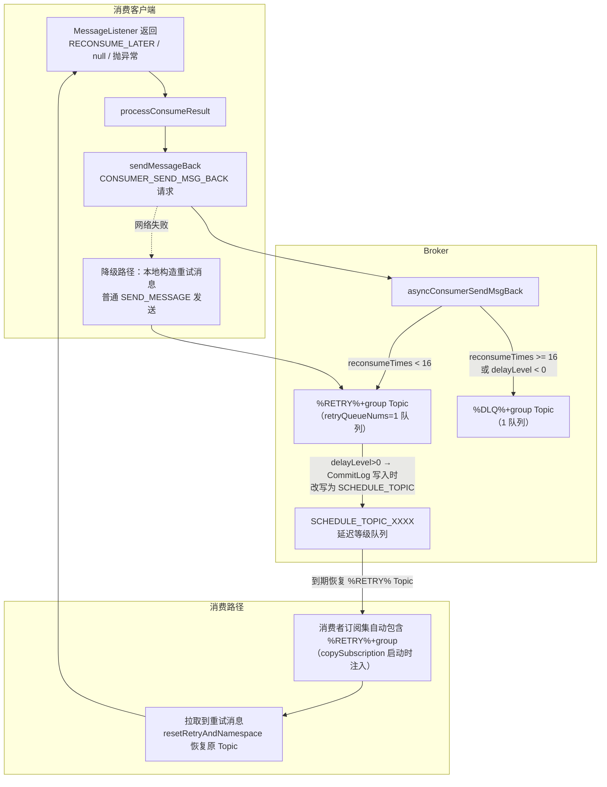
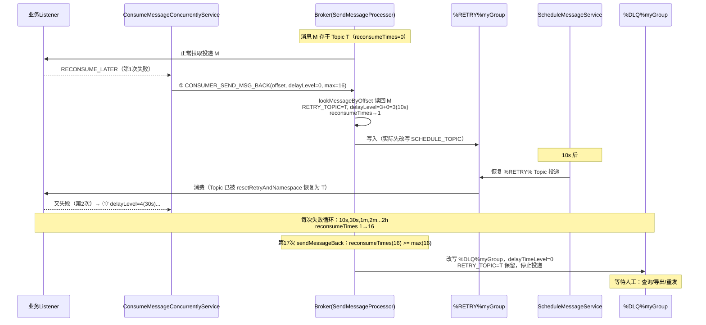

# RocketMQ 消费重试与死信队列（DLQ）源码深度分析

> 基于 RocketMQ 4.9.8 源码，行号为当前仓库实际行号。
> 涉及文件：
> - client/.../impl/consumer/ConsumeMessageConcurrentlyService.java（消费结果处理 / sendMessageBack / 过期消息清理）
> - client/.../impl/consumer/DefaultMQPushConsumerImpl.java（sendMessageBack / copySubscription 订阅重试 Topic / resetRetryAndNamespace）
> - broker/.../processor/SendMessageProcessor.java（asyncConsumerSendMsgBack / handleRetryAndDLQ）
> - broker/.../schedule/ScheduleMessageService.java（重试延迟投递，与延迟消息共用）
> - client/.../impl/consumer/ProcessQueue.java（cleanExpiredMsg）

---

## 一、总体设计：为什么重试不走原队列

消费失败的消息如果直接投回**原队列**，会立刻被再次拉取（位点就在它后面），失败的消息会
**阻塞队列头部**并高频空转。RocketMQ 的方案是：

1. 消费失败 → 客户端把消息**发回 Broker**（CONSUMER_SEND_MSG_BACK，不是普通发送！）；
2. Broker 把消息改写到**重试 Topic**（`%RETRY%{group}`），并打上**延迟等级**（10s, 30s, 1m...2h 递增）；
3. 延迟到期后消息在重试 Topic 投递，消费者像消费普通 Topic 一样消费它；
4. 重试 16 次仍失败 → 改写**死信 Topic**（`%DLQ%{group}`），停止投递，留待人工干预。

**关键认知：重试消息的存储位置换了，但"逻辑身份"不变**——通过 `PROPERTY_RETRY_TOPIC` 属性
记住原 Topic，消费时再恢复，业务代码感知不到换队。



---

## 二、客户端：消费失败的三种形态与结果处理

### 2.1 失败判定（ConsumeMessageConcurrentlyService$ConsumeRequest.run :395-436）

```java
status = listener.consumeMessage(Collections.unmodifiableList(msgs), context);  // 调业务 listener
...
if (null == status) {
    // ★ 返回 null：有异常按 EXCEPTION、无异常按 RETURN_NULL，最终都置 RECONSUME_LATER
    if (hasException) returnType = ConsumeReturnType.EXCEPTION;
    else              returnType = ConsumeReturnType.RETURNNULL;
    ...
    status = ConsumeConcurrentlyStatus.RECONSUME_LATER;    // null 一律当失败
}
// 注意：listener 抛异常被 catch（hasException=true），status 保持 null → 同样走重试
```

**三种失败形态等价**：返回 `RECONSUME_LATER`、返回 `null`、抛出异常。

### 2.2 processConsumeResult（:241-302）——ackIndex 的精妙设计

```java
public void processConsumeResult(final ConsumeConcurrentlyStatus status,
    final ConsumeConcurrentlyContext context, final ConsumeRequest consumeRequest) {
    int ackIndex = context.getAckIndex();     // 业务可设置：批量消费中前 ackIndex+1 条成功

    switch (status) {
        case CONSUME_SUCCESS:
            if (ackIndex >= msgs.size()) ackIndex = msgs.size() - 1;
            // ok = ackIndex+1（成功条数），failed = 其余
            break;
        case RECONSUME_LATER:
            ackIndex = -1;                    // ★ 整批全失败 → 下面循环从 0 开始全部发回
            break;
    }

    switch (messageModel) {
        case BROADCASTING:
            // ★ 广播模式：失败仅打日志，消息直接丢弃！没有重试、没有 DLQ
            for (int i = ackIndex + 1; i < msgs.size(); i++) {
                log.warn("BROADCASTING, the message consume failed, drop it, {}", ...);
            }
            break;
        case CLUSTERING:
            List<MessageExt> msgBackFailed = new ArrayList<>(msgs.size());
            for (int i = ackIndex + 1; i < msgs.size(); i++) {      // ackIndex+1 开始 = 失败的消息
                MessageExt msg = consumeRequest.getMsgs().get(i);
                boolean result = this.sendMessageBack(msg, context);
                if (!result) {                       // 发回失败（网络异常）
                    msg.setReconsumeTimes(msg.getReconsumeTimes() + 1);
                    msgBackFailed.add(msg);
                }
            }
            // ★ 发回失败的消息：从本批移除，5s 后本地重新消费（不丢，也不阻塞）
            if (!msgBackFailed.isEmpty()) {
                consumeRequest.getMsgs().removeAll(msgBackFailed);
                this.submitConsumeRequestLater(msgBackFailed, pq, mq);   // 5s 后重试消费
            }
            break;
    }

    // ★ 无论成败：最后统一从 ProcessQueue 移除本批消息并推进位点
    //   （失败消息已"搬家"到重试 Topic，原地删除是正确的）
    long offset = consumeRequest.getProcessQueue().removeMessage(consumeRequest.getMsgs());
    if (offset >= 0 && !consumeRequest.getProcessQueue().isDropped()) {
        this.defaultMQPushConsumerImpl.getOffsetStore()
            .updateOffset(consumeRequest.getMessageQueue(), offset, true);
    }
}
```

**ackIndex 机制解读**：批量消费（`consumeMessageBatchMaxSize>1`）时，listener 可以通过
`context.setAckIndex(n)` 声明"前 n+1 条成功、后面失败"——失败子集才发回重试。默认
`ackIndex = Integer.MAX_VALUE`（全成功），失败时置 -1（全失败）。**注意粒度缺陷**：只能表达
"前缀成功"，中间某条失败无法精确表达（那是 5.x 重试粒度优化的方向之一）。

**为什么发回失败要本地重消费**：`sendMessageBack` 网络失败时，消息既没进重试 Topic，又即将
被位点推进跳过——先把它们从 `removeMessage` 的名单里摘出来，5s 后重新提交消费，再走一次
sendMessageBack。**兜底的兜底**。

### 2.3 sendMessageBack（DefaultMQPushConsumerImpl.java:522-549）——主路径与降级路径

```java
public void sendMessageBack(MessageExt msg, int delayLevel, final String brokerName) {
    try {
        // 主路径：CONSUMER_SEND_MSG_BACK 专用请求（带上 group / delayLevel / maxReconsumeTimes）
        String brokerAddr = (null != brokerName)
            ? this.mQClientFactory.findBrokerAddressInPublish(brokerName)
            : RemotingHelper.parseSocketAddressAddr(msg.getStoreHost());   // 发回消息原存的 Broker
        this.mQClientFactory.getMQClientAPIImpl().consumerSendMessageBack(
            brokerAddr, brokerName, msg, group, delayLevel, 5000, getMaxReconsumeTimes());
    } catch (Exception e) {
        // ★ 降级路径：客户端自己构造重试消息，用内部默认 Producer 普通发送
        Message newMsg = new Message(MixAll.getRetryTopic(group), msg.getBody());
        String originMsgId = MessageAccessor.getOriginMessageId(msg);
        MessageAccessor.setOriginMessageId(newMsg, isBlank(originMsgId) ? msg.getMsgId() : originMsgId);
        newMsg.setFlag(msg.getFlag());
        MessageAccessor.setProperties(newMsg, msg.getProperties());          // 继承全部属性（含 RETRY_TOPIC）
        MessageAccessor.putProperty(newMsg, MessageConst.PROPERTY_RETRY_TOPIC, msg.getTopic());  // 原Topic
        MessageAccessor.setReconsumeTime(newMsg, String.valueOf(msg.getReconsumeTimes() + 1));   // 次数+1
        MessageAccessor.setMaxReconsumeTimes(newMsg, String.valueOf(getMaxReconsumeTimes()));
        MessageAccessor.clearProperty(newMsg, MessageConst.PROPERTY_TRANSACTION_PREPARED);
        newMsg.setDelayTimeLevel(3 + msg.getReconsumeTimes());   // ★ 客户端自己算延迟等级（见下）
        this.mQClientFactory.getDefaultMQProducer().send(newMsg);  // 普通 SEND_MESSAGE
    }
}

private int getMaxReconsumeTimes() {
    if (this.defaultMQPushConsumer.getMaxReconsumeTimes() == -1) return 16;   // 默认 16
    return this.defaultMQPushConsumer.getMaxReconsumeTimes();
}
```

**降级路径的对称性**：客户端算好 `delayLevel = 3 + reconsumeTimes` 和次数+1 直接发重试 Topic，
走的是**普通发送链路**（SendMessageProcessor.sendMessage → handleRetryAndDLQ，见 3.3）。
Broker 端两条路径处理逻辑等价——这就是 `handleRetryAndDLQ` 存在的原因。

`delayLevelWhenNextConsume`：`context.setDelayLevelWhenNextConsume(n)` 可让业务自定义下次
重试的延迟等级（0=默认递增）；负数是特殊语义——**直接进 DLQ**（Broker 端 `delayLevel < 0` 判断）。

---

## 三、Broker 端：asyncConsumerSendMsgBack 精读（SendMessageProcessor.java:116-245）

```java
private CompletableFuture<RemotingCommand> asyncConsumerSendMsgBack(...) {
    // ① 订阅组校验：group 必须已在 SubscriptionGroupManager（自动创建或配置）
    SubscriptionGroupConfig subscriptionGroupConfig =
        findSubscriptionGroupConfig(requestHeader.getGroup());
    if (null == ...) return SUBSCRIPTION_GROUP_NOT_EXIST;
    // ② retryQueueNums <= 0 → 该组禁用重试，直接返回成功（消息被丢弃！）
    if (subscriptionGroupConfig.getRetryQueueNums() <= 0) return SUCCESS;
    // ③ 懒创建重试 Topic：%RETRY%+group，队列数 = retryQueueNums（默认1），权限 RW
    String newTopic = MixAll.getRetryTopic(requestHeader.getGroup());       // "%RETRY%" + group
    int queueIdInt = random % subscriptionGroupConfig.getRetryQueueNums();  // 默认 1 个队列 → 恒 0
    TopicConfig topicConfig = createTopicInSendMessageBackMethod(newTopic, ...);

    // ④ 按物理偏移读回原消息（CONSUMER_SEND_MSG_BACK 只带 offset，不带消息体！）
    MessageExt msgExt = this.brokerController.getMessageStore()
        .lookMessageByOffset(requestHeader.getOffset());
    if (null == msgExt) return SYSTEM_ERROR;

    // ⑤ 记录原 Topic（重试投递时恢复用）
    final String retryTopic = msgExt.getProperty(MessageConst.PROPERTY_RETRY_TOPIC);
    if (null == retryTopic) {
        MessageAccessor.putProperty(msgExt, MessageConst.PROPERTY_RETRY_TOPIC, msgExt.getTopic());
    }

    // ⑥ 判定最大重试次数：subscriptionGroupConfig.retryMaxTimes（默认16），
    //    客户端版本 >= V3_4_9 时优先用请求里的 maxReconsumeTimes（业务可自定义）
    int maxReconsumeTimes = subscriptionGroupConfig.getRetryMaxTimes();
    if (request.getVersion() >= MQVersion.Version.V3_4_9.ordinal()) {
        Integer times = requestHeader.getMaxReconsumeTimes();
        if (times != null) maxReconsumeTimes = times;
    }

    if (msgExt.getReconsumeTimes() >= maxReconsumeTimes || delayLevel < 0) {
        // ⑦ ★ 进死信：%DLQ%+group，1 个队列（DLQ_NUMS_PER_GROUP=1）
        newTopic = MixAll.getDLQTopic(requestHeader.getGroup());     // "%DLQ%" + group
        queueIdInt = random % DLQ_NUMS_PER_GROUP;
        topicConfig = createTopicInSendMessageBackMethod(newTopic, DLQ_NUMS_PER_GROUP, PERM_RW, 0);
        msgExt.setDelayTimeLevel(0);          // DLQ 消息不再延迟
    } else {
        // ⑧ ★ 重试延迟等级：客户端未指定(0) → 3 + reconsumeTimes
        if (0 == delayLevel) {
            delayLevel = 3 + msgExt.getReconsumeTimes();
        }
        msgExt.setDelayTimeLevel(delayLevel);
    }

    // ⑨ 构造新消息写入（新 msgId、新 commitLogOffset，reconsumeTimes+1）
    MessageExtBrokerInner msgInner = new MessageExtBrokerInner();
    msgInner.setTopic(newTopic);
    msgInner.setBody(msgExt.getBody());
    MessageAccessor.setProperties(msgInner, msgExt.getProperties());   // 含 RETRY_TOPIC/ORIGIN_MESSAGE_ID
    msgInner.setQueueId(queueIdInt);
    msgInner.setReconsumeTimes(msgExt.getReconsumeTimes() + 1);        // ★ 次数累加在 Broker 侧
    String originMsgId = MessageAccessor.getOriginMessageId(msgExt);
    MessageAccessor.setOriginMessageId(msgInner,
        UtilAll.isBlank(originMsgId) ? msgExt.getMsgId() : originMsgId);  // 原始 msgId 一直透传
    ...
    CompletableFuture<PutMessageResult> putMessageResult =
        this.brokerController.getMessageStore().asyncPutMessage(msgInner);
    ...
}
```

**七个关键设计**：

1. **请求只带 offset 不带消息体**：客户端从 PullResult 知道消息的 commitLogOffset，
   Broker `lookMessageByOffset` 直接读回——**省一次上行网络传输**（消息体可能很大）。
2. **重试是一条全新消息**：新 msgId、新 offset、新存储位置；身份靠三个属性传递：
   `RETRY_TOPIC`（原 Topic）、`ORIGIN_MESSAGE_ID`（最初的 msgId）、`RECONSUME_TIME`（次数）。
3. **次数在 Broker 侧累加**（`setReconsumeTimes(+1)`），降级路径则在客户端累加——两条路径等价。
4. **延迟等级公式 `3 + reconsumeTimes`**：等级 3~18 正好覆盖 18 级延迟表的后 16 级
   （10s,30s,1m,2m,3m,4m,5m,6m,7m,8m,9m,10m,20m,30m,1h,2h）——**重试复用延迟消息基础设施**，
   第 1 次重试 10s 后，第 2 次 30s，指数式退避，16 次总时长约 4h46m。
5. **DLQ 的两个触发条件**：次数达上限，或客户端显式 `delayLevel<0`（业务主动放弃）。
6. **`%RETRY%`/`%DLQ%` Topic 都是懒创建**（首次发回时 `createTopicInSendMessageBackMethod`），
   队列数分别由 `retryQueueNums`（默认 1）和 `DLQ_NUMS_PER_GROUP`（1）决定。
7. **msgExt.setWaitStoreMsgOK(false)**：重试消息写 CommitLog 不等刷盘确认——重试消息
   丢一条的代价远小于阻塞。

### 3.1 延迟的生效点：CommitLog 写入时改写 Topic

重试消息带着 `delayTimeLevel` 进入 `CommitLog.asyncPutMessage`（与延迟消息同一段代码）：

```java
// CommitLog.asyncPutMessage 中：
final int tranType = MessageSysFlag.getTransactionValue(msg.getSysFlag());
if (msg.getDelayTimeLevel() > 0) {
    if (msg.getTopic() != null && SCHEDULE_TOPIC.equals(...)) { ... }
    // 改写 Topic 为 SCHEDULE_TOPIC，queueId = delayLevel - 1（每个等级一个队列）
    messageDelayLevel...
}
```

ScheduleMessageService 到期后把消息**恢复为 %RETRY% Topic** 再写 CommitLog（详见延迟消息
文档）——注意恢复的是 `%RETRY%+group`（消息存储时的 Topic），而不是原 Topic。

### 3.2 降级路径的 Broker 处理：handleRetryAndDLQ（:344-386）

```java
private boolean handleRetryAndDLQ(SendMessageRequestHeader requestHeader, ..., MessageExt msg, ...) {
    String newTopic = requestHeader.getTopic();
    if (newTopic != null && newTopic.startsWith(MixAll.RETRY_GROUP_TOPIC_PREFIX)) {  // 发到 %RETRY%
        String groupName = newTopic.substring(RETRY_GROUP_TOPIC_PREFIX.length());
        ...
        int maxReconsumeTimes = subscriptionGroupConfig.getRetryMaxTimes();   // 请求 maxReconsumeTimes 优先
        int reconsumeTimes = requestHeader.getReconsumeTimes() == null ? 0 : ...;
        if (reconsumeTimes >= maxReconsumeTimes) {          // 客户端降级发送也会被拦进 DLQ
            newTopic = MixAll.getDLQTopic(groupName);
            msg.setTopic(newTopic);
            msg.setQueueId(random % DLQ_NUMS_PER_GROUP);
            msg.setDelayTimeLevel(0);
            ...
        }
    }
    ...
    return true;
}
```

普通 SEND_MESSAGE 到 `%RETRY%` Topic 的消息统一过这里：**超限的拦截进 DLQ**（防止客户端
降级路径伪造次数绕过）、`subscriptionGroupConfig` 校验防未授权写重试队列。

---

## 四、消费侧：重试消息如何被消费

### 4.1 订阅注入（DefaultMQPushConsumerImpl.copySubscription :855-866）

```java
case CLUSTERING:
    // ★ 启动时自动把 %RETRY%+本组 加进订阅集
    final String retryTopic = MixAll.getRetryTopic(this.defaultMQPushConsumer.getConsumerGroup());
    SubscriptionData subscriptionData = FilterAPI.buildSubscriptionData(retryTopic, SubscriptionData.SUB_ALL);
    this.rebalanceImpl.getSubscriptionInner().put(retryTopic, subscriptionData);
```

消费者**天然订阅自己的重试 Topic**（SUB_ALL，不过滤），Rebalance 会为它分配队列并拉取——
这就是为什么 `rebalanceByTopic` 里所有 `%RETRY%` 前缀的日志都被静默：每个消费组都多一个
内部 Topic，查不到路由/异常都是噪音。

### 4.2 恢复原 Topic（DefaultMQPushConsumerImpl.resetRetryAndNamespace :1157-1169）

```java
public void resetRetryAndNamespace(final List<MessageExt> msgs, String consumerGroup) {
    final String groupTopic = MixAll.getRetryTopic(consumerGroup);
    for (MessageExt msg : msgs) {
        String retryTopic = msg.getProperty(MessageConst.PROPERTY_RETRY_TOPIC);
        if (retryTopic != null && groupTopic.equals(msg.getTopic())) {
            msg.setTopic(retryTopic);     // ★ 拉取成功后把 Topic 恢复为原 Topic
        }
        ...
    }
}
```

调用点在 `pullMessage` 的 PullCallback 里（`resetRetryAndNamespace(pullResult.getMsgFoundList(),
group)`）——**业务 listener 看到的 msg.getTopic() 是原 Topic**，与首次投递完全一致。
判断 `reconsumeTimes > 0` 需用 `msg.getReconsumeTimes()`，不能用 Topic 区分。

---

## 五、隐藏机制：消费超时的"被动重试"

除了显式失败，还有一条**客户端本地**的超时重试路径（ConsumeMessageConcurrentlyService）：

```java
// 启动时每 15 分钟×(consumeTimeout/15) 周期调度 cleanExpireMsg（默认 consumeTimeout=15 分钟）
this.defaultMQPushConsumerImpl.getDefaultMQPushConsumer().getConsumeTimeout();  // 分钟

// ProcessQueue.cleanExpiredMsg(consumer)：
//   遍历 msgTreeMap，msg 的 consumeStartTimestamp + consumeTimeout*60s < now → 视为"卡死"
for (MessageExt msg : msgTreeMap.values()) {
    long startTime = msg 的 PROPERTY_CONSUME_START_TIMESTAMP;
    if (now - startTime > consumeTimeout * 60000L) {
        // ★ 同样 sendMessageBack 到重试队列
        consumer.getDefaultMQPushConsumerImpl().sendMessageBack(msg, ...) 或本地降级发送
        // 发回失败 → msgTreeMap.remove 否则保留等待下轮
    }
}
```

**动机**：listener 卡死/死循环/线程池打满时，消息在 ProcessQueue 里永不返回结果——位点不推进、
消息不重试，形成"假活着"。超时清理把它踢回重试队列，让其他消费者接管。**广播模式下
cleanExpiredMsg 直接跳过**（重试无意义）。

注意与顺序消费的区别：Orderly 模式没有这条路径（顺序消费卡住是预期行为，靠
`SuspendCurrentQueueTimeMillis` 本地重试）。

---

## 六、顺序消费的失败处理（对比）

ConsumeMessageOrderlyService.processConsumeResult 中失败**不发回 Broker**：

```java
case SUSPEND_CURRENT_QUEUE_MOMENT:
    // 消息塞回 msgTreeMap 队头（rollback），本地 suspendCurrentQueueTime(默认1s) 后重试同一队列
    // 达到 getMaxReconsumeTimes() 时才 sendMessageBack（进 %RETRY% 或 DLQ）
    // ★ 顺序性优先：重试必须还在本队列、本消费者，不能让重试机制把消息挪到重试 Topic 破坏顺序
```

本质差异：**并发消费的失败恢复是"集群级"（换队列换消费者），顺序消费是"本地级"（原队列重试）**，
超过本地重试上限才退化为集群级（此时顺序已无法保证，进 DLQ 保底不丢）。

---

## 七、DLQ 的运维闭环

- **权限**：`%DLQ%+group` 创建时 `PERM_WRITE | PERM_READ`，但没有消费者订阅它——**消息进入
  DLQ 即停止投递**，等待人工处理。
- **标准处理流程**：

```bash
# 1. 查看堆积
mqadmin consumerProgress -g myGroup          # Diff > 0 且不下降
# 2. 查死信
mqadmin topicStatus -t %DLQ%myGroup          # 死信数量/最早最晚时间
mqadmin queryMsgByOffsetKey / 控制台查询消息体与属性（RETRY_TOPIC / RECONSUME_TIME / ORIGIN_MESSAGE_ID）
# 3. 修复后重发（两种方式）
#    a) 控制台/工具导出消息重新 send 到原 Topic（新消息，reconsumeTimes 归零）
#    b) resetOffset 类工具不适用于 DLQ（无消费组订阅）
```

- **预防**：`maxReconsumeTimes` 按业务设置（-1=16 默认）；重要业务监控
  `incConsumeFailedTPS` 指标与 DLQ 队列深度告警。
- **DLQ 堆积会吃磁盘**：DLQ 也是普通 Topic，受 `fileReservedTime` 过期清理约束，但默认
  也会无限增长——超大规模死信需要单独的归档方案。

---

## 八、完整时序图：一条消息的 16 次重试之旅



**总时长表**（默认 16 次）：

| 次数 | 1 | 2 | 3 | 4 | 5 | 6 | 7 | 8 | 9 | 10 | 11 | 12 | 13 | 14 | 15 | 16 |
|------|---|---|---|---|---|---|---|---|---|----|----|----|----|----|----|----|
| 延迟 | 10s | 30s | 1m | 2m | 3m | 4m | 5m | 6m | 7m | 8m | 9m | 10m | 20m | 30m | 1h | 2h |

累计约 4小时46分 后进 DLQ。

---

## 九、易错点与设计复盘

### 9.1 易错点清单

| 认知坑 | 正解 |
|--------|------|
| "重试消息 Topic 是原 Topic" | 存储 Topic 是 %RETRY%+group，消费前才被 reset 回原 Topic |
| "返回 null 不算失败" | null == RECONSUME_LATER == 抛异常，全部重试 |
| "广播模式也会重试" | 广播失败直接丢弃（drop it 日志），无重试无 DLQ |
| "reconsumeTimes 在消息属性里累加" | 累加发生在 Broker 侧新消息的 **sysFlag 附近字段**（CommitLog 消息头），属性里的是客户端降级路径的 |
| "DLQ 消息会自动重发" | DLQ 无消费者，必须人工干预 |
| "maxReconsumeTimes 客户端设了就生效" | 需 Broker 端 subscriptionGroupConfig 配合（V3_4_9+ 请求值优先），且 Broker 可用 retryMaxTimes 统一管控 |
| "重试消息和原消息是同一条" | 完全新消息（新 msgId/offset），只有 ORIGIN_MESSAGE_ID 关联 |

### 9.2 设计复盘

- **复用延迟消息基础设施**做退避，是整个方案最优雅的一笔：不加队列、不加线程，18 级延迟
  表天然覆盖重试节奏；
- **CONSUMER_SEND_MSG_BACK 只传 offset**，消息体由 Broker 自己读——网络友好；
- **重试 Topic 每组一个**，组的重试流量天然隔离，且 Rebalance 自动接管（订阅注入）；
- **失败转移是三级兜底**：sendMessageBack 网络失败 → 本地 5s 重消费；listener 卡死 →
  consumeTimeout 被动清理；16 次失败 → DLQ 终态归档。

### 9.3 与 5.0 的差异预告

5.x 的重试改为**服务端定时（TimerWheel）驱动**且粒度到单条消息，DLQ 支持自动重投策略；
4.x 的"延迟等级表 + 客户端发回"模型理解了，5.x 只是换了定时器。

---

## 十、调试手册

**断点路线**：
1. `ConsumeMessageConcurrentlyService.processConsumeResult:246`——ackIndex 计算与消息分流；
2. `DefaultMQPushConsumerImpl.sendMessageBack:524`——主路径请求参数 / 降级路径构造；
3. `SendMessageProcessor.asyncConsumerSendMsgBack:191`——重试 vs DLQ 的分叉点；
4. `DefaultMQPushConsumerImpl.resetRetryAndNamespace:1160`——重试消息消费前的 Topic 恢复；
5. `ProcessQueue.cleanExpiredMsg`——超时被动重试。

**日志关键字**：
- `BROADCASTING, the message consume failed, drop it`——广播模式消息被丢弃；
- `sendMessageBack exception`——进入降级路径（网络问题信号）；
- `subscribe error` / `subscription group not exist`——Broker 拒绝发回。

**mqadmin**：

```bash
mqadmin consumerProgress -g myGroup                # 重试队列 %RETRY% 的堆积单独显示
mqadmin topicStatus -t %DLQ%myGroup -n ns:9876     # 死信数量
mqadmin queryMsgById -i <msgId>                    # 查属性 RETRY_TOPIC/RECONSUME_TIME/ORIGIN_MESSAGE_ID
```

---

## 十一、一句话总结

> 消费重试 = **失败消息"搬家"而非"原队列重投"**：客户端 CONSUMER_SEND_MSG_BACK（只带 offset），
> Broker 读回原消息构造新消息写入 `%RETRY%+group`，延迟等级 `3+reconsumeTimes` 借延迟消息
> 基础设施实现 10s→2h 的退避，消费者靠启动时注入的隐藏订阅自动消费（消费前 Topic 恢复原貌）；
> 16 次失败进 `%DLQ%+group` 终态归档，中间还有 sendMessageBack 网络失败本地重试、
> consumeTimeout 被动清理两级兜底——代价是重试消息全新身份（ORIGIN_MESSAGE_ID 关联）与
> 广播模式完全无重试的语义空洞。
