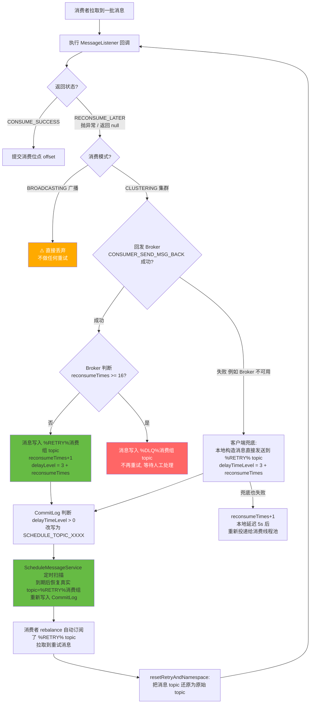
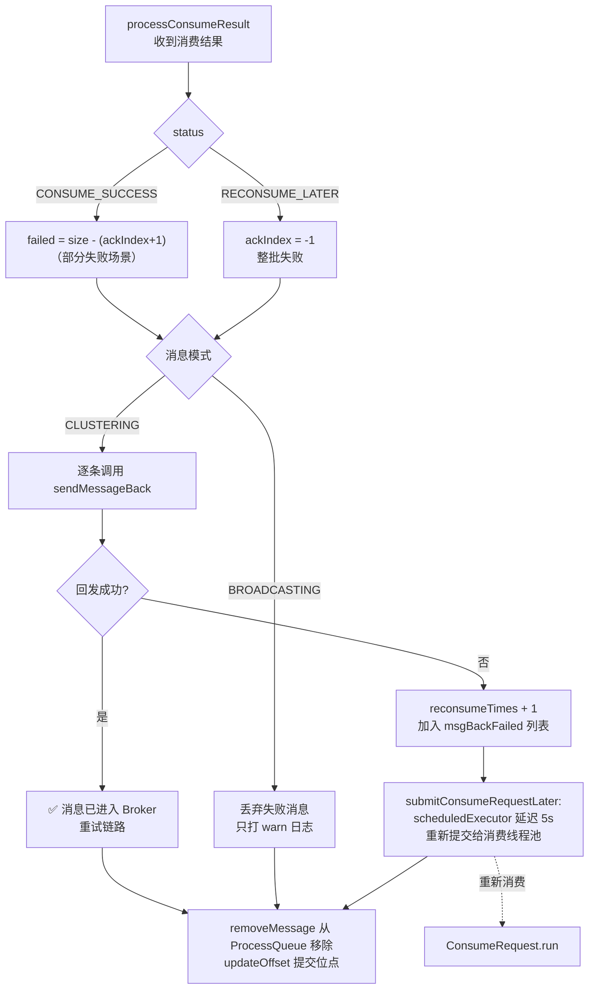
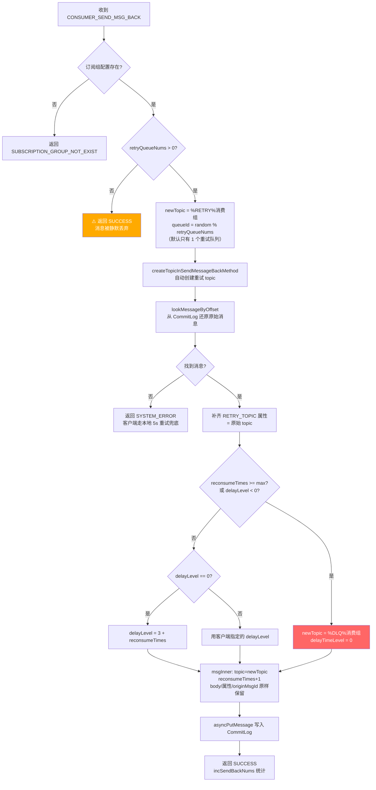
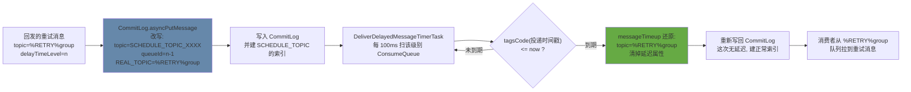
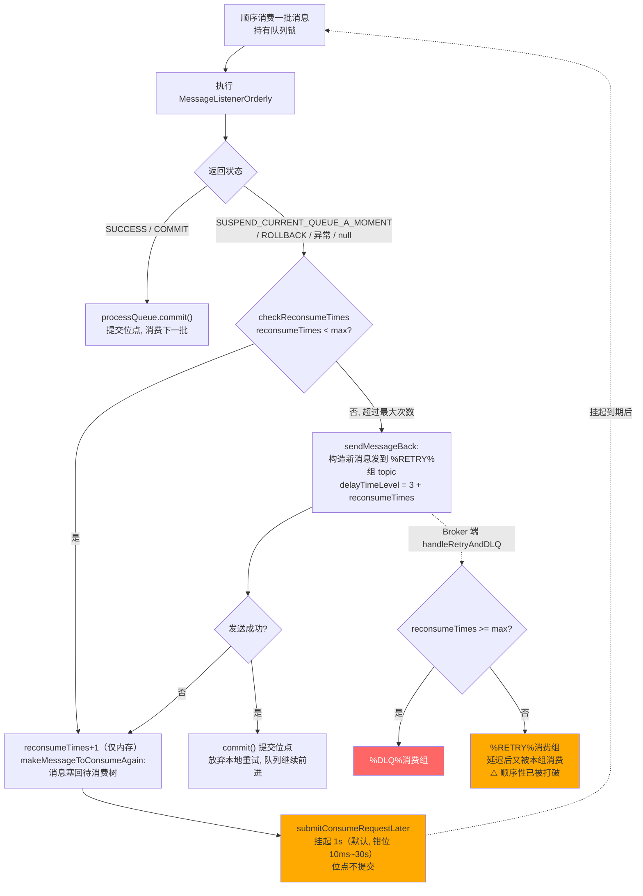
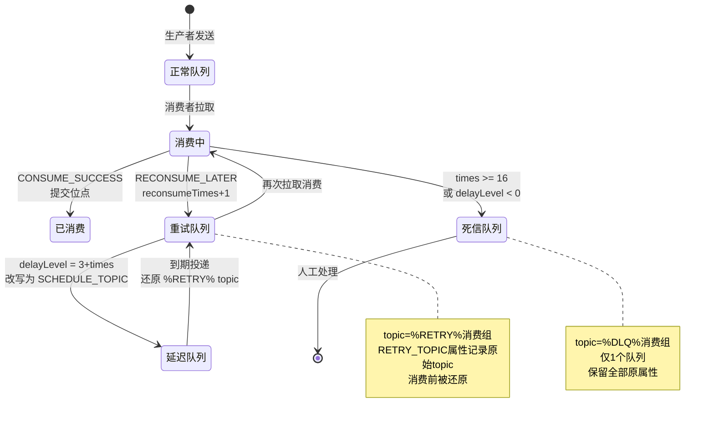
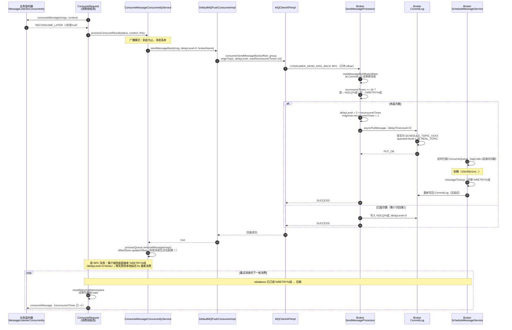
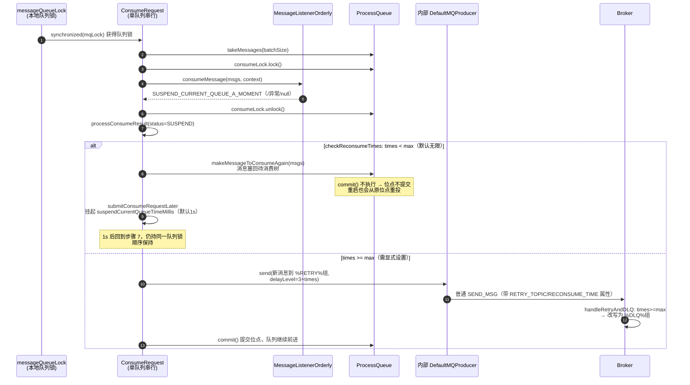

# RocketMQ 4.9.8 消费重试机制源码深度解析

> 基于 Apache RocketMQ 4.9.8 源码（本仓库），所有结论均标注源码位置（`文件路径:行号`），可直接跳转核对。
>
> 核心结论先行：
> - **并发消费（CONCURRENTLY）** 失败后走 **"发回 Broker → 进入 %RETRY% 重试队列 → 延迟投递 → 重新消费"** 的远程重试链路；
> - **顺序消费（ORDERLY）** 失败后走 **"本地挂起重试"** 链路（不回发 Broker），直到超过最大重试次数才回发进入 DLQ；
> - 默认最多重试 **16 次**（并发模式），按 **10s → 30s → 1m → … → 1h** 的梯度延迟，全部失败约 **3 小时后**进入死信队列 `%DLQ%消费组名`。

---

## 目录

1. [总览：一张图看懂消费重试](#1-总览一张图看懂消费重试)
2. [核心概念与关键参数](#2-核心概念与关键参数)
3. [消费失败的入口：ConsumeRequest.run()](#3-消费失败的入口consumequestrun)
4. [并发消费的失败处理：processConsumeResult()](#4-并发消费的失败处理processconsumeresult)
5. [客户端回发：sendMessageBack 全链路](#5-客户端回发sendmessageback-全链路)
6. [Broker 端处理：asyncConsumerSendMsgBack()](#6-broker-端处理asyncconsumersendmsgback)
7. [延迟投递：CommitLog 与 ScheduleMessageService](#7-延迟投递commitlog-与-schedulemessageservice)
8. [重试消息如何被再次消费](#8-重试消息如何被再次消费)
9. [顺序消费的重试：本地挂起 + checkReconsumeTimes](#9-顺序消费的重试本地挂起--checkreconsumetimes)
10. [消费超时重试：cleanExpiredMsg](#10-消费超时重试cleanexpiredmsg)
11. [死信队列（DLQ）](#11-死信队列dlq)
12. [完整时序图](#12-完整时序图)
13. [重试时间梯度表](#13-重试时间梯度表)
14. [源码级 FAQ](#14-源码级-faq)
15. [参数调优建议](#15-参数调优建议)

---

## 1. 总览：一张图看懂消费重试



> 顺序消费（ORDERLY）不走这条远程链路，详见[第 9 节](#9-顺序消费的重试本地挂起--checkreconsumetimes)：它在客户端本地把消息"塞回"处理队列挂起重试，**消费位点不提交**。

---

## 2. 核心概念与关键参数

| 概念/参数 | 值与位置 | 说明 |
|---|---|---|
| 重试 topic | `%RETRY%` + 消费组名 | `MixAll.getRetryTopic()`，每个消费组一个 |
| 死信 topic | `%DLQ%` + 消费组名 | `MixAll.getDLQTopic()`，每个消费组一个 |
| 重试队列数 | 默认 **1** | `SubscriptionGroupConfig.retryQueueNums`（`common/src/main/java/org/apache/rocketmq/common/subscription/SubscriptionGroupConfig.java:31`），broker 端可改 |
| 最大重试次数（并发） | 默认 **16** | 客户端 `DefaultMQPushConsumer.maxReconsumeTimes = -1` 时取 16（`ConsumeMessageConcurrentlyService` 中 `getMaxReconsumeTimes()`，见 `DefaultMQPushConsumerImpl.java:548-555`）；broker 端默认 16（`SubscriptionGroupConfig.retryMaxTimes`，第 33 行） |
| 最大重试次数（顺序） | 默认 `Integer.MAX_VALUE`（无限） | `ConsumeMessageOrderlyService.java:349-356` |
| 延迟级别计算 | `delayLevel = 3 + reconsumeTimes` | 重试专用，从第 3 级（10s）开始 |
| 延迟级别表 | `1s 5s 10s 30s 1m 2m 3m 4m 5m 6m 7m 8m 9m 10m 12m 20m 30m 1h 2h`（共 19 级） | `MessageStoreConfig.messageDelayLevel`（`store/src/main/java/org/apache/rocketmq/store/config/MessageStoreConfig.java:137`） |
| 消费超时 | 默认 **15 分钟** | `DefaultMQPushConsumer.consumeTimeout = 15`（`DefaultMQPushConsumer.java:256`），超时消息强制回发，重试 delayLevel 固定为 3 |
| 顺序挂起时间 | 默认 **1000ms**，范围 [10ms, 30s] | `DefaultMQPushConsumer.suspendCurrentQueueTimeMillis`（第 251 行），`ConsumeMessageOrderlyService.java:259-263` 做钳位 |
| 死信队列数 | `DLQ_NUMS_PER_GROUP = 1` | `SendMessageProcessor.java` 常量 |
| 消费失败本地重试延迟 | **5 秒** | `ConsumeMessageConcurrentlyService.submitConsumeRequestLater()`，第 330 行 |

**重要前提：重试机制只对集群模式（CLUSTERING）生效**。广播模式下消费失败的消息直接丢弃（源码见第 4 节）。Pull 消费者（`DefaultMQPullConsumer` / `DefaultLitePullConsumer`）没有自动重试，完全由业务自己管理 offset 和失败处理。

---

## 3. 消费失败的入口：ConsumeRequest.run()

消费线程池执行的核心任务在 `client/src/main/java/org/apache/rocketmq/client/impl/consumer/ConsumeMessageConcurrentlyService.java:345-447`：

```java
// ConsumeMessageConcurrentlyService.ConsumeRequest.run()（节选，行号对照 4.9.8 源码）
status = listener.consumeMessage(Collections.unmodifiableList(msgs), context);  // :397 调用业务监听器
} catch (Throwable e) {
    hasException = true;                                                        // :398-401 异常不抛出，仅标记
}
...
if (null == status) {
    log.warn("consumeMessage return null, Group: {} Msgs: {} MQ: {}", ...);     // :422
    status = ConsumeConcurrentlyStatus.RECONSUME_LATER;                          // :423 返回 null 也算失败
}
...
ConsumeMessageConcurrentlyService.this.processConsumeResult(status, context, this); // :436 统一处理结果
```

**失败的三种判定**（`ConsumeRequest.run()`，第 397~423 行）：

| 业务侧表现 | 判定结果 |
|---|---|
| 返回 `RECONSUME_LATER` | 失败 |
| 返回 `null` | 失败（`:421-424` 显式转成 `RECONSUME_LATER`） |
| 抛出任何 `Throwable` | 失败（status 为 null，同上） |
| 返回 `CONSUME_SUCCESS` 但 `context.setAckIndex(i)` 指定了部分失败 | 第 i+1 条之后的消息失败 |

> 注意 `ackIndex` 语义：`CONSUME_SUCCESS` 时默认 `ackIndex = msgs.size() - 1`，即**整批成功**；业务可通过 `ConsumeConcurrentlyContext.setAckIndex()` 声明"前 ackIndex+1 条成功"，剩余的走重试（`processConsumeResult` 第 246-255 行）。

---

## 4. 并发消费的失败处理：processConsumeResult()

`ConsumeMessageConcurrentlyService.processConsumeResult()`（`ConsumeMessageConcurrentlyService.java:241-297`）是并发模式重试的**总调度器**：

```java
public void processConsumeResult(final ConsumeConcurrentlyStatus status,
        final ConsumeConcurrentlyContext context, final ConsumeRequest consumeRequest) {
    int ackIndex = context.getAckIndex();
    switch (status) {
        case CONSUME_SUCCESS:
            int ok = ackIndex + 1;                                  // 前 ackIndex+1 条成功
            int failed = consumeRequest.getMsgs().size() - ok;      // 其余算失败
            break;
        case RECONSUME_LATER:
            ackIndex = -1;                                          // 全部失败
            break;
    }

    switch (this.defaultMQPushConsumer.getMessageModel()) {
        case BROADCASTING:                                          // :265-269
            // 广播模式：失败消息直接丢弃，只打日志！
            for (int i = ackIndex + 1; i < msgs.size(); i++) {
                log.warn("BROADCASTING, the message consume failed, drop it, {}", msg.toString());
            }
            break;
        case CLUSTERING:                                            // :271-287
            List<MessageExt> msgBackFailed = new ArrayList<>(msgs.size());
            for (int i = ackIndex + 1; i < msgs.size(); i++) {      // 逐条回发
                MessageExt msg = msgs.get(i);
                boolean result = this.sendMessageBack(msg, context); // :275 回发 Broker
                if (!result) {                                      // :276-279 回发失败
                    msg.setReconsumeTimes(msg.getReconsumeTimes() + 1);
                    msgBackFailed.add(msg);                         // 记下来，走本地重试
                }
            }
            if (!msgBackFailed.isEmpty()) {                         // :282-286
                consumeRequest.getMsgs().removeAll(msgBackFailed);  // 从本批中剔除
                this.submitConsumeRequestLater(msgBackFailed, ...); // 延迟 5s 重新投递给线程池
            }
            break;
    }
    // :292-296 无论成功失败，都要从 ProcessQueue 移除并更新消费位点
    long offset = consumeRequest.getProcessQueue().removeMessage(consumeRequest.getMsgs());
    if (offset >= 0 && !consumeRequest.getProcessQueue().isDropped()) {
        this.defaultMQPushConsumerImpl.getOffsetStore()
            .updateOffset(consumeRequest.getMessageQueue(), offset, true);
    }
}
```

**两个极易被忽略的源码细节**：

1. **失败消息的 offset 也会被提交**（`:292-296`）。因为消息已经回发到 `%RETRY%` topic 成为一条"新消息"，原队列的消费进度必须前进，否则会重复消费。这就解释了为什么重试不是简单的"offset 回退"，而是"换个 topic 重新投递"。

2. **回发失败 ≠ 消息丢失**。`sendMessageBack` 返回 false 时（如 Broker 宕机、网络抖动），消息通过 `submitConsumeRequestLater()`（`:318-331`）延迟 **5 秒**后在**本地**重新走一遍 `ConsumeRequest`（注意 `msgs` 里的 reconsumeTimes 已 +1），相当于客户端侧的轻量级重试兜底。这个循环理论上可以无限进行，直到回发成功。



---

## 5. 客户端回发：sendMessageBack 全链路

### 5.1 ConsumeMessageConcurrentlyService.sendMessageBack()

（`ConsumeMessageConcurrentlyService.java:303-316`）

```java
public boolean sendMessageBack(final MessageExt msg, final ConsumeConcurrentlyContext context) {
    // 业务可通过 context.setDelayLevelWhenNextConsume(level) 自定义下次重试的延迟级别
    // 默认为 0（:32 ConsumeConcurrentlyContext.delayLevelWhenNextConsume = 0），
    // 传 0 时由 Broker 按 "3 + reconsumeTimes" 计算；
    // 传负数（如 -1）时 Broker 会直接把消息丢进 DLQ！
    int delayLevel = context.getDelayLevelWhenNextConsume();
    msg.setTopic(this.defaultMQPushConsumer.withNamespace(msg.getTopic()));
    try {
        this.defaultMQPushConsumerImpl.sendMessageBack(msg, delayLevel,
            context.getMessageQueue().getBrokerName());
        return true;
    } catch (Exception e) {
        log.error("sendMessageBack exception, group: " + this.consumerGroup + " msg: " + msg, e);
    }
    return false;
}
```

### 5.2 DefaultMQPushConsumerImpl.sendMessageBack()——一主一备两条路径

（`client/src/main/java/org/apache/rocketmq/client/impl/consumer/DefaultMQPushConsumerImpl.java:519-546`）

**主路径**：向 Broker 发送 `CONSUMER_SEND_MSG_BACK` 请求（注意只传 offset，不传消息体，Broker 会自己从 CommitLog 取原消息）：

```java
public void sendMessageBack(MessageExt msg, int delayLevel, final String brokerName) ... {
    try {
        String brokerAddr = (null != brokerName) ? this.mQClientFactory.findBrokerAddressInPublish(brokerName)
            : RemotingHelper.parseSocketAddressAddr(msg.getStoreHost());
        this.mQClientFactory.getMQClientAPIImpl().consumerSendMessageBack(brokerAddr, brokerName, msg,
            this.defaultMQPushConsumer.getConsumerGroup(), delayLevel, 5000, getMaxReconsumeTimes());
    } catch (Exception e) {
```

**备用路径**（catch 块，`:526-542`）：RPC 失败时，客户端**自己构造一条新消息**，通过内部持有的 `DefaultMQProducer` 直接发到 `%RETRY%消费组` topic：

```java
    } catch (Exception e) {
        log.error("sendMessageBack Exception, " + this.defaultMQPushConsumer.getConsumerGroup(), e);
        Message newMsg = new Message(MixAll.getRetryTopic(this.defaultMQPushConsumer.getConsumerGroup()), msg.getBody());
        String originMsgId = MessageAccessor.getOriginMessageId(msg);
        MessageAccessor.setOriginMessageId(newMsg, UtilAll.isBlank(originMsgId) ? msg.getMsgId() : originMsgId);
        newMsg.setFlag(msg.getFlag());
        MessageAccessor.setProperties(newMsg, msg.getProperties());
        // 关键属性：RETRY_TOPIC 记录原始 topic，重试消费时用它还原
        MessageAccessor.putProperty(newMsg, MessageConst.PROPERTY_RETRY_TOPIC, msg.getTopic());
        MessageAccessor.setReconsumeTime(newMsg, String.valueOf(msg.getReconsumeTimes() + 1));
        MessageAccessor.setMaxReconsumeTimes(newMsg, String.valueOf(getMaxReconsumeTimes()));
        MessageAccessor.clearProperty(newMsg, MessageConst.PROPERTY_TRANSACTION_PREPARED);
        newMsg.setDelayTimeLevel(3 + msg.getReconsumeTimes());   // 客户端自己算延迟级别
        this.mQClientFactory.getDefaultMQProducer().send(newMsg);
    }
```

> 这条备用路径发的是普通 `SEND_MSG` 请求，Broker 端由 `SendMessageProcessor.handleRetryAndDLQ()`（第 333-376 行）兜底判定是否进 DLQ——所以顺序消费超次数的回发（见第 9 节）也复用了同一套 DLQ 逻辑。

### 5.3 传输协议：MQClientAPIImpl.consumerSendMessageBack()

（`client/src/main/java/org/apache/rocketmq/client/impl/MQClientAPIImpl.java:1061-1093`）

```java
requestHeader.setGroup(consumerGroup);              // 消费组 → 决定 %RETRY%topic 名
requestHeader.setOriginTopic(msg.getTopic());       // 原始 topic
requestHeader.setOffset(msg.getCommitLogOffset());  // ⭐ 只传 CommitLog 物理偏移
requestHeader.setDelayLevel(delayLevel);            // 客户端指定的延迟级别（默认 0）
requestHeader.setOriginMsgId(msg.getMsgId());
requestHeader.setMaxReconsumeTimes(maxConsumeRetryTimes); // 版本 >= 3.4.9 才生效
```

**为什么只传 offset 不传消息体？** Broker 收到后用 `lookMessageByOffset(offset)` 直接从 CommitLog 取出原始消息（含 body、全部属性、born 信息），既省带宽又保证消息体不经过消费端篡改。风险是：如果原消息的 CommitLog 已被删除（极端情况），回发失败返回 SYSTEM_ERROR。

---

## 6. Broker 端处理：asyncConsumerSendMsgBack()

这是整个重试机制最核心的方法，位于 `broker/src/main/java/org/apache/rocketmq/broker/processor/SendMessageProcessor.java:116-263`。逐步拆解：

```java
private CompletableFuture<RemotingCommand> asyncConsumerSendMsgBack(...) {
    // ① 校验消费组配置是否存在（subscriptionGroupManager）
    SubscriptionGroupConfig subscriptionGroupConfig =
        this.brokerController.getSubscriptionGroupManager().findSubscriptionGroupConfig(requestHeader.getGroup());
    if (null == subscriptionGroupConfig) { return SUBSCRIPTION_GROUP_NOT_EXIST; }     // :126-133

    // ② retryQueueNums <= 0：配置关闭重试 → 返回"成功"，消息实际被静默丢弃！
    if (subscriptionGroupConfig.getRetryQueueNums() <= 0) {                            // :140-144
        response.setCode(ResponseCode.SUCCESS);
        return ...;
    }

    // ③ 准备重试 topic：%RETRY%消费组，队列数取 retryQueueNums（默认 1），不存在则自动创建
    String newTopic = MixAll.getRetryTopic(requestHeader.getGroup());                  // :146
    int queueIdInt = random % subscriptionGroupConfig.getRetryQueueNums();             // :147
    TopicConfig topicConfig = ...createTopicInSendMessageBackMethod(newTopic, ...);    // :153-156

    // ④ 根据 offset 从 CommitLog 还原原始消息
    MessageExt msgExt = this.brokerController.getMessageStore()
        .lookMessageByOffset(requestHeader.getOffset());                               // :168
    if (null == msgExt) { return SYSTEM_ERROR; }                                       // :169-173

    // ⑤ 保证 RETRY_TOPIC 属性存在（记录真实 topic，重试消费时还原用）
    final String retryTopic = msgExt.getProperty(MessageConst.PROPERTY_RETRY_TOPIC);
    if (null == retryTopic) {
        MessageAccessor.putProperty(msgExt, MessageConst.PROPERTY_RETRY_TOPIC, msgExt.getTopic()); // :175-178
    }

    // ⑥ 决定最大重试次数：优先取客户端传的（版本 >= V3_4_9），否则取 broker 端配置
    int maxReconsumeTimes = subscriptionGroupConfig.getRetryMaxTimes();                // :183 (默认16)
    if (request.getVersion() >= MQVersion.Version.V3_4_9.ordinal()) {
        Integer times = requestHeader.getMaxReconsumeTimes();
        if (times != null) { maxReconsumeTimes = times; }                              // :184-189
    }

    // ⑦ 核心分支：进 DLQ 还是进重试队列？
    if (msgExt.getReconsumeTimes() >= maxReconsumeTimes
            || delayLevel < 0) {                                                       // :191-192
        newTopic = MixAll.getDLQTopic(requestHeader.getGroup());                       // :193 %DLQ%消费组
        queueIdInt = random % DLQ_NUMS_PER_GROUP;                                      // :194 队列数=1
        topicConfig = ...createTopicInSendMessageBackMethod(newTopic, DLQ_NUMS_PER_GROUP, ...); // :196-198
        msgExt.setDelayTimeLevel(0);                                                   // :205 DLQ 不延迟
    } else {
        if (0 == delayLevel) {
            delayLevel = 3 + msgExt.getReconsumeTimes();    // ⭐ 重试延迟梯度公式   // :207-209
        }
        msgExt.setDelayTimeLevel(delayLevel);                                          // :210
    }

    // ⑧ 组装修复后的消息：topic 换成 %RETRY%/%DLQ%，重试次数 +1，其余原样保留
    MessageExtBrokerInner msgInner = new MessageExtBrokerInner();
    msgInner.setTopic(newTopic);                                                       // :214
    msgInner.setBody(msgExt.getBody());                                                // :215
    MessageAccessor.setProperties(msgInner, msgExt.getProperties());
    msgInner.setReconsumeTimes(msgExt.getReconsumeTimes() + 1);                        // :226 ⭐
    String originMsgId = MessageAccessor.getOriginMessageId(msgExt);                   // :228-229 保留初始 msgId
    ...

    // ⑨ 重新写回 CommitLog（后面走正常的存储 + 延迟消息改写流程）
    CompletableFuture<PutMessageResult> putMessageResult =
        this.brokerController.getMessageStore().asyncPutMessage(msgInner);             // :232
    ...
}
```



**第 ⑦ 步是重试机制的"心脏"**，两个进入 DLQ 的条件：

1. `msgExt.getReconsumeTimes() >= maxReconsumeTimes`——注意此时消息上记录的次数是**已重试的次数**，达到 16 即第 17 次回发时进 DLQ（即总共重试 16 次）；
2. `delayLevel < 0`——业务在消费失败时显式 `context.setDelayLevelWhenNextConsume(-1)` 可跳过所有重试直接进 DLQ，适合"明知不可能成功"的失败（如消息格式非法）。

---

## 7. 延迟投递：CommitLog 与 ScheduleMessageService

第 6 节第 ⑨ 步写入的消息带着 `delayTimeLevel > 0`，此时**并不是**直接落到 `%RETRY%` topic 的 ConsumeQueue 里，而是被改造成一条"延迟消息"。

### 7.1 CommitLog.asyncPutMessage() 的改写

（`store/src/main/java/org/apache/rocketmq/store/CommitLog.java:631-650`）

```java
if (tranType == MessageSysFlag.TRANSACTION_NOT_TYPE
        || tranType == MessageSysFlag.TRANSACTION_COMMIT_TYPE) {
    if (msg.getDelayTimeLevel() > 0) {
        if (msg.getDelayTimeLevel() > ...getMaxDelayLevel()) {   // 超上限钳位到最大级别
            msg.setDelayTimeLevel(...getMaxDelayLevel());
        }
        topic = TopicValidator.RMQ_SYS_SCHEDULE_TOPIC;           // topic 改为 SCHEDULE_TOPIC_XXXX
        int queueId = ScheduleMessageService.delayLevel2QueueId(msg.getDelayTimeLevel()); // = level-1

        // 用属性记住"真实"的 topic 和 queueId，投递时还原
        MessageAccessor.putProperty(msg, MessageConst.PROPERTY_REAL_TOPIC, msg.getTopic());
        MessageAccessor.putProperty(msg, MessageConst.PROPERTY_REAL_QUEUE_ID, String.valueOf(msg.getQueueId()));
        msg.setTopic(topic);
        msg.setQueueId(queueId);
    }
}
```

所以重试消息在存储层的真实形态是：**topic = `SCHEDULE_TOPIC_XXXX`，queueId = delayLevel - 1，真实 topic（`%RETRY%消费组`）藏在 `REAL_TOPIC` 属性里**。每个延迟级别一个队列，天然按到期时间有序。

### 7.2 ScheduleMessageService 定时投递

（`store/src/main/java/org/apache/rocketmq/store/schedule/ScheduleMessageService.java`）

`DeliverDelayedMessageTimerTask.executeOnTimeup()`（第 343-471 行）为每个 delayLevel 启动定时任务，核心逻辑：

```java
// :382-383 找到 SCHEDULE_TOPIC_XXXX 对应级别的 ConsumeQueue
ConsumeQueue cq = ...findConsumeQueue(TopicValidator.RMQ_SYS_SCHEDULE_TOPIC, delayLevel2QueueId(delayLevel));
SelectMappedBufferResult bufferCQ = cq.getIndexBuffer(this.offset);

for (; i < bufferCQ.getSize(); i += ConsumeQueue.CQ_STORE_UNIT_SIZE) {
    long offsetPy = bufferCQ.getByteBuffer().getLong();   // CommitLog 物理偏移
    int sizePy = bufferCQ.getByteBuffer().getInt();       // 消息长度
    long tagsCode = bufferCQ.getByteBuffer().getLong();   // ⭐ 延迟队列的 tagsCode 被复用为"投递时间戳"

    long now = System.currentTimeMillis();
    long deliverTimestamp = this.correctDeliverTimestamp(now, tagsCode);
    long countdown = deliverTimestamp - now;
    if (countdown > 0) {                                  // :433-436 未到期
        this.scheduleNextTimerTask(nextOffset, DELAY_FOR_A_WHILE);  // 100ms 后再看
        return;
    }

    MessageExt msgExt = ...lookMessageByOffset(offsetPy, sizePy);   // :438 取出消息
    MessageExtBrokerInner msgInner = ScheduleMessageService.this.messageTimeup(msgExt); // :443
    ...syncDeliver(msgInner, ...);                        // :454 重新写回 CommitLog
}
```

**设计亮点**：延迟队列 ConsumeQueue 条目中的 `tagCode` 字段（本来存 tag hash）被复用来存放**计算好的投递时间戳**（存储时间 + 级别时长），扫到即判到期，无需解码消息本身。`correctDeliverTimestamp()`（`:368-378`）还有个防御：如果投递时间超过 `now + level时长`（说明时钟异常或消息积压过久），直接按 now 立即投递。

`messageTimeup()`（`:313` 起）负责还原消息：从 `REAL_TOPIC`/`REAL_QUEUE_ID` 恢复 topic 为 `%RETRY%消费组` 和 queueId、清掉延迟相关属性，然后重新 `putMessage`。这次没有 delayTimeLevel，消息正常进入 `%RETRY%消费组` 的 ConsumeQueue，等待消费者拉取。



---

## 8. 重试消息如何被再次消费

### 8.1 自动订阅 %RETRY% topic

消费者启动时，`DefaultMQPushConsumerImpl.copySubscription()`（`DefaultMQPushConsumerImpl.java:865-875`）在集群模式下**自动**把重试 topic 加入订阅列表：

```java
case CLUSTERING:
    final String retryTopic = MixAll.getRetryTopic(this.defaultMQPushConsumer.getConsumerGroup());
    SubscriptionData subscriptionData = FilterAPI.buildSubscriptionData(retryTopic, SubscriptionData.SUB_ALL);
    this.rebalanceImpl.getSubscriptionInner().put(retryTopic, subscriptionData);
```

因此 rebalance 会像对待普通 topic 一样为 `%RETRY%消费组` 做队列分配和消息拉取——**重试消息和正常消息共用同一套消费链路**（同一个线程池、同一个监听器）。

### 8.2 还原原始 topic：resetRetryAndNamespace()

（`DefaultMQPushConsumerImpl.java:1167-1179`）

拉到重试消息后，在执行业务监听器**之前**（`ConsumeRequest.run()` 第 374 行）：

```java
public void resetRetryAndNamespace(final List<MessageExt> msgs, String consumerGroup) {
    final String groupTopic = MixAll.getRetryTopic(consumerGroup);
    for (MessageExt msg : msgs) {
        String retryTopic = msg.getProperty(MessageConst.PROPERTY_RETRY_TOPIC);
        if (retryTopic != null && groupTopic.equals(msg.getTopic())) {
            msg.setTopic(retryTopic);        // ⭐ 把 %RETRY%group 换回原始 topic
        }
        ...
    }
}
```

所以**业务代码里的 `msg.getTopic()` 看到的永远是原始 topic**，感知不到重试的存在；判断是否重试消息要看 `msg.getReconsumeTimes()` 或 `msg.getTopic().startsWith("%RETRY%")` 之前的状态。

---

## 9. 顺序消费的重试：本地挂起 + checkReconsumeTimes

顺序消费（`MessageListenerOrderly`）为了保证队列内顺序，**不能**把失败消息发回 Broker 重排——那样会破坏顺序。它走完全不同的本地重试链路。

### 9.1 失败处理：processConsumeResult()

（`client/src/main/java/org/apache/rocketmq/client/impl/consumer/ConsumeMessageOrderlyService.java:274-343`）

```java
case SUSPEND_CURRENT_QUEUE_A_MOMENT:
    if (checkReconsumeTimes(msgs)) {                                  // :291 还允许继续本地重试
        // 消息"塞回" ProcessQueue 的待消费树，位点不提交
        consumeRequest.getProcessQueue().makeMessageToConsumeAgain(msgs);  // :292
        this.submitConsumeRequestLater(                               // :293-296
            processQueue, messageQueue,
            context.getSuspendCurrentQueueTimeMillis());              // 默认 1000ms
        continueConsume = false;
    } else {
        commitOffset = consumeRequest.getProcessQueue().commit();     // :299 超次数，提交位点放弃本批
    }
    break;
```

关键点：
- **位点不提交**：`makeMessageToConsumeAgain()` 把消息从"消费中"放回 `msgTreeMap`，`ProcessQueue.commit()` 不会被调用，所以即使消费者重启，Broker 上存的 offset 仍指向这批消息——双保险。
- **挂起重试**：`submitConsumeRequestLater()`（`:249-272`）把挂起时间钳位到 `[10ms, 30s]`，默认 1 秒，之后**同一个队列锁**下重新消费——顺序得以保证。
- 消费抛异常或返回 null 时同样按 `SUSPEND_CURRENT_QUEUE_A_MOMENT` 处理（`ConsumeRequest.run()` 第 538-540 行）。

### 9.2 次数检查：checkReconsumeTimes()

（`ConsumeMessageOrderlyService.java:358-375`）

```java
private boolean checkReconsumeTimes(List<MessageExt> msgs) {
    boolean suspend = false;
    for (MessageExt msg : msgs) {
        if (msg.getReconsumeTimes() >= getMaxReconsumeTimes()) {   // 超过最大次数
            // 直接向 %RETRY% topic 发消息（内部 producer，普通发送）
            if (!sendMessageBack(msg)) {                           // :364
                suspend = true;                                    // 发 DLQ 失败, 继续挂起
                msg.setReconsumeTimes(msg.getReconsumeTimes() + 1);
            }
        } else {
            suspend = true;                                        // ⭐ 未超次数: 挂起, 本地无限重试
            msg.setReconsumeTimes(msg.getReconsumeTimes() + 1);    // 内存中累加（不落盘）
        }
    }
    return suspend;
}
```

注意与并发模式的差异：

| 维度 | 并发消费 | 顺序消费 |
|---|---|---|
| 默认最大重试次数 | 16 | `Integer.MAX_VALUE`（`:349-356`，即**默认无限重试**） |
| 重试方式 | 回发 Broker → %RETRY% topic → 延迟投递 | 本地挂起 1s 重试，**不回发** |
| 延迟梯度 | 10s → 1h（延迟队列实现） | 固定挂起间隔（默认 1s，可配） |
| 位点 | 失败消息的位点照常提交（消息在重试 topic 里） | 位点**不提交**，锁住不前移 |
| 超次数后 | 进 %DLQ% | 才回发 Broker，由 `handleRetryAndDLQ()` 判定进 %DLQ% |

> ⚠️ **顺序消费默认无限重试是一个经典生产事故源**：一条"毒丸消息"会让整个队列的位点卡死，后续消息全部积压。顺序消费务必显式设置 `setMaxReconsumeTimes()`，或在业务里对特定异常返回 `SUCCESS` 跳过。

### 9.3 顺序性保障的其他源码细节

- `ConsumeRequest.run()` 用 `messageQueueLock.fetchLockObject(messageQueue)` 的本地队列锁保证单队列串行（`:432`）；
- 集群模式还要求 `processQueue.isLocked() && !isLockExpired()`——Broker 端分布式队列锁由 `lockMQPeriodically()` 每 20 秒续期（`:220-224`、`:106`），锁过期则 `tryLockLaterAndReconsume()` 延迟重试（`:446-454`）;
- 单次循环最长连续消费 `MAX_TIME_CONSUME_CONTINUOUSLY`（默认 60s，`:57`），超时让出线程避免饿死其他队列（`:457-461`）。



---

## 10. 消费超时重试：cleanExpiredMsg

消息被拉回后长时间没有消费完成（卡死、消费线程挂起等）怎么办？`ProcessQueue.cleanExpiredMsg()`（`client/src/main/java/org/apache/rocketmq/client/impl/consumer/ProcessQueue.java:79-131`）：

```java
public void cleanExpiredMsg(DefaultMQPushConsumer pushConsumer) {
    if (pushConsumer.getDefaultMQPushConsumerImpl().isConsumeOrderly()) {
        return;                                  // 顺序消费不做超时清理（保护顺序）
    }
    int loop = msgTreeMap.size() < 16 ? msgTreeMap.size() : 16;   // 每轮最多处理 16 条
    for (int i = 0; i < loop; i++) {
        ...
        // 消费开始时间距现在超过 consumeTimeout（默认 15 分钟）
        if (System.currentTimeMillis() - Long.parseLong(consumeStartTimeStamp)
                > pushConsumer.getConsumeTimeout() * 60 * 1000) {
            msg = msgTreeMap.firstEntry().getValue();
        }
        ...
        pushConsumer.sendMessageBack(msg, 3);    // ⭐ 回发, 延迟级别固定为 3（10s）
        ...  // 从 msgTreeMap 移除, 位点得以推进
    }
}
```

由 `ConsumeMessageConcurrentlyService.start()` 中的 `cleanExpireMsgExecutors` 定时调度（`ConsumeMessageConcurrentlyService.java:92`）。`ConsumeRequest.run()` 在消费前会打上 `PROPERTY_CONSUME_START_TIMESTAMP`（`:394`），就是给这里用的。

同样地，`ConsumeRequest.run()` 中耗时超过 `consumeTimeout` 的消费会被标记为 `ConsumeReturnType.TIME_OUT`（`:409-410`），但注意这只是监控指标，真正的超时强制重试由本节的定时清理完成。

---

## 11. 死信队列（DLQ）

进入条件与形态（综合第 6、9 节）：

| 项 | 值 |
|---|---|
| topic 名 | `%DLQ%` + 消费组名 |
| 队列数 | `DLQ_NUMS_PER_GROUP = 1` |
| 进入条件 | 并发：`reconsumeTimes >= maxReconsumeTimes`（默认 16）或 `delayLevel < 0`；顺序：超过 max 后回发，Broker `handleRetryAndDLQ()`（`SendMessageProcessor.java:333-376`）判定 `reconsumeTimes >= max` |
| 延迟 | `setDelayTimeLevel(0)`，立即落盘 |
| 后续 | **不会**被消费者订阅，不再自动重试，需人工介入（控制台重发/导出排查） |

`handleRetryAndDLQ()` 里还有个容易忽略的细节（`:337-351`）：任何向 `%RETRY%` 前缀 topic 的**普通发送**（客户端兜底路径、顺序消费回发路径）都会在此统一复核次数——**DLQ 的最终裁决权始终在 Broker**，即使客户端伪造 reconsumeTimes 也绕不过去（除非同时改了 maxReconsumeTimes 请求头，二者取请求头优先，`SendMessageProcessor.java:344-347`）。

消息生命周期状态图：



---

## 12. 完整时序图

### 12.1 并发消费重试全链路（客户端 + Broker）



### 12.2 顺序消费失败挂起（本地重试）



---

## 13. 重试时间梯度表

由 `delayLevel = 3 + reconsumeTimes`（`SendMessageProcessor.java:208`）+ 延迟级别表（`MessageStoreConfig.java:137`）计算。级别表共 19 级，重试只用第 3~18 级：

| 第几次重试 | 回发时 reconsumeTimes | delayLevel | 延迟时长 | 距首次失败的累计时间 |
|---:|---:|---:|---|---|
| 1 | 0 | 3 | 10s | 10s |
| 2 | 1 | 4 | 30s | 40s |
| 3 | 2 | 5 | 1m | 1m40s |
| 4 | 3 | 6 | 2m | 3m40s |
| 5 | 4 | 7 | 3m | 6m40s |
| 6 | 5 | 8 | 4m | 10m40s |
| 7 | 6 | 9 | 5m | 15m40s |
| 8 | 7 | 10 | 6m | 21m40s |
| 9 | 8 | 11 | 7m | 28m40s |
| 10 | 9 | 12 | 8m | 36m40s |
| 11 | 10 | 13 | 9m | 45m40s |
| 12 | 11 | 14 | 10m | 55m40s |
| 13 | 12 | 15 | 12m | 1h7m40s |
| 14 | 13 | 16 | 20m | 1h27m40s |
| 15 | 14 | 17 | 30m | 1h57m40s |
| 16 | 15 | 18 | 1h | 2h57m40s |
| — | 16 | — | **进入 %DLQ%消费组** | ≈ 3 小时 |

> 重试消息本身也可能再次失败，第 16 次重试失败后（reconsumeTimes=16）回发时进 DLQ。由于 `CommitLog` 对超过 `maxDelayLevel`（19）的级别会钳位（`CommitLog.java:635-637`），即使配置极端也不会越界。

---

## 14. 源码级 FAQ

**Q1：重试队列只有 1 个（retryQueueNums=1），会不会成为吞吐瓶颈？**
不会。`%RETRY%` topic 只是一个"中转停车场"：消息写进去 → 延迟投递改写 → 到期重新写入。消费者消费重试消息时的并发度取决于重试 topic 的队列数（默认 1 个队列 = 单消费者串行）。如果重试量大想提高并发，可调大 broker 端 `retryQueueNums`（`SubscriptionGroupConfig`，位于 subscriptionGroup.json 或 `rocketmq-broker` 配置）。

**Q2：重试消息的 msgId 会变吗？**
会。每次重试都是一次真实的 CommitLog 写入，产生新的物理 offset 和 msgId。但客户端/Broker 会维护 `PROPERTY_ORIGIN_MESSAGE_ID`（真实生产者消息 id，见 `SendMessageProcessor.java:228-229`），追溯原始消息用 `originMsgId`。

**Q3：业务代码里如何识别"这是重试消息"？**
`msg.getReconsumeTimes() > 0`（第 3.4 节还原后的属性）；或消费前 topic 前缀 `%RETRY%`。常见实践：次数 >= N 时降级处理（落库告警后返回 SUCCESS），避免打到 16 次进 DLQ。

**Q4：为什么并发模式失败后位点还能前进？不会丢消息吗？**
不会。因为失败消息已经被复制成一条 `%RETRY%` topic 的新消息（第 4 节第 292 行），原队列的位点必须前进；真正承载重试的是新 topic。这也是"重试 = 换队列重新投递"而非"位点回退"的原因——位点回退会整批重复消费。

**Q5：客户端回发（CONSUMER_SEND_MSG_BACK）失败会怎样？**
三层兜底（第 5.2 节）：① 客户端构造新消息直接发 `%RETRY%` topic；② 若仍失败，`submitConsumeRequestLater` 本地延迟 5s 重新消费（内存态 reconsumeTimes+1）；③ 若进程在此期间崩溃，由于位点尚未推进（removeMessage 在回发之后执行），Broker 重投兜底。极小概率的消息丢失窗口：位点已提交、回发 RPC 在网络中丢失。

**Q6：消费失败的异常堆栈去哪了？**
`ConsumeRequest.run()` 只 `log.warn`（`ConsumeMessageConcurrentlyService.java:399`），不会传给 Broker。排查毒丸消息要翻消费者日志，或用控制台 `queryMsgById` 沿 originMsgId 链路追。

**Q7：`context.setDelayLevelWhenNextConsume` 怎么用？**
- `0`（默认）：交给 Broker，按 `3 + reconsumeTimes` 梯度；
- `>0`：指定任意延迟级别（1~19，自定义梯度）；
- `<0`：**跳过全部重试直接进 DLQ**（`SendMessageProcessor.java:191-192`）。

**Q8：顺序消费和并发消费能互相"降级"吗？**
可以显式设置 `consumer.setMaxReconsumeTimes(n)` 让顺序消费超次数后进 DLQ（第 9.2 节）。注意顺序消费的重试消息进 `%RETRY%` 后**由本组再消费时顺序已不保证**（不同队列了）——这是顺序语义与重试语义的天然冲突，需业务自行取舍。

---

## 15. 参数调优建议

| 场景 | 建议 |
|---|---|
| 毒丸消息（必然失败） | 业务里捕获可判定异常：次数 >= 1 直接落告警库并返回 `SUCCESS`；或 `context.setDelayLevelWhenNextConsume(-1)` 快速进 DLQ |
| 顺序消费 | **必须**显式 `setMaxReconsumeTimes()`（默认无限重试会卡死队列），并评估 `suspendCurrentQueueTimeMillis` |
| 重试消息洪峰 | 调大 broker `retryQueueNums`；消费端监控 `getConsumerStatsManager().incConsumeFailedTPS` |
| 长耗时任务 | 调大 `consumeTimeout`（默认 15 分钟），防止任务未完成被 `cleanExpiredMsg` 强制回发造成并发重复消费 |
| 全局关闭某组重试 | broker 端 `subscriptionGroup.json` 中该组 `retryQueueNums: 0`（静默丢弃，慎用） |
| 自定义重试梯度 | `context.setDelayLevelWhenNextConsume(level)` 按失败原因分档；或改 `messageDelayLevel` 配置（影响全局延迟消息，谨慎） |

---

## 附：涉及的关键源码文件索引

| 文件 | 职责 |
|---|---|
| `client/.../impl/consumer/ConsumeMessageConcurrentlyService.java` | 并发消费入口、失败判定、回发调度、本地兜底重试 |
| `client/.../impl/consumer/ConsumeMessageOrderlyService.java` | 顺序消费、本地挂起重试、超次数回发 DLQ |
| `client/.../impl/consumer/DefaultMQPushConsumerImpl.java` | sendMessageBack 主备路径、%RETRY% 自动订阅、topic 还原、maxReconsumeTimes 默认值 |
| `client/.../impl/consumer/ProcessQueue.java` | 待消费消息树、消费超时清理（cleanExpiredMsg） |
| `client/.../impl/MQClientAPIImpl.java` | CONSUMER_SEND_MSG_BACK RPC 协议封装 |
| `broker/.../processor/SendMessageProcessor.java` | asyncConsumerSendMsgBack（重试/DLQ 裁决）、handleRetryAndDLQ |
| `store/.../CommitLog.java` | 延迟消息改写为 SCHEDULE_TOPIC_XXXX |
| `store/.../schedule/ScheduleMessageService.java` | 延迟级别解析、定时投递、消息还原 |
| `common/.../subscription/SubscriptionGroupConfig.java` | retryQueueNums / retryMaxTimes 等 broker 端配置 |
| `store/.../config/MessageStoreConfig.java` | messageDelayLevel 延迟梯度表 |
