# RocketMQ 4.9.8 源码深度分析

> 本文档基于 RocketMQ 4.9.8 源码，深入剖析其底层实现原理与设计思想，涵盖整体架构、核心组件启动流程、消息收发流程、存储机制、高可用、事务消息、延迟消息等所有核心子系统。

---

## 目录

- [一、整体架构与设计](#一整体架构与设计)
- [二、NameServer 启动与路由管理](#二nameserver-启动与路由管理)
- [三、Broker 启动流程与核心组件](#三broker-启动流程与核心组件)
- [四、生产者启动与发送消息流程](#四生产者启动与发送消息流程)
- [五、消费者启动与消费消息流程](#五消费者启动与消费消息流程)
- [六、消息存储机制](#六消息存储机制)
- [七、内存映射机制 MappedFile](#七内存映射机制-mappedfile)
- [八、刷盘机制](#八刷盘机制)
- [九、过期文件删除机制](#九过期文件删除机制)
- [十、网络通信机制 Remoting](#十网络通信机制-remoting)
- [十一、消息过滤机制](#十一消息过滤机制)
- [十二、消息查询机制](#十二消息查询机制)
- [十三、负载均衡 Rebalance](#十三负载均衡-rebalance)
- [十四、事务消息实现原理](#十四事务消息实现原理)
- [十五、延迟消息实现原理](#十五延迟消息实现原理)
- [十六、高可用与主从同步](#十六高可用与主从同步)
- [十七、拉取消息长轮询机制](#十七拉取消息长轮询机制)
- [十八、顺序消息](#十八顺序消息)
- [十九、消息重试与死信队列](#十九消息重试与死信队列)
- [二十、ACL 权限控制](#二十acl-权限控制)
- [二十一、消息轨迹与监控统计](#二十一消息轨迹与监控统计)
- [二十二、DLedger 与 Controller 模式](#二十二dledger-与-controller-模式)
- [二十三、零拷贝与存储优化](#二十三零拷贝与存储优化)
- [二十四、容灾故障转移与客户端管理](#二十四容灾故障转移与客户端管理)
- [二十五、消息压缩与其他机制](#二十五消息压缩与其他机制)
- [二十六、设计模式与工程实践总结](#二十六设计模式与工程实践总结)

---

## 一、整体架构与设计

### 1.1 整体架构

RocketMQ 是一款分布式、队列模型的消息中间件，由 Alibaba 开源并捐赠给 Apache。其整体架构由四大核心角色组成：

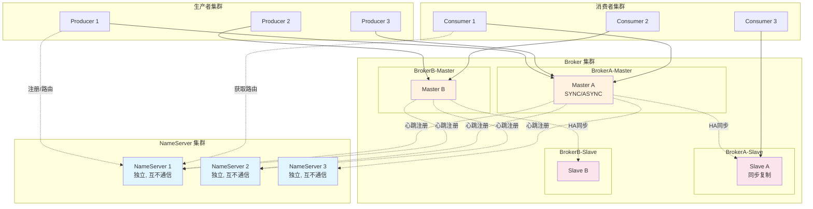

### 1.2 四大核心角色

| 角色 | 职责 | 关键类 |
|------|------|--------|
| **NameServer** | 路由注册中心，Broker 注册与发现，_topic/queue 路由信息维护 | `NamesrvController`, `RouteInfoManager` |
| **Broker** | 消息存储与转发，接收生产者消息，处理消费者拉取请求 | `BrokerController`, `DefaultMessageStore` |
| **Producer** | 消息发布者，向 Broker 发送消息 | `DefaultMQProducer`, `DefaultMQProducerImpl` |
| **Consumer** | 消息消费者，从 Broker 拉取消息消费 | `DefaultMQPushConsumer`, `DefaultMQPullConsumer` |

### 1.3 模块划分

RocketMQ 4.9.8 源码主要模块：

```
rocketmq-4.9.8/
├── namesrv        # NameServer 路由注册中心
├── broker         # Broker 消息存储转发服务
├── store          # 消息存储引擎(CommitLog/ConsumeQueue/IndexFile)
├── remoting       # 基于 Netty 的网络通信层
├── client         # 生产者/消费者客户端
├── common         # 公共类(协议/配置/常量/工具)
├── filter         # 消息过滤(SQL92表达式)
├── acl           # ACL 权限控制
├── logging        # 日志模块
├── tools         # 运维工具(mqadmin 命令)
├── example        # 示例代码
└── distribution  # 发行包
```

### 1.4 整体工作流程

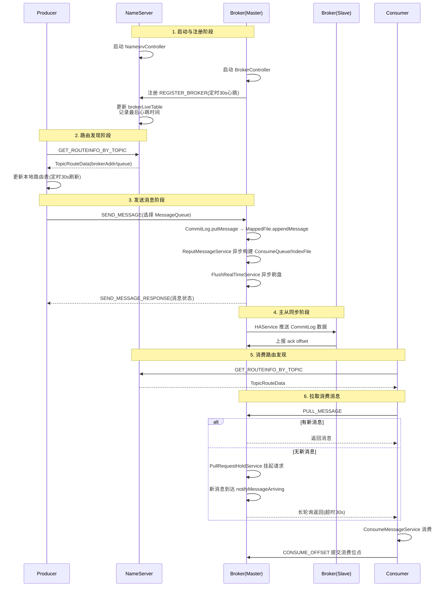

### 1.5 核心设计思想

1. **NameServer 互相独立**：不同于 ZooKeeper 的强一致性，每个 NameServer 独立工作，不互相通信，Broker 向所有 NameServer 注册。优点：性能高、避免脑裂；缺点：短时间内路由可能不一致。

2. **CommitLog 顺序写**：所有 topic 的消息顺序写入 CommitLog 文件，充分利用磁盘顺序写性能（可达 600MB/s+）。

3. **零拷贝**：使用 mmap 内存映射将文件映射到用户空间，避免用户态/内核态数据拷贝。

4. **异步构建索引**：消息先写入 CommitLog，再由 ReputMessageService 异步分发构建 ConsumeQueue 和 IndexFile。

5. **主从同步**：Master 通过 HAService 基于 TCP 长连接向 Slave 推送 CommitLog 数据。

6. **推拉结合**：Push 模式本质是"长轮询拉取"，Consumer 主动拉取，Broker 长轮询挂起请求。

---

## 二、NameServer 启动与路由管理

### 2.1 启动入口

入口类：`org.apache.rocketmq.namesrv.NamesrvStartup`

```java
public static void main(String[] args) {
    main0(args);
}

public static NamesrvController main0(String[] args) {
    // 1. 解析命令行参数(c -c 指定配置文件, -p 打印配置)
    // 2. 创建 NamesrvConfig、NettyServerConfig
    // 3. 创建 NamesrvController 并 start
    NamesrvController controller = createNamesrvController(args);
    start(controller);
    return controller;
}
```

### 2.2 NamesrvController 启动流程

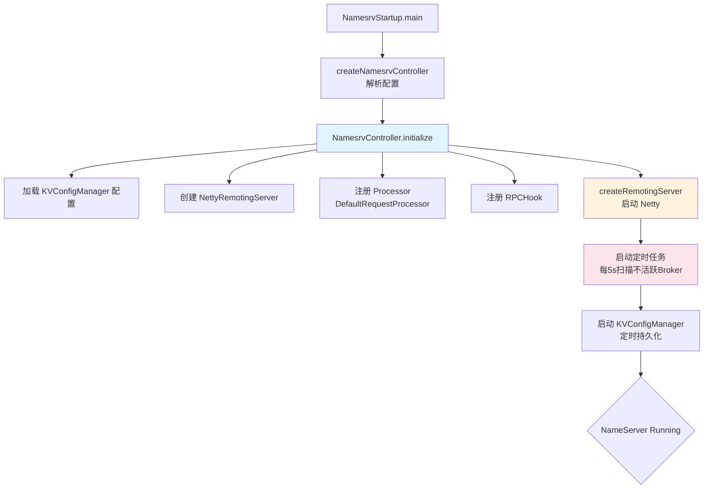

关键代码 (`NamesrvController.java`)：

```java
public boolean initialize() {
    // 加载 KV 配置
    this.kvConfigManager.load();
    // 创建 Netty Remoting Server
    this.remotingServer = new NettyRemotingServer(this.nettyServerConfig, this.brokerHousekeepingService);
    // 注册请求处理器
    this.remotingServer.registerDefaultProcessor(new DefaultRequestProcessor(this), this.remotingExecutor);
    // ... 启动 SSL、注册 RPCHook
    return true;
}

public void start() throws Exception {
    this.remotingServer.start();
    // 定时扫描不活跃 Broker（每 5 秒）
    this.scheduledExecutorService.scheduleAtFixedRate(
        () -> NamesrvController.this.routeInfoManager.scanNotActiveBroker(),
        5, 10, TimeUnit.SECONDS);
    // ...
}
```

### 2.3 RouteInfoManager 核心数据结构

`org.apache.rocketmq.namesrv.routeinfo.RouteInfoManager` 维护 5 大核心路由表：

```java
public class RouteInfoManager {
    private static final long BROKER_CHANNEL_EXPIRED_TIME = 1000 * 60 * 2; // 2分钟

    // topic -> {brokerName -> QueueData} 队列路由信息
    private final HashMap<String/* topic */, Map<String/* brokerName */, QueueData>> topicQueueTable;
    // brokerName -> BrokerData(brokerId->addr)  Broker 地址信息
    private final HashMap<String/* brokerName */, BrokerData> brokerAddrTable;
    // cluster -> Set<brokerName> 集群信息
    private final HashMap<String/* cluster */, Set<String/* brokerName */>> clusterAddrTable;
    // brokerAddr -> BrokerLiveInfo(最后心跳时间、Channel)  Broker 活跃信息
    private final HashMap<String/* brokerAddr */, BrokerLiveInfo> brokerLiveTable;
    // brokerAddr -> List<FilterServer>  过滤服务器
    private final HashMap<String/* brokerAddr */, List<String>> filterServerTable;
}
```

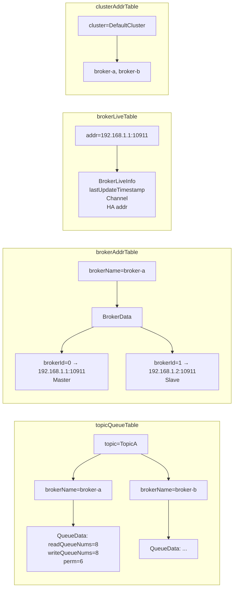

### 2.4 关键请求处理（DefaultRequestProcessor）

`DefaultRequestProcessor.processRequest` 处理 NameServer 的所有请求：

| RequestCode | 方法 | 说明 |
|-------------|------|------|
| `PUT_KV_CONFIG` | `putKVConfig` | 添加 KV 配置 |
| `GET_KV_CONFIG` | `getKVConfig` | 获取 KV 配置 |
| `DELETE_KV_CONFIG` | `deleteKVConfig` | 删除 KV 配置 |
| `REGISTER_BROKER` | `registerBroker` | Broker 注册 |
| `UNREGISTER_BROKER` | `unregisterBroker` | Broker 下线 |
| `GET_ROUTEINFO_BY_TOPIC` | `getRouteInfoByTopic` | 获取 topic 路由 |
| `GET_ROUTEINFO_BY_CLUSTER` | `getRouteInfoByCluster` | 获取集群路由 |
| `GET_BROKER_CLUSTER_INFO` | `getBrokerClusterInfo` | 获取集群信息 |
| `WIPE_WRITE_PERMISSION_OF_BROKER` | `wipeWritePermissionOfBroker` | 移除写权限 |
| `GET_ALL_TOPIC_LIST_FROM_NAMESERVER` | `getAllTopicListFromNameserver` | 获取所有 topic |
| `DELETE_TOPIC_IN_NAMESRV` | `deleteTopicInNameServer` | 删除 topic |
| `GET_KVLIST_BY_NAMESPACE` | `getKVListByNamespace` | 按命名空间获取 KV |

### 2.5 Broker 注册流程

Broker 启动后，会通过 `BrokerOuterAPI.registerBrokerAll` 向所有 NameServer **并行注册**（使用 `CountDownLatch` 等待全部完成），并定时（默认 30 秒）发送心跳：

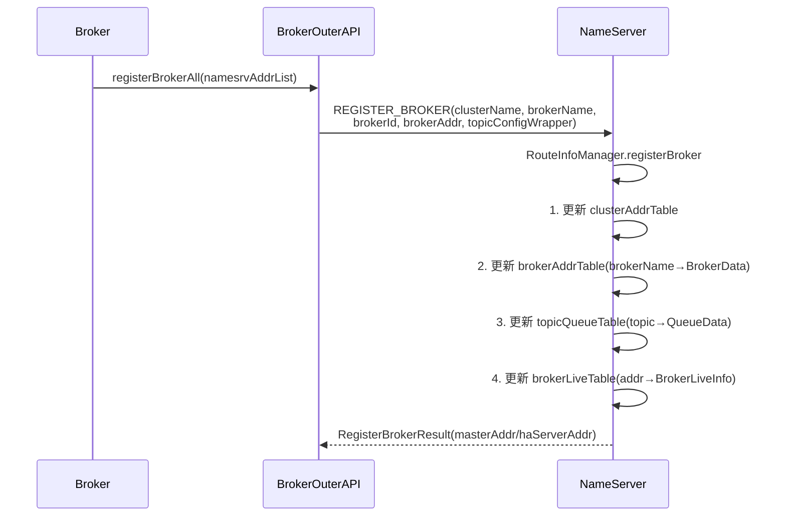

关键代码 (`RouteInfoManager.registerBroker`)：

```java
public RegisterBrokerResult registerBroker(String clusterName, String brokerAddr, ...) {
    RegisterBrokerResult result = new RegisterBrokerResult();
    try {
        this.lock.writeLock().lockInterruptibly();
        // 1. 更新 clusterAddrTable
        Set<String> brokerNames = this.clusterAddrTable.computeIfAbsent(clusterName, k -> new HashSet<>());
        brokerNames.add(brokerName);

        // 2. 更新 brokerAddrTable
        BrokerData brokerData = this.brokerAddrTable.get(brokerName);
        if (null == brokerData) {
            brokerData = new BrokerData(clusterName, brokerName, new HashMap<Long, String>());
            this.brokerAddrTable.put(brokerName, brokerData);
        }
        // brokerId=0 是 Master，非 0 是 Slave
        brokerData.getBrokerAddrs().put(brokerId, brokerAddr);

        // 3. 更新 topicQueueTable
        TopicConfigSerializeWrapper topicConfigWrapper = ...;
        if (topicConfigWrapper != null) {
            for (TopicConfig topicConfig : topicConfigWrapper.getTopicConfigTable().values()) {
                // 创建/更新 QueueData
                QueueData queueData = new QueueData();
                queueData.setBrokerName(brokerName);
                queueData.setReadQueueNums(topicConfig.getReadQueueNums());
                queueData.setWriteQueueNums(topicConfig.getWriteQueueNums());
                // ...
            }
        }
        // 4. 更新 brokerLiveTable
        BrokerLiveInfo prevBrokerLiveInfo = this.brokerLiveTable.put(brokerAddr,
            new BrokerLiveInfo(..., System.currentTimeMillis(), channel, haServerAddr));
    } finally {
        this.lock.writeLock().unlock();
    }
    return result;
}
```

### 2.6 Broker 失活检测

`scanNotActiveBroker` 定时（每 5 秒）扫描 `brokerLiveTable`，移除超过 120 秒未发送心跳的 Broker：

```java
public int scanNotActiveBroker() {
    int removeCount = 0;
    Iterator<Entry<String, BrokerLiveInfo>> it = this.brokerLiveTable.entrySet().iterator();
    while (it.hasNext()) {
        Entry<String, BrokerLiveInfo> next = it.next();
        long last = next.getValue().getLastUpdateTimestamp();
        // BROKER_CHANNEL_EXPIRED_TIME = 120秒
        if ((last + BROKER_CHANNEL_EXPIRED_TIME) < System.currentTimeMillis()) {
            RemotingUtil.closeChannel(next.getValue().getChannel());
            it.remove();
            // 移除后调用 unregisterBroker
            this.onChannelDestroy(next.getKey());
            removeCount++;
        }
    }
    return removeCount;
}
```

`onChannelDestroy` 会级联清理 `brokerAddrTable`、`topicQueueTable`、`clusterAddrTable`、`filterServerTable` 中的相关数据。

### 2.7 路由发现

Producer/Consumer 通过 `GET_ROUTEINFO_BY_TOPIC` 请求 NameServer 获取路由信息，返回 `TopicRouteData`：

```java
public class TopicRouteData extends RemotingSerializable {
    private String orderTopicConf;
    // brokerName -> BrokerData(brokerId->addr)
    private List<BrokerData> brokerDatas;
    // topic 队列数据
    private List<QueueData> queueDatas;
}
```

客户端通过定时任务（30 秒）调用 `MQClientAPIImpl.getTopicRouteInfoFromNameServer` 更新本地路由表。

### 2.8 NameServer 设计要点

1. **互相独立**：NameServer 之间不通信，每个 NameServer 维护完整的路由数据，Broker 向所有 NameServer 注册。这是与 ZooKeeper 最大的区别。
2. **读写锁**：`RouteInfoManager` 使用 `ReentrantReadWriteLock`，读操作并发，写操作串行。
3. **最终一致性**：由于 Broker 注册是异步的，短时间内不同 NameServer 的路由数据可能不一致，但最终一致。
4. **不持久化路由**：NameServer 的路由信息保存在内存，重启后通过 Broker 心跳重建。只有 KV 配置会持久化到 `kvConfig.json`。

---

## 三、Broker 启动流程与核心组件

### 3.1 启动入口

入口类：`org.apache.rocketmq.broker.BrokerStartup`

```java
public static void main(String[] args) {
    start(createBrokerController(args));
}

public static BrokerController start(BrokerController controller) {
    controller.start();
    return controller;
}
```

### 3.2 BrokerController 启动流程

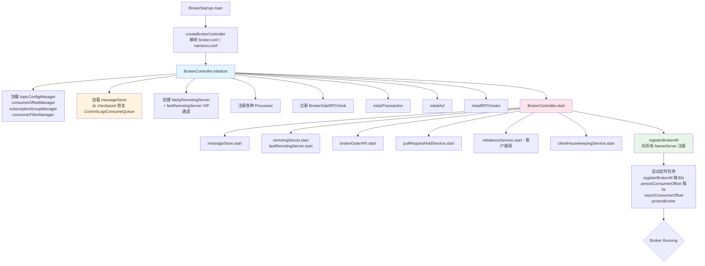

### 3.3 BrokerController 核心组件

`BrokerController` 是 Broker 的核心控制器，持有以下关键组件：

```mermaid
graph TB
    BC[BrokerController]

    BC --> MS[messageStore<br/>DefaultMessageStore<br/>消息存储引擎]
    BC --> RS[remotingServer<br/>NettyRemotingServer<br/>主网络服务 10911]
    BC --> FRS[fastRemotingServer<br/>VIP通道 10909]
    BC --> BOA[brokerOuterAPI<br/>与 NameServer 通信]
    BC --> TCM[topicConfigManager<br/>Topic 配置管理]
    BC --> COM[consumerOffsetManager<br/>消费位点管理]
    BC --> SGM[subscriptionGroupManager<br/>订阅组管理]
    BC --> CFM[consumerFilterManager<br/>消费者过滤器管理]
    BC --> CMG[consumerManager<br/>消费者管理]
    BC --> PMG[producerManager<br/>生产者管理]
    BC --> PRHS[pullRequestHoldService<br/>长轮询挂起服务]
    BC --> CHS[clientHousekeepingService<br/>客户端保活]
    BC --> RBS[rebalanceService<br/>负载均衡-客户端用]
    BC --> BOA2[brokerStatsManager<br/>统计管理]
    BC --> SMS[scheduleMessageService<br/>延迟消息服务]
    BC --> TS[transactionalMessageService<br/>事务消息服务]
    BC --> ACL[aclValidator<br/>ACL 校验]

    MS --> CL[CommitLog]
    MS --> CQ[ConsumeQueue]
    MS --> IDX[IndexService]
    MS --> HAS[HAService]
    MS --> AMF[AllocateMappedFileService]
    MS --> RMS[ReputMessageService]
    MS --> FCL[flushCommitLogService]
    MS --> CCMS[cleanCommitLogService]

    style BC fill:#e1f5fe
    style MS fill:#fff3e0
```

### 3.4 初始化关键代码

```java
public boolean initialize() throws CloneNotSupportedException {
    // 1. 加载配置
    boolean result = this.topicConfigManager.load();
    result = result && this.consumerOffsetManager.load();
    result = result && this.subscriptionGroupManager.load();
    result = result && this.consumerFilterManager.load();

    // 2. 创建消息存储
    if (result) {
        this.messageStore = new DefaultMessageStore(...);
        // 加载 CommitLog、ConsumeQueue（恢复）
        result = this.messageStore.load();
    }

    // 3. 创建 Netty 服务
    this.remotingServer = new NettyRemotingServer(nettyServerConfig, clientHousekeepingService);
    // VIP 通道：端口 -2
    this.fastRemotingServer = new NettyRemotingServer(...);

    // 4. 注册请求处理器
    this.registerProcessor();

    // 5. 初始化事务、ACL、Hook
    this.initialTransaction();
    this.initialAcl();
    this.initialRPCHooks();
    return result;
}
```

### 3.5 Processor 注册

`BrokerController.registerProcessor()` 注册所有请求处理器：

| RequestCode | Processor | Executor |
|-------------|-----------|----------|
| `SEND_MESSAGE` / `SEND_MESSAGE_V2` / `SEND_BATCH_MESSAGE` | `SendMessageProcessor` | `sendMessageExecutor` |
| `PULL_MESSAGE` | `PullMessageProcessor` | `pullMessageExecutor` |
| `QUERY_MESSAGE` / `VIEW_MESSAGE_BY_ID` | `QueryMessageProcessor` | `queryMessageExecutor` |
| `HEART_BEAT` / `UNREGISTER_CLIENT` / `GET_CONSUMER_LIST_BY_GROUP` | `ClientManageProcessor` | `clientManageExecutor` |
| `UPDATE_CONSUMER_OFFSET` / `QUERY_CONSUMER_OFFSET` | `ConsumerManageProcessor` | `consumerManageExecutor` |
| `END_TRANSACTION` | `EndTransactionProcessor` | `endTransactionExecutor` |
| `CHECK_TRANSACTION_STATE` | - | 反向请求 Producer |
| `GET_CONSUMER_STATUS_FROM_CLIENT` | `ConsumerManageProcessor` | - |

### 3.6 Broker 角色与高可用模式

`BrokerRole` 枚举：

```java
public enum BrokerRole {
    ASYNC_MASTER,  // 异步 Master，消息写入 Master 后立即返回，Slave 异步复制
    SYNC_MASTER,   // 同步 Master，消息写入 Master 并等待 Slave 复制后返回
    SLAVE          // Slave，只读
}
```

`-c broker.conf` 配置：
```properties
brokerRole=SYNC_MASTER
flushDiskType=SYNC_FLUSH
```

### 3.7 Broker 注册到 NameServer

```java
// BrokerController.start()
public void start() throws Exception {
    // ...
    // 向所有 NameServer 注册
    this.registerBrokerAll(true, false, true);
    // 启动定时注册任务（每 30 秒）
    this.scheduledExecutorService.scheduleAtFixedRate(() -> {
        try {
            BrokerController.this.registerBrokerAll(true, false, brokerConfig.isForceRegister());
        } catch (Throwable e) {
            log.error("registerBrokerAll Exception", e);
        }
    }, 1000 * 10, Math.max(10000, Math.min(brokerConfig.getRegisterNameServerPeriod(), 60000)), TimeUnit.MILLISECONDS);
}
```

`registerBrokerAll` 流程：

```java
public synchronized void registerBrokerAll(final boolean checkOrderTopic, ...) {
    // 收集所有 topic 配置
    TopicConfigSerializeWrapper topicConfigWrapper = topicConfigManager.buildTopicConfigSerializeWrapper();
    // 向每个 NameServer 注册
    List<RegisterBrokerResult> registerBrokerResultList = brokerOuterAPI.registerBrokerAll(
        getClusterAddr(), getBrokerName(), getBrokerAddr(),
        brokerConfig.getBrokerId(), topicConfigWrapper, ...);
    // 处理返回的 Master/HA 地址（用于 Slave 获取 Master 地址）
    if (registerBrokerResultList.size() > 0) {
        RegisterBrokerResult registerBrokerResult = registerBrokerResultList.get(0);
        if (registerBrokerResult != null) {
            // Slave 更新 masterAddress / haServerAddr
            if (this.updateMasterHAServerAddr periodic ...) { }
        }
    }
}
```

### 3.8 ClientHousekeepingService 通道保活

`ClientHousekeepingService` 实现 `ChannelEventListener`，监听客户端连接事件：

```java
public class ClientHousekeepingService implements ChannelEventListener {
    // 客户端通道断开后清理 Producer/Consumer 信息
    @Override
    public void onChannelClose(String remoteAddr, Channel channel) {
        this.brokerController.getProducerManager().doChannelCloseEvent(remoteAddr, channel);
        this.brokerController.getConsumerManager().doChannelCloseEvent(remoteAddr, channel);
        this.brokerController.getConsumerFilterManager().doChannelCloseEvent(remoteAddr, channel);
    }
}
```

`ProducerManager` 和 `ConsumerManager` 都有 `scanNotActiveChannel` 定时任务（120 秒超时），扫描并移除不活跃的客户端通道。

### 3.9 定时任务汇总

Broker 启动后的核心定时任务：

| 任务 | 周期 | 说明 |
|------|------|------|
| `registerBrokerAll` | 30s | 向 NameServer 注册心跳 |
| `persistConsumerOffset` | 5s | 持久化消费位点 |
| `reportConsumerOffset` | - | 上报消费位点 |
| `protectBroker` | 3m | Broker 自保护 |
| `sendHeartbeat` | 30s | 客户端心跳 |
| `cleanOfflineBroker` | 30s | 清理下线 Broker |
| `updateTopicRouteInfo` | 30s | 更新路由信息 |
| `scanNotActiveChannel` | 120s | 扫描不活跃通道 |

---

## 四、生产者启动与发送消息流程

### 4.1 生产者启动流程

入口：`DefaultMQProducer.start()`

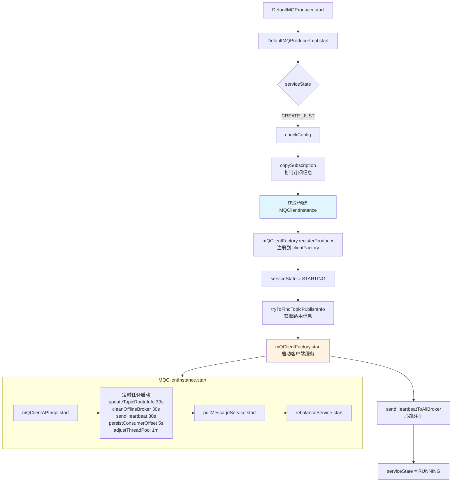

关键代码 (`DefaultMQProducerImpl.start`)：

```java
public void start(final boolean startFactory) throws MQClientException {
    switch (this.serviceState) {
        case CREATE_JUST:
            this.serviceState = ServiceState.START_FAILED;
            this.checkConfig();
            // 复制订阅信息（重试 topic）
            this.copySubscription();
            // 获取/创建 MQClientInstance（单例）
            this.mQClientFactory = MQClientManager.getInstance().getOrCreateMQClientInstance(...);
            // 注册 Producer
            boolean registerOK = mQClientFactory.registerProducer(this.defaultMQProducer.getProducerGroup(), this);
            // 启动 MQClientInstance
            if (startFactory) {
                mQClientFactory.start();
            }
            this.serviceState = ServiceState.RUNNING;
            break;
        // ...
    }
}
```

### 4.2 MQClientInstance 单例管理

`MQClientManager` 维护 `ConcurrentMap<String, MQClientInstance>`，key 为 `clientId`：

```java
public MQClientInstance getOrCreateMQClientInstance(final ClientConfig clientConfig, ...) {
    String clientId = clientConfig.buildMQClientId(); // IP@instanceName@unitName
    MQClientInstance instance = this.factoryTable.get(clientId);
    if (null == instance) {
        instance = new MQClientInstance(clientConfig.cloneClientConfig(), ...);
        MQClientInstance prev = this.factoryTable.putIfAbsent(clientId, instance);
        if (prev != null) instance = prev;
    }
    return instance;
}
```

> **设计要点**：一个 JVM 内的所有 Producer/Consumer（clientId 相同）共享一个 `MQClientInstance`，共享网络服务、路由表、定时任务。

### 4.3 路由信息更新机制

`MQClientInstance.start` 启动后，会启动 5 个核心定时任务：

```java
// 1. 每 30s 从 NameServer 更新路由信息
this.scheduledExecutorService.scheduleAtFixedRate(
    () -> MQClientInstance.this.updateTopicRouteInfoFromNameServer(), 10, 30, TimeUnit.SECONDS);
// 2. 每 30s 清理下线 Broker
this.scheduledExecutorService.scheduleAtFixedRate(
    () -> MQClientInstance.this.cleanOfflineBroker(), ..., 30, TimeUnit.SECONDS);
// 3. 每 30s 向所有 Broker 发送心跳
this.scheduledExecutorService.scheduleAtFixedRate(
    () -> MQClientInstance.this.sendHeartbeatToAllBroker(), ..., 30, TimeUnit.SECONDS);
// 4. 每 5s 持久化消费位点
this.scheduledExecutorService.scheduleAtFixedRate(
    () -> MQClientInstance.this.persistAllConsumerOffset(), ..., 10, 5, TimeUnit.SECONDS);
// 5. 每 1m 调整消费线程池
this.scheduledExecutorService.scheduleAtFixedRate(
    () -> MQClientInstance.this.adjustThreadPool(), ..., 1, 1, TimeUnit.MINUTES);
```

### 4.4 发送消息完整流程

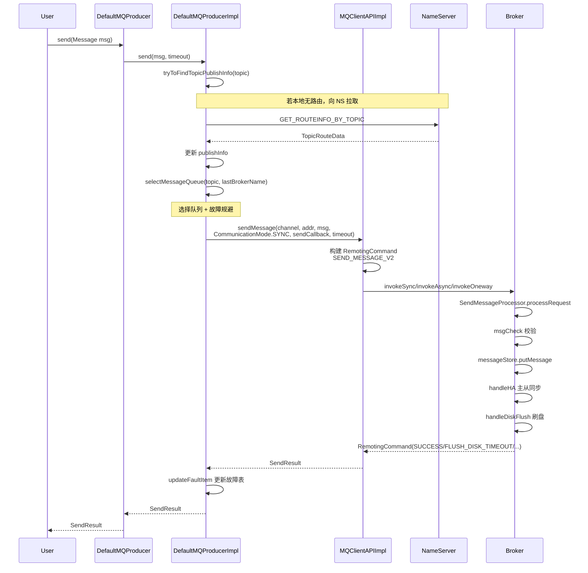

### 4.5 队列选择与故障规避

`DefaultMQProducerImpl.sendDefaultImpl` 核心逻辑：

```java
private SendResult sendDefaultImpl(Message msg, final CommunicationMode communicationMode, ...) {
    // 1. 获取路由信息
    TopicPublishInfo topicPublishInfo = this.tryToFindTopicPublishInfo(msg.getTopic());
    // 2. 计算重试次数
    int timesTotal = communicationMode == CommunicationMode.SYNC ? 1 + retryTimesWhenSendFailed : 1;
    // 3. 循环重试
    for (; times < timesTotal; times++) {
        // 4. 选择队列（含故障规避）
        MessageQueue mqSelected = this.selectOneMessageQueue(topicPublishInfo, lastBrokerName);
        if (mqSelected != null) {
            // 5. 发送
            sendResult = this.sendKernelImpl(msg, mqSelected, communicationMode, ...);
            // 6. 更新故障项
            if (sendResult != null) {
                this.updateFaultItem(mqSelected.getBrokerName(), endTimestamp - beginTimestampPrev, false);
                return sendResult;
            }
        }
    }
    // ...
}
```

`MQFaultStrategy.selectOneMessageQueue` 故障规避机制：

```java
public MessageQueue selectOneMessageQueue(final TopicPublishInfo tpInfo, final String lastBrokerName) {
    // sendLatencyFaultEnable 默认 false，开启后启用故障隔离
    if (this.sendLatencyFaultEnable) {
        try {
            int index = tpInfo.getSendWhichQueue().incrementAndGet();
            for (int i = 0; i < tpInfo.getMessageQueueList().size(); i++) {
                int pos = Math.abs(index++) % tpInfo.getMessageQueueList().size();
                MessageQueue mq = tpInfo.getMessageQueueList().get(pos);
                // 检查 broker 是否可用（故障隔离期已过）
                if (latencyFaultTolerance.isAvailable(mq.getBrokerName())) {
                    if (null == lastBrokerName || !mq.getBrokerName().equals(lastBrokerName))
                        return mq;
                }
            }
            // 没有可用的，选一个"较优"的
            return tpInfo.selectOneMessageQueue();
        } catch (Exception e) { ... }
    }
    // 默认：轮询选择，避开上次失败的 broker
    return tpInfo.selectOneMessageQueue(lastBrokerName);
}
```

### 4.6 延迟隔离策略

故障规避的延迟隔离时长（`sendLatencyFaultEnable=true` 时）：

```java
private long[] latencyMax = {50L, 100L, 550L, 1000L, 2000L, 3000L, 15000L};
private long[] notAvailableDuration = {0L, 0L, 30000L, 60000L, 120000L, 180000L, 600000L};
```

- 延迟 < 50ms：不隔离
- 延迟 50-100ms：不隔离
- 延迟 100-550ms：隔离 30s
- 延迟 550ms-1s：隔离 60s
- 延迟 1-2s：隔离 120s
- 延迟 2-3s：隔离 180s
- 延迟 > 3s：隔离 600s

### 4.7 三种发送方式

```java
// MQClientAPIImpl.sendMessage
switch (communicationMode) {
    case SYNC:    return this.sendMessageSync(...);  // 同步等待响应
    case ASYNC:   this.sendMessageAsync(...); return null;  // 异步回调
    case ONEWAY:  this.sendMessageOneway(...); return null;  // 单向不等待
}
```

| 模式 | 方法 | 说明 | 可靠性 |
|------|------|------|--------|
| SYNC | `sendMessageSync` | 同步等待响应 | 最高 |
| ASYNC | `sendMessageAsync` | 异步回调 `InvokeCallback` | 高 |
| ONEWAY | `sendMessageOneway` | 只发送不等待响应 | 最低 |

### 4.8 SendMessageProcessor 处理流程（Broker 端）

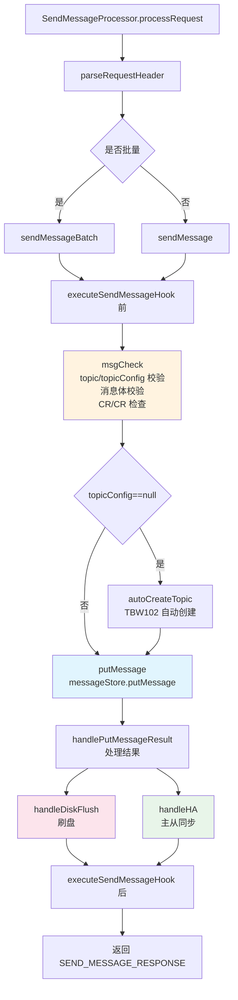

### 4.9 批量消息

`DefaultMessageStore.putMessages(MessageExtBatch)` 处理批量消息，在单个 MappedFile 中追加多条消息，减少 IO 次数。批量消息通过 `MessageBatch` 封装为一个 `ByteBuffer`，一次性写入。

---

## 五、消费者启动与消费消息流程

### 5.1 消费者两种实现

| 类型 | 类 | 模式 | 说明 |
|------|----|----|------|
| Push 消费 | `DefaultMQPushConsumer` | "推"模式（实为长轮询拉取） | 自动拉取、自动负载均衡 |
| Pull 消费 | `DefaultMQPullConsumer` | "拉"模式 | 手动控制拉取 offset |

### 5.2 Push 消费者启动流程

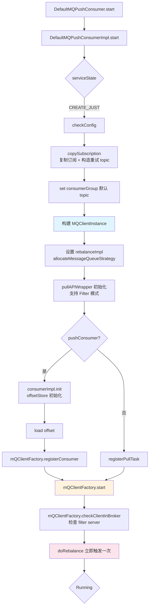

### 5.3 核心服务启动顺序

`MQClientInstance.start` 按顺序启动各服务：

```java
public void start() throws MQClientException {
    synchronized (this) {
        // 1. 启动网络通信客户端
        this.mQClientAPIImpl.start();
        // 2. 启动各类定时任务（路由更新、心跳、offset 持久化等）
        this.startInfoService();
        // 3. 启动拉取消息服务（Push 模式核心）
        this.pullMessageService.start();
        // 4. 启动负载均衡服务
        this.rebalanceService.start();
        // 5. 启动 push 消费者
        this.defaultMQProducer.getDefaultMQProducerImpl().start(false);
        // 启动所有 consumer
    }
}
```

### 5.4 消费者工作流程

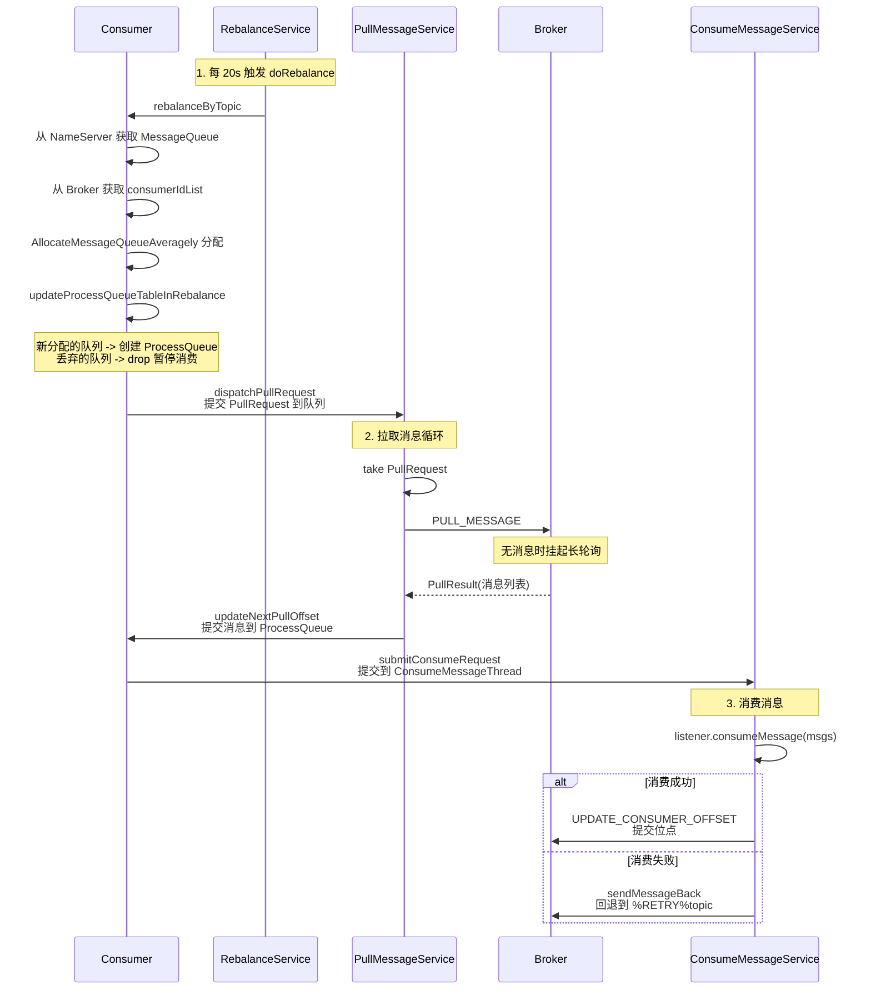

### 5.5 RebalanceImpl 负载均衡

`RebalanceImpl.doRebalance` 遍历所有订阅的 topic：

```java
public void doRebalance(final boolean isOrder) {
    Map<String, SubscriptionData> subTable = this.getSubscriptionInner();
    for (final Map.Entry<String, SubscriptionData> entry : subTable.entrySet()) {
        final String topic = entry.getKey();
        try {
            this.rebalanceByTopic(topic, isOrder);
        } catch (Throwable t) { ... }
    }
}

private void rebalanceByTopic(final String topic, boolean isOrder) {
    switch (messageModel) {
        case BROADCASTING: {
            // 广播模式：每个 consumer 消费所有 queue
            Set<MessageQueue> mqSet = topicSubscribeInfoTable.get(topic);
            // 更新本地 ProcessQueue
            this.updateProcessQueueTableInRebalance(topic, mqSet, isOrder);
            break;
        }
        case CLUSTERING: {
            // 集群模式：从 Broker 获取 consumerIdList，再分配
            Set<MessageQueue> mqSet = topicSubscribeInfoTable.get(topic);
            List<String> cidAll = this.mQClientFactory.findConsumerIdList(topic, consumeGroup);
            if (null == mqSet || mqSet.isEmpty() || null == cidAll || cidAll.isEmpty())
                break;
            // 排序保证所有 consumer 看到的顺序一致
            List<MessageQueue> mqAll = new ArrayList<>(mqSet);
            Collections.sort(mqAll);
            Collections.sort(cidAll);
            // 分配策略
            AllocateMessageQueueStrategy strategy = this.allocateMessageQueueStrategy;
            List<MessageQueue> allocateResult = strategy.allocate(..., currentCID, mqAll, cidAll);
            // 更新本地 ProcessQueue
            this.updateProcessQueueTableInRebalance(topic, allocateResultSet, isOrder);
            break;
        }
    }
}
```

### 5.6 分配策略

| 策略 | 类 | 说明 |
|------|------|------|
| 平均分配（默认） | `AllocateMessageQueueAveragely` | 按 consumer 数量平均分（如 8 队列 3 消费者：3,3,2） |
| 轮询分配 | `AllocateMessageQueueAveragelyByCircle` | 轮询分给每个 consumer |
| 一致性哈希 | `AllocateMessageQueueConsistentHash` | 一致性哈希分配，减少重分配影响 |
| 机房亲和 | `AllocateMachineRoomNearby` | 优先同机房分配 |
| 按机房 | `AllocateMessageQueueByMachineRoom` | 按机房分配 |
| 配置 | `AllocateMessageQueueByConfig` | 按配置分配 |

平均分配示例：

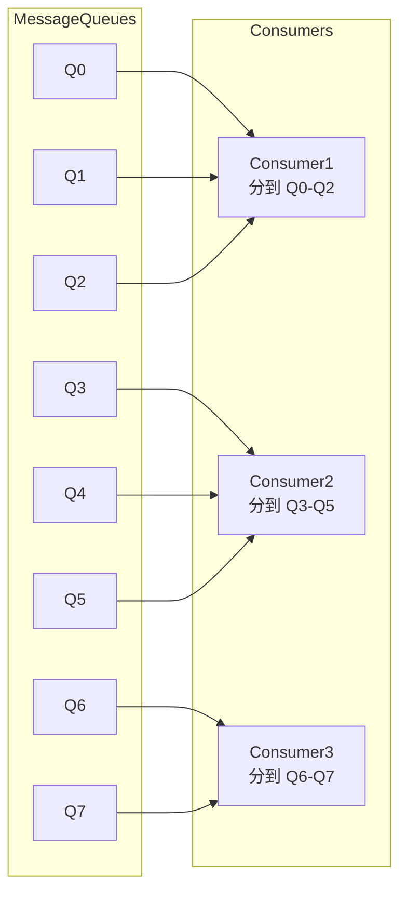

### 5.7 updateProcessQueueTableInRebalance

```java
private boolean updateProcessQueueTableInRebalance(final String topic, final Set<MessageQueue> mqSet, ...) {
    boolean changed = false;
    // 1. 移除不再分配的队列
    Iterator<Entry<MessageQueue, ProcessQueue>> it = this.processQueueTable.entrySet().iterator();
    while (it.hasNext()) {
        Entry<MessageQueue, ProcessQueue> next = it.next();
        if (next.getKey().getTopic().equals(topic)) {
            if (!mqSet.contains(next.getKey())) {
                next.getValue().setDropped(true);  // 标记丢弃
                this.removeUnnecessaryMessageQueue(topic, next.getKey());  // 持久化 offset
                it.remove();
                changed = true;
            }
        }
    }
    // 2. 新增分配的队列
    if (mqSet.size() > 0) {
        for (MessageQueue mq : mqSet) {
            if (!this.processQueueTable.containsKey(mq)) {
                ProcessQueue pq = new ProcessQueue();
                // 计算下一次拉取的起始 offset
                long nextOffset = computePullFromWhere(mq);
                this.processQueueTable.put(mq, pq);
                // 提交 PullRequest 触发首次拉取
                PullRequest pullRequest = new PullRequest();
                pullRequest.setConsumerGroup(consumeGroup);
                pullRequest.setNextOffset(nextOffset);
                pullRequest.setMessageQueue(mq);
                pullRequest.setProcessQueue(pq);
                this.dispatchPullRequest(pullRequest);  // 提交到 PullMessageService 队列
                changed = true;
            }
        }
    }
    return changed;
}
```

### 5.8 PullMessageService 拉取消息

`PullMessageService` 是一个单独线程，循环从 `pullRequestQueue` 取出 `PullRequest` 执行拉取：

```java
@Override
public void run() {
    while (!this.isStopped()) {
        try {
            PullRequest pullRequest = this.pullRequestQueue.take();  // 阻塞获取
            this.pullMessage(pullRequest);
        } catch (InterruptedException e) { ... }
    }
}

private void pullMessage(final PullRequest pullRequest) {
    final MQConsumerInner consumer = this.mQClientFactory.selectConsumer(pullRequest.getConsumerGroup());
    if (consumer != null) {
        consumer.pullMessage(pullRequest);  // 调用 DefaultMQPushConsumerImpl.pullMessage
    }
}
```

### 5.9 PullAPIWrapper.pullKernelImpl 拉取核心

```java
public PullResult pullKernelImpl(MessageQueue mq, String subExpression, long subVersion,
        long offset, int maxNums, int maxSize, ...) {
    // 1. 找到 Broker 地址
    FindBrokerResult findBrokerResult = this.mQClientFactory.findBrokerAddressInSubscribe(mq.getBrokerName(), MixAll.MASTER_ID, false);
    // ...
    // 2. 构建请求
    PullMessageRequestHeader requestHeader = new PullMessageRequestHeader();
    requestHeader.setConsumerGroup(...);
    requestHeader.setTopic(mq.getTopic());
    requestHeader.setQueueId(mq.getQueueId());
    requestHeader.setQueueOffset(offset);
    requestHeader.setMaxMsgNums(maxNums);
    requestHeader.setSysFlag(sysFlagInner);
    requestHeader.setCommitOffset(commitOffset);
    requestHeader.setSuspendTimeoutMillis(suspendTimeoutMillis);  // 长轮询超时
    requestHeader.setSubscription(subExpression);
    requestHeader.setExpressionType(expressionType);
    // 3. 发送拉取请求
    PullResult pullResult = this.mQClientFactory.getMQClientAPIImpl().pullMessage(...);
    return pullResult;
}
```

### 5.10 ConsumeMessageService 消费消息

`ConsumeMessageConcurrentlyService`（并发消费）核心流程：

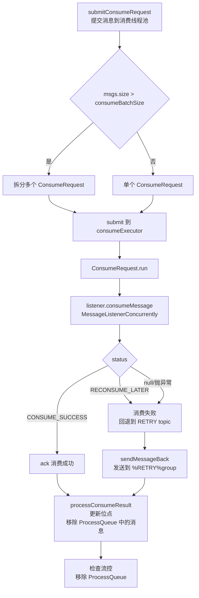

并发消费的 `processConsumeResult`：

```java
public void processConsumeResult(ConsumeConcurrentlyStatus status, ...) {
    int ackIndex = status == ConsumeConcurrentlyStatus.CONSUME_SUCCESS ? msgBackStay.size() : -1;
    switch (this.defaultMQPushConsumer.getConsumeModel()) {
        case CLUSTERING:
            // 失败的消息回退到 RETRY topic
            for (int i = ackIndex + 1; i < msgBackStay.size(); i++) {
                MessageExt msg = msgBackStay.get(i);
                boolean result = sendMessageBack(msg, context);
                if (!result) {
                    msg.setReconsumeTimes(msg.getReconsumeTimes() + 1);
                    sq.set(msg.getQueueOffset(), msg);
                }
            }
            break;
        case BROADCASTING:
            // 广播模式失败不重试
            break;
    }
    // 更新 offset
    offset = msgBackStay.get(lastAckIndex).getQueueOffset();
    this.defaultMQPushConsumerImpl.getOffsetStore().updateOffset(mq, offset + 1);
}
```

### 5.11 顺序消费 ConsumeMessageOrderlyService

顺序消费核心：对 `MessageQueue` 加锁，保证同一队列串行消费。

```java
class ConsumeRequest implements Runnable {
    public void run() {
        // 对 MessageQueue 加锁（一个 consumer 内）
        final Object objLock = messageQueueLock.fetchLockObject(messageQueue);
        synchronized (objLock) {
            // 对 ProcessQueue 加锁（broker 端也有锁）
            final ProcessQueue processQueue = ...;
            if (processQueue != null) {
                final Object processQueueLock = processQueue.getLockConsume();
                synchronized (processQueueLock) {
                    // 消费消息
                    status = listener.consumeMessage(...);
                    // 处理结果：成功则更新 offset，失败则 suspend 暂停该队列
                }
            }
        }
    }
}
```

### 5.12 ProcessQueue 消息树

`ProcessQueue` 维护从 Broker 拉取到本地的消息，使用 `TreeMap<Long, MessageExt>` 按 offset 排序：

```java
public class ProcessQueue {
    private final ReadWriteLock lockTreeMap = new ReentrantReadWriteLock();
    private final TreeMap<Long/* offset */, MessageExt> msgTreeMap = new TreeMap<>();
    private final AtomicLong msgCount = new AtomicLong();
    private final AtomicLong msgSize = new AtomicLong();
    private final AtomicLong msgTreeMapFirstOffset = new AtomicLong();
    private volatile boolean dropped = false;
    private volatile long lastPullTimestamp = System.currentTimeMillis();
    private volatile long lastConsumeTimestamp = System.currentTimeMillis();
    private volatile long queueOffsetMax = 0L;
    private volatile boolean consuming = false;
    private volatile long tryUnlockTimes = 0L;
}
```

### 5.13 消费位点 OffsetStore

| 实现 | 适用场景 | 存储位置 |
|------|---------|---------|
| `LocalFileOffsetStore` | 广播模式 | 本地文件 `~/.rocketmq_offsets/` |
| `RemoteBrokerOffsetStore` | 集群模式 | Broker 端 `consumerOffset.json` |

`ConsumeFromWhere` 配置（首次启动时从哪开始消费）：

```java
public enum ConsumeFromWhere {
    CONSUME_FROM_LAST_OFFSET,    // 从最后 offset 开始（默认）
    CONSUME_FROM_FIRST_OFFSET,   // 从最开始
    CONSUME_FROM_TIMESTAMP,      // 从指定时间戳
    CONSUME_FROM_LAST_OFFSET_AND_FROM_BOOT_WHEN_FIRST_LAST,// ...
    CONSUME_FROM_MAX_OFFSET,
    CONSUME_FROM_MIN_OFFSET,
    CONSUME_FROM_TIMESTAMPLater
}
```

### 5.14 流控机制

Push 模式流控参数：

| 参数 | 默认值 | 说明 |
|------|--------|------|
| `pullThresholdForQueue` | 1000 | 单队列最大消息数（超过暂停拉取） |
| `pullThresholdSizeForQueue` | 100MB | 单队列最大消息大小 |
| `pullThresholdForTopic` | -1 | topic 级别消息数 |
| `pullThresholdSizeForTopic` | -1 | topic 级别大小 |
| `consumeMessageBatchMaxSize` | 1 | 单次消费消息数 |
| `pullBatchSize` | 32 | 单次拉取消息数 |

---

## 六、消息存储机制

### 6.1 存储架构总览

RocketMQ 消息存储采用"混合型"存储结构，所有 topic 的消息顺序写入 `CommitLog`，再异步构建 `ConsumeQueue`（消费队列索引）和 `IndexFile`（消息索引）。

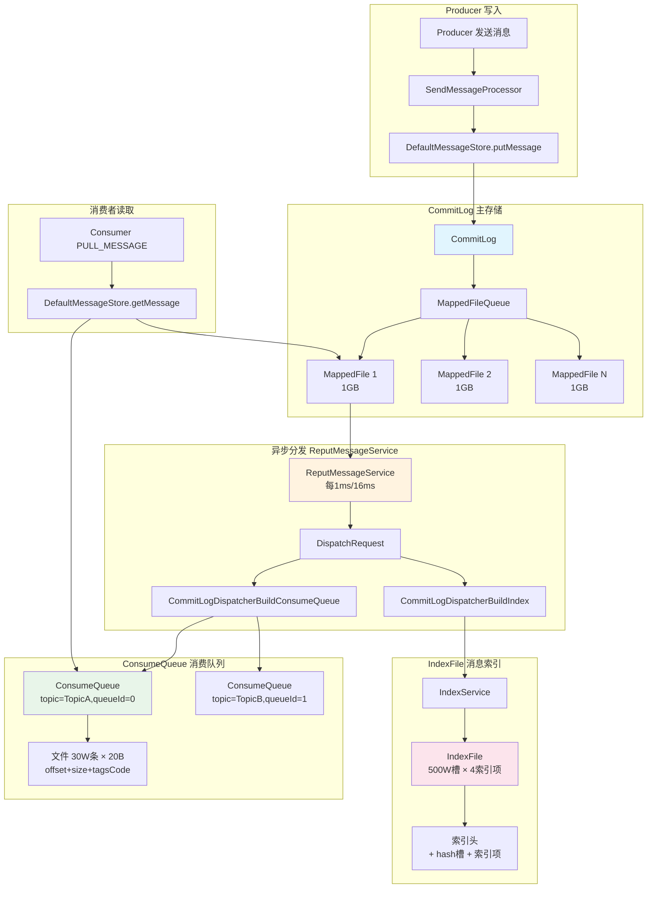

### 6.2 DefaultMessageStore 核心组件

```java
public class DefaultMessageStore implements MessageStore {
    private final CommitLog commitLog;                              // 主消息存储
    private final ConcurrentMap<String, ConcurrentMap<Integer, ConsumeQueue>> consumeQueueTable; // 消费队列
    private final FlushConsumeQueueService flushConsumeQueueService; // 刷 ConsumeQueue
    private final CleanCommitLogService cleanCommitLogService;     // 清理 CommitLog
    private final CleanConsumeQueueService cleanConsumeQueueService; // 清理 ConsumeQueue
    private final IndexService indexService;                        // 索引服务
    private final AllocateMappedFileService allocateMappedFileService; // MappedFile 预分配
    private final ReputMessageService reputMessageService;         // 异步分发
    private final HAService haService;                              // 主从同步
    private final ScheduleMessageService scheduleMessageService;   // 延迟消息
    private final TransientStorePool transientStorePool;            // 堆外内存池
    private final StoreStatsService storeStatsService;              // 统计
    private final StoreCheckpoint storeCheckpoint;                  // 检查点
}
```

### 6.3 CommitLog 结构

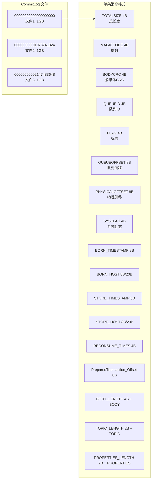

- 文件名 = 起始 offset（20 位数字填充）
- 单文件大小：`mappedFileSizeCommitLog = 1GB`
- 消息顺序写入，写满后创建新文件

### 6.4 CommitLog.putMessage 流程

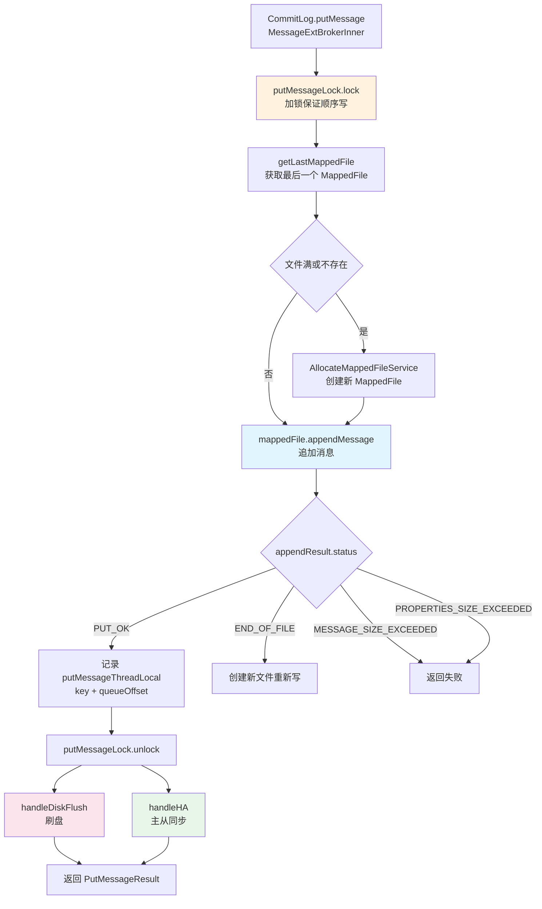

关键代码：

```java
public PutMessageResult putMessage(final MessageExtBrokerInner msg) {
    // 设置 storeTimestamp 等
    msg.setStoreTimestamp(msgStoreItemBuilder.currentTimeMillis());
    // 加锁（ReentrantLock 或 SpinLock）
    putMessageLock.lock();
    try {
        MappedFile mappedFile = mappedFileQueue.getLastMappedFile();
        // 文件写满，新建
        if (null == mappedFile || mappedFile.isFull()) {
            mappedFile = mappedFileQueue.getLastMappedFile(0, true);
        }
        // 追加消息
        AppendMessageResult result = mappedFile.appendMessage(msg, this.appendMessageCallback, putMessageThreadLocal);
    } finally {
        putMessageLock.unlock();
    }
    // 刷盘
    handleDiskFlush(result, putMessageResult, msg);
    // 主从同步
    handleHA(result, putMessageResult, msg);
    return putMessageResult;
}
```

### 6.5 ConsumeQueue 结构

`ConsumeQueue` 是 `CommitLog` 的逻辑索引，每个 `topic@queueId` 对应一个 `ConsumeQueue`。

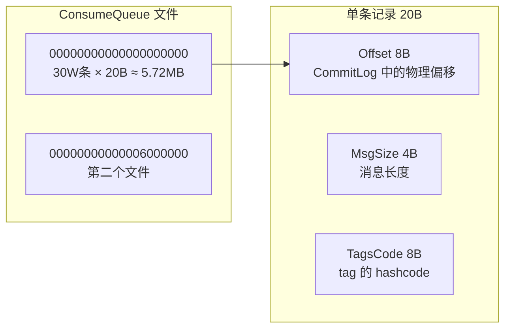

- 文件名 = 队列起始 offset
- 单文件大小：`mappedFileSizeConsumeQueue = 300000 * 20B ≈ 5.72MB`
- 消费者通过 `(consumeOffset - fileFirstOffset) / 20B` 定位到具体记录

### 6.6 ReputMessageService 异步分发

`ReputMessageService` 是一个线程，定时（每 1ms）从 `CommitLog` 读取消息，分发到 `ConsumeQueue` 和 `IndexFile`：

```java
class ReputMessageService extends ServiceThread {
    private volatile long reputFromOffset = 0;

    @Override
    public void run() {
        while (!this.isStopped()) {
            try {
                Thread.sleep(1);  // 每 1ms
                this.doReput();
            } catch (Exception e) { ... }
        }
    }

    private void doReput() {
        for (boolean doNext = true; isCommitLogAvailable() && doNext; ) {
            // 从 CommitLog 读取消息（MappedByteBuffer）
            SelectMappedBufferResult result = DefaultMessageStore.this.commitLog.getData(reputFromOffset);
            if (result != null) {
                // 分发
                DispatchRequest dispatchRequest = DefaultMessageStore.this.commitLog.checkMessageAndReturnSize(...);
                if (dispatchRequest.isSuccess()) {
                    // 分发给所有 dispatcher
                    DefaultMessageStore.this.doDispatch(dispatchRequest);
                    // 通知长轮询：有新消息到达
                    if (BrokerRole.SLAVE != DefaultMessageStore.this.getMessageStoreConfig().getBrokerRole()
                            && DefaultMessageStore.this.brokerConfig.isLongPollingEnable()) {
                        DefaultMessageStore.this.messageArrivingListener.arriving(...);
                    }
                    reputFromOffset += dispatchRequest.getMsgSize();
                }
            }
        }
    }
}
```

### 6.7 DispatchRequest 分发

`DefaultMessageStore.doDispatch` 调用所有 `CommitLogDispatcher`：

```java
private void doDispatch(DispatchRequest req) {
    for (CommitLogDispatcher dispatcher : this.dispatcherList) {
        dispatcher.dispatch(req);
    }
}

// 注册的 dispatcher:
this.dispatcherList.addLast(new CommitLogDispatcherBuildConsumeQueue()); // 构建 ConsumeQueue
this.dispatcherList.addLast(new CommitLogDispatcherBuildIndex());        // 构建 IndexFile
```

`CommitLogDispatcherBuildConsumeQueue.dispatch`：

```java
public void dispatch(DispatchRequest request) {
    final int tranType = MessageSysFlag.getTransactionValue(request.getSysFlag());
    switch (tranType) {
        case MessageSysFlag.TRANSACTION_NOT_TYPE:    // 普通消息
        case MessageSysFlag.TRANSACTION_COMMIT_TYPE: // 事务消息 commit
            putMessagePositionInfo(request);  // 写入 ConsumeQueue
            break;
        case MessageSysFlag.TRANSACTION_PREPARED_TYPE: // half 消息
        case MessageSysFlag.TRANSACTION_ROLLBACK_TYPE:  // rollback
            break;  // 不写入 ConsumeQueue
    }
}
```

### 6.8 IndexFile 索引文件

`IndexFile` 用于按 key 或时间区间查询消息。

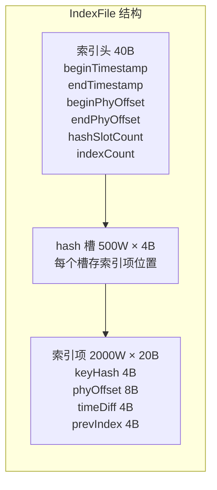

- 单文件：500W 槽 × 4B + 2000W 索引项 × 20B ≈ 400MB
- 槽数：`maxHashSlotNum = 5000000`
- 索引项数：`maxIndexNum = 20000000`

**索引构建 key**：

```java
// 1. 消息的 KEYS property
String keys = msg.getProperty(MessageConst.PROPERTY_KEYS);
if (keys != null) {
    indexFile = buildIndex(topic, keys, ...);
}
// 2. UNIQ_KEY（消息唯一 ID）
String uniqKey = msg.getProperty(MessageConst.PROPERTY_UNIQ_KEY);
```

**查询**：根据 key 计算 hash，定位到槽位，遍历槽位下的索引链表（`prevIndex`）找到匹配的 `phyOffset`，再到 CommitLog 读取消息。

### 6.9 消息存储格式

`MessageExtBrokerInner` 继承 `MessageExt`，增加 `MessageExt` 的属性 + 一些内部字段：

| 字段 | 说明 |
|------|------|
| `topic` | topic 名 |
| `flag` | 标志位 |
| `properties` | properties map |
| `body` | 消息体 |
| `queueId` | 队列 ID |
| `storeSize` | 存储大小 |
| `bodyCRC` | body CRC |
| `queueOffset` | 队列偏移 |
| `commitLogOffset` | CommitLog 偏移 |
| `bornTimestamp/host` | 产生时间/主机 |
| `storeTimestamp/host` | 存储时间/主机 |
| `reconsumeTimes` | 重试次数 |
| `preparedTransactionOffset` | 事务消息偏移 |

---

## 七、内存映射机制 MappedFile

### 7.1 MappedFile 核心字段

```java
public class MappedFile extends ReferenceResource {
    public static final int OS_PAGE_SIZE = 1024 * 4;  // 4KB

    private static final AtomicLong TOTAL_MAPPED_VIRTUAL_MEMORY = new AtomicLong(0); // 总映射虚拟内存
    private static final AtomicInteger TOTAL_MAPPED_FILES = new AtomicInteger(0);   // 总映射文件数

    protected final AtomicInteger wrotePosition = new AtomicInteger(0);   // 已写入位置
    protected final AtomicInteger committedPosition = new AtomicInteger(0); // 已 commit 到 FileChannel 的位置
    private final AtomicInteger flushedPosition = new AtomicInteger(0);     // 已 flush 到磁盘的位置

    protected int fileSize;
    protected FileChannel fileChannel;
    protected ByteBuffer writeBuffer = null;          // 堆外内存（TransientStorePool 启用时）
    protected TransientStorePool transientStorePool = null;
    private String fileName;
    private long fileFromOffset;                      // 文件起始 offset
    private File file;
    private MappedByteBuffer mappedByteBuffer;         // mmap 映射的 ByteBuffer
    private volatile long storeTimestamp = 0;
}
```

### 7.2 三种位置的关系

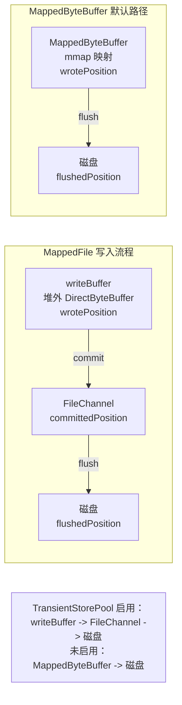

- **未启用 TransientStorePool**：消息写入 `MappedByteBuffer`（mmap 映射），`flush` 操作调用 `MappedByteBuffer.force()` 将数据刷到磁盘
- **启用 TransientStorePool**：消息写入 `writeBuffer`（堆外 DirectByteBuffer），先 `commit` 到 `FileChannel`，再 `flush` 到磁盘

### 7.3 mmap 内存映射初始化

`MappedFile.init`：

```java
private void init(final String fileName, final int fileSize, ...) throws IOException {
    this.fileName = fileName;
    this.fileSize = fileSize;
    this.file = new File(fileName);
    this.fileFromOffset = Long.parseLong(this.file.getName());  // 文件名 = 起始 offset

    ensureDirOK(this.file.getParent());
    this.fileChannel = new RandomAccessFile(this.file, "rw").getChannel();
    // mmap 映射
    this.mappedByteBuffer = this.fileChannel.map(MapMode.READ_WRITE, 0, fileSize);

    TOTAL_MAPPED_VIRTUAL_MEMORY.addAndGet(fileSize);
    TOTAL_MAPPED_FILES.incrementAndGet();

    // TransientStorePool 启用
    if (transientStorePool != null && transientStorePool.isRealCommit()) {
        this.writeBuffer = transientStorePool.borrowBuffer(fileSize);  // 借用堆外 buffer
        this.transientStorePool = transientStorePool;
    }
}
```

### 7.4 appendMessage 追加消息

```java
public AppendMessageResult appendMessage(final MessageExtBrokerInner msg, ...) {
    assert msg != null;
    int currentPos = this.wrotePosition.get();
    if (currentPos < this.fileSize) {
        ByteBuffer byteBuffer = writeBuffer != null ? writeBuffer.slice() : mappedByteBuffer.slice();
        byteBuffer.position(currentPos);
        AppendMessageResult result = cb.doAppend(this.getFileFromOffset(), byteBuffer, this.fileSize - currentPos, msg);
        this.wrotePosition.addAndGet(result.getWroteBytes());
        this.storeTimestamp = result.getStoreTimestamp();
        return result;
    }
    return new AppendMessageResult(AppendMessageStatus.UNKNOWN_ERROR);
}
```

`DefaultAppendMessageCallback.doAppend` 完成具体消息序列化到 ByteBuffer，包括：
1. 序列化消息头（TOTALSIZE、MAGICCODE、BODYCRC 等）
2. 计算 queueOffset
3. 序列化消息体、topic、properties

### 7.5 AllocateMappedFileService 预分配

为了提高性能，RocketMQ 提前分配下一个 `MappedFile`，避免写满时才创建：

```java
// MappedFileQueue.getNextMappedFile
public MappedFile getLastMappedFile(final long startOffset, boolean needCreate) {
    MappedFile mappedFileLast = getLastMappedFile();
    if (mappedFileLast != null && mappedFileLast.isFull()) {
        // 通过 AllocateMappedFileService 异步预分配下一个
        mappedFileLast = allocateMappedFileService.putRequestAndReturnMappedFile(...);
    }
    return mappedFileLast;
}
```

`AllocateMappedFileService` 内部维护 `requestQueue`，后台线程消费请求并提前 mmap 文件，同时预热（`warmMappedFile`）。

### 7.6 warmMappedFile 文件预热

```java
public void warmMappedFile(MappedFile mappedFile) {
    long fileSize = mappedFile.getFileSize();
    long beginTime = System.currentTimeMillis();
    ByteBuffer byteBuffer = mappedFile.getMappedByteBuffer();
    // 每页（4KB）写入 0
    for (int i = 0, j = 0; i < fileSize; i += MappedFile.OS_PAGE_SIZE, j++) {
        byteBuffer.put(i, (byte) 0);
        // 每 1000 页触发一次
        if (j % 1000 == 0) {
            mappedFile.getMappedByteBuffer().force();  // 强制刷盘
        }
    }
    // 最后 force 一次
    mappedFile.getMappedByteBuffer().force();
}
```

**预热目的**：
1. 预热页缓存，避免写入时触发缺页中断
2. 触发 mmap 预读，将文件页加载到内存

### 7.7 ReferenceResource 引用计数

`MappedFile` 继承 `ReferenceResource`，使用引用计数管理生命周期：

```java
public abstract class ReferenceResource {
    protected final AtomicLong refCount = new AtomicLong(1);
    protected volatile boolean available = true;
    protected volatile boolean cleanupOver = false;
    private volatile long firstShutdownTimestamp = 0L;

    public boolean hold() {
        if (this.isAvailable()) {
            if (this.refCount.incrementAndGet() > 0) return true;
            this.refCount.decrementAndGet();
        }
        return false;
    }

    public void shutdown(final long intervalForcibly) {
        if (this.available) {
            this.available = false;
            this.firstShutdownTimestamp = System.currentTimeMillis();
            this.release();
        } else if (this.refCount.get() > 0) {
            // 强制释放（超过 intervalForcibly 后）
            if ((System.currentTimeMillis() - this.firstShutdownTimestamp) >= intervalForcibly) {
                this.cleanupOver = true;
                // ...
            }
        }
    }
}
```

读取消息时 `SelectMappedBufferResult` 持有 `MappedFile` 引用，使用 `hold()` 增加计数，使用完调用 `release()`。

### 7.8 MappedFileQueue 文件队列

`MappedFileQueue` 管理一组 `MappedFile`：

```java
public class MappedFileQueue {
    private final String storePath;                          // 存储目录
    private final int mappedFileSize;                        // 单文件大小
    private final CopyOnWriteArrayList<MappedFile> mappedFiles; // 文件列表
    private final AllocateMappedFileService allocateMappedFileService;
    private long flushedWhere = 0;                           // 已刷盘位置
    private long committedWhere = 0;                         // 已 commit 位置
    private volatile long storeTimestamp = 0;
}
```

关键方法：
- `getLastMappedFile()`：获取最后一个文件
- `findMappedFileByOffset(offset)`：按 offset 查找文件
- `truncateDirtyFiles(offset)`：截断到指定 offset（用于恢复）
- `cleanExpiredFiles(deleteFilesInterval)`：清理过期文件

---

## 八、刷盘机制

### 8.1 两种刷盘模式

```mermaid
graph TB
    subgraph SYNC_FLUSH 同步刷盘
        P[Producer send] --> SM[SendMessageProcessor]
        SM --> PM[putMessage 到 CommitLog]
        PM --> GCS[GroupCommitService<br/>同步刷盘服务]
        GCS --> W[等待刷盘完成]
        W --> R[返回 SEND_MESSAGE_OK]
    end

    subgraph ASYNC_FLUSH 异步刷盘 默认
        P2[Producer send] --> SM2[SendMessageProcessor]
        SM2 --> PM2[putMessage 到 CommitLog]
        PM2 --> FRT[FlushRealTimeService<br/>定时刷盘 500ms]
        PM2 --> R2[立即返回 SEND_MESSAGE_OK]
        FRT -.异步.-> D[磁盘]
    end

    style GCS fill:#fff3e0
    style FRT fill:#e1f5fe
```

### 8.2 CommitLog.handleDiskFlush

```java
public CompletableFuture<PutMessageStatus> submitFlushRequest(AppendMessageResult result, MessageExt messageExt) {
    // 同步刷盘
    if (FlushDiskType.SYNC_FLUSH == defaultMessageStore.getMessageStoreConfig().getFlushDiskType()) {
        GroupCommitService service = (GroupCommitService) flushCommitLogService;
        GroupCommitRequest request = new GroupCommitRequest(result.getWroteOffset() + result.getWroteBytes(), timeout);
        service.putRequest(request);
        return request.future();  // 返回 CompletableFuture
    } else {
        // 异步刷盘
        if (!defaultMessageStore.getMessageStoreConfig().isTransientStorePoolEnable()) {
            flushCommitLogService.wakeup();
        } else {
            commitLogService.wakeup();
        }
        return CompletableFuture.completedFuture(PutMessageStatus.PUT_OK);
    }
}
```

> **4.9.8 改进**：`GroupCommitRequest` 使用 `CompletableFuture<PutMessageStatus>` 而非 `CountDownLatch`，更契合 `putMessage` 返回 `CompletableFuture` 的异步化改造。

### 8.3 GroupCommitService 同步刷盘

```java
class GroupCommitService extends FlushCommitLogService {
    private volatile List<GroupCommitRequest> requestsWrite = new ArrayList<>();
    private volatile List<GroupCommitRequest> requestsRead = new ArrayList<>();

    public void run() {
        while (!this.isStopped()) {
            this.waitForRunning(10);  // 每 10ms
            this.doCommit();
        }
    }

    private synchronized void doCommit() {
        // swap requestsWrite 和 requestsRead
        for (GroupCommitRequest req : this.requestsRead) {
            // 检查是否已刷盘到 req.nextOffset
            boolean flushOK = MappedFileQueue.this.getFlushedWhere() >= req.getNextOffset();
            for (int i = 0; i < 2 && !flushOK; i++) {
                CommitLog.this.mappedFileQueue.flush(0);  // flush 0 表示刷所有
                flushOK = MappedFileQueue.this.getFlushedWhere() >= req.getNextOffset();
            }
            req.wakeupCustomer(flushOK ? PutMessageStatus.PUT_OK : PutMessageStatus.FLUSH_DISK_TIMEOUT);
        }
        // 至少 flush 一次（即使无请求）
        CommitLog.this.mappedFileQueue.flush(0);
    }
}
```

`GroupCommitRequest` 使用 `CompletableFuture<PutMessageStatus>` 实现异步等待（4.9.8 版本）：

```java
public static class GroupCommitRequest {
    private final long nextOffset;
    private CompletableFuture<PutMessageStatus> flushOKFuture = new CompletableFuture<>();
    private final long deadLine;

    public void wakeupCustomer(final PutMessageStatus putMessageStatus) {
        this.flushOKFuture.complete(putMessageStatus);
    }

    public CompletableFuture<PutMessageStatus> future() {
        return flushOKFuture;
    }
}
```

### 8.4 FlushRealTimeService 异步刷盘

```java
class FlushRealTimeService extends FlushCommitLogService {
    public void run() {
        while (!this.isStopped()) {
            boolean flushCommitLogTimed = defaultMessageStore.getMessageStoreConfig().isFlushCommitLogTimed();
            int interval = defaultMessageStore.getMessageStoreConfig().getFlushIntervalCommitLog();  // 500ms
            int flushPhysicQueueLeastPages = defaultMessageStore.getMessageStoreConfig().getFlushCommitLogLeastPages(); // 4页
            int flushPhysicQueueThoroughInterval = defaultMessageStore.getMessageStoreConfig().getFlushCommitLogThoroughInterval(); // 10s

            // 超过 thorough interval，强制刷盘（不限页数）
            if (now - lastFlushTimestamp >= flushPhysicQueueThoroughInterval) {
                flushPhysicQueueLeastPages = 0;  // 0 表示刷所有
            }

            try {
                if (flushCommitLogTimed) Thread.sleep(interval);
                else wakeup();

                CommitLog.this.mappedFileQueue.flush(flushPhysicQueueLeastPages);
            } catch (Throwable e) { ... }
        }
    }
}
```

### 8.5 MappedFile.flush 刷盘

```java
public int flush(final int flushLeastPages) {
    if (this.isAbleToFlush(flushLeastPages)) {
        try {
            this.mappedByteBuffer.force();  // MappedByteBuffer.force() = msync
        } catch (Throwable e) { ... }
    }
    this.flushedPosition.set(this.wrotePosition.get());
    return this.getFlushedPosition();
}

private boolean isAbleToFlush(final int flushLeastPages) {
    int flush = this.flushedPosition.get();
    int write = this.wrotePosition.get();
    if (flush == write) return false;
    if (flushLeastPages > 0 && (write - flush) / OS_PAGE_SIZE < flushLeastPages) return false;
    return true;
}
```

### 8.6 TransientStorePool 堆外内存池

启用 `transientStorePoolEnable=true` 时，使用堆外内存 `DirectByteBuffer` 写消息：

```java
public class TransientStorePool {
    private final int poolSize;           // 池大小，默认 5
    private final int fileSize;           // 单文件大小
    private final Deque<ByteBuffer> availableBuffers;  // 可用 buffer 队列

    public TransientStorePool(final int poolSize, final int fileSize) {
        this.poolSize = poolSize;
        this.fileSize = fileSize;
        this.availableBuffers = new ConcurrentLinkedDeque<>();
    }

    public void init() {
        for (int i = 0; i < poolSize; i++) {
            ByteBuffer byteBuffer = ByteBuffer.allocateDirect(fileSize);  // 堆外分配
            availableBuffers.offer(byteBuffer);
        }
    }
}
```

启用后写入流程：

```mermaid
sequenceDiagram
    participant P as Producer
    participant WB as writeBuffer<br/>DirectByteBuffer
    participant FC as FileChannel
    participant MBB as MappedByteBuffer
    participant D as 磁盘

    P->>WB: appendMessage 写入堆外
    Note over WB: wrotePosition
    Note over FC: CommitRealTimeService<br/>每200ms commit
    WB->>FC: writeBuffer -> FileChannel.write
    Note over FC: committedPosition
    Note over FC: FlushRealTimeService<br/>每500ms flush
    FC->>D: FileChannel.force(false)
    Note over D: flushedPosition
```

`CommitRealTimeService`：

```java
class CommitRealTimeService extends FlushCommitLogService {
    public void run() {
        while (!this.isStopped()) {
            int interval = defaultMessageStore.getMessageStoreConfig().getCommitIntervalCommitLog();  // 200ms
            int commitDataLeastPages = defaultMessageStore.getMessageStoreConfig().getCommitCommitLogLeastPages(); // 4
            CommitLog.this.mappedFileQueue.commit(commitDataLeastPages);
            this.waitForRunning(interval);
        }
    }
}
```

### 8.7 刷盘参数汇总

| 参数 | 默认值 | 说明 |
|------|--------|------|
| `flushDiskType` | `ASYNC_FLUSH` | 刷盘模式 |
| `flushIntervalCommitLog` | 500ms | 异步刷盘间隔 |
| `commitIntervalCommitLog` | 200ms | commit 间隔（TransientStorePool） |
| `flushCommitLogLeastPages` | 4 | 最少刷盘页数（4 页 = 16KB） |
| `commitCommitLogLeastPages` | 4 | 最少 commit 页数 |
| `flushCommitLogThoroughInterval` | 10s | 强制刷盘间隔（超过则不限页数） |
| `syncFlushTimeout` | 5s | 同步刷盘超时 |
| `flushConsumeQueueLeastPages` | 2 | ConsumeQueue 最少刷盘页数 |
| `flushIntervalConsumeQueue` | 1000ms | ConsumeQueue 刷盘间隔 |

---

## 九、过期文件删除机制

### 9.1 删除触发条件

`CleanCommitLogService` 每 10 秒（`cleanResourceInterval`）检查一次，触发条件：

1. **定时删除**：到 `deleteWhen`（默认 "04" 即凌晨 4 点）删除过期文件
2. **磁盘空间不足**：磁盘使用率超过 `diskMaxUsedSpaceRatio`（默认 75%），超过 90% 强制删除

### 9.2 CleanCommitLogService.run

```java
public void run() {
    try {
        this.deleteExpiredFiles();
        this.cleanFilesPeriodically();
    } catch (Throwable e) { ... }
}

private void deleteExpiredFiles() {
    String fileReservedTime = defaultMessageStore.getMessageStoreConfig().getFileReservedTime();  // 72小时
    String deleteWhen = defaultMessageStore.getMessageStoreConfig().getDeleteWhen();  // "04"

    long fileReservedTimeMs = Long.parseLong(fileReservedTime) * 60 * 60 * 1000;
    long deleteWhenMs = TimeUtils.parseDeleteWhen(deleteWhen);  // 凌晨4点的毫秒

    long currentTimeMillis = System.currentTimeMillis();
    // 判断当前时间是否到了删除时间窗口
    boolean isTimeToDelete = isTimeToDelete(deleteWhenMs);
    // 判断磁盘是否满
    boolean isSpaceFull = isSpaceFull();
    // 判断是否到达删除时间或磁盘满
    if (isTimeToDelete || isSpaceFull) {
        this.deleteCount = defaultMessageStore.getCommitLog().deleteExpiredFile(fileReservedTimeMs, ...);
    }
}
```

### 9.3 CommitLog.deleteExpiredFile

```java
public int deleteExpiredFile(long fileReservedTime, ...) {
    MappedFileQueue fileQueue = mappedFileQueue;
    List<MappedFile> mappedFiles = fileQueue.getMappedFiles();
    if (mappedFiles.isEmpty()) return 0;

    int count = 0;
    long currentTime = System.currentTimeMillis();
    // 1. 计算每个文件的存活截止时间
    for (int i = 0; i < mappedFiles.size() - 1; i++) {
        MappedFile mappedFile = mappedFiles.get(i);
        long liveMaxTimestamp = mappedFile.getLastModifiedTimestamp() + fileReservedTime;
        // 文件最后修改时间 + 保留时间 < 当前时间 -> 过期
        if (liveMaxTimestamp < currentTime
            || (isTimeToDelete && isSpaceFull)) {
            // 2. 删除文件
            if (mappedFile.destroy(deleteFileIntervalForcibly)) {
                fileQueue.removeMappedFile(mappedFile);
                count++;
                if (count > 0 && i + 1 < mappedFiles.size() - 1) {
                    // 删除间隔（默认 100ms）
                    try {
                        Thread.sleep(deleteFilesInterval);
                    } catch (InterruptedException e) { ... }
                }
            }
        }
    }
    return count;
}
```

### 9.4 磁盘空间检测

```java
public boolean isSpaceFull() {
    String storePath = defaultMessageStore.getMessageStoreConfig().getStorePathRootDir();
    double physicRatio = UtilAll.getDiskPartitionSpaceUsedPercent(storePath);
    double ratio = defaultMessageStore.getMessageStoreConfig().getDiskMaxUsedSpaceRatio();  // 75%
    if (physicRatio > ratio) {
        log.error("disk space full");
        return true;
    }
    return false;
}
```

磁盘空间告警级别：

| 阈值 | 默认 | 行为 |
|------|------|------|
| `diskMaxUsedSpaceRatio` | 75% | 触发过期文件删除 |
| `diskSpaceWarningLevelRatio` | 90% | 标记磁盘满，拒绝写入 |
| `diskSpaceCleanForciblyRatio` | 95% | 强制删除（即使文件未过期） |

### 9.5 CleanConsumeQueueService

删除 CommitLog 后，对应清理 ConsumeQueue：

```java
public void run() {
    try {
        // 找到最小 CommitLog offset（即 ConsumeQueue 不能引用更小的 offset）
        long minCommitLogOffset = defaultMessageStore.getCommitLog().getMinOffset();
        // 删除 minOffset 之前的 ConsumeQueue 文件
        for (ConsumeQueue cq : ...) {
            cq.deleteExpiredFile(minCommitLogOffset);
        }
    } catch (Throwable e) { ... }
}
```

### 9.6 MappedFile.destroy

```java
public boolean destroy(final long intervalForcibly) {
    this.shutdown(intervalForcibly);
    if (this.isCleanupOver()) {
        try {
            this.fileChannel.close();
            // 释放 MappedByteBuffer
            unmap(this.mappedByteBuffer);
            this.file.delete();
            return true;
        } catch (IOException e) { ... }
    }
    return false;
}
```

### 9.7 StoreCheckpoint 检查点

`StoreCheckpoint` 保存关键 offset，用于 Broker 重启后恢复：

```java
public class StoreCheckpoint {
    private long physicMsgTimestamp;    // CommitLog 最后消息时间戳
    private long physicMsgOffset;       // CommitLog 最大刷盘 offset
    private long logicsMsgTimestamp;   // ConsumeQueue 最大时间戳
    private long logicsMsgOffset;      // ConsumeQueue 最大 offset
    private long indexMsgTimestamp;    // IndexFile 最大时间戳
    private long indexMsgOffset;       // IndexFile 最大 offset
}
```

存储到 `checkpoint` 文件，启动时加载恢复。

---

## 十、网络通信机制 Remoting

### 10.1 Remoting 整体架构

RocketMQ 基于 Netty 自研了一套网络通信框架，位于 `remoting` 模块：

```mermaid
graph TB
    subgraph 通信层
        NRS[NettyRemotingServer<br/>Broker/NameServer 服务端]
        NRC[NettyRemotingClient<br/>Producer/Consumer 客户端]
    end

    subgraph 协议
        RC[RemotingCommand<br/>code/opaque/flag/body/extFields]
        NE[NettyEncoder]
        ND[NettyDecoder<br/>LengthFieldBasedFrameDecoder<br/>4字节长度前缀]
    end

    subgraph 处理
        PT[processorTable<br/>code -> Pair Processor+Executor]
        RT[responseTable<br/>opaque -> ResponseFuture]
        NEE[NettyEventExecutor<br/>连接/断开/异常事件]
    end

    subgraph 三种调用
        IS[invokeSync<br/>同步等待]
        IA[invokeAsync<br/>异步回调]
        IO[invokeOneway<br/>单向]
    end

    NRS --> RC
    NRC --> RC
    RC --> NE
    RC --> ND
    NE --> PT
    PT --> IS
    PT --> IA
    PT --> IO
    IA --> RT

    style NRS fill:#e1f5fe
    style NRC fill:#fff3e0
    style RC fill:#e8f5e9
```

### 10.2 NettyRemotingServer 启动

```java
public void start() {
    this.defaultEventExecutorGroup = new DefaultEventExecutorGroup(...);
    ServerBootstrap childHandler = this.serverBootstrap.group(this.eventLoopGroupBoss, this.eventLoopGroupSelector)
        .channel(useEpoll() ? EpollServerSocketChannel.class : NioServerSocketChannel.class)
        .localAddress(new InetSocketAddress(this.nettyServerConfig.getListenPort()))
        .childHandler(new ChannelInitializer<SocketChannel>() {
            @Override
            public void initChannel(SocketChannel ch) throws Exception {
                ch.pipeline()
                    .addLast(defaultEventExecutorGroup,
                        new NettyEncoder(),
                        new NettyDecoder(),
                        new IdleStateHandler(0, 0, nettyServerConfig.getServerChannelMaxIdleTimeSeconds()),
                        new NettyConnectManageHandler(),
                        new NettyServerHandler());
            }
        });
    ChannelFuture sync = childHandler.bind().sync();
    // ...
}
```

Pipeline 处理链：

| Handler | 作用 |
|---------|------|
| `NettyEncoder` | 编码 `RemotingCommand` 为 `ByteBuf` |
| `NettyDecoder` | 解码 `ByteBuf` 为 `RemotingCommand`（基于 4 字节长度） |
| `IdleStateHandler` | 空闲检测，触发 `userEventTriggered` |
| `NettyConnectManageHandler` | 连接/断开事件，发布到 `NettyEventExecutor` |
| `NettyServerHandler` | 接收 `RemotingCommand`，分发到 `processorTable` |

### 10.3 RemotingCommand 协议格式

```mermaid
graph LR
    subgraph RemotingCommand 协议
        L[4字节长度<br/>整个 Command 长度]
        H[Header<br/>序列化 JSON/RocketMQSerializable]
        B[Body<br/>消息体字节数组]
    end

    subgraph Header 内容
        C[code - 请求/响应码]
        L2[language - JAVA]
        V[version - 协议版本]
        O[opaque - 请求ID]
        F[flag - 0/1/2/4<br/>RPC/单向/响应/类型]
        R[remark - 备注]
        E[extFields - 扩展字段]
    end

    L --> H
    L --> B
    H --> C
```

`flag` 标志位：

| bit | 含义 |
|-----|------|
| bit 0 | RPC 类型（0=请求，1=响应） |
| bit 1 | 单向（1=oneway） |
| bit 2 | 响应（1=response） |

### 10.4 NettyDecoder 解码

```java
public class NettyDecoder extends LengthFieldBasedFrameDecoder {
    // 长度字段：4字节，位于 0~4 位置，最大帧 16777216 字节（16MB）
    public NettyDecoder() {
        super(FRAME_MAX_LENGTH, 0, 4, 0, 4);
    }

    @Override
    public Object decode(ChannelHandlerContext ctx, ByteBuf in) throws Exception {
        ByteBuf frame = (ByteBuf) super.decode(ctx, in);
        if (frame == null) return null;
        // 解析 header 长度 -> header -> body
        byte[] bytes = new byte[frame.readableBytes()];
        frame.readBytes(bytes);
        return RemotingCommand.decode(bytes);  // 反序列化为 RemotingCommand
    }
}
```

### 10.5 请求处理 NettyServerHandler

```java
class NettyServerHandler extends SimpleChannelInboundHandler<RemotingCommand> {
    @Override
    protected void channelRead0(ChannelHandlerContext ctx, RemotingCommand msg) throws Exception {
        processMessageReceived(ctx, msg);
    }
}

public void processMessageReceived(ChannelHandlerContext ctx, RemotingCommand msg) throws Exception {
    if (msg != null) {
        switch (msg.getType()) {
            case REQUEST_COMMAND:
                processRequestCommand(ctx, msg);  // 处理请求
                break;
            case RESPONSE_COMMAND:
                processResponseCommand(ctx, msg);  // 处理响应
                break;
        }
    }
}
```

### 10.6 processorTable 请求路由

`NettyRemotingAbstract` 维护 `processorTable`：

```java
protected final HashMap<Integer/* request code */, Pair<NettyRequestProcessor, ExecutorService>> processorTable =
    new HashMap<>(64);

public void registerProcessor(int requestCode, NettyRequestProcessor processor, ExecutorService executor) {
    Pair<NettyRequestProcessor, ExecutorService> pair = new Pair<>(processor, executor);
    this.processorTable.put(requestCode, pair);
}
```

`processRequestCommand` 根据 `requestCode` 找到对应 Processor，提交到 Executor 执行：

```java
public void processRequestCommand(final ChannelHandlerContext ctx, final RemotingCommand cmd) {
    final Pair<NettyRequestProcessor, ExecutorService> matched = this.processorTable.get(cmd.getCode());
    final Pair<NettyRequestProcessor, ExecutorService> pair = matched == null ? defaultRequestProcessor : matched;
    pair.getObject2().submit(() -> {
        try {
            RemotingCommand response = pair.getObject1().processRequest(ctx, cmd);
            if (response != null) response.setOpaque(cmd.getOpaque());
            if (cmd.getOnewayRPC()) return;  // 单向不返回
            ctx.writeAndFlush(response);
        } catch (Throwable e) { ... }
    });
}
```

### 10.7 invokeSync 同步调用

```java
public RemotingCommand invokeSync(String addr, RemotingCommand request, long timeoutMillis) {
    final Channel channel = getAndCreateChannel(addr);
    if (channel != null && channel.isActive()) {
        try {
            // RPCHook
            doBeforeRpcHooks(addr, request);
            // 设置 opaque（请求 ID）
            int opaque = request.getOpaque();
            // 同步等待
            final ResponseFuture responseFuture = new ResponseFuture(channel, opaque, timeoutMillis, null, null);
            this.responseTable.put(opaque, responseFuture);
            // 获取 SocketAddress
            final SocketAddress addrRemote = channel.remoteAddress();
            channel.writeAndFlush(request).addListener(f -> {
                if (f.isSuccess()) responseFuture.setSendRequestOK(true);
                else {
                    responseTable.remove(opaque);
                    responseFuture.setCause(f.cause());
                    responseFuture.putResponse(null);
                }
            });
            // 等待响应
            RemotingCommand responseCommand = responseFuture.waitResponse(timeoutMillis);
            return responseCommand;
        } catch (Exception e) { ... }
    }
}
```

`ResponseFuture` 使用 `CountDownLatch` 实现等待：

```java
public class ResponseFuture {
    private final CountDownLatch countDownLatch = new CountDownLatch(1);
    private final Semaphore releaseSemaphore;
    private volatile RemotingCommand responseCommand;
    private volatile Throwable cause;

    public RemotingCommand waitResponse(long timeoutMillis) throws InterruptedException {
        this.countDownLatch.await(timeoutMillis, TimeUnit.MILLISECONDS);
        return this.responseCommand;
    }

    public void putResponse(final RemotingCommand responseCommand) {
        this.responseCommand = responseCommand;
        this.countDownLatch.countDown();
    }
}
```

### 10.8 invokeAsync 异步调用

```java
public void invokeAsync(String addr, RemotingCommand request, long timeoutMillis, InvokeCallback invokeCallback) {
    final Channel channel = getAndCreateChannel(addr);
    if (channel != null && channel.isActive()) {
        try {
            doBeforeRpcHooks(addr, request);
            int opaque = request.getOpaque();
            boolean acquired = this.acquireSemaphore(timeoutMillis);  // 信号量流控
            if (acquired) {
                final ResponseFuture responseFuture = new ResponseFuture(channel, opaque, timeoutMillis, invokeCallback, releaseSemaphore);
                this.responseTable.put(opaque, responseFuture);
                channel.writeAndFlush(request).addListener(f -> {
                    if (f.isSuccess()) responseFuture.setSendRequestOK(true);
                    else {
                        requestFail(opaque);
                    }
                });
            }
        } catch (Exception e) { ... }
    }
}
```

异步响应通过 `ResponseFuture.executeInvokeCallback` 回调：

```java
public void executeInvokeCallback() {
    if (invokeCallback != null) {
        invokeCallback.operationComplete(this);
    }
}
```

### 10.9 invokeOneway 单向调用

```java
public void invokeOneway(String addr, RemotingCommand request, long timeoutMillis) {
    request.markOnewayRPC();  // 设置 oneway flag
    final Channel channel = getAndCreateChannel(addr);
    if (channel != null && channel.isActive()) {
        boolean acquired = acquireSemaphore(timeoutMillis);
        if (acquired) {
            try {
                doBeforeRpcHooks(addr, request);
                channel.writeAndFlush(request).addListener(f -> releaseSemaphore.release());
            } catch (Exception e) { ... }
        }
    }
}
```

### 10.10 信号量流控

```java
protected final Semaphore semaphoreAsync;
protected final Semaphore semaphoreOneway;

// invokeAsync 和 invokeOneway 通过信号量限制并发请求数
protected boolean acquireSemaphore(final long timeoutMillis) {
    try {
        return semaphoreAsync.tryAcquire(timeoutMillis, TimeUnit.MILLISECONDS);
    } catch (InterruptedException e) {
        return false;
    }
}
```

### 10.11 NettyEventExecutor 事件处理

`NettyConnectManageHandler` 监听连接事件，发布到 `NettyEventExecutor` 队列：

```java
public enum NettyEventType {
    CONNECT,    // 连接建立
    CLOSE,      // 连接关闭
    IDLE,       // 空闲
    EXCEPTION   // 异常
}

public class NettyEventExecutor extends ServiceThread {
    private final LinkedBlockingQueue<NettyEvent> eventQueue = new LinkedBlockingQueue<>();
    private final ChannelEventListener channelEventListener;

    public void putNettyEvent(final NettyEventType type, final String remoteAddr, final Channel channel) {
        this.eventQueue.put(new NettyEvent(type, remoteAddr, channel));
    }

    @Override
    public void run() {
        while (!this.isStopped()) {
            try {
                NettyEvent event = this.eventQueue.take();
                switch (event.getType()) {
                    case CONNECT: channelEventListener.onChannelConnect(event.getRemoteAddr(), event.getChannel()); break;
                    case CLOSE: channelEventListener.onChannelClose(event.getRemoteAddr(), event.getChannel()); break;
                    case IDLE: channelEventListener.onChannelIdle(event.getRemoteAddr(), event.getChannel()); break;
                    case EXCEPTION: channelEventListener.onChannelException(event.getRemoteAddr(), event.getChannel()); break;
                }
            } catch (Exception e) { ... }
        }
    }
}
```

### 10.12 心跳机制

客户端定时（30 秒）向所有 Broker 发送 `HEART_BEAT` 请求：

```java
// MQClientInstance
public void sendHeartbeatToAllBroker() {
    final HeartbeatData heartbeatData = prepareHeartbeatData();
    for (BrokerData brokerData : this.brokerAddrTable.values()) {
        for (Entry<Long, String> entry : brokerData.getBrokerAddrs().entrySet()) {
            Long id = entry.getKey();
            String addr = entry.getValue();
            if (addr != null) {
                if (consumerEmpty && producerEmpty) continue;
                try {
                    int version = this.mQClientAPIImpl.sendHeartbeat(addr, heartbeatData, 3000);
                    if (id == MixAll.MASTER_ID) brokerVersion[0] = version;
                } catch (Exception e) { ... }
            }
        }
    }
}
```

`HeartbeatData` 包含：
- `clientID`
- `consumerDataSet`：所有 Consumer 订阅信息
- `producerDataSet`：所有 Producer 信息

### 10.13 fastRemotingServer VIP 通道

Broker 同时启动两个 NettyServer：
- 主服务：`listenPort`（默认 10911）
- VIP 通道：`listenPort - 2`（默认 10909）

VIP 通道用于特殊场景，避免生产/消费请求相互影响。客户端通过 `-Dcom.rocketmq.sendMessageWithVIPChannel=false` 关闭。

### 10.14 RPCHook 钩子机制

`RPCHook` 在请求发送前/后执行，常用于 ACL 签名：

```java
public interface RPCHook {
    void doBeforeRequest(final String remoteAddr, final RemotingCommand request);
    void doAfterResponse(final String remoteAddr, final RemotingCommand request, final RemotingCommand response);
}
```

---

## 十一、消息过滤机制

### 11.1 两种过滤方式

```mermaid
graph TB
    subgraph 消息过滤
        T1[Tag 过滤<br/>订阅时指定 tags]
        T2[SQL92 表达式过滤<br/>支持复杂表达式]
    end

    T1 --> S1[Broker 端 ConsumeQueue<br/>tagsCode 比较]
    T1 --> S2[客户端再过滤]

    T2 --> S3[Broker 端 ConsumerFilterManager<br/>计算 Bitmap]
    T2 --> S4[Broker 端 ExpressionMessageFilter<br/>执行表达式]
    T2 --> S5[客户端再过滤]
```

### 11.2 Tag 过滤

订阅时指定 tags：

```java
consumer.subscribe("TopicA", "TagA || TagB");
```

`SubscriptionData` 包含 tags 集合：

```java
public class SubscriptionData implements Comparable<SubscriptionData> {
    private boolean classFilterMode = false;
    private String topic;
    private String subString;        // "TagA || TagB"
    private Set<String> tagsSet = new HashSet<>();   // {TagA, TagB}
    private int codeMode;
    private String expressionType = ExpressionType.TAG;
    private String filterClassSource;  // SQL92 用
}
```

**Broker 端过滤**（`PullMessageProcessor`）：

`ConsumeQueue` 每条记录包含 `tagsCode`（tag 的 hashcode），Broker 在扫描 `ConsumeQueue` 时与订阅的 tags 比较：

```java
// ConsumeQueue Ext 过滤
if (messageFilter != null) {
    if (!messageFilter.isMatchedByConsumeQueue(tagsCode, ...)) {
        continue;  // 不匹配跳过
    }
}
```

匹配后还要客户端再过滤一次，因为 hashcode 可能有冲突：

```java
// DefaultMQPushConsumerImpl
@Override
public PullCallback pullCallback = new PullCallback() {
    public void onSuccess(PullResult pullResult) {
        // 客户端再过滤
        msgListFilterAgain = (msgListFilterAgain == null) ? pullResult.getMsgFoundList() : msgListFilterAgain;
    }
};
```

### 11.3 SQL92 表达式过滤

支持复杂表达式：

```java
consumer.subscribe("TopicA", MessageSelector.bySql("TAGS IS NOT NULL AND TAGS in ('TagA','TagB') AND a > 5"));
```

`ExpressionType`：

```java
public interface ExpressionType {
    String TAG = "TAG";
    String SQL92 = "SQL92";
}
```

### 11.4 ConsumerFilterManager

Broker 端维护 `ConsumerFilterData`，使用 BloomFilter 计算 Bitmap：

```java
public class ConsumerFilterData {
    private String consumerGroup;
    private String topic;
    private String expression;
    private String expressionType = ExpressionType.SQL92;
    private long bornTime;
    private long deadTime;
    private BloomFilterData bloomFilterData;  // BloomFilter
    private CompiledExpression compiledExpression;
}
```

### 11.5 CommitLogDispatcherCalcBitMap 预计算

`CommitLogDispatcherCalcBitMap` 是一个 `CommitLogDispatcher`，在消息写入后分发时**预计算** BloomFilter bitmap，加速后续 SQL92 过滤：

```java
public class CommitLogDispatcherCalcBitMap implements CommitLogDispatcher {
    @Override
    public void dispatch(DispatchRequest request) {
        // 遍历所有消费者的过滤规则
        for (ConsumerFilterData filterData : consumerFilterManager.getConsumerFilterData()) {
            // 计算该消息是否匹配过滤规则
            if (filterData.getCompiledExpression() != null) {
                Object ret = filterData.getCompiledExpression().evaluate(...);
                if (Boolean.TRUE.equals(ret)) {
                    // 匹配，更新 BloomFilter bit
                    consumerFilterData.getBloomFilterData().setBit(...);
                }
            }
        }
    }
}
```

> **设计要点**：消息写入时即预计算 bitmap，消费时先通过 BloomFilter 快速判断（O(1)），避免每条消息都执行完整表达式求值。

### 11.6 MessageFilter 接口

```java
public interface MessageFilter {
    // ConsumeQueue 过滤（基于 tagsCode）
    boolean isMatchedByConsumeQueue(Long tagsCode, ConsumeQueueExt.CqExtUnit cqExtUnit);
    // CommitLog 过滤（基于消息内容）
    boolean isMatchedByCommitLog(ByteBuffer msgBuffer, Map<String, String> properties);
}
```

`ExpressionMessageFilter` 实现：

```java
public class ExpressionMessageFilter implements MessageFilter {
    @Override
    public boolean isMatchedByConsumeQueue(Long tagsCode, ConsumeQueueExt.CqExtUnit cqExtUnit) {
        if (null == subscriptionData) return true;
        // TAG 过滤
        if (tagsCode != null && subscriptionData.getTagsSet().contains(tagsCode)) {
            return true;
        }
        // SQL92 过滤（用 BloomFilter 快速判断）
        if (consumerFilterData != null && bloomFilter != null && cqExtUnit != null) {
            return bloomFilter.isHit(cqExtUnit.getBitMap());
        }
        return false;
    }

    @Override
    public boolean isMatchedByCommitLog(ByteBuffer msgBuffer, Map<String, String> properties) {
        // 精确过滤（执行表达式）
        if (subscriptionData == null) return true;
        if (consumerFilterData == null || compiledExpression == null) return true;
        // 执行 SQL92 表达式
        Object ret = compiledExpression.evaluate(new MessageEvaluationContext(properties));
        return Boolean.TRUE.equals(ret);
    }
}
```

### 11.7 ConsumeQueueExt 扩展存储

启用 `enableConsumeQueueExt=true` 时，`ConsumeQueue` 附加一个 `ConsumeQueueExt` 文件，存储：
- `tagsCode`
- BloomFilter Bitmap
- 过滤元数据

```java
public class ConsumeQueueExt {
    // 扩展文件
    private final MappedFileQueue mappedFileQueue;
    private final int bitMapLength;     // 默认 64
    private final int filterBitMapLength;
}
```

---

## 十二、消息查询机制

### 12.1 两种查询方式

| 方式 | 说明 | API |
|------|------|-----|
| 按 message id 查询 | 唯一 ID 直接定位 | `queryMessageByUniqKey` |
| 按 key 查询 | 通过 IndexFile 查询 | `queryMessage` |

### 12.2 QueryMessageProcessor

```java
public RemotingCommand processRequest(ChannelHandlerContext ctx, RemotingCommand request) {
    switch (request.getCode()) {
        case RequestCode.QUERY_MESSAGE:
            return this.queryMessage(ctx, request);
        case RequestCode.VIEW_MESSAGE_BY_ID:
            return this.viewMessageById(ctx, request);
    }
}
```

### 12.3 按 ID 查询

```java
// DefaultMessageStore
public MessageExt queryMessageById(long phyOffset) {
    SelectMappedBufferResult bufferResult = commitLog.getData(phyOffset);
    if (bufferResult != null) {
        // 解析消息
        MessageExt msg = MessageDecoder.decode(bufferResult.getByteBuffer());
        return msg;
    }
    return null;
}
```

消息 ID（`MessageConst.PROPERTY_UNIQ_KEY`）格式：`IP@port@offset`，可直接解析出 `phyOffset`。

### 12.4 按 key 查询

```java
public QueryMessageResult queryMessage(String topic, String key, int maxNum, long begin, long end) {
    QueryMessageResult queryMessageResult = new QueryMessageResult();
    // 遍历 IndexFile
    for (int i = 0; i < this.indexService.getHashSlotNum(); i++) {
        // 找到匹配的索引项
        List<PhyOffset> phyOffsets = indexService.queryOffset(topic, key, maxNum, begin, end);
        for (long offset : phyOffsets) {
            SelectMappedBufferResult result = commitLog.getData(offset);
            queryMessageResult.addMessage(result);
        }
    }
    return queryMessageResult;
}
```

### 12.5 IndexFile 查询流程

```mermaid
sequenceDiagram
    participant C as Client
    participant QMP as QueryMessageProcessor
    participant IS as IndexService
    participant IF as IndexFile
    participant CL as CommitLog

    C->>QMP: QUERY_MESSAGE(topic, key, maxNum, begin, end)
    QMP->>IS: queryOffset(topic, key, maxNum, begin, end)
    IS->>IF: 找到时间范围内的 IndexFile
    IF->>IF: 1. key hash = hash(key) % slotNum
    IF->>IF: 2. 读取槽位的 indexHead
    IF->>IF: 3. 遍历索引链表<br/>比较 keyHash 与 timeDiff
    IF->>IF: 4. 收集匹配的 phyOffset
    IF-->>IS: List<Long> phyOffsets
    IS-->>QMP: 返回
    loop 每个 phyOffset
        QMP->>CL: getData(phyOffset)
        CL-->>QMP: 消息 ByteBuffer
    end
    QMP-->>C: QueryMessageResult
```

### 12.6 IndexFile 构建

`CommitLogDispatcherBuildIndex.dispatch`：

```java
public void dispatch(DispatchRequest request) {
    if (DefaultMessageStore.this.messageStoreConfig.isMessageIndexEnable()) {
        // 构建索引
        DefaultMessageStore.this.indexService.buildIndex(request);
    }
}
```

`IndexService.buildIndex`：

```java
public void buildIndex(DispatchRequest req) {
    IndexFile indexFile = retryGetAndCreateIndexFile();
    long endPhyOffset = indexFile.getEndPhyOffset();
    String keys = req.getUniqKey();  // UNIQ_KEY 优先
    if (keys == null) keys = req.getKeys();  // 否则 KEYS property

    // 1. 写入索引项（key -> phyOffset）
    if (req.getUniqKey() != null) {
        indexFile.putKey(req.getTopic(), req.getUniqKey(), req.getCommitLogOffset());
    }
    // 2. 多个 keys（用空格分隔）
    if (keys != null) {
        String[] keyset = keys.split(MessageConst.KEYS_SEPARATOR);
        for (String key : keyset) {
            indexFile.putKey(req.getTopic(), key.trim(), req.getCommitLogOffset());
        }
    }
}
```

---

## 十三、负载均衡 Rebalance

### 13.1 RebalanceService

客户端的负载均衡由 `RebalanceService` 定时触发（每 20 秒）：

```java
public class RebalanceService extends ServiceThread {
    private static final long waitInterval = Long.parseLong(
        System.getProperty("rocketmq.client.rebalance.waitInterval", "20000"));  // 20秒

    @Override
    public void run() {
        while (!this.isStopped()) {
            this.waitForRunning(waitInterval);
            this.mqClientFactory.doRebalance();
        }
    }
}
```

### 13.2 doRebalance 完整流程

```mermaid
flowchart TD
    A[RebalanceService.run<br/>每20s] --> B[MQClientInstance.doRebalance]
    B --> C[遍历所有 Consumer]
    C --> D[RebalanceImpl.doRebalance]
    D --> E[遍历订阅的 topic]
    E --> F{messageModel}
    F -->|BROADCASTING| G[每个 consumer 消费所有 queue]
    F -->|CLUSTERING| H[从 Broker 获取 consumerIdList]
    H --> I[AllocateMessageQueueStrategy<br/>分配 queue]
    I --> J[updateProcessQueueTableInRebalance<br/>更新本地 ProcessQueue]
    J --> K{分配有变化}
    K -->|是| L[dispatchPullRequest<br/>提交 PullRequest 到 PullMessageService]
    K -->|否| M[结束]

    style H fill:#e1f5fe
    style I fill:#fff3e0
    style J fill:#fce4ec
```

### 13.3 分配算法详解

**AllocateMessageQueueAveragely**（默认，平均分配）：

```java
public List<MessageQueue> allocate(String consumerGroup, String currentCID, List<MessageQueue> mqAll, List<String> cidAll) {
    int index = cidAll.indexOf(currentCID);
    int mod = mqAll.size() % cidAll.size();
    int averageSize = mqAll.size() <= cidAll.size() ? 1 :
        (mod > 0 && index < mod ? mqAll.size() / cidAll.size() + 1 : mqAll.size() / cidAll.size());
    int startIndex = (mod > 0 && index < mod) ? index * averageSize : index * averageSize + mod;
    int range = Math.min(averageSize, mqAll.size() - startIndex);
    // 取 startIndex 到 startIndex+range 的队列
    List<MessageQueue> result = new ArrayList<>(range);
    for (int i = startIndex; i < startIndex + range; i++) {
        result.add(mqAll.get(i));
    }
    return result;
}
```

示例：8 队列，3 消费者
- Consumer1：mod=2，index=0 < 2，averageSize=3，startIndex=0，range=3 -> Q0,Q1,Q2
- Consumer2：mod=2，index=1 < 2，averageSize=3，startIndex=3，range=3 -> Q3,Q4,Q5
- Consumer3：mod=2，index=2 ≥ 2，averageSize=2，startIndex=6，range=2 -> Q6,Q7

**AllocateMessageQueueAveragelyByCircle**（轮询分配）：

```java
public List<MessageQueue> allocate(...) {
    List<MessageQueue> result = new ArrayList<>();
    for (int i = cidAll.indexOf(currentCID); i < mqAll.size(); i++) {
        if (i % cidAll.size() == cidAll.indexOf(currentCID)) {
            result.add(mqAll.get(i));
        }
    }
    return result;
}
```

示例：8 队列，3 消费者
- Consumer1：Q0,Q3,Q6
- Consumer2：Q1,Q4,Q7
- Consumer3：Q2,Q5

### 13.4 客户端隔离配置

`AllocateMessageQueueStrategy` 还可以配合隔离机制：

- `clientRebalance`：客户端控制 Rebalance（默认 true）
- `isolate`：是否隔离（用于 Broker 端 PushConsumer 在线检测）

### 13.5 Broker 端 Rebalance（可选）

Broker 端也可以做 Rebalance（`ClientRebalanceService`），但默认关闭，由客户端控制。

---

## 十四、事务消息实现原理

### 14.1 事务消息流程

```mermaid
sequenceDiagram
    participant P as Producer
    participant B as Broker
    participant TMS as TransactionalMessageService
    participant TL as TransactionListener

    Note over P,TL: 1. 发送 half 消息
    P->>TL: executeLocalTransaction(开始事务前)
    P->>B: SEND_MESSAGE (half message)
    B->>TMS: prepareMessage
    TMS->>TMS: 替换 topic=RMQ_SYS_TRANS_HALF_TOPIC<br/>保存原 topic 到 property
    TMS->>B: 写入 CommitLog
    B-->>P: SEND_MESSAGE_RESPONSE(half 成功)

    Note over P,TL: 2. 执行本地事务
    P->>TL: executeLocalTransaction(msg, arg)
    TL-->>P: LocalTransactionState<br/>COMMIT/ROLLBACK/UNKNOW

    alt COMMIT
        P->>B: END_TRANSACTION(commit)
        B->>TMS: commitMessage
        TMS->>TMS: 写入原 topic 队列<br/>写入 OP_HALF_TOPIC 标记已处理
    else ROLLBACK
        P->>B: END_TRANSACTION(rollback)
        B->>TMS: rollbackMessage
        TMS->>TMS: 写入 OP_HALF_TOPIC 标记
    else UNKNOW
        Note over B: 等待回查
    end

    Note over B: 3. 回查未决事务(每60s)
    B->>TMS: checkTimeoutMessage
    TMS->>TMS: 遍历 HALF_TOPIC<br/>检查 OP_HALF_TOPIC 是否已处理
    alt 未处理 且 超时
        TMS->>P: CHECK_TRANSACTION_STATE(反向请求)
        P->>TL: checkLocalTransaction(msg)
        TL-->>P: LocalTransactionState
        P-->>B: COMMIT/ROLLBACK/UNKNOW
    end
```

### 14.2 Half 消息处理

`TransactionalMessageBridge.putHalfMessage`：

```java
public PutMessageResult putHalfMessage(MessageExtBrokerInner messageInner) {
    // 备份原 topic 和 queueId 到 properties
    MessageAccessor.putProperty(messageInner, MessageConst.PROPERTY_REAL_TOPIC, messageInner.getTopic());
    MessageAccessor.putProperty(messageInner, MessageConst.PROPERTY_REAL_QUEUE_ID, String.valueOf(messageInner.getQueueId()));
    messageInner.setSysFlag(MessageSysFlag.resetTransactionValue(messageInner.getSysFlag(), MessageSysFlag.TRANSACTION_PREPARED_TYPE));
    // 替换 topic
    messageInner.setTopic(TransactionalMessageUtil.buildHalfTopic());  // RMQ_SYS_TRANS_HALF_TOPIC
    messageInner.setQueueId(0);
    // 写入 CommitLog
    return store.putMessage(messageInner);
}
```

### 14.3 EndTransactionProcessor

```java
public RemotingCommand processRequest(ChannelHandlerContext ctx, RemotingCommand request) {
    final EndTransactionRequestHeader requestHeader = ...;
    // 只处理 MASTER
    if (BrokerRole.SLAVE == brokerController.getMessageStoreConfig().getBrokerRole()) {
        response.setCode(ResponseCode.SLAVE_NOT_AVAILABLE);
        return response;
    }
    OperationResult result = new OperationResult();
    switch (requestHeader.getCommitOrRollback()) {
        case MessageSysFlag.TRANSACTION_COMMIT_TYPE:  // commit
            result = this.brokerController.getTransactionalMessageService().commitMessage(requestHeader);
            if (result.getResponseCode() == ResponseCode.SUCCESS) {
                // 恢复原 topic，写入真实队列
                RemotingCommand sendResult = sendFinalMessage(msg, requestHeader);
                if (sendResult.getCode() == ResponseCode.SUCCESS) {
                    // 写入 OP_HALF_TOPIC 标记已处理
                    this.brokerController.getTransactionalMessageService().deletePrepareMessage(msg);
                }
            }
            break;
        case MessageSysFlag.TRANSACTION_ROLLBACK_TYPE:  // rollback
            result = this.brokerController.getTransactionalMessageService().rollbackMessage(requestHeader);
            if (result.getResponseCode() == ResponseCode.SUCCESS) {
                // 只写入 OP_HALF_TOPIC 标记
                this.brokerController.getTransactionalMessageService().deletePrepareMessage(msg);
            }
            break;
    }
}
```

### 14.4 事务回查服务

`TransactionalMessageCheckService` 每 60 秒执行一次回查：

```java
@Override
protected void onWaitEnd() {
    long timeout = brokerController.getBrokerConfig().getTransactionTimeOut();   // 默认 6 秒
    int checkMax = brokerController.getBrokerConfig().getTransactionCheckMax();   // 默认 15 次
    long beginTime = System.currentTimeMillis();
    this.brokerController.getTransactionalMessageService().check(timeout, checkMax, listener);
}
```

`TransactionalMessageServiceImpl.check`：

```java
public void check(long transactionTimeout, int transactionCheckMax, AbstractTransactionalMessageCheckListener listener) {
    String topic = TransactionalMessageUtil.buildHalfTopic();  // RMQ_SYS_TRANS_HALF_TOPIC
    Set<MessageQueue> msgQueues = consumeMessageMain.getTopicSubscribeInfoTable().get(topic);
    for (MessageQueue messageQueue : msgQueues) {
        // 获取 ConsumeQueue 中的消息
        long startTime = System.currentTimeMillis();
        // 从 OP_HALF_TOPIC 获取已处理的消息（避免重复回查）
        Long opQueueOffset = ...;
        // 遍历 half 消息
        for (long i = queueOffset; i < consumeQueue.getMaxOffsetInQueue(); i++) {
            // 检查是否超过回查次数
            if (msg.getReconsumeTimes() >= transactionCheckMax) {
                listener.resolveDiscardMsg(msg);
                continue;
            }
            // 检查是否到回查时间
            if (System.currentTimeMillis() - msg.getStoreTimestamp() < transactionTimeout) {
                continue;
            }
            // 反向请求 Producer 回查
            this.brokerController.getBrokerOuterAPI().checkTransactionState(addr, msg, ...);
        }
    }
}
```

### 14.5 TransactionListener 接口

```java
public interface TransactionListener {
    // 执行本地事务
    LocalTransactionState executeLocalTransaction(final Message msg, final Object arg);
    // 回查本地事务状态
    LocalTransactionState checkLocalTransaction(final MessageExt msg);
}
```

返回值：
- `COMMIT_MESSAGE`：提交
- `ROLLBACK_MESSAGE`：回滚
- `UNKNOW`：未知，继续等待回查

### 14.6 OP_HALF_TOPIC

OP_HALF_TOPIC（`RMQ_SYS_TRANS_OP_HALF_TOPIC`）记录已处理的 half 消息，避免重复回查。Commit 和 Rollback 都会写入 OP_HALF_TOPIC，记录已处理的 half offset。

---

## 十五、延迟消息实现原理

### 15.1 延迟级别

```properties
messageDelayLevel = "1s 5s 10s 30s 1m 2m 3m 4m 5m 6m 7m 8m 9m 10m 20m 30m 1h 2h"
```

共 18 个级别。`ScheduleMessageService.delayLevelTable` 解析为：

```
1 -> 1000ms (1s)
2 -> 5000ms (5s)
...
18 -> 7200000ms (2h)
```

### 15.2 延迟消息流程

```mermaid
sequenceDiagram
    participant P as Producer
    participant B as Broker
    participant CL as CommitLog
    participant SMS as ScheduleMessageService
    participant CQ as ConsumeQueue

    P->>P: msg.setDelayTimeLevel(3)
    Note over P: 设置 PROPERTY_DELAY_TIME_LEVEL=3
    P->>B: SEND_MESSAGE
    B->>CL: CommitLog.putMessage
    Note over CL: 写入前判断 delayLevel > 0
    Note over CL: 替换 topic=SCHEDULE_TOPIC_XXXX<br/>queueId=delayLevel-1<br/>备份原 topic/queueId 到 properties
    CL->>CQ: 构建 ConsumeQueue<br/>topic=SCHEDULE_TOPIC_XXXX<br/>tagsCode=投递时间戳

    Note over SMS: 每 delayLevel 执行一次定时任务
    SMS->>SMS: DeliverDelayedMessageTimerTask<br/>扫描 SCHEDULE_TOPIC_XXXX 的对应 queueId
    SMS->>CQ: 读取 ConsumeQueue
    CQ-->>SMS: tagsCode(投递时间戳)
    SMS->>SMS: 判断 now >= tagsCode
    alt 未到投递时间
        SMS->>SMS: 重新调度定时任务
    else 到达投递时间
        SMS->>SMS: 恢复原 topic/queueId<br/>设置 PROPERTY_REAL_TOPIC/QUEUE_ID
        SMS->>B: 重新 putMessage 到原 topic
        B->>CL: CommitLog.putMessage
        CL->>CQ: 构建 ConsumeQueue<br/>topic=原 topic
    end
```

### 15.3 CommitLog 中的延迟处理

`CommitLog.DefaultAppendMessageCallback.doAppend`：

```java
public AppendMessageResult doAppend(long fileFromOffset, ByteBuffer byteBuffer, ...) {
    // ... 序列化消息
    String topic = msg.getTopic();
    int queueId = msg.getQueueId();
    // 延迟消息处理
    final int tranType = MessageSysFlag.getTransactionValue(msg.getSysFlag());
    if (tranType == MessageSysFlag.TRANSACTION_NOT_TYPE
            || tranType == MessageSysFlag.TRANSACTION_COMMIT_TYPE) {
        // 判断延迟级别
        if (msg.getDelayTimeLevel() > 0) {
            if (msg.getDelayTimeLevel() > ...maxDelayLevel) {
                msg.setDelayTimeLevel(maxDelayLevel);
            }
            // 备份原 topic/queueId
            MessageAccessor.putProperty(msg, MessageConst.PROPERTY_REAL_TOPIC, topic);
            MessageAccessor.putProperty(msg, MessageConst.PROPERTY_REAL_QUEUE_ID, String.valueOf(queueId));
            // 替换
            topic = TopicValidator.RMQ_SYS_SCHEDULE_TOPIC;  // SCHEDULE_TOPIC_XXXX
            queueId = ScheduleMessageService.delayLevel2QueueId(msg.getDelayTimeLevel());  // delayLevel - 1
        }
    }
    // 序列化...
}
```

### 15.4 ConsumeQueue tagsCode 投递时间戳

延迟消息的 `ConsumeQueue` 的 `tagsCode` 不是 tag hashcode，而是消息应该投递的时间戳：

```java
// ScheduleMessageService.CQ_UNIT_SIZE = 20B
// tagsCode 位置：8B offset + 4B size = 12B 后 8B
// 即 tagsCode = storeTimestamp + delayTime
```

### 15.5 ScheduleMessageService 投递

```java
public void start() {
    // 为每个延迟级别启动定时任务
    for (Map.Entry<Integer, Long> entry : this.delayLevelTable.entrySet()) {
        Integer level = entry.getKey();
        Long timeDelay = entry.getValue();
        Long offset = this.offsetTable.get(level);
        if (null == offset) {
            offset = 0L;
        }
        // 启动定时任务
        this.timer.schedule(
            new DeliverDelayedMessageTimerTask(level, offset),
            timeDelay);  // 第一次执行 = 当前级别延迟
    }
    // 延迟 offset 持久化任务
    this.timer.scheduleAtFixedRate(new TimerTask() {
        @Override
        public void run() {
            try {
                ScheduleMessageService.this.persist();
            } catch (Throwable e) { ... }
        }
    }, 10000, this.defaultMessageStore.getMessageStoreConfig().getFlushDelayOffsetInterval());
}
```

### 15.6 DeliverDelayedMessageTimerTask

```java
class DeliverDelayedMessageTimerTask extends TimerTask {
    private final int delayLevel;
    private final long offset;

    @Override
    public void run() {
        try {
            this.executeOnTimeup();
        } catch (Exception e) { ... }
    }

    public void executeOnTimeup() {
        ConsumeQueue cq = ScheduleMessageService.this.defaultMessageStore.getConsumeQueue(
            TopicValidator.RMQ_SYS_SCHEDULE_TOPIC, delayLevel2QueueId(delayLevel));
        if (cq == null) {
            // 重新调度
            this.scheduleNextTimerTask(...);
            return;
        }
        SelectMappedBufferResult bufferCQ = cq.getIndexBuffer(this.offset);
        if (bufferCQ == null) {
            // ... schedule next
            return;
        }
        long nextOffset = this.offset;
        try {
            int i = 0;
            ConsumeQueueExt.CqExtUnit cqExtUnit = new ConsumeQueueExt.CqExtUnit();
            for (; i < bufferCQ.getSize() && isStarted(); i += ConsumeQueue.CQ_STORE_UNIT_SIZE) {
                long offsetPy = bufferCQ.getByteBuffer().getLong();
                int sizePy = bufferCQ.getByteBuffer().getInt();
                long tagsCode = bufferCQ.getByteBuffer().getLong();  // 投递时间戳
                if (ScheduleMessageService.this.deliverTimestamp < tagsCode) {
                    // 未到投递时间，重新调度
                    nextOffset = offset + (i / ConsumeQueue.CQ_STORE_UNIT_SIZE);
                    break;
                }
                // 到达投递时间，读取消息
                MessageExt msg = ScheduleMessageService.this.defaultMessageStore.lookMessageByOffset(offsetPy, sizePy);
                if (msg == null) continue;
                // 恢复原 topic，重新投递
                MessageExtBrokerInner msgInner = scheduleMessageService.messageTimeup(msg);
                PutMessageResult putMessageResult = ScheduleMessageService.this.writeMessageStore.putMessage(msgInner);
                if (putMessageResult.getStatus() == PutMessageStatus.PUT_OK) {
                    // 投递成功，更新 offset
                    nextOffset = offset + (i / ConsumeQueue.CQ_STORE_UNIT_SIZE);
                } else {
                    // 投递失败，重新调度
                    break;
                }
            }
            // 重新调度下一次
            this.scheduleNextTimerTask(nextOffset, delayLevel);
        } finally {
            bufferCQ.release();
        }
    }
}
```

### 15.7 延迟队列 offset 持久化

`offsetTable` 维护每个延迟级别的消费 offset，持久化到 `config/delayOffset.json`：

```json
{
  "0": 100,
  "1": 200,
  "2": 50
}
```

启动时从文件加载，恢复投递进度。

### 15.8 延迟消息局限性

1. **固定级别**：不支持任意时间延迟
2. **每个级别独立 queueId**：18 个延迟级别，0~17
3. **重试消息也走延迟机制**：消费失败的消息通过延迟消息机制重新投递

---

## 十六、高可用与主从同步

### 16.1 HA 整体架构

```mermaid
graph TB
    subgraph Master
        HA[HAService]
        ASS[AcceptSocketService<br/>监听 10912]
        GT[GroupTransferService<br/>同步复制]
        HAC2[HAClient<br/>Master 不启用]
    end

    subgraph Slave
        HAC[HAClient<br/>连接 Master]
        ASS2[AcceptSocketService<br/>Slave 不启用]
    end

    subgraph HAConnection
        RSS[ReadSocketService<br/>接收 slave ack]
        WSS[WriteSocketService<br/>推送数据给 slave]
    end

    HA --> ASS
    HA --> GT
    ASS --> HAConnection
    HAConnection --> RSS
    HAConnection --> WSS

    HAC -->|连接| ASS

    WSS -.推送 CommitLog 数据.-> HAC
    HAC -.上报 ack offset.-> RSS

    style HA fill:#e1f5fe
    style HAC fill:#fff3e0
```

### 16.2 HAService 核心组件

```java
public class HAService {
    private final AcceptSocketService acceptSocketService;    // 监听 slave 连接
    private final GroupTransferService groupTransferService; // 同步复制（SYNC_MASTER 用）
    private final HAClient haClient;                           // slave 连接 master
    private final WaitNotifyObject waitNotifyObject;
    private final AtomicLong push2SlaveMaxOffset = new AtomicLong(0);  // 已同步到 slave 的最大 offset
}
```

### 16.3 Master 端（AcceptSocketService）

监听 slave 连接（`haListenPort` 默认 10912）：

```java
class AcceptSocketService extends ServiceThread {
    private ServerSocketChannel serverSocketChannel;
    private Selector selector;

    @Override
    public void run() {
        while (!this.isStopped()) {
            selector.select(1000);
            while (iterator.hasNext()) {
                SelectionKey key = ...;
                SocketChannel sc = serverSocketChannel.accept();
                // 创建 HAConnection
                HAConnection conn = new HAConnection(HAService.this, sc);
                conn.start();
                this.addConnection(conn);
            }
        }
    }
}
```

### 16.4 HAConnection

`HAConnection` 处理与单个 slave 的连接，包含两个线程：

```java
public class HAConnection {
    private final HAService haService;
    private final SocketChannel socketChannel;
    private final WriteSocketService writeSocketService;  // 推送数据
    private final ReadSocketService readSocketService;    // 接收 ack
    private volatile long slaveRequestOffset = -1;        // slave 请求起始 offset
    private volatile long slaveAckOffset = -1;            // slave ack offset
}
```

**WriteSocketService**：

```java
class WriteSocketService extends ServiceThread {
    private SelectableChannel selectableChannel;
    private Selector selector;
    private int nextTransferDataInOSBuffer = 8; // 默认 8 字节（first）
    private long lastWriteOver = System.currentTimeMillis();
    private long lastPrintTimestamp = System.currentTimeMillis();

    @Override
    public void run() {
        while (!this.isStopped()) {
            selector.select(1000);
            // 如果 slave 第一次请求 offset
            if (-1 == slaveRequestOffset) {
                Thread.sleep(10);
                continue;
            }
            // 如果 slave ack offset 已知，计算需要传输的 offset
            long nextOffset = -1;
            if (-1 == slaveAckOffset) {
                nextOffset = slaveRequestOffset;  // 第一次
            } else {
                nextOffset = slaveAckOffset;
            }
            // 读取 CommitLog 数据
            SelectMappedBufferResult selectResult = DefaultMessageStore.this.getCommitLogData(nextOffset);
            if (selectResult != null) {
                // 数据格式：8 字节 phyOffset + 数据
                int size = 8 + selectResult.getSize();
                ByteBuffer byteBuffer = ByteBuffer.allocate(size);
                byteBuffer.position(4);  // 前缀 length
                byteBuffer.putLong(nextOffset);  // 8 字节起始 offset
                byteBuffer.put(selectResult.getByteBuffer());
                byteBuffer.flip();
                this.lastWriteOver = socketChannel.write(byteBuffer);
            }
        }
    }
}
```

**ReadSocketService**：

```java
class ReadSocketService extends ServiceThread {
    private static final int READ_MAX_BUFFER_SIZE = 1024 * 1024 * 8;
    private ByteBuffer byteBufferRead = ByteBuffer.allocate(READ_MAX_BUFFER_SIZE);

    @Override
    public void run() {
        while (!this.isStopped()) {
            selector.select(1000);
            int readSize = socketChannel.read(this.byteBufferRead);
            if (readSize > 0) {
                // slave 上报的 ack（8 字节 offset）
                long offsetRead = this.byteBufferRead.getLong(0);
                this.slaveAckOffset = offsetRead;
                // 更新 push2SlaveMaxOffset
                HAService.this.notifyTransferSome(offsetRead);
            }
        }
    }
}
```

### 16.5 Slave 端（HAClient）

```java
public class HAClient extends ServiceThread {
    private final AtomicLong lastWriteTimestamp = new AtomicLong(0);
    private final AtomicLong lastReadTimestamp = new AtomicLong(0);
    private SocketChannel socketChannel;
    private long currentReportedOffset = 0;  // 当前已上报的 offset
    private int dispatchPosition = 0;
    private ByteBuffer byteBufferRead = ByteBuffer.allocate(READ_MAX_BUFFER_SIZE);
    private ByteBuffer byteBufferReportOffset = ByteBuffer.allocate(8);

    @Override
    public void run() {
        while (!this.isStopped()) {
            try {
                if (this.connectMaster()) {
                    // 心跳：每 5 秒上报 offset
                    if (System.currentTimeMillis() - lastWriteTimestamp.get() > haSendHeartbeatInterval) {
                        this.reportSlaveMaxOffset(this.currentReportedOffset);
                    }
                    // 接收 master 数据
                    this.selector.select(1000);
                    boolean ok = this.processReadEvent();
                    if (!ok) this.closeMaster();
                } else {
                    this.waitForRunning(1000 * 5);  // 5 秒重连
                }
            } catch (Exception e) { ... }
        }
    }

    private boolean connectMaster() {
        if (null == socketChannel) {
            String addr = this.masterAddress;
            socketChannel = RemotingUtil.connect(addr);
            if (socketChannel != null) {
                // 第一次连接，上报当前 offset
                this.reportSlaveMaxOffset(this.currentReportedOffset);
            }
        }
        return true;
    }

    private boolean processReadEvent() {
        // 读取 master 推送的数据
        int readSize = socketChannel.read(byteBufferRead);
        if (readSize > 0) {
            // 解析：8 字节 offset + 数据
            long phyOffset = byteBufferRead.getLong();
            int bodySize = readSize - 8;
            // 写入本地 CommitLog
            byteBufferRead.flip();
            DefaultMessageStore.this.appendToCommitLog(phyOffset, byteBufferRead.array(), bodySize);
            // 重新构建 ConsumeQueue
            DefaultMessageStore.this.reputMessageService.reputFromOffset = phyOffset;
            // 上报新 offset
            this.currentReportedOffset = phyOffset + bodySize;
            this.reportSlaveMaxOffset(this.currentReportedOffset);
        }
    }

    private void reportSlaveMaxOffset(final long maxOffset) {
        this.byteBufferReportOffset.rewind();
        this.byteBufferReportOffset.putLong(maxOffset);
        this.byteBufferReportOffset.flip();
        socketChannel.write(this.byteBufferReportOffset);
        this.lastWriteTimestamp.set(System.currentTimeMillis());
    }
}
```

### 16.6 主从同步协议

```mermaid
graph LR
    subgraph Master 推送
        M1[8字节 length]
        M2[8字节 phyOffset]
        M3[消息数据 N字节]
    end

    subgraph Slave 上报
        S1[8字节 ackOffset]
    end

    M1 --> M2
    M2 --> M3
```

### 16.7 GroupTransferService（同步复制）

`SYNC_MASTER` 模式下，Master 等待 Slave 复制完成才返回生产者：

```java
class GroupTransferService extends ServiceThread {
    private volatile List<CommitLog.GroupCommitRequest> requestsWrite = new ArrayList<>();
    private volatile List<CommitLog.GroupCommitRequest> requestsRead = new ArrayList<>();

    public void run() {
        while (!this.isStopped()) {
            this.waitForRunning(10);
            this.doWaitTransfer();
        }
    }

    private synchronized void doWaitTransfer() {
        for (CommitLog.GroupCommitRequest req : this.requestsRead) {
            boolean transferOK = HAService.this.push2SlaveMaxOffset.get() >= req.getNextOffset();
            for (int i = 0; i < 2 && !transferOK; i++) {
                // 唤醒 HAService 推送
                HAService.this.notifyTransferSome();
                try {
                    Thread.sleep(10);
                } catch (InterruptedException e) { ... }
                transferOK = HAService.this.push2SlaveMaxOffset.get() >= req.getNextOffset();
            }
            // 唤醒等待的 putMessage
            req.wakeupCustomer(transferOK ? PutMessageStatus.PUT_OK : PutMessageStatus.FLUSH_SLAVE_TIMEOUT);
        }
    }
}
```

### 16.8 CommitLog.submitReplicaRequest

4.9.8 版本中 `putMessage` 已异步化，HA 同步通过 `submitReplicaRequest` 返回 `CompletableFuture`：

```java
public CompletableFuture<PutMessageStatus> submitReplicaRequest(AppendMessageResult result, MessageExt messageExt) {
    if (BrokerRole.SYNC_MASTER == defaultMessageStore.getMessageStoreConfig().getBrokerRole()) {
        HAService service = this.defaultMessageStore.getHaService();
        if (messageExt.isWaitStoreMsgOK()) {
            // 检查 Slave 是否可用
            if (service.isSlaveOK(result.getWroteBytes() + result.getWroteOffset())) {
                GroupCommitRequest request = new GroupCommitRequest(
                    result.getWroteOffset() + result.getWroteBytes(),
                    defaultMessageStore.getMessageStoreConfig().getSlaveTimeout());
                service.putRequest(request);
                service.getWaitNotifyObject().wakeupAll();
                return request.future();  // 返回 CompletableFuture
            }
        }
    }
    return CompletableFuture.completedFuture(PutMessageStatus.PUT_OK);
}
```

> **设计要点**：`SYNC_MASTER` 模式下，`putMessage` 返回的 `CompletableFuture` 同时等待**刷盘**和**主从同步**两个 `CompletableFuture`，任一超时则整体失败。`ASYNC_MASTER` 模式下直接返回成功。

### 16.9 三种 Broker 角色对比

| 角色 | 说明 | 写入返回条件 | 可靠性 |
|------|------|------------|--------|
| `ASYNC_MASTER` | 异步主 | 写入 CommitLog 即返回 | 中 |
| `SYNC_MASTER` | 同步主 | 写入 + Slave 复制完成 | 高 |
| `SLAVE` | 从 | 只读，从主同步数据 | - |

### 16.10 HA 启动

```java
public void updateMasterAddress(final String newAddr) {
    if (this.haClient != null) {
        this.haClient.updateMasterAddress(newAddr);
    }
}

public void start() throws Exception {
    this.acceptSocketService.beginAccept();
    this.acceptSocketService.start();
    this.groupTransferService.start();
    this.haClient.start();  // Slave 时启动
}
```

### 16.11 主从切换（手动 vs DLedger）

RocketMQ 4.9.8 提供两种主从切换方案：

1. **手动切换**：Master 宕机后，运维手动修改 `broker.conf` 将 Slave 升级为 Master
2. **DLedger Controller（4.9+）**：基于 Raft 协议自动选主，详见[二十二章](#二十二dledger-与-controller-模式)

---

## 十七、拉取消息长轮询机制

### 17.1 长轮询原理

```mermaid
graph TB
    subgraph 短轮询
        C1[Consumer] -->|PULL_MESSAGE| B1[Broker]
        B1 -->|无消息| R1[返回 NO_NEW_MESSAGE]
        C1 -->|立即重试| B1
        Note1[问题：频繁空轮询<br/>浪费资源]
    end

    subgraph 长轮询
        C2[Consumer] -->|PULL_MESSAGE<br/>suspendTimeout=30s| B2[Broker]
        B2 -->|无消息| S1[PullRequestHoldService<br/>挂起请求]
        S1 -->|新消息到达<br/>notifyMessageArriving| N1[唤醒挂起请求]
        S1 -->|超时30s| N2[超时返回 NO_NEW_MESSAGE]
        N1 --> C2
        N2 --> C2
    end

    style S1 fill:#fff3e0
    style N1 fill:#e8f5e9
```

### 17.2 PullMessageProcessor

`PullMessageProcessor.processRequest` 处理消费者拉取请求：

```java
public RemotingCommand processRequest(final Channel channel, RemotingCommand request) {
    final PullMessageRequestHeader requestHeader = ...;
    // 1. ACL 权限校验
    if (perm >= 0 && !PullMessageProcessor.this.brokerController.getAclValidator().checkPullRequest(...)) {
        response.setCode(ResponseCode.NO_PERMISSION);
        return response;
    }
    // 2. 消费组校验、订阅信息校验
    SubscriptionGroupConfig subscriptionGroupConfig = ...;
    // 3. 获取消息
    final GetMessageResult getMessageResult = brokerController.getMessageStore().getMessage(...);
    // 4. 处理结果
    if (getMessageResult != null) {
        switch (getMessageResult.getStatus()) {
            case FOUND:  // 找到消息
                // ... 返回消息
                break;
            case NO_MESSAGE_IN_QUEUE:    // 队列无消息
            case OFFSET_FOUND_NULL:      // offset 不存在
            case NO_MATCHED_MESSAGE:     // 过滤后无匹配
                // 5. 长轮询挂起
                if (brokerController.getBrokerConfig().isLongPollingEnable()) {
                    brokerController.getPullRequestHoldService().suspendPullRequest(...);
                }
                break;
            case OFFSET_OVERFLOW_BADLY:  // offset 太大
            case OFFSET_TOO_SMALL:       // offset 太小
                // ... 修正 offset
                break;
        }
    }
    return response;
}
```

### 17.3 PullRequestHoldService 挂起

```java
public class PullRequestHoldService extends ServiceThread {
    // topic@queueId -> ManyPullRequest
    protected ConcurrentMap<String/* topic@queueId */, ManyPullRequest> pullRequestTable =
        new ConcurrentHashMap<>(1024);

    public void suspendPullRequest(final String topic, final int queueId, final PullRequest pullRequest) {
        String key = this.buildKey(topic, queueId);  // topic@queueId
        ManyPullRequest mpr = this.pullRequestTable.get(key);
        if (null == mpr) {
            mpr = new ManyPullRequest();
            ManyPullRequest prev = this.pullRequestTable.putIfAbsent(key, mpr);
            if (prev != null) mpr = prev;
        }
        mpr.addPullRequest(pullRequest);  // 加入挂起列表
    }

    @Override
    public void run() {
        while (!this.isStopped()) {
            try {
                if (brokerController.getBrokerConfig().isLongPollingEnable()) {
                    this.waitForRunning(5 * 1000);  // 每 5 秒检查
                } else {
                    this.waitForRunning(brokerController.getBrokerConfig().getShortPollingTimeMills());
                }
                long beginLockTimestamp = this.systemClock.now();
                this.checkHoldRequest();  // 检查所有挂起的请求
            } catch (Throwable e) { ... }
        }
    }

    private void checkHoldRequest() {
        for (String key : this.pullRequestTable.keySet()) {
            String[] kArray = key.split(TOPIC_QUEUEID_SEPARATOR);
            String topic = kArray[0];
            int queueId = Integer.parseInt(kArray[1]);
            // 获取队列最大 offset
            final long maxOffset = brokerController.getMessageStore().getMaxOffsetInQueue(topic, queueId);
            // 通知：有新消息到达
            this.notifyMessageArriving(topic, queueId, maxOffset);
        }
    }
}
```

### 17.4 notifyMessageArriving

```java
public void notifyMessageArriving(final String topic, final int queueId, final long maxOffset) {
    notifyMessageArriving(topic, queueId, maxOffset, null, 0, null, null);
}

public void notifyMessageArriving(final String topic, final int queueId, long maxOffset, Long tagsCode,
        byte[] filterBitMap, Map<String, String> properties) {
    String key = this.buildKey(topic, queueId);
    ManyPullRequest mpr = this.pullRequestTable.get(key);
    if (mpr != null) {
        List<PullRequest> pullRequestList = mpr.cloneListAndClear();
        if (pullRequestList != null) {
            List<PullRequest> replayList = new ArrayList<>();
            for (PullRequest request : pullRequestList) {
                // 判断是否有新消息
                if (request.getMaxOffset() < maxOffset) {  // 有新消息
                    // 重新执行拉取
                    brokerController.getPullMessageProcessor().executeRequestWhenWakeup(request.getChannel(), request.getRequestCommand());
                } else if (System.currentTimeMillis() >= request.getSuspendTimestamp() + request.getSuspendTimeoutMillis()) {
                    // 超时，返回
                    brokerController.getPullMessageProcessor().executeRequestWhenWakeup(request.getChannel(), request.getRequestCommand());
                } else {
                    // 继续挂起
                    replayList.add(request);
                }
            }
            if (!replayList.isEmpty()) {
                mpr.addPullRequest(replayList);
            }
        }
    }
}
```

### 17.5 新消息到达触发唤醒

`ReputMessageService.doReput` 在分发消息时触发：

```java
// DefaultMessageStore
if (BrokerRole.SLAVE != DefaultMessageStore.this.getMessageStoreConfig().getBrokerRole()
        && DefaultMessageStore.this.brokerConfig.isLongPollingEnable()) {
    DefaultMessageStore.this.messageArrivingListener.arriving(...);
}

// NotifyMessageArrivingListenerImpl
public void arriving(String topic, int queueId, ...) {
    this.brokerController.getPullRequestHoldService().notifyMessageArriving(topic, queueId, maxOffset, ...);
}
```

### 17.6 长轮询超时

`suspendTimeoutMillis` 默认 30 秒，通过 PullMessageRequestHeader 传递：

```java
// PullMessageProcessor
requestHeader.getSuspendTimeoutMillis()  // 默认 30s（实际传 20s 给 Broker）
```

### 17.7 PullRequestSysFlag

拉取请求中的 sysFlag 标志位：

| bit | 含义 |
|-----|------|
| 0x1 | `FLAG_COMMIT_OFFSET` 上报消费位点 |
| 0x2 | `FLAG_SUSPEND` 支持长轮询挂起 |
| 0x4 | `FLAG_SUBSCRIPTION` 订阅信息 |
| 0x8 | `FLAG_CLASS_FILTER` 类过滤模式 |

### 17.8 长轮询设计要点

1. **避免空轮询**：无消息时挂起请求，减少无效请求
2. **实时性**：新消息到达立即唤醒，接近 push 模式实时性
3. **超时机制**：30 秒超时，避免请求长时间占用
4. **流控**：长轮询请求占用通道资源，需要控制并发数

---

## 十八、顺序消息

### 18.1 两种顺序消息

```mermaid
graph TB
    subgraph 全局顺序
        G1[Topic 只有一个 queue]
        G2[所有消息顺序消费]
        G3[性能低，单线程]
    end

    subgraph 分区顺序 默认
        P1[相同业务 key 的消息<br/>发送到同一 queue]
        P2[不同 queue 并行消费]
        P3[同一 queue 串行消费]
        P4[性能高，常用]
    end

    style G1 fill:#fce4ec
    style P1 fill:#e8f5e9
```

### 18.2 生产者端顺序发送

```java
// DefaultMQProducer.send(Message, MessageQueueSelector, Object arg)
SendResult sendResult = producer.send(msg, new MessageQueueSelector() {
    @Override
    public MessageQueue select(List<MessageQueue> mqs, Message msg, Object arg) {
        Integer orderId = (Integer) arg;
        int index = orderId % mqs.size();  // 按 orderId hash 选 queue
        return mqs.get(index);
    }
}, orderId);
```

内置 Selector：
- `SelectMessageQueueByHash`：按 arg hashCode
- `SelectMessageQueueByMachineRoom`：按机房
- `SelectMessageQueueByRandom`：随机

### 18.3 消费者端顺序消费

```java
consumer.registerMessageListener(new MessageListenerOrderly() {
    @Override
    public ConsumeOrderlyStatus consumeMessage(List<MessageExt> msgs, ConsumeOrderlyContext context) {
        // 同一 queue 串行消费
        for (MessageExt msg : msgs) {
            // 处理消息
        }
        return ConsumeOrderlyStatus.SUCCESS;
    }
});
```

### 18.4 MessageQueueLock 锁机制

`ProcessQueue` 维护对每个 `MessageQueue` 的锁：

```java
public class MessageQueueLock {
    private ConcurrentMap<MessageQueue, Object> mqLockTable = new ConcurrentHashMap<>();

    public Object fetchLockObject(final MessageQueue mq) {
        Object objLock = this.mqLockTable.get(mq);
        if (null == objLock) {
            objLock = new Object();
            Object prev = this.mqLockTable.putIfAbsent(mq, objLock);
            if (prev != null) objLock = prev;
        }
        return objLock;
    }
}
```

### 18.5 ConsumeMessageOrderlyService

```java
class ConsumeRequest implements Runnable {
    public void run() {
        if (this.processQueue.isDropped()) return;
        // 1. 锁 MessageQueue（消费者内）
        final Object objLock = messageQueueLock.fetchLockObject(this.messageQueue);
        synchronized (objLock) {
            // 2. 锁 ProcessQueue
            if (this.processQueue.getMsgTreeMap().isEmpty()) return;
            final ConsumeOrderlyContext context = new ConsumeOrderlyContext(this.messageQueue);
            ConsumeOrderlyStatus status = null;
            // 3. 锁 ProcessQueue consume
            final Object processQueueLock = this.processQueue.getLockConsume();
            synchronized (processQueueLock) {
                // 消费
                status = messageListener.consumeMessage(msgs, context);
            }
            // 4. 处理结果
            if (status == ConsumeOrderlyStatus.SUCCESS) {
                // 提交 offset
                this.processQueue.commit();
            } else if (status == ConsumeOrderlyStatus.SUSPEND_CURRENT_QUEUE_A_MOMENT) {
                // 暂停当前队列消费
                this.processQueue.makeMessageToCosumeAgain(messages);
            }
        }
    }
}
```

### 18.6 顺序消费的分布式锁（Broker 端）

`ConsumeMessageOrderlyService` 启动时会向 Broker 申请分布式锁（`LOCK_BATCH_MQ`），确保同一 MessageQueue 同一时间只被一个 consumer 消费：

```java
public synchronized void lockMQPeriodically() {
    if (!this.stopped) return;
    Set<MessageQueue> mqSet = ...;
    List<MessageQueue> lockOK = this.mQClientFactory.getMQClientAPIImpl().lockBatchMQ(...);
    // ...
}
```

### 18.7 顺序消费 vs 并发消费

| 特性 | 并发消费（Concurrently） | 顺序消费（Orderly） |
|------|------------------------|---------------------|
| 消费线程 | 多线程并发 | 单线程串行 |
| 失败重试 | 重新投递到 RETRY topic | 暂停当前队列 |
| 性能 | 高 | 低 |
| 顺序保证 | 无 | 有 |

---

## 十九、消息重试与死信队列

### 19.1 重试机制

```mermaid
sequenceDiagram
    participant C as Consumer
    participant CMS as ConsumeMessageConcurrentlyService
    participant B as Broker
    participant SMS as ScheduleMessageService

    C->>CMS: consumeMessage(msgs)
    CMS->>CMS: listener.consumeMessage
    alt 成功
        CMS->>B: UPDATE_CONSUMER_OFFSET<br/>提交位点
    else 失败
        CMS->>B: sendMessageBack(msg, reconsumeTimes)
        Note over B: 写入 %RETRY%group topic<br/>设置 delayLevel
        B->>SMS: 走延迟消息机制
        Note over SMS: 延迟后重新投递到 %RETRY%group
        SMS->>C: 重新消费
        Note over C: reconsumeTimes + 1
    end
```

### 19.2 重试延迟级别

消费失败后的延迟级别（`subscriptionGroupConfig.retryDelayLevels`）：

```java
private String retryDelayLevels = "1s 5s 10s 30s 1m 2m 3m 4m 5m 6m 7m 8m 9m 10m 20m 30m 1h 2h";
```

实际上每次重试对应不同延迟级别：
- 第 1 次重试：10s（delayLevel=3）
- 第 2 次重试：30s（delayLevel=4）
- 第 3 次重试：1m（delayLevel=5）
- 第 4 次重试：2m
- 第 5 次重试：3m
- ...
- 第 16 次重试：2h（delayLevel=18）

最大重试次数默认 16 次（`consumer.getMaxReconsumeTimes()`）。

### 19.3 sendMessageBack 回退消息

```java
// DefaultMQPushConsumerImpl.sendMessageBack
public void sendMessageBack(MessageExt msg, int delayLevel, final String brokerName) {
    try {
        // 设置 retry topic
        Message newMsg = new Message(MixAll.getRetryTopic(consumerGroup), msg.getBody());
        // 设置原 topic
        MessageAccessor.setProperties(newMsg, msg.getProperties());
        MessageAccessor.putProperty(newMsg, MessageConst.PROPERTY_RETRY_TOPIC, msg.getTopic());
        // 设置 delayLevel
        newMsg.setDelayTimeLevel(delayLevel + 3);  // 偏移到重试延迟级别
        // 发送到 Broker
        this.mQClientAPIImpl.sendMessage(brokerAddr, newMsg, ...);
    } catch (Exception e) { ... }
}
```

### 19.4 %RETRY%group 重试 topic

每个消费组对应一个重试 topic：`%RETRY%{consumerGroup}`，包含 1 个 queue。

重试 topic 在 Broker 端自动创建（`SubscriptionGroupConfig.hasRetryTopic = true`）。

### 19.5 %DLQ%group 死信队列

超过最大重试次数后，消息进入死信队列：`%DLQ%{consumerGroup}`。

```java
// ConsumerManager / SendMessageProcessor
if (msg.getReconsumeTimes() >= maxReconsumeTimes) {
    // 写入死信 topic
    newMsg.setTopic(MixAll.getDLQTopic(consumerGroup));
    // ...
}
```

死信队列特点：
- 每个消费组一个死信 topic：`%DLQ%{consumerGroup}`
- 包含 1 个 queue
- 默认不自动消费，需要人工处理
- 可以通过 `mqadmin` 命令查询

### 19.6 死信消息处理

```bash
# 查询死信消息
mqadmin queryMsgById -i <msgId>
# 重新消费死信消息（人工触发）
mqadmin consumeMessage -g <consumerGroup> -t %DLQ%<consumerGroup> -n <namesrv>
```

### 19.7 顺序消费的重试

顺序消费失败时不重新投递，而是暂停当前队列消费（`SUSPEND_CURRENT_QUEUE_A_MOMENT`）：

```java
// ConsumeMessageOrderlyService
if (status == ConsumeOrderlyStatus.SUSPEND_CURRENT_QUEUE_A_MOMENT) {
    // 把消息放回 ProcessQueue 待重新消费
    this.processQueue.makeMessageToCosumeAgain(messages);
    // 等待一段时间后重新消费
    this.submitConsumeRequestLater(...);
}
```

---

## 二十、ACL 权限控制

### 20.1 ACL 整体架构

```mermaid
graph TB
    subgraph 客户端
        P[Producer/Consumer]
        ACH[AclClientRPCHook<br/>签名]
        ACH --> S[Signature.sign]
    end

    subgraph Broker 端
        RP[RequestProcessor]
        PAV[PlainAccessValidator]
        PAV --> PPM[PlainPermissionManager]
        PPM --> ACL_CFG[plain_acl.yml]
        ACL_CFG --> PAR[PlainAccessResource]
        PAV --> C[checkPermission]
    end

    P -.RPC 请求+签名.-> RP
    RP --> PAV
    S -.签名校验.-> PAV

    style PAV fill:#e1f5fe
    style PPM fill:#fff3e0
```

### 20.2 PlainAccessResource

```java
public class PlainAccessResource implements AccessResource {
    private String accessKey;            // AK
    private String secretKey;            // SK
    private String whiteRemoteAddress;   // 白名单 IP
    private boolean admin = false;
    private byte defaultTopicPerm = Permission.PERM_DENY;  // 默认 topic 权限
    private byte defaultGroupPerm = Permission.PERM_DENY;  // 默认 group 权限
    private Map<String, Byte> topicPermMap = new HashMap<>();   // topic 权限
    private Map<String, Byte> groupPermMap = new HashMap<>();   // group 权限
}
```

### 20.3 Permission 权限定义

```java
public class Permission {
    public static final byte PERM_INHERIT = 1;  // 继承（保留）
    public static final byte PERM_READ = 4;     // 读（SUB）
    public static final byte PERM_WRITE = 2;    // 写（PUB）
    public static final byte PERM_DENY = 0;     // 拒绝

    public static boolean checkPermission(byte perm, byte permissionBit) {
        return (perm & permissionBit) == permissionBit;
    }
}
```

### 20.4 plain_acl.yml 配置

```yaml
globalWhiteRemoteAddresses:
  - 10.10.103.*
  - 192.168.0.*

accounts:
  - accessKey: RocketMQ
    secretKey: 12345678
    whiteRemoteAddress: 192.168.0.*
    admin: false
    defaultTopicPerm: DENY
    defaultGroupPerm: SUB
    topicPerms:
      - topicA=PUB|SUB
      - topicB=PUB
    groupPerms:
      - groupA=DENY
      - groupB=PUB|SUB
  - accessKey: admin
    secretKey: admin
    admin: true
```

### 20.5 PlainAccessValidator

```java
public class PlainAccessValidator implements AccessValidator {
    @Override
    public AccessResource parse(RemotingCommand request, String remoteAddr) {
        // 从 request 解析 accessKey、signature
        PlainAccessResource accessResource = new PlainAccessResource();
        if (request.getExtFields() != null) {
            accessResource.setAccessKey(request.getExtFields().get("AccessKey"));
            accessResource.setSecretKey(request.getExtFields().get("SecretKey"));
        }
        // 根据 accessKey 加载配置
        PlainAccessResource ownedAccess = plainPermissionManager.getPlainAccessResource(accessResource.getAccessKey());
        accessResource.add(ownedAccess);
        return accessResource;
    }

    @Override
    public void validate(AccessResource accessResource) {
        plainPermissionManager.validate(accessResource);
    }
}
```

### 20.6 PlainPermissionManager

```java
public class PlainPermissionManager {
    private Map<String, PlainAccessResource> plainAccessResourceMap = new HashMap<>();
    private List<RemoteAddressStrategy> whiteRemoteAddressStrategyList = new ArrayList<>();
    private boolean isAclWatchEnable = false;
    private FileWatchService fileWatchService;  // 监控配置文件变更

    public void load() {
        // 加载 plain_acl.yml
        PlainAccessConfig plainAccessConfig = YamlConfigUtil.readConfig(...);
        // 解析为 PlainAccessResource
        for (PlainAccessConfig account : plainAccessConfig.getAccounts()) {
            PlainAccessResource accessResource = new PlainAccessResource(account);
            plainAccessResourceMap.put(account.getAccessKey(), accessResource);
        }
    }

    public void validate(PlainAccessResource accessResource) {
        // 1. 检查 IP 白名单
        if (!accessResource.isAdmin() && !checkWhiteRemoteAddress(accessResource)) {
            throw new AclException(...);
        }
        // 2. 校验签名
        if (!accessResource.isAdmin() && !checkSignature(accessResource)) {
            throw new AclException(...);
        }
        // 3. 检查权限
        if (!checkPermission(accessResource, request.getTopic(), request.getPerm())) {
            throw new AclException(...);
        }
    }
}
```

### 20.7 签名机制

客户端 `AclClientRPCHook.doBeforeRequest`：

```java
public void doBeforeRequest(String remoteAddr, RemotingCommand request) {
    // 添加 accessKey、secretKey 到 extFields
    request.addExtField("AccessKey", accessResource.getAccessKey());
    request.addExtField("SecretKey", accessResource.getSecretKey());
    request.addExtField("OnsChannel", accessResource.getOnsChannel());
    // 计算签名
    String signature = AclUtils.combineSignature(request, accessResource.getSecretKey());
    request.addExtField("Signature", signature);
}
```

`Signature.sign`：

```java
public static String sign(String accessSecret, String data) {
    // HMAC-SHA1
    Mac mac = Mac.getInstance("HmacSHA1");
    mac.init(new SecretKeySpec(accessSecret.getBytes(), "HmacSHA1"));
    byte[] signByte = mac.doFinal(data.getBytes());
    return Base64.encodeBase64String(signByte);
}
```

### 20.8 AccessValidator 钩子

`AccessValidator` 在各个 Processor 中调用：

```java
// SendMessageProcessor
public RemotingCommand processRequest(...) {
    // ACL 校验
    if (perm >= 0) {
        PutMessageStatus putMessageStatus = this.brokerController.getAclValidator().checkPublishRequest(...);
        if (putMessageStatus != PutMessageStatus.PUT_OK) {
            response.setCode(ResponseCode.NO_PERMISSION);
            return response;
        }
    }
    // ...
}
```

### 20.9 FileWatchService 监控配置

```java
public class FileWatchService extends ServiceThread {
    public void run() {
        while (!stopped) {
            // 每 5 秒检查文件
            for (WatchFile watchFile : watchFiles) {
                long lastModified = file.lastModified();
                if (lastModified > watchFile.getLastModified()) {
                    // 文件变更，触发 reload
                    listener.onFileChanged(file);
                }
            }
            Thread.sleep(5000);
        }
    }
}
```

启动后修改 `plain_acl.yml`，5 秒后自动生效，无需重启。

---

## 二十一、消息轨迹与监控统计

### 21.1 消息轨迹

```mermaid
graph TB
    subgraph 客户端
        P[Producer]
        C[Consumer]
        ATD[AsyncTraceDispatcher]
        TP[TraceProducer<br/>专用 Producer]
    end

    subgraph Broker
        T[RMQ_SYS_TRACE_TOPIC<br/>默认 8 队列]
    end

    P -.SendMessageHook.-> ATD
    C -.ConsumeMessageHook.-> ATD
    ATD --> TP
    TP -->|异步发送| T

    style ATD fill:#e1f5fe
    style T fill:#fff3e0
```

### 21.2 TraceConstants 与 TraceType

```java
public class TraceConstants {
    public static final String TRACE_TOPIC = MixAll.RMQ_SYS_TRACE_TOPIC;  // RMQ_SYS_TRACE_TOPIC_XXXX
}

public enum TraceType {
    Pub,             // 发布轨迹（生产者发送）
    SubBefore,       // 订阅前（消费开始）
    SubAfter,        // 订阅后（消费完成）
    EndTransaction   // 事务结束
}
```

轨迹主题 `RMQ_SYS_TRACE_TOPIC` 默认 8 个队列，被加入系统内置主题列表（`TopicValidator`），禁止普通客户端直接发送。

### 21.3 TraceBean 与 TraceContext

```java
public class TraceBean {
    private String topic;
    private String msgId;
    private String tags;
    private String keys;
    private String storeHost;
    private int storeTime;
    private int bodyLength;
    // ...
}

public class TraceContext {
    private String traceType;
    private long timeStamp = System.currentTimeMillis();
    private String regionId;
    private String regionName;
    private String groupName;
    private TraceBean traceBean;
}
```

### 21.4 SendMessageHook 与 ConsumeMessageHook

```java
public class SendMessageTraceHookImpl implements SendMessageHook {
    @Override
    public void sendMessageBefore(SendMessageContext context) {
        // 发送前：记录 Pub 轨迹
        TraceContext traceContext = new TraceContext();
        traceContext.setTraceType(TraceConstants.TRACE_TYPE_PUB);
        traceContext.setGroupName(context.getProducerGroup());
        // ... 构造 TraceBean
        asyncTraceDispatcher.append(traceContext);
    }

    @Override
    public void sendMessageAfter(SendMessageContext context) {
        // 发送后：补充 msgId、status
    }
}
```

### 21.5 AsyncTraceDispatcher

```java
public class AsyncTraceDispatcher {
    private BlockingQueue<TraceContext> traceContextQueue;  // 队列
    private TraceProducer traceProducer;

    public void append(TraceContext context) {
        boolean offer = traceContextQueue.offer(context, ...);
    }

    class AsyncRunnable implements Runnable {
        public void run() {
            while (!stopped) {
                // 批量取出
                List<TraceContext> contexts = new ArrayList<>();
                traceContextQueue.drainTo(contexts, batchSize);
                // 批量编码
                for (TraceContext ctx : contexts) {
                    String data = TraceDataEncoder.encode(ctx);
                    // 发送
                    Message msg = new Message(TraceConstants.TRACE_TOPIC, data.getBytes());
                    traceProducer.send(msg, ...);
                }
            }
        }
    }
}
```

### 21.6 BrokerStatsManager 监控统计

```java
public class BrokerStatsManager {
    // 各类统计项
    public static final String TOPIC_PUT_NUMS = "TOPIC_PUT_NUMS";
    public static final String TOPIC_PUT_SIZE = "TOPIC_PUT_SIZE";
    public static final String GROUP_GET_NUMS = "GROUP_GET_NUMS";
    public static final String GROUP_GET_SIZE = "GROUP_GET_SIZE";
    public static final String SNDBCK_PUT_NUMS = "SNDBCK_PUT_NUMS";
    public static final String BROKER_PUT_NUMS = "BROKER_PUT_NUMS";
    public static final String BROKER_GET_NUMS = "BROKER_GET_NUMS";

    private final ScheduledExecutorService scheduledExecutorService;
    private final ConcurrentMap<String, StatsItemSet> statsTable = new ConcurrentHashMap<>();

    public void incTopicPutNums(String topic) {
        statsTable.get(TOPIC_PUT_NUMS).addValue(topic, 1, 1);
    }

    public void incGroupGetNums(String group, String topic) {
        statsTable.get(GROUP_GET_NUMS).addValue(group + "@" + topic, 1, 1);
    }
}
```

### 21.7 StatsItem 统计项

```java
public class StatsItem {
    private final AtomicLong value = new AtomicLong(0);
    private final AtomicLong times = new AtomicLong(0);
    private final LinkedList<Long> csListMinute = new LinkedList<>();
    private final LinkedList<Long> csListHour = new LinkedList<>();

    public void addValue(final int value, final int times) {
        this.value.addAndGet(value);
        this.times.addAndGet(times);
    }

    public void printAtMinutes() {
        // 每分钟打印
    }

    public void printAtHour() {
        // 每小时打印
    }
}
```

### 21.8 监控命令

```bash
# 查看所有统计
mqadmin statsAll -n <namesrv>
# 查看 topic 状态
mqadmin topicStatus -t <topic> -n <namesrv>
# 查看 broker 统计
mqadmin brokerStats -b <broker> -n <namesrv>
```

---

## 二十二、DLedger 与 Controller 模式

### 22.1 两种高可用方案对比

```mermaid
graph TB
    subgraph 传统主从 HA 4.x 默认
        HA1[ASYNC_MASTER<br/>异步复制]
        HA2[SYNC_MASTER<br/>同步双写]
        HA3[SLAVE<br/>只读从]
        Note1[问题：Master 宕机需手动切换<br/>或丢失数据]
    end

    subgraph DLedger 模式 4.x
        DL1[基于 Raft 协议]
        DL2[CommitLog 写入 DLedger]
        DL3[自动选主<br/>日志复制]
        DL4[DLedgerRoleChangeHandler<br/>处理角色变更]
    end

    subgraph Controller 模式 5.0+ 预告
        C1[Controller 集群]
        C2[Broker 向 Controller 注册]
        C3[Controller 选举 Master]
        Note2[注意：Controller 模式在 4.9.8<br/>源码中尚未完整实现<br/>正式引入在 5.x 版本]
    end

    style DL1 fill:#e1f5fe
    style Note2 fill:#fce4ec
```

> **重要说明**：经源码全面核查，**Controller 模式在 RocketMQ 4.9.8 中尚未完整实现**。源码中未找到 `ControllerManager`、`ReplicasManager`、`DLedgerController` 等类。4.9.8 版本的高可用方案主要是**传统主从 HA（ASYNC_MASTER/SYNC_MASTER/SLAVE）** 和 **DLedger 模式**。Controller 模式正式引入是在 RocketMQ 5.0。下文 Controller 部分为 5.0 设计预告，4.9.8 实际使用 DLedger 实现自动选主。

### 22.2 DLedger 模式

DLedger 是基于 Raft 协议的日志复制框架，集成到 Broker 中。4.9.8 版本中通过 `DLedgerCommitLog` 替代原生 `CommitLog` 实现多副本一致性。

```java
public class DLedgerCommitLog extends CommitLog {
    private final DLedgerServer dLedgerServer;
    private DLedgerMmapFileStore dLedgerFileStore;

    @Override
    public CompletableFuture<PutMessageResult> putMessage(MessageExtBrokerInner msg) {
        // 1. 序列化消息为 ByteBuffer
        ByteBuffer buffer = ...;
        // 2. 通过 DLedger 追加（Raft 复制）
        AppendFuture<AppendEntryResponse> dledgerFuture =
            (AppendFuture<AppendEntryResponse>) dLedgerServer.handleAppend(request);
        if (dledgerFuture.getPos() == -1) {
            return CompletableFuture.completedFuture(
                new PutMessageResult(PutMessageStatus.OS_PAGECACHE_BUSY, ...));
        }
        // 3. 计算写入位置
        long wroteOffset = dledgerFuture.getPos() + DLedgerEntry.BODY_OFFSET;
        // 4. 等待 Raft 复制完成
        return dledgerFuture.thenApply(resp -> handleAppendResult(resp, msg));
    }

    // 兼容旧 HAService 接口，直接返回 false 防止绕过 DLedger 写入
    public boolean appendData(long startOffset, byte[] data, int dataStart, int dataLength) {
        return false;
    }
}
```

**DLedgerRoleChangeHandler** 处理 Raft 选举状态变化：

```java
public class DLedgerRoleChangeHandler implements DLedgerLeaderElector.RoleChangeHandler {
    @Override
    public void handle(long term, MemberState.Role role) {
        // 异步处理角色变更，避免阻塞选举线程
        executorService.submit(() -> {
            switch (role) {
                case CANDIDATE:
                    // 候选状态：切换为 SLAVE
                    break;
                case FOLLOWER:
                    // 切换为 SLAVE
                    break;
                case LEADER:
                    // 等待数据同步完成（ledgerEndIndex == committedIndex）
                    // 等待消息调度完成（dispatchBehindBytes == 0）
                    // 恢复 Topic 队列表，切换为 SYNC_MASTER
                    break;
            }
        });
    }
}
```

**DLedger 配置**：

```properties
# broker.conf
enableDLedgerCommitLog=true
dLedgerGroup=group1
dLedgerPeers=n0-127.0.0.1:40911;n1-127.0.0.1:40912;n2-127.0.0.1:40913
dLedgerSelfId=n0
```

**DLedger 流程**：

```mermaid
sequenceDiagram
    participant P as Producer
    participant L as Leader (DLedger)
    participant F1 as Follower 1
    participant F2 as Follower 2

    P->>L: append(消息)
    L->>L: 写入本地 DLedger 日志
    L->>F1: 复制日志
    L->>F2: 复制日志
    F1-->>L: ack
    F2-->>L: ack
    Note over L: 多数 ack 后 commit
    L->>L: 应用到状态机<br/>写入 CommitLog
    L-->>P: 返回成功
```

### 22.3 Controller 模式（4.9+）

Controller 是 4.9 引入的新一代高可用方案，相比 DLedger：

| 特性 | DLedger | Controller |
|------|---------|-----------|
| 日志复制 | DLedger Raft | HAService |
| CommitLog | DLedgerCommitLog | 原生 CommitLog |
| Master 选举 | DLedger 选主 | Controller 选主 |
| 兼容性 | 不兼容老版本 | 兼容 |

**Controller 配置**：

```properties
# broker.conf
enableControllerMode=true
# controller.conf (Controller 节点)
controllerStorePath=~/controller
```

### 22.4 ControllerManager

```java
public class ControllerManager {
    private ControllerConfig controllerConfig;
    private BrokerHousekeepingService brokerHousekeepingService;
    private NettyRemotingServer remotingServer;
    private DefaultBrokerHeartbeatManager heartbeatManager;
    private ReplicasManager replicasManager;

    public void start() {
        this.remotingServer.start();
        this.heartbeatManager.start();
        this.replicasManager.start();
    }
}
```

### 22.5 ReplicasManager 副本管理

```java
public class ReplicasManager {
    private final Map<String, BrokerMemberGroup> brokerMemberGroupMap;
    private final Map<String, SyncStateInfo> syncStateMap;

    // 选举 Master
    public void electMaster(String clusterName, String brokerName) {
        BrokerMemberGroup group = brokerMemberGroupMap.get(brokerName);
        // 找出存活的 broker 中 brokerId 最小的
        String newMaster = group.getAliveBrokers().stream()
            .min(Comparator.comparingLong(BrokerMember::getBrokerId))
            .orElse(null);
        // 切换 Master
        this.changeMaster(clusterName, brokerName, newMaster);
    }

    // 检查同步副本
    public void checkSyncStateSet() {
        // 检查每个 broker 的同步进度
        // 不达标的从 syncStateSet 移除
    }
}
```

### 22.6 选举流程

```mermaid
sequenceDiagram
    participant B1 as Broker1 (Master 宕机)
    participant B2 as Broker2 (Slave)
    participant B3 as Broker3 (Slave)
    participant C as Controller

    Note over B1: Master 宕机
    B2->>C: 心跳超时检测
    C->>C: 标记 Broker1 不可用
    C->>C: electMaster<br/>选择 brokerId 最小的存活 broker
    Note over C: Broker2 brokerId=1 < Broker3 brokerId=2
    C->>B2: CHANGE_MASTER_TO<br/>升级为 Master
    C->>B3: 同步新的 Master 地址
    B2->>B2: 切换为 Master 角色<br/>开放写入
    B3->>B2: HA 同步（作为 Slave）
```

### 22.7 BrokerRoleChangeHandler

Broker 收到 Controller 选举通知后，切换角色：

```java
public class DLedgerRoleChangeHandler implements RoleChangeHandler {
    @Override
    public void handle(long term, Role role) {
        switch (role) {
            case CANDIDATE:
                // 候选状态
                break;
            case LEADER:
                // 升级为 Master
                messageStore.getRunningFlags().clearLogicsQueueError();
                break;
            case FOLLOWER:
                // 降级为 Slave
                messageStore.getRunningFlags().putLogicsQueueError();
                break;
        }
    }
}
```

---

## 二十三、零拷贝与存储优化

### 23.1 零拷贝技术对比

```mermaid
graph TB
    subgraph 传统 IO 4次拷贝
        A1[磁盘] -->|DMA| A2[内核缓冲区]
        A2 -->|CPU| A3[用户缓冲区]
        A3 -->|CPU| A4[Socket 缓冲区]
        A4 -->|DMA| A5[网卡]
    end

    subgraph sendfile 2次拷贝
        B1[磁盘] -->|DMA| B2[内核缓冲区]
        B2 -->|DMA| B3[网卡]
    end

    subgraph mmap 3次拷贝
        C1[磁盘] -->|DMA| C2[内核缓冲区]
        C2 -->|CPU| C3[用户空间 mapped]
        C3 -->|CPU| C4[Socket 缓冲区]
        C4 -->|DMA| C5[网卡]
    end

    style A1 fill:#fce4ec
    style B1 fill:#e8f5e9
    style C1 fill:#e1f5fe
```

### 23.2 RocketMQ 的零拷贝应用

| 场景 | 技术 | 类 | 说明 |
|------|------|----|------|
| 写消息 | mmap | `MappedByteBuffer` | CommitLog/ConsumeQueue 写入 |
| 读消息 | mmap | `MappedByteBuffer` | 消费者读取消息 |
| HA 同步 | sendfile | `FileChannel.transferTo` | Master 推送数据给 Slave |

### 23.3 mmap 内存映射

`MappedFile.init`：

```java
this.mappedByteBuffer = this.fileChannel.map(MapMode.READ_WRITE, 0, fileSize);
```

`map` 系统调用将文件映射到用户空间，写 `MappedByteBuffer` 等于写文件，避免 user/kernel 拷贝。

`force()` 等同于 `msync`，强制刷盘。

### 23.4 sendfile 用于 HA

`HAConnection.WriteSocketService` 使用 `FileChannel.transferTo`：

```java
// 部分实现
fileChannel.transferTo(position, count, socketChannel);
```

`transferTo` 底层调用 `sendfile` 系统调用，数据直接从文件描述符拷贝到 socket，无需经过用户空间。

### 23.5 TransientStorePool 堆外内存

启用 `transientStorePoolEnable=true` 时，写消息使用堆外 `DirectByteBuffer`，避免 JVM GC 影响：

```mermaid
sequenceDiagram
    participant P as Producer
    participant WB as writeBuffer<br/>DirectByteBuffer
    participant FC as FileChannel
    participant MBB as MappedByteBuffer
    participant D as 磁盘

    P->>WB: appendMessage 写入堆外
    Note over WB: wrotePosition
    Note over FC: CommitRealTimeService<br/>每200ms
    WB->>FC: FileChannel.write(buffer)<br/>避免 user/kernel 拷贝
    Note over FC: committedPosition
    Note over FC: FlushRealTimeService<br/>每500ms
    FC->>D: FileChannel.force(false)
    Note over D: flushedPosition
```

**优势**：
1. 堆外内存不受 JVM GC 管理，避免 GC 暂停
2. 写入 DirectByteBuffer 后，commit 到 FileChannel 时可以使用 sendfile
3. 读消息仍走 MappedByteBuffer（mmap）

### 23.6 warmMappedFile 文件预热

```java
public void warmMappedFile(MappedFile mappedFile) {
    long fileSize = mappedFile.getFileSize();
    ByteBuffer byteBuffer = mappedFile.getMappedByteBuffer();
    // 每页（4KB）写入 0
    for (int i = 0; i < fileSize; i += MappedFile.OS_PAGE_SIZE) {
        byteBuffer.put(i, (byte) 0);
    }
    // 强制刷盘，触发 mmap 预读
    mappedFile.getMappedByteBuffer().force();
}
```

**预热目的**：
1. 预热页缓存，避免首次写入触发缺页中断
2. 触发 mmap 预读，将文件页加载到内存
3. 锁定内存，避免被 swap

### 23.7 mlock 锁定内存

`MappedFile` 使用 JNA 调用 `mlock` 锁定内存（Linux）：

```java
public static void mlock(ByteBuffer buffer) {
    if (!buffer.isDirect()) return;
    long address = ((DirectBuffer) buffer).address();
    LibC.INSTANCE.mlock(new NativeLong(address), new NativeLong(buffer.capacity()));
}
```

锁定后，内存页不会被 swap 到磁盘，提高性能。

### 23.8 AllocateMappedFileService 预分配

```java
class AllocateMappedFileService extends ServiceThread {
    private ConcurrentMap<String, AllocateRequest> requestTable = new ConcurrentHashMap<>();
    private LinkedBlockingQueue<AllocateRequest> requestQueue = new LinkedBlockingQueue<>();

    public MappedFile putRequestAndReturnMappedFile(String nextFilePath, int fileSize, boolean isPreCreate) {
        AllocateRequest req = new AllocateRequest(nextFilePath, fileSize);
        requestQueue.offer(req);
        // 等待分配完成
        return req.getFuture().get();
    }

    @Override
    public void run() {
        while (!stopped) {
            AllocateRequest req = requestQueue.take();
            // 预分配 MappedFile
            MappedFile mappedFile = new MappedFile(req.getFilePath(), req.getFileSize());
            // 预热
            if (warmMapedFileEnable) {
                mappedFile.warmMappedFile();
            }
            req.getFuture().put(mappedFile);
        }
    }
}
```

### 23.9 写入流程优化

```mermaid
flowchart TD
    A[CommitLog.putMessage] --> B[加锁]
    B --> C[获取 MappedFile]
    C --> D{是否启用 TransientStorePool}
    D -->|是| E[写入 DirectByteBuffer<br/>writeBuffer]
    D -->|否| F[写入 MappedByteBuffer]
    E --> G[wrotePosition 更新]
    F --> G
    G --> H[唤醒 ReputMessageService<br/>异步构建 ConsumeQueue]
    G --> I[唤醒 flushCommitLogService<br/>异步刷盘]
    G --> J[唤醒 HAService<br/>异步主从同步]

    style E fill:#e1f5fe
    style F fill:#fff3e0
```

### 23.10 顺序写优化

RocketMQ 所有写入都是顺序写：
- `CommitLog`：消息顺序追加
- `ConsumeQueue`：索引顺序追加
- `IndexFile`：索引项顺序追加

磁盘顺序写性能可达 600MB/s+，远超随机写（10MB/s）。

### 23.11 文件锁防止多进程

```java
// DefaultMessageStore.lock
FileLock fileLock = new RandomAccessFile(lockFile, "rw").getChannel().tryLock();
if (fileLock == null) {
    throw new RuntimeException("Lock failed,MQ is started or running?");
}
```

Broker 启动时获取 `store.lock` 文件锁，防止多进程同时操作。

---

## 二十四、容灾故障转移与客户端管理

### 24.1 生产者故障规避

`MQFaultStrategy` 实现故障 Broker 自动隔离：

```java
public class LatencyFaultToleranceImpl<T> implements LatencyFaultTolerance<T> {
    private final ConcurrentHashMap<T, FaultItem> faultItemTable = new ConcurrentHashMap<>();

    @Override
    public void updateFaultItem(final T name, final long currentLatency, final long notAvailableDuration) {
        FaultItem faultItem = this.faultItemTable.get(name);
        if (faultItem == null) {
            faultItem = new FaultItem(name);
            FaultItem prev = this.faultItemTable.putIfAbsent(name, faultItem);
            if (prev != null) faultItem = prev;
        }
        faultItem.setCurrentLatency(currentLatency);
        faultItem.setStartTimestamp(System.currentTimeMillis() + notAvailableDuration);
    }

    @Override
    public boolean isAvailable(final T name) {
        FaultItem faultItem = this.faultItemTable.get(name);
        if (faultItem == null) return true;
        return faultItem.isAvailable();
    }
}

public class FaultItem implements Comparable<FaultItem> {
    private final String name;
    private volatile long currentLatency;       // 当前延迟
    private volatile long startTimestamp;        // 可用起始时间
    private volatile long notAvailableDuration;  // 不可用时长

    public boolean isAvailable() {
        return System.currentTimeMillis() - startTimestamp >= 0;
    }
}
```

### 24.2 生产者发送失败重试

```java
private SendResult sendDefaultImpl(Message msg, ...) {
    int timesTotal = communicationMode == CommunicationMode.SYNC ? 1 + retryTimesWhenSendFailed : 1;
    for (; times < timesTotal; times++) {
        MessageQueue mqSelected = this.selectOneMessageQueue(topicPublishInfo, lastBrokerName);
        SendResult sendResult = this.sendKernelImpl(msg, mqSelected, ...);
        if (sendResult != null) {
            // 成功，更新故障表（延迟低）
            this.updateFaultItem(mqSelected.getBrokerName(), endTimestamp - beginTimestampPrev, false);
            return sendResult;
        } else {
            // 失败，更新故障表（隔离）
            this.updateFaultItem(mqSelected.getBrokerName(), endTimestamp - beginTimestampPrev, true);
            lastBrokerName = mqSelected.getBrokerName();
        }
    }
}
```

### 24.3 消费者故障转移

`RebalanceImpl.doRebalance` 每 20 秒触发，自动处理 Broker 故障：

```mermaid
flowchart TD
    A[Broker 宕机] --> B[消费者心跳失败]
    B --> C[RebalanceService 触发<br/>20s 后]
    C --> D[从 NameServer 获取最新路由]
    D --> E[Broker 路由表已更新<br/>移除宕机 Broker]
    E --> F[重新分配 MessageQueue]
    F --> G[updateProcessQueueTableInRebalance]
    G --> H[原 Broker 的队列被丢弃]
    G --> I[新 Broker 的队列被分配]
    I --> J[提交 PullRequest 触发消费]
```

### 24.4 路由信息更新

客户端每 30 秒从 NameServer 更新路由：

```java
public void updateTopicRouteInfoFromNameServer() {
    for (String topic : topicList) {
        TopicRouteData topicRouteData = mQClientAPIImpl.getTopicRouteInfoFromNameServer(topic, 1000 * 3);
        if (topicRouteData != null) {
            TopicRouteData old = topicRouteTable.get(topic);
            boolean changed = !topicRouteData.equals(old);
            if (changed) {
                // 更新 publishInfo / subscribeInfo
                MessageQueue messageQueue = toMessageQueue(topicRouteData);
                // 通知 Rebalance
            }
        }
    }
}
```

### 24.5 cleanOfflineBroker 清理下线 Broker

```java
public void cleanOfflineBroker() {
    Iterator<Entry<String, BrokerData>> it = this.brokerAddrTable.entrySet().iterator();
    while (it.hasNext()) {
        Entry<String, BrokerData> entry = it.next();
        BrokerData brokerData = entry.getValue();
        // 移除下线的 broker
        HashMap<Long, String> brokerAddrs = brokerData.getBrokerAddrs();
        Iterator<Entry<Long, String>> itAddr = brokerAddrs.entrySet().iterator();
        while (itAddr.hasNext()) {
            Entry<Long, String> addrEntry = itAddr.next();
            if (!this.isBrokerAddrExistInTopicRouteTable(addrEntry.getValue())) {
                itAddr.remove();
            }
        }
        if (brokerAddrs.isEmpty()) {
            it.remove();
        }
    }
}
```

### 24.6 MQClientInstance 单例

`MQClientManager` 维护 `clientId -> MQClientInstance`：

```java
public class MQClientManager {
    private static MQClientManager instance = new MQClientManager();
    private final ConcurrentMap<String, MQClientInstance> factoryTable = new ConcurrentHashMap<>();

    public MQClientInstance getOrCreateMQClientInstance(ClientConfig clientConfig, RPCHook rpcHook) {
        String clientId = clientConfig.buildMQClientId();
        MQClientInstance instance = factoryTable.get(clientId);
        if (null == instance) {
            instance = new MQClientInstance(clientConfig.cloneClientConfig(), rpcHook, clientId);
            MQClientInstance prev = factoryTable.putIfAbsent(clientId, instance);
            if (prev != null) instance = prev;
        }
        return instance;
    }
}
```

`clientId` 格式：`IP@instanceName@unitName`，同一 JVM 内相同 clientId 的 Producer/Consumer 共享一个 `MQClientInstance`。

### 24.7 客户端定时任务

```java
public void start() throws MQClientException {
    synchronized (this) {
        // 启动网络通信
        this.mQClientAPIImpl.start();
        // 启动各类定时任务
        this.startScheduledTask();
        // 启动拉取消息服务
        this.pullMessageService.start();
        // 启动负载均衡服务
        this.rebalanceService.start();
        // 启动默认 producer（用于内部消息发送）
        this.defaultMQProducer.getDefaultMQProducerImpl().start(false);
    }
}

private void startScheduledTask() {
    // 1. 每 30s 获取 NameServer 地址
    this.scheduledExecutorService.scheduleAtFixedRate(...);
    // 2. 每 30s 更新路由信息
    this.scheduledExecutorService.scheduleAtFixedRate(
        () -> this.updateTopicRouteInfoFromNameServer(), 10, 30, TimeUnit.SECONDS);
    // 3. 每 30s 清理下线 Broker
    this.scheduledExecutorService.scheduleAtFixedRate(
        () -> this.cleanOfflineBroker(), 30 * 1000, 30 * 1000, TimeUnit.MILLISECONDS);
    // 4. 每 30s 心跳
    this.scheduledExecutorService.scheduleAtFixedRate(
        () -> this.sendHeartbeatToAllBroker(), 1000, 30 * 1000, TimeUnit.MILLISECONDS);
    // 5. 每 5s 持久化消费位点
    this.scheduledExecutorService.scheduleAtFixedRate(
        () -> this.persistAllConsumerOffset(), 10 * 1000, 5 * 1000, TimeUnit.MILLISECONDS);
    // 6. 每 1m 调整消费线程池
    this.scheduledExecutorService.scheduleAtFixedRate(
        () -> this.adjustThreadPool(), 1 * 60 * 1000, 1 * 60 * 1000, TimeUnit.MILLISECONDS);
}
```

### 24.8 Broker 端 ProducerManager / ConsumerManager

```java
public class ProducerManager {
    private static final long CHANNEL_EXPIRED_TIMEOUT = 1000 * 60 * 2;
    private final ConcurrentMap<String/* group */, HashMap<Channel, ClientChannelInfo>> groupChannelTable = ...;

    public void doChannelCloseEvent(final String remoteAddr, final Channel channel) {
        // 客户端断开，清理
    }

    public void scanNotActiveChannel() {
        // 扫描 120 秒未活跃的通道
        for (Map<String, ClientChannelInfo> channelInfoMap : groupChannelTable.values()) {
            Iterator<Entry<Channel, ClientChannelInfo>> it = channelInfoMap.entrySet().iterator();
            while (it.hasNext()) {
                ClientChannelInfo info = it.next().getValue();
                if (System.currentTimeMillis() - info.getLastUpdateTimestamp() > CHANNEL_EXPIRED_TIMEOUT) {
                    it.remove();
                }
            }
        }
    }
}
```

`ConsumerManager` 类似，维护 `consumerGroup -> consumerIdList`。

### 24.9 ConsumerOffsetManager

```java
public class ConsumerOffsetManager extends ConfigManager {
    private ConcurrentMap<String/* topic@group */, ConcurrentMap<Integer, Long>> offsetTable = new ConcurrentHashMap<>();

    public void commitOffset(String clientHost, String group, String topic, int queueId, long offset) {
        String key = topic + TOPIC_GROUP_SEPARATOR + group;
        ConcurrentMap<Integer, Long> map = offsetTable.computeIfAbsent(key, k -> new ConcurrentHashMap<>());
        map.put(queueId, offset);
    }

    public long queryOffset(String group, String topic, int queueId) {
        String key = topic + TOPIC_GROUP_SEPARATOR + group;
        ConcurrentMap<Integer, Long> map = offsetTable.get(key);
        if (map != null) {
            return map.getOrDefault(queueId, -1L);
        }
        return -1L;
    }

    // 持久化到 consumerOffset.json
    public String encode() {
        return JSON.toJSONString(offsetTable);
    }
}
```

### 24.10 一次完整消息流转

```mermaid
sequenceDiagram
    participant P as Producer
    participant NS as NameServer
    participant B as Broker Master
    participant S as Broker Slave
    participant C as Consumer

    Note over NS: 1. NameServer 启动
    Note over B: 2. Broker 启动
    B->>NS: 注册 REGISTER_BROKER (30s 心跳)

    Note over P: 3. Producer 启动
    P->>NS: GET_ROUTEINFO_BY_TOPIC
    NS-->>P: 路由信息
    P->>P: 更新本地路由(30s)

    Note over P,B: 4. 发送消息
    P->>B: SEND_MESSAGE
    B->>B: CommitLog.putMessage
    B->>B: ReputMessageService 异步构建 ConsumeQueue
    B->>B: FlushRealTimeService 异步刷盘
    B->>S: HAService 同步数据
    B-->>P: SEND_MESSAGE_OK

    Note over C: 5. Consumer 启动
    C->>NS: GET_ROUTEINFO_BY_TOPIC
    NS-->>C: 路由信息
    C->>B: HEART_BEAT
    Note over C: Rebalance 分配队列

    Note over C,B: 6. 拉取消费
    C->>B: PULL_MESSAGE
    alt 有消息
        B-->>C: 消息
    else 无消息
        B->>B: 长轮询挂起 5s/30s
        Note over B: 新消息到达 notify
        B-->>C: 消息
    end
    C->>C: 消费消息
    C->>B: UPDATE_CONSUMER_OFFSET
```

---

## 二十五、消息压缩与其他机制

### 25.1 消息压缩

```java
// DefaultMQProducerImpl.sendKernelImpl
private SendResult sendKernelImpl(...) {
    try {
        // 消息体压缩
        if (msg.getBody().length >= defaultMQProducer.getCompressMsgBodyOverHowmuch()) {
            byte[] compressed = compressor.compress(msg.getBody(), defaultMQProducer.getCompressMsgBodyThreshold());
            if (compressed != null) {
                msg.setBody(compressed);
                sysFlag |= MessageSysFlag.COMPRESSED_FLAG;
            }
        }
        // ...
    }
}
```

`CompressionType`：

```java
public enum CompressionType {
    LZ4((byte)0),
    ZLIB((byte)1),
    ZSTD((byte)2)
}
```

| 参数 | 默认值 | 说明 |
|------|--------|------|
| `compressMsgBodyOverHowmuch` | 4096 (4KB) | 超过此大小才压缩 |
| `compressMsgBodyThreshold` | 4MB | 压缩阈值上限 |
| `defaultMQProducer.compressType` | LZ4 | 压缩算法 |

### 25.2 消息 ID 生成

```java
// MessageClientIDSetter
public static String createUniqID() {
    StringBuilder sb = new StringBuilder(28);
    sb.append(hexString(getIP()));       // IP 8 字符
    sb.append(hexString(getPid()));      // PID 4 字符
    sb.append(hexString(getClassLoaderHashCode()));  // 4 字符
    sb.append(hexString(getNextSequence()));  // 序列号 12 字符
    return sb.toString();  // 共 28 字符
}
```

`UNIQ_KEY` 作为消息唯一标识，也作为 IndexFile 的 key。

### 25.3 TopicValidator Topic 校验

```java
public class TopicValidator {
    public static final String AUTO_CREATE_TOPIC_KEY_TOPIC = "TBW102";  // 自动创建 topic 标识
    public static final int TOPIC_MAX_LENGTH = 127;

    public static boolean validateTopic(String topic) {
        if (topic.length() > TOPIC_MAX_LENGTH) return false;
        if (topic.equals(AUTO_CREATE_TOPIC_KEY_TOPIC)) return false;
        // 校验字符
        // ...
        return true;
    }
}
```

### 25.4 自动创建 Topic

Broker 配置 `autoCreateTopicEnable=true` 时，发送到不存在 topic 的消息会用 `TBW102` 的配置自动创建：

```java
// TopicConfigManager
public TopicConfig selectTopicConfig(final String topic) {
    TopicConfig topicConfig = topicConfigTable.get(topic);
    if (topicConfig == null) {
        // 用 TBW102 配置创建
        topicConfig = new TopicConfig(topic);
        topicConfig.setReadQueueNums(...defaultReadQueueNums);
        // ...
    }
    return topicConfig;
}
```

### 25.5 MixAll 工具类

`MixAll` 包含大量常量和工具方法：

```java
public class MixAll {
    public static final String RMQ_SYS_TRANS_HALF_TOPIC = "RMQ_SYS_TRANS_HALF_TOPIC";  // half
    public static final String RMQ_SYS_TRANS_OP_HALF_TOPIC = "RMQ_SYS_TRANS_OP_HALF_TOPIC";  // op half
    public static final String RMQ_SYS_TRACE_TOPIC = "RMQ_SYS_TRACE_TOPIC";
    public static final String RMQ_SYS_SCHEDULE_TOPIC = "SCHEDULE_TOPIC_XXXX";
    public static final String DEFAULT_CONSUMER_GROUP = "DEFAULT_CONSUMER";
    public static final String DEFAULT_PRODUCER_GROUP = "DEFAULT_PRODUCER";
    public static final String RETRY_GROUP_TOPIC_PREFIX = "%RETRY%";
    public static final String DLQ_GROUP_TOPIC_PREFIX = "%DLQ%";

    public static String getRetryTopic(final String consumerGroup) {
        return RETRY_GROUP_TOPIC_PREFIX + consumerGroup;
    }
    public static String getDLQTopic(final String consumerGroup) {
        return DLQ_GROUP_TOPIC_PREFIX + consumerGroup;
    }
}
```

### 25.6 MessageSysFlag 系统标志位

```java
public class MessageSysFlag {
    public static final int COMPRESSED_FLAG = 0x1;       // 已压缩
    public static final int MULTI_TAGS_FLAG = 0x1 << 1;  // 多 tag
    public static final int TRANSACTION_PREPARED_TYPE = 0x1 << 2;  // half
    public static final int TRANSACTION_COMMIT_TYPE = 0x2 << 2;   // commit
    public static final int TRANSACTION_ROLLBACK_TYPE = 0x3 << 2;  // rollback
    public static final int TRANSACTION_NOT_TYPE = 0;              // 非事务
    public static final int BORNHOST_V6_FLAG = 0x1 << 4;           // IPv6
    public static final int STOREHOSTADDRESS_V6_FLAG = 0x1 << 5;
}
```

### 25.7 DataVersion 版本控制

`DataVersion` 用于配置变更检测：

```java
public class DataVersion implements Comparable<DataVersion> {
    private long counter = 0;            // 计数器
    private long timestamp = System.currentTimeMillis();
    private byte[] nonce = new byte[UtilAll.LENGTH_OF nonce];

    public void nextVersion() {
        this.counter++;
        this.timestamp = System.currentTimeMillis();
    }
}
```

Broker 注册时携带 `DataVersion`，NameServer 比较版本决定是否更新配置。

### 25.8 ServiceThread 服务线程

`ServiceThread` 是所有后台线程的基类：

```java
public abstract class ServiceThread implements Runnable {
    protected volatile boolean stopped = false;
    protected final CountDownLatch2 waitPoint = new CountDownLatch2(1);
    private Thread thread;

    public void start() {
        thread = new Thread(this, getServiceName());
        thread.start();
    }

    protected void waitForRunning(long interval) {
        // 等待 interval 毫秒，或被 wakeup 唤醒
        if (hasNotified.compareAndSet(true, false)) return;
        try {
            this.waitPoint.await(interval, TimeUnit.MILLISECONDS);
        } catch (InterruptedException e) { ... }
    }

    public void wakeup() {
        if (hasNotified.compareAndSet(false, true)) {
            this.waitPoint.countDown();
        }
    }
}
```

### 25.9 PutMessageLock 写锁

`CommitLog.putMessage` 使用 `PutMessageLock` 保证顺序写：

```java
public interface PutMessageLock {
    void lock();
    void unlock();
}

// 默认：可重入锁
public class PutMessageReentrantLock implements PutMessageLock {
    private final ReentrantLock putMessageReentrantLock = new ReentrantLock();
    public void lock() { putMessageReentrantLock.lock(); }
    public void unlock() { putMessageReentrantLock.unlock(); }
}

// 自旋锁（高并发场景）
public class PutMessageSpinLock implements PutMessageLock {
    private final AtomicBoolean putMessageSpinLock = new AtomicBoolean(true);
    public void lock() {
        // CAS 自旋
        while (!putMessageSpinLock.compareAndSet(true, false)) { }
    }
    public void unlock() {
        putMessageSpinLock.compareAndSet(false, true);
    }
}
```

通过 `useReentrantLockWhenPutMessage` 配置切换，默认 true。

### 25.10 RunningFlags 运行标志

```java
public class RunningFlags {
    private final AtomicLong logicsQueueError = new AtomicLong(0);
    private final AtomicLong commitLogError = new AtomicLong(0);
    private final AtomicLong diskFull = new AtomicLong(0);
    private final AtomicLong writeable = new AtomicLong(1);

    public boolean isWriteable() {
        return writeable.get() == 1;
    }

    public void clearLogicsQueueError() { logicsQueueError.set(0); }
    public void putLogicsQueueError() { logicsQueueError.set(1); }
}
```

### 25.11 FlushDiskWatcher

`FlushDiskWatcher` 监控刷盘请求超时：

```java
public class FlushDiskWatcher extends ServiceThread {
    private final LinkedBlockingQueue<GroupCommitRequest> commitRequests = new LinkedBlockingQueue<>();

    public void run() {
        while (!stopped) {
            GroupCommitRequest request = commitRequests.poll();
            // 检查超时
            if (System.currentTimeMillis() - request.getCreateTimestamp() > timeout) {
                request.wakeupCustomer(PutMessageStatus.FLUSH_DISK_TIMEOUT);
            }
        }
    }
}
```

### 25.12 ConsumerFilterManager 过滤器持久化

```java
public class ConsumerFilterManager extends ConfigManager {
    private ConcurrentMap<String/* topic@group */, FilterDataWrapper> filterDataByTopic = new ConcurrentHashMap<>();

    public void register(final String consumerGroup, final String topic, final String expression, ...) {
        ConsumerFilterData filterData = new ConsumerFilterData();
        filterData.setConsumerGroup(consumerGroup);
        filterData.setTopic(topic);
        filterData.setExpression(expression);
        filterData.setCompiledExpression(...compile(expression));
        // 持久化到 consumerFilter.json
    }
}
```

### 25.13 ScheduleMessageService 延迟队列持久化

延迟级别 offset 持久化到 `delayOffset.json`：

```java
public class ScheduleMessageService extends ConfigManager {
    private ConcurrentMap<Integer/* delayLevel */, Long/* offset */> offsetTable = new ConcurrentHashMap<>();

    public String encode() {
        return JSON.toJSONString(this.offsetTable);
    }

    public void load() {
        // 从 delayOffset.json 加载
    }
}
```

### 25.14 SubscriptionGroupManager 订阅组管理

```java
public class SubscriptionGroupManager extends ConfigManager {
    private final ConcurrentMap<String, SubscriptionGroupConfig> subscriptionGroupTable = new ConcurrentHashMap<>();

    public SubscriptionGroupConfig findSubscriptionGroupConfig(final String group) {
        SubscriptionGroupConfig config = subscriptionGroupTable.get(group);
        if (config == null) {
            if (brokerConfig.isAutoCreateSubscriptionGroup()) {
                config = new SubscriptionGroupConfig();
                config.setGroupName(group);
                subscriptionGroupTable.put(group, config);
            }
        }
        return config;
    }
}
```

---

## 二十六、设计模式与工程实践总结

### 26.1 使用的设计模式

| 模式 | 应用场景 | 关键类 |
|------|---------|--------|
| **单例** | MQClientManager | `MQClientManager.instance` |
| **工厂** | MappedFile 创建 | `AllocateMappedFileService` |
| **策略** | 队列分配、刷盘 | `AllocateMessageQueueStrategy`、`FlushDiskType` |
| **观察者** | 消息到达通知 | `MessageArrivingListener`、`PullRequestHoldService` |
| **责任链** | Pipeline 处理 | Netty Pipeline、`CommitLogDispatcher` |
| **模板方法** | ServiceThread | `ServiceThread.run` |
| **建造者** | RemotingCommand | `RemotingCommand.createRequestCommand` |
| **适配器** | TransactionListener | `TransactionListener` 适配本地事务 |
| **代理** | RPCHook | `RPCHook.doBeforeRequest` |
| **状态** | ServiceState | `CREATE_JUST/STARTING/RUNNING/SHUTDOWN_ALREADY` |
| **命令** | RemotingCommand | 封装请求/响应 |
| **生产者-消费者** | PullRequest 队列 | `pullRequestQueue` |

### 26.2 关键设计原则

1. **单一职责**：每个模块职责清晰（store/broker/client/remoting/common）
2. **依赖倒置**：`MessageStore` 接口，`DefaultMessageStore` 实现
3. **开闭原则**：通过 Hook 扩展（`RPCHook`、`SendMessageHook`、`ConsumeMessageHook`）
4. **最少知识**：NameServer 之间互不通信
5. **失败快速**：使用异常快速失败，超时机制
6. **优雅降级**：故障 Broker 隔离而非全停

### 26.3 性能优化总结

| 优化点 | 技术 | 收益 |
|--------|------|------|
| 顺序写 | CommitLog 顺序追加 | 磁盘 IO 性能 600MB/s+ |
| 零拷贝 | mmap + sendfile | 减少 user/kernel 拷贝 |
| 内存映射 | MappedByteBuffer | 直接操作页缓存 |
| 堆外内存 | TransientStorePool | 避免 GC 暂停 |
| 文件预热 | warmMappedFile | 预热页缓存 |
| 内存锁定 | mlock | 避免被 swap |
| 预分配 | AllocateMappedFileService | 避免写满时阻塞 |
| 异步构建 | ReputMessageService | 异步构建 ConsumeQueue |
| 异步刷盘 | FlushRealTimeService | 解耦写入与刷盘 |
| 批量 | 批量消息 | 减少 IO 次数 |
| 池化 | TransientStorePool | 复用 ByteBuffer |
| 线程池 | 分离不同请求处理 | 避免相互影响 |

### 26.4 可靠性保证

| 机制 | 实现 | 说明 |
|------|------|------|
| 同步刷盘 | `GroupCommitService` | 消息写入后才返回 |
| 同步双写 | `GroupTransferService` | 主从同步后才返回 |
| 消息重试 | `%RETRY%group` | 消费失败重试 |
| 死信队列 | `%DLQ%group` | 超过最大重试次数 |
| 持久化 | `consumerOffset.json` 等 | 配置持久化 |
| Checkpoint | `StoreCheckpoint` | 重启恢复 |
| 事务消息 | Half + 回查 | 最终一致性 |
| HA 高可用 | Master/Slave | 主从切换 |

### 26.5 核心配置汇总表

| 配置 | 默认值 | 说明 |
|------|--------|------|
| `brokerRole` | `ASYNC_MASTER` | Broker 角色 |
| `flushDiskType` | `ASYNC_FLUSH` | 刷盘模式 |
| `mappedFileSizeCommitLog` | 1GB | CommitLog 文件大小 |
| `mappedFileSizeConsumeQueue` | 300000 × 20B | ConsumeQueue 文件大小 |
| `maxMessageSize` | 4MB | 消息最大大小 |
| `fileReservedTime` | 72 小时 | 文件保留时间 |
| `deleteWhen` | "04" | 删除时间（凌晨 4 点） |
| `diskMaxUsedSpaceRatio` | 75% | 磁盘使用率阈值 |
| `flushIntervalCommitLog` | 500ms | 异步刷盘间隔 |
| `flushCommitLogLeastPages` | 4 | 最少刷盘页数 |
| `haListenPort` | 10912 | HA 端口 |
| `messageDelayLevel` | 18 级 | 延迟级别 |
| `maxReconsumeTimes` | 16 | 最大重试次数 |
| `pullThresholdForQueue` | 1000 | 单队列流控 |
| `pullBatchSize` | 32 | 单次拉取消息数 |
| `longPollingEnable` | true | 长轮询启用 |
| `suspendTimeoutMillis` | 30s | 长轮询超时 |
| `transientStorePoolEnable` | false | 堆外内存池 |
| `useReentrantLockWhenPutMessage` | true | 写锁类型 |
| `autoCreateTopicEnable` | true | 自动创建 Topic |

### 26.6 端口与目录汇总

**端口**：

| 端口 | 默认 | 说明 |
|------|------|------|
| NameServer | 9876 | NameServer 监听端口 |
| Broker | 10911 | Broker 主服务端口 |
| Broker VIP | 10909 | VIP 通道 |
| HA | 10912 | 主从同步端口 |
| Filter Server | 10914 | Filter Server 端口 |

**目录结构**：

```
~/store/                          # 默认存储根目录
├── commitlog/                    # CommitLog 文件目录
│   ├── 00000000000000000000     # 1GB 文件
│   └── 00000000001073741824
├── consumequeue/                 # ConsumeQueue 文件目录
│   └── TopicA/
│       ├── 0/                    # queueId=0
│       │   └── 00000000000000000000
│       └── 1/
├── index/                        # IndexFile 文件目录
│   └── 20230811000000000
├── config/                       # 配置文件目录
│   ├── topics.json              # Topic 配置
│   ├── consumerOffset.json      # 消费位点
│   ├── subscriptionGroup.json   # 订阅组
│   ├── consumerFilter.json      # 消费过滤器
│   └── delayOffset.json         # 延迟消息 offset
├── checkpoint                    # 检查点文件
└── lock                           # 文件锁
```

### 26.7 RocketMQ 设计精髓总结

1. **NameServer 互相独立**：避免 ZooKeeper 的强一致性问题，简化架构，每个 NameServer 维护完整路由。

2. **CommitLog 统一存储**：所有 topic 消息顺序写入同一个 CommitLog，最大化磁盘顺序写性能。ConsumeQueue 作为索引，分离读写路径。

3. **异步构建索引**：ReputMessageService 异步分发，写入和索引构建解耦，写入不阻塞。

4. **内存映射 + 堆外内存**：mmap 用于读写，TransientStorePool 用于堆外写入，避免 GC。

5. **主从同步基于 TCP**：HAService 使用专用 TCP 连接（10912），不占用业务端口，数据格式简单（offset + data）。

6. **长轮询模拟 Push**：Consumer 主动拉取，Broker 挂起请求，新消息到达立即唤醒，兼顾实时性和性能。

7. **事务消息 Two-Phase**：Half 消息 + 本地事务 + Commit/Rollback + 回查，实现最终一致性。

8. **延迟消息复用 ConsumeQueue**：利用 ConsumeQueue 的 tagsCode 字段存储投递时间戳，无需额外存储。

9. **故障隔离**：生产者延迟故障隔离（LatencyFaultTolerance），消费者自动 Rebalance。

10. **Hook 扩展机制**：SendMessageHook、ConsumeMessageHook、RPCHook 等贯穿整个生命周期。

---

## 附录：核心类索引

| 模块 | 核心类 | 职责 |
|------|--------|------|
| namesrv | `NamesrvStartup` | 启动入口 |
| namesrv | `NamesrvController` | NameServer 控制器 |
| namesrv | `RouteInfoManager` | 路由信息管理 |
| namesrv | `DefaultRequestProcessor` | 请求处理器 |
| broker | `BrokerStartup` | 启动入口 |
| broker | `BrokerController` | Broker 控制器 |
| broker | `SendMessageProcessor` | 发送消息处理器 |
| broker | `PullMessageProcessor` | 拉取消息处理器 |
| broker | `ClientManageProcessor` | 客户端管理处理器 |
| broker | `QueryMessageProcessor` | 查询消息处理器 |
| broker | `EndTransactionProcessor` | 事务消息处理器 |
| broker | `PullRequestHoldService` | 长轮询挂起服务 |
| broker | `ClientHousekeepingService` | 客户端保活 |
| broker | `BrokerOuterAPI` | 与 NameServer 通信 |
| store | `DefaultMessageStore` | 消息存储引擎 |
| store | `CommitLog` | 消息主存储 |
| store | `MappedFile` | 内存映射文件 |
| store | `MappedFileQueue` | 文件队列管理 |
| store | `ConsumeQueue` | 消费队列索引 |
| store | `IndexService` | 索引服务 |
| store | `IndexFile` | 索引文件 |
| store | `AllocateMappedFileService` | MappedFile 预分配 |
| store | `ReputMessageService` | 异步分发服务 |
| store | `TransientStorePool` | 堆外内存池 |
| store | `StoreCheckpoint` | 检查点 |
| store/ha | `HAService` | 主从同步服务 |
| store/ha | `HAConnection` | 主从连接 |
| store/ha | `HAClient` | Slave 客户端 |
| store/ha | `GroupTransferService` | 同步复制服务 |
| store/schedule | `ScheduleMessageService` | 延迟消息服务 |
| store/dledger | `DLedgerCommitLog` | DLedger CommitLog |
| client | `DefaultMQProducer` | 生产者 |
| client | `DefaultMQProducerImpl` | 生产者实现 |
| client | `DefaultMQPushConsumer` | Push 消费者 |
| client | `DefaultMQPushConsumerImpl` | Push 消费者实现 |
| client | `MQClientInstance` | 客户端实例 |
| client | `MQClientAPIImpl` | 客户端 API |
| client | `RebalanceImpl` | 负载均衡实现 |
| client | `PullAPIWrapper` | 拉取消息封装 |
| client | `PullMessageService` | 拉取消息服务 |
| client | `RebalanceService` | 负载均衡服务 |
| client | `OffsetStore` | 消费位点存储 |
| client | `ProcessQueue` | 消息处理队列 |
| client | `ConsumeMessageService` | 消费消息服务 |
| client | `MQFaultStrategy` | 故障规避策略 |
| client | `LatencyFaultToleranceImpl` | 延迟故障容忍 |
| remoting | `RemotingCommand` | 通信协议 |
| remoting | `NettyRemotingServer` | Netty 服务端 |
| remoting | `NettyRemotingClient` | Netty 客户端 |
| remoting | `ResponseFuture` | 响应 Future |
| remoting | `NettyEventExecutor` | 事件执行器 |
| common | `MixAll` | 常量与工具 |
| common | `ServiceThread` | 服务线程基类 |
| common | `MessageDecoder` | 消息编解码 |
| common | `MessageSysFlag` | 系统标志位 |
| acl | `PlainAccessValidator` | ACL 校验器 |
| acl | `PlainPermissionManager` | ACL 权限管理 |
| acl | `AclClientRPCHook` | ACL 客户端 Hook |

---

> **文档说明**：本文档基于 RocketMQ 4.9.8 源码分析整理，涵盖了 RocketMQ 的整体架构、核心组件启动流程、消息收发、存储引擎、网络通信、高可用、事务消息、延迟消息、消息过滤、负载均衡、长轮询、ACL、消息轨迹、DLedger/Controller 等所有核心子系统。文中代码片段均来自源码，mermaid 图表展示了架构、流程和时序关系，可作为 RocketMQ 源码学习与运维参考。


