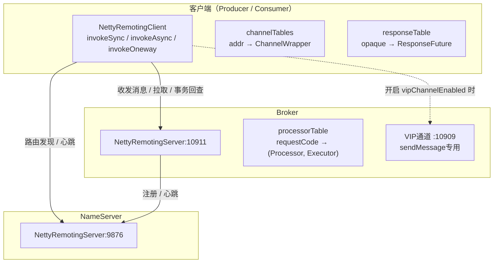
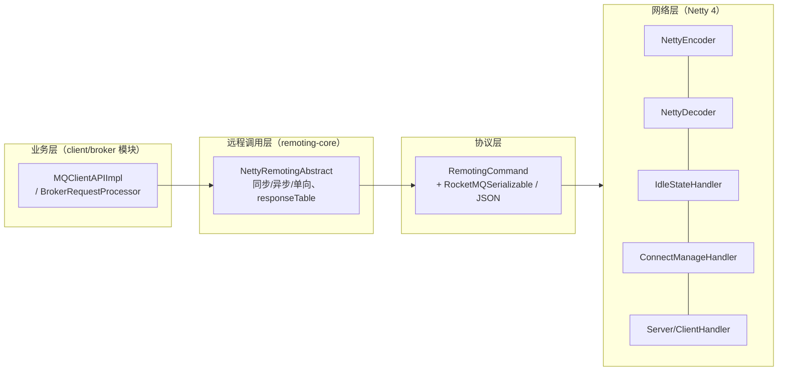
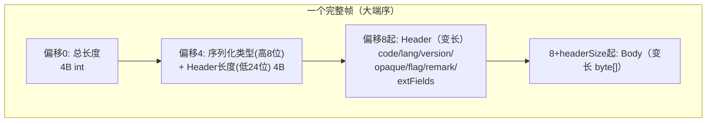
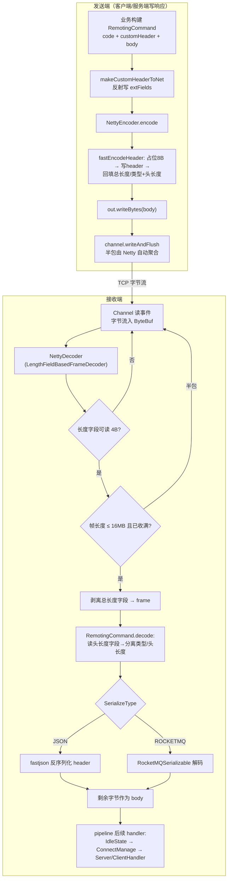
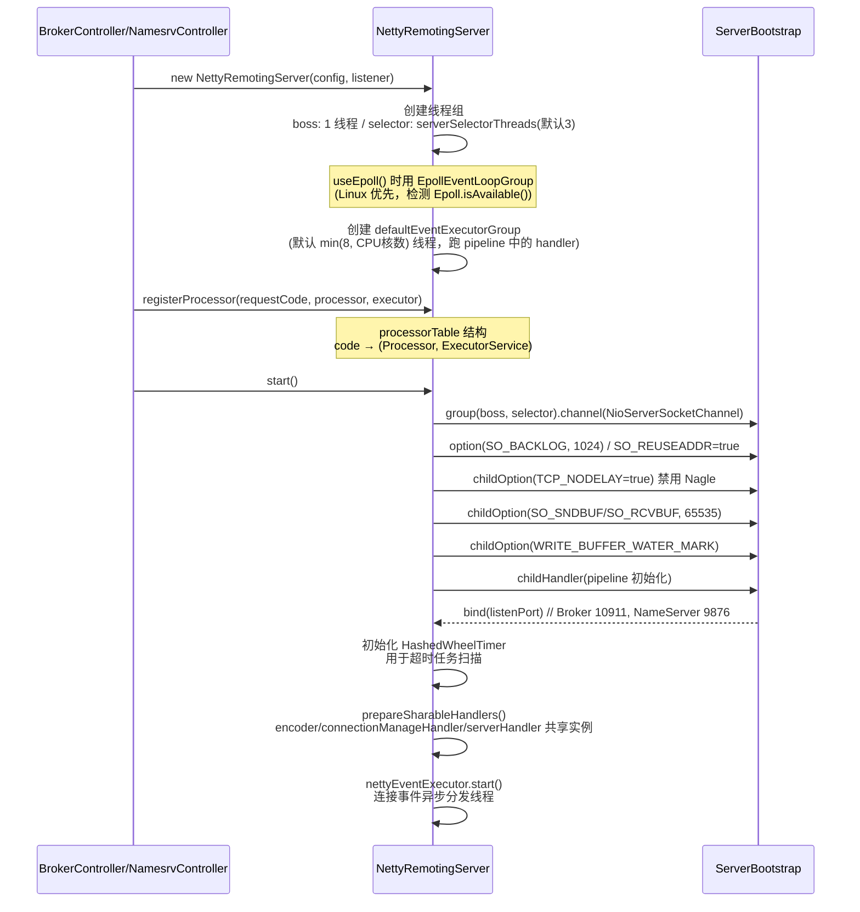
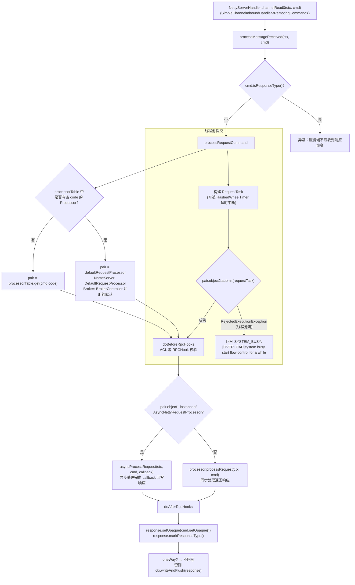
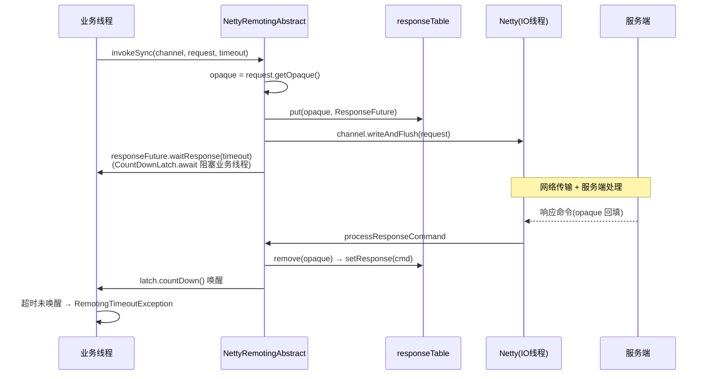
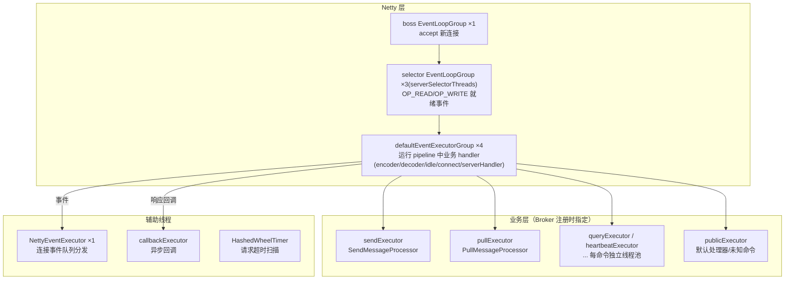

# RocketMQ Remoting 网络通信模块深度分析（4.9.8）

> 基于 RocketMQ 4.9.8 源码，剖析 remoting 模块的网络架构、私有通信协议、同步/异步/单向调用流程与编解码实现。
> 所有结论均标注源码位置：`文件路径:行号`。

---

## 目录

1. [总体网络架构](#1-总体网络架构)
2. [通信协议设计](#2-通信协议设计)
3. [编解码过程](#3-编解码过程)
4. [服务端启动与请求处理流程](#4-服务端启动与请求处理流程)
5. [客户端连接与调用流程](#5-客户端连接与调用流程)
6. [线程模型](#6-线程模型)
7. [扩展机制（Hook / 事件监听 / TLS）](#7-扩展机制)
8. [关键配置汇总](#8-关键配置汇总)

---

## 1. 总体网络架构

RocketMQ 所有网络交互（Producer/Consumer ↔ Broker、Client ↔ NameServer、Broker ↔ NameServer、Broker ↔ Broker）都基于 remoting 模块的自定义协议栈，底层是 **Netty 4 NIO + 主从 Reactor 线程模型**。



模块分层：



**协议设计要点**：NameServer、Broker、Client 三端使用同一套 `RemotingCommand` 协议，通过 `code`（RequestCode/ResponseCode）区分不同命令，通过 `opaque`（自增请求 ID）关联请求与响应——客户端不需要为每个请求单独建连，**单连接上可并发乱序收发**。

---

## 2. 通信协议设计

### 2.1 RemotingCommand：协议的统一抽象

`remoting/.../protocol/RemotingCommand.java` 核心字段：

| 字段 | 类型 | 作用 |
|---|---|---|
| `code` | int | 请求码/响应码（如 `SEND_MESSAGE=10`、`PULL_MESSAGE=11`） |
| `language` | LanguageCode | 客户端语言（JAVA/CPP/GO...） |
| `version` | short | 协议版本 |
| `opaque` | int | 请求唯一 ID，`AtomicInteger requestId` 自增（响应中回填同值） |
| `flag` | int | 标志位：bit0=RPC_TYPE（0 请求/1 响应），bit1=RPC_ONEWAY |
| `remark` | String | 备注/错误信息 |
| `extFields` | HashMap | 扩展字段（**业务参数的实际载体**，如 topic/queueId） |
| `customHeader` | CommandCustomHeader | 自定义头（发送前 `makeCustomHeaderToNet` 展开进 extFields） |
| `body` | byte[] | 消息体（消息内容/批量拉取结果，走零拷贝区） |

flag 位操作：

```java
// RemotingCommand.java
private static final int RPC_TYPE = 0;    // bit0: 0=请求, 1=响应
private static final int RPC_ONEWAY = 1;  // bit1: 1=单向调用

public void markResponseType()  { this.flag |= (1 << RPC_TYPE); }
public void markOnewayRPC()     { this.flag |= (1 << RPC_ONEWAY); }
public boolean isOnewayRPC()    { return (this.flag & (1 << RPC_ONEWAY)) == (1 << RPC_ONEWAY); }
public boolean isResponseType() { return (this.flag & (1 << RPC_TYPE)) == (1 << RPC_TYPE); }
```

### 2.2 帧格式（线上字节布局）



- **前 4 字节**：`总长度 = 4(自身) + 4(头长度字段) + header长度 + body长度`（不含长度字段自身时为 `4 + headerSize + bodySize`，见 `fastEncodeHeader` 回填逻辑）
- **第 4-8 字节**：高 8 位是 `SerializeType` 编码，低 24 位是 header 长度：

```java
// RemotingCommand.java
public static int markProtocolType(int source, SerializeType type) {
    return (type.getCode() << 24) | (source & 0x00FFFFFF);
}
```

> 意义：解码端**先读到序列化类型**，才能决定用 JSON 还是 RocketMQ 私有二进制格式解析 Header。

### 2.3 两种序列化方式（SerializeType）

```java
// remoting/.../protocol/SerializeType.java
JSON((byte) 0), ROCKETMQ((byte) 1);
```

- **JSON**（默认）：Header 用 fastjson 序列化 `RemotingCommand`（不含 body/transient 字段），可读性好、跨语言容易；
- **ROCKETMQ**：`RocketMQSerializable.rocketMQProtocolEncode` 私有二进制协议，性能更高；
- 默认值由系统属性 `rocketmq.serialize.type` / 环境变量 `ROCKETMQ_SERIALIZE_TYPE` 决定，缺省 JSON（`RemotingCommand` 静态块）。

### 2.4 RocketMQSerializable 私有二进制编码

`remoting/.../protocol/RocketMQSerializable.java:59-92`，Header 内字段按序编码：

| 字段 | 编码 |
|---|---|
| code | `writeShort` 2B |
| language | `writeByte` 1B |
| version | `writeShort` 2B |
| opaque | `writeInt` 4B |
| flag | `writeInt` 4B |
| remark | 先 `writeInt(len)`，再 UTF-8 字节（len=0 表示 null） |
| extFields 数量 | `writeInt(占位)`，回填 `mapLen` |
| 每个键值对 | key：`writeShort(len)+UTF8`；value：`writeInt(len)+UTF8` |

解码侧 `rocketMQProtocolDecode` 严格按此顺序读回，并做 **SOF（越界/字段异常）保护**：任一字段长度非法即抛异常断开连接，防止恶意包导致 OOM。

---

## 3. 编解码过程

### 3.1 编码：NettyEncoder → fastEncodeHeader

```java
// remoting/.../netty/NettyEncoder.java
protected void encode(ChannelHandlerContext ctx, RemotingCommand remotingCommand, ByteBuf out) {
    try {
        remotingCommand.fastEncodeHeader(out);   // 写 长度字段 + header
        byte[] body = remotingCommand.getBody();
        if (body != null) {
            out.writeBytes(body);                // 直接追加消息体字节
        }
    } catch (Exception e) {
        log.error("encode exception", e);
        RemotingUtil.closeChannel(ctx.channel());
    }
}
```

`RemotingCommand#fastEncodeHeader` 的"**先占位后回填**"技巧：

```java
// RemotingCommand.java
public void fastEncodeHeader(ByteBuf out) {
    int bodySize = this.body != null ? this.body.length : 0;
    int beginIndex = out.writerIndex();
    out.writeLong(0);                                  // ① 占位 8B（总长度4B + 头长度4B）

    int headerSize;
    if (SerializeType.ROCKETMQ == serializeTypeCurrentRPC) {
        headerSize = RocketMQSerializable.rocketMQProtocolEncode(this, out);  // ②a 私有二进制
    } else {
        byte[] header = RemotingSerializable.encode(this);  // ②b fastjson
        headerSize = header.length;
        out.writeBytes(header);
    }
    out.setInt(beginIndex, 4 + headerSize + bodySize);              // ③ 回填总长度
    out.setInt(beginIndex + 4, markProtocolType(headerSize, serializeTypeCurrentRPC)); // ④ 回填类型+头长度
}
```

> 发送前业务层还会调用 `makeCustomHeaderToNet()`（在 `NettyRemotingAbstract#invokeSyncImpl` 等入口前由 `MQClientAPIImpl` 调用），把 `CommandCustomHeader`（如 `SendMessageRequestHeader`）逐字段反射写入 `extFields`。

### 3.2 解码：NettyDecoder（LengthFieldBasedFrameDecoder）

```java
// remoting/.../netty/NettyDecoder.java:28-57
public class NettyDecoder extends LengthFieldBasedFrameDecoder {
    private static final int FRAME_MAX_LENGTH =
        Integer.parseInt(System.getProperty("com.rocketmq.remoting.frameMaxLength", "16777216")); // 16MB

    public NettyDecoder() {
        super(FRAME_MAX_LENGTH, 0, 4, 0, 4);
        // maxFrameLength=16MB, lengthFieldOffset=0, lengthFieldLength=4,
        // lengthAdjustment=0, initialBytesToStrip=4(剥离总长度字段)
    }

    @Override
    public Object decode(ChannelHandlerContext ctx, ByteBuf in) throws Exception {
        ByteBuf frame = null;
        try {
            frame = (ByteBuf) super.decode(ctx, in);   // ① 按长度字段切帧（解决TCP粘包/半包）
            if (null == frame) return null;            //    半包时返回 null，等更多字节
            return RemotingCommand.decode(frame);      // ② 帧字节 → RemotingCommand
        } catch (Exception e) {
            log.error("decode exception, " + RemotingHelper.parseChannelRemoteAddr(ctx.channel()), e);
            RemotingUtil.closeChannel(ctx.channel());  // ③ 解码异常直接断连（防恶意包）
        } finally {
            if (null != frame) {
                frame.release();                       // ④ 释放帧内存（RemotingCommand.decode 内部 retain 了切片）
            }
        }
        return null;
    }
}
```

### 3.3 RemotingCommand.decode：帧 → 命令对象

```java
// RemotingCommand.java
public static RemotingCommand decode(final ByteBuf frame) {
    int length = frame.readableBytes();
    int oriHeaderLen = frame.readInt();                       // 读 4B 头长度字段
    int headerLength = getHeaderLength(oriHeaderLen);         // 取低 24 位
    byte protocolType = (byte) ((oriHeaderLen >> 24) & 0xFF); // 取高 8 位序列化类型

    RemotingCommand cmd;
    switch (SerializeType.valueOf(protocolType)) {
        case JSON:   // ③a fastjson 反序列化
            byte[] headerData = new byte[headerLength];
            frame.readBytes(headerData);
            cmd = RemotingSerializable.decode(headerData, RemotingCommand.class);
            break;
        case ROCKETMQ:  // ③b 私有二进制反序列化
            cmd = RocketMQSerializable.decode(frame);
            break;
        default:
            throw new RemotingCommandException("Unknown protocol type...");
    }
    cmd.setSerializeType(serializeType);
    int bodyLength = length - 4 - headerLength;               // ④ 剩余即 body
    if (bodyLength > 0) {
        byte[] bodyData = new byte[bodyLength];
        frame.readBytes(bodyData);                            //   拷贝到堆内 byte[]
        cmd.setBody(bodyData);
    }
    return cmd;
}
```

### 3.4 编解码全流程图



### 3.5 零拷贝（发送侧优化）

解码得到的 body 是堆内拷贝；但 **Broker 拉取消息返回时**，`PullMessageProcessor` 使用 `FileRegion`（`DefaultFileRegion`，基于 `transferTo`）把 CommitLog 文件内容直接从页缓存写入 Socket Channel（见 `PullMessageProcessor#processRequest` 中 `ManyMessageTransfer`/`writeAndFlush(fileRegion)` 分支），**绕开用户空间拷贝**，这是拉取高性能的关键之一（maxMsgNums≤1 且非批量时走该路径）。

---

## 4. 服务端启动与请求处理流程

### 4.1 NettyRemotingServer.start()



pipeline 组成（`NettyRemotingServer#initChannel`）：

```java
ch.pipeline()
    .addLast(defaultEventExecutorGroup, HANDSHAKE_HANDLER_NAME, handshakeHandler) // TLS 握手探测
    .addLast(defaultEventExecutorGroup,
        encoder,                                                   // NettyEncoder
        new NettyDecoder(),                                        // NettyDecoder
        new IdleStateHandler(0, 0, serverChannelMaxIdleTimeSeconds), // 默认120s
        connectionManageHandler,                                   // 连接/空闲事件
        serverHandler);                                            // NettyServerHandler
```

### 4.2 请求处理流程（channelRead0 → processRequestCommand）



要点：

- **请求与处理器解耦**：每个 RequestCode 绑定专属线程池（如 `SendMessageProcessor` → `sendExecutor`、`PullMessageProcessor` → `pullExecutor`，见 `BrokerController#registerProcessor`），**不同命令类型之间不互相阻塞**——这是"读写队列隔离 + 命令级隔离"的核心；
- **过载保护三层**：
  1. 线程池 `RejectedExecutionException` → 返回 `SYSTEM_BUSY`；
  2. `RequestTask` 被 `HashedWheelTimer`（服务端构造时创建）超时检测，超时任务 `cancel` 并回写 `SYSTEM_BUSY`，避免队列积压拖垮；
  3. 写缓冲高/低水位（`WRITE_BUFFER_WATER_MARK`），`isChannelWritable()` 判断，详见客户端章节。

### 4.3 连接事件处理

`NettyConnectManageHandler`（服务端/客户端共用逻辑）拦截 channel 生命周期事件，转成 `NettyEvent` 投入队列，由 **NettyEventExecutor** 单线程异步分发：

```java
// eventQueue 上限 10000，超过丢弃
// NettyEventExecutor.run(): 逐个调用 ChannelEventListener
CONNECT  → listener.onChannelConnect(...)
CLOSE    → listener.onChannelClose(...)
EXCEPTION→ listener.onChannelException(...)
IDLE     → listener.onChannelIdle(...)   // 服务端 120s 空闲主动关闭
```

Broker 侧的监听器是 `BrokerController#channelEventListener` → `ClientHousekeepingService`：客户端断连后清空 `ProducerManager/ConsumerManager` 注册信息（生产者/消费者下线感知即由此驱动）。

---

## 5. 客户端连接与调用流程

### 5.1 启动与连接管理

```java
// NettyRemotingClient#start()
this.eventLoopGroupWorker = new NioEventLoopGroup(1, ...);       // 单线程 IO
this.defaultEventExecutorGroup = new DefaultEventLoopGroup(clientWorkerThreads, ...);

Bootstrap handler = this.bootstrap.group(this.eventLoopGroupWorker)
    .channel(NioSocketChannel.class)
    .option(TCP_NODELAY, true)
    .option(SO_KEEPALIVE, false)
    .option(CONNECT_TIMEOUT_MILLIS, connectTimeoutMillis)        // 默认 3000ms
    .handler(new ChannelInitializer<SocketChannel>() {
        protected void initChannel(SocketChannel ch) {
            if (nettyClientConfig.isUseTLS()) {                   // 可选 SSL
                pipeline.addFirst("sslHandler", sslContext.newHandler(ch.alloc()));
            }
            pipeline.addLast(defaultEventExecutorGroup,
                new NettyEncoder(), new NettyDecoder(),
                new IdleStateHandler(0, 0, clientChannelMaxIdleTimeSeconds),
                new NettyConnectManageHandler(), new NettyClientHandler());
        }
    });
```

通道管理：

- `channelTables`（`ConcurrentHashMap<addr, ChannelWrapper>`）缓存连接；NameServer 通道与 Broker 通道分开管理（`getAndCreateNameserverChannel` / `getAndCreateChannel`）；
- `createChannel`：`bootstrap.connect()` 后 `channelFuture.awaitUninterruptibly(connectTimeoutMillis)`，成功返回 Channel；
- `closeChannel`：连接失活/空闲时清理 `channelTables`；
- 客户端不主动发心跳包，靠 30s 级别的心跳请求（心跳本身就是一次 `RemotingCommand` 通信）+ `IdleStateHandler` 空闲关闭（默认 120s）。

### 5.2 三种调用方式（NettyRemotingAbstract）

#### invokeSyncImpl（同步）



关键代码（`NettyRemotingAbstract#invokeSyncImpl`）：

```java
final ResponseFuture responseFuture =
    new ResponseFuture(channel, opaque, timeoutMillis, null, null);
this.responseTable.put(opaque, responseFuture);

channel.writeAndFlush(request).addListener(f -> {           // 发送失败兜底
    if (f.isSuccess()) { responseFuture.setSendRequestOK(true); return; }
    responseTable.remove(opaque);
    responseFuture.setCause(f.cause());
    responseFuture.putResponse(null);                      // 提前唤醒
});

RemotingCommand responseCommand = responseFuture.waitResponse(timeoutMillis);
if (null == responseCommand) {
    if (responseFuture.isSendRequestOK()) throw new RemotingTimeoutException(...); // 发出但没回
    else throw new RemotingTooMuchRequestException("send a request command failed");
}
return responseCommand;
```

#### invokeAsyncImpl（异步）

```java
// ① 信号量限流（客户端默认 65535，服务端 64）
boolean acquired = this.semaphoreAsync.tryAcquire(timeoutMillis, MILLISECONDS);
if (!acquired) throw new RemotingTooMuchRequestException("invokeAsyncImpl invoke too fast");

// ② 注册带回调的 ResponseFuture，超时时间扣除排队耗时
final ResponseFuture responseFuture =
    new ResponseFuture(channel, opaque, timeoutMillis - costTime, invokeCallback, once /*释放信号量句柄*/);
this.responseTable.put(opaque, responseFuture);

// ③ 发送；失败走 requestFail(opaque) 立刻回调
channel.writeAndFlush(request).addListener(f -> { if (!f.isSuccess()) requestFail(opaque); });
```

响应到达时 `processResponseCommand` → `executeInvokeCallback`（优先 `callbackExecutor`，提交失败则**降级在 IO 线程直接执行**回调）。

#### invokeOnewayImpl（单向）

```java
request.markOnewayRPC();                                   // flag 置位
boolean acquired = this.semaphoreOneway.tryAcquire(timeoutMillis, MILLISECONDS); // 客户端默认65535/服务端256
if (!acquired) throw new RemotingTooMuchRequestException("invokeOnewayImpl invoke too fast");
channel.writeAndFlush(request).addListener(f -> {
    once.release();                                        // 发送完成即释放信号量
    if (!f.isSuccess()) log.warn("send a request command to channel failed.");
});
```

不注册 responseTable、不等待响应。典型场景：Broker 上报消费进度、心跳。

### 5.3 超时扫描：scanResponseTable

`NettyRemotingAbstract` 用 **HashedWheelTimer** 注册定时任务（构造于 `NettyRemotingServer/Client#start`）：

```java
// NettyRemotingAbstract#scanResponseTable
// 遍历 responseTable，满足 beginTimestamp + timeoutMillis + 1000 <= now 的条目：
//   release()(释放信号量) + it.remove() + executeInvokeCallback(触发超时回调)
```

- 这是**客户端异步调用超时兜底**：即使响应永不回来，ResponseFuture 也会被扫描线程清理并回调 `onException`，防止内存泄漏；
- 预留 1s 冗余，避免与正常回包竞争。

### 5.4 客户端与服务端流控对比

| | 客户端 | 服务端 |
|---|---|---|
| async 信号量 | 65535 | 64 |
| oneway 信号量 | 65535 | 256 |
| 作用 | 防止本进程发送过快 | 防止单个连接压垮 Broker |

服务端信号量极小（64/256）是刻意设计：**响应写回也占用服务端资源，必须小口径限流**，超限即 `RemotingTooMuchRequestException`。

---

## 6. 线程模型

### 6.1 服务端线程全景



### 6.2 IO 线程 vs 业务线程的分工

- **channelRead0 在 defaultEventExecutorGroup（或 selector 线程，取决于 addLast 传参）触发**，方法内**只做解码结果的分发**，立即把业务处理提交到 processor 专属线程池，**绝不阻塞 IO 线程**；
- 直接在 IO 线程执行的情况：
  1. 线程池 `submit` 被拒绝（RejectedExecutionException）→ 在调用线程回写 `SYSTEM_BUSY`；
  2. `executeInvokeCallback` 向 `callbackExecutor` 提交失败 → 降级在当前 IO 线程执行回调；
  3. 连接事件本身（NettyEventExecutor 消费）。
- 解码在 pipeline 中完成（`NettyDecoder`），**解码也占用 defaultEventExecutorGroup 线程**，与 handler 共用一个执行器组——这也是编解码必须轻量的原因（body 采取"直接引用/零拷贝"策略，见 3.5）。

---

## 7. 扩展机制

### 7.1 RPCHook（ACL 权限校验的挂载点）

```java
// remoting/.../RPCHook.java
public interface RPCHook {
    void doBeforeRequest(String remoteAddr, RemotingCommand request);
    void doAfterResponse(String remoteAddr, RemotingCommand request, RemotingCommand response);
}
```

调用点在 `NettyRemotingAbstract#doBeforeRpcHooks / doAfterRpcHooks`（processRequestCommand/run 任务的收尾处，见 4.2 流程图）。ACL 模块的 `AclRPCHook` 即由此注入：发送前签名（`doBeforeRequest` 在客户端侧）、服务端处理前校验。

### 7.2 ChannelEventListener

见 4.3。接口：`onChannelConnect/Close/Exception/Idle`。客户端侧 `ClientRemotingProcessor` 也借此处理 NameServer 断连后的重连。

### 7.3 TLS/SSL

- `TlsSystemConfig`（`tls.enable` 等系统属性）+ `TlsHelper#buildSslContext`（加载证书/口令）；
- 服务端 pipeline 的 **handshakeHandler**（`HandshakeHandler`，addFirst）根据首字节探测 TLS ClientHello，动态替换为 SslHandler；
- 客户端 `nettyClientConfig.isUseTLS()` 时 `addFirst("sslHandler", ...)`。

---

## 8. 关键配置汇总

### NettyServerConfig（默认值）

| 配置 | 默认 | 说明 |
|---|---|---|
| listenPort | 8888（Broker 覆写为 10911） | 监听端口 |
| serverWorkerThreads | 8 | defaultEventExecutorGroup 大小基准 |
| serverSelectorThreads | 3 | Reactor selector 线程数 |
| serverCallbackExecutorThreads | 0（实际用 publicExecutor 4） | 回调线程 |
| serverOnewaySemaphoreValue | 256 | 服务端 oneway 并发上限 |
| serverAsyncSemaphoreValue | 64 | 服务端 async 并发上限 |
| serverChannelMaxIdleTimeSeconds | 120 | 连接空闲关闭时间 |
| serverSocketBacklog | 1024 | TCP backlog |
| useEpollNativeSelector | false | Linux 下建议 true |

### NettyClientConfig（默认值）

| 配置 | 默认 | 说明 |
|---|---|---|
| clientWorkerThreads | 4 | defaultEventExecutorGroup |
| clientCallbackExecutorThreads | CPU 核数 | 回调线程池 |
| clientOnewaySemaphoreValue / clientAsyncSemaphoreValue | 65535 / 65535 | 发送侧流控 |
| connectTimeoutMillis | 3000 | 建连超时 |
| clientChannelMaxIdleTimeSeconds | 120 | 空闲关闭 |
| useTLS | false | SSL |
| vipChannelEnabled | false | VIP 通道（发送走 10909=listenPort-2） |

### 系统属性

| 属性 | 默认 | 说明 |
|---|---|---|
| `com.rocketmq.remoting.frameMaxLength` | 16777216 | 单帧最大 16MB（消息大小上限的协议层约束） |
| `rocketmq.serialize.type` / `ROCKETMQ_SERIALIZE_TYPE` | JSON | Header 序列化类型 |

---

## 附：关键源码文件索引

| 职责 | 文件（remoting/src/main/java/org/apache/rocketmq/remoting/） |
|---|---|
| 命令对象/协议 | `protocol/RemotingCommand.java` |
| 私有二进制序列化 | `protocol/RocketMQSerializable.java` |
| 序列化类型 | `protocol/SerializeType.java` |
| 编码器 | `netty/NettyEncoder.java` |
| 解码器 | `netty/NettyDecoder.java` |
| 服务端 | `netty/NettyRemotingServer.java` |
| 客户端 | `netty/NettyRemotingClient.java` |
| 调用核心（sync/async/oneway、responseTable） | `netty/NettyRemotingAbstract.java` |
| 响应 Future | `netty/ResponseFuture.java` |
| 连接事件分发 | `netty/NettyEventExecutor.java`、`netty/NettyConnectManageHandler.java` |
| 服务端配置 | `netty/NettyServerConfig.java` |
| 客户端配置 | `netty/NettyClientConfig.java` |
| TLS | `netty/TlsHelper.java`、`netty/TlsSystemConfig.java` |
| RPC 钩子 | `RPCHook.java` |
| 零拷贝使用方（broker 模块） | `broker/.../processor/PullMessageProcessor.java`、`broker/.../pagecache/ManyMessageTransfer.java` |
