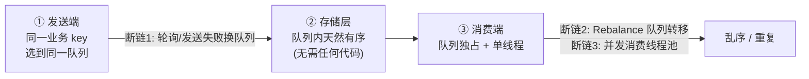
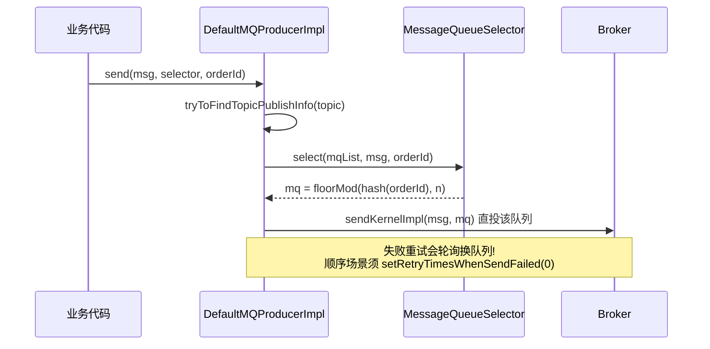
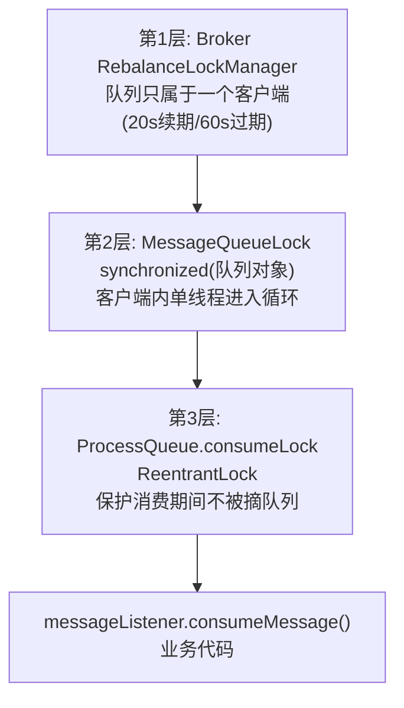
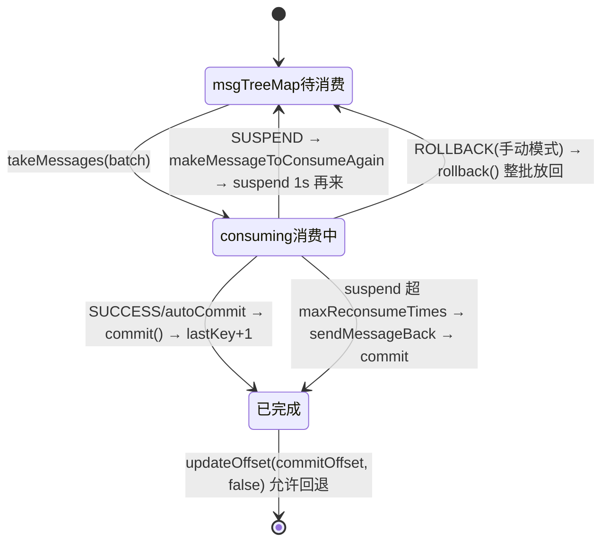
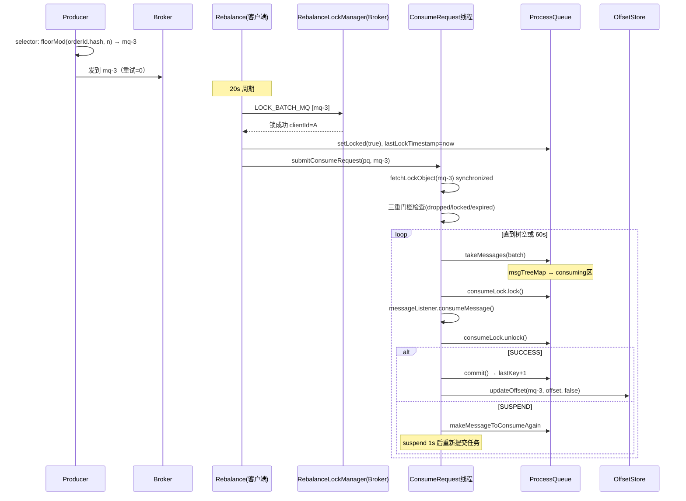

# RocketMQ 顺序消息端到端源码深度分析

> 基于 RocketMQ 4.9.8 源码，精读顺序消息从**发送端队列选择**到**消费端三层锁**的全链路，彻底回答"RocketMQ 怎么保证局部有序、为什么顺序消息这么容易乱序/卡住"。

---

## 一、先定义清楚：RocketMQ 保证的是什么"顺序"

RocketMQ **只保证局部有序（分区内有序）**，不保证全局有序：

- **同一 MessageQueue 内**：消息按写入顺序存储（单个 CommitLog + ConsumeQueue 有序追加），天然有序。
- **同一队列只被一个消费者消费、且单线程消费**：消费顺序 = 存储顺序。
- **跨队列**：完全不保证。

全局有序的极端做法：Topic 只建 1 个队列——吞吐塌方，没人这么用。

**端到端三大环节，任何一环断链即乱序：**



所以 RocketMQ 的顺序方案 = **发送端 MessageQueueSelector + Broker 独占锁 + 消费端本地锁 + 单线程循环消费**。下面逐环节精读。

---

## 二、发送端：MessageQueueSelector 与 sendSelectImpl

用户代码的标准写法：

```java
producer.send(msg, (mqs, message, arg) -> {
    long index = Math.abs(arg.hashCode()) % mqs.size();   // 同一 orderId 恒选同一队列
    return mqs.get((int) index);
}, orderId);
```

`DefaultMQProducerImpl.sendSelectImpl`（`DefaultMQProducerImpl.java:1115-1154`）：

```java
private SendResult sendSelectImpl(Message msg, MessageQueueSelector selector, Object arg, ...) {
    ...
    TopicPublishInfo topicPublishInfo = this.tryToFindTopicPublishInfo(msg.getTopic());
    if (topicPublishInfo != null && topicPublishInfo.ok()) {
        MessageQueue mq = null;
        try {
            List<MessageQueue> messageQueueList =
                mQClientFactory.getMQAdminImpl().parsePublishMessageQueues(topicPublishInfo.getMessageQueueList());
            ...
            mq = mQClientFactory.getClientConfig().queueWithNamespace(
                selector.select(messageQueueList, userMessage, arg));   // 用户全权决定队列
        } catch (Throwable e) {
            throw new MQClientException("select message queue threw exception.", e);
        }
        if (mq != null) {
            return this.sendKernelImpl(msg, mq, communicationMode, sendCallback, null, timeout - costTime);
        }
        ...
    }
}
```

三个关键认知：

1. **队列选择完全交给用户**：Broker 没有任何"顺序"概念，消息是否进同一队列 100% 取决于 selector。`Math.abs(hash) % size` 有个著名坑——`Integer.MIN_VALUE` 的 `Math.abs` 仍为负，会抛数组越界。稳妥写法：`Math.floorMod(arg.hashCode(), mqs.size())`。

2. **发送失败重试会换 Broker**：`sendKernelImpl` 的重试逻辑（默认 retryTimesWhenSendFailed=2）基于轮询挑选下一个队列。同一条消息第 1 次发到队列 A 失败、重试发到队列 B 成功——**消息顺序立刻断裂**。所以顺序场景必须：
   - `producer.setRetryTimesWhenSendFailed(0)` 关闭自动换队列重试，失败由业务自己处理（重发或告警）；
   - 或接受"失败即中断，由消费端幂等/对账兜底"。

3. **扩缩队列数会打散映射**：`hash % size`，size 从 8 变 16，所有 key 的目标队列重新洗牌——变更窗口内新旧消息可能分进不同队列。**顺序 Topic 的读写队列数应一开始定足，不做在线扩缩**。

发送时序：



---

## 三、消费端第一层锁：Broker 队列独占锁（分布式锁）

并发消费下，同一队列可能被 Rebalance 分给两个客户端（重叠窗口）；顺序消费要求**一个队列同一时刻只被一个客户端消费**。

### 锁的获取：lockAll（Rebalance 篇已述，这里串进顺序语义）

`ConsumeMessageOrderlyService.start()`（`ConsumeMessageOrderlyService.java:95-108`）：

```java
public void start() {
    if (MessageModel.CLUSTERING.equals(...messageModel())) {
        this.scheduledExecutorService.scheduleAtFixedRate(new Runnable() {
            @Override
            public void run() {
                ConsumeMessageOrderlyService.this.lockMQPeriodically();
            }
        }, 1000 * 1, ProcessQueue.REBALANCE_LOCK_INTERVAL, TimeUnit.MILLISECONDS);   // 20s
    }
}
```

集群模式顺序消费启动即注册 **20s 周期锁续期任务**（`REBALANCE_LOCK_INTERVAL=20000`）。链路：

```
lockMQPeriodically() → RebalanceImpl.lockAll()
  → 对每个 broker 打包该客户端全部分配队列
  → LOCK_BATCH_MQ 请求 → Broker RebalanceLockManager.tryLockBatch()
  → 返回成功集合 → processQueue.setLocked(true) + lastLockTimestamp = now
```

Broker 端 `RebalanceLockManager`（见 Rebalance 篇）：`mqLockTable` 记录 `MessageQueue → {clientId, timestamp}`，**锁 60s 过期**（`REBALANCE_LOCK_EXPIRED=60000`），续期就是覆盖 timestamp。

**20s 续期 vs 60s 过期**：安全边际 3 倍。若客户端 GC/网络抖动导致两次续期失败（>60s），锁过期被别的客户端抢走 → 双方同时消费同一队列 → **乱序 + 重复**。这是顺序消息的软肋之一，无法彻底根除，只能靠缩短周期（`-Drocketmq.client.rebalance.lockInterval=...`）缓解。

### 锁的检查：消费前的三重门槛

`ConsumeRequest.run()`（`ConsumeMessageOrderlyService.java:425-461`）：

```java
if (this.processQueue.isDropped()) { break; }                            // 门槛0：队列已被移除

if (MessageModel.CLUSTERING.equals(...)
    && !this.processQueue.isLocked()) {                                  // 门槛1：没有 Broker 锁
    log.warn("the message queue not locked, so consume later, {}", this.messageQueue);
    ConsumeMessageOrderlyService.this.tryLockLaterAndReconsume(this.messageQueue, this.processQueue, 10);
    break;   // 本队列暂停，10ms 后重试抢锁
}

if (MessageModel.CLUSTERING.equals(...)
    && this.processQueue.isLockExpired()) {                              // 门槛2：锁过期（>60s未续期）
    log.warn("the message queue lock expired, so consume later, {}", this.messageQueue);
    ConsumeMessageOrderlyService.this.tryLockLaterAndReconsume(this.messageQueue, this.processQueue, 10);
    break;
}
```

`tryLockLaterAndReconsume`（:224-237）：

```java
public void tryLockLaterAndReconsume(final MessageQueue mq, final ProcessQueue processQueue, final long delayMills) {
    this.scheduledExecutorService.schedule(new Runnable() {
        @Override
        public void run() {
            boolean lockOK = ConsumeMessageOrderlyService.this.lockOneMQ(mq);   // 单队列 LOCK_BATCH_MQ
            if (lockOK) {
                ConsumeMessageOrderlyService.this.submitConsumeRequestLater(processQueue, mq, 10);   // 锁到→10ms 后继续
            } else {
                ConsumeMessageOrderlyService.this.submitConsumeRequestLater(processQueue, mq, 3000); // 锁不到→3s 再试
            }
        }
    }, delayMills, TimeUnit.MILLISECONDS);
}
```

**注意广播模式**（:434-435）：`BROADCASTING || (isLocked() && !isLockExpired())`——广播不需要 Broker 锁（每个消费者都要消费全量），直接放行。

---

## 四、消费端第二层锁：MessageQueueLock 本地队列锁

跨过 Broker 锁检查后，还要抢**本地对象锁**（`ConsumeMessageOrderlyService.java:432-433`）：

```java
final Object objLock = messageQueueLock.fetchLockObject(this.messageQueue);
synchronized (objLock) { ... 整个消费循环体 ... }
```

`MessageQueueLock.java:26-41`：

```java
public class MessageQueueLock {
    private ConcurrentMap<MessageQueue, Object> mqLockTable = new ConcurrentHashMap<MessageQueue, Object>();

    public Object fetchLockObject(final MessageQueue mq) {
        Object objLock = this.mqLockTable.get(mq);
        if (null == objLock) {
            objLock = new Object();
            Object prevLock = this.mqLockTable.putIfAbsent(mq, objLock);
            if (prevLock != null) {
                objLock = prevLock;
            }
        }
        return objLock;
    }
}
```

**为什么有了 Broker 锁还要本地锁？** 因为 `submitConsumeRequest` 可能为同一队列多次提交 ConsumeRequest（拉取回调触发 + suspend 后重提交），线程池里可能有**两个线程同时持有同一队列的任务**。Broker 锁只管"哪个客户端"，不管"客户端里哪个线程"。`synchronized(objLock)` 保证同一队列的消费循环同一时刻只有一个线程在跑——这就是类注释"strictly ensure the single queue only one thread at a time consuming"的含义。

与并发消费最大的结构差异也在这里：**并发消费** `submitConsumeRequest` 一次提交一批消息各自为政；**顺序消费**（:206-216）只提交一个`(processQueue, messageQueue)` 任务，循环内自己 `takeMessages` 取——任务是队列级，不是消息级。

---

## 五、消费主体：单线程循环 + 第三层 consumeLock

`ConsumeRequest.run()` 核心循环（`ConsumeMessageOrderlyService.java:437-557`），精简后骨架：

```java
for (boolean continueConsume = true; continueConsume; ) {
    // 门槛0/1/2：dropped / 未锁 / 锁过期 → break（见上节）

    long interval = System.currentTimeMillis() - beginTime;
    if (interval > MAX_TIME_CONSUME_CONTINUOUSLY) {              // 默认 60s 强制让位
        ConsumeMessageOrderlyService.this.submitConsumeRequestLater(processQueue, messageQueue, 10);
        break;
    }

    final int consumeBatchSize = ...getConsumeMessageBatchMaxSize();
    List<MessageExt> msgs = this.processQueue.takeMessages(consumeBatchSize);   // ① 从树头取一批
    defaultMQPushConsumerImpl.resetRetryAndNamespace(msgs, ...);               // 还原 retry topic

    if (!msgs.isEmpty()) {
        ...
        try {
            this.processQueue.getConsumeLock().lock();            // ② 第三层锁！
            if (this.processQueue.isDropped()) { break; }
            status = messageListener.consumeMessage(Collections.unmodifiableList(msgs), context);  // ③ 业务消费
        } catch (Throwable e) {
            hasException = true;
        } finally {
            this.processQueue.getConsumeLock().unlock();
        }

        if (null == status) {
            status = ConsumeOrderlyStatus.SUSPEND_CURRENT_QUEUE_A_MOMENT;      // null 等价于 suspend
        }
        continueConsume = ConsumeMessageOrderlyService.this.processConsumeResult(msgs, status, context, this);  // ④ 处理结果
    } else {
        continueConsume = false;                                  // 树空，本轮结束
    }
}
```

### 三层锁全景



**第三层 consumeLock 是给谁用的？** 不是给消费线程互斥的，是给 **Rebalance 摘队列**用的。`RebalancePushImpl.removeUnnecessaryMessageQueue`（`RebalancePushImpl.java:85-111`）：

```java
public boolean removeUnnecessaryMessageQueue(MessageQueue mq, ProcessQueue pq) {
    this.defaultMQPushConsumerImpl.getOffsetStore().persist(mq);
    this.defaultMQPushConsumerImpl.getOffsetStore().removeOffset(mq);
    if (this.defaultMQPushConsumerImpl.isConsumeOrderly()
        && MessageModel.CLUSTERING.equals(this.defaultMQPushConsumerImpl.messageModel())) {
        try {
            if (pq.getConsumeLock().tryLock(1000, TimeUnit.MILLISECONDS)) {   // 等业务消费完
                try {
                    return this.unlockDelay(mq, pq);     // 有未消费消息→延迟20s再摘，留时间上报位点
                } finally {
                    pq.getConsumeLock().unlock();
                }
            } else {
                log.warn("[WRONG]mq is consuming, so can not unlock it, {}. maybe hanged for a while, ...");
                pq.incTryUnlockTimes();
            }
        } catch (Exception e) { ... }
        return false;    // 摘除失败，下轮再试
    }
    return true;
}
```

死锁防御设计：Rebalance 线程 `tryLock(1000)` **有限等待**，拿不到就放弃（返回 false 下轮重试），绝不死等；消费线程 `lock()` 拿不到时正在消费，业务最长 60s（MAX_TIME_CONSUME_CONTINUOUS）必然释放。摘队列必须在"业务消费完成的间隙"进行——若在消费中途摘掉，已 takeMessages 到 `consumingMsgOrderlyTreeMap` 但未 commit 的消息就悬空了。

### 60s 让位机制（MAX_TIME_CONSUME_CONTINUOUSLY）

`ConsumeMessageOrderlyService.java:57-58`：

```java
private final static long MAX_TIME_CONSUME_CONTINUOUSLY =
    Long.parseLong(System.getProperty("rocketmq.client.maxTimeConsumeContinuously", "60000"));
```

单线程独占队列循环消费超过 60s 强制退出循环、10ms 后重新提交任务。目的：给同队列的 `synchronized(objLock)` 等待者、给 Rebalance 摘队列一个切入窗口，防止某个持续有消息的热队列永久霸占线程。

---

## 六、ProcessQueue 的"消费中"区：双 TreeMap（顺序消费的精髓）

`ProcessQueue.java` 与并发模式的关键差异是第二个 TreeMap：

```java
private final TreeMap<Long, MessageExt> msgTreeMap;                    // 待消费
private final TreeMap<Long, MessageExt> consumingMsgOrderlyTreeMap;    // 已取出、消费中（顺序模式专属）
```

三个操作（`ProcessQueue.java:254-330`）：

```java
// 取一批：从 msgTreeMap 头部移到 consuming 区（:310-330）
public List<MessageExt> takeMessages(final int batchSize) {
    ...
    for (int i = 0; i < batchSize; i++) {
        Map.Entry<Long, MessageExt> entry = this.msgTreeMap.pollFirstEntry();
        if (entry != null) {
            result.add(entry.getValue());
            consumingMsgOrderlyTreeMap.put(entry.getKey(), entry.getValue());  // 挪进"消费中"
        }
    }
}

// 提交：清空 consuming 区，返回 lastKey+1（:268-292）
public long commit() {
    ...
    Long offset = this.consumingMsgOrderlyTreeMap.lastKey();
    ...清空 consuming 区、扣减计数...
    if (offset != null) {
        return offset + 1;
    }
    return -1;
}

// 回滚：consuming 区整体塞回 msgTreeMap 头部（:254-266）
public void rollback() {
    this.msgTreeMap.putAll(this.consumingMsgOrderlyTreeMap);
    this.consumingMsgOrderlyTreeMap.clear();
}

// 重消费：指定的消息从 consuming 区放回 msgTreeMap（:294-308）
public void makeMessageToConsumeAgain(List<MessageExt> msgs) {
    for (MessageExt msg : msgs) {
        this.consumingMsgOrderlyTreeMap.remove(msg.getQueueOffset());
        this.msgTreeMap.put(msg.getQueueOffset(), msg);
    }
}
```

**对比并发模式**（`removeMessage` 直接从树里删、提交 `firstKey()`）：顺序模式把"取出"与"确认"拆成两阶段——消息只有 `commit()` 才算消费完成。**位点提交的是 `consuming 区 lastKey()+1`，且 `updateOffset(..., false)` 允许回退**（`ConsumeMessageOrderlyService.java:338-340`）——因为 rollback 后位点必须能退回去。

---

## 七、processConsumeResult：四种状态与 autoCommit

`ConsumeMessageOrderlyService.java:272-343`，分 autoCommit 两大分支：

```java
if (context.isAutoCommit()) {                    // 默认 true
    switch (status) {
        case COMMIT:
        case ROLLBACK:
            log.warn("the message queue consume result is illegal, we think you want to ack these message {}",
                consumeRequest.getMessageQueue());          // ⚠️ 顺序模式下 COMMIT/ROLLBACK 不被支持，按 ack 处理
        case SUCCESS:
            commitOffset = consumeRequest.getProcessQueue().commit();
            break;
        case SUSPEND_CURRENT_QUEUE_A_MOMENT:
            if (checkReconsumeTimes(msgs)) {
                consumeRequest.getProcessQueue().makeMessageToConsumeAgain(msgs);   // 放回树头
                this.submitConsumeRequestLater(..., context.getSuspendCurrentQueueTimeMillis());  // 本地重试
                continueConsume = false;
            } else {
                commitOffset = consumeRequest.getProcessQueue().commit();   // 超限：放弃，转 DLQ，队列前进
            }
            break;
    }
} else {                                         // 手动提交模式
    case SUCCESS: 只统计，不 commit（等用户 context.commit? 没有——等下一轮 COMMIT）
    case COMMIT:  commitOffset = processQueue.commit();
    case ROLLBACK: processQueue.rollback() + later 重消费
    case SUSPEND_CURRENT_QUEUE_A_MOMENT: 同上但需 checkReconsumeTimes
}
if (commitOffset >= 0 && !consumeRequest.getProcessQueue().isDropped()) {
    this.defaultMQPushConsumerImpl.getOffsetStore().updateOffset(consumeRequest.getMessageQueue(), commitOffset, false);
}
```

四个要点：

1. **autoCommit=true 时 COMMIT/ROLLBACK 无效**：源码明确 warn "illegal, we think you want to ack"——想用 ROLLBACK 回放必须先 `context.setAutoCommit(false)`。
2. **失败 = 本地原地重试（suspend）**，不是 sendMessageBack！挂起默认 1s（`suspendCurrentQueueTimeMillis`），消息 `makeMessageToConsumeAgain` 放回树头，**阻塞整个队列**——顺序语义的必然代价（后面消息必须等它）。
3. **重试上限**（:349-356）：`getMaxReconsumeTimes()` 默认 -1 → **Integer.MAX_VALUE**！即默认顺序消费失败会**无限原地重试、无限阻塞队列**——顺序消息"卡队列"事故的头号来源。必须显式 `setMaxReconsumeTimes(n)`。
4. **超限后才 sendMessageBack**（:358-398 `checkReconsumeTimes` + `sendMessageBack`）：自己构造 retry topic 消息（`delayLevel = 3 + reconsumeTimes`）、走内置 producer 普通发送，发送成功则放行队列前进（commit）；发送失败则继续 suspend 死等。**顺序消息的重试消息会被发到 retry topic 的某个队列、按并发方式消费——从转入 retry topic 那一刻起不再保证顺序**。

### 状态流转图



---

## 八、顺序 vs 并发：全维度对照表

| 维度 | ConsumeMessageConcurrentlyService | ConsumeMessageOrderlyService |
|------|-----------------------------------|------------------------------|
| 任务粒度 | 每批消息一个 ConsumeRequest | 每队列一个 ConsumeRequest，内部循环 |
| 消费并行度 | 线程池并发，多队列多线程，同队列也可多线程 | 三层锁保证单队列串行 |
| Broker 锁 | 无（队列可被重叠消费） | LOCK_BATCH_MQ，20s 续期 / 60s 过期 |
| 失败处理 | sendMessageBack → retry topic，队列不阻塞 | 本地 suspend 原地重试，阻塞队列 |
| 默认重试上限 | 16 次（约 4h46m） | **Integer.MAX_VALUE（无限）** |
| 位点提交 | removeMessage → firstKey，increaseOnly=true | commit → lastKey+1，**increaseOnly=false** |
| TreeMap | 单 msgTreeMap | msgTreeMap + consumingMsgOrderlyTreeMap |
| consumeTimeout 15min 清理 | 有（cleanExpiredMsg 主动转移） | **无**（顺序消息不会因超时被挪走） |
| 摘队列 | 直接摘 | tryLock(consumeLock, 1s) + unlockDelay 延迟 20s |

---

## 九、端到端时序图（正常路径）



---

## 十、陷阱清单（顺序消息事故榜）

| # | 陷阱 | 现象 | 根因 |
|---|------|------|------|
| 1 | **发送失败自动换队列重试** | 偶发乱序 | `sendKernelImpl` 重试轮询换队列；须 `setRetryTimesWhenSendFailed(0)` |
| 2 | **默认无限本地重试** | 队列永久卡死，积压暴涨 | `getMaxReconsumeTimes()` 默认 Integer.MAX_VALUE（:351-352） |
| 3 | **消费逻辑无超时控制** | 锁过期(60s)被抢，双端消费 | 业务消费 > 60s，续期任务被 synchronized 阻塞？不会——续期在独立线程；但长消费会推迟摘队列，误判"卡住" |
| 4 | **suspend 无退避上限意识** | 失败消息 1s 一次打爆下游 | suspendCurrentQueueTimeMillis 固定值，建议设大些（如 30s，上限 30000） |
| 5 | **Topic 扩队列** | 扩容窗口乱序 | `hash % n` 的 n 变化，映射重洗 |
| 6 | **autoCommit 下用 ROLLBACK** | 日志 "illegal, we think you want to ack"，消息被直接确认 | :283-285，需 `context.setAutoCommit(false)` |
| 7 | **Broker 切主/宕机 60s+** | 队列锁失效转移，重叠消费 | 锁在 Broker 内存，不在 NameServer |
| 8 | **顺序消息 + CONSUME_FROM_LAST_OFFSET** | 首 consumer 上线前的消息不消费 | 正常位点语义；顺序场景通常用 FIRST + 从头消费 |
| 9 | **Math.abs(hash) % n 负数越界** | 罕见 ArrayIndexOutOfBoundsException | Integer.MIN_VALUE；用 floorMod |
| 10 | **重试消息进 retry topic 后** | 失败消息与后续消息顺序断裂 | checkReconsumeTimes 超限走 sendMessageBack，本质放弃顺序换吞吐 |

## 十一、运维与调试手册

**mqadmin：**

```bash
# 查看哪个客户端持有队列锁（无直接命令，需查日志）
# Broker 日志关键字
grep "Lock" ${userHome}/logs/rocketmqlogs/broker.log | grep tryLockBatch

# 查看消费进度（顺序消息卡住时 Diff 持续增大）
mqadmin consumerProgress -g orderGroup -n 127.0.0.1:9876

# 强制解锁：deleteConsumerGroup 会顺带清锁
mqadmin deleteConsumerGroup -g orderGroup -c DefaultCluster -n 127.0.0.1:9876
```

**日志关键字（客户端）：**

| 关键字 | 含义 |
|--------|------|
| `the message queue not locked, so consume later` | 没抢到 Broker 锁（Rebalance 竞争或 Broker 刚重启） |
| `the message queue lock expired, so consume later` | **锁续期失败 >60s，乱序风险！查网络/GC** |
| `consumeMessage Orderly return not OK` | 业务返回 SUSPEND/null/异常 |
| `[WRONG]mq is consuming, so can not unlock it` | 摘队列被消费阻塞 1s 以上（可能业务卡死） |
| `the message queue consume result is illegal` | autoCommit 下返回了 COMMIT/ROLLBACK |

**断点路线：**

| 观察目标 | 断点位置 |
|---------|---------|
| 队列选择 | 用户 selector / `DefaultMQProducerImpl.sendSelectImpl:1136` |
| Broker 锁批次 | `RebalanceImpl.lockAll` → `RebalanceLockManager.tryLockBatch` |
| 消费循环入口 | `ConsumeMessageOrderlyService$ConsumeRequest.run:426` |
| 三重门槛 | 同上 :438-455 |
| 取消息/提交 | `ProcessQueue.takeMessages:310` / `commit:268` / `makeMessageToConsumeAgain:294` |
| 失败决策 | `processConsumeResult:272` + `checkReconsumeTimes:358` |
| 摘队列防御 | `RebalancePushImpl.removeUnnecessaryMessageQueue:85` |

## 十二、设计得与失

**得：**
1. 三层锁各管一段：Broker 锁管客户端独占、本地锁管线程独占、consumeLock 管摘队列与消费互斥——职责清晰，缺一不可。
2. 双 TreeMap 两阶段消费 + `updateOffset(false)` 可回退，把"取到→确认"做成事务式语义，suspend/rollback 有底层数据结构支撑。
3. 摘队列的 `tryLock(1s) + 失败下轮重试 + unlockDelay 20s`，用"等待消费间隙"替代"打断消费"，避免消息悬空。
4. 60s 强制让位，防线程霸占。

**失：**
1. Broker 锁是**内存锁、单点、60s 过期**——Broker 抖动/GC/切主的窗口内顺序性无保证（5.x Fence / Pop 顺序消费改善）。
2. 默认无限重试是"能跑"的默认值而非"安全"的默认值，事故向设计。
3. 失败即阻塞整个队列，单条毒消息可拖死整条业务线（并发模式 DLQ 快速跳过 vs 顺序模式死磕）。
4. 重试超限转 retry topic 后顺序即断，"顺序 + 重试"本质上是不完全兼容的需求。

## 十三、一句话总结

> **发送端用户选队列定生死（重试必须关），存储层天然有序不操心；消费端三层锁（Broker 60s 独占 → 本地 synchronized 单线程 → consumeLock 防摘队列）+ 双 TreeMap 两阶段确认，失败原地 suspend 阻塞重试到上限才进 DLQ——顺序的代价是吞吐与可用性，RocketMQ 把选择权（maxReconsumeTimes/suspendTime）留给了你，但默认值未必替你着想。**

---

*上一篇：[RocketMQ消费位点管理源码深度分析](RocketMQ消费位点管理源码深度分析.md) · 下一篇：存储文件恢复与 Broker 启动全景（说"下一篇"继续）*
