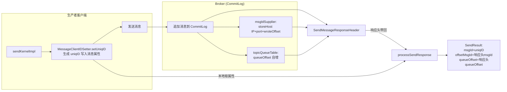
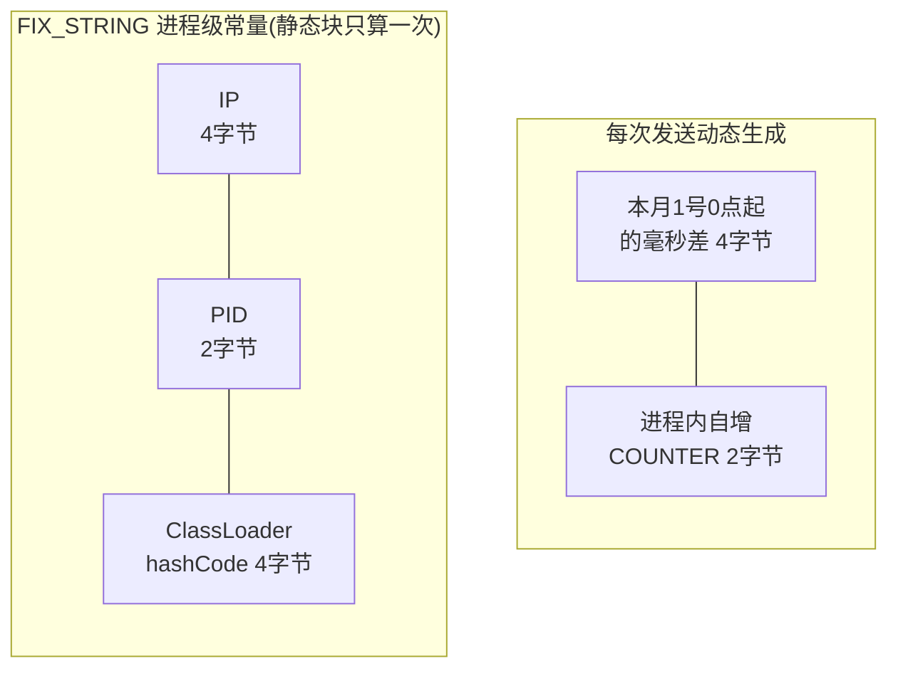
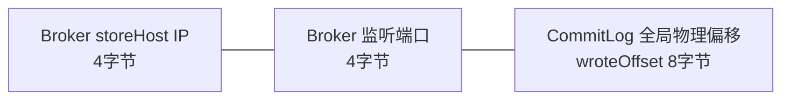
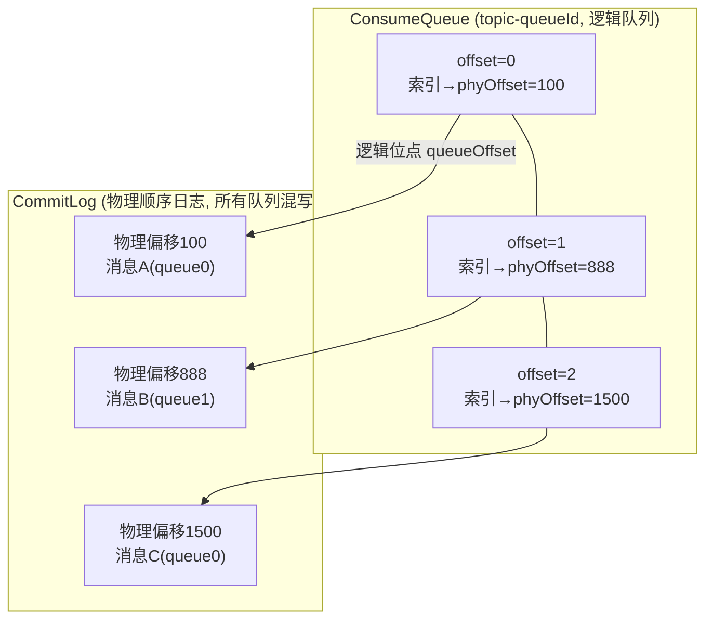
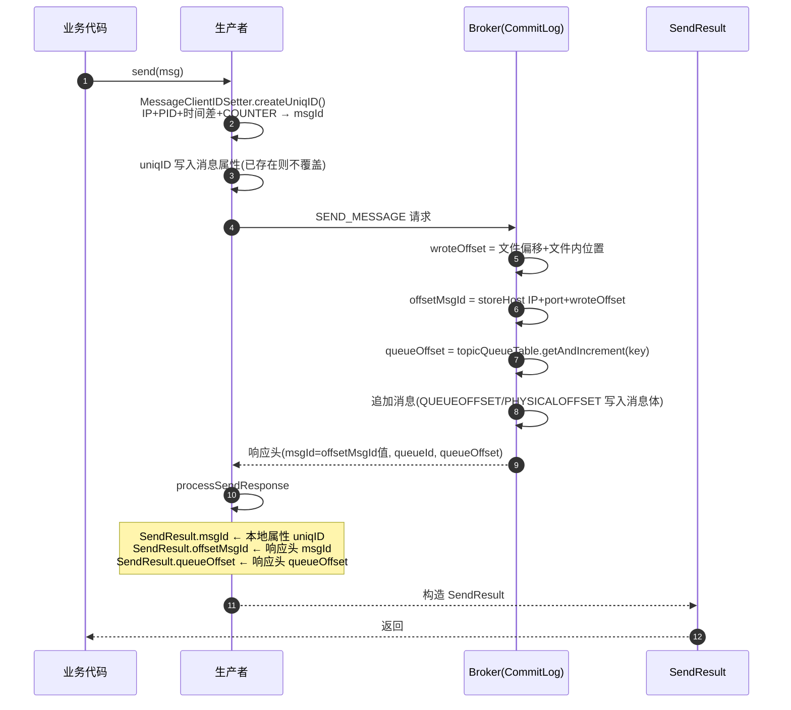

# RocketMQ SendResult 中 msgId、offsetMsgId、queueOffset 详解

> 基于 rocketmq-4.9.8 源码分析。这三个字段各有含义，其中两个 ID 的生成源头完全不同：一个在**客户端**生成，一个在 **Broker 存储层**生成。

---

## 目录

1. [SendResult 结构与字段来源](#1-sendresult-结构与字段来源)
2. [msgId：客户端全局唯一 ID](#2-msgid客户端全局唯一-id)
3. [offsetMsgId：Broker 存储层消息 ID](#3-offsetmsgidbroker-存储层消息-id)
4. [queueOffset：队列内逻辑位点](#4-queueoffset队列内逻辑位点)
5. [三者关系全景图](#5-三者关系全景图)
6. [对比总结与实践建议](#6-对比总结与实践建议)

---

## 1. SendResult 结构与字段来源

### 1.1 SendResult 类定义

`client/src/main/java/org/apache/rocketmq/client/producer/SendResult.java`

```java
public class SendResult {
    private SendStatus sendStatus;      // 发送状态
    private String msgId;               // 客户端生成的全局唯一 ID
    private MessageQueue messageQueue;  // 消息队列(topic, brokerName, queueId)
    private long queueOffset;           // 消息在队列中的位点
    private String transactionId;       // 事务 ID
    private String offsetMsgId;         // broker 存储层生成的消息 ID
    private String regionId;            // 区域 ID
    private boolean traceOn = true;     // 是否开启 trace
}
```

### 1.2 字段填充位置：processSendResponse

生产者收到 Broker 响应后，在 `MQClientAPIImpl.processSendResponse` 中构造 SendResult：

```java
// client/src/main/java/org/apache/rocketmq/client/impl/MQClientAPIImpl.java
SendMessageResponseHeader responseHeader =
    (SendMessageResponseHeader) response.decodeCommandCustomHeader(SendMessageResponseHeader.class);

MessageQueue messageQueue = new MessageQueue(topic, brokerName, responseHeader.getQueueId());

// msgId：来自客户端自己设置的 uniqID 属性
String uniqMsgId = MessageClientIDSetter.getUniqID(msg);
if (msg instanceof MessageBatch) {           // 批量消息：多条 uniqID 逗号拼接
    StringBuilder sb = new StringBuilder();
    for (Message message : (MessageBatch) msg) {
        sb.append(sb.length() == 0 ? "" : ",").append(MessageClientIDSetter.getUniqID(message));
    }
    uniqMsgId = sb.toString();
}

// offsetMsgId / queueId / queueOffset：来自 broker 响应头
SendResult sendResult = new SendResult(sendStatus,
    uniqMsgId,
    responseHeader.getMsgId(), messageQueue, responseHeader.getQueueOffset());
```

### 1.3 字段来源总览



---

## 2. msgId：客户端全局唯一 ID（uniqID）

### 2.1 生成时机

在 `DefaultMQProducerImpl.sendKernelImpl` 中，消息发出**之前**设置：

```java
// 仅单条消息；MessageBatch 不逐条设置
if (!(msg instanceof MessageBatch)) {
    MessageClientIDSetter.setUniqID(msg);
}
```

设置时先检查属性是否已存在，**存在则不覆盖**（MessageClientIDSetter.java）：

```java
public static void setUniqID(final Message msg) {
    if (msg.getProperty(MessageConst.PROPERTY_UNIQ_CLIENT_MESSAGE_ID_KEYIDX) == null) {
        msg.putProperty(MessageConst.PROPERTY_UNIQ_CLIENT_MESSAGE_ID_KEYIDX, createUniqID());
    }
}
```

> 这就是"生产者重试时 msgId 不变"的原因——第一次发送时已经写入属性，后续重试（无论同步重试还是异步回调重试）都不会重新生成。

### 2.2 生成算法：createUniqID

```java
public static String createUniqID() {
    char[] sb = new char[LEN * 2];
    // 1. 拷贝进程级常量前缀：IP + PID + ClassLoader hashCode
    System.arraycopy(FIX_STRING, 0, sb, 0, FIX_STRING.length);
    // 2. 相对当月1号0点的毫秒差（4字节）
    long current = System.currentTimeMillis();
    if (current >= nextStartTime) {
        setStartTime(current);            // 跨月重置时间基准
    }
    int diff = (int)(current - startTime);
    if (diff < 0 && diff > -1000_000) {
        diff = 0;                         // NTP 回拨保护
    }
    int pos = FIX_STRING.length;
    UtilAll.writeInt(sb, pos, diff);
    pos += 8;
    // 3. 进程内自增序号（2字节）
    UtilAll.writeShort(sb, pos, COUNTER.getAndIncrement());
    return new String(sb);
}
```

**字节布局（IPv4 共 16 字节 → 32 个 hex 字符）：**



### 2.3 关键生成规则

| 规则 | 说明 |
|---|---|
| 前缀进程唯一 | 静态块计算 `FIX_STRING`（IP+PID+ClassLoader哈希），同一 JVM 内所有消息共享 |
| 进程内唯一 | `COUNTER` 是 `AtomicInteger`，进程内自增永不重复 |
| 全局唯一 | 不同机器 IP 不同；同机不同进程 PID 不同；同进程靠自增序号 |
| 时间可还原 | `getNearlyTimeFromID(msgID)` 可以从 ID 反解出大致发送时间（相对月初的偏移） |
| IP 可还原 | `getIPStrFromID(msgID)` 可反解出客户端 IP |
| IPv6 差异 | IP 为 16 字节时总长 28 字节 → 56 个 hex 字符 |
| 取不到真实 IP | `createFakeIP()` 用时间戳低 4 字节伪造 |
| 重发不变 | 属性已存在不覆盖；生产者重试、消费者重发回 broker 都保留原值 |

### 2.4 批量消息的 msgId

`MessageBatch` 不逐条设置 uniqID，但在响应处理时会**拼接**每条消息的 uniqID：

```java
// processSendResponse 中
for (Message message : (MessageBatch) msg) {
    sb.append(sb.length() == 0 ? "" : ",").append(MessageClientIDSetter.getUniqID(message));
}
// 结果如: "id1,id2,id3"
```

（注意：批量发送路径中各单条消息的 uniqID 实际由 MessageBatch 的构造/发送链路处理，最终 SendResult.msgId 是逗号拼接形式。）

---

## 3. offsetMsgId：Broker 存储层消息 ID

### 3.1 生成时机

消息**成功追加到 CommitLog 时**，由 `CommitLog.DefaultAppendMessageCallback` 生成，通过 `AppendMessageResult` → `PutMessageResult` → `SendMessageResponseHeader.msgId` 回传给客户端。

### 3.2 生成算法（CommitLog.java 的 msgIdSupplier）

```java
// CommitLog$DefaultAppendMessageCallback.doAppend 内
// PHY OFFSET：消息在 CommitLog 中的全局物理偏移
long wroteOffset = fileFromOffset + byteBuffer.position();

Supplier<String> msgIdSupplier = () -> {
    int sysflag = msgInner.getSysFlag();
    // IPv4: 4+4+8=16字节；IPv6: 16+4+8=28字节
    int msgIdLen = (sysflag & MessageSysFlag.STOREHOSTADDRESS_V6_FLAG) == 0 ? 4 + 4 + 8 : 16 + 4 + 8;
    ByteBuffer msgIdBuffer = ByteBuffer.allocate(msgIdLen);
    MessageExt.socketAddress2ByteBuffer(msgInner.getStoreHost(), msgIdBuffer);
    msgIdBuffer.putLong(msgIdLen - 8, wroteOffset);
    return UtilAll.bytes2string(msgIdBuffer.array());
};
```

等价于 `MessageDecoder.createMessageId`：

```java
public static String createMessageId(final ByteBuffer input, final ByteBuffer addr, final long offset) {
    input.put(addr);        // broker storeHost: IP + port
    input.putLong(offset);  // CommitLog 全局物理偏移
    return UtilAll.bytes2string(input.array());   // 转 hex 字符串
}
```

**字节布局（IPv4 共 16 字节 → 32 个 hex 字符）：**



### 3.3 关键规则

| 规则 | 说明 |
|---|---|
| 与存储位置强绑定 | IP+port+物理偏移，**唯一定位磁盘上的字节序列** |
| O(1) 查询 | Broker 端按 offsetMsgId 查消息时，解析出偏移量直接从 CommitLog 定位读取，无需索引 |
| 主从不同 | 同一消息在 Master 和 Slave 上的 storeHost 不同 → offsetMsgId 不同 |
| 重发会变 | 同一条消息重发会产生新的物理偏移 → 新的 offsetMsgId |
| 消费端对应物 | 消费者拉到的 `MessageExt.getMsgId()` 就是 offsetMsgId（从存储消息体解码）；uniqID 则在属性里 |
| 文件切换不变 | 物理偏移是**全局**的（fileFromOffset + 文件内位置），跨 CommitLog 文件依然唯一 |

### 3.4 wroteOffset 的计算

```java
long wroteOffset = fileFromOffset + byteBuffer.position();
```

- `fileFromOffset`：当前 CommitLog 文件的起始全局偏移（如第 3 个 1G 文件就是 2G）
- `byteBuffer.position()`：消息在当前文件内的写入位置
- 二者相加 = **消息在整个 CommitLog 顺序写日志中的绝对字节偏移**，这就是消息的"物理身份证号"

---

## 4. queueOffset：队列内逻辑位点

### 4.1 生成算法（CommitLog.java）

CommitLog 为每个 `topic-queueId` 组合维护一个**内存计数器** `topicQueueTable`：

```java
// key = topic + "-" + queueId（putMessageContext.getTopicQueueTableKey()）
String key = putMessageContext.getTopicQueueTableKey();
Long queueOffset = CommitLog.this.topicQueueTable.get(key);
if (null == queueOffset) {
    queueOffset = 0L;                              // 该队列第一条消息
    CommitLog.this.topicQueueTable.put(key, queueOffset);
}

// 事务消息特判：
switch (tranType) {
    case TRANSACTION_PREPARED_TYPE:   // 半消息
    case TRANSACTION_ROLLBACK_TYPE:   // 回滚
        queueOffset = 0L;             // 不进消费队列，无意义
        break;
    case TRANSACTION_NOT_TYPE:
    case TRANSACTION_COMMIT_TYPE:     // 正常/已提交事务消息
    default:
        break;                        // 使用计数器值
}

// 写入消息体固定字段 QUEUEOFFSET
preEncodeBuffer.putLong(pos, queueOffset);
// pos += 8 后写 PHYSICALOFFSET（即 wroteOffset）

// 消息追加成功后（写入 byteBuffer 之后）：
CommitLog.this.topicQueueTable.put(key, ++queueOffset);   // 计数器自增
```

### 4.2 规则与作用

| 规则 | 说明 |
|---|---|
| 队列内单调递增 | 每个 `topic-queueId` 独立计数，从 0 开始连续递增 |
| 写入消息体 | queueOffset 作为消息固定字段（QUEUEOFFSET，8 字节）持久化在 CommitLog 中 |
| 消费位点的基础 | 消费者消费到某条消息即表示该队列进度推进到该 queueOffset |
| 顺序性判断 | 同一队列内 queueOffset 严格递增 → 顺序消费的基础 |
| 事务消息为 0 | 半消息/回滚消息不进消费队列，queueOffset 固定写 0 |
| 与物理偏移的关系 | queueOffset 是**逻辑位点**；ConsumeQueue 中该位点处的 8 字节索引存储的正是 CommitLog 物理偏移 |

### 4.3 queueOffset 与物理偏移的定位关系

RocketMQ 采用"**逻辑队列 + 物理日志**"分离结构：



- 消费者：按 queueOffset 从 ConsumeQueue 读索引 → 得到 phyOffset → 去 CommitLog 读消息
- offsetMsgId 直接内嵌了 phyOffset → 跳过索引直接定位（这就是它查询快的原因）

---

## 5. 三者关系全景图



---

## 6. 对比总结与实践建议

### 6.1 三字段对比表

| 维度 | msgId | offsetMsgId | queueOffset |
|---|---|---|---|
| 生成方 | 生产者客户端 | Broker CommitLog | Broker CommitLog |
| 构成 | 客户端IP+PID+ClassLoader哈希+月初毫秒差+自增序号 | broker IP+端口+CommitLog 物理偏移 | topic-queue 内存计数器自增 |
| 长度 | 16字节(IPv4)→32 hex 字符 | 16字节(IPv4)→32 hex 字符 | long 数值 |
| 唯一性范围 | 全局唯一 | 单 broker 存储内唯一 | 队列内唯一 |
| 生产者重试 | **不变** | 变(重写新位置) | 变(新位点) |
| 主从之间 | 相同 | **不同**(storeHost 不同) | 相同(主从同步) |
| 可反解信息 | 客户端IP、大致发送时间 | broker IP、端口、物理偏移 | 消费进度、顺序 |
| 定位消息 | 需查属性索引 | **直接定位磁盘字节，O(1)** | 经 ConsumeQueue 索引间接定位 |
| 典型用途 | 幂等去重、业务关联、trace | 运维查消息、精确追踪存储 | 消费位点、顺序消费、位点重置 |

### 6.2 实践建议

1. **幂等去重用 msgId（uniqID）**：生产者重试、broker 重发都不改变它，是识别"同一条业务消息"的最可靠标识。在消费端用 `MessageExt.getKeys()` 或属性 `PROPERTY_UNIQ_CLIENT_MESSAGE_ID_KEYIDX` 获取。
2. **不要用 offsetMsgId 做去重**：生产者同步重试 3 次会在 CommitLog 写 3 个副本（3 个不同 offsetMsgId），但只有一个被索引消费；用它去重会误判为不同消息。
3. **运维排查看 offsetMsgId**：`mqadmin queryMsgById` / 控制台按 offsetMsgId 查询能直接从 CommitLog 物理偏移读取消息（还能区分主从上的副本）。
4. **消费进度与重置基于 queueOffset**：`ConsumeOffset`、`resetOffset`、顺序消费判断都围绕 queueOffset 进行。
5. **注意消费端 MessageExt 的字段对应**：`MessageExt.getMsgId()` = offsetMsgId；`msg.getKeys()` 或用户自定义属性才是去重用的业务键；uniqID 在 `PROPERTY_UNIQ_CLIENT_MESSAGE_ID_KEYIDX` 属性中。
