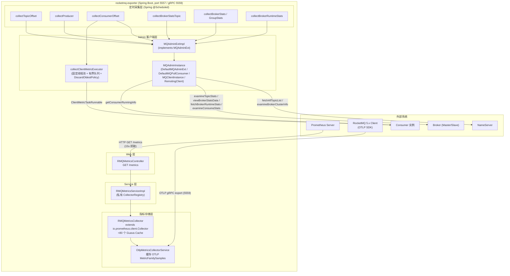
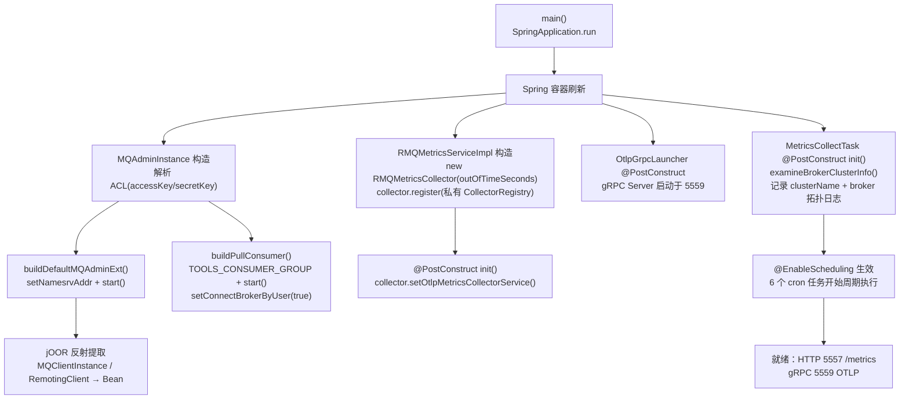
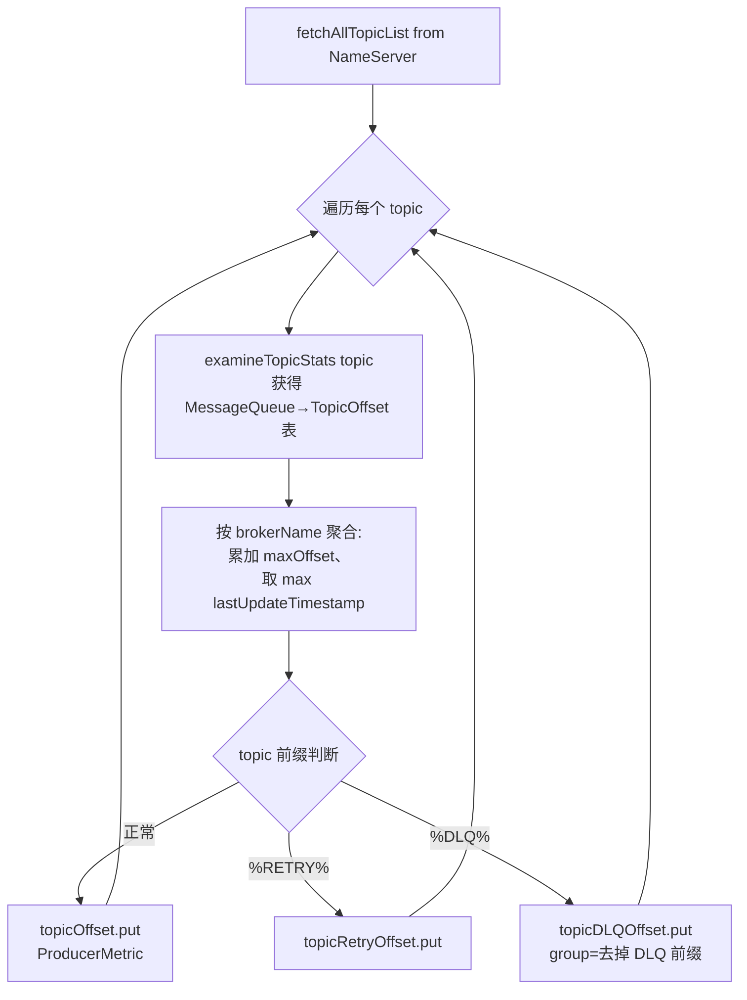
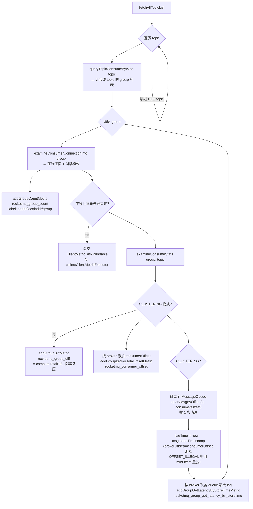
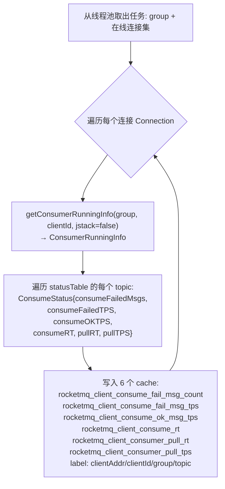
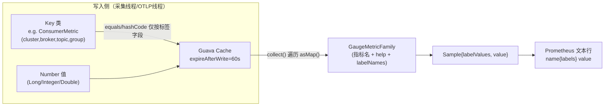
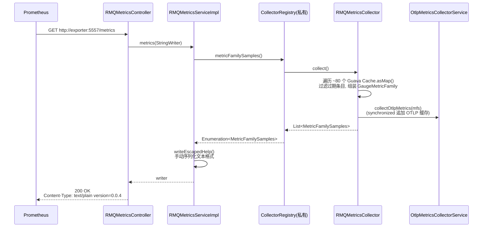
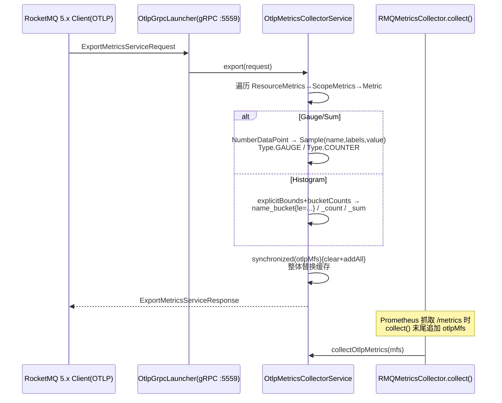
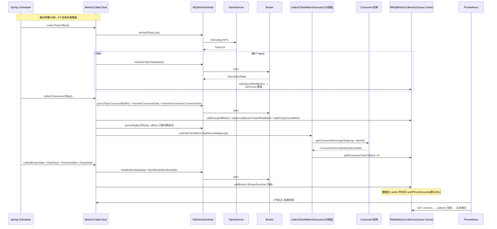

# RocketMQ Exporter 深入源码分析

> 基于源码版本：0.0.3-SNAPSHOT（RocketMQ Client 4.9.4 / Spring Boot 2.7.11 / prometheus simpleclient 0.15.0）

---

## 目录

1. [项目定位与总体认识](#1-项目定位与总体认识)
2. [整体架构](#2-整体架构)
3. [核心模块与源码结构](#3-核心模块与源码结构)
4. [关键设计思想](#4-关键设计思想)
5. [启动流程](#5-启动流程)
6. [Metric 采集工作流程（核心）](#6-metric-采集工作流程核心)
7. [Metric 数据结构与存储模型](#7-metric-数据结构与存储模型)
8. [/metrics 暴露流程（拉取/Pull 模型）](#8-metrics-暴露流程拉取pull-模型)
9. [OTLP gRPC 通道（Push 模型）](#9-otlp-grpc-通道push-模型)
10. [端到端时序图](#10-端到端时序图)
11. [配置体系详解](#11-配置体系详解)
12. [设计评价与注意事项](#12-设计评价与注意事项)

---

## 1. 项目定位与总体认识

rocketmq-exporter 是 Apache RocketMQ 官方的 **Prometheus Exporter**。它本身不产生业务数据，而是一个"**指标中转与翻译器**"：

- 对**下**：以 RocketMQ Admin 客户端（`DefaultMQAdminExt` / `DefaultMQPullConsumer`）的身份，通过 NameServer/Broker 的 Remoting 协议拉取集群元数据与运行时统计；
- 对**上**：把数据转换成 Prometheus 文本格式（`text/plain; version=0.0.4`），通过 HTTP `/metrics` 端点暴露给 Prometheus Server 抓取；同时提供一条 OTLP gRPC 通道，可接收 RocketMQ 5.x 客户端主动推送的 OTLP 指标并一并透出到 `/metrics`。

**双通道数据来源**：

| 通道 | 方向 | 协议 | 数据 |
|---|---|---|---|
| Admin API 采集 | exporter 主动拉取 | RocketMQ Remoting (TCP) | 集群/Topic/消费组/Broker 运行时指标 |
| OTLP gRPC | 客户端主动推送 | gRPC (OpenTelemetry Metrics Service) | RocketMQ 5.x 客户端 OTLP 指标 |

---

## 2. 整体架构



架构上是一个典型的**三层 pull-based exporter**：`定时采集(Task) → 内存缓存(Collector 的 Guava Cache) → 抓取时快照输出(Controller)`。采集与暴露**完全解耦**，HTTP 抓取只做内存快照的格式化，不会触发任何到集群的 RPC。

---

## 3. 核心模块与源码结构

```
org.apache.rocketmq.exporter
├── RocketMQExporterApplication     # Spring Boot 入口：@EnableScheduling + @ServletComponentScan
├── controller
│   └── RMQMetricsController        # /metrics 端点（路径由 rocketmq.config.webTelemetryPath 配置）
├── service
│   ├── RMQMetricsService           # 接口：getCollector() / metrics(Writer)
│   ├── impl.RMQMetricsServiceImpl  # 持有私有 CollectorRegistry，注册 RMQMetricsCollector，
│   │                               # 并手写 Prometheus 文本格式序列化（writeEscapedHelp）
│   └── client
│       ├── MQAdminInstance         # 构建 Admin 客户端单例 Bean（含 ACL、jOOR 反射提取内部对象）
│       └── MQAdminExtImpl          # MQAdminExt 装饰/裁剪实现，附 queryMsgByOffset()
├── collector
│   └── RMQMetricsCollector         # ★ 核心：extends Collector，≈80 个 Guava Cache 作为指标存储
├── task
│   ├── MetricsCollectTask          # ★ 核心：6 个 @Scheduled 定时采集任务 + 线程池定义
│   ├── ClientMetricTaskRunnable    # 消费者客户端运行时指标采集 Runnable（异步执行）
│   └── ClientMetricCollectorFixedThreadPoolExecutor  # 自定义 ThreadPoolExecutor（FutureTask 包装）
├── otlp
│   ├── OtlpGrpcLauncher            # 启动内嵌 gRPC Server（grpc.server.port，默认 5559）
│   └── OtlpMetricsCollectorService # OTLP export 服务端：OTLP → Prometheus MetricFamilySamples
├── config
│   ├── RMQConfigure                # rocketmq.config.* 配置（namesrv、ACL、缓存过期等）
│   ├── CollectClientMetricExecutorConfig  # threadpool.collect-client-metric-executor.* 线程池配置
│   └── ScheduleConfig              # 采集调度相关配置
├── model
│   ├── BrokerRuntimeStats          # Broker 运行时 KVTable → 强类型 POJO（含 PutTps 等内部类）
│   ├── common.TwoTuple             # 二元组工具
│   └── metrics                     # ★ 全部指标"Key 类"（作为 Guava Cache 的 key）
│       ├── producer.ProducerMetric / ProducerCountMetric
│       ├── ConsumerMetric / ConsumerCountMetric / ConsumerTopicDiffMetric / DLQTopicOffsetMetric
│       ├── TopicPutNumMetric / BrokerMetric
│       ├── brokerruntime.BrokerRuntimeMetric
│       └── clientrunime.ConsumerRuntime*Metric (×6)
└── util
    ├── Utils                       # getFixedDouble 等工具
    └── JsonUtil
```

---

## 4. 关键设计思想

### 4.1 "Cache 即指标"：存储与输出分离

最常见的 exporter 写法是 `GaugeMetricFamily` / `Gauge` 直接 `inc()/set()`。本项目**没有**用任何 prometheus client 的可变指标对象，而是：

- 每个指标对应一个 `Cache<XxxMetricKey, Number>`（Guava Cache，`expireAfterWrite(outOfTimeSeconds)`，默认 60s）；
- 采集任务调用 `collector.addXxxMetric(labels..., value)` → `cache.put(key, value)`，语义是"**覆盖写**"（Gauge 语义，而非 Counter 累加）；
- 抓取时 `collector.collect()` 遍历所有 cache 的 `asMap()`，即时组装 `GaugeMetricFamily` 返回。

**收益**：
- **自动清理僵尸序列**：某 Topic/消费组被删除后，60s 内其指标自动从 `/metrics` 消失（这是 `expireAfterWrite` 的核心目的，配置项 `rocketmq.config.outOfTimeSeconds`）；
- 采集失败不会污染旧值的同时，也不会无限堆积 series（Prometheus scrape 不会因下线实体产生 stale series）。

### 4.2 自定义 Key 类 = Prometheus 标签维度

每个 Cache 的 key（如 `ProducerMetric`）重写 `equals/hashCode`（**仅基于标签字段**，不含 value，也不含 `lastUpdateTimestamp` 等辅助字段），从而：同一标签组合的重复采集自动覆盖，天然实现按标签去重。Key 的字段即 Prometheus 指标的 label。

### 4.3 采集与暴露解耦（异步快照）

`/metrics` 请求路径上**零 RPC**：`Controller → Service → CollectorRegistry.metricFamilySamples() → RMQMetricsCollector.collect()`，全部读内存。代价是数据最多有"采集周期 + 缓存窗口"的延迟（默认约 1 分钟）。

### 4.4 Admin 客户端复用与反射下钻（MQAdminInstance）

- 全局仅一份 `DefaultMQAdminExt`（instanceName = `admin-<ts>`）和一份 `DefaultMQPullConsumer`（TOOLS_CONSUMER_GROUP，用于 `queryMsgByOffset` 计算消费延迟）；
- 支持 ACL（`AclClientRPCHook`）；
- 使用 **jOOR 反射**从 `DefaultMQAdminExt` 内部逐层取出 `MQClientInstance` 和 `RemotingClient` 暴露为 Bean —— 因为部分管理命令（如 `examineSubscriptionGroupConfig`）在 `MQAdminExt` 接口中不可用，需要直接走 `remotingClient.invokeSync` 发送原生 RemotingCommand。
- `MQAdminExtImpl implements MQAdminExt` 是一个**装饰器**：大多数方法委托给 `defaultMQAdminExt`，ACL 相关方法直接 ignore，再补充自有方法 `queryMsgByOffset(mq, offset)`（通过 pullConsumer 拉 1 条消息获取 storeTimestamp）。

### 4.5 消费者客户端指标异步化 + 背压丢弃

`collectConsumerOffset` 对每个**在线**消费组提交一个 `ClientMetricTaskRunnable` 到专用线程池：
- 线程池：core=maximum=10，队列容量 5000（有界），拒绝策略 `DiscardOldestPolicy` —— 采集洪峰时**优先丢最老任务**，保证不阻塞调度线程；
- `ClientMetricCollectorFixedThreadPoolExecutor` 重写 `newTaskFor` 为普通 `FutureTask`（不关心结果，仅执行）；
- 每轮采集用 `groupCollected` Set 保证同组任务在一轮内只提交一次。

---

## 5. 启动流程



关键细节：
- `@EnableScheduling` 开启 cron 调度；所有任务默认 `15 0/1 * * * ?`（每分钟第 15 秒，错开整点避让）。
- 每个 `@Scheduled` 任务的 cron 都来自配置（`task.collectXxx.cron`），且受 `rocketmq.config.enableCollect` 总开关控制。
- `MetricsCollectTask.init()` 启动即访问 NameServer，失败会抛异常阻断启动（fail-fast）。

---

## 6. Metric 采集工作流程（核心）

`MetricsCollectTask` 中 6 个采集任务，各自的数据来源与产出指标：

### 6.1 任务总览

| 任务方法 | cron 配置键 | 数据来源（Admin API） | 产出指标（/metrics 名） |
|---|---|---|---|
| `collectTopicOffset` | `task.collectTopicOffset.cron` | `fetchAllTopicList` → `examineTopicStats(topic)` | `rocketmq_producer_offset` / `rocketmq_topic_retry_offset` / `rocketmq_topic_dlq_offset` |
| `collectProducer` | `task.collectProducer.cron` | `examineBrokerClusterInfo` → `getAllProducerInfo(masterAddr)` | `rocketmq_producer_count` |
| `collectConsumerOffset` | `task.collectConsumerOffset.cron` | `queryTopicConsumeByWho` → `examineConsumerConnectionInfo` / `examineConsumeStats` + 异步 `getConsumerRunningInfo` + `queryMsgByOffset` | `rocketmq_group_count`、`rocketmq_group_diff`、`rocketmq_consumer_offset`、`rocketmq_group_get_latency_by_storetime`、`rocketmq_client_consume_fail_msg_count` 等 6 个客户端指标 |
| `collectBrokerStatsTopic` | `task.collectBrokerStatsTopic.cron` | `examineTopicRouteInfo` → `viewBrokerStatsData(TOPIC_PUT_NUMS/TOPIC_SIZE/GROUP_GET_NUMS/GROUP_GET_SIZE/SNDBCK_PUT_NUMS)` | `rocketmq_producer_tps`、`rocketmq_producer_message_size`、`rocketmq_consumer_tps`、`rocketmq_consumer_message_size`、`rocketmq_send_back_nums` |
| `collectBrokerStats`（含 `collectBrokerGroupStats`，共用同一 cron） | `task.collectBrokerStats.cron` | `viewBrokerStatsData(BROKER_PUT_NUMS/BROKER_GET_NUMS)`；GroupStats：master/slave `fetchBrokerRuntimeStats` | `rocketmq_broker_tps`、`rocketmq_broker_qps`、`rocketmq_broker_commitlog_diff` |
| `collectBrokerRuntimeStats` | `task.collectBrokerRuntimeStats.cron` | `fetchBrokerRuntimeStats(masterAddr)` → `BrokerRuntimeStats` | `rocketmq_brokeruntime_*` 全家族（约 60+ 个） |

### 6.2 collectTopicOffset（Topic 最大 Offset）



注意：offset 是**按 broker 聚合后的累加值**（同一 broker 上该 topic 所有 queue 的 maxOffset 之和），label 为 `cluster/broker/topic`。

### 6.3 collectConsumerOffset（最复杂的任务）



要点：
- **消费延迟是"计算"出来的**：exporter 用 pull consumer 按消费者当前 offset 拉一条真实消息，用 `当前时间 - 消息存储时间` 近似消费滞后时长；这一步代价较高（每 queue 一次 pull RPC），所以只对 CLUSTERING 模式执行；
- `rocketmq_group_diff`（消费积压量）直接来自 `ConsumeStats.computeTotalDiff()`（Broker 侧 brokerOffset - consumerOffset 汇总）；
- 客户端指标（步骤 H）走异步线程池，不阻塞主采集。

### 6.4 ClientMetricTaskRunnable（消费者客户端运行时指标）



RPC 走的是 Broker 转发给消费者实例的 `getConsumerRunningInfo` 命令（消费者内嵌的 Admin 服务）。

### 6.5 collectBrokerStatsTopic（Broker 侧 TPS 统计）

- 对每个非 RETRY/DLQ topic：`examineTopicRouteInfo` 取路由 → 对每个 master broker 调 `viewBrokerStatsData(masterAddr, statsItem, key)`：
  - `TOPIC_PUT_NUMS`（topic 生产 TPS）→ `rocketmq_producer_tps`
  - `TOPIC_PUT_SIZE`（topic 生产字节/s）→ `rocketmq_producer_message_size`
  - 对每个订阅组（`queryTopicConsumeByWho`），statsKey 为 `topic@group`：
    - `GROUP_GET_NUMS` → `rocketmq_consumer_tps`
    - `GROUP_GET_SIZE` → `rocketmq_consumer_message_size`
    - `SNDBCK_PUT_NUMS` → `rocketmq_send_back_nums`
- TPS 值取 `BrokerStatsData.statsMinute.tps`（Broker 端分钟级滑动窗口统计），经 `Utils.getFixedDouble` 修正精度。

### 6.6 collectBrokerStats / collectBrokerGroupStats

- `collectBrokerStats`：遍历 `BrokerAddrTable`，对每个有 master 的 broker：
  - `BROKER_PUT_NUMS(clusterName)` → `rocketmq_broker_tps`（broker 整体写入 TPS）
  - `BROKER_GET_NUMS(clusterName)` → `rocketmq_broker_qps`
- `collectBrokerGroupStats`（与上同 cron）：对每个 slave，分别取 master 和 slave 的 `fetchBrokerRuntimeStats`，计算 `master.commitLogMaxOffset - slave.commitLogMaxOffset` → `rocketmq_broker_commitlog_diff`（**主从同步落后量**，字节）。

### 6.7 collectBrokerRuntimeStats（Broker 运行时全家桶）

`fetchBrokerRuntimeStats(masterAddr)` 返回扁平 KVTable → `new BrokerRuntimeStats(kvTable)` 解析成强类型 POJO（含 `putTps`/`getFoundTps`/`getMissTps`/`getTransferedTps`/`getTotalTps` 各含 10s/60s/600s 三档，`PutMessageDistributeTimeMap` 13 个耗时区间，磁盘容量解析等）→ `addBrokerRuntimeStatsMetric()` 一次性写入约 60 个 cache。典型指标：

`rocketmq_brokeruntime_{commitlog_disk_ratio, consumequeue_disk_ratio, commitlog_max_offset, commitlog_min_offset, remain_howmany_data_to_flush, dispatch_behind_bytes, putmessage_entire_time_max, pagecache_lock_time_mills, query_threadpool_queue_size, send_threadpool_queue_capacity, pull_threadpool_queue_head_wait_time_mills, puttps_10s/60s/600s, getfoundtps_10s/60s/600s, put_latency_99/999, pmdt_0ms...pmdt_10stomore, msg_put_total_today_now, boot_timestamp, ...}`

label 统一为 `cluster/brokerIP/addr/brokerversion/boottime/brokerversiondesc`（见 `BrokerRuntimeMetric`）。

---

## 7. Metric 数据结构与存储模型

### 7.1 三级数据结构



### 7.2 Key 类体系（model/metrics 包）

| Key 类 | 字段（= Prometheus label） | 对应指标 |
|---|---|---|
| `ProducerMetric` | clusterName, brokerName, topicName (+lastUpdateTimestamp 不参与 equals) | rocketmq_producer_offset / rocketmq_topic_retry_offset |
| `DLQTopicOffsetMetric` | clusterName, brokerName, group(=DLQ topic 去前缀) | rocketmq_topic_dlq_offset |
| `ProducerCountMetric` | clusterName, brokerName, group | rocketmq_producer_count |
| `TopicPutNumMetric` | clusterName, brokerName, brokerIP, topic | rocketmq_producer_tps / rocketmq_producer_message_size |
| `ConsumerMetric` | clusterName, brokerName, topicName, consumerGroupName | rocketmq_consumer_tps / _offset / _message_size / send_back_nums / group_get_latency... |
| `ConsumerTopicDiffMetric` | group, topic, countOfOnlineConsumers, msgModel | rocketmq_group_diff / _retrydiff / _dlqdiff |
| `ConsumerCountMetric` | group, caddrs, localaddrs | rocketmq_group_count |
| `ConsumerRuntime*Metric` (×6) | group, topic, clientAddr(caddr), clientId | rocketmq_client_* 六项 |
| `BrokerMetric` | clusterName, brokerIP, brokerName | rocketmq_broker_tps / _qps / _commitlog_diff |
| `BrokerRuntimeMetric` | clusterName, brokerAddress, brokerHost, brokerVersionDesc, bootTimestamp, brokerVersion | rocketmq_brokeruntime_* 全部 |

### 7.3 主要指标一览（名称 / 类型 / 语义）

| 指标 | 类型 | label | 含义 |
|---|---|---|---|
| rocketmq_producer_offset | gauge | cluster, broker, topic | topic 各 broker 上 maxOffset 之和（生产位点） |
| rocketmq_topic_retry_offset | gauge | 同上 | RETRY topic 位点 |
| rocketmq_topic_dlq_offset | gauge | cluster, broker, group | DLQ topic 位点 |
| rocketmq_producer_count | gauge | cluster, broker, group | 生产组在线实例数 |
| rocketmq_producer_tps | gauge | cluster, broker, topic | topic 写入 TPS |
| rocketmq_producer_message_size | gauge | cluster, broker, topic | topic 写入字节/s |
| rocketmq_group_count | gauge | caddr, localaddr, group | 消费组在线连接数 |
| rocketmq_group_diff | gauge | group, topic, countOfOnlineConsumers, msgModel | 消费积压（broker - consumer offset） |
| rocketmq_group_retrydiff / _dlqdiff | gauge | 同上 | RETRY/DLQ 积压 |
| rocketmq_consumer_offset | gauge | cluster, broker, topic, group | 消费位点（按 broker 聚合） |
| rocketmq_consumer_tps | gauge | cluster, broker, topic, group | 消费拉取 TPS |
| rocketmq_consumer_message_size | gauge | 同上 | 消费字节/s |
| rocketmq_send_back_nums | gauge | 同上 | 消费失败重回队列次数 |
| rocketmq_group_get_latency_by_storetime | gauge | 同上 | 消费滞后时长(ms，按消息存储时间估算) |
| rocketmq_client_consume_fail_msg_count / _tps | gauge | clientAddr, clientId, group, topic | 客户端消费失败数/失败 TPS |
| rocketmq_client_consume_ok_msg_tps / consume_rt / pull_rt / pull_tps | gauge | 同上 | 客户端消费成功 TPS/耗时/拉取耗时/拉取 TPS |
| rocketmq_broker_tps / _qps | gauge | cluster, brokerIP, broker | broker 整体写/读 TPS |
| rocketmq_broker_commitlog_diff | gauge | 同上 | 主从 commitlog 落后字节数 |
| rocketmq_brokeruntime_* | gauge | cluster, brokerIP, addr, brokerversion, boottime, brokerversiondesc | Broker 运行时约 60 项 |

---

## 8. /metrics 暴露流程（拉取/Pull 模型）



源码细节（`RMQMetricsServiceImpl:64-96`）：
- 输出格式为**手写序列化**而非 simpleclient 的 `TextFormat.write004`：`name{label="v",...} value`，label 值做 `\n`/`\"`/`\\` 转义，数值用 `Collector.doubleToGoString`（Go 风格数字格式）；
- 注意：该手写实现**不输出** `# HELP` / `# TYPE` 注释行（help/type 信息在序列化时被丢弃）；
- Registry 是 `new CollectorRegistry()` 私有实例，不与 JVM 默认 registry 共享（因此 JVM 自身指标、spring 指标不会混入）；
- Controller 的 mapping 路径 `${rocketmq.config.webTelemetryPath}` 支持配置改动。

---

## 9. OTLP gRPC 通道（Push 模型）

为支持 RocketMQ 5.x 客户端 OTLP 埋点，exporter 内嵌了一个 gRPC Server（默认 5559），实现 OpenTelemetry `MetricsService`：



设计要点：
- `otlpMfs` 是"**最后一次 export 请求的快照**"（clear + addAll 全量替换），旧数据**无过期机制**——与 Admin 通道的 Guava Cache 过期策略不同，OTLP 指标会一直保留到下一次 push 覆盖；
- 线程安全靠 `synchronized(otlpMfs)`（读路径与写路径互斥）；
- Histogram 的 OTLP 显式桶边界被翻译为 Prometheus 的 `le` label + `_bucket/_count/_sum` 三件套，兼容 Prometheus histogram 语义。

---

## 10. 端到端时序图

完整生命周期（一轮采集 + 一次抓取）：



---

## 11. 配置体系详解

`application.yml`（全部可覆盖）：

```yaml
server.port: 5557                 # HTTP /metrics 端口
grpc.server.port: 5559            # OTLP gRPC 端口
rocketmq.config:
  webTelemetryPath: /metrics      # 暴露路径（支持改路径）
  namesrvAddr: 127.0.0.1:9876     # 缺省取 -Drocketmq.namesrv.addr 或 env NAMESRV_ADDR
  rocketmqVersion: 4_9_4
  enableCollect: true             # 采集总开关
  enableACL: false                # >=4.4.0 集群需开启
  accessKey / secretKey
  outOfTimeSeconds: 60            # ★ 指标缓存过期时间（决定下线实体指标消失速度）
threadpool.collect-client-metric-executor:
  core-pool-size: 10
  maximum-pool-size: 10
  keep-alive-time: 3000
  queueSize: 5000
task:                             # 每个@Scheduled任务独立cron
  collectTopicOffset.cron:        15 0/1 * * * ?
  collectProducer.cron:           15 0/1 * * * ?
  collectConsumerOffset.cron:     15 0/1 * * * ?
  collectBrokerStatsTopic.cron:   15 0/1 * * * ?
  collectBrokerStats.cron:        15 0/1 * * * ?
  collectBrokerRuntimeStats.cron: 15 0/1 * * * ?
```

配置加载优先级（`RMQConfigure`）：`application.yml > 系统属性(-D) > 环境变量`（setter 中非空才覆盖并回写 System.setProperty）。

**配置联动关系**（重要）：
- `outOfTimeSeconds` 必须 **> 采集周期**，否则指标在两次采集之间过期，`/metrics` 出现数据抖动/空窗；
- Prometheus `scrape_interval` 建议 ≤ 采集周期（默认 1min），否则观察到的值有阶梯；
- `collectBrokerStats` 与 `collectBrokerGroupStats` 共用同一个 cron 配置键（`task.collectBrokerStats.cron`）。

---

## 12. 设计评价与注意事项

### 优点
1. **采集/暴露解耦**：抓取零 RPC，Prometheus 高频抓取不压垮集群；
2. **Guava Cache 过期自动清理**：优雅处理实体删除后的 stale series；
3. **覆盖面极全**：从 topic 位点、消费积压、消费延迟（按存储时间估算）、客户端运行时，到 broker runtime 60+ 项、主从 commitlog 落后量；
4. **背压保护**：客户端指标采集异步化 + 有界队列 + DiscardOldestPolicy，防止消费者量大时拖垮调度；
5. **OTLP 通道**预留了向 5.x / OpenTelemetry 生态演进的能力，且与 Prometheus 端点统一聚合输出。

### 已知局限/注意点（源码可见）
1. **同步串行遍历**：`collectConsumerOffset` 等任务对 topic×group×queue 逐个 RPC（尤其 `queryMsgByOffset` 每 queue 一次 pull），topic/queue 数量大时一轮采集可能超过 1 分钟；
2. **错误处理以日志为主**：单 topic/group 失败 `continue`，该指标本轮缺失（配合缓存过期可能短暂消失）；
3. **`collectBrokerGroupStats` 中 slave 的 `getBrokerRuntimeStats` 返回 null 时直接 NPE**（`masterRuntimeStats.getCommitLogMaxOffset()` 前未判空）；
4. **clusterName 是静态单例**：`MetricsCollectTask.init()` 取第一个 cluster 名，仅适配单集群（多集群需部署多个 exporter 实例）；
5. **手写文本序列化丢弃了 `# HELP/# TYPE`**，Grafana/PromQL 不受影响，但可读性略降；
6. `addGroupConsumerTotalOffsetMetric` 是**空实现**（方法体被注释，`rocketmq_group_consume_total_offset` 实际无数据写入），但对应 GaugeMetricFamily 仍会输出空 family；
7. **msgModel/countOfOnlineConsumers 作为 diff 指标的 label**——这些是"值当标签用"，一旦变化会产生新的时间序列，Grafana 查询时需注意。

### 一句话总结

> rocketmq-exporter = **"RocketMQ Admin API 的定时轮询器" + "Guava Cache 指标快照仓库" + "Prometheus 文本格式序列化器"**，三条链路（Admin 拉取、OTLP 接收、/metrics 暴露）通过 `RMQMetricsCollector.collect()` 这一个快照点汇聚，实现了一套缓存、两种数据来源、一个暴露端点的简洁架构。
