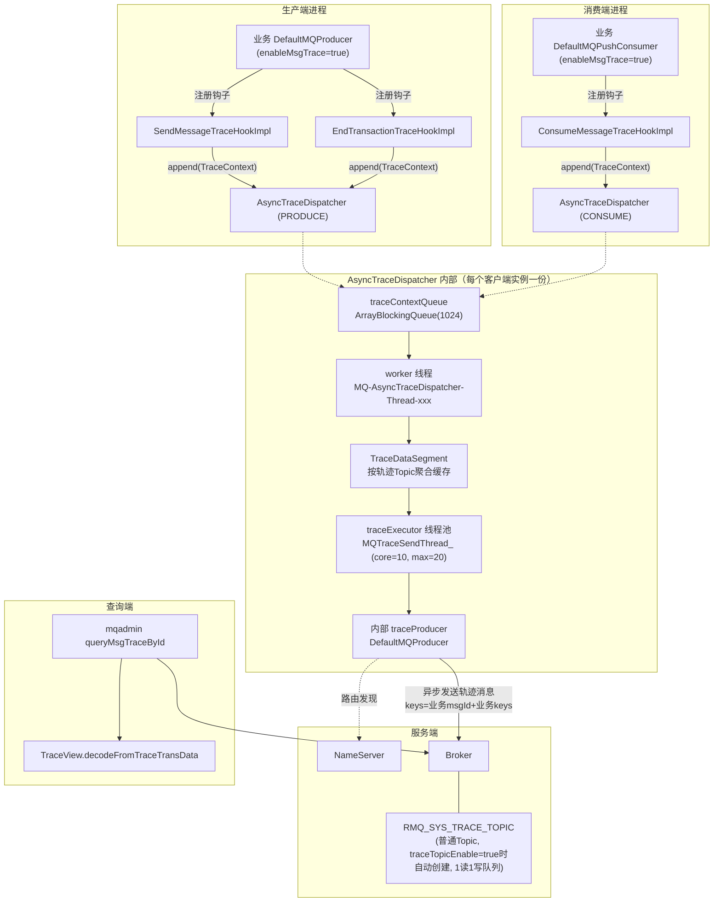
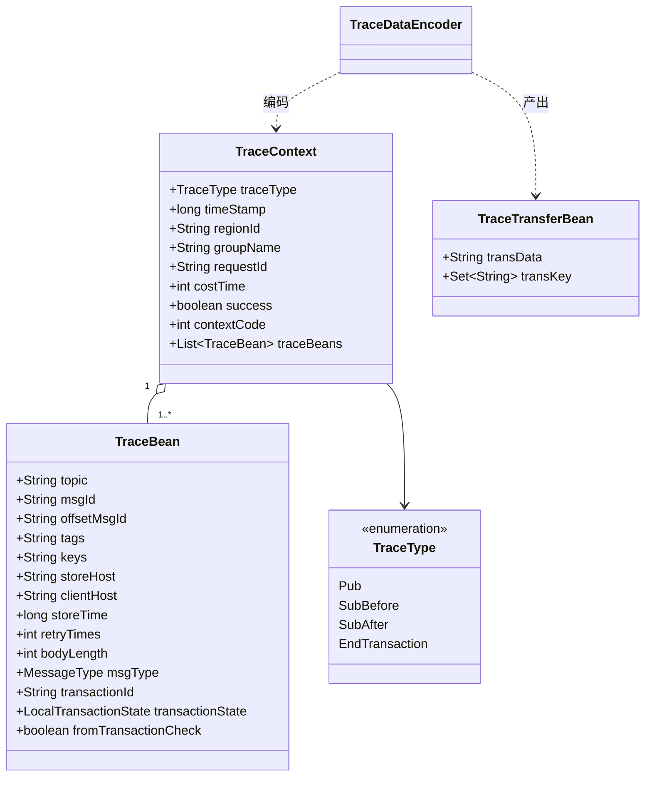
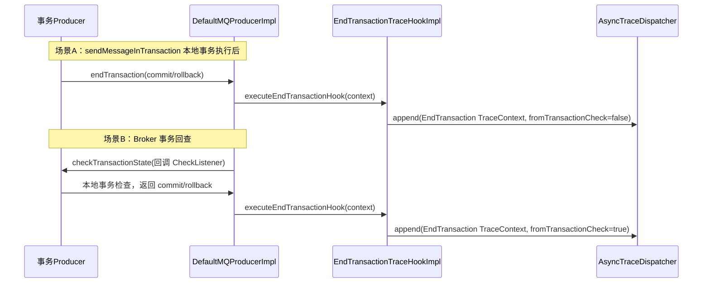
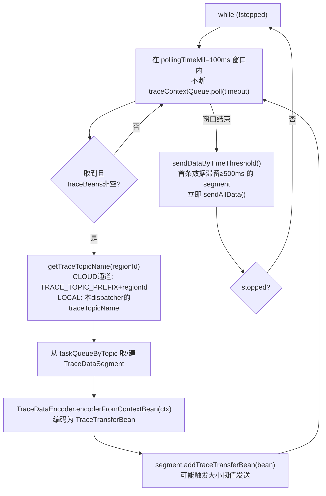
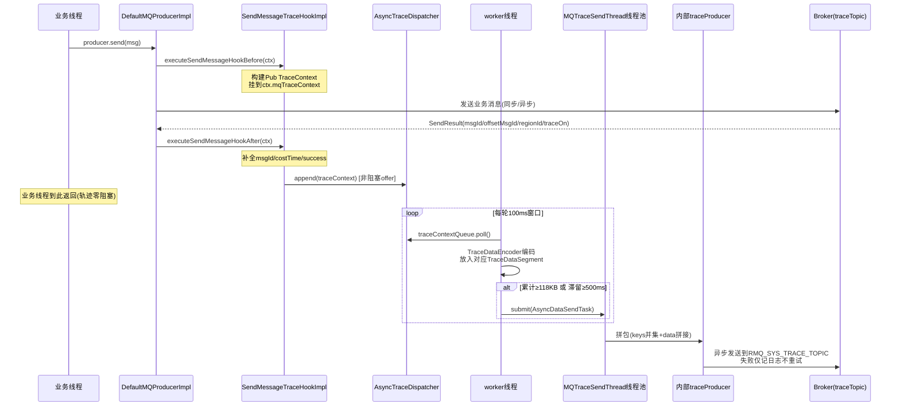
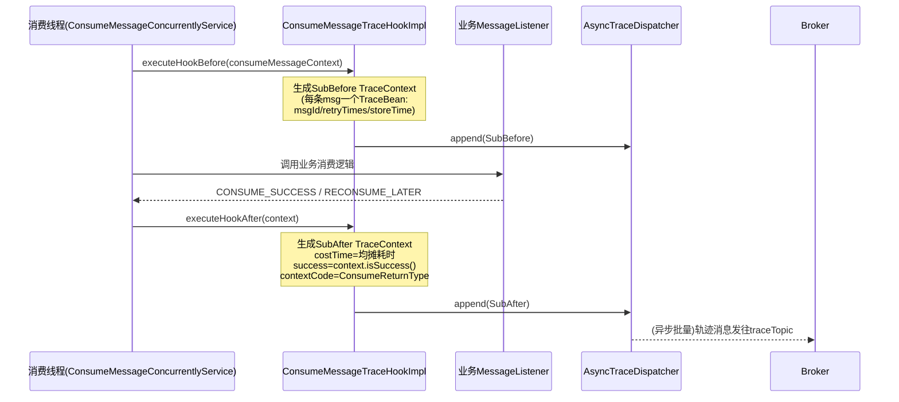
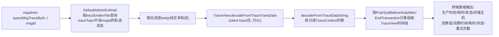
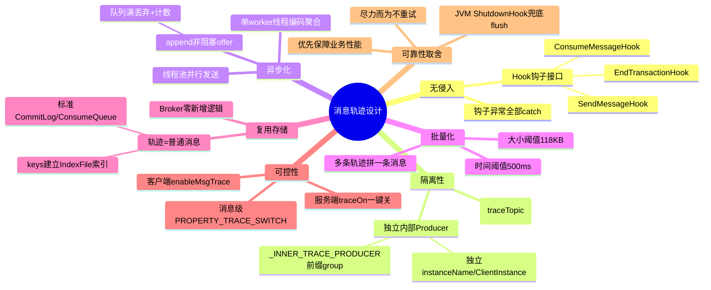
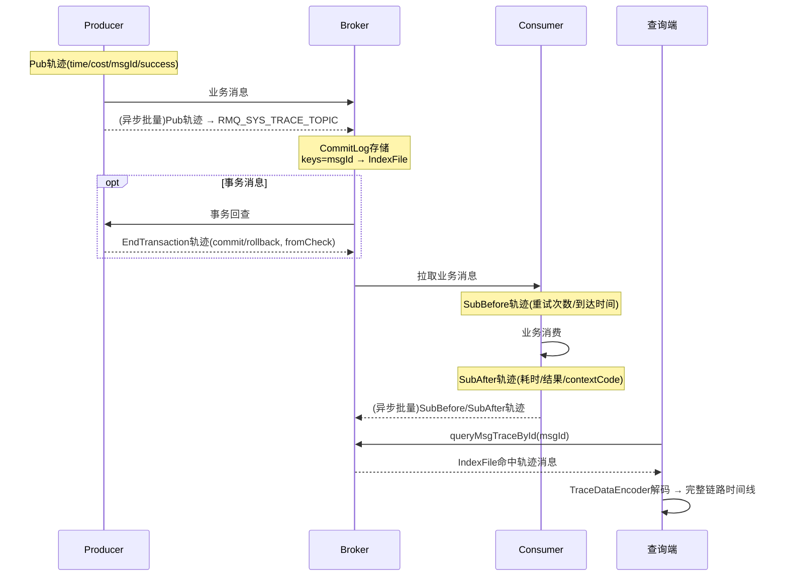

# RocketMQ 4.9.8 消息轨迹（Message Trace）实现原理深度解析

> 基于源码仓库 `rocketmq-4.9.8` 分析，所有类名/方法名/行号均对应真实源码。

---

## 目录

1. [消息轨迹是什么](#一消息轨迹是什么)
2. [整体架构](#二整体架构)
3. [核心类体系（client trace 包）](#三核心类体系client-trace-包)
4. [开关与配置](#四开关与配置)
5. [生产端轨迹：SendMessageHook](#五生产端轨迹sendmessagehook)
6. [事务消息轨迹：EndTransactionHook](#六事务消息轨迹endtransactionhook)
7. [消费端轨迹：ConsumeMessageHook](#七消费端轨迹consumemessagehook)
8. [核心调度器 AsyncTraceDispatcher 深度剖析](#八核心调度器-asynctracedispatcher-深度剖析)
9. [轨迹数据编码格式 TraceDataEncoder](#九轨迹数据编码格式-tracedataencoder)
10. [Broker 端：轨迹主题的存储与创建](#十broker-端轨迹主题的存储与创建)
11. [轨迹查询工具](#十一轨迹查询工具)
12. [设计精髓总结](#十二设计精髓总结)

---

## 一、消息轨迹是什么

消息轨迹用于记录**一条消息从生产、存储、到消费的完整生命周期**，帮助排查诸如"消息发了吗？发到哪个 Broker？谁消费了？消费成功了吗？耗时多少？"这类分布式链路问题。

一条开启轨迹的消息，在 RocketMQ 中会记录 **4 种轨迹事件**（`TraceType` 枚举，`client/src/main/java/org/apache/rocketmq/client/trace/TraceType.java`）：

| 轨迹类型 | 含义 | 产生方 |
|---------|------|--------|
| `Pub` | 消息发送（生产） | Producer |
| `SubBefore` | 消费开始前 | Consumer |
| `SubAfter` | 消费完成后 | Consumer |
| `EndTransaction` | 事务消息提交/回滚 | 事务 Producer |

---

## 二、整体架构

核心设计思想：**客户端通过 Hook（钩子）无侵入拦截收发链路 → 异步批量编码 → 用一个"内部轨迹生产者"把轨迹数据当作普通消息发到轨迹 Topic → Broker 按普通 Topic 存储 → 查询端按 msgId/keys 从轨迹 Topic 反查并解码**。



要点：

- **Broker 端没有任何"轨迹专用"存储逻辑**——轨迹就是普通消息，复用 CommitLog/ConsumeQueue 全套存储机制，这是整个设计最轻量之处。
- 客户端轨迹的生产者是一个**独立的内部 Producer**（独立 group、独立 instanceName），与业务 Producer 完全隔离。
- 轨迹消息的 **keys 设置为业务消息的 msgId + 业务 keys**，因此查询时可以像查普通消息一样按键索引反查。

---

## 三、核心类体系（client trace 包）

```
client/src/main/java/org/apache/rocketmq/client/trace/
├── TraceDispatcher.java          # 顶层接口: start/append/flush/shutdown
├── AsyncTraceDispatcher.java     # 唯一实现：异步批量调度核心（460行，最核心）
├── TraceContext.java             # 一批消息/一次操作的轨迹上下文（时间戳、组名、regionId、耗时、成功标志）
├── TraceBean.java                # 单条消息的轨迹实体（msgId/offsetMsgId/topic/tags/keys/storeHost/retryTimes...）
├── TraceType.java                # Pub / SubBefore / SubAfter / EndTransaction
├── TraceDataEncoder.java         # 轨迹数据 编码/解码（字符串协议）
├── TraceTransferBean.java        # 编码产物: transData(字符串) + transKey(查询键集合)
├── TraceConstants.java           # 常量：分隔符、内部生产者前缀、instanceName
├── TraceView.java                # 查询侧的轨迹视图解码
└── hook/
    ├── SendMessageTraceHookImpl.java    # 生产钩子
    ├── ConsumeMessageTraceHookImpl.java # 消费钩子
    └── EndTransactionTraceHookImpl.java # 事务钩子
```

### 3.1 数据模型关系



`TraceDataEncoder.encoderFromContextBean(ctx)` 把一个 `TraceContext` 编码成一个 `TraceTransferBean`：`transData` 是轨迹文本，`transKey` 收集了该上下文所有 `TraceBean` 的 msgId 和 keys（供查询索引）。

---

## 四、开关与配置

### 4.1 客户端

```java
// 生产端开启（DefaultMQProducer 构造函数）
DefaultMQProducer producer = new DefaultMQProducer(group, true);              // enableMsgTrace
DefaultMQProducer producer = new DefaultMQProducer(group, rpcHook, true, customizedTraceTopic);
// 消费端开启（DefaultMQPushConsumer 构造函数）
DefaultMQPushConsumer consumer = new DefaultMQPushConsumer(group, true);      // enableMsgTrace
```

钩子注册点（以生产端为例，`DefaultMQProducerImpl.java:~762` 附近的 `start()` 逻辑）：

```java
if (enableMsgTrace) {
    try {
        AsyncTraceDispatcher dispatcher = new AsyncTraceDispatcher(
            producerGroup, TraceDispatcher.Type.PRODUCE, customizedTraceTopic, rpcHook);
        dispatcher.setHostProducer(this.defaultMQProducerImpl);
        traceDispatcher = dispatcher;
        this.registerSendMessageHook(new SendMessageTraceHookImpl(traceDispatcher));
        this.registerEndTransactionHook(new EndTransactionTraceHookImpl(traceDispatcher));
        // 生产者 start 末尾: traceDispatcher.start(...)
    } catch (Throwable e) {
        log.error("system mqtrace hook init failed ,maybe can't send msg trace data");
    }
}
```

消费端对应 `DefaultMQPushConsumerImpl`：创建 `AsyncTraceDispatcher(group, Type.CONSUME, ...)` 并 `registerConsumeMessageHook(new ConsumeMessageTraceHookImpl(...))`。

### 4.2 关键配置/常量一览

| 配置 | 默认值 | 位置 | 说明 |
|------|--------|------|------|
| `enableMsgTrace` | `false` | Producer/Consumer 构造参数 | 客户端轨迹开关 |
| `customizedTraceTopic` | `null` | 构造参数 | 自定义轨迹 Topic |
| `RMQ_SYS_TRACE_TOPIC` | `"RMQ_SYS_TRACE_TOPIC"` | `TopicValidator`（common 模块） | 默认轨迹 Topic，已加入 `SYSTEM_TOPIC_SET` |
| `traceTopicEnable` | `false` | `BrokerConfig.java:58` | Broker 启动时是否自动创建轨迹 Topic |
| `msgTraceTopicName` | `RMQ_SYS_TRACE_TOPIC` | `BrokerConfig.java:56` | Broker 侧轨迹 Topic 名 |
| `queueSize` | `2048` | `AsyncTraceDispatcher.java:84` | 线程池任务队列容量 |
| `batchSize` | `100` | `AsyncTraceDispatcher.java:85` | 预留字段（当前主流程未使用） |
| `maxMsgSize` | `128000` (~125KB) | `AsyncTraceDispatcher.java:86` | 单条轨迹消息上限 |
| `pollingTimeMil` | `100ms` | `AsyncTraceDispatcher.java:87` | worker 线程单轮拉取窗口 |
| `waitTimeThresholdMil` | `500ms` | `AsyncTraceDispatcher.java:88` | Segment 聚合的最长等待时间 |
| `GROUP_NAME_PREFIX` | `_INNER_TRACE_PRODUCER` | `TraceConstants` | 内部生产者组名前缀 |
| `CONTENT_SPLITOR` | `char 1` (SOH) | `TraceConstants` | 字段内分隔符 |
| `FIELD_SPLITOR` | `char 2` (STX) | `TraceConstants` | 轨迹条目间分隔符 |

---

## 五、生产端轨迹：SendMessageHook

### 5.1 钩子触发链路

钩子埋点在 `DefaultMQProducerImpl.sendDefaultImpl()`：

- `executeSendMessageHookBefore(context)` — 行 762，发送前
- `executeSendMessageHookAfter(context)` — 行 856~875，无论成功/异常/超时各分支都会调用

异步发送（`send(msg, SendCallback)`）的 After 钩子在 `MQClientAPIImpl.java:526/541/613` 的回调中触发。

`executeSendMessageHookBefore/After` 内部就是遍历 `List<SendMessageHook>` 逐个执行，并 catch 所有异常（**钩子失败绝不影响业务发送**）。

### 5.2 sendMessageBefore — 构建上下文（`SendMessageTraceHookImpl.java:44-64`）

```java
public void sendMessageBefore(SendMessageContext context) {
    // 关键防递归：轨迹消息本身不再记录轨迹
    if (context == null || context.getMessage().getTopic()
            .startsWith(((AsyncTraceDispatcher) localDispatcher).getTraceTopicName())) {
        return;
    }
    TraceContext tuxeContext = new TraceContext();
    tuxeContext.setTraceType(TraceType.Pub);
    tuxeContext.setGroupName(NamespaceUtil.withoutNamespace(context.getProducerGroup()));
    TraceBean traceBean = new TraceBean();
    traceBean.setTopic(...); traceBean.setTags(...); traceBean.setKeys(...);
    traceBean.setStoreHost(context.getBrokerAddr());
    traceBean.setBodyLength(context.getMessage().getBody().length);
    traceBean.setMsgType(context.getMsgType());
    tuxeContext.getTraceBeans().add(traceBean);
    context.setMqTraceContext(tuxeContext);   // 挂到上下文，After 阶段取回
}
```

### 5.3 sendMessageAfter — 补全结果并投递（`SendMessageTraceHookImpl.java:67-97`）

```java
if (context.getSendResult().getRegionId() == null
    || !context.getSendResult().isTraceOn()) {
    return;   // 服务端 traceOn 开关关闭则跳过（brokerConfig.traceOn，随 SendResult 返回）
}
...
int costTime = (int) ((System.currentTimeMillis() - tuxeContext.getTimeStamp())
                      / tuxeContext.getTraceBeans().size());
tuxeContext.setCostTime(costTime);
tuxeContext.setSuccess(sendStatus == SendStatus.SEND_OK);
tuxeContext.setRegionId(context.getSendResult().getRegionId());
traceBean.setMsgId(context.getSendResult().getMsgId());
traceBean.setOffsetMsgId(context.getSendResult().getOffsetMsgId());
traceBean.setStoreTime(tuxeContext.getTimeStamp() + costTime / 2); // 存储时间的近似估算
localDispatcher.append(tuxeContext);   // 投递给异步调度器
```

注意：**发送失败（sendResult == null）时不记录 Pub 轨迹**——只有拿到 SendResult 才记录；批量发送时 `costTime` 按条数均摊。

---

## 六、事务消息轨迹：EndTransactionHook

`EndTransactionTraceHookImpl.endTransaction()`（全量逻辑在 `EndTransactionTraceHookImpl.java:48-79`）在两个时机被触发（`DefaultMQProducerImpl.executeEndTransactionHook()`，行 964-987）：

1. 业务代码执行 `producer.sendMessageInTransaction()` 内部提交/回滚时；
2. **Broker 发起事务回查**，`ClientRemotingProcessor.checkTransactionState()` 回调本地事务监听器后。

它只产生一种 `EndTransaction` 类型轨迹，关键字段：

- `transactionId` / `transactionState`（COMMIT_MESSAGE / ROLLBACK_MESSAGE / UNKNOW）
- `fromTransactionCheck`：本次结束操作是否由回查触发（区分主动提交与被动回查）
- `msgType` 固定为 `Trans_msg_Commit`
- `regionId` 取自消息属性 `PROPERTY_MSG_REGION`，缺省 `MixAll.DEFAULT_TRACE_REGION_ID`



---

## 七、消费端轨迹：ConsumeMessageHook

### 7.1 触发链路

埋点在 `ConsumeMessageConcurrentlyService.sendMessage()`（`ConsumeMessageConcurrentlyService.java:382-443`）：

```java
ConsumeMessageContext consumeMessageContext = null;
if (defaultMQPushConsumerImpl.hasHook()) {
    consumeMessageContext = new ConsumeMessageContext();
    // 填充 namespace / consumerGroup / mq / msgList / props
    consumeMessageContext.setSuccess(false);
    defaultMQPushConsumerImpl.executeHookBefore(consumeMessageContext);   // 行 390
}
long beginTimestamp = System.currentTimeMillis();
// ... 调用业务 MessageListener ...
// 根据返回状态确定 returnType: SUCCESS/TIMEOUT/EXCEPTION/FAILED
if (defaultMQPushConsumerImpl.hasHook()) {
    consumeMessageContext.setStatus(status.toString());
    consumeMessageContext.setSuccess(status == CONSUME_SUCCESS);
    consumeMessageContext.getProps().put(MixAll.CONSUME_CONTEXT_TYPE, returnType.name());
    defaultMQPushConsumerImpl.executeHookAfter(consumeMessageContext);    // 行 442
}
```

顺序消费（`ConsumeMessageOrderlyService`）有对称的埋点。

### 7.2 consumeMessageBefore — 生成 SubBefore（`ConsumeMessageTraceHookImpl.java:49-85`）

对一批消息构建**一个** `TraceContext`（`traceBeans` 含多条 `TraceBean`）：

```java
String traceOn = msg.getProperty(MessageConst.PROPERTY_TRACE_SWITCH);
if (traceOn != null && traceOn.equals("false")) continue;  // 服务端可按消息粒度关闭轨迹
traceBean.setRetryTimes(msg.getReconsumeTimes());          // 重试次数
traceBean.setStoreTime(msg.getStoreTimestamp());
traceBean.setBodyLength(msg.getStoreSize());
traceBean.setMsgId(msg.getMsgId());                        // 用 msgId 关联 SubBefore/SubAfter
```

### 7.3 consumeMessageAfter — 生成 SubAfter（`ConsumeMessageTraceHookImpl.java:88-118`）

```java
int costTime = (int) ((System.currentTimeMillis() - subBeforeContext.getTimeStamp())
                      / context.getMsgList().size());       // 消费耗时（批量均摊）
subAfterContext.setSuccess(context.isSuccess());            // 消费是否成功
subAfterContext.setRequestId(subBeforeContext.getRequestId());
// contextCode = ConsumeReturnType.ordinal()，SUCCESS/TIMEOUT/EXCEPTION/FAILED/RETURNNULL
String contextType = props.get(MixAll.CONSUME_CONTEXT_TYPE);
subAfterContext.setContextCode(ConsumeReturnType.valueOf(contextType).ordinal());
```

**注意**：SubBefore 与 SubAfter 是**两次独立的 append**，最终作为两条轨迹记录编码发送，查询端靠 msgId 将它们与 Pub 记录串成完整链路。

---

## 八、核心调度器 AsyncTraceDispatcher 深度剖析

这是轨迹功能的"发动机"（`AsyncTraceDispatcher.java`，460 行）。整体是一个**三级流水线**：

```
业务线程 --append()--> traceContextQueue(1024)
    --> worker线程(单线程, 100ms窗口) 取出并编码, 放入按Topic聚合的 TraceDataSegment
    --> 满足条件时提交 AsyncDataSendTask 到 traceExecutor 线程池(10~20线程)
    --> 内部 traceProducer 异步发送到轨迹Topic
```

### 8.1 初始化（构造方法，行 82-109）

```java
this.queueSize = 2048;
this.batchSize = 100;
this.maxMsgSize = 128000;
this.pollingTimeMil = 100;          // worker 单轮拉取窗口 100ms
this.waitTimeThresholdMil = 500;    // Segment 最长滞留 500ms
this.traceContextQueue = new ArrayBlockingQueue<TraceContext>(1024);   // 注意：实际容量1024
this.taskQueueByTopic = new HashMap();                                  // 非线程安全，靠 worker 单线程访问
this.appenderQueue = new ArrayBlockingQueue<Runnable>(queueSize);       // 发送线程池的任务队列
this.traceExecutor = new ThreadPoolExecutor(10, 20, 1000*60, MILLISECONDS,
    this.appenderQueue, new ThreadFactoryImpl("MQTraceSendThread_"));
traceProducer = getAndCreateTraceProducer(rpcHook);
```

**内部轨迹生产者的特殊性**（`getAndCreateTraceProducer`，行 160-171）：

- group 名：`_INNER_TRACE_PRODUCER-{业务group}-{PRODUCE|CONSUME}-{自增序号}`（`genGroupNameForTrace()`）
- `setSendMsgTimeout(5000)`、`setVipChannelEnabled(false)`、`setMaxMessageSize(maxMsgSize)`
- `start()` 时设置 `instanceName = TRACE_INSTANCE_NAME + "_" + namesrvAddr`（`"INNER_TRACE_"` 前缀），保证与业务 Producer 使用**不同的 MQClientInstance**，彻底隔离。
- 它是一个**普通的 DefaultMQProducer**——递归风险靠钩子里的 topic 前缀判断（startsWith(traceTopicName)）切断。

### 8.2 append() — 业务线程唯一触点（行 177-184）

```java
public boolean append(final Object ctx) {
    boolean result = traceContextQueue.offer((TraceContext) ctx);   // 非阻塞
    if (!result) {
        log.info("buffer full" + discardCount.incrementAndGet() + " ,context is " + ctx);
    }
    return result;
}
```

**队列满直接丢弃并计数**（`discardCount`），绝不阻塞业务线程——轨迹的可靠性让位于业务性能。

### 8.3 worker 线程：AsyncRunnable（行 249-314）

单线程 `MQ-AsyncTraceDispatcher-Thread-{uuid}`，守护线程，`start()` 中创建（行 154-156）。主循环：



`taskQueueByTopic` 是普通 `HashMap`——因为**只有这一个 worker 线程读写它**（`flush()` 中的访问也套了 `synchronized (taskQueueByTopic)`），这是典型的单写者模式。

### 8.4 聚合与批量触发：TraceDataSegment（行 316-364）

每个"目标轨迹 Topic"对应一个 Segment，缓存待发送的编码数据。发送触发条件有两个：

```java
public void addTraceTransferBean(TraceTransferBean traceTransferBean) {
    initFirstBeanAddTime();
    this.traceTransferBeanList.add(traceTransferBean);
    this.currentMsgSize += traceTransferBean.getTransData().length();
    // 条件1：累计数据量接近单条消息上限（预留10KB）
    if (currentMsgSize >= traceProducer.getMaxMessageSize() - 10 * 1000) {
        // 提交 AsyncDataSendTask 到线程池，然后清空缓存
        traceExecutor.submit(new AsyncDataSendTask(traceTopicName, regionId, dataToSend));
        this.clear();
    }
}
// 条件2：时间阈值——worker 每轮结束时检查，首条数据入缓存超过 500ms 就整包发出
```

即经典的**"大小 or 时间"双阈值批量聚合**（类似 Nagle / TCP 思路）：

- 大小阈值：≈118KB，高流量时减少 RPC 次数
- 时间阈值：500ms，低流量时保证轨迹延迟上界

### 8.5 发送任务：AsyncDataSendTask（行 367-457）

```java
// 1. 拼包：把一批 TraceTransferBean 的 transData 首尾相接，transKey 取并集
StringBuilder buffer = new StringBuilder(1024);
Set<String> keySet = new HashSet<String>();
for (TraceTransferBean bean : traceTransferBeanList) {
    keySet.addAll(bean.getTransKey());
    buffer.append(bean.getTransData());
}
sendTraceDataByMQ(keySet, buffer.toString(), traceTopic);
```

`sendTraceDataByMQ()`（行 396-440）：

```java
final Message message = new Message(traceTopic, data.getBytes());
message.setKeys(keySet);   // 核心：keys = 业务消息 msgId ∪ 业务 keys → 建立查询索引

// 获取轨迹Topic的路由中包含哪些Broker
Set<String> traceBrokerSet = tryGetMessageQueueBrokerSet(...);
if (traceBrokerSet.isEmpty()) {
    traceProducer.send(message, callback, 5000);        // 常规异步发送
} else {
    traceProducer.send(message, new MessageQueueSelector() {
        // 用 MessageQueueSelector 把轨迹消息发到"业务消息所在的Broker集合"
        // 过滤出属于 traceBrokerSet 的队列，然后轮询(sendWhichQueue)选择
    }, traceBrokerSet, callback);
}
```

**为什么要用 MessageQueueSelector 定向发送？** —— 让轨迹消息尽量落在**产生该消息的同一个 Broker**上（traceBrokerSet 来自宿主 Producer/Consumer 的 `TopicPublishInfo`，即业务消息路由到的 Broker）。这样按 msgId 查业务消息和查轨迹都命中同一台 Broker，避免全集群扫描。

**失败处理**：`SendCallback.onException` 只打 error 日志，**不重试**。轨迹是"尽力而为"（best-effort）的数据，宁丢不阻塞、不重试（避免重试风暴）。

### 8.6 flush / shutdown / ShutdownHook（行 186-247）

```java
public void flush() {
    long end = System.currentTimeMillis() + 500;   // 最多等500ms，防止关机卡死
    while (System.currentTimeMillis() <= end) {
        // 对每个 segment 执行 sendAllData()，直到两个队列都清空或超时
    }
}
public void shutdown() {
    this.stopped = true;
    flush();                 // 尽量把残留轨迹发完
    this.traceExecutor.shutdown();
    if (isStarted.get()) traceProducer.shutdown();
    this.removeShutdownHook();
}
```

`start()` 还注册了 JVM `ShutdownHook`（`registerShutDownHook()`），**进程被 kill 时兜底 flush 一次**，减小退出时的轨迹丢失窗口。

### 8.7 生产端完整时序图



### 8.8 消费端完整时序图



---

## 九、轨迹数据编码格式 TraceDataEncoder

轨迹消息的 body 是**纯文本协议**：条目之间用 `FIELD_SPLITOR`(char 2) 分隔，条目内字段用 `CONTENT_SPLITOR`(char 1) 分隔。多条轨迹直接**字符串拼接**进一条消息的 body。

### 9.1 Pub（`TraceDataEncoder.java:154-171`）

```
Pub[SOH]timeStamp[SOH]regionId[SOH]groupName[SOH]topic[SOH]msgId[SOH]tags[SOH]keys
    [SOH]storeHost[SOH]bodyLength[SOH]costTime[SOH]msgType(ordinal)[SOH]offsetMsgId[SOH]isSuccess[STX]
```

| 序号 | 字段 | 说明 |
|---|------|------|
| 1 | traceType | `Pub` |
| 2 | timeStamp | 发送开始时间戳(ms) |
| 3 | regionId | Broker 区域 ID |
| 4 | groupName | 生产者组(去namespace) |
| 5 | topic | 业务 Topic |
| 6 | msgId | 客户端生成(含客户端IP+偏移)的消息ID |
| 7 | tags / 8 | keys | 业务标签/唯一键 |
| 9 | storeHost | Broker 地址 |
| 10 | bodyLength | 消息体长度 |
| 11 | costTime | 发送耗时(ms) |
| 12 | msgType | `MessageType` 枚举序数(Normal_Msg/Trans_msg_Half/Trans_msg_Commit/Delay_Msg/Order_Msg) |
| 13 | offsetMsgId | Broker 存储ID(含storeHost+物理offset) |
| 14 | isSuccess | 是否 SEND_OK |

### 9.2 SubBefore（行 173-184，**循环每个 TraceBean**）

```
SubBefore[SOH]timeStamp[SOH]regionId[SOH]groupName[SOH]requestId[SOH]msgId[SOH]retryTimes[SOH]keys[STX]
```

`requestId` 此处为消费者批次上下文关联 ID（4.9.x 中 SubBefore 的 requestId 尚未填充 msgId，为空串，解码端靠 msgId 匹配）。

### 9.3 SubAfter（行 186-200，循环每个 TraceBean）

```
SubAfter[SOH]requestId[SOH]msgId[SOH]costTime[SOH]isSuccess[SOH]keys[SOH]contextCode
```

非 CLOUD 通道额外追加 `[SOH]timeStamp[SOH]groupName`（阿里云 CLOUD 通道省略后两字段）。
`contextCode` = `ConsumeReturnType` 序数：0 SUCCESS / 1 TIMEOUT / 2 EXCEPTION / 3 FAILED / 4 RETURNNULL。

### 9.4 EndTransaction（行 202-216）

```
EndTransaction[SOH]timeStamp[SOH]regionId[SOH]groupName[SOH]topic[SOH]msgId[SOH]tags[SOH]keys
    [SOH]storeHost[SOH]msgType[SOH]transactionId[SOH]transactionState[SOH]fromTransactionCheck[STX]
```

### 9.5 解码的版本兼容（行 39-138）

`decoderFromTraceDataString()` 做了**向后兼容**处理，例如 Pub 记录：

```java
if (line.length == 13) {              // 老版本：无 offsetMsgId
    pubContext.setSuccess(Boolean.parseBoolean(line[12]));
} else if (line.length == 14) {       // 中间版本：有 offsetMsgId
    bean.setOffsetMsgId(line[12]);
    pubContext.setSuccess(Boolean.parseBoolean(line[13]));
}
if (line.length >= 15) {              // 最新版本：追加 clientHost
    ... bean.setClientHost(line[14]);
}
```

SubAfter 同理：`>=7` 个字段才有 contextCode，`>=9` 个字段才有 timeStamp/groupName。这使得**升级混布期间新旧客户端的轨迹数据都能正确解析**。

### 9.6 一条轨迹消息 body 的真实形态示意

```
Pub\x01 1699046400000 \x01 DefaultRegion \x01 myGroup \x01 TopicA \x01 7F000001... \x01 TagA \x01 OrderKey123 \x01 10.0.0.1:10911 \x01 128 \x01 5 \x01 0 \x01 7F000002... \x01 true \x02
SubBefore\x01 ... \x02
SubAfter\x01 ... \x02
（多条轨迹直接首尾相接，直到逼近128KB）
```

---

## 十、Broker 端：轨迹主题的存储与创建

### 10.1 自动创建（`broker/src/main/java/org/apache/rocketmq/broker/topic/TopicConfigManager.java:132-141`）

Broker 初始化 Topic 配置时：

```java
{
    if (this.brokerController.getBrokerConfig().isTraceTopicEnable()) {
        String topic = this.brokerController.getBrokerConfig().getMsgTraceTopicName();
        TopicConfig topicConfig = new TopicConfig(topic);
        TopicValidator.addSystemTopic(topic);
        topicConfig.setReadQueueNums(1);     // 1个读队列
        topicConfig.setWriteQueueNums(1);    // 1个写队列
        this.topicConfigTable.put(topicConfig.getTopicName(), topicConfig);
    }
}
```

要点：

- `traceTopicEnable=true`（broker.conf）时，Broker 启动即创建轨迹 Topic，**1 读 1 写队列**——轨迹是辅助数据，不占用过多存储；
- 该 Topic 被注册为**系统 Topic**（`TopicValidator.addSystemTopic`），控制台/命令行会将其标记为系统主题，且不可随意删除；
- 若不开启该开关，也可以手动 `mqadmin updateTopic` 创建（或依赖 autoCreateTopicEnable，但不推荐）。

### 10.2 存储与消费

轨迹消息走 **CommitLog → ConsumeQueue → IndexFile** 的标准存储路径：

- 按 msgId/keys 查询轨迹，正是命中 **IndexFile 索引**（`message.setKeys(keySet)` 建立的 key 索引）；
- 由于队列数只有 1，同一 Broker 上轨迹天然全序，便于顺序消费/排查。

### 10.3 traceOn 服务端开关

`BrokerConfig.traceOn`（默认 true）会随 SendResult 返回给客户端（`SendResult.isTraceOn()`），`SendMessageTraceHookImpl.sendMessageAfter` 中据此决定是否记录 Pub 轨迹；消费端则读取消息属性 `PROPERTY_TRACE_SWITCH`。即 **Broker 可以在服务端一键关闭全集群轨迹**（写磁盘压力大时的逃生阀）。

---

## 十一、轨迹查询工具

### 11.1 mqadmin 命令

`tools/src/main/java/org/apache/rocketmq/tools/command/message/QueryMsgTraceByIdSubCommand.java`：

```bash
sh mqadmin queryMsgTraceById -n 127.0.0.1:9876 -i ${msgId} [-t ${traceTopic}]
```

### 11.2 查询流程



`TraceView`（`client/src/main/java/org/apache/rocketmq/client/trace/TraceView.java`）将一条业务消息的完整链路规整为视图：生产段（谁发的、何时、耗时、是否成功、存到哪）+ 消费段（哪些组消费了、各耗时、成功与否、第几次重试），控制台(rocketmq-dashboard)的消息轨迹页面也是基于同样的解码逻辑实现。

---

## 十二、设计精髓总结



逐条展开：

1. **完全无侵入**：业务代码只需在构造 Producer/Consumer 时传 `enableMsgTrace=true`；所有埋点通过三个 Hook 接口织入，钩子执行异常被统一捕获，**轨迹子系统不可能影响业务收发**。
2. **三级异步流水线**：业务线程只做一次 `ArrayBlockingQueue.offer()`（O(1)、非阻塞）→ 单 worker 线程编码聚合 → 线程池并行发送。每一级解耦，业务链路上的轨迹开销约为微秒级。
3. **大小+时间双阈值批量**：`TraceDataSegment` 在 118KB 或 500ms 任一满足时整包发送，兼顾吞吐（高流量下摊薄 RPC）与时延（低流量下轨迹最迟 ~600ms 上报）。
4. **自举防递归**：轨迹的 Producer 自身也是 Producer，若不防护会无限递归——通过"目标 topic 以 traceTopicName 开头则钩子直接 return"一行判断闭环解决。
5. **定向发送**：`MessageQueueSelector` 让轨迹消息跟随业务消息落在同一组 Broker 上，查询时可精确路由，避免广播式扫描。
6. **复用一切基础设施**：Broker 无任何轨迹专用代码，存储、索引(`keys`→IndexFile)、查询(admin API)全部复用普通消息机制；1 读 1 写队列控制资源占用。
7. **版本兼容的文本协议**：SOH/STX 分隔的扁平文本协议，解码端按字段数多分支兼容新旧版本，支持灰度升级。
8. **明确的一致性取舍**：轨迹定位为 best-effort 数据——队列满丢弃、发送失败不重试，但保留 ShutdownHook 兜底 flush 与 discardCount 可观测指标。这是"辅助数据不拖垮主链路"的典型工程决策。

### 12.1 一条消息的完整轨迹生命周期（总览）



---

## 附：源码文件索引

| 模块 | 文件 | 说明 |
|------|------|------|
| client | `trace/AsyncTraceDispatcher.java` | 核心调度器（队列/worker/Segment/线程池/发送） |
| client | `trace/TraceDataEncoder.java` | 文本协议编解码 + 版本兼容 |
| client | `trace/TraceContext.java` / `TraceBean.java` / `TraceTransferBean.java` / `TraceView.java` | 数据模型与查询视图 |
| client | `trace/hook/SendMessageTraceHookImpl.java` | Pub 轨迹钩子 |
| client | `trace/hook/ConsumeMessageTraceHookImpl.java` | SubBefore/SubAfter 轨迹钩子 |
| client | `trace/hook/EndTransactionTraceHookImpl.java` | 事务轨迹钩子 |
| client | `impl/producer/DefaultMQProducerImpl.java:762,856,936-987` | 生产/事务钩子埋点与执行器 |
| client | `impl/consumer/ConsumeMessageConcurrentlyService.java:382-443` | 消费钩子埋点 |
| client | `impl/MQClientAPIImpl.java:526,541,613` | 异步发送回调中的 After 钩子 |
| common | `topic/TopicValidator.java` | `RMQ_SYS_TRACE_TOPIC` 系统主题定义 |
| common | `BrokerConfig.java:56-58` | `msgTraceTopicName` / `traceTopicEnable` / `traceOn` |
| broker | `topic/TopicConfigManager.java:132-141` | 轨迹 Topic 自动创建(1读1写) |
| tools | `command/message/QueryMsgTraceByIdSubCommand.java` | mqadmin 轨迹查询命令 |
