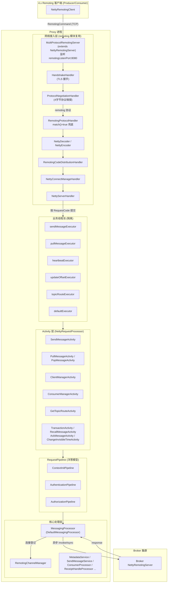
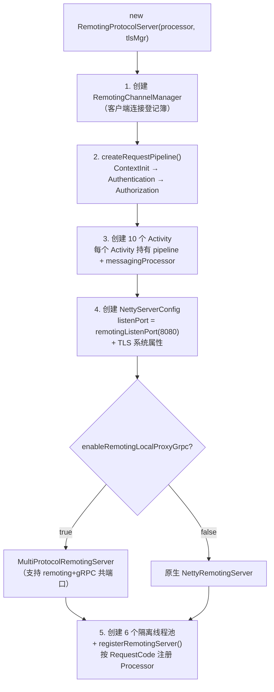
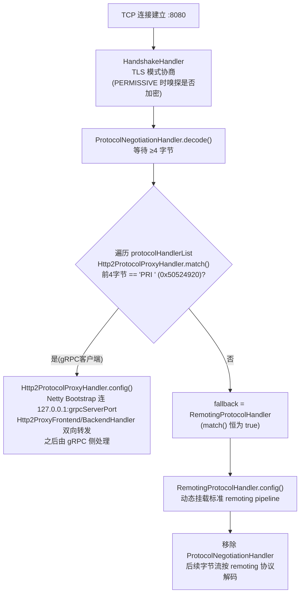
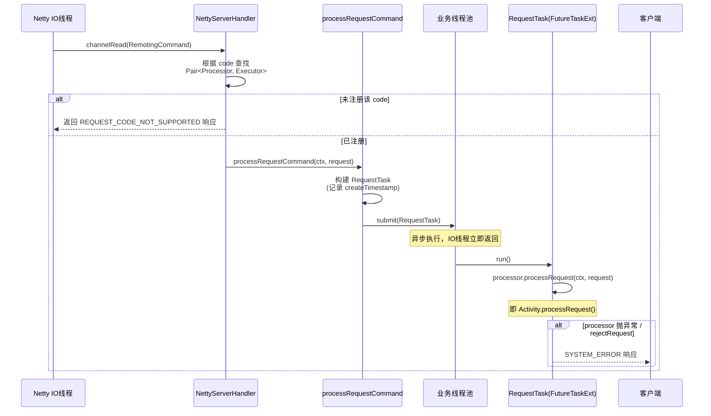
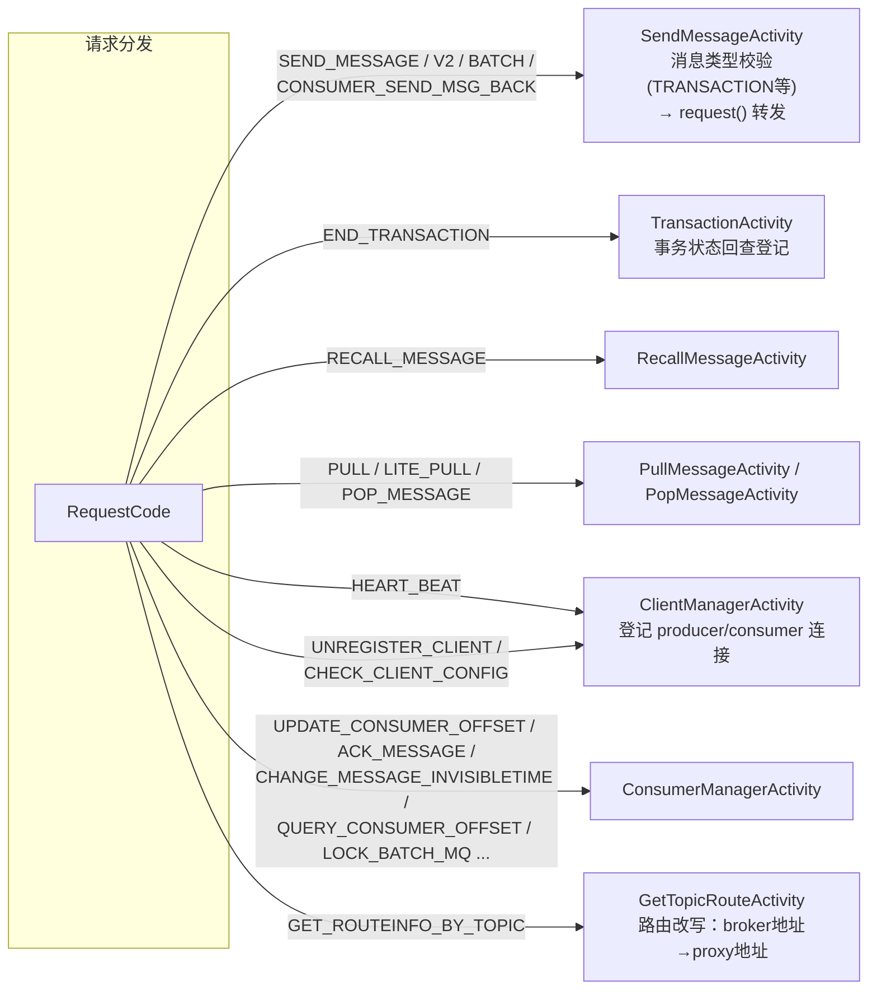
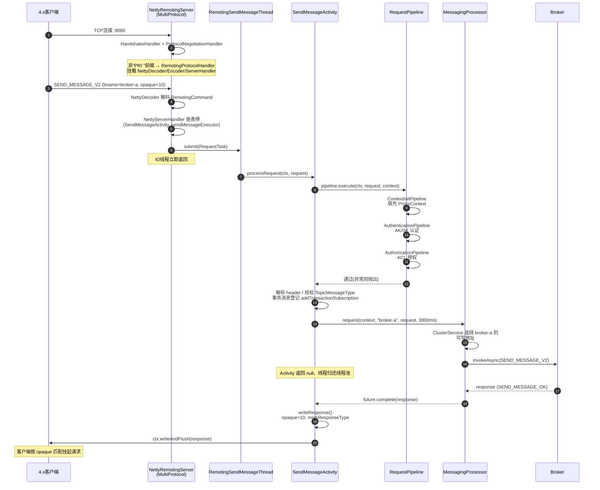
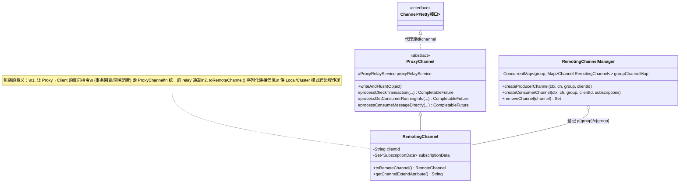
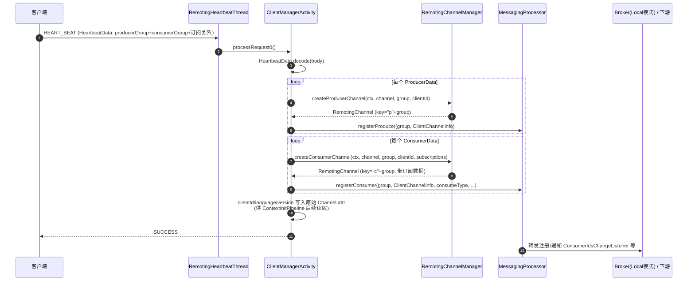
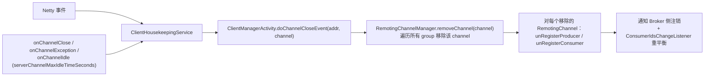
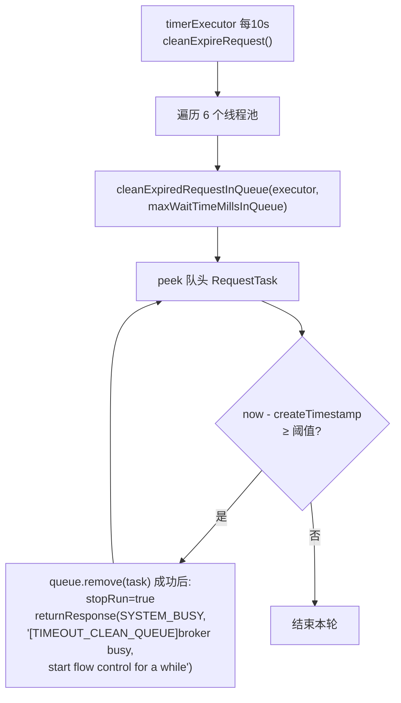

# RocketMQ 5.4.0 Proxy Remoting 协议处理客户端请求全流程源码分析

> 源码版本：RocketMQ 5.4.0（`proxy` 模块）
> 核心结论：Proxy 的 Remoting 接入层**完全复用**了 `remoting` 模块的 `NettyRemotingServer`（通过子类 `MultiProtocolRemotingServer` 扩展多协议识别），请求经过 **Netty IO 线程解码 → 业务线程池分发 → Activity（NettyRequestProcessor）→ RequestPipeline（鉴权/上下文）→ MessagingProcessor（异步转发到 Broker）** 的完整链路。

---

## 目录

1. [总体架构](#1-总体架构)
2. [启动与组件装配](#2-启动与组件装配)
3. [网络层：连接建立与协议识别](#3-网络层连接建立与协议识别)
4. [请求分发：NettyServerHandler 与线程池](#4-请求分发nettyserverhandler-与线程池)
5. [业务层：RequestPipeline 与 Activity](#5-业务层requestpipeline-与-activity)
6. [以 SendMessage 为例的完整时序](#6-以-sendmessage-为例的完整时序)
7. [客户端连接管理（Channel/心跳/断连清理）](#7-客户端连接管理channel心跳断连清理)
8. [Proxy → Client 的反向调用](#8-proxy--client-的反向调用)
9. [过载保护：慢请求监控与过期请求清理](#9-过载保护慢请求监控与过期请求清理)
10. [关键设计总结](#10-关键设计总结)

---

## 1. 总体架构

### 1.1 架构图



### 1.2 核心组件一览

| 组件 | 源码位置 | 职责 |
|---|---|---|
| `RemotingProtocolServer` | `proxy/remoting/RemotingProtocolServer.java` | Remoting 协议服务器门面：组装 Activity、线程池、注册 Processor |
| `MultiProtocolRemotingServer` | `proxy/remoting/MultiProtocolRemotingServer.java` | 继承 `NettyRemotingServer`，重写 `configChannel()` 加入协议嗅探 |
| `ProtocolNegotiationHandler` | `proxy/remoting/protocol/ProtocolNegotiationHandler.java` | 读取前 4 字节做协议分流 |
| `RemotingProtocolHandler` | `proxy/remoting/protocol/remoting/RemotingProtocolHandler.java` | remoting 协议命中时动态装配标准 pipeline |
| `Http2ProtocolProxyHandler` | `proxy/remoting/protocol/http2proxy/Http2ProtocolProxyHandler.java` | HTTP/2(gRPC) 命中时本机代理到 grpcServerPort |
| `AbstractRemotingActivity` | `proxy/remoting/activity/AbstractRemotingActivity.java` | 所有 Activity 的模板基类 |
| `RequestPipeline` | `proxy/remoting/pipeline/RequestPipeline.java` | 函数式洋葱管道（上下文初始化 + 认证 + 授权） |
| `RemotingChannelManager` | `proxy/remoting/channel/RemotingChannelManager.java` | group → channel → RemotingChannel 的连接登记簿 |
| `RemotingChannel` | `proxy/remoting/channel/RemotingChannel.java` | 原始 Netty Channel 的包装，支持 Proxy→Client 反向调用 |
| `ClientHousekeepingService` | `proxy/remoting/ClientHousekeepingService.java` | 连接断开/异常/空闲事件 → 注销客户端 |

---

## 2. 启动与组件装配

`ProxyStartup` 中创建（ProxyStartup.java:95-96）：

```java
RemotingProtocolServer remotingServer = new RemotingProtocolServer(messagingProcessor, tlsCertificateManager);
PROXY_START_AND_SHUTDOWN.appendStartAndShutdown(remotingServer);
```

### 2.1 `RemotingProtocolServer` 构造函数（RemotingProtocolServer.java:96-198）做了 5 件事



**线程池隔离**（RemotingProtocolServer.java:132-190）——这是 Proxy 直接借鉴 Broker 的做法：

| 线程池 | 处理的请求 | 关键配置 |
|---|---|---|
| `RemotingSendMessageThread` | SEND_MESSAGE / SEND_MESSAGE_V2 / SEND_BATCH_MESSAGE / CONSUMER_SEND_MSG_BACK / END_TRANSACTION / RECALL_MESSAGE | `remotingSendMessageThreadPoolNums` / `remotingWaitTimeMillsInSendQueue` |
| `RemotingPullMessageThread` | PULL_MESSAGE / LITE_PULL_MESSAGE / POP_MESSAGE | `remotingPullMessageThreadPoolNums` |
| `RemotingHeartbeatThread` | HEART_BEAT | `remotingHeartbeatThreadPoolNums` |
| `RemotingUpdateOffsetThread` | UPDATE_CONSUMER_OFFSET / ACK_MESSAGE / CHANGE_MESSAGE_INVISIBLETIME / GET_CONSUMER_CONNECTION_LIST | `remotingUpdateOffsetThreadPoolNums` |
| `RemotingTopicRouteThread` | GET_ROUTEINFO_BY_TOPIC | `remotingTopicRouteThreadPoolNums` |
| `RemotingDefaultThread` | UNREGISTER_CLIENT / CHECK_CLIENT_CONFIG / 其余 ConsumerManager 类请求 | `remotingDefaultThreadPoolNums` |

每个线程池都挂了 `ThreadPoolHeadSlowTimeMillsMonitor`（队头任务滞留时间监控），超阈值时打印 jstack——用于发现慢请求。

### 2.2 Processor 注册（RemotingProtocolServer.java:210-241）

`registerProcessor(RequestCode, NettyRequestProcessor, ExecutorService)` 是 `NettyRemotingServer` 提供的标准接口，Proxy 的 Activity 实现了 `NettyRequestProcessor` 接口，**因此可以像 Broker 的 Processor 一样被注册到复用的 Netty 服务器里**。这是整个设计的精髓：*Proxy 用"换 Processor"的方式把 NettyRemotingServer 变成了代理服务器*。

---

## 3. 网络层：连接建立与协议识别

### 3.1 多协议共端口机制

`MultiProtocolRemotingServer` 重写 `configChannel()`（MultiProtocolRemotingServer.java:79-87）：

```java
protected ChannelPipeline configChannel(SocketChannel ch) {
    return ch.pipeline()
        .addLast(defaultEventExecutorGroup, HANDSHAKE_HANDLER_NAME, new HandshakeHandler())
        .addLast(defaultEventExecutorGroup,
            new IdleStateHandler(0, 0, serverChannelMaxIdleTimeSeconds),
            new ProtocolNegotiationHandler(remotingProtocolHandler)   // 兜底 handler
                .addProtocolHandler(http2ProtocolProxyHandler));       // HTTP/2 探测
}
```

### 3.2 协议识别流程



`RemotingProtocolHandler.config()`（RemotingProtocolHandler.java:52-60）动态装配的 pipeline 与原生 Broker 完全一致：

```java
ctx.pipeline().addLast(
    encoderSupplier.get(),                        // NettyEncoder (RemotingCommand → 字节)
    new NettyDecoder(),                           // 字节 → RemotingCommand
    remotingCodeDistributionHandlerSupplier.get(),// requestCode 分布统计
    connectionManageHandlerSupplier.get(),        // 连接事件 → ClientHousekeepingService
    serverHandlerSupplier.get()                   // NettyServerHandler：请求入口
);
```

> 注意四个 handler 是通过 `Supplier` 从 `NettyRemotingServer` 实例获取的（MultiProtocolRemotingServer.java:55-59），保证与父类的连接管理、事件通知逻辑共享同一套状态。

---

## 4. 请求分发：NettyServerHandler 与线程池

`NettyServerHandler.channelRead()`（remoting 模块）收到解码后的 `RemotingCommand`：



关键点：

- **IO 线程与业务线程隔离**：解码在 IO 线程，业务处理在按 code 隔离的线程池，避免慢请求阻塞网络线程。
- **`RequestTask` 包装**：提交时记录 `createTimestamp`，供第 9 节的慢请求监控和过期清理使用。
- **同步返回值为 null**：Proxy 的 Activity `processRequest()` 一律返回 `null`（AbstractRemotingActivity.java:94-107），响应由 Activity 自己异步 `writeAndFlush`——因为 Proxy 需要先等 Broker 的响应，无法同步返回。

---

## 5. 业务层：RequestPipeline 与 Activity

### 5.1 `AbstractRemotingActivity.processRequest()` 模板方法

```java
public RemotingCommand processRequest(ChannelHandlerContext ctx, RemotingCommand request) throws Exception {
    ProxyContext context = createContext();
    try {
        this.requestPipeline.execute(ctx, request, context);      // ① 管道前置处理
        RemotingCommand response = this.processRequest0(ctx, request, context);  // ② 子类业务
        if (response != null) {
            writeResponse(ctx, context, request, response);       // ③ 同步响应
        }
        return null;   // 响应全部自行写出，不依赖 remoting 框架回写
    } catch (Throwable t) {
        writeErrResponse(ctx, context, request, t);               // ④ 异常统一转换
        return null;
    }
}
```

### 5.2 RequestPipeline：函数式洋葱管道

`RequestPipeline.pipe()`（RequestPipeline.java:28-33）：

```java
default RequestPipeline pipe(RequestPipeline source) {
    return (ctx, request, context) -> {
        source.execute(ctx, request, context);  // 先执行被包裹的
        execute(ctx, request, context);         // 再执行自己
    };
}
```

装配代码（RemotingProtocolServer.java:294-305）：

```java
pipeline = 空;
pipeline = pipeline.pipe(new AuthorizationPipeline(...))   // 最外层
                   .pipe(new AuthenticationPipeline(...));
pipeline = pipeline.pipe(new ContextInitPipeline());        // 最内层、最先执行
```

执行顺序：**ContextInit → Authentication → Authorization → Activity 业务逻辑**

| Pipeline | 职责 |
|---|---|
| `ContextInitPipeline` | 从 Channel attribute（心跳时写入的 clientId/language/version，见 ClientManagerActivity.java:108-118）填充 `ProxyContext`：action、protocolType=REMOTING、channel、local/remote address、clientID 等 |
| `AuthenticationPipeline` | 调用 `messagingProcessor` 的认证服务校验 AK/SK（继承 `AbstractTransactionPipeline`，复用 gRPC 侧同一套 auth 实现） |
| `AuthorizationPipeline` | 按 action/topic 做 ACL 授权检查 |

> 设计意图：remoting 侧与 gRPC 侧共享同一套 `ProxyContext` + 鉴权服务，差异只在协议解析层。

### 5.3 `AbstractRemotingActivity.request()`：转发到 Broker 的通用方法

大多数 Activity（Send/Pull/Pop/Transaction/Recall...）最终都走这个方法（AbstractRemotingActivity.java:64-91）：

```java
protected RemotingCommand request(ChannelHandlerContext ctx, RemotingCommand request,
    ProxyContext context, long timeoutMillis) throws Exception {
    // 1. 提取目标 broker 名称
    //    SEND_MESSAGE_V2/SEND_BATCH_MESSAGE 用短字段 "n"，其余用 "bname"
    String brokerName = request.getExtFields().get("bname" /* 或 "n" */);
    if (brokerName == null) {
        return buildErrorResponse(VERSION_NOT_SUPPORTED, "Request doesn't have field bname");
    }
    // 2. oneway 请求：fire-and-forget
    if (request.isOnewayRPC()) {
        messagingProcessor.requestOneway(context, brokerName, request, timeoutMillis);
        return null;
    }
    // 3. 异步转发到 broker，future 完成后写回客户端
    messagingProcessor.request(context, brokerName, request, timeoutMillis)
        .thenAccept(r -> writeResponse(ctx, context, request, r))
        .exceptionally(t -> { writeErrResponse(ctx, context, request, t); return null; });
    return null;
}
```

要点：

- **客户端在请求 extFields 中携带 `bname`**：4.x 客户端从 Proxy 返回的路由信息里拿到 broker 名称（而不是地址，因为客户端只认识 Proxy），Proxy 据此选择后端 Broker。
- **全程异步**：`CompletableFuture` 链，不占用业务线程等待 Broker 响应。
- **超时**：各 Activity 按语义传不同 timeout（如 SendMessage 是 3 秒，AbstractRemotingActivity + SendMessageActivity.java:84）。

### 5.4 Activity 与 RequestCode 映射



以 `SendMessageActivity.sendMessage()` 为例（SendMessageActivity.java:64-85），转发前还做了 Proxy 特有的校验：

1. 解析 `SendMessageRequestHeader`，从消息属性推断 `TopicMessageType`；
2. `enableTopicMessageTypeCheck=true` 时，从 MetadataService 查询 topic 的实际类型并校验一致性（如向普通 topic 发事务消息会被拒绝，retry/dlq topic 跳过）；
3. 事务消息则调用 `addTransactionSubscription()` 登记事务订阅（供后续回查路由）；
4. `request(ctx, request, context, 3s)` 转发 Broker。

### 5.5 响应写回：`writeResponse()`

（AbstractRemotingActivity.java:150-170）

```java
protected void writeResponse(ctx, context, request, response, t) {
    if (request.isOnewayRPC()) return;      // oneway 不回
    if (!ctx.channel().isWritable()) return; // 对端缓冲区满，丢弃（防止自身 OOM）
    response.setOpaque(request.getOpaque()); // 关联请求序号
    response.markResponseType();
    response.addExtField(PROPERTY_MSG_REGION, regionId);
    response.addExtField(PROPERTY_TRACE_SWITCH, traceOn);
    if (t != null) response.setRemark(t.getMessage());
    ctx.writeAndFlush(response);
}
```

异常→响应码映射（AbstractRemotingActivity.java:49-56, 121-143）：

| 异常 | ResponseCode |
|---|---|
| `ProxyException(FORBIDDEN)` | NO_PERMISSION |
| `ProxyException(MESSAGE_PROPERTY_CONFLICT_WITH_TYPE)` | MESSAGE_ILLEGAL |
| `ProxyException(INTERNAL_SERVER_ERROR)` | SYSTEM_ERROR |
| `ProxyException(TRANSACTION_DATA_NOT_FOUND)` | SUCCESS（特殊：按成功带回查数据缺失语义） |
| `MQClientException` / `MQBrokerException` | 保留原 code |
| `AclException` | NO_PERMISSION |
| 其他 | SYSTEM_ERROR |

---

## 6. 以 SendMessage 为例的完整时序



补充：**GET_ROUTEINFO_BY_TOPIC 是 Proxy 模式的关键前置请求**。`GetTopicRouteActivity` 会把路由中 Broker 的真实地址替换为 Proxy 的 `remotingAccessAddr`，客户端因此"只看得见 Proxy"——这就是后续请求里必须携带 `bname` 的原因（Proxy 拿 bname 再解析真实 Broker 地址）。

---

## 7. 客户端连接管理（Channel/心跳/断连清理）

### 7.1 RemotingChannel 包装体系



### 7.2 心跳登记流程（ClientManagerActivity.java:78-106）



细节：

- `groupChannelMap` 的 key 是 `"p"+group` / `"c"+group`（RemotingChannelManager.java:49-59），生产者与消费者分开登记；内层 Map 以**原始 Netty Channel** 为 key（同一个物理连接可以同时注册为某 group 的 producer 和另一 group 的 consumer）。
- `registerConsumer(..., notifyConsumerIdsChanged=true)`：消费者变更时会触发重平衡通知链。

### 7.3 断连清理（ClientHousekeepingService）

`MultiProtocolRemotingServer` 构造时把 `ClientHousekeepingService` 作为 `ChannelEventListener` 传入（RemotingProtocolServer.java:124,127）。Netty 的 `NettyConnectManageHandler` 在连接 close/exception/idle 事件时回调：



`UNREGISTER_CLIENT` 请求（客户端正常关闭时主动发送，ClientManagerActivity.java:120-150）走的是同样的 `removeProducerChannel/removeConsumerChannel` + 注销逻辑。

---

## 8. Proxy → Client 的反向调用

Proxy 有时需要**主动向客户端发请求**（Broker 发起的指令经 Proxy 中继）：

| 场景 | 实现 | 入口 |
|---|---|---|
| 事务消息回查 | `RemotingChannel.processCheckTransaction()`：构造 `CHECK_TRANSACTION_STATE` RemotingCommand，`parent().writeAndFlush()` 直接写给客户端 | Broker → Proxy TransactionProcessor → ProxyRelayService |
| 查询消费者运行信息 | `processGetConsumerRunningInfo()`：通过 `RemotingProxyOutClient.invokeToClient()`（即 `RemotingProtocolServer.invokeToClient()`，RemotingProtocolServer.java:268-292）调用 `NettyRemotingServer.invokeAsync()` 走标准异步调用框架 | Broker 管理指令 |
| 直接消费一条消息 | `processConsumeMessageDirectly()`：同上，`CONSUME_MESSAGE_DIRECTLY` | Broker 管理指令 |

`invokeToClient()` 的实现把 `NettyRemotingServer` 的回调式 API 适配成 `CompletableFuture`，与 Proxy 内部异步风格统一：

```java
this.defaultRemotingServer.invokeAsync(channel, request, timeoutMillis, new InvokeCallback() {
    public void operationSucceed(RemotingCommand response) { future.complete(response); }
    public void operationFail(Throwable t) { future.completeExceptionally(t); }
});
```

> 注意：**同一条 TCP 连接上双向复用**——客户端的请求和 Proxy 发起的请求都靠 `opaque` 序号区分，`NettyRemotingServer` 内部的 `ResponseTable` 完成挂起/匹配。

---

## 9. 过载保护：慢请求监控与过期请求清理

`RemotingProtocolServer` 启动了每 10 秒一次的定时任务（RemotingProtocolServer.java:192-195）：



- `RequestTask.returnResponse()` 会直接向客户端回 `SYSTEM_BUSY`，并且 `stopRun=true` 使该任务即便随后被线程取到也不再执行（remoting 模块的 `RequestTask.run()` 检查该标志）。
- 阈值按线程池分别可配：`remotingWaitTimeMillsInSendQueue` / `...PullQueue` / `...HeartbeatQueue` / `...UpdateOffsetQueue` / `...TopicRouteQueue` / `...DefaultQueue`。
- 另有 `ThreadPoolHeadSlowTimeMillsMonitor`：`ThreadPoolMonitor` 周期采集队头滞留时间，超阈值自动打印 jstack，定位慢在哪个环节。

---

## 10. 关键设计总结

1. **最大化复用 remoting 框架**：Proxy 不重写网络层，而是继承 `NettyRemotingServer` 并只重写 `configChannel()`（协议嗅探）+ 注册自己的 `NettyRequestProcessor`（Activity）。编解码、opaque 匹配、连接管理、线程池分发、响应框架全部白嫖，客户端 SDK 零改动即可接入 Proxy。

2. **多协议共端口**：`ProtocolNegotiationHandler` 用前 4 字节区分 remoting（兜底）与 HTTP/2（`"PRI "` 前缀），后者经 `Http2ProtocolProxyHandler` 本机 TCP 代理到 gRPC 服务器——一个 8080 端口同时服务 4.x 和 5.x 客户端。

3. **线程池按业务隔离 + 双重过载保护**：send/pull/heartbeat/offset/route/default 六池隔离防止相互拖垮；慢队列监控（jstack）+ 过期请求清理（SYSTEM_BUSY 流控）保证雪崩时快速失败。

4. **统一异步模型**：从 `NettyServerHandler` 提交线程池开始，Activity → MessagingProcessor → Broker 全链路 `CompletableFuture`，业务线程从不阻塞等待 Broker；响应通过 `thenAccept` 回调在 IO 线程写出。

5. **RemotingChannel 双重身份**：对外是"这个客户端连接"的登记凭证（group→channel 映射，供管理指令路由），对内是反向调用通道（事务回查、运行信息查询直写 `parent()` channel），并可通过 `toRemoteChannel()` 序列化以支持 Cluster 模式下跨 Proxy 转发。

6. **路由改写 + bname 寻址**：Proxy 在 `GetTopicRouteActivity` 中把 Broker 地址改写为自身地址，客户端后续请求携带 `bname`，由 Proxy 的 ClusterService/MetadataService 解析真实 Broker——客户端拓扑被完全屏蔽。

---

## 附：核心源码文件索引

| 文件（相对 `proxy/src/main/java/org/apache/rocketmq/proxy/`） | 行号参考 |
|---|---|
| `ProxyStartup.java` | 85-96：grpc/remoting 服务器创建 |
| `remoting/RemotingProtocolServer.java` | 96-198 构造；210-241 注册；268-292 invokeToClient；351-392 清理 |
| `remoting/MultiProtocolRemotingServer.java` | 79-87 configChannel |
| `remoting/protocol/ProtocolNegotiationHandler.java` | 40-60 decode |
| `remoting/protocol/remoting/RemotingProtocolHandler.java` | 52-60 config |
| `remoting/protocol/http2proxy/Http2ProtocolProxyHandler.java` | 84-129 match/config |
| `remoting/activity/AbstractRemotingActivity.java` | 64-91 request；94-107 processRequest；121-170 响应 |
| `remoting/activity/SendMessageActivity.java` | 64-85 sendMessage |
| `remoting/activity/ClientManagerActivity.java` | 78-118 心跳；120-150 注销 |
| `remoting/channel/RemotingChannelManager.java` | 61-131 增删查 |
| `remoting/channel/RemotingChannel.java` | 115-209 反向调用 |
| `remoting/ClientHousekeepingService.java` | 38-50 事件回调 |
| `remoting/pipeline/RequestPipeline.java` | 28-33 pipe |
| `remoting/pipeline/ContextInitPipeline.java` | 33-52 execute |
