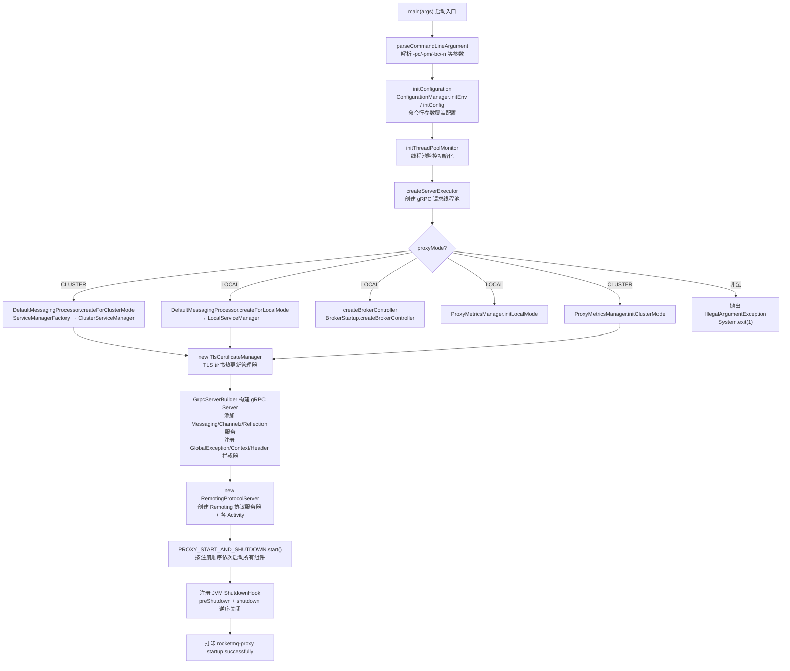
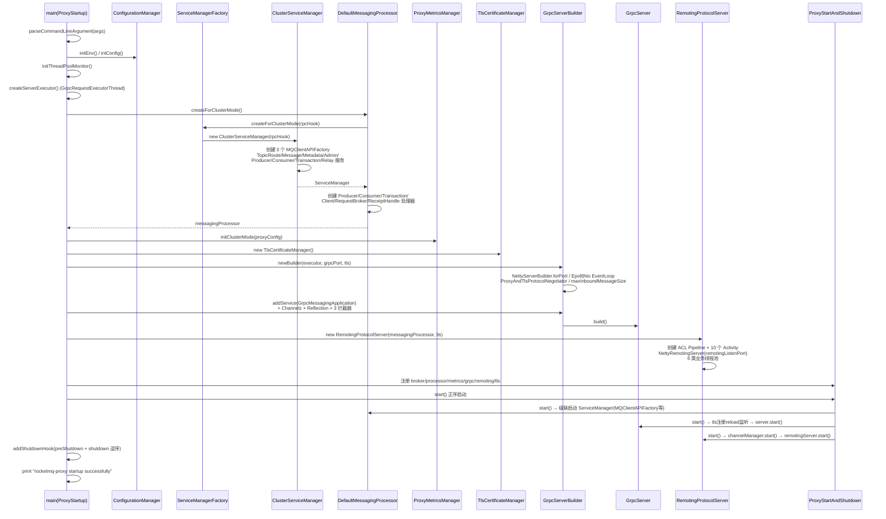
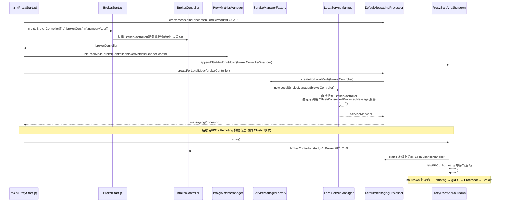
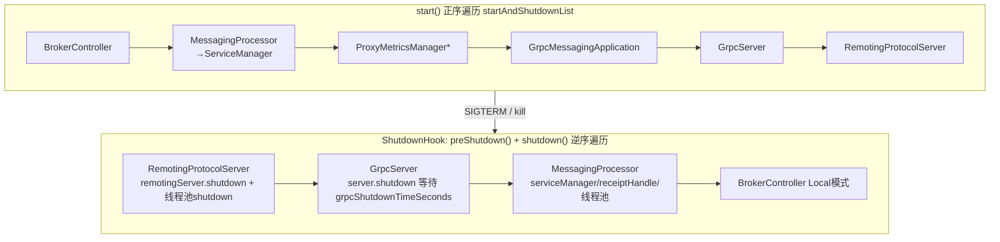

# RocketMQ 5.4.0 Proxy 组件启动流程深度源码分析

> 源码版本：RocketMQ 5.4.0
> 入口类：`org.apache.rocketmq.proxy.ProxyStartup`（proxy 模块）

---

## 1. Proxy 组件概述

Proxy 是 RocketMQ 5.x 引入的**无状态接入层**，定位在客户端与 Broker 之间：

- **Local 模式**：Proxy 与 Broker 同进程部署（Broker 内嵌启动，`BrokerController` 由 Proxy 创建并托管），适合小规模/简单部署。
- **Cluster 模式**：Proxy 独立部署为集群，通过 Remoting 协议访问远端 Broker，适合大规模、云原生部署。

Proxy 同时对外提供两套协议服务：
- **gRPC 协议**（端口 `grpcServerPort`，默认 8081）：服务 5.x 新客户端（gRPC SDK）。
- **Remoting 协议**（端口 `remotingListenPort`，默认 8080）：兼容 4.x 老客户端。

## 2. 核心类职责

| 类 | 文件 | 职责 |
|---|---|---|
| `ProxyStartup` | `proxy/.../ProxyStartup.java` | main 入口，编排整个启动流程 |
| `ProxyStartAndShutdown` | ProxyStartup 内部类 | 组件注册中心，正序 start / 逆序 shutdown |
| `AbstractStartAndShutdown` | `common/.../AbstractStartAndShutdown.java` | 生命周期容器通用实现 |
| `ConfigurationManager` | `proxy/.../config/ConfigurationManager.java` | 初始化 ProxyConfig / AuthConfig |
| `DefaultMessagingProcessor` | `proxy/.../processor/DefaultMessagingProcessor.java` | 消息处理核心门面（Facade），聚合各业务 Processor |
| `ServiceManagerFactory` | `proxy/.../service/ServiceManagerFactory.java` | 按 Local/Cluster 模式创建 ServiceManager |
| `ClusterServiceManager` / `LocalServiceManager` | `proxy/.../service/` | 服务层：路由、消息、元数据、事务、中继等 |
| `GrpcServerBuilder` / `GrpcServer` | `proxy/.../grpc/` | gRPC 服务器构建与启停 |
| `GrpcMessagingApplication` | `proxy/.../grpc/v2/` | gRPC 服务实现（MessagingService） |
| `RemotingProtocolServer` | `proxy/.../remoting/RemotingProtocolServer.java` | Remoting 协议服务器（NettyRemotingServer / MultiProtocolRemotingServer） |
| `TlsCertificateManager` | `proxy/.../service/cert/TlsCertificateManager.java` | TLS 证书热更新管理 |
| `ProxyMetricsManager` | `proxy/.../metrics/ProxyMetricsManager.java` | Proxy 可观测性指标 |

## 3. 启动总体流程图



### 3.1 组件注册顺序（决定启动顺序）

`PROXY_START_AND_SHUTDOWN` 是一个 `CopyOnWriteArrayList`，注册顺序（`start()` 正序遍历、`shutdown()` 逆序遍历）：

```
1. brokerControllerWrapper        (仅 Local 模式，含 BrokerController.start)
2. messagingProcessor             (DefaultMessagingProcessor，其 start 会级联启动 ServiceManager)
3. proxyMetricsManager            (仅 Cluster 模式)
4. GrpcMessagingApplication
5. GrpcServer
6. RemotingProtocolServer
7. TlsCertificateManager
8. grpcExecutor shutdown 钩子等
```

> 注意：`AbstractStartAndShutdown.shutdown()` 从列表**尾部向头部**逆序执行，保证 Remoting 服务器先于 gRPC、gRPC 先于消息处理器、消息处理器先于 Broker 关闭。

## 4. main 方法逐段解析（ProxyStartup.java:67-118）

### 4.1 命令行解析与配置初始化

```java
CommandLineArgument commandLineArgument = parseCommandLineArgument(args);
initConfiguration(commandLineArgument);
```

- `parseCommandLineArgument`（:131）：借助 `ServerUtil.parseCmdLine("mqproxy", ...)`，支持选项：
  - `-bc/--brokerConfigPath`：Local 模式 Broker 配置文件
  - `-pc/--proxyConfigPath`：Proxy 配置文件路径（写入系统属性 `rocketmq.proxy.configPath`）
  - `-pm/--proxyMode`：`local` 或 `cluster`
- `initConfiguration`（:120）：
  1. `ConfigurationManager.initEnv()`：解析 `RMQ_PROXY_HOME`（环境变量 → JVM 属性 → 默认值）；
  2. `ConfigurationManager.intConfig()`：创建 `Configuration` 并加载 `proxy.json` / `rmq-proxy.json` 配置，实例化 `ProxyConfig` 和 `AuthConfig`；
  3. `setConfigFromCommandLineArgument`：命令行参数（namesrvAddr、brokerConfigPath、proxyMode）覆盖配置文件值。

### 4.2 线程池监控与 gRPC 线程池

- `initThreadPoolMonitor`（:242）：用 `ProxyConfig` 中 `enablePrintJstack`、`printJstackInMillis`、`printThreadPoolStatusInMillis` 配置 `ThreadPoolMonitor` 并 `init()`，周期性打印线程池状态 / 水位线日志。
- `createServerExecutor`（:227）：创建 gRPC 请求处理线程池 `GrpcRequestExecutorThread`（核心=最大=`grpcThreadPoolNums`，队列容量=`grpcThreadPoolQueueCapacity`），并注册 shutdown 回调。

### 4.3 创建 MessagingProcessor（模式分叉点）

`createMessagingProcessor`（:173）是启动流程中最关键的分叉：

**Cluster 模式**
1. `DefaultMessagingProcessor.createForClusterMode()`：
   - 若 `enableAclRpcHookForClusterMode=true`，从 `AuthConfig.innerClientAuthenticationCredentials` 或 `$ROCKETMQ_HOME/conf/acl_tools.yml` 构建 `AclClientRPCHook`（Proxy 访问 Broker 的内部凭证）；
   - `ServiceManagerFactory.createForClusterMode(rpcHook)` → `new ClusterServiceManager(rpcHook)`。
2. `ClusterServiceManager` 构造（ClusterServiceManager.java:78-127）创建了完整的服务层：
   - 3 个 `MQClientAPIFactory`（messaging 多实例 / operation 单实例 / transaction 单实例）—— Proxy 到 Broker 的 Remoting 客户端工厂；
   - `ClusterTopicRouteService`（路由）、`ClusterMessageService`（消息收发）、`ClusterMetadataService`（元数据）、`DefaultAdminService`、`ProducerManager` / `ClusterConsumerManager`（客户端连接管理）、`ClusterTransactionService`（事务回查）、`ClusterProxyRelayService`；
   - `init()` 中注册定时任务：每 10s 扫描不活跃的 Producer/Consumer channel。
3. `ProxyMetricsManager.initClusterMode(config)`：独立初始化 Proxy 指标。

**Local 模式**
1. `createBrokerController`（:216）：拼装 `-c brokerConfigPath [-n namesrvAddr]` 参数，调用 **`BrokerStartup.createBrokerController`** 创建内嵌 Broker（此时并未启动）；
2. `ProxyMetricsManager.initLocalMode(brokerController.getBrokerMetricsManager(), config)`：复用 Broker 的指标体系；
3. 将 `brokerController` 包装成 `StartAndShutdown`（:184-201），注册进 `PROXY_START_AND_SHUTDOWN`——因此 **Broker 在整个 Proxy 组件链中第一个被 start、最后一个被 shutdown**；
4. `DefaultMessagingProcessor.createForLocalMode(brokerController)` → `LocalServiceManager`（直接持有 `BrokerController`，进程内调用，无需网络）。

**DefaultMessagingProcessor 构造**（DefaultMessagingProcessor.java:79-107）：
- 创建 `ProducerProcessorExecutor`、`ConsumerProcessorExecutor` 两个业务线程池；
- 组装 6 大业务处理器：`ProducerProcessor`、`ConsumerProcessor`、`TransactionProcessor`、`ClientProcessor`、`RequestBrokerProcessor`、`ReceiptHandleProcessor`；
- `init()` 把 `serviceManager`、`receiptHandleProcessor` 及两个线程池的 shutdown 挂到自身生命周期——即 messagingProcessor.start() 会级联启动 ServiceManager。

### 4.4 TLS 证书管理器

```java
TlsCertificateManager tlsCertificateManager = new TlsCertificateManager();
```
负责监听证书文件变更并通知 gRPC（`GrpcTlsReloadHandler` → 重载 `ProxyAndTlsProtocolNegotiator` 的 SslContext）与 Remoting（`RemotingTlsReloadHandler`）两个服务器热更新 TLS。

### 4.5 构建 gRPC 服务器

`GrpcServerBuilder.newBuilder(executor, grpcServerPort, tlsCertificateManager)`（GrpcServerBuilder.java:54-83）：

- 基于 gRPC shaded **`NettyServerBuilder.forPort(port)`**；
- `protocolNegotiator(new ProxyAndTlsProtocolNegotiator())`：自定义协议协商，支持明文/TLS；
- Boss/Worker 事件循环：`enableGrpcEpoll` 为 true 用 `EpollEventLoopGroup`（Linux），否则 `NioEventLoopGroup`；
- `maxInboundMessageSize(grpcMaxInboundMessageSize)`、`maxConnectionIdle(grpcClientIdleTimeMills)`；
- 注册服务：
  - `GrpcMessagingApplication.create(messagingProcessor)` —— 核心消息服务（v2 协议实现）；
  - `ChannelzService`（gRPC 通道观测）、`ProtoReflectionService`（反射，支持 grpcurl 调试）；
- `configInterceptor()` 依次注册三个拦截器：`GlobalExceptionInterceptor`（全局异常→gRPC Status）、`ContextInterceptor`（创建 `ProxyContext`）、`HeaderInterceptor`（解析语言/版本等 header）；
- `shutdownTime(grpcShutdownTimeSeconds)` 设定优雅关闭等待时长；
- `build()` 产出 `GrpcServer`（内部持有 gRPC `Server` 实例）。

### 4.6 创建 Remoting 协议服务器

`new RemotingProtocolServer(messagingProcessor, tlsCertificateManager)`（RemotingProtocolServer.java:96-130）：

- 构建 `RemotingChannelManager`（管理客户端 Channel → Proxy 会话）；
- 构建 ACL 请求处理管道 `RequestPipeline`：`ContextInitPipeline → AuthenticationPipeline → AuthorizationPipeline`；
- 创建 10 个 `Activity`（Remoting 请求处理器）：`GetTopicRoute` / `ClientManager` / `ConsumerManager` / `SendMessage` / `RecallMessage` / `Transaction` / `PullMessage` / `PopMessage` / `AckMessage` / `ChangeInvisibleTime`；
- 配置 TLS 系统属性（`tlsTestModeEnable`、certPath、keyPath）；
- `enableRemotingLocalProxyGrpc=true` 时使用 `MultiProtocolRemotingServer`（同一端口同时识别 Remoting 与 HTTP/gRPC 流量），否则 `NettyRemotingServer`，监听 `remotingListenPort`；
- 创建按请求类型隔离的线程池：`sendMessageExecutor`、`pullMessageExecutor`、`heartbeatExecutor`、`updateOffsetExecutor`、`topicRouteExecutor`、`defaultExecutor`，均带 `ThreadPoolHeadSlowTimeMillsMonitor` 水位监控。

### 4.7 统一启动

```java
PROXY_START_AND_SHUTDOWN.start();   // 正序逐个调用 start()
```

各关键组件的 `start()` 行为：

| 组件 | start() 行为 |
|---|---|
| brokerControllerWrapper (Local) | `brokerController.start()`：启动 Broker 全部服务（Netty、存储、定时任务等），打印 boot success |
| DefaultMessagingProcessor | 级联启动 ServiceManager（Cluster：启动各 MQClientAPIFactory、TopicRouteService 等；Local：启动内嵌服务与相关定时任务） |
| ProxyMetricsManager (Cluster) | 启动指标导出 |
| GrpcMessagingApplication | 初始化 gRPC 业务层 |
| GrpcServer | 注册 TLS reload 监听 → `server.start()` 绑定 gRPC 端口 |
| RemotingProtocolServer | 注册 TLS reload 监听 → `remotingChannelManager.start()` → `defaultRemotingServer.start()` 绑定 Remoting 端口 |

### 4.8 关闭钩子

```java
Runtime.getRuntime().addShutdownHook(...  preShutdown(); shutdown();  ...)
```
收到 SIGTERM/kill 时：先 `preShutdown()`（各组件可选的预关闭，如摘流量），再**逆序** `shutdown()`：Remoting → gRPC → MessagingProcessor →（Local）Broker，各线程池 `executor::shutdown`。

## 5. 启动时序图

### 5.1 Cluster 模式启动时序



### 5.2 Local 模式启动时序（差异部分）



## 6. 生命周期与关闭流程图


*ProxyMetricsManager 仅 Cluster 模式注册。

## 7. 关键设计要点总结

1. **统一的 StartAndShutdown 生命周期容器**：所有组件实现 `StartAndShutdown` 接口并注册到 `ProxyStartAndShutdown`（基于 `CopyOnWriteArrayList`），start 正序、shutdown 逆序，形成依赖倒置的优雅启停模型；且组件可嵌套（`DefaultMessagingProcessor` 内嵌 `ServiceManager`），形成启动树。
2. **两种部署形态共用一套代码**：`ServiceManagerFactory` 在创建 `MessagingProcessor` 时按 `proxyMode` 分叉为 `LocalServiceManager`（进程内直连 BrokerController）或 `ClusterServiceManager`（通过多个 `MQClientAPIFactory` 网络访问 Broker），上层 gRPC/Remoting 协议层完全无感。
3. **双协议并存**：gRPC（新客户端，自定义 `ProxyAndTlsProtocolNegotiator` 支持明文/TLS 协商）与 Remoting（4.x 兼容，`MultiProtocolRemotingServer` 还可在 Remoting 端口同时识别 gRPC 流量，实现 `enableRemotingLocalProxyGrpc` 单端口双协议）。
4. **面向异步的处理器架构**：`MessagingProcessor` 全部返回 `CompletableFuture`，gRPC/Remoting 两个协议服务器只是协议适配层，业务逻辑收敛到 `DefaultMessagingProcessor` 的 6 大 Processor + ServiceManager。
5. **可观测性内建**：`ThreadPoolMonitor`（线程池状态/jstack 打印 + 水位线监控）、`ProxyMetricsManager`（Local 复用 Broker 指标 / Cluster 独立指标）、`ChannelzService` + `ProtoReflectionService`（gRPC 自省与调试）。
6. **TLS 热更新**：`TlsCertificateManager` 监听证书变更，通过 Listener 机制通知 gRPC 与 Remoting 两侧重载 SSL 上下文，无需重启进程。
7. **健壮性**：main 中任一环节异常即 `System.exit(1)`；JVM ShutdownHook 保证 kill 时 preShutdown → 逆序 shutdown，先关对外服务再关内部依赖。

## 8. 关键源码位置速查

| 内容 | 位置 |
|---|---|
| main 入口 / 组件编排 | `proxy/src/main/java/org/apache/rocketmq/proxy/ProxyStartup.java:67` |
| 配置初始化 | `ProxyStartup.java:120`、`config/ConfigurationManager.java:32` |
| 模式分叉创建 Processor | `ProxyStartup.java:173` |
| 内嵌 Broker 创建 | `ProxyStartup.java:216` |
| gRPC 服务器构建 | `grpc/GrpcServerBuilder.java:54` |
| gRPC 启停 | `grpc/GrpcServer.java:53` |
| Remoting 服务器构建 | `remoting/RemotingProtocolServer.java:96` |
| Remoting 启停 | `remoting/RemotingProtocolServer.java:244,259` |
| 生命周期容器 | `common/src/main/java/org/apache/rocketmq/common/utils/AbstractStartAndShutdown.java:22` |
| Cluster 服务层组装 | `service/ClusterServiceManager.java:78` |
