# RocketMQ 5.4.0 Proxy 源码深度分析：Remoting 端口如何把客户端请求转发给 gRPC Server

> 源码版本：RocketMQ 5.4.0
> 涉及包：`org.apache.rocketmq.proxy.remoting.protocol.http2proxy`、`org.apache.rocketmq.proxy.remoting.protocol`、`org.apache.rocketmq.proxy.grpc`
>
> 核心结论：当 `enableRemotingLocalProxyGrpc=true` 时，Proxy 的 8080 端口（`remotingListenPort`）同时服务 remoting（4.x 客户端）和 gRPC（5.x 客户端）两种协议。gRPC 流量经过 `ProtocolNegotiationHandler` 识别后，由 `Http2ProtocolProxyHandler` 建立**进程内 TCP 正向代理**：前端连接（inboundChannel）↔ 后端连接（outboundChannel），`Http2ProxyFrontendHandler` 与 `Http2ProxyBackendHandler` 互持对方 Channel 做双向字节搬运，并用 HAProxy PROXY protocol v2 把客户端真实地址透传给 gRPC 服务器。

---

## 目录

1. [总体架构：两条 Channel 与两个 Handler](#1-总体架构两条-channel-与两个-handler)
2. [触发条件：协议识别如何走到转发路径](#2-触发条件协议识别如何走到转发路径)
3. [Http2ProtocolProxyHandler.config()：建立代理的完整过程](#3-httpprotocolproxyhandlerconfig建立代理的完整过程)
4. [inboundChannel 与 outboundChannel 深度对比](#4-inboundchannel-与-outboundchannel-深度对比)
5. [Http2ProxyFrontendHandler 与 Http2ProxyBackendHandler 深度对比](#5-httpproxyfrontendhandler-与-httpproxybackendhandler-深度对比)
6. [数据流转全景：请求方向与响应方向](#6-数据流转全景请求方向与响应方向)
7. [背压机制：write-then-read 模式](#7-背压机制write-then-read-模式)
8. [TLS 处理：两段式加密](#8-tls-处理两段式加密)
9. [HAProxyMessageForwarder：真实地址透传](#9-haproxymessageforwarder真实地址透传)
10. [生命周期联动与异常处理](#10-生命周期联动与异常处理)
11. [gRPC 侧的接收：ProxyAndTlsProtocolNegotiator](#11-grpc-侧的接收proxyandtlsprotocolnegotiator)
12. [完整时序图](#12-完整时序图)
13. [设计精妙之处总结](#13-设计精妙之处总结)

---

## 1. 总体架构：两条 Channel 与两个 Handler

### 1.1 架构图

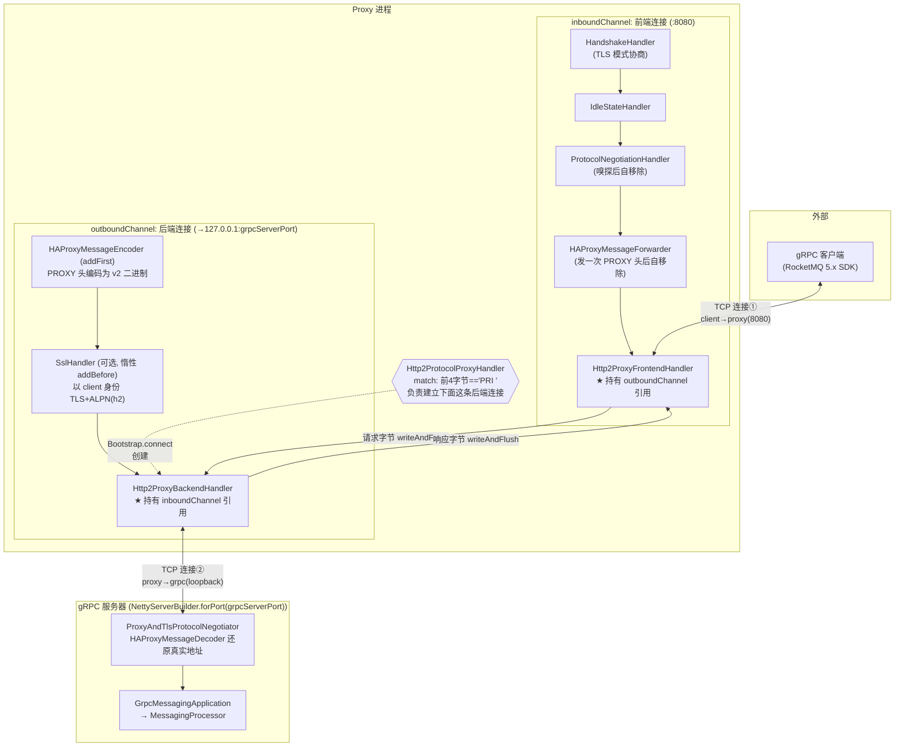

### 1.2 四个关键角色一句话定位

| 角色 | 本质 | 一句话职责 |
|---|---|---|
| `inboundChannel` | 8080 端口 accept 出的 `SocketChannel` | 客户端与 Proxy 之间的"前端"连接，数据从这里进来 |
| `outboundChannel` | `Bootstrap.connect()` 新建的 `SocketChannel` | Proxy 与本机 gRPC 服务器之间的"后端"连接，数据从这里出去 |
| `Http2ProxyFrontendHandler` | 挂在 **inboundChannel** pipeline 尾部的 `ChannelInboundHandlerAdapter` | 读前端字节 → 写后端连接（请求方向） |
| `Http2ProxyBackendHandler` | 挂在 **outboundChannel** pipeline 尾部的 `ChannelInboundHandlerAdapter` | 读后端字节 → 写前端连接（响应方向） |

---

## 2. 触发条件：协议识别如何走到转发路径

### 2.1 入口：MultiProtocolRemotingServer 的 pipeline 组装

（MultiProtocolRemotingServer.java:79-87）

```java
protected ChannelPipeline configChannel(SocketChannel ch) {
    return ch.pipeline()
        .addLast(defaultEventExecutorGroup, HANDSHAKE_HANDLER_NAME, new HandshakeHandler())
        .addLast(defaultEventExecutorGroup,
            new IdleStateHandler(0, 0, serverChannelMaxIdleTimeSeconds),
            new ProtocolNegotiationHandler(this.remotingProtocolHandler)  // 兜底
                .addProtocolHandler(this.http2ProtocolProxyHandler));     // gRPC 探测
}
```

### 2.2 嗅探决策流程

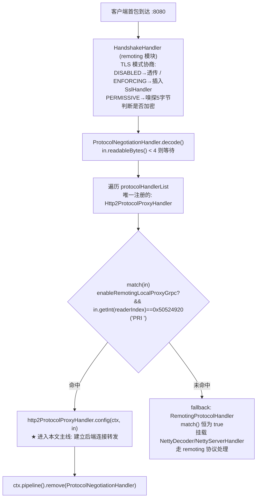

关键细节（Http2ProtocolProxyHandler.java:84-91）：

```java
public boolean match(ByteBuf in) {
    if (!ConfigurationManager.getProxyConfig().isEnableRemotingLocalProxyGrpc()) {
        return false;   // 关闭共端口特性时, gRPC 流量不会被代理
    }
    // HTTP/2 连接前言 "PRI * HTTP/2.0\r\n\r\nSM\r\n\r\n" 的前 4 字节
    return in.getInt(in.readerIndex()) == PRI_INT;
}
```

- `getInt(readerIndex)` **只读不消费**（readerIndex 不前进），所以完整的 HTTP/2 前言连同后续帧会原封不动地流向 gRPC 服务器，gRPC 侧的协议协商照常工作。
- 若 remoting 协议前 4 字节（body 长度字段）碰巧等于 `0x50524920`，意味着 body 长度约 1.28GB，远超任何合法请求——因此 4 字节判定在实际中是安全的（源码注释也承认这个理论风险）。

---

## 3. Http2ProtocolProxyHandler.config()：建立代理的完整过程

（Http2ProtocolProxyHandler.java:94-134，逐段解析）

```java
@Override
public void config(final ChannelHandlerContext ctx, final ByteBuf msg) {
    // ── ① 前端连接 ──────────────────────────────────────────
    final Channel inboundChannel = ctx.channel();   // 客户端→Proxy(:8080) 的连接

    ProxyConfig config = ConfigurationManager.getProxyConfig();

    // ── ② 创建 Netty 客户端, 连接本机 gRPC 端口 ────────────
    Bootstrap b = new Bootstrap();
    b.group(inboundChannel.eventLoop())             // ★ 复用前端连接的 EventLoop
        .channel(ctx.channel().getClass())          // 同类型 channel (Nio/Epoll)
        .handler(new ChannelInitializer<Channel>() {
            protected void initChannel(Channel ch) {
                ch.pipeline().addLast(null, Http2ProxyBackendHandler.HANDLER_NAME,
                        new Http2ProxyBackendHandler(inboundChannel));  // ★ 传入前端连接
            }
        })
        .option(ChannelOption.AUTO_READ, false)     // ★ 关闭自动读(背压前提)
        .option(ChannelOption.CONNECT_TIMEOUT_MILLIS, config.getLocalProxyConnectTimeoutMs());

    ChannelFuture f;
    try {
        f = b.connect(LOCAL_HOST, config.getGrpcServerPort()).sync();  // 127.0.0.1:grpcServerPort
    } catch (Exception e) {
        log.error("connect http2 server failed. port:{}", config.getGrpcServerPort(), e);
        inboundChannel.close();                     // 建连失败 → 直接关客户端连接
        return;
    }

    // ── ③ 后端连接就绪 ─────────────────────────────────────
    final Channel outboundChannel = f.channel();

    // ── ④ PROXY protocol 透传管道 ──────────────────────────
    configPipeline(inboundChannel, outboundChannel);

    // ── ⑤ 前端 TLS handler 准备(惰性添加) ─────────────────
    SslHandler sslHandler = null;
    if (sslContext != null) {
        sslHandler = sslContext.newHandler(outboundChannel.alloc(), LOCAL_HOST, config.getGrpcServerPort());
    }

    // ── ⑥ 前端转发 handler 上线 ────────────────────────────
    ctx.pipeline().addLast(new Http2ProxyFrontendHandler(outboundChannel, sslHandler));  // ★ 传入后端连接
}

protected void configPipeline(Channel inboundChannel, Channel outboundChannel) {
    inboundChannel.pipeline().addLast(new HAProxyMessageForwarder(outboundChannel));
    outboundChannel.pipeline().addFirst(HAProxyMessageEncoder.INSTANCE);
}
```

六个步骤的要点：

| 步骤 | 代码位置 | 设计意图 |
|---|---|---|
| ① 前端连接 | `ctx.channel()` | `ctx` 是 `ProtocolNegotiationHandler` 的 context，channel 即客户端连到 8080 的原生 `SocketChannel`，**此刻 pipeline 里还没有 NettyDecoder/NettyServerHandler**（那些只在 remoting 分支挂载） |
| ② 复用 EventLoop | `b.group(inboundChannel.eventLoop())` | 两条连接绑定**同一个 IO 线程**：转发零锁、零线程切换；也保证 `sync()` 不会在同一个 EventLoop 里死锁（连接完成事件由 Netty 特殊处理） |
| ② AUTO_READ=false | 后端连接不自动读 | 必须等后端连接 + `Http2ProxyBackendHandler.channelActive` 里手动 `ctx.read()` 之后才开始读前端数据，防止数据涌进来无处可写 |
| ③ sync() 阻塞建连 | `connect(...).sync()` | 在 EventLoop 线程里同步等待（loopback 建连微秒级）；失败则关闭客户端连接 |
| ④ configPipeline | 见第 9 节 | 在业务数据之前发送 PROXY protocol 头（v1 要求头必须位于数据流最前） |
| ⑤⑥ handler 上线 | `addLast(FrontendHandler)` | 至此双向桥搭好，`ProtocolNegotiationHandler` 的 decode 返回后被移除，累积缓冲中的剩余字节（含未消费的 `"PRI "` 前 4 字节和整个前言）继续向 `HAProxyMessageForwarder → Http2ProxyFrontendHandler` 传递 |

---

## 4. inboundChannel 与 outboundChannel 深度对比

| 维度 | inboundChannel | outboundChannel |
|---|---|---|
| **创建者** | Netty `ServerBootstrap` accept（8080 端口监听） | `Bootstrap.connect()`（Http2ProtocolProxyHandler.config 内） |
| **连接对端** | 外部 gRPC 客户端（任意地址） | `127.0.0.1:grpcServerPort`（本机 gRPC 服务器） |
| **Proxy 扮演角色** | server（被动接受连接） | client（主动发起连接） |
| **变量名含义** | "入站"——数据从这条连接**进入 Proxy** | "出站"——数据从 Proxy **发出**到 gRPC |
| **承载协议** | TLS（可选）+ HTTP/2 字节流（不解析） | PROXY 头 + TLS（可选）+ HTTP/2 字节流（不解析） |
| **pipeline 上的转发 handler** | `Http2ProxyFrontendHandler`（尾部） | `Http2ProxyBackendHandler`（尾部） |
| **持有者** | `Http2ProxyBackendHandler.inboundChannel` 字段 | `Http2ProxyFrontendHandler.outboundChannel` 字段 |
| **AUTO_READ** | true（默认） | **false**（手动控制读） |
| **EventLoop** | 二者**相同**（`b.group(inboundChannel.eventLoop())`） | 同左 |
| **数据方向** | 收：客户端请求 / 写：gRPC 响应 | 写：客户端请求 / 收：gRPC 响应 |

**注意一个容易混淆的点**：inbound/outbound 说的是**连接相对于 Proxy 的方向**（进来/出去），而不是数据流向。两条连接上都有读和写：

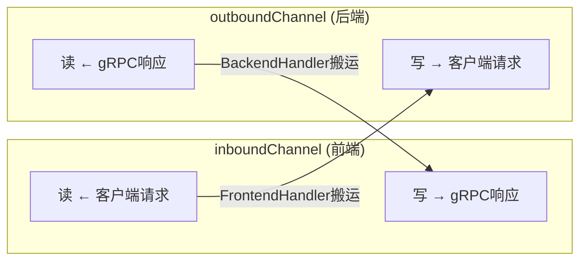

---

## 5. Http2ProxyFrontendHandler 与 Http2ProxyBackendHandler 深度对比

两者都是 `ChannelInboundHandlerAdapter`（只关心入站数据，转发用 `writeAndFlush` 出站即可），结构几乎镜像对称：

| 维度 | Http2ProxyFrontendHandler | Http2ProxyBackendHandler |
|---|---|---|
| **挂载位置** | inboundChannel.pipeline（`addLast`，Http2ProtocolProxyHandler.java:128） | outboundChannel.pipeline（`ChannelInitializer` 内，Http2ProtocolProxyHandler.java:106-107） |
| **构造参数** | `outboundChannel` + `sslHandler`（可 null） | `inboundChannel` |
| **HANDLER_NAME** | `"SslHandler"`（复用名，配合惰性 addBefore 查重） | `"Http2ProxyBackendHandler"` |
| **channelRead** | 前端字节 → `outboundChannel.writeAndFlush` | 后端字节 → `inboundChannel.writeAndFlush` |
| **channelActive** | （无，前端连接早已 active） | `ctx.read()` —— 后端就绪后手动放行读，触发前端数据开始流动 |
| **channelInactive** | `closeOnFlush(outboundChannel)` | `closeOnFlush(inboundChannel)` |
| **exceptionCaught** | 关闭自己所在 channel | 关闭自己所在 channel |
| **额外职责** | 惰性给 outboundChannel 插 `SslHandler`（首个数据到达时） | 无 |

### 5.1 Frontend 的 channelRead 全文解析（Http2ProxyFrontendHandler.java:46-61）

```java
public void channelRead(final ChannelHandlerContext ctx, Object msg) {
    if (outboundChannel.isActive()) {
        // 惰性 TLS: 仅在第一次有数据要转发时, 才把 sslHandler 插到 BackendHandler 之前
        if (sslHandler != null && outboundChannel.pipeline().get(HANDLER_NAME) == null) {
            outboundChannel.pipeline().addBefore(Http2ProxyBackendHandler.HANDLER_NAME, HANDLER_NAME, sslHandler);
        }
        // 核心搬运: 前端收到的 ByteBuf 原样写到后端连接
        outboundChannel.writeAndFlush(msg).addListener((ChannelFutureListener) future -> {
            if (future.isSuccess()) {
                ctx.channel().read();   // ★ 写成功才继续读下一批 → 背压
            } else {
                future.channel().close();
            }
        });
    }
    // 注意: outboundChannel 不活跃时 msg 无人释放, 依赖连接关闭流程回收
}
```

- `msg` 是 **`ByteBuf`（原始字节）**，不是任何解码后的对象——前端 pipeline 没有 HTTP/2 解码器，Proxy 对 gRPC 语义完全无感知，纯搬运。
- 惰性 TLS 的判断 `pipeline().get("SslHandler") == null` 之所以用字符串名查重，是因为 Frontend 自己的 HANDLER_NAME 恰好也定义为 `"SslHandler"`，保证只添加一次。

### 5.2 Backend 的 channelRead 全文解析（Http2ProxyBackendHandler.java:46-57）

```java
public void channelRead(final ChannelHandlerContext ctx, Object msg) {
    inboundChannel.writeAndFlush(msg).addListener(new ChannelFutureListener() {
        public void operationComplete(ChannelFuture future) {
            if (future.isSuccess()) {
                ctx.channel().read();   // ★ 对称的背压逻辑
            } else {
                future.channel().close();
            }
        }
    });
}
```

与 Frontend 完全对称，只是方向相反、没有 TLS 逻辑（TLS 握手由 outboundChannel 上的 SslHandler 在数据到达 BackendHandler 之前透明完成）。

### 5.3 关联方式：互相持有对方 Channel

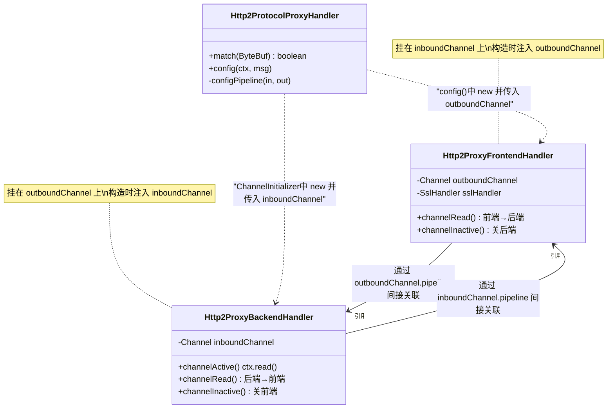

**交叉持有是整个代理的骨架**：Frontend 挂在前端连接却引用后端连接，Backend 挂在后端连接却引用前端连接——数据因此能"过桥"。

---

## 6. 数据流转全景：请求方向与响应方向

### 6.1 请求方向（客户端 → gRPC 服务器）

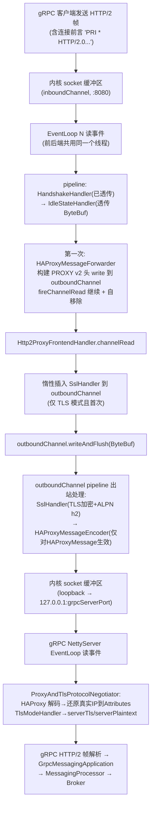

### 6.2 响应方向（gRPC 服务器 → 客户端）

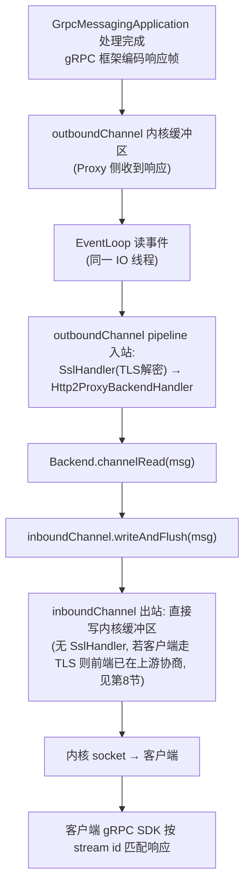

### 6.3 一个完整 gRPC 调用在链路上的字节构成

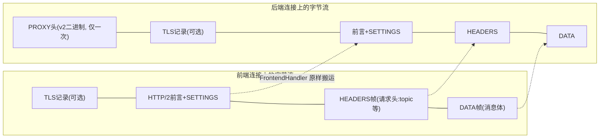

---

## 7. 背压机制：write-then-read 模式

这是两个 handler 最值得学习的设计（源自 Netty `HexDumpProxy` 示例）：

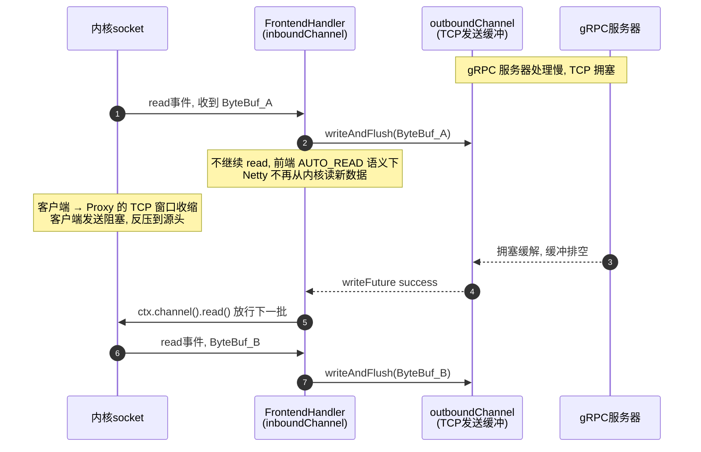

机制要点：

1. **后端连接 `AUTO_READ=false`** 是前提：`Http2ProxyBackendHandler.channelActive()` 里的 `ctx.read()` 是手动闸门。
2. 前端连接虽是 AUTO_READ=true，但 `channelRead` 后**只有 write 成功回调里才再次 `read()`**。准确地说，Netty 的 AUTO_READ 会在每次读事件后自动续 read；这里的 `ctx.channel().read()` 在写完成前起到"不追加读"的节流效果（写阻塞期间 Netty 会因 `channelReadWritabilityChanged`/未消费而暂停），加上 write 失败即 close 的兜底，整体保证 Proxy 堆内存不会无限堆积未发出的 `ByteBuf`。
3. **TCP 层反压传导链**：gRPC 慢 → loopback TCP 窗口收缩 → outboundChannel 写不出去 → Frontend 不再 read → 前端 TCP 窗口收缩 → **客户端发送被阻塞**。整条链路无一处无界缓冲。
4. 响应方向由 BackendHandler 对称实现，防止客户端慢导致 Proxy 堆积 gRPC 响应。

---

## 8. TLS 处理：两段式加密

前端（客户端↔Proxy:8080）与后端（Proxy↔gRPC）是**两条独立 TCP 连接，TLS 各自独立握手**：

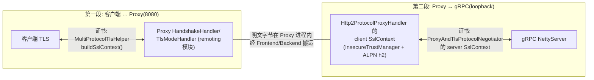

源码依据：

- **客户端 SslContext**（Http2ProtocolProxyHandler.java:60-76）：`SslContextBuilder.forClient()` + `InsecureTrustManagerFactory`（信任本机 gRPC 服务器的任意证书，loopback 场景安全）+ **ALPN 强制协商 h2**（gRPC 要求）。
- **TLS 模式联动**（Http2ProtocolProxyHandler.java:62-64）：`TlsMode.DISABLED` 时 `sslContext=null`，后端明文直连——后端是否加密跟随全局 `TlsSystemConfig.tlsMode`，而 `MultiProtocolTlsHelper.buildSslContext()` 保证了 gRPC 服务器端证书与 remoting 端一致性。
- **惰性插入**（Http2ProxyFrontendHandler.java:48-50）：SslHandler 不在建连时挂，而是在**第一个数据到来**时 `addBefore(BackendHandler)`，避免建连失败时白初始化；`pipeline().get("SslHandler") == null` 查重保证只插一次。
- 由此产生一个重要推论：**TLS 在 Proxy 进程内被解密再加密**（第一段终结于 remoting 层，第二段重新以 client 身份握手），这是端口代理模式的固有代价；gRPC 端 `ProxyAndTlsProtocolNegotiator.TlsModeHandler` 负责第二段的 server 侧协商（含 ENFORCING/DISABLED/嗅探三模式，ProxyAndTlsProtocolNegotiator.java:265-285）。

---

## 9. HAProxyMessageForwarder：真实地址透传

### 9.1 为什么需要

从 gRPC 服务器视角，`outboundChannel` 的对端是 `127.0.0.1`——真实客户端 IP 被 Proxy"吃掉"了，而鉴权（IP 白名单）、日志、慢请求统计、客户端地址展示都需要真实地址。业界标准做法是 **HAProxy PROXY protocol**：代理在转发数据前先发一个描述原始连接四元组的头。

### 9.2 双端配合

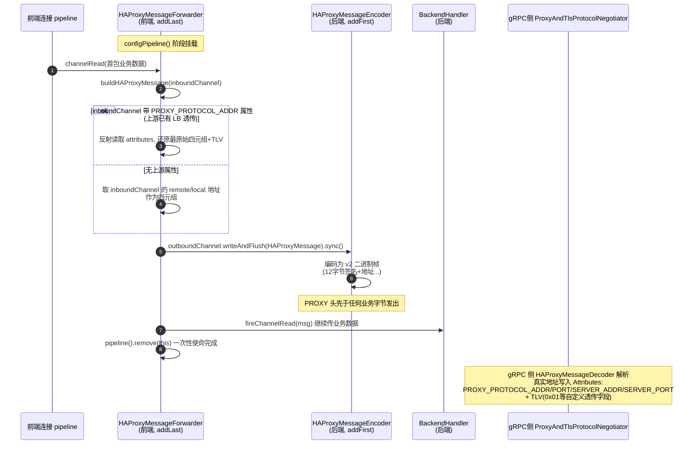

### 9.3 源码细节（HAProxyMessageForwarder.java）

- **版本选择**：`HAProxyProtocolVersion.V2`（二进制格式），由后端连接上的 `HAProxyMessageEncoder.INSTANCE` 编码；gRPC 侧 `HAProxyMessageDecoder` 能自动识别 v1/v2。
- **地址来源优先级**：若 `inboundChannel` 自身带有 `AttributeKeys.PROXY_PROTOCOL_ADDR`（说明客户端前面还有一层 LB/代理已经透传过），则用反射（`FieldUtils.readField(FIELD_ATTRIBUTE, channel)`）读出全部 `PROXY_PROTOCOL_*` 属性和 `TLV` **原样转发**——即支持**多级代理链**的地址保真；否则用本连接的 `remoteAddress/localAddress` 构造四元组。
- **协议族判断**：IPv6 判断 `AclUtils.isColon(sourceAddress)` → `TCP6` / `TCP4`。
- **一次性 handler**：`finally { ctx.pipeline().remove(this); }`——转发一次 PROXY 头后自移除，后续字节不再经过它。
- **TLV 透传**：所有 `PROXY_PROTOCOL_TLV_PREFIX` 开头的 channel 属性被编码为 `HAProxyTLV`（类型字节 + 值），供 gRPC 侧扩展使用。

---

## 10. 生命周期联动与异常处理

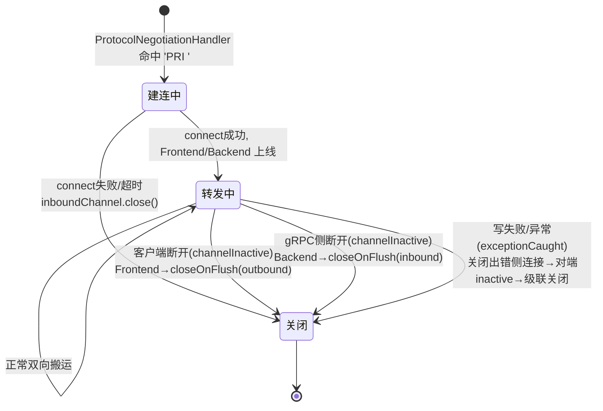

- `closeOnFlush(ch)`（Http2ProxyFrontendHandler.java:79-83）：`writeAndFlush(EMPTY_BUFFER).addListener(CLOSE)` —— **先冲干净排队数据再关**，不截断半条响应。
- 双向互关形成**级联**：任一侧关闭 → 对应 handler 的 `channelInactive` → `closeOnFlush(另一侧)` → 另一侧也触发 inactive →（幂等，active 检查防重复）。**不留半开连接**。
- gRPC 侧的 `maxConnectionIdle`（GrpcServerBuilder.java:79）超时关闭 loopback 连接时，同样会经 BackendHandler 级联关掉客户端连接——空闲回收链路完整。

---

## 11. gRPC 侧的接收：ProxyAndTlsProtocolNegotiator

后端连接到达 gRPC 服务器后的处理（ProxyAndTlsProtocolNegotiator.java:139-183, 251-300），与本文前半段呼应：

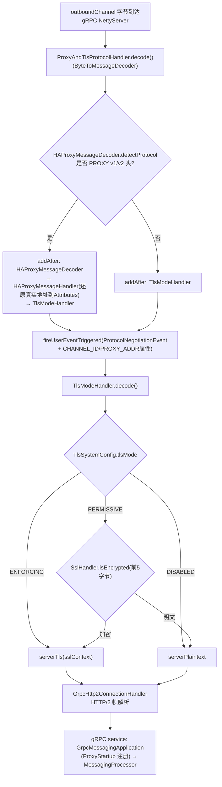

这就是为什么 Proxy 必须在业务数据前先发 PROXY 头：gRPC 侧的 `ProxyAndTlsProtocolHandler` 在**任何 TLS/HTTP/2 处理之前**先探测并消费掉 PROXY 头，把真实四元组放进 gRPC `Attributes`，随 `ProtocolNegotiationEvent` 传递给后续所有拦截器（`ContextInterceptor` 等）和业务层。

---

## 12. 完整时序图

从客户端建连到收到响应的端到端全流程：

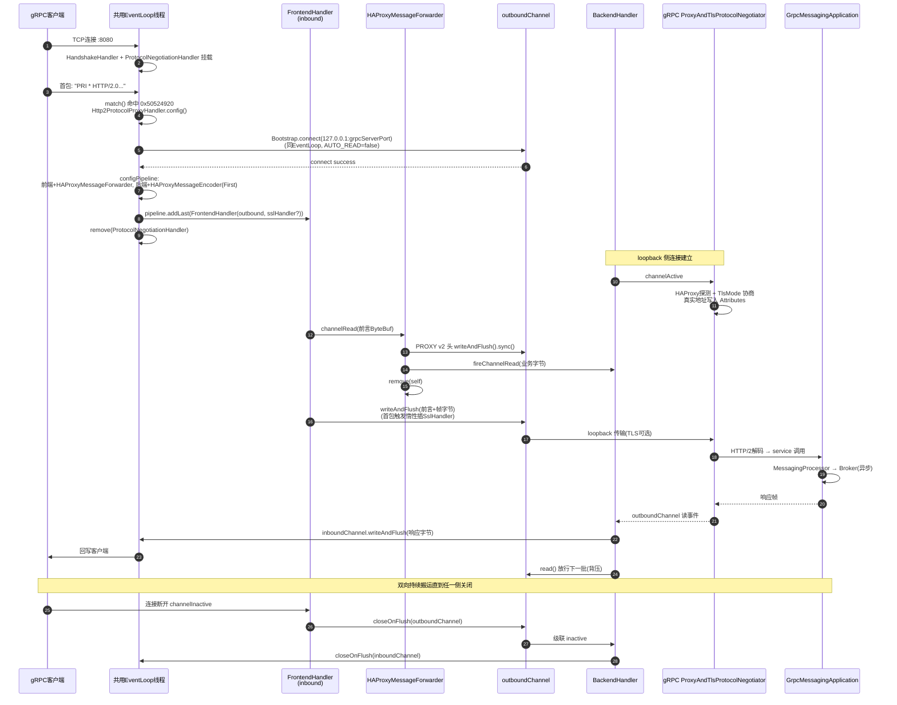

---

## 13. 设计精妙之处总结

1. **最小侵入的共端口方案**：不改 gRPC 服务器一行代码、不改 remoting 框架一行代码，仅凭一个 `ByteToMessageDecoder` 嗅探 4 字节 + 一个进程内 TCP 代理，就实现了 8080 端口同时服务 4.x（remoting）与 5.x（gRPC）客户端。关闭开关 `enableRemotingLocalProxyGrpc` 即退回纯 remoting 服务器。

2. **HexDumpProxy 模式的教科书实现**：Frontend/Backend 互持 Channel、共用 EventLoop、write-then-read 背压、closeOnFlush 级联关闭——四个要素共同保证转发的线程安全（零锁）、内存安全（零无界缓冲）与连接一致性（零半开）。

3. **语义透明**：Proxy 全程只搬 `ByteBuf`，不解析 HTTP/2、不知道 gRPC 语义——gRPC 协议升级、新 RPC 方法、流式语义对 Proxy 零影响。代价是 loopback 上多一次拷贝与（TLS 模式下的）一次多余的解密-再加密。

4. **PROXY protocol 保证地址与多级代理兼容**：`HAProxyMessageForwarder` 不仅补齐自身代理造成的地址丢失，还会把上游 LB 已透传的四元组/TLV **原样续传**（反射读 attributes），支持任意深度的代理链；v2 二进制格式由 Netty 内置编解码器处理，gRPC 侧还原成 `Attributes` 供鉴权/观测使用。

5. **惰性 TLS**：后端 SslHandler 在第一个真实数据到达时才插入，且通过 pipeline 名查重防重复——建连失败路径零浪费。

6. **`getInt(readerIndex)` 只读不消费**：协议探测不破坏字节流，完整的 HTTP/2 前言得以原样送达 gRPC 服务器，其自身的协议协商器（`ProxyAndTlsProtocolNegotiator`）照常工作。

---

## 附：源码文件索引（相对 `proxy/src/main/java/org/apache/rocketmq/proxy/`）

| 文件 | 关键位置 |
|---|---|
| `remoting/MultiProtocolRemotingServer.java` | 79-87 configChannel（pipeline 组装） |
| `remoting/protocol/ProtocolNegotiationHandler.java` | 40-60 decode（嗅探与分流） |
| `remoting/protocol/http2proxy/Http2ProtocolProxyHandler.java` | 56 PRI_INT；84-91 match；94-134 config（建连）；131-134 configPipeline |
| `remoting/protocol/http2proxy/Http2ProxyFrontendHandler.java` | 46-61 channelRead（请求搬运+惰性TLS+背压）；63-74 生命周期；79-83 closeOnFlush |
| `remoting/protocol/http2proxy/Http2ProxyBackendHandler.java` | 41-43 channelActive（手动read）；46-57 channelRead（响应搬运+背压）；59-68 生命周期 |
| `remoting/protocol/http2proxy/HAProxyMessageForwarder.java` | 64-74 channelRead（一次性转发）；89-136 构建PROXY v2消息；138-166 TLV透传 |
| `grpc/ProxyAndTlsProtocolNegotiator.java` | 150-173 HAProxy探测；185-229 还原真实地址；265-285 TLS模式协商 |
| `grpc/GrpcServerBuilder.java` | 56-58 forPort(grpcServerPort)+protocolNegotiator |
| `ProxyStartup.java` | 85-92 gRPC 服务器构建与 GrpcMessagingApplication 注册 |
