# RocketMQ 5.x 任意时间（定时/延迟）消息实现原理 —— 源码深度分析

> 源码版本：RocketMQ 5.4.0
> 核心模块：`client`（API）、`broker`（HookUtils / SendMessageProcessor）、`store/timer`（TimerMessageStore / TimerWheel / TimerLog / TimerCheckpoint）
>
> 核心结论：5.x 任意延迟时间消息基于 **时间轮（TimerWheel）+ 定时日志（TimerLog）** 实现。Broker 收到带 `TIMER_DELIVER_MS` 等属性的消息后，将其**伪装成系统Topic `rmq_sys_wheel_timer` 的消息写入 CommitLog**；`TimerMessageStore` 后台线程从该 Topic 的 ConsumeQueue 消费消息，把"到点时间 → CommitLog 物理地址"的索引写入时间轮；到点后由出队线程读出索引、还原真实 Topic 再写回 CommitLog，完成一次"转世投胎"。

---

## 目录

1. [背景：4.x 延迟级别 vs 5.x 任意时间](#1-背景4x-延迟级别-vs-5x-任意时间)
2. [总体架构](#2-总体架构)（含 2.1 TimerMessageStore 的七类后台线程）
3. [客户端：延迟时间的表达](#3-客户端延迟时间的表达)
4. [Broker 入口：消息变换（transformTimerMessage）](#4-broker-入口消息变换transformtimermessage)
5. [存储层三大数据结构](#5-存储层三大数据结构)（含 5.5 TimerWheel 时间轮实现原理深度剖析与 Kafka/Netty 对比）
6. [入队流程：从 CommitLog 到时间轮](#6-入队流程从-commitlog-到时间轮)
7. [doEnqueue：写 TimerLog + 更新时间轮](#7-doenqueue写-timerlog--更新时间轮)
8. [滚动机制（Roll）：超长延迟的降级处理](#8-滚动机制roll超长延迟的降级处理)
9. [出队流程：到点投递](#9-出队流程到点投递)（含 9.1 "到点"的感知原理：轮询指针而非定时器）
10. [可靠性与恢复（Recover / Checkpoint）](#10-可靠性与恢复recover--checkpoint)
11. [流控、精度与配置](#11-流控精度与配置)
12. [端到端完整时序图](#12-端到端完整时序图)
13. [设计总结](#13-设计总结)

---

## 1. 背景：4.x 延迟级别 vs 5.x 任意时间

| 维度 | 4.x 延迟级别 | 5.x 任意时间消息 |
|---|---|---|
| 客户端 API | `setDelayTimeLevel(int)` | `setDelayTimeSec(long)` / `setDeliverTimeMs(long)` / `setDelayTimeMs(long)` |
| 支持延迟 | 18 个固定级别（1s~2h） | 任意时刻（默认上限 `timerMaxDelaySec`=3天） |
| Broker 实现 | `ScheduleMessageService` + `SCHEDULE_TOPIC_XXXX` 每级别一个队列 | `TimerMessageStore` + `rmq_sys_wheel_timer` 单队列 + 时间轮 |
| 索引结构 | ConsumeQueue（每级别一个） | **TimerWheel + TimerLog（双向链表式索引）** |
| 精度 | 秒级（受级别限制） | `timerPrecisionMs`（默认 1000ms，可调） |
| 共存关系 | 两者并存：带 `delayTimeLevel` 走 4.x 路径（HookUtils.java:147-149），带 `TIMER_*` 属性走 5.x 时间轮路径 | |

5.x 关键：**只要消息带有 `TIMER_DELIVER_MS`（指定投递时刻）/ `TIMER_DELAY_SEC` / `TIMER_DELAY_MS`（相对延迟）任意一个属性，就走时间轮路径**（`checkIfTimerMessage`，HookUtils.java:158-177）。

## 2. 总体架构

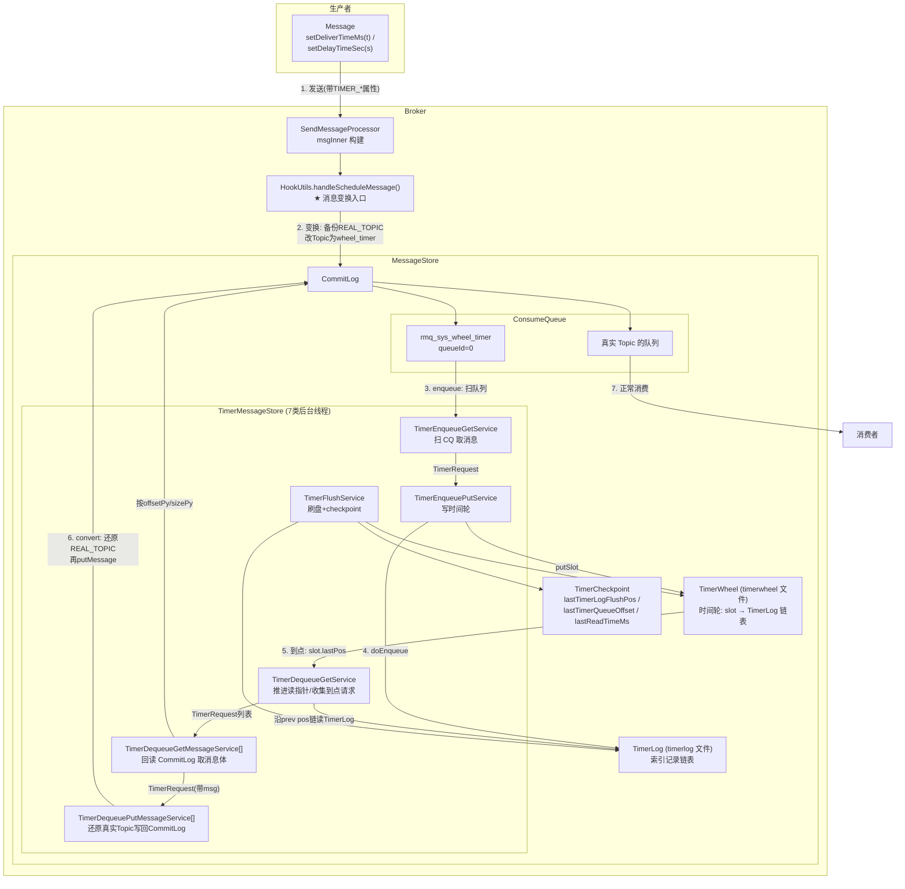

两次"转世"是理解全流程的钥匙：

- **第一次写入**：真实 Topic 被改写为 `rmq_sys_wheel_timer`，消息体原样进 CommitLog（消费者看不见它，因为没人订阅系统 Topic）。
- **第二次写入**：到点后从 CommitLog 读出消息，还原真实 Topic/QueueId，**再写一次 CommitLog**——此时才是普通消息，消费者可见。原始消息和索引由后台清理。

### 2.1 TimerMessageStore 的七类后台线程

全部在 `initService()`（TimerMessageStore.java:242-260）中创建，`start()`（495-549）按"入队→预热→出队→刷盘"顺序启动。它们通过三个有界队列（`enqueuePutQueue` / `dequeueGetQueue` / `dequeuePutQueue`，容量 1024，可换 Disruptor）串联成一条流水线：

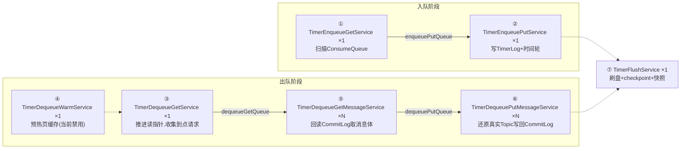

下面这张全景图展示六个线程、三个阻塞队列（含元素类型）与三个存储结构之间的完整交互：

```mermaid
flowchart LR
    P["Producer<br/>发送延迟消息"] --> CL["CommitLog<br/>topic改写为wheel_timer"]

    subgraph ENQ["入队阶段 ENQUEUE"]
        direction LR
        CQ["ConsumeQueue<br/>rmq_sys_wheel_timer<br/>(queueId=0)"]
        EGS["① TimerEnqueueGetService<br/>扫描ConsumeQueue"]
        EPQ["enqueuePutQueue<br/>BlockingQueue&lt;TimerRequest&gt;"]
        EPS["② TimerEnqueuePutService<br/>计算到期时间"]
        CQ --> EGS --> EPQ --> EPS
    end

    CL --> CQ
    EPS -- "append 52B记录<br/>(prev=slot.lastPos)" --> TL["TimerLog<br/>定时消息索引"]
    EPS -- "putSlot<br/>firstPos/lastPos/num" --> TW["TimerWheel<br/>Slot槽位数组"]
    TW -. "slot.lastPos<br/>指向TimerLog记录链" .-> TL

    subgraph DEQ["出队阶段 DEQUEUE"]
        direction LR
        DGS["③ TimerDequeueGetService<br/>推进currReadTimeMs<br/>扫描到期槽位"]
        DGQ["dequeueGetQueue<br/>BlockingQueue&lt;List&lt;TimerRequest&gt;&gt;"]
        DGMS["⑤ TimerDequeueGetMessageService<br/>按offsetPy回查CommitLog"]
        DPQ["dequeuePutQueue<br/>BlockingQueue&lt;TimerRequest&gt;<br/>(已带消息体)"]
        DPMS["⑥ TimerDequeuePutMessageService<br/>还原真实topic重新投递"]
        DGS --> DGQ --> DGMS --> DPQ --> DPMS
    end

    TW -- "到期<br/>(currReadTime追上槽位)" --> DGS
    DGS -- "沿prev pos链<br/>回溯TimerLog" --> TL
    DGMS -. "回查消息体" .-> CL
    DPMS -- "第二次写入<br/>还原真实Topic" --> CL2["真实Topic<br/>ConsumeQueue"]
    CL2 --> C["Consumer<br/>消费到期消息"]

    style P fill:#0f172a,color:#fff
    style C fill:#0f172a,color:#fff
    style CL fill:#f1f5f9,stroke:#64748b
    style TL fill:#f1f5f9,stroke:#b45309
    style TW fill:#f1f5f9,stroke:#b45309
    style CL2 fill:#f1f5f9,stroke:#64748b
    style EPQ fill:#ffcf5c
    style DGQ fill:#ffcf5c
    style DPQ fill:#ffcf5c
```

**图中要点**：三个橙色队列是流水线的"传送带"，均为容量 1024 的有界队列（`enqueuePutQueue`/`dequeuePutQueue` 传单条 `TimerRequest`，`dequeueGetQueue` 按槽批量传 `List<TimerRequest>`）；实线箭头为数据流向，虚线为读取/引用关系（⑤ 回查 CommitLog 取消息体、TimerWheel 槽位指向 TimerLog 链表）。

| # | 线程（类） | 实例数 | 作用 |
|---|---|---|---|
| ① | `TimerEnqueueGetService` | 1 | **入队扫描**：循环调用 `enqueue(0)`，从 `rmq_sys_wheel_timer` 的 ConsumeQueue 自 `currQueueOffset` 起迭代，回读 CommitLog 取出 `TIMER_OUT_MS`，构造 `TimerRequest` 塞入 `enqueuePutQueue`（offer 3 秒超时自旋，队满即天然背压）。空轮 `waitForRunning(100 * precisionMs / 1000)`。 |
| ② | `TimerEnqueuePutService` | 1 | **入队落轮**：从 `enqueuePutQueue` 攒批（最多 11 条），逐条 `putMessageToTimerWheel` → `doEnqueue`（写 52B TimerLog 记录 + putSlot 更新时间轮）。已到点的请求直接旁路进 `dequeuePutQueue`；整批全部 `idempotentRelease` 成功才推进 `commitQueueOffset` 并 `maybeMoveWriteTime()`，失败整批重试——保证"索引落盘先于位点提交"。 |
| ③ | `TimerDequeueGetService` | 1 | **出队总指挥**：循环调用 `dequeue()`。校验 `currReadTimeMs < currWriteTimeMs` 且本机为 master（`isRunningDequeue`），取 `getSlot(currReadTimeMs)`，沿 `prev pos` 链回溯 TimerLog 解出全部记录，分成墓碑/普通两个栈；先投墓碑列表、再投普通列表到 `dequeueGetQueue`（`splitIntoLists` 按 CommitLog 文件分组），`checkDequeueLatch` 等本槽全部处理完才 `moveReadTime()` 推进读指针——**槽粒度提交，主从切换时置 `dequeueStatusChangeFlag` 防丢**。 |
| ④ | `TimerDequeueWarmService` | 1 | **预热**：`warmDequeue()` 预读未来 2 个精度槽的 TimerLog 与 CommitLog 页（每 4KB 触碰一次 `bf.get()`），把页提前加载进 OS page cache，降低 ⑤ 的回读延迟。**注意 5.4.0 中该服务的主逻辑被注释掉了**（run 方法里 `waitForRunning(50)` 空转），仅保留骨架，相当于预留的优化开关。 |
| ⑤ | `TimerDequeueGetMessageService` | N（`timerGetMessageThreadNum`，默认 3） | **出队回读**（IO 密集）：从 `dequeueGetQueue` 取请求列表，按 `offsetPy/sizePy` 回读 CommitLog 取出完整消息体；同时处理撤回语义——墓碑消息把 `TIMER_DEL_UNIQKEY` 收集进 `deleteList`，普通消息 uniqKey 命中 `deleteList` 则丢弃（被撤回），否则 `offer` 进 `dequeuePutQueue`（3 秒超时自旋）。`AbstractStateService` 状态机（WAITING/RUNNING）供 ③ 的 latch 检查判断卡死。 |
| ⑥ | `TimerDequeuePutMessageService` | N（`timerPutMessageThreadNum`，默认 2） | **出队写回**：从 `dequeuePutQueue` 取带消息体的请求，`convert()` 补 `TIMER_ENQUEUE_MS/TIMER_DEQUEUE_MS` 属性，`convertMessage()` **还原真实 Topic/QueueId**（needRoll=true 则保持 wheel_timer 触发再滚一轮），`doPut()` 写回 CommitLog。PUT_NEED_RETRY 睡 500ms 重试（默认 3 次上限，`timerEnableRetryUntilSuccess=true` 则无限重试），PUT_NO_RETRY 丢弃告警。 |
| ⑦ | `TimerFlushService` | 1 | **持久化**：周期（默认 10s）执行 `timerLog flush` + `timerWheel.flush()`（diff 写回 mmap 并 force）+ `prepareTimerCheckPoint()`（持久化三个位点）+ 可选 `timerWheel.backup()` 快照（5.4.0 新增，加速重启恢复）。崩溃恢复的边界全部由此线程刻画。 |

三个设计要点：

1. **生产者-消费者流水线 + 天然背压**：三队全是有界队列，①~⑥ 之间无锁接力；任一环节变慢，压力前传，`enqueuePutQueue` 满则 ① 的 offer 自旋阻塞，进而使 `currQueueOffset` 停止推进——**入队积压可控、不丢消息**。
2. **单线程写、多线程读**：时间轮/TimerLog 的写入只在 ② 一个线程发生（无锁）；CommitLog 回读是 IO 密集操作交给 ⑤ 的 3 个线程并行、写回交给 ⑥ 的 2 个线程并行——**按资源特征分配并发度**。
3. **角色收敛于单点**：入队侧推进两个位点（`currQueueOffset`/`commitQueueOffset`），出队侧推进 `currReadTimeMs`，全部由单线程 ①③ 持有，主从切换语义（`shouldRunningDequeue`）只在 master 生效，避免双写冲突。

## 3. 客户端：延迟时间的表达

5.x 客户端不直接决定投递时刻，只放属性，换算在 Broker 侧完成（保证用 Broker 时钟为准）：

| 客户端 API | 设置的消息属性 | 语义 |
|---|---|---|
| `setDeliverTimeMs(long)` | `TIMER_DELIVER_MS` | 绝对投递时间戳 |
| `setDelayTimeSec(long)` | `TIMER_DELAY_SEC` | 相对延迟（秒） |
| `setDelayTimeMs(long)` | `TIMER_DELAY_MS` | 相对延迟（毫秒） |

优先级在 `transformTimerMessage` 中体现（HookUtils.java:185-191）：`DELAY_SEC` > `DELAY_MS` > `DELIVER_MS`。若同时设置了 `delayTimeLevel`，则 4.x 语义优先，`TIMER_*` 属性被清除（`checkIfTimerMessage`，HookUtils.java:159-169）。

## 4. Broker 入口：消息变换（transformTimerMessage）

调用链：`SendMessageProcessor` → `messageStore.putMessage()` 前的钩子 `HookUtils.handleScheduleMessage()`（HookUtils.java:129-152）→ `transformTimerMessage()`（HookUtils.java:179-220）。

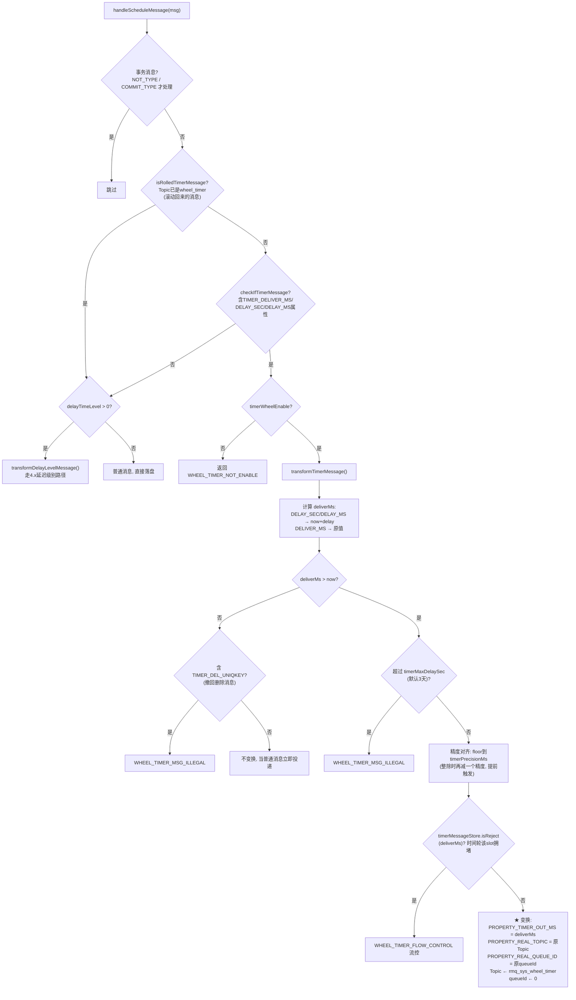

变换之后，这条消息对存储层就是一条发往 `rmq_sys_wheel_timer` 的普通消息，正常写 CommitLog、建 ConsumeQueue 索引。

另外，`SendMessageProcessor` 在成功后会为定时消息生成**撤回句柄**（`RecallMessageHandle`，SendMessageProcessor.java:663-671）：`TIMER_OUT_MS+1` 时刻作为撤回窗口的锚点——5.4.0 的消息撤回功能正是复用时间轮的删除机制实现的。

## 5. 存储层三大数据结构

### 5.1 Slot（时间轮槽位，Slot.java:20-33）

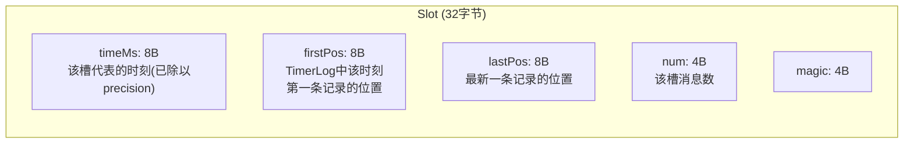

### 5.2 TimerWheel（时间轮文件，TimerWheel.java）

- **槽数固定**：`slotsTotal = TIMER_WHEEL_TTL_DAY * DAY_SECS = 7天 * 86400 = 604800` 个槽（TimerMessageStore.java:100,178），**与精度无关**；精度 `precisionMs`（默认1000ms）决定每个槽代表的时间跨度。
- **文件大小**：`wheelLength = slotsTotal * 2 * Slot.SIZE`（TimerWheel.java:67）——**两倍槽位**！`getSlotIndex = timeMs / precisionMs % (slotsTotal * 2)`（TimerWheel.java:284-286）。同一物理槽在两倍周期后被复用，`getSlot()` 会校验槽内 `timeMs` 与查询时刻一致才返回有效数据（TimerWheel.java:269-275），否则视为空槽。
- **TTL 含义**：轮子覆盖 `7天 × 2 = 14天` 的时间跨度；若 Broker 停机超过 7 天，恢复后 `currReadTimeMs` 会直接跳到"当前时间 - 7天 + 60个空槽"（TimerMessageStore.java:340-344），**超过7天的未投递消息将被丢弃**（代码注释明言 "If the broker shutdown last more than the configured days, will cause message loss"）。
- 常规操作 `putSlot/getSlot/reviseSlot` 全部基于 `ThreadLocal` 的堆外 `ByteBuffer` 副本操作（TimerWheel.java:50-55），由 `TimerFlushService` 周期性 diff 回 MappedByteBuffer 并 `force()`（TimerWheel.java:127-142）。

### 5.3 TimerLog（定时日志，TimerLog.java:33-43）

每条记录（UNIT，52字节）：

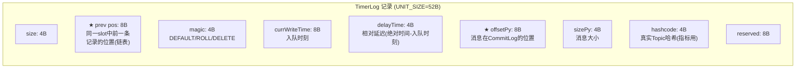

**核心思想：Slot 只保存一条链表的尾指针 `lastPos`，TimerLog 记录通过 `prev pos` 串成单向链表**。同一时刻的 N 条消息共享一个 32 字节槽位，索引本身线性追加在 TimerLog 里（类 CommitLog 的顺序写）。出队时从 `slot.lastPos` 沿 `prev pos` 一路回溯即可取出该时刻全部消息。

### 5.4 TimerCheckpoint

记录三个恢复锚点：`lastTimerLogFlushPos`（TimerLog 刷盘位置）、`lastTimerQueueOffset`（wheel_timer 队列消费位点）、`lastReadTimeMs`（出队读指针）。

### 5.5 TimerWheel 时间轮实现原理深度剖析

RocketMQ 的 TimerWheel **不是** Kafka/Netty 那种分层或环形内存时间轮，而是一个**基于 mmap 文件的固定槽数组**：把时间轴按 `precisionMs` 切格，每格 32 字节，槽里只挂 TimerLog 索引链表的头尾指针。三个关键词：**单层扁平、双倍长度取模复用、mmap 持久化**。

#### 5.5.1 物理结构与槽下标计算

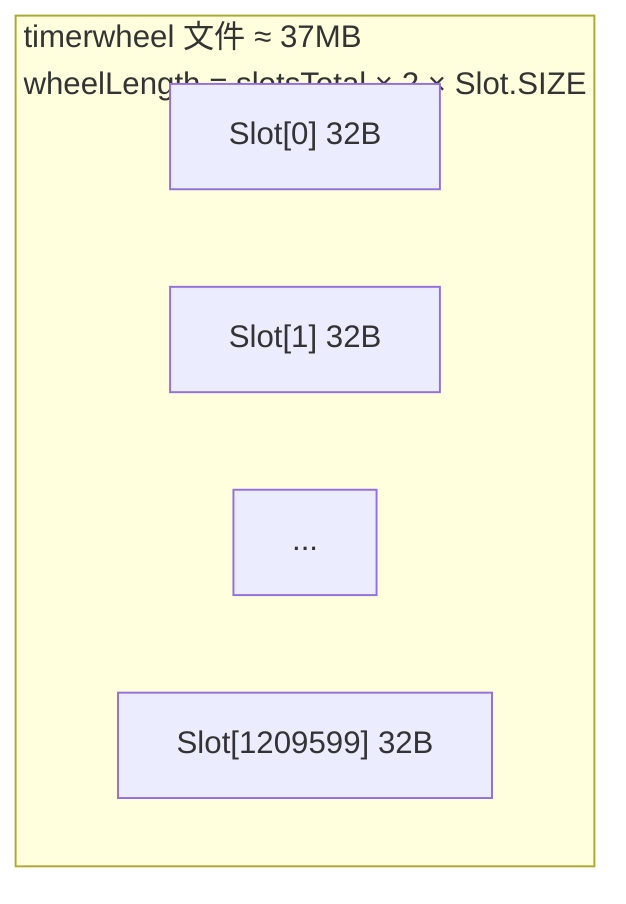

- `slotsTotal = TIMER_WHEEL_TTL_DAY × 86400 = 604800` 个**逻辑槽**（7 天），与精度无关（TimerMessageStore.java:178）
- 文件却是**两倍**槽数（TimerWheel.java:67），槽下标计算（TimerWheel.java:284-286）：

```java
public int getSlotIndex(long timeMs) {
    return (int) (timeMs / precisionMs % (slotsTotal * 2));
}
```

**为什么双倍？** 若只用单倍 7 天，今天 10:00 的槽明天 10:00 就被复用——新数据未写、旧数据未清时，出队线程会把昨天的消息误读出来。双倍长度使同一物理槽的两次命中至少相隔 14 天，配合槽内时间戳校验即可识别陈旧数据（TimerWheel.java:269-275）：

```java
public Slot getSlot(long timeMs) {
    Slot slot = getRawSlot(timeMs);
    if (slot.timeMs != timeMs / precisionMs * precisionMs) {
        return new Slot(-1, -1, -1);   // 槽内时间对不上 → 视为空槽
    }
    return slot;
}
```

再配合"出队指针最多落后 7 天"（`currReadTimeMs` 落后超 TTL 会被强制追平，TimerMessageStore.java:340-344）的运行时约束，同一时刻的数据在物理上永不重叠冲突。**代价**：停机超过 7 天，恢复后读指针直接跳到"7 天前"，更早的未投递消息被放弃（源码注释明言会丢消息）。

#### 5.5.2 槽与 TimerLog 的链表协作（写入 O(1)，读取 O(n)）

时间轮不存消息也不存列表，每槽只挂一条 TimerLog 记录串成的单向链表：

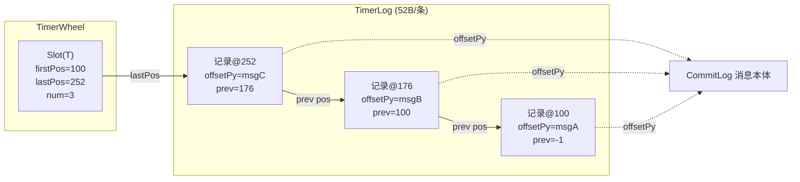

**写入（doEnqueue，头插法）**：`新记录.prev = 槽当前lastPos` → append 到 TimerLog → `putSlot` 更新槽（firstPos 空槽时=本条，lastPos=新位置，num±1）。**槽大小恒定 32B、轮子总大小恒定约 37MB，与挂载消息量无关**——同一时刻百万条消息也只占一个槽。

**读取（dequeue）**：从 `slot.lastPos` 沿 `prev pos` 回溯到 -1，配合 `addFirst` 恢复写入序。

#### 5.5.3 读写路径与持久化

| 方面 | 实现 |
|---|---|
| 读写内存 | 全部走 `ThreadLocal` 的堆外 DirectByteBuffer **副本**（`localBuffer`，TimerWheel.java:50-55），不直接操作 mmap，规避读写指针交错 |
| 定期刷盘 | `TimerFlushService` 调 `flush()`：**逐字节 diff** 副本与 MappedByteBuffer，只写回变化的字节并 `force()`（TimerWheel.java:127-142）——绝大多数槽未变，写放大极小 |
| 快照 | 5.4.0 新增 `backup()`：副本写 `timerwheel.{offset}` 临时文件 → `ATOMIC_MOVE` 原子改名 → 保留最新两份；重启直接加载快照，避免全量重放 TimerLog（TimerWheel.java:154-229） |
| 无快照恢复 | 从 checkpoint 位点重放 TimerLog，`reviseSlot()` 幂等修正槽内指针（槽时间不匹配则 force 整槽覆盖） |

#### 5.5.4 轮子的"转动"：双游标驱动

时间轮数组本身是静态的，真正让它"转"的是 `TimerMessageStore` 的两个指针：

- **`currWriteTimeMs`（写边界）**：随时间单调前移（`maybeMoveWriteTime`），入队消息的投递时间必须 ≥ 它，否则视为"已到点"直接旁路投递
- **`currReadTimeMs`（读指针）**：出队线程逐槽推进，每槽全部处理完才 `moveReadTime()`，追上 `currWriteTimeMs` 即本轮无事可做

超窗口的延迟（超过 `timerRollWindowSlots`）不靠轮子扩容，靠 **MAGIC_ROLL 伪投递 + 重新入轮**（见第 8 章）。

#### 5.5.5 与 Kafka、Netty 时间轮的对比

```mermaid
flowchart TB
    subgraph RocketMQ["RocketMQ TimerWheel"]
        RMQ1["单层扁平数组<br/>604800×2 逻辑槽"] --> RMQ2["槽=32B 只存链表头尾指针<br/>数据在 TimerLog(mmap)"]
        RMQ2 --> RMQ3["mmap 持久化<br/>diff 刷盘 + 快照"]
        RMQ3 --> RMQ4["超窗口: ROLL 滚动重投"]
    end
    subgraph Kafka["Kafka TimingWheel (分层)"]
        K1["多层轮: 秒/分/时/天...<br/>每层 1 个 bucket 数组"] --> K2["槽=双向链表<br/>存 TimerTaskEntry 对象"]
        K2 --> K3["纯内存, 延时队列做兜底<br/>重启后定时任务重建"]
        K3 --> K4["超层范围: 降级到<br/>SystemTimer 延时队列"]
    end
    subgraph Netty["Netty HashedWheelTimer"]
        N1["单层环形数组<br/>默认 512 槽, tick 100ms"] --> N2["槽=双向链表<br/>存 HashedWheelTimeout"]
        N2 --> N3["纯内存, 单线程驱动"]
        N3 --> N4["长延迟: remainingRounds 计数<br/>每轮多转 N 圈"]
    end
```

| 维度 | **RocketMQ TimerWheel** | **Kafka 分层时间轮** | **Netty HashedWheelTimer** |
|---|---|---|---|
| 结构 | 单层扁平数组（604800×2 槽） | 多层级联（每层一个轮，高层一格=低层一圈） | 单层环形数组（默认 512 槽） |
| 槽内数据 | 32B，仅链表头尾**文件指针** | 内存双向链表，存任务对象 | 内存双向链表，存 `HashedWheelTimeout` |
| 时间范围 | 固定 7 天窗口（TTL） | 理论无限（层级可扩展） | 理论无限（rounds 计数） |
| 长延迟处理 | **ROLL 滚动**：伪投递后重新入轮 | **降级 cascade**：到期时从高层降入低层 | **remainingRounds**：每圈递减，轮到才触发 |
| 持久化 | mmap 文件 + diff 刷盘 + 快照，**崩溃可恢复** | 纯内存（kafka 的 purgatory 重启靠日志重建） | 纯内存 |
| 驱动方式 | 双游标（读写指针）+ 出队线程逐槽推进 | 每层一个 DelayQueue 取到期 bucket 推进 | 单 Worker 线程 `waitForNextTick` 逐 tick 推进 |
| 精度 | `timerPrecisionMs`（默认 1s） | 每层 interval/tick | tickDuration（默认 100ms） |
| 定位开销 | O(1)：一次取模 + mmap 定位 | O(层数)：逐层 cascade 时 O(1) 均摊 | O(1) |
| 内存/空间 | 磁盘恒定 ~37MB，与消息量无关 | 堆内存，随任务数线性增长 | 堆内存，随任务数线性增长 |
| 典型场景 | 百万级持久化定时消息（broker 级） | purgatory 延迟操作（请求超时、限流等） | 连接超时、心跳检测（单进程内海量短定时任务） |

**本质区别的三个层面：**

1. **解决问题域不同**：Kafka/Netty 时间轮管理的是**内存中的任务回调**（到点执行一段代码），进程重启即失效；RocketMQ 时间轮管理的是**持久化消息的投递索引**，必须崩溃可恢复——因此放弃内存链表，选择 mmap 数组 + 追加型 TimerLog，并用 checkpoint/快照刻画恢复边界。
2. **扩展时间范围的方式不同**：Kafka 用层级（高级数据结构换无限范围）、Netty 用圈数（rounds 换简单性），RocketMQ 两者都不用——固定窗口 + 业务层滚动重投（ROLL），把"无限延迟"翻译成"多次有限延迟"，换来槽定位永远是一次取模。
3. **数据结构哲学不同**：Kafka/Netty 的槽挂**对象链表**（增加/删除 O(1)，但内存不保序、不持久）；RocketMQ 的槽只挂**文件内偏移量**，链表本体在 TimerLog 中顺序追加——写入是纯顺序 I/O，与 CommitLog 的设计哲学一脉相承，代价是不能随机删除（撤回靠墓碑标记跳过，而非物理删除）。

**为什么不选分层时间轮？** 分层轮的 cascade（高层到期任务降入低层）时机复杂、指针结构难以直接 mmap 持久化、且每次降层是一次随机写。RocketMQ 的场景（消息量巨大、要求持久化、单条延迟上限 3 天）下，"扁平轮 + Roll 滚动 + 追加日志"的组合在实现复杂度、恢复速度和写性能上都是更优解。

## 6. 入队流程：从 CommitLog 到时间轮

三个队列串联（TimerMessageStore.java:111-113）：`enqueuePutQueue`（TimerRequest）→ 处理 → `dequeuePutQueue` 等下游。

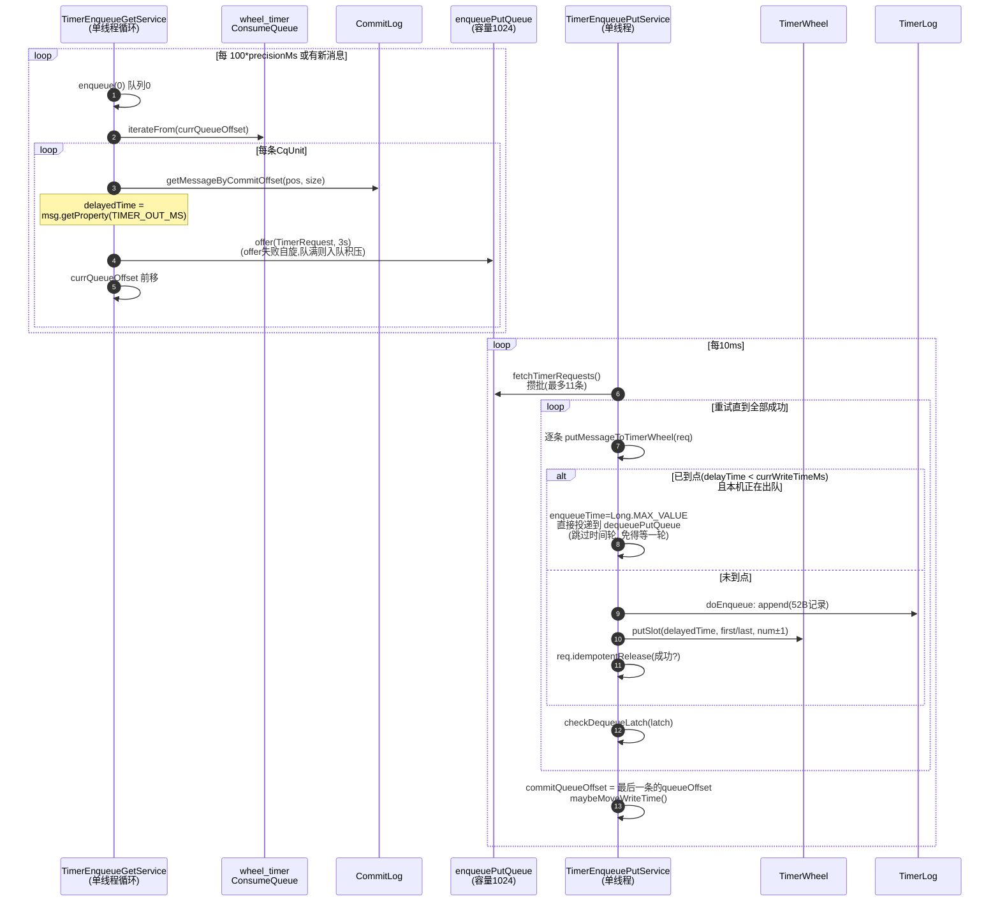

关键代码解读：

- **`enqueue(0)`**（TimerMessageStore.java:748-833）：从 wheel_timer 的 ConsumeQueue `currQueueOffset` 开始迭代，对每个 `CqUnit` 回读 CommitLog 拿到 `TIMER_OUT_MS` 属性构造 `TimerRequest`，塞入 `enqueuePutQueue`。**队列消费位点此时只推进内存值 `currQueueOffset`，真正提交（`commitQueueOffset`）要等 TimerLog 写成功**——这是入队不丢消息的关键。
- **`putMessageToTimerWheel`**（TimerMessageStore.java:1471-1495）：特判"入队时已过投递时间"（Broker 宕机恢复后常见）——不进轮子，直接扔进 `dequeuePutQueue` 立即投递，`enqueueTime` 置为 `Long.MAX_VALUE` 作标记。
- **`maybeMoveWriteTime`**（TimerMessageStore.java:648-652）：`currWriteTimeMs` 单调推进（当前时间对齐精度），它既是入队时判断"到点与否"的基准，也是出队的边界（`currReadTimeMs >= currWriteTimeMs` 则无可出队）。
- **Latch 重试**（fetchAndPutTimerRequest，1497-1528）：一批请求全部 `idempotentRelease(true)` 才推进 `commitQueueOffset`，否则 `holdMomentForUnknownError()`（默认睡200ms）后整批重试——**保证"TimerLog 写成功"先于"队列位点提交"**，宕机恢复时最多重复入队（`recoverAndRevise` 幂等修正），不会丢失。

## 7. doEnqueue：写 TimerLog + 更新时间轮

（TimerMessageStore.java:835-879）逐行拆解：

```java
public boolean doEnqueue(long offsetPy, int sizePy, long delayedTime, MessageExt messageExt, boolean isFromTimeline) {
    long tmpWriteTimeMs = currWriteTimeMs;
    // ① 是否需要滚动: 投递时间超出轮子可视窗口
    boolean needRoll = delayedTime - tmpWriteTimeMs >= (long) timerRollWindowSlots * precisionMs;
    int magic = MAGIC_DEFAULT;
    if (needRoll) {
        magic = magic | MAGIC_ROLL;
        // 把投递时间"压缩"进轮子: 半窗口或全窗口后重新入轮
        if (delayedTime - tmpWriteTimeMs - timerRollWindowSlots * precisionMs < timerRollWindowSlots / 3 * precisionMs) {
            delayedTime = tmpWriteTimeMs + (timerRollWindowSlots / 2) * precisionMs;
        } else {
            delayedTime = tmpWriteTimeMs + timerRollWindowSlots * precisionMs;
        }
    }
    // ② 删除标记(消息撤回用的墓碑消息)
    boolean isDelete = messageExt.getProperty(TIMER_DELETE_UNIQUE_KEY) != null;
    if (isDelete) {
        magic = magic | MAGIC_DELETE;
        ...
    }
    // ③ 追加52字节记录到TimerLog: prev pos = 槽当前的lastPos (★链表头插)
    Slot slot = timerWheel.getSlot(delayedTime);
    tmpBuffer.putLong(slot.lastPos) ... // prev pos
    tmpBuffer.putLong(tmpWriteTimeMs);  // 入队时间
    tmpBuffer.putInt((int)(delayedTime - tmpWriteTimeMs)); // 相对延迟(4B够用)
    tmpBuffer.putLong(offsetPy);        // CommitLog地址
    ...
    long ret = timerLog.append(tmpBuffer.array(), 0, TimerLog.UNIT_SIZE);
    if (-1 != ret) {
        // ④ 更新槽: first不变(若原为空则=本条), last=本条位置, num±1
        timerWheel.putSlot(delayedTime,
            slot.firstPos == -1 ? ret : slot.firstPos, ret,
            isDelete ? slot.num - 1 : slot.num + 1, slot.magic);
        addMetric(messageExt, isDelete ? -1 : 1);
    }
    return -1 != ret;
}
```

三个精妙点：

1. **相对延迟只存 4 字节**：记录里存 `delayedTime - currWriteTimeMs`（int），出队时 `delayedTime = enqueueTime + delayTime` 还原——窗口有限所以 4 字节足够。
2. **`num` 的符号**：墓碑消息使 `num-1`，配合 `getAllNum`/`isReject` 做拥堵判断。
3. **链表方向**：新记录的 `prev pos` 指向旧 `lastPos`，出队回溯顺序与写入相反，所以 `dequeue()` 里用 `normalMsgStack.addFirst(timerRequest)` 恢复时间序（TimerMessageStore.java:1066）。

## 8. 滚动机制（Roll）：超长延迟的降级处理

时间轮可视窗口有限（`timerRollWindowSlots` 默认 = `slotsTotal - 60`，即约7天）。投递时间超过窗口的消息怎么办？

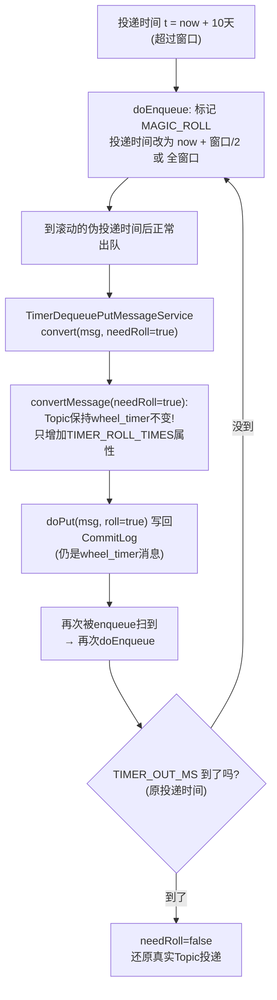

（`convertMessage`，TimerMessageStore.java:1258-1266：`needRoll=true` 时保留 `wheel_timer` 主题与原 queueId，`TIMER_ROLL_TIMES` 计数+1。）这样**任意长的延迟都能被有限窗口的时间轮覆盖**，代价是每窗口一次额外的 CommitLog 写入。`checkIfTimerMessage` 对已是 `wheel_timer` 的消息返回 false、`isRolledTimerMessage` 直接放行（HookUtils.java:134,154-156），保证滚动消息不会被再次变换。

## 9. 出队流程：到点投递

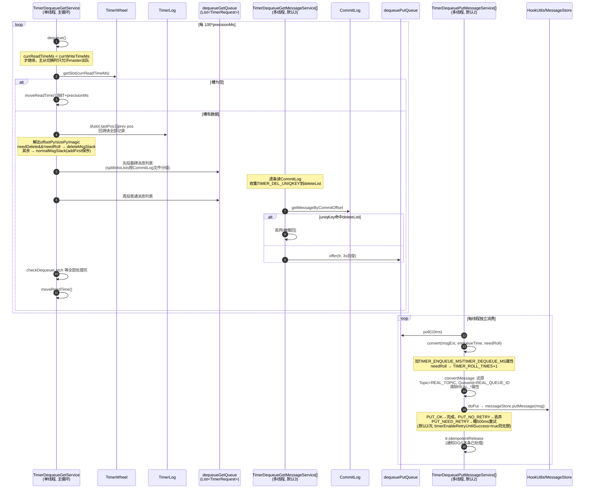

关键细节：

- **读指针 `currReadTimeMs` 的推进是"一个槽处理完才走"**：`checkDequeueLatch` 等待本槽全部请求 `idempotentRelease`（默认无限等，但每秒检查主从角色变化，防卡死，TimerMessageStore.java:982-1010）。这保证**槽粒度的 exactly-once-ish**：宕机恢复后 `lastReadTimeMs` 从 checkpoint 恢复，本槽重新处理（可能重复投递，但 TimerLog 索引幂等）。
- **墓碑消息先于普通消息处理**（dequeue 里先 `deleteList` 后 `normalList`，1086-1105）：配合 `avoidDeleteLose` Map（TimerMessageStore.java:1704,1723-1735）处理"墓碑与原消息同槽"的边界——同槽删除靠 `deleteUniqKeys` 集合匹配，跨槽删除靠 `TIMER_DEL_UNIQKEY` 在出队时命中即丢弃。这是**消息撤回（recall）**的存储基础。
- **多线程并行**：`dequeueGetMessageThreadNum`（默认3）个线程回读 CommitLog（IO密集），`dequeuePutMessageThreadNum`（默认2）个线程写回（含重试循环）。`splitIntoLists`（TimerMessageStore.java:1123-1154）按 CommitLog 文件边界切分请求列表，让每个回读线程尽量落在同一个 MappedFile 上。
- **`shouldStartTime`**：出队服务启动延迟（`brokerFastStart`/`shouldStartTime` 配置），避免 Broker 刚启动时 IO 争抢。

### 9.1 "到点"是如何感知的：轮询指针，而非定时器

整个时间轮体系中**没有 JDK Timer、没有 ScheduledExecutor、没有 DelayQueue**——没有任何事件驱动的定时器。时间轮数组是静态的，感知时间流逝的只有一个循环：`TimerDequeueGetService`（单线程）不断比较 `currReadTimeMs`（读指针）与 `currWriteTimeMs`（写边界），一旦当前墙钟时间越过某个槽，就处理那个槽。**定时投递 = 轮询 + 指针以精度为步长追赶墙钟**。

**① 驱动引擎：DequeueGetService 主循环**（TimerMessageStore.java:1544-1570）

```java
while (!this.isStopped()) {
    if (System.currentTimeMillis() < shouldStartTime) {   // 启动缓冲
        waitForRunning(1000);
        continue;
    }
    if (-1 == TimerMessageStore.this.dequeue()) {
        waitForRunning(100L * precisionMs / 1000);        // 没到点/无数据, 睡一个精度周期
    }
    // dequeue()==1 表示处理完一个槽, 不睡立即循环处理下一槽(积压时全速追赶)
}
```

**② "到点"的判定本质**：`currWriteTimeMs` 被 `maybeMoveWriteTime()` 用墙钟时间（floor 对齐精度）不断前推；`dequeue()` 开头检查 `currReadTimeMs >= currWriteTimeMs` 则无事可做（返回 -1 去睡）。反过来说，只要读指针落后于写边界，落后的那段槽位的时刻**都已被墙钟越过**——"到点"即 `currReadTimeMs < currWriteTimeMs`。指针以 1 个 `precisionMs` 粒度追赶墙钟，**投递精度由此决定**（默认 1 秒）。

**③ 投递的落点是第二次 CommitLog 写入**：到点槽位取出索引 → 多线程回读消息体 → `convertMessage()` 还原真实 Topic/QueueId → `doPut()` 写回 CommitLog 并建真实 Topic 的 ConsumeQueue 索引——从此它是普通消息，消费者按正常拉取/Pop 流程可见，定时模块功成身退。

**④ 支撑"准时"的四个细节：**

1. **精度提前量补偿**：`transformTimerMessage` 对投递时间 floor 对齐后**再减一个精度**（`deliverMs % precisionMs == 0 时 -= precisionMs`，HookUtils.java:201-205）——把取整损失的时间补回来，保证"不晚于"用户指定时刻投递。
2. **槽粒度提交保证不重不漏**：`checkDequeueLatch` 等本槽全部请求 `idempotentRelease` 才 `moveReadTime()`。宕机恢复时 `currReadTimeMs` 从 checkpoint 恢复，本槽重做（TimerLog 索引幂等，最多重复投递），已完成的槽绝不重做。
3. **两个旁路跳过轮子**：入队时已过投递时间的消息（宕机恢复常见）不进轮子，直接进 `dequeuePutQueue` 立即投递（TimerMessageStore.java:1478-1480）；超窗口长延迟靠 MAGIC_ROLL 伪投递滚动（见第 8 章）。
4. **主从安全**：`isRunningDequeue()` 要求本机为 master（或 slaveActingMaster），从机不出队；切换瞬间置 `dequeueStatusChangeFlag`，本轮作废防丢（TimerMessageStore.java:1106-1109）。

**⑤ 为什么不用"真定时器"方案：**

| 方案 | 到点感知方式 | 问题 |
|---|---|---|
| 每消息一个 `ScheduledExecutor`/Timer | 内核定时器回调 | 百万级消息 = 百万定时器，内存/调度开销爆炸 |
| `DelayQueue`（最小堆） | 堆顶到期 | 全内存、O(log n) 插入、无法持久化 |
| **RocketMQ：轮询指针** | 读指针逐槽追赶墙钟，槽到 = 消息到 | 延迟 = 精度（1s）+ 排队耗时；换来 O(1) 入轮、恒定内存、全量持久化与崩溃恢复 |

一句话总结：**到点投递 = `TimerDequeueGetService` 以 `precisionMs` 为步长推进 `currReadTimeMs`，追上某个槽即视为"到点"，取出该槽 TimerLog 链表的全部 CommitLog 地址 → 多线程回读消息 → 还原真实 Topic 写回 CommitLog。没有事件驱动的定时器，只有"指针追时钟"的轮询——用秒级精度损失，换取 O(1) 入轮、恒定内存和完整的崩溃恢复能力。**

## 10. 可靠性与恢复（Recover / Checkpoint）

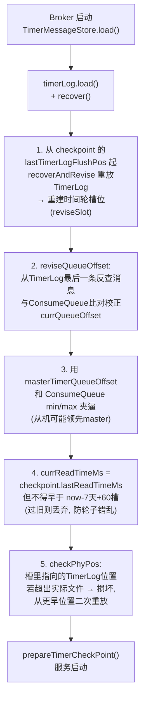

（TimerMessageStore.java:299-363。）恢复策略总结：**入队方向以 ConsumeQueue 位点为准可重放（不丢），出队方向以 checkpoint 槽位为准可重投（可能重复）**——与 RocketMQ 整体 at-least-once 语义一致。

运行期 `TimerFlushService`（TimerMessageStore.java:1825-1893）默认每 10s（`timerFlushInterval`）：`timerLog.getMappedFileQueue().flush()` + `timerWheel.flush()`（diff 写回 mmap 并 force，TimerWheel.java:127-142）+ `prepareTimerCheckPoint()`。5.4.0 新增 **timerWheel 快照**（`timerWheelSnapshotFlush`）：定期把整个轮子 `backup()` 成 `timerwheel.{offset}` 文件（TimerWheel.java:154-182），重启时直接加载快照，把重放 TimerLog 的起点推进到快照点，加速恢复并减少重复。

## 11. 流控、精度与配置

| 配置 | 默认 | 作用 | 源码依据 |
|---|---|---|---|
| `timerWheelEnable` | true | 总开关，关闭则拒绝定时消息 | HookUtils.java:136 |
| `timerPrecisionMs` | 1000 | 轮子精度，投递时间 floor 对齐 | HookUtils.java:200-205 |
| `timerMaxDelaySec` | 259200(3天) | 单条消息最大延迟 | HookUtils.java:196 |
| `timerRollWindowSlots` | slotsTotal-60 | 滚动窗口（决定最大不滚动延迟） | TimerMessageStore.java:216-221 |
| `timerGetMessageThreadNum` | 3 | 出队回读线程数 | initService, 249-253 |
| `timerPutMessageThreadNum` | 2 | 出队写回线程数 | 255-259 |
| `timerEnableDisruptor` | false | 三大队列换 Disruptor 降低延迟 | 构造器 230-238 |
| `timerSkipUnknownError` | false | 未知异常跳过（默认持重试休眠） | 736-746 |
| `timerStopEnqueue/Dequeue` | false | 运维开关：停入队/停出队 | 749/1013 |
| `timerCongestNumAdvance` | - | 拥堵判定提前量 | isReject, 1903 |

**拥堵流控 `isReject(deliverMs)`**（TimerMessageStore.java:1899-1915）：统计投递时刻附近（`timerCongestNumAdvance` 提前量）槽位的 `num` 总和，超过 `timerCongestThreshold`（默认1亿）则发送端收到 `WHEEL_TIMER_FLOW_CONTROL`——**按目标时刻限流**而非全局限流，防止热点时刻雪崩。

**监控**：`getEnqueueBehind/Messages`（入队积压）、`getDequeueBehind`（出队滞后）暴露给 `TimerMetrics` 与 metrics 指标（`timerMessageSetLatency`、`incTimerEnqueueCount` 等），`calcTimerDistribution` 启动时统计延迟分布。

## 12. 端到端完整时序图

以 `producer.setDeliverTimeMs(T)` 发送、消费者在 T 时刻后收到为例：

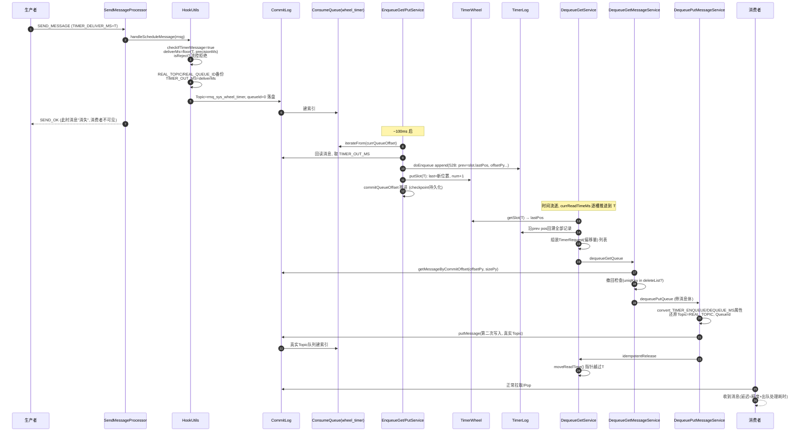

## 13. 设计总结

1. **"两次写入 CommitLog"的消息转世模型**：定时消息 = 先进系统Topic"冷冻"（`wheel_timer`），到点后"复活"（还原真实Topic重写）。消息体永远只存 CommitLog 一份，时间轮体系（TimerWheel+TimerLog）只存**轻量索引**（52B/条），顺序追加、全内存操作，百万级定时消息的索引成本可控。

2. **槽位尾指针 + TimerLog 链表**：时间轮槽不存列表只存 `lastPos`，同槽消息靠记录内 `prev pos` 串链——槽大小恒定 32B，轮子总大小固定（约 37MB），与消息量无关；`num` 字段兼任计数与拥堵统计。

3. **位点多级防护的不丢设计**：`currQueueOffset`（内存）→ `commitQueueOffset`（写盘成功才推进）→ `checkpoint`（定时持久化）；出队 `currReadTimeMs` 槽粒度提交。恢复时**宁可重复不可丢失**（at-least-once）。

4. **滚动机制用循环换范围**：有限窗口（7天×2槽）+ MAGIC_ROLL 伪投递 + 反复重新入轮，使 3 天（`timerMaxDelaySec`）内的任意延迟都能支持；更久延迟被拒绝而非悄悄丢失。

5. **全链路异步化 + 批处理**：三个 BlockingQueue（可换 Disruptor）解耦扫描/写轮/读消息/写回；`fetchTimerRequests` 攒批、`splitIntoLists` 按 CommitLog 文件分组，都是为减少 mmap 页缺失和锁竞争。

6. **主从安全**：`shouldRunningDequeue` 保证只有 master（或 slaveActingMaster 的最小 brokerId）出队，主从切换时 `dequeueStatusChangeFlag` 防止读指针错误前移导致丢消息（TimerMessageStore.java:1106-1109,1616-1624）。

7. **复用出圈**：消息撤回（recall）用 `MAGIC_DELETE` 墓碑 + `TIMER_DEL_UNIQKEY` 复用了同一套时间轮；5.4.0 的 RocksDB 时间轮（`timerRocksDBEnable`）是另一条实验性路径，启用后不再走 ConsumeQueue 扫描式入队（TimerEnqueueGetService.run 的分支，1416-1418）。

---

## 附：源码文件索引

| 文件 | 关键位置 |
|---|---|
| `broker/util/HookUtils.java` | 129-152 handleScheduleMessage；158-177 checkIfTimerMessage；179-220 transformTimerMessage（★变换核心）；222+ 4.x延迟级别路径 |
| `broker/processor/SendMessageProcessor.java` | 663-671 定时消息撤回句柄 |
| `store/timer/TimerMessageStore.java` | 79-163 常量/字段；748-833 enqueue；835-879 doEnqueue（★索引写入）；1012-1121 dequeue（★出队主逻辑）；1168-1268 convert/convertMessage（★还原真实Topic）；1404-1428 EnqueueGet；1441-1542 EnqueuePut；1544-1570 DequeueGet；1585-1689 DequeuePutMessage（重试循环）；1691-1788 DequeueGetMessage（撤回匹配）；1817-1823 needRoll/needDelete |
| `store/timer/TimerWheel.java` | 38-100 初始化（两倍槽数）；269-323 getSlot/putSlot/reviseSlot；127-142 flush；154-229 快照backup |
| `store/timer/TimerLog.java` | 31-43 记录格式（UNIT_SIZE=52）；61-98 append |
| `store/timer/Slot.java` | 20-50 槽位格式（32B） |
| `store/timer/TimerCheckpoint.java` | 恢复位点 |
| `store/timer/TimerMetrics.java` | 拥堵统计/延迟分布 |
| `store/timer/rocksdb/TimerMessageRocksDBStore.java` | 5.4.0 RocksDB 实验路径 |
