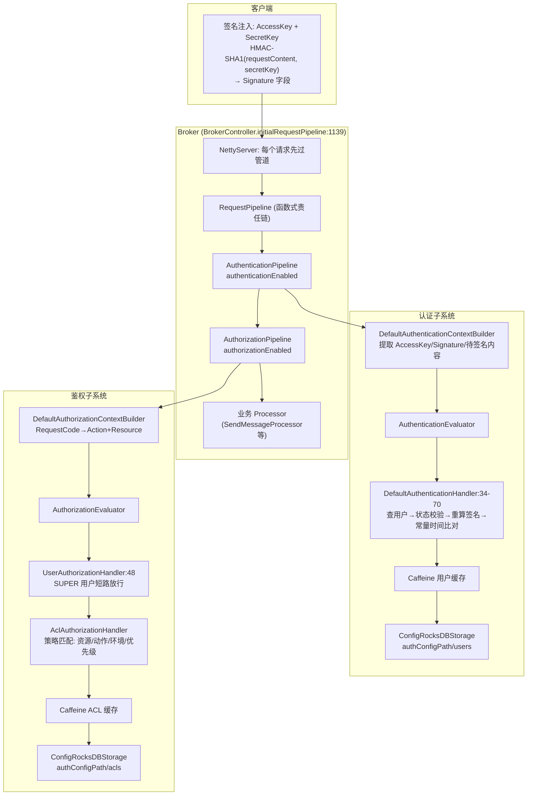
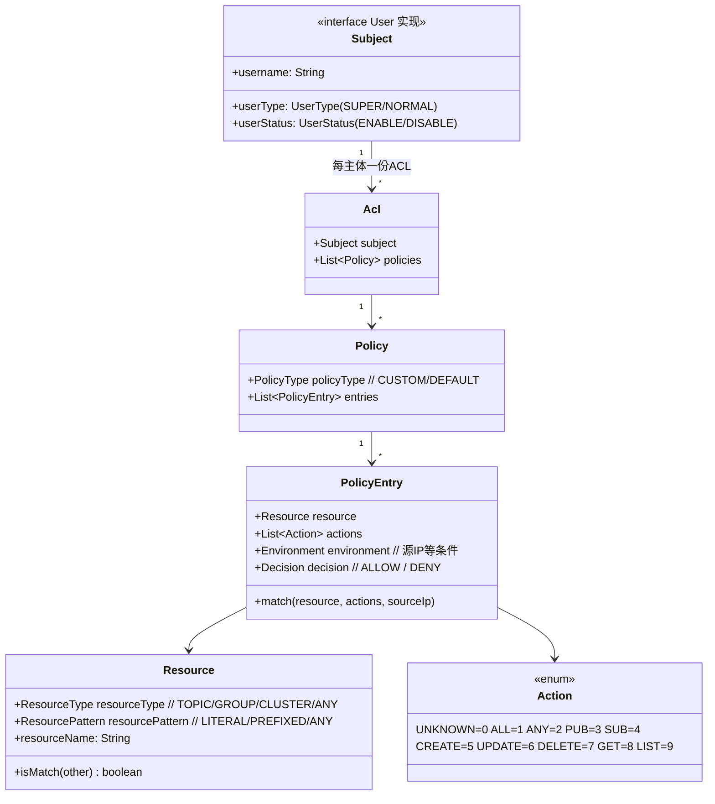
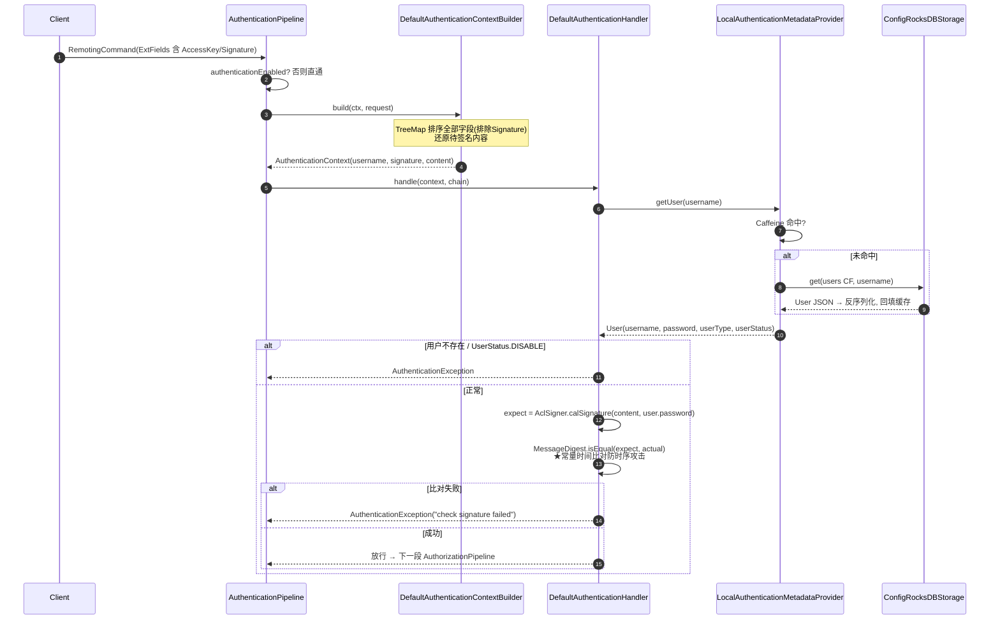
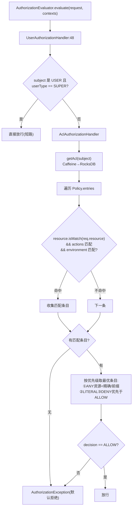
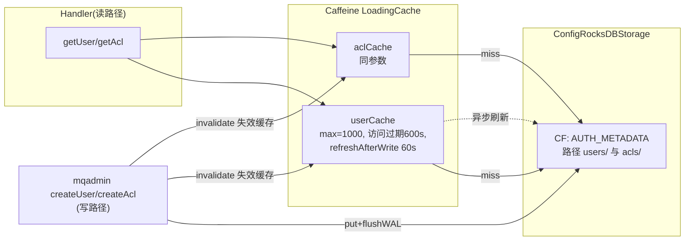
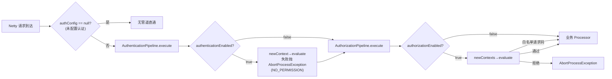
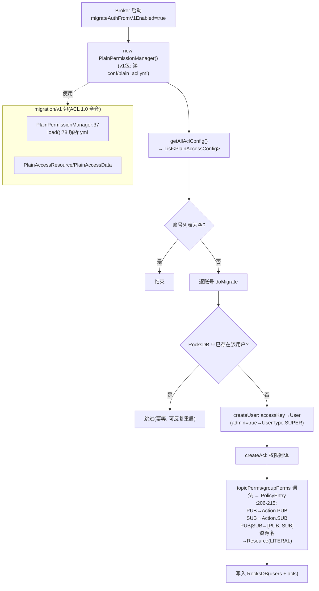

# RocketMQ ACL 2.0 (auth 模块) 源码深度分析

> 基于 Apache RocketMQ 5.5.0 develop 分支源码
> 覆盖: 独立 auth 模块架构 / 认证管道 / 鉴权权限模型 / Broker 集成 / 与 ACL 1.0 对比 / AuthMigrator 迁移

---

## 目录

1. [为什么重写: ACL 1.0 的痛点](#一为什么重写-acl-10-的痛点)
2. [ACL 2.0 整体架构](#二acl-20-整体架构)
3. [权限模型设计](#三权限模型设计)
4. [认证流程 (Authentication)](#四认证流程-authentication)
5. [鉴权流程 (Authorization)](#五鉴权流程-authorization)
6. [元数据存储与缓存](#六元数据存储与缓存)
7. [Broker 集成: 请求管道](#七broker-集成-请求管道)
8. [ACL 1.0 vs 2.0 全面对比](#八acl-10-vs-20-全面对比)
9. [AuthMigrator: 从 plain_acl.yml 迁移](#九authmigrator-从-plain_aclyml-迁移)
10. [配置详解与 gRPC/Proxy 复用](#十配置详解与-grpcproxy-复用)
11. [总结与源码索引](#十一总结与源码索引)

---

## 一、为什么重写: ACL 1.0 的痛点

### 1.1 ACL 1.0 是什么样

ACL 1.0（4.5.0 引入）的实现在 5.5.0 中已整体挪到 `auth/src/main/java/org/apache/rocketmq/auth/migration/v1/`（`PlainPermissionManager`、`PlainAccessResource` 等），配置为静态的 `conf/plain_acl.yml`：

```yaml
accounts:
- accessKey: RocketMQ
  secretKey: 12345678
  whiteRemoteAddress: 192.168.0.*
  admin: true
- accessKey: rocketmq2
  secretKey: 12345678
  perm:
    topicPerms:
    - topicA=DENY
    - topicB=PUB|SUB
    groupPerms:
    - groupA=DENY
```

模型是"账户级白名单 + 资源级 DENY/PUB/SUB 词法"。

### 1.2 痛点（重写动机）

| 痛点 | 说明 |
|------|------|
| **静态文件，无管理接口** | 改权限=改 yml+重启/热加载 watch；无 mqadmin 命令、无 API、无法审计谁改了什么 |
| **权限模型贫瘠** | 只有 PUB/SUB/DENY 三种语义；没有 CREATE/UPDATE/DELETE/GET/LIST 等管理动作，admin 是"全有或全无" |
| **资源匹配能力弱** | 只支持精确名与少量通配；没有前缀匹配（`topic:order-*`）、没有资源类型体系 |
| **无环境维度** | 只有一个 whiteRemoteAddress；无法表达"仅生产环境/仅内网可发" |
| **与 Remoting 协议强耦合** | 校验逻辑散落在 processor 的 hook 里，Proxy/gRPC 多协议接入后无法复用 |
| **实现耦合、不可扩展** | 无认证/鉴权分层，换元数据存储（如接 LDAP/DB）需要大改 |

一句话：**ACL 1.0 是"防君子"的静态配置文件，ACL 2.0 是"可运营"的安全子系统**——有用户体系、策略模型、管理命令、审计能力，且协议无关。

---

## 二、ACL 2.0 整体架构

### 2.1 独立模块结构（59+ 类）

```
auth/src/main/java/org/apache/rocketmq/auth/
├── authentication/                 # 认证子系统
│   ├── builder/                    # DefaultAuthenticationContextBuilder (从请求提取凭证)
│   ├── chain/                      # DefaultAuthenticationHandler (签名校验)
│   ├── context/                    # DefaultAuthenticationContext
│   ├── enums/                      # UserType/UserStatus
│   ├── exception/
│   ├── factory/                    # AuthenticationFactory (SPI 装配)
│   ├── manager/                    # AuthenticationMetadataManager
│   ├── model/                      # User / Subject
│   ├── provider/                   # AuthenticationMetadataProvider + Local 实现(RocksDB)
│   └── strategy/
├── authorization/                  # 鉴权子系统(结构对称)
│   ├── builder/                    # DefaultAuthorizationContextBuilder (RequestCode→Action)
│   ├── chain/                      # UserAuthorizationHandler + AclAuthorizationHandler
│   ├── context/
│   ├── enums/                      # Decision/PolicyType
│   ├── model/                      # Acl / Policy / PolicyEntry / Resource
│   └── provider/                   # LocalAuthorizationMetadataProvider (RocksDB)
├── common/                         # AclSigner / SessionCredentials
├── config/                         # AuthConfig (全部开关)
└── migration/                      # AuthMigrator + v1/(ACL 1.0 全套实现)
```

**镜像对称的包结构**是刻意设计：认证与鉴权是两个独立的、可单独启用的子系统（`authenticationEnabled` 与 `authorizationEnabled` 独立开关），各自走 Builder→Context→Chain→Provider 四层。

### 2.2 架构图



---

## 三、权限模型设计

### 3.1 模型层次：Subject → Acl → Policy → PolicyEntry



与 AWS IAM 的 Policy 模型同构（`Effect(Decision) + Action + Resource + Condition(Environment)`），这是工业界验证过的权限表达范式。

### 3.2 Action：管理动作语义化（Action.java:22）

```java
public enum Action {
    UNKNOWN((byte) 0), ALL((byte) 1),  // 策略中的通配
    ANY((byte) 2),                     // 请求中的通配(任意动作都可匹配)
    PUB((byte) 3),     SUB((byte) 4),  // 数据面: 发送/消费
    CREATE((byte) 5),  UPDATE((byte) 6), DELETE((byte) 7),  // 管理面
    GET((byte) 8),     LIST((byte) 9);
}
```

对比 1.0 只有 PUB/SUB/DENY——2.0 能精确表达"运维组只能 LIST/GET topic，不能 DELETE"。注意取值是**普通枚举而非 bitmask**，匹配靠 `PolicyEntry` 中的列表包含关系（`ANY/ALL` 做通配）。

### 3.3 Resource 三维匹配（Resource.java）

```java
public boolean isMatch(Resource resource) {
    if (this.resourceType == ResourceType.ANY) return true;
    if (this.resourceType != resource.resourceType) return false;
    switch (resourcePattern) {
        case ANY:      return true;                                        // 所有资源
        case LITERAL:  return StringUtils.equals(resource.resourceName,    // 精确
                                    this.resourceName);
        case PREFIXED: return StringUtils.startsWith(resource.resourceName, // 前缀: "order-*"
                                     this.resourceName);
        default:       return false;
    }
}
```

支持 `type:name` 字符串自动解析（如 `topic:test*` 解析为 PREFIXED 匹配）。前缀匹配解决了 1.0 "每个 topic 手工列一遍"的运维灾难。

### 3.4 Environment 与 Decision

- `Environment`：条件维度（源 IP 等），为未来扩展（时段/标签）预留
- `Decision`：`ALLOW`/`DENY`——**显式 DENY 优先**是安全系统的标准做法（防止宽泛 ALLOW 意外放行）

---

## 四、认证流程 (Authentication)

### 4.1 客户端签名

`AclSigner`（common 包，Remoting 客户端与 auth 模块共用）：

```java
// HMAC-SHA1 + Base64
byte[] signature = Mac.getInstance("HmacSHA1")
    .doFinal(data);  // data = 待签名请求内容, key = secretKey
return Base64.encodeBase64AsString(signature);
```

待签名内容由 `AclUtils.combineRequestContent` 组装：**所有请求字段按 TreeMap 字典序拼接**（保证客户端/服务端一致），Signature 字段本身排除在外。

### 4.2 服务端校验时序



关键代码（DefaultAuthenticationHandler:34-70）：

```java
protected void doAuthenticate(DefaultAuthenticationContext context, User user) {
    if (user == null) throw new AuthenticationException("User:{} is not found.", ...);
    if (user.getUserStatus() == UserStatus.DISABLE)
        throw new AuthenticationException("User:{} is disabled.", ...);
    String signature = AclSigner.calSignature(context.getContent(), user.getPassword());
    if (context.getSignature() == null || !MessageDigest.isEqual(   // 常量时间比较
            signature.getBytes(AclSigner.DEFAULT_CHARSET),
            context.getSignature().getBytes(AclSigner.DEFAULT_CHARSET))) {
        throw new AuthenticationException("check signature failed.");
    }
}
```

**两个安全细节**：
1. `MessageDigest.isEqual` 常量时间比较——防时序攻击（逐字节短路比较会泄露匹配前缀长度）
2. 版本兼容：builder 中对 `V4_9_3` 之前的 `UNIQUE_MSG_QUERY_FLAG` 字段特殊跳过（DefaultAuthenticationContextBuilder:98-125），保证新旧客户端签名内容一致

---

## 五、鉴权流程 (Authorization)

### 5.1 第一步: 把请求翻译成权限问题

`DefaultAuthorizationContextBuilder`——每个 RequestCode 映射为若干 `AuthorizationContext(subject, resource, actions, sourceIp)`。核心映射（:210-253）：

```java
case RequestCode.SEND_MESSAGE:
    if (NamespaceUtil.isRetryTopic(topic)) {
        // 发到重试topic = 消费组语义 → 校验 SUB 权限于 group
        result.add(of(subject, Resource.ofGroup(topic), Action.SUB, sourceIp));
    } else {
        result.add(of(subject, Resource.ofTopic(topic), Action.PUB, sourceIp));
    }
    break;
case RequestCode.PULL_MESSAGE / POP_MESSAGE / ...:
    → of(subject, Resource.ofTopic(topic), Action.SUB, ...)
case RequestCode.UPDATE_CONSUMER_OFFSET / 消费组操作:
    → of(subject, Resource.ofGroup(group), ...)
case RequestCode.CREATE_TOPIC / UPDATE_BROKER_CONFIG / ...:
    → of(subject, clusterResource, Action.CREATE/UPDATE/...)
```

注意 **SEND_MESSAGE 到 `%RETRY%group` 被映射为 group 的 SUB**——语义正确性（客户端重试发送是消费行为的一部分），这是 1.0 做不到的精细处理。

### 5.2 第二步: 双 Handler 责任链



UserAuthorizationHandler 超级用户短路（:48）：

```java
if (user.getUserType() == UserType.SUPER) {
    return CompletableFuture.completedFuture(null);  // SUPER 跳过一切 ACL 检查
}
return chain.handle(context);
```

**默认拒绝（deny-by-default）**：没有任何 PolicyEntry 匹配 → 抛异常拒绝。这是与 1.0 语义的实质区别（1.0 无 perm 配置默认继承 DENY/白名单，行为隐晦）。

---

## 六、元数据存储与缓存

### 6.1 RocksDB + Caffeine 双层（两个子系统同构）



写路径（LocalAuthorizationMetadataProvider.updateAcl）：

```java
this.storage.put(AUTH_METADATA_COLUMN_FAMILY, subjectKey.getBytes(), JSON.toJSONBytes(acl));
this.storage.flushWAL();
this.aclCache.invalidate(subjectKey);   // 立即失效, 下次读取加载新值
```

**权限变更秒级生效**：写入 RocksDB + 主动失效缓存，配合 `refreshAfterWrite` 后台刷新兜底多 broker 场景的短暂不一致。

### 6.2 管理: 命令即权限

用户与 ACL 的增删改查全部通过 RemotingCommand（`CREATE_USER/UPDATE_USER/DELETE_USER/GET_USER/LIST_USER`、`CREATE_ACL/...`）暴露，mqadmin 对应子命令：

```bash
mqadmin createUser  -b 127.0.0.1:10911 -u app1 -p secret
mqadmin createAcl   -b 127.0.0.1:10911 -s app1 \
    -r "topic:order-*" -a "Pub" -d ALLOW     # 前缀匹配策略
```

这些管理请求本身也过管道（需要 SUPER 或 ACL 权限），形成**可审计的闭环**——对比 1.0 的"SSH 改文件"，这是运营能力的质变。

---

## 七、Broker 集成: 请求管道

`BrokerController.initialRequestPipeline()`（:1139-1153，已读源码核实）：

```java
private void initialRequestPipeline() {
    if (this.authConfig == null) return;
    RequestPipeline pipeline = (ctx, request) -> { };
    // add pipeline
    // the last pipe add will execute at the first   ★后加的先执行
    pipeline = pipeline.pipe(new AuthorizationPipeline(authConfig))
                       .pipe(new AuthenticationPipeline(authConfig));
    this.setRequestPipeline(pipeline);
}
```

**装配顺序与执行顺序相反**：`pipe()` 是后进先出——AuthenticationPipeline 后注册所以**先执行**（先验明正身，再谈权限），逻辑正确且巧妙。



要点：

- **管道在 Processor 之前**，对所有协议统一生效（`RequestPipeline` 只依赖 `ChannelHandlerContext + RemotingCommand`，gRPC 侧经转换后复用同一套 evaluator/handler）
- `authorizationWhitelist` 配置豁免的请求码（注册、心跳等基础设施请求）直接放行
- 失败统一抛 `AbortProcessException(ResponseCode.NO_PERMISSION)`，响应语义与 1.0 兼容

---

## 八、ACL 1.0 vs 2.0 全面对比

| 维度 | ACL 1.0 (migration/v1) | ACL 2.0 (auth) |
|------|------------------------|----------------|
| **模块** | 散落（原 acl 模块 + processor hook），5.5.0 移入 `auth/migration/v1` | 独立 `auth` 模块，认证/鉴权镜像分包 |
| **配置载体** | `conf/plain_acl.yml` 静态文件 + 文件 watch 热加载 | RocksDB 元数据 + Caffeine 缓存 |
| **管理方式** | 改文件（SSH/工单），无 API 无审计 | mqadmin 命令 + Remoting API + gRPC，变更走权限管道可审计 |
| **用户模型** | account(accessKey/secretKey/admin布尔) | User(username/userType SUPER·NORMAL/userStatus) |
| **权限动作** | PUB/SUB/DENY 三语义 | 10 种 Action（含 CREATE/UPDATE/DELETE/GET/LIST） |
| **资源匹配** | 精确 topic/group 名 | ResourceType + LITERAL/**PREFIXED**/ANY 三维匹配 |
| **环境条件** | 仅 whiteRemoteAddress | Environment 模型（源IP，可扩展） |
| **决策模型** | perm 词法隐式判断 | 显式 Decision(ALLOW/DENY) + **默认拒绝** + DENY 优先 |
| **特判** | admin=true 全通过 | UserType.SUPER 在 Handler 链头部短路 |
| **执行点** | RPCHook/AccessValidator 散在 processor 链 | 统一 RequestPipeline，Processor 之前，协议无关 |
| **扩展性** | 强耦合实现 | Provider/Strategy/Factory SPI：元数据可换存储，handler 链可插 |
| **协议** | 仅 Remoting | Remoting + gRPC(Proxy) 统一 |
| **默认状态** | aclEnable=false | authenticationEnabled/authorizationEnabled=false（平滑升级） |

### 为什么必须新写而不是改造

1. **模型不可调和**：yml 的 perm 词法没有"动作"概念，加管理动作=改配置格式=不兼容；Policy 模型是表达力上限，只能重建
2. **执行点错误**：1.0 挂在 processor 内部 hook，Proxy/多协议无法复用；管道必须在更外层
3. **存储不可演进**：文件存储无法支撑动态管理、审计、缓存；必须换元数据层
4. **社区决策**：以 `migration/v1` 包保留 1.0 完整实现 + AuthMigrator 提供迁移路径，而非原地升级

---

## 九、AuthMigrator: 从 plain_acl.yml 迁移

类：`auth/src/main/java/org/apache/rocketmq/auth/migration/AuthMigrator.java`（:52）。开关：`migrateAuthFromV1Enabled`（默认 false）。



关键实现（:71-97）：

```java
public void migrate() {
    if (!authConfig.isMigrateAuthFromV1Enabled()) return;
    AclConfig aclConfig = this.plainPermissionManager.getAllAclConfig();
    for (PlainAccessConfig accessConfig : aclConfig.getPlainAccessConfigs()) {
        doMigrate(accessConfig);
    }
}
private void doMigrate(PlainAccessConfig accessConfig) {
    this.isUserExisted(accessConfig.getAccessKey())
        .thenCompose(existed -> existed
            ? completedFuture(null)          // 已迁移, 幂等
            : createUserAndAcl(accessConfig))
        .exceptionally(ex -> { LOG.error(...); return null; })
        .join();
}
```

**词法翻译**（:206-215）：

```java
case AclConstants.PUB:     result.add(Action.PUB);
case AclConstants.SUB:     result.add(Action.SUB);
case AclConstants.PUB_SUB: result.add(Action.PUB); result.add(Action.SUB);
```

设计要点：

1. **幂等**：以用户存在性判断，broker 重启/重复迁移无副作用
2. **1.0 完整保留**在 `migration/v1` 包（PlainPermissionManager:37 加载 `plain_acl.yml`，路径可用 `rocketmq.acl.plain.file` 系统属性覆盖），迁移器直接复用其解析逻辑——旧配置文件即迁移源
3. 单向一次性：迁移后管理动作走 2.0，不再回写 yml

---

## 十、配置详解与 gRPC/Proxy 复用

### 10.1 AuthConfig 全量开关（AuthConfig.java:26-76，已核实）

| 配置 | 默认 | 说明 |
|------|------|------|
| `authenticationEnabled` | false | 认证总开关 |
| `authorizationEnabled` | false | 鉴权总开关 |
| `authenticationProvider` | - | 认证实现 SPI |
| `authenticationMetadataProvider` | Local(RocksDB) | 用户元数据源 |
| `authenticationStrategy` | - | 认证策略 |
| `authorizationProvider` / `authorizationMetadataProvider` / `authorizationStrategy` | - | 鉴权侧对称配置 |
| `authorizationWhitelist` | - | 免鉴权请求码 |
| `migrateAuthFromV1Enabled` | false | 1.0→2.0 迁移开关 |
| `initAuthenticationUser` | - | 初始超级用户 |
| `innerClientAuthenticationCredentials` | - | Broker 内部组件互相访问的凭证 |
| `authConfigPath` | - | RocksDB 元数据目录 |
| `userCacheMaxNum/ExpiredSecond/RefreshSecond` | 1000/600/60 | 用户缓存 |
| `aclCacheMaxNum/ExpiredSecond/RefreshSecond` | 1000/600/60 | ACL 缓存 |
| `statefulAuthenticationCacheMaxNum/ExpiredSecond` | 10000/60 | 有状态认证结果缓存 |
| `statefulAuthorizationCacheMaxNum/ExpiredSecond` | 10000/60 | 有状态鉴权结果缓存 |

### 10.2 Proxy/gRPC 复用

auth 模块不依赖 Remoting：`DefaultAuthenticationContextBuilder` / `DefaultAuthorizationContextBuilder` 为 gRPC 单独提供构建方法（从 metadata 提取 datetime、identity 等字段）。Proxy 在 gRPC 拦截器中将 `io.grpc.Metadata` 翻译为 Context 后调用同一套 evaluator/handler——**一份实现，两种协议**，这是 1.0 做不到的。

### 10.3 启用示例

```properties
# broker.conf
authenticationEnabled=true
authorizationEnabled=true
initAuthenticationUser=root
initAuthenticationPassword=root-secret
# 可选: 首次启动自动迁移旧配置
# migrateAuthFromV1Enabled=true
```

---

## 十一、总结与源码索引

### 11.1 设计总结

1. **认证/鉴权分离 + 镜像分包**：两个独立开关的子系统，各自 Builder→Context→Chain→Provider 四层，SPI 全可替换
2. **AWS IAM 式权限模型**：Subject→Acl→Policy→PolicyEntry（Resource×Action×Environment→Decision），10 种管理动作 + 前缀匹配 + 默认拒绝 + DENY 优先
3. **管道先行**：`pipe()` 后进先出装配出"先认证后鉴权"，在所有 Processor 之前、所有协议统一生效
4. **RocksDB+Caffeine**：元数据可管理可审计，缓存失效+后台刷新，权限变更秒级生效
5. **安全细节在线**：常量时间签名比对防时序攻击、SUPER 短路、重试 topic 发送映射为 group SUB 权限
6. **1.0 完整保留 + 幂等迁移器**：`migration/v1` 包 + AuthMigrator 词法翻译，升级零硬切

### 11.2 源码索引

| 功能 | 类 | 位置 |
|------|----|------|
| 管道装配 | BrokerController | initialRequestPipeline:1139-1153 |
| 认证管道 | AuthenticationPipeline | broker/auth/pipeline, execute:44-58 |
| 签名校验 | DefaultAuthenticationHandler | :34-70, MessageDigest.isEqual |
| 上下文构建 | DefaultAuthenticationContextBuilder | :98-125, TreeMap 排序签名 |
| 用户元数据 | LocalAuthenticationMetadataProvider | Caffeine:67-72 + RocksDB |
| 签名算法 | AclSigner / SessionCredentials | auth/common |
| Action 枚举 | Action | common/action/Action.java:22 |
| 资源匹配 | Resource + ResourcePattern | auth/.../model/Resource.java, LITERAL/PREFIXED/ANY |
| 鉴权管道 | AuthorizationPipeline | broker/auth/pipeline |
| SUPER 短路 | UserAuthorizationHandler | :48 |
| 策略匹配 | AclAuthorizationHandler | 匹配+优先级排序 |
| 请求映射 | DefaultAuthorizationContextBuilder | :210-253 RequestCode→Action |
| ACL 元数据 | LocalAuthorizationMetadataProvider | updateAcl: put+flushWAL+invalidate |
| 迁移器 | AuthMigrator | :52, migrate:71, 词法翻译:206-215 |
| ACL 1.0 保留 | PlainPermissionManager 等 | auth/migration/v1, load:78 |
| 配置 | AuthConfig | :26-76 全部开关 |
