# RocketMQ LMQ 与 LiteTopic 源码深度分析

> 基于 Apache RocketMQ 5.5.0 (develop 分支) 源码。所有行号均来自本仓库，可直接跳转核对。
>
> - **LMQ (LightMessageQueue)**：4.x 引入的轻量级逻辑队列机制
> - **LiteTopic**：5.x 在 LMQ 存储内核之上构建的完整产品特性（订阅管理 + 服务端推送 + gRPC 协议）

---

## 目录

1. [一句话说清二者关系](#一一句话说清二者关系)
2. [问题背景：为什么需要轻量队列](#二问题背景为什么需要轻量队列)
3. [LMQ 实现原理（4.x 存储内核）](#三lmq-实现原理4x-存储内核)
4. [LiteTopic 实现原理（5.x 产品层）](#四litetopic-实现原理5x-产品层)
5. [LiteEventDispatcher 事件分发引擎（核心）](#五liteeventdispatcher-事件分发引擎核心)
6. [订阅模型：LiteSubscriptionRegistry](#六订阅模型litesubscriptionregistry)
7. [端到端工作流程与时序图](#七端到端工作流程与时序图)
8. [整体架构图](#八整体架构图)
9. [关系与区别（全景对比）](#九关系与区别全景对比)
10. [配置项汇总](#十配置项汇总)
11. [设计权衡与源码走读要点](#十一设计权衡与源码走读要点)

---

## 一、一句话说清二者关系

**LiteTopic 不是 LMQ 的替代品，而是构建在 LMQ 存储机制之上的产品化封装**：

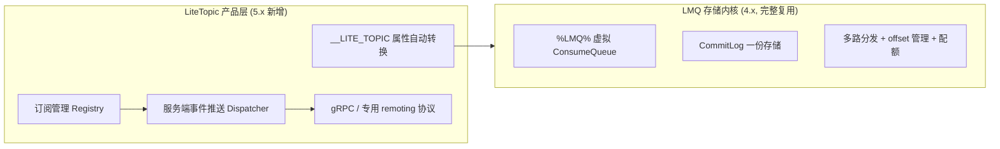

- **LMQ 是发动机**：解决"一份存储如何多路索引"的存储成本问题，但要求使用方手动操作内部属性，消费仍是拉模式，是半成品技术
- **LiteTopic 是装好方向盘和整车的成品**：面向 IoT / 事件通知等百万级轻量 Topic 场景，把 LMQ 内核包上完整产品外壳

最直接的代码证据——LiteTopic 发送路径上，Broker 把 `__LITE_TOPIC` 属性**翻译成 LMQ 名**（`SendMessageProcessor.java:284-289`）：

```java
String liteTopic = oriProps.get(MessageConst.PROPERTY_LITE_TOPIC);
if (StringUtils.isNotEmpty(liteTopic)) {
    String lmqName = LiteUtil.toLmqName(requestHeader.getTopic(), liteTopic);
    oriProps.put(MessageConst.PROPERTY_INNER_MULTI_DISPATCH, lmqName);  // ← 复用 4.x LMQ 多路分发
}
```

之后走的完全是 4.x LMQ 那条链路（多路 ConsumeQueue、配额、独立 offset 表）。

---

## 二、问题背景：为什么需要轻量队列

传统 Topic 的成本结构：

| 资源 | 每 Topic 开销 | 100 万 Topic 时 |
|------|-------------|----------------|
| NameServer 路由元数据 | ~几百字节 + 心跳广播 | 路由表膨胀、心跳风暴 |
| Broker TopicConfig | 内存 + 定期持久化 | 配置文件巨大 |
| ConsumeQueue 文件 | 每队列至少一个文件 + mmap | **文件句柄耗尽**（OS 上限） |
| 消费 offset | offsetTable 条目 | 内存膨胀 |
| Rebalance | 队列分配计算 | 客户端 CPU 飙升 |

典型场景：IoT 平台为每台设备建一个 Topic（百万级）、交易系统为每个订单/用户建事件通知队列。传统模型完全不可行。

**解法：消息只写一份（进父 Topic 的 CommitLog），为每个"逻辑队列"维护一个虚拟索引（LMQ），元数据惰性创建。** 这是 LMQ 与 LiteTopic 共同的基石。

---

## 三、LMQ 实现原理（4.x 存储内核）

### 3.1 常量与命名

```java
// common/src/main/java/org/apache/rocketmq/common/MixAll.java:112-114
public static final String LMQ_PREFIX = "%LMQ%";
public static final int LMQ_QUEUE_ID = 0;
public static final String LMQ_DISPATCH_SEPARATOR = ",";
```

- LMQ 名以 `%LMQ%` 为前缀，如 `%LMQ%order-12345`
- **所有 LMQ 固定使用 queueId=0**（逻辑队列单队列化）
- `MixAll.isLmq(topic)` 判断前缀

### 3.2 发送：手动指定多路分发

4.x 客户端直接设置内部属性：

```java
Message msg = new Message("parentTopic", body);
MessageAccessor.putProperty(msg, MessageConst.PROPERTY_INNER_MULTI_DISPATCH,
    "%LMQ%queueA;%LMQ%queueB");   // 一条消息同时进多个逻辑队列
producer.send(msg);
```

`Validators` 会校验该属性值不含路径分隔符（防目录穿越——LMQ 名会拼进 ConsumeQueue 文件路径）。

### 3.3 写入前：offset 预取（LmqDispatch.prepareLmqDispatch）

调用链：`CommitLog.java:2000`（asyncPutMessage 阶段）→ `LmqDispatch.prepareLmqDispatch()`：

```java
static String[] prepareLmqDispatch(MessageStore messageStore, MessageExtBrokerInner msg) {
    String[] queueNames = parseLmqQueueNames(msg);  // 解析 INNER_MULTI_DISPATCH
    StringBuilder queueOffsets = new StringBuilder();
    for (int i = 0; i < queueNames.length; i++) {
        if (i > 0) queueOffsets.append(MixAll.LMQ_DISPATCH_SEPARATOR);
        if (enableLmq && MixAll.isLmq(queueNames[i])) {
            queueOffsets.append(messageStore.getQueueStore()
                .getLmqQueueOffset(queueNames[i], MixAll.LMQ_QUEUE_ID));  // 取各 LMQ 当前 offset
        }
    }
    // 偏移量固化进消息属性——dispatch 阶段不再查表
    MessageAccessor.putProperty(msg, MessageConst.PROPERTY_INNER_MULTI_QUEUE_OFFSET, queueOffsets.toString());
    return queueNames;
}
```

**关键设计**：LMQ 的队列 offset 在**写 CommitLog 之前**就预取并固化到 `INNER_MULTI_QUEUE_OFFSET` 属性里。这样 ReputMessageService 异步构建 ConsumeQueue 时（可能滞后于写入），直接从消息属性读取逻辑 offset，避免 dispatch 阶段的并发查询与锁竞争。

### 3.4 构建索引：ConsumeQueue.multiDispatchLmqQueue

```java
// store/src/main/java/org/apache/rocketmq/store/ConsumeQueue.java:775-820
private void multiDispatchLmqQueue(DispatchRequest request, int maxRetries) {
    String[] queues = multiDispatchQueue.split(MixAll.LMQ_DISPATCH_SEPARATOR);      // INNER_MULTI_DISPATCH
    String[] queueOffsets = multiQueueOffset.split(MixAll.LMQ_DISPATCH_SEPARATOR); // 预取的 offset
    for (int i = 0; i < queues.length; i++) {
        String queueName = queues[i];
        long queueOffset = Long.parseLong(queueOffsets[i]);
        int queueId = request.getQueueId();
        if (MixAll.isLmq(queueName)) queueId = 0;   // LMQ 固定 queueId=0
        doDispatchLmqQueue(request, maxRetries, queueName, queueOffset, queueId);
    }
}

private void doDispatchLmqQueue(...) {
    ConsumeQueueInterface cq = this.messageStore.findConsumeQueue(queueName, queueId); // 惰性建虚拟 CQ
    ((ConsumeQueue) cq).putMessagePositionInfo(request.getCommitLogOffset(),
        request.getMsgSize(), request.getTagsCode(), queueOffset);  // 写 20B 标准条目
}
```

物理形态：

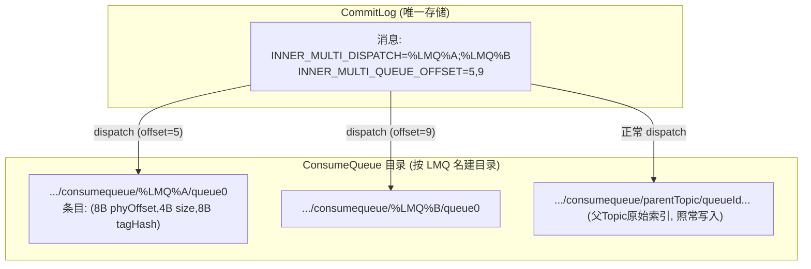

- 消息**只占一份 CommitLog 空间**；每个 LMQ 只是一个 20 字节/条 的索引文件
- 消费 LMQ 与消费普通 Topic 走 `DefaultMessageStore.getMessage()` 完全相同的路径：`findConsumeQueue(lmqName, 0)` → 读索引 → 从 CommitLog 取消息

### 3.5 惰性 TopicConfig

```java
// broker/src/main/java/org/apache/rocketmq/broker/topic/LmqTopicConfigManager.java
@Override
public TopicConfig selectTopicConfig(final String topic) {
    if (MixAll.isLmq(topic)) {
        // 惰性创建：无需预建 Topic，直接返回临时配置
        return new TopicConfig(topic, 1, 1, PermName.PERM_READ | PermName.PERM_WRITE);
    }
    return super.selectTopicConfig(topic);
}
```

BrokerController 启用 LMQ 时用 `LmqTopicConfigManager` 替代默认 Manager——LMQ 无需在 NameServer 注册路由（消费端按父 Topic 路由）。

### 3.6 独立 offset 管理

```java
// broker/src/main/java/org/apache/rocketmq/broker/offset/LmqConsumerOffsetManager.java
private ConcurrentHashMap<String, Long> lmqOffsetTable = new ConcurrentHashMap<>(512);

@Override
public long queryOffset(final String group, final String topic, final int queueId) {
    if (!MixAll.isLmq(group)) {
        return super.queryOffset(group, topic, queueId);   // 普通 topic 走原逻辑
    }
    String key = topic + TOPIC_GROUP_SEPARATOR + group;
    return lmqOffsetTable.getOrDefault(key, -1);
}
```

LMQ 的消费 offset 存在**独立的 `lmqOffsetTable`**（key 为 `lmqName@group`，单值——因为只有 queue 0），与普通 `offsetTable`（`topic@group -> {queueId -> offset}`）隔离，避免污染主表。支持 RocksDB 持久化（`RocksDBLmqConsumerOffsetManager`）。

### 3.7 配额保护

```java
// broker/src/main/java/org/apache/rocketmq/broker/util/HookUtils.java:155-177
public static PutMessageResult handleLmqQuota(BrokerController brokerController, MessageExtBrokerInner msg) {
    if (!brokerController.getMessageStoreConfig().isEnableLmqQuota() || !msg.needDispatchLMQ()) return null;
    String[] queueNames = msg.getProperty(PROPERTY_INNER_MULTI_DISPATCH).split(MixAll.LMQ_DISPATCH_SEPARATOR);
    for (String queueName : queueNames) {
        if (!MixAll.isLmq(queueName)) continue;
        if (cqStore.getLmqNum() >= maxLmqConsumeQueueNum    // 默认 20000
                && !cqStore.isLmqExist(queueName)) {
            return new PutMessageResult(PutMessageStatus.LMQ_CONSUME_QUEUE_NUM_EXCEEDED, null);
        }
    }
    return null;
}
```

注册在 PutMessageHook 链上（BrokerController:1030-1088 的 4 个 hook 之一：checkBeforePutMessage / innerBatchChecker / handleScheduleMessage / handleLmqQuota），**写 CommitLog 前拦截**，防止海量 LMQ 失控。已存在的 LMQ 不受新配额拒绝（幂等）。

### 3.8 LMQ 的固有缺陷（LiteTopic 的动机）

1. **手动拼内部属性**：`INNER_MULTI_DISPATCH` 是 `MessageConst` 内部属性，普通用户不该触碰
2. **纯拉模式**：百万 LMQ 下客户端无法逐一长轮询——每个 LMQ 一个订阅连接/轮询请求不现实
3. **无订阅管理**：Broker 不知道谁订阅了哪些 LMQ，无法做定向通知
4. **消费端 fan-out 灾难**：客户端要自己维护海量 LMQ 的 offset 与拉取调度
5. **命名裸露**：`%LMQ%` 名与业务模型无绑定，无通配/独占等订阅语义

---

## 四、LiteTopic 实现原理（5.x 产品层）

### 4.1 命名模型与转换（LiteUtil）

```java
// common/src/main/java/org/apache/rocketmq/common/lite/LiteUtil.java
public static String toLmqName(String parentTopic, String liteTopic)  // :40
// 格式: %LMQ%$parentTopic$liteTopic

public static boolean isLiteTopicQueue(String lmqName)  // :52
// 判断前缀 %LMQ%$ (LiteTopic 专用二级前缀, 区别于裸 LMQ)

public static String getParentTopic(String lmqName)     // :56
public static String getLiteTopic(String lmqName)       // :70
```

LiteTopic 的 LMQ 名带 **`$` 分隔符**（`%LMQ%$parent$lite`），比裸 LMQ（`%LMQ%xxx`）多了结构信息——父 Topic 与 liteTopic 名可以从名字反解析，这是通配符订阅、前缀索引、生命周期管理的基础。

### 4.2 发送端

**remoting 客户端**：设置消息属性 `__LITE_TOPIC`（`MessageConst.PROPERTY_LITE_TOPIC`，MessageConst.java:67）：

```java
Message msg = new Message("parentLiteTopic", body);
msg.putUserProperty("__LITE_TOPIC", "device-12345");  // 业务只关心 liteTopic 名
producer.send(msg);
```

**gRPC 客户端**（Proxy 转换后透传同一属性）。

**Broker 侧自动转换**（SendMessageProcessor.java:284-289，见第一章代码）：
`__LITE_TOPIC=device-12345` + 父 Topic `parentLiteTopic` → `INNER_MULTI_DISPATCH=%LMQ%$parentLiteTopic$device-12345` → 进入 LMQ 存储链路。

**类型标记**：`TopicMessageType.LITE`（解析顺序：TRANSACTION > DELAY > FIFO > PRIORITY > **LITE** > NORMAL，TopicMessageType.java:50-67）。消费端 `PopLiteMessageProcessor.preCheck:203` 强制校验父 Topic 必须为 LITE 类型。

### 4.3 组件全景（broker/lite 包）

| 类 | 行数 | 职责 |
|----|------|------|
| `LiteEventDispatcher` | 577 | 事件分发引擎（ServiceThread），核心 |
| `LiteSubscriptionRegistry(Impl)` | 60/513 | 订阅关系管理（clientId ↔ lmqSet 双向索引） |
| `AbstractLiteLifecycleManager` | 349 | LMQ 生命周期/offset 抽象 |
| `RocksDBLiteLifecycleManager` | 109 | RocksDB 持久化实现 |
| `LmqPrefixIndex` | 109 | PatriciaTrie 前缀索引（加速通配全量分发） |
| `LiteMetadataUtil` | 145 | 消费组属性读取（lite.* 配置） |
| `ExclusiveEvictionTombstones` | 93 | 独占模式驱逐墓碑 |
| `LiteSharding(Impl)` | 83 | 分片（多 Proxy 场景订阅切分） |

外围组件（不在 lite 包）：

| 类 | 位置 | 职责 |
|----|------|------|
| `PopLiteMessageProcessor` | broker/processor | 专用 POP_LITE_MESSAGE 请求处理 |
| `NotificationProcessor` | broker/processor | 轻量通知（无消息体的"有消息"信号） |
| `PopLiteLongPollingService` | processor 长轮询 | 按 clientId 维度的长轮询挂起 |
| `LiteManagerProcessor` | broker/processor | 订阅管理 RPC（syncLiteSubscription 底层） |
| `LiteConsumerLagCalculator` | broker/metrics | Lite 消费延迟指标（内部用 PriorityQueue/堆求 topK） |

### 4.4 生命周期管理（AbstractLiteLifecycleManager / RocksDB 实现）

- `onLmqCreate(lmqName)`：LMQ 第一条消息到达时登记（LiteEventDispatcher.dispatch:95-97，`offset==0` 时触发）——**前缀索引只在该 LMQ 首消息时维护一次，存量 LMQ 在启动时 init() 补齐**
- `isLmqExist` / `getMaxOffsetInQueue(lmqName)`：事件分发时查 LMQ 是否存在/最大 offset
- `forEachLiteTopicByParent(parentTopic, triple -> ...)`：遍历某父 Topic 下全部 LMQ（通配全量分发用）
- `isSubscriptionActive(topic, lmqName)`：订阅时过滤已不活跃的 LMQ
- 持久化：RocksDB（`RocksDBLiteLifecycleManager`），支撑百万级 LMQ 元数据

`LmqPrefixIndex`（PatriciaTrie + ReadWriteLock，:42-109）：所有 LMQ 名共享一棵 trie，同一父 Topic 的 LMQ 在 trie 中是**连续子树**，前缀查找只走该子树；注释标明读请求约为写请求的 10000 倍，读锁为主。

### 4.5 消费端交互（PopLiteMessageProcessor）

请求头 `PopLiteMessageRequestHeader`：`clientId` + `consumerGroup` + 父 `topic` + `maxMsgNum(≤32)` + `invisibleTime` + `pollTime`。

`preCheck`（:164-231）五重校验：

1. poll 超时率 / broker 可读权限
2. `maxMsgNum ≤ 32`
3. 父 Topic 存在且 `TopicMessageType == LITE`（:203）
4. 消费组存在且 `consumeEnable`
5. **`topic == subscriptionGroupConfig.getLiteBindTopic()`**（:224——消费组绑定唯一父 Topic，即 `lite.bind.topic` 属性，对应 issue #11087 的校验）

`popByClientId`（:246-285）核心循环：

```java
Iterator<String> iterator = liteEventDispatcher.getEventIterator(clientId); // 事件即 lmqName
while (total.get() < maxNum && iterator.hasNext()) {
    String lmqName = iterator.next();
    if (!processed.add(lmqName)) continue;                    // 请求内去重
    if (isExclusiveGroup && ...hasExclusiveEvictionTombstone(clientId, lmqName))
        continue;                                             // 独占模式墓碑拦截
    Pair<> pair = popLiteTopic(parentTopic, ..., lmqName, ...); // 逐 LMQ pop
    ...
}
```

`popLiteTopic`（:288+）内部：`KeyBuilder.buildPopLiteLockKey(group, lmqName)` 队列级锁 → FIFO 阻塞检查（`isFifoBlocked`，attemptId 顺序语义）→ `getPopOffset` → `getMessage`（复用存储层按 LMQ 名读虚拟 ConsumeQueue）→ 写 CheckPoint（invisibleTime 语义，超时 revive 重投，复用 Pop 重试体系）。

**单次请求可跨多个 LMQ 取消息**（:158-159 注释明确因此弃用 startOffset/msgOffset 单值字段，改用 orderCountInfo 复合串）。

无消息时挂到 `PopLiteLongPollingService`（按 clientId 维度，非按 topic+queueId）——这是百万 LMQ 可行化的关键：**客户端一条长轮询连接覆盖其全部订阅**。

---

## 五、LiteEventDispatcher 事件分发引擎（核心）

### 5.1 设计思想：事件预分配（pre-allocation）

百万 LMQ 不能靠客户端逐队列拉取，也不能靠 Broker 逐 LMQ 通知。方案：

> **Broker 把"某 LMQ 有新消息"这一事件投递到订阅了它的某个客户端的事件队列里；客户端长轮询醒来后按事件列表逐 LMQ 拉取。**

事件即 lmqName，去重后进入客户端事件队列。这是"服务端推送 + 客户端拉取"的混合模型。

### 5.2 核心数据结构（LiteEventDispatcher.java:63-68）

```java
protected final ConcurrentMap<String, ClientEventSet> clientEventMap;      // clientId -> 事件队列
protected final ConcurrentSkipListSet<FullDispatchRequest> fullDispatchSet; // 延迟全量分发(按时间排序)
protected final ConcurrentMap<String, Object> fullDispatchMap;              // 去重
private final Cache<String, Object> blacklist;  // Guava cache, 10s 过期
```

`ClientEventSet`（:422-501）双结构去重队列：

```java
protected class ClientEventSet {
    private final BlockingQueue<String> events;          // LinkedBlockingQueue, 硬上限 100_000
    private final ConcurrentMap<String, Object> map;     // 去重辅助
    private volatile int maxCapacityCache;               // 软容量缓存(可热更)
    // 软容量 = 消费组属性 lite.sub.client.max.event.cnt (默认400), TTL 缓存避免热路径查配置
    // offer: 软容量检查 + map 去重 + 队列入队
    // poll : 更新 lastAccessTime/lastConsumeTime + map 清除
    // maybeBlock(): 无事件超35s 或 有事件超10s 未消费 → 视为僵死客户端
    // isLowWaterMark(): 使用率 < 20%
}
```

软/硬双容量设计（:436-453 注释）：硬上限 10 万防 OOM，软容量走消费组属性**免重启热更**，TTL 缓存（`liteEventCapacityCacheTtlMs`）避免 offer 热路径查 SubscriptionGroupConfig。

### 5.3 事件触发点（谁调用 dispatch）

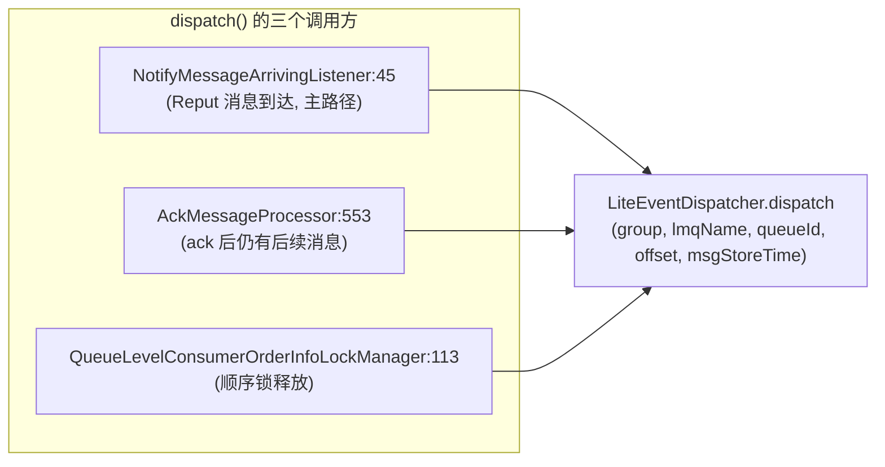

`NotifyMessageArrivingListener`（BrokerController:417 构造，注册进 DefaultMessageStore 的消息到达回调）：**CommitLog dispatch 出一条消息 → 若为 LiteTopic 队列（queueId==0 且前缀 `%LMQ%$`）→ 触发事件分发**。这是零额外开销的 hook 点——本来就要做 CQ dispatch 后的通知。

dispatch 入口（:89-99）：

```java
public void dispatch(String group, String lmqName, int queueId, long offset, long msgStoreTime) {
    if (queueId != 0 || !LiteUtil.isLiteTopicQueue(lmqName)) return;  // 只处理 LiteTopic
    if (offset == 0) {
        liteLifecycleManager.onLmqCreate(lmqName);  // LMQ 首消息: 登记生命周期/前缀索引
    }
    doDispatch(group, lmqName, null);
}
```

### 5.4 分发选择：selectAndDispatch（:117-159）

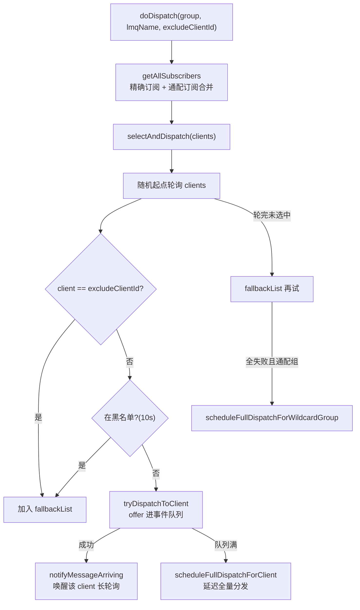

要点：

- **随机起点轮询**（:125 `random.nextInt(clients.size())`）实现组内多客户端负载均衡；单订阅者时直投
- **黑名单**（Guava cache，10s 过期）：僵死客户端短暂拉黑，避免反复 offer 失败
- **excludeClientId**：事件重投时避开刚被驱逐的原客户端（可能仍会 fallback 到它，:144-151）
- 通配组不进 fallback 二次遍历（:134 注释：防止大客户端集双重遍历）

### 5.5 全量分发（兜底机制）

事件预分配有丢失窗口（客户端刚订阅、事件队列满、僵死重投）。三条兜底路径：

1. **doFullDispatchForClient**（:195-235）：遍历该 client 订阅的 lmqSet，对 `isFullyConsumed`（consumerOffset ≥ maxOffset）为假的 LMQ 重新 offer。前置门槛：`maybeBlock()` 则再延迟；**高水位**（使用率 ≥ 20% 低水位线）则延迟（活跃消费中不额外加随机退避，否则 +0~15s 随机）
2. **doFullDispatchForWildcardGroup**（:261-285）：通配组全量分发，靠 `liteLifecycleManager.forEachLiteTopicByParent` + `LmqPrefixIndex` 前缀 trie 遍历父 Topic 下全部 LMQ——**重操作**，靠 trie 子树剪枝
3. **scan()**（:368-411，ServiceThread 每 `liteEventCheckInterval` 执行）：
   - 清理 `maybeBlock()` 的僵死客户端：移除事件队列 + 拉黑 + **事件重投**（doDispatch 排除自己）
   - 处理到期的 FullDispatchRequest（ConcurrentSkipListSet 按 timestamp 排序，`fullDispatchMap` 防重复调度）

### 5.6 订阅生命周期回调（LiteCtlListenerImpl :503-531）

- `onRegister`：新客户端订阅某 LMQ → 立即 doDispatch（补发存量消息事件）；通配组 → 5s 后全量分发
- `onRemoveAll`：客户端断连 → 移除事件队列 + 事件重投给组内其他客户端

---

## 六、订阅模型：LiteSubscriptionRegistry

### 6.1 数据结构（LiteSubscriptionRegistryImpl.java:55-65）

```java
protected final ConcurrentMap<String/*clientId*/, LiteSubscription> client2Subscription;
protected final ConcurrentMap<String/*lmqName*/, Set<ClientGroup>> liteTopic2ClientGroup; // 反向索引
protected final ConcurrentMap<String/*topic*/, Set<String/*group*/>> wildcardGroupMap;    // topic->通配组
private final Cache<String/*group*/, List<ClientGroup>> wildcardClientCache;              // 30s 缓存
private final ExclusiveEvictionTombstones exclusiveEvictionTombstones;
protected final AtomicInteger activeNum; // 活跃订阅引用计数(配额用)
```

双向索引：clientId → LiteSubscription（lmqSet），lmqName → 订阅客户端集。`getAllSubscribers(group, lmqName)`（:204-215）合并**精确订阅**与**通配订阅**两个来源。

### 6.2 订阅 API 与语义

| 方法 | 语义 |
|------|------|
| `addPartialSubscription`（:83） | 增量订阅一组 lmq；配额检查（`maxLiteSubscriptionCount`）；独占组先驱逐已有订阅者 |
| `removePartialSubscription`（:117） | 增量退订；按 `lite.sub.reset.offset.unsubscribe` 决定是否重置 offset |
| `addCompleteSubscription`（:128） | 全量对齐（diff 出 removals 再幂等加）；通配组走特殊分支 |
| `removeCompleteSubscription`（:171） | 客户端下线清理；触发 `onRemoveAll` 回调 |

### 6.3 订阅模式（消费组属性驱动，LiteMetadataUtil 读取）

| 属性 | 取值 | 语义 |
|------|------|------|
| `lite.sub.model` | Shared（默认）/ **Exclusive** | 共享消费 / 每 LMQ 独占一个客户端 |
| `lite.sub.wildcard` | 前缀串 | 通配订阅：订阅该父 Topic 下匹配前缀的全部 LMQ |
| `lite.bind.topic` | topic 名 | 消费组绑定的唯一父 Topic（#11087 校验） |
| `lite.sub.client.quota` | 默认 2000 | 单客户端订阅 LMQ 数上限 |
| `lite.sub.client.max.event.cnt` | 默认 400 | 客户端事件队列软容量 |
| `lite.sub.reset.offset.exclusive/unsubscribe` | bool | 订阅/退订时 offset 重置语义 |

**独占模式的驱逐墓碑**（ExclusiveEvictionTombstones）：新客户端订阅已被占的 LMQ 时（:104-110 `excludeClientByLmqName`），原客户端被驱逐并打上墓碑——其后续 `popLiteTopic` 被拦截（PopLiteMessageProcessor:264-267），防止驱逐通知丢失后旧客户端继续消费。若旧客户端重新主动订阅则清除自己的墓碑（:109），complete 订阅对账时发现残留墓碑会**重发 unsubscribe 通知**驱动收敛（:158-164）。

**通配订阅**：`mockLmqNameForWildcardGroup(topic, group)` 构造虚拟 LMQ 名承载通配组的客户端集；通配组**禁止 partial 订阅**（:90-92）。通配组的事件分发靠"消息到达时 getAllSubscribers 合并 + 周期性全量分发（trie 前缀遍历）"双保险。

### 6.4 Proxy 侧

gRPC `syncLiteSubscription`（GrpcMessagingApplication.java:404）→ LiteSubscriptionService → 上述 Registry。订阅信息**只存 Broker 内存 + 事件队列**，客户端断连即清理（Lite 订阅是连接级会话，非持久订阅）。`LiteSharding` 支持多 Proxy 部署时订阅分片，避免每个 Proxy 都承载全量订阅。

---

## 七、端到端工作流程与时序图

### 7.1 发送 + 事件分发 + 消费（主链路）

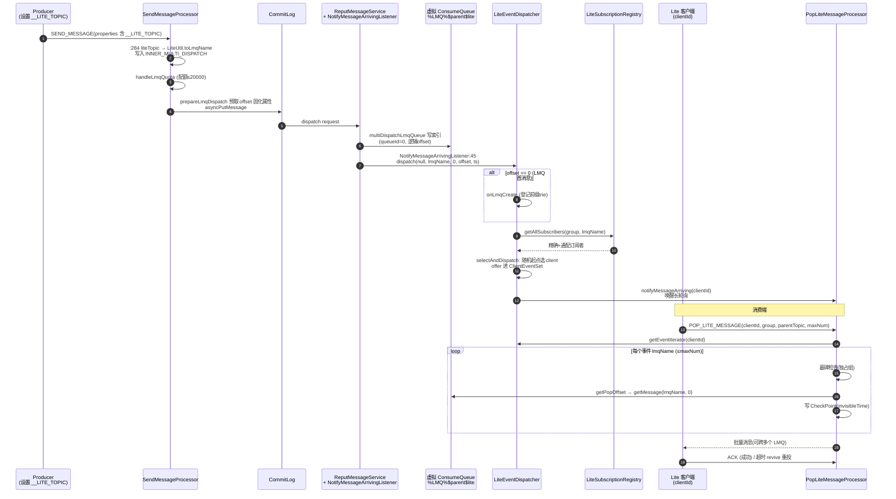

### 7.2 无消息时的长轮询

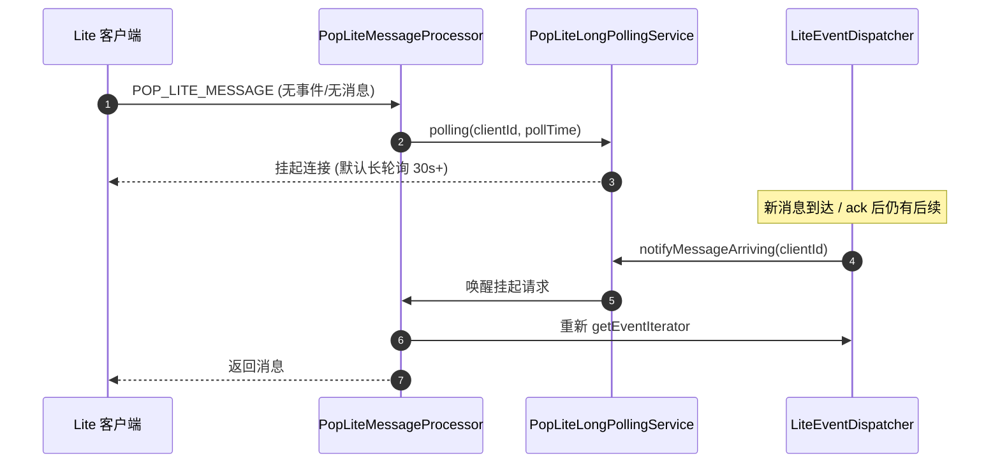

### 7.3 异常兜底：僵死客户端与事件重投

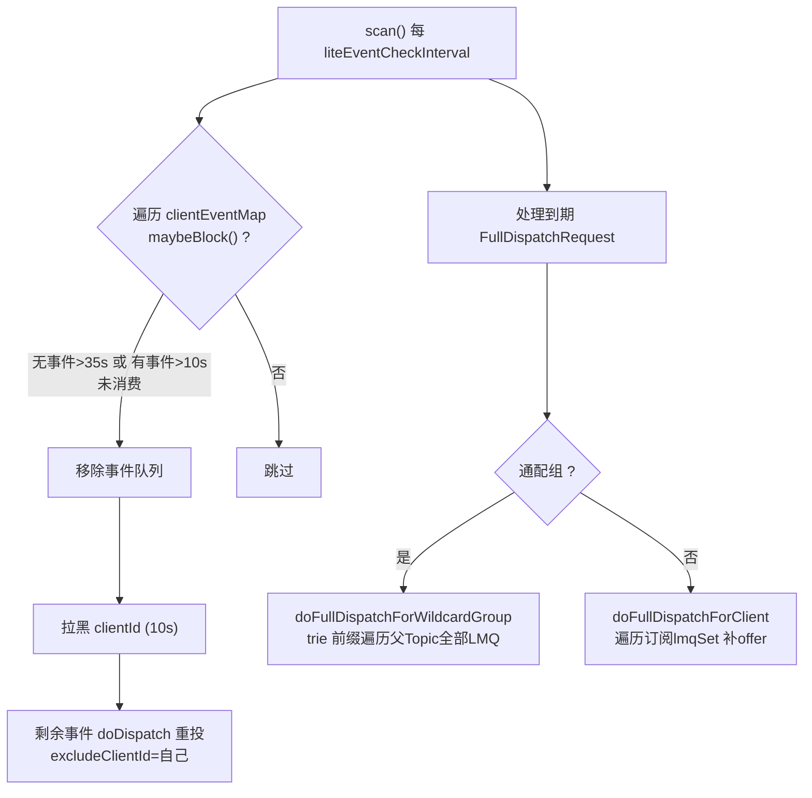

### 7.4 LMQ(4.x 原生)与 LiteTopic 工作流对比

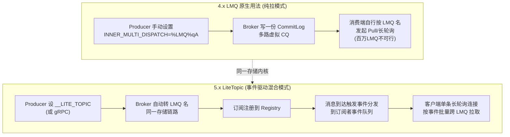

---

## 八、整体架构图

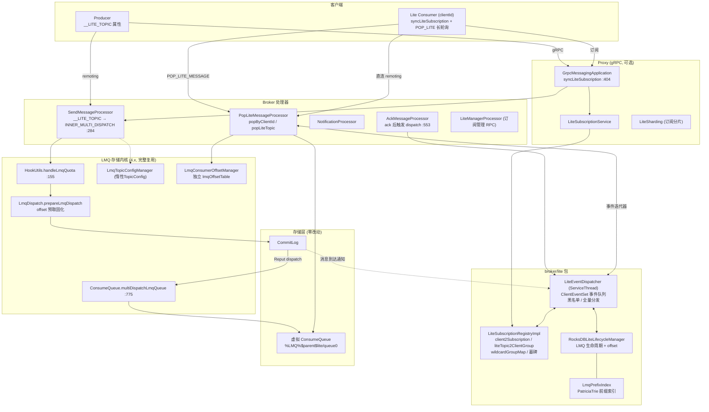

---

## 九、关系与区别（全景对比）

### 9.1 分层关系

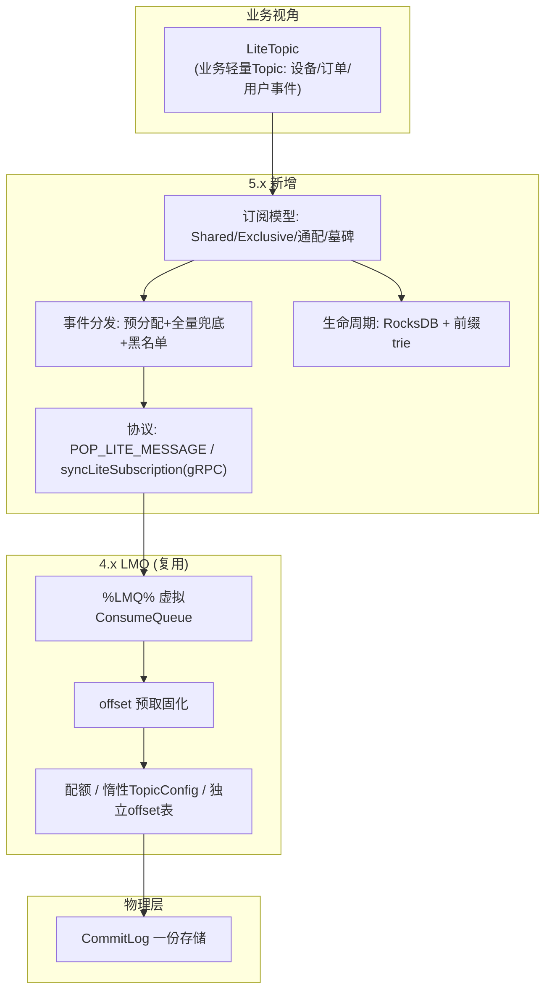

### 9.2 详细对比表

| 维度 | 4.x LMQ | 5.x LiteTopic |
|------|---------|---------------|
| **定位** | 存储层技术（手动多播） | 产品化特性（海量轻量 Topic） |
| **命名** | `%LMQ%xxx`（裸名） | `%LMQ%$parent$lite`（结构化，可反解析） |
| **使用方式** | 手动设 `INNER_MULTI_DISPATCH` 内部属性 | 设 `__LITE_TOPIC` 业务属性 / gRPC |
| **转换** | 无 | Broker 自动转 LMQ 名（SendMessageProcessor:284-289） |
| **Topic 类型** | 无标记 | `TopicMessageType.LITE`（消费端强制校验） |
| **消费模式** | 普通 Pull/Push 按名消费 | **事件驱动**：长轮询 + 事件队列 + 批量跨 LMQ 拉取 |
| **订阅管理** | 无 | Registry 双向索引 / Shared / Exclusive(墓碑) / 通配 |
| **offset 管理** | 独立 lmqOffsetTable | 复用 + Pop CheckPoint（invisibleTime 语义） |
| **失败重试** | 无（offset 提交语义） | 复用 Pop revive 体系（超时重投） |
| **连接成本** | 每 LMQ 一次拉取请求 | 单客户端一条长轮询连接覆盖全部订阅 |
| **服务端推送** | 无 | LiteEventDispatcher 预分配 + 通知唤醒 |
| **协议** | 仅 remoting | remoting(POP_LITE) + gRPC(syncLiteSubscription) |
| **保护机制** | LMQ 数量配额(20000) | + 订阅数配额 + 事件队列软容量 + 客户端配额 + 分片 |
| **元数据持久化** | 无（内存） | RocksDB 生命周期 + 前缀 trie |
| **典型场景** | 定制化多播 | IoT/事件通知百万级 Topic |

### 9.3 演进路线总结

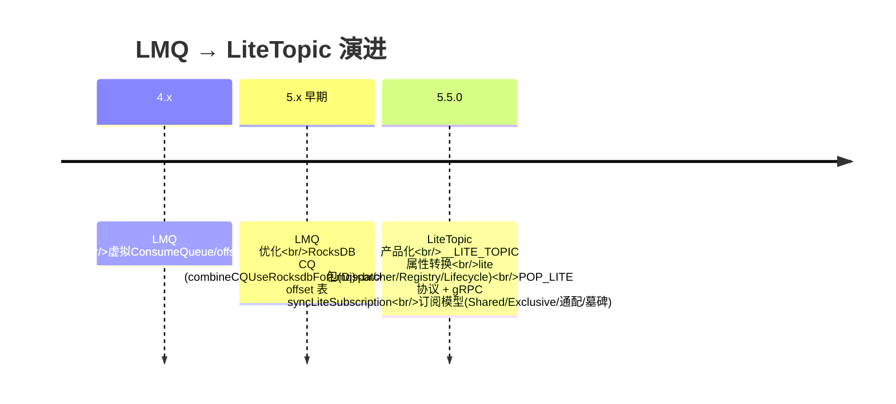

`combineCQUseRocksdbForLmq`（MessageStoreConfig:502，默认 false）是中间态演进：LMQ 索引走 RocksDB ConsumeQueue（海量小文件 → KV），这直接为 LiteTopic 的百万级 LMQ 铺平了存储道路。

---

## 十、配置项汇总

### BrokerConfig（lite 前缀）

| 配置 | 默认 | 作用 |
|------|------|------|
| `maxLiteSubscriptionCount` | — | 全局活跃订阅引用数上限（addPartialSubscription:86 配额） |
| `liteEventCheckInterval` | — | Dispatcher scan 周期（僵死清理/全量分发） |
| `liteEventFullDispatchDelayTime` | — | 队列满后全量分发基础延迟（+黑名单随机 0~15s） |
| `liteEventFullDispatchDelayTimeForWildcardGroup` | — | 通配组全量分发延迟 |
| `liteEventCapacityCacheTtlMs` | — | 事件队列软容量缓存 TTL |

### MessageStoreConfig（LMQ）

| 配置 | 默认 | 作用 |
|------|------|------|
| `enableLmq` | — | LMQ 总开关 |
| `enableLmqQuota` | — | 配额检查开关 |
| `maxLmqConsumeQueueNum` | 20000 | LMQ 数量上限 |
| `combineCQUseRocksdbForLmq` | false | LMQ 索引走 RocksDB CQ |

### SubscriptionGroupAttributes（消费组属性，可动态改）

| 属性 | 默认 | 作用 |
|------|------|------|
| `lite.bind.topic` | — | 绑定唯一父 Topic（#11087 校验） |
| `lite.sub.model` | Shared | Shared / Exclusive |
| `lite.sub.wildcard` | — | 通配订阅前缀 |
| `lite.sub.client.quota` | 2000 | 单客户端订阅 LMQ 上限 |
| `lite.sub.client.max.event.cnt` | 400 | 客户端事件队列软容量 |
| `lite.sub.reset.offset.exclusive` | false | 订阅时是否独占重置 offset |
| `lite.sub.reset.offset.unsubscribe` | false | 退订时是否重置 offset |

### ProxyConfig

| 配置 | 默认 | 作用 |
|------|------|------|
| `maxLiteTopicSize` | 64 | 单连接最大 LiteTopic 订阅数 |
| `maxSyncLiteSubscriptionRate` | 5000 | 订阅同步请求速率上限 |

---

## 十一、设计权衡与源码走读要点

### 11.1 为什么 offset 要在写入前预取固化

Reput dispatch 是异步的，且多 LMQ 并发递增 offset 若在 dispatch 阶段查表需要每 LMQ 一把锁。预取进消息属性后：dispatch 无锁（读属性）、崩溃恢复可重放（属性随消息持久）。代价：LMQ offset 的**单调性依赖 CommitLog 写入顺序**，由 CommitLog 的全局写锁天然保证。

### 11.2 事件模型 vs 直接推送消息

为什么不直接把消息推给客户端？事件队列只存 **lmqName（去重后的字符串）**：

- 事件天然幂等可去重（ClientEventSet 双结构）
- 客户端按自身节奏拉取（流量自适应，慢消费者不会被压垮）
- Broker 无需为每个客户端缓存消息体

代价是"预分配可能失效"（客户端消费完/僵死），因此需要 scan 重投 + 全量分发双兜底——这是整个 Dispatcher 一半代码都在处理的场景。

### 11.3 长轮询维度的变化

| 组件 | 挂起 key | 唤醒粒度 |
|------|---------|---------|
| PullRequestHoldService | topic+queueId | 队列级 |
| PopLongPollingService | topic+group(+queueId) | 组级 |
| **PopLiteLongPollingService** | **clientId** | 客户端级（覆盖其全部 LMQ 订阅） |

clientId 维度是百万 LMQ 下连接成本 O(1) 的关键。

### 11.4 公平性与防饿死

- 组内多客户端：随机起点轮询分发
- 僵死客户端：黑名单 10s + 事件重投
- 事件队列满：延迟全量分发（低水位 <20% 才触发，活跃消费不加随机延迟、僵死倾向 +0~15s 抖动，避免惊群）
- 通配组重路径：trie 子树遍历 + 30s 客户端缓存 + 周期兜底而非逐消息触发

### 11.5 一致性细节（走读时值得注意的坑）

1. `ClientEventSet.offer` 注释（:455）明确与 `poll` 存在竞态但无副作用——软容量判断非精确
2. `dispatch(group=null)`（消息到达路径）会分发给**所有组**的订阅者；ack 路径（AckMessageProcessor:553）带具体 group 只通知该组
3. 独占模式墓碑依赖 `notifyUnsubscribeLite` 通知送达，complete 订阅对账时通过残留墓碑**重发通知**驱动最终一致（RegistryImpl:158-164）
4. Lite 订阅是**连接级会话**：断连即清理（onRemoveAll），非持久订阅——与 4.x LMQ 的"按名消费"语义完全不同
5. 单次 POP_LITE 请求 maxNum ≤ 32（preCheck:181 硬校验），事件迭代器未消费完的事件留给下次请求

### 11.6 测试索引

| 测试 | 验证点 |
|------|--------|
| `broker/lite/LiteEventDispatcherTest` | dispatch 门槛 / 选择分发 / 事件队列满 / 僵死清理 |
| `broker/lite/LiteSubscriptionRegistryImplTest` | 订阅增删 / 通配 / 墓碑 / 配额 |
| `broker/processor/PopLiteMessageProcessorTest` | popByClientId 去重 / 墓碑拦截 / 长轮询 |
| `broker/processor/LiteManagerProcessorTest` | 订阅管理 RPC |
| `store/.../LmqDispatchTest` | offset 预取 |
| `broker/offset/LmqConsumerOffsetManagerTest` / `RocksDBLmqConsumerOffsetManagerTest` | 独立 offset 表 |
| `broker/lite/LmqPrefixIndexTest` | trie 前缀索引 |

---

## 附录：关键源码索引

| 文件 | 行号 | 内容 |
|------|------|------|
| `common/.../MixAll.java` | 112-114 | LMQ_PREFIX / LMQ_QUEUE_ID / SEPARATOR |
| `common/.../message/MessageConst.java` | 47, 67 | PROPERTY_PRIORITY / **PROPERTY_LITE_TOPIC** |
| `common/.../lite/LiteUtil.java` | 40-70 | toLmqName / 前缀判断 / 反解析 |
| `common/.../attribute/TopicMessageType.java` | 63-64 | LITE 类型解析 |
| `common/.../SubscriptionGroupAttributes.java` | 42-94 | 全部 lite.* 消费组属性 |
| `broker/.../processor/SendMessageProcessor.java` | 284-289 | __LITE_TOPIC → INNER_MULTI_DISPATCH |
| `broker/.../util/HookUtils.java` | 155-177 | handleLmqQuota 配额 |
| `store/.../CommitLog.java` | 2000 | prepareLmqDispatch 调用点 |
| `store/.../ConsumeQueue.java` | 775-820 | multiDispatchLmqQueue 多路索引 |
| `store/.../config/MessageStoreConfig.java` | 502 | combineCQUseRocksdbForLmq |
| `broker/.../topic/LmqTopicConfigManager.java` | — | 惰性 TopicConfig |
| `broker/.../offset/LmqConsumerOffsetManager.java` | — | 独立 lmqOffsetTable |
| `broker/.../lite/LiteEventDispatcher.java` | 89/117/167/195/261/349/422 | dispatch / selectAndDispatch / tryDispatch / fullDispatch / scan / ClientEventSet |
| `broker/.../lite/LiteSubscriptionRegistryImpl.java` | 55-57, 83-187, 204-215 | 双向索引 / 订阅 API / getAllSubscribers |
| `broker/.../lite/RocksDBLiteLifecycleManager.java` | — | 生命周期持久化 |
| `broker/.../lite/LmqPrefixIndex.java` | 42-97 | PatriciaTrie 前缀索引 |
| `broker/.../processor/PopLiteMessageProcessor.java` | 100-162, 164-231, 246-299 | processRequest / preCheck / popByClientId |
| `broker/.../longpolling/NotifyMessageArrivingListener.java` | 45 | 消息到达触发 dispatch |
| `broker/.../processor/AckMessageProcessor.java` | 553 | ack 触发 dispatch |
| `broker/.../BrokerController.java` | 403-417, 1157, 1954 | lite 组件装配 |
| `proxy/.../grpc/v2/GrpcMessagingApplication.java` | 404 | syncLiteSubscription RPC |
